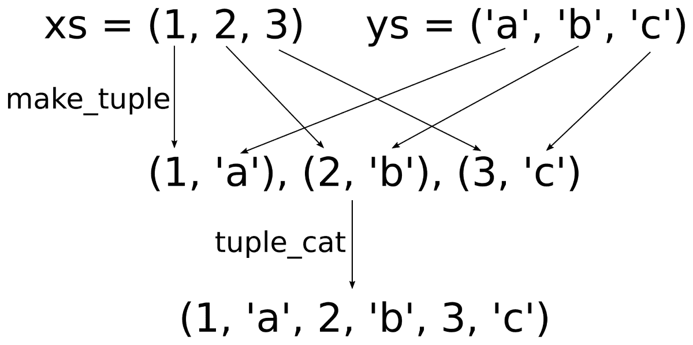
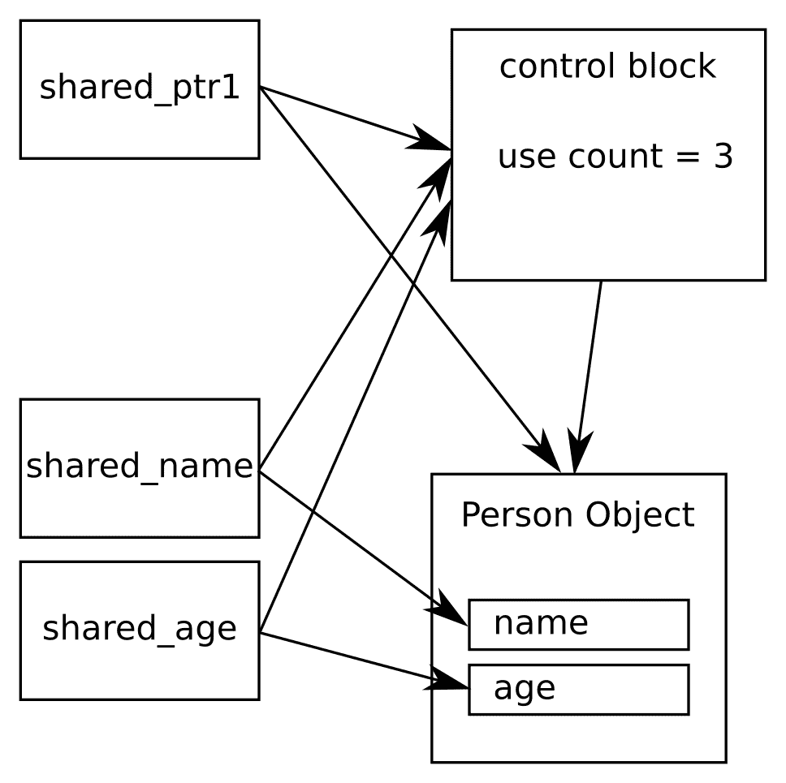
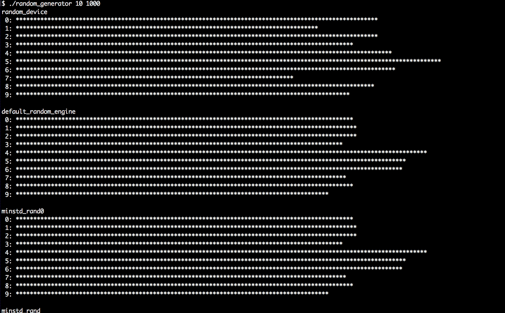
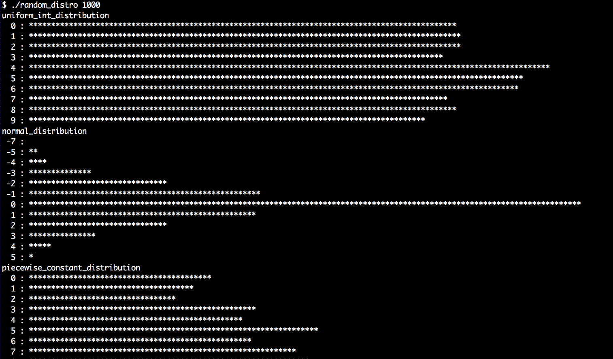

# 实用程序类

在本章中，我们将介绍以下食谱:

*   使用`std::ratio`在不同时间单位之间转换
*   用`std::chrono`在绝对时间和相对时间之间转换
*   用`std::optional`安全地发出故障信号
*   对元组应用函数
*   用`std::tuple`快速组成数据结构
*   用`std::any`代替`void*`更安全
*   用`std::variant`存储不同类型
*   用`std::unique_ptr`自动处理资源
*   通过`std::shared_ptr`自动处理共享堆内存
*   处理指向共享对象的弱指针
*   使用智能指针简化遗留 API 的资源处理
*   共享同一对象的不同成员值
*   生成随机数并选择合适的随机数引擎
*   生成随机数并让 STL 形成特定的分布

# 介绍

本章专门介绍对解决非常具体的任务非常有用的实用程序类。其中一些确实非常有用，以至于我们将来很可能会在任何 C++程序片段中经常看到它们，或者至少已经看到它们散布在本书的所有其他章节中。

前两个食谱是关于测量和获取*时间*。我们还将看到如何在不同的时间单位之间转换，以及如何在时间点之间跳转。

然后，我们将看一下`optional`、`variant`和`any`类型(都是 C++14 和 C++17 附带的)以及另外五个食谱中的一些`tuple`技巧。

自 C++11 以来，我们还获得了复杂的智能指针类型，即`unique_ptr`、`shared_ptr`和`weak_ptr`，它们在*内存管理*方面提供了非常有效的帮助，这就是为什么我们将在五个食谱中专门介绍它们。

最后，我们将看到关于生成*随机数*的 STL 库部分的全景。除了学习 STL 随机引擎最重要的特性，我们还将学习如何将整形应用于随机数，以获得符合我们实际需求的分布。

# 使用标准::比率在不同时间单位之间转换

自从 C++11 以来，STL 包含了一些新的类型和功能，用于获取、测量和显示时间。库的这一部分存在于`std::chrono`命名空间中，并且有一些复杂的细节。

在本食谱中，我们将集中于测量时间跨度以及如何在单位之间转换测量结果，例如秒、毫秒和微秒。STL 提供了工具，使我们能够定义自己的时间单位，并在它们之间无缝转换。

# 怎么做...

在这一部分，我们将编写一个小的*游戏*，提示用户输入一个特定的单词。用户需要在键盘上输入该单词的时间以多个时间单位进行测量和显示:

1.  首先，我们需要包含所有必要的标题。为了方便起见，我们声明我们默认使用`std`命名空间:

```cpp
      #include <iostream>
      #include <chrono>
      #include <ratio>
      #include <cmath>
      #include <iomanip>
      #include <optional>      

      using namespace std;
```

2.  `chrono::duration`作为持续时间的类型，通常指秒的倍数或分数。所有的 STL 持续时间单位指的是整数类型的持续时间专门化。在这个食谱中，我们将专攻`double`。在接下来的食谱中，我们将更加关注已经内置到 STL 中的现有时间单位定义:

```cpp
      using seconds = chrono::duration<double>;
```

3.  一毫秒是一秒的一小部分，所以我们用秒来定义这个单位。`ratio_multiply`模板参数将 STL 预定义的`milli`因子应用于`seconds::period`，这给了我们想要的分数。`ratio_multiply`模板基本上是倍率的元编程功能:

```cpp
      using milliseconds = chrono::duration<
          double, ratio_multiply<seconds::period, milli>>;
```

4.  微秒也是如此。一毫秒是一秒的分数，一微秒是一秒的分数:

```cpp
      using microseconds = chrono::duration<
          double, ratio_multiply<seconds::period, micro>>;
```

5.  现在我们将实现一个函数，该函数从用户输入中读取一个字符串，并测量用户键入输入花费的时间。它不接受任何参数，并向我们返回用户输入字符串以及经过的时间，捆绑成一对:

```cpp
      static pair<string, seconds> get_input()
      {
          string s;
```

6.  我们需要从用户输入发生期间的开始和之后开始计算时间。拍摄时间快照如下所示:

```cpp
          const auto tic (chrono::steady_clock::now());
```

7.  用户输入的实际捕获现在发生了。如果我们没有成功，我们只返回一个默认初始化的元组。呼叫者将看到他得到了一个空的输入字符串:

```cpp
          if (!(cin >> s)) {
              return {{}, {}};
          }
```

8.  在成功的情况下，我们继续拍摄另一个时间快照。然后我们返回输入字符串和两个时间点之间的差值。请注意，两者都是绝对时间点，但通过计算差异，我们得到一个持续时间:

```cpp
          const auto toc (chrono::steady_clock::now());

          return {s, toc - tic};
      }
```

9.  现在让我们实现实际的程序。我们循环直到用户正确输入输入字符串。在每个循环步骤中，我们要求用户输入字符串`"C++17"`，然后调用我们的`get_input`函数:

```cpp
      int main()
      {
          while (true) {
              cout << "Please type the word "C++17" as"
                      " fast as you can.n> ";

              const auto [user_input, diff] = get_input();
```

10.  然后我们检查输入。如果输入为空，我们将其解释为退出整个程序的请求:

```cpp
              if (user_input == "") { break; }
```

11.  如果用户正确输入`"C++17"`，我们表示祝贺，然后打印用户正确输入单词所需的时间。`diff.count()`方法以浮点数的形式返回秒数。如果我们使用原始的 STL `seconds`持续时间类型，那么我们会得到一个*舍入的*整数值，而不是分数。在调用`count()`之前，通过向毫秒或微秒`constructor`提供我们的`diff`变量，我们可以将相同的值转换为不同的单位:

```cpp
              if (user_input == "C++17") {
                  cout << "Bravo. You did it in:n" 
                       << fixed << setprecision(2)
                       << setw(12) << diff.count() 
                       << " seconds.n"
                       << setw(12) << milliseconds(diff).count()
                       << " milliseconds.n"
                       << setw(12) << microseconds(diff).count()
                       << " microseconds.n";
                  break;
```

12.  如果用户在输入中有错别字，我们让他再试一次:

```cpp
              } else {
                  cout << "Sorry, your input does not match."
                          " You may try again.n";
              }
          }
      }
```

13.  编译和运行程序会产生以下输出。一开始，程序会因为一个错别字，反复要求输入正确的单词。正确键入单词后，它会显示我们用三种不同的时间单位键入单词所需的时间:

```cpp
      $ ./ratio_conversion 
      Please type the word "C++17" as fast as you can.
      > c+17
      Sorry, your input does not match. You may try again.
      Please type the word "C++17" as fast as you can.
      > C++17
      Bravo. You did it in:
              1.48 seconds.
           1480.10 milliseconds.
        1480099.00 microseconds.
```

# 它是如何工作的...

虽然这一部分是关于不同时间单位之间的转换，但我们首先必须从三个可用的时钟对象中选择一个。在`std::chrono`命名空间中，一般有`system_clock`、`steady_clock`和`high_resolution_clock`之间的选择。它们之间有什么区别？让我们仔细看看:

| **时钟** | **特征** |
| `system_clock` | 这代表全系统实时的*墙*时钟。如果我们想获得当地时间，这是正确的选择。 |
| `steady_clock` | 这个时钟保证是*单调的*。这意味着它永远不会倒退任何时间。当其他时钟的时间被最小限度地校正时，或者甚至当时间在冬季和夏季之间切换时，这种情况也可能发生。 |
| `high_resolution_clock` | 这是 STL 实现能够提供的最细粒度时钟周期的时钟。 |

由于我们测量了从一个绝对时间点到另一个绝对时间点的时间距离或持续时间(我们在变量`tic`和`toc`中捕捉到的)，我们对这些时间点是否是全局偏斜的不感兴趣。即使时钟晚了或提前了 112 年 5 小时 10 分钟 1 秒(或其他)，这也不会影响它们之间的*差异。唯一重要的是，在我们保存时间点`tic`之后和保存时间点`toc`之前，不得对时钟进行微调(这种情况在许多系统中时有发生)，因为这会扭曲我们的测量。对于这些要求，`steady_clock`是最优选择。它的实现可以基于处理器的时间戳计数器，自系统启动以来，该计数器总是单调递增。*

好了，现在有了正确的时间对象选择，我们可以通过`chrono::steady_clock::now()`节省时间点。`now`函数返回一个`chrono::time_point<chrono::steady_clock>`类型的值。两个这样的值之间的差异(如在`toc - tic`中)是*时间跨度*，或`chrono::duration`类型的*持续时间*。因为这是这个部分的中心类型，所以现在有点复杂了。让我们仔细看看`duration`的模板类型界面:

```cpp
template<
    class Rep, 
    class Period = std::ratio<1> 
> class duration;
```

我们可以改变的参数叫做`Rep`和`Period`。`Rep`很容易解释:这只是用来保存时间值的数值变量类型。对于现有的 STL 时间单位，这通常是`long long int`。在这个食谱中，我们选择了`double`。由于我们的选择，我们可以默认以秒为单位保存时间值，然后将其转换为毫秒或微秒。如果我们在`chrono::seconds`类型中保存`1.2345`秒的持续时间，那么它将被舍入到一整秒。这样，我们将不得不节省`chrono::microseconds`中`tic`和`toc`之间的时间差，然后可以转换成更细粒度的单元。通过我们对`Rep`的`double`选择，我们可以上下转换，并且只损失最小的精度，在这个例子中这并没有坏处。

我们将`Rep = double`用于所有时间单位，因此它们仅在`Period`参数的选择上有所不同:

```cpp
using seconds      = chrono::duration<double>;
using milliseconds = chrono::duration<double, 
 ratio_multiply<seconds::period, milli>>;
using microseconds = chrono::duration<double, 
 ratio_multiply<seconds::period, micro>>;
```

虽然`seconds`是最简单的描述单位，因为它和`Period = ratio<1>`一起工作，其他的都要调整。由于一毫秒是千分之一秒，我们将`seconds::period`(这只是对`Period`参数的一个 getter 函数)与`milli`相乘，后者是`std::ratio<1, 1000>`的类型别名(`std::ratio<a, b>`代表小数值`a/b`)。`ratio_multiply`类型基本上是一个*编译时函数*，它代表一个比率类型与另一个比率类型相乘得到的类型。

可能这听起来太复杂了，我们来看一个例子:`ratio_multiply<ratio<2, 3>, ratio<4, 5>>`结果在`ratio<8, 15>`因为`(2/3) * (4/5) = 8/15`。

我们得到的类型定义相当于以下定义:

```cpp
using seconds      = chrono::duration<double, ratio<1, 1>>;
using milliseconds = chrono::duration<double, ratio<1, 1000>>;
using microseconds = chrono::duration<double, ratio<1, 1000000>>;
```

将这些类型排列在一起，很容易在它们之间转换。如果我们有一个`seconds`类型的持续时间`d`，我们可以通过另一个类型的构造函数，也就是`milliseconds(d)`，把它转换成`milliseconds`。

# 还有更多...

在其他教程或书籍中，每当转换持续时间时，您可能会遇到`duration_cast`。例如，如果我们有一个类型为`chrono::milliseconds`的持续时间值，并且想要将其转换为`chrono::hours`，我们确实需要编写`duration_cast<chrono::hours>(milliseconds_value)`，因为这些单位依赖于*整数*类型。从细粒度单元转换到不太细粒度的单元会导致*精度损失*在这种情况下，这就是为什么我们需要一个`duration_cast`。对于基于`double`或`float`的持续时间单位，这是不需要的。

# 使用 std::chrono 在绝对时间和相对时间之间转换

直到 C++11，取挂钟时间*只是打印*还是挺麻烦的，因为 C++没有自己的时间库。总是有必要调用 C 库的函数，这看起来很过时，因为这种调用可以很好地封装到它们自己的类中。

从 C++11 开始，STL 提供了`chrono`库，这使得与时间相关的任务更容易实现。

在这个食谱中，我们将采用当地时间，打印出来，并通过添加不同的时间偏移来玩，这是一件非常舒适的事情。

# 怎么做...

我们将保存当前时间并打印它。此外，我们的程序将为保存的时间点添加不同的偏移量，并打印结果时间点:

1.  典型的包含线优先；然后，我们声明我们默认使用`std`命名空间:

```cpp
      #include <iostream>
      #include <iomanip>
      #include <chrono>      

      using namespace std;
```

2.  我们将打印绝对时间点。这些将以`chrono::time_point`类型模板的形式出现，所以我们将为它重载输出流操作符。打印时间点的日期和/或时间部分有不同的方法。我们将只使用`%c`标准格式。当然，我们也可以只打印时间，只打印日期，只打印年份，或者我们想到的任何东西。在我们最终应用`put_time`之前，不同类型之间的所有转换看起来有点笨拙，但是我们只做了一次:

```cpp
      ostream& operator<<(ostream &os, 
                    const chrono::time_point<chrono::system_clock> &t)
      {
          const auto tt   (chrono::system_clock::to_time_t(t));
          const auto loct (std::localtime(&tt));
          return os << put_time(loct, "%c");
      }
```

3.  `seconds`、`minutes`、`hours`等已经有了 STL 类型定义。我们现在添加`days`类型。这很容易；我们只需要通过引用`hours`来专门化`chrono::duration`模板并与`24`相乘，因为一整天有 24 个小时:

```cpp
      using days = chrono::duration<
          chrono::hours::rep,
          ratio_multiply<chrono::hours::period, ratio<24>>>;
```

4.  为了能够以最优雅的方式用天数的倍数来表示持续时间，我们可以定义自己的`days`文字运算符。现在，我们可以写`3_days`来构造一个代表三天的值:

```cpp
      constexpr days operator ""_days(unsigned long long h)
      {
          return days{h};
      }
```

5.  在实际的程序中，我们将拍摄一个时间快照，然后简单地打印出来。这是非常容易和舒适的，因为我们已经为此实现了正确的运算符重载:

```cpp
      int main()
      {
          auto now (chrono::system_clock::now());

          cout << "The current date and time is " << now << 'n';
```

6.  将当前时间保存在`now`变量中后，我们可以在其中添加任意的持续时间，并打印出来。让我们在当前时间的基础上增加 12 小时，并打印 12 小时后的时间:

```cpp
          chrono::hours chrono_12h {12};

          cout << "In 12 hours, it will be "
               << (now + chrono_12h)<< 'n';
```

7.  通过声明我们在默认情况下使用`chrono_literals`名称空间，我们解锁了小时、秒等所有现有的持续时间文字。这样，我们可以优雅地打印 12 小时 15 分钟前，或者 7 天前的时间:

```cpp
          using namespace chrono_literals;

          cout << "12 hours and 15 minutes ago, it was "
               << (now - 12h - 15min) << 'n'
               << "1 week ago, it was "
               << (now - 7_days) << 'n';
      }
```

8.  编译并运行程序会产生以下输出。因为我们使用`%c`作为时间格式化的格式字符串，所以我们得到了一个特定格式的相当完整的描述。通过玩不同格式的字符串，我们可以得到任何我们喜欢的格式。请注意，时间格式不是上午/下午 12 小时，而是 24 小时，因为该应用程序运行在欧洲系统上:

```cpp
 $ ./relative_absolute_times 
      The current date and time is Fri May  5 13:20:38 2017
      In 12 hours, it will be Sat May  6 01:20:38 2017
      12 hours and 15 minutes ago, it was Fri May  5 01:05:38 2017
      1 week ago, it was Fri Apr 28 13:20:38 2017
```

# 它是如何工作的...

我们从`std::chrono::system_clock`获得了当前时间点。这个 STL 时钟类是唯一一个可以将其时间点值转换为时间结构的类，该时间结构可以显示为人类可读的时间描述字符串。

为了打印这样的时间点，我们对输出流实现了`operator<<`:

```cpp
ostream& operator<<(ostream &os, 
                    const chrono::time_point<chrono::system_clock> &t)
{
    const auto tt   (chrono::system_clock::to_time_t(t));
    const auto loct (std::localtime(&tt));
    return os << put_time(loct, "%c");
}
```

这里首先发生的是，我们从`chrono::time_point<chrono::system_clock>`转换到`std::time_t`。这种类型的值可以转换成本地挂钟相关的时间值，我们用`std::localtime`来实现。这个函数向我们返回一个指向转换值的指针(不用担心这个指针后面的内存的维护；它是一个没有在堆上分配的静态对象)，现在我们终于可以打印它了。

`std::put_time`函数接受这样一个对象和一个时间格式字符串。`"%c"`显示标准日期时间字符串，如`Sun Mar 12 11:33:40 2017`。我们也可以写`"%m/%d/%y"`；那么程序就会以`03/12/17`的格式打印时间。现有格式字符串修饰符的整个列表很长，但是在在线 C++参考中，它被很好地记录到了最大程度。

除了打印，我们还在时间点上添加了时间偏移。这很简单，因为我们可以将持续时间表示为 *12 小时 15 分钟*表示为`12h + 15min`。`chrono_literals`命名空间已经为小时(`h`)、分钟(`min`)、秒(`s`)、毫秒(`ms`)、微秒(`us`)和纳秒(`ns`)提供了便利的类型文字。

将这样的持续时间值添加到时间点值会创建一个新的时间点值，因为这些类型具有正确的`operator+`和`operator-`重载，这就是添加和显示时间偏移如此简单的原因。

# 使用标准::可选安全地发出故障信号

当一个程序与外部世界交流并依赖于它从那里获得的价值时，那么各种各样的失败都可能发生。

这意味着，每当我们编写一个应该返回值的函数，但也可能失败时，这必须反映在函数接口的一些变化中。我们有几种可能。让我们看看如何设计将返回字符串的函数的接口，但这也可能失败:

*   使用指示成功的返回值和输出参数:`bool get_string(string&);`
*   如果出现故障，返回可设置为`nullptr`的指针(或智能指针):`string* get_string();`
*   在失败的情况下抛出异常，让函数签名非常简单:`string get_string();`

所有这些方法都有不同的优缺点。从 C++17 开始，有一种新的类型可以用不同的方式解决这样的问题:`std::optional`。可选值的概念来自纯粹的函数式编程语言(它们有时被称为`Maybe`类型)，可以产生非常优雅的代码。

我们可以将`optional`包裹在自己的类型周围，以表示*空*或*错误的*值。在这个食谱中，我们将学习如何做。

# 怎么做...

在这一节中，我们将实现一个程序，从用户那里读取整数并对它们求和。因为用户总是可以输入随机的东西，而不是数字，我们将看到`optional`如何改进我们的错误处理:

1.  首先，我们包括所有需要的头，并声明我们使用`std`命名空间:

```cpp
      #include <iostream>
      #include <optional>     

      using namespace std;
```

2.  让我们定义一个整数类型，其中，*可能，*包含一个值。`std::optional`型正是这么做的。通过将任何类型包装到`optional`中，我们给它一个额外的可能状态，这反映了它当前没有*值*:

```cpp
      using oint = optional<int>;
```

3.  通过定义可选的整数类型，我们可以表示通常返回整数的函数也可能失败。如果我们从用户输入中获取一个整数，这可能会失败，因为即使我们要求用户输入整数，他也可能不会总是输入整数。在这种情况下，返回一个可选的整数是完美的。如果读取一个整数成功，我们将其输入`optional<int>`构造函数。否则，我们返回一个默认构造的可选值，它表示失败或空:

```cpp
      oint read_int()
      {
          int i;
          if (cin >> i) { return {i}; }
          return {};
      }
```

4.  我们能做的不仅仅是从可能失败的函数中返回整数。如果我们计算两个可选整数之和呢？只有当两个操作数都包含一个实际值时，才能得到一个实数值和。在任何其他情况下，我们返回一个空的可选变量。这个函数需要多一点解释:通过将`optional<int>`变量、`a`和`b`隐式转换为布尔表达式(通过编写`!a`和`!b`，我们可以知道它们是否包含实际值。如果有，我们可以像指针或迭代器一样访问它们，只需用`*a`和`*b`取消它们的引用即可:

```cpp
      oint operator+(oint a, oint b)
      {
          if (!a || !b) { return {}; }

          return {*a + *b};
      }
```

5.  将普通整数添加到可选整数遵循相同的逻辑:

```cpp
      oint operator+(oint a, int b)
      {
          if (!a) { return {}; }

          return {*a + b};
      }
```

6.  现在让我们编写一个程序，用可选整数做一些事情。我们让用户输入两个数字:

```cpp
      int main()
      {
          cout << "Please enter 2 integers.n> ";

          auto a {read_int()};
          auto b {read_int()};
```

7.  然后，我们将这些输入数字相加，再将值 10 加到它们的总和中。由于`a`和`b`是可选整数，`sum`也是可选整数类型变量:

```cpp
          auto sum (a + b + 10);
```

8.  如果`a`和/或`b`不包含值，那么`sum`也不可能包含值。现在可选整数的好处是我们不需要显式检查`a`和`b`。当我们总结空选项时发生的事情是完全理智和明确的行为，因为我们以安全的方式为这些类型定义了`operator+`。这样，我们可以任意添加许多可能为空的可选整数，并且我们只需要检查得到的可选值。如果它包含一个值，那么我们可以安全地访问和打印它:

```cpp
          if (sum) {
             cout << *a << " + " << *b << " + 10 = "
                  << *sum << 'n';
```

9.  如果用户输入非数字内容，我们会出错:

```cpp
          } else {
             cout << "sorry, the input was "
                     "something else than 2 numbers.n";
          }
      }
```

10.  就这样。当我们编译并运行该程序时，我们会得到以下输出:

```cpp
      $ ./optional 
      Please enter 2 integers.
      > 1 2
      1 + 2 + 10 = 13
```

11.  再次运行程序并输入非数字内容会产生我们为这种情况准备的错误消息:

```cpp
      $ ./optional 
      Please enter 2 integers.
      > 2 z
      sorry, the input was something else than 2 numbers.
```

# 它是如何工作的...

使用`optional`工作一般都很简单方便。如果我们想把可能失败或可选性的概念附加到任何类型的`T`上，我们可以把它包装成`std::optional<T>`，就这样。

每当我们从某个地方得到这样一个值时，我们都要检查它是处于空状态还是包含一个实值。`bool optional::has_value()`功能为我们做到了这一点。如果它返回`true`，我们可以访问该值。通过`T& optional::value()`可以获得可选项目的价值。

不要总是写`if (x.has_value()) {...}`和`x.value()`，我们也可以写`if (x) {...}`和`*x`。`std::optional`类型定义了到`bool`和`operator*`的显式转换，处理可选类型类似于处理指针。

另一个很好了解的得心应手的操作员助手是`optional`的`operator->`过载。如果我们有一个`struct Foo { int a; string b; }`类型，并想通过`optional<Foo>`变量`x`访问它的一个成员，那么我们可以写`x->a`或`x->b`。当然，首先要检查`x`是否真的有价值。

如果我们试图访问一个可选值，即使它没有值，那么它会抛出`std::logic_error`。这样，就有可能在不总是检查可选值的情况下处理大量可选值。使用`try-` `catch`子句，我们可以用以下形式编写代码:

```cpp
cout << "Please enter 3 numbers:n";

try {
    cout << "Sum: " 
         << (*read_int() + *read_int() + *read_int()) 
         << 'n';
} catch (const std::bad_optional_access &) {
    cout << "Unfortunately you did not enter 3 numbersn";
}
```

`std::optional`的另一个噱头是`optional::value_or`。如果我们想取一个可选的值，当它处于空状态时，回落到默认值，那么这是有帮助的。`x = optional_var.value_or(123)`用一句简洁的话完成这项工作，其中`123`是回退默认值。

# 对元组应用函数

从 C++11 开始，STL 提供`std::tuple`。这种类型允许我们偶尔将多个值捆绑到一个变量中，并将其传递给周围的人。元组的概念在许多编程语言中已经存在了很长时间，本书中的一些食谱已经专门介绍了这种类型，因为它的用途非常广泛。

然而，我们有时会得到捆绑在元组中的值，然后需要用它们各自的成员调用函数。为每个函数参数单独解包成员是非常乏味的(如果我们在某个地方引入了一个错别字，就会容易出错)。繁琐的表单看起来是这样的:`func(get<0>(tup), get<1>(tup), get<2>(tup), ...);`。

在本食谱中，您将学习如何以优雅的方式对元组进行值打包和解包，以便调用一些不了解元组的函数。

# 怎么做...

我们将实现一个程序，该程序对元组进行打包和解包。然后，我们将看到如何使用元组中的值调用对元组一无所知的函数:

1.  首先，我们包含了很多头，并声明我们使用`std`命名空间:

```cpp
      #include <iostream>
      #include <iomanip>
      #include <tuple>
      #include <functional>
      #include <string>
      #include <list>      

      using namespace std;
```

2.  让我们首先定义一个函数，该函数接受描述学生的多个参数并打印它们。许多遗留或 C 函数接口看起来都很相似。：

```cpp
      static void print_student(size_t id, const string &name, double gpa)
      {
          cout << "Student " << quoted(name) 
               << ", ID: "   << id 
               << ", GPA: "  << gpa << 'n';
      }
```

3.  在实际的程序中，我们动态地定义一个元组类型，并用有意义的学生数据填充它:

```cpp
      int main()
      {
          using student = tuple<size_t, string, double>;
          student john {123, "John Doe"s, 3.7};
```

4.  为了打印这样一个对象，我们可以将其分解为其单个成员，并用这些单个变量调用`print_student`:

```cpp
          {
              const auto &[id, name, gpa] = john;
              print_student(id, name, gpa);
          }
          cout << "-----n";
```

5.  让我们以学生元组初始化列表的形式创建一整套学生:

```cpp
          auto arguments_for_later = {
              make_tuple(234, "John Doe"s,  3.7),
              make_tuple(345, "Billy Foo"s, 4.0),
              make_tuple(456, "Cathy Bar"s, 3.5),
          };
```

6.  我们仍然可以相对舒适地打印它们，但是为了分解元组，我们需要关心这样的元组有多少元素。如果我们必须编写这样的代码，那么我们还必须对其进行重组，以防函数调用接口发生变化:

```cpp
          for (const auto &[id, name, gpa] : arguments_for_later) {
              print_student(id, name, gpa);
          }
          cout << "-----n";
```

7.  我们可以做得更好。甚至不知道`print_student`的参数类型或学生元组中的成员数量，我们就可以使用`std::apply`直接将元组的内容转发给函数。该函数接受一个函数指针或一个函数对象和一个元组，然后*解包*元组，以便调用以元组成员为参数的函数:

```cpp
          apply(print_student, john);
          cout << "-----n";
```

8.  当然，这在循环中也很有效:

```cpp
          for (const auto &args : arguments_for_later) {
              apply(print_student, args);
          }
          cout << "-----n";
      }
```

9.  编译和运行程序表明这两种方法都有效，正如我们假设的那样:

```cpp
      $ ./apply_functions_on_tuples 
      Student "John Doe", ID: 123, GPA: 3.7
      -----
      Student "John Doe", ID: 234, GPA: 3.7
      Student "Billy Foo", ID: 345, GPA: 4
      Student "Cathy Bar", ID: 456, GPA: 3.5
      -----
      Student "John Doe", ID: 123, GPA: 3.7
      -----
      Student "John Doe", ID: 234, GPA: 3.7
      Student "Billy Foo", ID: 345, GPA: 4
      Student "Cathy Bar", ID: 456, GPA: 3.5
      -----
```

# 它是如何工作的...

`std::apply`是一个编译时助手，帮助我们对代码中处理的类型更加不可知。

假设我们有一个值为`(123, "abc"s, 456.0)`的元组`t`。这个元组的类型是`tuple<int, string, double>`。另外，假设我们有一个带有签名`int f(int, string, double)`的函数`f`(类型也可以是引用)。

然后，我们可以写`x = apply(f, t)`，这会产生一个函数调用，`x = f(123, "abc"s, 456.0)`。`apply`方法甚至还给我们`f`返回的东西。

# 用 std::tuple 快速组合数据结构

让我们看一下我们很可能已经知道的元组的基本用例。为了捆绑一些变量，我们可以定义如下结构:

```cpp
struct Foo {
    int a;
    string b;
    float c;
};
```

我们也可以定义一个元组，而不是像前面的例子那样定义一个结构:

```cpp
using Foo = tuple<int, string, float>;
```

我们可以使用类型列表中该类型的索引号来访问它的项目。为了访问元组的第一个成员`t`，我们可以使用`std::get<0>(t)`来访问我们编写的第二个成员`std::get<1>`，以此类推。如果索引号太大，那么编译器甚至会安全地出错。

在整本书中，我们已经使用了 C++17 对元组的分解能力。它们允许我们通过编写`auto [a, b, c] = some_tuple`来快速分解一个元组，以便访问它的单个项目。

组合和分解单个数据结构并不是我们对元组唯一能做的事情。我们还可以连接或拆分元组，或者做各种各样的魔术。在这个食谱中，我们将利用这些能力来学习如何做。

# 怎么做...

在这一节中，我们将编写一个可以动态打印任何元组的程序。除此之外，我们将编写一个函数，可以将*元组压缩在一起:*

1.  我们需要首先包含一些头，然后声明我们默认使用`std`命名空间:

```cpp
      #include <iostream>
      #include <tuple>
      #include <list>
      #include <utility>
      #include <string>
      #include <iterator>
      #include <numeric>
      #include <algorithm>      

      using namespace std;
```

2.  因为我们将处理元组，所以显示它们的内容会很有趣。因此，我们现在将实现一个非常通用的函数，它可以打印任何由可打印类型组成的元组。该函数接受一个输出流引用`os`，它将用于进行实际打印，以及一个变量参数列表，它携带所有元组成员。我们将所有的参数分解为第一个元素，并将其放入参数`v`，其余的参数存储在参数包`vs...`中:

```cpp
      template <typename T, typename ... Ts>
      void print_args(ostream &os, const T &v, const Ts &...vs)
      {
          os << v;
```

3.  如果参数包`vs`中还有参数，则使用`initializer_list`扩展技巧将这些参数与`", "`交错打印。您在[第 21 章](03.html)、*λ表达式*中了解到此技巧:

```cpp
          (void)initializer_list<int>{((os << ", " << vs), 0)...};
      }
```

4.  例如，我们现在可以通过编写`print_args(cout, 1, 2, "foo", 3, "bar")`来打印任意组参数。但是这和元组还没有关系。为了打印元组，我们通过实现在任何元组专门化上匹配的模板函数，为元组的任何情况重载流输出运算符`<<`:

```cpp
      template <typename ... Ts>
      ostream& operator<<(ostream &os, const tuple<Ts...> &t)
      {
```

5.  现在有点复杂了。我们首先使用一个任意接受许多参数的 lambda 表达式。无论何时调用它，它都会在这些参数前面加上`os`参数，然后用新的参数列表调用`print_args`。这意味着对`capt_tup(...some parameters...)`的呼叫会导致对`print_args(os, ...some parameters...)`的呼叫:

```cpp
          auto print_to_os ([&os](const auto &...xs) {
              print_args(os, xs...);
          });
```

6.  现在我们可以进行真正的元组解包魔术了。我们使用`std::apply`来解包元组。然后，所有值将从元组中取出，并作为函数的函数参数进行排列，我们提供函数作为第一个参数。这只是意味着，如果我们有一个元组，`t = (1, 2, 3)`，并调用`apply(capt_tup, t)`，那么这将导致一个函数调用，`capt_tup(1, 2, 3)`，这又导致函数调用，`print_args(os, 1, 2, 3)`。这正是我们所需要的。作为一个很好的补充，我们用括号将打印括起来:

```cpp
          os << "(";
          apply(print_to_os, t);
          return os << ")";
      }
```

7.  好了，现在我们写了一些复杂的代码，当我们想要打印一个元组时，这些代码会让我们的生活变得更容易。但是我们可以用元组做更多的事情。例如，让我们编写一个函数，接受一个可迭代的范围，比如一个向量或一个数字列表，作为参数。然后，该函数将在该范围内迭代，然后向我们返回该范围内所有数字的*和*，并将其与所有值的*最小值*、所有值的*最大值*以及它们的数值*平均值*捆绑在一起。通过将这四个值打包成一个元组，我们可以将它们作为单个对象返回，而无需定义额外的结构类型:

```cpp
      template <typename T>
      tuple<double, double, double, double>
      sum_min_max_avg(const T &range)
      {
```

8.  `std::minmax_element`函数返回给我们一对迭代器，分别指向输入范围的最小值和最大值。`std::accumulate`方法汇总其输入范围内的所有值。这是我们返回适合元组的四个值所需要的全部内容！

```cpp
          auto min_max (minmax_element(begin(range), end(range)));
          auto sum     (accumulate(begin(range), end(range), 0.0));
          return {sum, *min_max.first, *min_max.second, 
                  sum / range.size()};
      }
```

9.  在实现主程序之前，我们将实现最后一个神奇的助手函数。我称之为魔法是因为它一开始看起来确实很复杂，但是在了解了它的工作原理后，它会变成一个非常光滑和好的助手。它将压缩两个元组。这意味着如果我们给它一个元组`(1, 2, 3)`，和另一个元组`('a', 'b', 'c')`，它将返回一个元组`(1, 'a', 2, 'b', 3, 'c')`:

```cpp
      template <typename T1, typename T2>
      static auto zip(const T1 &a, const T2 &b)
      {
```

10.  现在我们得到了这个配方中最复杂的代码行。我们创建一个函数对象`z`，它接受任意数量的参数。然后，它返回另一个函数对象，该对象捕获参数包`xs`中的所有这些参数，但也接受任意数量的参数。让我们把这件事考虑一下。在这个内部函数对象中，我们可以访问参数包形式的参数列表`xs`和`ys`。现在让我们看看我们实际上是如何处理这些参数包的。表达式`make_tuple(xs, ys)...`按项目分组参数包。这意味着如果我们有`xs = 1, 2, 3`和`ys = 'a', 'b', 'c'`，这将产生一个新的参数包，`(1, 'a'), (2, 'b'), (3, 'c')`。这是一个逗号分隔的三元组列表。为了将它们全部分组到一个*元组中，我们使用`std::tuple_cat`，它接受任意数量的元组，并将它们重新打包成一个元组。这样我们得到了一个很好的`(1, 'a', 2, 'b', 3, 'c')`元组:*

```cpp
          auto z ([](auto ...xs) {
              return [xs...](auto ...ys) {
                  return tuple_cat(make_tuple(xs, ys) ...);
              };
          });
```

11.  最后一步是从输入元组`a`和`b`中展开所有的值，并将它们推入`z`。表达式`apply(z, a)`将来自`a`的所有值放入参数包`xs`，`apply(..., b)`将`b`的所有值放入参数包`ys`。得到的元组是大的压缩元组，我们将其返回给调用者:

```cpp
          return apply(apply(z, a), b);
      }
```

12.  我们在助手/库代码中投入了大量的行。让我们现在终于把它投入使用。首先，我们构造一些任意元组。`student`包含学生的身份证、姓名和平均绩点。`student_desc`包含以人类可读形式描述这些字段含义的字符串。`std::make_tuple`是一个非常好的助手，因为它自动推导出所有参数的类型，并创建一个合适的元组类型:

```cpp
      int main()
      {
          auto student_desc (make_tuple("ID", "Name", "GPA"));
          auto student      (make_tuple(123456, "John Doe", 3.7));
```

13.  让我们打印我们所拥有的。这非常简单，因为我们刚刚为此实现了正确的`operator<<`重载:

```cpp
          cout << student_desc << 'n'
               << student      << 'n';
```

14.  我们也可以用`std::tuple_cat`将元组动态分组，然后像这样打印出来:

```cpp
          cout << tuple_cat(student_desc, student) << 'n';
```

15.  我们还可以用我们的`zip`函数创建一个新的*压缩的*元组，并打印出来:

```cpp
          auto zipped (zip(student_desc, student));
          cout << zipped << 'n';
```

16.  别忘了我们的`sum_min_max_avg`功能。我们创建一个包含一些数字的初始化列表，并将其输入到这个函数中。为了让它更复杂一点，我们创建了另一个同样大小的元组，其中包含一些描述字符串。通过压缩这些元组，我们得到了一个很好的交错输出，正如我们在运行程序时所看到的:

```cpp
          auto numbers = {0.0, 1.0, 2.0, 3.0, 4.0};
          cout << zip(
                  make_tuple("Sum", "Minimum", "Maximum", "Average"),
                  sum_min_max_avg(numbers))
               << 'n';
      }
```

17.  编译并运行程序会产生以下输出。前两行只是单独的`student`和`student_desc`元组。第 3 行是我们通过使用`tuple_cat`得到的元组合成。第 4 行包含压缩的学生元组。在最后一行，我们看到了上次创建的数值列表的总和、最小值、最大值和平均值。因为有了拉链，所以很容易看出每个价值意味着什么:

```cpp
      $ ./tuple
      (ID, Name, GPA)
      (123456, John Doe, 3.7)
      (ID, Name, GPA, 123456, John Doe, 3.7)
      (ID, 123456, Name, John Doe, GPA, 3.7)
      (Sum, 10, Minimum, 0, Maximum, 4, Average, 2)
```

# 它是如何工作的...

这一部分的一些代码确实很复杂。我们为元组编写了一个`operator<<`实现，它看起来非常复杂，但是支持所有类型的元组，元组本身由可打印类型组成。然后我们实现了`sum_min_max_avg`函数，它只返回一个元组。另一件非常复杂的事情是函数`zip`。

最简单的部分是`sum_min_max_avg`。重点是，当我们定义一个返回实例`tuple<Foo`、`Bar`、`Baz> f()`的函数时，我们可以在那个函数中写`return {foo_instance, bar_instance, baz_instance};`来构造这样一个元组。如果你在理解我们在`sum_min_max_avg`函数中使用的 STL 算法时有困难，那么你可能想看一下本书的[第 22 章](04.html)、 *STL 算法基础*，我们已经在那里仔细看过了。

另一个代码是如此复杂，以至于我们将特定的助手专用于他们自己的子部分:

# 元组的运算符<<

在我们接触输出流的`operator<<`之前，我们已经实现了`print_args`功能。由于其可变的参数性质，它接受任何数量和类型的参数，只要第一个是`ostream`实例:

```cpp
template <typename T, typename ... Ts>
void print_args(ostream &os, const T &v, const Ts &...vs)
{
    os << v;

    (void)initializer_list<int>{((os << ", " << vs), 0)...};
}
```

该函数打印第一个项目`v`，然后打印参数包`vs`中的所有其他项目。我们单独打印第一个项目，因为我们希望所有项目都与`", "`交错，但我们不希望这个字符串在整个列表的前面或后面(如`"1, 2, 3, "`或`", 1, 2, 3"`)。我们在[第 21 章](03.html)、*λ表达式*中了解了`initializer_list`扩展技巧，在配方*中用同一个输入*调用多个功能。

有了这个函数，我们就有了打印元组所需的一切。我们的`operator<<`实现如下:

```cpp
template <typename ... Ts>
ostream& operator<<(ostream &os, const tuple<Ts...> &t)
{
    auto capt_tup ([&os](const auto &...xs) {
        print_args(os, xs...);
    });

    os << "(";
    apply(capt_tup, t);
    return os << ")";
}
```

我们首先要做的是定义函数对象，`capt_tup`。当我们呼叫`capt_tup(foo, bar, whatever)`时，这导致呼叫，`print_args(**os,** foo, bar, whatever)`。这个函数对象唯一做的事情就是将输出流对象`os`添加到它的变量列表中。

之后，我们使用`std::apply`来从元组`t`中解包所有项目。如果这一步看起来太复杂，请看看这一步之前的食谱，这是专门用来演示`std::apply`是如何工作的。

# 元组的压缩函数

`zip`函数接受二元组，但是看起来非常复杂，尽管它有一个非常简洁的实现:

```cpp
template <typename T1, typename T2>
auto zip(const T1 &a, const T2 &b)
{
    auto z ([](auto ...xs) {
        return [xs...](auto ...ys) {
            return tuple_cat(make_tuple(xs, ys) ...);
        };
    });
    return apply(apply(z, a), b);
}
```

为了更好地理解这段代码，假设元组`a`携带值`1, 2, 3`，元组`b`携带值`'a', 'b', 'c'`。

在这种情况下，调用`apply(z, a)`会导致函数调用`z(1, 2, 3)`，该函数调用会返回另一个函数对象，该对象捕获参数包`xs`中的那些值`1, 2, 3`。当这个函数对象被`apply(z(1, 2, 3), b)`调用时，它得到值`'a', 'b', 'c'`，并被填入参数包`ys`。这和我们直接叫`z(1, 2, 3)('a', 'b', 'c')`基本一样。

好了，现在我们有了`xs = (1, 2, 3)`和`ys = ('a', 'b', 'c')`，接下来会发生什么？`tuple_cat(make_tuple(xs, ys) ...)`这个表达有以下魔力:看一下图表:



首先，来自`xs`和`ys`的项目通过两两交错被压缩在一起。这种“成对交错”发生在`make_tuple(xs, ys) ...`表达式中。这最初只会产生一个包含两个条目的变量列表。为了得到*一个大的*元组，我们对它们应用`tuple_cat`，然后我们最终得到一个大的串联元组，它以交错的方式包含初始元组的所有成员。

# 将 void*替换为 std::任何更多类型安全

可能会发生这样的情况:我们希望在变量中存储任何*类型的项目。对于这样一个变量，我们需要能够检查它是否包含*任何东西*，如果包含，我们需要能够区分*它包含什么*。所有这些都需要以类型安全的方式进行。*

过去，我们基本上能够在一个`void*`指针中存储指向各种对象的指针。仅仅一个`void`类型的指针不能告诉我们它指向什么样的对象，所以我们需要手工制作一些额外的机制来告诉我们应该期待什么。这样的代码很快会导致古怪的外观和不安全的代码。

C++17 对 STL 的另一个补充是`std::any`类型。它被设计用来保存任何类型的变量，并提供能够进行类型安全检查和访问的设施。

在这个食谱中，我们将玩这个实用类型，以获得它的感觉。

# 怎么做...

我们将实现一个功能，试图能够打印一切。它使用`std::any`作为参数类型:

1.  首先，我们包括一些必要的头，并声明我们使用`std`命名空间:

```cpp
      #include <iostream>
      #include <iomanip>
      #include <list>
      #include <any>
      #include <iterator>     

      using namespace std;
```

2.  为了减少以下程序中尖括号语法的数量，我们为`list<int>`定义了一个别名，我们稍后会用到:

```cpp
      using int_list = list<int>;
```

3.  让我们实现一个声称可以打印任何东西的函数。承诺是它以`std::any`变量的形式打印任何作为参数提供的内容:

```cpp
      void print_anything(const std::any &a)
      {
```

4.  我们首先需要检查的是参数是否包含任何东西或者它是否只是一个空的`any`实例。如果它是空的，那么试图找出如何打印它是没有意义的:

```cpp
          if (!a.has_value()) {
              cout << "Nothing.n";
```

5.  如果它不是空的，我们可以尝试将其与不同类型进行比较，直到看到匹配。首先要尝试的类型是`string`。如果是`string`，我们可以使用`std::any_cast`将`a`转换为`string`类型的引用，然后打印出来。出于表面原因，我们将字符串放在引号中:

```cpp
          } else if (a.type() == typeid(string)) {
              cout << "It's a string: "
                   << quoted(any_cast<const string&>(a)) << 'n';
```

6.  如果不是`string`，可能是`int`。如果此类型匹配，我们可以使用`any_cast<int>`获得实际的`int`值:

```cpp
          } else if (a.type() == typeid(int)) {
              cout << "It's an integer: "
                   << any_cast<int>(a) << 'n';
```

7.  `std::any`不仅适用于`string`和`int`这样的简单类型。我们还可以将整个地图或列表或任何组合的复杂数据结构放入`any`变量中。让我们看看输入是否是整数列表，如果是，我们可以像打印列表一样打印它:

```cpp
          } else if (a.type() == typeid(int_list)) {
              const auto &l (any_cast<const int_list&>(a));

              cout << "It's a list: ";
              copy(begin(l), end(l), 
                   ostream_iterator<int>{cout, ", "});
              cout << 'n';
```

8.  如果这些类型都不匹配，我们就没有类型猜测了。在这种情况下，让我们放弃，告诉用户我们不知道如何打印:

```cpp
          } else {
              cout << "Can't handle this item.n";
          }
      }
```

9.  在主函数中，我们现在可以用任意类型调用这个函数。我们可以使用`{}`用一个空的`any`变量来调用它，或者用一个字符串`"abc"`或一个整数来填充它。因为`std::any`可以从这样的类型隐式构造，所以没有语法开销。我们甚至可以构造一个完整的列表，并将其放入这个函数中:

```cpp
      int main()
      {
          print_anything({});
          print_anything("abc"s);
          print_anything(123);
          print_anything(int_list{1, 2, 3});
```

10.  如果我们要将复制成本非常高的对象放入一个`any`变量，我们也可以执行一个*原位*构造。让我们用列表类型来试试这个。`in_place_type_t<int_list>{}`表达式是一个空对象，它给了`any`的构造函数足够的信息来知道我们要构造什么。第二个参数`{1, 2, 3}`只是一个初始化列表，它将被输入到`any`变量中嵌入的`int_list`进行构造。这样，我们可以避免不必要的复制或移动:

```cpp
          print_anything(any(in_place_type_t<int_list>{}, {1, 2, 3}));
      }
```

11.  编译并运行程序会产生以下输出，这正是我们所期望的:

```cpp
      $ ./any 
      Nothing.
      It's a string: "abc"
      It's an integer: 123
      It's a list: 1, 2, 3, 
      It's a list: 1, 2, 3, 
```

# 它是如何工作的...

`std::any`类型在一个方面与`std::optional`相似——它有一个`has_value()`方法来判断一个实例是否携带值。但除此之外，它可以包含字面上的*任何东西*，所以处理起来比`optional`更复杂。

在访问一个`any`变量的内容之前，我们需要找出*它携带的*类型，然后*将*转换为该类型。

通过比较`x.type() == typeid(T)`，可以确定`any`实例是否具有类型`T`值。如果这个比较结果是`true`，那么我们可以使用`any_cast`来获取内容。

注意`any_cast<T>(x)`返回`x`内部`T`值的*副本*。如果我们想要一个*引用*为了避免复杂对象的复制，我们需要使用`any_cast<T&>(x)`。这就是我们在本节代码中访问内部`string`或`list<int>`对象时所做的。

If we cast an instance of `any` to the wrong type, it will throw an `std::bad_any_cast` exception.

# 用 std::variant 存储不同类型

C++中不仅有`struct`和`class`原语，让我们可以组成类型。如果我们想表达某个变量可以包含某个类型`A`或者某个类型`B`(或者`C`，或者其他什么)，我们可以使用`union`。联合的问题在于，它们不能告诉我们它们实际上被初始化为它们可以持有的类型。

考虑以下代码:

```cpp
union U { 
    int    a;
    char  *b; 
    float  c;
};

void func(U u) { std::cout << u.b << 'n'; }
```

如果我们用一个通过成员`a`初始化为保存整数的并集调用`func`函数，没有什么能阻止我们访问它，就好像它被初始化为通过成员`b`存储一个指向字符串的指针一样。各种各样的错误都可能从这样的代码中传播出来。在我们开始用一个辅助变量来打包我们的联合之前，为了获得一些安全性，我们可以直接使用 C++17 附带的`std::variant`。

`variant`是一种*新学校*，类型安全，高效的联合类型。它不使用堆，因此与基于联合的手工解决方案一样节省空间和时间，因此我们不必自己实现它。它可以存储除引用、数组或`void`类型之外的任何内容。

在这个食谱中，我们将构建一个受益于`variant`的例子，以便了解如何使用 STL 的这个酷的新添加。

# 怎么做...

让我们实现一个知道类型`cat`和`dog`的程序，它存储了猫和狗的混合列表，而不使用任何运行时多态:

1.  首先，我们包括所有需要的头，并定义我们使用`std`命名空间:

```cpp
      #include <iostream>
      #include <variant>
      #include <list>
      #include <string>
      #include <algorithm>      

      using namespace std;
```

2.  接下来，我们实现两个具有相似功能但不以任何其他方式相互关联的类，这与例如从相同接口或相似接口继承的类形成对比。第一类是`cat`。一个`cat`对象有名字可以说*喵*:

```cpp
      class cat {
          string name;

      public:
          cat(string n) : name{n} {}

          void meow() const {
              cout << name << " says Meow!n";
          }
      };
```

3.  另一类是`dog`。一`dog`对象当然不是说*喵*而是*汪汪*:

```cpp
      class dog {
          string name;

      public:
          dog(string n) : name{n} {}

          void woof() const {
              cout << name << " says Woof!n";
          }
      };
```

4.  现在我们可以定义一个`animal`类型，它只是`std::variant<dog, cat>`的一个类型别名。这基本上与老牌工会相同，但具有`variant`提供的所有额外功能:

```cpp
      using animal = variant<dog, cat>;
```

5.  在编写主程序之前，我们先实现两个助手。一个助手是动物谓词。通过调用`is_type<cat>(...)`或`is_type<dog>(...)`，我们可以找出动物变体实例是持有`cat`还是`dog`。该实现只调用`holds_alternative`，这是变体类型的通用谓词函数:

```cpp
      template <typename T>
      bool is_type(const animal &a) {
          return holds_alternative<T>(a);
      }
```

6.  第二个助手是一个充当函数对象的结构。它是一个双重功能对象，因为它实现了两次`operator()`。一种实现是接受狗的重载，另一种是接受猫的重载。对于这些类型，它只调用`woof`或`meow`函数:

```cpp
      struct animal_voice
      {
          void operator()(const dog &d) const { d.woof(); }
          void operator()(const cat &c) const { c.meow(); }
      };
```

7.  让我们使用这些类型和助手。首先，我们定义一个`animal`变体实例列表，并用猫和狗填充它:

```cpp
      int main()
      {
          list<animal> l {cat{"Tuba"}, dog{"Balou"}, cat{"Bobby"}};
```

8.  现在，我们打印列表的内容三次，每次打印的方式不同。一种方法是使用`variant::index()`。因为`animal`是`variant<dog, cat>`的别名，`0`的返回值意味着该变量持有一个`dog`实例。索引`1`表示是一个`cat`。变体专门化中类型的顺序是这里的关键。在开关盒块中，我们访问带有`get<T>`的变体，以便获得内部的实际`cat`或`dog`实例:

```cpp
          for (const animal &a : l) {
              switch (a.index()) {
              case 0: 
                  get<dog>(a).woof();
                  break;
              case 1:
                  get<cat>(a).meow();
                  break;
              }
          }
          cout << "-----n";
```

9.  除了使用类型的数字索引，我们还可以显式地要求每个类型。`get_if<dog>`返回一个指向内部`dog`实例的`dog`类型的指针。如果里面没有`dog`实例，那么指针就是`null`。这样，我们可以尝试不同的类型，直到我们最终成功:

```cpp
          for (const animal &a : l) {
              if (const auto d (get_if<dog>(&a)); d) {
                  d->woof();
              } else if (const auto c (get_if<cat>(&a)); c) {
                  c->meow();
              }
          }
          cout << "-----n";
```

10.  最后也是最优雅的方式是`variant::visit`。这个函数接受一个函数对象和一个变量实例。函数对象必须为变量可以容纳的所有可能类型实现不同的重载。我们之前实现了一个带有正确`operator()`重载的结构，所以我们可以在这里使用它:

```cpp
          for (const animal &a : l) {
              visit(animal_voice{}, a);
          }
          cout << "-----n";
```

11.  最后，我们将统计变体列表中的猫和狗的数量。`is_type<T>`谓词可以在`cat`和`dog`上专门化，然后可以与`std::count_if`结合使用，向我们返回这种类型的实例数量:

```cpp
          cout << "There are "
               << count_if(begin(l), end(l), is_type<cat>)
               << " cats and "
               << count_if(begin(l), end(l), is_type<dog>)
               << " dogs in the list.n";
      }
```

12.  首先编译并运行该程序，产生三次打印的相同列表。在这之后，我们看到`is_type`谓词与`count_if`结合起来工作得很好:

```cpp
      $ ./variant 
      Tuba says Meow!
      Balou says Woof!
      Bobby says Meow!
      -----
      Tuba says Meow!
      Balou says Woof!
      Bobby says Meow!
      -----
      Tuba says Meow!
      Balou says Woof!
      Bobby says Meow!
      -----
      There are 2 cats and 1 dogs in the list.
```

# 它是如何工作的...

`std::variant`类型有点类似于`std::any`，因为两者都可以保存不同类型的对象，我们需要在运行时区分它们到底保存了什么，然后才能尝试访问它们的内容。

另一方面，`std::variant`与`std::any`的不同之处在于，我们必须以模板类型列表的形式声明它应该能够存储什么。`std::variant<A, B, C>` *的一个实例必须包含一个类型为`A`、`B`或`C`的实例。不存在持有*不持有*的可能性，这意味着`std::variant`没有*期权性*的概念。*

类型的变体`variant<A, B, C>`模拟了一个联合类型，如下所示:

```cpp
union U {
    A a;
    B b;
    C c;
};
```

联合的问题在于，我们需要构建自己的机制来区分它是用`A`、`B`还是`C`变量初始化的。`std::variant`型可以为我们做到这一点，没有太多的麻烦。

在本节的代码中，我们使用了三种不同的方法来处理变量的内容。

第一种方式是`variant`的`index()`功能。对于变体类型`variant<A, B, C>`，如果其被初始化为持有`A`类型，则可以返回索引`0`，或者对于`B`可以返回`1`，对于`C`可以返回`2`，对于更复杂的变体则可以以此类推。

接下来是`get_if<T>`功能。它接受一个变量对象的地址，并返回一个指向其内容的`T`类型的指针。如果`T`类型错误，那么这个指针将是`null`指针。也可以在变量上调用`get<T>(x)`来获取对其内容的引用，但是如果没有成功，该函数将抛出一个异常(在执行这样的`get`-强制转换之前，可以使用布尔谓词`holds_alternative<T>(x)`来检查正确的类型)。

访问变体的最后一种方式是`std::visit`功能。它接受一个函数对象和一个`variant`实例。`visit`函数然后检查变量的内容是哪种类型，然后调用函数对象的右`operator()`重载。

正是为了这个目的，我们实现了`animal_voice`类型，因为它可以与`visit`和`variant<dog, cat>`结合使用:

```cpp
struct animal_voice
{
    void operator()(const dog &d) const { d.woof(); }
    void operator()(const cat &c) const { c.meow(); }
};
```

`visit`-访问变体的方式可以被认为是最优雅的方式，因为实际访问变体的代码段不需要被硬编码为变体可以持有的类型。这使得我们的代码更容易扩展。

The claim that a `variant` type cannot hold *no* value was not completely true. By adding the `std::monostate` type to its type list, it can indeed be initialized to hold *no* value.

# 自动处理带有标准::唯一 _ptr 的资源

自 C++11 以来，STL 提供了智能指针，真正有助于跟踪动态内存及其处理。甚至在 C++11 之前，就有一个名为`auto_ptr`的类已经可以进行自动内存处置，但是很容易用错方式。

但是有了 C++11 代智能指针，我们很少需要自己写`new`和`delete`，这确实是一件好事。智能指针是自动内存管理的一个闪亮的例子。如果我们用`unique_ptr`来维护动态分配的对象，我们基本上不会发生内存泄漏，因为一旦它被破坏，这个类会自动调用它所维护的对象上的`delete`。

一个唯一的指针表示它所指向的对象的所有权，并遵循它的职责，即如果不再使用它，则再次释放它的内存。这个类有可能永远解除我们的内存泄漏(至少和它的同伴`shared_ptr`和`weak_ptr`一起，但是在这个食谱中，我们只专注于`unique_ptr`)。最好的一点是，与带有原始指针和手动内存管理的代码相比，它没有给空间和运行时性能带来额外开销*。(好吧，在破坏它所指向的对象后，它仍然在内部将其内部原始指针设置为`nullptr`，这不能总是被优化掉。不过，大多数管理动态内存的手动编写的代码也是如此。)*

 *在这个食谱中，我们将看一看`unique_ptr`以及如何使用它。

# 怎么做...

我们将编写一个程序，向我们展示`unique_ptr`如何通过创建一个自定义类型来处理内存，该自定义类型在构建和销毁内存时添加一些调试消息。然后，我们将使用独特的指针，维护动态分配的实例:

1.  首先，我们包含必要的头，并声明我们使用`std`命名空间:

```cpp
      #include <iostream>
      #include <memory>  

      using namespace std;
```

2.  我们将使用`unique_ptr`为我们要管理的对象实现一个小类。它的构造函数和析构函数打印到终端，所以我们可以看到后来它实际上被自动删除的时候:

```cpp
      class Foo
      {
      public:
          string name;

          Foo(string n)
              : name{move(n)}
          { cout << "CTOR " << name << 'n'; }

          ~Foo() { cout << "DTOR " << name << 'n'; }
      };
```

3.  为了了解接受唯一指针作为参数的函数有什么限制，我们只实现了一个。它通过打印名称来处理“T2”Foo 项目。请注意，虽然独特的指针是智能的、无开销的、舒适安全的，但它们仍然可以是`null`。这意味着在取消引用它们之前，我们仍然必须检查它们:

```cpp
      void process_item(unique_ptr<Foo> p)
      {
          if (!p) { return; }

          cout << "Processing " << p->name << 'n';
      }
```

4.  在主函数中，我们将打开另一个作用域，在堆上创建两个`Foo`对象，并用唯一的指针管理这两个对象。我们使用`new`运算符在堆上显式创建第一个，然后将其放入`unique_ptr<Foo>`变量`p1`的构造函数中。我们通过用参数调用`make_unique<Foo>`来创建唯一的指针`p2`，否则我们将直接给出`Foo`的构造函数。这是更优雅的方式，因为我们可以使用自动类型扣除，并且我们第一次可以访问对象时，它已经由`unique_ptr`管理:

```cpp
      int main()
      {
          {
              unique_ptr<Foo> p1 {new Foo{"foo"}};
              auto            p2 (make_unique<Foo>("bar"));
          }
```

5.  在我们离开作用域之后，这两个对象都被立即析构，并且它们的内存被释放到堆中。现在我们来看看`process_item`功能以及如何和`unique_ptr`一起使用。如果我们构造一个新的`Foo`实例，由函数调用中的`unique_ptr`管理，那么它的生命期就缩减到函数的范围内。`process_item`返回时，物体被摧毁:

```cpp
          process_item(make_unique<Foo>("foo1"));
```

6.  如果我们想用一个在调用之前已经存在的对象调用`process_item`，那么我们需要*转移所有权*，因为那个函数按值取一个`unique_ptr`，这意味着调用它会导致一个副本。但是`unique_ptr`不能复制，只能*移动*。让我们创建两个新的`Foo`对象，并将其中一个移动到`process_item`中。通过后面查看终端输出，我们会看到`foo2`在`process_item`返回时被破坏，因为我们将所有权转移给了它。`foo3`将继续生存，直到主功能恢复:

```cpp
          auto p1 (make_unique<Foo>("foo2"));
          auto p2 (make_unique<Foo>("foo3"));

          process_item(move(p1));

          cout << "End of main()n";
      }
```

7.  让我们编译并运行这个程序。首先我们看到`foo`和`bar`的构造函数和析构函数调用。它们确实在程序离开附加范围后被销毁了。请注意，对象的销毁顺序与其创建顺序相反。下一个构造函数行来自`foo1`，这是我们在`process_item`调用期间创建的项目。它确实在函数调用后立即被销毁。然后我们创造了`foo2`和`foo3`。`foo2`在我们转移所有权的`process_item`呼叫后立即被销毁。相比之下，另一项`foo3`在主功能最后一行代码后被销毁:

```cpp
      $ ./unique_ptr 
      CTOR foo
      CTOR bar
      DTOR bar
      DTOR foo
      CTOR foo1
      Processing foo1
      DTOR foo1
      CTOR foo2
      CTOR foo3
      Processing foo2
      DTOR foo2
      End of main()
      DTOR foo3
```

# 它是如何工作的...

用`std::unique_ptr`处理堆对象真的很简单。在我们初始化了一个唯一的指针来保存指向某个对象的指针之后，就没有办法了我们可以不小心*忘记*在某个代码路径上删除它。

如果我们给一个唯一的指针分配一些新的指针，那么它将总是首先删除它所指向的旧对象，然后存储新指针。在一个唯一的指针变量`x`上，我们也可以调用`x.reset()`直接删除它所指向的对象，而不需要分配新的指针。通过`x = new_pointer`重新分配的另一个等效替代方案是`x.reset(new_pointer)`。

There is indeed one single way to release an object from the management of `unique_ptr` without deleting it. The `release` function does that, but using this function is not advisable in most situations.

由于指针在实际被取消引用之前需要被检查，因此它们以一种能够模仿原始指针的方式重载正确的运算符。像`if (p) {...}`和`if (p != nullptr) {...}`这样的条件执行方式与我们检查原始指针的方式相同。

取消唯一指针的引用可以通过`get()`函数来完成，该函数返回一个指向可以取消引用的对象的原始指针，或者直接通过`operator*`来完成，该函数再次模拟原始指针。

`unique_ptr`的一个重要特点是其实例不能被*复制*而是可以被*从一个`unique_ptr`变量移动到另一个*变量。这就是为什么我们必须将现有的唯一指针移入`process_item`函数。如果我们能够复制一个唯一的指针，那么这将意味着被指向的对象被两个唯一的指针所拥有，尽管这与一个唯一的指针的设计相矛盾，该指针是底层对象的唯一的所有者。

Since there are data structures, such as `unique_ptr` and `shared_ptr`, there is rarely any reason to create heap objects directly with `new` and `delete` them manually. Use such classes wherever you can! Especially `unique_ptr` imposes *no* overhead at runtime.

# 使用 std::shared_ptr 自动处理共享堆内存

在上一个食谱中，我们学习了如何使用`unique_ptr`。这是一个非常有用和重要的类，因为它帮助我们管理动态分配的对象。但是，它只能处理*单*的所有权。不可能让*多个*对象拥有同一个动态分配的对象，因为这样就不清楚以后谁必须删除它。

指针类型`shared_ptr`就是专门为这种情况设计的。共享指针可以经常被*任意复制*。内部引用计数机制跟踪有多少对象仍然保持指向有效负载对象的指针。只有最后一个超出范围的共享指针才会调用有效负载对象上的`delete`。这样，我们可以确保不会出现内存泄漏，因为对象在使用后会被自动删除。同时，我们可以确定它们不会被删除得太早，或者太频繁(每个创建的对象都必须只被删除一次*)。*

 *在本食谱中，您将学习如何使用`shared_ptr`自动管理多个所有者之间共享的动态对象，并查看与`unique_ptr`相比有何不同:

# 怎么做...

为了深入了解`shared_ptr`的用法和原理，我们将编写一个类似于`unique_ptr`食谱中编写的程序:

1.  首先，我们只包含必要的头，并声明我们默认使用`std`命名空间:

```cpp
      #include <iostream>
      #include <memory>      

      using namespace std;
```

2.  然后我们定义一个小助手类，它帮助我们看到它的实例实际上是何时被创建和销毁的。我们将使用`shared_ptr`管理它的实例:

```cpp
      class Foo
      {
      public:
          string name;

          Foo(string n)
              : name{move(n)}
          { cout << "CTOR " << name << 'n'; }

          ~Foo() { cout << "DTOR " << name << 'n'; }
      };
```

3.  接下来，我们实现一个函数，该函数通过值获取指向`Foo`实例*的共享指针。通过值接受共享指针作为参数比通过引用接受它们更有趣，因为在这种情况下，它们需要被复制，这将改变它们的内部引用计数器，正如我们将看到的:*

```cpp
      void f(shared_ptr<Foo> sp)
      {
          cout << "f: use counter at " 
               << sp.use_count() << 'n';
      }
```

4.  在主函数中，我们声明了一个空的共享指针。默认情况下，它实际上是一个`null`指针:

```cpp
      int main()
      {
          shared_ptr<Foo> fa;
```

5.  接下来，我们打开另一个范围并实例化两个`Foo`对象。我们使用`new`操作符创建第一个，然后将其输入到新的`shared_ptr`的构造器中。然后我们使用`make_shared<Foo>`创建第二个实例，它根据我们提供的参数创建一个`Foo`实例。这是更优雅的方法，因为我们可以使用自动类型演绎，当我们有机会第一次访问它时，对象已经被管理了。这一点与`unique_ptr`食谱非常相似:

```cpp
          {
              cout << "Inner scope beginn";

              shared_ptr<Foo> f1 {new Foo{"foo"}};
              auto            f2 (make_shared<Foo>("bar"));
```

6.  因为共享指针可以共享，所以它们需要跟踪有多少方共享它们。这可以通过内部参考计数器或*使用*计数器来完成。我们可以使用`use_count`打印它的值。此时的值正好是`1`，因为我们还没有复制。我们可以将`f1`复制到`fa`，这样就增加了`2`的使用计数器。

```cpp
              cout << "f1's use counter at " << f1.use_count() << 'n';
              fa = f1;
              cout << "f1's use counter at " << f1.use_count() << 'n';
```

7.  当我们离开作用域时，共享指针`f1`和`f2`被销毁。`f1`变量的引用计数器再次递减到`1`，使得`fa`成为`Foo`实例的唯一所有者。当`f2`被破坏时，其参考计数器递减至`0`。在这种情况下，`shared_ptr`指针的析构函数将在该对象上调用`delete`，这将释放它:

```cpp
          }
          cout << "Back to outer scopen";

          cout << fa.use_count() << 'n';
```

8.  现在，让我们以两种不同的方式用共享指针调用`f`函数。一开始，我们通过抄袭`fa`天真地称之为。`f`功能将打印参考计数器具有值`2`。在对`f`的第二次调用中，我们将指针移动到函数中。这使得`f`成为对象的唯一拥有者:

```cpp
          cout << "first f() calln";
          f(fa);
          cout << "second f() calln";
          f(move(fa));
```

9.  在`f`被返回后，`Foo`实例立即被销毁，因为我们不再拥有它的所有权。因此，当主函数返回时，所有对象已经被销毁:

```cpp
          cout << "end of main()n";
      }
```

10.  编译并运行程序会产生以下输出。一开始，我们看到`"foo"`和`"bar"`被创造出来。我们复制`f1`(指向`"foo"`)后，它的参考计数器增加到`2`。离开作用域时，`"bar"`被销毁，因为作为销毁对象的共享指针是唯一的所有者。输出中的单`1`是`fa`的参考计数，现在是`"foo"`的唯一拥有者。之后，我们调用了两次函数`f`。第一次调用，我们把`fa`复制到里面，这又给了它一个`2`的引用计数器。在第二次调用时，我们将其移入`f`，这并没有改变其引用计数器。而且，由于此时`f`是`"foo"`的唯一拥有者，所以在`f`离开范围后，该物件立即被销毁。这样，在`main`最后一行打印后，不会破坏其他堆对象:

```cpp
      $ ./shared_ptr
      Inner scope begin
      CTOR foo
      CTOR bar
      f1's use counter at 1
      f1's use counter at 2
      DTOR bar
      Back to outer scope
      1
      first f() call
      f: use counter at 2
      second f() call
      f: use counter at 1
      DTOR foo
      end of main()
```

# 它是如何工作的...

在构造和删除对象时，`shared_ptr`的工作方式基本类似于`unique_ptr`。构建共享指针的工作方式类似于创建唯一指针(尽管有一个函数`make_shared`创建共享对象作为`unique_ptr`指针的`make_unique`函数的挂件)。

与`unique_ptr`的主要区别在于我们可以复制`shared_ptr`实例，因为共享指针与它们管理的对象一起维护一个所谓的*控制块*。控制块包含一个指向有效载荷对象的指针和一个参考计数器或*使用*计数器。如果有`N`数量的`shared_ptr`实例指向该对象，那么使用计数器也有值`N`。每当`shared_ptr`实例被析构时，它的析构器递减这个内部使用计数器。指向这样一个对象的最后一个共享指针将在其销毁期间达到使用计数器递减到`0`的条件。这就是共享指针实例，它调用有效载荷对象上的`delete`操作符！这样，我们不可能遭受内存泄漏，因为对象的使用计数是自动跟踪的。

为了更详细地说明这一点，让我们看一下下图:


在步骤 1 中，我们有两个`shared_ptr`实例来管理类型为`Foo`的对象。使用计数器值`2`。然后，`shared_ptr2`被销毁，使用计数器递减到`1`。`Foo`实例尚未销毁，因为还有另一个共享指针。在步骤 3 中，最后一个共享指针也被销毁。这导致使用计数器递减到`0`。步骤 4 紧接在步骤 3 之后。控制块和`Foo`的实例都被销毁，它们的内存被释放到堆中。

配备`shared_ptr`和`unique_ptr`，我们可以自动处理大部分动态分配的对象，再也不用担心内存泄露了。然而，有一个重要的注意事项需要考虑——假设我们在堆上有两个对象，它们包含指向彼此的共享指针，而其他一些共享指针从其他地方指向其中一个对象。如果该外部共享指针超出范围，那么两个对象仍然具有使用的计数器，其值*非零*，因为它们彼此引用*。这会导致*内存泄漏*。在这种情况下不应该使用共享指针，因为这样的循环引用链会阻止这样的对象的使用计数器到达`0`。*

 *# 还有更多...

请看下面的代码。如果你被告知它包含潜在的*内存泄漏*怎么办？

```cpp
void function(shared_ptr<A>, shared_ptr<B>, int);
// "function" is defined somewhere else

// ...somewhere later in the code:
function(new A{}, new B{}, other_function());
```

“内存泄漏在哪里？”有人可能会问，因为新分配的对象`A`和`B`会立即被输入到`shared_ptr`类型中，*然后是*类型，所以我们不会出现内存泄漏。

是的，的确，一旦在`shared_ptr`实例中捕捉到指针，我们就不会发生内存泄漏。这个问题有点难以理解。

当我们调用函数`f(x(), y(), z())`时，编译器需要先汇编调用`x()`、`y()`和`z()`的代码，这样它就可以将它们的返回值转发给`f`。结合之前的例子，让我们非常不好的是，编译器可以以任何顺序执行这些对`x`、`y`和`z`的函数调用。

回过头来看这个例子，如果编译器决定先调用`new A{}`，再调用`other_function()`，然后调用`new B{}`，最后将这些函数的结果送入`function`的方式来构造代码，会发生什么？如果`other_function()`抛出一个异常，我们会得到一个内存泄漏，因为我们在堆上还有一个非托管对象`A`，因为我们刚刚分配了它，但是没有机会把它交给`shared_ptr`的管理。不管我们怎么抓到异常，对象的句柄都是*没了*，我们*不能删除*它！

有两种简单的方法可以避免这个问题:

```cpp
// 1.)
function(make_shared<A>(), make_shared<B>(), other_function());

// 2.)
shared_ptr<A> ap {new A{}};
shared_ptr<B> bp {new B{}};
function(ap, bp, other_function());
```

这样，对象就已经被`shared_ptr`管理了，不管之后谁抛出什么异常。

# 处理指向共享对象的弱指针

在关于`shared_ptr`的食谱中，我们了解到共享指针是多么有用和容易使用。与`unique_ptr`一起，它们为需要管理动态分配对象的代码带来了宝贵的改进。

每当我们复制`shared_ptr`时，我们递增它的内部参考计数器。只要我们持有共享指针副本，被指向的对象就不会被删除。但是，如果我们想要某种*弱*指针，这种指针能让我们只要物体存在就能找到它，但不能阻止它的毁灭，那该怎么办？那么，我们如何确定这个物体是否仍然存在呢？

在这种情况下，`weak_ptr`就是我们的同伴。使用起来比`unique_ptr`和`shared_ptr`稍微复杂一点，但是按照这个食谱，我们就可以使用了。

# 怎么做...

我们将实现一个用`shared_ptr`实例维护对象的程序，然后，我们混合在`weak_ptr`中，看看这如何改变智能指针内存处理的行为:

1.  首先，我们包含必要的头，并声明我们默认使用`std`命名空间:

```cpp
      #include <iostream>
      #include <iomanip>
      #include <memory>      

      using namespace std;
```

2.  接下来，我们实现一个类，该类在其析构函数实现中打印一条消息。这样，我们可以简单地在程序输出中检查一个项目何时被实际销毁:

```cpp
      struct Foo {
          int value;

          Foo(int i) : value{i} {}
          ~Foo() { cout << "DTOR Foo " << value << 'n'; }
      };
```

3.  让我们实现一个打印弱指针信息的函数，这样我们就可以在程序的不同点打印弱指针的状态。`weak_ptr`的`expired`功能告诉我们它所指向的对象是否还真的存在，因为持有一个指向对象的弱指针并不能延长它的寿命！`use_count`计数器告诉我们当前有多少`shared_ptr`实例指向有问题的对象:

```cpp
      void weak_ptr_info(const weak_ptr<Foo> &p)
      {
          cout << "---------" << boolalpha
               << "nexpired:   " << p.expired()
               << "nuse_count: " << p.use_count()
               << "ncontent:   ";
```

4.  如果要访问实际对象，需要调用`lock`函数。它向我们返回一个指向该对象的共享指针。如果对象*不再存在*，那么我们从中获得的共享指针实际上就是一个`null`指针。我们需要检查它，然后我们就可以访问它:

```cpp
          if (const auto sp (p.lock()); sp) {
              cout << sp->value << 'n';
          } else {
              cout << "<null>n";
          }
      }
```

5.  让我们在主函数中实例化一个空的弱指针，并打印它的内容，当然，首先是空的:

```cpp
      int main()
      {
          weak_ptr<Foo> weak_foo;

          weak_ptr_info(weak_foo);
```

6.  在一个新的作用域中，我们用`Foo`类的一个新实例来实例化一个新的共享指针。然后我们将其复制到弱指针。请注意，这不会增加共享指针的引用计数。引用计数器是`1`，因为只有一个*共享*指针:

```cpp
          {
              auto shared_foo (make_shared<Foo>(1337));
              weak_foo = shared_foo;
```

7.  让我们在*离开*作用域之前调用弱指针函数，同样，在离开作用域之后调用*。`Foo`实例应该立即被销毁，*虽然*有一个弱指针指向它:*

```cpp
              weak_ptr_info(weak_foo);
          }

          weak_ptr_info(weak_foo);
      }
```

8.  编译和运行程序产生的输出是`weak_ptr_info`函数的三倍。在第一次调用中，弱指针为空。在第二次调用中，它已经指向我们创建的`Foo`实例，并且能够在*锁定*实例后取消引用它。在第三次调用之前，我们离开内部范围，这将触发`Foo`实例的析构函数，正如我们所期望的那样。之后，再也无法通过弱指针获取被删除的`Foo`项的内容，弱指针正确识别其已过期:

```cpp
      $ ./weak_ptr 
      ---------
      expired:   true
      use_count: 0
      content:   <null>
      ---------
      expired:   false
      use_count: 1
      content:   1337
      DTOR Foo 1337
      ---------
      expired:   true
      use_count: 0
      content:   <null>
```

# 它是如何工作的...

弱指针为我们提供了一种指向由共享指针维护的对象而不增加其使用计数器的方法。好的，一个原始指针可以做同样的事情，但是一个原始指针不能告诉我们它是否悬空。弱指针可以！

为了理解弱指针作为共享指针的补充是如何工作的，让我们直接跳到一个图解:


流程类似于配方中关于共享指针的图表。在步骤 1 中，我们有两个共享指针和一个指向类型为`Foo`的对象的弱指针。虽然有三个对象指向它，但只有共享指针操作它的使用计数器，这就是为什么它有值`2`。弱指针只操纵控制块的*弱计数器*。在步骤 2 和 3 中，共享指针实例被销毁，这逐步导致`0`的使用计数器。在步骤 4 中，这导致`Foo`对象被删除，但是控制块*停留在*那里。弱指针仍然需要控制块来区分它是否摆动。只有当仍然指向控制块*的最后一个* *弱*指针也超出范围时，控制块才会被删除。

我们也可以说一个悬空的弱指针已经*过期了*。为了检查这个属性，我们可以询问`weak_ptr`指针的`expired`方法，该方法返回一个布尔值。如果是`true`，那么我们就不能取消引用弱指针，因为不再有对象可以取消引用了。

为了取消对弱指针的引用，我们需要调用`lock()`。这既安全又方便，因为这个函数会返回一个共享指针。只要我们持有这个共享指针，它后面的对象就不会消失，因为我们通过锁定它来增加使用计数器。如果对象在`lock()`调用前不久被删除，那么它返回的共享指针实际上是一个`null`指针。

# 使用智能指针简化遗留 API 的资源处理

智能指针(`unique_ptr`、`shared_ptr`、`weak_ptr`)非常有用，一般来说，可以有把握地说，程序员应该*总是*使用这些指针，而不是手动分配和释放内存。

但是如果不能使用`new`操作符分配对象和/或不能使用`delete`再次释放对象怎么办？许多遗留库自带分配/销毁功能。这似乎是一个问题，因为我们了解到智能指针依赖于`new`和`delete`。如果特定类型对象的创建和/或销毁依赖于特定工厂函数的 deleter 接口，这是否会阻止我们获得智能指针的巨大好处？

一点也不。在这个配方中，我们将看到，我们只需要对智能指针执行非常少的定制，就可以让它们遵循特定的过程来分配和销毁特定的对象。

# 怎么做...

在本节中，我们将定义一个不能直接用`new`分配的类型，也不能使用`delete`再次释放。由于这阻止了它直接与智能指针一起使用，我们对`unique_ptr`和`smart_ptr`的实例进行了必要的小修改:

1.  像往常一样，我们首先包含必要的头，并声明我们默认使用`std`命名空间:

```cpp
      #include <iostream>
      #include <memory>
      #include <string>      

      using namespace std;
```

2.  接下来，我们声明一个类，它的构造函数和析构函数声明为`private`。这样，我们模拟了这样一个问题，即我们必须访问特定的函数来创建和销毁它的实例:

```cpp
      class Foo
      {
          string name;

          Foo(string n)
              : name{n}
          { cout << "CTOR " << name << 'n'; }

          ~Foo() { cout << "DTOR " << name << 'n';}
```

3.  静态方法`create_foo`和`destroy_foo`，然后创建并销毁`Foo`实例。他们使用原始指针。这模拟了一个遗留 C API 的情况，它阻止我们直接用普通的`shared_ptr`指针来使用它们:

```cpp
      public:
          static Foo* create_foo(string s) { 
             return new Foo{move(s)};
          }

          static void destroy_foo(Foo *p) { delete p; }
      };
```

4.  现在，让我们通过`shared_ptr`来管理这样的对象。当然，我们可以将从`create_foo`获得的指针放入共享指针的构造函数中。只有破坏是棘手的，因为`shared_ptr`的默认删除者会做错。诀窍是我们可以给`shared_ptr`一个*自定义删除器*。删除函数或可调用对象所需的函数签名已经与`destroy_foo`函数相同。如果我们需要调用来销毁对象的函数更复杂，我们可以简单地将其包装成一个 lambda 表达式:

```cpp
      static shared_ptr<Foo> make_shared_foo(string s)
      {
          return {Foo::create_foo(move(s)), Foo::destroy_foo};
      }
```

5.  注意`make_shared_foo`返回一个通常的`shared_ptr<Foo>`实例，因为给它一个自定义删除器并没有改变它的类型。这是因为`shared_ptr`用虚函数调用来隐藏这样的细节。唯一指针不会带来任何开销，这使得相同的技巧对它们来说不可行。在这里，我们需要改变`unique_ptr`的类型。作为第二个模板参数，我们给它`void (*)(Foo*)`，这正是函数的指针类型，`destroy_foo`:

```cpp
      static unique_ptr<Foo, void (*)(Foo*)> make_unique_foo(string s)
      {
          return {Foo::create_foo(move(s)), Foo::destroy_foo};
      }
```

6.  在主函数中，我们只是实例化了一个共享指针和一个唯一指针实例。在程序输出中，我们将看到它们是否真的被正确地自动销毁:

```cpp
      int main()
      {
          auto ps (make_shared_foo("shared Foo instance"));
          auto pu (make_unique_foo("unique Foo instance"));
      }
```

7.  编译并运行程序会产生以下输出，幸运的是，这正是我们所期望的:

```cpp
      $ ./legacy_shared_ptr 
      CTOR shared Foo instance
      CTOR unique Foo instance
      DTOR unique Foo instance
      DTOR shared Foo instance
```

# 它是如何工作的...

通常，`unique_ptr`和`shared_ptr`只要应该破坏他们维护的对象，就在内部指针上调用`delete`。在这一节中，我们构造了一个类，这个类既不能用`x = new Foo{123}`以 C++的方式分配，也不能直接用`delete x`来析构。

`Foo::create_foo`函数只是返回一个普通的原始指针到一个新构造的`Foo`实例，所以这不会导致进一步的问题，因为智能指针无论如何都可以处理原始指针。

我们要处理的问题是，如果默认的方式是*而不是*正确的方式，我们需要教`unique_ptr`和`shared_ptr`如何*破坏*一个对象。

在这一点上，两种智能指针类型略有不同。为了给`unique_ptr`定义一个自定义删除器，我们必须改变它的类型。因为`Foo`删除器的类型签名是`void Foo::destroy_foo(Foo*);`，所以维护`Foo`实例的`unique_ptr`的类型必须是`unique_ptr<Foo, void (*)(Foo*)>`。现在，它可以保存一个指向`destroy_foo`的函数指针，我们在`make_unique_foo`函数中将其作为第二个构造函数参数提供。

如果给`unique_ptr`一个自定义删除函数迫使我们改变它的类型，为什么我们能够用`shared_ptr` *做同样的事情而不用*改变它的类型？我们唯一要做的就是给`shared_ptr`第二个构造函数参数，仅此而已。为什么`unique_ptr`不能像`shared_ptr`一样轻松？

仅仅提供`shared_ptr`某种可调用的 deleter 对象而不改变共享指针的类型如此简单的原因在于共享指针的性质，它维护一个控制块。共享指针的控制块是一个具有虚函数的对象。这意味着标准共享指针的控制块与带有自定义删除器的共享指针的控制块的类型相比*不同*！当我们想要一个唯一的指针使用一个自定义的删除程序时，这就改变了唯一指针的类型。当我们希望共享指针使用自定义删除器时，这将改变内部*控制块*的类型，这对于我们来说是不可见的，因为这种差异隐藏在虚拟函数接口后面。

有可能*用唯一的指针做同样的事情，但是，这意味着它们会有一定的运行时开销。这不是我们想要的，因为独特的指针保证在运行时完全没有*开销。**

 *# 共享同一对象的不同成员值

让我们想象一下，我们正在维护一个指向某个复杂的、合成的和动态分配的对象的共享指针。然后，我们想要启动一个新的线程，对这个复杂对象的一个成员执行一些耗时的工作。如果我们现在想释放这个共享指针，当另一个线程还在访问它时，这个对象将被删除。如果我们不想给线程对象一个指向整个复杂对象的指针，因为那样会破坏我们漂亮的接口，或者因为其他原因，这是否意味着我们现在必须进行手动内存管理？

不可以。可以使用共享指针，一方面指向大型共享对象的成员，另一方面为整个初始对象执行自动内存管理。

在这个例子中，我们将创建这样一个场景(没有线程来保持它的简单性)，以便对`shared_ptr`的这个便利特性有所感受。

# 怎么做...

我们将定义一个由多个成员组成的结构。然后，我们在由共享指针维护的堆上分配这个结构的一个实例。从这个共享指针中，我们获得了更多不指向实际对象而是指向其成员的共享指针:

1.  我们首先包含必要的头，然后声明我们默认使用`std`命名空间:

```cpp
      #include <iostream>
      #include <memory>
      #include <string>      

      using namespace std;
```

2.  然后我们定义一个有不同成员的类。我们将让共享指针指向各个成员。为了能够看到类何时被创建和销毁，我们让它的构造函数和析构函数打印消息:

```cpp
      struct person {
          string name;
          size_t age;

          person(string n, size_t a)
              : name{move(n)}, age{a}
          { cout << "CTOR " << name << 'n'; }

          ~person() { cout << "DTOR " << name << 'n'; }
      };
```

3.  让我们定义共享指针，这些指针具有指向`person`类实例的`name`和`age`成员变量的正确类型:

```cpp
      int main()
      {
          shared_ptr<string> shared_name;
          shared_ptr<size_t> shared_age;
```

4.  接下来，我们输入一个新的范围，创建这样一个 person 对象，并让一个共享指针管理它:

```cpp
          {
              auto sperson (make_shared<person>("John Doe", 30));
```

5.  然后，我们让前两个共享指针指向它的名称和年龄成员。诀窍是我们使用`shared_ptr`的特定构造函数，它接受共享指针和指向共享对象成员的指针。这样，我们可以在不指向对象本身的情况下管理对象！

```cpp
              shared_name = shared_ptr<string>(sperson, &sperson->name);
              shared_age  = shared_ptr<size_t>(sperson, &sperson->age);
          }
```

6.  离开范围后，我们打印此人的姓名和年龄值。只有在对象仍然被分配的情况下，这才是合法的:

```cpp
          cout << "name: "  << *shared_name
               << "nage: " << *shared_age << 'n';
      }
```

7.  编译并运行程序会产生以下输出。从析构函数消息中，我们看到当我们通过成员指针访问人的名字和年龄值时，对象确实还活着并被分配了！

```cpp
      $ ./shared_members 
      CTOR John Doe
      name: John Doe
      age:  30
      DTOR John Doe
```

# 它是如何工作的...

在本节中，我们首先创建了一个管理动态分配的`person`对象的共享指针。然后我们制作了另外两个指向人物对象的智能指针，但是它们都没有直接指向人物对象本身，而是指向其成员`name`和`age`。

为了总结我们刚刚创建的场景，让我们看一下下图:



注意`shared_ptr1`直接指向`person`对象，而`shared_name`和`shared_age`指向同一对象的`name`和`age`成员。显然，它们仍然管理对象的整个生命周期。这是可能的，因为内部控制块指针仍然指向同一个控制块，不管各个共享指针指向什么子对象。

在这种情况下，控制块的使用计数为`3`。这样，`shared_ptr1`被销毁时`person`对象不会被销毁，因为其他共享指针仍然拥有该对象。

当创建这样的指向共享对象成员的共享指针实例时，语法看起来有点奇怪。为了获得指向共享人姓名成员的`shared_ptr<string>`，我们需要写下以下内容:

```cpp
auto sperson (make_shared<person>("John Doe", 30));
auto sname   (shared_ptr<string>(sperson, &sperson->name));
```

为了获得指向共享对象成员的特定指针，我们用我们想要访问的成员的类型专门化来实例化共享指针。这就是我们写`shared_ptr<**string**>`的原因。然后，在构造函数中，我们首先提供维护`person`对象的原始共享指针，作为第二个参数，新共享指针将在我们取消引用它时使用的对象地址。

# 生成随机数并选择合适的随机数引擎

为了得到随机数，不管是出于什么目的，C++程序员在 C++11 之前基本上都是使用 C 库的`rand()`函数。从 C++11 开始，就出现了一整套*套*随机数生成器，它们服务于不同的目的，具有不同的特性。

这些生成器不是完全不言自明的，所以我们将在本食谱中查看所有这些生成器。最终，我们将看到它们在哪些方面有所不同，如何选择正确的，并且我们很可能永远不会使用它们。

# 怎么做...

我们将实现一个程序，打印一个随机生成器生成的数字直方图。然后，我们将通过这个过程运行所有的 STL 随机数生成器引擎，并从结果中学习。这个程序包含许多重复的行，所以从互联网上的代码库中复制源代码，而不是手动键入所有重复的代码，可能是有利的。

1.  首先，我们包含所有必要的头，然后声明我们默认使用`std`命名空间:

```cpp
      #include <iostream>
      #include <string>
      #include <vector>
      #include <random>
      #include <iomanip>
      #include <limits>
      #include <cstdlib>
      #include <algorithm>      

      using namespace std;
```

2.  然后我们实现一个助手函数，帮助我们维护和打印每种随机数引擎的一些统计数据。它接受两个参数:*分区数量*和*样本数量*。我们将立即看到这些是为了什么。随机发生器的类型通过模板参数`RD`定义。我们在这个函数中做的第一件事是为生成器返回的数字定义一个别名类型。我们还确保至少有 10 个分区:

```cpp
      template <typename RD>
      void histogram(size_t partitions, size_t samples)
      {
          using rand_t = typename RD::result_type;
          partitions = max<size_t>(partitions, 10);
```

3.  接下来，我们实例化一个类型为`RD`的实际生成器实例。然后，我们定义一个叫`div`的除数变量。所有随机数引擎都发出从`0`到`RD::max()`范围内的随机数。函数参数`partitions`允许调用者选择我们将每个随机数范围划分成多少个分区。通过将最大可能值除以分区数，我们知道每个分区有多大:

```cpp
          RD rd;
          rand_t div ((double(RD::max()) + 1) / partitions);
```

4.  接下来，我们实例化一个计数器变量向量。它和我们的分区数量一样大。然后，我们从随机引擎中得到的随机值和变量`samples`所说的一样多。表达式`rd()`从生成器中获取一个随机数，并转换其内部状态，为返回下一个随机数做准备。通过将每个随机数除以`div`，我们得到它所属的分区数，并且可以在计数器向量中增加正确的计数器:

```cpp
          vector<size_t> v (partitions);
          for (size_t i {0}; i < samples; ++i) { 
              ++v[rd() / div];
          }
```

5.  现在我们有了一个漂亮的样本值的粗粒度直方图。为了打印它，我们需要多了解一点它的实际计数器值。让我们使用`max_element`算法提取它的最大值。然后我们将这个最大的计数器值除以`100`。这样我们就可以用`max_div`来划分所有的计数器值，在不超过`100`宽度的情况下，在终端上打印很多星星。如果最大计数器包含一个小于`100`的数，因为我们没有使用那么多样本，我们使用`max`来获得`1`的最小除数:

```cpp
          rand_t max_elm (*max_element(begin(v), end(v)));
          rand_t max_div (max(max_elm / 100, rand_t(1)));
```

6.  现在让我们把直方图打印到终端。每个分区在终端上都有自己的线路。通过将其计数器值除以`max_div`并打印这么多星号符号`'*'`，我们得到适合终端的直方图线:

```cpp
          for (size_t i {0}; i < partitions; ++i) {
              cout << setw(2) << i << ": "
                   << string(v[i] / max_div, '*') << 'n';
          }
      }
```

7.  好了，就这样。现在转到主程序。我们让用户定义应该使用多少分区和样本:

```cpp
      int main(int argc, char **argv)
      {
          if (argc != 3) {
              cout << "Usage: " << argv[0] 
                   << " <partitions> <samples>n";
              return 1;
          }
```

8.  然后我们从命令行读取这些变量。当然，命令行由字符串组成，我们可以使用`std::stoull` ( `stoull`是 **s** 的缩写)字符串**到****u**n 指定 **l** ong **l** ong:

```cpp
          size_t partitions {stoull(argv[1])};
          size_t samples    {stoull(argv[2])};
```

9.  现在我们在 STL 提供的每个随机数引擎上调用我们的直方图助手函数。这使得这个食谱非常长而且重复。最好从网上复制这个例子。这个程序的输出看起来真的很有趣。我们从`random_device`开始。该设备试图将随机性平均分配给所有可能的值:

```cpp
          cout << "random_device" << 'n';
          histogram<random_device>(partitions, samples);
```

10.  我们尝试的下一个随机引擎是`default_random_engine`。这种类型指的是哪种引擎是特定于实现的。它可以是以下任意一款发动机:

```cpp
          cout << "ndefault_random_engine" << 'n';
          histogram<default_random_engine>(partitions, samples);
```

11.  然后我们在所有其他发动机上进行试验:

```cpp
          cout << "nminstd_rand0" << 'n';
          histogram<minstd_rand0>(partitions, samples);
          cout << "nminstd_rand" << 'n';
          histogram<minstd_rand>(partitions, samples);

          cout << "nmt19937" << 'n';
          histogram<mt19937>(partitions, samples);
          cout << "nmt19937_64" << 'n';
          histogram<mt19937_64>(partitions, samples);

          cout << "nranlux24_base" << 'n';
          histogram<ranlux24_base>(partitions, samples);
          cout << "nranlux48_base" << 'n';
          histogram<ranlux48_base>(partitions, samples);

          cout << "nranlux24" << 'n';
          histogram<ranlux24>(partitions, samples);
          cout << "nranlux48" << 'n';
          histogram<ranlux48>(partitions, samples);

          cout << "nknuth_b" << 'n';
          histogram<knuth_b>(partitions, samples);
      }
```

12.  编译和运行程序会产生有趣的结果。我们会看到一长串的输出，我们会看到所有的随机引擎都有不同的特性。让我们首先运行带有`10`分区且只有`1000`样本的程序:



13.  然后，我们再次运行相同的程序。这次还是`10`分区但是`1,000,000`样本。很明显，当我们从直方图中提取更多样本时，直方图看起来更加清晰*。这是一个重要的观察:*

 *

# 它是如何工作的...

一般来说，任何随机数生成器在使用前都需要实例化为一个对象。生成的对象可以像没有参数的函数一样被调用，因为它重载了`operator()`。每一次调用都会产生一个新的随机数。就这么简单。

在这一节中，我们编写了一个比这复杂得多的程序，以便获得更多关于随机数生成器的信息。请通过用不同的命令行参数启动程序来处理生成的程序，并了解以下事实:

*   我们采集的样本越多，分区计数器就越相等。
*   各个引擎之间的分区计数器的不平等性差异很大。
*   对于大量的样本，很明显各个随机引擎的*性能*是不同的。
*   多次使用少量样本运行程序。分布模式始终看起来*一样*-随机引擎反复产生*一样的*随机数序列，这意味着它们根本不是随机的*。这种引擎被称为*确定性*，因为它们的随机数是可以预测的。唯一的例外是`std::random_device`。*

 *我们可以看到，有几个特点需要考虑。对于大多数标准应用来说，`std::default_random_engine`就足够了。密码学或类似安全敏感主题的专家会明智地在他们使用的引擎之间做出选择，但对于我们普通程序员来说，当我们编写带有一些随机性的应用程序时，这并不太重要。

我们应该从这个食谱中记住以下三个事实:

1.  通常情况下，`std::default_random_engine`对于普通应用来说是一个不错的默认选择。
2.  如果我们真的需要非确定性随机数，`std::random_device`就给我们提供了这样的。
3.  我们可以给任意随机引擎的构造器输入一个来自`std::random_device`的*实数*随机数(或者可能是系统时钟的时间戳)，以便让它每次产生不同的随机数。这叫*播种*。

Note that `std::random_device` *can* possibly fall back to one of the deterministic engines if the library has no support for nondeterministic random engines.

# 生成随机数并让 STL 形成特定的分布

在上一个食谱中，我们学习了一些关于 STL 随机数引擎的知识。以这种或那种方式生成随机数通常只是工作的一半。

另一个问题是，我们需要这些数字做什么？我们是在程序化地“抛硬币”吗？人们习惯用`rand() % 2`来做这件事，这就产生了`0`和`1`的值，然后可以映射到*头*或*尾*。很公平；为此我们不需要库(尽管随机性专家知道，仅仅使用随机数的最低几个位并不总是能产生高质量的随机数)。

如果我们想做一个模具呢？那么，我们当然可以写`(rand() % 6) + 1`，以表示擀模后的结果。如此简单的任务仍然不需要紧迫的库。

如果我们想对发生概率为 66%的事情进行建模会怎么样？好吧，那我们可以想出一个类似`bool yesno = (rand() % 100 > 66)`的公式。(哦等等，应该是`>=`，还是`>`正确？)

除此之外，我们如何模拟一个双方概率不完全相同的*不公平*死亡？或者我们如何对更复杂的分布建模？这样的问题可以很快演变成科学任务。为了专注于我们的主要问题，让我们看看 STL 已经提供了什么来帮助我们。

STL 包含十多种分布算法，可以根据特定需求塑造随机数。在本食谱中，我们将非常简要地看一下所有的食谱，并仔细看看最常用的食谱。

# 怎么做...

我们将生成随机数，塑造它们，并将它们的分布模式打印到终端。通过这种方式，我们可以了解所有这些因素，并了解最重要的因素，这在我们需要考虑随机性来建模特定事物时非常有用:

1.  首先，我们包含所有需要的头，并声明我们使用`std`命名空间:

```cpp
      #include <iostream>
      #include <iomanip>
      #include <random>
      #include <map>
      #include <string>
      #include <algorithm>     

      using namespace std;
```

2.  对于 STL 提供的每个分布，我们将打印一个直方图，以便查看其特征，因为每个分布看起来都非常特殊。它接受一个分布作为一个参数，并接受从中抽取的样本数。然后，我们实例化默认的随机引擎和地图。该映射从我们从分布中获得的值映射到计数器，该计数器计算该值出现的频率。我们总是实例化一个随机引擎的原因是，对于仍然需要由随机引擎生成的随机数，所有分布只是用作*整形函数*:

```cpp
      template <typename T>
      void print_distro(T distro, size_t samples)
      {
          default_random_engine e;
          map<int, size_t> m;
```

3.  我们根据`samples`变量的要求获取尽可能多的样本，并将它们输入地图计数器。这样，我们得到一个漂亮的直方图。单独调用`e()`会从随机引擎中获得一个原始随机数，`distro(e)`通过分布对象对随机数进行整形。

```cpp
          for (size_t i {0}; i < samples; ++i) {
              m[distro(e)] += 1;
          }
```

4.  为了获得适合终端窗口的终端输出，我们需要知道*最大的*计数器值。`max_element`函数通过比较映射中所有相关的计数器并向我们返回一个最大计数器节点的迭代器来帮助我们找到最大值。了解该值后，我们可以确定需要用什么值来划分所有计数器值，以便将输出放入终端窗口:

```cpp
          size_t max_elm (max_element(begin(m), end(m),
              [](const auto &a, const auto &b) { 
                   return a.second < b.second; 
              })->second);
          size_t max_div (max(max_elm / 100, size_t(1)));
```

5.  现在，我们循环浏览地图，并为所有具有显著尺寸的计数器打印一条星号符号`'*'`。我们放弃其他的，因为一些分发引擎将数字分散在如此大的域中，以至于它会完全淹没我们的终端窗口:

```cpp
          for (const auto [randval, count] : m) {
              if (count < max_elm / 200) { continue; }

              cout << setw(3) << randval << " : "
                   << string(count / max_div, '*') << 'n';
          }
      }
```

6.  在主函数中，我们检查用户是否正好为我们提供了一个参数，该参数告诉我们要从每个分布中抽取多少样本。如果用户没有提供或提供了多个参数，我们就会出错。

```cpp
      int main(int argc, char **argv)
      {
          if (argc != 2) {
              cout << "Usage: " << argv[0] 
                   << " <samples>n";
              return 1;
          }
```

7.  我们使用`std::stoull`将命令行参数字符串转换为数字:

```cpp
          size_t samples {stoull(argv[1])};
```

8.  首先，我们尝试`uniform_int_distribution`和`normal_distribution`。这些是最典型的需要随机数的分布。每一个在学校把随机作为数学话题的人很可能已经听说过这些了。均匀分布接受两个值，表示随机值分布范围的下限和上限。通过选择`0`和`9`，我们将获得(包括)`0`和`9`之间同样频繁出现的值。正态分布接受一个*平均值*和一个*标准导数*作为自变量:

```cpp
          cout << "uniform_int_distributionn";
          print_distro(uniform_int_distribution<int>{0, 9}, samples);

          cout << "normal_distributionn";
          print_distro(normal_distribution<double>{0.0, 2.0}, samples);
```

9.  另一个真正有趣的分布是`piecewise_constant_distribution`。它接受两个输入范围作为参数。第一个范围包含表示区间界限的数字。通过将其定义为`0, 5, 10, 30`，我们得到一个从`0`到`4`的区间，然后是一个从`5`到`9`的区间，最后一个从`10`到`29`的区间。另一个输入范围定义输入范围的权重。通过将这些权重设置为`0.2, 0.3, 0.5`，区间被随机数字命中，概率为 20%、30%和 50%。在每个间隔内，所有值都以相同的概率命中:

```cpp
          initializer_list<double> intervals {0, 5, 10, 30};
          initializer_list<double> weights {0.2, 0.3, 0.5};
          cout << "piecewise_constant_distributionn";
          print_distro(
              piecewise_constant_distribution<double>{
                  begin(intervals), end(intervals), 
                  begin(weights)}, 
             samples);
```

10.  `piecewise_linear_distribution`的构造类似，但其重量特性完全不同。对于每个区间边界点，都有一个权重值。在从一个边界到另一个边界的过渡中，概率被线性插值。我们使用相同的间隔列表，但使用不同的权重值列表。

```cpp
          cout << "piecewise_linear_distributionn";
          initializer_list<double> weights2 {0, 1, 1, 0};
          print_distro(
              piecewise_linear_distribution<double>{
                  begin(intervals), end(intervals), begin(weights2)}, 
              samples);
```

11.  伯努利分布是另一个重要的分布，因为它只以特定的概率分布*是/否*、*命中/未命中*或*头尾*值。其输出值仅为`0`或`1`。另一个有趣的分布是`discrete_distribution`，它在很多情况下都很有用。在我们的例子中，我们将其初始化为离散值`1, 2, 4, 8`。这些值被解释为可能输出值`0`到`3`的权重:

```cpp
          cout << "bernoulli_distributionn";
          print_distro(std::bernoulli_distribution{0.75}, samples);

          cout << "discrete_distributionn";
          print_distro(discrete_distribution<int>{{1, 2, 4, 8}}, samples);
```

12.  还有很多不同的其他分发引擎。它们非常特殊，在非常特殊的情况下非常有用。如果你从未听说过他们，他们*可能*不适合你。然而，由于我们的程序将产生良好的分布直方图，出于好奇，我们将打印它们:

```cpp
          cout << "binomial_distributionn";
          print_distro(binomial_distribution<int>{10, 0.3}, samples);
          cout << "negative_binomial_distributionn";
          print_distro(
              negative_binomial_distribution<int>{10, 0.8}, 
              samples);
          cout << "geometric_distributionn";
          print_distro(geometric_distribution<int>{0.4}, samples);
          cout << "exponential_distributionn";
          print_distro(exponential_distribution<double>{0.4}, samples);
          cout << "gamma_distributionn";
          print_distro(gamma_distribution<double>{1.5, 1.0}, samples);
          cout << "weibull_distributionn";
          print_distro(weibull_distribution<double>{1.5, 1.0}, samples);
          cout << "extreme_value_distributionn";
          print_distro(
              extreme_value_distribution<double>{0.0, 1.0}, 
              samples);
          cout << "lognormal_distributionn";
          print_distro(lognormal_distribution<double>{0.5, 0.5}, samples);
          cout << "chi_squared_distributionn";
          print_distro(chi_squared_distribution<double>{1.0}, samples);
          cout << "cauchy_distributionn";
          print_distro(cauchy_distribution<double>{0.0, 0.1}, samples);
          cout << "fisher_f_distributionn";
          print_distro(fisher_f_distribution<double>{1.0, 1.0}, samples);
          cout << "student_t_distributionn";
          print_distro(student_t_distribution<double>{1.0}, samples);
      }
```

13.  编译并运行程序会产生以下输出。让我们首先用每个分布的`1000`样本运行程序:



14.  对每个分布的`1,000,000`样本进行的另一次运行显示，对于每个分布，直方图显得更加清晰和典型。但是我们也看到了哪些是慢的，哪些是快的，而它们是在生成的:


# 它是如何工作的...

虽然我们通常不太关心随机数引擎，但只要它速度快并产生尽可能随机的数字，分布就是我们*应该*明智选择的东西，这取决于我们喜欢解决(或创造)的问题。

为了使用任何分布，我们首先需要从它实例化一个分布对象。我们已经看到，不同的发行版采用不同的构造函数参数。在配方描述中，我们稍微简单地介绍了一些分发引擎，因为它们中的大多数都太特殊和/或太复杂，无法在此介绍。但是不用担心，它们都在 C++ STL 文档中有详细的记录。

然而，一旦我们实例化了一个分布，我们就可以像接受随机引擎对象作为其唯一参数的函数一样调用它。接下来发生的是，分发引擎从随机引擎中获取一个随机值，应用一些神奇的整形(当然这完全取决于分发引擎的选择)，然后返回给我们一个*整形的*随机值。这导致了完全不同的直方图，就像我们在执行程序后看到的那样。

了解不同发行版的最全面的方法是*用我们刚刚写的程序玩*。除此之外，让我们总结一下最重要的发行版。对于我们程序中出现但不在下表中的所有发行版，如果您感兴趣，请参考 C++ STL 文档:

| **分布** | **描述** |
| `uniform_int_distribution` | 此分布接受一个下限和一个上限值作为构造函数参数。那么，它确实给了我们随机数，这些随机数总是落在(包括)这些界限之间的区间内。这个区间中每个值的概率都是一样的，这就给了我们一个*平坦*形状的直方图。例如，这种分布代表滚动一个*模具*，因为模具的每一侧都有相同的概率发生。 |
| `normal_distribution` | 正态分布，或称高斯分布，实际上在自然界中随处可见。其 STL 版本接受一个平均值和一个标准偏差值作为构造函数参数，并在直方图中形成一个类似*屋顶*的形状。如果我们比较人类或其他动物的体型或智商，或者学生的成绩，我们会意识到这些数字也是正态分布的。 |
| `bernoulli_distribution` | 如果我们想抛硬币或得到是/否的答案，伯努利分布是完美的。它只发出值`0`或`1`，其唯一的构造函数参数是`1`值的概率。 |
| `discrete_distribution` | 如果我们只想要一组非常有限的离散值，并且想要定义每个单个值的概率，那么离散分布是有趣的。它的构造器获取一个权重列表，并根据权重发出带有概率的随机数。如果我们想对随机分布的血型进行建模，其中只有四种不同的血型具有特定的概率，那么这个引擎就是完美的匹配。 |******