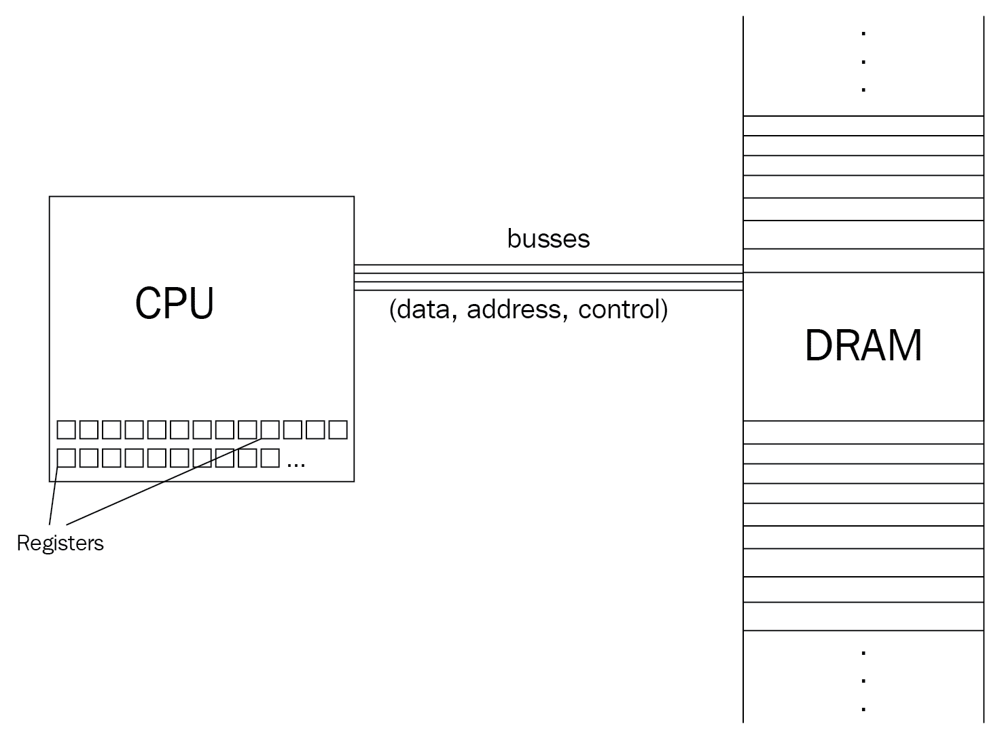
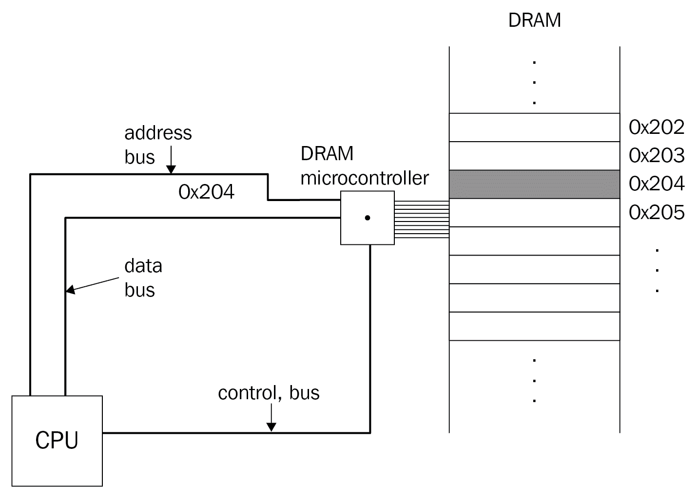
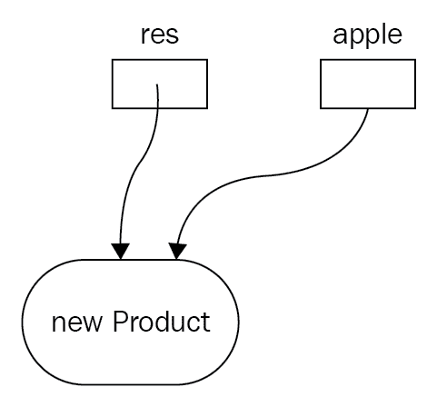

# 内存管理和智能指针

内存管理在 C++ 中是有代价的。忧心忡忡的程序员经常抱怨 C++ 的手工内存管理需求。虽然像 C#和 Java 这样的语言使用自动内存管理，但它会使程序比 C++ 运行得更慢。手动内存管理通常容易出错且不安全。正如我们在前面几章中已经看到的，程序代表数据和指令。几乎每个程序都在某种程度上使用计算机内存。很难想象一个有用的程序不需要内存分配。

内存分配和释放从最简单的函数调用开始。调用一个函数通常意味着向它传递参数。函数需要空间来存储这些参数。为了让生活更轻松，它是自动处理的。当我们在代码中声明对象时，也会发生同样的自动分配。他们的寿命取决于他们所宣布的范围。每当它们超出范围时，就会自动解除分配。大多数编程语言为动态内存提供类似的自动释放功能。动态分配内存——与自动分配相反——是程序员用来标识根据需求请求新内存的代码部分的术语。例如，当客户数量增加时，这将用于存储客户对新内存空间的请求列表的程序中。为了区分不同类型的内存管理，不管是自动的还是手动的，程序员使用内存分段。一个程序使用几个内存段进行操作，堆栈、堆、只读段等等，尽管它们都具有相同的结构，并且是同一虚拟内存的一部分。

大多数语言都提供了访问动态内存的简化方法，而不考虑其释放策略，将困难的工作留给了运行时支持环境。C++ 程序员必须处理内存管理的低级细节。无论是由于语言的哲学、结构还是年代，C++ 都不提供高级内存管理功能。因此，深刻理解内存结构及其管理是每个 C++ 程序员都必须要做的事情。现在让我们在本章中阐明内存和正确的内存管理技术背后的奥秘。

在本章中，我们将涵盖以下主题:

*   什么是内存，我们如何在 C++ 中访问它？
*   详细的内存分配
*   记忆管理技术和习惯用法
*   垃圾收集基础知识

# 技术要求

带有选项`-std=c++ 2a`的`g++ `编译器用于编译整个章节的示例。

你可以在[https://github.com/PacktPublishing/Expert-CPP](https://github.com/PacktPublishing/Expert-CPP)找到本章用到的源文件。

# 理解计算机内存

在最低层次的表示中，存储器是存储位状态的设备。假设我们正在发明一种可以存储一点信息的设备。如今，它似乎既无意义又神奇。发明已经被发明的东西是没有意义的，很久以前。这很神奇，因为现在的程序员拥有稳定的多功能环境，提供大量的库、框架和工具来创建程序，甚至不需要在幕后理解它们。声明一个变量或分配一个动态内存变得异常容易，如下面的代码片段所示:

```cpp
int var;
double* pd = new double(4.2);
```

很难描述设备如何存储这些变量。为了解释这个神奇的过程，让我们试着设计一个存储信息的设备。

# 设计存储器存储设备

我们将使用电路、继电器和逻辑门来设计一个能够存储一位的简单设备。本节的目的是了解最低层次的内存结构。

这里有一个简单的电路示例，你在物理课上应该很熟悉:


它由连接电池和**灯泡**的**导线**组成。**电线**有一个**开关**，控制灯泡的状态。开关闭合时**灯泡**亮，否则熄灭。我们将在这个电路中增加两个或非门逻辑元件。“或非”是“非或”的缩写。它通常以下列方式表示:


它有两个输入端(通向元件的导线)，每个输入端代表一个电信号。如果两个输入都是 0，我们说输出(从元件出来的线)是 1。这就是为什么我们称之为*而不是*，因为如果 OR 元素的任何一个输入为 1，它就会输出 1。前面的或非门元件简单地由两个继电器构成。继电器是一种开关，它使用电磁铁来闭合和断开触点。请看下图:


当**继电器**的两个**开关**都闭合时(表示**继电器**正在工作，拉下电路的**开关**，灯泡*关闭*。当我们将**开关**移动到两个**继电器**的打开位置时，灯泡打开*。上图是描述或非门的方法之一。此时，我们可以使用电线、灯泡、电池和继电器来创建逻辑元件。现在让我们来看看两个 NOR 元素的奇怪组合，它带来了一个有趣的发现:*

 *

上图是一个 **R-S 触发器**的典型代表。 **R** 为*复位*， **S** 为*设定*。由前述方案构建的设备可以存储一位。输出 **Q** 是我们可以读取设备内容的导线。如果我们设置触发器来存储该位，输出将为 1。你应该仔细检查该图，想象将信号逐个或同时传递到它的输入端，并在 **Q** 处看到输出。当输入 **S** 为 1 时， **Q** 变为 1。当 **R** 为 1 时， **Q** 变为 0。这样我们*设置*或者*重置*位。只要我们向器件提供电流，它就会存储该位。

现在想象一下，将许多先前设计的设备互连在一起，这样我们就可以存储不止一位的信息。通过这种方式，我们可以构建复杂的存储设备来存储字节甚至千字节(T2)数据。

前面的装置类似于晶体管发明之前计算机中使用的装置。晶体管是一种能够存储比特的小得多的器件。晶体管的类型不同。现代设备不使用继电器；相反，它们集成了数百万个晶体管来存储和处理数据。一个**中央处理器** ( **中央处理器**)寄存器是一个利用晶体管来存储指定数量的位的设备的例子。通常，通用寄存器最多存储 64 位数据。但是，您不能仅使用寄存器来存储所有程序和数据。计算机内存的组织要复杂得多。现在让我们从更高层次的角度来研究计算机内存的层次结构。

# 从更高层次的角度理解计算机内存

了解计算机内存和数据存储的细节对于编写专业程序至关重要。当程序员提到*内存*这个术语时，大多数时候指的是虚拟内存。虚拟内存是由**操作系统** ( **操作系统**)支持的抽象，它控制并为进程提供内存空间。每个进程都有自己的地址空间，表示为几个段的集合。我们在[第 2 章](02.html)、*用 C++ 进行低级编程*中讨论了内存段有哪些，以及给定程序如何使用每一段。从程序员的角度来看，访问内存空间大多仅限于对象声明和使用。无论我们在堆栈、堆还是静态内存中声明一个对象，我们都访问相同的内存抽象——虚拟内存。虽然很复杂，但虚拟记忆让生活变得容易多了。直接使用物理内存更难，尽管这是程序员技能的一大进步。你至少应该知道有哪些内存存储单元，以及如何利用这些知识来编写更好的代码。

在本节中，我们讨论了物理内存层次结构。我们称之为*层级*，因为较低级别的每个存储单元提供更快的访问，但空间更小。每一个连续更高的内存级别都会提供更多的空间来换取更慢的访问。

我们讨论物理内存层次结构，因为它将帮助我们设计更好的代码。了解内存在每一个级别上是如何工作的，可以提高我们作为程序员的能力，让我们能够更好地组织数据操作。下图说明了内存层次结构:


寄存器是放置在中央处理器中最快可访问的存储单元。寄存器的数量是有限的，所以我们不能把所有的程序数据都保存在里面。另一方面，**动态随机存取存储器** ( **动态随机存取存储器**)能够存储程序的各种数据。由于其物理结构和与中央处理器的距离，从动态随机存取存储器访问数据需要更长的时间。中央处理器通过数据总线访问动态随机存取存储器，数据总线是一组在中央处理器和动态随机存取存储器之间传输数据的导线。为了向动态随机存取存储器控制器发出它将读取还是写入数据的信号，中央处理器使用控制总线。我们将 DRAM 称为*主存储器*。让我们详细看看内存层次结构。

# 登记

寄存器保存固定数量的数据。CPU 字长通常由寄存器的最大长度来定义，例如 8 字节或 4 字节。我们不能从 C++ 程序直接访问寄存器。

C++ supports embedding assembly code using the `asm` declaration, for example, `asm("mov edx, 4")`. It's a platform-specific and artificial augmentation to the code, so we don't suggest using it.

在语言的旧版本中，我们可以在声明变量时使用`register`关键字:

```cpp
register int num = 14;
```

修饰符指定编译器将变量存储在寄存器中。这样，它给了程序员一种虚假的代码优化感。

Compilers are sophisticated tools translating higher-level C++ code into machine code. In the translation process, the code takes several transformations, including code optimizations. When programmers apply *tricks* to force the compiler to optimize a portion of the code, the compiler takes them as suggestions rather than commands. 

例如，如果变量放在寄存器中而不是动态随机存取存储器中，访问循环中的变量会更快。例如，以下循环访问对象一百万次:

```cpp
auto number{42};
for (int ix = 0; ix < 10000000; ++ ix) {
 int res{number + ix};
  // do something with res
}
```

我们知道`number`有自动存储时长(与`auto`关键字无关)，放在栈上。堆栈是虚拟内存中的一个段，虚拟内存是物理动态随机存取存储器上的一个抽象。访问寄存器中的对象比访问动态随机存取存储器中的对象要快得多。让我们假设从动态随机存取存储器读取`number`的值比从`register`读取慢五倍。使用`register`关键字优化前面的循环似乎是显而易见的，如图所示:

```cpp
register auto number{42};
// the loop omitted for code brevity
```

然而，如今编译器进行了更好的优化，因此对修饰符的需求已经随着时间的推移而减弱，现在它已经成为一种不推荐使用的语言特性。更好的优化是完全去掉`number`对象。

例如，以下代码表示使用实际值而不是通过驻留在动态随机存取存储器中的变量来访问它的编译优化版本:

```cpp
for (int ix = 0; ix < 1000000; ++ ix) {
 int res{42 + ix};
  // do something with res
}
```

虽然前面的例子可以说很简单，但是我们应该考虑编译期间发生的编译器优化。

发现寄存器提高了我们对程序执行细节的理解。关键是，中央处理器执行的所有操作都是通过寄存器进行的，包括中央处理器应该解码和执行的指令都是使用特定的寄存器来访问的，该寄存器通常被称为**指令指针**。当我们运行程序时，中央处理器访问它的指令，并解码和执行它们。从主存储器读取数据和向存储器写入数据是通过从寄存器复制数据和向寄存器复制数据来实现的。通常，通用寄存器用于在中央处理器对数据执行操作时临时保存数据。下图描述了**中央处理器**的抽象视图及其通过总线与主存储器的交互:



如您所见，中央处理器和动态随机存取存储器之间的通信是通过各种总线进行的。在[第 2 章](02.html)、*C++ 低级编程*中，我们讨论了 c++ 程序的低级表示——您应该快速浏览一下，以便更好地理解下面的示例。

现在，让我们看看寄存器的作用。下面的 C++ 代码声明了两个变量，并将它们的总和存储在第三个变量中:

```cpp
int a{40}, b{2};
int c{a + b};
```

为了执行求和指令，中央处理器将变量`a`和`b`的值移入其寄存器。计算总和后，它会将结果移入另一个寄存器。程序的汇编伪代码表示如下所示:

```cpp
mov eax, a
mov ebx, b
add eax, ebx
```

编译器生成将每个变量映射到一个寄存器的代码并不是强制性的——寄存器的数量是有限的。你只需要记住，你应该保持定期访问的变量足够小，以适应其中一个寄存器。对于较大的对象，高速缓冲存储器会有所帮助。让我们看看如何。

# 高速缓冲存储器

缓存的想法在编程和计算机系统中很常见。加载到浏览器中的图像被缓存，以避免将来用户再次访问网站时向网络服务器请求下载。缓存使程序运行得更快。这个概念可以用多种形式来利用，包括单个函数。例如，下面的递归函数计算一个数的阶乘:

```cpp
long factorial(long n) {
  if (n <= 1) { return 1; }
  return n * factorial(n - 1);
}
```

该函数不记得其先前计算的值，因此以下调用分别导致五次和六次递归调用:

```cpp
factorial(5); // calls factorial(4), which calls factorial(3), and so on
factorial(6); // calls factorial(5), which calls factorial(4), and so on
```

我们可以在每一步缓存已经计算好的值，方法是将它们存储在全局可访问的变量中，如图所示:

```cpp
std::unordered_map<long, long> cache;

long factorial(long n) {
  if (n <= 1) return 1;
 if (cache.contains(n)) return cache[n];
 cache[n] = n * factorial(n - 1);
 return cache[n];
}
```

修改优化了对函数的进一步调用:

```cpp
factorial(4);
// the next line calls factorial(4), stores the result in cache[5], which then calls factorial(3)
// and stores the result in cache[4] and so on
factorial(5);
factorial(6); // calls the factorial(5) which returns already calculated value in cache[5]
```

缓存的概念使阶乘函数运行得更快，同样，一个名为**缓存**的实际存储设备被放置在中央处理器内部。该设备存储最近访问的数据，以便更快地进一步访问该数据。下图描述了中央处理器内部的**寄存器**和**缓存内存**:


缓存大小通常在 2 KB 到 64 KB 之间(很少为 128 KB)。虽然对于 Photoshop 这样的应用程序来说，它似乎不够大，图像数据的大小可能远远大于缓存大小本身，但在许多情况下，它确实有所帮助。例如，假设我们在一个向量中存储了 1000 多个数字:

```cpp
std::vector<int> vec;
vec.push_back(1);
...
vec.push_back(9999);
```

以下代码打印矢量项目:

```cpp
for (auto it: vec) {
  std::cout << it;
}
// 1
// 2
// 3
// ...
// 9999
```

假设要打印该项目，**中央处理器**将其从内存复制到 rax 寄存器，然后调用运算符`<<`，后者将 rax 的值打印到屏幕上。在循环的每次迭代中，**中央处理器**将向量的下一项复制到 rax 寄存器中，并调用函数打印其值。每次复制操作都需要 **CPU** 将项目的地址放在**地址总线**上，并将**控制总线**设置为读取模式。**动态随机存取存储器**微控制器通过地址总线接收的地址访问数据，并将其值复制到数据总线，从而将数据发送到**中央处理器**。**中央处理器**将值导向 rax 寄存器，然后执行指令打印其值。下图显示了**中央处理器**和**动态随机存取存储器**之间的交互:



为了优化循环，中央处理器保持数据局部性的思想，即它将整个向量复制到缓存中，并从缓存中访问向量项，省略了对动态随机存取存储器的不必要的请求。在下图中，您可以看到通过数据总线从动态随机存取存储器接收的数据然后存储在**高速缓冲存储器**中:


驻留在中央处理器中的缓存称为**1 级** ( **L1** ) **缓存**。这是最小的容量，位于中央处理器内部。很多架构都有**二级** ( **L2** ) **缓存**，它驻留在 CPU 之外(虽然比主内存近)，访问方式和 DRAM 一样。L2 缓存和动态随机存取存储器的区别在于物理结构和数据访问模式。L2 缓存代表**静态随机存取存储器** ( **静态随机存取存储器**)，比动态随机存取存储器快，但也贵得多。

Some runtime environments leverage the idea of caching when implementing garbage collection. They separate the objects into categories based on their lifetime with objects that have the smallest lifetime, such as the ones allocated in the local scope of the code, being placed in the cache both to be accessed and deallocated faster.

新级别的高速缓冲存储器用作较低级别的高速缓存。例如，L2 缓存用作一级缓存的缓存。当中央处理器遇到缓存未命中时，它会请求 L2 缓存，依此类推。

# 主存储器

动态随机存取存储器的物理结构迫使它刷新电荷以保持数据稳定，而静态随机存取存储器不需要像动态随机存取存储器那样刷新。我们称 DRAM 为主存储器，主要是因为程序被装入其中；操作系统维护虚拟内存并将其映射到动态随机存取存储器。所有的实际工作都是先通过主存进行的。

正如我们已经讨论过的，主存储器代表一系列可寻址字节的数据。每个字节都有自己唯一的地址，并使用该地址进行访问。我们前面提到了中央处理器如何将数据地址放在地址总线上，从而让动态随机存取存储器微控制器获取请求的数据并通过数据总线发送。

众所周知，操作系统引入虚拟内存作为物理内存的抽象。它将虚拟内存的内容映射到物理内存，物理内存涉及到 CPU 的**翻译后备缓冲区** ( **TLB** )。TLB 是高速缓冲存储器的另一种形式:它存储**虚拟存储器**到**物理存储器**的最近翻译，从而为将来的请求高速缓存它。如下图所示，**中央处理器**与 **TLB** 配合，以便将虚拟地址正确转换为物理地址:


虽然内存管理很复杂，但操作系统为我们提供了足够简单的抽象来管理程序所需的内存。我们能够使用堆栈自动分配它，或者在堆上动态分配它。自动内存分配实际上并不涉及很多问题和困难；我们只是声明对象，它们被放在堆栈上，然后每当执行离开作用域时自动移除。在动态内存的情况下(不要与前面提到的硬件动态随机存取存储器混淆)，分配和解除分配都应该手动完成，这为出错导致内存泄漏创造了可能性。

# 永久存储

当我们关闭计算机时，主存储器的内容被擦除(因为电荷不再被刷新)。为了即使在断电的情况下也能永久存储数据，电脑配备了**硬盘驱动器** ( **硬盘驱动器**)或**固态驱动器** ( **固态硬盘**)。从程序员的角度来看，永久存储器用于存储程序及其必要的数据。我们已经知道，为了运行一个程序，它应该被加载到主内存中，即从硬盘复制到动态随机存取存储器中。操作系统使用加载器处理它，并在内存中创建程序映像，通常称为进程。当程序完成或用户关闭时，操作系统将进程的地址范围标记为可自由使用。

假设我们在学习 C++ 时使用文本编辑器写笔记。输入编辑器的文本驻留在主内存中，除非我们将其保存在硬盘上。注意这一点很重要，因为大多数程序跟踪最近的用户活动，并允许用户修改程序设置。为了在程序重新启动后保持用户修改设置的方式，程序将它们作为单独的*设置*文件存储在硬盘上。下次程序运行时，它首先从硬盘中读取相应的设置文件，并更新自己以应用最近对设置的修改。

通常，与主存储器相比，永久存储器具有更大的容量，这使得将硬盘驱动器用作虚拟存储器的备份成为可能。操作系统可以维护虚拟内存并伪造其大小，使其大于物理动态随机存取存储器。例如，通过启动几个重量级应用程序，动态随机存取存储器的最大 2gb 容量可能会很快耗尽。但是，操作系统仍然可以通过用硬盘备份其额外空间来维护更大的虚拟内存。当用户在应用程序之间切换时，操作系统将超过字节的虚拟内存复制到硬盘驱动器，并将当前运行的应用程序映射到物理内存。

这使得程序和操作系统运行得更慢，但允许我们保持它们打开，而不用考虑有限的主内存大小。现在让我们更深入地探讨一下 C++ 中的内存管理。

# 内存管理的基础

大多数情况下，内存管理过程中出现的问题发生在程序员忘记释放内存空间时。这会导致内存泄漏。几乎在每个程序中，内存泄漏都是一个普遍的问题。当程序为其数据请求新的存储空间时，操作系统将所提供的空间标记为**忙碌**。也就是说，程序的任何其他指令或任何其他程序都不能请求这个繁忙的存储空间。当程序的这一部分用完内存空间时，理想情况下，它必须通知操作系统移除繁忙标签，以便为其他人提供空间。一些语言提供了对动态分配内存的自动控制，让程序员担心应用程序的逻辑，而不是一直关心内存资源的释放。然而，C++ 假设程序员是负责任和聪明的(这并不总是如此)。动态分配的内存管理是程序员的责任。这就是为什么该语言同时提供“new”和“delete”操作符来处理内存空间，其中新的操作符分配内存空间，而 delete 操作符释放内存空间。换句话说，处理动态分配内存的理想代码如下所示:

```cpp
T* p = new T(); // allocate memory space
p->do_something(); // use the space to do something useful
delete p; // deallocate memory space
```

忘记调用删除操作符会使分配的内存空间*永远忙碌*。我们所说的*永远*是指只要程序在运行。现在想象一个总是在用户计算机上打开的网络浏览器。随着时间的推移，到处内存泄漏可能会导致内存不足，迟早用户必须重启程序，甚至更糟的是，重启操作系统。

这个问题适用于我们使用的任何资源，无论是文件还是我们忘记关闭的套接字(更多关于套接字的信息请参见[第 12 章](12.html)、*网络和安全*)。为了解决这个问题，C++ 程序员使用了**资源获取是初始化** ( **RAII** )的习惯用法，表示应该在资源初始化时获取资源，这样可以在以后正确释放资源。让我们看看它在行动。

# 内存管理的一个例子

考虑以下函数，该函数动态分配一个 420 `shorts`的数组，从用户输入中读取它们的值，以升序打印它们，并解除分配该数组:

```cpp
void print_sorted() {
  short* arr{new short[420]};
  for (int ix = 0; ix < 420; ++ ix) {
    std::cin >> arr[ix];
  }
  std::sort(arr, arr + 420);
  for (int ix = 0; ix < 420; ++ ix) {
    std::cout << arr[ix];
  }
  delete arr; // very bad!
}
```

我们已经在前面的代码中犯了一个错误，使用了错误的`delete`操作符来释放内存。要解除分配一个数组，我们必须使用`delete[]`运算符，否则，代码会导致内存泄漏。下面是我们如何说明阵列的分配:


假设我们用`delete`代替`delete[]`释放空间。它会将`arr`视为一个短指针，因此会删除从`arr`指针中包含的地址开始的前两个字节，如下图所示:


因此，现在我们移除了 420 个项目中的第一个项目，并将 419 `shorts`保留在堆中不动。每当我们需要堆上的新空间时，包含 419 **贱民**的那一小部分就不会再被重用了。尽管 new 和 delete 操作符家族是由实现定义的，但我们不应该真的希望最好的实现能够避免内存泄漏。

让我们修改前面的代码，以正确释放为数组分配的内存，并确保消除输入负数的可能性:

```cpp
void print_sorted() {
 short* arr{new short[420]};
  for (int ix = 0; ix < 420; ++ ix) {
    std::cin >> arr[ix];
 if (arr[ix] < 0) return;
  }
  std::sort(arr, arr + 420);
  // print the sorted array, code omitted for brevity
 delete[] arr;
}
```

前面的修改是另一个可能的内存泄漏的例子，尽管为了简单起见，我们显然编写了丑陋的代码。关键是，只要用户输入一个负数，函数就会返回。这给我们留下了 420 个孤儿`shorts`应该以某种方式被释放。然而，对分配内存的唯一访问是`arr`指针，它在堆栈上声明，因此当函数返回时，它将被自动删除(指针变量，而不是指向它的内存空间)。为了消除内存泄漏的可能性，我们应该在函数退出之前简单地调用`delete[]`运算符:

```cpp
void print_sorted() {
 short* arr{new short[420]};
  for(int ix = 0; ix < 420; ++ ix) {
    std::cin >> arr[ix];
 if (arr[ix] < 0) {
 delete[] arr;
 return;
 }
  }
  // sort and print the sorted array, code omitted for brevity
 delete[] arr;
}
```

代码变得有些难看，但它修复了内存泄漏。如果我们进一步修改函数，并使用第三方库函数对数组进行排序，会怎么样:

```cpp
import <strange_sort.h>;

void print_sorted() {
  short* arr{new short[420]};
  for (...) { /* code omitted for brevity */ }
 strange_sort::sort(arr, arr + 420);
  // print the sorted array, code omitted for brevity
  delete[] arr;
}  
```

原来`strange_sort::sort`在数组项的值超过 420 时抛出异常(毕竟这也是为什么这是一个奇怪的排序)。如果异常没有被捕获，它将会出现在调用者函数中，除非它在某个地方被捕获或者程序崩溃。未捕获的异常导致堆栈展开，这导致`arr`变量(指针)的自动销毁，因此我们面临另一种内存泄漏的可能性。为了解决这个问题，我们可以将`strange_sort::sort`包裹在试捕块中:

```cpp
try {
  strange_sort::sort(arr, arr + 420);
} catch (ex) { delete[] arr; }
```

C++ 程序员不断寻找处理内存泄漏的方法，例如 RAII 习惯用法和智能指针，我们将在下一节中讨论它们。

# 使用智能指针

有许多语言支持自动垃圾收集。例如，为对象获取的内存由运行时环境跟踪。它将在引用它的对象超出范围后释放内存空间。例如，考虑以下内容:

```cpp
// a code sample of the language (not-C++) supporting automated garbage collection
void foo(int age) {
  Person p = new Person("John", 35);
  if (age <= 0) { return; }
  if (age > 18) {
   p.setAge(18);
  }
  // do something useful with the "p"
}
// no need to deallocate memory manually
```

在前面的代码块中，`p`引用(通常，垃圾收集语言中的引用类似于 C++ 中的指针)指的是`new`运算符返回的内存位置。自动垃圾收集器管理由`new`操作符创建的对象的生存期。它还跟踪对该对象的引用。每当对象上没有引用时，垃圾收集器就会释放其空间。通过在 C++ 中使用 RAII 习惯用法，可能会达到类似的效果。让我们看看它在行动。

# 利用 RAII 习语

如前所述，RAII 习惯用法建议在初始化时获取资源。请看下面的课:

```cpp
template <typename T>
class ArrayManager {
public:
  ArrayManager(T* arr) : arr_{arr} {}
  ~ArrayManager() { delete[] arr_; }

  T& operator[](int ix) { return arr_[ix]; }

  T* raw() { return arr_; }
};
```

`print_sorted`功能现在可以使用`ArrayManager`正确释放分配的数组:

```cpp
void print_sorted() {
 ArrayManager<short> arr{new short[420]};
  for (int ix = 0; ix < 420; ++ ix) {
    std::cin >> arr[ix];
  }
  strange_sort::sort(arr.raw(), arr.raw() + 420);
  for (int ix = 0; ix < 420; ++ ix) {
    std::cout << arr[ix];
  }
}
```

我们建议使用标准容器，比如`std::vector`而不是`ArrayManager`，尽管这是 RAII 应用程序的一个很好的例子:在初始化时获取资源。我们创建了一个`ArrayManager`的实例，并用内存资源初始化了它。从这一点上，我们可以忘记它的释放，因为实际的释放发生在`ArrayManager`的析构函数中。当我们在堆栈上声明`ArrayManager`实例时，当函数返回或发生未捕获的异常时，它将被自动销毁，析构函数将被调用。

在这种情况下，最好使用标准容器，所以让我们为单指针实现 RAII 习惯用法。以下代码为`Product`实例动态分配内存:

```cpp
Product* apple{new Product};
apple->set_name("Red apple");
apple->set_price(0.42);
apple->set_available(true);
// use the apple
// don't forget to release the resource
delete apple;
```

如果我们将 RAII 习惯用法应用于前面的代码，它将在适当的代码执行点释放资源:

```cpp
ResourceManager<Product> res{new Product};
res->set_name("Red apple");
res->set_price(0.42);
res->set_available(true);
// use the res the way we use a Product
// no need to delete the res, it will automatically delete when gets out of the scope
```

`ResourceManager`类还应该重载操作符`*`和`->`，因为它必须像指针一样工作才能正确获取和管理指针:

```cpp
template <typename T>
class ResourceManager {
public:
  ResourceManager(T* ptr) : ptr_{ptr} {}
  ~ResourceManager() { delete ptr_; }

 T& operator*() { return *ptr_; }
 T* operator->() { return ptr_; }
};
```

`ResourceManager`类关心 C++ 中智能指针的思想。C++ 11 引入了几种智能指针。我们将它们命名为*智能*，因为它们包装资源并管理其自动解除分配。发生这种情况的唯一原因是，当对象被设置为销毁时，对象的析构函数将被调用。也就是说，我们使用通过对象动态分配的空间进行操作，具有自动存储持续时间。当处理程序对象超出范围时，它的析构函数执行必要的操作来释放底层资源。

然而，智能指针可能会带来额外的问题。上一段讨论的简单智能指针有几个最终会出现的问题。例如，我们没有处理`ResourceManager`复制:

```cpp
void print_name(ResourceManager<Product> apple) {
  std::cout << apple->name();
}

ResourceManager<Product> res{new Product};
res->set_name("Red apple");
print_name(res);
res->set_price(0.42);
// ...
```

前面的代码导致了未定义的行为。下图显示了隐藏的问题:



**res** 和 **apple** 获得了相同的资源。每当其中一个超出范围( **apple** )时，底层资源就会被释放，这就给另一个`ResourceManager`实例留下了一个悬空的指针。当另一个`ResourceManager`实例超出范围时，它会尝试删除指针两次。通常，程序员知道他们在特定情况下需要的智能指针的种类。这就是为什么 C++ 提供了几种类型的智能指针，我们将进一步讨论。要在程序中使用它们，您应该导入`<memory>`头。

# 标准::唯一 _ptr

类似于我们之前实现的`ResourceManager`实例，`std::unique_ptr`代表一个基本的智能指针。例如，要使用这个智能指针管理`Product`对象，我们需要执行以下操作:

```cpp
std::unique_ptr<Product> res{new Product};
res->set_name("Red apple");
// res will delete its acquired resource when goes out of scope
```

注意我们如何访问`Product`成员功能`set_name`。我们将`res`物体视为具有`Pointer*`类型的东西。

`unique_ptr`之所以被命名为唯一，是因为它提供了一种严格所有权的语义——它有义务摧毁被获取的对象。更有趣的是，`unique_ptr`是不能复制的。它没有复制构造函数或赋值运算符。这就是为什么它的**所有权**是*严格的*。当然，这并不意味着我们不能动一个`unique_ptr`班。在这种情况下，我们将所有权完全传递给唯一指针的另一个实例。

智能指针的主要要求之一是保持它们的轻量级。我们肯定会同意这一点。虽然`unique_ptr`是一个有多个成员函数的完整类，但是它没有*用额外的数据成员污染*。它只是指向已分配对象的原始指针的包装器。我们可以通过调用`unique_ptr`的`release()`成员函数来访问该原始指针，如图所示:

```cpp
Product* p = res.release();
// now we should delete p manually to deallocate memory
```

注意`release()`函数不调用删除运算符。它只会归还所有权。调用`release()`函数后，`unique_ptr`不再拥有资源。要重用已经拥有资源的`unique_ptr`，应该使用`reset()`成员函数。它调用底层指针的删除操作符，*重置*唯一指针以供进一步使用。另一方面，如果想在不释放所有权的情况下获取底层对象，就应该调用`get()`成员函数:

```cpp
std::unique_ptr<Product> up{new Product()};
Product* p = res.get();
// now p also points to the object managed by up
```

我们不能在下面的场景中使用`unique_ptr`类，因为它不能被复制:

```cpp
// Don't do this
void print_name(std::unique_ptr<Product> apple) {
  std::cout << apple->name();
}
std::unique_ptr<Product> res{new Product};
res->set_name("Red apple");
print_name(res); // bad code
res->set_price(0.42);
// ...
```

然而，这不是我们在前面的代码中寻找的。您可以认为前面的代码是一个糟糕的设计，因为它混淆了所有权细节。让我们继续讨论 C++ 中的下一个智能指针，它解决了将`unique_ptr`传递给函数的问题。

# std::shared_ptr 和 std::weak_ptr

我们需要一个智能指针来提供*共享所有权*。我们需要的是在 C++ 11 中作为`std::shared_ptr`引入的。实现共享所有权的智能指针更难，因为您应该注意资源的正确释放。例如，当前面代码块中的`print_name()`函数完成工作时，它的参数和局部对象将被销毁。销毁智能指针会导致对其拥有的资源进行适当的解除分配。智能指针如何知道该资源是否仍由另一个智能指针拥有？一种流行的解决方案是保持对资源的引用计数。`shared_ptr`类也是这样做的:它保持指向底层对象的指针数量，并在使用计数变为 0 时将其删除。因此，几个共享指针可以拥有同一个对象。

现在，我们刚才讨论的例子应该改写如下:

```cpp
void print_name(std::shared_ptr<Product> apple) {
  std::cout << apple->name();
}
std::shared_ptr<Product> res{new Product};
res->set_name("Red apple");
print_name(res);
res->set_price(0.42);
// ...
```

调用`print_name()`函数后，共享指针的使用次数增加 1。当函数完成其工作时，它将减少 1，但不会释放托管对象。因为`res`对象还没有脱离范围。让我们稍微修改一下这个示例，打印对共享对象的引用计数:

```cpp
void print_name(std::shared_ptr<Product> apple) {
  std::cout << apple.use_count() << " eyes on the " << apple->name();
}

std::shared_ptr<Product> res{new Product};
res->set_name("Red apple");
std::cout << res.use_count() << std::endl;
print_name(res);
std::cout << res.use_count() << std::endl;
res->set_price(0.42);
// ...
```

前面的代码将在屏幕上打印以下内容:

```cpp
1
2 eyes on the Red apple
1
```

当最后一个`shared_ptr`超出范围时，也会破坏底层对象。但是，在共享指针之间共享对象时应该小心。以下代码显示了共享所有权的一个明显问题:

```cpp
std::shared_ptr<Product> ptr1{new Product()};
Product* temp = ptr1.get();
if (true) {
  std::shared_ptr<Product> ptr2{temp};
  ptr2->set_name("Apple of truth");
}
ptr1->set_name("Peach"); // danger!
```

`ptr1`和`ptr2`都指向同一个物体，但彼此并不知晓。所以当我们通过`ptr2`修改`Product`对象时，会影响到`ptr1`。当`ptr2`超出范围时(在`if`语句后)，会破坏底层对象，该对象仍归`ptr1`所有。发生这种情况是因为我们通过传递原始的`temp`指针来使`ptr2`拥有对象。`ptr1`追踪不到。

只有使用`std::shared_ptr`的复制构造函数或赋值运算符才能共享所有权。这样，如果另一个`shared_ptr`实例正在使用该对象，我们可以避免删除该对象。共享指针使用控制块实现共享所有权。每个共享指针包含两个指针，一个指向它所管理的对象，一个指向控制块。控制块表示包含资源使用计数的动态分配空间。它还包含其他几个对`shared_ptr`至关重要的东西，例如资源的`allocator`和`deleter`。我们将在下一节介绍分配器。`deleter`通常是常规的`delete`操作员。

控制块还包含弱引用的数量。这样做是因为所拥有的资源也可能指向一个弱指针。`std::weak_ptr`是`std::shared_ptr`的小哥哥。它引用由`shared_ptr`实例管理的对象，但不拥有它。`weak_ptr`是在不拥有资源的情况下获取和使用`shared_ptr`拥有的资源的一种方式。但是，有一种方法可以使用`lock()`成员函数将`weak_ptr`实例转换为`shared_ptr`。

`unique_ptr`和`shared_ptr`都可以用于管理动态分配的阵列。必须正确指定模板参数:

```cpp
std::shared_ptr<int[]> sh_arr{new int[42]};
sh_arr[11] = 44;
```

要访问底层数组的元素，我们使用共享指针的`[]`操作符。另外，请注意，在动态多态中使用智能指针不会有缺点。例如，假设我们有以下类层次结构:

```cpp
struct Base
{
  virtual void test() { std::cout << "Base::test()" << std::endl; }
}; 

struct Derived : Base
{
  void test() override { std::cout << "Derived::test()" << std::endl; }
};
```

以下代码按预期工作并将`Derived::test()`输出到屏幕:

```cpp
std::unique_ptr<Base> ptr = std::make_unique_default_init<Derived>();
ptr->test();
```

虽然智能指针的使用可能会破坏指针的美观，但建议集中使用智能指针来避免内存泄漏。然而，值得注意的是，用智能指针替换所有指针，无论是`unique_ptr`指针还是`shared_ptr`指针，都不能解决所有的内存泄漏问题。它们也有缺点。考虑一种平衡的方法，或者更好的方法，在将问题和智能指针应用到问题之前，详细地彻底理解问题和智能指针本身。

在 C++ 程序中管理内存是有代价的。我们讨论过的最重要的事情是内存空间的正确释放。该语言不支持自动内存释放，但值得一提的是垃圾收集器。然而，为了拥有一个完整的垃圾收集器，我们需要语言级别的支持。C++ 不提供这些。让我们试着用 C++ 模仿一个垃圾收集器。

# 碎片帐集

垃圾收集器是一个独立的模块，通常包含在可解释语言的运行时环境中。比如 C#和 Java 都有垃圾收集器，让程序员的生活轻松了很多。垃圾收集器跟踪代码中的所有对象分配，并在它们不再使用时解除分配。它之所以被称为**垃圾收集器**，是因为它在内存资源被使用后将其删除:它收集程序员留下的垃圾。

据说 C++ 程序员不会在他们之后留下垃圾，这就是为什么该语言不支持垃圾收集器的原因。尽管程序员倾向于为这种语言辩护，声称它没有垃圾收集器，因为它是一种速度很快的语言，但事实是没有垃圾收集器它也能生存。

像 C#这样的语言将程序编译成中间字节码表示，然后由运行时环境解释和执行。垃圾收集器是环境的一部分，它会主动跟踪所有对象分配。它是一只老练的野兽，会尽力在合理的时间内管理好记忆。下图描述了一个典型的运行时环境，它在垃圾收集器的监督下分配内存:


我们手动调用`delete`运算符来释放 C++ 中的内存空间，即使在使用智能指针时也是如此。智能指针只是获取对象，并在对象超出范围时将其删除。关键是，即使智能指针引入了一些半自动行为，它们仍然表现得好像程序员没有忘记在代码的指定点释放资源。垃圾收集器会自动这样做，并且通常使用单独的执行线程。它尽力不降低程序的实际执行速度。

一些垃圾收集实现技术包括根据对象的生存期对其进行分类。分类使垃圾收集器访问对象，并在对象不再使用时释放内存空间。为了使这个过程更快，应该比持续时间更长的对象更频繁地访问持续时间短的对象。以下面的代码为例:

```cpp
struct Garbage {
  char ch;
  int i;
};

void foo() {
  Garbage* g1 = new Garbage();
  if (true) {
    Garbage* g2 = new Garbage();
  }
}

int main() {
  static Garbage* g3 = new Garbage();
}
```

如果 C++ 有一个垃圾收集器，那么对象`g1`、`g2`和`g3`将在程序执行的不同时间段被删除。如果垃圾收集器根据它们的生命周期对它们进行分类，那么`g2`将具有最短的生命周期，并且应该首先被访问以释放它。

要真正在 C++ 中实现垃圾收集器，我们应该让它成为程序的一部分。垃圾收集器应该首先负责分配内存来跟踪和删除它:

```cpp
class GarbageCollector {
public:
 template <typename T>
 static T* allocate() { 
   T* ptr{new T()};
 objects_[ptr] = true;
   return ptr;
 }

 static void deallocate(T* p) {
   if (objects_[p]) {
     objects_[p] = false;
     delete p;
   }
 } private:
 std::unordered_map<T*, bool> objects_;
};
```

前面的类跟踪通过静态`allocate()`函数分配的对象。如果对象正在使用，则通过`deallocate()`功能删除。以下是`GarbageCollector`的用法:

```cpp
int* ptr = GarbageCollector::allocate<int>();
*ptr = 42;
GarbageCollector::deallocate(ptr);
```

实际上，这个类比智能指针更难管理内存。基本上，没有必要在 C++ 中实现垃圾收集器，因为智能指针几乎可以处理任何关于*自动*内存释放的场景。

然而，让我们来看一个技巧，它将允许垃圾收集器正确地释放某个指针所指向的空间。在我们之前最简单的实现中，我们跟踪了我们提供给用户的所有指针。每个指针都指向堆上应该在程序执行的某个时刻释放的空间。在`GarbageCollector`中，我们将使用标准的`delete`运算符。问题是，它怎么知道应该释放多少字节？看看下面的例子:

```cpp
Student* ptr = new Student;
int* ip = new int{42};
// do something with ptr and ip
delete ptr;
delete ip;
```

让我们假设一个`Student`实例占用 40 字节的内存，一个整数占用 4 字节。我们应该以某种方式将该信息传递给删除操作符。在前面的代码中，我们删除了`ptr`和`ip`，它们都指向不同大小的内存空间。那么它怎么知道在`ptr`的情况下 40 字节应该标记为空闲，在`ip`的情况下 4 字节应该标记为空闲呢？这个问题的解决方案不止一个，我们来看其中一个。

每当我们分配内存时，新操作符都会将分配空间的大小放在实际内存空间之前，如下图所示:


该信息随后被`delete`操作符使用，该操作符通过读取放置在存储空间之前的相应字节来读取存储空间的大小。C++ 最关心的问题之一是管理数据集合的内存。在[第 6 章](06.html)、*挖掘 STL* 中的数据结构和算法中描述的 STL 容器，如`std::vector`和`std::list`，有不同的模型来处理内存。默认情况下，容器有一个指定的内存分配器来处理容器元素的内存分配和释放。让我们更详细地处理分配器。

# 使用分配器

分配器背后的思想是为容器内存管理提供控制。简单地说，分配器是 C++ 容器的高级垃圾收集器。虽然我们在容器内存管理的范围内讨论分配器，但是您肯定可以将这个想法扩展到一个通用的垃圾收集器。在这一节的开始，我们实现了一个设计糟糕的垃圾收集器。在检查分配器时，你会发现设计糟糕的`GarbageCollector`类和 C++ 中的默认分配器有很多相似之处。在`<memory>`中定义，默认分配器有两个基本功能–`allocate()`和`deallocate()`。`allocate()`功能定义如下:

```cpp
[[nodiscard]] constexpr T* allocate(std::size_t num);
```

`allocate()`功能为`T`类型的`num`对象获取空间。注意`[[nodiscard]]`属性——这意味着返回值不应该被调用者丢弃。否则，编译器将打印一条警告消息。

让我们使用分配器来获取五个整数的空间:

```cpp
import <memory>;

int main()
{
  std::allocator<int> IntAlloc;
  int* ptr = IntAlloc.allocate(5);
  // construct an integer at the second position
 std::allocator_traits<IntAlloc>::construct(IntAlloc, ptr + 1, 42);
  IntAlloc.deallocate(ptr, 5); // deallocate all
}
```

注意我们如何使用`std::allocator_traits`在分配的空间中构建对象。下图显示了

`deallocate()`功能定义如下:

```cpp
constexpr void deallocate(T* p, std::size_t n)
```

在前面的代码片段中，我们通过传递`allocate()`函数返回的指针来使用`deallocate()`函数。

您可能不会在您的项目中直接使用分配器，但是，每当您需要内存管理的自定义行为时，使用现有的或引入新的分配器可能会有所帮助。STL 容器使用分配器主要是因为它们在结构和行为上不同，这导致需要有专门的行为来进行内存分配和释放。我们将在下一章更详细地讨论 STL 容器。

# 摘要

C#等语言中的垃圾收集器是由环境提供的。它们与用户程序并行工作，并试图在程序看起来高效时清理程序。我们不能在 C++ 中做同样的事情；我们所能实现的就是直接在程序中实现一个垃圾收集器，提供一种半自动的方式来释放已使用的内存资源。自 C++ 11 以来，该语言中引入的智能指针恰当地涵盖了这种机制。

内存管理是每个计算机程序的关键组成部分之一。程序应该能够在执行过程中动态请求内存。好的程序员理解内存管理的内在细节。这有助于他们设计和实现性能更高的应用程序。虽然手动内存管理被认为是一种优势，但在大型应用程序中，它往往会变得令人痛苦。在本章中，我们学习了如何使用智能指针来避免错误和处理内存释放。有了这个基本的理解，你应该在设计避免内存泄漏的程序时增加你的信心。

在下一章中，我们将学习 STL，重点是数据结构和算法，并将深入研究它们的 STL 实现。除了比较数据结构和算法，我们还将介绍 C++ 20 中一个值得注意的新特性:概念。

# 问题

1.  解释计算机内存。
2.  什么是虚拟内存？
3.  哪些操作符用于内存分配和释放？
4.  `delete`和`delete[]`有什么区别？
5.  什么是垃圾收集器，为什么 C++ 不支持垃圾收集器？

# 进一步阅读

有关更多信息，请参考以下链接:

*   每一个程序员都应该知道的关于内存的知识，作者:乌尔里希·德雷珀，作者:https://people.freebsd.org/~lstewart/articles/cpumemory.pdf·T2
*   代码:计算机软硬件的隐藏语言，作者:Charles Petzold，网址:[https://www . Amazon . com/Code-Language-Computer-Hardware-Software/DP/0735611319/](https://www.amazon.com/Code-Language-Computer-Hardware-Software/dp/0735611319/)*