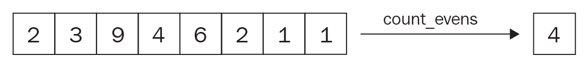
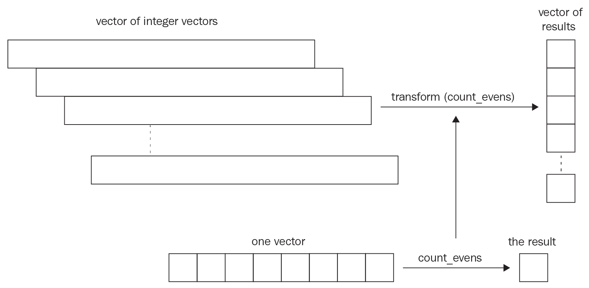

# 函数式编程

**面向对象编程** ( **OOP** )为我们提供了一种思考对象的方式，从而用类及其关系来表达现实世界。函数式编程是一种完全不同的编程范式，因为它允许我们专注于*函数式*结构，而不是代码的*物理*结构。学习和使用函数式编程有两种用处。首先，这是一种新的范式，迫使你以非常不同的方式思考。解决问题需要有灵活的思维。依附于单一范式的人倾向于为任何问题提供相似的解决方案，而大多数优雅的解决方案需要更广泛的方法。掌握函数式编程为开发人员提供了一项新技能，帮助他们提供更好的问题解决方案。其次，使用函数式编程减少了软件中的 bug 数量。函数式编程独特方法的最大原因之一是:它将程序分解成函数，每个函数都不修改数据的状态。

我们将在本章讨论函数式编程的基本模块，以及范围。在 C++ 20 中引入的范围为我们提供了一种编写算法的好方法，这样它们就可以处理数据集合。函数式编程的核心是编写算法，这样我们就可以按顺序将它们应用到这个数据集合中。这就是为什么我们将在本章中讨论范围。

本章将涵盖以下主题:

*   函数式编程导论
*   范围库简介
*   纯函数
*   高阶函数
*   更深入地研究递归
*   函数式 C++ 中的元编程

# 技术要求

g++ 编译器连同`-std=c++ 2a`选项将用于编译本章中的示例。

你可以在[https://github.com/PacktPublishing/Expert-CPP](https://github.com/PacktPublishing/Expert-CPP)找到本章的源文件。

# 揭示函数式编程

正如我们前面提到的，函数式编程是一种编程范式。在构建程序时，您可以将范例视为一种思维方式。C++ 是一种多范式语言。我们可以用它在过程范式中开发程序，也就是通过一个接一个地执行语句。在第三章，面向对象编程的细节中，我们讨论了面向对象的方法，包括将一个复杂的系统分解成相互通信的对象。另一方面，函数式编程鼓励我们将系统分解成函数而不是对象。它使用表达式而不是语句进行操作。基本上，您将某个东西作为输入，并将其传递给产生输出的函数。这可以用作另一个函数的输入。这在一开始看起来很简单，但是函数式编程包含了一些规则和实践，这些规则和实践在开始时感觉很难掌握。然而，当你做到这一点时，你的大脑会开启一种新的思维方式——功能性思维方式。

为了更清楚地说明这一点，让我们从一个演示函数式编程本质的例子开始。假设我们得到了一个整数列表，需要计算其中偶数的个数。唯一的问题是有几个这样的载体。我们应该分别计算所有向量中的偶数，并产生一个结果，作为包含每个输入向量的计算结果的新向量。

输入以矩阵的形式提供，即向量的向量。用 C++ 表达这一点的最简单方法是使用以下类型:

```cpp
std::vector<std::vector<int>>
```

我们可以通过使用类型别名来进一步简化前面的代码，如下所示:

```cpp
using IntMatrix = std::vector<std::vector<int>>;
```

下面是这个问题的说明。我们有一堆包含整数的向量，因此我们应该得到一个包含偶数计数的向量:


请看下面的函数。它以整数向量的向量(也称为矩阵)作为自变量。该函数计算偶数的数量:

```cpp
std::vector<int> count_all_evens(const IntMatrix& numbers)
{
  std::vector<int> even_numbers_count;
  for (const auto& number_line: numbers) {
    int even{0};
 for (const auto& number: number_line) {
 if (number % 2 == 0) {
 ++ even;
 }
 }
 even_numbers_count.push_back(even);
  }
  return even_numbers_count;
}
```

前面的函数保留了一个单独的向量来存储每个向量的偶数计数。输入作为向量的向量提供，这就是为什么函数在第一个向量上循环以检索内部向量。对于每个检索到的向量，它会在其上循环，并在每次遇到向量中的偶数时递增计数器。完成每个向量的循环后，最终结果被推送到包含数字列表的向量。虽然您可能希望回到前面的例子，并使代码更好，但我们现在将继续，并将其分解为更小的函数。首先，我们将负责计算偶数的代码部分移到一个单独的函数中。

我们把它命名为`count_evens`，如下:

```cpp
int count_evens(const std::vector<int>& number_line) {
  return std::count_if(number_line.begin(), 
       number_line.end(), [](int num){return num % 2 == 0;});
}
```

注意我们如何应用`count_if()`算法。它采用两个迭代器，分别放在容器的开头和结尾。它还接受第三个参数，*一元谓词*，为集合的每个元素调用该参数。我们传递了一个 lambda 作为一元谓词。您也可以使用任何其他可调用的实体，例如函数指针、`std::`函数等等。

现在我们有了单独的计数函数，可以在原来的`count_all_evens()`函数中调用。`count_all_evens()`的以下实现用 C++ 表示函数式编程:

```cpp
std::vector<int> count_all_evens(const std::vector<std::vector<int>>& numbers) {
  return numbers | std::ranges::views::transform(count_evens);
}
```

在深入研究前面的代码之前，让我们先就吸引我们眼球的第一件事达成一致——不是`|`运算符的怪异用法，而是代码的简洁性。将其与我们在本节开头介绍的代码版本进行比较。他们都做同样的工作，但是第二个——功能性的——做得更简洁。此外，请注意，该函数不会保持或更改任何状态。它没有副作用。这在函数编程中至关重要，因为函数必须是纯 T2 函数。它接受一个参数，然后处理它而不修改它，并返回一个新值(通常基于输入)。函数式编程的第一个挑战是将任务分解成更小的独立函数，这些函数很容易组合。

尽管我们是从一个命令式的解决方案中得出函数式解决方案的，但在利用函数式编程范式时，这并不是使用它的正确方式。您应该改变您思考问题的方式和方法，而不是先编写命令式代码并修改它以获得功能性版本。你应该驯服功能性思考的过程。计算所有偶数的问题导致我们解决一个向量的问题。如果我们能找到一种方法来解决单个向量的问题，我们就能解决所有向量的问题。`count_evens()`函数取一个向量，产生一个单值，如下图所示:



在解决了一个向量的问题后，我们应该通过将解决方案应用于所有向量来处理原始问题。`std::transform()`函数本质上做了我们需要的事情:它接受一个可以应用于单个值的函数，并对其进行转换，以便处理一个集合。下图说明了我们如何使用它来实现一个函数(`count_all_evens`)，该函数可以处理来自一次只处理一个项目的函数(`count_evens`)的项目集合:



将更大的问题分解成更小的独立任务是函数式编程的核心。每一个功能都是专门做一个足够简单的任务，而没有意识到原来的问题。然后将函数组合在一起，从原始的初始输入生成一个转换项的集合。

现在，`count_all_evens()`函数的最终版本利用了范围。让我们找出它们是什么以及如何使用它们，因为我们将在进一步的示例中需要它们。

# 使用范围

范围与视图相关联。我们将在本节中研究它们。我们在[第 6 章](06.html)、*中讨论了 STL 容器和算法，深入研究了 STL* 中的数据结构和算法。它们为我们提供了一种组合和处理对象集合的通用方法。正如您已经知道的，我们经常使用迭代器来遍历容器并处理它们的元素。迭代器是允许我们在算法和容器之间进行松散耦合的工具。

例如，之前，我们将`count_if()`应用于向量，但是`count_if()`不知道它被应用于什么容器。看看下面`count_if()`的宣言:

```cpp
template <typename InputIterator, typename UnaryPredicate>
constexpr typename iterator_traits<InputIterator>::difference_type
  count_if(InputIterator first, InputIterator last, UnaryPredicate p);
```

可以看到，`count_if()`除了其特定于 C++ 的冗长声明外，并没有将容器作为参数。相反，它使用迭代器——特别是输入迭代器。

An input iterator supports iterating forward using the `++ ` operator and accessing each element using the `*` operator. We also can compare input iterators using the `==` and `!=` relationships.

算法在不知道容器确切类型的情况下迭代容器。我们可以在任何有开始和结束的实体上使用`count_if()`，如下所示:

```cpp
#include <array>
#include <iostream>
#include <algorithm>

int main()
{
  std::array<int, 4> arr{1, 2, 3, 4};
 auto res = std::count_if(arr.cbegin(), arr.cend(), 
 [](int x){ return x == 3; });
  std::cout << "There are " << res << " number of elements equal to 3";
}
```

除了它们的共性之外，算法的组合也不好。通常，我们将一个算法应用于一个集合，并将该算法的结果存储为另一个集合，我们可以在以后以相同的方式将该集合应用于更多的算法。我们使用`std::transform()`将结果放入另一个容器中。例如，以下代码定义了产品向量:

```cpp
// consider the Product is already declared and has a "name", "price", and "weight"
// also consider the get_products() is defined 
// and returns a vector of Product instances

using ProductList = std::vector<std::shared_ptr<Product>>;
ProductList vec{get_products()};
```

假设项目由不同的程序员团队开发，他们选择将产品名称保留为任意数字；例如，1 代表苹果，2 代表桃子，以此类推。这意味着`vec`将包含`Product`实例，每个实例在其`name`字段中都有一个数字字符(而名称的类型是`std::string`——这就是为什么我们将数字作为字符而不是整数值保存的原因)。现在，我们的任务是将产品名称从数字转换为完整字符串(`apple`、`peach`等)。对此我们可以使用`std::transform`:

```cpp
ProductList full_named_products; // type alias has been defined above
using ProductPtr = std::shared_ptr<Product>;
std::transform(vec.cbegin(), vec.cend(), 
  std::back_inserter(full_named_products), 
  [](ProductPtr p){ /* modify the name and return */ });
```

执行上述代码后，`full_named_products`向量将包含具有完整产品名称的产品。现在，要过滤掉所有的苹果并将其复制到一个苹果向量中，我们需要使用`std::copy_if`:

```cpp
ProductList apples;
std::copy_if(full_named_products.cbegin(), full_named_products.cend(),
  std::back_inserter(apples), 
  [](ProductPtr p){ return p->name() == "apple"; });
```

前面代码示例的最大缺点之一是在引入范围之前缺乏良好的组合。范围为我们提供了一种处理容器元素和组合算法的优雅方式。

简单地说，一个范围是一个可穿越的实体；也就是说，一个范围有一个`begin()`和一个`end()`，很像我们目前使用的容器。在这些术语中，每个 STL 容器都可以被视为一个范围。STL 算法被重新定义为将范围作为直接参数。通过这样做，它们允许我们将一个算法的结果直接传递给另一个算法，而不是将中间结果存储在局部变量中。例如，`std::transform`，我们之前使用了一个`begin()`和一个`end()`，如果应用于一个范围，有以下形式(下面的代码是伪代码)。通过使用范围，我们可以用以下方式重写前面的示例:

```cpp
ProductList apples = filter(
  transform(vec, [](ProductPtr p){/* normalize the name */}),
  [](ProductPtr p){return p->name() == "apple";}
);
```

别忘了导入`<ranges>`表头。转换函数将返回一个包含`Product`指针的范围，这些指针的名称被规范化；也就是说，数值被替换为字符串值。然后，过滤功能将获取结果并返回以`apple`为名称的产品范围。

Note that we simplified these code examples by omitting `std::ranges::views` from in front of the `filter` and `transform` functions. Use them as `std::ranges::views::filter` and `std::ranges::views::transform`, accordingly.

最后，我们在本章开头的示例中使用的重载运算符`**|**`，允许我们一起管理范围。这样，我们可以编写算法来产生最终结果，如下所示:

```cpp
ProductList apples = vec | transform([](ProductPtr p){/* normalize the name */})
                         | filter([](ProductPtr p){return p->name() == "apple";});
```

我们用管道代替嵌套函数调用。这一开始可能会令人困惑，因为我们曾经使用`|`运算符作为按位“或”运算符。每当您看到它应用于集合时，它都是指管道范围。

The `|` operator is inspired by the Unix shell pipe operator. In Unix, we can pipe the results of several processes together; for example, `ls -l | grep cpp | less` will find `cpp` in the result of the `ls` command and show the final result one screen at a time using the `less` program.

正如我们已经说过的，范围是对集合的抽象。这并不意味着它是一个集合。这就是为什么前面的例子没有任何开销——它只是将一个范围从一个函数传递到另一个函数，这个范围只是提供了一个集合的开始和结束。此外，它允许我们访问底层的集合元素。下图说明了这个想法:


函数(或者**变换**或者**过滤**)返回一个范围结构，而不是一个集合。范围的`begin()`迭代器将指向源集合中满足谓词的元素。范围的迭代器是一个代理对象:它不同于常规的迭代器，因为它指向一个满足给定谓词的元素。我们有时称它们为**智能迭代器**，因为每次我们推进它(例如，通过递增)，它都会在集合中找到满足谓词的下一个元素。更有趣的是，迭代器的“智能”取决于我们应用于集合的函数类型。例如，`filter()`函数返回一个范围，该范围的增量运算符有智能迭代器。这主要是因为筛选器的结果可能包含比原始集合更少的元素。另一方面，Transform 不会返回元素数量减少的结果，它只是转换元素。这意味着由转换返回的范围对于递增/递减操作具有相同的功能，但是元素访问将有所不同。对于每次访问，该范围的智能迭代器将从原始集合中返回转换后的元素。换句话说，它只是为迭代器实现了`*()`操作符，类似于下面的代码片段:

```cpp
auto operator*()
{
  return predicate(*current_position);
}
```

这样，我们就创建了一个新的集合*视图*，而不是一个新的转换元素集合。这同样适用于`filter`和其他功能。更有趣的是，范围视图利用了*懒惰评估*。对于前面的例子，即使我们有两个范围转换，结果也是通过一次计算得到的。

在带有`transform`和`filter`的例子中，每个函数都定义了一个视图，但是它们不修改或评估任何东西。当我们将结果分配给结果集合时，向量是通过访问每个元素从视图中构造的。这就是评估发生的地方。

就这么简单——范围为我们提供了带有惰性评估的函数组合。我们简单介绍了函数式编程中使用的工具集。现在，让我们来看看这个范例的好处。

# 为什么使用函数式编程？

首先，函数式编程引入了简洁性。与命令式代码相比，代码要短得多。它提供了简单但极具表现力的工具。代码越少，出现的 bug 就越少。

函数不会发生任何变化，这使得并行化它们变得容易得多。这是并发程序的主要关注点之一，因为并发任务需要在它们之间共享可变数据。大多数情况下，您必须使用原语(如互斥体)显式同步线程。函数式编程将我们从显式同步中解放出来，我们可以在多个线程上运行代码，而无需修改它。在 [第八章](06.html)*挖掘数据结构*中，我们将详细讨论数据竞赛。

功能范式认为所有功能都是*纯*；也就是说，不改变程序状态的函数。他们只是接受输入，以用户定义的方式进行转换，然后提供输出。一个纯函数为相同的输入生成相同的结果，与它被调用的次数无关。每当我们谈论函数式编程时，我们应该默认考虑所有纯函数。

以下函数以`double`为输入，返回其平方:

```cpp
double square(double num) { return num * num; }
```

单独编写纯函数可能会感觉像是有意让程序运行得更慢。

Some compilers, such as GCC, provide attributes that help the compiler optimize the code. For example, the `[[gnu::pure]]` attribute tells the compiler that the function can be considered a pure function. This will reassure the compiler that the function doesn't access any global variable and that the function's result depends solely on its input. 

有许多情况下*常规*功能可以带来更快的解决方案。然而，为了适应范式，你应该强迫自己进行功能性思考。例如，以下程序声明一个向量并计算其元素的平方根:

```cpp
void calc_square_roots(std::vector<double>& vec) 
{
  for (auto& elem : vec) {
    elem = std::sqrt(elem);
  }
}

int main()
{
  std::vector<double> vec{1.1, 2.2, 4.3, 5.6, 2.4};
 calc_square_roots(vec);
}
```

这里，我们通过引用传递向量。这意味着，如果我们在函数中更改它，我们就更改了原始集合。这显然不是一个纯函数，因为它改变了输入向量。另一种功能是返回新向量中的转换元素，保持输入不变:

```cpp
std::vector<double> pure_calc_square_roots(const std::vector<double>& vec)
{
 std::vector<double> new_vector;
  for (const auto& elem : vec) {
    new_vector.push_back(std::sqrt(elem));
  }
 return new_vector;
}
```

一个更好的功能思维的例子是解决一个更小的问题，并将其应用到集合中。在这种情况下，较小的问题是计算单个数字的平方根，这已经实现为`std::sqrt`。将其应用于集合是通过`std::ranges::views::transform`完成的，如下所示:

```cpp
#include <ranges>
#include <vector>

int main()
{
 std::vector<double> vec{1.1, 2.2, 4.3, 5.6, 2.4};
 auto result = vec | std::ranges::views::transform(std::sqrt);
}
```

正如我们已经知道的，通过使用范围，我们可以避免存储中间对象。在前面的例子中，我们将`transform`直接应用于向量。`transform`返回一个视图，但不是由源向量的变换元素组成的完整集合。当我们构建`result`向量时，元素的实际变换副本被制作。另外注意`std::sqrt`被认为是纯函数。

我们在本章开头解决的例子为函数式编程提供了必要的视角。为了更好地掌握这一范式，我们应该熟悉它的原理。在下一节中，我们将深入研究函数式编程的原理，以便您更好地了解如何以及何时使用该范例。

# 函数编程原理

虽然函数范式很古老(它诞生于 20 世纪 50 年代)，但它并没有让编程界遭受风暴。如今，大多数主流范例包括命令式语言和面向对象语言。正如我们在本书和许多其他书中多次指出的，C++ 是一种**多范式语言**。这就是学习 C++ 的妙处；我们可以调整它以适应几乎所有的环境。掌握范式不是一件容易的事情。你必须去感受它并应用它，直到你最终开始从范式的角度去思考。之后，你会在几秒钟内看到常规任务的解决方案。

如果你还记得你第一次学习面向对象编程的时候，你可能会想起那些让你在释放面向对象编程的真正潜力之前有点纠结的原则。函数式编程也是如此。在这一节中，我们将讨论函数式编程的基本概念，这将是进一步发展的基础。您可以应用(或者已经这样做了)这些概念中的一些，而无需实际使用功能范例。然而，试着花些精力去理解和应用以下每一条原则。

# 纯函数

正如我们之前提到的，一个*函数如果不变异状态*就是纯的。与非纯函数相比，纯函数可被视为性能较差；然而，它们很棒，因为它们避免了由于状态修改而在代码中出现的大多数错误。bug 在某种程度上与程序状态有关。显然，程序处理数据，所以它们组成了状态修改功能，为最终用户带来一些预期的结果。

在面向对象编程中，我们将程序分解成对象，每个对象都有一个特殊特性的列表。OOP 中对象的基本特征之一是其*状态*。通过向对象发送消息(换句话说，调用它的方法)来修改对象的状态在 OOP 中至关重要。通常，成员函数调用会导致对象状态的修改。在函数式编程中，我们将代码组织成纯函数的集合，每个函数都有自己的目的，并且独立于其他函数。

让我们看一个简单的例子，只是为了让这个概念清晰。假设我们在一个程序中处理用户对象，每个用户对象包含与用户相关的年龄。`User`类型在以下代码块中描述为`struct`:

```cpp
struct User
{
  int age;
  string name;
  string phone_number;
  string email;
};
```

需要每年更新用户的年龄。假设我们有一个每年为每个`User`对象调用一次的函数。以下函数以一个`User`对象为输入，将其`age`增加`1`:

```cpp
void update_age(User& u)
{
  u.age = u.age + 1;
}
```

`update_age()`功能通过引用获取输入，并更新原始对象。函数式编程不是这样。除了更新的`age`属性之外，下面的纯函数返回一个完全不同的`user`对象，该对象具有相同的属性，而不是通过引用获取原始对象并改变其值:

```cpp
User pure_update_age(const User& u) // cannot modify the input argument
{
 User tmp{u};
  tmp.age = tmp.age + 1;
  return tmp;
}
```

虽然与`update_age()`相比，这种方法似乎效率不高，但它的优点之一是使操作非常清晰(这在我们调试代码时非常有用)。现在保证`pure_update_age()`不会修改原对象。我们可以修改前面的代码，使其按值接受对象。这样，我们将跳过创建`tmp`对象，因为参数本身代表一个副本:

```cpp
User pure_update_age(User u) // u is the copy of the passed object
{
  u.age = u.age + 1;
  return u;
}
```

如果用相同的参数多次调用一个纯函数，那么它每次都必须返回相同的结果。下面的代码演示了当给定相同的输入时，我们的`pure_update_age()`函数返回相同的值:

```cpp
User john{.age{21}, .name{"John"}};

auto updated{pure_update_age(john)};
std::cout << updated.age; // prints 22

updated = pure_update_age(john);
std::cout << updated.age; // prints 22
```

对于一个函数来说，每次为相同的输入数据调用它时，它的行为都是相同的，这是一个很大的好处。这意味着我们可以通过将应用程序分解成更小的函数来设计应用程序的逻辑，每个函数都有一个精确而清晰的目的。然而，就额外的临时对象而言，纯函数存在开销。常规设计包括拥有一个包含程序状态的集中存储，程序状态由纯函数间接更新。每次纯函数调用后，函数都会将修改后的对象作为新对象返回，必要时可以存储。您可以将其视为调整代码以省略传递整个对象。

# 高阶函数

在函数编程中，函数被认为是*一级*对象(你可能也会遇到一级公民)。这意味着我们应该将它们视为对象，而不是一组指令。这对我们有什么不同？在这一点上，一个函数被当作一个对象来对待，唯一重要的是它能够传递给其他函数。将其他函数作为参数的函数称为**高阶** **函数**。

C++ 程序员将一个函数传递给另一个函数并不少见。以下是如何用老派的方式做到这一点:

```cpp
typedef  void (*PF)(int);
void foo(int arg) 
{
  // do something with arg
}

int bar(int arg, PF f)
{
 f(arg);
  return arg;
}

bar(42, foo);
```

在前面的代码中，我们声明了一个指向函数的指针。`PF`表示函数的类型定义，取一个整数参数，不返回值。前面的例子是将指针函数作为参数传递给其他函数的一种流行方式。我们把函数当作一个对象。然而，这取决于我们对*对象的理解。*

在前几章中，我们将对象定义为具有状态的东西。这意味着，如果我们把一个函数当作一个对象，如果需要，我们也应该能够以某种方式改变它的状态。对于函数指针，情况并非如此。以下是将一个函数传递给另一个函数的更好方法:

```cpp
class Function
{
public:
  void modify_state(int a) {
    state_ = a;
  }

  int get_state() {
    return state_;
  }

  void operator()() {
 // do something that a function would do
 }
private:
  int state_;
};

void foo(Function f)
{
 f();
  // some other useful code
}
```

好好看看前面的代码。它声明了一个有重载`operator()`的类。每当我们重载一个类的操作符时，我们就使它成为*可调用的*。听起来很明显，任何可调用的东西都被当作一个函数。因此，一个类的对象有一个重载`operator()`可以被认为是一个函数(有时。它被称为*函子*。这在某种程度上就像一个技巧，因为我们没有让函数成为对象，而是让对象成为可调用的。然而，这让我们实现了我们想要的:一个有状态的函数。以下客户端代码演示了一个`Function`对象的状态:

```cpp
void foo(Function f)
{
  f();
  f.modify_state(11);
 cout << f.get_state(); // get the state
  f(); // call the "function"
}
```

例如，通过这样做，我们可以跟踪该函数被调用了多少次。下面是一个跟踪呼叫数量的简单示例:

```cpp
class Function
{
public:
 void operator()() {    // some useful stuff ++ called_; 
  }

private:
  int called_ = 0;
};
```

最后，在以下代码的`<functional>`标题中定义的`std::function`演示了定义高阶函数的另一种方式:

```cpp
#include <functional>

void print_it(int a) {
  cout << a;
}

std::function<void(int)> function_object = print_it;
```

当`function_object`被调用时(使用`operator()`，它将调用委托给`print_it`函数。`std::function`封装任何函数，并允许它作为一个对象工作(并将其传递给其他函数)。

前面例子中以其他函数作为参数的函数都是高阶函数的例子。返回函数的函数也称为高阶函数。综上所述，高阶函数是接受或返回另一个或多个函数的函数。看看下面的例子:

```cpp
#include <functional>
#include <iostream>

std::function<int (int, int)> get_multiplier()
{
 return [](int a, int b) { return a * b; };
}

int main()
{
 auto multiply = get_multiplier();
  std::cout << multiply(3, 5) << std::endl; // outputs 15
}
```

`get_multiplier()`返回一个包裹在`std::function`中的λ。然后，我们调用结果，就像调用正则函数一样。`get_multiplier()`函数是一个高阶函数。我们可以使用更高阶的函数来实现**curry**，类似于我们在前面的例子中所做的。在函数式编程中，currying 是指我们让一个函数将几个参数转换成几个函数，每个函数只接受一个参数；比如把`multiply(3, 5)`做成`multiply(3)(5)`。以下是我们实现这一目标的方法:

```cpp
std::function<int(int)> multiply(int a)
{
 return [a](int b) { return a * b; };
}

int main()
{
  std::cout << multiply(3)(5) << std::endl;
}
```

`multiply()`接受一个参数，并返回一个也接受单个参数的函数。注意λ捕获:它捕获`a`的值，这样它就可以在体内乘以`b`。

Currying is a reference to logician Haskell Curry. The Haskell, Brook, and Curry programming languages are also named after him.

currying 最有用的特性之一是具有我们可以组合在一起的抽象函数。我们可以创建`multiply()`的专门版本，并将它们传递给其他函数，或者在适用的地方使用它们。这可以在下面的代码中看到:

```cpp
auto multiplyBy22 = multiply(22);
auto fiveTimes = multiply(5);

std::cout << multiplyBy22(10); // outputs 220
std::cout << fiveTimes(4); // outputs 20
```

使用 STL 时，您一定使用了更高阶的函数。许多 STL 算法使用谓词来过滤或处理对象集合。例如，`std::find_if`函数找到满足传递的谓词对象的元素，如下例所示:

```cpp
std::vector<int> elems{1, 2, 3, 4, 5, 6};
std::find_if(elems.begin(), elems.end(), [](int el) {return el % 3 == 0;});
```

`std::find_if`以一个 lambda 为谓词，为向量中的所有元素调用它。满足条件的元素将作为请求的元素返回。

高阶函数的另一个例子是`std::transform`，这是我们在本章开头介绍的(不要与`ranges::view::transform`混淆)。让我们用它来将字符串转换成大写字母:

```cpp
std::string str = "lowercase";
std::transform(str.begin(), str.end(), str.begin(), 
  [](unsigned char c) { return std::toupper(c); });
std::cout << str; // "LOWERCASE"
```

第三个参数是容器的开头，也是`std::transform`函数插入当前结果的地方。

# 可折叠的

折叠(或简化)是将一组值组合在一起以生成数量减少的结果的过程。大多数时候，我们谈论的是一个单一的结果。折叠抽象了迭代本质上是递归的结构的过程。例如，就元素访问而言，链表或向量具有递归性质。虽然向量的递归性质是有争议的，但我们将认为它是递归的，因为它允许我们通过重复递增索引来访问它的元素。为了处理这样的结构，我们通常会跟踪每一步的结果，并处理下一个项目，以便稍后与前一个结果相结合。根据我们处理集合元素的方向，折叠称为*左*或*右*折叠。

例如，`std::accumulate`函数(高阶函数的另一个例子)是折叠功能的完美例子，因为它组合了集合中的值。看看下面这个简单的例子:

```cpp
std::vector<double> elems{1.1, 2.2, 3.3, 4.4, 5.5};
auto sum = std::accumulate(elems.begin(), elems.end(), 0);
```

函数的最后一个参数是累加器。这是初始值，应该用作集合第一个元素的前一个值。前面的代码计算向量元素的总和。这是`std::accumulate`功能的默认行为。正如我们前面提到的，它是一个高阶函数，这意味着一个函数可以作为它的参数传递。然后将对每个元素调用这个函数来产生期望的结果。例如，让我们找到我们之前声明的`elems`向量的乘积:

```cpp
auto product = std::accumulate(elems.begin(), elems.end(), 1, 
  [](int prev, int cur) { return prev * cur; });
```

它需要二进制运算；也就是有两个参数的函数。该操作的第一个参数是到目前为止计算的前一个值，而第二个参数是当前值。二进制运算的结果将是下一步的前一个值。前面的代码可以使用 STL 中的一个现有操作以简洁的方式重写:

```cpp
auto product = std::accumulate(elems.begin(), elems.end(), 1, 
 std::multiplies<int>());
```

`std::accumulate`功能的更好替代是`std::reduce`功能。`reduce()`与`accumulate()`类似，只是不保持操作顺序；也就是说，它不一定按顺序处理集合元素。您可以将执行策略传递给`std::reduce`函数，并改变其行为，比如并行处理元素。下面是如何使用并行执行策略将 reduce 函数应用于上一个示例中的`elems`向量:

```cpp
std::reduce(std::execution::par, elems.begin(), elems.end(), 
  1, std::multiplies<int>());
```

虽然`std::reduce`看起来比`std::accumulate`更快，但在非交换二进制运算中使用时要小心。

折叠和递归齐头并进。递归函数还通过将问题分解成更小的任务并逐个解决来解决问题。

# 深入递归

我们已经在[第 2 章](02.html)、*c++ 低级编程*中讨论了递归函数的主要特性。让我们看看下面递归计算一个数的阶乘的简单例子:

```cpp
int factorial(int n)
{
  if (n <= 1) return 1;
  return n * factorial(n - 1);
}
```

与迭代函数相比，递归函数提供了优雅的解决方案。但是，您应该仔细考虑使用递归的决定。递归函数最常见的问题之一是堆栈溢出。

# 头部递归

头部递归是我们已经熟悉的正则递归。在前面的示例中，阶乘函数的行为类似于 head 递归函数，这意味着它在处理当前步骤的结果之前进行递归调用。看看阶乘函数的下面一行:

```cpp
...
return n * factorial(n - 1);
...
```

为了找到并返回乘积的结果，函数阶乘用一个简化的参数调用，即`(n - 1)`。这意味着产品(T1)操作员有点像*等待*并等待`factorial(n - 1)`返回其第二个参数。堆栈随函数递归调用的数量而增长。让我们尝试将递归阶乘实现与以下迭代方法进行比较:

```cpp
int factorial(int n) 
{
  int result = 1;
  for (int ix = n; ix > 1; --ix) {
    result *= ix;
  }
  return result;
}
```

这里的一个主要区别是，我们将产品每一步的结果存储在同一个变量(命名为`result`)中。考虑到这一点，让我们尝试分解阶乘函数的递归实现。

很明显，每个函数调用都会占用堆栈上的指定空间。每个步骤的每个结果都应该存储在堆栈的某个地方。虽然我们知道它应该，甚至必须是同一个变量，但递归函数并不在乎；它为变量分配空间。常规递归函数的反直觉性促使我们找到一种解决方案，不知何故，它知道每个递归调用的结果应该存储在同一个地方。

# 尾部递归

尾部递归是我们在递归函数中处理的具有多个不必要变量的问题的解决方案。尾部递归函数的基本思想是在递归调用之前进行实际处理。下面是我们如何将阶乘函数转换成尾部递归函数:

```cpp
int tail_factorial(int n, int result)
{
  if (n <= 1) return result;
  return tail_factorial(n - 1, n * result);
}
```

注意函数的新参数。仔细阅读前面的代码，我们会对正在发生的尾部递归有一个基本的了解:处理是在递归调用之前完成的。在其体内再次调用`tail_factorial`之前，计算当前结果(`n * result`)并传递给它。

虽然这个想法看起来并不吸引人，但是如果编译器支持**尾调用优化(TCO)** ，它确实是有效的。TCO 基本上包括知道阶乘函数的第二个参数(尾部)对于每次递归调用可以存储在相同的位置。这允许堆栈保持相同的大小，与递归调用的数量无关。

说到编译器优化，我们不能省略模板元编程。我们在这里提到它是关于编译器优化的，因为我们可以将元编程视为可以对程序进行的最大优化。在编译时做计算总是比在运行时做好。

# 函数式 C++ 中的元编程

元编程可以被视为另一种编程范式。这是一种完全不同的编码方法，因为我们没有处理编程的常规过程。我们所说的常规过程是指程序在其生命周期中经历的三个阶段:编码、编译和运行。很明显，程序在执行时会做它应该做的事情。编译器通过编译和链接生成可执行文件。另一方面，元编程是在代码编译期间执行代码的地方。如果你是第一次和它打交道，这听起来可能很神奇。如果程序甚至还不存在，我们如何执行代码？回想一下我们在[第四章](04.html)、*了解和设计模板*中了解到的模板，我们知道编译器不止一次处理它们。在第一遍中，编译器定义模板类或函数中使用的必要类型和参数。接下来，编译器开始以我们熟悉的方式编译它们；也就是说，它生成一些将由链接器链接的代码，以生成最终的可执行文件。

由于元编程是在代码编译期间发生的事情，我们应该已经知道使用了语言的哪些概念和结构。任何可以在编译时计算的东西都可以用作元编程构造，例如模板。

下面是 C++ 中元编程的经典范例:

```cpp
template <int N>
struct MetaFactorial
{
  enum {
    value = N * MetaFactorial<N - 1>::value
  };
};

template <>
struct MetaFactorial<0>
{
  enum {
    value = 1
  };
};

int main() {
  std::cout << MetaFactorial<5>::value; // outputs 120
  std::cout << MetaFactorial<6>::value; // outputs 720
}
```

为什么我们要为上一节用不到五行代码写的阶乘写这么多代码呢？原因在于它的效率。虽然编译代码需要多一点时间，但与普通的阶乘函数(递归或迭代实现)相比，它超级高效。这种效率背后的原因是阶乘的实际计算是在编译时进行的。也就是说，当可执行文件运行时，结果已经可以使用了。我们只是在运行程序时使用了计算值；运行时不进行计算。如果你是第一次看到这段代码，下面的解释会让你爱上元编程。

让我们详细分解和分析前面的代码。首先，`MetaFactorial`模板是用一个带有`value`属性的单个`enum`声明的。选择这个`enum`仅仅是因为它的属性是在编译时计算的。所以，每当我们访问`MetaFactorial`的 value 属性时，它已经在编译时被计算(评估)了。看看枚举的实际值。它从同一个`MetaFactorial`类进行递归依赖:

```cpp
template <int N>
struct MetaFactorial
{
  enum {
 value = N * MetaFactorial<N - 1>::value
 };
};
```

你们中的一些人可能已经注意到了这里的诀窍。`MetaFactorial<N - 1>`与`MetaFactorial<N>`结构不同。尽管具有相同的名称，但每个具有不同类型或值的模板都作为单独的新类型生成。假设我们称之为:

```cpp
std::cout << MetaFactorial<3>::value;
```

这里，努力工作的编译器为每个值生成三个不同的结构(下面是一些伪代码，表示我们应该如何描述编译器的工作):

```cpp
struct MetaFactorial<3>
{
  enum {
    value = 3 * MetaFactorial<2>::value
  };
};

struct MetaFactorial<2>
{
  enum {
    value = 2 * MetaFactorial<1>::value;
  };
};

struct MetaFactorial<1>
{
  enum {
    value = 1 * MetaFactorial<0>::value;
  };
};
```

在下一个过程中，编译器将生成的每个结构的值替换为它们各自的数值，如下面的伪代码所示:

```cpp
struct MetaFactorial<3>
{
  enum {
   value = 3 * 2
  };
};

struct MetaFactorial<2>
{
  enum {
    value = 2 * 1
  };
};

struct MetaFactorial<1>
{
  enum {
    value = 1 * 1
  };
};

```

然后，编译器移除未使用的生成结构，只留下`MetaFactorial<3>`，它再次仅用作`MetaFactorial<3>::value`。这也可以优化。通过这样做，我们得到以下结果:

```cpp
std::cout << 6;
```

将此与我们的前一行进行比较:

```cpp
std::cout << MetaFactorial<3>::value;
```

这就是元编程 F 的美妙之处——它是在编译时完成的，不会留下任何痕迹，就像忍者一样。编译需要更长的时间，但是与常规解决方案相比，程序的执行速度是最快的。我们建议您尝试实现其他成本高昂的计算的元版本，例如计算第 n <sup>个</sup>斐波那契数。这不像为*运行时*而不是*编译时*编码那么容易，但是你已经感受到了它的力量。

# 摘要

在这一章中，我们有了一个使用 C++ 的新视角。作为一种多范式语言，它可以作为一种函数式编程语言。

我们学习了函数式编程的主要原理，例如纯函数、高阶函数和折叠。纯函数是不改变状态的函数。纯函数的优点之一是它们留下的 bug 更少，否则这些 bug 会因为状态突变而被引入。

高阶函数是接受或返回其他函数的函数。除了在函数式编程中，C++ 程序员在处理 STL 时使用更高阶的函数。

纯函数，连同更高阶的函数，允许我们将整个应用分解成一个大的*流水线*的函数。该装配线中的每个功能负责接收数据并返回原始数据的新的修改版本(不改变原始状态)。当这些功能结合在一起时，就提供了一系列协调良好的任务。

在下一章中，我们将深入多线程编程，并讨论在 C++ 中引入的线程支持库组件。

# 问题

1.  列出范围的优势。
2.  已知哪些函数是纯函数？
3.  纯虚函数和纯函数在函数编程方面有什么区别？
4.  什么是折叠？
5.  尾部递归比头部递归有什么优势？

# 进一步阅读

有关本章内容的更多信息，请查看以下链接:

*   *Wisnu Anggoro 学习 C++ 函数式编程*:[https://www . packtpub . com/application-development/Learning-C-Functional-Programming](https://www.packtpub.com/application-development/learning-c-functional-programming)
*   *C++ 中的函数式编程:如何使用函数式技术改进你的 c++ 程序*作者:Ivan Cukic:[https://www . Amazon . com/Functional-Programming-Programming-Functional-technologies/DP/1617293814/](https://www.amazon.com/Functional-Programming-programs-functional-techniques/dp/1617293814/)