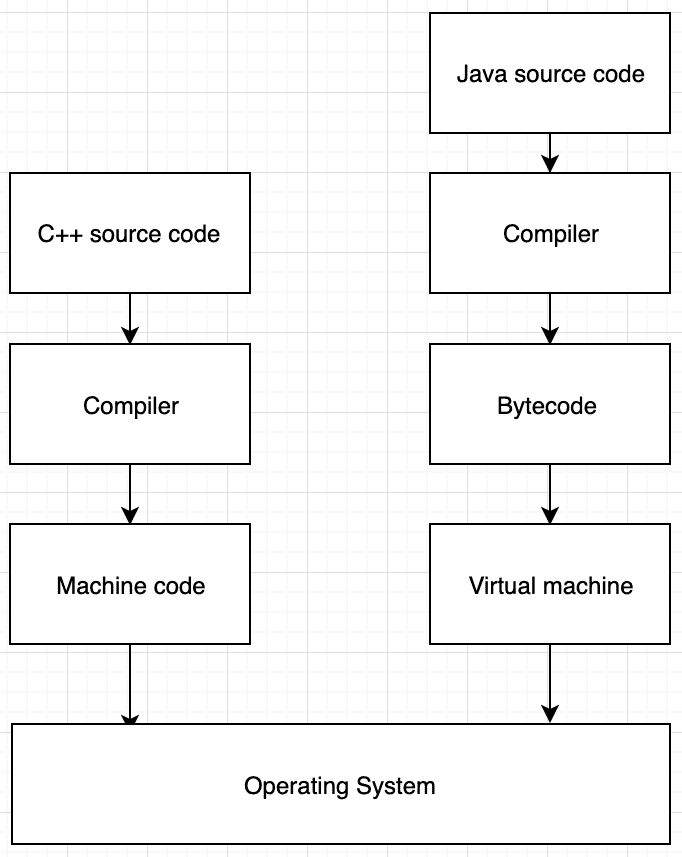
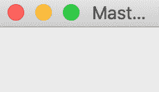
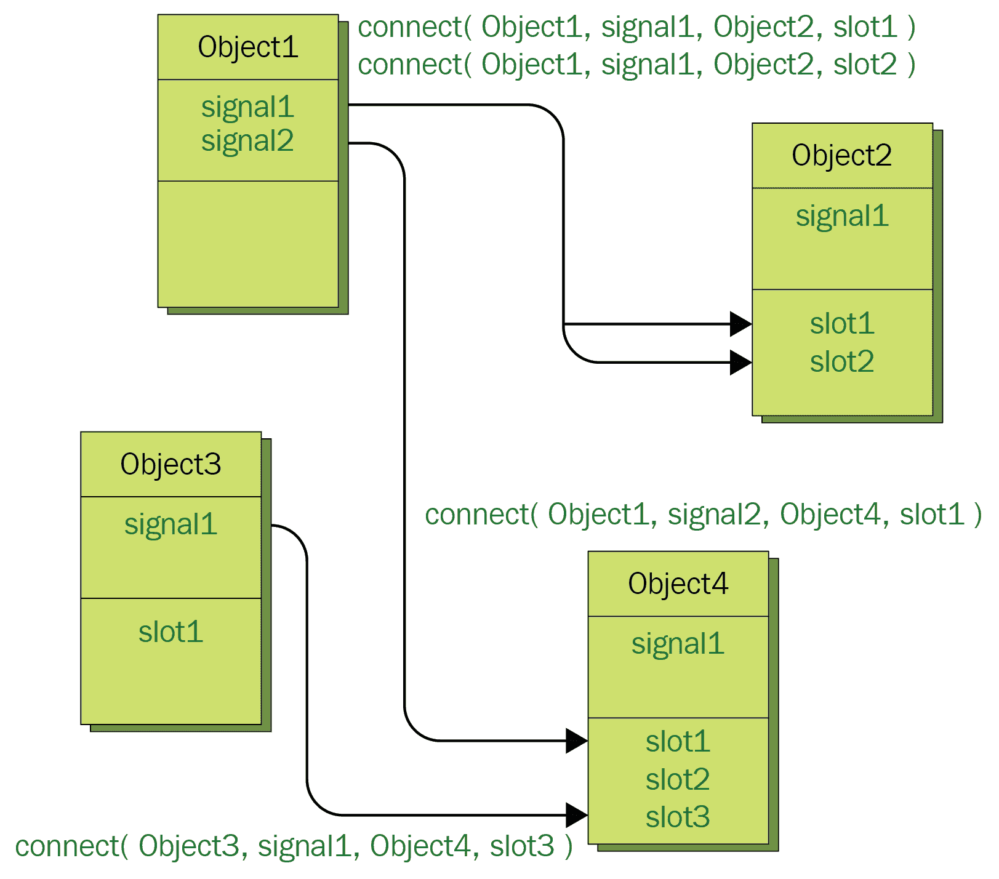
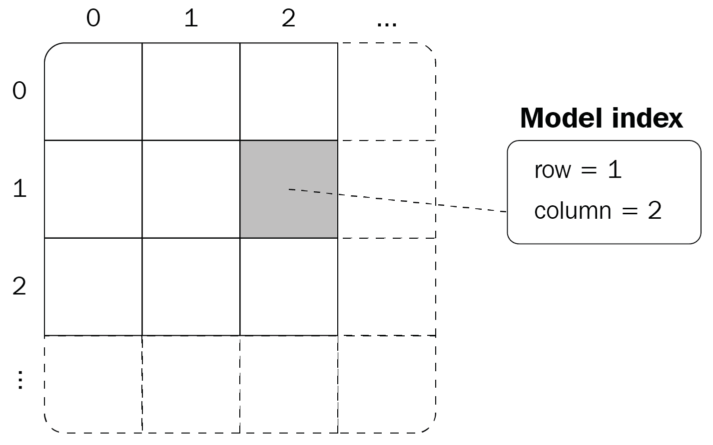
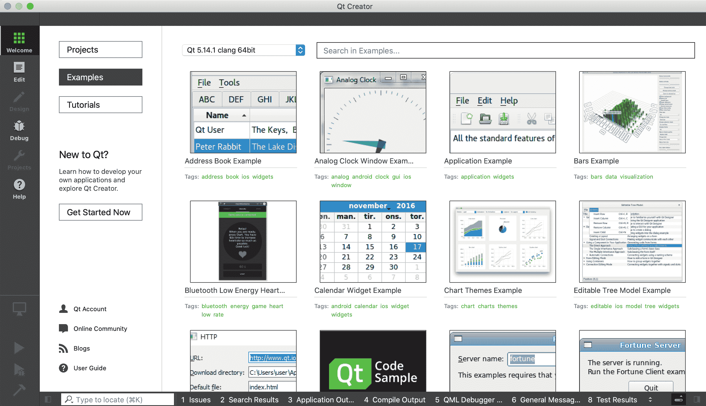
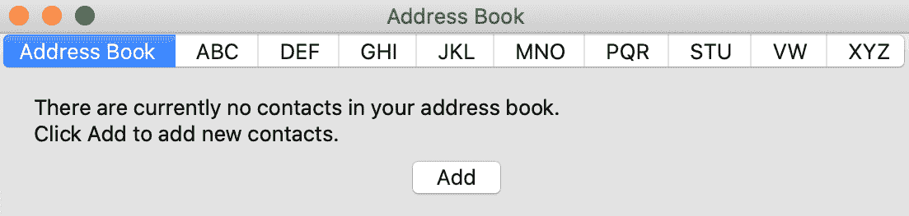
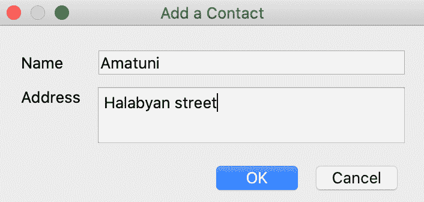
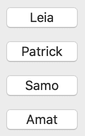

# 带 Qt 的图形用户界面

C++ 不提供**图形用户界面** ( **图形用户界面**)开箱即用的编程。首先，我们应该理解图形用户界面与特定的**操作系统** ( **操作系统**)紧密相关。您可以使用窗口应用编程接口在窗口中编程图形用户界面应用程序，或者使用特定于 Linux 的应用编程接口在 Linux 中编程图形用户界面应用程序，等等。每个操作系统都有自己特定形式的窗口和图形用户界面组件。

我们在[第 1 章](01.html)、*构建 C++ 应用*中谈到了不同的平台及其差异。当讨论 GUI 编程时，平台之间的差异甚至更令人生畏。跨平台开发已经成为图形用户界面开发人员生活中的一大痛苦。他们必须专注于特定的操作系统。为其他平台实现相同的应用程序需要花费几乎相同的工作量。那是对时间和资源的不合理的巨大浪费。像 *Java* 这样的语言提供了一个在虚拟环境中运行应用程序的智能模型。这允许开发人员专注于一种语言和一个项目，因为环境负责在不同的平台上运行应用程序。这种方法的主要缺点之一是迫使用户安装虚拟机，并且与特定于平台的应用程序相比，执行时间较慢。

为了解决这些问题，创建了 Qt 框架。在本章中，我们将了解 Qt 框架如何支持跨平台的图形用户界面应用程序开发。为此，您需要熟悉 Qt 及其关键特性。这将允许您使用您最喜欢的编程语言——c++ 开发图形用户界面应用程序。我们将从了解 Qt 的 GUI 开发方法开始，然后我们将介绍它的概念和特性，例如信号和插槽，以及 Model/View 编程。

在本章中，我们将涵盖以下主题:

*   跨平台图形用户界面编程基础
*   Qt 核心组件
*   使用 Qt 小部件
*   使用 Qt 网络设计网络应用程序

# 技术要求

您需要安装最新的 Qt 框架来运行本章中的示例。我们建议使用 Qt Creator 作为项目的集成开发环境。要下载 Qt 以及相应的工具，请访问 [qt.io](https://www.qt.io/) 网站，选择框架的开源版本。本章代码可在:[https://github.com/PacktPublishing/Expert-CPP](https://github.com/PacktPublishing/Expert-CPP)找到。

# 了解跨平台图形用户界面编程

每个操作系统都有自己的应用编程接口。它特别与图形用户界面相关。当公司计划设计、实现和发布桌面应用程序时，他们应该决定关注什么平台。在一个平台上工作的开发团队将花费几乎相同的时间为另一个平台编写相同的应用程序。最大的原因是操作系统提供了不同的方法和应用编程接口。应用编程接口的复杂性也可能在按时实现应用程序方面发挥重要作用。例如，以下来自官方文档的片段显示了如何使用 C++ 在 Windows 中创建按钮:

```cpp
HWND hwndButton = CreateWindow(
  L"BUTTON", // Predefined class; Unicode assumed      
  L"OK", // Button text      
  WS_TABSTOP | WS_VISIBLE | WS_CHILD | BS_DEFPUSHBUTTON, // Styles      
  10, // x position      
  10, // y position      
  100, // Button width     
  100, // Button height     
  m_hwnd, // Parent window     
  NULL, // No menu.     
  (HINSTANCE)GetWindowLong(m_hwnd, GWL_HINSTANCE),     
  NULL); // Pointer not needed.
```

解决 Windows GUI 编程需要您使用`HWND`、`HINSTACNCE`和许多其他奇怪的命名和混淆的组件。

。NET 框架对 Windows 图形用户界面编程进行了大刀阔斧的改进。如果要支持 Windows 以外的 OS，使用前要三思。NET 框架。

然而，为了支持多个操作系统，您仍然必须深入研究应用编程接口来实现相同的应用程序，以覆盖所有操作系统用户。下面的代码展示了一个在 Linux 中使用 *Gtk+* GUI 工具包创建按钮的例子:

```cpp
GtkWidget* button = gtk_button_new_with_label("Linux button");
```

相比 Windows API，似乎更容易理解一点。但是，您应该深入到`GtkWidgets`和其他带有 *Gtk* 前缀的组件中，以了解更多关于它们的信息。

正如我们已经提到的，跨平台语言，如 Java 和。NET Core 使用虚拟机在不同的平台上运行代码。Qt 框架使用基于平台的编译方法支持跨平台图形用户界面编程。让我们针对 C++ 语言来讨论这两种方法。

# 使用 C++ 作为 Java

Java 或 C#等语言有不同的编译模型。本书的第一章介绍了 C++ 编译模型。首先，我们认为 C++ 是一种完全可编译的语言，而 Java 维护的是一种混合模型。它将源代码编译成称为**字节码**的中间表示，然后虚拟机通过将其翻译成特定平台的机器代码来运行它。

下图描述了 C++ 和 Java 编译模型之间的差异:



**Java 虚拟机** ( **JVM** )作为中间层。它对每个平台都有一个独特的实现。用户需要在运行 Java 程序之前安装虚拟机的具体实现。安装过程只发生一次。另一方面，C++ 程序被翻译成机器代码，在没有 JVM 等中间层环境的情况下运行。这就是为什么 C++ 应用程序通常更快的原因之一。当我们在某个平台上编译 C++ 程序时，编译器输出一个由特定于该平台的格式的指令组成的可执行文件。当我们将应用程序移动到另一个平台时，它就是无法运行。

另一个平台不能识别它的格式，也不能识别它的指令(尽管它们在某些方面可能相似)。Java 方法通过呈现一些字节码来工作，这些字节码对于虚拟机的所有实现都是相同的。但是虚拟机确切地知道它们应该为作为输入提供的字节码生成哪个指令。如果安装了虚拟机，相同的字节码可以在许多计算机上运行。下图演示了 Java 应用程序编译模型:


如您所见，源代码被编译成字节码，可以在每个操作系统上运行。但是，每个操作系统都必须有自己的虚拟机实现。这意味着，如果我们安装了专门为任何操作系统实现的 JVM，我们就可以在该操作系统上运行 Java 应用程序。

虽然 C++ 是一种跨平台语言，这意味着我们不会修改代码以在其他平台上编译它，但该语言不支持开箱即用的图形用户界面编程。如前所述，要对图形用户界面应用程序进行编程，我们需要直接从代码中访问操作系统应用编程接口。这使得 C++ 图形用户界面应用程序依赖于平台，因为您需要修改代码库才能在另一个平台上编译它。下图显示了图形用户界面如何破坏语言的跨平台特性:


虽然应用程序的逻辑、名称和任务可能是相同的，但是它现在有三个不同的实现，有三个不同的可执行文件。为了将应用程序交付给最终用户，我们需要发现他们的操作系统并交付正确的可执行文件。在网上下载应用程序时，您可能会遇到类似的情况。他们提供基于操作系统的下载应用程序。这就是 Qt 出手相救的地方。让我们看看如何。

# Qt 的跨平台模式

Qt 是一个流行的小部件工具包，用于创建图形用户界面应用程序。它还允许我们创建运行在各种系统上的跨平台应用程序。Qt 由以下模块组成:

*   **Qt 核心**:核心类
*   **Qt****GUI**:GUI 组件的基类

*   **Qt 小部件**:用 C++ 小部件扩展 Qt 图形用户界面的类
*   **Qt 多媒体**:音频、视频、广播和相机功能类
*   **Qt 多媒体部件**:实现多媒体功能的类
*   **Qt 网络**:网络编程类(本章我们会用到)
*   **Qt 建模语言** ( **QML** ):一个用自定义用户界面构建应用程序的声明性框架
*   **Qt SQL** :使用 SQL 进行数据库集成的类
*   **Qt Quick 系列模块**:本书不会讨论的 QML 相关模块列表
*   **Qt 测试**:单元测试 Qt 应用的类

我们在程序中使用的每个模块都通过一个扩展名为`.pro`的项目文件连接到编译器。该文件描述了`qmake`构建应用程序所需的一切。 *qmake* 是一个旨在简化构建过程的工具。我们在项目的`.pro`文件中描述了项目组件(源代码、Qt 模块、库等等)。例如，一个使用 Qt Widgets 和 Qt Network 并由`main.cpp`和`test.cpp`文件组成的项目对于`.pro`文件将具有以下内容:

```cpp
QT += widgets
QT += network
SOURCES += test.cpp
SOURCES += main.cpp
```

我们也可以在`.pro`文件中指定平台特定的来源，如下所示:

```cpp
QT += widgets
QT += network
SOURCES += test.cpp
SOURCES += main.cpp
win32 {
 SOURCES += windows_specific.cpp
}
unix {
 SOURCES += linux_world.cpp
}
```

当我们在 Windows 环境中构建应用程序时，`windows_specific.cpp`文件将参与构建过程。与此相反，在 Unix 环境中构建时，将包含`linux_world.cpp`文件，而忽略`windows_specific.cpp`文件。至此，我们来到了 Qt 应用程序的编译模型。

Qt 提供跨平台编程的强大能力的全部要点是元编译源代码；也就是说，在代码被传递给 C++ 编译器之前，Qt 编译器会通过引入或替换特定于平台的组件来清理它。例如，当我们使用按钮组件(`QPushButton`)时，如果在 Windows 环境中编译，它将被特定于 Windows 的按钮组件替换。这就是为什么`.pro`文件也可以包含针对项目的特定于平台的修改。下图描述了此编译:


元编译器通常被称为**元对象编译器** ( **MOC** )。这种方法的好处在于，产生的输出代表了我们在没有虚拟机的情况下运行的相同的机器代码。我们可以马上发送可执行文件。这种方法的缺点是，我们在不同的平台上有不同的可执行文件。然而，我们只编写一个应用程序——不需要使用不同的语言，不需要钻研特定于操作系统的应用程序接口，也不需要研究特定于操作系统的图形用户界面组件类名。正如 Qt 所说，*写一次，到处编译*。现在，让我们继续构建一个简单的 GUI 应用程序。

# 编写简单的应用程序

我们不会讨论本书前面提到的所有模块，因为这需要一本全新的书。更多信息，请参考本章末尾的*进一步阅读*部分。`main`功能如下:

```cpp
#include <QtWidgets>

int main(int argc, char** argv)
{
  QApplication app(argc, argv);

  QPushButton btn("Click me!");
  btn.show();

  return app.exec();
}
```

让我们看看代码中使用的各种组件。第一个是`QtWidgets`头文件。它包含小部件组件，我们可以使用这些组件为我们的应用程序构建细粒度的图形用户界面。接下来是`QPushButton`类，它代表一个可点击按钮的包装器。我们有意将它作为包装器引入这里，以便我们在本章后面讨论 Qt 程序的编译过程时能够解释它。以下是运行上述代码的结果:


如您所见，我们只声明了`QPushButton`类，但它显示为一个窗口，带有操作系统标准的关闭和最小化按钮(在示例中，这是 macOS)。之所以这样，是因为`QPushButton`间接继承了`QWidget`，是一个带边框的小部件；也就是一扇窗户。这个按钮几乎占据了窗户的全部空间。我们可以调整窗口的大小，看看按钮是如何随之调整大小的。我们将在本章后面更详细地讨论小部件。

当我们运行`app.exec()`时，图形用户界面就建立了。注意`app`对象的类型。这是一个`QApplication`的对象。这是 Qt 应用的起点。当我们调用`exec()`函数时，我们启动 Qt 的事件循环。为了理解图形用户界面应用程序的生命周期，我们对程序执行的理解应该有所改变。在[第七章](07.html)、*功能编程*之后，重新定义程序构建和执行的概念应该不会让你感到惊讶。这次没那么难。这里要知道的主要事情是，图形用户界面应用程序有一个与主程序一起运行的附加实体。这个实体被称为**事件循环**。

Recall the event loop, which we discussed in [Chapter 11](11.html), *Designing a Strategy Game Using Design Patterns*. The game represents a program with visual components that the user intensively interacts with. The same relates to regular GUI applications with buttons, labels, and other graphical components.

用户与应用程序交互，每个用户操作都被解释为一个事件。然后，每个事件都被推入队列。事件循环逐个处理这些事件。处理事件意味着调用附加到事件的特殊处理函数。例如，只要点击一个按钮，就调用`keyPressedEvent()`功能。这是一个虚拟函数，因此我们可以在设计自定义按钮时覆盖它，如以下代码所示:

```cpp
class MyAwesomeButton : public QPushButton
{
  Q_OBJECT
public:
 void keyPressedEvent(QKeyEvent* e) override
 {
 // anything that we need to do when the button is pressed
 }
};
```

事件的唯一参数是指向`QEvent`子类型`QKeyEvent`的指针。`QEvent`是 Qt 中所有事件类的基类。注意放在班级开始块后面的奇怪的`Q_OBJECT`。这是一个特定于 Qt 的宏，如果你想让它们被 Qt 的 MOC 发现，它应该放在你定制类的第一行。

在下一节中，我们将介绍特定于 Qt 对象的信号和槽的机制。为了使我们的定制对象支持该机制，我们在类定义中放置`Q_OBJECT`宏。

现在，让我们构建一个比简单按钮更大的东西。以下示例创建一个标题为`Mastering C++ `的窗口:

```cpp
#include <QtWidgets>

int main(int argc, char** argv)
{
  QApplication app(argc, argv);
 QWidget window;
 window.resize(120, 100);
 window.setWindowTitle("Mastering C++");
 window.show();

  return app.exec();
}
```

下面是我们通过执行前面的程序得到的结果:



标题被剪了；我们只能看到桅杆...掌握 C++ 的一部分。现在，如果我们手动调整它的大小或更改源代码，使其对于`resize()`函数的第二个参数具有更大的值，我们会得到以下结果:


`window`对象属于`QWidget`类型。`QWidget`是所有用户界面对象的中心类。无论何时想要创建自定义小部件或扩展现有小部件，都可以直接或间接从`QWidget`继承。它对每个用例都有很多功能。可以使用`move()`功能在屏幕中移动，可以通过调用`showFullScreen()`使窗口全屏，等等。在前面的代码中，我们调用了`resize()`函数，该函数采用宽度和高度来调整小部件的大小。此外，注意`setWindowTitle()`函数，它完全按照 tin 上说的做——它将传递的字符串参数设置为窗口的标题。在代码中使用字符串值时，最好使用`QApplication::translate()`函数。它使程序本地化变得更加容易，因为当语言设置改变时，Qt 会自动用正确的翻译替换文本。`QObject::tr()`提供了几乎相同的功能。

`QObject` is the base class of all Qt types. In languages such as Java or C#, every object is directly or indirectly inherited from a generic type, mostly named `Object`. C++ doesn't incorporate a common base class. Qt, on the other hand, introduces `QObject`, which comes with the base functionality that all objects should support.

既然我们已经触及了 Qt 应用程序开发的基础，让我们更深入地了解一下这个框架，并发现它的关键特性。

# 发现 Qt

Qt 随着时间的推移而演变，在撰写本书时，它的版本是 5.14。它的第一个公开预发行版本于 1995 年公布。二十多年过去了，现在 Qt 有了很多强大的功能，几乎在所有平台上都有使用，包括安卓和 iOS 等移动系统。除了少数例外，我们可以自信地用 C++ 和 Qt 为所有平台编写功能齐全的 GUI 应用程序。这是一个巨大的游戏规则改变者，因为公司雇佣专门研究一种技术的小团队，而不是每个特定平台有几个团队。

如果你是 Qt 的新手，强烈建议你尽可能地熟悉它(参见本章末尾的书籍参考)。除了图形用户界面框架提供的常规组件之外，Qt 还引入了几个新的或在框架中灵活实现的概念。一个这样的概念是使用信号和插槽的对象之间的通信。

# 抓住信号和槽

Qt 引入了信号和槽的概念，作为对象之间灵活的通信机制。信号和槽的概念及其实现机制是 Qt 区别于其他图形用户界面框架的特征之一。在前几章中，我们讨论了观察者模式。这种模式的主要思想是让一个对象向其他对象(订阅者)通知一个事件。信号和时隙的机制类似于观察者模式的实现。这是一种对象通知另一个对象其变化的方式。Qt 提供了一个通用接口，可以通过将一个对象的信号连接到另一个对象的插槽来将对象连接在一起。信号和槽都是对象的常规成员函数。信号是在对象的指定操作上调用的函数。插槽是作为订户的另一个功能。它由信号函数调用。

正如我们之前提到的，Qt 向我们介绍了所有对象的基本类型，`QObject`。支持信号和插槽的基本功能在`QObject`中实现。您在代码中声明的任何对象、`QWidget`、`QPushButton`和其他对象都继承自`QObject`，因此它们都支持信号和插槽。QObject 为我们提供了两个管理对象通信的功能。这些物体是`connect()`和`disconnect()`:

```cpp
bool connect(const QObject* sender, const char* signal, 
  const QObject* receiver, const char* method, 
  Qt::ConnectionType type = Qt::AutoConnect);

bool disconnect(const QObject* sender, const char* signal, 
  const QObject* receiver, const char* method);
```

如您所见，`connect()`函数将`receiver`和`sender`对象作为参数。此外，它还采用信号和插槽的名称。`signal`与发送方相关，而`slot`是接收方提供的。下图显示了这一点:



在编写 Qt 应用程序时，使用信号和插槽进行操作将变得很自然，迟早，你会认为其他所有框架都会支持信号和插槽，因为它们很方便。另外，注意信号和槽在`connect()`和`disconnect()`功能中作为字符串处理。为了指定连接对象时的信号和插槽，我们使用了另外两个宏，`SIGNAL()`和`SLOT()`。从现在开始不再引入宏，我们保证。

下面是我们如何将两个物体连接在一起。假设我们想要更改标签的文本(一个`QLabel`的实例)，这样当按钮被点击时它会收到一个信号。为此，我们将`QPushButton`的`clicked()`信号连接到`QLabel`的插槽，如下所示:

```cpp
QPushButton btn("Click me!");
QLabel lbl;
lbl.setText("No signal received");
QObject::connect(&btn, SIGNAL(clicked()), &lbl, SLOT(setText(const QString&)));
```

前面的代码可能看起来有点冗长，但是你会习惯的。将其视为信号和插槽的便捷机制的价格。然而，前面的例子不会给我们所需的结果；也就是说，它不会将标签的文本设置为表示它收到了信号。我们应该以某种方式将该字符串传递给标签的插槽。`clicked()`信号对我们来说并不是这样。实现这一点的方法之一是扩展`QLabel`，使其实现一个自定义槽，将文本设置为`received a signal`。我们可以这样做:

```cpp
class MyLabel : public QLabel
{
Q_OBJECT
public slots:
  void setCustomText() { 
    this->setText("received a signal");
  }
};
```

为了声明一个槽，我们指定了部分，就像我们在前面的代码中所做的那样。信号的声明方式几乎相同:通过用`signals:`指定一个部分。唯一的区别是信号不能是私有的或受保护的。我们只是宣布它们是:

```cpp
class Example
{
Q_OBJECT:
public:
  // member functions
public slots:
  // public slots
private slots:
  // private slots
signals: // no public, private, or protected
  // signals without any definition, only the prototype
};
```

现在，我们应该只更新前面的代码，以便更改标签的信号(以及标签对象的类型):

```cpp
QPushButton btn("Click me!");
MyLabel lbl;
lbl.setText("No signal received");
QOBject::connect(&btn, SIGNAL(clicked()), &lbl, SLOT(setCustomText()));
```

我们说当信号发出时会调用槽。您也可以在对象内部声明和发出信号。与信号和插槽相关的一个重要细节是，它们独立于图形用户界面事件循环。

当发出信号时，立即执行连接的插槽。但是，我们可以通过传递`Qt::ConnectionType`之一作为`connect()`函数的第五个参数来指定连接的类型。它包含以下值:

*   `AutoConnection`
*   `DirectConnection`
*   `QueuedConnection`
*   `BlockingQueuedConnection`
*   `UniqueConnection`

在`DirectConnection`中，当信号发出时，槽立即被调用。另一方面，当使用`QueuedConnection`时，当执行返回到接收器对象线程的事件循环时，槽被调用。`BlockingQueuedConnection`类似于`QueuedConnection`，只是信号线程被阻塞，直到槽返回一个值。`AutoConnection`可以是`DirectConnection`也可以是`QueuedConnection`。类型由发出信号的时间决定。如果接收器和发射器在同一线程中，则使用`DirectConnection`；否则，连接到`QueuedConnection`。最后，`UniqueConnection`用于前面描述的任何连接类型。它使用按位“或”与其中一个进行组合。其唯一目的是使`connect()`功能在信号和线程之间已经建立连接的情况下失效。

信号和槽形成了一个强大的机制，使 Qt 成为图形用户界面编程中一个杰出的框架。我们介绍的下一种机制在框架中很流行，它与我们在应用程序中操作数据的方式有关。

# 理解模型/视图编程

模型/视图编程源于**模型视图控制器** ( **MVC** )设计模式。该模式背后的主要思想是将您的问题分解成三个松散耦合的组件，如下所示:

*   负责存储和操作数据的模型
*   视图，负责呈现和可视化数据
*   控制器，负责附加的业务逻辑，并从模型向视图提供数据

通过它的演变，我们现在有了一种简化且更方便的编程方法，称为**模型/视图编程**。它类似于 MVC 模式，只是它通过使视图和模型更关心手边的功能而省略了控制器。我们可以说视图和控制器在模型/视图架构中结合在一起。看看下面的架构图:


模型表示数据，数据与其源进行通信，并为体系结构中的其他组件提供方便的接口。模型的实现及其与其他组件的通信是基于手头的数据类型的。

视图通过获取所谓的模型索引来获取对数据项的引用。视图可以检索数据并将其提供给模型。关键是，可以使用视图编辑数据项，委托扮演着与模型通信的角色，以保持数据同步。

每个引入的组件——模型、视图和委托——都是由提供公共接口的抽象类定义的。在某些情况下，类还提供功能的默认实现。为了编写专门的组件，我们从抽象类中子类化。当然，模型、视图和委托使用信号和插槽进行通信，我们在上一节中已经介绍过了。

当模型遇到数据变化时，它会通知视图。另一方面，来自视图的信号通知用户与呈现的数据项的交互。最后，来自委托的信号通知模型和视图关于数据编辑的状态。

模型基于`QAbstractItemModel`类，该类定义了视图和委托使用的接口。Qt 提供了一组现有的模型类，我们无需修改就可以使用；但是，如果需要创建新模型，应该从`QAbstractItemModel`继承类。例如，`QStringListModel`、`QStandardItemModel`和`QFileSystemModel`类都是现成的，可以处理数据项。`QStringListModel`用于存储字符串项列表(表示为`QString`对象)。此外，还有用于处理 SQL 数据库的方便的模型类。`QSqlQueryModel`、`QSqlTableModel`和`QSqlRelationalTableModel`允许我们在模型/视图约定的上下文中访问关系数据库。

视图和委托也有对应的抽象类，即`QAbstractItemView`和`QAbstractItemDelegate`。Qt 提供了可以立即使用的现有视图，如`QListView`、`QTableView`和`QTreeView`。这些是大多数应用程序处理的基本视图类型。`QListView`显示项目列表，`QTableView`在表格中显示数据，`QTreeView`在层次列表中显示数据。如果您想使用这些视图类，Qt 建议从`QAbstractListModel`或`QAbstractTableModel`继承您的定制模型，而不是子类化`QAbstractItemModel`。

`QListView`、`QTreeView`、`QTableView`被认为是核心低级类。有更方便的类为 Qt 程序员新手提供更好的可用性-`QListWidget`、`QTreeWidget`和`QTableWidget`。我们将在本章的下一节中查看使用小部件的示例。在此之前，我们先来看一个简单的`QListWidget`动作的例子:

```cpp
#include <QListWidget>

int main(int argc, char** argv)
{
  QApplication app(argc, argv);
  QListWidget* listWgt{new QListWidget};
  return app.exec();
}
```

向列表小部件添加项目的方法之一是创建它们，我们可以通过将列表小部件设置为其所有者来实现。在下面的代码中，我们声明了三个`QListWidgetItem`对象，每个对象都有一个名称，并且与我们前面声明的列表小部件相关联:

```cpp
new QListWidgetItem("Amat", listWgt);
new QListWidgetItem("Samvel", listWgt);
new QListWidgetItem("Leia", listWgt);
```

或者，我们可以声明一个项目，然后将其插入列表小部件:

```cpp
QListWidgetItem* newName{new QListWidgetItem};
newName->setText("Sveta");
listWgt->insertItem(0, newName);
```

`insertItem()`成员函数的第一个参数是要插入项目的`row`的数量。我们将`Sveta`项目放在列表的第一位。

既然我们已经触及了行的概念，我们应该回到模型和它们的索引。该模型将数据封装为数据项的集合。模型中的每个项目都有一个由`QModelIndex`类指定的唯一索引。这意味着模型中的每一项都可以被相关的模型索引访问。要获得模型索引，我们需要使用`index()`功能。下图描述了一个以类似表的结构组织其数据的模型:



视图使用此约定来访问模型中的数据项。但是，请注意，视图在如何向用户呈现数据方面不受限制。如何以方便用户的方式呈现数据取决于视图实现。下图显示了数据在模型中的组织方式:


下面是我们如何使用模型索引访问第 1 行第 2 列的特定数据项:

```cpp
QModelIndex itemAtRow1Col2 = model->index(1, 2);
```

最后，让我们声明一个视图，并为其设置一个模型，以查看模型/视图编程的运行情况:

```cpp
QStringList lst;
lst << "item 1" << "item 2" << "item 3";

QStringListModel model;
model.setStringList(lst);

QListView lview;
lview.setModel(model);
```

一旦我们熟悉了 Qt 提供的各种小部件，我们将在下一节继续这个例子。

# 使用 Qt 小部件

小部件是可视化的图形用户界面组件。如果一个小部件没有父部件，它将被视为一个窗口，或者称为**顶级小部件**。在本章的前面，我们在 Qt 中创建了最简单的窗口，如下面的代码所示:

```cpp
#include <QtWidgets>

int main(int argc, char** argv)
{
  QApplication app(argc, argv);
 QWidget window;
 window.resize(120, 100);
 window.setWindowTitle("Mastering C++");
 window.show();

  return app.exec();
}
```

如您所见，`window`对象没有父对象。事情是这样的，`QWidget`的构造器取另一个`QWidget`作为当前一个的父。因此，当我们声明一个按钮并希望它是我们的`window`对象的子对象时，我们按照以下方式进行:

```cpp
#include <QtWidgets>

int main(int argc, char** argv)
{
  QApplication app(argc, argv);
QWidget window;
  window.resize(120, 100);
  window.setWindowTitle("Mastering C++");
  window.show();

 QPushButton* btn = new QPushButton("Click me!", &window);

  return app.exec();
}
```

观察`QPushButton`构造函数的第二个参数。我们传递了对`window`对象的引用作为其父对象。当父对象被销毁时，其子对象会自动被销毁。Qt 还支持许多其他小部件；让我们来看看其中的一些。

# 常见 Qt 小部件

在前一节中，我们介绍了`QPushButton`类，并声明它间接继承了`QWidget`类。为了创建一个窗口，我们使用了`QWidget`类。事实证明，QWidget 代表了呈现给屏幕的能力，它是所有 Widget 继承的基本类。它有很多属性和功能，比如`enabled`，一个布尔属性，如果小部件被启用，它就是真的。要访问它，我们使用`isEnabled()`和`setEnabled()`功能。为了控制小部件的大小，我们使用它的`height`和`width`，它们代表小部件的高度和宽度。为了得到他们的价值观，我们分别称之为`height()`和`width()`。要设置新的高度和宽度，我们应该使用`resize()`函数，该函数接受两个参数——宽度和高度。您也可以使用`setMinimumWidth()`、`setMinimumHeight()`、`setMaximumWidth()`和`setMaximumHeight()`功能控制小部件的最小和最大尺寸。当您在布局中设置小部件时，这可能会很有用(参见下一节)。除了属性和功能，我们主要对 QWidget 的公共槽感兴趣，具体如下:

*   `close()`:关闭小部件。
*   `hide()`:相当于`setVisible(false)`，此功能隐藏小部件。
*   `lower()`和`raise()`:在父小部件的堆栈中移动小部件(底部或顶部)。每个小部件可以有一个父小部件。没有父小部件的小部件成为一个独立的窗口。我们可以使用`setWindowTitle()`和`setWindowIcon()`功能设置该窗口的标题和图标。
*   `style`:属性保存小部件的样式。要修改它，我们使用`setStyleSheet()`函数，传递一个描述小部件样式的字符串。另一种方法是调用`setStyle()`函数，并传递一个封装样式相关属性的`QStyle`类型的对象。

Qt 小部件几乎具备了开箱即用的所有必要属性。您很少遇到必须构建自己的小部件的情况。然而，一些团队为他们的软件创建了一整套定制的小部件。如果你打算为你的程序定制外观，那很好。例如，您可以合并平面样式的小部件，这意味着您必须修改框架提供的默认小部件的样式。自定义小部件应该继承自`QWidget`(或其任何后代)，如下所示:

```cpp
class MyWidget : public QWidget
{}; 
```

如果希望小部件公开信号和插槽，需要在类声明的开头使用`Q_OBJECT`宏。更新后的`MyWidget`类的定义如下:

```cpp
class MyWidget : public QWidget
{
Q_OBJECT
public:
  // public section

signals: 
  // list of signals

public slots:
  // list of public slots
};
```

正如您可能已经猜到的，信号没有访问修饰符，而插槽可以分为公共、私有和受保护的部分。正如我们之前提到的，Qt 提供了足够多的开箱即用的小部件。为了浏览小部件集，Qt 提供了一组将小部件组合在一起的例子。如果您已经安装了 Qt Creator(开发 Qt 应用程序的集成开发环境)，您应该能够一键浏览示例。以下是 Qt Creator 中的外观:



配置和运行地址簿示例将为我们提供以下界面:



单击添加按钮将打开一个对话框，这样我们就可以向地址簿添加一个新条目，如下所示:



添加几个条目后，主窗口会在一个表中显示这些条目，如下所示:


前面的截图显示了在一个应用程序中组合在一起的各种小部件。以下是我们在 GUI 应用程序开发中经常使用的一些最常见的小部件:

*   `QCheckBox`:表示带有文本标签的复选框。
*   `QDateEdit`:表示可以用来输入日期的小部件。如果想输入时间，也可以使用`QDateTimeEdit`。
*   `QLabel`:文字显示。也用于显示图像。
*   `QLineEdit`:单行编辑框。

*   `QProgressBar`:渲染垂直或水平进度条。
*   `QTabWidget`:作为选项卡式小部件的堆栈。这是许多组织器小部件之一。其他一些组织者是`QButtonGroup`、`QGroupBox`和`QStackedWidget`。

前面的列表不是最终的，但它给出了 Qt 能力的基本概念。我们在这里使用的地址簿示例使用了许多这样的小部件。`QTabWidget`代表一个组织小部件。它将几个小部件组合在一起。组织小部件的另一种方法是使用布局。在下一节中，我们将向您介绍如何将小部件组织在一起。

# 使用布局组合小部件

Qt 为我们提供了一个灵活简单的平台，在这里我们可以使用布局形式的小部件排列机制。这有助于我们确保小部件内部的空间得到有效利用，并提供友好的用户体验。

让我们看看布局管理类的基本用法。使用布局管理类的优势在于，当容器小部件改变其大小时，它们会自动调整小部件的大小和位置。Qt 布局类的另一个优点是，它们允许我们通过编写代码而不是使用用户界面编辑器来排列小部件。虽然 Qt Creator 提供了一种很好的手工组合小部件的方式(在屏幕上拖放小部件)，但是大多数程序员在实际编写代码来安排小部件的外观和感觉时会感觉更舒服。假设您也喜欢后一种方法，我们将介绍以下布局类:

*   `QHBoxLayout`
*   `QVBoxLayout`
*   `QGridLayout`
*   `QFormLayout`

所有这些类都继承自`QLayout`，几何管理的基类。`QLayout`是继承自`QObject`的抽象基类。不继承`QWidget`因为与渲染无关；相反，它负责组织应该呈现在屏幕上的小部件。您可能不需要实现自己的布局管理器，但是如果需要，您应该从`QLayout`继承您的类，并为以下函数提供实现:

*   `addItem()`
*   `sizeHint()`
*   `setGeometry()`

*   `itemAt()`
*   `takeAt()`
*   `minimumSize()`

这里列出的类足以组成几乎任何复杂的小部件。更重要的是，我们可以将一种布局放入另一种布局中，从而形成更灵活的小部件组织。使用`QHBoxLayout`，我们可以从左到右水平组织小部件，如下图截图所示:


为了实现上述组织，我们需要使用以下代码:

```cpp
QWidget *window = new QWidget;
QPushButton *btn1 = new QPushButton("Leia");
QPushButton *btn2 = new QPushButton("Patrick");
QPushButton *btn3 = new QPushButton("Samo");
QPushButton *btn4 = new QPushButton("Amat");

QHBoxLayout *layout = new QHBoxLayout;
layout->addWidget(btn1);
layout->addWidget(btn2);
layout->addWidget(btn3);
layout->addWidget(btn4);

window->setLayout(layout);
window->show();
```

看看我们在小部件上调用`setLayout()`函数的那一行。可以为每个小部件分配一个布局。没有容器，布局本身没有多大用处，因此我们需要将其设置为一个小部件，作为有组织的小部件(在我们的例子中是按钮)的容器。`QHBoxLayout`继承自`QBoxLayout`，后者有我们之前列出的另一个后代—`QVBoxLayout`。类似于`QHBoxLayout`但是垂直组织小部件，如下图所示:



在前面的代码中，我们唯一需要做的就是将`QHBoxLayout`替换为`QVBoxLayout`，如下所示:

```cpp
QVBoxLayout* layout = new QVBoxLayout;
```

`GridLayout`允许我们将小部件组织成一个网格，如下图截图所示:


下面是相应的代码块:

```cpp
QGridLayout *layout = new QGridLayout;
layout->addWidget(btn1, 0, 0);
layout->addWidget(btn2, 0, 1);
layout->addWidget(btn3, 1, 0);
layout->addWidget(btn4, 1, 1);
```

最后，与`QGridLayout`类似，`QFormLayout`在设计输入表单时更有帮助，因为它以两列描述的方式布局小部件。

正如我们之前提到的，我们可以将一个布局组合成另一个布局。为此，我们需要使用`addItem()`功能，如下所示:

```cpp
QVBoxLayout *vertical = new QVBoxLayout;
vertical->addWidget(btn1);
vertical->addWidget(btn2);

QHBoxLayout *horizontal = new QHBoxLayout;
horizontal->addWidget(btn3);
horizontal->addWidget(btn4);

vertical->addItem(horizontal);

```

布局管理器足够灵活，可以构建复杂的用户界面。

# 摘要

如果你是 Qt 新手，这一章将作为框架的一般性介绍。我们谈到了图形用户界面应用程序开发的基础，并将 Java 方法与 Qt 方法进行了比较。使用 Qt 的最大好处之一是它支持跨平台开发。虽然 Java 也是这样做的，但是 Qt 通过生成平台本地的可执行文件超越了这一点。这使得用 Qt 编写的应用程序比包含虚拟机的替代程序快得多。

我们还讨论了 Qt 的信号和槽作为对象间通信的灵活机制。通过使用这个，您能够在您的图形用户界面应用程序中设计复杂的通信机制。虽然我们在本章中看到了一些相当简单的例子，但是您可以自由地尝试使用信号和插槽的各种方式。我们还熟悉了常见的 Qt 小部件和布局管理机制。您现在有了一个基本的理解，允许您设计甚至是最复杂的图形用户界面布局。这意味着通过应用本章中介绍的技术和小部件，您可以自由地实现复杂的 Qt 应用程序。在下一章中，我们将讨论一个时下流行的话题——人工智能和机器学习。

# 问题

1.  为什么 Qt 不需要虚拟机？
2.  `QApplication::exec()`功能是做什么的？
3.  您将如何更改顶级小部件的标题？
4.  给定`m`模型，您将如何访问第 2 行和第 3 列的项目？
5.  给定`wgt`小部件，你会如何将其宽度改为 400，高度改为 450？
6.  从`QLayout`继承创建自己的布局管理器类应该实现哪些功能？
7.  如何将信号连接到插槽？

# 进一步阅读

*   *Qt5 C++ GUI 编程食谱*作者:李志英:[https://www . packtpub . com/application-development/Qt5-C-GUI-编程-食谱-第二版](https://www.packtpub.com/application-development/qt5-c-gui-programming-cookbook-second-edition)
*   *掌握 Qt5* 作者:纪尧姆·耶戈，罗宾·佩娜:[https://www . packtpub . com/web-development/Mastering-Qt-5-第二版](https://www.packtpub.com/web-development/mastering-qt-5-second-edition)