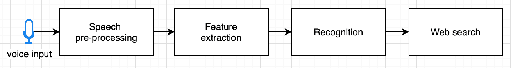
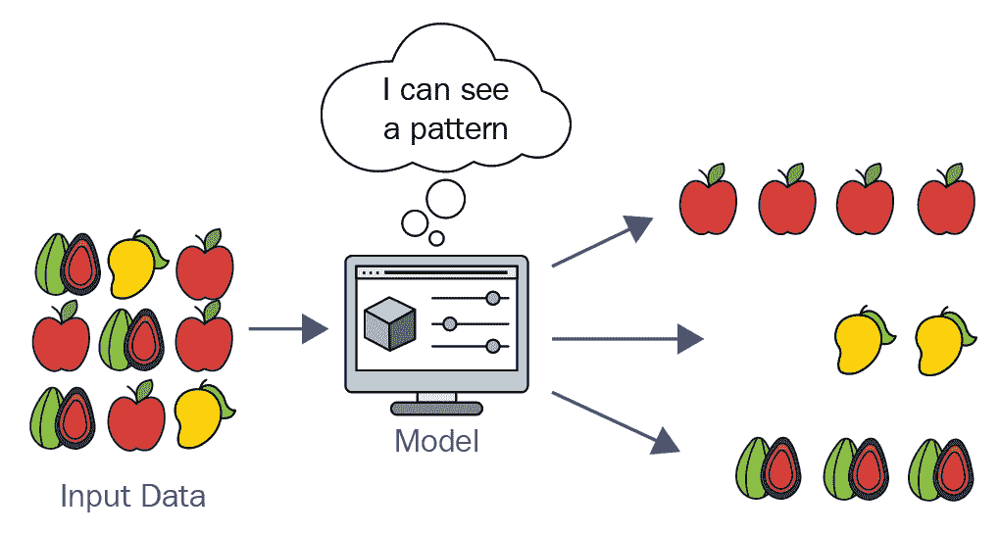
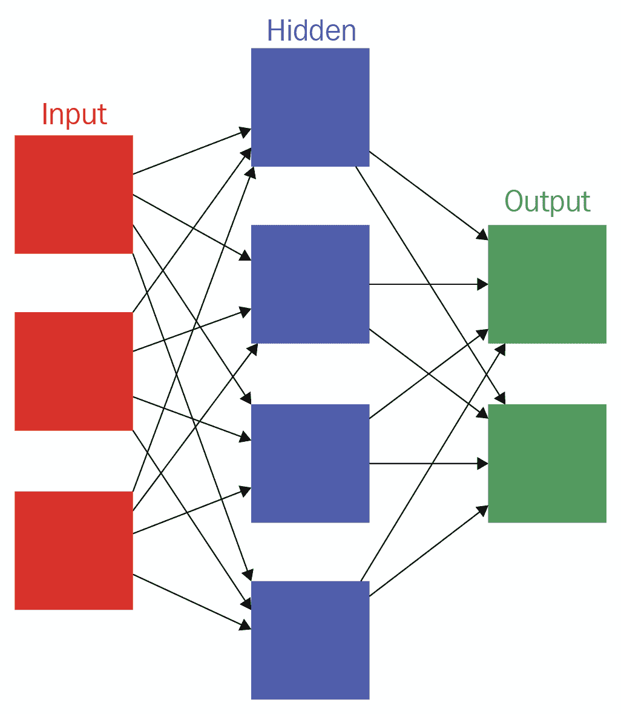
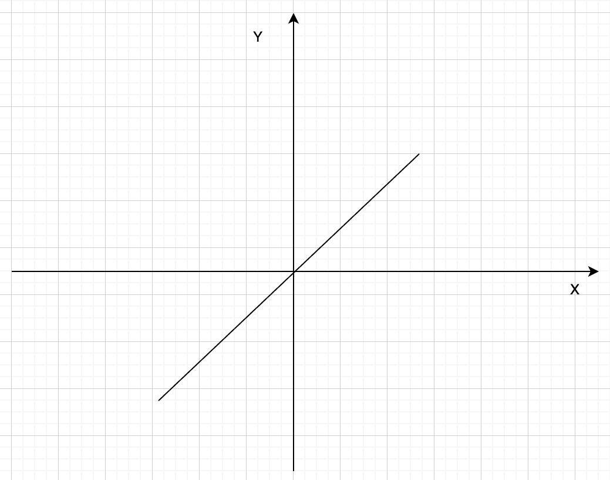
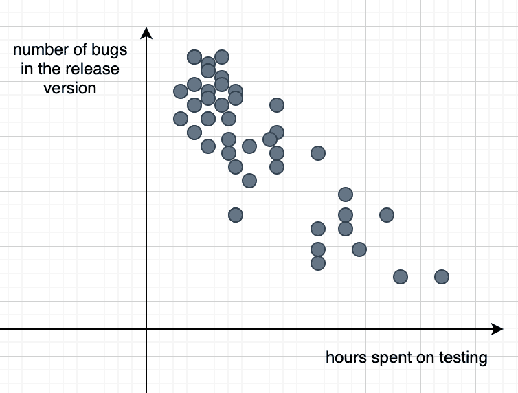

# C++在机器学习任务中的应用

**人工智能** ( **AI** )和**机器学习** ( **ML** )最近越来越流行。从简单的食品配送网站到复杂的工业机器人，人工智能已经被宣布为驱动软件和硬件的主要功能之一。虽然大多数时候，这些术语被用来让产品看起来更严肃，但一些公司正在深入研究并将人工智能纳入他们的系统。

在我们进一步讨论之前，请考虑这一事实:从 C++程序员的角度来看，这一章是对 ML 的温和介绍。关于更全面的文献，请参考本章末尾的书单。在这一章中，我们将介绍人工智能和人工智能的概念。虽然最好有数学背景，但我们在本章中几乎不使用任何数学。如果你打算扩大自己的技能范围，潜心学习 ML，你必须先考虑学习数学。

除了介绍概念之外，本章还提供了 ML 中的任务示例。我们将实现它们，并给你一个基本的想法，你应该如何研究和解决更复杂的任务。

我们将在本章中讨论以下主题:

*   人工智能和人工智能概论
*   最大似然法的分类及应用
*   设计用于计算的 C++类
*   神经网络结构及其实现
*   回归分析和聚类

# 技术要求

带有`-std=c++2a`选项的 g++编译器用于编译本章中的示例。你可以在[https://github.com/PacktPublishing/Expert-CPP](https://github.com/PacktPublishing/Expert-CPP)找到本章使用的源文件。

# 人工智能导论

人工智能最简单的定义是机器人像人类一样行动。这是机器展示的智慧。接下来是关于智力定义的讨论。我们如何为机器定义它，我们应该在什么水平上大声喊出我们正在与智能机器打交道？

如果你不熟悉验证机器智能的不同测试，一种流行的方法是图灵测试。这个想法是让一个审讯者向两个人提问，其中一个是机器，另一个是人。如果审讯者不能明确区分这两者，机器应该被认为是智能的。

The Turing test is named after Alan Turing. The test was introduced in his paper *Computing Machinery and Intelligence* in 1950\. He proposed using the imitation game to determine whether a machine thinks like a human.

被审问的人在墙后，这样审问者就看不见他们了。审讯者然后向两个参与者提出几个问题。下图展示了询问器如何与人和机器通信，但却看不到它们:


当你开始涉足 AI 领域，智能的定义就越来越模糊。问题可以以任何形式向机器提问:文本、音频、视频等等。有许多东西可能永远不会在机器中出现，比如它们脸上的表情。有时候人们通过对方脸上的表情来了解对方的心情。你无法确定机器人是否会理解甚至能够模仿它脸上的情绪。没有人教会我们生气时要看起来很生气。没有人教会我们要有情绪。他们就在那里。很难说有一天，类似的东西是否会在机器上实现。

当谈到人工智能时，大多数时候我们假设它是关于一个说话和行为类似于人类的机器人。但是当你作为一个程序员试着去解剖它的时候，你会遇到很多子领域，每一个都需要很多时间去理解。许多领域有许多任务正在进行中或处于早期研究阶段。以下是你在职业生涯中可能感兴趣的人工智能子领域:

*   **计算机视觉**:通过分析物体的视觉表征，设计视觉物体识别和理解的算法。人类很容易在人群中发现一张熟悉的脸，但是为机器实现类似的功能可能需要很多时间来获得与人类相同的准确性。
*   **自然语言处理** ( **NLP** ):机器对文本的语言分析。它在各个领域都有应用，比如机器翻译。想象一下，计算机完全理解人类书写的文本，这样我们就可以告诉它该做什么，而不是花几个月的时间学习一门编程语言。
*   **知识推理** : 这似乎是机器智能行为的明显目标。知识推理关注的是让机器推理，并根据它们拥有的信息提供解决方案；例如，通过检查医疗状况来提供诊断。
*   **ML** :机器在没有明确指令的情况下执行任务所使用的算法和统计模型的研究领域。ML 算法依赖模式和推理，而不是直接指令。也就是说，ML 允许机器独立完成工作，无需人工参与。

让我们分别讨论前面的子字段，然后集中讨论 ML。

# 计算机视觉

计算机视觉是一个综合性的研究领域，有许多正在进行的研究项目。它关注几乎所有与视觉数据处理相关的事情。它在各个领域都有广泛的应用；例如，人脸识别软件处理来自遍布城市的各种摄像头的数据，以发现和确定犯罪嫌疑人，或者光学字符识别软件，从包含文本的图像中产生文本。结合一些**增强现实** ( **AR** )技术，该软件能够将图像中的文本翻译成用户熟悉的语言。

这个领域的研究日益取得进展。结合人工智能系统，计算机视觉是让机器像我们一样感知世界的领域。然而，对我们来说，一个简单的任务在计算机视觉方面很难实现。例如，当我们在图像中看到一个物体时，我们很容易发现它的尺寸。例如，以下图像表示自行车的前视图:


即使我们不提那是一辆自行车，人类也不难确定。对我们来说很明显，底部中心的黑色粗线是自行车的前轮。很难让计算机明白它是一个轮子。计算机所看到的只是像素的集合，其中一些像素具有相同的颜色:


除了了解自行车的轮子，还应该推断出这辆自行车一定有另一个在图像中不可见的轮子。同样，我们可能会猜测自行车的大致尺寸，而计算机从图像中确定它是一项综合任务。也就是说，在我们看来简单的事情可能会成为计算机视觉领域的一个真正挑战。

We suggest using the OpenCV library for computer vision tasks. It is a cross-platform library written in C and C++. OpenCV represents a set of functions aimed at real-time computer vision, including ,but not limited to, facial recognition, gesture recognition, motion understanding, motion tracking, and other features. 

计算机视觉中的典型任务包括对象识别、识别和检测。物体识别是从前面的图像中理解物体是车辆。识别是识别一个物体的单个实例，例如前面图像中的自行车车轮。物体检测任务可能包括从自行车图像中找到损坏的区域。所有这些任务与最大似然算法相结合，可能会构成一个全面的软件，以接近人类的方式理解其周围环境。

# 自然语言处理

另一个有趣的研究领域是自然语言处理。NLP 努力让计算机理解人类语言。更广义的方法是自动语音识别和自然语言理解；虚拟助手的一个关键特性。例如，今天，用你的手机聊天并让它在网上搜索某样东西已经不再神奇了。所有的过程都是由语音和文本分析中的复杂算法驱动的。下图显示了会话代理背后发生的过程的高级视图:



许多语言处理任务都与网络有关。处理用户输入以在网络上数百万个文档中进行搜索的搜索引擎是自然语言处理的顶级应用之一。在下一章中，我们将深入研究搜索引擎的设计和实现。搜索引擎设计的主要关注点之一是处理文本数据。搜索引擎不能只存储所有的网站，并响应用户的第一个匹配查询。自然语言处理中有许多复杂的任务。假设我们正在设计一个用文本文档输入的程序，我们应该在文档中输出句子。识别句子的开头和结尾是一项复杂的任务。下面的句子是一个简单的例子:

```cpp
I love studying C++. It's hard, but interesting. 
```

程序将输出两句话:

```cpp
I love studying C++.
It's hard, but interesting.
```

就编码任务而言，我们只需搜索。(点)字符，并确保第一个单词以大写字母开头。如果其中一个句子有以下形式，程序会如何运行？

```cpp
I love studying C++!
```

由于在句子的结尾有一个感叹号，我们应该重新检查我们的程序，添加另一个识别句子结尾的规则。如果一个句子这样结束呢？

```cpp
It's hard, but interesting...
```

一个接一个，越来越多的规则和定义被引入，以拥有一个功能齐全的句子提取器。在解决自然语言处理任务时，利用最大似然将我们推向更聪明的方向。

另一个与语言相关的任务是机器翻译，它会自动将文档从一种语言翻译成另一种语言。此外，请注意，构建一个全面的自然语言处理系统将有利于其他研究领域，如知识推理。

# 知识推理

知识推理是让计算机以与人类相似的方式思考和推理。想象一下与机器对话，开始是这样的:

```cpp
[Human] Hello
[Machine] Hello
```

我们可以对机器进行编程，以回答特定的问题或理解用户输入的复杂文本，但根据以前的经验让机器推理要困难得多。例如，以下推理是研究的目标之一:

```cpp
[Human] I was walking yesterday and it was raining.
[Machine] Nice.
[Human] I should dress warmer next time.
[Machine] OK.
[Human] I think I have a temperature.
[Machine] Did you caught a cold yesterday?
[Human] I guess so.
```

虽然发现感冒和下雨之间的联系似乎很容易，但程序需要花很大的努力才能推断出来。它一定把下雨和感冒联系在一起，把发烧和感冒联系在一起。它还应该记住以前的输入，以便智能地保持对话。

前面提到的所有研究领域都是程序员可以深入研究的令人兴奋的领域。最后，就为每个特定应用设计算法和模型而言，ML 通常是所有其他领域的基础。

# 机器语言(Machine Language)

ML 将我们带到了一个全新的水平，让机器像人类一样执行任务，甚至可能更好。与我们之前介绍的领域相比，ML 的目标是构建能够在没有特定指令的情况下完成事情的系统。在发明人工智能机器的旅程中，我们应该更仔细地观察人类的智能。孩子出生后，不会表现出聪明的行为，而是开始慢慢熟悉周围的世界。没有任何一个 1 个月大的孩子解微分方程或作曲的记录证据。就像孩子学习和发现世界一样，ML 关心的是建立直接执行任务的基础模型，而是能够学习如何去做。这就是将系统设置为执行预定义的指令和让它自己解决问题之间的根本区别。

当一个孩子开始走路、拿东西、说话和提问时，他们就一步一步地获得了关于世界的知识。她或他拿起一本书，尝一尝它的味道，迟早会停止把书当成可食用的东西来咀嚼。几年过去了，孩子现在打开书的书页，在里面寻找图像和组成文字的小图形。又过了几年，孩子开始阅读它们。随着时间的推移，大脑变得越来越复杂，神经元之间的联系也越来越多。这个孩子变成了一个聪明的人。

想象一个系统，里面有一些神奇的算法和模型。在给它喂了一堆数据后，它会越来越能理解，就像孩子通过处理视觉数据(通过他们的眼睛看)或气味或味道形式的输入数据来了解世界一样。后来，通过开发一种提问方式，孩子可以理解单词，并将这些单词与现实世界中的物体，甚至是无形的概念联系起来。ML 系统的作用方式几乎相同。他们处理输入数据，并产生一些符合我们预期结果的输出。下图说明了这个想法:


现在让我们深入了解 ML。一如既往，理解新事物的最好方法是首先尝试实现它。

# 理解 ML

ML 是一个很大的研究领域，有很多研究正在进行中，并且正在迅速扩展。要理解 ML，首先要理解学习的本质。思考和推理是使我们——人类——与众不同的关键概念。ML 的核心是使系统学习并使用知识来执行任务。你可能会想起你学习编程的第一步。我们确信这并不容易。你必须学习新的概念，建立抽象概念，让你的大脑明白在程序执行的情况下发生了什么。之后，你应该使用那些在初级读本中描述为关键字、指令、条件语句、函数、类等的小构件来构建复杂的系统。

然而，ML 程序不同于我们通常创建的程序。看看下面的代码:

```cpp
int calculate()
{
  int a{14};
  int b{27};
  int c{a + b};
  return c;
}
```

简单的先例程序按照我们的指示去做。它包含几个简单的指令，导致变量`c`代表`a`和`b`的总和。我们可以修改该函数以接受用户输入，如下所示:

```cpp
int calculate(int a, int b)
{
  int c{a + b};
  return c;
}
```

前面的功能永远不会获得任何智能。我们调用`calculate()`函数多少次并不重要。我们提供什么数字作为输入也无关紧要。该函数表示一组指令。我们甚至可以说是硬编码指令的集合。也就是说，该函数永远不会修改自己的指令，以根据输入做出不同的行为。不过，我们可以引入一些逻辑；假设我们让它在每次收到负数时返回 0:

```cpp
int calculate(int a, int b)
{
  if (a < 0 && b < 0) {
    return 0;
  }
  int c{a + b};
  return c;
}
```

条件语句引入了函数基于其输入做出的最简单的决策形式。我们可以添加越来越多的条件句，这样函数就会增长并有一个复杂的实现。然而，没有多少条件语句会使它变得更聪明，因为它不是代码自己想出来的东西。这就是我们在处理程序时面临的限制。他们不思考；他们按照我们的计划行动。我们是决定他们必须如何行为的人。他们总是服从。只要我们不引入 bug。

现在，想象一个 ML 算法在运行。假设`calculate()`函数中有某种魔力，因此它根据输入返回一个值。假设它有以下形式:

```cpp
int calculate(int a, int b)
{
  // some magic
  // return value 
}
```

现在，假设我们调用`calculate()`并传递`2`和`4`作为它的参数，希望它会计算它们的和并返回`6`。同样，想象一下我们能以某种方式告诉它结果是否是我们所期望的。过了一段时间，该函数的行为方式是，它理解如何使用这些输入值并返回它们的总和。下面我们正在构建的类代表了我们理解 ML 的第一步。

# 设计一个可以学习的算法

下面的类表示一个计算机器。它包含四个算术运算，希望我们提供它应该如何计算输入值的示例:

```cpp
struct Example
{
  int input1;
  int input 2;
  int output;
};

class CalculationMachine
{
public:
  using Examples = std::vector<Example>;
  // pass calculation examples through the setExamples()
 void setExamples(const Examples& examples);

  // the main function of interest
  // returns the result of the calculation
 int calculate(int a, int b);

private:
  // this function pointer will point to 
  // one of the arithmetic functions below
 int (*fptr_)(int, int) = nullptr;

private:
  // set of arithmetic functions
  static int sum(int, int);
  static int subtract(int, int);
  static int multiply(int, int);
  static int divide(int, int);
};
```

在使用`calculate()`函数之前，我们应该为`setExamples()`函数提供一个示例列表。以下是我们提供给`CalculationMachine`的示例:

```cpp
3 4 7
2 2 4
5 5 10
4 5 9
```

每行的前两个数字代表输入参数；第三个数字是运算的结果。`setExamples()`函数是`CalculationMachine`如何学习使用正确的算术函数。同样的方式，我们可以从前面的例子中猜测发生了什么，同样的方式`CalculationMachine`试图找到最适合它的操作。它通过例子定义了调用`calculate()`时应该使用的功能。实现类似于以下内容:

```cpp
void CalculationMachine::setExamples(const Examples& examples)
{
  int sum_count{0};
  int sub_count{0};
  int mul_count{0};
  int div_count{0};
  for (const auto& example : Examples) {
 if (CalculationMachine.sum(example.input1, example.input2) == example.output) {
 ++sum_count;
 }
 if (CalculationMachine.subtract(example.input1, example.input2) == example.output) {
 ++sub_count;
 }
    // the same for multiply() and divide()
  }

  // the function that has the maximum number of correct output results
  // becomes the main function for called by calculate()
  // fptr_ is assigned the winner arithmetic function
}
```

从前面的示例中可以看出，该函数调用所有算术函数，并将它们的返回值与示例输出进行比较。每次结果正确时，它都会增加特定功能的正确答案数。最后，具有最大正确答案数的函数被分配给`calculate()`函数使用的`fptr_`，如下所示:

```cpp
int CalculationMachine::calculate(int a, int b)
{
  // fptr_ points to the sum() function
 return fptr_(a, b);
}
```

我们设计了一个简单的学习算法。`setExamples()`功能可能会被重新命名为`setDataSet()`或`trainWithExamples()`或类似的东西。使用`CalculationMachine`的例子的要点是，我们定义了一个使用它的模型和算法，我们可以称之为 ML。它从数据中学习。或者，更好的是，它从经验中学习。我们提供给`CalculationMachine`的例子向量中的每一条记录都可以被视为一种经验。我们说计算的性能随着经验而提高。也就是说，我们提供的例子越多，它就越有信心选择正确的功能来执行任务。任务是根据两个输入参数计算值。学习的过程本身不是任务。学习是完成任务的基础。任务通常被描述为系统应该如何处理一个例子，其中一个例子是特征的集合。虽然用 ML 术语来说，一个例子被表示为一个向量(数学)，其中每个条目都是另一个特征，但是向量数据结构的选择只是一个巧合。由于最基本的原则之一是系统的训练，最大似然算法可以分为有监督的和无监督的。让我们检查它们的差异，然后建立 ML 系统的各种应用。

# 最大似然法的分类

下图说明了 ML 的分类:


ML 算法的分类取决于它们在学习过程中的经验类型。我们通常将示例集合称为*数据集*。一些书也使用术语*数据点*。数据集基本上是表示对目标系统有用的任何东西的数据集合。它可能包括一段时间的天气测量，一些公司股票的价格列表，或者任何其他数据。虽然数据集可能是未经处理的或所谓的原始数据，但也有数据集对每个包含的体验具有附加信息。在`CalculationMachine`示例中，我们使用了原始数据集，尽管我们已经对系统进行了编程，以识别前两个值是操作的操作数，第三个值是其结果。如前所述，我们将最大似然算法分为有监督的和无监督的。

监督学习算法从标记数据集学习；也就是说，每条记录都包含描述数据的附加信息。`CalulcationMachine`是监督学习算法的一个例子。监督式学习也被称为由教练进行的**培训。教师使用数据集教授系统。**

监督学习算法将能够在从提供的经验中学习后标记新的未知数据。下图对此进行了最佳描述:


监督学习算法应用的一个很好的例子是电子邮件应用中的垃圾邮件过滤器。用户将电子邮件标记为垃圾邮件，然后系统会尝试在新收到的电子邮件中查找模式，以检测潜在的垃圾邮件。

带有`CalculationMachine`的例子是监督学习的另一种情况。我们向它提供了以下数据集:

```cpp
3 4 7
2 2 4
5 5 10
4 5 9
```

我们编程`CalculationMachine`读取前两个数字作为输入参数，第三个数字作为应用于输入的函数产生的输出。通过这种方式，我们提供了系统最终应该得到什么的必要信息。

无监督学习算法甚至更复杂——它们处理包含一堆特征的数据集，然后试图找到特征的有用属性。无监督的学习算法大多独自定义数据集中的内容。在智能方面，无监督学习方法比有监督学习算法更符合智能生物的描述。相比之下，监督学习算法试图预测哪些输入值映射到输出值，而非监督算法执行几个操作来发现数据集中的模式。遵循上图中的相同关联，下图描述了无监督学习算法:



无监督学习算法的应用示例是推荐系统。我们将在下一章讨论一个，我们设计一个网络搜索引擎。推荐系统分析用户活动以推荐类似的数据，例如电影推荐。

从上图可以看出，还有*强化学习*。这是一类从错误中学习的算法。在学习系统和它的经验之间有一个反馈回路，以便强化学习算法与环境交互。它在开始时可能会犯很多错误，在处理反馈后，会自我纠正以改进算法。学习过程成为任务执行的一部分。假设`CalculationMachine`只接收输入的数字，不接收计算的结果。对于每一次体验，它将通过应用其中一个算术运算产生一个结果，然后接收一个反馈。假设它减去数字，然后根据反馈修改自己来计算总和。

# 最大似然法的应用

了解 ML 的分类有助于更好地将其应用于各种任务。ML 可以解决的任务范围很广。我们已经提到*分类*是用 ML 算法解决的任务之一。基本上，分类是对输入进行过滤和排序以指定输入所属类别的过程。用 ML 求解分类通常意味着它产生一个将输入映射到特定输出的函数。输出类的概率分布也是一种分类任务。分类任务的最佳示例之一是对象识别。输入是一组像素值(换句话说，一幅图像)，输出是识别图像中对象的值。想象一下，一个机器人可以识别不同种类的工具，并根据命令将它们交付给工人。；也就是说，一个在车库工作的机械师有一个辅助机器人，它能够识别螺丝刀，并根据命令将其带上。

更具挑战性的是缺少输入的分类。在前面的例子中，这类似于让机器人带些东西来拧紧螺栓。当某些输入丢失时，学习算法必须使用多个函数才能获得成功的结果。例如，辅助机器人可能会先带钳子，然后拿出螺丝刀作为正确的解决方案。

与分类类似的是*回归*，要求系统在给定一些输入的情况下预测一个数值。区别在于输出的格式。回归任务的一个例子是股票未来价格的预测。ML 的这些和其他应用正使它作为一个研究领域迅速发展。学习算法不仅仅是一个条件语句列表，就像它们最初可能感觉到的那样。它们基于模仿人脑神经元及其连接的更全面的结构。这就引出了下一节，对**人工神经网络** ( **神经网络**)的研究。

# 神经网络

神经网络被设计用来识别模式。它们是模仿人脑的；更具体地说，我们谈论大脑的神经元和它们的人工对应物——人工神经元。下图显示了人脑中的一个神经元:


一个神经元通过*突触*与其他神经元交流。神经元的基本功能是处理一部分数据，并根据这些数据产生信号。用编程术语来说，神经元接受一组输入并产生一个输出。

这就是为什么下图清楚地说明了为什么人工神经元与人脑神经元结构相似:



人工神经网络是自然神经网络的简化模型。它代表一组相互连接的节点，每个节点代表一个神经元之后的一个模型。每个节点连接都可以传递类似于生物大脑神经元中突触的信号。神经网络是一组有助于聚类和分类的算法。从上图可以看出，神经网络由三层组成:

*   输入层
*   隐蔽层
*   输出层

输入和输出层不言自明；初始输入是外部数据，例如图像、音频或文本文件。输出是任务的完成，例如文本内容的分类或图像中识别的对象。隐藏层是让网络产生合理结果的东西。输入到输出的转换通过隐藏层，隐藏层进行产生输出所需的大量分析、处理和修改。

考虑前面的图表；它表明一个神经元可以有多个输入和输出连接。通常，每个连接都有一个权重来指定连接的重要性。上图中的分层告诉我们，每一层的神经元都与前一层和后一层的神经元相连。您应该注意到在输入和输出层之间可能有几个隐藏层。虽然输入和输出层的主要目的是读取外部数据并返回计算(或推导)的输出，但隐藏层的目的是通过学习进行适应。学习还包括调整连接和权重，以提高输出精度。这是 ML 发挥作用的部分。因此，如果我们创建一个复杂的神经网络，其中有几个隐藏的层准备学习和改进，我们就得到一个人工智能系统。例如，让我们检查聚类问题，然后继续进行回归分析。

# 使聚集

聚类是关于将一组对象分组，以将它们分布在相似的对象组中。也被称为**聚类分析**，它是一组旨在将相似对象分组在一起，产生聚类的技术和算法。最简单的说明性介绍是将一组彩色对象分组为由相同颜色的对象组成的不同组，如下所示:


虽然我们在本章中讨论的是人工智能任务，但我们建议您首先尝试用您目前拥有的知识库来解决问题。也就是说，让我们考虑如何根据相似性对对象进行分类。首先，我们应该对物体的外观有一个基本的概念。在前面的示例中，对象`shape`、`color`、尺寸(`width`和`height`代表 2D 对象)等等。无需深入探讨，基本对象表示可能如下所示:

```cpp
struct Object
{
  int color;
  int shape;
  int width;
  int height;
};
```

让我们考虑这样一个事实:颜色和形状的值在某个预定义值的范围内。我们可以使用枚举来提高可读性。聚类分析包括分析对象，以某种方式对它们进行分类。首先想到的是有一个接受对象列表的函数。让我们试着定义一个:

```cpp
using objects_list = std::vector<Object>;
using categorized_table = std::unordered_map<int, objects_list>;
categorized_table clusterize(const objects_list& objects)
{
  // categorization logic 
}
```

考虑一下实施细节。我们需要定义聚类点。可能是颜色，也可能是形状的类型。具有挑战性的是，它可能是未知的。也就是说，为了以防万一，我们将每个属性的对象分类如下:

```cpp
categorized_table clusterize(const objects_list& objects)
{
  categorized_table result;
  for (const auto& obj : objects) {
    result[obj.color].push_back(obj);
    result[obj.shape].push_back(obj);
  }
  return result;
}
```

具有相似颜色或形状的对象在哈希表中分组在一起。虽然前面的代码相当简单，但它承载了通过某种相似性标准对对象进行分组的基本思想。我们在前面的例子中所做的更可能被描述为硬聚类。一个对象要么属于集群，要么不属于集群。相反，软聚类(也称为**模糊聚类**)在一定程度上描述了一个对象属于一个聚类。

例如，形状属性的对象相似性可以由应用于对象的函数的结果来定义。也就是说，函数定义了对象 A 和对象 B 是否具有相似的形状，如果，假设，对象 A 的形状是正方形，对象 B 的形状是菱形。这意味着我们应该更新前面例子中的逻辑，将对象与几个值进行比较，并将它们的形状定义为一个组。通过进一步发展这一思想，我们迟早会得出不同的聚类策略和算法，比如 K-means 聚类。

# 回归分析

回归分析关注的是找出一个值与另一个值的偏差。理解回归分析最简单的方法是通过数学中函数的图形。您可能还记得函数 f(x) = y 的图:



对于`x`的每一个值，该函数都会为`y`产生一个固定值。回归分析有点类似于前面的图表，因为它涉及到寻找变量之间的关系。更具体地说，它估计一个因变量和几个自变量之间的关系。因变量也被称为**结果**，而自变量也被称为**特征**。特征的数量可能是一个。

回归分析最常见的形式是线性回归。它看起来类似于前面的图表。下面是一个例子，代表了花费在测试程序上的时间和在发布版本中发现的错误数量之间的关系:



回归有两种类型:负回归是上图所示的回归，因为自变量减少，因变量增加。另一方面，正回归的自变量数值越来越大。

ML 中的回归分析被用作一种预测方法。你可以开发一个程序，根据因变量的值来预测结果。到目前为止，你已经猜到了，ML 是一个很大的领域，有着广泛的主题。虽然程序员倾向于尽可能少地使用数学，但是 ML 使它变得不可能。你仍然需要掌握一些数学科目来充分利用 ML。回归分析非常依赖数学统计。

# C++和 ML

ML 更多的是数学而不是编程，这已经不是什么秘密了。计算机科学起源于数学，在早期，计算机科学家首先是数学家。你可能熟悉几位杰出的科学家，包括艾伦·图灵、约翰·冯·诺依曼、克劳德·香农、诺伯特·维纳、尼古拉斯·沃斯、唐纳德·克努特和许多其他人。他们都是对技术有着特殊热爱的数学家。在其发展过程中，计算机编程成为对新来者更友好的领域。在过去的二三十年里，一个计算机程序员不再被迫在开发有用的程序之前学习数学。语言演变成越来越多的高级工具，几乎每个人都可以编码。

有很多框架让程序员的工作变得更容易。现在掌握某种框架或高级编程语言并创建一个新程序需要几周的时间。然而，节目往往会重复播放。现在构建一些东西并不难，因为有很多模式和最佳实践可以帮助我们。数学的作用被推了回来，越来越多的人成为程序员，甚至丝毫不需要使用数学。这实际上不是问题；这更像是技术进化的自然流程。归根结底，技术的目的是让人类生活得更舒适。工程师也是如此。虽然早在 20 世纪 60 年代，美国宇航局的工程师就使用计算机进行计算，但他们并不是我们今天所知道的计算机。那些人是真正的人，他们有一个特殊的专业，叫做“成为一台计算机”，尽管成为一台计算机意味着在数学和解方程方面比其他人快得多。

现在我们是计算机科学新时代的一部分，数学又回来了。ML 工程师现在使用数学，就像数学家在 20 世纪 70 年代或 80 年代使用编程语言一样。现在，仅仅知道一种编程语言或一个框架来设计一种新的算法或将 ML 合并到您的应用程序中是不够的。你还应该至少在数学的一些子领域表现出色，比如线性代数、统计学和概率论。

几乎同样的逻辑也适用于 C++。现代语言提供了大量现成的功能，而 C++开发人员仍在努力设计带有手动内存管理的完美程序。如果你对 ML 领域做一些快速的研究，你会发现大部分的库或者例子都在使用 Python。起初，这可能被视为在 ML 任务中使用的默认语言。然而，ML 工程师开始触及进化的新门槛——性能。这个门槛并不新鲜；许多工具仍然在需要性能的地方使用 C++语言。游戏开发、操作系统、关键任务系统和许多其他基础领域都在使用 C++(和 C)作为事实上的*标准。现在是 C++征服一个新领域的时候了。我们给读者的最好建议是学习 ML 和 C++两者，因为对于 ML 工程师来说，合并 C++以获得最佳性能正慢慢变得至关重要。*

 *# 摘要

我们已经介绍了 ML 及其类别和应用。它是一个快速发展的研究领域，在建筑智能系统中有着大量的应用。我们将最大似然算法分为有监督的、无监督的和强化学习算法。每一个类别都有它们在解决诸如分类、聚类、回归和机器翻译等任务中的应用。

我们已经实现了一个简单的学习算法，该算法基于作为输入提供的经验来定义计算函数。我们称之为数据集，用来训练系统。使用数据集(称为**经验**)进行训练是 ML 系统的关键属性之一。

最后，介绍和讨论了人工神经网络在模式识别中的应用。ML 和神经网络在解决任务时是齐头并进的。这一章为你提供了这个领域的必要介绍以及几个任务的例子，这样你就可以花一些时间深入这个主题。这将有助于你对人工智能和人工智能有一个大致的了解，因为在现实世界的应用程序开发中，工程师越来越需要人工智能和人工智能。在下一章中，我们将学习如何实现一个基于对话的搜索引擎。

# 问题

1.  ML 是什么？
2.  有监督和无监督学习算法有什么区别？
3.  举一些 ML 应用的例子。
4.  用一套不同的经验训练`CalculationMachine`类后，你会如何修改它来改变它的行为？
5.  神经网络的目的是什么？

# 进一步阅读

*   *人工智能和机器学习基础知识*，网址为
*   *机器学习基础知识*，网址为
*   *算法交易的动手机器学习，*在[https://www . packtpub . com/大数据与商业智能/动手机器学习-算法交易](https://www.packtpub.com/big-data-and-business-intelligence/hands-machine-learning-algorithmic-trading)*