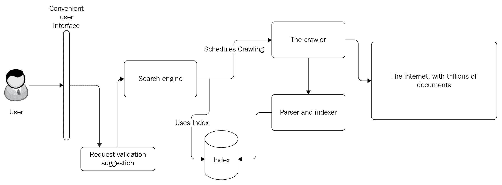
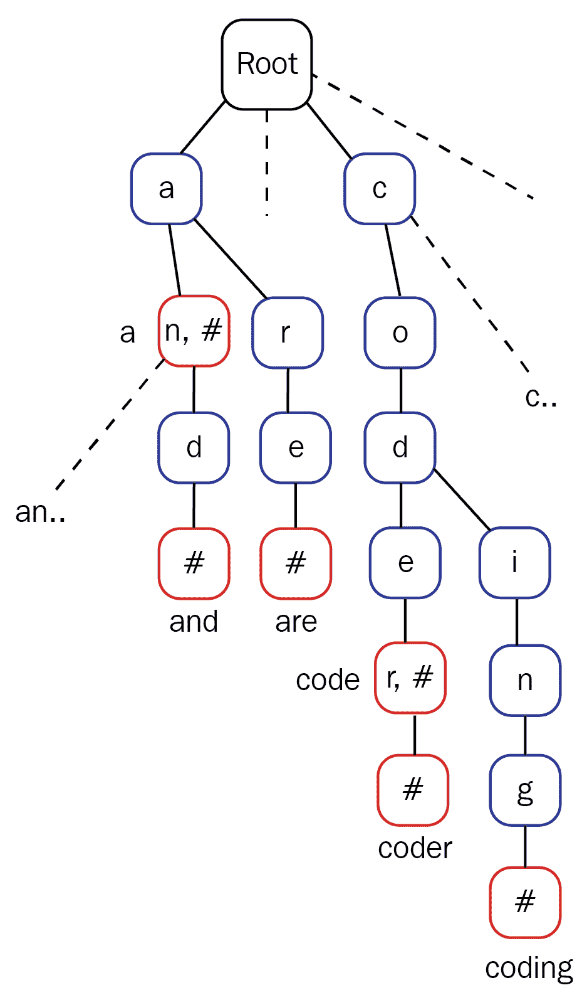
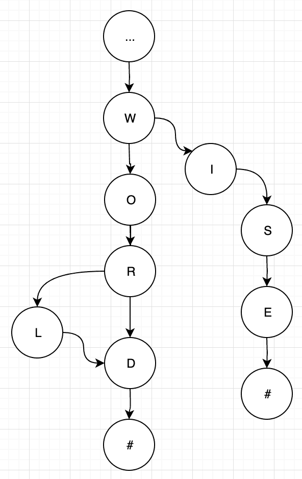
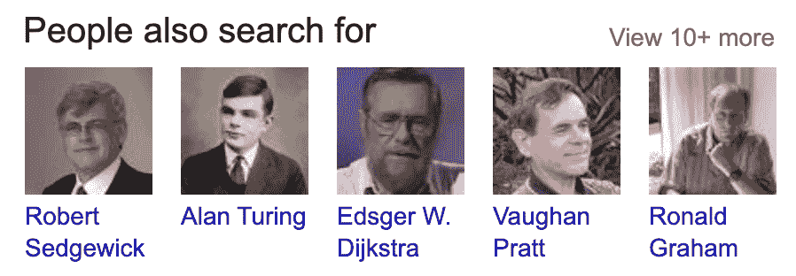
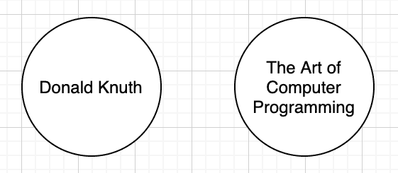
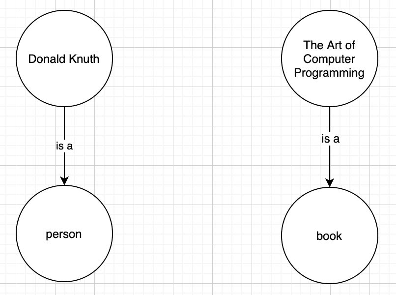
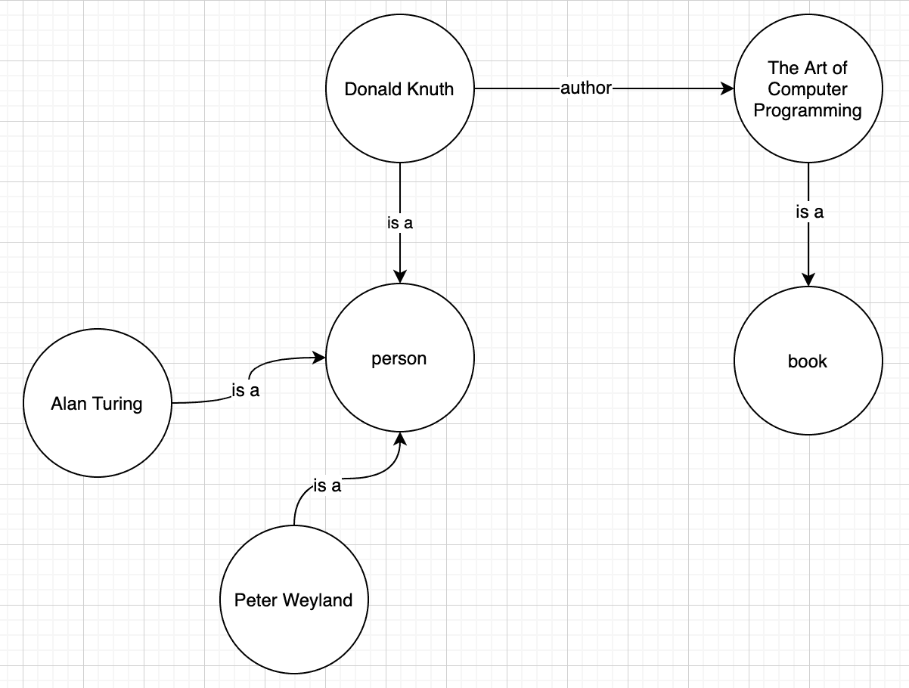
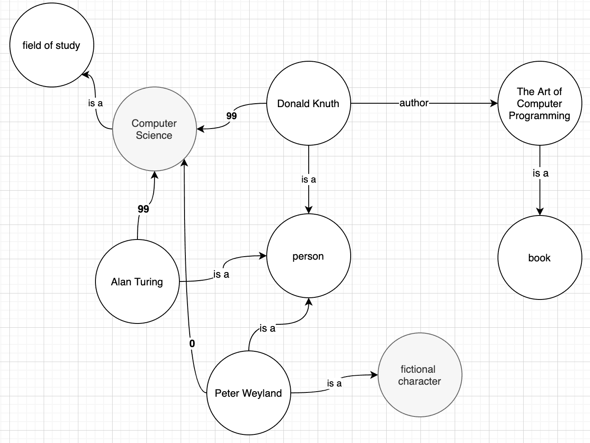

# 实现基于对话的搜索引擎

在这本书里我们已经走了这么远！我们已经学习了 C++应用程序开发的基础知识，并讨论了架构和设计全球通用的应用程序。我们还深入研究了数据结构和算法，它们是高效编程的核心。现在是时候利用所有这些技能来设计复杂的软件了，比如搜索引擎。

随着互联网的普及，搜索引擎已经成为最受欢迎的产品。大多数用户从搜索引擎开始他们的网络之旅。各种网络搜索服务，如谷歌、百度、Yandex 等，接收的流量巨大，每天服务数万亿的请求。搜索引擎在不到一秒钟的时间内处理每个请求。尽管他们维护数以千计的服务器来处理负载，但他们高效处理的核心是数据结构和算法、数据架构策略和缓存。

设计一个高效搜索系统的问题不仅仅出现在网络搜索引擎中。本地数据库、**客户关系管理** ( **客户关系管理**)系统、会计软件和其他需要强大的搜索功能。在本章中，我们将发现搜索引擎的基础知识，并讨论用于构建快速搜索引擎的算法和数据结构。您将了解网络搜索引擎通常如何工作，以及如何满足需要高处理能力的项目中使用的新数据结构。你也将建立信心走出去，建立自己的搜索引擎，将与现有的竞争。

在本章中，我们将涵盖以下主题:

*   理解搜索引擎的结构
*   理解并设计一个倒排索引，用于将关键词映射到搜索引擎中的文档
*   为搜索平台的用户设计和构建推荐引擎
*   利用知识图设计基于对话的搜索引擎

# 技术要求

带有`-std=c++2a`选项的`g++`编译器用于编译本章中的示例。您可以在[https://github.com/PacktPublishing/Expert-CPP](https://github.com/PacktPublishing/Expert-CPP)找到本章使用的源文件。

# 理解搜索引擎的结构

想象一下世界上数十亿个网页。在搜索引擎界面上输入一个单词或短语，不到一秒钟就能返回一长串结果。搜索引擎处理如此多网页的速度是不可思议的。它怎么这么快就找到正确的文档？为了回答这个问题，我们将做一个程序员能做的最明智的事情，设计一个我们自己的引擎。

下图显示了搜索引擎背后的基本思想:


**用户**使用搜索引擎的**用户界面**输入单词。**搜索引擎**扫描所有文档，过滤它们，按相关性排序，并以最快的速度响应用户。我们的主要兴趣在于网络搜索引擎的实现。寻找某样东西需要在数十亿个文档中进行搜索。

让我们尝试设计一种方法来找到短语*你好，世界！*从数十亿个文档中(为了简洁起见，我们将网页称为文档)。扫描每个文档中的短语将花费大量时间。如果我们认为每个文档至少有 500 个单词，搜索一个特定的单词或单词组合将花费大量时间。事先扫描所有文件会更实际。这个扫描过程包括建立文档中每个单词出现的索引，并将信息存储在数据库中，该数据库也被称为**索引文档**。当用户输入短语时，搜索引擎将在其数据库中查找单词，并以满足查询的文档链接作为响应。

在搜索文档之前，引擎验证用户的输入不会有什么坏处。用户在短语中出现错别字并不少见。除了错别字，如果引擎自动完成单词和短语，用户体验会好很多。例如，当用户键入*你好*时，引擎可能会建议搜索短语*你好，世界！*。一些搜索引擎跟踪用户，存储他们最近搜索的信息，他们用来发出请求的设备的细节，等等。比如用户搜索*如何重启电脑*如果搜索引擎知道用户的操作系统会得到更好的结果。如果是 Linux 发行版，搜索引擎会对搜索结果进行排序，这样描述基于 Linux 的计算机重启的文档会首先出现。

我们还应该小心经常出现在网络上的新文档。后台工作可能会持续分析网络以找到新内容。我们称这个作业为**爬虫**，因为它抓取网页和索引文档。爬虫下载文档以便解析其内容并建立索引。已经编入索引的文档可能会被更新，甚至删除。因此，另一个后台工作应该负责定期更新现有文档。你可能会遇到术语**蜘蛛**来描述爬网解析文档的任务。

以下更新的图表更详细地说明了搜索引擎的结构:



搜索有广泛的应用。想象一下最简单的搜索形式——在数组中找到一个单词:

```cpp
using words = std::vector<std::string>;
words list = get_list_of_words(); // suppose the function is implemented

auto find_in_words(const std::string& term)
{
  return std::find(list.begin(), list.end(), term);
}
```

虽然前面的例子适用于最简单的搜索引擎，但真正的交易是设计一个可伸缩的搜索引擎。您不想通过搜索字符串数组来满足用户请求。相反，您应该努力实现一个可扩展的搜索引擎，能够搜索数百万个文档。这需要大量的思考和设计，因为一切都很重要，从数据结构的正确选择到数据处理的高效算法。现在让我们更详细地讨论搜索引擎的组件。我们将结合前几章学到的所有技能来设计一个好的搜索引擎。

# 提供方便的用户界面

关键是要投入时间和资源来构建一个细粒度的用户界面，以提供惊人的用户体验。这里的关键是简单。界面越简单，使用越好。我们将以占据市场主导地位的谷歌为例。它在页面中心有一个简单的输入字段。用户在字段中键入他们的请求，引擎会建议一些短语:


我们不认为用户是懒惰的人，但是提供一个建议列表是有帮助的，因为有时用户不知道他们正在寻找的确切术语。让我们专注于建议列表的结构和实现。毕竟，我们感兴趣的是解决问题，而不是设计漂亮的用户界面。我们不会在本章讨论用户界面设计；专注于搜索引擎的后端会更好。然而，在继续前进之前，我们应该考虑一件事。我们在这里实现的搜索引擎是基于对话框的。用户查询引擎，并可以从几个答案中进行选择，以缩小结果列表。例如，假设用户查询*一台电脑*，搜索引擎询问*一台台式机还是笔记本电脑？*。这大大减少了搜索结果，并为用户提供了更好的结果。我们将使用决策树来实现这一点。但是，在此之前，让我们先了解一下搜索引擎的复杂性。

首先是**输入令牌化**的问题。这涉及到文档解析和搜索短语分析。您可能会构建一个很棒的查询解析器，它会因为用户在查询中犯了一个错误而崩溃。让我们看一下处理模糊查询的几种方法。

# 处理查询中的错别字

用户打字时打错字并不少见。虽然这看起来很简单，但对搜索引擎设计师来说却是一个真正的问题。如果用户键入 helo worl 而不是 hello world，搜索数百万个文档可能会得到意想不到的错误结果。你可能熟悉搜索引擎提供的自动暗示。例如，当我们输入错误时，谷歌搜索界面是这样的:


注意截图底部的两行。其中一个说显示 hello world 的结果，这表明搜索引擎已经假设用户键入了带有错别字的查询，并且已经主动显示了正确查询的结果。然而，仍然有可能用户确实想要搜索他们键入的确切单词。因此，用户体验提供了下一行作为搜索，而不是 helo worl。

因此，在构建搜索引擎时，我们有几个问题要解决，首先是用户请求。首先，我们需要为用户输入文本提供一个方便的界面。界面也应该与它们交互以提供更好的结果。如前所述，这包括根据部分键入的单词提供建议。让搜索引擎与用户交互是用户界面的另一个改进，我们将在本章中讨论。

接下来是检查错别字或不完整的单词，这不是一项容易的任务。在字典中保留所有单词的列表并比较用户键入的单词可能需要一段时间。要解决这个问题，使用特定的数据结构和算法是必须的。例如，当检查用户查询中的错别字时，找到单词之间的 **Levenshtein 距离**可能会有所帮助。Levenshtein 距离是一个单词中应该添加、删除或替换的字符数，以使其等于另一个单词。例如，单词*世界*和*世界*之间的 Levenshtein 距离为 1，因为从*世界*中移除字母 *d* 或在*世界*中添加 *d* 会使这些单词相等。单词*编码*和*坐在*之间的距离是 4，因为以下四个编辑将一个单词变成了另一个单词:

1.  编码-> cod **t** ing(中间插入 **t**
2.  co**d**ting->co**t**ting(用 **t** 代替 **d**
3.  c**o**t->c**I**t(用 **i** 代替 **o**
4.  **c** 拟合->T2 s 拟合(用 **s** 代替 **c**

现在，想象一下，如果我们将每个用户的输入与成千上万个单词进行比较以找到最接近的单词，处理需要多长时间。另一种方法是使用大的(数据结构)特里(数据结构)预先发现可能的错别字。trie 是有序的搜索树，其中键是字符串。请看下面代表 trie 的图表:



每个路径代表一个有效的单词。例如，a 节点指向 n 和 r 节点。注意 n 后面的#号，它告诉我们到这个节点的路径代表一个字，一个。但是，它继续指向 d，然后是另一个#，这意味着到此节点的路径代表另一个单词，以及。同样的逻辑也适用于 trie 的其余部分。例如，想象一下单词*世界*的 trie 部分:



当发动机遇到*或*时，它会经历前面的三个阶段。w 很好，o 也一样，直到单词 l 中倒数第二个字符之前，其他一切都很好。在上图中，l 之后没有终端节点，只有 d。这意味着我们确信不存在 *worl 这样的单词；*所以可能是*世界*。为了提供好的建议和检查错别字，我们应该有一个完整的用户语言词典。当你计划支持多种语言时，这就变得更加困难了。然而，虽然收集和存储字典可以说是一项容易的任务，但更难的任务是收集网络上的所有文档并相应地存储它们以执行快速搜索。收集和解析网站以构建搜索引擎数据库(如前所述)的搜索引擎工具、程序或模块称为爬虫。在更深入地了解我们存储这些网站页面的方式之前，让我们先快速了解一下爬虫的功能。

# 抓取网站

每次用户键入查询时都要搜索数百万个文档是不现实的。想象一下，一个搜索引擎解析网站，在用户点击系统用户界面上的搜索按钮后搜索用户查询。这需要很长时间才能完成。搜索引擎对网站的每个请求都需要一些时间。即使不到一毫秒(0.001 秒)，在用户等待查询完成时，分析和解析所有网站也需要很长时间。为了使事情更清楚，让我们假设访问和搜索一个网站大约需要 0.5 毫秒(即使在那时，这也是不合理的快)。这意味着搜索 100 万个网站大约需要 8 分钟。现在想象你打开谷歌搜索并进行查询——你会等 8 分钟吗？

正确的方法是将所有信息存储在搜索引擎可以有效访问的数据库中。爬虫下载网站页面并将其存储为临时文档，直到进行解析和索引。一个复杂的爬虫程序也可以解析文档，使它们的格式对索引器来说更方便。这里重要的一点是，下载网页不是一次就能完成的动作。网页的内容可能会更新。此外，在此期间可能会出现新页面。因此，搜索引擎必须保持其数据库的最新状态。为此，它安排爬虫定期下载页面。智能爬虫可能会在将内容传递给索引器之前比较内容的差异。

通常，爬虫作为多线程应用程序工作。开发人员应该注意让爬行尽可能快，因为保持数十亿个文档的最新不是一件容易的事情。正如我们已经提到的，搜索引擎不直接搜索文档。它在所谓的索引文件中执行搜索。尽管爬行是一项有趣的编码任务，但在本章中，我们将主要关注索引。下一节介绍搜索引擎中的索引。

# 为文件编制索引

搜索引擎的关键功能是索引。下图显示了如何处理爬虫下载的文档来构建索引文件:


该索引在上图中显示为**倒排索引**。如您所见，用户查询被定向到倒排索引。虽然我们在本章中交替使用术语**指数**和**倒排指数**，但是**倒排指数**是更准确的名称。首先，让我们看看搜索引擎的索引是什么。编制文档索引的全部原因是为了提供快速搜索功能。这个想法很简单:每次爬虫下载文档时，搜索引擎都会处理其内容，将其分成引用该文档的单词。这个过程叫做**令牌化**。假设我们有一个从维基百科下载的包含以下文本的文档(为简洁起见，我们仅举一个段落的一部分作为例子):

```cpp
In 1979, Bjarne Stroustrup, a Danish computer scientist, began work on "C with Classes", the predecessor to C++. The motivation for creating a new language originated from Stroustrup's experience in programming for his PhD thesis. Stroustrup found that Simula had features that were very helpful for large software development...
```

搜索引擎将前面的文档分成单独的单词，如下所示(为简洁起见，此处仅显示前几个单词):

```cpp
In
1979
Bjarne
Stroustrup
a
Danish
computer
scientist
began
work
...
```

将文档分成单词后，引擎会为文档中的每个单词分配一个**标识符** ( **ID** )。假设前面文档的标识为 1，下表显示单词指的是(出现在)标识为 1 的文档:

| 在…里 | one |
| One thousand nine hundred and seventy-nine | one |
| Bjarne - 维基百科，自由的百科全书 | one |
| 斯特鲁普 | one |
| a | one |
| 丹麦的 | one |
| 计算机 | one |
| 科学家 | one |
| ... |  |

可能有几个文档包含相同的单词，因此上一个表实际上可能看起来更像下面的表:

| 在…里 | 1, 4, 14, 22 |
| One thousand nine hundred and seventy-nine | 1, 99, 455 |
| Bjarne - 维基百科，自由的百科全书 | 1, 202, 1314 |
| 斯特鲁普 | 1, 1314 |
| a | 1, 2, 3, 4, 5, 6, 7, 8, 9, 10, 11, ... |
| 丹麦的 | 1, 99, 102, 103 |
| 计算机 | 1, 4, 5, 6, 24, 38, ... |
| 科学家 | 1, 38, 101, 3958, ... |

下表表示倒排索引。它用爬虫下载的文档的 id 映射单词。现在，查找包含用户作为查询键入的单词的文档变得快得多。现在，当用户通过键入*计算机*查询引擎时，结果是基于从索引中检索到的 ID 生成的，即 1，4，5，6，24，38，...在前面的例子中。索引还有助于为更复杂的查询找到结果。例如，*计算机科学家*匹配以下文档:

| 计算机 | **1** ，4，5，6，24， **38** ，... |
| 科学家 | **1** 、 **38** 、101、3958、... |

为了用包含这两个术语的文档来响应用户，我们应该找到引用文档的交集(参见上表中的粗体数字)，例如 1 和 38。

请注意，用户查询在与索引匹配之前也会被标记化。标记化通常涉及单词规范化。如果不规范化，一个*计算机科学家*查询不会给出任何结果(注意查询中的大写字母)。让我们多了解一些这方面的知识。

# 标记文档

您可能还记得第 1 章、*构建 C++应用程序*中的标记化概念，我们在其中讨论了编译器如何通过将源文件标记化为称为标记的更小、不可分割的单元来解析源文件。搜索引擎以类似的方式解析和标记文档。

我们不会对此进行过多的详细描述，但是您应该考虑到文档的处理方式意味着标记(在搜索引擎上下文中具有含义的不可分割的术语)被规范化。例如，我们看到的所有单词都是小写的。因此，索引表应该如下所示:

| 在 | 1, 4, 14, 22 |
| One thousand nine hundred and seventy-nine | 1, 99, 455 |
| bjarne - 维基百科 | 1, 202, 1314 |
| 斯特鲁普 | 1, 1314 |
| a | 1, 2, 3, 4, 5, 6, 7, 8, 9, 10, 11, ... |
| 丹麦的 | 1, 99, 102, 103 |
| 计算机 | 1, 4, 5, 6, 24, 38, ... |
| 科学家 | 1, 38, 101, 3958, ... |

作为 C++程序员，你可能会对看到小写的 bjarne 或 stroustrup 感到不舒服。然而，当我们将用户输入与反向索引键匹配时，我们应该考虑用户输入可能没有我们期望的形式。因此，我们需要对用户输入应用相同的规则，以便它与倒排索引相匹配。

接下来，注意一个。毫不夸张地说，这是每个文档中都出现的一个词。其他的例子还有中的*、*中的*、*中的*等等。我们称之为**停止词**；它们在实际处理之前被过滤掉。通常，搜索引擎会忽略它们，因此倒排索引会更新为以下形式:*

| One thousand nine hundred and seventy-nine | 1, 99, 455 |
| bjarne - 维基百科 | 1, 202, 1314 |
| 斯特鲁普 | 1, 1314 |
| 丹麦的 | 1, 99, 102, 103 |
| 计算机 | 1, 4, 5, 6, 24, 38, ... |
| 科学家 | 1, 38, 101, 3958, ... |

您应该注意到规范化不仅仅是让单词小写。它还包括把单词变成它们的正常形式。

Normalizing a word to its root form (or to its word stem) is also called **stemming**.

看看我们在本节开头作为示例使用的文档中的以下句子:

```cpp
The motivation for creating a new language originated from Stroustrup's experience in programming for his PhD thesis.
```

creating、originated 和 Stroustrup 是规范化的，因此倒排索引将具有以下形式:

| 动机 | one |
| **创建** | one |
| 新的 | one |
| 语言 | one |
| **起源** | one |
| 斯特鲁普 | one |
| 经验 | one |
| 编程；编排 | one |
| 博士 | one |
| 论文 | one |

另外，请注意，我们忽略了停止词，并且在上表中没有包括*。*

 *标记化是索引创建的第一步。除此之外，我们可以自由地以任何能使搜索更好的方式处理输入，如下一节所示。

# 对结果进行排序

相关性是搜索引擎最重要的特征之一。用与用户输入相匹配的文档进行响应是不够的。我们应该按照最相关的文档最先出现的方式对它们进行排序。

一种策略是记录每个单词在文档中出现的次数。例如，描述一台计算机的文档可能包含单词 *computer* 的多次出现，如果用户搜索*一台计算机*，结果将首先显示包含最多*计算机*出现的文档。下面是一个示例索引表:

| 计算机 | 1{18}, 4{13}, 899{3} |
| 地图 | 4{9}, 1342{4}, 1343{2} |
| 世界 | 12{1} |

大括号中的值定义了文档中每个单词的出现次数。

当向用户呈现搜索结果时，我们可以考虑许多因素。一些搜索引擎存储与用户相关的信息，以便以个性化的结果进行响应。甚至用户用来访问搜索引擎的程序(通常是网络浏览器)也可能改变搜索平台的结果。例如，用户在 Linux 操作系统上搜索*重新安装操作系统*时，由于浏览器向搜索引擎提供了操作系统类型和版本信息，因此得到的结果在列表顶部包含*重新安装 Ubuntu* 。然而，考虑到隐私问题，有些搜索引擎完全不使用个性化用户数据。

文档的另一个属性是它的更新日期。新鲜的内容总是有更高的优先级。因此，当向用户返回文档列表时，我们也可以按照内容更新的顺序对它们进行重新排序。对文档相关排名的关注将我们带到下一节，我们将讨论推荐引擎。

# 构建推荐引擎

上一章我们在介绍**机器学习** ( **ML** )的同时，也介绍了**人工智能** ( **AI** )。推荐引擎可以被视为人工智能驱动的解决方案或条件语句的简单集合。构建一个接收用户数据并返回最能满足输入的选项的系统是一项复杂的任务。将 ML 合并到这样的任务中听起来很合理。

但是，您应该考虑到这样一个事实，即推荐引擎可能包含一个规则列表，在将数据输出给最终用户之前，会根据这些规则对数据进行处理。推荐引擎可以在预期和意外的地方运行。例如，在亚马逊上浏览产品时，推荐引擎会根据我们当前正在查看的产品向我们推荐产品。电影数据库根据我们以前看过或评价过的电影推荐新电影。对许多人来说，这似乎出乎意料，但推荐引擎也运行在搜索引擎的后面。

你可能对一些电商平台推荐产品的方式比较熟悉。大多数时候，建议窗格的标题类似于*购买了这个的顾客也购买了...*。回想一下我们在上一章中介绍的聚类分析。现在，如果我们试图理解这些建议是如何运作的，我们很可能会发现一些聚类算法。

让我们简单地看一下，并尝试设计一些推荐机制。让我们以书店网站为例。约翰买了一本名为*掌握 Qt5* 的书，所以让我们把这些信息放在表格中如下:

|  | 掌握 Qt5 |
| 约翰 | 是 |

接下来，约翰决定买一本 C++书，*掌握 C++编程*。莱娅买了一本名为《T2 设计模式》《T4》的书。卡尔买了三本书，分别叫做*学习 Python**掌握机器学习**用 Python 进行机器学习*。该表已更新，现在如下所示:

|  | 掌握 Qt5 | 掌握 C++编程 | 设计模式 | 学习 Python | 掌握机器学习 | 用 Python 进行机器学习 |
| 约翰 | 是 | 是 | 不 | 不 | 不 | 不 |
| 发光酶免疫测定 | 不 | 不 | 是 | 不 | 不 | 不 |
| 卡尔 | 不 | 不 | 不 | 是 | 是 | 是 |

那么，现在让我们想象一下 Harut 访问该网站并购买前面列出的两本书:*学习 Python* 和*使用 Python 进行机器学习*。向他推荐*掌握 Qt5* 这本书合理吗？我们不这么认为。但是我们知道他买的书，我们也知道另外一个用户，卡尔，买了三本书，其中两本和 Harut 买的书一样。所以，向 Harut 推荐*掌握机器学习*可能是合理的，告诉他买了那另外两本书的顾客也买了这本。这是一个简单的例子，从高级角度说明了推荐引擎是如何工作的。

# 使用知识图

现在，让我们回到我们的搜索引擎。一位用户正在寻找一位杰出的计算机科学家——比如说，唐纳德·克努特。他们在搜索栏中输入姓名，然后从整个网络中获取结果，这些结果经过排序后可以提供最佳结果。让我们再次看看谷歌搜索。为了充分利用用户界面，谷歌向我们展示了一些关于搜索主题的简短信息。在这种情况下，它在结果网页的右侧显示了这位伟大科学家的几张照片和一些关于他的信息。以下是该部分的外观:


这样，搜索引擎试图覆盖用户的基本需求，让他们更快地找到信息，甚至不必访问任何网站。在这种情况下，我们最感兴趣的是前面信息框下的意见箱。它的标题是“人们也在搜索”，以下是它的外观:



这些是基于用户活动的推荐，比如说，艾伦·图灵，就在他们搜索唐纳德·克努特之后。这促使推荐引擎提出这样一个建议，如果有新的人在寻找唐纳德·克努特，他们可能也会对艾伦·图灵感兴趣。

我们可以通过谷歌称之为**知识图**的东西来组织类似的建议机制。这是一个由节点组成的图，每个节点代表某个主题、人物、电影或任何其他可搜索的内容。图形数据结构是连接这些节点的节点和边的集合，如下图所示:


在知识图中，每个节点代表一个实体。所谓实体，我们指的是一座城市、一个人、一只宠物、一本书或几乎任何你能想象到的东西。现在，图中的边表示实体之间的连接。每个节点可以通过多个节点连接到另一个节点。例如，看看这两个节点:



这两个节点只包含文本。我们可能会猜测唐纳德·克努特是一个名字，《计算机编程的艺术》是某种艺术。构建知识图的本质是我们可以将每个节点与代表其类型的另一个节点相关联。下图扩展了上一个图表:



看看我们添加的两个新节点。其中一个代表**人**，另一个代表**书**。更令人兴奋的是，我们将带有边的唐纳德·克努特节点连接到**人**节点，并将其标记为“是一种关系”。同样的，我们把**《计算机编程的艺术》**节点连接到书节点，所以我们可以说《计算机编程的艺术》是一本书。现在让我们把唐纳德·克努特和他写的书联系起来:


所以，现在我们有了一个完整的关系，因为我们知道唐纳德·克努特是《计算机编程艺术》的作者，而这本书又代表了一本书。

让我们再添加几个代表人的节点。下图显示了我们如何添加艾伦·图灵和彼得·韦兰节点:



所以，艾伦·图灵和彼得·韦兰都是人。现在，如果这是搜索引擎知识库的一部分，那么它可以让我们很好地洞察用户的搜索意图。当我们为唐纳德·克努特打出结果时，我们知道这是关于一个人的。如果有必要，我们可以建议用户看一看我们在知识图中积累了知识的其他人。推荐搜索唐纳德·克努特的用户也看看艾伦·图灵和彼得·韦兰的页面，合理吗？好了，棘手的部分来了:虽然两个人都是人，但他们没有很强的联系。因此，我们需要一些额外的东西来定义两个不同的人之间的联系的相关性。看看图表中的以下新增内容:



现在很明显，唐纳德·克努特和艾伦·图灵有着相同的活动，表现为**计算机科学**节点，代表着**的研究领域**，而彼得·韦兰则是一个**虚构的角色。**所以，唯一让彼得·韦兰和唐纳德·克努特有关系的是，他们都是人。看看我们放在从人物节点到计算机科学节点的边上的数字。假设我们对从 **0** 到 **100** 的关系进行评分，后者表示关系最强。所以，我们给艾伦·图灵和唐纳德·克努特打了 99 分。我们应该省略《彼得·韦兰到计算机科学》的边缘，而不是放 **0** ，但我们这样做是为了显示对比。那些数字是重量。我们给边缘增加权重来强调连接性因素；也就是说，艾伦·图灵和唐纳德·克努特有着相同的东西，并且彼此有着强烈的关联。如果我们在知识图中添加**史蒂夫·乔布斯**作为新人，图会是这样的:


看看边缘的重量。史蒂夫·乔布斯在某种程度上与计算机科学有关，但他主要与**商人**和**影响者**节点有关。同样，我们现在可以看到，彼得·韦兰与史蒂夫·乔布斯的分享比与唐纳德·克努特的分享更多。现在，推荐引擎建议搜索唐纳德·克努特的用户也应该看看艾伦·图灵，这更能提供信息，因为他们都是人，都以相等或接近相等的权重连接到计算机科学。这是一个很好的例子，在搜索引擎中加入了这样的图表。我们接下来要做的是向您介绍如何使用类似的知识图来构建一个更智能的框架来提供相关的搜索结果。我们称之为基于对话的搜索。

# 实现基于对话的搜索引擎

最后，让我们着手设计我们的搜索引擎中能够为我们提供细粒度用户界面的部分。正如我们在本章开头提到的，基于对话的搜索引擎涉及到构建一个用户界面，向用户询问与他们的查询相关的问题。这种方法最适用于结果不明确的情况。例如，搜索唐纳德的用户可能会想到以下情况之一:

*   伟大的计算机科学家唐纳德·克努特
*   *唐老鸭*，卡通人物
*   *唐纳德·邓恩*，虚构人物贾里德·邓恩的真名
*   商人唐纳德·特朗普和第 45 任美国总统 T2

前面的列表只是唐纳德搜索词潜在结果的一个小例子。现在，缺乏基于对话的方法的搜索引擎能做什么？它们提供了与用户输入最匹配的相关结果列表。例如，在我写这本书的时候，搜索唐纳德得到了一个网站列表，这些网站都与唐纳德·特朗普有关，尽管我心中有唐纳德·克努特。在这里，我们可以看到最佳匹配和用户最佳匹配之间的细线。

搜索引擎收集大量数据用于个性化搜索结果。如果用户在网站开发领域工作，他们的大多数搜索请求都会以某种方式与该特定领域相关。这对于为用户提供更好的搜索结果非常有帮助。例如，拥有大量搜索历史的用户，主要由与网站开发相关的请求组成，在搜索 zepelin 时会获得更好、更集中的结果。理想的搜索引擎将提供链接到 Zeplin 应用程序的网站，用于构建网络用户界面，而对于其他用户，该引擎将提供名为齐柏林飞船的摇滚乐队的信息结果。

设计基于对话的搜索引擎是为用户提供更好界面的下一步。现在，如果我们已经有了一个强大的知识库，构建起来就足够简单了。我们将使用上一节中描述的知识图的概念。让我们假设当用户键入一个搜索词时，我们从知识图中获取所有匹配的主题，并为用户提供一个潜在命中列表，如下图所示:


因此，用户现在可以更容易地选择主题，并节省回忆全名的时间。当用户键入查询时，来自知识图的信息可以(对于某些搜索引擎来说也是)合并到自动建议中。此外，我们将解决搜索引擎的主要组成部分。显然，这一章不能涵盖实现的每一个方面，但是我们将讨论的基本组件足以让您投入到自己的搜索引擎的设计和实现中。

我们不会为搜索引擎的用户界面部分费心。我们最关心的是后端。当谈到应用程序的后端时，我们通常指的是用户不可见的部分。更具体地说，让我们看一下下图:


如您所见，大部分引擎位于后端。虽然用户界面可能感觉很简单，但它是整个搜索系统的重要组成部分。这就是用户开始旅程的地方，用户界面设计得越多，提供的体验越好，用户在搜索某样东西时的不适感就越少。我们将专注于后端；以下是我们将要讨论的几个主要模块:

*   **查询解析器**:对用户查询进行分析，对单词进行规范化，并为查询中的每个术语收集信息，以便以后传递给查询处理器。
*   **查询处理器**:使用索引和补充数据库检索与查询相关联的数据，并构建响应。
*   **对话框生成器**:提供更多选项供用户搜索时选择。对话生成器是一个补充模块。发出请求的用户可以省略该对话框，或者使用它来进一步缩小搜索结果的范围。

我们已经跳过了搜索引擎中常见的一些组件(例如爬虫)，取而代之的是，我们将专注于那些与基于对话的搜索引擎密切相关的组件。现在让我们从查询解析器开始。

# 实现查询解析器

查询解析器按照它的名字来做:T3 解析查询。作为查询解析器的基础任务，我们应该按空间划分单词。例如用户查询*泽普林最佳专辑*分为以下词条:`zeplin`、`best`、`album`。下面的类表示基本的查询解析器:

```cpp
// The Query and Token will be defined in the next snippet
class QueryParser
{
public:
  static Query parse(const std::string& query_string) {
 auto tokens = QueryParser::tokenize(query_string);
    // construct the Query object and return
    // see next snippet for details
 }

private:
  static std::vector<Token> tokenize(const std::string& raw_query) {
    // return tokenized query string
  }
};
```

看看前面的`parse()`功能。这是班上唯一的公共功能。我们将添加更多从`parse()`函数调用的私有函数，以完全解析查询并获得作为`Query`对象的结果。`Query`表示包含查询信息的简单结构，如下所示:

```cpp
struct Query
{
  std::string raw_query;
  std::string normalized_query;
  std::vector<Token> tokens;
  std::string dialog_id; // we will use this in Dialog Generator
};
```

`raw_query`是用户键入的查询的文本表示，而`normalized_query`是规范化后的同一个查询。比如用户打*好书，程序员应该读*。，`raw_query`是确切的文字，`normalized_query`是*程序员应该读的好书*。在下面的片段中，我们不使用`normalized_query`，但是当您完成实现时，您将需要它。我们还在`Token`向量中存储标记，其中`Token`是一个结构，如下所示:

```cpp
struct Token
{
  using Word = std::string;
  using Weight = int;
  Word value;
  std::unordered_map<Word, Weight> related;
};
```

`related`属性表示一个单词列表，这些单词在语义上与令牌**相关**。如果两个词在概念上表达相似的意思，我们称它们为**语义相关**。比如 *best* 和 *good* 这两个词，或者*专辑*和*收藏*这两个词，可以认为是语义相关的。您可能已经猜到了哈希表值中权重的用途。我们用它来存储相似度的`Weight`。

The range for the **weight** is something that should be configured during the exploitation of the search engine. Let's suppose we chose the range to be between 0 to 99\. The weight of the similarity of the words *best* and *good* could be expressed as a number near to 90, while the weight of the similarity of the words *album* and *collection* could deviate from 40 to 70\. Choosing these numbers is tricky and they should be tuned in the course of the development and exploitation of the engine.

最后，`Query`结构的`dialog_id`表示如果用户选择了生成器建议的路径，生成的对话框的标识。我们很快就会谈到这一点。现在让我们继续完成`parse()`功能。

看看`QueryParser`类的以下新增内容:

```cpp
class QueryParser
{
public:
  static Query parse(const std::string& query_string, 
                     const std::string& dialog_id = "")
  {
    Query qr;
    qr.raw_query = query_string;
    qr.dialog_id = dialog_id;
    qr.tokens = QueryParser::tokenize(query_string);
    QueryParser::retrieve_word_relations(qr.tokens);
    return qr;
  }

private:
  static std::vector<Token> tokenize(const std::string& raw_string) {
    // 1\. split raw_string by space
    // 2\. construct for each word a Token
    // 3\. return the list of tokens 
  }

  static void retrieve_word_relations(std::vector<Token>& tokens) {
    // for each token, request the Knowledge Base
    // to retrieve relations and update tokens list
  }
};
```

虽然两个私有函数(`tokenize`和`retrieve_word_relations`)在前面的代码片段中没有实现，但基本思想是它们规范化并收集关于搜索查询的信息。在我们继续实现查询处理器之前，先看看前面的代码。

# 实现查询处理器

查询处理器执行搜索引擎的主要工作；也就是说，它从搜索索引中检索结果，并根据搜索查询用相关的文档列表进行响应。在本节中，我们还将介绍对话框的生成。

正如您在上一节中看到的，查询解析器构建了一个包含标记和`dialog_id`的`Query`对象。我们将在查询处理器中使用这两者。

It is recommended to have a separate component for the dialog generator due to scalability concerns. For educational purposes, we will keep the implementation succinct, but you are free to redesign the dialog-based search engine and complete the implementation along with the crawler and other supplementary modules.

`Query`对象中的标记用于向搜索索引发出请求，以便检索与每个单词相关联的文档集。以下是相应的`QueryProcessor`类的外观:

```cpp
struct Document {
  // consider this
};

class QueryProcessor
{
public:
  using Documents = std::vector<Document>;
  static Documents process_query(const Query& query) {
 if (!query.dialog_id.empty()) {
 // request the knowledge graph for new terms
 }
 // retrieve documents from the index
 // sort and return documents
 }
};
```

考虑前面的代码片段作为实现的介绍。我们想表达`QueryProcessor`类的基本思想。它具有`process_query()`功能，根据查询参数中的标记从索引中检索文档。这里的关键角色是搜索索引。就快速查询而言，我们定义其结构的方式和存储文档的方式至关重要。同时，作为附加参数提供的对话框标识允许`process_query()`函数请求知识库(或知识图)检索与查询相关的更多相关标记。

还必须考虑到`QueryProcessor`也负责生成对话框(也就是说，定义一组路径为用户提供可能的查询场景)。生成的对话框被发送给用户，当用户进行另一个查询时，使用的对话框通过我们已经看到的对话框标识与该查询相关联。

虽然前面的实现大部分是介绍性的(因为代码的实际大小太大，无法放入章节中)，但它是您在设计和实现引擎时进一步前进的一个很好的基础。

# 摘要

从头开始构建搜索引擎是经验丰富的程序员的任务。我们在这本书里涉及了许多主题，并通过设计一个搜索引擎将它们结合在了这一章里。

我们已经了解到，网络搜索引擎是由几个组件组成的复杂系统，例如爬虫、索引器和用户界面。爬虫负责定期检查网页以下载网页供搜索引擎索引。索引会产生一个大数据结构，称为倒排索引。倒排索引，或者仅仅是一个索引，是一种数据结构，它将单词与其所在的文档进行映射。

接下来，我们定义了什么是推荐引擎，并试图为我们的搜索引擎设计一个简单的推荐引擎。推荐引擎与本章中讨论的搜索引擎的基于对话框的功能相连接。基于对话的搜索引擎旨在向用户提供有针对性的问题，以了解用户实际想要搜索的内容。

我们从 C++的角度讨论了计算机科学中的各种主题，从而达到了本书的结尾。我们从 C++程序的细节开始，然后简单介绍了如何使用数据结构和算法高效地解决问题。了解一门编程语言并不足以在编程上取得成功。您需要解决需要数据结构、算法、多线程等密集技能的编码问题。此外，解决不同的编程范式可能会大大增强你对计算机科学的看法，并让你重新看待问题解决。在这本书里，我们已经谈到了几种编程范例，比如函数式编程。

最后，正如你现在所知道的，软件开发不仅仅局限于编码。架构和设计项目是成功应用程序开发的关键步骤之一。第 [10](10.html) 、*设计全球通用的应用程序、*至 [16](16.html) 、*实现基于对话的搜索*等章节主要涉及设计真实世界应用程序的方法和策略。让这本书从 C++开发人员的角度成为你对编程世界的入门指南。通过开发更复杂的应用程序来发展你的技能，并与同事和那些刚刚开始职业生涯的人分享你的知识。学习新事物的最好方法之一是教它。

# 问题

1.  爬虫在搜索引擎中的作用是什么？
2.  为什么我们称搜索索引为倒排索引？
3.  索引前对单词进行标记的主要规则是什么？
4.  推荐引擎的作用是什么？
5.  什么是知识图？

# 进一步阅读

有关更多信息，请参考以下书籍:

*信息检索简介*，*克里斯托弗·曼宁等*，[https://www . Amazon . com/Introduction-Information-Retrieval-Christopher-Manning/DP/0521865719/](https://www.amazon.com/Introduction-Information-Retrieval-Christopher-Manning/dp/0521865719/)*