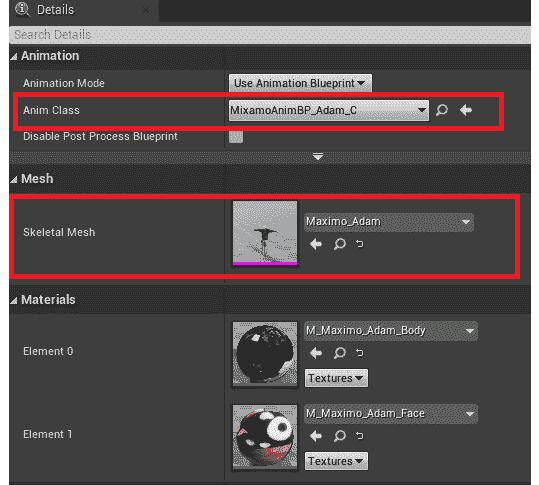
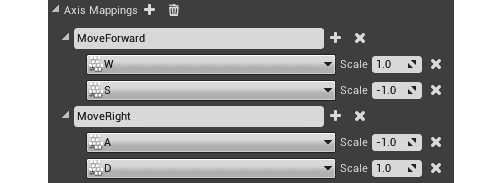
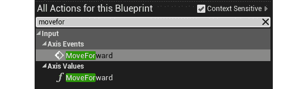
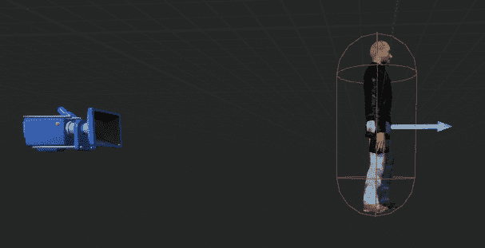
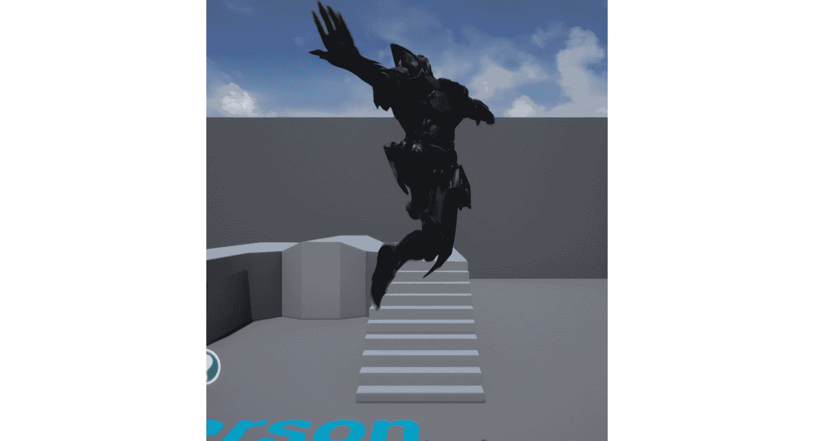

# 3。角色类组件和蓝图设置

概观

本章将重点介绍 C++ 中的`Character`类。您将看到如何在 C++ 中扩展`Character`类，然后通过继承在蓝图中进一步扩展这个新创建的`Character`类。您还将处理玩家输入和一些移动逻辑。

到本章结束时，您将能够理解类继承在 UE4 中是如何工作的，以及如何利用它来实现您的优势。您还将能够使用轴和动作输入映射，这是驱动玩家相关输入逻辑的关键。

# 简介

在前一章中，我们学习了如何创建空项目和导入文件，使用哪个文件夹结构，以及如何处理动画。在本章中，我们将探讨使用虚幻引擎时您将使用的一些其他关键工具和功能。

游戏开发人员在构建游戏功能时，通常需要使用某些工具来节省时间和精力。虚幻引擎强大的对象继承能力为开发人员提供了提高效率所需的优势。开发人员还可以交替使用 C++ 和蓝图，并在开发游戏时使用它们来造福自己。

开发人员获得的另一个增值好处是能够扩展代码以供项目后期使用。假设你的客户在旧需求的基础上有了新的需求(就像大多数游戏工作室一样)。现在，为了扩展功能，开发人员只需继承一个类，并向其中添加更多功能，就可以快速获得结果。这非常强大，在很多情况下都会派上用场。

在这一章中，我们将讨论虚幻`Character`类，创建 C++ 代码，然后在蓝图中扩展它，最后用它来创建一个游戏中的角色。

# 虚幻人物类

在我们谈论虚幻`Character`类之前，让我们简单地谈谈继承的概念。如果您习惯于使用 C++ 或其他类似的语言，您应该已经熟悉了这个概念。继承是一个类从另一个类中获得特征和行为的过程。可以扩展 C++ 类来创建一个新的类——派生类，该类保留基类的属性，并允许修改这些属性或添加新的特性。这方面的一个例子是`Character`类。

A `Character`类是一种特殊类型的棋子，是虚幻`Pawn`类的后代。在`Pawn`类的基础上，默认情况下`Character`类拥有一些移动能力，以及一些为角色添加移动的输入。作为标准，`Character`类让用户能够让角色在创造的世界中行走、奔跑、跳跃、飞行和游泳。

由于一个`Character`类是`Pawn`类的扩展，它包含了棋子的所有代码/逻辑，开发人员可以扩展这个类来增加更多的功能。当扩展`Character`类时，它的现有组件作为继承组件被传递到扩展类。(在这种情况下，是胶囊组件、箭头组件和网格)。

注意

无法删除继承的组件。它们的设置可能会更改，但是添加到基类的组件将始终出现在扩展类中。在这种情况下，基类是`Pawn`类，而扩展(或子)类是`Character`类。

`Character`类提供以下继承组件:

*   **胶囊组件**:这是根组件，作为层级内其他组件附着的“原点”。这个组件也可以用于碰撞，并采取胶囊的形式，逻辑上概述了许多角色形式(特别是人形)。
*   **箭头组件**:这提供了一个指向层级前面的简单箭头。默认情况下，这在游戏开始时设置为`hide`，但可以调整为可见。如果需要，这个组件可以用于调试和调整游戏逻辑。
*   **骨骼网格组件**:这是`Character`类中开发人员最关心的主要组件。骨骼网格是角色将采取的形式，可以在这里与所有相关变量一起设置，包括动画、碰撞等。

大多数开发人员通常更喜欢用 C++ 编写游戏和角色逻辑代码，并将该类扩展到蓝图，以便他们可以执行其他简单的任务，例如将资产连接到该类。因此，例如，开发人员可以创建一个从`Character`类继承的 C++ 类，编写该类中的所有移动和跳转逻辑，然后用蓝图扩展该类，在蓝图中，开发人员用所需的资产(例如骨骼网格和动画蓝图)更新组件，并可选地将附加功能编码到蓝图中。

## 扩展字符类

当被 C++ 或蓝图继承时，`Character`类被扩展。这个扩展的`Character`类将是`Character`类的子类(*将被称为其父类*)。类扩展是面向对象编程的一个强大部分，类可以扩展到很深的层次。

## 练习 3.01:创建和设置第三人称角色 C++ 类

在本练习中，您将基于`Character`类创建一个 C++ 类。您还将初始化变量，这些变量将在扩展此`Character`类的类的默认值中设置。

以下步骤将帮助您完成本练习:

1.  启动虚幻引擎，选择`Games`类别，点击`Next`按钮。
2.  选择`Blank`并点击`Next`按钮。
3.  选择`C++ `作为项目类型，将项目名称设置为`MyThirdPerson`，选择合适的项目目录，点击`Create Project`按钮。
4.  *右键点击`Content Browser`界面的*，点击`New C++ Class`按钮:
5.  在打开的对话框中，选择`Character`作为类别类型，点击`Next`按钮。
6.  命名为`MyThirdPersonChar`，点击`Create Class`按钮。
7.  Upon doing so, Visual Studio will open the `MyThirdPersonChar.cpp` and `MyThirdPersonChar.h` tabs.

    注意

    在某些系统上，可能需要以管理员权限运行虚幻引擎编辑器，才能使用新创建的 C++ 文件自动打开 Visual Studio 解决方案。

8.  Open the `MyThirdPersonChar.h` tab and add the following code under the `GENERATED_BODY()` text:

    ```cpp
    // Spring arm component which will act as a placeholder for   the player camera
    UPROPERTY(VisibleAnywhere, BlueprintReadOnly, Category =   MyTPS_Cam, meta = (AllowPrivateAccess = "true"))
    class USpringArmComponent* CameraBoom;
    // Follow camera
    UPROPERTY(VisibleAnywhere, BlueprintReadOnly, Category =   MyTPS_Cam, meta = (AllowPrivateAccess = "true"))
    class UCameraComponent* FollowCamera;
    ```

    在前面的代码中，我们声明了两个组件:`Camera`本身和`Camera boom`，它们在距离玩家一定距离处充当相机的占位符。这些组件将在*步骤 11* 的构造器中初始化。

9.  在`MyThirdPersonChar.h`文件的`#include "CoreMinimal.h"`下的包含部分添加以下内容:

    ```cpp
    #include "GameFramework/SpringArmComponent.h"
    #include "Camera/CameraComponent.h"
    ```

10.  Now, head over to the `MyThirdPersonChar.cpp` tab and add the following includes after the `#include MyThirdPersonChar.h` code:

    ```cpp
    #include "Components/CapsuleComponent.h"
    #include "GameFramework/CharacterMovementComponent.h"
    ```

    在前面的代码片段中，代码将相关的类添加到类中，这意味着我们现在可以访问它的方法和定义。

11.  In the `AMyThirdPersonChar::AMyThirdPersonChar()` function, add the following lines:

    ```cpp
    // Set size for collision capsule
    GetCapsuleComponent()->InitCapsuleSize(42.f, 96.0f);
    // Don't rotate when the controller rotates. Let that just   affect the camera.
    bUseControllerRotationPitch = false;
    bUseControllerRotationYaw = false;
    bUseControllerRotationRoll = false;
    // Configure character movement
    GetCharacterMovement()->bOrientRotationToMovement = true;
    // Create a camera boom (pulls in towards the   player if there is a collision)
    CameraBoom =   CreateDefaultSubobject<USpringArmComponent>(TEXT("CameraBoom"));
    CameraBoom->SetupAttachment(RootComponent);
    CameraBoom->TargetArmLength = 300.0f;
    CameraBoom->bUsePawnControlRotation = true; 
    // Create a camera that will follow the character
    FollowCamera =   CreateDefaultSubobject<UCameraComponent>(TEXT("FollowCamera"));
    FollowCamera->SetupAttachment(CameraBoom,   USpringArmComponent::SocketName);
    FollowCamera->bUsePawnControlRotation = false;
    ```

    截取的前一段代码的最后一行将设置相机，使其旋转与棋子的旋转绑定。这意味着相机应该随着与该棋子相关的玩家控制器的旋转而旋转。

12.  Head back to the Unreal Engine project and click the `Compile` button in the top bar:

    

图 3.1:虚幻编辑器顶部栏上的编译按钮

右下方应该会出现一条`Compile Complete!`信息。

注意

您可以在 GitHub 上的`Chapter03` - > `Exercise3.01`目录中找到已完成的练习代码文件，链接如下:[https://packt.live/3khFrMt](https://packt.live/3khFrMt)。

提取`.rar`文件后，*双击*文件。你会看到一个提示询问`Would you like to rebuild now?`。点击那个提示上的`Yes`，这样它就可以构建必要的中间文件，之后它应该会在虚幻编辑器中自动打开项目。

通过完成本练习，您已经学会了如何扩展`Character`课程。您还学习了如何初始化`Character`类的默认组件，以及如何从虚幻编辑器中编译更新的代码。接下来，您将学习如何扩展您在蓝图中创建的 C++ 类，以及为什么在许多情况下这是可行的。

# 用蓝图扩展 C++ 类

如前所述，大多数开发人员将 C++ 代码逻辑扩展到蓝图，以便将其与他们将使用的资产联系起来。与在代码中查找和设置资产相比，这样做是为了实现简单的资产分配。此外，它使开发人员能够使用强大的蓝图功能，如时间轴、事件和现成的宏，并结合他们的 C++ 代码，以实现用 C++ 和蓝图开发的最大好处。

到目前为止，我们已经制作了一个 C++ `Character`类。在其中，我们设置了组件和移动功能。现在，我们想要指定将要在我们的类中使用的资产，以及添加输入和移动能力。为此，使用蓝图进行扩展并在那里设置选项更容易。这是我们将在下一个练习中做的。

## 练习 3.02:用蓝图扩展 C++

在本练习中，您将学习如何扩展使用蓝图创建的 C++ 类，以便在预先存在的 C++ 代码的基础上添加蓝图代码。您还将添加输入键绑定，负责移动角色。

以下步骤将帮助您完成本练习:

1.  Download and extract all the contents of the `Chapter03` *|* `Exercise3.02` *|* `ExerciseFiles` directory, which can be found on GitHub.

    注意

    `ExerciseFiles`目录可以在 GitHub 上找到，链接如下:[https://packt.live/2GO0dG8](https://packt.live/2GO0dG8)。

2.  浏览到我们在*练习 3.01* 、*中创建的`MyThirdPerson`项目内的`Content`文件夹，创建并设置第三人称角色 C++ 类*。
3.  Copy the `MixamoAnimPack` folder we created in *Step 1* and paste it into the `Content` folder directory we opened in *Step 2*, as shown in the following screenshot:

    注意

    `MixamoAnimPack`资产是通过以下链接从 Epic 市场获得的:[https://www . unrealengine . com/market/en-US/product/mix amo-animation-pack](https://www.unrealengine.com/marketplace/en-US/product/mixamo-animation-pack)。

    

    图 3.2:放置在项目目录中的 MixamoAnimPack

4.  打开项目。*右键点击`Content Browser`界面内的*，点击`Blueprint Class`。
5.  In the `Search` dialogue, type `GameMode`, *right-click* the class matching the name, and click the `Select` button. Have a look at the following screenshot:

    

    图 3.3:创建游戏模式类

6.  说出我们在*第 6 步*中创建的蓝图。
7.  现在，重复*步骤 5* 。
8.  在`Search`框中，输入`MyThirdPersonChar`，选择类别，然后在`Select`按钮上右键*。*
**   说出我们在*第 9 步*中创建的蓝图。*   In the `World Settings` tab, click the `None` option next to `GameMode Override` and select `BP_GameMode`:

    

    图 3.4:在世界设置中指定游戏模式

    *   Set `Default Pawn Class` to `BP_MyTPC`:

    

    图 3.5:在游戏模式中指定默认棋子类别

    *   打开`BP_MyTPC`，点击左侧`Components`标签层次中的`Mesh (Inherited)`组件。*   In the `Details` tab, find the `Mesh` section and set `Skeletal Mesh` to `Maximo_Adam`.

    注意

    网格和动画将在*第 13 章*、*混合空间 1D、键绑定和状态机*中详细介绍。

    *   In the `Details` tab, find the `Animation` section and set `Anim Class` to `MixamoAnimBP_Adam_C`. You'll note that this class name gets suffixed with `_C` when selected. This is basically the instance of the blueprint created by UE4\. Blueprints, in a working project/build, usually get suffixed this way to differentiate between a Blueprint Class and an instance of that class.

    

    图 3.6:设置动画类和骨骼网格

    *   从最上面的菜单，进入`Edit`下拉菜单，点击`Project Settings`。*   Click on the `Input` section, which can be found in the `Engine` section:

    

    图 3.7:项目设置的输入部分

    *   In the `Bindings` section, click the `+` icon next to `Axis Mappings` and expand the section.

    注意

    操作映射是执行的单次按键操作，如跳转、划线或运行，而轴映射是分配的浮点值，将根据用户的按键返回浮点值。这在游戏手柄控制器或虚拟现实控制器的情况下更为相关，在这种情况下，模拟拇指操纵杆开始发挥作用。在这种情况下，它将返回拇指棒状态的浮动值，这对于管理玩家移动或相关功能非常重要。

    *   将`NewAxisMapping_0`重命名为`MoveForward`。*   在`MoveForward`部分，点击下拉菜单，选择`W`。*   单击`MoveForward`图标旁边的`+`图标，添加另一个字段。*   将新字段设置为`S`。将其刻度设置为`-1.0`(因为我们想用`S`键向后移动)。*   Create another axis mapping by repeating *Step 18*, name it `MoveRight`, and add two fields – `A` with `-1.0` for the scale and `D` with `1.0` for the scale:

    

    图 3.8:运动轴映射

    *   Open `BP_MyTPC` and click the `Event Graph` tab:

    

    图 3.9:事件图选项卡

    *   *Right-click* anywhere inside the graph, type `MoveForward`, and select the first node option:

    

    图 3.10:前移轴事件

    *   *Right-click* inside the graph, search for `Get Control Rotation`, and select the first node option.

    注意

    由于与玩家相关联的摄像机可以选择不显示棋子的偏航、滚动或俯仰，`Get Control Rotation`使棋子完全瞄准旋转。这在许多计算中都很有用。

    *   *左键单击*，从`Get Control Rotation`节点的`Return Value`拖动，搜索`Break Rotator`，选择。*   *右键点击图内*，搜索`Make Rotator`，选择第一个节点选项。*   Connect the `Z` (*Yaw*) node from `Break Rotator` to the `Z` (*Yaw*) node of the `Make Rotator` node.

    注意

    使`Rotator`用俯仰、滚转和偏航值创建一个旋转器，而断开旋转器将旋转器拆分成它的组件(滚转、俯仰和偏航)。

    *   *左键单击*，从`Make Rotator`节点的`Return Value`拖动，搜索`Get` `Forward Vector`，选择。*   *左键单击*，从`Get Forward Vector`节点的`Return Value`拖动，搜索`Add Movement Input`，选择。*   将`InputAxis MoveForward`节点的`Axis Value`节点连接到`Add Movement Input`节点的`Scale Value`节点。*   最后，将白色`Execution`引脚从`InputAxis MoveForward`节点连接到`Add Movement Input`节点。*   *右键点击图内*，搜索`InputAxis MoveRight`，选择第一个节点选项。*   *左键单击*，从`Make Rotator`节点的`Return Value`拖动，搜索`Get Right Vector`，选择。*   *左键单击*，从`Get Right Vector`节点的`Return Value`拖动，搜索`Add Movement Input`，选择。*   将`InputAxis MoveRight`节点的`Axis Value`引脚连接到我们上一步创建的`Add Movement Input`节点的`Scale Value`引脚。*   Finally, connect the `white Execution` pin from the `InputAxis MoveRight` node to the `Add Movement Input` node we added in *Step 36*:

    

    图 3.11:运动逻辑

    *   Now, head to the `Viewport` tab. Here, you will see that the character's front is not pointing in the direction of the arrow and that the character is displaced above the capsule component. Click on the `Mesh` component and select the object translation node located at the top of the viewport. Then, drag the arrows on the Mesh to adjust it so that the feet align with the bottom of the capsule component and the Mesh is rotated to point toward the arrow:

    

    图 3.12:平移旋转和缩放选择器部分

    一旦字符在胶囊中对齐，它将显示为以下屏幕截图:

    

    图 3.13:胶囊组件内调整的网格

    *   在`Toolbar`菜单中，按下`Compile`按钮，然后按下`Save`。*   Go back to the map tab and press the `Play` button to view your character in-game. Use the *W*, *A*, *S*, and *D* keys to move around.

    注意

    您可以在 GitHub 上的`Chapter03` - > `Exercise3.02`目录中找到已完成的练习代码文件，链接如下:[https://packt.live/3keGxIU](https://packt.live/3keGxIU)。

    提取`.rar`文件后，双击`.uproject`文件。你会看到一个提示询问`Would you like to rebuild now?`。点击那个提示上的`Yes`，这样它就可以构建必要的中间文件，之后它应该会在虚幻编辑器中自动打开项目。* 

 *通过完成本练习，您现在能够理解如何使用蓝图扩展 C++ 代码，以及为什么这在许多情况下对开发人员有利。您还学习了如何添加输入映射，以及如何使用它们来驱动与玩家相关的输入逻辑。

在本章的活动中，您将结合从本章之前的练习中获得的技能，并扩展您在*活动 2.01 中完成的项目，将动画链接到*第 2 章*、*的角色*活动，使用虚幻引擎*。这将允许您在自己创建的蓝图上进行构建，并查看它如何映射到现实场景。

## 活动 3.01:在动画项目中用蓝图扩展 C++ 角色类

现在，您已经创建了一个 C++ 类，并使用蓝图对其进行了扩展，现在是时候在现实场景中将这两个概念结合起来了。在这个活动中，你的目的是让我们的角色从*活动 2.01* 、 *Mixamo 角色动画*，可以在*第二章，* *使用虚幻引擎，*使用键盘上的*空格键*键跳转。但是，您需要在 C++ 中从头开始创建`Character`类，然后稍后用蓝图扩展它以达到最终目标。

以下步骤将帮助您完成本活动:

1.  从*活动 2.01* 、 *Mixamo 人物动画*开启项目。
2.  用 C++ 创建一个`Character`类来初始化角色变量，包括与玩家相关的摄像机。
3.  将跳转输入映射到项目设置中的*空格键*键。
4.  Extend the created C++ class with a blueprint to add the associated assets and jump functionality.

    预期产出:

    当你按下*空格键*键时，角色应该能够跳跃。该级别应该使用扩展 C++ `Character`类的蓝图:

    

图 3.14: Ganfault 跳转活动预期输出

注意

这个活动的解决方案可以在:[https://packt.live/338jEBx](https://packt.live/338jEBx)找到。

通过完成本练习，您已经了解了在蓝图中扩展 C++ 代码以实现功能和逻辑的场景。这种 C++ 和蓝图的结合是游戏开发人员拥有的最强大的工具，可以在虚幻引擎中创建精湛而独特的游戏。

# 总结

在本章中，您学习了如何创建一个 C++ `Character`类，向其中添加初始化器代码，然后使用蓝图对其进行扩展以设置资产并添加附加代码。

结果遵循 C++ 代码以及蓝图代码，并且可以在任何有目的的场景中使用。

您还学习了如何设置映射到 *W* 、 *A* 、 *S* 和 *D* 键的轴映射来移动玩家(这是许多游戏中的默认移动映射)。你还学会了如何让角色在游戏中跳跃。

在下一章中，您将深入探讨输入映射以及如何在虚幻编辑器中使用移动预览器。这将有助于您创建具有映射到游戏和玩家逻辑的可靠输入的游戏。它还将允许你快速测试你的游戏在手机上的外观和感觉，所有这些都在虚幻编辑器中。*