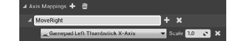
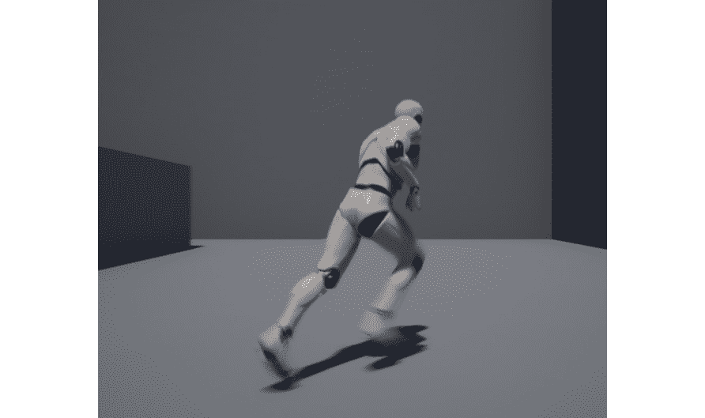
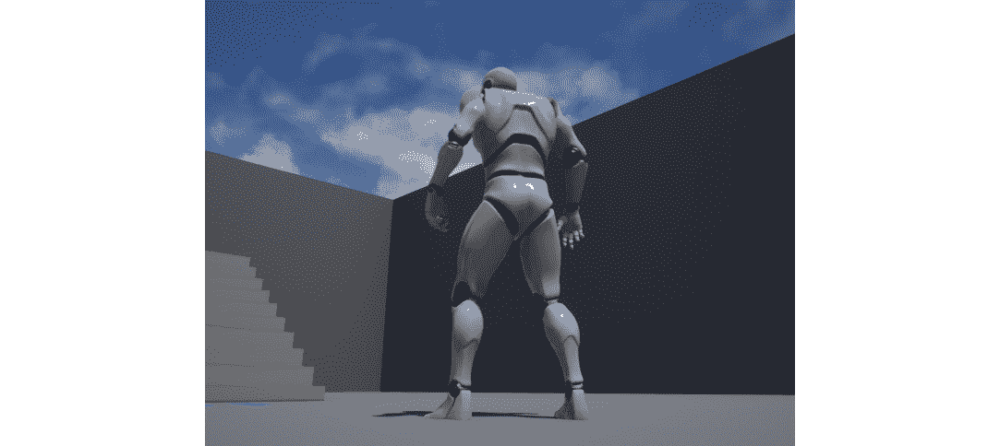
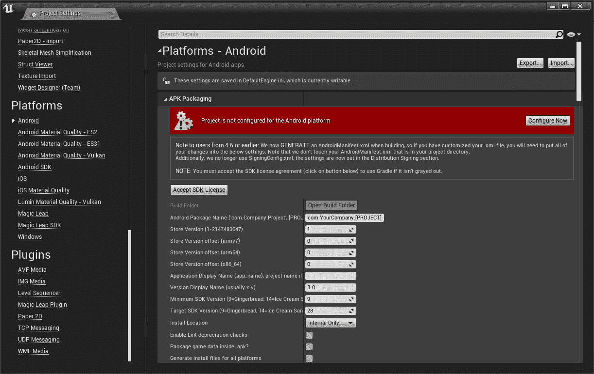
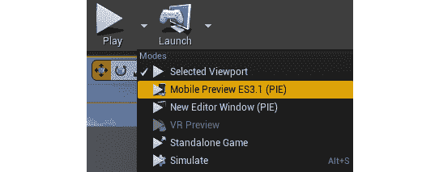
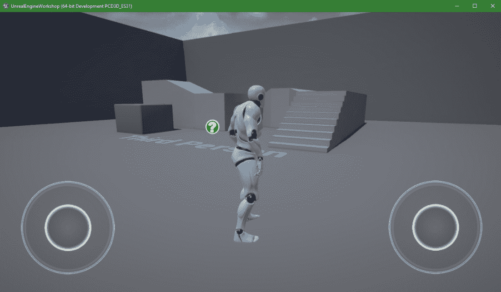
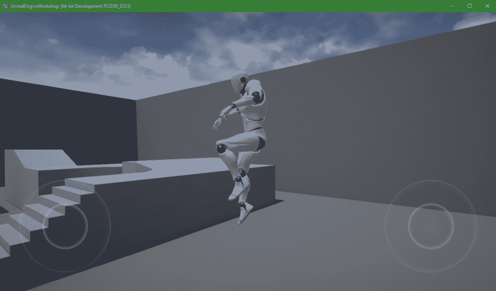
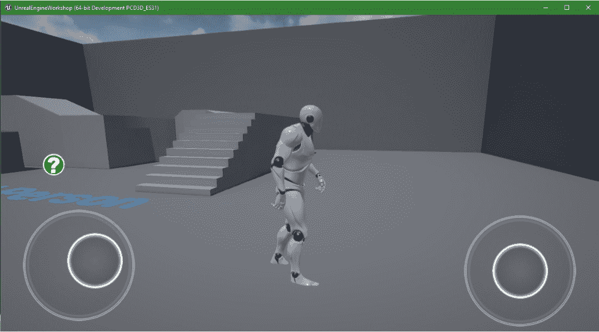

# 4。玩家输入

概述

本章将讨论玩家输入的主题。我们将学习如何将支持触摸的设备的按键或触摸输入与游戏中的动作(如跳跃或移动)相关联。

本章结束时，您将了解`Action Mappings`和`Axis Mappings`，如何创建和修改它们，如何收听这些映射中的每一个，如何在按下和释放它们时执行游戏中的动作，以及如何像在移动设备上玩游戏一样预览您的游戏。

# 简介

在前一章中，我们创建了从`Character`类继承的 C++ 类，并添加了所有必要的`Actor`组件，以便能够从角色的角度看到游戏，以及能够看到角色本身。然后我们创建了一个继承自那个 C++ 类的`Blueprint`类，以便可视化地设置它所有必要的组件。我们还简要了解了动作和轴映射。

在本章中，我们将更深入地讨论这些主题，并介绍它们的 C++ 用法。我们将了解玩家输入在 UE4 中是如何工作的，引擎如何处理输入事件(*键的按下和释放*)，以及如何在我们的游戏中使用它们来控制逻辑。

让我们从了解 UE4 如何抽象玩家按下的按键来开始这一章，以便更容易地通知您这些事件。

注意

在本章中，我们将使用我们在上一章中创建的`Character`蓝图的替代版本，称为`BP_MyTPC`。本章的版本将有默认的 UE4 人体模型网格，而不是来自 Mixamo 的网格。

# 输入动作和轴

玩家输入是视频游戏区别于其他娱乐媒体的地方:它们是交互式的。视频游戏要想互动，必须考虑玩家的输入。许多游戏通过允许玩家控制一个虚拟角色来实现这一点，这个虚拟角色根据玩家按下的键和按钮来作用于它所在的虚拟世界，这正是我们在本章中要做的。

现在大多数游戏开发工具都允许你将按键抽象成动作和轴，这允许你将一个名字(例如，*跳跃*)与几个不同的玩家输入(按下一个按钮，轻弹拇指棒，等等)相关联。“动作”和“轴”的区别在于“动作”用于二进制输入(可以按下或释放的输入，如键盘上的键)，而“轴”用于标量或连续的输入(即，可以有一个值范围，如拇指棒，可以在 *x* 和 *y* 轴上从`–1`到`1`。

例如，如果你正在制作一个赛车游戏，你越往下拉游戏手柄的右触发按钮，汽车加速越快，这将是一个`Axis`，因为它的值可以从`0`到`1`不等。然而，如果你想让玩家暂停游戏，那将是一个动作，因为它只需要知道玩家是否按下了某个键。

通常，当玩家明确按下*空格键*键时让玩家角色跳跃并不是一个很好的主意，而是当按下*跳跃*动作时让玩家跳跃。这个*跳跃*动作可以在其他地方编辑相关的键，这样开发者和玩家都可以很容易地改变哪个键导致玩家角色跳跃。这就是 UE4 允许你指定玩家输入事件的方式(虽然你也可以听到明确的按键，但这通常不是最好的方式)。

打开你的 UE4 项目，进入`Project Settings`窗口。您可以点击编辑器左上角的`Edit`然后选择`Project Settings…`，或者点击编辑器`Toolbar`中的`Settings`然后选择`Project Settings…`

此窗口将允许您在各种类别中修改与项目相关的几个设置。如果您向下滚动`Project Settings`的左边缘，您应该会在`Engine`类别下找到`Input`选项，该选项将带您进入项目的输入设置。单击此选项。

当您这样做时，您应该会在窗口的右边看到输入设置，在这里您可以访问项目的`Action Mappings`和`Axis Mappings`，以及其他内容:


图 4.1:输入设置窗口中可用的动作和轴映射

`Action Mappings`属性允许您指定项目中的动作列表(例如，*跳转*动作)及其对应的键(例如，*空格键*键)。

`Axis Mappings`允许您做同样的事情，但是对于没有二进制值(按下或释放)而是具有连续值的按键，比如控制器上的拇指棒，其值可以从`–1`到 *x* 和 *y* 轴上的`1`，或者控制器上的触发按钮，其值可以从`0`到`1`。

例如，考虑一个 Xbox One 控制器，它可以分为以下几部分:

*   `Left analog stick`，通常用于游戏中控制移动
*   `Dpad`，可用于控制运动，也有多种其他用途
*   `Right analog stick`，通常用于控制摄像头和查看视角
*   `Face buttons (X, Y, A, and B)`，根据游戏可以有多种用途，但通常允许玩家在游戏世界中执行动作
*   `Bumpers and Triggers (LB, RB, LT, and RT)`，可用于瞄准射击或加速制动等动作

如果愿意，也可以将二进制键设置为轴；例如，为游戏手柄拇指棒(其值从`–1`到`1`的连续键)和键盘上的两个二进制键( *W* 和 *S* )设置玩家角色的移动。

在本章中，我们将了解如何做到这一点。

当我们在*第一章*、*虚幻引擎介绍*中生成`Third Person`模板项目时，它附带了一些已经配置好的输入，分别是 *W* 、 *A* 、 *S* 、 *D* 键，还有运动的`left thumbstick`和跳跃的`Space Bar`键、`gamepad bottom face`按钮。

现在让我们在下一个练习中添加新的`Action`和`Axis Mappings`。

## 练习 4.01:创建跳跃动作和移动轴

在本练习中，我们将为*跳跃*动作添加一个新的`Action Mapping`，并为*运动*动作添加几个新的`Axis Mappings`。

为此，请遵循以下步骤:

1.  打开`Input Settings`菜单。
2.  Press the `+` icon to the right of the `Action Mappings` property to create a new `Action Mapping`:

    

    图 4.2:添加新的动作映射

3.  When you do so, you should see a new `Action Mapping` called `NewActionMapping_0` mapped to the `None` key (*meaning it's not mapped to any key*):

    

    图 4.3:新动作映射的默认设置

4.  Change the name of this mapping to `Jump` and the key associated with it to the `Spacebar` key.

    要更改映射到此操作的键，您可以单击当前设置为`None`键的下拉属性，键入`Space Bar`，并选择第一个选项:

    

    图 4.4:选择空格键的键下拉菜单(顶部)(底部)

5.  You can specify whether or not you want this action to be executed when the player presses the specified key while holding one of the modifier keys – `Shift`, `Ctrl`, `Alt`, or `Cmd`, by checking each of their appropriate checkboxes. You can also remove this key from this `Action Mapping` by clicking the `X` icon:

    

    图 4.5:键下拉菜单以及指定修饰键和从动作映射中移除该键的选项

6.  To add a new key to an `Action Mapping`, you can simply click the `+` icon next to the name of that `Action Mapping`, and to remove an `Action Mapping` altogether, you can click the `x` icon next to it:

    

    图 4.6:动作映射的名称，旁边有+和 x 图标

    现在让我们用一个控制器按钮映射到这个`Action Mapping`。

    因为大多数游戏手柄在非常相似的地方有相同的按键，所以 UE4 使用`Gamepad`前缀将它们的大部分按键抽象为通用术语。

7.  Add a new key to this `Action Mapping` and set that new key to be the `Gamepad Face Button Bottom` key. If you're using an Xbox controller, this will be the `A` button, and if you're using a PlayStation controller, this will be the `X` button:

    

    图 4.7:游戏手柄面板按钮底部按键添加到跳跃动作映射中

    现在我们已经建立了我们的`Jump` `Action Mapping`，让我们建立我们的`Movement Axis Mapping`。

8.  Click the `+` icon next to the `Axis Mappings` property to add a new `Axis Mapping`. This new `Axis Mapping` will be used to move the character left and right. Name it `MoveRight` and assign to it the `Gamepad Left Thumbstick X-Axis` key, so that the player can use the *x* axis of the left thumbstick to move the character left and right:

    

    图 4.8:带有游戏手柄左指杆 X 轴键的移动右轴映射

    如果你看向我们指定的键的右边，而不是修饰键，你应该会看到那个键的`Scale`属性。此属性将允许您反转轴，以便当玩家向右倾斜拇指操纵杆时，玩家向左移动，反之亦然，同时增加或减少轴的灵敏度。

    为了允许玩家使用键盘键左右移动(键盘键可以是按下的，也可以是释放的，并且没有连续的值，不像拇指棒)，我们必须在它们的刻度上添加两个具有反转值的键。

    在这个`Axis Mapping,`上再加两个键，第一个是`D`键，`1`的`Scale`，第二个是`A`键，`–1`的`Scale`。这将导致角色在玩家按下`D`键时向右移动，在玩家按下`A`键时向左移动:

    

    图 4.9:带有游戏手柄和键盘键的右轴映射

9.  After doing this, add another `Axis Mapping` with the name of `MoveForward` with the `Gamepad Left Thumbstick Y-Axis`, `W`, and `S` keys, the latter having a `Scale` of `–1`. This axis will be used to move the character forward and backward:

    

图 4.10:前进轴映射

随着这些步骤的完成，我们已经完成了本章的第一个练习，您已经学习了如何在 UE4 中指定`Action`和`Axis` `Mappings`，允许您抽象哪些键负责哪些游戏中的动作。

现在让我们来看看 UE4 是如何处理玩家输入并在游戏中进行处理的。

# 处理玩家输入

让我们考虑一种情况，玩家按下*跳跃*动作，该动作与`Spacebar`键相关联，让玩家角色跳跃。从玩家按下`Spacebar`键的那一刻到游戏让玩家角色跳跃的那一刻，相当多的事情不得不将这两个事件联系起来。

让我们看看从一个事件到另一个事件的所有必要步骤:

1.  `Hardware Input`:玩家按下`Spacebar`键。UE4 将会听到这个按键事件。
2.  `PlayerInput`类:按键被按下或释放后，该类会将该按键转化为动作或轴。如果有一个动作或轴与该键相关联，它将通知所有正在监听该动作的类它刚刚被按下、释放或更新。在这种情况下，它会知道`Spacebar`键与*跳跃*动作相关联。
3.  `Player Controller`类:这是第一个接收这些事件的类，因为它被用来代表游戏中的玩家。
4.  `Pawn`类:这个类(以及继承它的`Character`类)也可以监听那些事件，只要它们被玩家控制器拥有。如果是，它将在该类之后接收这些事件。在本章中，我们将使用我们的`Character` C++ 类来收听动作和轴事件。

现在我们知道了 UE4 是如何处理玩家输入的，让我们来看看`DefaultInput.ini`文件以及它是如何工作的。

# 默认输入.ini

如果你使用文件浏览器进入你的项目目录，然后打开它的`Config`文件夹，你会在里面找到一些`.ini`文件，其中一个应该是`DefaultInput.ini`文件。顾名思义，这个文件保存了输入相关属性的主要设置和配置。

在本章的第一个练习中，我们编辑了项目的`Input`设置，实际上发生的是编辑器正在写入和读取`DefaultInput.ini`文件。

在您选择的文本编辑器中打开此文件。它包含了很多属性，但是我们现在要看的是`Action Mappings`和`Axis Mappings`的列表。在文件的末尾，您应该会看到，例如，在该文件中指定了*跳转*动作:

```cpp
+ActionMappings=(ActionName="Jump",bShift=False,bCtrl=False,  bAlt=False,bCmd=False,Key=SpaceBar)
+ActionMappings=(ActionName="Jump",bShift=False,bCtrl=False,  bAlt=False,bCmd=False,Key=Gamepad_FaceButton_Bottom)
```

您还可以看到指定了一些轴，例如`MoveRight`轴:

```cpp
+AxisMappings=(AxisName="MoveRight",Scale=1.000000,  Key=Gamepad_LeftX)
+AxisMappings=(AxisName="MoveRight",Scale=1.000000,Key=D)
+AxisMappings=(AxisName="MoveRight",Scale=-1.000000,Key=A)
```

您可以直接编辑该文件来添加、修改和删除`Action Mappings`和`Axis Mappings`，而不是编辑项目的`Input Settings`，尽管这不是一种非常用户友好的方式。请记住，当您将项目打包为可执行文件时，该文件也将可用，这意味着玩家将能够根据自己的喜好编辑该文件。

现在让我们看看在下一个练习中如何用 C++ 听`Action Mappings`和`Axis Mappings`。

## 练习 4.02:听动作和轴

在本练习中，我们将通过使用 C++ 将那些动作和轴绑定到我们的角色类中的特定函数，向角色类注册我们在上一节中创建的动作和轴。

要让`Player Controller`或`Character`收听动作和轴，主要方法是使用`SetupPlayerInputComponent`功能注册`Action`和`Axis`代表。`MyThirdPersonChar`类应该已经有了这个函数的声明和实现。让我们的角色类按照以下步骤来听这些事件:

1.  在 Visual Studio 中打开`MyThirdPersonChar`类头文件，确保有一个名为`SetupPlayerInputComponent`的`protected`函数的声明，该函数不返回任何内容，并接收一个`class UInputComponent* PlayerInputComponent`属性作为参数。该功能应标记为`virtual`和`override` :

    ```cpp
    virtual void SetupPlayerInputComponent(class UInputComponent*   PlayerInputComponent) override;
    ```

2.  打开这个类的源文件，确保这个函数有一个实现:

    ```cpp
    void AMyThirdPersonChar::SetupPlayerInputComponent(class   UInputComponent* PlayerInputComponent)
    {
    }
    ```

3.  在其实现中，首先调用`PlayerInputComponent`属性的`BindAction`函数。该功能将允许该类监听特定的动作，在本例中为`Jump`动作。它接收以下参数:
    *   `FName ActionName`–我们想听的动作名称；在我们的例子中，`Jump`动作。
    *   `EInputEvent InputEvent`–我们想听的具体按键事件，可以按下、释放、双击等等。在我们的例子中，我们想听按下的事件，我们可以通过使用`IE_Pressed`值来指定。
    *   `UserClass* Object`–回调函数将被调用的对象；在我们的例子中，`this`指针。
    *   `FInputActionHandlerSignature::TUObjectMethodDelegate< UserClass >::FMethodPtr Func` – This property is a bit wordy, but is essentially a pointer to the function that will be called when this event happens, which we can specify by typing `&` followed by the class's name, followed by `::`, followed by the function's name. In our case, we want this to be the existing `Jump` function belonging to the `Character` class, so we'll specify it with `&ACharacter::Jump`:

        ```cpp
        PlayerInputComponent->BindAction("Jump", IE_Pressed, this,   &ACharacter::Jump);
        ```

        注意

        所有用来监听动作的函数必须不接收参数，除非你使用`Delegates`，这不在本书的讨论范围之内。

4.  为了告诉我们的角色停止跳跃，您必须复制这一行，然后将新行的输入事件更改为`IE_Released`，并且调用的函数改为`Character`类的`StopJumping`函数:

    ```cpp
    PlayerInputComponent->BindAction("Jump", IE_Released, this,   &ACharacter::StopJumping);
    ```

5.  因为我们将使用`InputComponent`类，所以我们需要包含它:

    ```cpp
    #include "Components/InputComponent.h"
    ```

6.  现在我们正在听`Jump`动作，并且在执行该动作时让角色跳跃，让我们继续它的移动。在类的头文件中，添加一个名为`MoveRight`的`protected`函数的声明，该函数不返回任何内容，并接收一个`float Value`参数。这是当`MoveRight`轴的值更新时将调用的函数:

    ```cpp
    void MoveRight(float Value);
    ```

7.  在类的源文件中，添加这个函数的实现，我们将从检查`Controller`属性是否有效(不是`nullptr`)以及`Value`属性是否与`0` :

    ```cpp
    void AMyThirdPersonChar::MoveRight(float Value)
    {
      if (Controller != nullptr && Value != 0.0f)
      {
      }
    }
    ```

    不同开始
8.  如果这两个条件都成立，我们将希望使用`AddMovementInput`功能移动我们的角色。此函数的参数之一是您希望角色移动的方向。要计算这个方向，我们需要做两件事:
    *   Get the camera's rotation on the *z* axis (yaw), so that we move the character relative to where the camera is looking. To achieve this, we can create a new `FRotator` property with a value of `0` for pitch (rotation along the *y* axis) and roll (rotation along the *x* axis) and the value of the camera's current yaw for the property's yaw. To get the camera's yaw value, we can call the Player Controller's `GetControlRotation` function and then access its `Yaw` property:

        ```cpp
        const FRotator YawRotation(0, Controller->  GetControlRotation().Yaw, 0);
        ```

        注意

        `FRotator`属性的构造函数接收`Pitch`值，然后是`Yaw`值，然后是`Roll`值。

    *   Get the resulting rotation's right vector and store it in an `FVector Direction` property. You can get a rotator's Right Vector by calling the `KistemMathLibrary` object's `GetRightVector` function. A rotator or vector's right vector is simply its perpendicular vector that points to its right. The result of this will be a vector that points to the right of where the camera is currently facing:

        ```cpp
        const FVector Direction =   UKismetMathLibrary::GetRightVector(YawRotation);
        ```

        我们现在可以调用`AddMovementInput`函数，将`Direction`和`Value`属性作为参数传递:

        ```cpp
        AddMovementInput(Direction, Value);
        ```

9.  因为我们将同时使用`KismetMathLibrary`和`Controller`对象，我们需要将它们包含在这个源文件的顶部:

    ```cpp
    #include "Kismet/KismetMathLibrary.h"
    #include "GameFramework/Controller.h"
    ```

10.  After listening to the `Jump` action, inside this class's `SetupPlayerInputComponent` function, listen to the `MoveRight` axis by calling the `PlayerInputComponent` property's `BindAxis` function. This function is used to listen to an Axis instead of an Action, and the only difference between its parameters and the `BindAction` function's parameters is that it doesn't need to receive an `EInputState` parameter. Pass as parameters to this function `"MoveRight"`, the `this` pointer, and this class's `MoveRight` function:

    ```cpp
    PlayerInputComponent->BindAxis("MoveRight", this,   &AMyThirdPersonChar::MoveRight);
    ```

    注意

    所有用于监听轴的函数都必须接收一个`float`属性作为参数，除非您使用`Delegates`，这不在本书的讨论范围内。

    现在我们来听听这节课的`MoveForward`轴:

11.  在类的头文件中，添加一个类似于`MoveRight`函数的声明，但将其命名为`MoveForward`而不是:

    ```cpp
    void MoveForward(float Value);
    ```

12.  在类的源文件中，给这个新的`MoveForward`函数添加一个实现。将`MoveRight`函数的实现复制到这个新的实现中，但是将对`KismetMathLibrary`对象的`GetRightVector`函数的调用替换为对其`GetForwardVector`函数的调用。这将使用代表摄像机正对的方向的矢量，而不是它的右矢量，它正对着它的右侧:

    ```cpp
    void AMyThirdPersonChar::MoveForward(float Value)
    {
      if (Controller != nullptr && Value != 0.0f)
      {
        const FRotator YawRotation(0, Controller->  GetControlRotation().Yaw, 0);
        const FVector Direction = UKismetMathLibrary::GetForwardVector(YawRotation);
        AddMovementInput(Direction, Value);
      }
    }
    ```

13.  在`SetupPlayerInputComponent`函数的实现中，复制监听`MoveRight`轴的代码行，用`"MoveForward"`替换第一个参数，用指向`MoveForward`函数的指针替换最后一个参数:

    ```cpp
    PlayerInputComponent->BindAxis("MoveForward", this,   &AMyThirdPersonChar::MoveForward);
    ```

14.  现在编译你的代码，打开编辑器，打开你的`BP_MyTPS`蓝图资产。删除`InputAction Jump`事件，以及与之连接的节点。对`InputAxis MoveForward`和`InputAxis MoveRight`事件也是如此。我们将在 C++ 中复制这个逻辑，并且需要移除它的蓝图功能，以便在处理输入时没有冲突。
15.  Now, play the level. You should be able to move the character using the keyboard's `W,` `A`, `S`, and `D` keys or the controller's left thumbstick, as well as jumping with the `Spacebar` key or `gamepad face button bottom`:

    

图 4.11:玩家角色移动

完成所有这些步骤后，您就完成了本练习。现在你知道如何在 UE4 中使用 C++ 收听`Action`和`Axis`事件了。

注意

您可以使用`PlayerInputComponent`属性的`BindKey`功能来收听特定的按键，而不是收听特定的`Action`或`Axis`。该函数接收与`BindAction`函数相同的参数，除了第一个参数，它应该是一个键而不是`FName`。您可以使用`EKeys`枚举后跟`::`来指定键。

现在，我们已经设置了让角色移动和跳跃所需的所有逻辑，让我们添加负责围绕角色旋转相机的逻辑。

# 围绕角色转动摄像机

相机是游戏中极其重要的一部分，因为它们决定了玩家在整个游戏过程中将看到什么以及如何看到你的游戏。说到第三人称游戏，这个项目就是这种情况，摄像头不仅能让你看到他们周围的世界，还能看到你控制的角色。无论角色是受到伤害、摔倒还是其他什么，玩家都必须知道他们控制的角色的状态，并且能够让相机朝向他们选择的方向，这一点很重要。

就像每一个现代的第三人称游戏一样，我们总是让摄像机围绕我们的玩家角色旋转。为了让我们的相机围绕我们的角色旋转，在*第 2 章*、*中设置了`Camera`和`Spring Arm`组件并使用虚幻引擎*后，让我们继续添加两个新的`Axis Mappings`，第一个名为`Turn`，与`Gamepad Right Thumbstick X-Axis`和`MouseX`键相关联，第二个名为`LookUp`，与`Gamepad Right Thumbstick Y-Axis`和`MouseY`键相关联，后一个键的刻度为`-1`。

这些`Axis Mappings`将分别用于让玩家左右看和上下看:


图 4.12:转向和查找轴映射

现在让我们添加负责用玩家的输入转动相机的 C++ 逻辑。

转到`MyThirdPersonChar`类的`SetupPlayerInputComponent`功能实现，复制负责监听`MoveRight`轴或`MoveForward`轴的线两次。在第一个复制行中，将第一个参数更改为`"Turn"`，最后一个参数更改为`Pawn`类的`AddControllerYawInput`功能，而第二个复制行的第一个参数应为`"LookUp"`，最后一个参数应为`Pawn`类的`AddControllerPitchInput`功能。

这两个功能分别负责围绕 *z* (左右转动)和 *y* (上下看)轴添加旋转输入:

```cpp
PlayerInputComponent->BindAxis("Turn", this,   &APawn::AddControllerYawInput);
PlayerInputComponent->BindAxis("LookUp", this,   &APawn::AddControllerPitchInput);
```

如果您编译了本节中所做的更改，打开编辑器并播放关卡，现在您应该能够通过旋转鼠标或倾斜控制器的右指杆来移动摄像机:



图 4.13:相机围绕播放器旋转

这就结束了根据玩家的输入围绕玩家角色旋转相机的逻辑。在下一个练习中，我们将广泛关注安卓和 iOS 等移动平台的话题。

## 移动平台

由于最近技术的进步，大多数人现在可以使用智能手机和平板电脑等价格合理的移动设备。这些设备虽然很小，但仍然有相当大的处理能力，现在可以做笔记本电脑和台式电脑等大型设备做的许多事情。其中之一就是玩电子游戏。

因为移动设备比其他可以玩视频游戏的设备更实惠、功能更丰富，所以有很多人在上面玩游戏。因此，值得考虑为安卓和 iOS 这两大移动应用商店等移动平台开发视频游戏。

现在让我们在下一个练习中看看如何在虚拟移动设备上预览我们的游戏。

## 练习 4.03:手机预览

在本练习中，我们将使用`Mobile Preview`来玩我们的游戏，看看在移动设备上玩我们的游戏是什么感觉。在此之前，我们必须进入`Android Platform`设置。

看看下面的步骤:

1.  Open the `Project Settings` window and scroll down its left edge until you find the `Android` option beneath the `Platforms` category. Click that option. You should see the following to the right of the categories:

    

    图 4.14:安卓平台窗口警告项目当前没有为该平台配置

2.  This warning is letting you know that the project has not yet been configured for Android. To change that, click the `Configure Now` button inside the *red warning*. When you do, it should be turned into a green warning, letting you know that the platform is configured:

    

    图 4.15:安卓平台窗口，通知您项目是为此平台配置的

3.  After you've done this, you can close `Project Settings`, click the arrow next to the `Play` button in the editor's toolbar, and select the `Mobile Preview` option you see available:

    

图 4.16:播放按钮下的移动预览选项

这将导致引擎开始加载这个预览，以及编译所有必要的着色器，这应该需要几分钟的时间。

完成后，您应该会看到以下内容:



图 4.17:移动预览窗口像在安卓设备上一样玩游戏

这个预览看起来应该类似于编辑器中的普通预览，但有几个显著的区别:

*   视觉逼真度降低了。因为移动平台不具备与个人电脑和游戏机相同的计算能力，所以考虑到这一点，视觉质量会降低。除此之外，高端平台提供的一些渲染功能在移动平台中根本不受支持。
*   Two added virtual joysticks at the *lower-left* and *lower-right* corner of the screen, which work similarly to those of a controller, where the left joystick controls the character's movement and the right joystick controls the camera's rotation.

    此窗口充当移动屏幕，其中鼠标是您的手指，因此如果您使用鼠标左键按住左操纵杆，然后拖动它，这将导致操纵杆在屏幕上移动，从而使角色移动，如下图所示:

    

图 4.18:使用左虚拟操纵杆移动角色

就这样，我们通过学习如何在安卓移动平台上预览我们的游戏并验证其输入是否正常来结束这一章。

现在让我们跳到下一个练习，我们将添加触摸输入，使玩家角色跳跃。

## 练习 4.04:添加触摸屏输入

在本练习中，我们将继续我们之前的练习，使玩家角色在触摸屏设备上玩游戏时，当玩家点击屏幕时开始跳跃。

要将触摸屏输入添加到我们的游戏中，请按照以下步骤操作:

1.  转到`MyThirdPersonChar`类的头文件，为不返回任何内容并接收`ETouchIndex::Type FingerIndex`和`FVector Location`参数的受保护函数添加两个声明，第一个声明指示触摸屏幕的手指的索引(无论是第一个、第二个还是第三个触摸屏幕的手指)，第二个声明指示屏幕上被触摸的位置。说出其中一个功能`TouchBegin`和另一个功能`TouchEnd` :

    ```cpp
    void TouchBegin(ETouchIndex::Type FingerIndex, FVector Location);
    void TouchEnd(ETouchIndex::Type FingerIndex, FVector Location);
    ```

2.  在`MyThirdPersonChar`类的源文件中，添加这两个函数的实现，其中`TouchBegin`函数将调用`Jump`函数，`TouchEnd`函数将调用`StopJumping`函数。这将导致我们的角色在玩家触摸屏幕时开始跳跃，在他们停止触摸屏幕时停止跳跃:

    ```cpp
    void AMyThirdPersonChar::TouchBegin(ETouchIndex::Type   FingerIndex, FVector Location)
    {
      Jump();
    }
    void AMyThirdPersonChar::TouchEnd(ETouchIndex::Type   FingerIndex, FVector Location)
    {
      StopJumping();
    }
    ```

3.  转到`SetupPlayerInputComponent`函数的实现，对`PlayerInputComponent`的`BindTouch`函数添加两个调用，将屏幕被触摸的事件绑定到一个函数。除了第一个参数`ActionName`之外，该函数接收与`BindAction`函数相同的参数。在第一次函数调用中，传递输入事件`IE_Pressed`、`this`指针和该类的`TouchBegin`函数作为参数，在第二次调用中，传递输入事件`IE_Released`、`this`指针和该类的`TouchEnd`函数:

    ```cpp
    PlayerInputComponent->BindTouch(IE_Pressed, this,   &AMyThirdPersonChar::TouchBegin);
    PlayerInputComponent->BindTouch(IE_Released, this,   &AMyThirdPersonChar::TouchEnd);
    ```

4.  Preview the game using `Mobile Preview`, just like we did in the previous exercise. If you use the left mouse button to click the middle of the screen, the player character should jump:

    

图 4.19:点击屏幕中间后的角色跳跃

由此，我们得出结论，如果玩家在触摸屏设备上玩，只要玩家触摸屏幕，我们的角色就会跳跃。现在，我们已经学习了如何向游戏中添加输入，并将这些输入与游戏中的动作(如跳跃和移动玩家角色)相关联，让我们在下一个活动中从头到尾为我们的游戏添加一个新的`Walk`动作，从而巩固我们在本章中学到的内容。

## 活动 4.01:为我们的角色添加行走逻辑

在当前游戏中，当我们使用移动键时，我们的角色默认运行，但是我们需要降低角色的速度并使其行走。

因此，在本练习中，我们将添加逻辑，当我们按住键盘上的`Shift`键或`Gamepad Face Button Right`键(Xbox 控制器为`B`，PlayStation 控制器为`O`)移动角色时，会使角色行走。此外，我们还将在移动平台上预览它。

为此，请遵循以下步骤:

1.  通过`Project Settings`窗口打开`Input Settings`。
2.  添加一个名为`Walk`的新`Action Mapping`，并将其与`Left Shift`和`Gamepad Face Button Right`键相关联。
3.  打开`MyThirdPersonChar`类的头文件，为两个不返回任何内容也不接收任何参数的`protected`函数添加声明，这两个函数分别叫做`BeginWalking`和`StopWalking`。
4.  在类的源文件中添加这两个函数的实现。在`BeginWalking`功能的实现中，通过相应地修改`CharacterMovementComponent`属性的`MaxWalkSpeed`属性，将角色的速度更改为其值的 40%。要访问`CharacterMovementComponent`属性，请使用`GetCharacterMovement`功能。
5.  `StopWalking`功能的实现将与`BeginWalking`功能的实现相反，这将使角色的行走速度提高 250%。
6.  Bind the `Walk` action to the `BeginWalking` function when that action is pressed, and to the `StopWalking` function when it is released.

    完成这些步骤后，您应该可以通过按住键盘的*左移位*键或控制器的*面部按钮右*按钮来让您的角色行走，这会降低其速度并略微改变其动画。

    

    图 4.20:角色奔跑(左)和行走(右)

7.  Let's now preview our game on a mobile platform, as we did in *Exercise 4.03*, *Previewing on Mobile*, and drag the left analog stick just slightly to get our character to walk slowly. The result should look similar to the following screenshot:

    

图 4.21:移动预览中的人物行走

我们的活动到此结束。只要玩家保持`Walk`动作，我们的角色现在应该可以慢慢行走了。

注意

这个活动的解决方案可以在:[https://packt.live/338jEBx](https://packt.live/338jEBx)找到。

# 总结

在本章中，您学习了如何添加、移除和修改`Action Mappings`和`Axis Mappings`，这为您在确定哪些键触发特定动作或轴、如何聆听它们以及当它们被按下和释放时如何执行游戏内逻辑时提供了一些灵活性。

既然你知道如何处理玩家的输入，你就可以允许玩家与你的游戏互动，并提供视频游戏如此出名的代理。

在下一章，我们将从零开始制作我们自己的游戏。它将被称为`Dodgeball`，由玩家控制一个试图逃离向其投掷躲避球的敌人的角色组成。在那一章中，我们将有机会开始学习许多重要的主题，重点是碰撞。