# 8。用户界面

概观

在这一章中，我们将继续我们在过去几章中一直在做的基于躲避球的游戏。我们将继续这个项目，学习游戏界面(用户界面的缩写)及其一些形式，即菜单和平视显示器。在这一章的最后，你将能够使用 UE4 的游戏 UI 系统 UMG 来制作一个带有可交互按钮的菜单，以及一个通过进度条显示玩家角色当前健康点的 HUD。

# 简介

在前一章中，我们了解了通用实用程序，它允许您通过使用蓝图函数库、参与者组件和接口来正确地组织和组织项目中的代码和资产。

在这一章中，我们将深入到游戏用户界面的话题，这是几乎每个视频游戏中都存在的东西。游戏 UI 是向玩家展示信息的主要方式之一，比如他们还剩下多少生命，武器里有多少子弹，他们携带的是哪种武器等等，并允许玩家通过选择是否继续游戏、创建新游戏、选择他们想在哪个级别玩等等来与游戏进行交互。这主要以图像和文本的形式显示给玩家。

**用户界面**或**ui**通常添加在游戏渲染的顶部，这意味着它们在游戏中看到的所有其他东西的前面，并且表现为图层(您可以像在 Photoshop 中一样将它们添加到另一个的顶部)。但是，有一个例外: *diegetic UI* 。这种类型的用户界面并没有分层到游戏的屏幕上，而是存在于游戏本身内部。这方面的一个很好的例子可以在游戏*死亡空间*中找到，在游戏世界中，你可以在第三人称视角中控制一个角色，并通过观察他们背部的装置来查看他们的生命值。

# 游戏界面

游戏 UI 通常有两种不同的类型:**菜单**和**hud**。

菜单是用户界面面板，允许玩家通过按下输入设备上的按钮或按键与其交互。

这可以通过许多不同的菜单来实现，包括以下菜单:

*   主菜单，玩家可以选择是否继续游戏、创建新游戏、退出游戏等等
*   等级选择菜单，玩家可以选择玩哪个等级
*   和许多其他选择

hud 是在游戏过程中出现的 UI 面板，它给玩家提供了他们应该一直知道的信息，比如他们还剩下多少生命，他们可以使用哪些特殊能力等等。

在本章中，我们将介绍游戏界面，并为我们的游戏制作菜单和平视显示器。

注意

我们不会在这里讨论 diegetic UI，因为它超出了本书的范围。

那么我们如何着手在 UE4 中创建一个游戏 UI 呢？主要方法是使用**虚幻运动图形** ( **UMG** )，这是一个工具，允许你制作一个以菜单和平视显示器为特色的游戏用户界面(在 UE4 术语中也称为小部件)，并将其添加到屏幕上。

让我们在下一节跳到这个话题。

# 绕过基础知识

在 UE4 中，创建游戏 UI 的主要方式是使用 UMG 工具。这个工具可以让你制作一个**小部件**形式的游戏界面，可以使用 UMG 创建。它将允许你通过 UMG 的`Designer`标签，以可视化的方式轻松编辑你的游戏界面，同时也允许你通过 UMG 的`Graph`标签，为你的游戏界面添加功能。

小部件是 UE4 允许你代表游戏用户界面的方式。Widgets 可以是基本的 UI 元素，例如`Buttons`、`Text`元素和`Images`，但是它们也可以组合起来创建更复杂和完整的 Widgets，例如菜单和 hud，这正是我们在本章中将要做的。

让我们在下一个练习中使用 UMG 工具在 UE4 中创建我们的第一个小部件。

## 练习 8.01:创建小部件蓝图

在本练习中，我们将创建我们的第一个小部件蓝图，并学习 UMG 的基本元素以及如何使用它们来创建游戏用户界面。

以下步骤将帮助您完成本练习:

1.  为了创建我们的第一个 Widget，打开编辑器，进入`Content Browser`里面的`ThirdPersonCPP -> Blueprints`文件夹，*右键点击*。
2.  Go to the very last section, `User Interface`, and select `Widget Blueprint`.

    选择此选项将创建一个新的`Widget Blueprint`，这是 UE4 中一个小部件资产的名称。

3.  Name this Widget `TestWidget` and open it. You will see the interface for editing a Widget Blueprint, where you'll be creating your own Widgets and UI. Here's a breakdown of all the tabs present in this window:

    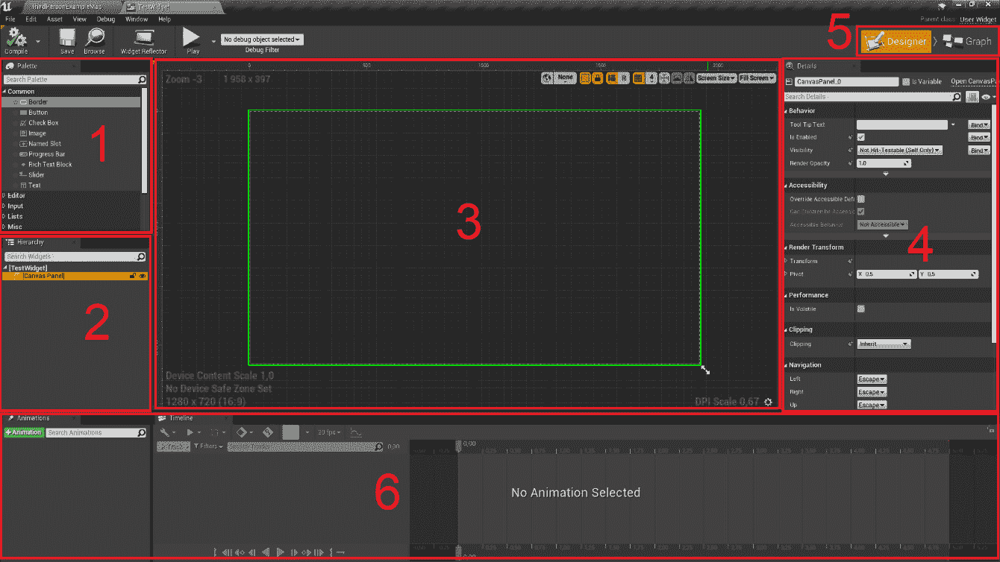

    图 8.1:小部件蓝图编辑器分为六个窗口

    上图中选项卡的详细信息如下:

    *   `Palette`–该选项卡显示了您可以添加到小部件中的所有单个用户界面元素。这包括`Buttons`、`Text Boxes`、`Images`、`Sliders`、`Check Boxes`等等。
    *   `Hierarchy`–该选项卡显示了当前小部件中存在的所有用户界面元素。如您所见，目前我们的层次结构中只有一个`Canvas Panel`元素。
    *   `Designer`–该选项卡根据层次结构中存在的元素及其布局方式，向您展示小部件的视觉外观。因为我们当前在小部件中仅有的元素没有可视化表示，所以这个选项卡当前是空的。
    *   `Details`–该选项卡显示您当前选择的用户界面元素的属性。如果选择现有的`Canvas Panel`元素，前面截图中的所有选项都会出现。
    *   因为这个资产是一个`Widget Blueprint`，所以这两个按钮可以让你在`Designer view`和`Graph view`之间切换，前者是截图中呈现的那个，后者看起来完全像一个普通的蓝图类的窗口。
    *   `Animation`–这两个选项卡都与 Widget 动画相关。小部件蓝图允许您随着时间的推移对用户界面元素的属性进行动画化，包括它们的`position`、`scale`、`color`等。左边的选项卡允许您在右边的选项卡中创建和选择要编辑的动画，在这里您可以编辑它们随着时间的推移会影响哪些属性。
4.  Let's now look at some of the available UI elements in our `Widget`, starting with the existing `Canvas Panel`.

    `Canvas Panels`通常被添加到小部件蓝图的根目录，因为它们允许您将用户界面元素拖动到`Designer`选项卡中的任何位置。这样，您可以按照自己的意愿布局这些元素:在屏幕中心、左上角、屏幕底部中心，等等。现在让我们将另一个非常重要的用户界面元素拖到我们的小部件中:一个`Button`。

5.  In the `Palette` tab, find the `Button` element and drag it into our `Designer` tab (hold the left mouse button while you drag):

    

    图 8.2:一个按钮元素被从调色板窗口拖到设计器窗口

    完成此操作后，您可以通过拖动按钮周围的小白点来将按钮调整到您想要的大小(请记住，您只能对画布面板内的元素执行此操作):

    

    图 8.3:使用白点调整用户界面元素大小的结果

    另一种在`Widget`中互相拖动元素的方法是将它们拖动到`Hierarchy`标签中，而不是`Designer`标签中。

6.  Now drag a `Text` element inside our `Button`, but this time, use the `Hierarchy` tab:

    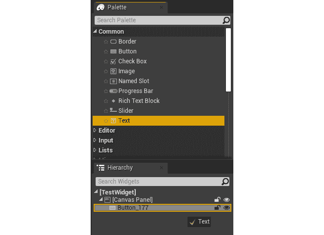

    图 8.4:将文本元素从调色板窗口拖到层次窗口

    `Text`元素可以包含您指定的文本，具有您可以在`Details`面板中修改的特定大小和字体。使用`Hierarchy`选项卡将`Text`元素拖到`Button`中后，`Designer`选项卡应该是这样的:

    

    图 8.5:在我们添加一个文本元素作为它的子元素之后，设计器选项卡中的按钮元素

    让我们改变这个`Text`块的几个属性。

7.  Select it either in the `Hierarchy` tab or the `Designer` tab and take a look at the `Details` panel:

    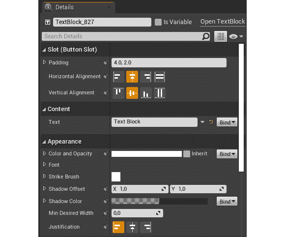

    图 8.6:细节面板，显示了我们添加的文本元素的属性

    在这里你可以找到几个你喜欢的属性。现在，我们只想关注其中两个:文本的`Content`和它的`Color and Opacity`。

8.  Update the `Content` of the `Text` element from `Text Block` to `Button 1`:

    

    图 8.7:将文本元素的文本属性更改为按钮 1

    接下来，我们把它的`Color and Opacity`从`White`改成`Black`。

9.  点击`Color and Opacity`属性，查看弹出的窗口`Color Picker`。每当您在 UE4 中编辑`Color`属性时，此窗口都会弹出。它允许您以多种不同的方式输入颜色，包括色轮、`Saturation`和`Value`条、`RGB`和`HSV`值滑块，以及几个更多的选项。
10.  For now, change the color from white to black by dragging the `Value` bar (the one that goes from white to black from top to bottom) all the way to the bottom and then pressing `OK`:

    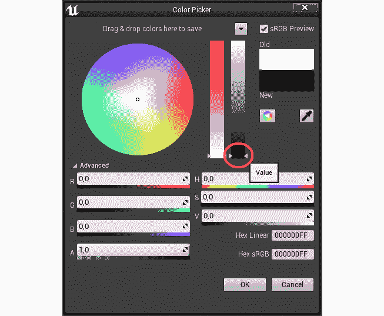

    图 8.8:在颜色选择器窗口中选择黑色

11.  After these changes, this is what the button should look like:

    

图 8.9:在我们更改文本元素的文本属性及其颜色后的按钮元素

至此，我们结束了本章的第一个练习。现在，您已经了解了 UMG 的一些基本知识，例如如何将`Button`和`Text`元素添加到您的小部件中。

在我们进入下一个练习之前，让我们先了解一下主播。

# 锚

正如你可能知道的，视频游戏是在许多不同的屏幕尺寸和不同的分辨率下进行的。因此，确保您创建的菜单能够有效地适应所有这些不同的分辨率非常重要。这是**主播**的主要目的。

锚点允许您通过指定希望用户界面元素占据的屏幕比例，来指定用户界面元素的大小如何随着屏幕分辨率的变化而变化。使用锚点，您可以让用户界面元素始终位于屏幕的左上角，或者始终占据屏幕的一半，而不管该屏幕的大小和分辨率如何。

随着屏幕大小或分辨率的变化，您的小部件将相对于其锚点进行缩放和移动。只有`Canvas Panel`的直接子元素可以有一个锚点，当您选择所述元素时，您可以通过`Designer`选项卡中的白色花状形状`Anchor Medallion`来可视化该锚点:


图 8.10:设计器窗口中显示的轮廓左上角的锚牌

默认情况下，锚点会折叠到左上角，这意味着您无法控制按钮随着分辨率的变化而缩放的方式，所以让我们在下一个练习中更改它。

## 练习 8.02:编辑 UMG 主播

在本练习中，我们将更改小部件中的锚点，以使按钮的大小和形状适应各种屏幕分辨率和大小。

以下步骤将帮助您完成本练习:

1.  Select the Button we created in the previous exercise, then head to the `Details` panel and press the very first property you see, the `Anchors` property. Here you'll be able to see the `Anchor` presets, which will align the UI element according to the pivots shown.

    我们希望我们的按钮位于屏幕中央。

2.  Click on the pivot that's at the center of the screen:

    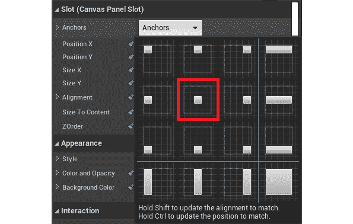

    图 8.11:按钮的锚点属性，中心锚点在一个框中

    你会看到我们的`Anchor Medallion`现在已经改变了位置:

    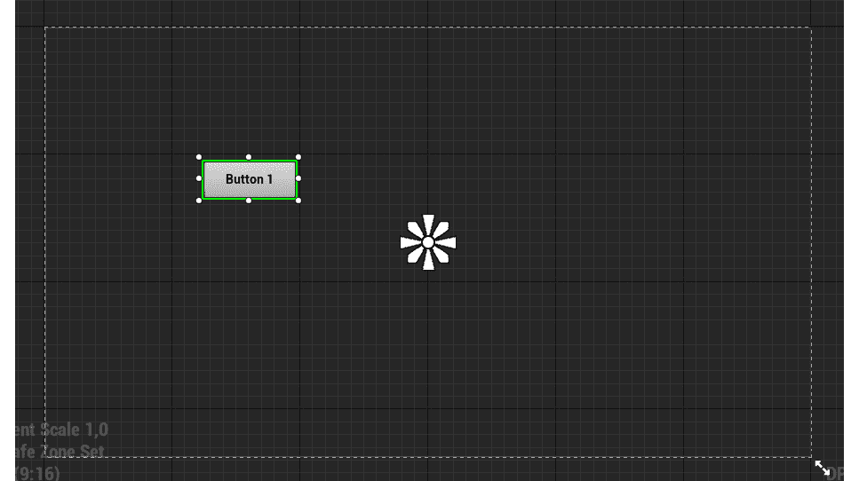

    图 8.12:我们将按钮的锚改为中心后的锚牌

    现在`Anchor Medallion`位于屏幕中心，我们仍然无法控制按钮在不同分辨率下的缩放方式，但至少我们知道它会相对于屏幕中心进行缩放。

    为了让我们的按钮在屏幕上居中，我们还必须将按钮的位置更改为在屏幕的中心。

3.  Repeat the previous step of picking the center Anchor, but this time, before you select it, hold the *Ctrl* key in order to snap the Button's position to this Anchor. After you click it, release the *Ctrl* key. This should be the result:

    

    图 8.13:按钮元素被移动到中心选定的锚点附近

    从前面的截图中可以看到，我们的按钮已经改变了位置，但是它还没有在屏幕上正确居中。这是因为它的`Alignment`。

    `Alignment`属性是类型`Vector2D`(一个具有两个`float`属性:`X`和`Y`的元组)，并指示相对于其总大小的用户界面元素的中心。默认情况下，它被设置为`(0,0)`，这意味着元素的中心是它的左上角，这解释了前面截图中的结果。可以一直走到`(1,1)`，右下角。在这种情况下，假设我们希望对齐使按钮居中，我们希望它是`(0.5, 0.5)`。

4.  In order to update a UI element's alignment when picking an `Anchor` point, you have to hold the *Shift* key and repeat the previous step. Alternately, to update both the position and the alignment of the button, picking the center `Anchor` point while holding both the *Ctrl* and *Shift* keys will do the job. This should then be the result:

    

    图 8.14:按钮元素相对于其在中心选择的锚点居中

    此时，当改变屏幕的分辨率时，我们知道这个按钮将始终保持在屏幕的中心。然而，为了保持按钮相对于分辨率的大小，我们需要做一些更多的修改。

5.  Drag the bottom-right *petal* of the `Anchor Medallion` all the way to the bottom-right corner of the button:

    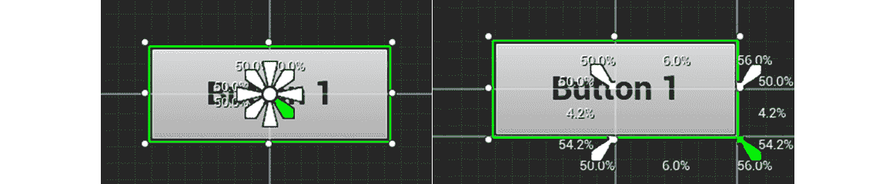

    图 8.15:拖动锚点徽章的右下角花瓣来更新按钮元素的锚点

6.  Drag the top-left *petal* of the `Anchor Medallion` all the way to the top-left corner of the button:

    

    图 8.16:拖动锚点徽章的左上角花瓣来更新按钮元素的锚点

    注意

    当改变`Anchor`时，你在按钮周围看到的百分比是元素在屏幕上所占的空间百分比。例如，看最后一张截图，我们可以看到按钮占据了 *X* 坐标上微件空间的`11.9%`和 *Y* 坐标上微件空间的`8.4%`。

    移动锚点徽章*花瓣*时，按住 *Ctrl* 键，可以将用户界面元素的大小设置为锚点的大小。

    现在，我们的按钮将最终适应不同的屏幕尺寸和分辨率，因为这些改变了它的锚。

    您也可以使用`Details`面板，通过使用`Anchor Medallion`并移动按钮来手动编辑我们刚刚编辑的所有属性:

    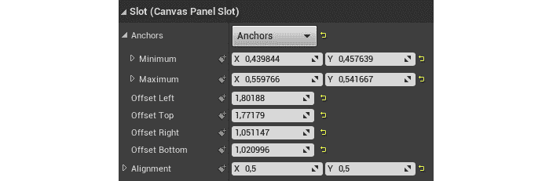

    图 8.17:我们使用锚牌更改的属性，显示在详细信息窗口中

    最后，我们需要知道如何在`Designer`选项卡中可视化不同分辨率的小部件。

7.  Drag the double arrow at the bottom right of the outlined box inside the `Designer` tab:

    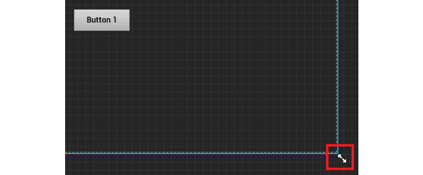

图 8.18:设计器选项卡内轮廓框右下角的双箭头

通过拖动双箭头，您可以将`Canvas`调整到您想要的任何屏幕分辨率。在下面的截图中，您将看到各种设备最常用的分辨率，并且您可以在每种设备中预览您的小部件:

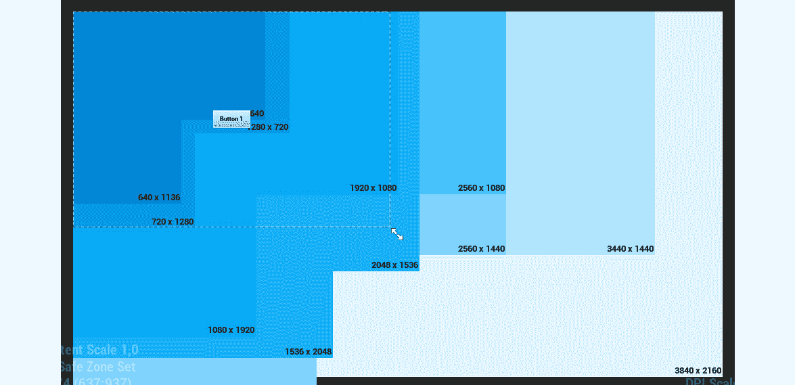

图 8.19:我们可以选择在设计器窗口中预览的分辨率

注意

你可以在[上找到 UMG 主播的完整参考。](https://docs.unrealengine.com/en-US/Engine/UMG/UserGuide/Anchors)

我们的练习到此结束。您已经了解了锚和调整小部件以适应不同的屏幕大小和分辨率。

现在我们已经了解了 UMG 的一些基本知识，让我们看看如何为这个小部件蓝图创建一个小部件 C++类，这是我们在下一个练习中要做的。

## 练习 8.03:创建 RestartWidget C++类

在本练习中，我们将学习如何创建一个 Widget C++类，我们创建的 Widget 蓝图将从该类继承。当玩家在我们的`Dodgeball`游戏中死亡时，它会被添加到屏幕上，这样玩家就可以选择重启关卡。这个小部件将有一个按钮，当玩家点击它时，它将重启关卡。

本练习的第一步是将 UMG 相关模块添加到我们的项目中。虚幻引擎由几个不同的模块组成，在每个项目中，你必须指定你将要使用的模块。我们的项目在生成源代码文件时附带了一些通用模块，但是我们还需要添加一些。

以下步骤将帮助您完成本练习:

1.  打开`Dodgeball.build.cs`文件，这是一个 C#文件，而不是 C++文件，位于项目的`Source`文件夹中。
2.  Open the file, and you'll find the `AddRange` function from the `PublicDependencyModuleNames` property being called. This is the function that tells the engine which modules this project intends to use. As a parameter, an array of strings is sent, with the names of all the intended modules for the project. Given that we intend on using UMG, we'll need to add the UMG-related modules: `UMG`, `Slate`, and `SlateCore`:

    ```cpp
    PublicDependencyModuleNames.AddRange(new string[] { "Core",   "CoreUObject", "Engine", "InputCore", "HeadMountedDisplay",   "UMG", "Slate", "SlateCore" });
    ```

    现在我们已经通知引擎我们将使用 UMG 模块，让我们创建我们的 Widget C++类:

3.  打开虚幻编辑器。
4.  右键单击内容浏览器并选择`New C++ Class`。
5.  将`Show All Classes`复选框设置为`true`。
6.  搜索`UserWidget`类，并选择该类作为新类的父类。
7.  Name the new C++ class `RestartWidget`.

    在 Visual Studio 中打开文件后，按照以下步骤开始修改我们的 Widget C++类:

8.  The first thing we'll add to this class is a `public` `class UButton*` property called `RestartButton`, which represents the Button the player will press in order to restart the level. You will want it to be bound to a Button in the Blueprint class that inherits from this class, by using the `UPROPERTY` macro with the `BindWidget` meta tag. This will force that Widget Blueprint to have a `Button` called `RestartButton` that we can access in C++ through this property and then freely edit its properties, such as the size and position, in the Blueprint:

    ```cpp
    UPROPERTY(meta = (BindWidget))
    class UButton* RestartButton;
    ```

    注意

    如果从这个 C++类继承的 Widget 蓝图没有相同类型和名称的元素，使用`BindWidget`元标记将导致编译错误。如果您不想发生这种情况，您必须将`UPROPERTY`标记为可选的`BindWidget`像这样:`UPROPERTY(meta = (BindWidget, OptionalWidget = true))`这将使绑定该属性成为可选的，并且在编译小部件蓝图时不会导致编译错误。

    接下来，我们要添加玩家点击`RestartButton`时会调用的功能，这将重启关卡。我们将使用`GameplayStatics`对象的`OpenLevel`功能，然后发送当前级别的名称。

9.  在 Widget 类的头文件中，添加一个名为`OnRestartClicked`的`protected`函数的声明，该函数不返回任何内容，也不接收任何参数。该功能必须标记为`UFUNCTION` :

    ```cpp
    protected:
    UFUNCTION()
    void OnRestartClicked();
    ```

10.  在类的源文件中，为`GameplayStatics`对象添加一个`include`:

    ```cpp
    #include "Kismet/GameplayStatics.h"
    ```

11.  然后，为我们的`OnRestartClicked`函数添加一个实现:

    ```cpp
    void URestartWidget::OnRestartClicked()
    {
    }
    ```

12.  Inside its implementation, call the `GameplayStatics` object's `OpenLevel` function. This function receives as parameters a world context object, which will be the `this` pointer, and the name of the level, which we'll have to fetch using the `GameplayStatics` object's `GetCurrentLevelName` function. This last function must also receive a world context object, which will also be the `this` pointer:

    ```cpp
    UGameplayStatics::OpenLevel(this,   FName(*UGameplayStatics::GetCurrentLevelName(this)));
    ```

    注意

    对`GameplayStatics`对象的`GetCurrentLevelName`函数的调用必须以`*`开头，因为它返回一个`FString`，UE4 的字符串类型，并且必须取消引用才能传递给`FName`构造函数。

    下一步将绑定该功能，当玩家按下`RestartButton`时调用该功能:

13.  为了做到这一点，我们必须覆盖一个属于`UserWidget`类的函数，叫做`NativeOnInitialized`。这个函数只被调用一次，类似于 Actor 的`BeginPlay`函数，这使得它适合做我们的设置。在小部件类的头文件

    ```cpp
    virtual void NativeOnInitialized() override;
    ```

    中添加带有`virtual`和`override`关键字的`public` `NativeOnInitialized`函数的声明
14.  接下来，在类的源文件中，添加这个函数的实现。在里面，调用它的`Super`函数，添加一个`if`语句，检查我们的`RestartButton`和`nullptr`是否不同:

    ```cpp
    void URestartWidget::NativeOnInitialized()
    {
      Super::NativeOnInitialized();
      if (RestartButton != nullptr)
      {
      }
    }
    ```

15.  如果`if`语句为真，我们希望将我们的`OnRestartClicked`功能绑定到按钮的`OnClicked`事件。我们可以通过访问按钮的`OnClicked`属性并调用其`AddDynamic`函数来实现，将我们想要调用该函数的对象(即`this`指针)和要调用的函数(即`OnRestartClicked`函数:

    ```cpp
    if (RestartButton != nullptr)
    {
      RestartButton->OnClicked.AddDynamic(this,   &URestartWidget::OnRestartClicked);
    }
    ```

    的指针)作为参数发送出去
16.  Because we're accessing functions related to the `Button` class, we'll also have to include it:

    ```cpp
    #include "Components/Button.h"
    ```

    注意

    当玩家用鼠标按下并释放按钮时，会调用按钮的`OnClicked`事件。还有其他与按钮相关的事件，包括`OnPressed`事件(当玩家按下按钮时)`OnReleased`事件(当玩家释放按钮时)`OnHover`和`OnUnhover`事件(当玩家分别开始和停止将鼠标悬停在该按钮上时)。

    `AddDynamic`函数必须接收一个指向标有`UFUNCTION`宏的函数的指针作为参数。如果没有，您将在调用该函数时得到一个错误。这就是为什么我们用`UFUNCTION`宏标记了`OnRestartClicked`功能。

    完成这些步骤后，编译您的更改并打开编辑器。

17.  打开您之前创建的`TestWidget`小部件蓝图。我们希望将这个小部件蓝图与我们刚刚创建的`RestartWidget`类相关联，因此我们需要对它进行修复。
18.  From the Widget Blueprint's `File` tab, select the `Reparent Blueprint` option and choose the `RestartWidget` C++ class as its new parent class:

    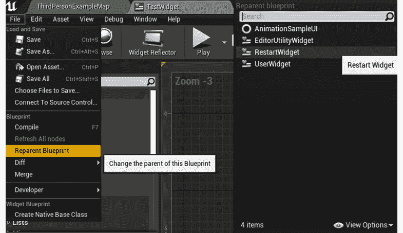

图 8.20:将测试小部件的类重新解析为重启小部件

您会注意到小部件蓝图现在有一个与我们在 C++类中创建的`BindWidget`元标记相关的编译错误:

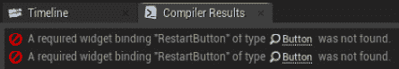

图 8.21:将父类设置为 RestartWidget 类后的编译器错误

这是因为 C++类找不到任何名为`RestartButton`的`Button`属性。

为了解决这个问题，我们需要将小部件蓝图中的`Button`元素重命名为`RestartButton`:

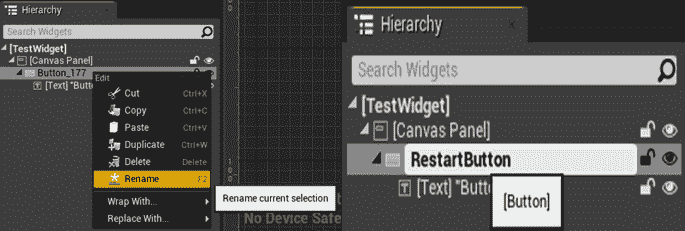

图 8.22:将 Button 元素重命名为 RestartButton

完成此操作后，关闭小部件蓝图，将其名称从`TestWidget`更改为`BP_RestartWidget`，与上一步相同。

我们的 Widget 类的创建到此结束。您现在知道如何将一个小部件 C++类连接到一个小部件蓝图，这是在 UE4 中处理游戏用户界面的一个非常重要的步骤。

接下来我们需要做的是创建我们的`Player Controller` C++类，它将负责实例化我们的`RestartWidget`并将其添加到屏幕上。我们将在下面的练习中这样做。

## 练习 8.04:创建向屏幕添加 RestartWidget 的逻辑

在本练习中，我们将创建负责将新创建的`RestartWidget`添加到屏幕的逻辑。当玩家死亡时，它会出现在屏幕上，这样他们就可以选择重启关卡。

为了做到这一点，我们必须创建一个新的`Player Controller` C++类，您可以通过以下步骤来完成:

1.  打开虚幻编辑器。
2.  *右键单击`Content Browser`上的*，选择`New C++ Class`。
3.  搜索`Player Controller`类，并选择该类作为新类的父类。
4.  命名新的 C++类`DodgeballPlayerController`。
5.  Open the class's files in Visual Studio.

    当我们的玩家耗尽生命值时，`DodgeballCharacter`类将访问这个`Player Controller`类，并调用一个将`RestartWidget`添加到屏幕上的函数。遵循以下步骤来实现这一点。

    为了知道要添加到屏幕上的小部件的类(将是小部件蓝图，而不是小部件 C++类)，我们需要使用`TSubclassOf`类型。

6.  In the class's header file, add a `public` `TSubclassOf<class URestartWidget>` property called `BP_RestartWidget`. Be sure to make it a `UPROPERTY` with the `EditDefaultsOnly` tag so that we can edit it in the Blueprint class:

    ```cpp
    public:
    UPROPERTY(EditDefaultsOnly)
    TSubclassOf<class URestartWidget> BP_RestartWidget;
    ```

    为了实例化这个小部件并将其添加到屏幕上，我们需要保存对它的引用。

7.  Add a new `private` variable of type `class URestartWidget*` and call it `RestartWidget`. Be sure to make it a `UPROPERTY` function with no tags:

    ```cpp
    private:
    UPROPERTY()
    class URestartWidget* RestartWidget;
    ```

    注意

    虽然这个属性在蓝图类中不应该是可编辑的，但是我们必须使这个引用成为`UPROPERTY`，否则垃圾收集器将会破坏这个变量的内容。

    接下来我们需要的是一个负责将我们的 Widget 添加到屏幕上的功能。

8.  添加一个名为`ShowRestartWidget` :

    ```cpp
    void ShowRestartWidget();
    ```

    的函数声明，该函数不返回任何内容，也不接收任何参数
9.  现在，转到我们班的源文件。首先，在`RestartWidget`类中添加一个 include:

    ```cpp
    #include "RestartWidget.h"
    ```

10.  然后，添加我们的`ShowRestartWidget`函数的实现，我们将从检查我们的`BP_RestartWidget`变量是否不是`nullptr` :

    ```cpp
    void ADodgeballPlayerController::ShowRestartWidget()
    {
      if (BP_RestartWidget != nullptr)
      {
      }
    }
    ```

    开始
11.  If that variable is valid (different than `nullptr`), we want to pause the game using the `SetPause` function of `Player Controller`. This will make sure that the game stops until the player decides to do something (which in our case will be pressing the button that restarts the level):

    ```cpp
    SetPause(true);
    ```

    接下来我们要做的是改变输入模式。在 UE4 中，有三种输入模式:`Game Only`、`Game and UI`、`UI Only`。如果您的`Input`模式包括`Game`，这意味着玩家角色和玩家控制器将通过`Input Actions`接收输入。如果您的`Input`模式包括`UI`，这意味着屏幕上的小部件将接收来自玩家的输入。当我们在屏幕上显示这个小部件时，我们不希望玩家角色收到任何输入。

12.  Hence, update to the `UI Only` `Input` Mode. You can do this by calling the `Player Controller` `SetInputMode` function and passing the `FInputModeUIOnly` type as a parameter:

    ```cpp
    SetInputMode(FInputModeUIOnly());
    ```

    在这之后，我们要显示鼠标光标，这样玩家就可以看到他们将鼠标悬停在哪个按钮上。

13.  我们将通过将`Player Controller`的`bShowMouseCursor`属性设置为`true` :

    ```cpp
    bShowMouseCursor = true;
    ```

    来实现
14.  现在，我们实际上可以使用`Player Controller`的`CreateWidget`函数实例化我们的 Widget，将 C++ Widget 类作为模板参数传递，在我们的例子中是`RestartWidget`，然后将`Owning Player`作为正常参数传递，T3 是拥有这个 Widget 的`Player Controller`，我们将使用`this`指针发送，Widget 类将是我们的`BP_RestartWidget`属性:

    ```cpp
    RestartWidget = CreateWidget<URestartWidget>(this,   BP_RestartWidget);
    ```

15.  在我们实例化小部件后，我们将希望使用小部件的`AddToViewport`功能将其添加到屏幕上:

    ```cpp
    RestartWidget->AddToViewport();
    ```

16.  我们的`ShowRestartWidget`功能到此结束。但是，我们还需要创建将`RestartWidget`从屏幕上移除的功能。在类的头文件中，为一个函数添加一个声明，就像`ShowRestartWidget`函数一样，但是这次调用了`HideRestartWidget` :

    ```cpp
    void HideRestartWidget();
    ```

17.  在类的源文件中，添加`HideRestartWidget`函数的实现:

    ```cpp
    void ADodgeballPlayerController::HideRestartWidget()
    {
    }
    ```

18.  在这个函数中，我们应该做的第一件事是通过调用其`RemoveFromParent`函数从屏幕中移除 Widget，并使用`Destruct`函数

    ```cpp
    RestartWidget->RemoveFromParent();
    RestartWidget->Destruct();
    ```

    将其销毁
19.  然后，我们想使用我们在前面的函数中使用的`SetPause`函数来解包游戏:

    ```cpp
    SetPause(false);
    ```

20.  And finally, set the `Input` Mode to `Game Only` and hide the mouse cursor the same way we did in the previous function (this time we pass the `FInputModeGameOnly` type instead):

    ```cpp
    SetInputMode(FInputModeGameOnly());
    bShowMouseCursor = false;
    ```

    我们的`Player Controller` C++类的逻辑到此结束。接下来我们应该做的是调用将我们的 Widget 添加到屏幕上的函数。

21.  转到`DodgeballCharacter`类的源文件，将`include`关键字添加到我们新创建的`DodgeballPlayerController` :

    ```cpp
    #include "DodgeballPlayerController.h"
    ```

    中
22.  在`DodgeballCharacter`类对`OnDeath_Implementation`函数的实现中，用以下内容替换对`QuitGame`函数的调用:
    *   使用`GetController`功能获取角色的玩家控制器。您需要将结果保存在名为`PlayerController`的类型为`DodgeballPlayerController*`的变量中。因为该函数将返回一个类型为`Controller`的变量，所以您还需要将其转换为我们的`PlayerController`类:

        ```cpp
        ADodgeballPlayerController* PlayerController = Cast<ADodgeballPlayerController>(GetController());
        ```

    *   Check whether the `PlayerController` variable is valid. If it is, call its `ShowRestartWidget` function:

        ```cpp
        if (PlayerController != nullptr)
        {
          PlayerController->ShowRestartWidget();
        }
        ```

        在这些修改之后，我们剩下要做的最后一件事就是调用将我们的 Widget 隐藏在屏幕之外的函数。打开`RestartWidget`类的源文件，实现以下修改。

23.  在`DodgeballPlayerController`上添加`include`，它包含我们将要调用的函数:

    ```cpp
    #include "DodgeballPlayerController.h"
    ```

24.  在`OnRestartClicked`函数实现内部，在调用`OpenLevel`函数之前，我们必须使用`GetOwningPlayer`函数获取 Widget 的`OwningPlayer`，类型为`PlayerController`，并将其转换为`DodgeballPlayerController`类:

    ```cpp
    ADodgeballPlayerController* PlayerController =   Cast<ADodgeballPlayerController>(GetOwningPlayer());
    ```

25.  然后，如果`PlayerController`变量有效，我们调用它的`HideRestartWidget`函数:

    ```cpp
    if (PlayerController != nullptr)
    {
      PlayerController->HideRestartWidget();
    }
    ```

完成所有这些步骤后，关闭编辑器，编译您的更改并打开编辑器。

你已经完成了这个练习。我们已经添加了所有必要的逻辑来将我们的`RestartWidget`添加到屏幕上，剩下唯一要做的就是创建我们新创建的`DodgeballPlayerController`的蓝图类，我们将在下一个练习中进行。

## 练习 8.05:设置躲避球游戏控制器蓝图类

在本练习中，我们将创建我们的`DodgeballPlayerController`的蓝图类，以便指定我们想要添加到屏幕上的小部件，并告诉 UE4 在游戏开始时使用这个蓝图类。

为此，请遵循以下步骤:

1.  进入内容浏览器中的`ThirdPersonCPP` - > `Blueprints`目录，右键点击，新建一个蓝图类。
2.  搜索`DodgeballPlayerController`类并选择它作为父类。
3.  将此蓝图类重命名为`BP_DodgeballPlayerController`。之后，打开这个蓝图资产。
4.  Go to its `Class Defaults` tab and set the class's `BP_RestartWidget` property to the `BP_RestartWidget` Widget Blueprint we created.

    现在，我们唯一要做的就是确保这个`Player Controller`蓝图类正在游戏中使用。

    为了做到这一点，我们必须再走几步。

5.  Go to the `ThirdPersonCPP` -> `Blueprints` directory in the `Content Browser`, *right-click* on it and create a new Blueprint class. Search for the `DodgeballGameMode` class and select it as the parent class, then rename this `Blueprint` class to `BP_DodgeballGameMode`.

    这个类负责告诉游戏对于游戏的每个元素使用哪些类，比如使用哪个`Player Controller` 类等等。

6.  Open the asset, go to its `Class Defaults` tab, and set the class's `PlayerControllerClass` property to the `BP_DodgeballPlayerController` class we created:

    

    图 8.23:将 PlayerController 类属性设置为 BP _ DodgeballPlayerController

7.  Close the asset and select the `Blueprints` drop-down option inside the editor toolbar that is at the top of the `Level Viewport` window. From there, select `Game Mode` (which should currently be set to `DodgeballGameMode`) `-> Select GameModeBase Class -> BP_DodgeballGameMode`. This will tell the editor to use this new `Game Mode` in all levels.

    现在，玩游戏，让你的角色被躲避球击中`3`次。第三次之后，你应该会看到游戏暂停并显示`BP_RestartWidget`:

    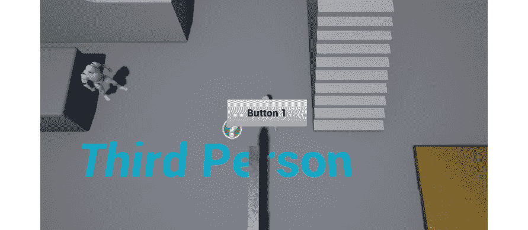

图 8.24:我们的 BP_RestartWidget 在玩家耗尽生命值后被添加到屏幕上

当你用鼠标点击`Button 1`时，你应该会看到电平重置为初始状态:

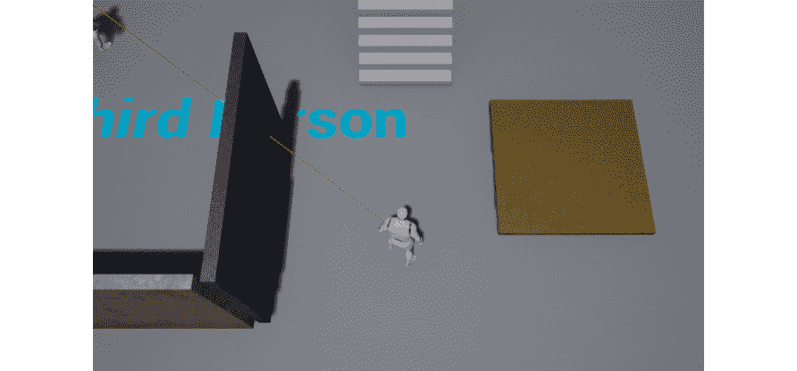

图 8.25:玩家按下上一张截图所示的按钮后，关卡重启

我们的练习到此结束。现在您知道如何创建小部件并在游戏中展示它们了。这是你成为一名熟练游戏开发者的旅程中的另一个关键步骤。

在我们继续下一个练习之前，让我们看看下一部分中的进度条。

# 进度条

电子游戏可以表示角色状态(如健康、耐力等)的方式之一是通过**进度条**，我们将使用进度条向玩家传达他们的角色有多健康。进度条本质上是一种形状，通常是矩形，可以填充和清空，以便向玩家显示特定属性的进度。如果你想让玩家看到他们角色的生命值只有最大值的一半，你可以通过显示进度条为半满来实现。这正是我们在这一部分要做的。这个进度条将是我们躲避球游戏的平视显示器中唯一的元素。

为了创建这个`Health Bar`，我们首先需要创建我们的抬头显示器小部件。打开编辑器，进入内容浏览器里面的`ThirdPersonCPP` - > `Blueprints`目录，右键新建`User Interface`类别的`Widget Blueprint`类。命名这个新的小部件蓝图`BP_HUDWidget`。之后，打开这个新的小部件蓝图。

UE4 中的进度条只是另一个 UI 元素，就像`Buttons`和`Text`元素一样，这意味着我们可以将其从`Palette`选项卡拖到我们的`Designer`选项卡中。请看下面的例子:

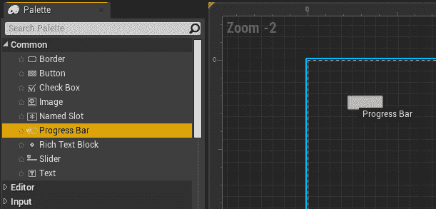

图 8.26:将进度条元素拖到设计器窗口中

起初，这个进度条可能看起来像一个按钮；但是，它包含两个对进度条很重要的特定属性:

*   `Percent`-允许您指定进度条的进度，从`0`到`1`
*   `Bar Fill Type`–允许您指定进度栏的填充方式(从左到右、从上到下等):


图 8.27:进度条的百分比和条填充类型属性

如果您将`Percent`属性设置为`0.5`，您应该会看到进度条相应地更新，以填充其长度的一半:


图 8.28:进度条填充到右边一半

继续之前，将`Percent`属性设置为`1`。

现在让我们将进度条的颜色从蓝色(默认颜色)更改为红色。为此，请转到`Details`选项卡，在`Appearance`类别中，将`Fill Color and Opacity`属性设置为红色(`RGB(1,0,0)`):

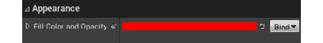

图 8.29:进度条的颜色变为红色

完成此操作后，进度条现在应该使用红色作为填充颜色。

为了结束进度条的设置，让我们更新它的位置、大小和锚点。按照以下步骤实现:

1.  在插槽 `(Canvas Panel Slot)`类别中，展开`Anchors`属性，并将其属性设置为以下值:
    *   `Minimum`:`X`轴上的`0.052`和`Y`轴上的`0.083`
    *   `Maximum`:`X`轴上的`0.208`和`Y`轴上的`0.116`
2.  将`Offset Left`、`Offset Top`、`Offset Right`和`Offset Bottom`属性设置为`0`。

您的进度条现在应该如下所示:


图 8.30:完成本节所有修改后的进度条

至此，我们可以结束进度条的话题了。我们的下一步将是添加所有必要的逻辑来使用进度条作为健康条，通过更新玩家角色健康旁边的`Percent`属性。我们将在下一个练习中完全这样做。

## 练习 8.06:创建健康栏 C++逻辑

在本练习中，我们将添加所有必要的 C++逻辑，以便随着玩家角色健康状况的变化更新平视显示器内的进度条。

为此，请遵循以下步骤:

1.  打开编辑器，创建一个继承自`UserWidget`的新 C++类，类似于我们在*练习 8.03* 、*中创建 RestartWidget C++类*的方式，但这次称之为`HUDWidget`。这将是 C++类，将用于我们的抬头显示器小部件。
2.  在`HUDWidget`类的头文件中，添加一个名为`HealthBar`的类型为`class UProgressBar*`的新`public`属性。这种类型用于表示进度条，就像我们在前面部分中在 C++中创建的进度条一样。请务必使用`BindWidget`标签将该属性声明为`UPROPERTY`函数:

    ```cpp
    UPROPERTY(meta = (BindWidget))
    class UProgressBar* HealthBar;
    ```

3.  为名为`UpdateHealthPercent`的`public`函数添加一个声明，该函数不返回任何内容，并接收一个`float HealthPercent`属性作为参数。将调用该函数来更新进度条的`Percent`属性:

    ```cpp
    void UpdateHealthPercent(float HealthPercent);
    ```

4.  在`HUDWidget`类的源文件中，添加`UpdateHealthPercent`函数的实现，该函数将调用`HealthBar`属性的`SetPercent`函数，传递`HealthPercent`属性作为参数:

    ```cpp
    void UHUDWidget::UpdateHealthPercent(float HealthPercent)
    {
      HealthBar->SetPercent(HealthPercent);
    }
    ```

5.  Because we'll be using the `ProgressBar` C++ class, we'll need to add an `include` to it at the top of the class's source file:

    ```cpp
    #include "Components/ProgressBar.h"
    ```

    下一步将为我们负责将`HUDWidget`添加到屏幕上的`Player Controller`添加所有必要的逻辑。为此，请执行以下步骤:

6.  Inside the `DodgeballPlayerController` class's header file, add a `public` property of type `TSubclassOf<class UHUDWidget>` called `BP_HUDWidget`. Make sure to mark it as a `UPROPERTY` function with the `EditDefaultsOnly` tag.

    该属性将允许我们在`DodgeballPlayerController`蓝图类中指定我们想要用作平视显示器的小部件:

    ```cpp
    UPROPERTY(EditDefaultsOnly)
    TSubclassOf<class UHUDWidget> BP_HUDWidget;
    ```

7.  添加另一个名为`HUDWidget`的属性，这次是`private`，类型为`class UHUDWidget*`。标记为`UPROPERTY`，但没有任何标签:

    ```cpp
    UPROPERTY()
    class UHUDWidget* HUDWidget;
    ```

8.  为`BeginPlay`功能添加`protected`声明，并将其标记为`virtual`和`override` :

    ```cpp
    virtual void BeginPlay() override;
    ```

9.  Add a declaration for a new `public` function, called `UpdateHealthPercent`, which returns nothing and receives a `float HealthPercent` as a parameter.

    这个函数将由我们的玩家角色类调用，以更新我们的平视显示器中的健康栏:

    ```cpp
    void UpdateHealthPercent(float HealthPercent);
    ```

10.  现在转到`DodgeballPlayerController`类的源文件。首先给我们的`HUDWidget`类增加一个`include`:

    ```cpp
    #include "HUDWidget.h"
    ```

11.  然后，添加`BeginPlay`函数的实现，首先调用`Super`对象的`BeginPlay`函数:

    ```cpp
    void ADodgeballPlayerController::BeginPlay()
    {
      Super::BeginPlay();
    }
    ```

12.  该函数调用后，检查`BP_HUDWidget`属性是否有效。如果是，用`UHUDWidget`模板参数调用`CreateWidget`函数，并传递`Owning Player`、`this`和小部件类`BP_HUDWidget`作为参数。请务必将`HUDWidget`属性设置为该函数调用的返回值:

    ```cpp
    if (BP_HUDWidget != nullptr)
    {
      HUDWidget = CreateWidget<UHUDWidget>(this, BP_HUDWidget);
    }
    ```

13.  设置`HUDWidget`属性后，调用其`AddToViewport`函数:

    ```cpp
    HUDWidget->AddToViewport();
    ```

14.  Lastly, add the implementation for the `UpdateHealthPercent` function, where we'll check if the `HUDWidget` property is valid and, if it is, call its `UpdateHealthPercent` function and pass the `HealthPercent` property as a parameter:

    ```cpp
    void ADodgeballPlayerController::UpdateHealthPercent(float   HealthPercent)
    {
      if (HUDWidget != nullptr)
      {
        HUDWidget->UpdateHealthPercent(HealthPercent);
      }
    }
    ```

    现在我们已经添加了负责将平视显示器添加到屏幕上并允许其更新的逻辑，我们需要对其他类进行一些修改。按照以下步骤进行操作。

    目前我们在前一章创建的`Health`界面只有`OnDeath`事件，每当一个对象生命值耗尽时就会调用这个事件。为了在玩家每次受到伤害时更新我们的健康栏，我们需要允许我们的`HealthInterface`类在这种情况发生时通知一个对象。

15.  打开`HealthInterface`类的头文件，并添加一个声明，类似于我们在*练习 7.04* 、*创建健康界面类*中为`OnDeath`事件所做的声明，但这次是为`OnTakeDamage`事件。只要有物体受到伤害，就会调用该事件:

    ```cpp
    UFUNCTION(BlueprintNativeEvent, Category = Health)
    void OnTakeDamage();
    virtual void OnTakeDamage_Implementation() = 0;
    ```

16.  Now that we have added this event to our `Interface` class, let's add the logic that calls that event: open the `HealthComponent` class's source file and, inside its implementation of the `LoseHealth` function, after subtracting the `Amount` property from the `Health` property, check whether the `Owner` implements the `Health` interface and, if it does, call its `OnTakeDamage` event. Do this the same way we already did later in that same function for our `OnDeath` event, but this time simply change the name of the event to `OnTakeDamage`:

    ```cpp
    if (GetOwner()->Implements<UHealthInterface>())
    {
      IHealthInterface::Execute_OnTakeDamage(GetOwner());
    }
    ```

    因为我们的生命值栏会要求玩家角色的生命值百分比，所以我们需要执行以下操作:

17.  在我们的`HealthComponent`中添加一个`public`函数，它只返回这样的内容:在`HealthComponent`类的头文件中，为一个返回`float`的`FORCEINLINE`函数添加一个声明。这个函数应该叫`GetHealthPercent`，是一个`const`函数。它的实现将简单地包括返回`Health`属性除以`100`，我们将假设这是一个对象在我们的游戏中可以拥有的最大生命值:

    ```cpp
    FORCEINLINE float GetHealthPercent() const { return Health /   100.f; }
    ```

18.  现在转到`DodgeballCharacter`类的头文件，为一个名为`OnTakeDamage_Implementation`的`public` `virtual`函数添加一个声明，该函数不返回任何内容，也不接收任何参数。标记为`virtual`和`override`:T6
19.  In the `DodgeballCharacter` class's source file, add an implementation for the `OnTakeDamage_Implementation` function we just declared. Copy the content of the `OnDeath_Implementation` function to this new function's implementation, but do this change: instead of calling the `ShowRestartWidget` function of `PlayerController`, call its `UpdateHealthPercent` function, and pass the return value of the `HealthComponent` property's `GetHealthPercent` function as a parameter:

    ```cpp
    void ADodgeballCharacter::OnTakeDamage_Implementation()
    {
      ADodgeballPlayerController* PlayerController =   Cast<ADodgeballPlayerController>(GetController());
      if (PlayerController != nullptr)
      {
        PlayerController->UpdateHealthPercent(HealthComponent-  >GetHealthPercent());
      }
    }
    ```

    本练习的代码设置到此结束。完成这些更改后，编译代码，打开编辑器并执行以下操作:

20.  打开`BP_HUDWidget`小部件蓝图并将其准备到`HUDWidget`类，就像您在*练习 8.03* 、*创建 RestartWidget C++类*中所做的一样。
21.  这会导致编译错误，您可以通过将进度条元素重命名为`HealthBar`来修复这个错误。
22.  Close this Widget Blueprint, open the `BP_DodgeballPlayerController` Blueprint class and set its `BP_HUDWidget` property to the `BP_HUDWidget` Widget Blueprint:

    

图 8.31:将 BP_HUDWidget 属性设置为 BP_HUDWidget

完成这些更改后，播放该级别。你应该注意到屏幕左上角的`Health Bar`:

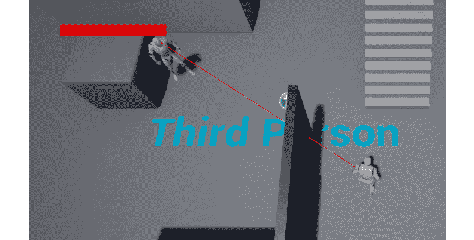

图 8.32:屏幕左上角显示的进度条

当玩家角色被躲避球击中时，你应该注意到`Health Bar`被清空了:

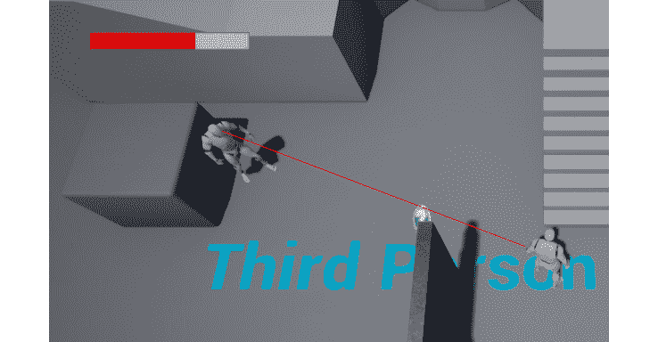

图 8.33:当玩家角色失去生命值时进度条被清空

至此，我们结束了本练习，在本练习中，您已经学习了在屏幕上添加平视显示器和在游戏中更新平视显示器的所有必要步骤。

## 活动 8.01:改进 RestartWidget

在本活动中，我们将在我们的`RestartWidget`读数中添加一个`Text`元素`Game Over`，以便玩家知道他们刚刚输掉了比赛；增加`Exit`按钮，允许玩家退出游戏；并且更新我们现有按钮的文本到`Restart`以便玩家知道当他们点击那个按钮时会发生什么。

以下步骤将帮助您完成本活动:

1.  打开`BP_RestartWidget`小部件蓝图。
2.  将新的`Text`元素拖到现有的`Canvas Panel`元素中。
3.  修改`Text`元素的属性:
    *   展开`Anchors`属性，将其`Minimum`设置为`X`轴上的`0.291`和`Y`轴上的`0.115`，将其`Maximum`设置为`X`轴上的`0.708`和`Y`轴上的`0.255`。
    *   将`Offset Left`、`Offset Top`、`Offset Right`和`Offset Bottom`属性设置为`0`。
    *   将`Text`属性设置为`GAME OVER`。
    *   将`Color and Opacity`属性设置为红色:`RGBA(1.0, 0.082, 0.082, 1.0)`。
    *   展开`Font`属性，将其`Size`设置为`100`。
    *   将`Justification`属性设置为`Align Text Center`。
4.  选择`RestartButton`属性中的另一个`Text`元素，将其`Text`属性更改为`Restart`。
5.  复制`RestartButton`属性，并将副本名称更改为`ExitButton`。
6.  将`ExitButton`属性中`Text`元素的`Text`属性更改为`Exit`。
7.  展开`ExitButton`属性的`Anchor`属性，将其`Minimum`设置为 *X* 轴上的`0.44`和 *Y* 轴上的`0.615`，将其`Maximum`设置为 *X* 轴上的`0.558`和 *Y* 轴上的`0.692`。
8.  Set the `ExitButton` properties of `Offset Left`, `Offset Top`, `Offset Right`, and `Offset Bottom` to `0`.

    完成这些更改后，我们需要添加负责处理`ExitButton`属性点击的逻辑，这将退出游戏:

9.  保存对`BP_RestartWidget`小部件蓝图所做的更改，并在 Visual Studio 中打开`RestartWidget`类的头文件。在这个文件中，添加一个名为`OnExitClicked`的`protected`函数的声明，该函数不返回任何内容，也不接收任何参数。务必将其标记为`UFUNCTION`。
10.  复制现有的`RestartButton`属性，但将其改为`ExitButton`。
11.  在`RestartWidget`类的源文件中，为`OnExitClicked`函数添加一个实现。将`OnBeginOverlap`函数的内容从`VictoryBox`类的源文件复制到`OnExitClicked`函数中，但是删除正在对`DodgeballCharacter`类执行的强制转换。
12.  在`NativeOnInitialized`函数实现中，将我们创建的`OnExitClicked`函数绑定到`ExitButton`属性的`OnClicked`事件，就像我们在*练习 8.03* 、*创建 RestartWidget C++类*中对`RestartButton`属性所做的那样。

本活动的代码设置到此结束。编译您的更改，打开编辑器，然后打开`BP_RestartWidget`并编译它，只是为了确保没有由于`BindWidget`标签而导致的编译错误。

一旦你这样做了，再玩一次关卡，让玩家角色被三个躲避球击中，注意`Restart`小部件会随着我们的新修改出现:

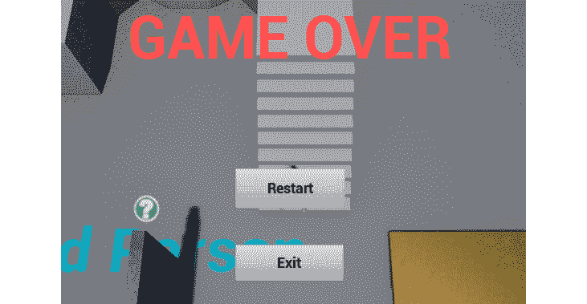

图 8.34:更新后的 BP_RestartWidget 在玩家耗尽生命值后显示

按下`Restart`键，应该可以重播关卡，按下`Exit`键，游戏应该结束。

我们的活动到此结束。您已经巩固了使用`Widget`蓝图和更改其元素属性的基础知识，现在可以开始制作自己的菜单了。

注意

这个活动的解决方案可以在:[https://packt.live/338jEBx](https://packt.live/338jEBx)找到。

# 总结

这一章结束了，你现在已经学会了如何在 UE4 中制作游戏用户界面，理解菜单和平视显示器等东西。您已经看到了如何操作小部件蓝图的用户界面元素，包括`Buttons`、`Text`元素和`Progress Bars`；有效地与 Anchors 合作，这有助于让您的游戏 UI 优雅地适应多个屏幕；听 C++中的鼠标事件，比如`OnClick`事件，用它来创建自己的游戏逻辑；以及如何将您创建的小部件添加到屏幕上，或者在特定的事件中，或者让它们一直存在。

在下一章中，我们将通过添加声音和粒子效果等视听元素来完善我们的躲避球游戏，并提高一个新的水平。