# 9。视听元素

概观

在这一章中，我们将完成我们在过去四章中一直在做的躲避球游戏。我们将通过添加音效、粒子效果和创建另一个关卡来结束这一章，这一次玩家必须遵循一个实际的路径来完成它。到本章结束时，您将能够在 UE4 项目中添加 2D 和 3D 音效以及粒子效果。

# 简介

在前一章中，我们学习了游戏 UI 以及如何创建用户界面(也称为小部件)并将其添加到屏幕上。

在这一章中，我们将学习如何为我们的游戏添加音频和粒子效果。这两个方面都将提高我们游戏的质量，并为玩家带来更沉浸式的体验。

视频游戏中的声音可以是音效(也称为 SFX)或音乐的形式。音效使你周围的世界更加可信和生动，而音乐有助于为你的游戏定调。这两个方面对你的游戏都非常重要。

在*反击* ( *CS: GO* )这样的竞技游戏中，声音也是极其重要的，因为玩家需要听到周围的声音，比如枪声和脚步声，以及它们来自哪个方向，从而尽可能多地收集周围的信息。

粒子效果很重要，原因和音效很重要一样:它们让你的游戏世界更可信、更沉浸。

让我们从学习音频在 UE4 中的工作原理开始这一章。

# UE4 中的音频

任何游戏必不可少的组成部分之一就是声音。声音使你的游戏更加可信和沉浸式，这将为你的玩家提供更好的体验。电子游戏通常有两种声音:

*   2D 声音
*   3D 声音

2D 声音不考虑听众的距离和方向，而 3D 声音的音量可以更高或更低，并根据玩家的位置向右或向左平移。2D 声音通常用于音乐，而 3D 声音通常用于音效。主要声音文件类型有`.wav`和`.mp3`。

以下是 UE4 中与音频相关的一些资产和类别:

*   `Sound Base`:表示包含音频的资产。这个类主要用于 C++ 和 bluetooth 中引用一个可以播放的音频文件。
*   `Sound Wave`:表示已经导入 UE4 的音频文件。继承自`Sound Base`。
*   `Sound Cue`:音频资产，可以包含与诸如衰减(音量如何随着听众距离的变化而变化)、循环、混音和其他音频相关功能相关的逻辑。它继承自`Sound Base`。
*   `Sound Class`:允许您将音频文件分成组并管理其某些设置(如音量和音高)的资产。例如，在`SFX` `Sound Class`中对所有与音效相关的声音进行分组，在`Dialogue` `Sound Class`中对所有角色对话进行分组，等等。
*   `Sound Attenuation`:允许您指定 3D 声音行为的资产；例如，在什么距离它将开始降低音量，在什么距离它将变得听不见(听不见)，如果它的音量将随着距离的增加而线性或指数变化，等等。
*   `Audio Component`:演员组件，可以管理音频文件及其属性的播放。用于设置声音的连续播放，如背景音乐。

在 UE4 中，我们可以像导入任何其他资产一样导入现有的声音:或者通过将文件从窗口文件浏览器拖到`Content Browser`中，或者通过单击`Content Browser`中的`Import`按钮。我们将在下一个练习中这样做。

## 练习 9.01:导入音频文件

在本练习中，您将把计算机中现有的声音文件导入 UE4。这个音频文件将在躲避球从表面反弹时播放。

注意

如果您没有音频文件(无论是`.mp3`还是`.wav`文件)来完成本练习，您可以通过以下链接下载`.mp3`或`.wav`文件:[https://www . freesoundeffects . com/free-track/bounce-1-468901/](https://www.freesoundeffects.com/free-track/bounce-1-468901/)。

将该文件保存为`BOUNCE.wav`。

获得音频文件后，请按照下列步骤操作:

1.  打开编辑器。
2.  Go to the `Content` folder inside the `Content Browser` interface and create a new folder called `Audio`:

    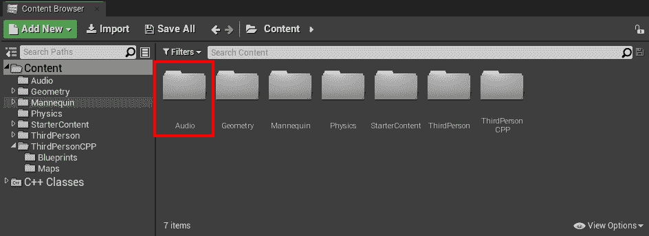

    图 9.1:内容浏览器中的音频文件夹

3.  转到刚刚创建的`Audio`文件夹。
4.  将音频文件导入此文件夹。您可以通过*将*音频文件从`Windows File Explorer`拖到`Content Browser`来实现。
5.  After you've done this, a new asset should appear with the name of your audio file, which you can listen to when clicking on it:

    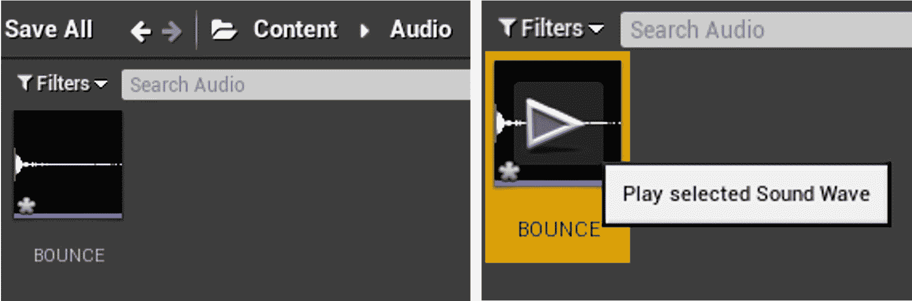

    图 9.2:导入的音频文件

6.  Open this asset. You should see many properties available for editing. However, we'll be focusing solely on some of the properties inside the `Sound` category:

    

    图 9.3:声音资产的设置

    以下属性在`Sound`类别中可用:

    *   `Looping`:这个声音在播放时是否会循环。
    *   `Volume`:这个声音的音量。
    *   `Pitch`:这个声音的音高。音调越高，频率越高，声音的音调也就越高。
    *   `Class`: The `Sound Class` of this sound.

        我们唯一要改变的属性是`Class`属性。我们可以使用 UE4 附带的现有的`Sound`类之一，但是让我们为躲避球创建我们自己的`Sound Class`，以便为我们的游戏创建一组新的声音。

7.  转到`Content Browser`界面内的`Audio`文件夹。
8.  *右键*，转到`Sounds`类别(倒数第二个类别)，再转到`Classes`类别，选择`Sound Class`。这将创造一个新的`Sound Class`资产。重命名该资产`Dodgeball`。
9.  Open your imported sound asset and set its `Class` property to `Dodgeball`:

    

图 9.4:将 Class 属性更改为躲避球声音类

现在这个导入的声音资产属于一个特定的类别，你可以在同一个`Sound Class`中分组与躲避球相关的其他声音效果，并通过那个`Sound Class`编辑它们的属性，包括`Volume`、`Pitch`和许多其他的。

这样，我们就可以结束我们的练习了。您已经学习了如何将声音导入到项目中，以及如何更改它们的基本属性。现在，让我们继续下一个练习，在我们的游戏中，每当躲避球从表面反弹时，我们都会发出声音。

## 练习 9.02:当躲避球从表面反弹时发出声音

在本练习中，我们将为我们的`DodgeballProjectile`类添加必要的功能，以便当躲避球从表面反弹时会发出声音。

为此，请遵循以下步骤:

1.  关闭编辑器并打开 Visual Studio。
2.  在`DodgeballProjectile`类的头文件中，添加一个名为`BounceSound`的受保护的`class USoundBase*`属性。该属性应为`UPROPERTY`并带有`EditDefaultsOnly`标签，以便在蓝图中编辑:

    ```cpp
    // The sound the dodgeball will make when it bounces off of a   surface
    UPROPERTY(EditAnywhere, Category = Sound)
    class USoundBase* BounceSound;
    ```

3.  完成后，转到`DodgeballProjectile`类的源文件，为`GameplayStatics`对象添加一个包含:

    ```cpp
    #include "Kismet/GameplayStatics.h"
    ```

4.  Then, at the beginning of the class's implementation of the `OnHit` function, before the cast to the `DodgeballCharacter` class, check whether our `BounceSound` is a valid property (different than `nullptr`) and whether the magnitude of the `NormalImpulse` property is greater than `600` units (we can access the magnitude by calling its `Size` function).

    正如我们在*第八章*、*用户界面*中看到的那样，`NormalImpulse`属性表示在闪避球被击中后将改变其轨迹的力的方向和大小。之所以要检查它的量级是否大于一定量，是因为当闪避球开始失去动量，每秒几次弹离地板时，我们不想每秒几次打`BounceSound`；否则，它会产生大量噪音。因此，我们将检查躲避球受到的冲击是否大于这个量，以确保这不会发生。如果这两件事都是真的，我们就称这个`GameplayStatics`物体为`PlaySoundAtLocation`。该功能负责播放 3D 声音。它接收五个参数:

    *   一个世界上下文对象，我们将其作为`this`指针传递。
    *   一个`SoundBase`物业，这将是我们的`HitSound`物业。
    *   声音的来源，我们将使用`GetActorLocation`功能传递。
    *   `VolumeMultiplier`，我们将通过值`1`来传递。该值指示播放该声音时音量的高低。例如,`2`的值意味着它的体积是它的两倍。
    *   `PitchMultiplier`, which indicates how much higher or lower the pitch of this sound will be when it's played. We'll be passing this value by using the `FMath` object's `RandRange` function, which receives two numbers as parameters and returns a random number between those two. To randomly generate a number between `0.7` and `1.3`, we'll be calling this function with these values as parameters.

        看看下面的代码片段:

        ```cpp
        if (BounceSound != nullptr && NormalImpulse.Size() > 600.0f)
        {
          UGameplayStatics::PlaySoundAtLocation(this, BounceSound,   GetActorLocation(), 1.0f, FMath::RandRange(0.7f, 1.3f));
        }
        ```

        注意

        负责播放 2D 音的功能也可以从`GameplayStatics`对象获得，叫做`PlaySound2D`。该功能将接收与`PlaySoundAtLocation`功能相同的参数，除了第三个参数，即声音的来源。

5.  编译这些更改，然后打开虚幻编辑器。
6.  Open the `BP_DodgeballProjectile` Blueprint, go to its `Class Defaults` tab, and set the `BounceSound` property to the Sound asset you imported:

    

    图 9.5:将 BounceSound 属性设置为我们导入的声音

7.  Play the level again and enter the enemy character's line of sight. You should notice a sound playing with different pitch values every time the dodgeball thrown by the enemy character hits a wall or the floor (not the player character):

    

图 9.6:玩家角色导致敌方角色投掷躲避球

如果发生这种情况，恭喜您–您已经使用 UE4 成功播放了声音！如果您听不到正在播放的声音，请确保它是可听到的(它的音量水平您可以听到)。

然而，你可能会注意到的另一件事是，声音总是以相同的音量播放，不管角色离弹跳的躲避球有多远:声音不是以 3D 播放的，而是在 2D 播放的。要使用 UE4 播放 3D 声音，我们必须了解声音衰减资产。

# 声音衰减

要在 UE4 中以 3D 方式播放声音，您必须创建一个声音衰减资产，正如我们在本章第一节中提到的那样。“声音衰减”资产将允许您指定希望特定声音如何随着其与听众的距离增加而改变音量。请看下面的例子。

打开虚幻编辑器，进入`Content Browser`界面内的`Audio`文件夹，*右键*，进入`Sounds`类别，选择`Sound Attenuation`。命名这个新资产`BounceAttenuation`:

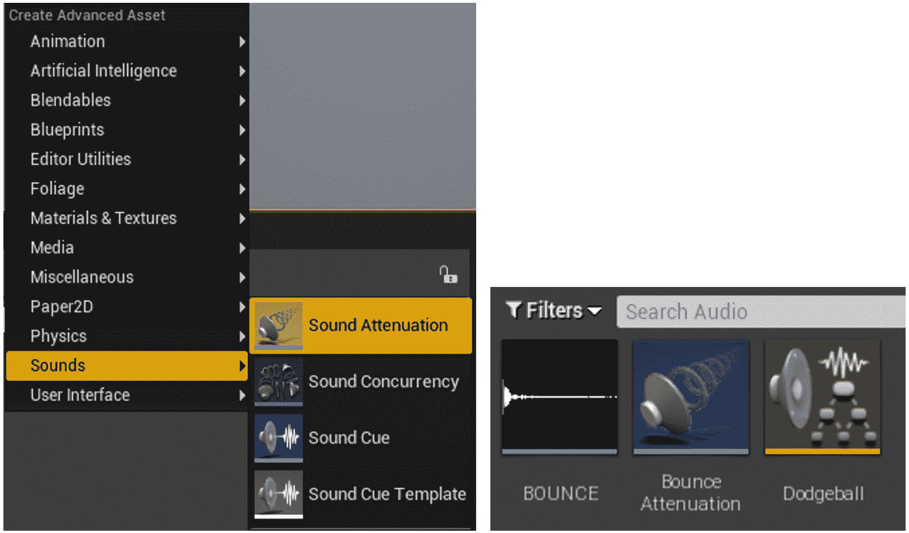

图 9.7:创建声音衰减资产

打开此`BounceAttenuation`资产。

声音衰减资产有很多设置；然而，我们将主要关注`Attenuation Distance`部分的几个设置:

*   `Inner Radius`:这个`float`属性允许我们指定声音在什么距离开始降低音量。如果声音在小于该值的距离播放，音量不会受到影响。将该属性设置为`200`单位。
*   `Falloff Distance`:这个 float 属性允许我们指定我们希望声音听不见的距离。如果声音播放的距离大于这个值，我们就听不到了。声音的音量会根据它与听众的距离以及它是更靠近`Inner Radius`还是`Falloff Distance`而变化。将该属性设置为`1500`单位:

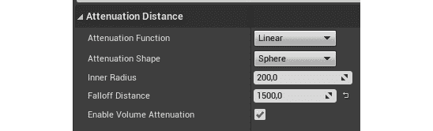

图 9.8:声音衰减资产设置

把这个想象成玩家周围的两个圆，小的圆是内圆(半径值为`Inner Radius`)，大的圆是衰减圆(半径值为`Falloff Distance`)。如果声音来自内环内部，则会以全音量播放，而来自衰减环外部的声音则根本不会播放。

注意

您可以在这里找到有关声音衰减资产的更多信息:

[https://docs . unrelingen . com/en-us/engine/audio/distance modeling 衰减](https://docs.unrealengine.com/en-US/Engine/Audio/DistanceModelAttenuation)。

现在您已经了解了声音衰减资产，让我们继续下一个练习，我们将把躲避球从地面反弹时播放的声音转换为 3D 声音。

## 练习 9.03:将弹跳声音变成 3D 声音

在本练习中，我们将把上一练习中添加的躲避球弹离地面时发出的声音转换为 3D 声音。这意味着当躲避球从一个表面反弹时，它发出的声音的音量会有所不同，这取决于它离玩家的距离。我们这样做是为了当躲避球离得很远时，音量会很低，而当它离得很近时，音量会很高。

要使用我们在上一节中创建的`BounceAttenuation`资产，请执行以下步骤:

1.  转到`DodgeballProjectile`的头文件，添加一个名为`BounceSoundAttenuation`的`protected` `class USoundAttenuation*`属性。这个属性应该是一个`UPROPERTY`，并且有`EditDefaultsOnly`标记，这样就可以在蓝图中编辑:

    ```cpp
    // The sound attenuation of the previous sound
    UPROPERTY(EditAnywhere, Category = Sound)
    class USoundAttenuation* BounceSoundAttenuation;
    ```

2.  转到其源文件中`OnHit`函数的`DodgeballProjectile`类实现，并在对`PlaySoundAtLocation`函数的调用中添加以下参数:
    *   `StartTime`，我们将通过值`0`来传递。该值指示声音开始播放的时间。如果声音持续 2 秒，我们可以通过传递一个值`1`，让这个声音从 1 秒开始。我们传递一个值`0`让声音从一开始就播放。
    *   `SoundAttenuation`, to which we'll pass our `BounceSoundAttenuation` property:

        ```cpp
        UGameplayStatics::PlaySoundAtLocation(this, BounceSound,   GetActorLocation(), 1.0f, 1.0f, 0.0f,   BounceSoundAttenuation);
        ```

        注意

        虽然我们只想传递额外的`SoundAttenuation`参数，但我们也必须传递它之前的所有其他参数。

3.  编译这些更改，然后打开编辑器。
4.  Open the `BP_DodgeballProjectile` Blueprint, go to its `Class Defaults` tab, and set the `BounceSoundAttenuation` property to our `BounceAttenuation` asset:

    

    图 9.9:将 BoundSoundAttenuation 属性设置为 BoundSoundAttenuation 资产

5.  Play the level again and enter the enemy character's line of sight. You should now notice that the sound that plays every time the dodgeball thrown by the enemy character hits a wall or the floor will be played at different volumes, depending on its distance, and that you won't hear it if the dodgeball is far away:

    

图 9.10:玩家角色导致敌方角色投掷躲避球

这样，我们就可以结束这个练习了。你现在知道如何使用 UE4 播放 3D 声音了。我们将在下一个练习中为我们的游戏添加背景音乐。

## 练习 9.04:为我们的游戏添加背景音乐

在本练习中，我们将在游戏中添加背景音乐。我们将通过创建一个带有音频组件的新 Actor 来实现这一点，正如我们前面提到的，它适用于播放背景音乐。为此，请遵循以下步骤:

1.  下载位于[https://packt.live/3pg21sQ](https://packt.live/3pg21sQ)的音频文件，导入到`Content Browser`界面的`Audio`文件夹中，就像我们在*练习 9.01* 、*导入一个音频文件*一样。
2.  *在`Content Browser`界面内右键*，新建一个以`Actor`类为父类的 C++ 类。命名这个新班级`MusicManager`。
3.  当此类的文件生成并且 Visual Studio 已自动打开时，请关闭编辑器。
4.  在`MusicManager`类的头文件中，添加一个名为`AudioComponent`的新的`class UAudioComponent*`类型的`protected`属性。将此作为`UPROPERTY`并添加`VisibleAnywhere`和`BlueprintReadOnly`标签:

    ```cpp
    UPROPERTY(VisibleAnywhere, BlueprintReadOnly)
    class UAudioComponent* AudioComponent;
    ```

5.  在`MusicManager`类的源文件中，为`AudioComponent`类添加一个`include`:

    ```cpp
    #include "Components/AudioComponent.h"
    ```

6.  在该类的构造函数中，将`bCanEverTick`属性更改为`false` :

    ```cpp
    PrimaryActorTick.bCanEverTick = false;
    ```

7.  在这一行之后，添加一个新的，通过调用`CreateDefaultSubobject`函数并传递`UAudioComponent`类作为模板参数和`"Music Component"`作为普通参数来创建`AudioComponent`类:

    ```cpp
    AudioComponent =   CreateDefaultSubobject<UAudioComponent>(TEXT("Music   Component"));
    ```

8.  进行这些更改后，编译您的代码并打开编辑器。
9.  进入`Content Browser`界面的`ThirdPersonCPP` - > `Blueprints`文件夹，新建一个继承自`MusicManager`类的蓝图类。命名为`BP_MusicManager`。
10.  Open this asset, select its `Audio` component, and set that component's `Sound` property to your imported sound:

    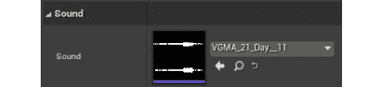

    图 9.11:声音属性正在更新

11.  将`BP_MusicManager`类的一个实例拖动到级别中。
12.  Play the level. You should notice the music start playing when the game starts and it should also loop automatically when it reaches the end (this is done thanks to the Audio component).

    注意

    音频组件会自动循环播放任何声音，因此无需更改声音资产的`Looping`属性。

完成所有这些步骤后，我们就完成了本练习。你现在知道如何给你的游戏添加简单的背景音乐了。

现在，让我们跳到下一个主题，粒子系统。

# 粒子系统

让我们谈谈许多电子游戏的另一个非常重要的元素:粒子系统。

在视频游戏术语中，粒子本质上是 3D 空间中可以用图像表示的位置。粒子系统是许多粒子的集合，可能具有不同的图像、形状、颜色和大小。在下图中，您将找到在 UE4 中制作的两个粒子系统的示例:

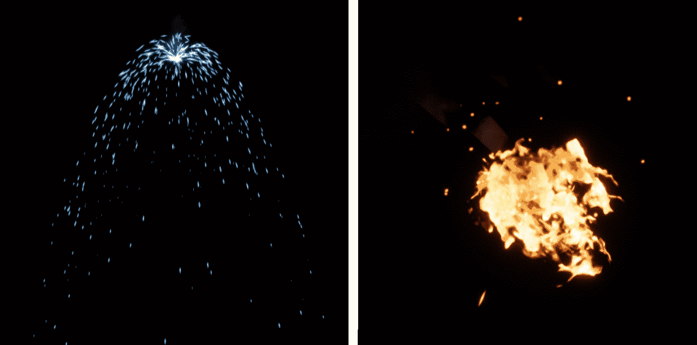

图 9.12:UE4 中两种不同的粒子系统

左边的粒子系统被认为是电火花，可能来自一根被切割的电缆，现在短路了，而右边的粒子系统被认为是火。虽然左边的粒子系统比较简单，但是可以看出右边的这个里面有不止一种类型的粒子，可以组合在同一个系统中。

注意

UE4 有两种不同的工具来创建粒子系统:`Cascade`和`Niagara`。Cascade 是从 UE4 开始就存在的工具，而 Niagara 是一个更新、更复杂的系统，从 2020 年 5 月开始才可以投入生产，截止到虚幻引擎 4.25 版本。

在 UE4 中创建粒子系统不在本书的讨论范围内，但建议您使用尼亚加拉瀑布，因为它是引擎的新成员。

在本章中，我们将只使用 UE4 中已经包含的粒子系统，但是如果您想创建自己的粒子系统，这些链接将为您提供关于 Cascade 和 Niagara 的更多信息:

层叠:[https://docs . unrealengine . com/en-US/Engine/Rendering/pieces systems/层叠](https://docs.unrealengine.com/en-US/Engine/Rendering/ParticleSystems/Cascade)

[https://www . YouTube . com/playlist？列表= plzlv _ n0 _ O1 gydlyb 3 lvfjyicbbe 8 nqr 8t](https://www.youtube.com/playlist?list=PLZlv_N0_O1gYDLyB3LVfjYIcbBe8NqR8t)

尼亚加拉:[https://docs . unrealengine . com/en-US/Engine/Niagara/emiteredorreference/index . html](https://docs.unrealengine.com/en-US/Engine/Niagara/EmitterEditorReference/index.html)

[https://docs . unrealengine . com/en-US/Engine/nigara/quick start](https://docs.unrealengine.com/en-US/Engine/Niagara/QuickStart)

我们将在下一个练习中学习如何将粒子系统添加到我们的游戏中。在本章中，我们将简单地使用 UE4 团队已经制作的现有粒子系统。

## 练习 9.05:当躲避球击中玩家时产生粒子系统

在本练习中，我们将了解如何在 UE4 中生成粒子系统。在这种情况下，当敌人投掷的躲避球击中玩家时，我们将产生`explosion`粒子系统。

为此，请遵循以下步骤:

1.  关闭编辑器并打开 Visual Studio。
2.  In the `DodgeballProjectile` class's header file, add a protected `class UParticleSystem*` property called `HitParticles`.

    `UParticleSystem`类型是 UE4 中粒子系统的名称。请确保将其设为`UPROPERTY`并给它添加`EditDefaultsOnly`标签，以便在蓝图类中进行编辑:

    ```cpp
    // The particle system the dodgeball will spawn when it hits   the player
    UPROPERTY(EditAnywhere, Category = Particles)
    class UParticleSystem* HitParticles;
    ```

3.  In the `DodgeballProjectile` class's source file, inside its implementation of the `OnHit` function. Before the call to the `Destroy` function, check whether our `HitParticles` property is valid. If it is, call the `GameplayStatics` object's `SpawnEmitterAtLocation` function.

    这个函数将产生一个演员，该演员将扮演我们作为参数传递的粒子系统。它接收以下参数:

    *   一个`World`对象，我们将使用`GetWorld`函数传递它。
    *   一个`UParticleSystem*`物业，这将是我们的`HitParticles`物业。
    *   The `FTransform` of the actor that will play the Particle System, which we'll pass using the `GetActorTransform` function:

        ```cpp
        if (HitParticles != nullptr)
        {
          UGameplayStatics::SpawnEmitterAtLocation(GetWorld(),   HitParticles, GetActorTransform());
        }
        ```

        注意

        虽然我们不会在这个项目中使用它，但是`GameplayStatics`对象中还有另一个与生成粒子系统相关的功能，那就是`SpawnEmitterAttached`功能。这个函数将生成一个粒子系统，并将其附加到一个演员身上，如果你想让一个移动的物体发光，这样粒子系统将一直附加到那个物体上，这可能会很有用。

4.  编译这些更改，然后打开编辑器。
5.  Open the `BP_DodgeballProjectile` Blueprint, go to its `Class Defaults` tab, and set the `HitParticles` property to the `P_Explosion` Particle System asset:

    

    图 9.13:将“击中粒子”属性设置为“爆炸”

6.  Now, play the level and let your player character get hit by a dodgeball. You should now see the explosion Particle System being played:

    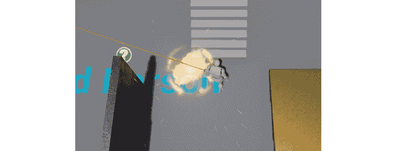

图 9.14:当躲避球击中玩家时，爆炸粒子系统正在播放

这个练习到此结束。你现在知道如何在 UE4 中玩粒子系统了。粒子系统将增加你的游戏视觉天赋，使它更具视觉吸引力。

在下一个活动中，我们将通过在躲避球击中玩家时播放声音来巩固我们在 UE4 中播放音频的知识。

## 活动 9.01:闪避球击中玩家时发出声音

在本活动中，我们将创建每当玩家角色被躲避球击中时负责播放声音的逻辑。在电子游戏中，以多种方式向玩家传递关键信息是非常重要的，因此除了更改玩家角色的健康栏之外，我们还将在玩家被击中时播放声音，以便玩家知道角色正在受到伤害。

为此，请遵循以下步骤:

1.  Import a sound file that will be played when the player character gets hit into the `Audio` folder inside the `Content Browser` interface.

    注意

    如果没有声音文件，可以使用[https://www.freesoundeffects.com/free-track/punch-426855/](https://www.freesoundeffects.com/free-track/punch-426855/)的可用文件。

2.  打开`DodgeballProjectile`类的头文件。添加一个`SoundBase*`属性，就像我们在*练习 9.02* 中所做的那样，*当躲避球从表面反弹时发出声音*，但这次称之为`DamageSound`。
3.  打开`DodgeballProjectile`类的源文件。在`OnHit`函数的实现中，在你破坏了玩家角色之后，在你调用`Destroy`函数之前，检查`DamageSound`属性是否有效。如果是，调用`GameplayStatics`对象的`PlaySound2D`函数(在*练习 9.02 中提到，* *当躲避球从表面反弹时发出声音*，将`this`和`DamageSound`作为参数传递给该函数调用。
4.  编译您的更改并打开编辑器。
5.  Open the `BP_DodgeballProjectile` Blueprint and set its `DamageSound` property to the sound file you imported at the start of this activity.

    当你玩关卡时，你应该注意到每次玩家被躲避球击中时，你都会听到你输入的声音被播放:

    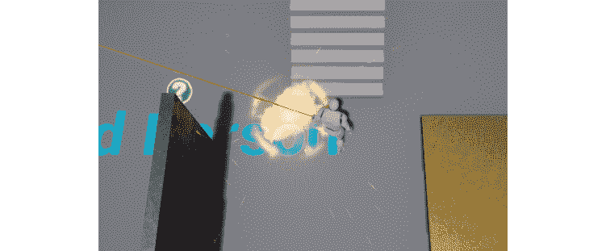

图 9.15:当玩家角色被击中时，应该会发出声音

随着这些步骤的完成，您已经完成了本活动，并巩固了在 UE4 中播放 2D 和 3D 声音的用途。

注意

这个活动的解决方案可以在:[https://packt.live/338jEBx](https://packt.live/338jEBx)找到。

现在，让我们通过学习一点关于层次设计的概念来结束这一章。

# 水平设计

从*第五章*、*线迹*开始，和我们的躲避球游戏有关，我们增加了相当多的游戏机制和玩法机会，以及一些视听元素，这些都在这一章处理。现在我们有了所有这些游戏元素，我们必须把它们集合到一个玩家可以从头玩到尾的水平。为此，让我们了解一下关卡设计和关卡封锁。

关卡设计是一门特殊的游戏设计学科，专注于在游戏中建立关卡。关卡设计者的目标是制作一个有趣的关卡，通过使用为该游戏构建的游戏机制向玩家介绍新的游戏概念，包含良好的节奏(动作密集和放松的游戏序列的良好平衡)等等。

为了测试关卡的结构，关卡设计者将首先构建一个所谓的**关卡封锁**。这是一个非常简单和精简的关卡版本，使用了最终关卡将包含的大部分元素，但是它只使用简单的形状和几何图形。这样做的原因是，如果需要更改级别的某些部分，修改级别会更容易、更省时:


图 9.16:在 UE4 中使用 BSP 笔刷进行关卡封锁的例子

注意

需要注意的是，Level Design 是自己特定的游戏开发技巧，值得自己出书，其中有不少，但潜入这个话题就不在本书范围内了。

在下一个练习中，我们将使用前几章中构建的机制构建一个简单的关卡封锁。

## 练习 9.06:建立关卡封锁

在本练习中，我们将创建一个新的关卡封锁，它将包含一些结构，玩家将从关卡中的某个地方开始，必须通过一系列障碍才能到达关卡的终点。我们将使用我们在最后几章中构建的所有机制和对象来创建一个玩家能够完成的级别。

虽然在本练习中，我们将为您提供一个解决方案，但我们鼓励您释放您的创造力，提出您的解决方案，因为在这种情况下没有正确或错误的答案。

要开始本练习，请执行以下步骤:

1.  打开编辑器。
2.  转到您的`Content Browser`中的`ThirdPersonCPP` - > `Maps`文件夹，复制`ThirdPersonExampleMap`资产，并将其命名为`Level1`。您可以通过选择资产并按下 *Ctrl* + *W* 或右键单击资产并选择`Duplicate`(第三个选项)来完成此操作。
3.  打开新创建的`Level1`地图。
4.  删除地图内具有网格的所有对象，以下对象除外:
    *   玩家角色
    *   敌人角色(注意两个角色看起来是一样的)
    *   地板物体
    *   我们创建的两个墙对象
    *   The Victory Box object

        请记住，与照明和声音相关的资产应保持不变。

5.  按下`Build`按钮，为`Level1`建立照明。该按钮位于编辑器窗口顶部的`Toolbar`中的`Play`按钮左侧。
6.  Once you've followed these steps, you should have an empty floor with just the objects you'll be needing for this level (the ones mentioned in *Step 4*). Here's the `Level1` map before and after you followed *Steps 4 and 5*, respectively:

    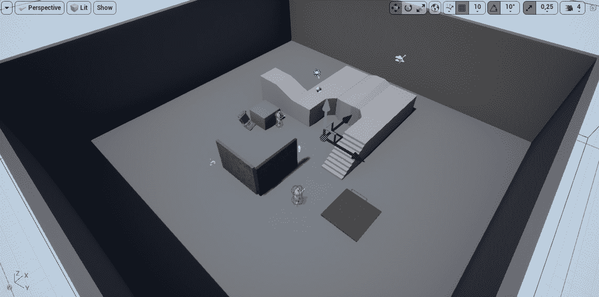

    图 9.17:在删除所需对象之前

    删除对象后，您的楼层应该如下所示:

    

    图 9.18:删除所需对象后

    因为建立一个级别，即使是一个简单的级别，也需要很多步骤和说明，你只会看到几个可能级别的截图，并再次被鼓励提出你自己的。

7.  In this case, we have simply used the existing `EnemyCharacter`, `Wall`, and `GhostWall` objects and duplicated them several times to create a simple layout that the player can traverse from start to finish. We also moved the `VictoryBox` object so that it matches the new level's end location:

    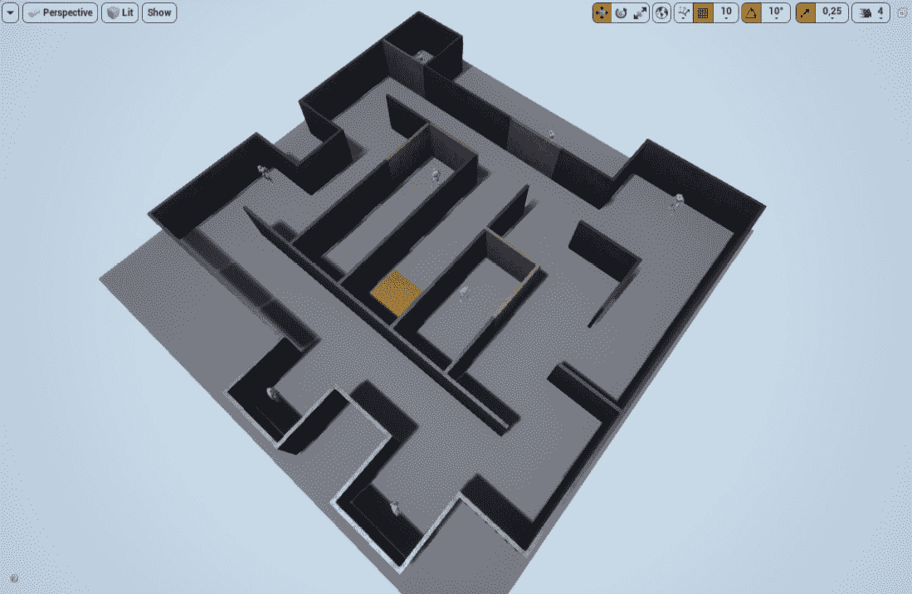

图 9.19:创建的水平等轴测视图

在自顶向下的视图中可以看到该级别，如下所示:

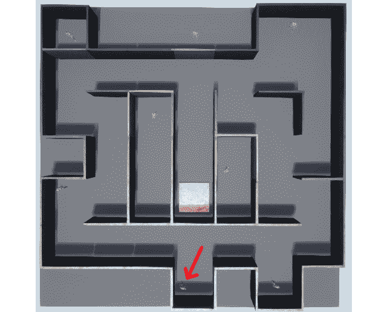

图 9.20:创建的关卡——自上而下的视图，玩家角色用箭头标记

一旦你对结果感到满意，这意味着你已经完成了你的躲避球游戏，现在可以请你的朋友和家人玩它，看看他们怎么想。干得好——你离掌握游戏开发的艺术又近了一步！

# 额外功能

在我们结束本章之前，这里有一些关于你在这个躲避球项目中下一步可以做什么的建议:

*   让我们在前一章创建的普通`Wall`职业不会挡住敌人的视线。这样，敌人总是会向玩家扔躲避球，应该还是会被挡住不能穿过这道墙。
*   增加一个新的功能，可以让玩家想象敌人角色投掷的躲避球将首先冲击哪里，使用扫掠痕迹的概念。
*   增加一种新的墙，可以阻挡玩家角色、敌人角色和躲避球，但也会从躲避球中受到伤害，并在生命值耗尽时被摧毁。

扩大这个项目的范围有很多可能性。我们鼓励您使用所学的技能，并做进一步的研究，以构建新的功能并增加游戏的复杂性。

# 总结

你现在已经完成了躲避球游戏项目。在本章中，您学习了如何通过播放音频和使用粒子系统来为游戏添加润色。你现在知道如何将 2D 和 3D 声音添加到你的游戏中，以及一些你可以使用的工具。现在，您可以尝试在游戏中添加更多的声音效果，例如当敌人角色第一次看到您时的特殊声音效果(例如在“金属齿轮固体”中)、脚步声音效果或胜利声音效果。

您还使用您在最后几章中制作的所有工具构建了一个层次，从而将我们在这个项目中构建的所有逻辑推向了顶峰。

在下一章中，我们将开始一个新项目:`SuperSideScroller`游戏。在那个项目中，你将被介绍到诸如启动、收藏品、敌人**人工智能** ( **人工智能**)、角色动画等主题。你将创建一个侧滚平台游戏，你控制一个必须完成一关的角色，收集宝石，并使用加电来躲避敌人。您将了解的两个最重要的主题是 UE4 的行为树和黑板，它们为人工智能系统提供燃料，以及动画蓝图，它允许您管理角色的动画。