# 10。创建超视频滚动游戏

概观

在本章中，我们将为新的`SuperSideScroller`游戏设置项目。你将被介绍到一个侧滚游戏的不同方面，包括电源，收藏品和敌人的人工智能，所有这些我们将在我们的项目中使用。您还将了解游戏开发中的角色动画管道，并了解如何操纵我们游戏角色的移动。

到本章结束时，您将能够创建一个侧滚项目，操作我们角色的默认人体模型骨架，导入角色和动画，并创建角色和动画蓝图。

# 简介

到目前为止，我们已经学习了很多关于虚幻引擎，C++ 编程，以及一般的游戏开发技术和策略。在前几章中，我们讨论了诸如碰撞、跟踪、如何在虚幻引擎 4 中使用 C++ 以及蓝图可视化脚本系统等主题。除此之外，我们还获得了骨骼、动画和动画蓝图的重要知识，我们将在即将到来的项目中使用这些知识。

对于我们最新的项目`SuperSideScroller`，我们将使用许多与前几章相同的概念和工具来开发我们的游戏功能和系统。碰撞、输入和抬头显示器等概念将是我们项目的重点；然而，我们也将深入到涉及动画的新概念中，以重现流行的侧滚游戏的机制。最后的项目将是我们在本书中所学的一切的高潮。

有无数的侧滚游戏的例子可以作为这个项目的参考。最近，一些流行的侧滚游戏包括了诸如 *Celeste* 、*空心骑士*和*铲骑士*等标题，但侧滚/平台化游戏流派背后也有着深厚而丰富的历史，我们将在本章中讨论。

# 项目分解

让我们考虑一下著名的*超级马里奥兄弟*的例子，它于 1985 年在**任天堂娱乐系统** ( **NES** )控制台上发布。这款游戏由任天堂创造，宫本茂设计。对于不熟悉这个系列的人来说，一般的想法是这样的:玩家控制马里奥，马里奥必须穿越蘑菇王国的许多危险的障碍物和生物，希望从邪恶的布瑟国王库帕手中救出桃子公主。

注意

为了更好地了解游戏的工作原理，欢迎在[https://supermariobros.io/](https://supermariobros.io/)免费在线玩。关于整个*超级马里奥兄弟*系列的更深入的维基可以在这里找到:[https://www.mariowiki.com/Super_Mario_Bros](https://www.mariowiki.com/Super_Mario_Bros)。

以下是这类游戏的核心特征和机制:

1.  **Two-Dimensional Movement**: The player can only move in the *x* and *y* directions, using a 2D coordinate system. Refer to *Figure 10.1* to see a comparison of 2D and 3D coordinate systems if you are unfamiliar with them. Although our `SuperSideScroller` game will be in 3D and not pure 2D, the movement of our Character will work identically to that of Mario, only supporting vertical and horizontal movement:

    

    图 10.1:2D 和三维坐标向量的比较

2.  **跳跃**:跳跃是任何平台游戏最关键的方面之一，我们的`SuperSideScroller`游戏也不会有什么不同。有许多不同的游戏，如*塞莱斯特*、*空心骑士*和*超级肉仔*，如前所述，使用跳跃功能——所有这些都在 2D。
3.  **角色加电**:没有角色加电，很多侧滚游戏就失去了混乱感和可玩性。例如，在游戏 *Ori 和盲林*中，开发者引入了不同的角色能力来改变游戏的玩法。三级跳或空中冲刺等能力为关卡的导航提供了多种可能性，并允许关卡设计者根据玩家的移动能力创建有趣的布局。
4.  **Enemy AI**: Enemies with various abilities and behaviors are introduced to add a layer of challenge for the player, on top of the challenge of navigating the level solely through the use of the available movement mechanics.

    注意

    游戏中 AI 可以通过哪些方式与玩家互动？比如*上古卷轴 V:天缘*中，各个城镇乡村都有 AI 角色可以和玩家对话，曝光历史等造世界元素，向玩家出售物品，甚至给玩家任务。

5.  **收藏品**:很多游戏都支持这种或那种形式的收藏品；*刺猬索尼克*有戒指，*棘轮&叮当*有收集螺栓。我们的`SuperSideScroller`游戏将允许玩家收集硬币。

现在我们已经评估了我们想要支持的游戏机制，我们可以分解每个机制的功能，因为它与我们的`SuperSideScroller`以及我们需要做什么来实现这些功能相关。

# 玩家角色

在虚幻引擎 4 中使用`Side Scroller`游戏项目模板时，几乎所有我们想要的角色功能都是默认给我们的。

注意

在撰写本文时，我们使用的是虚幻引擎 4.24.2 版本；使用另一个版本的引擎可能会导致编辑器、工具以及您的逻辑在以后的工作方式上出现一些差异，所以请记住这一点。

现在，让我们在下面的练习中开始创建我们的项目。

## 练习 10.01:创建侧滚项目并使用角色移动组件

在本练习中，您将使用`Side Scroller`模板设置虚幻引擎 4。这个练习将帮助你开始我们的游戏。

以下步骤将帮助您完成练习:

1.  首先，打开史诗游戏启动器，导航到左侧选项底部的`Unreal Engine`选项卡，选择顶部的`Library`选项。
2.  接下来，您将看到一个窗口，要求您打开现有项目或创建某个类别的新项目。这些选项中有`Games`类别；为我们的项目选择此选项。选择项目类别后，系统会提示您选择项目的模板。
3.  Next, click on the `Side Scroller` option because we want our game to use 3D Skeletal Meshes and animations, and not just 2D textures, flipbooks, and other features of the Paper2D toolset.

    注意

    一定要选择正确的`Side Scroller`选项，因为虚幻引擎 4 有两种侧滚项目:`Side Scroller`和`2D Side Scroller`。

    我们将在本练习后不久讨论这两个项目模板之间的主要差异。

    最后，我们需要设置我们的项目设置。

4.  选择将项目建立在`C++ `而不是`Blueprints`的基础上，纳入`Starter Content`，使用`Desktop/Console`作为我们的平台。剩余的项目设置可以保留为默认值。选择项目的位置和名称`SuperSideScroller`，并将项目保存在您选择的适当目录中。
5.  After these settings are applied, select `Create Project`. When it's done compiling the engine, both the Unreal Editor and Visual Studio will open, and we can get started.

    

    图 10.2:虚幻引擎编辑器现在应该打开了

    接下来，我们继续操作存在于默认`SideScroller`角色内部的角色移动组件，看看这如何影响角色。`Character Movement`组件只能在`Character`类中实现，允许两足化身通过*行走*、*跳跃*、*飞行*和*游泳*的方式移动。该组件还内置了多人游戏所必需的网络复制功能。

6.  In `Content Browser`, navigate to the `/SideScrollerCPP/Blueprints/` directory and find the `SideScrollerCharacter` Blueprint:

    

    图 10.3:在内容浏览器中选择的默认侧边浏览器角色蓝图

7.  Double *left-click* the `Blueprint` asset to open the `Blueprint`. Sometimes, if the `Blueprint` does not have any graph logic, you will see what is shown in *Figure 10.4*. If you see this, just *left-click* on `Open Full Blueprint Editor`:

    

    图 10.4:当蓝图没有图形逻辑时

8.  打开角色`Blueprint`后，我们可以在`Components`选项卡中*左键单击*`CharacterMovement(Inherited)`组件，查看该组件的参数。
9.  现在，在`Details`面板下，我们可以访问几十个影响角色移动的参数。在`Character Movement: Walking`类别中，我们有`Max Walk Speed`参数。将此值从`600.0f`更改为`2000.0f`。
10.  Lastly, compile and save our Character `Blueprint`. Now, if we play in the editor, we can observe how fast our player Character is moving:

    

图 10.5:如果我们在编辑器中玩，我们可以看到我们的角色移动得更快

现在你已经完成了练习，你已经亲身体验了你对玩家角色如何移动的控制！尝试更改`Max Walk Speed`的值，并观察游戏中这些更改如何影响角色。

## 边滚对 2D 边滚

让我们在这里花一点时间了解一下`2D Side Scroller`项目模板和`Side Scroller`模板的主要区别。`2D Side Scroller`模板使用由虚幻引擎 4 构建的 Paper2D 系统，该系统通过纹理、精灵和纸质动画书利用基于纹理的动画。

注意

有关 Paper2D 的更多详细信息，请参考以下文档:[https://docs . unrealengine . com/en-US/Engine/Paper2D/index . html](https://docs.unrealengine.com/en-US/Engine/Paper2D/index.html)。

有足够的关于 Paper2D 的材料来证明它是自己的教科书，所以我们将不再讨论这个话题。`Side Scroller`模板，然而，几乎是相同的 2D 版本，除了我们使用的是三维动画骨架，而不是 2D 动画。

现在，让我们继续，看看执行我们的第一个活动来操纵玩家角色的跳跃动作。

## 活动 10.01:让我们的角色跳得更高

在本练习中，我们将操作默认`Side Scroller`角色蓝图的`CharacterMovement`组件中存在的新参数(`jump`，以观察这些属性如何影响我们的角色移动。

我们将实施从*练习 10.01* 、*中学习到的创建侧滚项目和使用角色移动组件*，并将其应用于如何创建我们的角色启动和角色的一般移动感觉。

以下步骤将帮助您完成活动:

1.  前往`SideScrollerCharacter`蓝图，在`CharacterMovement`组件中找到`Jump Z Velocity`参数。
2.  将该参数从默认的`1000.0` f 值更改为`2000.0` f 值。
3.  编译保存`SideScrollerCharacter`蓝图，在编辑器中播放。使用键盘上的空格键观察我们的角色能跳多高。
4.  在编辑器中停止播放，返回`SideScrollerCharacter`蓝图，将`Jump Z Velocity`从`2000.0` f 值更新为`200.0` f 值
5.  再次编译并保存蓝图，在编辑器中播放，观看角色跳跃。

**预期输出**:

图 10.6:带有跳跃字符的预期输出

注意

这个活动的解决方案可以在:[https://packt.live/338jEBx](https://packt.live/338jEBx)找到。

现在我们已经完成了这个活动，我们对`CharacterMovement`组件参数的一些变化如何影响我们的玩家角色有了更好的理解。当我们需要给角色一些基本的动作行为，比如`Walking Speed`和`Jump Z Velocity`来达到我们想要的角色感觉时，我们可以在后面使用这个。继续之前，请将“跳跃 Z 速度”参数恢复为默认值 1000.0f

我们还将记住这些参数，当我们在我们的项目后期开发我们的玩家角色启动。

# 我们的侧滚游戏的特点

现在让我们花一些时间来展示我们将要设计的游戏的细节。这些特性中的许多将在后面的章节中实现，但是现在是为项目规划远景的好时机。

## 敌方角色

玩`SuperSideScroller`项目的时候应该注意到一点，默认没有敌人 AI 提供给你。所以，让我们讨论一下我们想要支持的敌人的类型，以及他们将如何工作。我们的`SuperSideScroller`项目将支持一种敌人类型。

敌人会有基本的来回移动模式，不会支持任何攻击；只有通过与玩家角色碰撞，他们才能造成任何伤害。然而，我们需要为敌人的人工智能设置两个位置之间的移动，接下来，我们需要决定人工智能是否应该改变位置。他们应该不断地在不同地点之间移动，还是应该在选择新地点之前暂停一下？

最后，我们决定我们的人工智能是否应该时刻知道玩家在哪里。如果玩家来到我们敌人的某个范围内，敌人是否应该知道这一点，并积极地向玩家最后知道的位置移动？

在*第 13 章* *敌方人工智能*中，我们将使用虚幻引擎 4 中可用的工具来开发这个 AI 逻辑。

## 上电

`SuperSideScroller`游戏项目将支持一种加电方式，即玩家可以从环境中获得药剂。这个药剂加电会增加玩家的移动速度和玩家可以跳跃的最大高度。这些效果在移除之前只会持续很短的时间。

记住您在*练习 10.01* 、*创建侧滚项目并使用角色移动组件*和*活动 10.01* 、*使我们的角色跳得更高*中关于`CharacterMovement`组件的实现，您可以开发一个改变重力对角色影响的启动，这将允许有趣的新方法来导航关卡和打击敌人。

## 可收藏

电子游戏中的收藏品有不同的用途。在某些情况下，收藏品被用作购买升级、物品和其他商品的货币形式。在其他情况下，收藏品可以提高你的分数，或者在收集到足够多的收藏品时奖励你。对于`SuperSideScroller`游戏项目来说，硬币的作用只有一个:给玩家一个目标，在不被敌人破坏的情况下，尽可能多的收集硬币。

让我们把收藏品的主要方面分解一下:

*   收藏品需要与我们的玩家互动；这意味着我们需要使用碰撞检测来让玩家收集它，并为我们的 UI 添加信息。
*   收藏品需要一个视觉静态网格表示，这样玩家就可以在关卡中识别它。

我们`SuperSideScroller`项目的最后一个元素是砖块。砖块将用于`SuperSideScroller`游戏的以下目的:

*   砖块被用作关卡设计的一个元素。砖块可以用来进入原本无法到达的区域；敌人可以被放置在不同的砖块上，以提供游戏的变化。
*   砖块可以装可收集的硬币。这给了玩家一个动力去尝试看看哪些积木包含收藏品，哪些不包含。

## 抬头显示器

HUD 用户界面可用于根据游戏类型和您支持的机制向玩家显示重要的相关信息。对于`SuperSideScroller`项目，会有一个 HUD 元素，会向玩家显示自己收集了多少硬币。该 UI 在玩家每次收集硬币时都会更新，玩家毁灭时会重置回`0`。

现在，我们已经列出了一些细节，作为这个项目的一部分，我们将继续进行动画制作。

# 动画中的步骤

明确一点，这本书不打算涵盖动画。我们不会讨论和学习如何使用 3D 软件工具制作动画，如 3D 工作室 Max、Maya 或 Blender。但是，我们将学习如何将这些资产导入虚幻引擎，如何在引擎中使用动画资产，以及如何使用可用的动画工具集来使我们的角色栩栩如生。

# 角色动画管道

出于本书的目的，我们将只关注 3D 动画以及动画如何在虚幻引擎 4 中工作；然而，简要讨论许多行业中用于创建角色及其动画的管道是很重要的。

## 概念阶段

第一个阶段是开发我们想要创建的角色的概念，并在以后制作动画。在 2D，这几乎都是通过手工或使用电脑程序(如 Photoshop)来完成的。在开始建模过程之前，3D 建模者可以更容易地参考角色的外观和相对大小。下面，我们看到一个不同姿势的简笔画角色的基本例子。请注意角色是如何以不同方式设定的:

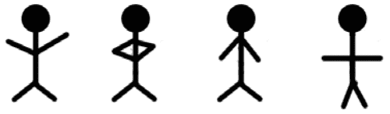

图 10.7:2D 角色概念的一个非常简单的例子

## 三维建模阶段

一旦角色概念完成，管道就可以进入下一个阶段:制作角色的三维模型。模型通常是在 3D Studio Max 或 Maya 等程序中制作的，但这款软件相对昂贵，除非你有学生证，而且更常用于专业环境。

在不深入讨论 3D 建模复杂性的重要细节的情况下，我们需要知道的是，3D 艺术家使用计算机软件来操纵 3D 空间中称为顶点的点来创建对象。这些物体然后被雕刻成我们的角色或环境的形状。

## 索具阶段

一旦最终的角色模型完成，就可以开始装配过程了。用来模拟角色的软件通常是用来装备角色的。装配意味着构建一系列骨骼，形成角色骨骼的框架。

就人形角色而言，我们通常会看到头部的骨骼，沿着脊柱、臀部、腿部等等；但是骨架可以根据你制作的角色类型而变化。大象的骨骼结构将与人类完全不同。同样的装备也可以应用于不同的角色。

## 动画

一旦我们有了我们的角色和骨骼的层次结构，是时候让动画师把这个网格和动画结合起来了。

3D 动画最基本的形式是随着时间的推移对骨骼的操纵。记录骨骼位置、旋转和比例随时间变化的过程就是动画的结果。动画完成后，我们可以从 3D 软件中导出资产，并将其导入引擎。

## 资产进出口

当我们有了我们的 3D 角色网格，它的骨骼装备，和它的动画，是时候从 3D 软件中导出这些资产，并将它们导入虚幻引擎 4 中了。重要的是要注意，在角色、装备和动画上工作的艺术家将不断地将进行中的资产导出到引擎中，以更好地了解游戏中看到的最终结果。我们将在本章稍后的*活动 10.03* 、*导入更多自定义动画来预览角色运行*及其附带练习中实现这一点。

## 练习 10.02:探索角色编辑器并操纵默认人体模型骨架权重

现在我们对动画管道有了更好的理解，让我们继续深入了解`Side Scroller`模板项目中给我们的默认人体模型骨骼网格。

我们在这里的目标是了解更多关于默认骨骼网格和在角色编辑器中给我们的工具，以便我们更好地理解骨骼、骨骼权重和骨骼在虚幻引擎 4 中的工作方式。

以下步骤将帮助您完成练习:

1.  打开虚幻引擎编辑器，导航至`Content Browser`。
2.  Navigate to the `/Mannequin/Character/Mesh/` folder and open the `UE4_Mannequin_Skeleton` asset:

    

    图 10.8:UE4 _ 人体模型 _ 骨骼资产在此突出显示并可见

    打开骨架资产后，我们会看到`Persona Editor`:

    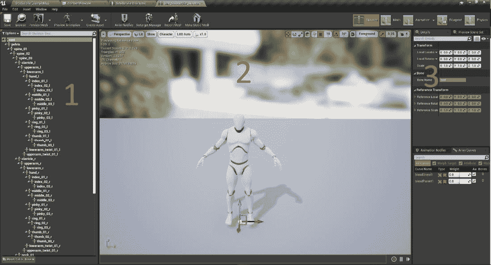

    图 10.9:角色编辑器

    让我们简单地分解一下人物角色的框架编辑器:

    *   在左侧(*标有 1* ，我们可以看到骨骼中存在的骨骼层次。这是在这个角色的装配过程中制作的骨架。`root`骨，顾名思义，是骨骼层次的根。这意味着对这块骨头的变革将影响到层级结构中的所有骨头。从这里，我们可以选择一个骨骼或一部分骨骼，并查看它们在角色网格上的位置。
    *   接下来，我们看到骨骼网格预览窗口(*标有 2* )。它向我们展示了我们的角色网格，还有几个额外的选项，我们可以打开它们来预览我们的骨骼和重量绘画。
    *   在右侧(*用 3* 标记)，我们有基本的变换选项，可以修改单个骨骼或骨骼组。在下一个练习中，我们还将利用其他可用的设置。现在我们对它和我们正在看的东西有了更多的了解，让我们看看我们人体模型上的真实骨骼是什么样子的。
3.  Navigate to `Character`, as shown in *Figure 10.10*:

    

    图 10.10:角色选项菜单使您能够在网格本身上显示人体模型的骨架

4.  From the drop-down menu, select the `Bones` option. Then, make sure the option for `All Hierarchy` is selected. With this option selected, you will see the outlining Skeleton rendering above the mannequin mesh:

    

    图 10.11:覆盖在人体模型骨骼网格顶部的骨骼

5.  现在，隐藏网格并简单预览骨架层次，我们可以禁用`Mesh`属性:
    *   导航至`Character`，从下拉菜单中选择`Mesh`选项。
    *   Deselect the option for `Mesh` and the result should be what we see below:

        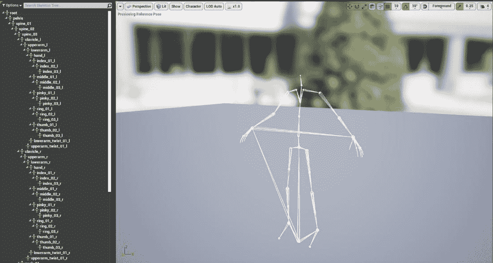

图 10.12:默认角色的骨架层次结构

出于本练习的目的，让我们重新打开`Mesh`可见性，以便同时看到网格和骨架层次。

最后，一起看看我们默认角色的权重缩放。

1.  To preview this, navigate to `Character` and, from the drop-down menu, select the `Mesh` option. Then, select the option for `Selected Bone Weight` toward the bottom in the section labeled `Mesh Overlay Drawing`:

    

    图 10.13:显示人体模型选定骨骼重量的下拉选项

2.  Now, if we select a bone or a group of bones from our hierarchy, we can see how each bone affects a certain area of our mesh:

    

    图 10.14:这是脊椎 _03 骨骼的重量比例

    您会注意到，当我们预览特定骨骼的权重缩放时，骨骼网格的不同部分会有一系列颜色。这是直观显示的重量比例，而不是数字。像`red`、`orange`和`yellow`这样的颜色表示骨骼的权重较大，这意味着这些颜色中网格的高亮区域将受到更大的影响。在`blue`、`green`和`cyan`地区，它们仍然会受到影响，但不会那么严重。最后，没有叠加高光的区域将完全不受选定骨骼操作的影响。请记住骨骼的层次结构，因为即使左臂没有覆盖颜色，当您旋转、缩放和移动`spine_03`骨骼时，它仍然会受到影响，因为手臂是`spine_03`骨骼的子骨骼。请参考下图，了解手臂与脊柱的连接方式:

    

    图 10.15:锁骨 _l 和锁骨 _r 骨是脊柱 _03 骨的孩子

    让我们继续操作人体模型骨骼网格上的一个骨骼，看看这些变化如何影响它的动画。

3.  In the Persona Editor, *left-click* the `thigh_l` bone in the skeletal hierarchy:

    

    图 10.16:这里选择了大腿骨

    选择`thigh_l`骨骼后，我们可以清楚地看到权重缩放将如何影响网格的其他部分。此外，由于骨骼的结构，对该骨骼的任何修改都不会影响网格的上半身:

    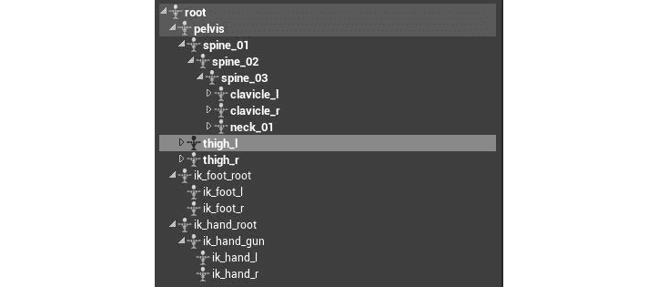

    图 10.17:你可以看到在骨骼层次上，大腿骨是骨盆骨的子骨

4.  Using the knowledge from earlier chapters, change the Local Location, Local Rotation, and Scale values to offset the transform of the `thigh_l` bone. The image below shows an example of values to use.

    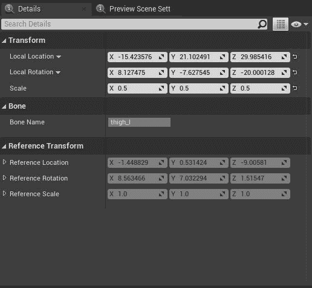

    图 10.18:更新了 thigh_l 值

    对骨骼变换进行更改后，您会看到人体模型的左腿完全改变，看起来很可笑:

    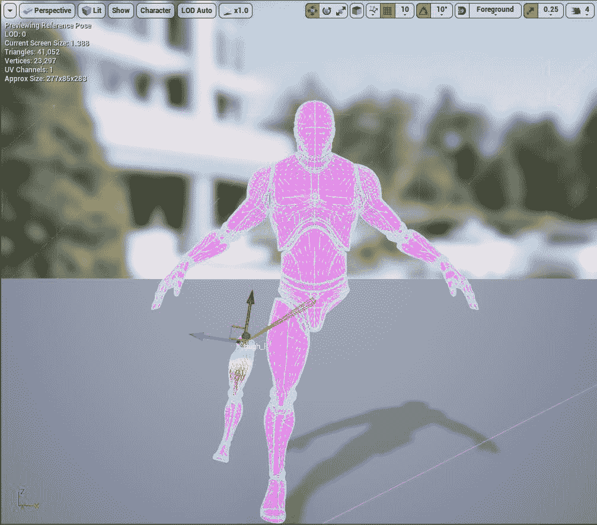

    图 10.19:人体模型角色的左腿完全改变

5.  接下来，在`Details`面板中，前往标签为`Preview Scene Settings`的标签。*左键点击*这个标签，你会看到新的选项，显示一些默认参数和一个`Animation`部分。
6.  使用`Animation`部分预览动画，以及动画如何受到骨骼更改的影响。对于`Preview Controller`参数，将其更改为`Use Specific Animation`选项。通过这样做，将出现一个标记为`Animation`的新选项。`Animation`参数允许我们选择与角色骨骼关联的动画进行预览。
7.  接下来，在下拉菜单中左键单击，选择`ThirdPersonWalk`动画。
8.  Finally, now you can see the mannequin Character playing the walking animation, but their left leg is completely misplaced and mis-scaled:

    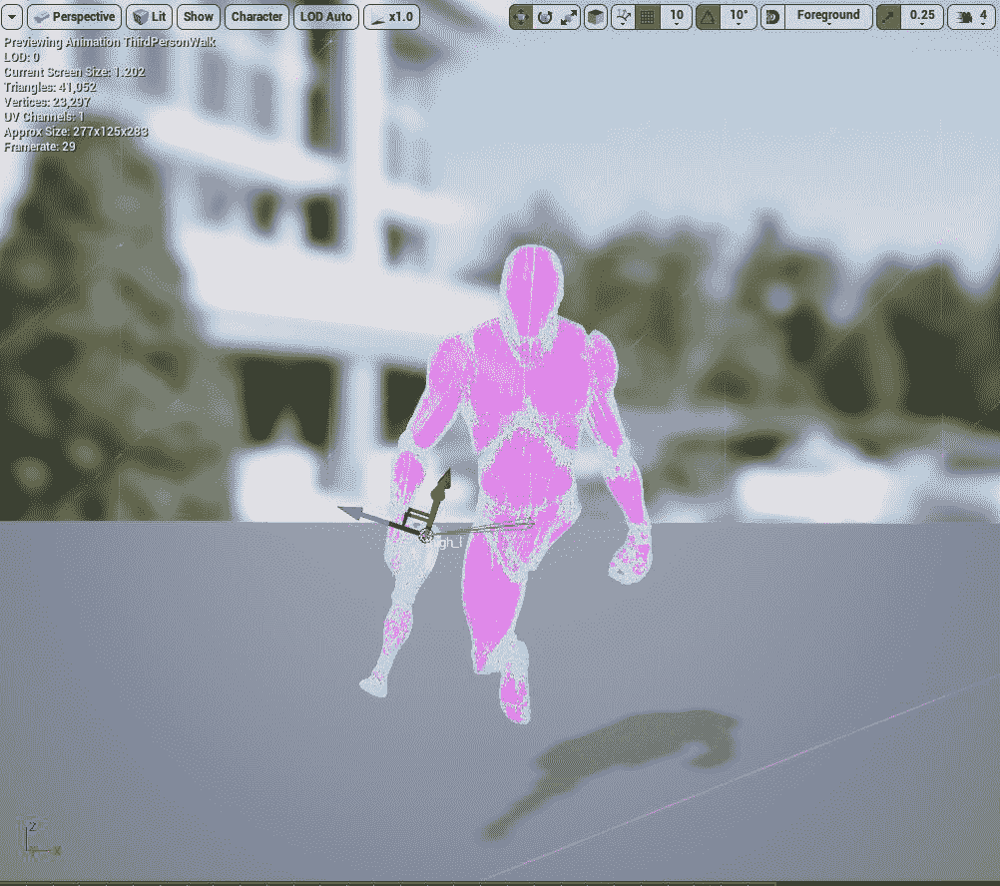

图 10.20:人体模型角色更新动画的预览

在继续之前，确保将`thigh_l`骨骼恢复到其原始的局部位置、局部旋转和缩放；否则，向前移动的动画看起来不正确。

现在，您已经完成了我们第二个练习的最后一部分，您已经亲身体验了骨骼如何影响角色和动画。

现在，让我们继续执行第二个活动，在人体模型角色上操纵不同的骨骼，并观察应用不同动画的结果。

## 活动 10.02:骨骼操纵和动画

在本活动中，我们将实践我们所获得的关于在默认人体模型上操纵骨骼的知识，以影响动画在骨骼上的播放方式。

以下步骤将帮助您完成本活动:

1.  选择将影响整个骨骼的骨骼。
2.  更改此骨骼的比例，使角色为其原始大小的一半。使用这些值将`Scale`更改为(`X=0.500000, Y=0.500000, Z=0.500000`)。
3.  Apply the running animation to this Skeletal Mesh from the `Preview Scene Settings` tab and observe the animation for the half-size Character:

    以下是预期输出:

    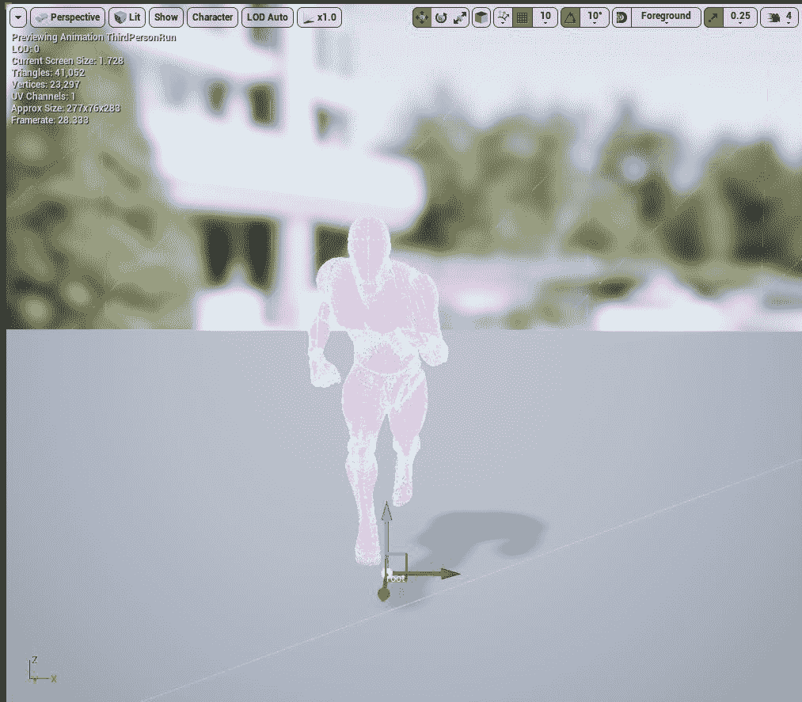

图 10.21:执行运行动画的减半的角色

注意

这个活动的解决方案可以在:[https://packt.live/338jEBx](https://packt.live/338jEBx)找到。

完成本练习后，您现在已经掌握了骨骼和骨骼网格的骨骼操作如何影响动画应用的实用知识。您还看到了骨骼重量缩放的第一手效果。

# 虚幻引擎 4 中的动画

让我们分解动画的主要方面，因为它们在虚幻引擎中发挥作用。关于本节主题的更多深入信息，可以在可直接从 Epic Games 获得的文档中找到:[https://docs.unrealengine.com/en-US/Engine/Animation](https://docs.unrealengine.com/en-US/Engine/Animation)。

## 骨骼

骨架是虚幻引擎在外部 3D 软件中制作的角色装备的表示；我们在*活动 10.02* 、*骨骼骨骼操纵和动画*中看到了这一点。关于骨骼，我们已经讨论过的不多了，但主要的收获是，一旦骨骼在引擎中，我们就可以查看骨骼层次结构，操纵每个单独的骨骼，并添加称为套接字的对象。套接字允许我们做的是将对象附着到角色的骨骼上，我们可以使用这些套接字来附着网格等对象，并在不破坏骨骼变换的情况下操纵套接字的变换。在第一人称射击游戏中，通常会制作一个武器插座，并将其连接到适当的手上。

## 骨骼网格

骨骼网格是一种特定的网格，它结合了三维角色模型和组成骨骼的骨骼层次结构。静态网格和骨架网格的主要区别在于，骨架网格是使用动画的对象所必需的，而静态网格由于缺少骨架而不能使用动画。我们将在下一章中更多地研究我们的主要角色骨骼网格，但是我们将在本章稍后的*活动 10.03* 、*中导入我们的主要角色骨骼网格来预览角色运行*。

## 动画序列

最后，动画序列是可以在特定骨骼网格上播放的单个动画；它所应用的网格由将动画导入引擎时选择的骨架决定。我们将在*活动 10.03* 、*中一起查看导入我们自己的角色骨骼网格和单个动画资产，以导入更多自定义动画来预览角色运行*。

我们的动画序列中包括一个时间轴，它允许我们逐帧预览动画，并带有暂停、循环、倒带等附加控制:

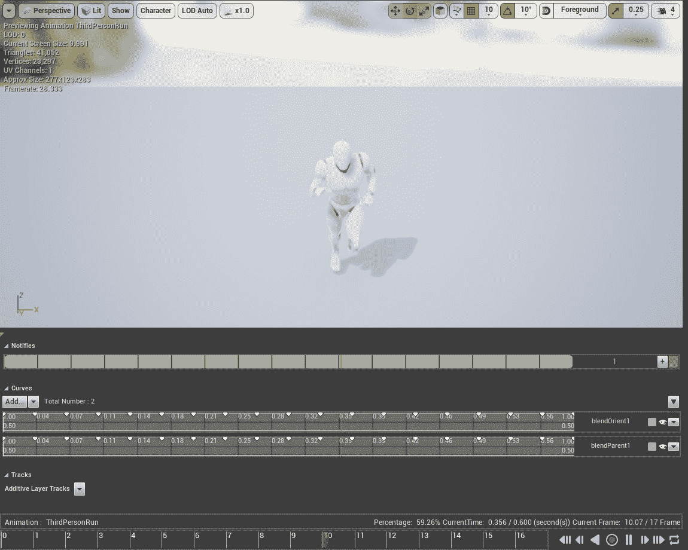

图 10.22:动画序列时间线和预览窗口

在下面的练习中，您将导入自定义角色和动画。自定义角色将包括骨骼网格和骨骼，动画将作为动画序列导入。

## 练习 10.03:导入和设置角色和动画

在我们最后的练习中，我们将导入我们的自定义角色和一个单一的动画，我们将用于`SuperSideScroller`游戏的主要角色，以及创建必要的角色蓝图和动画蓝图。

注意

这一章包括了一组文件在一个名为`Assets`的文件夹中，我们将把这些文件导入引擎。这些资产来自米夏莫:[https://www.mixamo.com/](https://www.mixamo.com/)；请随意创建一个帐户，并查看那里提供的免费 3D 角色和动画内容。

`Assets`内容可在我们的 GitHub 上获得:[https://packt.live/2IcXIOo](https://packt.live/2IcXIOo)。

以下步骤将帮助您完成练习:

1.  前往虚幻编辑器。
2.  In `Content Browser`, create a new folder named `MainCharacter`. Within this folder, create two new folders called `Animation` and `Mesh`. Our `Content Browser` tab should now look like the image below:

    

    图 10.23:在内容浏览器的主字符目录中添加的文件夹

3.  接下来，导入我们的角色网格。在我们创建的`Mesh`文件夹中，*右键单击*并选择`Import`选项，将打开文件浏览器菜单。导航到本章附带的保存`Assets`文件夹的目录，在`Character Mesh`文件夹中找到`MainCharacter.fbx`资源，例如`\Assets\Character Mesh\MainCharacter.fbx`，然后打开该文件。
4.  选择该资产时，将出现“FBX 导入选项”窗口。确保在各自的复选框中将`Skeletal Mesh`和`Import Mesh`的选项设置为`check`，并将其他选项设置为默认设置。
5.  Lastly, we can select the `Import` option so that our FBX asset will be imported into the engine. This will include the necessary materials created within the FBX; a Physics Asset, which will automatically be created for us and assigned to the `Skeletal Mesh`; and the `Skeleton Asset`.

    注意

    忽略导入`FBX`文件时可能出现的任何警告；它们不重要，不会影响我们的项目向前发展。

    现在我们有了角色，让我们导入一个动画。

6.  在`MainCharacter`文件夹目录的`Animation`文件夹中，再次*右键单击*，选择`Import`选项。
7.  Navigate to the directory where you saved the `Assets` folder that accompanies this chapter and locate the `Idle.fbx` asset inside the `Animations/Idle` folder – for example, `\Assets\Animations\Idle\Idle.fbx` – and open that file.

    选择此资产时，将出现一个与我们导入角色骨骼网格时几乎相同的窗口。因为这个资源只是一个动画，而不是骨骼网格/骨骼，我们没有像以前一样的选项，但是有一个关键参数我们需要正确设置:`Skeleton`。

    我们的`FBX`导入选项的`Mesh`类别下的`Skeleton`参数告诉动画应用于哪个骨骼。没有这个参数设置，我们就不能导入我们的动画，将动画应用到错误的骨骼可能会产生灾难性的结果，或者导致动画无法完全导入。幸运的是，我们的项目很简单，我们已经导入了我们的角色骨骼网格和骨骼。

8.  Select `MainCharacter_Skeleton` and choose the option at the bottom, `Import`; leave all other parameters set to their defaults.

    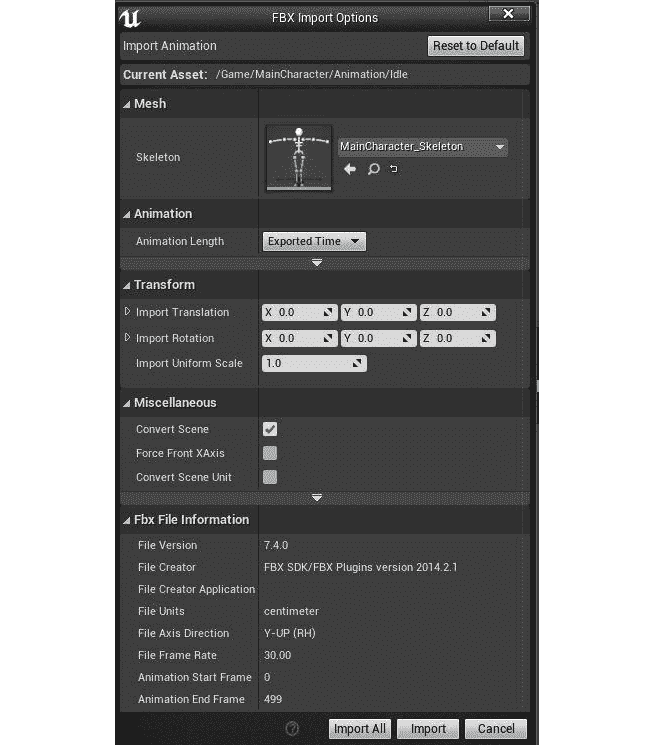

    图 10.24:导入空闲动画时的设置

    现在我们知道导入自定义角色网格和动画。理解这两种资产的导入过程至关重要，在下一个活动中，您将面临导入剩余动画的挑战。让我们继续这个练习，为`SuperSideScroller`游戏的主要角色创建角色蓝图和动画蓝图。

    现在，尽管 Side Scroller 模板项目确实包含了我们角色的蓝图和其他资产，如动画蓝图，但为了组织和作为游戏开发人员的良好实践，我们将希望创建这些资产的自己的版本。

9.  Create a new folder under our `MainCharacter` directory in `Content Browser` and name this folder `Blueprints`. In this directory, create a new Blueprint based on the `SideScrollerCharacter` class under `All Classes`. Name this new Blueprint `BP_SuperSideScroller_MainCharacter`:

    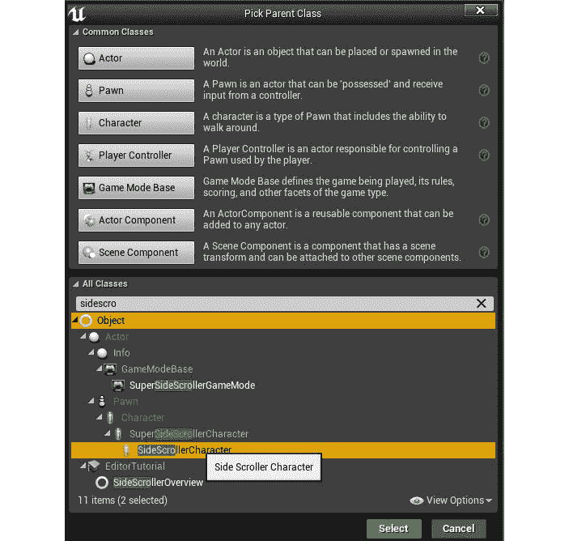

    图 10.25:将用作我们的角色蓝图的父类的侧边角色类

10.  In our `Blueprints` directory, *right-click* in an empty area of `Content Browser`, hover over the `Animation` option, and select `Animation Blueprint`:

    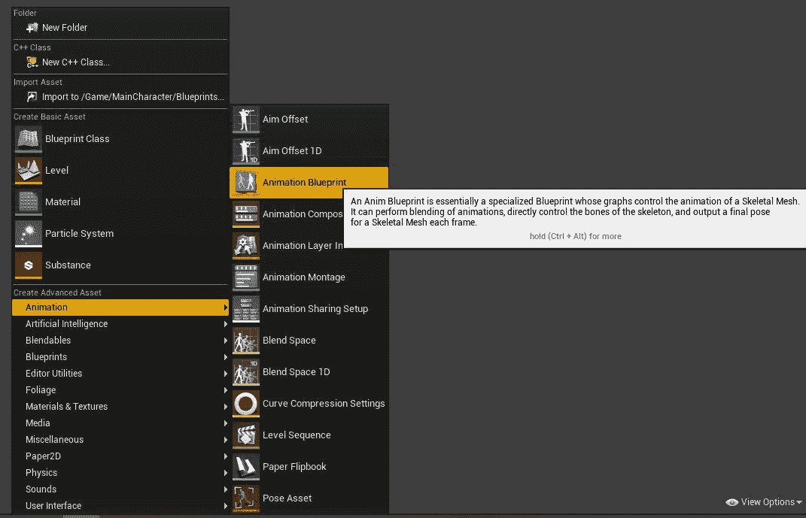

    图 10.26:动画类别下的动画蓝图选项

11.  After we select this option, a new window will appear. This new window requires us to apply a parent class and a Skeleton to our Animation Blueprint. In our case, use `MainCharacter_Skeleton`, select OK and name the Animation Blueprint asset `AnimBP_SuperSideScroller_MainCharacter`:

    

    图 10.27:创建动画蓝图时我们需要的设置

12.  When we open our Character Blueprint, `BP_SuperSideScroller_MainCharacter`, and select the `Mesh` component, we will find a handful of parameters that we can change:

    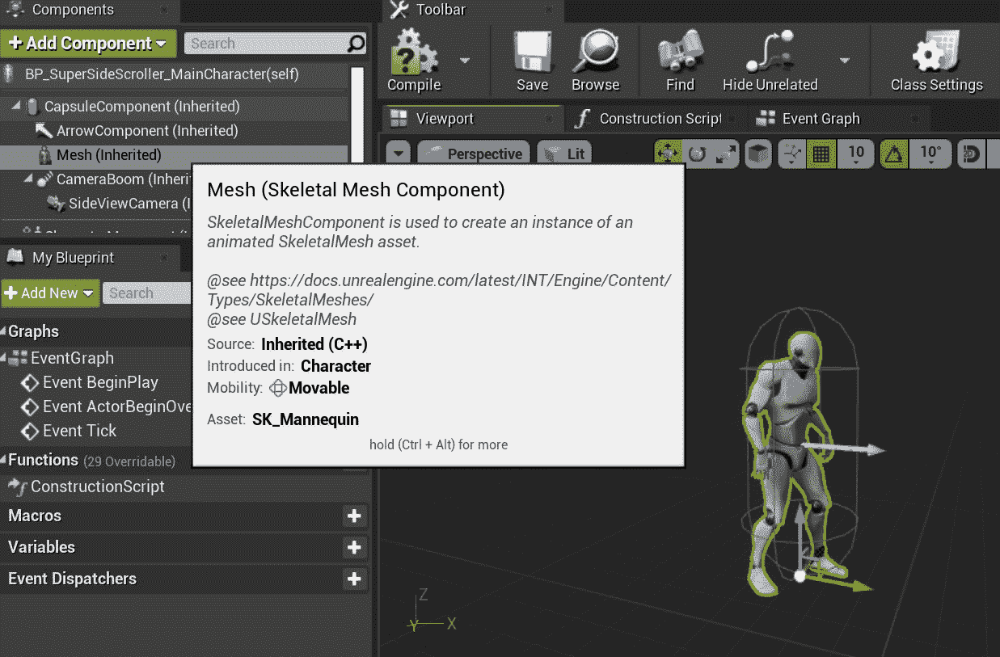

    图 10.28:使用人体模型骨骼网格的超视频角色蓝图

13.  Under the `Mesh` category, we have the option to update the `Skeletal Mesh` used. Find our `MainCharacter` Skeletal Mesh and assign it to this parameter:

    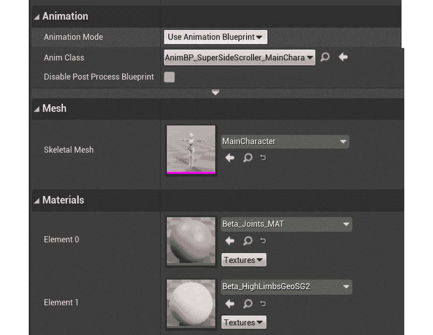

    图 10.29:我们的网格组件正确使用我们新的骨骼网格和动画蓝图所需的设置

    当仍然在我们的角色蓝图中并且选择了`Mesh`组件时，我们可以在`Mesh`类别的正上方找到`Animation`类别。幸运的是，默认情况下`Animation Mode`参数已经设置为`Use Animation Blueprint`，这是我们需要的设置。

14.  现在将`Anim`类参数分配给我们新的动画蓝图`AnimBP_SuperSideScroller_MainCharacter`。最后，回到我们默认的`SideScrollerExampleMap`等级，用我们新的角色蓝图替换默认角色。
15.  Next, make sure that we have `BP_SuperSideScroller_MainCharacter` selected in our `Content Browser` and then *right-click* on the default Character in our map and choose to replace it with our new Character:

    

    图 10.30:在内容浏览器中选择角色蓝图后，我们可以简单地右键单击该级别中的默认角色，并用我们的新角色替换它

16.  With our new Character in the level, we can now play in the editor and move around the level. The result should look something like the image below; our Character in the default T-pose is moving around the level environment:

    

图 10.31:你现在有了自定义角色在关卡中运行

随着我们最后一个练习的完成，您现在已经完全理解了如何导入自定义骨骼网格和动画。此外，您还学习了如何从头开始创建角色蓝图和动画蓝图，以及如何使用这些资源创建`SuperSideScroller`角色的基础。

让我们进入本章的最后一项活动，您将被要求导入角色的剩余动画，并在角色编辑器中预览正在运行的动画。

## 活动 10.03:导入更多自定义动画以预览角色运行

本活动旨在导入剩余的动画，例如为玩家角色运行，并在角色骨架上预览运行的动画，以确保其看起来正确。

活动结束时，所有玩家角色动画都将导入到项目中，您将准备好使用这些动画在下一章中让玩家角色栩栩如生。

以下步骤将帮助您完成活动:

1.  提醒一下，我们需要导入的所有动画资产都存在于`\Assets\Animations`目录中，无论您在哪里保存了原始的`zip`文件夹。导入`MainCharacter/Animation`文件夹中的所有剩余动画。导入剩余的动画资产的工作方式与在*练习 10.03* 、*导入和设置角色和动画*中导入`Idle`动画的方式相同。
2.  导航到`MainCharacter`骨架，应用上一步导入的`Running`动画。
3.  Finally, with the `Running` animation applied, preview the Character animation in the Persona Editor.

    以下是预期输出:

    

图 10.32:带有额外定制导入资产的角色的预期输出

注意

这个活动的解决方案可以在:[https://packt.live/338jEBx](https://packt.live/338jEBx)找到。

随着这个最终活动的完成，您现在已经亲身体验了将自定义骨骼和动画资产导入虚幻引擎 4 的过程。导入过程，无论您要导入的资产类型是什么，在游戏行业都很常见，让您适应它至关重要。

# 总结

随着玩家角色骨骼、骨骼网格和动画导入到引擎中，我们可以进入下一章，您将准备角色移动并更新动画蓝图，以便角色可以在关卡中移动时制作动画。

从本章的练习和活动中，您学习了如何使用骨骼和骨骼来制作角色的动画和操纵角色。有了将动画导入和应用到虚幻引擎 4 的第一手经验，您现在对动画管道有了很好的理解，从角色概念到为项目导入的最终资产。

此外，您已经了解了我们将在下一章中使用的主题，例如角色运动动画混合的混合空间。随着`SuperSideScroller`项目模板的创建和玩家角色的准备，在下一章中，让我们继续使用动画蓝图制作角色的动画。