# 11 时。混合空间 1D、键绑定和状态机

概观

本章首先创建混合空间资产，根据玩家角色的速度，允许从空闲到行走，最后到跑步的运动动画混合。然后，我们将实现新的键映射，并在 C++中使用这些映射来为玩家角色编写游戏功能，比如冲刺。最后，我们将在我们的角色动画蓝图中创建一个新的动画状态机，以便玩家动画可以在移动和跳跃之间平滑过渡。

在这一章的最后，你将让`SuperSideScroller`玩家角色在环境中移动时正确地制作动画，并以游戏感觉最好的方式移动。这意味着玩家将支持一个空闲、行走和冲刺动画，同时也支持跳跃所需的动画。

# 简介

在前一章中，我们对动画和您的`SuperSideScroller`项目的游戏设计开发进行了高层次的了解。您只获得了项目本身开发的开始步骤。您还准备了玩家“角色”的动画蓝图、角色蓝图，并导入了所有必需的骨骼和动画资产。

此时，角色可以在关卡周围移动，但停留在 T-Pose 中，完全没有动画效果。这可以通过为玩家角色创建一个新的混合空间来解决，这将在本章的第一个练习中完成。一旦混合空间完成，您将在角色动画蓝图中实现这一点，以便角色在移动时制作动画。

在本章中，您将使用许多新的功能、资产类型和变量来实现玩家角色的期望移动。其中包括`Animation Blueprint`中的`Try Get Pawn Owner`功能、`1D Blend space asset`类型和项目配置文件中的`Input Bindings`。

让我们开始这一章，首先学习混合空间，然后创建你的混合空间资产，你将需要，以便让玩家角色动画移动。

# 混合空间

混合空间，顾名思义，允许您基于一个或多个条件在多个动画之间混合。混合空间用于不同类型的电子游戏，但是，更多的时候，在游戏中，玩家可以看到整个角色。当玩家只能看到角色手臂时，通常不会使用混合空间，例如在虚幻引擎 4 中提供的第一人称模板项目中，如下所示:


图 11.1:虚幻引擎 4 中第一人称项目模板中默认角色的第一人称视角。

这在第三人称游戏中更常见，在第三人称游戏中，需要使用混合空间来平滑混合角色的基于运动的动画。虚幻引擎 4 中提供的第三人称模板项目就是一个很好的例子，如下所示:

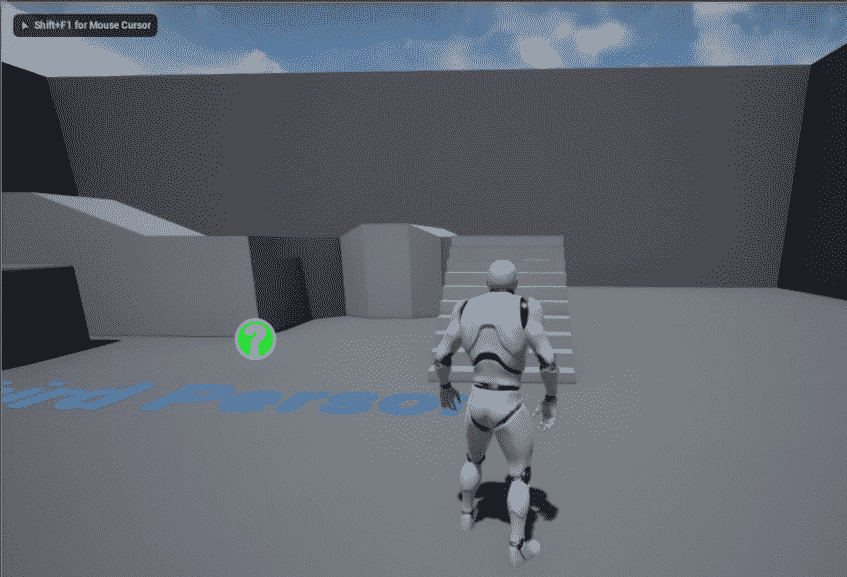

图 11.2:默认角色的第三人称视角，在虚幻引擎 4 的第一人称项目模板中

混合空间允许玩家角色基于一个变量或一组变量在动画之间混合。例如*《最后的我们》*中的*乔尔*的情况，他的移动动画是基于他移动的速度，这个速度是由玩家通过控制器棒(或操纵杆)提供的。随着速度的提高，他的动画从行走更新为跑步，然后是冲刺。这就是我们在这一章中试图用我们的性格达到的目的。

打开`/Mannequin/Animations/ThirdPerson_IdleRun_2D`创建`Side Scroller`项目模板时，我们来看看虚幻引擎提供的混合空间资产。这是为`Side Scroller`人体模型骨骼网格创建的 1D 混合空间资产，因此玩家角色可以根据角色的速度在空闲、行走和跑步动画之间平滑混合。

如果您勾选`Persona`，在左侧的`Asset Details`面板中，您将看到带有`Horizontal Axis`参数的`Axis Settings`类别，其中我们有这个轴的设置，它本质上是一个变量，我们可以在我们的动画蓝图中引用。请参考下图查看`Persona`内的`Axis Settings`。


图 11.3:这里显示的是 1D 混合空间的轴设置

在预览窗口的下方，我们还会看到一个小图，点沿着直线从左到右排列；其中一个点将被突出显示`green`，而其他点为`white`。我们可以*左键单击*并沿着水平轴拖动这个`green`点，根据其值预览混合动画。在速度`0`下，我们的角色在`Idle`中，当我们沿着轴移动预览时，动画将开始混合行走，然后是`Running`。请参考下图查看单轴图。

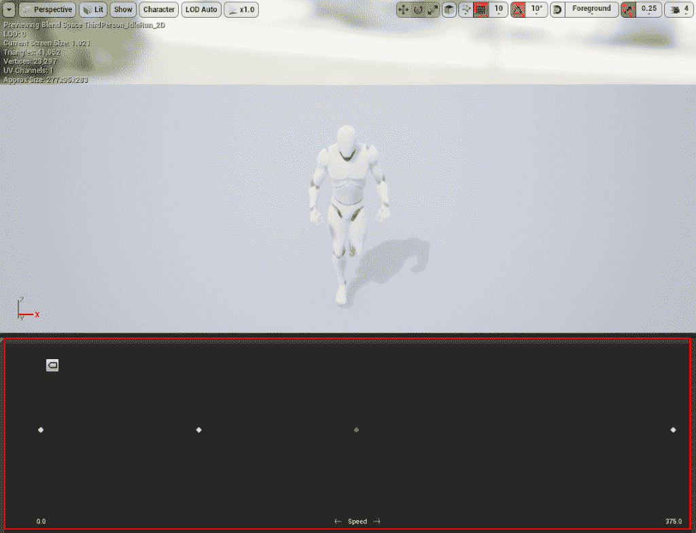

图 11.4:这里突出显示的是 1D 混合空间的关键帧时间线

在下一节中，我们将看到 1D 混合空间与普通混合空间的对比。

## 1D 混合空间与普通混合空间

在继续讨论 1D 混合空间之前，让我们花点时间来区分一下虚幻引擎 4 中混合空间和 1D 混合空间的主要区别。

*   虚幻中的混合空间资产由两个变量控制，由混合空间图形的 *X* 和 *Y* 轴表示。
*   另一方面，1D 混合空间仅支持一个轴。

试着把它想象成一个 2D 图。正如您所知，每个轴都有自己的方向，您可以更好地想象为什么以及何时需要使用此混合空间，而不是仅支持单个轴的 1D 混合空间。

比方说，你想让玩家角色左右扫射，同时也支持前后移动。如果您将此运动绘制在一个图表上，它将如下图所示:

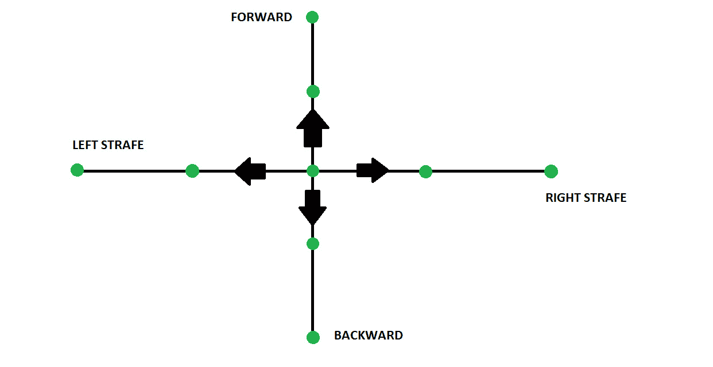

图 11.5:这是混合空间运动在简单图表上的样子

现在，想象玩家角色的移动，记住游戏是一个`Side Scroller`的事实。角色不会支持左右扫射或前后移动。玩家角色将只需要在一个方向上制作动画，因为默认情况下`Side Scroller`角色向移动方向旋转。必须只支持一个方向，这就是为什么你使用 1D 混合空间，而不是普通的混合空间。

我们需要为我们的主要角色设置这种类型的混合空间资产，并将混合空间用于相同的目的，用于基于运动的动画混合。在下一个练习中，让我们从使用自定义动画资产一起创建混合空间资产开始。

## 练习 11.01:创建角色运动 1D 混合空间

为了让玩家角色在移动时有动画效果，您需要首先创建一个混合空间，如前所述。

在本练习中，您将创建混合空间资产，添加空闲动画，并更新`CharacterMovement`组件，以便指定与混合空间相对应的适当行走速度值。

以下步骤将帮助您完成练习:

1.  导航到`Content Browser`中的`/MainCharacter/Animation`文件夹，您在上一章中导入的所有新动画都位于该文件夹中。
2.  现在，*右键单击`Content Browser`主区域的*，从下拉菜单中，将鼠标悬停在`Animation`选项上，并从其附加下拉菜单中，通过左键单击*选择`Blend Space 1D`。*
**   Make sure to select `MainCharacter_Skeleton`, and not `UE4_Mannequin_Skeleton`, as the skeleton for the Blend Space.

    注意

    如果应用了不正确的骨架，当为需要骨架的资源(如混合空间或动画蓝图)选择骨架时，混合空间对于玩家角色及其自定义骨架网格将不起作用。在这里，您要告诉这个资产它与哪个骨架兼容。通过这样做，在混合空间的情况下，您可以使用为此骨架制作的动画，从而确保一切都与其他一切兼容。

    *   命名这个混合空间资产`SideScroller_IdleRun_1D`。*   Next, open the `SideScroller_IdleRun_1D` Blend Space asset. You can see the single-axis graph below the preview window:

    

    图 11.6:用于在虚幻引擎 4 中创建混合空间的编辑工具

    在编辑器的左侧，您有包含`Axis Settings`类别的`Asset Details`面板。在这里，您将标记轴，并提供一个最小和最大浮动值，该值稍后将在`Animation Blueprint`中对玩家角色有用。请参考下图查看`Horizontal Axis`的默认值设置。

    

    图 11.7:影响混合空间轴的轴设置

    *   Now, rename the `Horizontal Axis` as `Speed`:

    

    图 11.8:横轴现在被命名为速度

    *   The next step is to establish `Minimum Axis Value` and `Maximum Axis Value`. You will want the minimum value to be `0.0f`, which is set by default, because the player character will be in `Idle` when he is not moving at all.

    但是`Maximum Axis Value`呢？这个有点棘手，因为你需要记住以下几点:

    *   您将支持角色的冲刺行为，该行为允许玩家在按住*左移位*键盘按钮时移动得更快。释放后，玩家将恢复默认行走速度。
    *   The walking speed to match the characters' `Max Walk Speed` parameter of the `CharacterMovementComponent`.

        在设置`Maximum Axis Value`之前，需要将角色的`Max Walk Speed`设置为适合`SuperSideScroller`游戏的值。

        *   For this, navigate to `/Game/MainCharacter/Blueprints/` and open the `BP_SuperSideScroller_MainCharacter` blueprint:

    

    图 11.9:SuperSideScroller 主要角色蓝图的目录

    *   Select the `Character Movement` component and, in the `Details` panel, under the `Character Movement: Walking` category, find the `Max Walk Speed` parameter and set this value to `300.0f`.

    设置`Max Walk Speed`参数后，返回`SideScroller_IdleRun_1D`混合空间并设置`Maximum Axis Value`参数。如果行走速度是`300.0f`，最大值应该是多少？请记住，您将支持玩家角色的冲刺，该最大值需要大于行走速度。

    *   将`Maximum Axis Value`参数更新为`500.0f`值。*   最后，将`Number of Grid Divisions`参数设置为`5`值。这样做的原因是，当使用分区时，每个网格点之间的`100`单位间距使其更容易使用，因为`Maximum Axis Value`是`500.0f`。当您沿网格应用移动动画时，这在网格点捕捉的情况下非常有用。*   Leave the remaining properties set as their defaults:

    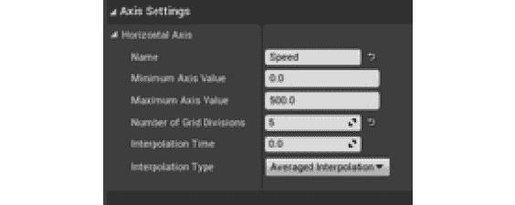

    图 11.10:混合空间的最终轴设置

    您在这里使用这些设置所做的是告诉混合空间使用`0.0f`和`500.0f`之间的传入浮点值来混合您将在下一步中放置的动画和活动。通过将网格划分为`5`分区，您可以沿着轴图以正确的浮点值轻松添加所需的动画。

    让我们通过向轴图添加第一个动画`Idle`动画来继续创建混合空间。

    *   网格的右边是`Asset Browser`标签。请注意，资产列表包括您在*第 12 章*、*动画混合和蒙塔格斯*中导入的玩家角色的所有动画。这是因为您在创建混合空间时选择了`MainCharacter_Skeleton`资源。*   Next, *left-click* and drag the `Idle` animation to our grid at position `0.0`:

    * 

 *图 11.11:将空闲动画拖动到网格位置 0.0

请注意，当将此动画拖到网格时，它将捕捉到网格点。一旦动画被添加到混合空间，玩家角色将从其默认的丁字姿势改变，并开始播放`Idle`动画:

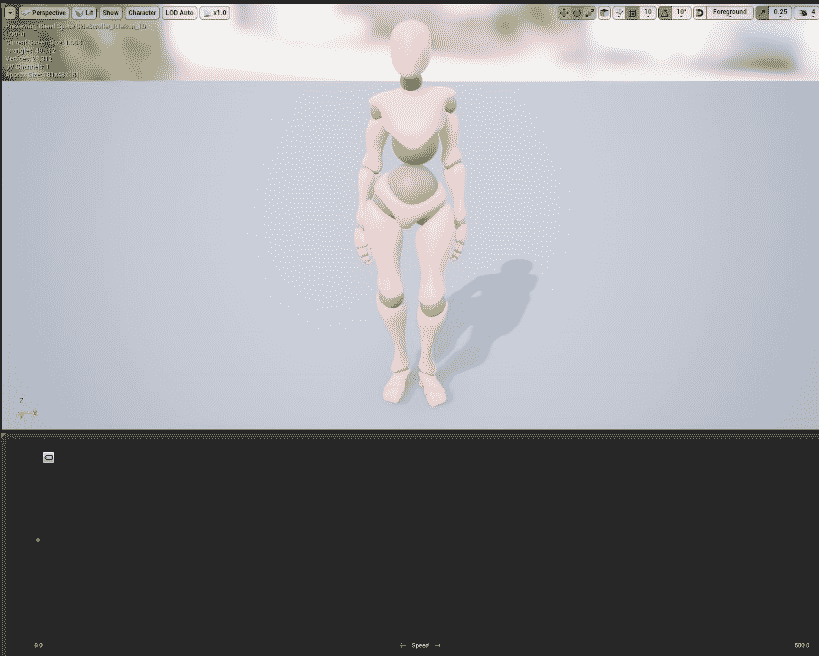

图 11.12:随着空闲动画被添加到 1D 混合空间，玩家角色开始制作动画

完成本练习后，您现在已经了解了如何创建 1D 混合空间，更重要的是，您知道了 1D 混合空间和普通混合空间之间的区别。此外，您知道在玩家角色移动组件和混合空间之间对齐值的重要性，以及为什么您需要确保行走速度与混合空间中的值适当相关。

现在让我们进入本章的第一个活动，您将在混合空间中应用剩余的`Walking`和`Running`动画，就像添加`Idle`动画一样。

## 活动 11.01:将行走和跑步动画添加到混合空间

到目前为止，1D 运动混合空间融合得很好，但是你错过了行走和跑步动画。在本练习中，您将通过将这些动画以对主要角色有意义的适当水平轴值添加到混合空间来完成混合空间。

使用从*练习 11.01* 、*获得的知识创建角色移动 1D 混合空间*，执行以下步骤完成角色移动混合空间:

1.  从*练习 11.01* 、*继续，创建角色移动 1D 混合空间*，返回`Asset Browser`。
2.  现在，将`Walking`动画添加到水平网格位置`300.0f`。
3.  Finally, add the `Running` animation to the horizontal grid position `500.0f`.

    注意

    记住可以*左键点击*沿着网格轴拖动绿色预览网格点，看动画是如何基于轴值融合在一起的，所以要注意角色动画预览窗口，确保看起来正确。

预期产出如下:


图 11.13:混合空间中的跑步动画

此活动完成后，您将拥有一个功能性的混合空间，该空间根据代表玩家角色速度的横轴值混合从`Idle`到`Walking`到`Running`的角色移动动画。

注意

这个活动的解决方案可以在:[https://packt.live/338jEBx](https://packt.live/338jEBx)找到。

# 主角动画蓝图

随着动画被添加到混合空间，你应该能够四处走动，并看到那些动画在工作，对不对？嗯，没有。如果你选择编辑器中的播放，你会注意到主角仍然以丁字姿势移动。原因是因为您还没有告诉动画蓝图使用我们的混合空间资产，这将在本章稍后进行。

## 动画蓝图

在开始使用您在上一章中创建的动画蓝图之前，让我们简要讨论一下这种类型的蓝图是什么，以及它的主要功能是什么。动画蓝图是一种蓝图类型，允许您控制骨骼和骨骼网格的动画，在本例中，是您在上一章中导入的玩家角色骨骼和网格。

动画蓝图分为两个主要图形:

*   事件图
*   动漫图

事件图的工作方式和普通蓝图一样，你可以使用事件、函数和变量来编写游戏逻辑。另一方面，动画图形对于动画蓝图来说是独一无二的，这是您使用逻辑来确定骨骼和骨骼网格在任何给定帧的最终姿势的地方。在这里，您可以使用状态机、动画片段、混合空间和其他动画相关节点等元素，然后输出到角色的最终动画。

看看下面的例子(你可以跟着做)。

打开`MainCharacter/Blueprints`目录下的`AnimBP_SuperSideScroller_MainCharacter`动画蓝图。

默认情况下，`AnimGraph`应该会打开，在这里你可以看到角色预览，我们的`Asset Browser`标签，以及主图。正是在这个`AnimGraph`中，你将实现你刚刚创建的混合空间，以便让玩家角色在关卡中移动时正确地制作动画。

让我们从下一个练习开始，我们将在这里进行，并了解更多关于动画蓝图的信息。

## 练习 11.02:将混合空间添加到角色动画蓝图

在本练习中，您将向动画蓝图中添加混合空间，并准备必要的变量，以帮助根据玩家角色的移动速度控制该混合空间。让我们从添加混合空间到`AnimGraph`开始。

以下步骤将帮助您完成本练习:

1.  Add the Blend Space to `AnimGraph` by finding the `Asset Browser` on the right-hand side, and *left-click* and drag the `SideScroller_IdleRun_1D` Blend Space asset into `AnimGraph`.

    请注意，该混合空间节点的变量输入标记为`Speed`，就像混合空间内的水平轴一样。请参考*图 11.14* 查看`Asset Browser`中的融合空间。

    注意

    如果要以不同的方式命名`Horizontal Axis`，新名称将显示为混合空间的输入参数。

    

    图 11.14:资产浏览器允许您访问与 MainCharacter_Skeleton 相关的所有动画资产

2.  Next, connect the `Output Pose` asset of the Blend Space node to the `Result` pin of the `Output Pose` node. Now, the animation pose in the preview shows the character in the `Idle` animation pose:

    

    图 11.15:您现在对混合空间的控制有限，可以手动输入速度参数值来更新角色移动动画

3.  If you use `PIE,`(**Play-In-Editor**), the player character will be moving around, but will play the `Idle` animation instead of remaining in the T-Pose:

    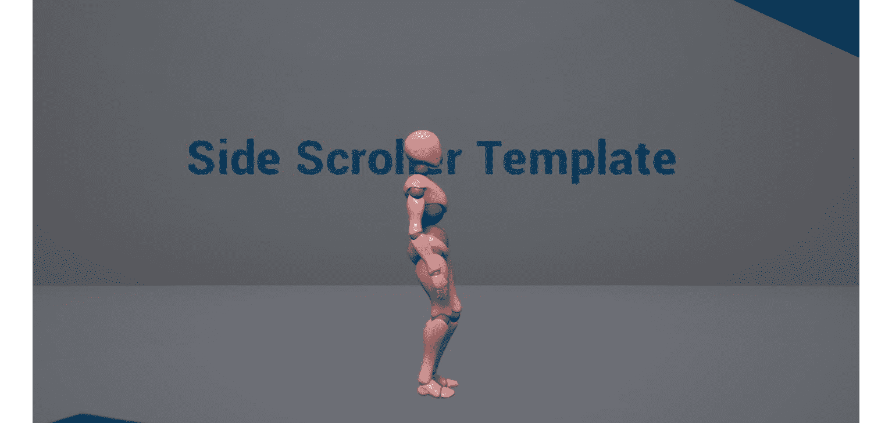

    图 11.16:玩家角色现在在游戏中播放空闲动画

    现在，您可以使用我们的`Speed`输入变量来控制我们的混合空间。有了使用混合空间的能力，您需要一种方法来存储角色的移动速度，并将该值传递给混合空间的`Speed`输入参数。这是您需要做的:

4.  Navigate to the `Event Graph` of our animation blueprint. By default, there will be the `Event Blueprint Update Animation` event and a pure `Try Get Pawn Owner` function. Please refer to *Figure 11.17* to see the default setup of `Event Graph`. The event is updated each frame that the animation is updated, and returns the **Delta Time** between each frame update and the owning pawn of this animation blueprint. You need to make sure that the owning pawn is of the `SuperSideScroller` player character blueprint class before attempting to get any more information.

    

    图 11.17:动画蓝图默认包括这个事件和函数对，用于事件图中

    注意

    虚幻引擎 4 中的`Pure`和`Impure`函数的主要区别在于`Pure` 函数意味着它包含的逻辑不会修改正在使用它的类的变量或成员。在`Try Get Pawn Owner`的情况下，它只是返回了对动画蓝图的`Pawn`所有者的引用。`Impure`函数没有这种含义，可以自由修改它想要的任何变量或成员。

5.  Get the `Return Value` from the `Try Get Pawn Owner` function and, from the `Context Sensitive` menu that appears, search for the cast to `SuperSideScrollerCharacter`:

    

    图 11.18:上下文相关菜单找到相关的函数或变量，在此基础上可以对您正在检查的对象采取操作

6.  Connect the execution output pin from `Event Blueprint Update Animation` to the execution input pin of the cast:

    

    图 11.19:在事件图中，使用 Try Get 典当所有者函数将返回的典当对象转换为 SuperSideScrollerCharacter 类

    你创建的角色蓝图继承自`SuperSideScrollerCharacter`类。由于这个动画蓝图的拥有棋子是你的`BP_SuperSideScroller_MainCharacter`角色蓝图，并且这个蓝图继承自`SuperSideScrollerCharacter`类，因此施法功能将会成功执行。

7.  Next, store the returned value from the cast to its own variable; that way, we have a reference to it in case we need to use it again in our animation blueprint. Refer to *Figure 11.20* and make sure to name this new variable `MainCharacter`.

    注意

    `Promote to Variable`的上下文相关下拉菜单中有一个选项，允许您将任何有效值类型存储到自己的变量中。

    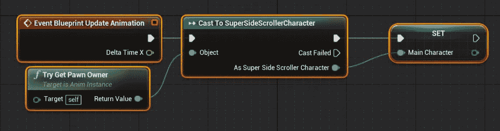

    图 11.20:只要演员成功，你就会想要跟踪拥有的角色

8.  Now, to track the character's speed, use the `Get Velocity` function from the `MainCharacter` variable. Every object from the `Actor` class has access to this function that returns the magnitude and direction vector that the object is moving in:

    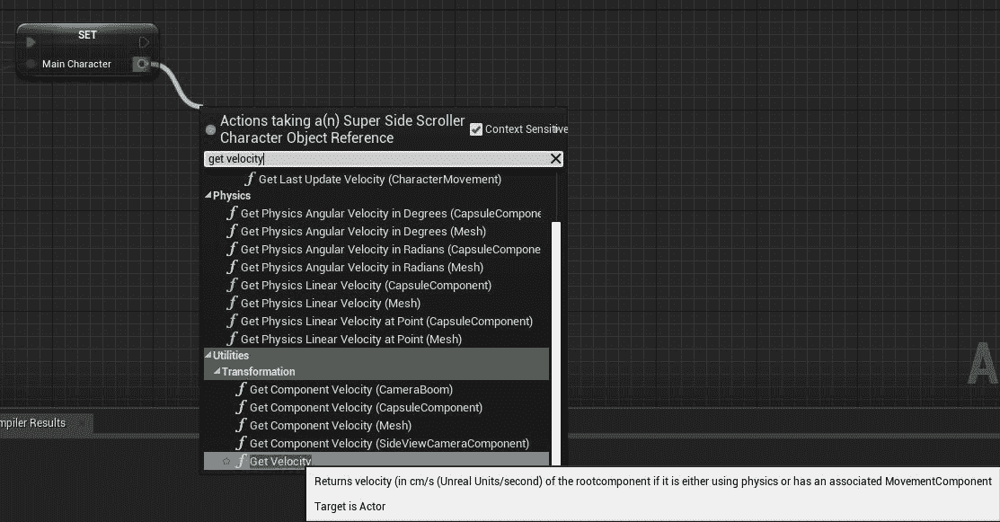

    图 11.21:获取速度函数可以在工具/转换下找到

9.  From `Get Velocity`, you can use the `VectorLength` function to get the actual speed:

    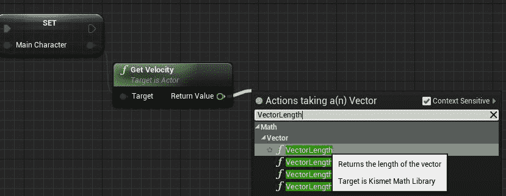

    图 11.22:向量长度函数返回向量的大小，但不返回方向

10.  `Return Value` from the `VectorLength` function can then be promoted to its own variable named `Speed`:

    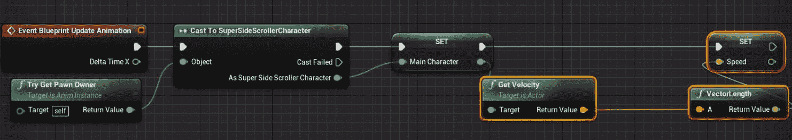

图 11.23:每个演员都有 Get Velocity 函数，该函数返回演员运动的幅度和方向

在本练习中，您可以使用`GetVelocity`功能获得玩家角色速度。从`GetVelocity`函数返回的矢量给出了确定实际速度的矢量长度。通过将该值存储在`Speed`变量中，您现在可以在动画蓝图的`AnimGraph`中引用该值来更新您的混合空间，这将在下一个练习中进行。

# 速度矢量

在进入下一步之前，让我们解释一下当你得到角色的速度时你在做什么，并将那个向量的向量长度提升到`Speed`变量。

什么是速度？速度是一个给定**大小**和**方向**的矢量。换个角度想想，矢量可以像*箭头*一样画出来。箭头的*长度代表**大小**，或*强度*，*箭头*方向代表**方向**。所以，如果你想知道玩家角色移动的速度，你会想要得到那个向量的长度。当我们在返回的速度向量上使用`GetVelocity`函数和`VectorLength`函数时，这正是你正在做的；你得到了我们性格中`Speed`变量的值。这就是为什么您将该值存储在变量中，并使用它来控制混合空间，如下图所示，这是矢量的一个示例。其中一个方向为正(右)方向，大小为`100`，另一个方向为负(左)方向，大小为`35`。*


图 11.24:显示两个不同向量的图

## 练习 11.03:将混合空间添加到角色动画蓝图

现在您已经更好地理解了`Vectors`以及如何存储上一练习中玩家角色的`Speed`变量，您可以按照以下步骤将速度应用到您在本章前面创建的 1D 混合空间。

以下步骤将帮助您完成练习:

1.  导航至`AnimBP_SuperSideScroller_MainCharacter`动画蓝图中的`AnimGraph`。
2.  Use the `Speed` variable to update the Blend Space in real time in the `AnimGraph` by *left-clicking* and dragging the `Speed` variable onto the graph, and connecting the variable to the input of the `Blendspace Player` function:

    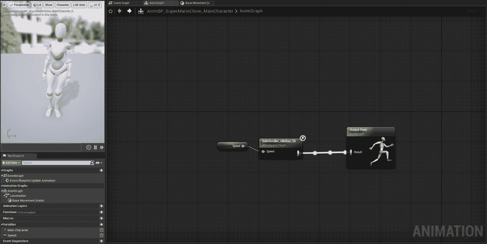

    图 11.25:现在可以在动画更新时使用速度变量来更新每一帧中的混合空间

3.  Next, compile the animation blueprint.

    你现在可以根据玩家角色的速度更新混合空间。使用`PIE`时，可以看到`Idle`中的人物，移动时可以看到`Walking`动画中的人物:

    

图 11.26:玩家角色终于可以在关卡中走动了

最后，主要角色使用基于移动速度的移动动画。在下一个活动中，您将更新角色移动组件，以便可以从混合空间预览角色运行动画。

## 活动 11.02:游戏中预览运行动画

随着动画蓝图的更新和获得玩家角色的速度，您现在可以在游戏中预览`Idle`和`Walking`动画。

在本活动中，您将更新玩家角色蓝图的`CharacterMovement`组件，以便您也可以在游戏中预览`Running`动画。

为此，请执行以下步骤:

1.  导航并打开`BP_SuperSideScroller_MainCharacter`玩家角色蓝图。
2.  进入`CharacterMovement`组件。
3.  将`Max Walk Speed`参数修改为`500.0`的值，以便您的角色可以快速移动，将其动画从`Idle`混合到`Walking`，最后混合到`Running`。

在本活动结束时，您将允许玩家角色达到一个速度，允许您在游戏中预览`Running`动画。

预期产出如下:

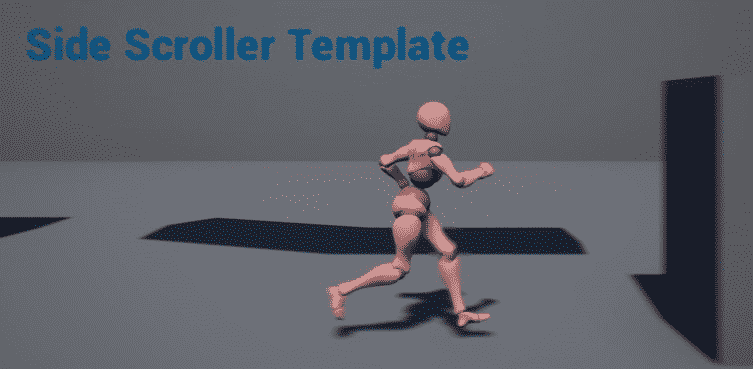

图 11.27:玩家角色运行

注意

这个活动的解决方案可以在:[https://packt.live/338jEBx](https://packt.live/338jEBx)找到。

现在您已经处理了玩家角色从`Idle`到`Walk`以及最后到`Run`的移动混合，让我们进入下一步，添加允许玩家角色通过冲刺移动得更快的功能。

# 输入绑定

每一个游戏都需要玩家输入，无论是键盘上的 *W* 、 *A* 、 *S* 、 *D* 等移动玩家角色的按键，还是控制器上的拇指棒；这就是电子游戏成为互动体验的原因。虚幻引擎 4 允许我们将键盘、鼠标、游戏手柄和其他类型的控件映射到标记的动作或轴，然后您可以在蓝图或 C++中引用这些动作或轴来实现角色或游戏功能。需要指出的是，每个唯一的动作或轴映射可以有一个或多个键绑定，并且同一个键绑定可以用于多个映射。输入绑定保存在一个名为`DefaultInput.ini`的初始化文件中，可以在项目目录的`Config`文件夹中找到。

注意

输入绑定可以直接从`DefaultInput.ini`文件编辑，也可以通过编辑器本身的`Project Settings`编辑；后者更容易访问，并且在编辑时不容易出错。

让我们为玩家角色的`Sprint`功能添加一个新的输入绑定。

## 练习 11.04:增加短跑和投掷的输入

随着玩家角色在关卡中移动，您现在将为玩家角色实现一个从基础`SuperSideScrollerCharacter` C++类派生的唯一角色类。这样做的原因是为了以后可以轻松区分玩家角色和敌人的职业，而不是仅仅依靠独特的蓝图职业。

在创建独特的 C++角色类时，您将实现*冲刺*行为，以允许玩家角色根据需要进行*行走*和*冲刺*。

让我们首先通过为`Sprint`添加输入绑定来实现`Sprinting`机制:

1.  导航到编辑器顶部工具栏上的`Edit`选项，从下拉列表中选择`Project Settings`。
2.  在`Project Settings`内，导航至左侧`Engine`类别下的`Input`选项。默认情况下，虚幻引擎提供的`Side Scroller`模板项目附带了`Jump`的动作映射，键 *W* 、*向上箭头键*、*空格键*、*游戏手柄面板按钮底部*与之绑定。
3.  Add new `Action Mapping` by *left-clicking* on the `+` button next to `Action Mappings`. Label this mapping `Sprint` and add two keys for its controls; `Left Shift` and `Gamepad Right Shoulder`. Please refer to the figure below for the updated bindings.

    

    图 11.28:应用于键绑定的跳跃和冲刺动作映射

    随着`Sprint`输入绑定的到位，你需要基于`SuperSideScroller`角色类为玩家角色创建一个新的 C++类。

4.  返回编辑器，导航至`File`，从下拉列表中选择`New C++ Class`选项。
5.  The new player character class will inherit from the `SuperSideScrollerCharacter` parent class because this base class has a majority of the functionality needed for the player character. After selecting the parent class, *left-click* on `Next`. Please refer to the following image to see how to find the `SuperSideScrollerCharacter` class.

    

    图 11.29:选择 SuperSideScrollerCharacter 父类

6.  Name this new class `SuperSideScroller_Player`. Leave the path as the default that Unreal Engine provides for you, unless you have a need to adjust the file directory of this new class. After naming the new class and selecting the directory to save the class in, *left-click* `Create Class`.

    选择`Create Class`后，虚幻引擎会为你生成源文件和头文件，Visual Studio 会自动打开这些文件。您会注意到头文件和源文件几乎都是空的。这是可以的，因为您是从`SuperSideScrollerCharacter`类继承的，并且您想要的大部分逻辑是在该类中完成的。

7.  In `SuperSideScroller_Player`, you will add only the functionality you need on top of what you inherit. You can view the line where the inheritance is taking place inside `SuperSideScroller_Player.h`:

    ```cpp
    class SUPERSIDESCROLLER_API ASuperSideScroller_Player : public ASuperSideScrollerCharacter
    ```

    这个类声明是说新的`ASuperSideScroller_Player`类继承了`ASuperSideScrollerCharacter`类。

通过完成本练习，您可以为`Sprint`机械师添加必要的`Input Binding`，然后可以在 C++中引用并用于允许玩家冲刺。现在你已经为玩家角色创建了 C++类，你可以用`Sprint`功能更新代码，但是首先你需要更新`Blueprint`角色和动画蓝图来引用这个新类。让我们在下一个练习中这样做。

当你为一个新班级准备蓝图时会发生什么？每个蓝图都继承自父类。在大多数情况下，这是`Actor`，但是在你的角色蓝图的情况下，它的父类是`SuperSideScrollerCharacter`。从父类继承允许蓝图继承该类的功能和变量，以便可以在蓝图级别重用逻辑。

例如，当从`SuperSideScrollerCharacter`类继承时，蓝图继承诸如`CharacterMovement`组件和`Mesh`骨骼网格组件的组件，然后可以在蓝图中修改这些组件。

## 练习 11.05:重绘人物蓝图

现在你已经为玩家角色创建了一个新的角色类，你需要更新`BP_SuperSideScroller_MainCharacter`蓝图，使用`SuperSideScroller_Player`类作为它的父类。如果没有，那么添加到新类中的任何逻辑都不会影响蓝图中制作的角色。

按照以下步骤为新角色类准备蓝图:

1.  导航至`/Game/MainCharacter/Blueprints/`打开`BP_SuperSideScroller_MainCharacter`蓝图。
2.  选择工具栏上的`File`选项，从下拉菜单中选择`Reparent Blueprint`选项。
3.  When selecting the `Reparent Blueprint` option, Unreal will ask for the new class to reparent the blueprint to. Search for `SuperSideScroller_Player` and select the option from the dropdown by *left-clicking*.

    一旦您为蓝图选择了新的父类，虚幻将重新加载蓝图并重新编译它，这两种情况都将自动发生。

    注意

    将蓝图重编到新的父类时要小心，因为这可能会导致编译错误或设置被擦除或恢复到类默认值。虚幻引擎将显示在重新分配到新类后编译蓝图后可能出现的任何警告或错误。如果有蓝图逻辑引用新父类中不再存在的变量或其他类成员，通常会出现这些警告和错误。即使没有编译错误，在继续工作之前，最好确认您对蓝图所做的任何逻辑或设置在重新编译之后仍然存在。

    现在你的角色蓝图已经被正确地重新分配到新的`SuperSideScroller_Player`类，你还需要更新`AnimBP_SuperSideScroller_MainCharacter`动画蓝图，以确保你在使用`Try Get Pawn Owner`功能时正在转换到正确的类。

4.  接下来，导航到`/MainCharacter/Blueprints/`目录，打开`AnimBP_SuperSideScroller_MainCharacter`动画蓝图。
5.  Open `Event Graph`. From the `Return Value` of the `Try Get Pawn Owner` function, search for `Cast` to `SuperSideScroller_Player`:

    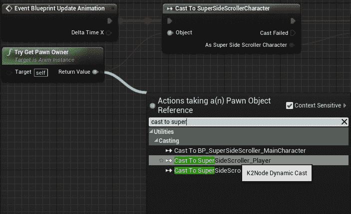

    图 11.30:您可以转换到新的 SuperSideScroller_Player 类，而不是转换到基本的 SuperSideScrollerCharacter 类

6.  You can then connect the output as a `SuperSideScroller_Player` cast to the `MainCharacter` variable. This works because the `MainCharacter` variable is of the `SuperSideScrollerCharacter` type and the new `SuperSideScroller_Player` class inherits from that class:

    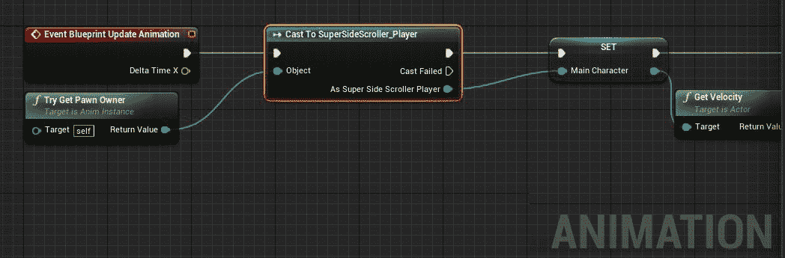

图 11.31:您仍然可以使用 MainCharacter 变量，因为由于继承，SuperSideScroller_Player 基于 SuperSideScrollerCharacter

现在`BP_SuperSideScroller_MainCharacter`角色蓝图和`AnimBP_SuperSideScroller_MainCharacter`动画蓝图都引用了你的新`SuperSideScroller_Player`类，现在可以安全地进入 C++并编写角色冲刺功能了。

## 练习 11.06:编码角色冲刺功能

随着新的`SuperSideScroller_Player`类引用在之前练习的蓝图中正确实现，是时候开始编写允许玩家角色冲刺的功能了。

执行以下步骤将`Sprinting`机械师添加到角色中:

1.  首先要注意的是`SuperSideScroller_Player`类的构造函数。导航回 Visual Studio，打开`SuperSideScroller_Player.h`头文件。
2.  在本练习的后面，您将使用`constructor`函数来设置变量的初始值。目前，它将是一个空的构造函数。确保在`public`访问修饰符标题下进行声明，如以下代码所示:

    ```cpp
    //Constructor
    ASuperSideScroller_Player();
    ```

3.  With the constructor declared, create the constructor function definition in the `SuperSideScroller_Player.cpp` source file:

    ```cpp
    ASuperSideScroller_Player::ASuperSideScroller_Player()
    {
    }
    ```

    有了构造函数，是时候创建`SetupPlayerInputComponent`函数了，这样您就可以使用前面创建的键绑定来调用`SuperSideScroller_Player`类中的函数。

    `SetupPlayerInputComponent`函数是字符类默认内置的函数，所以需要用`override`说明符声明为`virtual`函数。这告诉虚幻，你正在使用这个函数，并打算在这个新类中重新定义它的功能。确保在`Protected`访问修饰符标题下进行声明。

4.  The `SetupPlayerInputComponent` function requires an object of the `UInputComponent` class to be passed into the function, like so:

    ```cpp
    protected:
    //Override base character class function to setup our player   input component
    virtual void SetupPlayerInputComponent(class UInputComponent*   PlayerInputComponent) override;
    ```

    `UInputComponent* PlayerInputComponent`变量继承自我们的`ASuperSideScroller_Player()`类派生的`UCharacter`基类，因此必须用作`SetupPlayerInputComponent()`函数的输入参数。使用任何其他名称都会导致编译错误。

5.  Now, in the source file, create the definition of the `SetupPlayerInputComponent` function. In the body of the function, we will use the `Super` keyword to call it:

    ```cpp
    //Not always necessary, but good practice to call the function in   the base class with Super.
    Super::SetupPlayerInputComponent(PlayerInputComponent);
    ```

    `Super`关键字使我们能够调用`SetupPlayerInputComponent`父方法。准备好`SetupPlayerInputComponent`功能后，您需要包含以下头文件，以便在没有任何编译错误的情况下继续本练习:

    *   `#include "Components/InputComponent.h"`
    *   `#include "GameFramework/CharacterMovementComponent.h"`

        您需要包含输入组件的头，以便将键映射绑定到您接下来将要创建的 sprint 函数。`Character Movement`组件的标题对于冲刺功能是必需的，因为您将根据玩家是否冲刺来更新`Max Walk Speed`参数。以下代码是玩家角色需要包含的所有标题:

        ```cpp
        #include "SuperSideScroller_Player.h"
        #include "Components/InputComponent"
        #include "GameFramework/CharacterMovementComponent.h"
        ```

        在`SuperSideScroller_Player`类的源文件中包含必要的标题后，你现在可以创建冲刺函数来让玩家角色移动得更快。让我们从声明所需的变量和函数开始。

6.  在`SuperSideScroller_Player`类头文件中的`Private`访问修饰符下，声明一个名为`bIsSprinting`的新布尔变量。该变量将被用作故障保险，以便在对移动速度进行任何更改之前确定玩家角色是否正在冲刺:

    ```cpp
    private:
    //Bool to control if we are sprinting. Failsafe.
    bool bIsSprinting;
    ```

7.  Next, declare two new functions, `Sprint();` and `StopSprinting();`. These two functions will not take any arguments and will not return anything. Declare the functions under the `Protected` access modifier:

    ```cpp
    //Sprinting
    void Sprint();
    //StopSprinting
    void StopSprinting();
    ```

    当玩家*按住*映射到绑定的`Sprint`键时会调用`Sprint();`功能，当玩家*释放*映射到绑定的键时会调用`StopSprinting()`功能。

8.  从`Sprint();`函数的定义开始。在`SuperSideScroller_Player`类的源文件中，创建该函数的定义，如下所示:

    ```cpp
    void ASuperSideScroller_Player::Sprint()
    {
    }
    ```

9.  在函数中，您首先要检查`bIsSprinting`变量的值。如果玩家是**而不是**冲刺，也就是说`bIsSprinting`是`False`，那就继续剩下的功能。
10.  Within the `If` statement, set the `bIsSprinting` variable to `True`. Then, you can access the `GetCharacterMovement()` function and modify the `MaxWalkSpeed` parameter. Set `MaxWalkSpeed` to `500.0f`. Remember that the `Maximum Axis Value` parameter of the movement Blend Space is `500.0f`. This means that the player character will reach the speed necessary to use the `Running` animation:

    ```cpp
    void ASuperSideScroller_Player::Sprint()
    {
        if (!bIsSprinting)
          {
            bIsSprinting = true;
            GetCharacterMovement()->MaxWalkSpeed = 500.0f;
          }
    }
    ```

    `StopSprinting()`函数看起来和你刚刚写的`Sprint()`函数几乎一样，但是它的工作方式相反。你首先要检查玩家*是不是*冲刺，意思是`bIsSprinting`是`True`。如果是这样，继续该函数的其余部分。

11.  Inside the `If` statement, set `bIsSprinting` to `False`. Then, access the `GetCharacterMovement()` function to modify `MaxWalkSpeed`. Set `MaxWalkSpeed` back to `300.0f`, the default speed for the player character walking. This means that the player character will reach only the speed necessary for the `Walking` animation:

    ```cpp
    void ASuperSideScroller_Player::StopSprinting()
    {
       if (bIsSprinting)
        {
         bIsSprinting = false;
          GetCharacterMovement()->MaxWalkSpeed = 300.0f;
        }
    }
    ```

    现在您已经有了冲刺所需的函数，是时候将这些函数绑定到您之前创建的动作映射了。为此，在`SetupPlayerInputComponent`功能中执行以下步骤。

12.  Let's begin by binding the `Sprint()` function. Inside the `SetupPlayerInputComponent` function, use the `PlayerInputComponent` variable that is passed to the function so as to call the `BindAction` function.

    `BindAction`需要的参数如下:

    *   您在本练习前面设置的`Project Settings`中所写的动作映射的名称，在本例中为`Sprint`。
    *   The enumerator value of the `EInputEvent` type that you want to use for this binding; in this case you will use `IE_Pressed` because this binding will be for when the `Sprint` key(s) are pressed.

        注意

        有关`EInputEvent`枚举器类型的更多信息，请参考 Epic Games 的以下文档:[https://docs . unrealengine . com/en-US/API/Runtime/Engine/Engine/EInputEvent/index . html](https://docs.unrealengine.com/en-US/API/Runtime/Engine/Engine/EInputEvent/index.html)。

    *   对类对象的引用。在这种情况下，它是`ASuperSideScroller_Player`类，但是您可以使用`this`关键字，它代表相同的东西。
    *   A delegate to the function that you want to call when this action happens.

        产生的函数调用如下所示:

        ```cpp
        //Bind pressed action Sprint to your Sprint function
        PlayerInputComponent->BindAction"Sprint", IE_Pressed, this,   &ASuperSideScroller_Player::Sprint);
        ```

13.  You will do the same thing for the `StopSprinting()` function, but this time you need to use the `IE_Released` enumerator value, and reference the `StopSprinting` function:

    ```cpp
    //Bind released action Sprint to your StopSprinting function
    PlayerInputComponent->BindAction("Sprint", IE_Released, this,   &ASuperSideScroller_Player::StopSprinting);
    ```

    将`Action Mappings`绑定到 sprint 函数后，您最不需要做的事情就是从`Character Movement`组件设置`bIsSprinting`变量和`MaxWalkSpeed`参数的默认初始值。

14.  在你的`SuperSideScroller_Player`类的源文件中的`constructor`函数中，添加`bIsSprinting = false`行。这个变量被构造为 false，因为默认情况下玩家角色不应该冲刺。
15.  Finally, set the `MaxWalkSpeed` parameter of the character movement component to `300.0f` by adding the line `GetCharacterMovement()->MaxWalkSpeed = 300.0f`. Please review the following code:

    ```cpp
    ASuperSideScroller_Player::ASuperSideScroller_Player()
    {
      //Set sprinting to false by default.
       bIsSprinting = false;
      //Set our max Walk Speed to 300.0f
       GetCharacterMovement()->MaxWalkSpeed = 300.0f;
    }
    ```

    随着变量的初始化被添加到构造函数中，`SuperSideScroller_Player`类就完成了。返回虚幻引擎，左键点击工具栏上`Compile`按钮上的*。这将重新编译代码，并执行编辑器的热重新加载。*

    *在重新编译和热重装编辑器后，您可以在编辑器中播放并看到您的劳动成果。基础移动行为和以前一样，但是现在如果你在控制器上按住*左移*或者*游戏手柄右肩*，玩家角色就会冲刺并开始播放`Running`动画。*

    *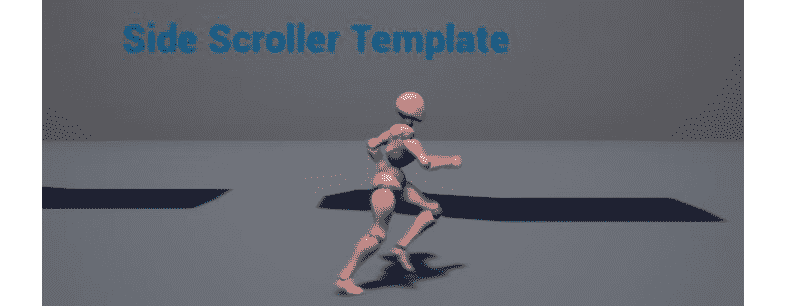*

 *图 11.32:玩家角色现在可以冲刺了

随着玩家角色能够冲刺，让我们进入下一个活动，您将以非常相似的方式实现基础`Throw`功能。

## 活动 11.03:实施投掷输入

这款游戏的特点之一是玩家可以向敌人投掷炮弹。在本章中，您不会创建投射体或实现动画，但是您将设置键绑定和 C++实现，以便在下一章中使用。

在本练习中，您需要为`Throw`投射功能设置键绑定，并在 C++中实现一个调试日志，当玩家按下映射到`Throw`的键时，请执行以下操作。

1.  在输入绑定中向`Project Settings`添加新的`Throw`输入。命名此绑定`ThrowProjectile`并将其绑定到*鼠标左键*和*游戏手柄右触发器*。
2.  在 Visual Studio 中，为`SuperSideScroller_Player`的头文件添加一个新的函数。命名该功能`ThrowProjectile()`。这将是一个没有参数的空函数。
3.  Create the definition in the source file of the `SuperSideScroller_Player` class. In the definition of this function, use `UE_LOG` to print a message letting you know that the function is being called successfully.

    注意

    您可以在这里了解更多关于`UE_LOG`的信息:[https://www . ue4 community . wiki/Legacy/Logs，_ Printing _ Messages _ To _ Yourself _ During _ Runtime](https://www.ue4community.wiki/Legacy/Logs,_Printing_Messages_To_Yourself_During_Runtime)。

本活动结束时的预期结果是，当您使用*鼠标左键*或*游戏手柄右触发*时，`Output Log`中会出现一个日志，让您知道`ThrowProjectile`功能被成功调用。稍后你将使用这个功能来产生你的投射物。

预期产出如下:


图 11.33:预期的输出日志

注意

这个活动的解决方案可以在:[https://packt.live/338jEBx](https://packt.live/338jEBx)找到。

完成此活动后，您现在可以在*第 13 章*、*敌人人工智能*中创建玩家投射物。您现在也有了在游戏中添加新的键映射的知识和经验，并且在 C++中实现了利用这些映射来实现游戏功能的功能。现在，您将继续更新玩家角色移动，以允许玩家跳跃时跳跃动画正确播放。

# 动画状态机

现在，让我们了解一下在虚幻引擎 4 和动画中状态机是什么。状态机是一种将动画或动画集分类到其自身状态的方法。状态可以被认为是玩家角色在特定时间所处的状态。玩家目前正在行走吗？玩家在跳吗？在很多第三人称游戏如*《我们最后的人》*中，这是将运动、跳跃、蹲伏和攀爬动画分离成自己的状态。当在玩游戏时满足某些条件时，每个状态都是可访问的。条件可以包括玩家是否在跳跃、玩家角色的速度以及玩家是否处于蹲下状态。状态机的工作是使用称为**转换规则**的逻辑决策在每个状态之间转换。当你用多个相互交织的转换规则创建多个状态时，状态机开始看起来像一个网络。

请看下图，看状态机如何寻找`ThirdPerson_AnimBP`动画蓝图。

注意

状态机的大致概述可以在这里找到:[https://docs . unrealengine . com/en-US/Engine/Animation/state machines/Overview/index . html](https://docs.unrealengine.com/en-US/Engine/Animation/StateMachines/Overview/index.html)


图 11.34:SideScroller 项目模板中包含的 ThirdPerson_AnimBP 的状态机

在玩家角色的状态机的情况下，这个状态机将处理默认玩家移动和跳跃的状态。目前，玩家角色只需使用由角色速度控制的混合空间来制作动画。在下一个练习中，您将创建一个新的状态机，并将移动混合空间逻辑移动到该状态机中自己的状态。让我们从创建新的状态机开始。

## 练习 11.07:玩家角色移动和跳跃状态机

在本练习中，您将实现一个新的动画状态机，并将现有的运动混合空间集成到状态机中。此外，您将设置玩家跳跃开始时的状态，以及跳跃过程中玩家在空中时的状态。

让我们从添加这个新的状态机开始:

1.  导航至`/MainCharacter/Blueprints/`目录，打开`AnimBP_SuperSideScroller_MainCharacter`动画蓝图。
2.  在`AnimGraph`中，*在图的空白处右击*，在上下文相关搜索中搜索`state machine`，找到`Add New State Machine`选项。命名这个新的状态机`Movement`。
3.  Now, instead of plugging the output pose of the `SideScroller_IdleRun` Blend Space, we can connect the output post of the new state machine, `Movement`, to the output pose of the animation:

    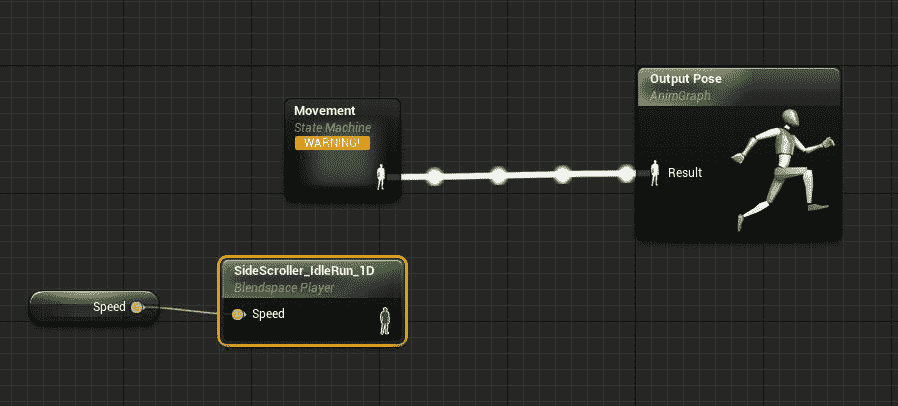

    图 11.35:新的运动状态机取代了旧的混合空间

    将一个空的状态机连接到动画蓝图的`Output Pose`中，将会出现下面显示的警告。所有这一切意味着该状态机内没有任何事情发生，结果对`Output Pose`无效。不用担心；接下来你会解决这个问题。

    

    图 11.36:空状态机导致编译警告

4.  *Double left-click* on the `Movement` state machine to open the state machine itself. The image below shows what this looks like.

    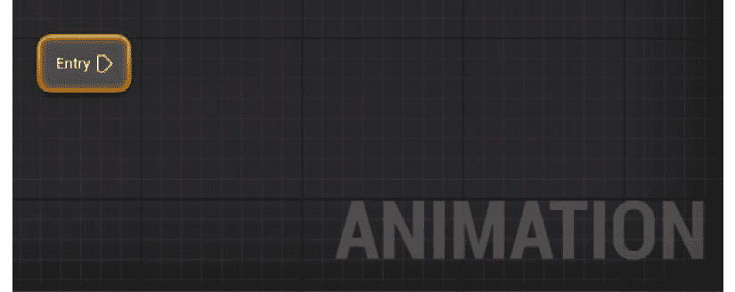

    图 11.37:这是创建的空状态机

    您将从添加一个新的状态开始，该状态将处理角色之前所做的事情；`Idle`、`Walking`和`Running`。

5.  From the `Entry` point, *left-click* and drag out to open the context-sensitive search. You will notice that there are only two options – `Add Conduit` and `Add State`. For right now, you will add a new state and name this state `Movement`. Refer to the following images to see the `Movement` state created.

    

    图 11.38:在状态机内部，您需要添加一个新的状态来处理您之前创建的移动混合空间

    

    图 11.39:新的运动状态

6.  Copy and paste the logic you had where you connected the `Speed` variable to the `SideScroller_IdleRun` Blend Space into the new `Movement` state created in the last step. Connect it to the `Result` pin of the `Output Animation Pose` node of this state:

    

图 11.40:将混合空间的输出姿态连接到该状态的输出姿态

现在，如果您重新编译动画蓝图，您将首先注意到您之前看到的警告现在已经消失了。这是因为你添加了一个新的状态输出一个动画到`Output Animation Pose`而不是有一个空的状态机。

通过完成这个练习，您已经构建了第一个状态机。虽然很简单，但你现在是在告诉角色默认进入并使用`Movement`状态。如果你现在做 PIE，你会看到玩家角色现在像制造状态机之前一样移动。这意味着您的状态机正在运行，您可以继续下一步，添加跳转所需的初始状态。让我们从创建`JumpStart`状态开始。

## 过渡规则

管道是一种方式，告诉每个状态，在什么条件下，它可以从一个状态过渡到另一个状态。在这种情况下，转换规则被创建为`Movement`和`JumpStart`状态之间的连接。这再次由状态之间的连接的方向箭头指示。工具提示提到了术语*转换规则*，这意味着您需要使用布尔值来定义这些状态之间的转换将如何发生。


图 11.41:从移动到角色跳跃的开始需要有一个过渡规则

## 练习 11.08:向状态机添加状态和转换规则

在从玩家角色的默认移动混合空间过渡到跳跃动画开始的情况下，您需要知道玩家何时决定跳跃。这可以使用玩家角色的`Character Movement`组件中一个叫做`IsFalling`的有用函数来完成。您将需要跟踪玩家当前是否正在下落，以便过渡到跳跃和跳出跳跃。最好的方法是将`IsFalling`函数的结果存储在自己的变量中，就像你跟踪玩家速度时所做的那样。

以下步骤将帮助您完成本练习:

1.  回到状态机本身的概述中，*左键单击*，从`Movement`状态的边缘拖动，再次打开上下文菜单。
2.  Select the option to `Add State` and name this state `JumpStart`. When you do this, Unreal will automatically connect these states and implement an empty `Transition Rule` for you:

    

    图 11.42:虚幻在连接两个状态时自动为你创建的转换规则

3.  Navigate back to `Event Graph` inside the animation blueprint, where you had used the Event Blueprint update animation event to store the `Speed` of the player character.

    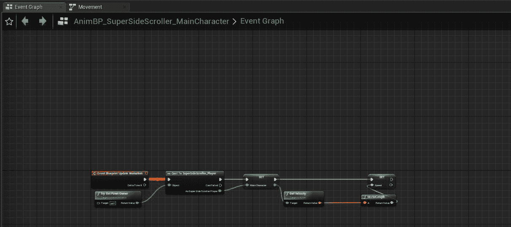

    图 11.43:SuperSideScroller 播放器动画蓝图的事件图

4.  Create a getter variable for the `MainCharacter` and access the `Character Movement` component. From the `Character Movement` component, *left-click* and drag to access the context-sensitive menu. Search for `IsFalling`:

    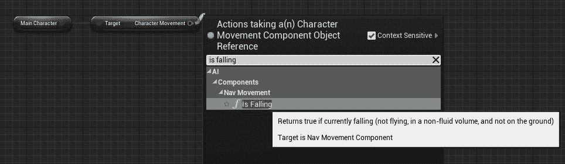

    图 11.44:如何找到 IsFalling 函数

5.  The character movement component can tell you whether the player character is currently in the air with the help of the `IsFalling` function:

    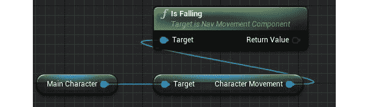

    图 11.45:显示玩家角色状态的角色移动组件

6.  From the `Return Value` Boolean of the `IsFalling` function, *left-click* and drag to search for the `Promote to Variable` option from the context-sensitive menu. Name this variable `bIsInAir`. When promoting to a variable, the Return Value output pin should automatically connect to the input pin of the newly promoted variable. If it does not, remember to connect them.

    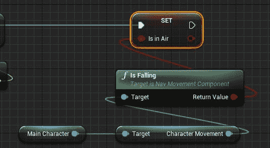

    图 11.46:一个新的变量，bIsInAir，它包含 IsFalling 函数的值

    现在您正在存储玩家的状态以及他们是否在下降，这是`Movement`和`JumpStart`状态之间的过渡规则的完美候选。

7.  In the `Movement State` machine, *double left-click* on the `Transition Rule` to enter its graph. You will find only one output node, `Result`, with the parameter `Can Enter Transition`. All you need to do here is use the `bIsInAir` variable and connect it to that output. Now, the `Transition Rule` is saying that if the player is in the air, the transition between the `Movement` state and the `JumpStart` states can happen.

    

    图 11.47:在空中时，玩家将过渡到跳跃动画的开始

    当`Movement`和`JumpStart`状态之间的`Transition Rule`就绪后，剩下要做的就是告诉`JumpStart`状态使用哪个动画。

8.  From the state machine graph, *double left-click* on the `JumpStart` state to enter its graph. From `Asset Browser`, *left-click* and drag the `JumpingStart` animation to the graph:

    

    图 11.48:在左键单击并将其拖入状态之前，确保在资产浏览器中选择了跳转开始动画

9.  Connect the output of the `Play JumpingStart` node to the `Result` pin of the `Output Animation Pose` node:

    

    图 11.49:将跳转开始动画连接到跳转开始状态的输出动画姿势

    在可以进入下一个状态之前，在`JumpingStart`动画节点上有需要更改的设置。

10.  *左键点击`Play JumpingStart`动画节点上的*，更新`Details`面板，设置如下:
    *   `Loop Animation = False`
    *   `Play Rate = 2.0`

        请参考下图查看`Play JumpingStart`动画节点的最终设置。

        

图 11.50:由于跳跃开始动画的缓慢，增加播放速率将导致整体上更平滑的跳跃动画

您正在将`Loop Animation`参数设置为`False`，因为没有理由让此动画循环；它在任何情况下都应该只播放一次。这个动画循环的唯一方式是玩家角色以某种方式陷入这种状态，但这永远不会发生，因为你将创建下一个状态。将`Play Rate`设置为`3.0`的原因是动画本身`JumpingStart`对于你正在制作的游戏来说太长了。动画让角色剧烈地弯曲膝盖，并在一秒多的时间里向上跳跃。对于`JumpStart`状态，您希望角色更快地播放此动画，以便它更流畅，并提供到下一状态的更平滑过渡；第`JumpLoop`。

一旦玩家角色开始`JumpStart`动画，在该动画中有一个时间点，玩家在空中，应该转换到一个新的状态。这个新的状态会循环，直到玩家不再在空中，可以过渡到结束跳跃的最终状态。接下来，让我们创建这个新的状态，它将从`JumpStart`状态转换。

1.  From the state machine graph, *left-click* and drag from the `JumpStart` state and select the `Add State` option. Name this new state `JumpLoop`. As before, Unreal will automatically provide you with a `Transition Rule` between these states that you will add to in the next exercise. Finally, recompile the Animation Blueprint and ignore any warnings that may appear under Compiler Results.

    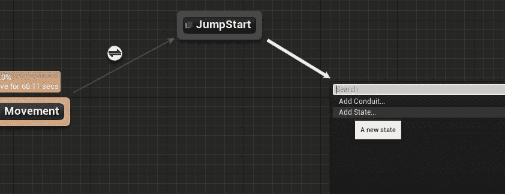

图 11.51:创建另一个状态，在初始跳跃开始后，在空中处理角色的动画

通过完成本练习，您已经添加并连接了自己的`JumpStart`和`JumpLoop`状态。这些状态中的每一个都通过一个`Transition Rule`连接起来，现在你可以更好地理解状态机中的状态是如何通过每个转换规则中建立的规则从一个状态转换到另一个状态的。

在下一个练习中，您将更多地了解如何通过函数`Time Remaining Ratio`从`JumpStart`状态转换到`JumpLoop`状态。

## 练习 11.09:剩余时间比率功能

为了让`JumpStart`状态平稳过渡到`JumpLoop`状态，你需要花点时间想清楚你希望这种过渡如何工作。根据`JumpStart`和`JumpLoop`动画的工作方式，最好在`JumpStart`动画上经过指定时间后在`JumpLoop`动画中过渡。这样，`JumpLoop`状态在`JumpStart`动画播放的`X`秒后流畅播放。

为此，请执行以下步骤:

1.  *在`JumpStart`和`JumpLoop`之间的`Transition Rule`上双击*打开其图形。您将在此应用的`Transition Rule`是检查`JumpingStart`动画还剩多少时间。这样做是因为`JumpingStart`动画中还有一定百分比的时间剩余，您可以放心地假设玩家在空中，准备过渡到`JumpingLoop`动画状态。
2.  To do this, first make sure that the `JumpingStart` animation is selected in `Asset Browser`, and then *right-click* in `Event Graph` of the `Transition Rule` and find the `Time Remaining Ratio` function.

    让我们花点时间来谈谈`Time Remaining Ratio`功能以及它在做什么。这个函数返回一个介于`0.0f`和`1.0f`之间的浮点数，告诉你在指定的动画中还有多少时间。值`0.0f`和`1.0f`可以直接转换为百分比值，以便更容易考虑。在`JumpingStart`动画的情况下，为了成功过渡到`JumpingLoop`状态，您可能想知道是否剩余了不到 60%的动画。这就是你现在要做的。

3.  From the `Return Value` float output parameter of the `Time Remaining Ratio` function, search for the `Less Than comparative operative` node from the context-sensitive search menu. Since you are working with a returned value between `0.0f` and `1.0f`, in order to know whether less than 60% of the animation remains, you need to compare this returned value with a value of `0.6f`. The final result is as follows:

    

    图 11.52:在转换到跳转循环动画之前，您需要知道跳转开始动画还剩多少时间

    有了这个`Transition Rule`，剩下要做的就是将`JumpLoop`动画添加到`JumpLoop`状态。

4.  In the `Movement` state machine, *double left-click* on the `JumpLoop` state to enter its graph. With the `JumpLoop` animation asset selected in `Asset Browser`, *left-click* and drag it onto the graph. Connect its output to the `Result` input of `Output Animation Pose`, as shown below. The default settings of the `Play JumpLoop` node will remain unchanged.

    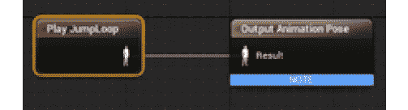

图 11.53:连接到新状态的输出动画姿势的跳跃循环动画

在`JumpLoop`状态下`JumpLoop`动画就位，现在可以编译动画蓝图和 PIE 了。你会注意到运动和冲刺动画仍然存在，但是当你试图跳跃时会发生什么？玩家角色开始`JumpStart`状态，并在空中播放`JumpLoop`动画。这很棒，状态机正在工作，但是当玩家角色到达地面并且不再在空中时会发生什么？玩家角色不会转换回`Movement`状态，这是有道理的，因为你还没有添加`JumpEnd`的状态或者`JumpLoop`和`JumpEnd`之间的转换，以及从`JumpEnd`回到`Movement`状态。您将在下一个活动中这样做。玩家角色陷入`JumpLoop`状态的例子见下文:


图 11.54:玩家角色现在可以播放跳跃开始动画和跳跃循环动画，但是不能转换回默认移动

通过完成本练习，您可以使用`Time Remaining Ratio`功能成功地从`JumpStart`状态转换到`JumpLoop`状态。这个功能可以让你知道一个动画播放了多长时间，有了这个信息，你的状态机就转换到了`JumpLoop`状态。玩家现在可以成功地从默认的`Movement`状态转换到`JumpStart`状态，然后再转换到`JumpLoop`状态，从而产生一个有趣的问题。玩家现在被卡在`JumpLoop`状态，因为状态机不包含返回`Movement`状态的转换。让我们在下一个活动中解决这个问题。

## 活动 11.04:完成运动和跳跃状态机

随着状态机完成了一半，是时候添加跳转结束时的状态，以及允许您从`JumpLoop`状态转换到这个新状态的转换规则，以及从这个新状态转换回`Movement`状态。

执行以下操作完成`Movement`状态机:

1.  为从`JumpLoop`过渡的`Jump End`添加新状态。命名这个州`JumpEnd`。
2.  将`JumpEnd`动画添加到新的`JumpEnd`状态。
3.  根据`JumpEnd`动画以及我们希望在`JumpLoop`、`JumpEnd`和`Movement`状态之间转换的速度，考虑像修改`JumpStart`动画那样修改动画的参数。`loop animation`参数需要设置为`False`，`Play Rate`参数需要设置为`3.0`。
4.  基于`bIsInAir`变量，添加从`JumpLoop`状态到`JumpEnd`状态的`Transition Rule`。
5.  基于`JumpEnd`动画的`Time Remaining Ratio`功能，将`JumpEnd`状态添加到`Movement`状态。(看`JumpStart`到`JumpLoop`过渡规则)。

在本活动结束时，您将拥有一个功能齐全的运动状态机，该状态机允许玩家角色空闲、行走和冲刺，并且能够在跳跃开始时、在空中和着陆时正确跳跃和制作动画。

预期产出如下:

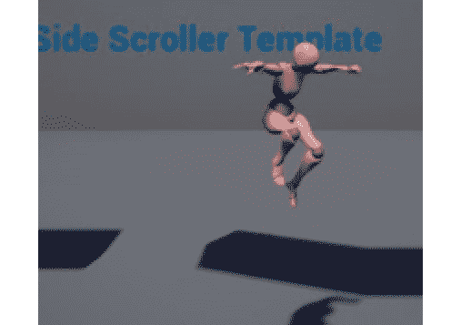

图 11.55:具有空闲、行走、冲刺和跳跃动画的玩家角色

注意

这个活动的解决方案可以在:[https://packt.live/338jEBx](https://packt.live/338jEBx)找到。

完成这个活动，你就完成了玩家角色的移动状态机。通过添加剩余的`JumpEnd`状态和`Transition Rules`以从`JumpLoop`状态转换到状态，并从`JumpEnd`状态转换回`Movement`状态，您成功地创建了您的第一个动画状态机。现在，你可以在地图上跑来跑去，跳到高架平台上，同时正确地制作动画，并在移动和跳跃状态之间转换。

# 总结

创建了玩家移动混合空间，并且玩家角色动画蓝图使用状态机从移动过渡到跳跃，您已经准备好进入下一章，您将准备所需的动画片段、动画蒙太奇，并更新仅使用角色上半身的投掷动画的动画蓝图。

从本章的练习和活动中，您学习了如何创建 1D 混合空间，该空间允许使用玩家角色的速度来控制动画的混合，从而平滑混合基于运动的动画，例如空转、行走和跑步。

此外，您还学习了如何将新的键绑定集成到项目设置中，并在 C++中绑定这些键，以启用角色游戏机制，如冲刺和投掷。

最后，您学习了如何在角色动画蓝图中实现您自己的动画状态机，以便玩家能够在运动动画之间转换，转换到跳跃的各种状态，然后再次返回运动。有了所有这些逻辑，在下一章中，让我们继续创建允许玩家角色播放投掷动画的资产和逻辑，并为敌人设置基类。**