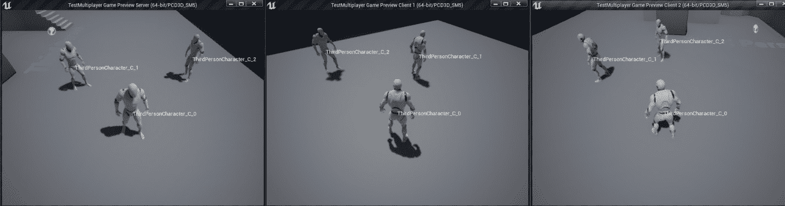
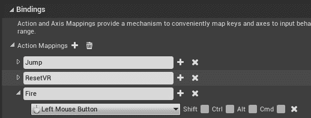
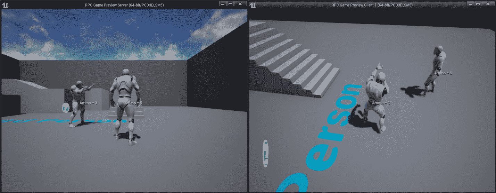
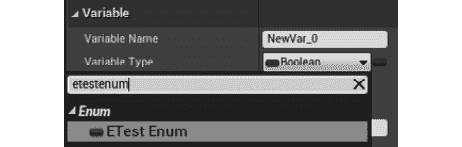
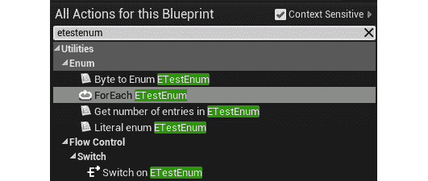
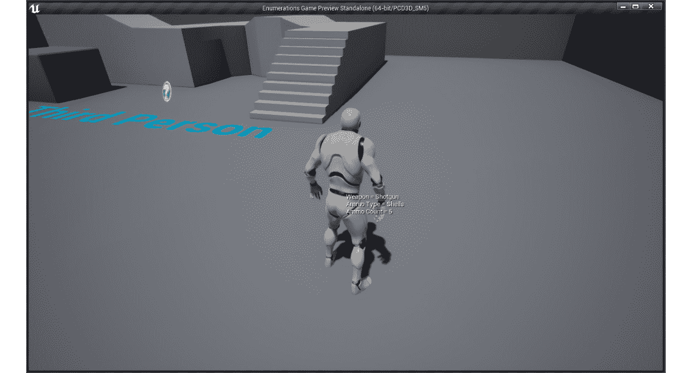
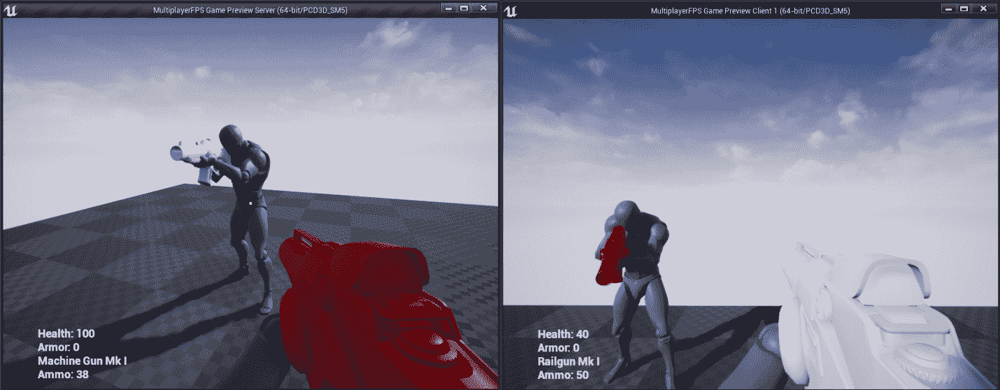

# 十七、远程过程调用

概观

在这一章中，你将被介绍到远程过程调用，这是虚幻引擎 4 的网络框架的另一个重要的多人概念。您还将学习如何在虚幻引擎 4 中使用枚举，以及如何使用双向循环数组索引，这是一种帮助您双向迭代数组并能够在超出其索引限制时循环的方法。

到本章结束时，您将了解远程过程调用是如何工作的，以使服务器和客户端在彼此上执行逻辑。您还将能够向虚幻引擎 4 编辑器公开枚举，并使用双向循环数组索引在数组之间循环。

# 简介

在前一章中，我们介绍了一些重要的多人游戏概念，包括服务器-客户端体系结构、连接和所有权、角色和变量复制。我们还看到了与专用服务器相比，监听服务器的安装速度更快，但重量却没有那么轻。我们用这些知识创造了一个基本的第一人称射击游戏角色，可以行走、跳跃和环顾四周。

在本章中，我们将介绍**远程过程调用** ( **RPC** s)，这是另一个重要的多人游戏概念，允许服务器在客户端上执行功能，反之亦然。到目前为止，我们已经了解到变量复制是服务器和客户端之间的一种通信形式，但这还不够，因为服务器可能需要在客户端上执行特定的逻辑，而不涉及更新变量值。客户端还需要一种方法来告诉服务器它的意图，这样服务器就可以验证该操作，并让其他客户端知道它。这将确保多人游戏世界是同步的，我们将在本章中更详细地探讨这一点。我们还将介绍如何在虚幻引擎 4 中使用枚举，以及双向循环数组索引，这有助于您双向迭代数组，并在超出其索引限制时循环。

在第一个主题中，我们将研究远程过程控制。

# 远程过程调用

我们已经在*第 16 章*、*多人游戏基础知识*中介绍了变量复制，虽然这是一个非常有用的特性，但由于两个主要原因，它在允许在远程机器(客户端到服务器或服务器到客户端)中执行自定义代码方面有点受限:

*   第一个是变量复制严格来说是一种服务器到客户端的通信形式，因此客户端没有办法使用变量复制来告诉服务器通过更改变量值来执行一些自定义逻辑。
*   第二个原因是变量复制，顾名思义，是由变量的值驱动的，所以即使变量复制允许客户端到服务器的通信，也需要您在客户端更改一个变量的值来触发服务器上的一个`RepNotify`功能来运行定制逻辑，这不是很实用。

为了解决这个问题，虚幻引擎 4 支持 RPC。RPC 就像一个可以定义和调用的普通函数一样工作，但是它不是在本地执行，而是在远程机器上执行。使用 RPC 的主要目标是有可能在远程机器上执行特定的逻辑，而不是直接绑定到变量。为了能够使用 RPC，请确保在已打开复制的参与者中定义它们。

RPC 有三种类型，每种类型都有不同的用途:

*   服务器 RPC
*   多播 RPC
*   客户端 RPC

让我们详细介绍这三种类型，并解释何时应该使用它们:

## 服务器 RPC

每次希望服务器在定义了 RPC 的参与者上运行函数时，都要使用服务器 RPC。有两个主要原因让您想要这样做:

*   第一个是出于安全考虑，因为在制作多人游戏，尤其是竞技类游戏时，你总是要假设客户端会试图作弊。确保没有作弊的方法是强制客户端在服务器上执行对游戏性至关重要的功能。
*   第二个原因是同步性，因为关键的游戏逻辑只在服务器上执行，这意味着重要的变量只在那里被改变，这将触发变量复制逻辑在客户端改变时更新它们。

这方面的一个例子是当客户的角色试图发射武器时。因为客户总是有可能试图欺骗，所以你不能只在本地执行火力武器逻辑。正确的方法是让客户端调用服务器 RPC，服务器 RPC 告诉服务器通过确保角色有足够的弹药和武器装备来验证`Fire`动作，等等。如果一切正常，那么它将扣除弹药变量，最后，它将执行一个多播 RPC ( *将在下一个 RPC 类型*中介绍)，该类型将告诉所有客户端在该角色上播放火灾动画。

### 申报

要声明服务器 RPC，可以在`UFUNCTION`宏上使用`Server`说明符。请看下面的例子:

```cpp
UFUNCTION(Server, Reliable, WithValidation)
void ServerRPCFunction(int32 IntegerParameter, float FloatParameter,   AActor* ActorParameter); 
```

在前面的代码中，`UFUNCTION`宏使用了`Server`说明符来声明该函数是一个服务器 RPC。您可以像普通函数一样在服务器 RPC 上拥有参数，但是有一些注意事项将在本主题后面解释，以及`Reliable`和`WithValidation`说明符的用途。

### 执行

要执行服务器 RPC，可以从定义它的参与者实例上的客户端调用它。看看下面的例子:

```cpp
void ARPCTest::CallMyOwnServerRPC(int32 IntegerParameter)
{
  ServerMyOwnRPC(IntegerParameter);
}
void ARPCTest::CallServerRPCOfAnotherActor(AAnotherActor* OtherActor)
{
  if(OtherActor != nullptr)
  {
    OtherActor->ServerAnotherActorRPC();
  }
}
```

第一个代码片段实现了`CallMyOwnServerRPC`函数，该函数使用整数参数调用在自己的`ARPCTest`类中定义的`ServerMyOwnRPC` RPC 函数。这将在该参与者实例的服务器版本上执行`ServerMyOwnRPC`函数的实现。

第二个代码片段实现了`CallServerRPCOfAnotherActor`函数，该函数在`OtherActor`实例上调用`AAnotherActor`中定义的`ServerAnotherActorRPC` RPC 函数，只要它有效。这将在服务器版本的`OtherActor`实例上执行`ServerAnotherActorRPC`功能的实现。

### 有效连接

从客户端调用服务器 RPC 时需要考虑的一件重要事情是，定义它的参与者需要有一个有效的连接。如果您试图在没有有效连接的参与者上调用服务器 RPC，那么什么也不会发生。您必须确保该参与者或者是一个玩家控制器，或者是被一个玩家控制器所拥有(如果适用的话，*)，或者是其拥有的参与者具有有效的连接。*

 *## 组播 RPC

当您希望服务器告诉所有客户端在定义了 RPC 的参与者上运行一个函数时，可以使用多播 RPC。

这方面的一个例子是当客户的角色试图发射武器时。在客户端调用服务器 RPC 请求发射武器的许可，并且服务器已经处理了该请求(所有验证都已检查完毕，弹药已扣除，并且线轨迹/射弹已处理完毕)之后，我们需要进行多播 RPC，以便该特定角色的所有实例都播放发射动画。这将确保角色将始终播放消防动画，而与哪个客户端正在查看角色无关。

### 申报

要声明多播 RPC，您需要在`UFUNCTION`宏上使用`NetMulticast`说明符。请看下面的例子:

```cpp
UFUNCTION(NetMulticast)
void MulticastRPCFunction(int32 IntegerParameter, float   FloatParameter, AActor* ActorParameter); 
```

在前面的代码中，`UFUNCTION`宏使用了`NetMulticast`说明符，表示下面的函数是一个多播 RPC。您可以像普通函数一样在多播 RPC 上设置参数，但与服务器 RPC 有相同的注意事项。

### 执行

要执行多播 RPC，需要从定义它的参与者实例上的服务器调用它。看看下面的例子:

```cpp
void ARPCTest::CallMyOwnMulticastRPC(int32 IntegerParameter)
{
  MulticastMyOwnRPC(IntegerParameter);
}
void ARPCTest::CallMulticastRPCOfAnotherActor(AAnotherActor*   OtherActor)
{
  if(OtherActor != nullptr)
  {
    OtherActor->MulticastAnotherActorRPC();
  }
}
```

第一个代码片段实现了`CallMyOwnMulticastRPC`函数，该函数使用整数参数调用在自己的`ARPCTest`类中定义的`MulticastMyOwnRPC` RPC 函数。这将在该参与者实例的所有客户端版本上执行`MulticastMyOwnRPC`功能的实现。

第二个代码片段实现了`CallMulticastRPCOfAnotherActor`函数，该函数在`OtherActor`实例上调用`AAnotherActor`中定义的`MulticastAnotherActorRPC` RPC 函数，只要它有效。这将在所有客户端版本的`OtherActor`实例上执行`MulticastAnotherActorRPC`功能的实现。

## 客户端 RPC

当您只想在定义了客户端 RPC 的执行元的所属客户端上运行函数时，可以使用客户端 RPC。要设置所属客户端，您需要在服务器上调用“设置所有者”，并使用客户端的播放器控制器进行设置。

这方面的一个例子是，当一个角色被炮弹击中时，他会发出痛苦的声音，只有客户才能听到。通过从服务器调用客户端 RPC，声音将只在拥有的客户端上播放，因此其他客户端听不到。

### 申报

要声明客户端 RPC，您需要在`UFUNCTION`宏上使用`Client`说明符。请看下面的例子:

```cpp
UFUNCTION(Client)
void ClientRPCFunction(int32 IntegerParameter, float FloatParameter,   AActor* ActorParameter); 
```

在前面的代码中，`UFUNCTION`宏使用了`Client`说明符，表示下面的函数是一个客户端 RPC。您可以像普通函数一样在客户端 RPC 上设置参数，但要注意与服务器 RPC 和多播 RPC 相同的事项。

### 执行

要执行客户端 RPC，您可以从定义它的执行元实例上的服务器调用它。看看下面的例子:

```cpp
void ARPCTest::CallMyOwnClientRPC(int32 IntegerParameter)
{
  ClientMyOwnRPC(IntegerParameter);
}
void ARPCTest::CallClientRPCOfAnotherActor(AAnotherActor* OtherActor)
{
  if(OtherActor != nullptr)
  {
    OtherActor->ClientAnotherActorRPC();
  }
}
```

第一个代码片段实现了`CallMyOwnClientRPC`函数，该函数使用整数参数调用在自己的`ARPCTest`类中定义的`ClientMyOwnRPC` RPC 函数。这将在该参与者实例的所属客户端版本上执行`ClientMyOwnRPC`功能的实现。

第二个代码片段实现了`CallClientRPCOfAnotherActor`函数，该函数在`OtherActor`实例上调用`AAnotherActor`中定义的`ClientAnotherActorRPC` RPC 函数，只要它有效。这将在拥有客户端版本的`OtherActor`实例上执行`ClientAnotherActorRPC`功能的实现。

## 使用 RPC 时的重要注意事项

RPC 非常有用，但是在使用它们时，您需要考虑一些事情，例如:

**实施**

RPC 的实现与典型函数的实现略有不同。不要像平时那样实现函数，应该只实现它的`_Implementation`版本，即使没有在头文件中声明。请看下面的例子:

**服务器 RPC:**

```cpp
void ARPCTest::ServerRPCTest_Implementation(int32 IntegerParameter,   float FloatParameter, AActor* ActorParameter)
{
}
```

在前面的代码片段中，我们实现了`ServerRPCTest`函数的`_Implementation`版本，它使用了三个参数。

**组播 RPC:**

```cpp
void ARPCTest::MulticastRPCTest_Implementation(int32 IntegerParameter,   float FloatParameter, AActor* ActorParameter)
{
}
```

在前面的代码片段中，我们实现了`MulticastRPCTest`函数的`_Implementation`版本，它使用了三个参数。

**客户端 RPC:**

```cpp
void ARPCTest::ClientRPCTest_Implementation(int32 IntegerParameter,   float FloatParameter, AActor* ActorParameter)
{
}
```

在前面的代码片段中，我们实现了`ClientRPCTest`函数的`_Implementation`版本，它使用了三个参数。

从前面的例子中可以看出，与您正在实现的 RPC 的类型无关，您应该只实现函数的`_Implementation`版本，而不是普通版本，如下面的代码片段所示:

```cpp
void ARPCTest::ServerRPCFunction(int32 IntegerParameter, float   FloatParameter, AActor* ActorParameter)
{
}
```

在前面的代码中，我们定义了`ServerRPCFunction`的正常实现。如果您像这样实现 RPC，您会得到一个错误，说它已经实现了。这样做的原因是，当你在头文件中声明 RPC 函数时，虚幻引擎 4 会自动在内部创建正常的实现，稍后会调用`_Implementation`版本。如果创建普通实现的版本，构建将会失败，因为它会找到同一个函数的两个实现。要解决这个问题，只需确保只实现 RPC 的`_Implementation`版本。

接下来，我们转到名称前缀。

**名称前缀**

在虚幻引擎 4 中，最好在 RPC 前面加上相应的类型。请看下面的例子:

*   一个叫 RPCFunction 的**服务器 RPC** 应该叫`ServerRPCFunction`。
*   一个叫做 RPCFunction 的**组播 RPC** 应该命名为`MulticastRPCFunction`。
*   一个名为的**客户端 RPC 应该命名为`ClientRPCFunction`。**

**返回值**

因为 RPC 的调用和执行通常是在不同的机器上完成的，所以您不能有返回值，所以它总是需要是空的。

**覆盖**

您可以通过在子类中声明和实现`_Implementation`函数而不使用`UFUNCTION`宏来覆盖 RPC 的实现，以扩展或绕过父类的功能。这里有一个例子:

父类的声明:

```cpp
UFUNCTION(Server)
void ServerRPCTest(int32 IntegerParameter); 
```

在前面的代码片段中，我们有`ServerRPCTest`函数父类的声明，它使用一个整数参数。

子类上的重写声明:

```cpp
virtual void ServerRPCTest_Implementation(int32 IntegerParameter)   override;
```

在前面的代码片段中，我们覆盖了子类头文件中`ServerRPCTest_Implementation`函数的声明。该函数的实现就像任何其他覆盖一样，如果您仍然想执行父功能，可以调用`Super::ServerRPCTest_Implementation`。

**支持的参数类型**

使用 RPC 时，您可以像添加任何其他函数一样添加参数。目前支持最常见的类型，包括`bool`、`int32`、`float`、`FString`、`FName`、`TArray`、`TSet`、`TMap`。你要注意的类型是任何`UObject`类或子类的指针，尤其是演员。

如果你用一个 actor 参数创建一个 RPC，那么这个 actor 也需要存在于远程机器上，否则就是`nullptr`。另一个需要考虑的重要事项是，每个版本的参与者的实例名称可能不同。这意味着，如果您使用 actor 参数调用一个 RPC，那么调用 RPC 时该 actor 的实例名可能与在远程计算机上执行 RPC 时的实例名不同。这里有一个例子可以帮助你理解这一点:



图 17.1:监听服务器和两个客户端正在运行

在前面的示例中，您可以看到三个客户端正在运行(其中一个是监听服务器)，并且每个窗口都显示所有字符实例的名称。如果您查看 Client 1 窗口，其受控字符实例称为`ThirdPersonCharacter_C_0`，但在 Server 窗口中，该等效字符称为`ThirdPersonCharacter_C_1`。这意味着，如果客户端 1 调用服务器 RPC 并将其`ThirdPersonCharacter_C_0`作为参数传递，那么当 RPC 在服务器上执行时，参数将是`ThirdPersonCharacter_C_1`，这是该机器中等效字符的实例名。

**在目标机器上执行远程过程控制**

您可以直接在其目标机器上调用 RPC，它仍然会执行。换句话说，您可以在服务器上调用服务器 RPC 并执行，也可以在客户端上调用多播/客户端 RPC，但在这种情况下，它将只在调用 RPC 的客户端上执行逻辑。无论哪种方式，在这些情况下，你都应该直接调用`_Implementation`版本，这样执行逻辑会更快。

这样做的原因是`_Implementation`版本只是保存要执行的逻辑，没有常规调用那样的通过网络创建和发送 RPC 请求的开销。

看看下面这个在服务器上拥有权限的参与者的例子:

```cpp
void ARPCTest::CallServerRPC(int32 IntegerParameter)
{
  if(HasAuthority())
  {
    ServerRPCFunction_Implementation(IntegerParameter);
  }
  else ServerRPCFunction(IntegerParameter);
}
```

在前面的例子中，您有`CallServerRPC`函数，它以两种不同的方式调用`ServerRPCFunction`。如果演员已经在服务器上，那么它调用`ServerRPCFunction_Implementation`，这将跳过前面提到的开销。

如果参与者不在服务器上，则使用`ServerRPCFunction`执行常规调用，这增加了创建和通过网络发送 RPC 请求所需的开销。

**验证**

当您定义一个 RPC 时，您可以选择使用一个额外的函数来检查在调用 RPC 之前是否有任何无效的输入。这是为了避免在输入由于欺骗或其他原因无效时处理 RPC。

要使用验证，您需要在`UFUNCTION`宏中添加`WithValidation`说明符。当您使用该说明符时，您将被迫实现该函数的`_Validate`版本，这将返回一个布尔值，说明 RPC 是否可以执行。

请看下面的例子:

```cpp
UFUNCTION(Server, WithValidation)
void ServerSetHealth(float NewHealth);
```

在前面的代码中，我们已经声明了一个名为`ServerSetHealth`的经过验证的服务器 RPC，它为`Health`的新值取了一个浮点参数。至于实现，如下所示:

```cpp
bool ARPCTest::ServerSetHealth_Validate(float NewHealth)
{
  return NewHealth <= MaxHealth;
}
void ARPCTest::ServerSetHealth_Implementation(float NewHealth)
{
  Health = NewHealth;
}
```

在前面的代码中，我们实现了`_Validate`功能，它将检查新的健康是否小于或等于健康的最大值。如果客户端试图用`200`黑调用`ServerSetHealth`，而`MaxHealth`是`100`，那么 RPC 不会被调用，这就阻止了客户端用某个范围之外的值来改变健康。如果`_Validate`功能返回`true`，则照常调用`_Implementation`功能，用`NewHealth`的值设置`Health`。

**可靠性**

当您声明一个 RPC 时，您需要使用`UFUNCTION`宏中的`Reliable`或`Unreliable`说明符。下面简单介绍一下他们的工作:

*   `Reliable`:当您想要确保 RPC 被执行时使用，通过重复请求直到远程机器确认它的接收。这应该只用于非常重要的 RPC，例如执行关键的游戏逻辑。下面是一个如何使用它的例子:

    ```cpp
    UFUNCTION(Server, Reliable)
    void ServerReliableRPCFunction(int32 IntegerParameter); 
    ```

*   `Unreliable`: Used when you don't care whether the RPC is executed due to bad network conditions, such as playing a sound or spawning a particle effect. This should only be used for RPCs that aren't very important or are called very frequently to update values, since it wouldn't matter if one call missed because it's updating very often. Here is an example of how to use it:

    ```cpp
    UFUNCTION(Server, Unreliable)
    void ServerUnreliableRPCFunction(int32 IntegerParameter);
    ```

    注意

    关于 RPC 的更多信息，请访问[https://docs . unrealengine . com/en-US/game play/Networking/Actors/RPC/index . html](https://docs.unrealengine.com/en-US/Gameplay/Networking/Actors/RPCs/index.html)。

在下一个练习中，您将看到如何实现不同类型的 RPC。

## 练习 17.01:使用远程过程调用

在本练习中，我们将创建一个使用`Third Person`模板的 C++ 项目，并以以下方式对其进行扩展:

*   添加一个 fire timer 变量，防止客户端在 fire 动画期间滥发 fire 按钮。
*   添加一个新的默认为`5`的弹药整数变量，并复制到所有客户端。
*   添加一个`Fire Anim montage`，当服务器告诉客户端该镜头有效时播放。
*   添加一个`No Ammo Sound`，当服务器告诉客户端他们没有足够的弹药时会播放。
*   每次玩家按下*鼠标左键*，客户端都会执行一个可靠且经过验证的服务器 RPC，检查角色是否有足够的弹药。如果是这样，它将从弹药变量中减去 1，并调用一个不可靠的多播 RPC，在每个客户端播放火灾动画。如果它没有弹药，那么它将执行一个不可靠的客户端 RPC，该 RPC 将播放只有拥有客户端才能听到的`No Ammo Sound`。

以下步骤将帮助您完成练习:

1.  使用名为`RPC`的`C++ `创建一个新的`Third Person`模板项目，并将其保存到您选择的位置。
2.  一旦创建了项目，它就应该打开编辑器和 Visual Studio 解决方案。
3.  关闭编辑器并返回到 Visual Studio。
4.  打开`RPCCharacter.h`文件，包括`UnrealNetwork.h`头文件，该文件有我们将要使用的`DOREPLIFETIME_CONDITION`宏的定义:

    ```cpp
    #include "Net/UnrealNetwork.h"
    ```

5.  声明受保护的计时器变量，以防止客户端滥发`Fire`动作:

    ```cpp
    FTimerHandle FireTimer;
    ```

6.  声明受保护的复制弹药变量，以`5`射击开始:

    ```cpp
    UPROPERTY(Replicated)
    int32 Ammo = 5;
    ```

7.  接下来，声明角色触发时将播放的受保护动画蒙太奇变量:

    ```cpp
    UPROPERTY(EditDefaultsOnly, Category = "RPC Character")
    UAnimMontage* FireAnimMontage;
    ```

8.  声明当角色没有弹药时将播放的受保护声音变量:

    ```cpp
    UPROPERTY(EditDefaultsOnly, Category = "RPC Character")
    USoundBase* NoAmmoSound;
    ```

9.  超越`Tick`功能:

    ```cpp
    virtual void Tick(float DeltaSeconds) override;
    ```

10.  声明将处理按下*鼠标左键* :

    ```cpp
    void OnPressedFire();
    ```

    的输入功能
11.  宣布可靠且经过验证的服务器 RPC 启动:

    ```cpp
    UFUNCTION(Server, Reliable, WithValidation, Category = "RPC   Character")
    void ServerFire();
    ```

12.  声明不可靠的多播 RPC 将在所有客户端上播放火灾动画:

    ```cpp
    UFUNCTION(NetMulticast, Unreliable, Category = "RPC Character")
    void MulticastFire();
    ```

13.  声明不可靠的客户端 RPC 将只在拥有的客户端播放声音:

    ```cpp
    UFUNCTION(Client, Unreliable, Category = "RPC Character")
    void ClientPlaySound2D(USoundBase* Sound);
    ```

14.  现在，打开`RPCCharacter.cpp`文件，包括`DrawDebugHelpers.h`、`GameplayStatics.h`、`TimerManager.h`和【T4:

    ```cpp
    #include "DrawDebugHelpers.h"
    #include "Kismet/GameplayStatics.h"
    #include "TimerManager.h"
    #include "Engine/World.h"
    ```

15.  在构造器结束时，启用`Tick`功能:

    ```cpp
    PrimaryActorTick.bCanEverTick = true;
    ```

16.  实现`GetLifetimeReplicatedProps`功能，以便`Ammo`变量将复制到所有客户端:

    ```cpp
    void ARPCCharacter::GetLifetimeReplicatedProps(TArray<   FLifetimeProperty >& OutLifetimeProps) const
    {
      Super::GetLifetimeReplicatedProps(OutLifetimeProps);
      DOREPLIFETIME(ARPCCharacter, Ammo);
    }
    ```

17.  接下来，执行`Tick`功能，显示`Ammo`变量的值:

    ```cpp
    void ARPCCharacter::Tick(float DeltaSeconds)
    {
      Super::Tick(DeltaSeconds);
      const FString AmmoString = FString::Printf(TEXT("Ammo = %d"),     Ammo);
      DrawDebugString(GetWorld(), GetActorLocation(), AmmoString,     nullptr, FColor::White, 0.0f, true);
    }
    ```

18.  在`SetupPlayerInputController`功能结束时，将`Fire`动作绑定到`OnPressedFire`功能:

    ```cpp
    PlayerInputComponent->BindAction("Fire", IE_Pressed, this,   &ARPCCharacter::OnPressedFire);
    ```

19.  实现处理*鼠标左键*按下的功能，调用消防服务器 RPC:

    ```cpp
    void ARPCCharacter::OnPressedFire()
    {
      ServerFire();
    }
    ```

20.  实现消防服务器 RPC 验证功能:

    ```cpp
    bool ARPCCharacter::ServerFire_Validate()
    {
      return true;
    }
    ```

21.  实现消防服务器 RPC 实现功能:

    ```cpp
    void ARPCCharacter::ServerFire_Implementation()
    {

    }
    ```

22.  现在，如果自从我们发射最后一发子弹以来，射击计时器仍然有效，则添加逻辑以中止该功能:

    ```cpp
    if (GetWorldTimerManager().IsTimerActive(FireTimer))
    {
      return;
    }
    ```

23.  检查角色是否有弹药。如果没有，则只在控制角色的客户端播放`NoAmmoSound`，并中止功能:

    ```cpp
    if (Ammo == 0)
    {
      ClientPlaySound2D(NoAmmoSound);
      return;
    }
    ```

24.  扣除弹药并安排`FireTimer`变量，防止在播放火力动画时滥发此功能:

    ```cpp
    Ammo--;
    GetWorldTimerManager().SetTimer(FireTimer, 1.5f, false);
    ```

25.  调用火组播 RPC，让所有客户端播放火动画:

    ```cpp
    MulticastFire();
    ```

26.  实现火组播 RPC，会播放火动画蒙太奇:

    ```cpp
    void ARPCCharacter::MulticastFire_Implementation()
    {
      if (FireAnimMontage != nullptr)
      {
        PlayAnimMontage(FireAnimMontage);
      }
    }
    ```

27.  Implement the Client RPC that plays a 2D sound:

    ```cpp
    void ARPCCharacter::ClientPlaySound2D_Implementation(USoundBase*   Sound)
    {
      UGameplayStatics::PlaySound2D(GetWorld(), Sound);
    }
    ```

    最后，您可以在编辑器中启动项目。

28.  编译代码，等待编辑器完全加载。
29.  Go to `Project Settings`, go to `Engine`, then `Input`, and add the `Fire` action binding:

    

    图 17.2:添加新的 Fire 动作绑定

30.  关闭`Project Settings`。
31.  在`Content Browser`中，转到`Content\Mannequin\Animations`文件夹。
32.  Click the `Import` button, go to the `Exercise17.01\Assets` folder and import the `ThirdPersonFire.fbx` file, and then make sure it's using the `UE4_Mannequin_Skeleton` skeleton.

    注意

    前面提到的`Assets`文件夹可以在我们位于[https://packt.live/36pEvAT](https://packt.live/36pEvAT)的 GitHub 存储库中找到。

33.  打开新动画，在细节上，面板找到`Enable Root Motion`选项并将其设置为真。这将防止角色在播放动画时移动。
34.  保存并关闭`ThirdPersonFire`。
35.  *右键单击`Content Browser`上的* `ThirdPersonFire`，选择`Create -> AnimMontage`。
36.  将`AnimMontage`重命名为`ThirdPersonFire_Montage`。
37.  The `Animations` folder should look like this:

    

    图 17.3:人体模型的动画文件夹

38.  打开`ThirdPerson_AnimBP`再打开`AnimGraph`。
39.  *Right-click* on an empty part of the graph, add a `DefaultSlot` node (to be able to play the animation montage), and connect it between `State Machine` and `Output Pose`. You should get the following output:

    

    图 17.4:角色的动画

40.  保存并关闭`ThirdPerson_AnimBP`。
41.  在`Content Browser`中，转到`Content`文件夹，新建一个名为`Audio`的文件夹，并将其打开。
42.  点击`Import`按钮，进入`Exercise17.01\Assets`文件夹，导入`noammo.wav`，保存。
43.  转到`Content\ThirdPersonCPP\Blueprints`打开`ThirdPersonCharacter`蓝图。
44.  在类默认中，设置`No Ammo Sound`使用`noammo`，设置`Fire Anim Montage`使用`ThirdPersonFire_Montage`。
45.  保存并关闭`ThirdPersonCharacter`。
46.  进入多人选项，将客户端数量设置为`2`。
47.  Set the window size to 800x600 and play using PIE.

    您应该会得到以下输出:

    

图 17.5:练习的最终结果

完成这个练习，就可以在每个客户端上玩了，每次按下*鼠标左键*，客户端的角色就会播放`Fire Anim`蒙太奇，所有客户端都能看到，其弹药也会减少`1`。如果你试图在弹药是`0`的时候开火，那个客户端会听到`No Ammo Sound`而不会做开火动画，因为服务器没有调用组播 RPC。如果你尝试垃圾邮件的消防按钮，你会注意到，它只会触发一个新的消防一旦动画完成。

在下一节中，我们将研究枚举，枚举在游戏开发中用于许多不同的事情，例如管理角色的状态(无论是空闲、行走、攻击还是死亡等)，或者为装备槽数组中的每个索引(头部、主要武器、次要武器、躯干、手、腰带、裤子等)分配一个人性化的名称。

# 枚举

枚举是一种用户定义的数据类型，它包含一个整数常量列表，其中每个项都有一个由您分配的人性化名称，这使得代码更容易阅读。举个例子，我们可以用一个整数变量来表示一个角色可以处于的不同状态–`0`表示它是空闲的，`1`表示它正在行走，等等。这种方法的问题是，当你开始编写像`if(State == 0)`这样的代码时，你会变得很难记住`0`是什么意思，尤其是如果你有很多状态，而没有使用一些文档或注释来帮助你记忆。要解决这个问题，您应该使用枚举，在那里您可以编写像`if(State == EState::Idle)`这样的代码，这要明确得多，也更容易理解。

在 C++ 中，有两种枚举类型，旧的原始枚举和 C++ 11 中引入的新枚举类。如果您想在编辑器中使用 C++ 枚举，您的第一直觉可能是以典型的方式来做，这是通过声明一个变量或一个使用枚举作为参数的函数，分别带有`UPROPERTY`或`UFUNCTION`。

问题是，如果你尝试这样做，你会得到一个编译错误。看看下面的例子:

```cpp
enum class ETestEnum : uint8
{
  EnumValue1,
  EnumValue2,
  EnumValue3
};
```

在前面的代码片段中，我们声明了一个名为`ETestEnum`的枚举类，它有三个可能的值:`EnumValue1`、`EnumValue2`和`EnumValue3`。

之后，尝试以下任一示例:

```cpp
UPROPERTY()
ETestEnum TestEnum;
UFUNCTION()
void SetTestEnum(ETestEnum NewTestEnum) { TestEnum = NewTestEnum; }
```

在前面的代码片段中，我们声明了一个`UPROPERTY`变量和`UFUNCTION`函数，它们在类中使用了`ETestEnum`枚举。如果您尝试编译，您将获得以下编译错误:

```cpp
error : Unrecognized type 'ETestEnum' - type must be a UCLASS, USTRUCT   or UENUM
```

注意

在虚幻引擎 4 中，最好在枚举名称前加上字母`E`。例如`EWeaponType`和`EAmmoType`。

发生此错误是因为当您试图使用`UPROPERTY`或`UFUNCTION`宏向编辑器公开类、结构或枚举时，您需要分别使用`UCLASS`、`USTRUCT`和`UENUM`宏将其添加到虚幻引擎 4 反射系统中。

注意

您可以通过访问以下链接了解更多关于虚幻引擎 4 反射系统的信息:[https://www . un realengine . com/en-US/blog/虚幻-property-system-reflection](https://www.unrealengine.com/en-US/blog/unreal-property-system-reflection) 。

记住这些知识，修复之前的错误很简单，所以只需执行以下操作:

```cpp
UENUM()
enum class ETestEnum : uint8
{
  EnumValue1,
  EnumValue2,
  EnumValue3
};
```

在下一节中，我们将看看`TEnumAsByte`类型。

## 保留字节

如果您想要向使用原始枚举的引擎公开一个变量，那么您需要使用`TEnumAsByte`类型。如果您使用原始枚举(而不是枚举类)声明一个`UPROPERTY`变量，您将得到一个编译错误。

请看下面的例子:

```cpp
UENUM()
enum ETestRawEnum
{
  EnumValue1,
  EnumValue2,
  EnumValue3
};
```

如果使用`ETestRawEnum`声明`UPROPERTY`变量，如下所示:

```cpp
UPROPERTY()
ETestRawEnum TestRawEnum;
```

您会得到这个编译错误:

```cpp
error : You cannot use the raw enum name as a type for member   variables, instead use TEnumAsByte or a C++ 11 enum class with an   explicit underlying type.
```

要修复此错误，您需要用`TEnumAsByte<>`包围变量的枚举类型，在本例中为`ETestRawEnum`，如下所示:

```cpp
UPROPERTY()
TEnumAsByte<ETestRawEnum> TestRawEnum;
```

## 插入

当您使用`UENUM`宏向虚幻引擎反射系统添加枚举时，这将允许您对枚举的每个值使用`UMETA`宏。`UMETA`宏，就像其他宏如`UPROPERTY`或`UFUNCTION`一样，可以使用说明符通知虚幻引擎 4 如何处理该值。以下是最常用的`UMETA`说明符列表:

### 显示名称

此说明符允许您为枚举值定义一个新名称，当枚举值显示在编辑器中时，该名称更容易读取。

看看下面的例子:

```cpp
UENUM()
enum class ETestEnum : uint8
{
  EnumValue1 UMETA(DisplayName = "My First Option",
  EnumValue2 UMETA(DisplayName = "My Second Option",
  EnumValue3 UMETA(DisplayName = "My Third Option"
};
```

让我们声明以下变量:

```cpp
UPROPERTY(EditDefaultsOnly, BlueprintReadOnly, Category = "Test")
ETestEnum TestEnum;
```

然后，当你打开编辑器查看`TestEnum`变量时，你会看到一个下拉列表，其中`EnumValue1`、`EnumValue2,`和`EnumValue3`分别被`My First Option`、`My Second Option,`和`My Third Option`替换。

### 隐藏

此说明符允许您从下拉列表中隐藏特定的枚举值。当有一个枚举值，您只想在 C++ 中使用，而不想在编辑器中使用时，通常会使用这个枚举值。

看看下面的例子:

```cpp
UENUM()
enum class ETestEnum : uint8
{
  EnumValue1 UMETA(DisplayName = "My First Option"),
  EnumValue2 UMETA(Hidden),
  EnumValue3 UMETA(DisplayName = "My Third Option")
};
```

让我们声明以下变量:

```cpp
UPROPERTY(EditDefaultsOnly, BlueprintReadOnly, Category = "Test")
ETestEnum TestEnum;
```

然后，当你打开编辑器，查看`TestEnum`变量时，你会看到一个下拉列表。您应该注意到`My Second Option`没有出现在下拉列表中，因此无法选择。

注意

有关所有 UMETA 说明符的更多信息，请访问[https://docs . unrealengine . com/en-US/Programming/unrealararchitecture/Reference/Metadata/# enummetadata 说明符](https://docs.unrealengine.com/en-US/Programming/UnrealArchitecture/Reference/Metadata/#enummetadataspecifiers)。

在下一节中，我们将查看`UENUM`宏的`BlueprintType`说明符。

## 蓝色打印类型

该`UENUM`说明符将枚举暴露给蓝图。这意味着在下拉列表中会有一个该枚举的条目，在为函数创建新变量或输入/输出时使用，如下例所示:



图 17.6:设置一个变量来使用 ETestEnum 变量类型。

它还将显示您可以在编辑器中的枚举上调用的其他函数，如本例所示:



图 17.7:使用 BlueprintType 时可用的附加功能列表

### 最大

使用枚举时，通常想知道它有多少值。在虚幻引擎 4 中，标准的做法是添加`MAX`作为最后一个值，这个值会自动隐藏在编辑器中。

看看下面的例子:

```cpp
UENUM()
enum class ETestEnum : uint8
{
  EnumValue1,
  EnumValue2,
  EnumValue3,
  MAX
};
```

如果想知道`ETestEnum`在 C++ 中有多少个值，只需要做以下几个即可:

```cpp
const int32 MaxCount = (int32)ETestEnum::MAX;
```

这是因为 C++ 中的枚举内部存储为数字，其中第一个值是`0`，第二个值是`1`，依此类推。这意味着只要`MAX`是最后一个值，它就会一直有枚举中值的总数。需要考虑的重要一点是，为了让`MAX`给你正确的值，你不能改变枚举的内部编号顺序，比如:

```cpp
UENUM()
enum class ETestEnum : uint8
{
  EnumValue1 = 4,
  EnumValue2 = 78,
  EnumValue3 = 100,
  MAX
};
```

在这种情况下，`MAX`将是`101`，因为它将使用紧挨着前一个值的数字，即`EnumValue3 = 100`。

使用`MAX`只意味着在 C++ 中使用，而不是在编辑器中使用，因为`MAX`值隐藏在蓝图中，如前所述。要获取蓝图中枚举的条目数，您应该在`UENUM`宏中使用`BlueprintType`说明符，以便在上下文菜单中公开一些有用的功能。之后，您只需要在上下文菜单中键入枚举的名称。如果选择`Get number of entries in ETestEnum`选项，您将拥有一个返回枚举条目数的函数。

在下一个练习中，您将在虚幻引擎 4 编辑器中使用 C++ 枚举。

## 练习 17.02:在虚幻引擎 4 编辑器中使用 C++ 枚举

在本练习中，我们将创建一个使用`Third Person`模板的新 C++ 项目，并添加以下内容:

*   一种叫做`EWeaponType`的计数，包含`3`武器——手枪、猎枪和火箭发射器。
*   一个名为`EAmmoType`的枚举，包含`3`种弹药类型——子弹、炮弹和火箭。
*   一个名为`Weapon`的变量，使用`EWeaponType`来判断当前武器的类型。
*   一个名为`Ammo`的整数数组变量，保存每种类型的弹药量，用值`10`初始化。
*   当玩家按下 *1* 、 *2* 、 *3* 键时，会将`Weapon`分别设置为`Pistol`、`Shotgun`和`Rocket Launcher`。
*   当玩家按下*鼠标左键*时，这将消耗当前武器的弹药。
*   每调用一次`Tick`功能，角色就会显示当前武器类型以及等效弹药类型和数量。

以下步骤将帮助您完成练习:

1.  Create a new `Third Person` template project using `C++ ` called `Enumerations` and save it to a location of your choosing.

    一旦创建了项目，它就应该打开编辑器和 Visual Studio 解决方案。

2.  关闭编辑器并返回到 Visual Studio。
3.  打开`Enumerations.h`文件。
4.  创建一个名为`ENUM_TO_INT32`的宏，将枚举转换为`int32`数据类型:

    ```cpp
    #define ENUM_TO_INT32(Value) (int32)Value
    ```

5.  创建一个名为`ENUM_TO_FSTRING`的宏，该宏将获取`enum`数据类型的显示名称，并将其转换为`FString`数据类型:

    ```cpp
    #define ENUM_TO_FSTRING(Enum, Value) FindObject<UEnum>(ANY_PACKAGE, TEXT(Enum), true)-  >GetDisplayNameTextByIndex((int32)Value).ToString()
    ```

6.  申报枚举`EWeaponType``EAmmoType`:

    ```cpp
    UENUM(BlueprintType)
    enum class EWeaponType : uint8
    {
      Pistol UMETA(Display Name = «Glock 19»),
      Shotgun UMETA(Display Name = «Winchester M1897»),
      RocketLauncher UMETA(Display Name = «RPG»),    
      MAX
    };
    UENUM(BlueprintType)
    enum class EAmmoType : uint8
    {
      Bullets UMETA(DisplayName = «9mm Bullets»),
      Shells UMETA(Display Name = «12 Gauge Shotgun Shells»),
      Rockets UMETA(Display Name = «RPG Rockets»),
      MAX
    };
    ```

7.  打开`EnumerationsCharacter.h`文件，包括`Enumerations.h`标题:

    ```cpp
    #include "Enumerations.h"
    ```

8.  声明保存所选武器武器类型的受保护`Weapon`变量:

    ```cpp
    UPROPERTY(BlueprintReadOnly, Category = "Enumerations Character")
    EWeaponType Weapon;
    ```

9.  声明受保护的`Ammo`阵列，该阵列保存每种类型的弹药数量:

    ```cpp
    UPROPERTY(EditDefaultsOnly, BlueprintReadOnly, Category =   "Enumerations Character")
    TArray<int32> Ammo;
    ```

10.  声明`Begin Play`和`Tick`功能的受保护覆盖:

    ```cpp
    virtual void BeginPlay() override;
    virtual void Tick(float DeltaSeconds) override;
    ```

11.  声明受保护的输入功能:

    ```cpp
    void OnPressedPistol();
    void OnPressedShotgun();
    void OnPressedRocketLauncher();
    void OnPressedFire();
    ```

12.  打开`EnumerationsCharacter.cpp`文件，包括`DrawDebugHelpers.h`标题:

    ```cpp
    #include "DrawDebugHelpers.h"
    ```

13.  在`SetupPlayerInputController`函数的末尾绑定新的动作绑定，如下面的代码片段所示:

    ```cpp
    PlayerInputComponent->BindAction("Pistol", IE_Pressed, this,   &AEnumerationsCharacter::OnPressedPistol);
    PlayerInputComponent->BindAction("Shotgun", IE_Pressed, this,   &AEnumerationsCharacter::OnPressedShotgun);
    PlayerInputComponent->BindAction("Rocket Launcher", IE_Pressed,   this, &AEnumerationsCharacter::OnPressedRocketLauncher);
    PlayerInputComponent->BindAction("Fire", IE_Pressed, this,   &AEnumerationsCharacter::OnPressedFire);
    ```

14.  接下来，为执行父逻辑的`BeginPlay`实现覆盖，但也用`EAmmoType`枚举中的条目数初始化`Ammo`数组的大小。数组中的每个位置也将被初始化为值`10` :

    ```cpp
    void AEnumerationsCharacter::BeginPlay()
    {
      Super::BeginPlay();
      const int32 AmmoCount = ENUM_TO_INT32(EAmmoType::MAX);
      Ammo.Init(10, AmmoCount);
    }
    ```

15.  执行`Tick` :

    ```cpp
    void AEnumerationsCharacter::Tick(float DeltaSeconds)
    {
      Super::Tick(DeltaSeconds);
    }
    ```

    的覆盖
16.  将`Weapon`变量转换为`int32`，将`Weapon`变量转换为`FString` :

    ```cpp
    const int32 WeaponIndex = ENUM_TO_INT32(Weapon);
    const FString WeaponString = ENUM_TO_FSTRING("EWeaponType",   Weapon);
    ```

17.  Convert the ammo type to an `FString` and get the ammo count for the current weapon:

    ```cpp
    const FString AmmoTypeString = ENUM_TO_FSTRING("EAmmoType",   Weapon);
    const int32 AmmoCount = Ammo[WeaponIndex];
    ```

    我们使用`Weapon`来获取弹药类型字符串，因为`EAmmoType`中的条目与等效的`EWeaponType`的弹药类型相匹配。换句话说，`Pistol = 0`使用`Bullets = 0`，`Shotgun = 1`使用`Shells = 1`，`RocketLauncher = 2`使用`Rockets = 2`，所以这是一个 1 对 1 的映射，我们可以使用对我们有利的映射。

18.  在角色的位置显示当前武器的名称及其对应的弹药类型和弹药数量，如以下代码片段所示:

    ```cpp
    const FString String = FString::Printf(TEXT("Weapon = %s\nAmmo   Type = %s\nAmmo Count = %d"), *WeaponString, *AmmoTypeString,   AmmoCount);
    DrawDebugString(GetWorld(), GetActorLocation(), String, nullptr,   FColor::White, 0.0f, true);
    ```

19.  实现装备输入功能，将`Weapon`变量设置为相应的值:

    ```cpp
    void AEnumerationsCharacter::OnPressedPistol()
    {
      Weapon = EWeaponType::Pistol;
    }
    void AEnumerationsCharacter::OnPressedShotgun()
    {
      Weapon = EWeaponType::Shotgun;
    }
    void AEnumerationsCharacter::OnPressedRocketLauncher()
    {
      Weapon = EWeaponType::RocketLauncher;
    }
    ```

20.  实现火力输入功能，该功能将使用武器索引获取相应的弹药类型计数并减去`1`，只要结果值大于或等于 0:

    ```cpp
    void AEnumerationsCharacter::OnPressedFire()
    {
      const int32 WeaponIndex = ENUM_TO_INT32(Weapon);
      const int32 NewRawAmmoCount = Ammo[WeaponIndex] - 1;
      const int32 NewAmmoCount = FMath::Max(NewRawAmmoCount, 0);
      Ammo[WeaponIndex] = NewAmmoCount;
    }
    ```

21.  编译代码并运行编辑器。
22.  Go to `Project Settings` and then `Engine`, then `Input`, and add the new action `bindings`:

    

    图 17.8:添加手枪、猎枪、火箭发射器和火力绑定

23.  关闭`Project Settings`。
24.  Play in `New Editor Window (PIE)` in single-player mode (one client and dedicated server disabled):

    

图 17.9:练习的最终结果

完成本练习后，您将能够使用 *1* 、 *2* 和 *3* 键选择当前武器。你会注意到每一个勾号都会显示当前武器的类型以及对应的弹药类型和弹药数量。如果你按下开火键，这将会扣除当前武器的弹药数量，但永远不会低于`0`。

在下一节中，您将看到双向循环数组索引。

# 双向环形阵列索引

有时，当您使用数组存储信息时，您可能希望以双向循环的方式迭代它。这方面的一个例子是射手游戏中的上一个/下一个武器逻辑，其中你有一个带有武器的数组，你希望能够在特定方向上循环通过它们，当你到达第一个或最后一个索引时，你希望分别循环回到最后一个和第一个索引。此示例的典型方式如下:

```cpp
AWeapon * APlayer::GetPreviousWeapon()
{
  if(WeaponIndex - 1 < 0)
  {
    WeaponIndex = Weapons.Num() - 1;
  }
  else WeaponIndex--;
  return Weapons[WeaponIndex];
}
AWeapon * APlayer::GetNextWeapon()
{
  if(WeaponIndex + 1 > Weapons.Num() - 1)
  {
    WeaponIndex = 0;
  }
  else WeaponIndex++ ;
  return Weapons[WeaponIndex];
}
```

在前面的代码中，如果新的武器索引超出了武器阵列的限制，我们会调整武器索引以循环返回，这可能发生在两种情况下。第一种情况是玩家装备了库存的最后一件武器，并要求下一件武器。在这种情况下，它应该回到第一件武器。

第二种情况是玩家装备了库存中的第一件武器，并要求获得前一件武器。在这种情况下，它应该去最后一个武器。

虽然示例代码可以工作，但要解决这样一个微不足道的问题仍然需要大量的代码。为了改进这段代码，有一个数学公式可以帮助您在一个函数中自动考虑这两种情况。它被称为模(在 C++ 中由`%`运算符表示)，它给出了两个数字之间除法的余数。

那么我们如何使用模来进行双向循环数组索引呢？让我们用模重写前面的例子:

```cpp
AWeapon * APlayer::GetNewWeapon(int32 Direction)
{
  const int32 WeaponCount = Weapons.Num();
  const int32 NewIndex = WeaponIndex + Direction;
  const in32 ClampedNewIndex = NewIndex % WeaponCount;
  WeaponIndex = (ClampedNewIndex + WeaponCount) % WeaponCount;
  return Weapons[WeaponIndex];
}
```

这是新版本，你可以马上看出它有点难理解，但它功能更强、更紧凑。如果您不使用变量来存储每个操作的中间值，您可能可以用一两行代码来完成整个函数。

让我们分解前面的代码片段:

`const int WeaponCount = Weapons.Num()`:我们需要知道数组的大小来确定它应该回圈到`0`的索引。换句话说，如果`WeaponCount = 4`，那么数组有`0`、`1`、`2`和`3`的索引，所以这告诉我们索引 4 是应该回到`0`的截止索引。

`const int32 NewIndex = WeaponIndex + Direction`:这是新的原始索引，没有将其限制到数组的极限。`Direction`变量用于指示我们想要在数组中导航的偏移量，如果我们想要上一个索引，这是`-1`，如果我们想要下一个索引，这是`1`。

`const int32 ClampedNewIndex = NewIndex % WeaponCount`:由于模属性，这将确保`NewIndex`在`0`到`WeaponCount - 1`的区间内。

如果`Direction`总是`1`，那么`ClampedNewIndex`就足够满足我们的需求了。问题是，模运算在负值时不太好用，当`WeaponIndex`为`0``Direction`为`-1`时会出现这种情况，这会导致`NewIndex`为`-1`。为了解决这个限制，我们需要做一些额外的计算。

`WeaponIndex = (ClampedNewIndex + WeaponCount) % WeaponCount`:这将把`WeaponCount`加到`ClampedNewIndex`上使其为正，并再次应用模得到正确的箝位指数，从而解决了这个问题。

`return Weapons[WeaponIndex]`:这将武器返回到计算出的`WeaponIndex`索引位置。

让我们看一个实际的例子来帮助您想象所有这些是如何工作的:

**武器** =

*   [0]刀
*   [1]手枪
*   [2]猎枪
*   [3]火箭发射器

**WeaponCount** = `Weapons.Num() = 4`。

我们假设`WeaponIndex = 3`和`Direction = 1`。

然后:

`NewIndex` = *武器数量+方向* = 3 + 1 = 4

`ClampedIndex` = *新指数% WeaponCount* = 4 % 4 = 0

`WeaponIndex` = *(夹紧指数+武器数量)%武器数量* = (0 + 4) % 4 = 0

在这个例子中，武器索引的起始值是`3`(这是火箭发射器)，我们想要下一个武器(因为`Direction`是`1`)。执行计算，`WeaponIndex`现在将成为`0`(也就是刀)。这是我们想要的行为，因为我们有 4 个武器，所以我们循环回到这种情况下，由于`Direction`是`1`，我们可以只使用`ClampedIndex`而不做额外的计算。

让我们使用不同的值再次调试它。

我们假设`WeaponIndex = 0`和`Direction = -1`:

`NewIndex` = *武器指数+方向* = 0 + -1 = -1

`ClampedIndex` = *新指数% WeaponCount* = -1 % 4 = -1

`WeaponIndex` = *(夹紧指数+武器数量)%武器数量* = (-1 + 4) % 4 = 3

在这个例子中，武器索引的起始值是 0(也就是刀)，我们想要上一个武器(因为`Direction`是- `1`)。做计算，`WeaponIndex`现在将是 3(这是火箭发射器)。这是我们想要的行为，因为我们有 4 件武器，所以我们绕回 3 件。在这种具体情况下，`NewIndex`是负数，所以不能只用`ClampedIndex`；我们需要做额外的计算来得到正确的值。

## 练习 17.03:使用双向循环数组索引在枚举之间循环

在本练习中，我们将使用来自*练习 17.02* 、*的项目，在虚幻引擎 4 编辑器*中使用 C++ 枚举，并添加两个新的动作映射来循环武器。鼠标滚轮向上将转到上一个武器类型，鼠标滚轮向下将转到下一个武器类型。

以下步骤将帮助您完成练习:

1.  First, open the Visual Studio project from *Exercise 17.02*, *Using C++ Enumerations in the Unreal Engine 4 Editor*.

    接下来，您将更新`Enumerations.h`并添加一个宏，该宏将以非常方便的方式处理双向数组循环，如下所示。

2.  打开`Enumerations.h`并添加`GET_CIRCULAR_ARRAY_INDEX`宏，该宏将应用我们之前已经介绍过的模公式:

    ```cpp
    #define GET_CIRCULAR_ARRAY_INDEX(Index, Count) (Index % Count +   Count) % Count
    ```

3.  打开`EnumerationsCharacter.h`并声明武器循环的新输入功能:

    ```cpp
    void OnPressedPreviousWeapon();
    void OnPressedNextWeapon();
    ```

4.  声明`CycleWeapons`函数，如下代码片段所示:

    ```cpp
    void CycleWeapons(int32 Direction);
    ```

5.  打开`EnumerationsCharacter.cpp`并在`SetupPlayerInputController`功能中绑定新动作绑定:

    ```cpp
    PlayerInputComponent->BindAction("Previous Weapon", IE_Pressed,   this, &AEnumerationsCharacter::OnPressedPreviousWeapon);
    PlayerInputComponent->BindAction("Next Weapon", IE_Pressed, this,   &AEnumerationsCharacter::OnPressedNextWeapon);
    ```

6.  Now, implement the new input functions, as shown in the following code snippet:

    ```cpp
    void AEnumerationsCharacter::OnPressedPreviousWeapon()
    {
      CycleWeapons(-1);
    }
    void AEnumerationsCharacter::OnPressedNextWeapon()
    {
      CycleWeapons(1);
    }
    ```

    在前面的代码片段中，我们定义了处理`Previous Weapon`和`Next Weapon`的动作映射的函数。每个功能都使用`CycleWeapons`功能，前一个武器的方向为`-1`，下一个武器的方向为`1`。

7.  Implement the `CycleWeapons` functions, which does the bi-directional cycling using the `Direction` parameter based on the current weapon index:

    ```cpp
    void AEnumerationsCharacter::CycleWeapons(int32 Direction)
    {
      const int32 WeaponIndex = ENUM_TO_INT32(Weapon);
      const int32 AmmoCount = Ammo.Num();
      const int32 NextRawWeaponIndex = WeaponIndex + Direction;
      const int32 NextWeaponIndex = GET_CIRCULAR_ARRAY_INDEX(NextRawWeaponIndex , AmmoCount);
      Weapon = (EWeaponType)NextWeaponIndex;
    }
    ```

    在前面的代码片段中，我们实现了`CycleWeapons`函数，该函数使用模运算符根据提供的方向计算下一个有效的武器索引。

8.  编译代码并运行编辑器。
9.  Go to `Project Settings` and then to `Engine`, then `Input`, and add the new action `bindings`:

    

    图 17.10:添加上一个武器和下一个武器绑定

10.  关闭`Project Settings`。
11.  Now, play in `New Editor Window (PIE)` in single-player mode (one client and dedicated server disabled):

    

图 17.11:练习的最终结果

完成本练习后，您将能够使用鼠标滚轮在武器之间循环。如果你选择火箭发射器，用鼠标滚轮向下移动到下一个武器，它会回到手枪。如果你用鼠标滚轮向下移动到前一个武器，选择手枪，它会回到火箭发射器。

在下一个活动中，您将在我们在*第 16 章**多人基础*中开始的多人 FPS 项目中加入武器和弹药的概念。

## 活动 17.01:为多人 FPS 游戏添加武器和弹药

在本活动中，您将把武器和弹药的概念添加到我们在上一章活动中开始的多人 FPS 项目中。您需要使用本章中介绍的不同类型的 RPC 来完成本练习。

以下步骤将帮助您完成本活动:

1.  从*活动 16.01* 、*打开`MultiplayerFPS`项目，为多人 FPS 项目*创建角色。
2.  创建一个名为`Upper Body`的新`AnimMontage`槽。
3.  Import the animations (`Pistol_Fire.fbx`, `MachineGun_Fire.fbx`, and `Railgun_Fire.fbx`) from the `Activity17.01\Assets` folder to `Content\Player\Animations`.

    注意

    资产文件夹`Activity17.01\Assets`可以在我们位于[https://packt.live/2It4Plb](https://packt.live/2It4Plb)的 GitHub 存储库中找到。

4.  Create an anim montage for `Pistol_Fire`, `MachineGun_Fire`, and `Railgun_Fire` and make sure they have the following configurations:

    **手枪 _ 射击 _ 蒙太奇**:第`0.01`个`Blend In`时间，第`0.1`个`Blend Out`时间，确保使用`Upper Body`槽。

    **机枪 _ 火力 _ 蒙太奇**:`0.01`的`Blend In`时间，`0.1`的`Blend Out`时间，确保使用上身槽。

    **轨道炮 _ 火力 _ 蒙太奇**:确保使用`Upper Body`槽。

5.  将`Activity17.01\Assets`文件夹中的`SK_Weapon.fbx`、`NoAmmo.wav`、`WeaponChange.wav`和`Hit.wav`导入`Content\Weapons`。
6.  将`Pistol_Fire_Sound.wav`从`Activity17.01\Assets`导入到`Content\Weapons\Pistol`，并在`Pistol_Fire`动画中的`AnimNotify`播放声音上使用。
7.  创建一个简单的绿色材料称为`M_Pistol`，并将其放在`Content\Weapons\Pistol`上。
8.  将`MachineGun_Fire_Sound.wav`从`Activity17.01\Assets`导入到`Content\Weapons\MachineGun`，并在`MachineGun_Fire`动画中的`AnimNotify`播放声音上使用。
9.  创建一个简单的红色材料称为`M_MachineGun`，并将其放在`Content\Weapons\MachineGun`上。
10.  将`Railgun_Fire_Sound.wav`从`Activity17.01\Assets`导入到`Content\Weapons\Railgun`，并在`Railgun_Fire`动画中的`AnimNotify`播放声音上使用。
11.  创建一个简单的白色材料称为`M_Railgun`，并将其放在`Content\Weapons\Railgun`上。
12.  编辑`SK_Mannequin`骨骼网格，从`hand_r`创建一个名为`GripPoint`的插座，相对位置( *X=-10.403845，Y=6.0，Z=-3.124871* )和相对旋转( *X=0.0，Y=0.0，Z=90.0* )。
13.  使用在*第 4 章*、*玩家输入*中获得的知识，在`Project Settings`中添加以下输入映射:
    *   火(动作映射):鼠标左键
    *   以前的武器(动作映射):鼠标滚轮向上
    *   下一个武器(动作映射):鼠标滚轮向下
    *   手枪(动作映射):1
    *   机枪(动作映射):2
    *   轨道炮(动作映射):3
14.  在`MultiplayerFPS.h`中，创建`ENUM_TO_INT32(Enum)`宏，该宏对`int32`和`GET_CIRCULAR_ARRAY_INDEX(Index, Count)`进行枚举，使用双向循环数组索引将索引转换为在`0`间隔内的索引和`-1`的计数。
15.  Create a header file called `EnumTypes.h`, which holds the following enumerations:

    **EwaPointype**:手枪、机枪、轨道炮、MAX

    **电子配置删除**:单个，自动

    **弹药类型**:子弹、子弹、最大值

16.  创建一个从`Actor`类派生的 C++ 类`Weapon`，该类有一个称为`Mesh`的骨架网格组件作为根组件。就变量而言，它存储了名称、武器类型、弹药类型、射击模式、hitscan 走多远、hitscan 命中时造成多大伤害、射速、射击时使用的动画蒙太奇以及没有弹药时播放的声音。在功能方面，它需要能够启动火(也可以停止火，因为自动开火模式)，检查玩家是否可以开火。如果可以的话，它会在所有客户端播放火灾动画，并在相机位置和方向上以提供的长度拍摄一条线迹，以损坏它所击中的演员。如果它没有弹药，它将只在拥有的客户端上播放声音。
17.  编辑`FPSCharacter`以支持`Fire`、`Previous/Next Weapon`、`Pistol`、`Machine Gun`和`Railgun`的新映射。就变量而言，它需要存储每种类型的弹药数量、当前装备的武器、所有武器类别和衍生实例、击中另一名玩家时的声音以及更换武器时的声音。在功能方面，它需要能够装备/循环/添加武器，管理弹药(添加、移除和获取)，处理角色受损时，在所有客户端上播放动画蒙太奇，并在拥有的客户端上播放声音。
18.  从`AWeapon`创建`BP_Pistol`，将其放在`Content\Weapons\Pistol`上，并用以下值配置:
    *   骨骼网格:`Content\Weapons\SK_Weapon`
    *   材料:`Content\Weapons\Pistol\M_Pistol`
    *   名称:`Pistol Mk I`
    *   武器类型:`Pistol`，弹药类型:`Bullets`，射击模式:`Automatic`
    *   命中扫描范围:`9999.9`，命中扫描伤害:`5.0`，射速:`0.5`
    *   火灵装配:`Content\Player\Animations\Pistol_Fire_Montage`
    *   无声音:`Content\Weapons\NoAmmo`
19.  从`AWeapon`创建`BP_MachineGun`并将其放置在`Content\Weapons\MachineGun`上，并使用以下值进行配置:
    *   骨骼网格:`Content\Weapons\SK_Weapon`
    *   材料:`Content\Weapons\MachineGun\M_MachineGun`
    *   名称:`Machine Gun Mk I`
    *   武器类型:`Machine Gun`，弹药类型:`Bullets`，射击模式:`Automatic`
    *   命中扫描范围:`9999.9`，命中扫描伤害:`5.0`，射速:`0.1`
    *   火灵装配:`Content\Player\Animations\MachineGun_Fire_Montage`
    *   无声音:`Content\Weapons\NoAmmo`
20.  从`AWeapon`创建`BP_Railgun`并将其放置在`Content\Weapons\Railgun`上，并使用以下值进行配置:
    *   骨骼网格:`Content\Weapons\SK_Weapon`
    *   材料:`Content\Weapons\Railgun\M_Railgun`
    *   名称:轨道炮`Mk I`，武器类型:`Railgun`，氨型:`Slugs`，射击模式:`Single`
    *   命中扫描范围:`9999.9`，命中扫描伤害:`100.0`，射速:`1.5`
    *   火灵装配:`Content\Player\Animations\Railgun_Fire_Montage`
    *   无弹药声:`Content\Weapons\NoAmmo`
21.  用以下值配置`BP_Player`:
    *   武器等级(指数 0: `BP_Pistol`、指数 1: `BP_MachineGun`、指数 2: `BP_Railgun`)。
    *   点击声音:`Content\Weapons\Hit`。
    *   武器换声:`Content\Weapons\WeaponChange`。
    *   使网格组件阻挡可见通道，这样它就可以被武器的命中扫描击中。
    *   编辑`ABP_Player`以在`spine_01`骨骼上使用启用了`Mesh Space Rotation Blend`的`Layered Blend Per Bone`节点，以便上身动画使用上身槽。
    *   Edit `UI_HUD` so that it displays a white dot crosshair in the middle of the screen and the current weapon and ammo count under the Health and Armor indicators:

        

图 17.12:活动的预期结果

结果应该是一个项目，每个客户将有武器弹药，并将能够使用它们来射击和伤害其他玩家。您还可以通过使用 *1* 、 *2* 和 *3* 键以及上下鼠标滚轮选择上一个和下一个武器来选择武器。

注意

这个活动的解决方案可以在:[https://packt.live/338jEBx](16.html)找到。

# 总结

在本章中，您学习了如何使用 RPC 来允许服务器和客户端在彼此上执行逻辑。我们还通过使用`UENUM`宏学习了枚举在虚幻引擎 4 中的工作原理，以及如何使用双向循环数组索引，这有助于您在两个方向上迭代数组，并在超出其索引限制时循环。

随着本章活动的完成，你将有一个基本的可玩游戏，玩家可以互相射击和切换武器，但是我们还可以添加更多的东西来使它更加有趣。

在下一章中，我们将了解多人游戏中最常见的游戏框架类的实例，以及玩家状态和游戏状态类，这些我们还没有涉及到。我们还将介绍多人游戏模式中使用的一些新概念，以及一些有用的通用内置功能。*