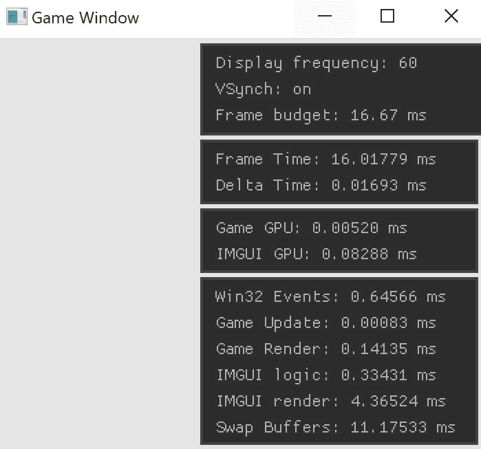

# *第 1 章*:创建游戏窗口

在本章中，您将设置一个简单的 Win32 窗口，并将一个 OpenGL 上下文绑定到它。在本书中，您将使用 OpenGL 3.3 Core。实际的 OpenGL 代码将非常少。

大多数特定于 OpenGL 的代码将被抽象成助手对象和函数，这将允许您专注于动画，而不是任何特定的图形 API。您将在 [*第 6 章*](06.html#_idTextAnchor104) *中编写抽象层，构建一个抽象渲染器*，但是现在，创建一个准备好被绘制的窗口很重要。

到本章结束时，您应该能够执行以下操作:

*   打开一个 Win32 窗口
*   创建并绑定一个 OpenGL 3.3 核心上下文
*   用高兴加载 OpenGL 3.3 核心函数
*   为创建的窗口启用 vsynch
*   了解本书的可下载示例

# 技术要求

为了遵循本书中的代码，您需要一台安装了最新版本的 Visual Studio 的运行 Windows 10 的计算机。所有可下载的代码示例都是使用 Visual Studio 2019 构建的。可以从[https://visualstudio.microsoft.com/](https://visualstudio.microsoft.com/)下载 Visual Studio。

你可以在[https://GitHub . com/packt publishing/Game-Animation-Programming](https://github.com/PacktPublishing/Game-Animation-Programming)上找到这本书的所有示例代码。

# 创建一个空项目

在本书中，你将尽可能多地从头开始创建代码。正因为如此，外部依赖会很少。要开始，请按照以下步骤在 Visual Studio 中创建新的空白 C++ 项目:

1.  Open Visual Studio and create a new project by going to **File**|**New**|**Project**:

    

    图 1.1:创建一个新的 Visual Studio 项目

2.  You will see your project templates on the left-hand side of the window that pops up. Navigate to **Installed**|**Visual C++**|**Other**. Then, select **Empty Project**:

    

    图 1.2:创建一个空的 C++ 项目

3.  输入项目名称并选择项目位置。最后，点击**创建**。


图 1.3:指定新的项目名称

如果你已经遵循了前面的步骤，你应该有一个新的空白项目。在本章的剩余部分，您将添加一个应用程序框架和一个支持 OpenGL 的窗口。

# 创建应用程序类

很难维持杂乱的窗口输入功能。相反，你需要创建一个抽象的`Application`类。该类将包含一些基本功能，如`Initialize`、`Update`、`Render`和`Shutdown`。本书提供的所有代码示例都将建立在`Application`基类之上。

创建新文件，`Application.h`。下面的代码示例提供了`Application`类的声明。将此声明添加到新创建的`Application.h`文件中:

```cpp
#ifndef _H_APPLICATION_
#define _H_APPLICATION_
class Application {
private:
    Application(const Application&);
    Application& operator=(const Application&);
public:
    inline Application() { }
    inline virtual ~Application() { }
    inline virtual void Initialize() { }
    inline virtual void Update(float inDeltaTime) { }
    inline virtual void Render(float inAspectRatio) { }
    inline virtual void Shutdown() { }
};
#endif
```

`Initialize`、`Update`、`Render`和`Shutdown`功能是应用程序的生命周期。所有这些函数都将直接从 Win32 窗口代码中调用。`Update`和`Render`拿说事。要更新帧，需要知道当前帧和最后一帧之间的增量时间。要渲染帧，必须知道窗口的纵横比。

生命周期功能是虚拟的。本书可下载资料中的每一章都有一个例子，它是`Application`类的子类，演示了该章中的一个概念。

接下来，您将向项目添加一个 OpenGL 加载器。

# 添加一个 OpenGL 加载器

有一些本章所依赖的外部代码，叫做`glad`。当你在 Windows 上创建一个新的 OpenGL 上下文时，它是用一个遗留的 OpenGL 上下文创建的。OpenGL 的扩展机制会让你利用这个遗留的上下文来创建一个新的现代上下文。

一旦创建了现代上下文，您将需要获取指向所有 OpenGL 函数的函数指针。函数需要加载`wglGetProcAdress`，T0 返回一个函数指针。

以这种方式加载每个 OpenGL 函数将非常耗时。这就是拥有一个 OpenGL 加载器的好处；`glad`会为你做好这一切工作。OpenGL 加载器是一个库或一些代码，调用 OpenGL API 定义的函数上的`wglGetProcAdress`。

Windows 上有几个 OpenGL 加载器。；本书将使用`glad`。`glad`是一个只有几个文件的小库。它有一个简单的 API 你调用一个函数，就可以访问所有的 OpenGL 函数。`glad`拥有基于网络的界面；你可以在[https://glad.dav1d.de/](https://glad.dav1d.de/)找到。

重要说明

使用 X Windows 系统时，比如很多流行的 Linux 发行版，加载 OpenGL 函数的函数是`glXGetProcAddress`。和 Windows 一样，Linux 也有 OpenGL 加载器。不是所有的操作系统都需要一个 OpenGL 加载器；例如，macOS、iOS 和 Android 不需要加载程序。iOS 和安卓都在 OpenGL ES 上运行。

# 变得高兴

你可以从基于网络的发电机https://glad.dav1d.de/获得`glad`:

1.  Go to the site, select **Version 3.3** from the **gl** dropdown, and select **Core** from the **Profile** dropdown:

    

    图 1.4:配置高兴

2.  滚动至底部，点击**生成**按钮。这将开始下载一个包含所有必需代码的 ZIP 文件。

本书介绍的代码与 OpenGL 版或更高版本向前兼容。如果您想使用更新的 OpenGL 版本，如 4.6，请将 API 下的 GL 下拉列表更改为所需版本。在下一节中，您将把这个 ZIP 文件的内容添加到您的主项目中。

## 为项目添喜

一旦`glad.zip`被下载，提取其内容。将以下文件从 ZIP 文件添加到您的项目中。目录结构不需要维护；所有这些文件都可以放在一起:

*   `src/glad.c`
*   `include/glad/glad.h`
*   `include/KHR/khrplatform.h`

这些文件将作为普通项目文件包含在内，您不必设置`include`路径，但这确实意味着需要编辑文件的内容:

1.  Open `glad.c` and find the following #include:

    `#include <glad/glad.h>`

2.  Replace the `include` path with the relative path of `glad.h`:

    `#include "glad.h"`

3.  Similarly, open `glad.h` and find the following #include:

    `#include <KHR/khrplatform.h>`

4.  Replace the `include` path with the relative path of `khrplatform.h`:

    `#include "khrplatform.h"`

`glad`现在应该是添加到项目中，应该没有编译错误。在下一节中，您将开始实现 Win32 窗口。

# 创建窗口

在本节中，您将创建一个窗口。这意味着您将直接使用 Win32 API 调用来打开一个窗口，并从代码中控制其生命周期。您还将设置一个可以在窗口旁边运行的调试控制台，这对于查看日志非常有用。

重要说明

对 Win32 API 的深入讨论超出了本书的范围。有关任何 Win32 APIs 的更多信息，请参考位于[https://docs.microsoft.com/en-us/windows/win32/api/](https://docs.microsoft.com/en-us/windows/win32/api/)的微软开发者网络(MSDN)。

为了让日志记录更容易一些，两个窗口将在调试模式下同时打开。一个是标准的 Win32 窗口，另一个是用于查看日志的控制台窗口。这可以通过有条件地设置链接器来实现。在调试模式下，应用程序应该链接到控制台子系统。在发布模式下，它应该链接到窗口子系统。

可以通过项目的属性或使用`#pragma`注释在代码中设置链接器子系统。一旦子系统设置到控制台，就可以从`main`调用`WinMain`功能，这将启动一个附加到控制台的窗口。

附加的链接器操作，如链接到外部库，也可以从代码中完成。您将使用`#pragma`命令与 OpenGL 链接。

通过创建新文件`WinMain.cpp`开始窗口实现。这个文件将包含所有的窗口逻辑。然后，执行以下操作:

1.  将以下代码添加到文件的开头。它创建`#define`常量，通过包含`<windows.h>` :

    ```cpp
    #define _CRT_SECURE_NO_WARNINGS
    #define WIN32_LEAN_AND_MEAN
    #define WIN32_EXTRA_LEAN
    #include "glad.h"
    #include <windows.h>
    #include <iostream>
    #include "Application.h"
    ```

    来减少引入的代码量
2.  窗口输入函数和窗口事件处理函数都需要正向声明。这是我们需要打开新窗口的两个 Win32 函数:

    ```cpp
    int WINAPI WinMain(HINSTANCE, HINSTANCE, PSTR, int);
    LRESULT CALLBACK WndProc(HWND, UINT, WPARAM, LPARAM);
    ```

3.  使用`#pragma`注释在代码中链接到`OpenGL32.lib`，而不是通过项目的属性窗口。将以下代码添加到`WinMain.cpp` :

    ```cpp
    #if _DEBUG
        #pragma comment( linker, "/subsystem:console" )
        int main(int argc, const char** argv) {
            return WinMain(GetModuleHandle(NULL), NULL,
                    GetCommandLineA(), SW_SHOWDEFAULT);
        }
    #else
        #pragma comment( linker, "/subsystem:windows" )
    #endif
    #pragma comment(lib, "opengl32.lib")
    ```

现在，需要声明几个 OpenGL 函数。创建一个现代的 OpenGL 上下文是通过`wglCreateContextAttribsARB`完成的，但是没有引用这个函数。这是需要通过`wglGetProcAddress`加载的功能之一，因为它是一个扩展功能。

`wglCreateContextAttribsARB`的功能签名可以在`wglext.h`中找到。`wglext.h`标题由 Khronos 托管，可以在 https://www.khronos.org/registry/OpenGL/index_gl.php 的 OpenGL 注册表中在线找到。

不需要包含整个`wglext.h`头文件；你只需要与创造现代环境相关的功能。下面的代码是直接从文件中复制的。它包含相关`#define`常数和函数指针类型的声明:

```cpp
#define WGL_CONTEXT_MAJOR_VERSION_ARB     0x2091
#define WGL_CONTEXT_MINOR_VERSION_ARB     0x2092
#define WGL_CONTEXT_FLAGS_ARB             0x2094
#define WGL_CONTEXT_CORE_PROFILE_BIT_ARB  0x00000001
#define WGL_CONTEXT_PROFILE_MASK_ARB      0x9126
typedef HGLRC(WINAPI* PFNWGLCREATECONTEXTATTRIBSARBPROC) 
             (HDC, HGLRC, const int*);
```

前面的代码为`wglCreatecontextAttribsARB`定义了一个函数指针类型。除此之外，还需要`#define`常量来创建 OpenGL 3.3 Core 上下文。本书样本将启用`vsynch`，可通过`wglSwapIntervalEXT`完成。

正如您所猜测的，这个函数也需要使用 OpenGL 的扩展机制来加载。它还需要两个额外的支持功能:`wglGetExtensionStringEXT`和`wglGetSwapIntervalEXT`。所有这三个功能都可以在`wgl.h`找到，它由 Khronos 在之前链接的 OpenGL 注册表中托管。

不包括`wgl.h`，在`WinMain.cpp`中增加以下代码。代码为`wglGetExtensionStringEXT`、`wglSwapIntervalEXT`和`wglGetSwapIntervalEXT`定义函数指针签名，复制自`wgl.h`:

```cpp
typedef const char* 
        (WINAPI* PFNWGLGETEXTENSIONSSTRINGEXTPROC) (void);
typedef BOOL(WINAPI* PFNWGLSWAPINTERVALEXTPROC) (int);
typedef int (WINAPI* PFNWGLGETSWAPINTERVALEXTPROC) (void);
```

前面的代码是使用 OpenGL 所需的。通常是复制代码，而不是直接包含这些头。在下一节中，您将开始处理实际的窗口。

## 全局变量

简单的窗口清理需要两个全局变量:一个指向当前运行的应用程序的指针和一个指向全局 OpenGL **顶点数组对象** ( **VAO** )的句柄。每个抽奖呼叫都有自己的 VAO，而不是在整个样本期间都有一个。

为此，请创建以下全局变量:

```cpp
Application* gApplication = 0;
GLuint gVertexArrayObject = 0;
```

在本书的其余部分，不会有其他全局变量。全局变量会使程序状态更难跟踪。这两者存在的原因是，当应用程序稍后关闭时，可以很容易地引用它们。接下来，您将开始实现`WinMain`功能以打开一个新窗口。

## 开窗

接下来，需要实现窗口录入功能，`WinMain`。该函数将负责创建窗口类、注册窗口类和打开新窗口:

1.  通过创建`Application`类的新实例并将其存储在全局指针中来开始`WinMain`的定义:

    ```cpp
    int WINAPI WinMain(HINSTANCE hInstance, HINSTANCE 
                       hPrevInstance, PSTR szCmdLine, 
                       int iCmdShow) {
    gApplication = new Application();
    ```

2.  接下来，需要填写`WNDCLASSEX`的一个实例。这里面没有什么特别的东西；这只是一个标准的窗口定义。唯一需要注意的是`WndProc`功能设置是否正确:

    ```cpp
        WNDCLASSEX wndclass;
        wndclass.cbSize = sizeof(WNDCLASSEX);
        wndclass.style = CS_HREDRAW | CS_VREDRAW;
        wndclass.lpfnWndProc = WndProc;
        wndclass.cbClsExtra = 0;
        wndclass.cbWndExtra = 0;
        wndclass.hInstance = hInstance;
        wndclass.hIcon = LoadIcon(NULL, IDI_APPLICATION);
        wndclass.hIconSm = LoadIcon(NULL, IDI_APPLICATION);
        wndclass.hCursor = LoadCursor(NULL, IDC_ARROW);
        wndclass.hbrBackground = (HBRUSH)(COLOR_BTNFACE + 1);
        wndclass.lpszMenuName = 0;
        wndclass.lpszClassName = "Win32 Game Window";
        RegisterClassEx(&wndclass);
    ```

3.  一个新的应用程序窗口将在监视器的中心启动。为此，使用`GetSystemMetrics`找到屏幕的宽度和高度。然后，围绕屏幕中心将`windowRect`调整到所需的大小:

    ```cpp
        int screenWidth = GetSystemMetrics(SM_CXSCREEN);
        int screenHeight = GetSystemMetrics(SM_CYSCREEN);
        int clientWidth = 800;
        int clientHeight = 600;
        RECT windowRect;
        SetRect(&windowRect, 
                (screenWidth / 2) - (clientWidth / 2), 
                (screenHeight / 2) - (clientHeight / 2), 
                (screenWidth / 2) + (clientWidth / 2), 
                (screenHeight / 2) + (clientHeight / 2));
    ```

4.  要计算出窗口的大小，而不仅仅是客户区域，需要知道窗口的样式。下面的代码示例创建一个可以最小化或最大化但不能调整大小的窗口。要调整窗口大小，请使用按位“或”(`|`)运算符，并定义`WS_THICKFRAME`:

    ```cpp
        DWORD style = (WS_OVERLAPPED | WS_CAPTION | 
            WS_SYSMENU | WS_MINIMIZEBOX | WS_MAXIMIZEBOX); 
        // | WS_THICKFRAME to resize
    ```

5.  一旦定义了所需的窗户样式，调用`AdjustWindowRectEx`功能来调整 clien t 矩形的大小，以包括其大小中的所有窗户装饰。当最终尺寸已知时，`CreateWindowEx`可用于创建实际窗口。创建窗口后，存储对其设备上下文的引用:

    ```cpp
        AdjustWindowRectEx(&windowRect, style, FALSE, 0);
        HWND hwnd = CreateWindowEx(0, wndclass.lpszClassName, 
                    "Game Window", style, windowRect.left, 
                    windowRect.top, windowRect.right - 
                    windowRect.left, windowRect.bottom - 
                    windowRect.top, NULL, NULL, 
                    hInstance, szCmdLine);
        HDC hdc = GetDC(hwnd);
    ```

6.  现在已经创建了窗口，接下来您将创建一个 OpenGL 上下文。为此，您首先需要找到正确的像素格式，然后将其应用于窗口的设备上下文。下面的代码向您展示了如何做到这一点:

    ```cpp
        PIXELFORMATDESCRIPTOR pfd;
        memset(&pfd, 0, sizeof(PIXELFORMATDESCRIPTOR));
        pfd.nSize = sizeof(PIXELFORMATDESCRIPTOR);
        pfd.nVersion = 1;
        pfd.dwFlags = PFD_SUPPORT_OPENGL | PFD_DRAW_TO_WINDOW 
                      | PFD_DOUBLEBUFFER;
        pfd.iPixelType = PFD_TYPE_RGBA;
        pfd.cColorBits = 24;
        pfd.cDepthBits = 32;
        pfd.cStencilBits = 8;
        pfd.iLayerType = PFD_MAIN_PLANE;
        int pixelFormat = ChoosePixelFormat(hdc, &pfd);
        SetPixelFormat(hdc, pixelFormat, &pfd);
    ```

7.  设置好像素格式后，使用`wglCreateContext`创建一个临时的 OpenGL 上下文。这个临时上下文只需要获取一个指向`wglCreateContextAttribsARB`的指针，它将被用来创建一个现代上下文:

    ```cpp
        HGLRC tempRC = wglCreateContext(hdc);
        wglMakeCurrent(hdc, tempRC);
        PFNWGLCREATECONTEXTATTRIBSARBPROC
           wglCreateContextAttribsARB = NULL;
        wglCreateContextAttribsARB =
           (PFNWGLCREATECONTEXTATTRIBSARBPROC)
           wglGetProcAddress("wglCreateContextAttribsARB");
    ```

8.  一个临时的 OpenGL 上下文存在并且被绑定，所以接下来调用`wglCreateContextAttribsARB`函数。该函数将返回一个 OpenGL 3.3 Core 上下文概要文件，将其绑定，并删除遗留上下文:

    ```cpp
        const int attribList[] = {
            WGL_CONTEXT_MAJOR_VERSION_ARB, 3,
            WGL_CONTEXT_MINOR_VERSION_ARB, 3,
            WGL_CONTEXT_FLAGS_ARB, 0,
            WGL_CONTEXT_PROFILE_MASK_ARB,
            WGL_CONTEXT_CORE_PROFILE_BIT_ARB,
            0, };
        HGLRC hglrc = wglCreateContextAttribsARB(
                           hdc, 0, attribList);
        wglMakeCurrent(NULL, NULL);
        wglDeleteContext(tempRC);
        wglMakeCurrent(hdc, hglrc);
    ```

9.  当 OpenGL 3.3 Core 上下文激活时，`glad`可用于加载所有 OpenGL 3.3 Core 功能。打电话给`gladLoadGL`做这件事:

    ```cpp
        if (!gladLoadGL()) {
            std::cout << "Could not initialize GLAD\n";
        }
        else {
            std::cout << "OpenGL Version " << 
            GLVersion.major << "." << GLVersion.minor <<
              "\n";
        }
    ```

10.  现在应该初始化一个 OpenGL 3.3 核心上下文，加载所有的 OpenGL 核心函数。接下来，您将在窗口上启用`vsynch`。`vsynch`不是内置功能；这是一个扩展，因此需要向`wglGetExtensionStringEXT`询问对它的支持。`vsynch`的延长线是`WGL_EXT_swap_control`。检查是否在扩展字符串列表中:

    ```cpp
        PFNWGLGETEXTENSIONSSTRINGEXTPROC
           _wglGetExtensionsStringEXT =
           (PFNWGLGETEXTENSIONSSTRINGEXTPROC)
           wglGetProcAddress("wglGetExtensionsStringEXT");
        bool swapControlSupported = strstr(
             _wglGetExtensionsStringEXT(), 
             "WGL_EXT_swap_control") != 0;
    ```

11.  如果`WGL_EXT_swap_control`分机可用，需要加载。实际功能是`wglSwapIntervalEXT`，可以在`wgl.h`找到。将参数传递给`wglSwapIntervalEXT`会打开`vsynch` :

    ```cpp
        int vsynch = 0;
        if (swapControlSupported) {
            PFNWGLSWAPINTERVALEXTPROC wglSwapIntervalEXT = 
                (PFNWGLSWAPINTERVALEXTPROC)
                wglGetProcAddress("wglSwapIntervalEXT");
            PFNWGLGETSWAPINTERVALEXTPROC 
                wglGetSwapIntervalEXT =
                (PFNWGLGETSWAPINTERVALEXTPROC)
                wglGetProcAddress("wglGetSwapIntervalEXT");
            if (wglSwapIntervalEXT(1)) {
                std::cout << "Enabled vsynch\n";
                vsynch = wglGetSwapIntervalEXT();
            }
            else {
                std::cout << "Could not enable vsynch\n";
            }
        }
        else { // !swapControlSupported
            cout << "WGL_EXT_swap_control not supported\n";
        }
    ```

12.  只需要多做一点家务就可以完成设置一个支持 OpenGL 的窗口。OpenGL 3.3 内核要求所有绘制调用都绑定一个 VAO。您将创建一个绑定在`WinMain`中的全局 VAO，而不是为每个绘制调用创建一个 VAO，并且在窗口被破坏之前永不解除绑定。下面的代码创建这个 VAO 并绑定它:

    ```cpp
        glGenVertexArrays(1, &gVertexArrayObject);
        glBindVertexArray(gVertexArrayObject);
    ```

13.  调用`ShowWindow`和`UpdateWindow`功能显示当前窗口；这也是初始化全局应用程序的好地方。根据应用程序的`Initialize`功能最终完成的工作量，窗口可能会出现一点冻结:

    ```cpp
        ShowWindow(hwnd, SW_SHOW);
        UpdateWindow(hwnd);
        gApplication->Initialize();
    ```

14.  现在，您已经准备好实现实际的游戏循环了。您需要跟踪最后一帧时间来计算帧之间的增量时间。除了游戏逻辑之外，循环还需要通过查看当前消息堆栈并相应地发送消息来处理窗口事件:

    ```cpp
        DWORD lastTick = GetTickCount();
        MSG msg;
        while (true) {
            if (PeekMessage(&msg, NULL, 0, 0, PM_REMOVE)) {
                if (msg.message == WM_QUIT) {
                    break;
                }
                TranslateMessage(&msg);
                DispatchMessage(&msg);
            }
    ```

15.  处理完窗口事件后，`Application`实例需要更新和渲染。首先，找到最后一帧和这一帧之间的时间差，将其转换为秒。例如，以 60 FPS 运行的游戏应该有 16.6 毫秒的增量时间，或 0.0166 秒:

    ```cpp
            DWORD thisTick = GetTickCount();
            float dt = float(thisTick - lastTick) * 0.001f;
            lastTick = thisTick;
            if (gApplication != 0) {
                gApplication->Update(dt);
            }
    ```

16.  渲染当前运行的应用程序只需要稍微多一点内务处理。用`glViewport`设置每帧的 OpenGL 视口，并清除颜色、深度和模板缓冲。除此之外，在渲染之前，请确保所有 OpenGL 状态都是正确的。这意味着绑定了正确的 VAO，启用了深度测试和人脸剔除，并设置了合适的点大小:

    ```cpp
            if (gApplication != 0) {
                RECT clientRect;
                GetClientRect(hwnd, &clientRect);
                clientWidth = clientRect.right - 
                              clientRect.left;
                clientHeight = clientRect.bottom - 
                               clientRect.top;
                glViewport(0, 0, clientWidth, clientHeight);
                glEnable(GL_DEPTH_TEST);
                glEnable(GL_CULL_FACE);
                glPointSize(5.0f);
                glBindVertexArray(gVertexArrayObject);
                glClearColor(0.5f, 0.6f, 0.7f, 1.0f);
                glClear(GL_COLOR_BUFFER_BIT | 
                GL_DEPTH_BUFFER_BIT | GL_STENCIL_BUFFER_BIT);
                float aspect = (float)clientWidth / 
                               (float)clientHeight;
                gApplication->Render(aspect);
            }
    ```

17.  在当前`Application`实例更新并渲染后，需要显示后台缓冲区。这是通过调用`SwapBuffers`来完成的。如果启用了`vsynch`，则需要在`SwapBuffers` :

    ```cpp
            if (gApplication != 0) {
                SwapBuffers(hdc);
                if (vsynch != 0) {
                    glFinish();
                }
            }
    ```

    之后立即调用`glFinish`
18.  窗口期到此为止。窗口循环退出后，从`WinMain`功能返回是安全的:

    ```cpp
        } // End of game loop
        if (gApplication != 0) {
            std::cout << "Expected application to 
                          be null on exit\n";
            delete gApplication;
        }
        return (int)msg.wParam;
    }
    ```

如果您想使用 3.3 以外的 OpenGL 版本，请调整步骤 8 中出现的`attribList`变量中的主值和次值。即使写了`WinMain`函数，你还是无法编译这个文件；它会失败，因为`WndProc`从未被定义过。`WndProc`功能处理诸如鼠标移动或调整窗口大小等事件。在下一节中，您将实现`WndProc`功能。

## 创建事件处理程序

为了让窗口正常运行，甚至编译应用程序，此时，必须定义事件处理函数`WndProc`。这里的实现将非常简单，主要集中在如何破坏窗口:

1.  开始在`WinMain.cpp` :

    ```cpp
    LRESULT CALLBACK WndProc(HWND hwnd, UINT iMsg, 
                        WPARAM wParam, LPARAM lParam) {
        switch (iMsg) {
    ```

    中实现`WndProc`功能
2.  当收到`WM_CLOSE`消息时，需要关闭`Application`类并发出破坏窗口消息。一旦应用程序关闭，别忘了删除它:

    ```cpp
        case WM_CLOSE:
            if (gApplication != 0) {
                gApplication->Shutdown();
                delete gApplication;
                gApplication = 0;
                DestroyWindow(hwnd);
            }
            else {
                std::cout << "Already shut down!\n";
            }
            break;
    ```

3.  当收到销毁消息时，需要释放窗口的 OpenGL 资源。这个就是删除全局顶点数组对象，然后删除 OpenGL 上下文:

    ```cpp
        case WM_DESTROY:
            if (gVertexArrayObject != 0) {
                HDC hdc = GetDC(hwnd);
                HGLRC hglrc = wglGetCurrentContext();
                glBindVertexArray(0);
                glDeleteVertexArrays(1, &gVertexArrayObject);
                gVertexArrayObject = 0;
                wglMakeCurrent(NULL, NULL);
                wglDeleteContext(hglrc);
                ReleaseDC(hwnd, hdc);
                PostQuitMessage(0);
            }
            else {
                std::cout << "Multiple destroy messages\n";
            }
            break;
    ```

4.  绘画和擦除背景信息可以安全忽略，因为 OpenGL 正在管理窗口的渲染。如果收到的消息不是已处理的消息之一，将其转发到默认窗口消息功能:

    ```cpp
        case WM_PAINT:
        case WM_ERASEBKGND:
            return 0;
        }
        return DefWindowProc(hwnd, iMsg, wParam, lParam);
    }
    ```

现在您已经编写了 windows 事件循环，您应该能够编译并运行一个空白窗口。在下一节中，您将探索这本书的可下载示例。

# 探索样本

本书提供的所有代码都可以在该书的可下载内容中找到。有一个大样本，称为`AllChapters`，它包括单个应用程序中的每个样本。有一个`Bin` ZIP 文件，其中包含一个预编译的`AllChapters`示例的可执行文件。

每个章节也有单独的文件夹，包含多个子文件夹。每一章都包含`Sample00`，这是书中写的代码，没有额外的内容。随后编号的样本会添加内容。

`AllChapters`样本看起来与单个章节文件夹中的样本有点不同。该应用程序使用努克拉尔([https://github.com/vurtun/nuklear](https://github.com/vurtun/nuklear))来显示其用户界面。用户界面显示的部分是屏幕右上角的统计计数器。看起来是这样的:



图 1.5:所有章节示例的统计计数器

顶部的框包含一些关于应用程序打开时的显示的一般信息。该信息包含显示频率、`vsynch`是否启用、帧预算以毫秒为单位。

向下的第二个框包含高级帧计时。如果在最后 60 帧中有过时的帧，显示的时间将变为红色。有些陈旧的框架是不可避免的；如果帧速率下降到 59.9，文本将在一秒钟内显示红色。偶尔在这里看到红色是可以的；如果数字是红色的，这只是一个问题。

向下的第三个盒子包含两个 GPU 计时器；这些测量样本在 GPU 上运行的速度。这对于调试任何繁重的绘制调用都很有用。最后一个框包含 CPU 计时器，这有助于找出问题的哪个阶段有瓶颈。

重要说明

在本书中，您将使用 C++ `stl`容器。标准库在调试模式下有点慢，主要是由于错误检查。最好只在发布模式下分析任何样本。

这些例子应该能很好地展示你将在接下来的章节中学到什么。它们也为您提供了一个比较代码的例子。

# 总结

在本章中，您探讨了设置新 Win32 窗口的过程。一个 OpenGL 3.3 核心上下文被设置为渲染到窗口，并启用`vsynch`。您已经了解了 OpenGL 加载器以及`glad`如何加载所有相关的 OpenGL 函数。

这个窗口将成为你的基础；所有未来的示例都基于您在本章中创建的框架。在下一章中，您将开始探索渲染和动画所需的一些数学知识。