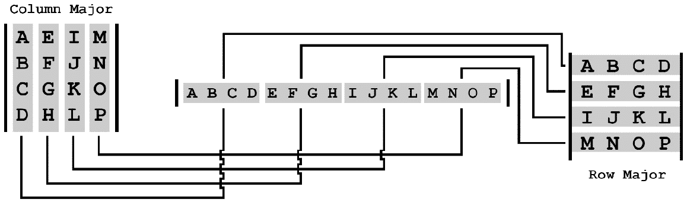
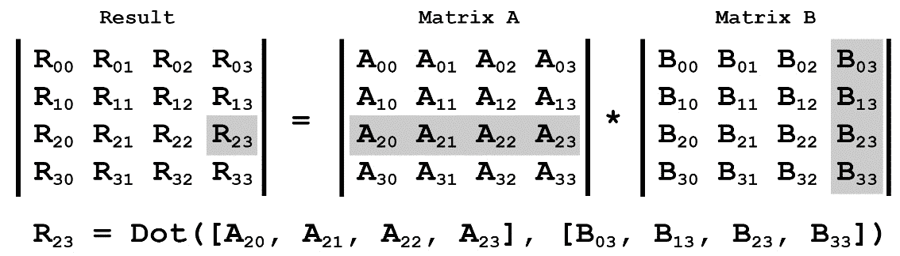
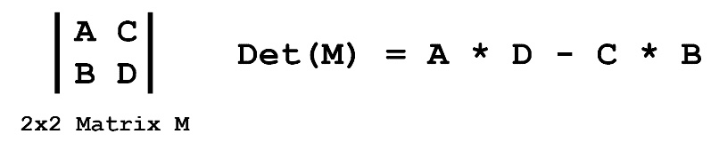
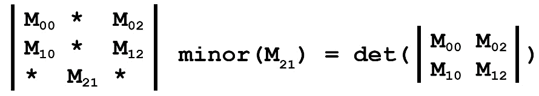
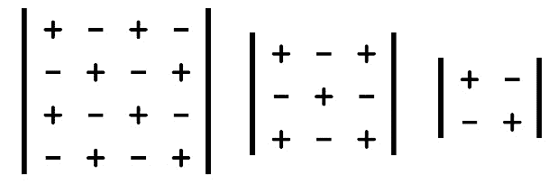

# *第三章*:实现矩阵

在游戏动画的上下文中，矩阵表示仿射变换。它将点从一个空间线性映射到另一个空间。网格由顶点表示，顶点只是空间中的点。这些顶点通过乘以一个矩阵来移动。

在本章中，您将学习矩阵数学以及如何用代码实现矩阵。到本章结束时，您将已经构建了一个健壮的矩阵库，可以在任何项目中使用。矩阵很重要；它们在图形管道中扮演着重要角色。不使用矩阵很难渲染任何东西。

您只需要实现一个正方形的 4 x 4 矩阵。到本章结束时，您应该能够执行以下操作:

*   理解什么是矩阵
*   了解列主矩阵存储
*   将矩阵相乘
*   逆矩阵
*   使用矩阵变换点和向量
*   Understand how to create matrices to view a three-dimensional world

    重要信息

    在本章中，您将实现一个 4 x 4 矩阵。矩阵实现将依赖代码来演示概念，而不是通过数学定义的格式。如果你对矩阵背后的形式数学感兴趣，看看[https://gabormakesgames.com/matrices.html](https://gabormakesgames.com/matrices.html)。

# 技术要求

本章书籍的可下载资料中提供了两个示例。`Sample00`显示了本章中所写的矩阵代码。`Sample01`显示了使用显式低阶矩阵来实现矩阵反函数的替代实现。

# 什么是矩阵？

矩阵是数字的二维数组。正方形矩阵是宽度和高度相同的矩阵。在本章中，您将实现一个 4 x 4 矩阵；也就是有四行四列的矩阵。这个矩阵的元素将以线性阵列的形式存储。

一个 4×4 的矩阵可以被认为是四个向量，每个向量有四个分量，或者是一个`vec4s`的数组。如果向量代表矩阵的列，则矩阵是列主矩阵。如果向量代表矩阵的行，则它是行主向量。

假设一个 4×4 矩阵包含字母表中的字母 *A，B，C，D … P* ，它可以被构造成一个行或列主矩阵。这在下面的*图 3.1* 中有所展示:


图 3.1:比较行和列主矩阵

大多数数学书籍和 OpenGL 都使用列主矩阵。在本章中，您还将实现列主矩阵。理解矩阵中的内容很重要。矩阵的对角线包含缩放信息，最后一列包含平移:


图 3.2:矩阵中存储了什么？

上面的 3×3 子矩阵包含三个向量；每一个都是矩阵旋转的基本向量。基本向量是存储在矩阵中的向上、向右和向前的方向。您可能已经注意到旋转和缩放组件在矩阵中占据相同的空间。

## 矩阵存储

现在您已经知道矩阵布局将是列矩阵，下一个问题是如何存储实际的矩阵。矩阵存储是一个令人困惑的话题。

因为矩阵是以线性阵列的形式存储在内存中的，所以让我们弄清楚哪些元素应该放在哪里。行主矩阵一次一行地存储在存储器中。主列矩阵一次存储一列。

因为行主矩阵和列主矩阵都包含相同的向量，所以最终的线性映射最终是相同的，与矩阵的主矩阵无关。下面的*图 3.3* 演示了这一点:



图 3.3:矩阵存储到线性阵列的映射

您将要构建的矩阵类是具有列存储的列主矩阵；这意味着矩阵的物理内存布局与其元素的逻辑布局之间会有差异。将具有线性内存布局的矩阵视为行矩阵很容易，但请记住，这些行中的每一行实际上都是一列。

重要说明

二维网格到线性存储的典型映射是`"row * numberOfColumns + column"`。这种映射不适用于存储列主矩阵。当查看矩阵时，第 2 列第 3 行的元素应该具有 7 的线性索引，但是之前的映射得到了 14。相反，为了考虑列主存储，映射公式是`"column * numberOfRows + row"`。

理解矩阵如何存储在内存中很重要，它将影响数据如何存储以及 API 如何访问这些数据。在下一节中，您将开始实现矩阵结构。

# 创建矩阵

在本节中，您将创建一个新的 4 x 4 矩阵。这个矩阵将被存储为一个 16 元素的浮点数组。联合将用于以易于使用的方式访问矩阵中的数据:

重要说明

单位矩阵是一种特殊的矩阵，它将任何东西乘以单位矩阵，得到原始矩阵。单位矩阵没有映射。恒等式矩阵除了主对角线之外的所有元素都包含 0，主对角线完全由 1 组成。

1.  创建新文件，`mat4.h`。需要这个文件来声明`mat4`结构。
2.  将以下结构声明添加到`mat4.h`中，它通过声明一个由 16 个元素组成的平面数组作为联合的第一个成员来启动联合:

    ```cpp
    struct mat4 {
        union {
            float v[16];
    ```

3.  联盟的下一个成员是`vec4`变量的结构。每个`vec4`变量代表矩阵的一列；它们以存储在这些列中的基向量命名:

    ```cpp
            struct {
                vec4 right;
                vec4 up;
                vec4 forward;
                vec4 position;
            };
    ```

4.  基于基向量按元素访问成员可能很有用。以下结构包含命名对；第一个字母代表基向量，第二个字母代表该向量的分量:

    ```cpp
            struct { 
            //         row 1    row 2    row 3    row 4
            /*col 1*/float xx;float xy;float xz;float xw;
            /*col 2*/float yx;float yy;float yz;float yw;
            /*col 3*/float zx;float zy;float zz;float zw;
            /*col 4*/float tx;float ty;float tz;float tw;
            };
    ```

5.  下一个结构将允许您使用列-行表示法访问矩阵:

    ```cpp
            struct {
               float c0r0;float c0r1;float c0r2;float c0r3;
               float c1r0;float c1r1;float c1r2;float c1r3;
               float c2r0;float c2r1;float c2r2;float c2r3;
               float c3r0;float c3r1;float c3r2;float c3r3;
            };
    ```

6.  最终的结构将允许您使用行列符号来访问矩阵:

    ```cpp
            struct {
               float r0c0;float r1c0;float r2c0;float r3c0;
               float r0c1;float r1c1;float r2c1;float r3c1;
               float r0c2;float r1c2;float r2c2;float r3c2;
               float r0c3;float r1c3;float r2c3;float r3c3;
            };
        }; // End union
    ```

7.  添加一个`inline`构造函数来创建身份矩阵:

    ```cpp
        inline mat4() :
           xx(1), xy(0), xz(0), xw(0),
           yx(0), yy(1), yz(0), yw(0),
           zx(0), zy(0), zz(1), zw(0),
           tx(0), ty(0), tz(0), tw(1) {}
    ```

8.  添加一个`inline`构造函数，它将从一个浮点数组中创建一个矩阵:

    ```cpp
        inline mat4(float *fv) :
           xx( fv[0]), xy( fv[1]), xz( fv[2]), xw( fv[3]),
           yx( fv[4]), yy( fv[5]), yz( fv[6]), yw( fv[7]),
           zx( fv[8]), zy( fv[9]), zz(fv[10]), zw(fv[11]),
           tx(fv[12]), ty(fv[13]), tz(fv[14]), tw(fv[15]) { }
    ```

9.  添加一个`inline`构造函数，通过指定矩阵中的每个元素来创建矩阵:

    ```cpp
        inline mat4(
            float _00, float _01, float _02, float _03,
            float _10, float _11, float _12, float _13,
            float _20, float _21, float _22, float _23,
            float _30, float _31, float _32, float _33) :
            xx(_00), xy(_01), xz(_02), xw(_03),
            yx(_10), yy(_11), yz(_12), yw(_13),
            zx(_20), zy(_21), zz(_22), zw(_23),
            tx(_30), ty(_31), tz(_32), tw(_33) { }
    }; // end mat4 struct
    ```

你刚才声明的矩阵结构是最终的`mat4`结构；匿名联合提供了五种不同的访问矩阵数据的方式。矩阵数据可以作为平面数组、四列存储为`vec4`或三种助记符之一来访问。这三个助记符使用它们的基本向量、它们的行和列或它们的列和行来命名元素。

接下来，您将开始处理在`mat4`结构上运行的函数。您将实现常见的矩阵操作，如添加、缩放和乘法矩阵，并了解如何使用矩阵来变换向量和点。

# 常用矩阵运算

在本节中，您将学习如何实现一些常见的矩阵运算。这些操作将在本书后面的章节中用于显示动画模型。具体来说，本节将介绍如何比较、相加、缩放和相乘矩阵，以及如何使用矩阵变换向量和点。

## 比较矩阵

比较矩阵是一项组件式操作。只有当两个矩阵的所有成分都相同时，它们才是相同的。要比较两个矩阵，循环遍历并比较它们的所有组成部分。由于您正在比较浮点数，所以应该使用ε。

创建新文件，`mat4.cpp`。在此文件中实现矩阵等式和不等式运算符。等式运算符应该检查两个矩阵是否相同；不等式运算符返回等式运算符的反义词。别忘了给`mat4.h`添加函数声明:

```cpp
bool operator==(const mat4& a, const mat4& b) {
    for (int i = 0; i < 16; ++ i) {
        if (fabsf(a.v[i] - b.v[i]) > MAT4_EPSILON) {
            return false;
        }
    }
    return true;
}
bool operator!=(const mat4& a, const mat4& b) {
    return !(a == b);
}
```

重要说明

`MAT4_EPSILON`常数应在`mat4.h`中定义。`0.000001f`是一个很好的使用默认值。

当按组件比较矩阵时，您正在检查文字相等性。还有其他定义矩阵等式的方法；例如，无论形状如何，都可以使用两个矩阵的行列式来比较它们的体积。矩阵行列式将在本章后面讨论。

在下一节中，您将学习如何将矩阵相加。

## 添加矩阵

两个矩阵可以通过分量相加。要将两个矩阵相加，请将它们各自的分量相加，并将结果存储在新的矩阵中。矩阵加法可以与标量乘法一起使用，在多个矩阵之间进行插值或混合。稍后，您将学习如何使用此属性实现动画蒙皮。

在`mat4.cpp`中实现矩阵加法功能。别忘了给`mat4.h`添加函数声明:

```cpp
mat4 operator+(const mat4& a, const mat4& b) {
    return mat4(
        a.xx+b.xx, a.xy+b.xy, a.xz+b.xz, a.xw+b.xw,
        a.yx+b.yx, a.yy+b.yy, a.yz+b.yz, a.yw+b.yw,
        a.zx+b.zx, a.zy+b.zy, a.zz+b.zz, a.zw+b.zw,
        a.tx+b.tx, a.ty+b.ty, a.tz+b.tz, a.tw+b.tw
    );
}
```

矩阵添加很简单，但它将在显示动画网格中发挥重要作用。在下一节中，您将学习如何通过标量值来缩放矩阵。

## 缩放矩阵

矩阵可以用浮点数来缩放；这种缩放是组件式操作。要缩放矩阵，请将每个元素乘以提供的浮点数。

在`mat4.cpp`中实现矩阵缩放。别忘了给`mat4.h`添加函数声明:

```cpp
mat4 operator*(const mat4& m, float f) {
    return mat4(
        m.xx * f, m.xy * f, m.xz * f, m.xw * f,
        m.yx * f, m.yy * f, m.yz * f, m.yw * f,
        m.zx * f, m.zy * f, m.zz * f, m.zw * f,
        m.tx * f, m.ty * f, m.tz * f, m.tw * f
    );
}
```

缩放矩阵，然后将它们相加，可以让你在两个矩阵之间“学习”或“混合”，只要两个矩阵都表示线性变换。在下一节中，您将学习如何将矩阵相乘。

## 矩阵乘法

矩阵乘法将两个矩阵的变换合并成一个矩阵。两个矩阵只有在内维相同的情况下才能相乘。以下是一些例子:

*   一个 4 x **4** 和一个 **4** x 4 矩阵可以相乘，因为两个内部尺寸都是 4。
*   一个 4 x **4** 和一个 **4** x 1 矩阵可以相乘，因为两个内部尺寸都是 4。
*   一个 4 x **4** 和一个 **1** x 4 矩阵不能相乘，因为内部尺寸 4 和 1 不匹配。

矩阵乘法得到的矩阵将矩阵的外部维数相乘。以下是一个例子:

*   一个 **4** x 4 和一个 **4** 矩阵将产生一个 4 x 4 矩阵。
*   一个 **4** x 4 和一个 4 x **1** 矩阵将产生一个 4 x 1 矩阵。
*   一个 **1** x 4 和一个 4 x **2** 矩阵将产生一个 1 x 2 矩阵。

假设有两个矩阵， *A* 和 *B* 。矩阵 *A* 在 *X* 轴上平移 10 个单位。矩阵 *B* 绕 *Y* 轴旋转 30 度。如果要相乘的矩阵为 *A * B* ，得到的矩阵将围绕 *Y* 轴旋转 30 度，然后在 *X* 轴上平移 10 个单位。

矩阵乘法不是累积的。考虑最后一个例子，而是乘以 *B * A* 。将 *B * A* 相乘时，生成的矩阵将在 *X* 轴上平移 10 个单位，然后围绕 *Y* 轴旋转 30 度。乘法顺序很重要； *A * B* 和 *B * A* 不一样。

这就提出了一个新问题——矩阵应该以什么顺序相乘？如果 *M = A * B * C* ，那么这些矩阵按什么顺序串联？ *A* 、 *B* ，然后 *C* 或 *C* 、 *B* ，然后 *A* ？如果是 *A* 、 *B* ，然后是 *C* ，矩阵乘法定义为从左到右。但如果是 *C* 、 *B* ，然后是 *A* ，矩阵乘法是从右向左的。

为了与 OpenGL 保持一致，在本章中，您将实现从右向左乘法。但是两个矩阵如何相乘呢？矩阵的每个元素都有一行和一列。任何元素的结果值都是左矩阵中该行和右矩阵中该列的点积。

例如，假设您想在两个矩阵相乘时找到第 2 行第 3 列中元素的值。这意味着从左侧矩阵取第 2 行的点积，从右侧矩阵取第 3 列的点积。*图 3.4* 演示了这一点:



图 3.4:乘法矩阵

在上图中，您可能已经注意到，尽管矩阵是以列为主，但元素的下标首先显示为行，然后显示为列。下标引用矩阵的物理拓扑；它与矩阵中存储的内容或矩阵的布局无关。下标指数保持不变，不管矩阵是什么主。执行以下步骤来实现矩阵乘法:

1.  为了缩短乘法矩阵的代码，您需要创建一个助手宏。这个宏将假设有两个矩阵，`a`和`b`。宏将取两个数字，`a`行，`b`列，点在一起，结果赌两者的点积。在`mat4.cpp` :

    ```cpp
    #define M4D(aRow, bCol) \
        a.v[0 * 4 + aRow] * b.v[bCol * 4 + 0] + \
        a.v[1 * 4 + aRow] * b.v[bCol * 4 + 1] + \
        a.v[2 * 4 + aRow] * b.v[bCol * 4 + 2] + \
        a.v[3 * 4 + aRow] * b.v[bCol * 4 + 3]
    ```

    中定义`M4D`宏
2.  在`M4D`宏就位后，在`mat4.cpp`中实现矩阵乘法功能。别忘了给`mat4.h`添加函数声明。请记住，例如`(2, 1)`元素应该取矩阵`a`中行`2`和矩阵`b`列`1`的点积:

    ```cpp
    mat4 operator*(const mat4 &a, const mat4 &b) {
       return mat4(
          M4D(0,0), M4D(1,0), M4D(2,0), M4D(3,0),//Col 0
          M4D(0,1), M4D(1,1), M4D(2,1), M4D(3,1),//Col 1
          M4D(0,2), M4D(1,2), M4D(2,2), M4D(3,2),//Col 2
          M4D(0,3), M4D(1,3), M4D(2,3), M4D(3,3) //Col 3
       );
    }
    ```

矩阵乘法最重要的特性是它将两个矩阵中编码的变换组合成一个矩阵。这很有用，因为您可以预乘某些矩阵，以减少每帧的乘法次数。接下来，您将了解矩阵如何将其变换数据应用于向量和点。

# 变换向量和点

转换点和向量的方式与乘法矩阵相同。事实上，被变换的向量可以被认为是一个 4 列 1 行的矩阵。这意味着变换向量是一个 4×4 和 4×1 矩阵相乘的问题。

当矩阵变换向量时，它会影响向量的方向和比例。当矩阵变换一个点时，它只是在空间中平移该点。那么，向量和点有什么区别呢？向量的 *w* 分量是 *0* ，点的 *W* 分量是 *1* 。以下步骤将指导您实现矩阵向量乘法:

1.  为了使矩阵向量乘法更容易理解，您需要再次创建一个宏。这个宏将取一个矩阵的行，并对提供的列向量执行该行的点积。在`mat4.cpp` :

    ```cpp
    #define M4V4D(mRow, x, y, z, w) \
        x * m.v[0 * 4 + mRow] + \
        y * m.v[1 * 4 + mRow] + \
        z * m.v[2 * 4 + mRow] + \
        w * m.v[3 * 4 + mRow]
    ```

    中执行`M4VD`宏
2.  在`M4V4D`宏就位后，在`mat4.cpp`中实现矩阵向量乘法功能。别忘了给`mat4.h` :

    ```cpp
    vec4 operator*(const mat4& m, const vec4& v) {
        return vec4(
            M4V4D(0, v.x, v.y, v.z, v.w),
            M4V4D(1, v.x, v.y, v.z, v.w),
            M4V4D(2, v.x, v.y, v.z, v.w),
            M4V4D(3, v.x, v.y, v.z, v.w) 
        );
    }
    ```

    添加功能定义
3.  本书中的大部分数据将存储为三分量向量，而不是四分量向量。不需要每次需要通过矩阵变换时都创建一个新的四分量向量；相反，您将为这种情况创建一个专门的函数。
4.  在`mat4.cpp`中定义新功能:`transformVector`。别忘了给`mat4.h`添加函数声明。该函数将采用`vec3`并使用提供的矩阵对其进行变换，假设向量代表方向和大小:

    ```cpp
    vec3 transformVector(const mat4& m, const vec3& v) {
        return vec3(
            M4V4D(0, v.x, v.y, v.z, 0.0f),
            M4V4D(1, v.x, v.y, v.z, 0.0f),
            M4V4D(2, v.x, v.y, v.z, 0.0f) 
        );
    }
    ```

5.  接下来，在`mat4.cpp`中定义`transformPoint`功能。它应该将向量和矩阵相乘，假设向量的 W 分量是 1:

    ```cpp
    vec3 transformPoint(const mat4& m, const vec3& v) {
        return vec3(
            M4V4D(0, v.x, v.y, v.z, 1.0f),
            M4V4D(1, v.x, v.y, v.z, 1.0f),
            M4V4D(2, v.x, v.y, v.z, 1.0f)
        );
    }
    ```

6.  为`transformPoint`定义一个过载，该过载需要一个额外的 *W* 组件。 *W* 组件是一个引用—它是一个读写组件。执行该功能后，如果输入向量为`vec4` :

    ```cpp
    vec3 transformPoint(const mat4& m, const vec3& v, float& w) {
        float _w = w;
        w = M4V4D(3, v.x, v.y, v.z, _w);
        return vec3(
            M4V4D(0, v.x, v.y, v.z, _w),
            M4V4D(1, v.x, v.y, v.z, _w),
            M4V4D(2, v.x, v.y, v.z, _w)
        );
    }
    ```

    ，则 *w* 组件保存 *W* 的值

在本书的其余部分，大多数数据存储在`vec3`结构中。这意味着将使用`transformVector`和`transformPoint`，而不是重载的乘法运算符。这应该有助于减少关于被转换的数据是什么的模糊性。接下来，您将学习如何反转矩阵。

# 矩阵求逆

矩阵乘以它的逆矩阵总是会得到单位矩阵。逆矩阵与非逆矩阵的映射相反。不是所有的矩阵都有逆矩阵。只有行列式非零的矩阵才能求逆。

矩阵求逆是一个重要的操作；用于变换要在屏幕上显示的三维对象的视图矩阵是相机位置和旋转的倒数。倒排矩阵变得重要的另一个地方是蒙皮，将在 [*第 10 章*](10.html#_idTextAnchor167) *【网格蒙皮】*中介绍。

求矩阵的逆相当复杂，因为它需要其他支持函数(如转置和调整)。在本节中，您将首先构建这些支持函数，然后在它们全部构建完成后构建反函数。首先，我们需要转置矩阵。

## 转置

若要转置矩阵，请将矩阵的每个元素翻转到主对角线上。例如， *2，1* 元素将变成 *1，2* 元素。两个下标相同的元素，如 *1，1* ，将保持不变:

1.  在`mat4.cpp`中实现`transpose`功能。别忘了把功能声明添加到`mat4.h` :

    ```cpp
    #define M4SWAP(x, y) \
        {float t = x; x = y; y = t; }
    void transpose(mat4 &m) {
        M4SWAP(m.yx, m.xy);
        M4SWAP(m.zx, m.xz);
        M4SWAP(m.tx, m.xw);
        M4SWAP(m.zy, m.yz);
        M4SWAP(m.ty, m.yw);
        M4SWAP(m.tz, m.zw);
    }
    ```

2.  在`mat4.cpp`中创建`transposed`功能。`transposed`函数修改传递给它的矩阵。别忘了给`mat4.h` :

    ```cpp
    mat4 transposed(const mat4 &m) {
        return mat4(
            m.xx, m.yx, m.zx, m.tx,
            m.xy, m.yy, m.zy, m.ty,
            m.xz, m.yz, m.zz, m.tz,
            m.xw, m.yw, m.zw, m.tw
        );
    }
    ```

    添加功能声明

如果您需要将矩阵从行主转换为列主，或者反过来转换，那么转换矩阵非常有用。在下一节中，你将学习如何计算方阵的行列式。

## 低阶矩阵的行列式和次行列式

要找到 4×4 矩阵的行列式，首先了解低阶矩阵的行列式和次行列式是什么是很重要的。行列式函数是递归的；为了求一个 4×4 矩阵的行列式，我们还需要求几个 3×3 和 2×2 矩阵的行列式。

矩阵的行列式总是标量值；只有方阵才有行列式。如果矩阵被转置，矩阵的行列式保持不变。

在接下来的几节中，你将学习如何找到 2×2 矩阵的行列式，任何大小矩阵的子矩阵，以及任何大小矩阵的余因子。这些方法是拉普拉斯展开的构造块，您将使用它们来寻找任何大小矩阵的行列式。

### 2×2 行列式

要求 2×2 矩阵的行列式，就要减去对角元素的乘积。下图说明了这一点:



图 3.5:一个 2×2 矩阵和行列式公式

### 较小的

矩阵中的每个元素都有一个次元素。元素的次元素是一个小矩阵的行列式，它去掉了元素的行和列。例如，考虑一个 3×3 的矩阵——元素 *2，1* 的次数值是多少？

首先，从矩阵中删除第 2 行和第 1 列。这将导致更小的 2×2 矩阵。这个 2×2 矩阵的行列式是元素 *2，1* 的次项。下图说明了这一点:



图 3.6:3×3 矩阵中元素 2，1 的次元素

这个公式也适用于高维矩阵。例如，4×4 矩阵中一个元素的次元素是一些较小的 3×3 矩阵的行列式。次元素矩阵是一个矩阵，其中每个元素都是输入矩阵中相应元素的次元素。

### 辅因子

要找到矩阵的辅因子，首先要计算未成年人的矩阵。未成年人矩阵已知后，将矩阵中的每一个元素 *(i，j)* 乘以 *-1* 到 *i + j* 的幂。Add -1(i+j) 功率的值形成了一个方便的棋盘图案， *+* 始终位于左上角:



图 3.7:I+j 次方为-1 的棋盘图案

上图显示了 Add -1(i+j)创建的棋盘模式。请注意，模式总是从左上角的正元素开始。

### 拉普拉斯展开

任何方阵的行列式(如果有的话)都可以通过拉普拉斯展开来求。要执行此操作，首先要找到辅助因子矩阵。接下来，将原始矩阵第一行中的每个元素乘以辅助因子矩阵第一行中的对应元素。行列式是这些乘法的总和:


### 恳求

在你能反转一个矩阵之前，最后的操作是找到一个矩阵的下标。矩阵的附属是辅因子矩阵的转置。实现 adjugate 很简单，因为您已经知道如何找到矩阵的辅因子以及如何转置矩阵。

### 相反的

要求矩阵的逆，用矩阵的行列式除矩阵的辅助项。由于标量矩阵除法没有定义，您需要将 adjugate 乘以行列式的倒数。

重要说明

在本章中，您将构建一个矩阵乘法函数，该函数使用宏来避免对低阶矩阵的需要。本书可下载资料中的`Chapter03/Sample01`示例提供了一个利用低阶矩阵的实现，并且更容易通过调试器来完成。

要实现一个矩阵反函数，你首先需要能够找到一个 4×4 矩阵的行列式和下标。这两个函数都依赖于能够在矩阵中找到元素的次元素:

1.  在`mat4.cpp`中创建新的宏。这个宏将找到矩阵中一个元素的次元素，给定一个浮点数组，从矩阵中剪切出三行三列:

    ```cpp
    #define M4_3X3MINOR(x, c0, c1, c2, r0, r1, r2) \
       (x[c0*4+r0]*(x[c1*4+r1]*x[c2*4+r2]-x[c1*4+r2]* \
       x[c2*4+r1])-x[c1*4+r0]*(x[c0*4+r1]*x[c2*4+r2]- \
       x[c0*4+r2]*x[c2*4+r1])+x[c2*4+r0]*(x[c0*4+r1]* \
       x[c1*4+r2]-x[c0*4+r2]*x[c1*4+r1]))
    ```

2.  定义`M4_3X3MINOR`宏后，在`mat4.cpp`中实现`determinant`功能。由于行列式会将每个元素乘以辅助因子，因此需要否定一些值。别忘了给`mat4.h` :

    ```cpp
    float determinant(const mat4& m) {
       return  m.v[0] *M4_3X3MINOR(m.v, 1, 2, 3, 1, 2, 3)  
             - m.v[4] *M4_3X3MINOR(m.v, 0, 2, 3, 1, 2, 3)  
             + m.v[8] *M4_3X3MINOR(m.v, 0, 1, 3, 1, 2, 3)  
             - m.v[12]*M4_3X3MINOR(m.v, 0, 1, 2, 1, 2, 3); 
    }
    ```

    添加功能声明
3.  接下来，执行`mat4.cpp`中的`adjugate`功能。别忘了给`mat4.h`添加函数声明。使用`M4_3X3MINOR`宏找到未成年人矩阵，然后否定合适的元素，创建辅因子矩阵。最后，返回辅因子矩阵的转置:

    ```cpp
    mat4 adjugate(const mat4& m) {
       //Cof (M[i, j]) = Minor(M[i, j]] * pow(-1, i + j)
       mat4 cofactor;
       cofactor.v[0] = M4_3X3MINOR(m.v, 1, 2, 3, 1, 2, 3);
       cofactor.v[1] =-M4_3X3MINOR(m.v, 1, 2, 3, 0, 2, 3);
       cofactor.v[2] = M4_3X3MINOR(m.v, 1, 2, 3, 0, 1, 3);
       cofactor.v[3] =-M4_3X3MINOR(m.v, 1, 2, 3, 0, 1, 2);
       cofactor.v[4] =-M4_3X3MINOR(m.v, 0, 2, 3, 1, 2, 3);
       cofactor.v[5] = M4_3X3MINOR(m.v, 0, 2, 3, 0, 2, 3);
       cofactor.v[6] =-M4_3X3MINOR(m.v, 0, 2, 3, 0, 1, 3);
       cofactor.v[7] = M4_3X3MINOR(m.v, 0, 2, 3, 0, 1, 2);
       cofactor.v[8] = M4_3X3MINOR(m.v, 0, 1, 3, 1, 2, 3);
       cofactor.v[9] =-M4_3X3MINOR(m.v, 0, 1, 3, 0, 2, 3);
       cofactor.v[10]= M4_3X3MINOR(m.v, 0, 1, 3, 0, 1, 3);
       cofactor.v[11]=-M4_3X3MINOR(m.v, 0, 1, 3, 0, 1, 2);
       cofactor.v[12]=-M4_3X3MINOR(m.v, 0, 1, 2, 1, 2, 3);
       cofactor.v[13]= M4_3X3MINOR(m.v, 0, 1, 2, 0, 2, 3);
       cofactor.v[14]=-M4_3X3MINOR(m.v, 0, 1, 2, 0, 1, 3);
       cofactor.v[15]= M4_3X3MINOR(m.v, 0, 1, 2, 0, 1, 2);
       return transposed(cofactor);
    }
    ```

4.  现在`determinant`和`adjugate`功能已经完成，4×4 矩阵的`inverse`功能的实现应该很简单。在`mat4.cpp`实现`inverse`功能。别忘了给`mat4.h`加上功能声明:

    ```cpp
    mat4 inverse(const mat4& m) {
        float det = determinant(m);

        if (det == 0.0f) {
            cout << " Matrix determinant is 0\n";
            return mat4();
        }
        mat4 adj = adjugate(m);
        return adj * (1.0f / det);
    }
    ```

5.  `inverse`函数采用一个常数矩阵引用，并返回一个新的矩阵，该矩阵是所提供矩阵的逆矩阵。在`mat4.cpp`实现`invert`便利功能。这个便利函数将内联反转矩阵，修改参数。别忘了给`mat4.h` :

    ```cpp
    void invert(mat4& m) {
        float det = determinant(m);
        if (det == 0.0f) {
            std::cout << "Matrix determinant is 0\n";
            m = mat4();
            return;
        }
        m = adjugate(m) * (1.0f / det);
    }
    ```

    添加功能声明

矩阵求逆是一个相对昂贵的功能。只对位置和旋转进行编码的矩阵可以更快地进行反转，因为 3×3 旋转矩阵的反转与其转置相同。

在下一节实现`lookAt`函数时，你将学习如何实现这个快速逆。

# 创建摄像机矩阵

矩阵也用于相机变换，包括透视变换。透视变换将平截头体映射到 NDC 空间。NDC 空间通常在所有轴上都有-1 到+1 的范围。与世界/眼睛坐标不同，NDC 空间是左撇子。

在本节中，您将学习如何创建相机变换矩阵。第一个相机矩阵是一个平截头体，看起来像一个尖端被切掉的金字塔。平截头体代表摄像机可见的一切。您还将学习如何创建不同的投影，以及如何实现“查看”功能，以便轻松创建视图矩阵。

## 平截头体

视觉上，平截头体看起来像一个顶端被切掉的金字塔。平截头体有六条边；它代表了相机可以看到的空间。在`mat4.cpp`中创建`frustum`功能。该函数采用左、右、底、顶、近和远值:

```cpp
mat4 frustum(float l, float r, float b, 
             float t, float n, float f) {
    if (l == r || t == b || n == f) {
        std::cout << "Invalid frustum\n";
        return mat4(); // Error
    }
    return mat4(
        (2.0f * n) / (r - l),0, 0, 0,
        0,  (2.0f * n) / (t - b), 0, 0,
        (r+l)/(r-l), (t+b)/(t-b), (-(f+n))/(f-n), -1,
        0, 0, (-2 * f * n) / (f - n), 0
    );
}
```

重要说明

推导平截头体矩阵的细节超出了本书的范围。有关如何导出函数的更多信息，请查看[http://www.songho.ca/opengl/gl_projectionmatrix.html](http://www.songho.ca/opengl/gl_projectionmatrix.html)。

`frustum`函数可以用来构造视平截头体，但函数参数不直观。在下一节中，您将学习如何从更直观的参数创建视图截锥。

## 视角

透视矩阵是根据视野(通常以度为单位)、纵横比以及远近距离构建的。这是一种创建视图平截头体的简单方法。

在`mat4.cpp`中实现`perspective`功能。别忘了给`mat4.h`添加功能声明:

```cpp
mat4 perspective(float fov, float aspect, float n,float f){
    float ymax = n * tanf(fov * 3.14159265359f / 360.0f);
    float xmax = ymax * aspect;
    return frustum(-xmax, xmax, -ymax, ymax, n, f);
}
```

`perspective`功能将在本书剩余部分的几乎所有视觉图形演示中使用。这是创建视图平截头体的一种非常方便的方法。

## 正字法

正投影没有透视效果。正交投影线性映射到 NDC 空间。正交投影常用于二维游戏。它经常被用来实现等角透视。

在`mat4.cpp`中实现`ortho`功能。别忘了给`mat4.h`添加功能声明:

```cpp
mat4 ortho(float l, float r, float b, float t, 
           float n, float f) {
    if (l == r || t == b || n == f) {
        return mat4(); // Error
    }
    return mat4(
        2.0f / (r - l), 0, 0, 0,
        0, 2.0f / (t - b), 0, 0,
        0, 0, -2.0f / (f - n), 0,
        -((r+l)/(r-l)),-((t+b)/(t-b)),-((f+n)/(f-n)), 1
    );
}
```

正交视图投影通常用于显示用户界面或其他二维元素。

## 看

视图矩阵是相机变换(相机的位置、旋转和缩放)的逆矩阵。您将实现一个直接生成该矩阵的`lookAt`函数，而不是必须创建摄像机的变换矩阵，然后将其反转。

一个`lookAt`功能通常需要一个`position`，摄像机正在观察的`target point`和一个参考`up direction`。剩下的工作是找到反转的基向量，并计算出位置。

因为基向量是正交的，所以它们的逆与它们的转置相同。位置可以通过将位置列向量的点积与反转的基向量相减来计算。

在`mat4.cpp`中实现`lookAt`功能。别忘了给`mat4.h`添加函数声明。请记住，视图矩阵将游戏世界映射到正的 *Z* 轴:

```cpp
mat4 lookAt(const vec3& position, const vec3& target, 
            const vec3& up) {
    vec3 f = normalized(target - position) * -1.0f;
    vec3 r = cross(up, f); // Right handed
    if (r == vec3(0, 0, 0)) {
        return mat4(); // Error
    }
    normalize(r);
    vec3 u = normalized(cross(f, r)); // Right handed
    vec3 t = vec3(
        -dot(r, position),
        -dot(u, position),
        -dot(f, position)
    );
    return mat4(
        // Transpose upper 3x3 matrix to invert it
        r.x, u.x, f.x, 0,
        r.y, u.y, f.y, 0,
        r.z, u.z, f.z, 0,
        t.x, t.y, t.z, 1
    );
}
```

`lookAt`函数是构建视图矩阵最方便的方式。本书其余部分的所有代码示例都将使用`lookAt`功能来设置视图矩阵。

# 总结

在本章中，您学习了处理四维方阵所需的数学知识，并实现了一个可重用的矩阵库。矩阵通常用于编码变换信息；它们几乎在图形流水线的每一步都被用来在屏幕上显示模型。

在下一章中，您将学习使用四元数对旋转数据进行编码。