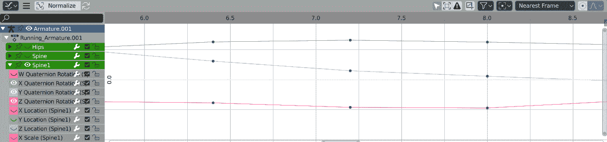
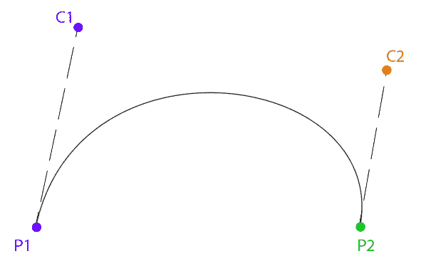
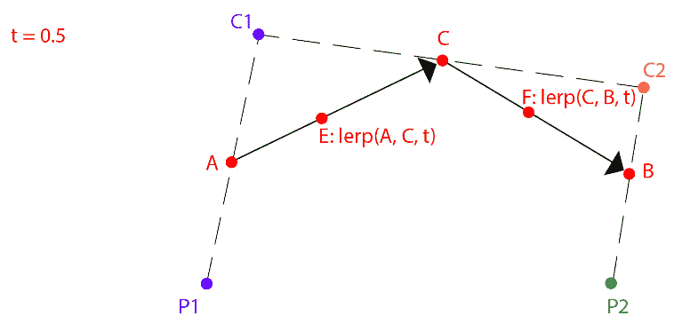
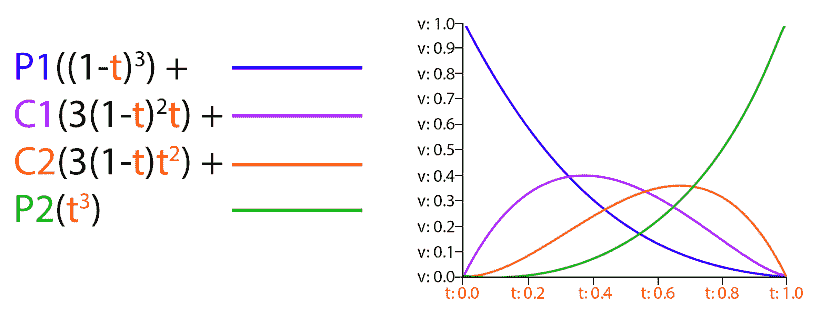
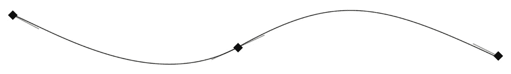

# *第 8 章*:创建曲线、帧和轨迹

在 2000 年代早期，游戏通常采用在诸如 Blender 或 Maya 等 3D 内容创建工具中创作的动画，回放动画，并以设定的时间间隔对动画中每个关节的变换进行采样。一旦动画被采样，游戏的运行时间在采样帧之间线性插值。

虽然这是可行的(并且在 glTF 文件中是可行的)，但它不是回放动画的最准确的方式。它通过包含实际上不需要存在的帧来浪费内存。在 3D 内容创建工具中，使用曲线创建动画，如下图所示:



图 8.1:搅拌机三维曲线编辑器

现代游戏和动画系统直接评估这些曲线。直接评估动画曲线可以节省内存，但是就处理能力而言，曲线要贵一些。到本章结束时，您应该能够执行以下操作:

*   了解三次贝塞尔样条以及如何计算它们
*   了解三次埃尔米特样条以及如何计算它们
*   了解常见的插值方法
*   能够创建立方体、线性和恒定的关键帧
*   了解关键帧是如何组成立方体、线性或恒定轨迹的
*   能够评估三次、线性和恒定轨迹
*   能够将三个独立的轨道组合成一个变换轨道

# 理解三次贝塞尔样条

要实现游戏动画，需要对曲线有一定的了解。让我们从基础开始——三次贝塞尔样条。贝塞尔样条有两个插值点和两个有助于生成曲线的控制点。这就是三次贝塞尔样条的样子:



图 8.2:三次贝塞尔样条

给定两点和两个控制，曲线是如何生成的？让我们探索在给定时间 **t** 内插曲线。先从 **P1** 到 **C1** ，从 **C1** 到 **C2** ，从 **C2** 到 **P2** 画线。然后，用 **t** 的值沿这些直线线性插值:


图 8.3:点和控制点之间的线性插值

从 **P1** 到 **C1** 的插值点为 **A** ，从 **C2** 到 **P2** 的插值点为 **B** ，从 **C1** 到 **C2** 的插值点为 **C** 。接下来需要重复这个过程，从 **A** 到 **C** 再从 **C** 到 **B** 画线插补。让我们称这些新插值的点为 E 和 F:



图 8.4:对图 8.3 的结果进行线性插值

再重复一次，从 **E** 到 **F** 画一条线，并沿着这条线通过 **t** 进行插值。我们把叫做结果点 **R** 。这个点，即 **R** ，位于贝塞尔样条上的某个地方。如果您要计算从 *t=0* 到 *t=1* 的所有点，您可以绘制曲线:


图 8.5:对图 8.4 的结果进行线性插值

让我们探索绘制贝塞尔样条所需的代码。贝塞尔样条不会在本书的任何其他地方使用，因此不需要在本书的其余部分中执行以下代码:

1.  首先，您需要定义什么是贝塞尔样条。创建一个包含两个点和两个控制点的新模板类:

    ```cpp
    template<typename T>
    class Bezier {
    public:
        T P1; // Point 1
        T C1; // Control 1
        T P2; // Point 2
        T C2; // Control 2
    };
    ```

2.  接下来，实现`Interpolate`功能。该函数使用贝塞尔样条参考和值`t`来插值样条。假设`t`大于等于`0`且小于等于【T4:

    ```cpp
    template<typename T>
    inline T Interpolate(Bezier<T>& curve, float t) {
        T A = lerp(curve.P1, curve.C1, t);
        T B = lerp(curve.C2, curve.P2, t);
        T C = lerp(curve.C1, curve.C2, t);
        T D = lerp(A, C, t);
        T E = lerp(C, B, t);
        T R = lerp(D, E, t);
        return R;
    }
    ```

以下代码示例演示了如何使用贝塞尔类和`Interpolate`函数绘制贝塞尔样条:

1.  首先，您需要创建将要绘制的数据:

    ```cpp
    Bezier<vec3> curve;
    curve.P1 = vec3(-5, 0, 0);
    curve.P2 = vec3(5, 0, 0);
    curve.C1 = vec3(-2, 1, 0);
    curve.C2 = vec3(2, 1, 0);

    vec3 red = vec3(1, 0, 0);
    vec3 green = vec3(0, 1, 0);
    vec3 blue = vec3(0, 0, 1);
    vec3 magenta = vec3(1, 0, 1);
    ```

2.  接下来，绘制点和手柄:

    ```cpp
    // Draw all relevant points
    DrawPoint(curve.P1, red);
    DrawPoint(curve.C1, green);
    DrawPoint(curve.P2, red);
    DrawPoint(curve.C2, green);
    // Draw handles
    DrawLine(curve.P1, curve.C1, blue);
    DrawLine(curve.P2, curve.C2, blue);
    ```

3.  最后，绘制样条线:

    ```cpp
    // Draw the actual curve
    // Resolution is 200 steps since last point is i + 1
    for (int i = 0; i < 199; ++i) {
        float t0 = (float)i / 199.0f;
        float t1 = (float)(i + 1) / 199.0f;
        vec3 thisPoint = Interpolate(curve, t0);
        vec3 nextPoint = Interpolate(curve, t1);
        DrawLine(thisPoint, nextPoint, magenta);
    }
    ```

在前面的示例代码中，您可以看到您可以通过使用六个线性插值来实现贝塞尔`Interpolate`函数。为了理解贝塞尔样条是如何工作的，您需要将`lerp`函数扩展到实际情况。线性插值，`lerp(a, b, t)`，扩展到`(1-t) * a + t * b`:

1.  重写`Interpolate`函数，以便扩展所有`lerp`调用:

    ```cpp
    template<typename T>
    inline T Interpolate(const Bezier<T>& curve, float t) {
        T A = curve.P1 * (1.0f - t) + curve.C1 * t;
        T B = curve.C2 * (1.0f - t) + curve.P2 * t;
        T C = curve.C1 * (1.0f - t) + curve.C2 * t;
        T D = A * (1.0f - t) + C * t;
        T E = C * (1.0f - t) + B * t;
        T R = D * (1.0f - t) + E * t;
        return R;
    }
    ```

2.  什么都没变，只是不再需要调用`lerp`函数。这适用于任何数据类型`T`，只要定义了`T operator*(const T& t, float f)`。让我们试着在数学意义上简化它。不使用`A`、`B`、`C`、`D`、`E`和`R`变量，而是将这些方程扩展为如下:

    ```cpp
    ((P1 * (1 - t) + C1 * t) * (1 - t) + (C1 * (1 - t) 
    + C2 * t) * t) * (1 - t) + ((C1 * (1 - t) + C2 * t) 
    * (1 - t) + (C2 * (1 - t) + P2 * t) * t) * t
    ```

3.  这相当于手工内联所有的`lerp`函数。生成的代码有点难读:

    ```cpp
    template<typename T>
    inline T Interpolate(const Bezier<T>& c, float t) {
       return 
         ((c.P1 * (1.0f - t) + c.C1 * t) * (1.0f - t) + 
         (c.C1 * (1.0f - t) + c.C2 * t) * t) * (1.0f - t) 
         + ((c.C1 * (1.0f - t) + c.C2 * t) * (1.0f - t) + 
         (c.C2 * (1.0f - t) + c.P2 * t) * t) * t;
    }
    ```

4.  为什么要经历这些麻烦？为了简化数学，让我们从组合相似的术语开始:

    ```cpp
    -P1t3 + 3P1t2 - 3P1t + P1 + 3C1t3 - 6C1t2 + 3C1t - 3C2t3 + 3C2t2 + P2t3
    ```

5.  现在，这开始看起来像一个等式！这个简化的方程也可以用代码表示:

    ```cpp
    template<typename T>
    inline T Interpolate(const Bezier<T>& curve, float t) {
        return
            curve.P1 * (t * t * t) * -1.0f +
            curve.P1 * 3.0f * (t * t) -
            curve.P1 * 3.0f * t +
            curve.P1 +
            curve.C1 * 3.0f * (t * t * t) -
            curve.C1 * 6.0f * (t * t) +
            curve.C1 * 3.0f * t -
            curve.C2 * 3.0f * (t * t * t) +
            curve.C2 * 3.0f * (t * t) +
            curve.P2 * (t * t * t);
    }
    ```

6.  通过分离一些术语来进一步简化:

    ```cpp
    P1( -t3 + 3t2 - 3t + 1) +
    C1( 3t3 - 6t2 + 3t)+
    C2(-3t3 + 3t2)+
    P2(  t3)
    ```

7.  在代码中，这是，表示如下:

    ```cpp
    template<typename T>
    inline T Interpolate(const Bezier<T>& c, float t) {
        float ttt = t * t * t;
        float tt = t * t;
        return 
        c.P1 * (-1.0f * ttt + 3.0f * tt - 3.0f * t + 1.0f) +
        c.C1 * (3.0f * ttt - 6.0f * tt + 3.0f * t) +
        c.C2 * (-3.0f * ttt + 3.0f * tt) +
        c.P2 * ttt;
    }
    ```

8.  再次简化功能:

    ```cpp
    P1((1-t)3) +
    C1(3(1-t)2t) +
    C2(3(1-t)t2) +
    P2(t3)
    ```

9.  最终简化的代码如下:

    ```cpp
    template<typename T>
    inline T Interpolate(const Bezier<T>& curve, float t) {
        return curve.P1 * ((1 - t) * (1 - t) * (1 - t)) +
                curve.C1 * (3.0f * ((1 - t) * (1 - t)) * t) +
                curve.C2 * (3.0f * (1 - t) * (t * t)) +
                curve.P2 *(t * t * t);
    }
    ```

如果你用范围从`0`到`1`的 *t* 绘制出这些最终的方程，你会得到下面的图表:



图 8.6:贝塞尔样条的基函数

这些是三次贝塞尔样条的点基函数。它们表示样条的值如何随时间变化。例如，P1 的影响力随着时间的推移而下降；在 *t=0* 时，影响是完全的——它的值为 1。然而，当 *t=1* 时，P1 的影响力已经消失——它的值为 0。

在本节中，您已经完成了简化贝塞尔样条评估函数的练习，以得到样条的基函数。使用贝塞尔样条，很容易遵循这个逻辑，因为您可以从一个简单易懂的实现开始，它只使用六个 lerp 函数。对于其他曲线，没有容易的起点。

在下一节中，我们将探索另一种类型的三次样条——三次埃尔米特样条。使用您在本节中学习的知识，您将能够仅使用基函数图来实现埃尔米特求值函数。

# 理解三次埃尔米特样条

游戏动画中最常见的样条曲线类型是三次埃尔米特样条曲线 T2。与贝塞尔不同，埃尔米特样条不使用空间中的点进行控制；相反，它使用沿着样条线的点的切线。与贝塞尔样条一样，您仍然有四个值，但是它们的解释不同。

使用埃尔米特样条，您没有两个点和两个控制点；相反，你有两个点和两个斜率。斜率也称为切线，在本章的其余部分，斜率和切线术语将互换使用。埃尔米特样条的点基函数如下所示:


图 8.7:埃尔米特样条的点基函数

当给定点基函数时，可以实现类似于贝塞尔插值函数的样条评估函数:

```cpp
template<typename T>
T Hermite(float t, T& p1, T& s1, T& p2, T& s2) {
   return 
      p1 * ((1.0f + 2.0f * t) * ((1.0f - t) * (1.0f - t))) +
      s1 * (t * ((1.0f - t) * (1.0f - t))) +
      p2 * ((t * t) * (3.0f - 2.0f * t)) +
      s2 * ((t * t) * (t - 1.0f));
}
```

可以在贝塞尔样条和埃尔米特样条之间切换，但这超出了动画需要了解的范围。一些 3D 内容创建应用程序(如 Maya)允许动画师使用埃尔米特样条线创建动画，而其他应用程序(如 Blender 3D)则使用贝塞尔曲线。

了解这些函数是如何工作的很有用，不管是哪一个驱动你的动画系统。当然，曲线类型更多，但贝塞尔曲线和埃尔米特曲线是最常见的。

glTF 文件格式支持常数、线性和三次插值类型。您刚刚学习了如何进行三次插值，但是仍然需要实现常数插值和线性插值。

# 插值类型

定义动画曲线时，通常遵循三种插值方法之一——常数、线性或三次插值。三次曲线可以使用任何三次方程来表示，例如贝塞尔曲线(这是 Blender 使用的)或埃尔米特样条曲线(这是 Maya 使用的)。这本书使用埃尔米特样条来表示三次曲线。

一条**恒定曲线**保持的值不变，直到下一个关键帧。有时，这种类型的曲线被称为阶跃曲线。从视觉上看，恒定曲线如下所示:


图 8.8:恒定曲线

一条**线性曲线**以线性方式(即直线)在两帧之间插入。正如您在前面的采样曲线近似示例中看到的，如果线性轨迹的样本足够接近，它也可以开始近似其他类型的曲线。线性曲线如下所示:


图 8.9:线性曲线

一条**三次曲线**可以让你根据数值和切线定义一条曲线。三次曲线的好处是可以用很少的数据表达复杂的曲线。缺点是插值变得有点昂贵。三次曲线如下所示(切线是从关键帧出来的线):



图 8.10:三次曲线

插值类型可以表示为一个简单的`enum`类。创建新文件— `Interpolation.h`。添加表头保护并添加以下`enum`类声明:

```cpp
enum class Interpolation { 
    Constant, 
    Linear, 
    Cubic 
};
```

这也是 glTF 支持的三种插值类型。在下一节中，您将通过创建一个保存关键帧数据的`Frame`结构来开始实现动画轨迹。

# 创建框架结构

什么是数据框架？取决于插值类型。如果插值是常数(步长)或线性的，则帧只是一个时间和值。当插值为三次插值时，还需要存储切线。

埃尔米特曲线是由埃尔米特样条连接而成的。每个控制点由时间、值、引入切线和引出切线组成。如果用控制点之前的点来评估控制点，则使用引入切线。如果用控制点后面的点来计算控制点，则使用引出切线。

存储在帧中的时间值是标量，但是数据和切线呢？这些值应该是标量、矢量还是四元数？为了做出这个决定，你必须考虑如何将一组帧组织成一条曲线。

有两种策略可供选择。您可以创建一个标量曲线对象，其中数据和切线是标量值。然后，当需要向量曲线时，可以将几个标量曲线对象组合成一个向量曲线对象。

拥有标量轨迹并从中合成高阶轨迹的优势在于，矢量或四元数曲线的每个分量都可以进行不同的插值。它还可以节省内存，因为曲线的每个部分可能有不同的帧数。缺点是额外的实现工作。

另一种策略是拥有专门的帧和曲线类型，例如标量帧、矢量帧和四元数帧。同样，您可以创建单独的类来表示标量曲线、矢量曲线和四元数曲线。

使用专用框架和曲线的优点是易于实现。您可以利用模板来避免编写重复的代码。glTF 文件也以这种方式存储动画轨迹。缺点是记忆；曲线的每个部分都需要有相同数量的关键帧。

在本书中，您将实现显式的帧和曲线(轨迹)。`Frame`类将包含时间、值以及入切线和出切线。如果插值类型不需要切线，可以直接忽略。帧可以是任意大小(如标量、矢量 2、矢量 3、四等)。它包含的时间总是标量，但值和切线长度可以是任何值:

1.  创建新文件，`Frame.h`。将`Frame`类的声明添加到这个新文件中。`Frame`类需要值和进出切线的数组，以及时间的标量。使用模板指定每个框架的大小:

    ```cpp
    template<unsigned int N>
    class Frame {
    public:
        float mValue[N];
        float mIn[N];
        float mOut[N];
        float mTime;
    };
    ```

2.  为常用帧类型创建`typedef`数据类型:

    ```cpp
    typedef Frame<1> ScalarFrame;
    typedef Frame<3> VectorFrame;
    typedef Frame<4> QuaternionFrame;
    ```

您刚刚实现的`Frame`类用于在动画轨迹中存储关键帧。动画轨迹是关键帧的集合。在下一节中，您将学习如何实现`Track`类。

# 创建赛道类

一个`Track`类是一个帧的集合。对轨道进行插值会返回轨道的数据类型；结果是轨迹在特定时间点定义的任何曲线上的值。一个轨道必须至少有两帧可以插入。

正如在*创建框架结构*一节中提到的，通过遵循本书中的示例，您将实现显式的框架和轨迹类型。标量、矢量和四元数轨迹将有单独的类别。这些类是模板化的，以避免编写重复的代码。例如，`vec3`轨迹包含`Frame<3>`类型的帧。

因为轨迹具有显式类型，所以如果不同时向 *Y* 和 *Z* 组件添加关键帧，就无法在`vec3`轨迹的 *X* 组件中创建关键帧。

如果你有一个不变的组件，这会消耗更多的内存。例如，请注意下图中 *Z* 组件有许多帧，即使它是一条直线，两帧应该就足够了。这不是一个很大的交易；占用的额外内存微不足道:


图 8.11:vec3 轨道的组件

对于蒙皮网格渲染，动画轨迹始终为关节变换设置动画。但是，动画轨迹也可以用来制作游戏中其他值的动画，例如灯光的强度或在二维精灵之间切换以获得动画书效果。在下一节中，您将创建一个新的头文件，并开始声明实际的`Track`类。

## 申报赛道等级

轨道是帧的集合。`Frame`类是模板化的，所以`Track`类也需要模板化。`Track`类采用两个模板参数——第一个是类型(预计为`float`、`vec3`、`quat`等)，另一个是类型包含的组件数量:

1.  `Track`类只需要两个成员——一个帧向量和一个插值类型。创建一个新文件`Track.h`，并将`Track`类的声明添加到该文件中:

    ```cpp
    template<typename T, int N>
    class Track {
    protected:
        std::vector<Frame<N>> mFrames;
        Interpolation mInterpolation;
    ```

2.  `Track`类只需要一个默认的构造函数来初始化`mInterpolation`变量。生成的复制构造函数、赋值操作符和析构函数都可以:

    ```cpp
    public:
        Track();
    ```

3.  为轨道的帧数、插值类型以及开始和结束时间创建 getter 和 setter 函数:

    ```cpp
        void Resize(unsigned int size);
        unsigned int Size();
        Interpolation GetInterpolation();
        void SetInterpolation(Interpolation interp);
        float GetStartTime();
        float GetEndTime();
    ```

4.  `Track`类需要一种在给定时间时对轨迹进行采样的方法。这个`Sample`方法应该取一个时间值，以及轨道是否循环。重载`[] operator`以检索对框架的引用:

    ```cpp
        T Sample(float time, bool looping);
        Frame<N>& operator[](unsigned int index);
    ```

5.  接下来，您需要声明一些助手函数。轨迹可以是常数、线性或立方。只有一个`Sample`函数需要处理这三种情况。与其创建一个庞大的、难以理解的函数，不如为每种插值类型创建一个辅助函数:

    ```cpp
    protected:
        T SampleConstant(float time, bool looping);
        T SampleLinear(float time, bool looping);
        T SampleCubic(float time, bool looping);
    ```

6.  添加一个辅助函数来计算埃尔米特样条:

    ```cpp
        T Hermite(float time, const T& p1, const T& s1, 
                  const T& p2, const T& s2);
    ```

7.  添加一个函数来检索给定时间的帧索引。这是请求时间之前的最后一帧。此外，添加一个助手函数，该函数获取轨道范围之外的输入时间，并将其调整为轨道上的有效时间:

    ```cpp
        int FrameIndex(float time, bool looping);
        float AdjustTimeToFitTrack(float t, bool loop);
    ```

8.  您将需要一种方法来将一个浮动数组(帧内的数据)转换为轨道的模板类型。该功能专用于每种类型的赛道:

    ```cpp
        T Cast(float* value); // Will be specialized
    };
    ```

9.  与`Frame`类一样，为常见的`Track`类型添加`typedef`数据类型:

    ```cpp
    typedef Track<float, 1> ScalarTrack;
    typedef Track<vec3, 3> VectorTrack;
    typedef Track<quat, 4> QuaternionTrack;
    ```

`Track`类的 API 很小，使得该类易于使用。但是`Track`类有很多隐藏的复杂性；毕竟，这个类是你正在构建的动画系统的核心。在下一节中，您将开始实施实际的`Track`课程。

## 实施赛道课程

`Track`类是模板化的，但它不打算在动画系统之外使用。将`float`、`vec3`和`quat`轨道的模板定义添加到`Track.cpp`。这使得编译器在 CPP 文件中为这些模板生成代码:

```cpp
template Track<float, 1>;
template Track<vec3, 3>;
template Track<quat, 4>;
```

对于角色动画来说，`vec3`和`quat`轨迹类型就是你所需要的。如果需要添加新的轨道类型，不要忘记将模板类型添加到`Track.cpp`文件中。在下一节中，您将开始实现助手函数来加载跟踪数据。

### 实现助手函数

`Track`类是模板化的，以避免为所有轨道类型编写重复的代码。但是，有些功能需要特定于`Track`类的类型。除了`Cast`函数之外，所有类型特定的函数都驻留在一个新的命名空间— `TrackHelpers`中。

这些辅助函数不是`Track`类的一部分；它们依赖函数重载来确保调用正确版本的帮助函数。这些助手类的关键职责之一是确保四元数被规范化，并且在正确的邻域内。因为这段代码插入了四元数，所以邻居关系是一个问题:

1.  对于要线性插值的轨迹，需要创建适用于每种轨迹类型的插值函数。向`Track.cpp`添加以下辅助函数，为轨迹可能包含的每种数据类型提供正确的插值方法。这些函数属于`TrackHelpers`命名空间:

    ```cpp
    namespace TrackHelpers {
       inline float Interpolate(float a, float b, float t) {
           return a + (b - a) * t;
       }
       inline vec3 Interpolate(const vec3& a, const vec3& b,
                               float t) {
           return lerp(a, b, t);
       }
       inline quat Interpolate(const quat& a, const quat& b,
                               float t) {
           quat result = mix(a, b, t);
           if (dot(a, b) < 0) { // Neighborhood
               result = mix(a, -b, t);
           }
           return normalized(result); //NLerp, not slerp
       }
    ```

2.  插值埃尔米特样条时，如果输入类型是四元数，则需要对结果进行归一化。您可以创建仅规范化四元数的辅助函数，而不是提供埃尔米特函数的四元数规范:

    ```cpp
       inline float AdjustHermiteResult(float f) {
          return f;
       }
       inline vec3 AdjustHermiteResult(const vec3& v) {
          return v;
       }
       inline quat AdjustHermiteResult(const quat& q) {
          return normalized(q);
       }
    ```

3.  还需要有一个通用的`Neighborhood`操作来确保两个四元数在正确的邻域内。该函数对其他数据类型不做任何操作:

    ```cpp
       inline void Neighborhood(const float& a, float& b){}
       inline void Neighborhood(const vec3& a, vec3& b){}
       inline void Neighborhood(const quat& a, quat& b) {
          if (dot(a, b) < 0) {
             b = -b;
          }
       }
    }; // End Track Helpers namespace
    ```

这些辅助函数存在的原因是为了避免必须制作插值函数的特殊版本。相反，通用插值函数调用这些辅助方法，函数重载确保调用正确的函数。这确实意味着，如果您添加新类型的轨道，您需要添加新的助手函数。在下一节中，您将开始实现一些`Track`功能。

### 实现跟踪功能

在本节中，您将开始实现`Track`类的成员功能。`Track`类有几个不重要的函数，要么需要调用辅助函数，要么只是 getter 和 setter 函数。首先用这些函数开始实现`Track`类:

1.  `Track`构造器需要设置轨迹的插值类型。轨道开始和结束时间的 getter 和 setter 函数是简单的 getter 函数:

    ```cpp
    template<typename T, int N>
    Track<T, N>::Track() {
        mInterpolation = Interpolation::Linear;
    }
    template<typename T, int N>
    float Track<T, N>::GetStartTime() {
        return mFrames[0].mTime;
    }
    template<typename T, int N>
    float Track<T, N>::GetEndTime() {
        return mFrames[mFrames.size() - 1].mTime;
    }
    ```

2.  `Sample`功能需要调用`SampleConstant`、`SampleLinear`或`SampleCubic`，具体取决于赛道类型。`[]` `operator`返回对指定帧的引用:

    ```cpp
    template<typename T, int N>
    T Track<T, N>::Sample(float time, bool looping) {
        if (mInterpolation == Interpolation::Constant) {
            return SampleConstant(time, looping);
        }
        else if (mInterpolation == Interpolation::Linear) {
            return SampleLinear(time, looping);
        }
        return SampleCubic(time, looping);
    }
    template<typename T, int N>
    Frame<N>& Track<T, N>::operator[](unsigned int index) {
        return mFrames[index];
    }
    ```

3.  `Resize`和`Size`函数是围绕帧向量大小的简单获取器和设置器:

    ```cpp
    template<typename T, int N>
    void Track<T, N>::Resize(unsigned int size) {
        mFrames.resize(size);
    }
    template<typename T, int N>
    unsigned int Track<T, N>::Size() {
        return mFrames.size();
    }
    ```

4.  轨道的插值类型也有简单的获取和设置功能:

    ```cpp
    template<typename T, int N>
    Interpolation Track<T, N>::GetInterpolation() {
        return mInterpolation;
    }
    template<typename T, int N>
    void Track<T, N>::SetInterpolation(Interpolation interpolation) {
        mInterpolation = interpolation;
    }
    ```

5.  `Hermite`函数实现了本章*理解三次埃尔米特样条*一节中介绍的基本函数。第二点可能需要被`Neighborhood`辅助函数否定。四元数也需要规范化。相邻和正常化都是由助手函数执行的:

    ```cpp
    template<typename T, int N>
    T Track<T, N>::Hermite(float t, const T& p1, const T& s1,
                           const T& _p2, const T& s2) {
        float tt = t * t;
        float ttt = tt * t;
        T p2 = _p2;
        TrackHelpers::Neighborhood(p1, p2);
        float h1 = 2.0f * ttt - 3.0f * tt + 1.0f;
        float h2 = -2.0f * ttt + 3.0f * tt;
        float h3 = ttt - 2.0f * tt + t;
        float h4 = ttt - tt;
        T result = p1 * h1 + p2 * h2 + s1 * h3 + s2 * h4;
        return TrackHelpers::AdjustHermiteResult(result);
    }
    ```

在接下来的部分中，你将实现`Track`类中一些更难的功能，从`FrameIndex`功能开始。

### 实现框架索引功能

`FrameIndex`函数以时间为自变量；它应该在那一次之前立即返回框架(在左边)。该行为根据轨道是否打算循环采样而变化。按照以下步骤实现`FrameIndex`功能:

1.  如果轨道只有一帧或更少，则无效。如果遇到无效轨道，返回`-1`:T1
2.  如果轨道被采样为循环，则需要调整输入时间，使其介于开始帧和结束帧之间。这意味着您需要知道轨道第一帧的时间、轨道第一帧的时间以及轨道的持续时间:

    ```cpp
        if (looping) {
            float startTime = mFrames[0].mTime;
            float endTime = mFrames[size - 1].mTime;
            float duration = endTime - startTime;
    ```

3.  由于轨道正在循环，需要调整`time`，使其在有效范围内。为此，通过减去开始时间并以持续时间对结果求模，使`time`相对于持续时间。如果`time`为负，则添加持续时间。别忘了把开始时间加回`time` :

    ```cpp
            time = fmodf(time - startTime, 
                         endTime - startTime);
            if (time < 0.0f) {
                time += endTime - startTime;
            }
            time = time + startTime;
        }
    ```

4.  如果轨道没有循环，任何小于起始帧的`time`值都应箝位到`0`，任何大于倒数第二帧的`time`值都应箝位到倒数第二帧的索引:

    ```cpp
        else {
            if (time <= mFrames[0].mTime) {
                return 0;
            }
            if (time >= mFrames[size - 2].mTime) {
                return (int)size - 2;
            }
        }
    ```

5.  现在时间在有效范围内，循环每一帧。最接近时间(但更少)的帧是应该返回其索引的帧。该帧可以通过在轨迹的帧中向后循环并返回第一个索引来找到，该索引的时间小于查找的时间:

    ```cpp
        for (int i = (int)size - 1; i >= 0; --i) {
            if (time >= mFrames[i].mTime) {
                return i;
            }
        }
        // Invalid code, we should not reach here!
        return -1;
    } // End of FrameIndex
    ```

如果轨道没有循环，并且时间大于最后一帧的时间，则使用倒数第二帧的索引。为什么是倒数第二帧而不是最后一帧？`Sample`功能总是需要一个当前帧和下一帧，下一帧是通过将`1`添加到`FrameIndex`功能的结果中找到的。当`time`等于最后一帧的时间时，需要插值的两帧仍然是倒数第二帧和最后一帧。

在下一节中，您将实现`AdjustTimeToFitTrack`功能。此函数用于确保任何采样时间都有有效值。有效值是轨道开始时间和结束时间之间的任何时间。

### 实现 AdjustTimeToFitTrack 功能

下一个要实现的功能是`AdjustTimeToFitTrack`。当给定时间后，该功能需要将时间调整到轨道的开始/结束帧范围内。当然，这取决于轨道是否循环。执行以下步骤实现`AdjustTimeToFitTrack`功能:

1.  如果轨道少于一帧，则该轨道无效。如果使用了无效轨道，返回`0` :

    ```cpp
    template<typename T, int N>
    float Track<T, N>::AdjustTimeToFitTrack(float time, 
                                            bool looping) {
        unsigned int size = (unsigned int)mFrames.size();
        if (size <= 1) { 
            return 0.0f; 
        }
    ```

2.  查找轨道的开始时间、结束时间和持续时间。开始时间是第一帧的时间，结束时间是最后一帧的时间，持续时间是两者之差。如果轨道有`0`持续时间，则无效—返回`0` :

    ```cpp
        float startTime = mFrames[0].mTime;
        float endTime = mFrames[size - 1].mTime;
        float duration = endTime - startTime;
        if (duration <= 0.0f) { 
            return 0.0f; 
        }
    ```

3.  如果轨道循环，根据轨道的持续时间调整时间:

    ```cpp
        if (looping) {
            time = fmodf(time - startTime, 
                         endTime - startTime);
            if (time < 0.0f) {
                time += endTime - startTime;
            }
            time = time + startTime;
        }
    ```

4.  如果轨道没有循环，将时间限制在第一帧或最后一帧。返回调整后的时间:

    ```cpp
        else {
            if (time <= mFrames[0].mTime) { 
                time = startTime;  
            }
            if (time >= mFrames[size - 1].mTime) { 
                time = endTime; 
            }
        }
        return time;
    }
    ```

`AdjustTimeToFitTrack`功能很有用，因为它将动画采样时间保持在范围内。该函数旨在当动画的播放时间改变时调用。考虑以下示例:

```cpp
Track<float, 1> t;
float mAnimTime = 0.0f;
void Update(float dt) { // dt: delta time of frame
    mAnimTime = t. AdjustTimeToFitTrack (mAnimTime + dt);
}
```

在本例中，每当调用`Update`函数时，`mAnimTime`变量都会由帧的`deltaTime`增加。但是，因为递增的时间在分配之前被传递到`AdjustTimeToFitTrack`，所以它永远不会有无效的动画时间值。

在下一节中，您将实现`Track`类的`Cast`功能。`Cast`函数用于获取一个浮点数组，并将其转换为`Track`类的模板类型。

### 实现强制转换功能

`Cast`功能是专用的；需要为每种类型的轨道提供一种实现方式。`Cast`函数接受一个浮点数组，并返回模板化类型`T`，属于`Track`类。支持的类型有`float`、`vec3`、`quat`:

```cpp
template<> float Track<float, 1>::Cast(float* value) {
    return value[0];
}
template<> vec3 Track<vec3, 3>::Cast(float* value) {
    return vec3(value[0], value[1], value[2]);
}
template<> quat Track<quat, 4>::Cast(float* value) {
    quat r = quat(value[0], value[1], value[2], value[3]);
    return normalized(r);
}
```

这个`Cast`函数很重要，因为它可以将存储在`Frame`类中的`float`数组转换成`Frame`类所代表的数据类型。例如`Frame<3>`被铸造成`vec3`。在下面的部分中，当采样一个`Track`类时，您将使用`Cast`函数返回正确的数据类型。

### 恒定轨道采样

在本节中，您将为一个`Track`类实现三个采样函数中的第一个—恒定采样函数。要进行恒定(步长)采样，使用`FrameIndex`辅助工具根据时间找到帧。确保该帧有效，然后将该帧的值转换为正确的数据类型并返回:

```cpp
template<typename T, int N>
T Track<T, N>::SampleConstant(float t, bool loop) {
    int frame = FrameIndex(t, loop);
    if (frame < 0 || frame >= (int)mFrames.size()) {
        return T();
    }
    return Cast(&mFrames[frame].mValue[0]);
}
```

常量采样通常用于可见性标志之类的东西，变量的值从一帧到下一帧的变化是有意义的，而不需要任何真正的插值。在下一节中，您将学习如何实现线性轨迹采样。线性采样很常见；大多数内容创建应用程序都提供“采样”导出选项，用于导出线性插值轨道。

### 线性轨道采样

第二种采样类型、**线性采样**，在两帧之间进行插值。这个函数需要找到当前帧和下一帧，然后找到两帧之间的增量时间。因为`FrameIndex`功能，你永远不应该处于当前帧是轨道的最后一帧，下一帧无效的情况。

一旦知道了当前帧、下一帧以及它们之间的增量时间，就可以进行插值。调用`AdjustTimeToFitTrack`确定时间有效，从中减去第一帧的时间，将结果除以帧增量。这将产生插值值`t`。

知道插值值后，调用`TrackHelpers::Interpolate`函数进行插值:

```cpp
template<typename T, int N>
T Track<T, N>::SampleLinear(float time, bool looping) {
    int thisFrame = FrameIndex(time, looping);
    if (thisFrame < 0 || thisFrame >= mFrames.size() - 1) {
        return T();
    }
    int nextFrame = thisFrame + 1;
    float trackTime = AdjustTimeToFitTrack(time, looping);
    float thisTime = mFrames[thisFrame].mTime;
    float frameDelta = mFrames[nextFrame].mTime – thisTime;
    if (frameDelta <= 0.0f) {
        return T();
    }
    float t = (trackTime - thisTime) / frameDelta;
    T start = Cast(&mFrames[thisFrame].mValue[0]);
    T end = Cast(&mFrames[nextFrame].mValue[0]);
    return TrackHelpers::Interpolate(start, end, t);
}
```

线性采样很常见，因为许多 3D 内容创建应用程序提供了一个选项，通过以设定的间隔对动画曲线进行采样来近似动画曲线。在下一节中，您将学习如何进行曲线的三次插值。三次插值存储的数据比线性插值少，但是计算起来更贵。

### 立方径迹取样

最后一种采样类型**立方采样**，以与线性采样相同的方式找到要采样的帧和插值时间。该函数调用`Hermite`辅助函数进行插值。

如果你把`time`想象成赛道上的一个游戏头，它在第一个点的右边，第二个点的左边。因此，您需要第一点的外斜率(因为游戏头正在远离它)和第二点的内斜率(因为游戏头正在向它移动)。两个斜率都需要按照帧增量进行缩放:

```cpp
template<typename T, int N>
T Track<T, N>::SampleCubic(float time, bool looping) {
    int thisFrame = FrameIndex(time, looping);
    if (thisFrame < 0 || thisFrame >= mFrames.size() - 1) {
        return T();
    }
    int nextFrame = thisFrame + 1;
    float trackTime = AdjustTimeToFitTrack(time, looping);
    float thisTime = mFrames[thisFrame].mTime;
    float frameDelta = mFrames[nextFrame].mTime - thisTime;
    if (frameDelta <= 0.0f) {
        return T();
    }
    float t = (trackTime - thisTime) / frameDelta;
    size_t fltSize = sizeof(float);
    T point1 = Cast(&mFrames[thisFrame].mValue[0]);
    T slope1;// = mFrames[thisFrame].mOut * frameDelta;
    memcpy(&slope1, mFrames[thisFrame].mOut, N * fltSize);
    slope1 = slope1 * frameDelta;
    T point2 = Cast(&mFrames[nextFrame].mValue[0]);
    T slope2;// = mFrames[nextFrame].mIn[0] * frameDelta;
    memcpy(&slope2, mFrames[nextFrame].mIn, N * fltSize);
    slope2 = slope2 * frameDelta;
    return Hermite(t, point1, slope1, point2, slope2);
}
```

为什么斜坡使用`memcpy`而不是`Cast`功能？这是因为`Cast`函数归一化四元数，这是不好，因为斜率不是四元数。使用`memcpy`代替`Cast`直接复制值，避免了归一化。

在下一节中，您将学习如何将矢量和四元数轨迹组合成`TransformTrack`。实际的动画框架将在`TransformTrack`类上工作，它不会被模板化。

# 创建转换轨迹类

对于任何动画的变换，您都不希望保持单独的矢量和四元数轨迹；相反，您构建了一个更高级别的结构——转换轨道。变换轨迹封装了三个轨迹，一个用于位置，一个用于旋转，一个用于缩放。您可以在任何点对变换轨迹进行采样，并获得完整的变换，即使组件轨迹具有不同的持续时间或在不同的时间开始。

需要考虑的一件事是，您希望如何存储这些与动画模型相关的变换轨迹。模型的骨架包含几块骨头。您可以存储变换轨迹的向量(每个骨骼一个向量)，也可以将骨骼标识添加为变换轨迹的成员，并且只存储所需的数量。

这很重要，因为一个角色可以有很多骨骼，但不是所有的动画都会动画化所有这些骨骼。如果为每个骨骼存储一个变换轨迹，会浪费内存，但对动画进行采样会更快。如果您只存储所需数量的变换轨迹，采样会变得有点昂贵，但内存消耗会下降。

实现选择总是以内存和速度为代价。在现代系统中，任一轴上的增量都应该是微不足道的。在本节中，您将向变换轨迹添加骨骼标识，并且只存储所需数量的轨迹。

## 声明 TransformTrack 类

`TransformTrack`类需要保持一个整数，该整数表示轨迹将影响到哪个骨骼(关节)。它还需要位置、旋转和缩放的实际轨迹。这四条信息加在一起应该足以为关节的位置、旋转和缩放制作动画。

与`Track`类一样，`TransformTrack`类具有转换轨迹开始和结束时间的 getter 和 setter 函数。变换轨迹的开始和结束时间取决于其组成轨迹。组件轨迹是位置、旋转和缩放轨迹。

在三个轨道中，最低的开始时间被用作变换轨道的开始时间。三个轨道中最大的结束时间用作变换轨道的结束时间。

并非变换轨迹中的所有组件轨迹都需要有效。例如，如果只有变换的位置是动画的，则旋转和缩放组件轨迹可以保留为无效。只要变换轨迹的至少一个组成轨迹有效，变换轨迹就是有效的。

因为不是所有的分量轨迹都保证有效，所以`TransformTrack`类的`Sample`函数需要进行参考变换。采取以下步骤申报`TransformTrack`类:

1.  创建一个新文件`TransformTrack.h`，并通过定义成员变量

    ```cpp
    class TransformTrack {
    protected:
        unsigned int mId;
        VectorTrack mPosition;
        QuaternionTrack mRotation;
        VectorTrack mScale;
    ```

    开始向其中添加`TransformTrack`定义
2.  公共应用编程接口很简单。您需要默认构造函数为轨迹的关节标识指定默认值。您还需要 ID、组件跟踪、开始/结束时间以及持续时间和有效性的 getter 函数。只有 ID 需要一个 setter 函数；组件 getter 函数返回可变的引用:

    ```cpp
    public:
        TransformTrack();
        unsigned int GetId();
        void SetId(unsigned int id);
        VectorTrack& GetPositionTrack();
        QuaternionTrack& GetRotationTrack();
        VectorTrack& GetScaleTrack();
        float GetStartTime();
        float GetEndTime();
        bool IsValid();
        Transform Sample(const Transform& ref, float time, bool looping);
    };
    ```

在下一节中，您将开始实现`TransfromTrack`的功能。

## 实现 TransformTrack 类

按照以下步骤实施`TransformTrack`类:

1.  创建一个新文件`TransformTrack.cpp`，在中实现`TransformTrack`类。`TransformTrack`类的构造函数并不重要；为变换轨迹代表的关节指定默认值。轨道标识的获取器和设置器功能也很简单:

    ```cpp
    TransformTrack::TransformTrack() {
        mId = 0;
    }
    unsigned int TransformTrack::GetId() {
        return mId;
    }
    void TransformTrack::SetId(unsigned int id) {
        mId = id;
    }
    ```

2.  接下来，实现访问存储在变换轨道中的不同分量轨道的功能。这些函数需要返回一个引用，以便您可以变异返回的轨迹:

    ```cpp
    VectorTrack& TransformTrack::GetPositionTrack() {
        return mPosition;
    }
    QuaternionTrack& TransformTrack::GetRotationTrack() {
        return mRotation;
    }
    VectorTrack& TransformTrack::GetScaleTrack() {
        return mScale;
    }
    ```

3.  只有当存储在`TransformTrack`类中的至少一个组件轨道有效时，`IsValid`助手功能才应该返回`true`。要使一个轨道有效，它需要有两个或更多帧:

    ```cpp
    bool TransformTrack::IsValid() {
        return mPosition.Size() > 1 || 
               mRotation.Size() > 1 || 
               mScale.Size() > 1;
    }
    ```

4.  `GetStartTime`功能应返回三个分量轨道的最小开始时间。如果没有一个组件有效(即都有一个或没有框架)，则`TransformTrack`无效。在这种情况下，只需返回`0` :

    ```cpp
    float TransformTrack::GetStartTime() {
        float result = 0.0f;
        bool isSet = false;
        if (mPosition.Size() > 1) {
            result = mPosition.GetStartTime();
            isSet = true;
        }
        if (mRotation.Size() > 1) {
            float rotationStart = mRotation.GetStartTime();
            if (rotationStart < result || !isSet) {
                result = rotationStart;
                isSet = true;
            }
        }
        if (mScale.Size() > 1) {
            float scaleStart = mScale.GetStartTime();
            if (scaleStart < result || !isSet) {
                result = scaleStart;
                isSet = true;
            }
        }
        return result;
    }
    ```

5.  `GetEndTime`功能类似于`GetStartTime`功能。唯一不同的是，这个函数寻找最大的轨道结束时间:

    ```cpp
    float TransformTrack::GetEndTime() {
        float result = 0.0f;
        bool isSet = false;
        if (mPosition.Size() > 1) {
            result = mPosition.GetEndTime();
            isSet = true;
        }
        if (mRotation.Size() > 1) {
            float rotationEnd = mRotation.GetEndTime();
            if (rotationEnd > result || !isSet) {
                result = rotationEnd;
                isSet = true;
            }
        }
        if (mScale.Size() > 1) {
            float scaleEnd = mScale.GetEndTime();
            if (scaleEnd > result || !isSet) {
                result = scaleEnd;
                isSet = true;
            }
        }
        return result;
    }
    ```

6.  `Sample`功能仅在其组成轨道中有两帧或更多帧的情况下对该轨道进行采样。由于一个`TransformTrack`类只能动画一个组件，比如作为位置，这个函数需要以一个引用转换作为参数。如果其中一个变换组件没有被变换轨迹激活，则使用参考变换的值:

    ```cpp
    Transform TransformTrack::Sample(const Transform& ref,
                                  float time, bool loop) {
        Transform result = ref; // Assign default values
        if (mPosition.Size() > 1) { // Only if valid
           result.position = mPosition.Sample(time, loop);
        }
        if (mRotation.Size() > 1) { // Only if valid
           result.rotation = mRotation.Sample(time, loop);
        }
        if (mScale.Size() > 1) { // Only if valid
           result.scale = mScale.Sample(time, loop);
        }
        return result;
    }
    ```

因为不是所有的动画都包含相同的轨迹，所以在动画切换时，重置正在采样的姿势非常重要。这确保了参考变换总是正确的。若要重置姿势，请将其指定为与其余姿势相同。

# 总结

在本章中，您学习了动画的构建块、一帧数据中的内容、几帧如何构成一个轨迹以及几个轨迹如何制作变换动画。您探索了用于插值动画轨迹的不同插值方法，使这些方法适用于标量、矢量和四元数轨迹。

本章中构建的类将在下一章中用作创建动画剪辑的构建模块。在下一章中，您将实现动画剪辑和姿势。动画剪辑将由`TransformTrack`对象组成。这些轨迹是现代动画系统的核心。

本书可下载内容的`Chapter08`文件夹中有两个样本。`Sample00`包含书中至此使用的所有代码，`Sample01`创建了几个轨道，并在屏幕上绘制它们。直观地绘制轨迹是一个好主意，因为它有助于在早期防止调试问题。