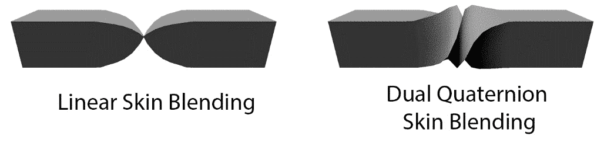
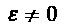
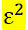

# *第十四章*:使用对偶四元数蒙皮

当前的蒙皮实现在蒙皮权重之间线性混合，这被称为**线性混合蒙皮(LBS)** 或者有时是**线性蒙皮混合**。线性混合蒙皮不会保留模型的体积，这会引入蒙皮构件。可视化该工件的一个简单方法是将矩形的一端扭曲 180 度，如下图所示:



图 14.1:比较线性混合和对偶四元数蒙皮

线性蒙皮混合的替代方法是**对偶四元数蒙皮混合**。当使用双四元数时，模型的体积保持不变。在本章中，您将实现对偶四元数网格蒙皮。到本章结束时，您应该能够使用双四元数来皮肤动画角色。本章涵盖以下主题:

*   引入对偶四元数
*   实现对偶四元数
*   双四元数蒙皮
*   了解如何使用对偶四元数蒙皮

# 引入对偶四元数

对偶四元数将线性和旋转变换结合成一个变量。这个变量可以被插值、转换和连接。对偶四元数可以用两个四元数或八个浮点数来表示。

双数就像复数。复数有实部和虚部，对偶数有实部和对偶部。假设是双算符，一个双数可以表示为，其中和。

对偶数的运算是以虚数的形式进行的，其中对偶分量和实分量必须分别作用。例如，对偶四元数加法可以用以下方式表示:


请注意真实部分和双重部分是如何独立添加的。

重要说明

如果你对对偶四元数背后的更正式的数学感兴趣，请查看*本·肯赖特的《对偶四元数入门指南》*，网址为 https://cs . gmu . edu/~ JM lien/teaching/cs 451/uploads/Main/对偶四元数 .pdf

对偶四元数只是对偶数的扩展。实部和对偶部分用四元数而不是标量值来表示，大多数数学运算只是起作用。在下一节中，您将开始在代码中实现双四元数。

# 实现对偶四元数

在本节中，您将在代码中实现对偶四元数。到本节结束时，您将实现一个对偶四元数结构，以及使用对偶四元数来蒙皮网格所需的所有数学函数。

对偶四元数需要实现为结构，类似于变换或矩阵。创建两个新文件，`DualQuaternion.h`和`DualQuaternion.cpp`。您将在这些文件中实现与对偶四元数相关的数学。

首先声明一个`DualQuaternion`结构。这种结构将允许您以两个四元数或八个数字的浮点数组的形式访问对偶四元数结构中的数据。构造函数应该将对偶四元数设置为恒等式。单位对偶四元数的实部有一个单位四元数，对偶部有一个零四元数，如下面的代码块所示:

```cpp
struct DualQuaternion {
    union {
        struct {
            quat real;
            quat dual;
        };
        float v[8];
    };
    inline DualQuaternion() : real(0, 0, 0, 1), dual(0, 0, 0, 0) { }
    inline DualQuaternion(const quat& r, const quat& d) :
        real(r), dual(d) { }
};
```

对偶四元数的实部保存旋转数据，对偶部保存位置数据。双四元数不处理缩放。在下一节中，您将声明并实现常见的对偶四元数运算，如加法和乘法。

在*实现对偶四元数运算*小节中，您将实现简单的对偶四元数运算符，如加法、缩放、乘法和比较运算符。在*测量、归一化和反转对偶四元数*部分，您将学习如何实现对偶四元数的点积，如何测量对偶四元数，以及如何反转它。在*转换变换和对偶四元数*部分，您将学习如何在`DualQuaternion`和`Transform`结构之间转换。最后，在*变换矢量和点*部分，您将学习如何用对偶四元数变换矢量和点，就像变换或矩阵一样。

## 实现对偶四元数运算

您将需要定义一些数学运算符来处理对偶四元数。这些函数是加法、标量乘法、对偶四元数乘法和等式比较运算符。

两个对偶四元数通过乘法结合。与矩阵和四元数不同，对偶四元数从左向右相乘。按照以下步骤实现对偶四元数运算:

1.  在`DualQuaternion.h`中声明加法、标量乘法、对偶四元数乘法、等式比较运算符，如下:

    ```cpp
    DualQuaternion operator+(const DualQuaternion &l, 
                             const DualQuaternion &r);
    DualQuaternion operator*(const DualQuaternion &dq, 
                             float f);
    // Multiplication order is left to right
    // This is the OPPOSITE of matrices and quaternions
    DualQuaternion operator*(const DualQuaternion &l, 
                             const DualQuaternion &r);
    bool operator==(const DualQuaternion &l, 
                    const DualQuaternion &r);
    bool operator!=(const DualQuaternion &l, 
                    const DualQuaternion &r);
    ```

2.  实现加法、标量乘法和比较函数。它们都是组件式操作。对对偶四元数的实分量和对偶分量分别执行分量操作，如下所示:

    ```cpp
    DualQuaternion operator+(const DualQuaternion &l,
                            const DualQuaternion &r) {
       return DualQuaternion(l.real+r.real,l.dual+r.dual);
    }
    DualQuaternion operator*(const DualQuaternion &dq, 
                             float f) {
        return DualQuaternion(dq.real * f, dq.dual * f);
    }
    bool operator==(const DualQuaternion &l, 
                    const DualQuaternion &r) {
        return l.real == r.real && l.dual == r.dual;
    }
    bool operator!=(const DualQuaternion &l, 
                    const DualQuaternion &r) {
        return l.real != r.real || l.dual != r.dual;
    }
    ```

3.  首先确保两个对偶四元数都归一化，开始实现对偶四元数乘法，如下所示:

    ```cpp
    // Remember, multiplication order is left to right. 
    // This is the opposite of matrix and quaternion 
    // multiplication order
    DualQuaternion operator*(const DualQuaternion &l, const DualQuaternion &r) {
        DualQuaternion lhs = normalized(l);
        DualQuaternion rhs = normalized(r);
    ```

4.  将两个规范化四元数的实部组合在一起。因为必须等于`0`，所以涉及的双重部分更多。通过将两个四元数的对偶和实边相乘并相加结果来满足这个要求，如下所示:

    ```cpp
        return DualQuaternion(lhs.real * rhs.real, 
                              lhs.real * rhs.dual + 
                              lhs.dual * rhs.real);
    }
    ```

通常的对偶四元数算子在很大程度上是直观的，但是对偶四元数的乘法顺序违反惯例，使得它们有点难以处理。在下一节中，您将了解点积和对偶四元数的正常实现。

## 对偶四元数的测量、归一化和反相

点积衡量两个对偶四元数有多相似。对偶四元数点积的规则与向量和四元数点积相同。点积的结果是具有以下属性的标量值:

*   如果对偶四元数指向同一个方向，则为正。
*   如果对偶四元数指向相反的方向，则为负。
*   如果对偶四元数是垂直的，则为零。

非单位对偶四元数会在对偶四元数表示的变换中引入不必要的偏斜。为了规范化对偶四元数，实数部分和对偶部分都需要除以实数部分的长度。

规范化对偶四元数就像规范化正则四元数一样，主要对实部进行操作。首先求出对偶四元数实部的长度，然后将实部和对偶部分都除以长度。这将实数部分和对偶部分归一化为实数部分的长度。

由于点积只考虑方向，所以不使用对偶四元数的虚部。求两个对偶四元数实部的点积。对偶四元数`conjugate`运算是四元数共轭的扩展，分别求实部和对偶部的共轭。

按照以下步骤实现`dot product`、`invert`和`normalize`功能:

1.  在`DualQuaternion.h`中声明对偶四元数点积、共轭和归一化函数，如下:

    ```cpp
    float dot(const DualQuaternion& l, 
              const DualQuaternion& r);
    DualQuaternion conjugate(const DualQuaternion& dq);
    DualQuaternion normalized(const DualQuaternion& dq);
    void normalize(DualQuaternion& dq);
    ```

2.  求两个对偶四元数实部的四元数点积并返回结果，实现点积，如下所示:

    ```cpp
    float dot(const DualQuaternion& l, 
              const DualQuaternion& r) {
        return dot(l.real, r.real);
    }
    ```

3.  分别取实部和对偶部的四元数共轭，实现`conjugate`函数，如下:

    ```cpp
    DualQuaternion conjugate(const DualQuaternion& dq) {
        return DualQuaternion(conjugate(dq.real), 
                              conjugate(dq.dual));
    }
    ```

4.  通过找到实部的长度并通过长度的倒数缩放对偶和实部来实现`normalized`功能，如下所示:

    ```cpp
    DualQuaternion normalized(const DualQuaternion& dq) {
        float magSq = dot(dq.real, dq.real);
        if (magSq  < 0.000001f) {
            return DualQuaternion();
        }
        float invMag = 1.0f / sqrtf(magSq);
        return DualQuaternion(dq.real * invMag, 
                              dq.dual * invMag);
    }
    ```

5.  实现`normalize`功能。与`normalized`不同的是，`normalize`函数采用了一个对偶的四元数参考，并对其进行了适当的归一化，如下所示:

    ```cpp
    void normalize(DualQuaternion& dq) {
        float magSq = dot(dq.real, dq.real);
        if (magSq  < 0.000001f) {
            return;
        }
        float invMag = 1.0f / sqrtf(magSq);
        dq.real = dq.real * invMag;
        dq.dual = dq.dual * invMag;
    }
    ```

如果对偶四元数随时间变化，由于浮点误差，它可能会变得不正常。如果对偶四元数实部的长度不是`1`，则需要对对偶四元数进行归一化。你应该检查平方长度是否为`1`，而不是对照一检查长度，这将涉及平方根运算，这样，运算速度会快得多。在下一节中，您将学习如何在变换和对偶四元数之间进行转换。

## 转换变换和对偶四元数

双四元数保存类似于变换的数据，没有缩放组件。在两者之间转换是可能的，但是比例会丢失。

将变换转换为对偶四元数时，对偶四元数的实部映射到变换的旋转。要计算对偶部分，请根据变换的平移向量创建一个纯四元数。然后，将这个纯四元数乘以变换的旋转。结果需要减半——除以 2 或乘以 0.5。

将对偶四元数转换为变换时，变换旋转仍然映射对偶四元数的实部。要找到位置，将对偶部分乘以 2，并将结果与变换旋转的倒数相结合。这产生了一个纯四元数。这个纯四元数的矢量部分是新的位置。

按照以下步骤实现在`Transform`和`DualQuaternion`对象之间转换的代码:

1.  在`DualQuaternion.h`中声明将对偶四元数转换为变换并将变换转换为对偶四元数的函数，如下所示:

    ```cpp
    DualQuaternion transformToDualQuat(const Transform& t);
    Transform dualQuatToTransform(const DualQuaternion& dq);
    ```

2.  实现`transformToDualQuat`功能。得到的对偶四元数不需要归一化。这个的代码可以在下面的代码片段中看到:

    ```cpp
    DualQuaternion transformToDualQuat(const Transform& t) {
        quat d(t.position.x, t.position.y, t.position.z, 0);
        quat qr = t.rotation;
        quat qd = qr * d * 0.5f;
        return DualQuaternion(qr, qd);
    }
    ```

3.  实现`dualQuatToTransform`功能。假设输入对偶四元数已经归一化。这个的代码可以在下面的代码片段中看到:

    ```cpp
    Transform dualQuatToTransform(const DualQuaternion& dq){
        Transform result;
        result.rotation = dq.real;
        quat d = conjugate(dq.real) * (dq.dual * 2.0f);
        result.position = vec3(d.x, d.y, d.z);
        return result;
    }
    ```

对偶四元数也可以转换成矩阵，也可以转换成矩阵；然而，通常不使用该操作。双四元数用于替换蒙皮管道中的矩阵，因此矩阵转换不是必需的。在下一节中，您将探索对偶四元数如何变换向量或点。

## 变换向量和点

对偶四元数包含刚性变换数据。这意味着对偶四元数可以用来变换向量和点。要用对偶四元数变换一个点，请将对偶四元数分解为旋转和位置分量，然后用与变换相同的方式变换向量，但不缩放。

按照以下步骤，使用对偶四元数为向量和点声明并实现`transform`函数:

1.  在`DualQuaternion.h`中声明`transformVector`和`transformPoint`功能，如下:

    ```cpp
    vec3 transformVector(const DualQuaternion& dq, 
                         const vec3& v);
    vec3 transformPoint(const DualQuaternion& dq, 
                        const vec3& v);
    ```

2.  用对偶四元数旋转向量是微不足道的。由于对偶四元数的实部包含旋转，因此将向量乘以对偶四元数的实部，如下所示:

    ```cpp
    vec3 transformVector(const DualQuaternion& dq, 
                         const vec3& v) {
        return dq.real * v;
    }
    ```

3.  要用对偶四元数变换点，请将对偶四元数转换为旋转和平移分量。然后，对向量应用以下平移和旋转分量:`rotation * vector + translation`。该公式的工作方式与移动点的变换相同，但没有比例分量。这个的代码可以在下面的代码片段中看到:

    ```cpp
    vec3 transformPoint(const DualQuaternion& dq, 
                        const vec3& v) {
        quat d = conjugate(dq.real) * (dq.dual * 2.0f);
        vec3 t = vec3(d.x, d.y, d.z);
        return dq.real * v + t;
    }
    ```

对偶四元数类现在可以用来代替`Transform`类。对偶四元数可以按层次排列，并使用乘法进行组合，有了这些新功能，一个对偶四元数可以直接变换一个点或一个向量。

在本节中，您在代码中实现了双四元数。您需要使用双四元数的所有功能也都实现了。在下一节中，您将学习如何使用双四元数进行网格蒙皮。

# 双四元数蒙皮

在本节中，您将学习如何修改蒙皮算法，使其与对偶四元数而不是矩阵一起工作。具体来说，您将使用变换顶点位置和法线位置的皮肤对偶四元数来替换皮肤矩阵。

对偶四元数解决的问题是矩阵的线性混合，目前在顶点着色器中实现。具体来说，这是引入蒙皮工件的代码位:

```cpp
mat4 skin;
skin  = (pose[joints.x] * invBindPose[joints.x]) * weights.x;
skin += (pose[joints.y] * invBindPose[joints.y]) * weights.y;
skin += (pose[joints.z] * invBindPose[joints.z]) * weights.z;
skin += (pose[joints.w] * invBindPose[joints.w]) * weights.w;
```

在动画管道中有三个阶段，用对偶四元数替换矩阵是有意义的。每一个都会有相同的结果。这里列出了应该实施的三个地方，如下所示:

1.  在顶点着色器中将矩阵转换为对偶四元数。
2.  将当前姿态的矩阵转换为双四元数，然后将双四元数传递给顶点着色器。
3.  将当前姿势的每个变换转换为对偶四元数，然后将世界变换累积为对偶四元数。

在本章中，您将实现第三个选项，并在`Pose`类中添加一个`GetDualQuaternionPalette`函数。您还将为`Skeleton`类的`GetInvBindPose`功能添加一个重载。在下一节中，您将开始修改`Skeleton`类以支持双四元数蒙皮动画。

## 修改姿势类

`Pose`类需要两个新功能——一个是检索指定关节(即`GetGlobalDualQuaternion`)的世界对偶四元数，另一个是将姿态转换为对偶四元数调色板。按照以下步骤声明和实现这些函数:

1.  将`GetDualQuaternionPalette`和`GetGlobalDualQuaternion`函数的声明添加到`Pose.h`中的`Pose`类，如下所示:

    ```cpp
    class Pose {
    // Existing functions and interface
    public: // NEW
    void GetDualQuaternionPalette(vector<DualQuaternion>& o);
    DualQuaternion GetGlobalDualQuaternion(unsigned int i); 
    };
    ```

2.  执行`GetGlobalDualQuaternion`功能返回关节的世界空间对偶四元数，如下所示:

    ```cpp
    DualQuaternion Pose::GetGlobalDualQuaternion(
                            unsigned int index) {
        DualQuaternion result = transformToDualQuat(
                                mJoints[index]);
        for (int p = mParents[index]; p >= 0; 
             p = mParents[p]) {
            DualQuaternion parent = transformToDualQuat(
                                    mJoints[p]);
            // Remember, multiplication is in reverse!
            result = result * parent;    
        }
        return result;
    }
    ```

3.  实现`GetDualQuaternionPalette`功能，该功能应该循环遍历当前姿态中存储的所有关节，并将它们的世界空间对偶四元数存储在输出向量中，如下所示:

    ```cpp
    void Pose::GetDualQuaternionPalette(
               vector<DualQuaternion>& out) {
        unsigned int size = Size();
        if (out.size() != size) {
            out.resize(size);
        }
        for (unsigned int i = 0; i < size; ++ i) {
            out[i] = GetGlobalDualQuaternion(i);
        }
    }
    ```

对偶四元数转换发生在关节局部空间，因此，您不需要向`Pose`类添加任何附加数据，而是能够添加两个新函数。在下一节中，您将修改`Skeleton`类，以提供作为双四元数的反向绑定姿势。

## 修改骨架类

为了使用双四元数对网格进行蒙皮，网格的反向绑定姿态也需要使用双四元数来表示。在本节中，您将向`GetInvBindPose`函数添加一个重载，该重载将填充对对偶四元数对象向量的引用。按照以下步骤实现新的`GetInvBindPose`功能:

1.  在`Skeleton`类中声明一个额外的`GetInvBindPose`函数，该函数将引用对偶四元数的向量作为参数。当函数完成时，它将已经用反向绑定姿态对偶四元数填充了向量。这个的代码可以在下面的片段中看到:

    ```cpp
    class Skeleton {
    // Existing functions and interface
    public: // GetInvBindPose is new
     void GetInvBindPose(vector<DualQuaternion>& pose);
    };
    ```

2.  执行`Skeleton.cpp`中的`GetInvBindPose`功能超越。调整输入向量的大小，使其与绑定姿势一样大。对于每个关节，获取关节的全局对偶四元数表示。最后，在输出向量中存储每个世界空间对偶四元数的共轭。这个的代码可以在下面的片段中看到:

    ```cpp
    void Skeleton::GetInvBindPose(std::vector<DualQuaternion>& 
        outInvBndPose) {
        unsigned int size = mBindPose.Size();
        outInvBndPose.resize(size);
        for (unsigned int i = 0; i < size; ++ i) {
            DualQuaternion world = 
                 mBindPose.GetGlobalDualQuaternion(i);
            outInvBndPose[i] = conjugate(world);
        }
    }
    ```

现在，您可以将骨骼的动画姿势和反向绑定姿势转换为双四元数数组。但是为了在着色器中使用这些双四元数，它们需要以某种方式传递给该着色器。在下一节中，您将实现一个新的对偶四元数统一类型来实现这一点。

## 创建新的统一类型

为了使用双四元数作为矩阵的替代，需要有一种方法将它们用作着色器制服。对偶四元数可以被视为 2×4 矩阵，可以用`glUniformMatrix2x4fv`函数设置。

使用`DualQuaternion`为`Uniform`类声明模板专门化。`Set`功能需要实现。它应该使用`glUniformMatrix2x4fv`功能将对偶四元数数组上传为 2×4 矩阵。实现新的`Set`函数，如下面的代码片段所示:

```cpp
template Uniform<DualQuaternion>;
template<>
void Uniform<DualQuaternion>::Set(unsigned int slot, 
                                  DualQuaternion* inputArray, 
                                  unsigned int arrayLength) {
    glUniformMatrix2x4fv(slot, arrayLength, 
                         false, inputArray[0].v);
}
```

由于`Set`函数是模板化的，不需要在头文件中声明；它只是函数的一个专门实例。在下一节中，您将探索如何实现使用双四元数进行蒙皮的顶点着色器。

## 创建对偶四元数着色器

为了让支持双四元数蒙皮，唯一要做的就是实现一个顶点着色器。新的顶点着色器将类似于它的线性混合蒙皮对应物。这个着色器将有两个用于双四元数的`mat2x4`统一数组，而不是两个用于矩阵调色板的`mat4`统一数组。

着色器必须将双四元数混合在一起。每当两个四元数(对偶四元数的实部)混合时，就有可能混合发生在错误的邻域中，四元数会进行长时间的插值。混合时需要记住“邻近”。

按照以下步骤实现新的顶点着色器:

1.  开始用 **OpenGL 着色语言** ( **GLSL** )版本和`model`、`view`和`projection`制服声明着色器，如下所示:

    ```cpp
    #version 330 core
    uniform mat4 model;
    uniform mat4 view;
    uniform mat4 projection;
    ```

2.  声明顶点结构。顶点的输入值如下:`position`、`normal`、纹理坐标以及权重和关节影响。每个顶点应该有多达四个权重和影响。这个的代码可以在下面的片段中看到:

    ```cpp
    in vec3 position;
    in vec3 normal;
    in vec2 texCoord;
    in vec4 weights;
    in ivec4 joints;
    ```

3.  声明传递给片段着色器的输出值。这些是顶点法线、碎片在世界空间中的位置以及`uv`坐标，如下面的代码片段所示:

    ```cpp
    out vec3 norm;
    out vec3 fragPos;
    out vec2 uv;
    ```

4.  申报剥皮制服。这些不再是`mat4`的数组；他们现在是`mat2x4`的阵列。一`mat2x4`有两列四行。认购 a `mat2x4`，指数`0`是我们对偶四元数的实部，指数`1`是对偶部分。代码可以在下面的片段中看到:

    ```cpp
    uniform mat2x4 pose[120];
    uniform mat2x4 invBindPose[120];
    ```

5.  实现四元数乘法功能。其代码与 [*第四章*](04.html#_idTextAnchor069)*实现四元数*中创建的代码相同，可以在下面的代码片段中看到:

    ```cpp
    vec4 mulQ(vec4 Q1, vec4 Q2) {
        return vec4(
            Q2.x*Q1.w + Q2.y*Q1.z - Q2.z*Q1.y + Q2.w*Q1.x,
           -Q2.x*Q1.z + Q2.y*Q1.w + Q2.z*Q1.x + Q2.w*Q1.y,
            Q2.x*Q1.y - Q2.y*Q1.x + Q2.z*Q1.w + Q2.w*Q1.z,
           -Q2.x*Q1.x - Q2.y*Q1.y - Q2.z*Q1.z + Q2.w*Q1.w
        );
    }
    ```

6.  实现`normalize`对偶四元数函数。对偶四元数通过将它的实部和对偶部分除以实部的大小来归一化。代码可以在下面的片段中看到:

    ```cpp
    mat2x4 normalizeDq(mat2x4 dq) {
        float invMag = 1.0 / length(dq[0]);
        dq[0] *= invMag;
        dq[1] *= invMag;
        return dq;
    }
    ```

7.  实现对偶四元数乘法函数组合对偶四元数，如下:

    ```cpp
    mat2x4 combineDq(mat2x4 l, mat2x4 r) {
        l = normalizeDq(l);
        r = normalizeDq(r);
        vec4 real = mulQ(l[0], r[0]);
        vec4 dual = mulQ(l[0], r[1]) + mulQ(l[1], r[0]);
        return mat2x4(real, dual);
    }
    ```

8.  实现一个通过对偶四元数变换向量的函数，如下:

    ```cpp
    vec4 transformVector(mat2x4 dq, vec3 v) {
      vec4 real = dq[0];
      vec3 r_vector = real.xyz;
      float r_scalar = real.w;

      vec3 rotated = r_vector * 2.0f * dot(r_vector, v) +
       v * (r_scalar * r_scalar - dot(r_vector, r_vector))+
       cross(r_vector, v) * 2.0f * r_scalar;
      return vec4(rotated, 0);
    }
    ```

9.  通过对偶四元数对变换点实现一个函数，如下所示:

    ```cpp
    vec4 transformPoint(mat2x4 dq, vec3 v) {
        vec4 real = dq[0];
        vec4 dual = dq[1];
        vec3 rotated = transformVector(dq, v).xyz;
        vec4 conjugate = vec4(-real.xyz, real.w);
        vec3 t = mulQ(conjugate, dual * 2.0).xyz;

        return vec4(rotated + t, 1);
    }
    ```

10.  实现顶点着色器的主要方法。通过将关节 1、2 和 3 ( `joints.y`、`joints.z`、`joints.w`)邻接到关节 0 ( `joints.x`)开始实施，如下所示:

    ```cpp
    void main() {
        vec4 w = weights;
        // Neighborhood all of the quaternions correctly
        if (dot(pose[joints.x][0], pose[joints.y][0]) < 0.0)
           { w.y *= -1.0; }
        if (dot(pose[joints.x][0], pose[joints.z][0]) < 0.0)
           { w.z *= -1.0; }
        if (dot(pose[joints.x][0], pose[joints.w][0]) < 0.0)
           { w.w *= -1.0; }
    ```

11.  将每个关节的世界空间对偶四元数与同一个关节的逆绑定姿态对偶四元数相结合。记住:对偶四元数乘法是从左向右的。将每次乘法的结果存储在新的变量中。代码可以在下面的片段中看到:

    ```cpp
        // Combine
        mat2x4 dq0 = combineDq(invBindPose[joints.x], 
                               pose[joints.x]);
        mat2x4 dq1 = combineDq(invBindPose[joints.y], 
                               pose[joints.y]);
        mat2x4 dq2 = combineDq(invBindPose[joints.z], 
                               pose[joints.z]);
        mat2x4 dq3 = combineDq(invBindPose[joints.w], 
                               pose[joints.w]);
    ```

12.  将四个蒙皮双四元数混合在一起。使用对偶四元数标量乘法和对偶四元数加法实现混合。别忘了归一化皮肤对偶四元数。代码可以在下面的片段中看到:

    ```cpp
        mat2x4 skinDq = w.x * dq0 + w.y * dq1 + 
                        w.z * dq2 + w.w * dq3;
        skinDq = normalizeDq(skinDq);
    ```

13.  使用带有蒙皮对偶四元数的`transformPoint`函数蒙皮顶点。将生成的`vec4`通过正常的模型-视图-投影管道，如下所示:

    ```cpp
        vec4 v = transformPoint(skinDq, position);
        gl_Position = projection * view * model * v;
        fragPos = vec3(model * v);
    ```

14.  类似地变换法线。不要忘记将`uv`坐标传递给片段着色器。代码可以在下面的片段中看到:

    ```cpp
        vec4 n = transformVector(skinDq, normal);
        norm = vec3(model * n);
        uv = texCoord;
    }
    ```

任何动画比例的动画都不会用这个方法。这种对偶四元数实现不支持缩放。在双四元数的基础上攻击缩放支持是可能的，但是所涉及的工作在性能方面超过了它的好处。

在本节中，您学习了如何使用双四元数实现蒙皮。这包括修改姿势数据和`Skeleton`类，创建新的制服，以及构建新的着色器。在下一节中，您将探索如何使用至此编写的对偶四元数代码。

# 了解如何使用对偶四元数蒙皮

本节将探讨您如何获取到目前为止编写的对偶四元数蒙皮代码，并在现有应用中实现它。本代码仅供参考；你不必跟着它走。

使用对偶四元数蒙皮着色器是微不足道的；在运行时很容易在蒙皮方法之间切换。以下步骤演示了如何使用对偶四元数着色器或线性蒙皮着色器来制作同一模型的动画。

跟踪对偶四元数姿势调板和反向绑定姿势调板，以及线性混合姿势调板和反向绑定姿势调板。看看下面的代码:

```cpp
// For dual quaternion skinning
std::vector<DualQuaternion> mDqPosePalette;
std::vector<DualQuaternion> mDqInvBindPalette;
// For linear blend skinning
std::vector<mat4> mLbPosePalette;
std::vector<mat4> mLbInvBindPalette;
```

当应用初始化时，将反向绑定姿态缓存为矩阵向量和对偶四元数向量，如下所示:

```cpp
mCurrentPose = mSkeleton.GetRestPose();
mCurrentPose.GetDualQuaternionPalette(mDqPosePalette);
mSkeleton.GetInvBindPose(mDqInvBindPalette);
mCurrentPose.GetMatrixPalette(mLbPosePalette);
mLbInvBindPalette = mSkeleton.GetInvBindPose();
```

对动画进行采样时，将生成的姿势选项板转换为双四元数和线性混合版本，如下所示:

```cpp
mPlayTime = mClips[mClip].Sample(mCurrentPose, 
                                 mPlayTime + dt);
mCurrentPose.GetDualQuaternionPalette(mDqPosePalette);
mCurrentPose.GetMatrixPalette(mLbPosePalette);
```

渲染动画时，请确保使用了正确的制服，如下所示:

```cpp
if (mSkinningMethod == SkinningMethod::DualQuaternion) {
   Uniform<DualQuaternion>::Set(
           shader->GetUniform("pose"), mDqPosePalette);
   Uniform<DualQuaternion>::Set(
   shader->GetUniform("invBindPose"), mDqInvBindPalette);
}
else {
   Uniform<mat4>::Set(shader->GetUniform("pose"), 
                      mLbPosePalette);
   Uniform<mat4>::Set(shader->GetUniform("invBindPose"),
                      mLbInvBindPalette);
}
```

在此示例中，在线性混合蒙皮和双四元数蒙皮着色器之间切换就像更改`mSkinningMethod`变量的值一样简单。这是可行的，因为这两个着色器之间的唯一区别是姿势调色板制服。

# 总结

在本章中，您学习了对偶四元数背后的数学，并实现了一个对偶四元数类。您发现了一些由线性混合蒙皮产生的蒙皮工件，以及如何使用双四元数来避免这些工件。本章中实现的双四元数蒙皮着色器可用于替换线性混合蒙皮着色器。

如果你在本书的可下载资料中`Chapter14`下查找，有两个例子。`Sample00`包含至此的所有代码。`Sample01`渲染同一个扭曲立方体模型两次。第一个立方体用线性混合蒙皮着色器渲染。第二个是用对偶四元数着色器渲染的。

在下一章中，您将探索如何使用索引绘图来制作大量人群的动画。这很有趣，因为它涉及到将姿势生成移动到**图形处理单元** ( **GPU** )并在顶点着色器中执行整个蒙皮动画管道。