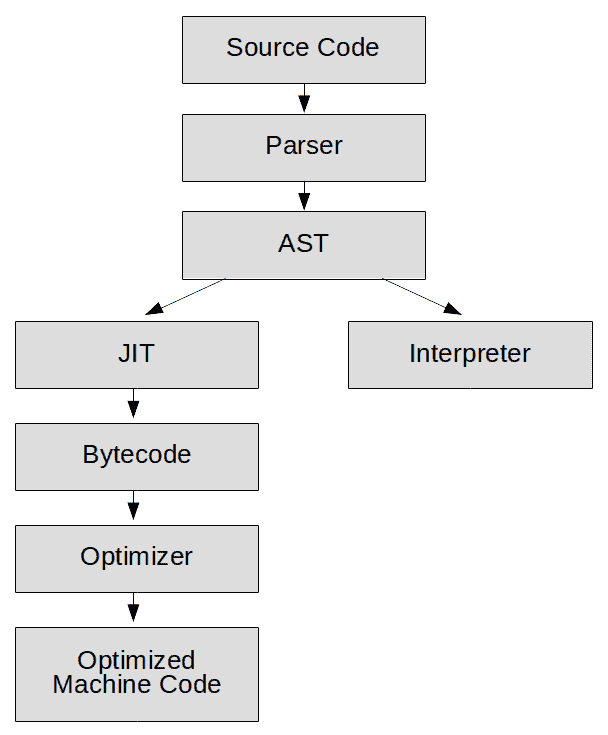
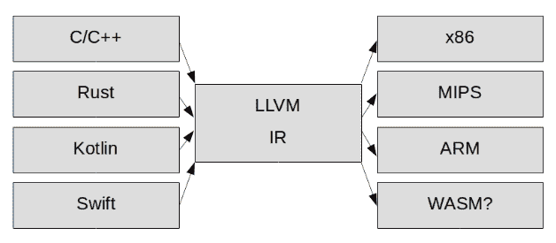
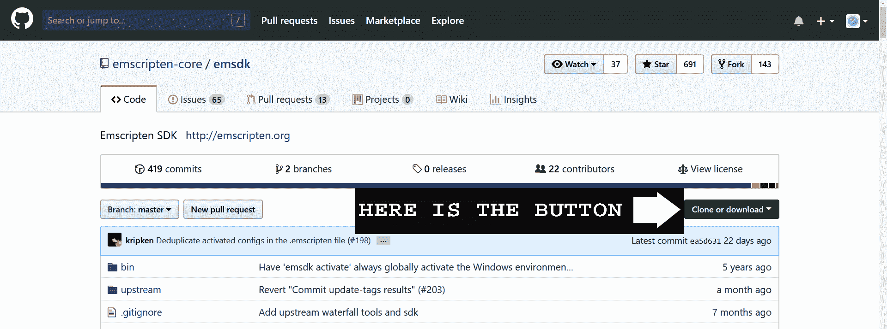

# 网络组装和电子脚本简介

欢迎来到激动人心的网络组装新世界！对于网络组装来说，这些都是早期的事情，但是这项技术目前正在像火箭一样起飞，通过阅读这本书，你可以从底层进入。如果你对网络游戏开发感兴趣，或者你有兴趣尽可能多地了解这项新技术，以便在它成熟时为自己定位，那么你就来对地方了。尽管 WebAssembly 还处于起步阶段，但所有主要的浏览器供应商都采用了它。这些都是早期，用例有限，但幸运的是，游戏开发是其中之一。所以，如果你想早点参加下一代网络应用开发的聚会，继续读下去，冒险家！

在这一章中，我将向您介绍 WebAssembly、Emscripten 以及一些关于 WebAssembly 的底层技术。我将教你 Emscripten 工具链的基础知识，以及如何使用 Emscripten 将 C++代码编译成 WebAssembly。我们将讨论什么是 LLVM，以及它如何适应 Emscripten 工具链。我们将讨论 WebAssembly 的**最小可行产品** ( **MVP** )、当前 MVP 形式的 WebAssembly 的最佳用例，以及 WebAssembly 即将推出的产品。我来介绍一下**网页组装文字** ( **)。wat** )，我们如何用它来理解 WebAssembly 字节码的设计，以及它与其他机器字节码的区别。我们还将简要讨论 **asm.js** ，及其在 WebAssembly 设计中的历史意义。最后，我将向您展示如何在 Windows 和 Linux 上安装和运行 Emscripten。

在本章中，我们将涵盖以下主题:

*   什么是网络组装？
*   为什么我们需要网络组装？
*   为什么 WebAssembly 比 JavaScript 快？
*   WebAssembly 会取代 JavaScript 吗？
*   什么是 asm.js？
*   LLVM 简介
*   网络组装文本简介
*   什么是 Emscripten，我们如何使用它？

# 什么是网络组装？

WebAssembly 不是像 JavaScript 那样的高级编程语言，而是所有主要浏览器目前都能执行的编译二进制格式。WebAssembly 是一种机器字节码，其设计目的不是直接在任何真实的机器硬件上运行，而是在每个浏览器内置的 JavaScript 引擎中运行。在某些方面，它类似于旧的 **Java 虚拟机**(**JVM**)；例如，它是独立于平台的编译字节码。JavaScript 字节码的一个主要问题是，它要求在浏览器中下载并安装一个插件来运行字节码。**网络组件**不仅设计为在没有插件的浏览器中直接运行，还旨在产生一种紧凑的二进制格式，在网络浏览器中高效执行。该规范的 MVP 版本利用了浏览器制造商设计他们的 JavaScript **即时** ( **JIT** )编译器的现有工作。WebAssembly 目前是一项年轻的技术，计划进行许多改进。然而，使用当前版本 WebAssembly 的开发人员已经看到性能比 JavaScript 提高了 10–800%。

An MVP is the smallest set of features that can be given to a product to allow it to appeal to early adopters. Because the current version is an MVP, the feature set is small. For more information, see this excellent article discussing the "post-MVP future" of WebAssembly: [https://hacks.mozilla.org/2018/10/webassemblys-post-mvp-future/](https://hacks.mozilla.org/2018/10/webassemblys-post-mvp-future/).

# 为什么我们需要网络组装？

JavaScript 已经存在很长时间了。它已经从一种允许在网页上添加花哨功能的小脚本语言发展成为一种具有庞大生态系统的扩展 JIT 编译语言，可以用来编写成熟的应用程序。如今，JavaScript 正在做许多可能是网景在 1995 年创建时从未想象过的事情。JavaScript 是一种解释语言，这意味着它必须被动态解析、编译和优化。JavaScript 也是一种动态类型语言，这给优化器带来了麻烦。

Franziska Hinkelmann, a member of the Chrome V8 team, gave a great talk at the *Web Rebels 2017* conference where she discusses all the performance improvements made to JavaScript over the past 20 years, as well as the difficulties they had in squeezing every bit of performance imaginable out of the JavaScript V8 engine: [https://youtu.be/ihANrJ1Po0w](https://youtu.be/ihANrJ1Po0w).

WebAssembly 解决了很多 JavaScript 及其在浏览器中的悠久历史所带来的问题。因为 JavaScript 引擎已经是字节码格式，所以它不需要运行解析器，这消除了我们应用程序执行中的一个重要瓶颈。这种设计还允许 JavaScript 引擎知道它一直在处理什么数据类型。字节码使优化变得更加容易。这种格式允许浏览器中的多个线程同时编译和优化代码的不同部分。

For a detailed explanation of what is happening when the Chrome V8 engine is parsing code, please refer to this video from the *JSConf EU 2017*, in which Marja Hölttä (who works on the Chrome V8 tool) goes into more detail than you ever imagined you wanted to learn about parsing JavaScript: [https://www.youtube.com/watch?v=Fg7niTmNNLg&t=123s](https://www.youtube.com/watch?v=Fg7niTmNNLg&t=123s).

WebAssembly 不是一种高级编程语言，而是一个带有虚拟机操作码的二进制文件。目前被认为处于 MVP 发展阶段。这项技术仍处于起步阶段，但即使是现在，它也为许多用例(如游戏开发)提供了显著的性能和文件大小优势。由于 WebAssembly 目前的局限性，我们只有两种语言可供选择——C/c++或 Rust。WebAssembly 的长期计划是为其开发支持多种编程语言。如果我想在最底层的抽象层次上写，我可以在**Web Assembly Text**(**WAT**)中编写所有内容，但是 WAT 是作为一种支持调试和测试的语言开发的，并不打算被开发人员用于编写应用程序。

# 为什么 WebAssembly 比 JavaScript 快？

正如我提到的，网络组装比 JavaScript 快 10-800%，这取决于应用程序。为了理解其中的原因，我需要简单介绍一下 JavaScript 引擎在运行 JavaScript 代码时会做什么，以及在运行 WebAssembly 时必须做什么。我将具体谈论 V8(Chrome JavaScript 引擎)，尽管据我所知，在 SpiderMonkey (Firefox)和 Chakra (IE & Edge) JavaScript 引擎中也存在相同的一般过程。

JavaScript 引擎做的第一件事是将你的源代码解析成一个**抽象语法树** ( **AST** )。根据应用程序中的逻辑，源代码被分成分支和叶。此时，解释器开始处理您当前正在执行的语言。多年来，JavaScript 只是一种解释语言，因此，如果您在 JavaScript 中运行相同的代码 100 次，JavaScript 引擎必须将该代码转换为机器代码 100 次。可以想象，这是非常低效的。

Chrome 浏览器在 2008 年推出了第一个 JavaScript JIT 编译器。准时制编译器与超前时间的编译器形成对比，前者编译你的代码，而后者运行该代码。一个探查器坐在那里观察 JavaScript 的执行，寻找重复执行的代码。每当它看到执行了几次的代码时，它会将该代码标记为“温暖的”，以便进行 JIT 编译。然后，编译器编译该 JavaScript“存根”代码的字节码表示。这个字节码通常是一个**中间表示** ( **IR** )，从机器特定的汇编语言中去除了一步。对存根进行解码将比下次通过我们的解释器运行相同的代码行要快得多。

以下是运行 JavaScript 代码所需的步骤:



Figure 1.1: Steps required by a modern JavaScript engine

当所有这些都在进行的时候，有一个**优化编译器**正在监视分析器的“热”代码分支。然后，优化编译器将这些代码分支，并将由 JIT 创建的字节码优化为高度优化的机器代码。至此，JavaScript 引擎已经创建了一些超级快速运行的代码，但是有一个陷阱(或者可能是几个陷阱)。

JavaScript 引擎必须对数据类型做一些假设，以获得优化的机器代码。问题是，JavaScript 是一种动态类型的语言。动态类型使程序员更容易学习如何编写 JavaScript，但对于代码优化者来说，这是一个糟糕的选择。我经常看到的例子是当 JavaScript 看到表达式`c = a + b`时会发生什么(尽管我们几乎可以将这个例子用于任何表达式)。

几乎所有执行此操作的机器代码都分三步完成:

1.  将`a`值载入寄存器。

2.  将`b`值添加到寄存器中。
3.  然后将寄存器存入`c`。

以下伪代码摘自 *ECMAScript 2018 语言规范*第 12.8.3 节，描述了在 JavaScript 中使用加法运算符(+)时必须运行的代码:

```cpp
1\. Let lref be the result of evaluating AdditiveExpression.
2\. Let lval be ? GetValue(lref).
3\. Let rref be the result of evaluating MultiplicativeExpression.
4\. Let rval be ? GetValue(rref).
5\. Let lprim be ? ToPrimitive(lval).
6\. Let rprim be ? ToPrimitive(rval).
7\. If Type(lprim) is String or Type(rprim) is String, then
   a. Let lstr be ? ToString(lprim).
   b. Let rstr be ? ToString(rprim).
   c. Return the string-concatenation of lstr and rstr.
8\. Let lnum be ? ToNumber(lprim).
9\. Let rnum be ? ToNumber(rprim).
10.Return the result of applying the addition operation to lnum and      
   rnum.
```

You can find the *ECMAScript® 2018 Language Specification* on the web at [https://www.ecma-international.org/ecma-262/9.0/index.html](https://www.ecma-international.org/ecma-262/9.0/index.html).

这个伪代码不是我们必须评估的全部。这些步骤中有几个是调用高级函数，而不是运行机器代码命令。`GetValue`例如，有 11 个自己的步骤，依次调用其他步骤。所有这些都可能导致数百个机器操作码。这里发生的绝大多数事情是类型检查。在 JavaScript 中，当您执行`a + b`时，这些变量中的每一个都可以是以下任何一种类型:

*   整数
*   浮动
*   线
*   目标
*   这些的任意组合

更糟糕的是，JavaScript 中的对象也是高度动态的。例如，也许您已经定义了一个名为`Point`的函数，并使用新的运算符用该函数创建了两个对象:

```cpp
function Point( x, y ) {
    this.x = x;
    this.y = y;
}

var p1 = new Point(1, 100);
var p2 = new Point( 10, 20 );
```

现在我们有两个点共享同一个类。假设我们添加了这一行:

```cpp
p2.z = 50;
```

这意味着这两点将不再共享同一个类。实际上，`p2`已经成为一个全新的类，这对于该对象在内存中的位置和可用的优化有影响。JavaScript 被设计成一种高度灵活的语言，但这一事实造成了许多死角，而死角使优化变得困难。

由 JavaScript 的动态特性造成的优化的另一个问题是，没有任何优化是确定的。所有关于类型的优化都必须使用资源不断检查它们的类型假设是否仍然有效。此外，优化器必须保留未优化的代码，以防这些假设被证明是错误的。优化器可以确定最初做出的假设不是正确的假设。这将导致“紧急情况”，优化器将丢弃其优化的代码并进行去优化，从而导致性能不一致。

最后，JavaScript 是一种带有**垃圾收集** ( **GC** )的语言，它允许 JavaScript 代码的作者在编写代码时承担更少的内存管理负担。虽然这对开发人员来说很方便，但它只是在运行时将内存管理的工作推给了机器。多年来，GC 在 JavaScript 中的效率已经提高了很多，但它仍然是 JavaScript 引擎在运行 JavaScript 时必须做的工作，而在运行 WebAssembly 时不需要做。

执行 WebAssembly 模块删除了运行 JavaScript 代码所需的许多步骤。WebAssembly 消除了解析，因为 AOT 编译器完成了该功能。翻译是不必要的。我们的 JIT 编译器正在进行从字节码到机器代码的近乎一对一的翻译，速度非常快。由于 WebAssembly 中不存在的动态类型，JavaScript 需要进行大部分优化。硬件不可知的优化可以在网络程序集编译之前在 AOT 编译器中完成。JIT 优化器只需要执行特定于硬件的优化，而 WebAssembly AOT 编译器却不能。

以下是 JavaScript 引擎运行网络程序集二进制文件时执行的步骤:


Figure 1.2: The steps required to execute WebAssembly

我想提到的最后一点不是当前 MVP 的一个特性，而是 WebAssembly 支持的潜在未来。所有让现代 JavaScript 变快的代码都会占用内存。保留未优化的救助代码的旧副本会占用内存。解析器、解释器和垃圾收集器都会占用内存。在我的桌面上，Chrome 经常占用大约 1 GB 的内存。通过使用[https://www.classicsolitaire.com](https://www.classicsolitaire.com)在我的网站上运行一些测试，我可以看到在 JavaScript 引擎打开的情况下，Chrome 浏览器占用了大约 654 MB 的内存。

以下是任务管理器截图:


Figure 1.3: Chrome Task Manager process screenshot with JavaScript

关闭 JavaScript 后，Chrome 浏览器占用约 295MB。

以下是任务管理器截图:


Figure 1.4: Chrome Task Manager process screenshot without JavaScript

因为这是我的一个网站，我知道那个网站上只有几百千字节的 JavaScript 代码。让我感到有点震惊的是，运行这么少量的 JavaScript 代码可以增加大约 350 MB 的浏览器占用空间。目前，WebAssembly 运行在现有的 JavaScript 引擎之上，仍然需要相当多的 JavaScript 粘合代码才能使一切正常工作，但从长远来看，WebAssembly 不仅可以让我们加快在 web 上的执行速度，还可以让我们以更小的内存占用来完成这项工作。

# WebAssembly 会取代 JavaScript 吗？

这个问题的简单答案是不会很快。目前，WebAssembly 还处于 MVP 阶段。在这一阶段，用例的数量仅限于网络组装与 JavaScript 和 **D** **文档对象模型** ( **DOM** )来回受限的应用程序。WebAssembly 目前还不能直接与 DOM 进行交互，Emscripten 使用 JavaScript“粘合代码”来实现这种交互。这种交互可能很快就会改变，可能在您阅读这篇文章的时候，但是在接下来的几年里，网络组装将需要额外的功能来增加可能的用例数量。

WebAssembly 不是一个“功能完整”的平台。目前，它不能用于任何需要 GC 的语言。这种情况将会改变，最终，几乎所有强类型语言都将以网络组装为目标。此外，WebAssembly 将很快与 JavaScript 紧密集成，允许 React、Vue 和 Angular 等框架开始用 WebAssembly 替换其大量 JavaScript 代码，而不会影响**应用程序编程接口** ( **API** )。React 团队目前正在努力改进 React 的性能。

从长远来看，JavaScript 有可能编译成 WebAssembly。由于技术原因，这还有很长的路要走。JavaScript 不仅需要 GC(目前不支持)，而且由于其动态特性，JavaScript 还需要运行时分析器来优化。因此，JavaScript 将产生优化非常差的代码，或者需要进行重大修改来支持严格的类型。更有可能的是，一种语言，比如 TypeScript，会添加允许它编译成 WebAssembly 的特性。

The *AssemblyScript* project in development on GitHub is working on a TypeScript-to-WebAssembly compiler. This project creates JavaScript and uses Binaryen to compile that JavaScript into WebAssembly. How AssemblyScript handles the problem of garbage collection is unclear. For more information, refer to [https://github.com/AssemblyScript/assemblyscript](https://github.com/AssemblyScript/assemblyscript).

JavaScript 目前在网络上无处不在；有大量用 JavaScript 开发的库和框架。即使有一大群开发人员渴望用 C++或 Rust 重写整个 web，WebAssembly 也还没有准备好取代这些 JavaScript 库和框架。浏览器制造商已经付出了巨大的努力来使 JavaScript 运行得(相对)快，所以 JavaScript 可能仍然是网络的标准脚本语言。网络将永远需要一种脚本语言，无数的开发人员已经投入工作来使 JavaScript 成为这种脚本语言，所以 JavaScript 似乎不太可能消失。

然而，需要一种 WebAssembly 可能实现的 web 编译格式。编译代码目前可能是网络上的一个小众领域，但它几乎是其他任何地方的标准。随着 WebAssembly 接近功能完备的状态，它将提供比 JavaScript 更多的选择和更好的性能，业务、框架和库将逐渐向它迁移。

# 什么是 asm.js？

使用 JavaScript 在网络浏览器中实现类似本机速度的早期尝试是 asm.js。尽管这个目标已经实现，并且 asm.js 被所有主要的浏览器供应商采用，但它从未被开发人员广泛采用。asm.js 的美妙之处在于，它仍然可以在大多数浏览器中运行，即使是在那些没有进行优化的浏览器中。asm.js 背后的想法是，类型化数组可以在 JavaScript 中用来伪造 C++内存堆。浏览器模拟 C++中的指针和内存分配，以及类型。一个设计良好的 JavaScript 引擎可以避免动态类型检查。使用 asm.js，浏览器制造商可以通过假装这个版本的 JavaScript 不是动态类型的，来回避许多由 JavaScript 的动态特性所产生的优化问题。Emscripten 被设计为 C++到 JavaScript 的编译器，它很快采用了 asm.js 作为 JavaScript 的子集，因为它在大多数浏览器中的性能都有所提高。由 asm.js 驱动的性能改进引领了 WebAssembly 的发展。用于使 asm.js 表现良好的相同引擎修改可以用于引导 WebAssembly MVP。只需要添加一个字节码到字节码的编译器，就可以获取 WebAssembly 字节码，并直接将其转换为浏览器使用的 IR 字节码。

At the time of writing, Emscripten does not compile directly from LLVM to WebAssembly. Instead, it compiles to asm.js and uses a tool called Binaryen to convert the asm.js output from Emscripten into WebAssembly.

# LLVM 简介

Emscripten 是我们将用来把 C++编译成 WebAssembly 的工具。在讨论 Emscripten 之前，我需要解释一种称为 LLVM 的技术及其与 Emscripten 的关系。

首先，花点时间想想航空公司(和我一起呆在这里)。航空公司想把乘客从一个机场送到另一个机场。但是提供从地球上每一个机场到每一个其他机场的直达航班是具有挑战性的。这意味着航空公司将不得不提供大量直飞航班，如俄亥俄州阿克伦至印度孟买的航班。让我们回到 20 世纪 90 年代——那是编译器世界的状态。如果你想从 C++编译到 ARM，你需要一个能够将 C++编译到 ARM 的编译器。如果你需要从 Pascal 编译到 x86，你需要一个能够从 Pascal 编译到 x86 的编译器。这就像任何两个城市之间都只有直达航班:语言和硬件的每一个组合的编译器。结果要么是你必须限制你为之编写编译器的语言的数量，限制你可以用那种语言支持的平台的数量，或者更可能的是，两者兼而有之。

2003 年，伊利诺伊大学的一位名叫克里斯·拉特纳的学生想知道，“如果我们为编程语言创建一个中心辐射模型会怎么样？”他的想法导致了 LLVM，它最初代表“低级虚拟机”我们的想法是，不是为任何可能的发行版编译源代码，而是为 LLVM 编译它。中间语言和最终输出语言之间有编译器。理论上，这意味着如果您在下图的右侧开发一个新的目标平台，您将立即在左侧获得所有语言:



Figure 1.5: LLVM as a hub between programming languages and the hardware To learn more about LLVM, visit the LLVM project home page at [https://llvm.org](https://llvm.org) or read the *LLVM Cookbook*, *Mayur Padney*, *and Suyog Sarda*, *Packt Publishing*: [https://www.packtpub.com/application-development/llvm-cookbook](https://www.packtpub.com/application-development/llvm-cookbook).

# 网络组装文本简介

WebAssembly 二进制不是一种语言，而是一种类似于为 ARM 或 x86 构建的构建目标。然而，字节码的结构不同于其他特定于硬件的构建目标。网络组装字节码的设计者考虑的是网络。目的是创建一个紧凑且可流式传输的字节码。另一个目标是，用户应该能够在 WebAssembly 二进制文件上做一个“视图/源”，看看发生了什么。WebAssembly 文本是 WebAssembly 二进制文件的伴随代码，它允许用户以人类可读的形式查看字节码指令，类似于汇编语言让您看到哪些操作码以机器可读的形式执行的方式。

对于习惯于为 ARM、x86 或 6502 等硬件编写汇编的人来说，WebAssembly 文本最初可能看起来并不熟悉(如果你是老派)。您用 S 表达式编写 WebAssembly 文本，它有一个括号很重的树结构。有些操作对于汇编语言来说也是非常高级的，比如 if/else 和循环操作码。如果你还记得 WebAssembly 不是为了直接在计算机硬件上运行而设计的，而是为了快速下载并翻译成机器代码，那就更有意义了。

当您在处理 WebAssembly 文本时，另一件在一开始看起来有点陌生的事情是缺少注册器。WebAssembly 被设计成一个虚拟的*栈机*，它是*注册机*的替代品，比如你可能熟悉的 x86 和 ARM。堆栈机器比寄存器机器具有产生小得多的字节码的优势，这是为 WebAssembly 选择堆栈机器的一个很好的理由。堆栈机器中的每个操作码都将值推上或推下堆栈，而不是使用一系列寄存器来存储和操作数字(有时两者兼而有之)。例如，对 WebAssembly 中`i32.add`的调用从堆栈中取出两个 32 位整数，将它们相加，然后将它们的值推回到堆栈中。计算机硬件可以充分利用任何可用于执行该操作的寄存器。

# 埃姆斯彭

既然我们知道了 LLVM 是什么，我们就可以讨论 Emscripten 了。Emscripten 是为了将 LLVM IR 编译成 JavaScript 而开发的，但最近被更新为将 LLVM 编译成 WebAssembly。这个想法是，当你让 LLVM 编译器工作时，你可以受益于所有编译成 LLVM IR 的语言。实际上，WebAssembly 规范仍处于早期阶段，不支持 GC 等通用语言功能。因此，目前只支持 C/C++和 Rust 等非 GC 语言。WebAssembly 仍处于其开发的早期 MVP 阶段，但 GC 和其他通用语言功能的添加很快就会到来。当这种情况发生时，将编译成网络程序集的编程语言应该会激增。

当 Emscripten 在 2012 年发布时，它的初衷是一个 LLVM 到 JavaScript 的编译器。2013 年，加入了对 asm.js 的支持，这是一种更快、更容易优化的 JavaScript 语言子集。2015 年，Emscripten 开始增加对 LLVM 到 WebAssembly 编译的支持。Emscripten 还为 C++和 JavaScript 提供了一个**软件开发工具包** ( **SDK** )，它提供了粘合代码，为用户提供了比目前仅由 WebAssembly MVP 提供的更好的 JavaScript 和 WebAssembly 之间的交互工具。Emscripten 还集成了一个名为 Clang 的 C/C++到 LLVM 编译器，这样你就可以把你的 C++编译成 WebAssembly 了。此外，Emscripten 将生成项目开始所需的 HTML 和 JavaScript 粘合代码。

Emscripten is a very dynamic project and changes to the toolchain happen frequently. To stay up to date with the latest changes in Emscripten, visit the project home page at [https://emscripten.org](https://emscripten.org).

# 在 Windows 上安装电子脚本

我将保持这一部分的简短，因为这些说明可能会发生变化。您可以在电子脚本网站上找到官方的电子脚本下载和安装说明来补充这些说明:[https://emscripten.org/docs/getting_started/downloads.html](https://emscripten.org/docs/getting_started/downloads.html)。

我们需要从 GitHub 上的 emsdk 源文件下载并构建 Emscripten。首先，我们将介绍在 Windows 上做什么。

Python 2.7.12 或更高版本是先决条件。如果您没有安装高于 2.7.12 的 Python 版本，您需要从[python.org](http://python.org)获取 windows 安装程序，并首先安装该程序:[https://www.python.org/downloads/windows/](https://www.python.org/downloads/windows/)。

If you have installed Python and you are still getting errors telling you that Python is not found, you may need to add Python to your Windows PATH variable. For more information, refer to this tutorial: [https://www.pythoncentral.io/add-python-to-path-python-is-not-recognized-as-an-internal-or-external-command/](https://www.pythoncentral.io/add-python-to-path-python-is-not-recognized-as-an-internal-or-external-command/).

如果您已经安装了 Git，克隆存储库相对简单:

1.  运行以下命令克隆存储库:

```cpp
git clone https://github.com/emscripten-core/emsdk.git
```

2.  无论你在哪里运行这个命令，它都会创建一个`emsdk`目录。使用以下命令输入该目录:

```cpp
cd emsdk
```

您可能没有安装 Git，在这种情况下，以下步骤将使您跟上进度:

1.  在网络浏览器中访问以下网址:[https://github.com/emscripten-core/emsdk](https://github.com/juj/emsdk)。
2.  您将在右侧看到一个绿色按钮，上面写着克隆或下载。下载压缩文件:



3.  将下载的文件解压到`c:\emsdk`目录。
4.  在开始菜单中输入`cmd`并按*进入*，打开一个窗口命令提示符。
5.  在那里，您可以通过键入以下内容来切换到`c:\emsdk\emsdk-master`目录:

```cpp
 cd \emsdk\emsdk-master
```

此时，您是否安装了 Git 并不重要。让我们继续前进:

1.  从运行以下命令的源代码中安装`emsdk`:

```cpp
emsdk install latest
```

2.  然后激活最新的`emsdk`:

```cpp
emsdk activate latest
```

3.  最后，设置我们的路径和环境变量:

```cpp
emsdk_env.bat
```

This last step will need to be rerun from your install directory every time you open a new command-line window. Unfortunately, it does not permanently set the Windows environment variables. Hopefully, that will change in the future.

# 在 Ubuntu 上安装 Emscripten

如果您正在 Ubuntu 上安装，您应该能够使用`apt-get`包管理器和 git 来完成安装。让我们继续前进:

1.  Python 是必需的，因此如果您没有安装 Python，请确保运行以下命令:

```cpp
sudo apt-get install python
```

2.  如果您尚未安装 Git，请运行以下命令:

```cpp
sudo apt-get install git
```

3.  现在您需要为`emsdk`克隆 Git 存储库:

```cpp
git clone https://github.com/emscripten-core/emsdk.git
```

4.  更改您的目录，进入`emsdk`目录:

```cpp
cd emsdk
```

5.  从这里，您需要安装最新版本的 SDK 工具，激活它，并设置您的环境变量:

```cpp
./emsdk install latest
./emsdk activate latest
source ./emsdk_env.sh
```

6.  要确保一切安装正确，请运行以下命令:

```cpp
emcc --version
```

# 使用 Emscripten

我们从命令行运行 Emscripten 因此，您可以使用您选择的任何文本编辑器来编写您的 C/C++代码。个人比较偏爱 Visual Studio Code，可以在这里下载:[https://code.visualstudio.com/download](https://code.visualstudio.com/download)。

Visual Studio Code 的一个优点是它有一个内置的命令行终端，可以让你在不切换窗口的情况下编译代码。它还有一个优秀的 C/C++扩展，你可以安装。只需从扩展菜单中搜索 C/C++并安装微软 C/C++ Intellisense 扩展即可。

无论您为文本编辑器或集成开发环境选择什么，您都需要一段简单的 C 代码来测试 emcc 编译器。

1.  创建一个新的文本文件并命名为`hello.c`。
2.  将以下代码输入`hello.c`:

```cpp
#include <emscripten.h>
#include <stdlib.h>
#include <stdio.h>

int main() {
    printf("hello wasm\n");
}
```

3.  现在我可以把`hello.c`文件编译成 WebAssembly，生成一个`hello.html`文件:

```cpp
emcc hello.c --emrun -o hello.html
```

4.  如果您想从`emrun`运行 HTML 页面，则`--emrun`标志是必需的。该标志添加将捕获`stdout`、`stderr`的代码，并在 C 代码中退出，`emrun`没有它将不起作用:

```cpp
emrun --browser firefox hello.html
```

用`--browser`标志运行`emrun`将选择您想要运行脚本的浏览器。`emrun`的行为似乎因浏览器而异。当 C 程序退出时，Chrome 会关闭窗口。这可能很烦人，因为我们只是想显示一个简单的打印信息。如果你有火狐，我建议用`--browser`旗运行`emrun`。

I do not want to imply that Chrome cannot run WebAssembly. Chrome does have different behavior when a WebAssembly module exits. Because I was trying to keep our WebAssembly module as simple as possible, it exits when the main function completes. That is what is causing problems in Chrome. These problems will go away later when we learn about game loops.

要了解哪些浏览器可供您使用，请运行以下命令:

```cpp
emrun --list_browsers
```

`emrun`应该在浏览器中打开一个 Emscripten 模板化的 HTML 文件。

确保您有一个能够运行 WebAssembly 的浏览器。以下版本的主要浏览器应该可以使用网络组件:

*   边缘 16
*   火狐 52
*   铬合金 57
*   Safari 11
*   歌剧 44

If you are familiar with setting up your own web server, you may want to consider using it rather than emrun. After using emrun for the first few chapters of this book, I returned to using my Node.js web server. I found it easier to have a Node-based web server up and running at all times, rather than restarting the emrun web server every time I wanted to test my code. If you know how to set up an alternative web server (such as one for Node, Apache, and IIS), you may use whatever web server you prefer. Although IIS requires some additional configuration to handle WebAssembly MIME types.

# 其他安装资源

为 Emscripten 创建安装指南会有些问题。WebAssembly 技术经常变化，当您阅读本文时，Emscripten 的安装过程可能会有所不同。如果您有任何问题，我建议您参考 Emscripten 网站上的下载和安装说明:[https://emscripten.org/docs/getting_started/downloads.html](https://emscripten.org/docs/getting_started/downloads.html)。

你也可以参考 GitHub 上的 Emscripten 页面:[https://github.com/emscripten-core/emsdk](https://github.com/emscripten-core/emsdk)。

谷歌集团有一个电子脚本论坛，如果你遇到安装问题，你可以在这里提问:[https://groups.google.com/forum/?nomobile=true#！论坛/电子脚本-讨论](https://groups.google.com/forum/?nomobile=true#!forum/emscripten-discuss)。

你也可以在推特上联系我(`@battagline`)，我会尽力帮助你:[https://twitter.com/battagline](https://twitter.com/battagline)。

# 摘要

在这一章中，我们学习了什么是 WebAssembly，以及为什么它将是 web 应用程序开发的未来。我们了解了为什么我们需要网络组装，尽管我们已经有了像 JavaScript 这样强大的语言。我们了解了为什么网络组装比 JavaScript 快得多，以及它如何有潜力提高性能领先优势。我们还讨论了 WebAssembly 取代 JavaScript 作为 web 上应用程序开发的事实标准的可能性。

我们已经讨论了创建一个 WebAssembly 模块的实际方面，就像今天使用 Emscripten 和 LLVM 所做的那样。我们已经讨论了 WebAssembly 文本及其结构。我们还讨论了使用 Emscripten 来编译我们的第一个网络组装模块，以及使用它来创建运行该模块的 HTML 和 JavaScript 粘合代码。

在下一章中，我们将进一步详细介绍如何使用 Emscripten 来创建我们的 WebAssembly 模块，以及用于驱动它的 HTML/CSS 和 JavaScript。