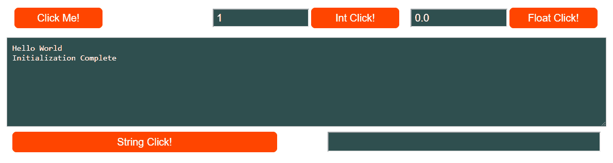
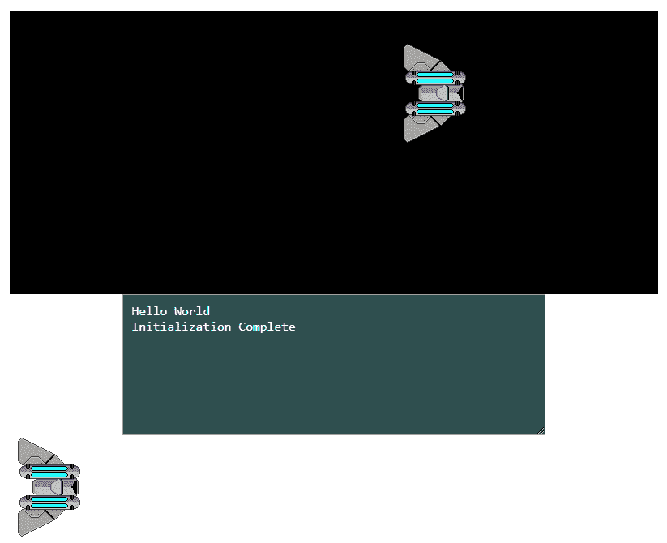

# HTML5 和网络组装

在这一章中，我们将向您展示我们为目标网络组件编写的 C 代码是如何与 HTML5、JavaScript 和 CSS 一起创建网页的。我们将教您如何创建一个新的 HTML 外壳文件，供 Emscripten 在创建我们的网络组装应用时使用。我们将讨论`Module`对象，以及 Emscripten 如何将其用作我们的 JavaScript 和 WebAssembly 模块之间的接口。我们将在我们的 HTML 页面上向您展示如何从 JavaScript 内部调用用 C 语言编写的 WebAssembly 函数。我们还将向您展示如何从我们的 C 代码中调用 JavaScript 函数。我们将讨论如何使用 CSS 来改善我们网页的外观。我们将向您介绍 HTML5 Canvas 元素，并展示如何从 JavaScript 中向 Canvas 显示图像。我们将简要讨论在 WebAssembly 模块的画布上移动这些图像。本章将让您了解一切是如何协同工作的，并为我们为网络组装应用开发的其他功能奠定基础。

Beginning with this chapter and continuing through the remainder of the book, you will need image and font files from the GitHub project to compile the examples. For this chapter, you will need the `/Chapter02/spaceship.png` image file from the project directory. Please download the project from the following URL: [https://github.com/PacktPublishing/Hands-On-Game-Development-with-WebAssembly](https://github.com/PacktPublishing/Hands-On-Game-Development-with-WebAssembly). I highly recommend working along as you read each section of this chapter. You may use your favorite code editor and the command line to follow along. Even though we have provided links to download the code directly, it cannot be emphasized enough how much you will learn by actually following edits suggested in this chapter. You are going to make mistakes and learn a lot from them. If you decide to work along, another suggestion is the following: do not proceed to the next section unless your edit/steps in the current section are successful. If you need help, contact me on twitter (`@battagline`).

在本章中，我们将涵盖以下主题:

*   Emscripten 最小外壳文件
*   创建一个新的 HTML 外壳和 C 文件
*   定义我们的 CSS
*   HTML5 与游戏开发
*   向电子脚本模板添加画布

# Emscripten 最小外壳文件

我们用 Emscripten 创建的第一个构建使用了一个默认的 HTML 外壳文件。如果你有一个网站，这可能不是你希望你的网页看起来的样子。您可能更喜欢使用特定于您的设计或业务需求的 CSS 和 HTML5 来设计您的外观。例如，我用于网站的模板通常在游戏画布的左侧和右侧包含广告。这些网站的流量就是这样被货币化的。您可以选择在游戏画布上方添加网站徽标。还有一个文本区，Emscripten 记录来自`printf`或其他标准 IO 调用的输出。您可以选择完全删除这个`textarea`元素，也可以保留它，但将其隐藏起来，因为它对以后的调试很有用。

要基于不是默认 Emscripten shell 的新 shell 文件构建 HTML 文件，我们必须使用`--shell-file`参数，将我们想要使用的新 HTML 模板文件传递给它，而不是 Emscripten 的默认值。新的`emcc`命令将如下所示:

```cpp
emcc hello.c --shell-file new_shell.html --emrun -o hello2.html
```

暂时不要执行这个命令。我们的项目目录中当前没有`new_shell.html`文件，因此在该文件存在之前运行命令将导致错误消息。我们需要创建`new_shell.html`文件，并将其用作 HTML 外壳，而不是 Emscripten 的默认 HTML 外壳。该 shell 文件必须遵循特定的格式。要构建它，我们必须从 Emscripten 的最小 HTML shell 文件开始，您可以在 GitHub 上找到它:

[https://github . com/em script en-core/em script en/blob/master/src/shell _ minimum . html](https://github.com/emscripten-core/emscripten/blob/master/src/shell_minimal.html)

我们将使用`shell_minimal.html`文件作为起点，编写自己的 HTML 外壳。最小外壳中的大部分内容是不需要的，因此我们将对其进行一些重要的编辑。我们将删除大部分代码来满足我们的目的。当您在文本编辑器中打开`shell_minimal.html`时，您会看到它以一个标准的 HTML 标题和一个`style`标签开始:

```cpp
<style>
 .emscripten { padding-right: 0; margin-left: auto; margin-right: auto;    
               display: block; }
 textarea.emscripten { font-family: monospace; width: 80%; }
 div.emscripten { text-align: center; }
 div.emscripten_border { border: 1px solid black; }
 /* the canvas *must not* have any border or padding, or mouse coords 
    will be wrong */
 canvas.emscripten { border: 0px none; background-color: black; }
 .spinner {
            height: 50px;
            width: 50px;
            margin: 0px auto;
            -webkit-animation: rotation .8s linear infinite;
            -moz-animation: rotation .8s linear infinite;
            -o-animation: rotation .8s linear infinite;
            animation: rotation 0.8s linear infinite;
            border-left: 10px solid rgb(0,150,240);
            border-right: 10px solid rgb(0,150,240);
            border-bottom: 10px solid rgb(0,150,240);
            border-top: 10px solid rgb(100,0,200);
            border-radius: 100%;
            background-color: rgb(200,100,250);
          }
 @-webkit-keyframes rotation {
         from {-webkit-transform: rotate(0deg);}
         to {-webkit-transform: rotate(360deg);}
  }
 @-moz-keyframes rotation {
         from {-moz-transform: rotate(0deg);}
         to {-moz-transform: rotate(360deg);}
 }
 @-o-keyframes rotation {
         from {-o-transform: rotate(0deg);}
         to {-o-transform: rotate(360deg);}
 }
 @keyframes rotation {
         from {transform: rotate(0deg);}
         to {transform: rotate(360deg);}
 }
 </style>
```

This code is based on the version of `shell_minimal.html` available at the time of writing. No changes to this file are anticipated. However, WebAssembly is evolving quickly. Unfortunately, we cannot say with complete certainty that this file will remain unchanged by the time you read this. As mentioned earlier, if you run into problems, please feel free to contact me on Twitter (`@battagline`).

我们删除了这个样式标签，这样你就可以用任何你喜欢的方式来设计你的代码。如果您喜欢他们的微调器加载图像并希望保留它，这是必要的，但是最好将所有这些都拉出来，并用从带有链接标签的 CSS 文件外部加载的 CSS 替换它，如下所示:

```cpp
<link href="shell.css" rel="stylesheet" type="text/css">
```

再向下滚动一点，你会看到他们使用的负载指示器。我们最终会用自己的代码替换它，但目前，我们正在本地测试所有这些，我们的文件都很小，所以我们也会删除这些代码:

```cpp
<figure style="overflow:visible;" id="spinner">
    <div class="spinner"></div>
    <center style="margin-top:0.5em"><strong>emscripten</strong></center>
</figure>
<div class="emscripten" id="status">Downloading...</div>
    <div class="emscripten">
        <progress value="0" max="100" id="progress" hidden=1></progress>
    </div>
```

之后还有一个 HTML5 `canvas`元素和一些其他与之相关的标签。我们最终将需要添加一个`canvas`元素，但是现在，我们将不使用`canvas`，所以部分代码也不是必需的:

```cpp
<div class="emscripten">
    <input type="checkbox" id="resize">Resize canvas
    <input type="checkbox" id="pointerLock" checked>Lock/hide mouse 
     pointer&nbsp;&nbsp;&nbsp;
    <input type="button" value="Fullscreen" onclick=
    "Module.requestFullscreen(document.getElementById
    ('pointerLock').checked,
            document.getElementById('resize').checked)">
 </div>
```

在`canvas`之后，有一个`textarea`元素。这也不是必须的，但是使用它作为从我的 C 代码中执行的任何`printf`命令的打印位置是很好的。外壳周围有两个`<hr/>`标签，用于格式化，因此我们也可以删除这些标签:

```cpp
 <hr/>
 <textarea class="emscripten" id="output" rows="8"></textarea>
 <hr/>
```

下一件事是我们的 JavaScript。首先，我们删除了三个代表 HTML 元素的变量，因此我们也需要删除所有这些 JavaScript 变量:

```cpp
var statusElement = document.getElementById('status');
var progressElement = document.getElementById('progress');
var spinnerElement = document.getElementById('spinner');
```

JavaScript 内部的`Module`对象是 Emscripten 生成的 JavaScript *粘合*代码用来与我们的 WebAssembly 模块交互的接口。它是 shell HTML 文件中最关键的部分，了解它在做什么至关重要。`Module`对象以两个数组开始，`preRun`和`postRun`。这些是将分别在模块加载之前和之后运行的函数数组。

```cpp
var Module = {
 preRun: [],
 postRun: [],
```

出于演示目的，我们可以向这些数组添加如下函数:

```cpp
preRun: [function() {console.log("pre run 1")},
            function() {console.log("pre run 2")}],
postRun: [function() {console.log("post run 1")},
            function() {console.log("post run 2")}],
```

这将从我们在[第 1 章](01.html)、*网络组装和电子脚本简介*中创建的 hello WASM 应用中产生以下输出:

```cpp
pre run 2
pre run 1
status: Running...
Hello wasm
post run 2
post run 1
```

Notice that the `preRun` and `postRun` functions run in the reverse order in which they are placed in the array. We could use the `postRun` array to call a function that would initialize our WebAssembly wrappers, but, for demonstration purposes, we will instead call a JavaScript function from within our C `main()` function.

`Module`对象中接下来的两个函数是`print`和`printErr`函数。`print`功能用于打印对控制台和我们命名为`output`的`textarea`的`printf`调用的输出。您可以将此`output`更改为打印出任何 HTML 标记，但是，如果您的输出是原始 HTML，则必须运行几个注释掉的文本替换调用。以下是`print`功能的样子:

```cpp
print: (function() {
    var element = document.getElementById('output');
    if (element) element.value = ''; // clear browser cache
    return function(text) {
        if (arguments.length > 1) text = 
        Array.prototype.slice.call(arguments).join(' ');
        // These replacements are necessary if you render to raw HTML
        //text = text.replace(/&/g, "&amp;");
        //text = text.replace(/</g, "&lt;");
        //text = text.replace(/>/g, "&gt;");
        //text = text.replace('\n', '<br>', 'g');
        console.log(text);
        if (element) {
            element.value += text + "\n";
            element.scrollTop = element.scrollHeight; // focus on 
            bottom
        }
    };
})(),
```

当我们的网络组件模块或粘合代码本身出现错误或警告时，`printErr`功能由粘合代码运行。`printErr`的输出只是控制台，尽管原则上，如果您想添加可以写入 HTML 元素的代码，您也可以这样做。这里是`printErr`代码:

```cpp
printErr: function(text) {
     if (arguments.length > 1) text = 
     Array.prototype.slice.call(arguments).join(' ');
     if (0) { // XXX disabled for safety typeof dump == 'function') {
       dump(text + '\n'); // fast, straight to the real console
     } else {
         console.error(text);
     }
 },
```

在`print`功能之后，还有一个`canvas`功能。设置该功能是为了提醒用户丢失的 WebGL 上下文。我们现在不需要这些代码，因为我们已经移除了 HTML 画布。当我们重新加入`canvas`元素时，我们需要恢复这个功能。更新它以处理丢失的上下文事件也是有意义的，而不仅仅是提醒用户。

```cpp
canvas: (function() {
     var canvas = document.getElementById('canvas');
     // As a default initial behavior, pop up an alert when webgl 
        context is lost. To make your
     // application robust, you may want to override this behavior 
        before shipping!
     // See http://www.khronos.org/registry/webgl/specs/latest/1.0/#5.15.2
     canvas.addEventListener("webglcontextlost", function(e) { 
        alert('WebGL context lost. You will need to reload the page.'); 
        e.preventDefault(); }, false);
     return canvas;
 })(),
```

There are several different situations when your web page could lose its WebGL context. The context is your portal into the GPU, and your app's access to the GPU is managed by both the browser and the operating system. Let's take a trip to *The Land of Metaphor*, where we imagine the GPU is a bus, the web browser is the bus driver, and the apps using their context are a bunch of rowdy middle school kids. If the bus driver (browser) feels that the kids (apps) are getting too rowdy, he can stop the bus (GPU), throw all the kids off the bus (make the apps lose their context), and let them come back one at a time if they promise to behave. 

之后，最小外壳有一些代码来跟踪模块的状态和依赖关系。在这段代码中，我们可以删除对`spinnerElement`、`progressElement`和`statusElement`的引用。稍后，如果我们选择，我们可以用元素替换这些元素来跟踪加载模块的状态，但是，目前不需要它们。下面是最小外壳中的状态和运行依赖关系监控代码:

```cpp
setStatus: function(text) {
    if (!Module.setStatus.last) Module.setStatus.last = { time: 
        Date.now(), text: '' };
    if (text === Module.setStatus.last.text) return;
    var m = text.match(/([^(]+)\((\d+(\.\d+)?)\/(\d+)\)/);
    var now = Date.now();

    // if this is a progress update, skip it if too soon
    if (m && now - Module.setStatus.last.time < 30) return; 
    Module.setStatus.last.time = now;
    Module.setStatus.last.text = text;
    if (m) {
        text = m[1];
    }
    console.log("status: " + text);
},
totalDependencies: 0,
monitorRunDependencies: function(left) {
  this.totalDependencies = Math.max(this.totalDependencies, left);
    Module.setStatus(left ? 'Preparing... (' + (this.totalDependencies-
                     left) + '/' + this.totalDependencies + ')' : 'All 
                     downloads complete.');
}
};
 Module.setStatus('Downloading...');
```

最小外壳文件中的最后一段 JavaScript 代码决定了在浏览器出错时 JavaScript 会做什么:

```cpp
window.onerror = function() {
    Module.setStatus('Exception thrown, see JavaScript console');
    Module.setStatus = function(text) {
        if (text) Module.printErr('[post-exception status] ' + text);
    };
```

在我们的 JavaScript 之后，还有一行更重要的内容:

```cpp
{{{ SCRIPT }}}
```

这个标签告诉 Emscripten 在这里放置到 JavaScript 粘合代码的链接。下面是一个编译成最终 HTML 文件的例子:

```cpp
<script async type="text/javascript" src="shell-min.js"></script>
```

`shell-min.js`是由 Emscripten 构建的 JavaScript 粘合代码。在下一节中，我们将学习如何创建自己的 HTML shell 文件。

# 创建一个新的 HTML 外壳和 C 文件

在本节中，我们将创建一个新的`shell.c`文件，该文件公开了从我们的 JavaScript 调用的几个函数。我们还将使用`EM_ASM`来调用`InitWrappers`函数，该函数将在我们将要创建的新的 HTML shell 文件中定义。这个函数将在 JavaScript 中创建包装器，可以调用在 WebAssembly 模块中定义的函数。在创建新的 HTML 外壳文件之前，我们需要创建将由 HTML 外壳内的 JavaScript 包装器调用的 C 代码:

1.  如下创建新的`shell.c`文件:

```cpp
#include <emscripten.h>
#include <stdlib.h>
#include <stdio.h>

int main() {
    printf("Hello World\n");
    EM_ASM( InitWrappers() );
    printf("Initialization Complete\n");
}

void test() {
    printf("button test\n");
}

void int_test( int num ) {
    printf("int test=%d\n", num);
}

void float_test( float num ) {
    printf("float test=%f\n", num);
}

void string_test( char* str ) {
    printf("string test=%s\n", str);
}
```

当加载网络组件模块时，`main`功能运行。此时，`Module`对象可以使用`cwrap`来创建该函数的 JavaScript 版本，我们可以将它与 HTML 元素上的`onclick`事件联系起来。在`main`函数内部，`EM_ASM( InitWrappers() );`代码调用一个`InitWrappers()`函数，这个函数是在 HTML shell 文件的 JavaScript 内部定义的。DOM 使用事件来调用接下来的四个函数。

Another way we could have initialized the wrappers is by calling the `InitWrappers()` function from the `Module` object `postRun: []` array.

我们将把对`test()`函数的调用与 DOM 中的按钮点击联系起来。通过使用`printf`语句，`int_test`函数将作为 DOM 中输入字段的值传递，并将向控制台和包含该整数的`textarea`元素打印一条消息。`float_test`功能将一个数字作为浮点传递，打印到控制台和`textarea`元素。`string_test`函数将打印出一个从 JavaScript 传入的字符串。

现在，我们将把下面的代码添加到一个 HTML shell 文件中，并将其称为`new_shell.html`。该代码基于由 Emscripten 团队创建的 *Emscripten 最小外壳文件*，并在上一节中进行了解释。我们将把整个网页分成四个部分。

首先，是 HTML 文件的开头和`head`元素:

```cpp
<!doctype html>
<html lang="en-us">
<head>
    <meta charset="utf-8">
    <meta http-equiv="Content-Type" content="text/html; charset=utf-8">
    <title>New Emscripten Shell</title>
    <link href="shell.css" rel="stylesheet" type="text/css">
</head>
```

接下来，是`body`标记的开始。之后，我们有几个 HTML `input`元素以及`textarea`元素:

```cpp
<body>
    <div class="input_box">&nbsp;</div>
    <div class="input_box">
        <button id="click_me" class="em_button">Click Me!</button>
    </div>
    <div class="input_box">
        <input type="number" id="int_num" max="9999" min="0" step="1" 
         value="1" class="em_input">
        <button id="int_button" class="em_button">Int Click!</button>
    </div>
    <div class="input_box">
        <input type="number" id="float_num" max="99" min="0" 
          step="0.01" value="0.0" class="em_input">
        <button id="float_button" class="em_button">Float Click!</button>
    </div>
    <div class="input_box">&nbsp;</div>
    <textarea class="em_textarea" id="output" rows="8"></textarea>
    <div id="string_box">
        <button id="string_button" class="em_button">String Click!</button>
        <input id="string_input">
    </div>
```

在我们的 HTML 之后，我们有了我们的`script`标签的开始，以及一些我们添加到默认 shell 文件中的 JavaScript 代码:

```cpp

 <script type='text/javascript'>
    function InitWrappers() {
        var test = Module.cwrap('test', 'undefined');
        var int_test = Module.cwrap('int_test', 'undefined', ['int']);
        var float_test = Module.cwrap('float_test', 'undefined', 
                                       ['float']);
        var string_test = Module.cwrap('string_test', 'undefined', 
                                       ['string']);
        document.getElementById("int_button").onclick = function() {

        if( int_test != null ) {
            int_test(document.getElementById('int_num').value);
        }
    }

    document.getElementById("string_button").onclick = function() {
        if( string_test != null ) {
            string_test(document.getElementById('string_input').value);
        }
    }

    document.getElementById("float_button").onclick = function() {
        if( float_test != null ) {
            float_test(document.getElementById('float_num').value);
        }
    }

    document.getElementById("click_me").onclick = function() {
        if( test != null ) {
            test();
        }
    }
 }

function runbefore() {
    console.log("before module load");
}

function runafter() {
    console.log("after module load");
}
```

接下来，我们有了从默认 shell 文件中引入的`Module`对象。在`Module`对象之后，我们有了`script`标记的结尾，`{{{ SCRIPT }}}`标记在编译时被 Emscripten 替换，以及我们文件中的结尾标记:

```cpp
var Module = {
    preRun: [runbefore],
    postRun: [runafter],
    print: (function() {
        var element = document.getElementById('output');
        if (element) element.value = ''; // clear browser cache
            return function(text) {
                if (arguments.length > 1) text = 
                   Array.prototype.slice.call(arguments).join(' ');
                /*
                // The printf statement in C is currently writing to a 
                   textarea. If we want to write
                // to an HTML tag, we would need to run these lines of 
                   codes to make our text HTML safe
                text = text.replace(/&/g, "&amp;");
                text = text.replace(/</g, "&lt;");
                text = text.replace(/>/g, "&gt;");
                text = text.replace('\n', '<br>', 'g');
                */
                console.log(text);
                if (element) {
                    element.value += text + "\n";
                    element.scrollTop = element.scrollHeight; 
                     // focus on bottom
                } 
            };
        })(),
        printErr: function(text) {
            if (arguments.length > 1) text = 
                Array.prototype.slice.call(arguments).join(' ');
            if (0) { // XXX disabled for safety typeof dump == 
                       'function') {
                dump(text + '\n'); // fast, straight to the real                     console
            } else {
                console.error(text);
            }
        },
        setStatus: function(text) {
            if (!Module.setStatus.last) Module.setStatus.last = { time: 
                Date.now(), text: '' };
            if (text === Module.setStatus.last.text) return;
            var m = text.match(/([^(]+)\((\d+(\.\d+)?)\/(\d+)\)/);
            var now = Date.now();

            // if this is a progress update, skip it if too soon
            if (m && now - Module.setStatus.last.time < 30) return;
            Module.setStatus.last.time = now;
            Module.setStatus.last.text = text;

            if (m) {
                text = m[1];
            }
            console.log("status: " + text);
        },
        totalDependencies: 0,
        monitorRunDependencies: function(left) {
            this.totalDependencies = Math.max(this.totalDependencies,                                               
                                              left);
            Module.setStatus(left ? 'Preparing... (' + 
            (this.totalDependencies-left) + '/' +             
            this.totalDependencies + ')' : 'All downloads complete.');
        }
    };
    Module.setStatus('Downloading...');
    window.onerror = function() {
    Module.setStatus('Exception thrown, see JavaScript console');
    Module.setStatus = function(text) {
        if (text) Module.printErr('[post-exception status] ' + text);
    };
};
</script>
{{{ SCRIPT }}}
</body>
</html>
```

前面四个部分都组成了一个名为`new_shell.html`的外壳文件。您可以通过将最后四个部分键入一个名为`new_shell.html`的文件来创建该代码，或者您可以从我们的 GitHub 页面下载该文件，网址为[https://GitHub . com/packt publishing/hand-Game-Development-with-WebAssembly/blob/master/chapter 02/new _ shell . html](https://github.com/PacktPublishing/Hands-On-Game-Development-with-WebAssembly/blob/master/Chapter02/new_shell.html)。

现在我们已经看到了大块的整个`new_shell.html`文件，我们可以花一点时间分解基本部分，并在粒度级别上对其进行检查。您会注意到，我们删除了所有的 CSS 样式代码，并创建了一个新的`shell.css`文件，包括以下行:

```cpp
<link href="shell.css" rel="stylesheet" type="text/css">
```

接下来，我们修改了该文件中的 HTML 代码，以创建将与网络组装模块交互的元素。首先，我们将在网络组装模块中添加一个调用`test()`函数的按钮:

```cpp
<div class="input_box">
    <button id="click_me" class="em_button">Click Me!</button>
</div>
```

我们将在已经创建的`shell.css`文件中设置按钮及其包含的`div`元素的样式。我们需要在稍后编写的 JavaScript 代码中定义这个`button`元素的`onclick`事件将调用的函数。我们将对 HTML 中定义的两个输入/按钮对进行类似的操作，如下面的代码块所示:

```cpp
<div class="input_box">
    <input type="number" id="int_num" max="9999" min="0" step="1" 
     value="1" class="em_input">
    <button id="int_button" class="em_button">Int Click!</button>
</div>
<div class="input_box">
    <input type="number" id="float_num" max="99" min="0" step="0.01" 
     value="0.0" class="em_input">
    <button id="float_button" class="em_button">Float Click!</button>
</div>
```

就像我们对第一个`button`元素所做的那样，我们将把接下来的两个按钮与调用网络组装模块的函数联系起来。这些函数调用还将把`input`元素中定义的值传递给网络组装函数。我们将`textarea`元素作为发生在网络组装模块中的`printf`调用的输出。我们在 CSS 文件中对其进行了不同的样式设计，但是我们将保持功能不变:

```cpp
<textarea class="em_textarea" id="output" rows="8"></textarea>
<div id="string_box">
    <button id="string_button" class="em_button">String Click!</button>
    <input id="string_input">
</div>
```

在`textarea`元素下面，我们又增加了一个`button`和一个`string` `input`元素。该按钮将调用 WebAssembly 模块内的`string_test`函数，将`string_input`元素内的值作为 C `char*`参数传递给它。

现在我们已经定义了 HTML 中需要的所有元素，我们将遍历并添加一些 JavaScript 代码，将 JavaScript 和 WebAssembly 模块绑定在一起。我们首先需要做的是定义`InitWrappers`函数。`InitWrappers`将从 C 代码中的`main`函数内部调用:

```cpp
function InitWrappers() {
    var test = Module.cwrap('test', 'undefined');
    var int_test = Module.cwrap('int_test', 'undefined', ['int']);
    var float_test = Module.cwrap('float_test', 'undefined', 
                                   ['float']);
    var string_test = Module.cwrap('string_test', 'undefined',
                                     ['string']);
    document.getElementById("int_button").onclick = function() {
        if( int_test != null ) {
            int_test(document.getElementById('int_num').value);
        }
    }

    document.getElementById("string_button").onclick = function() {
        if( string_test != null ) {
            string_test(document.getElementById('string_input').value);
        }
    }

    document.getElementById("float_button").onclick = function() {
        if( float_test != null ) {
            float_test(document.getElementById('float_num').value);
        }
    }

    document.getElementById("click_me").onclick = function() {
        if( test != null ) {
            test();
        }
    }
}
```

该函数使用`Module.cwrap`在 WebAssembly 模块内部围绕导出的函数创建 JavaScript 函数包装器。我们传递给`cwrap`的第一个参数是我们正在包装的 C 函数的名称。所有这些 JavaScript 函数都将返回`undefined`。JavaScript 没有像 C 一样的`void`类型，所以当我们在 JavaScript 中声明`return`类型时，我们需要使用`undefined`类型来代替。如果函数返回一个`int`或一个`float,`，我们需要在这里输入`'number'`值。传递到`cwrap`的最后一个参数是一个字符串数组，表示传递到网络组件模块的参数的 C 类型。

在我们定义了函数的 JavaScript 包装器之后，我们需要从按钮中调用它们。这些调用中的第一个是对 WebAssembly `int_test`函数的调用。以下是我们如何为`int_button`设置`onclick`事件:

```cpp
document.getElementById("int_button").onclick = function() {
    if( int_test != null ) {
        int_test(document.getElementById('int_num').value);
    }
}
```

我们首先要做的是检查`int_test`是否定义。如果是这样，我们调用前面解释的`int_test`包装器，将来自`int_num`输入的值传递给它。然后，我们对所有其他按钮进行类似的操作。

接下来我们要做的是创建一个`runbefore`和`runafter`函数，我们将它放在`Module`对象上的`preRun`和`postRun`数组中:

```cpp
function runbefore() {
    console.log("before module load");
}
function runafter() {
    console.log("after module load");
}
var Module = {
    preRun: [runbefore],
    postRun: [runafter],
```

这将导致“模块加载前”在模块加载前打印到控制台，而“模块加载后”在模块加载后打印。这些功能不是必需的；它们旨在展示如何在加载 WebAssembly 模块之前和之后运行代码。如果您不想从网络组装模块中的`main`函数调用`InitWrappers`函数，您可以将该函数放在`postRun`数组中。

JavaScript 代码的其余部分类似于您在由 Emscripten 创建的`shell_minimal.html`文件中找到的内容。我们删除了本演示中多余的代码，例如与`spinnerElement`、`progressElement`和`statusElement`相关的代码，以及与 HTML5 `canvas`相关的代码。并不是说将代码留在 JavaScript 中有什么问题，但是它对于我们的演示来说并不是真正必要的，所以我们删除了它，以将这个 shell 减少到所需的最低限度。

# 定义 CSS

现在我们已经有了一些基本的 HTML，我们需要创建一个新的`shell.css`文件。没有任何 CSS 样式，我们的页面看起来非常糟糕。

没有样式的页面类似于如下所示的页面:


Figure 2.1: The Hello WebAssembly app without a CSS style

幸运的是，一点点 CSS 可以让我们的网页看起来更像样。以下是我们正在创建的新`shell.css`文件的外观:

```cpp
body {
    margin-top: 20px;
}

.input_box {
    width: 20%;
    display: inline-block;
}
.em_button {
    width: 45%;
    height: 40px;
    background-color: orangered;
    color: white;
    border: 2px solid white;
    font-size: 20px;
    border-radius: 8px;
    transition-duration: 0.5s;
}

.em_button:hover {
    background-color: orange;
    color: white;
    border: 2px solid white;
}

.em_input {
    width: 45%;
    height: 20px;
    font-size: 20px;
    background-color: darkslategray;
    color: white;
    padding: 6px;
}

#output {
    background-color: darkslategray;
    color: white;
    font-size: 16px;
    padding: 10px;
    padding-right: 0;
    margin-left: auto;
    margin-right: auto;
    display: block;
    width: 60%;
}

#string_box {
    padding-top: 10px;
    margin-left: auto;
    margin-right: auto;
    display: block;
    width: 60%;
}

#string_input {
    font-size: 20px;
    background-color: darkslategray;
    color: white;
    padding: 6px;
    margin-left: 5px;
    width: 45%;
    float: right;
}
```

让我快速浏览一下我们需要做什么来设计这个页面。这本书不是关于 CSS 的书，但是粗略地涵盖一下主题并没有什么坏处。

1.  我们要做的第一件事是在页面主体上留出一点 20 像素的空白，在浏览器工具栏和页面内容之间留出一点空间:

```cpp
body {
    margin-top: 20px;
}
```

2.  我们创建了五个输入框，每个占据浏览器宽度的`20%`。左侧和右侧的框中没有任何内容，因此内容占据了浏览器宽度的 60%。它们显示为内嵌块，因此它们在屏幕上水平排列。以下是实现它的 CSS:

```cpp
.input_box {
    width: 20%;
    display: inline-block;
}
```

3.  然后，我们有几个类来使用名为`em_button`的类来设计按钮的样式:

```cpp
.em_button {
    width: 45%;
    height: 40px;
    background-color: orangered;
    color: white;
    border: 0px;
    font-size: 20px;
    border-radius: 8px;
    transition-duration: 0.2s;
}

.em_button:hover {
    background-color: orange;
}
```

我们已经设置了按钮宽度来占据包含元素的`45%`。我们将按钮高度设置为 40 像素。我们已经将按钮的颜色设置为`orangered`，文本颜色设置为`white`。我们通过将边框宽度设置为 0 像素来移除边框。我们将字体大小设置为 20 像素，并赋予它 8 像素的边框半径，这为按钮提供了圆润的外观。最后一行设置当用户悬停在按钮上时转换到新颜色所需的时间。

在我们完成`em_button`类的定义之后，我们定义`em_button:hover`类，当用户悬停在按钮上时，它会改变按钮的颜色。

Some versions of Safari require the line `-webkit-transition-duration: 0.2s;` inside the `em_button` class definition to have a transition to the hover state. Without this line, the button would instantly change from `orangered` to `orange` in some versions of Safari, rather than transitioning over 200 milliseconds.

我们定义的下一个类是`input`元素:

```cpp
.em_input {
    width: 45%;
    height: 20px;
    font-size: 20px;
    background-color: darkslategray;
    color: white;
    padding: 6px;
}
```

我们一开始就设定了`height``width``font-size`。我们将背景颜色设置为带有`white`文字的`darkslategray`。我们添加了`6`像素的填充，这样字体和`input`元素的边缘之间就有了一个小空间。

CSS 元素名称前面的`#`样式是一个 ID，而不是一个类。标识定义了一个特定的元素，其中一个类(在 CSS 中以`.`开头)可以被分配给你的 HTML 中的多个元素。下一个 CSS 样式是具有输出标识的`textarea`:

```cpp
#output {
    background-color: darkslategray;
    color: white;
    font-size: 16px;
    padding: 10px;
    margin-left: auto;
    margin-right: auto;
    display: block;
    width: 60%;
}
```

前两行设置背景和文本颜色。我们将字体大小设置为`16`像素，并添加`10`像素的填充。接下来的两行使用左右边距来居中`textarea`:

```cpp
margin-left: auto;
margin-right: auto;
```

设置`display: block;`将该元素单独放在一条线上。将宽度设置为`60%`会使元素占据包含元素的`60%`，在本例中，这是浏览器的`body`标签。

最后，我们对`string_box`和`string_input`元素进行样式化:

```cpp
#string_box {
    padding-top: 10px;
    margin-left: auto;
    margin-right: auto;
    display: block;
    width: 60%;
}

#string_input {
    font-size: 20px;
    background-color: darkslategray;
    color: white;
    padding: 6px;
    margin-left: 5px;
    width: 45%;
    float: right;
}
```

`string_box`是包含字符串按钮和字符串输入元素的框。我们垫起盒子的顶部，在`string_box`和上面的`textarea`之间增加一些空间。`margin-left: auto`和`margin-right: auto`居中。然后，我们用`display:block`和`width: 60%`让它占用网页浏览器的`60%`。

对于`string_input`元素，我们设置字体大小和颜色，并填充 6 个像素。我们设置了一个 5 像素的左边距，在元素和它的按钮之间留出一些空间。我们将其设置为占据包含元素宽度的`45%`，而`float: right`样式将元素推到包含元素的右侧。

要构建我们的应用，我们需要运行`emcc`:

```cpp
 emcc shell.c -o shell-test.html --shell-file new_shell.html -s NO_EXIT_RUNTIME=1 -s EXPORTED_FUNCTIONS="['_test', '_string_test', '_int_test', '_float_test', '_main']" -s EXTRA_EXPORTED_RUNTIME_METHODS="['cwrap', 'ccall']"
```

`EXPORTED_FUNCTIONS`用于定义从 JavaScript 调用的所有函数。它们以前面的`_`字符列出。`EXTRA_EXPORTED_RUNTIME_METHODS`用于使`cwrap`和`ccall`方法对我们 shell 文件中的 JavaScript 可用。我们目前没有使用`ccall`，这是`cwrap`的替代品，我们可能会选择在未来使用。

It is important to remember that you must run WebAssembly apps using a web server, or with `emrun`. If you would like to run your WebAssembly app using `emrun`, you must compile it with the `--emrun` flag. The web browser requires a web server to stream the WebAssembly module. If you attempt to open an HTML page that uses WebAssembly in a browser directly from your hard drive, that WebAssembly module will not load.

现在我们已经添加了一些 CSS 样式，我们有了一个外观更好的应用:



Figure 2.2: The Hello WebAssembly app with a CSS style

在下一节中，我们将讨论 HTML5 网络游戏开发。

# HTML5 与游戏开发

大部分的 HTML 渲染都是通过 HTML **文档对象模型** ( **DOM** )完成的。DOM 是所谓的*保留模式*图形库。保留模式图形保留一棵称为**场景图**的树。这个场景图跟踪我们模型中的所有图形元素以及如何渲染它们。保留模式图形的好处是开发人员可以直接管理它们。图形库完成所有繁重的工作，并为我们跟踪我们的对象以及它们呈现的位置。缺点是保留模式系统占用更多的内存，给开发人员提供的控制少得多。当我们编写 HTML5 游戏时，我们可以使用`` HTML 元素拍摄在 DOM 中渲染的图像，并使用 JavaScript 或 CSS 动画移动这些元素，以直接操纵这些图像在 DOM 中的位置。

然而，在大多数情况下，这会让游戏慢得令人痛苦。每次我们在 DOM 中移动一个对象时，它都会强制我们的浏览器重新计算 DOM 中所有其他对象的位置。正因为如此，从我们的 DOM 中操纵对象来制作网络游戏通常是行不通的。

# 即时模式与保留模式

即时模式通常被认为是保留模式的对立面，但是，在实践中，当我们为即时模式系统编写代码时，我们可能会在 API 的基础上进行构建，该 API 为我们提供了一些保留模式库的功能。立即模式迫使开发人员完成保留模式库完成的所有或大部分繁重工作。作为开发人员，我们被迫管理我们的场景图，并了解我们需要渲染什么图形对象，以及这些对象必须如何和何时渲染。简而言之，这是一个非常多的工作，但是如果做得好，回报是一个比使用 DOM 渲染更快的游戏。

你现在可能会问自己:*我如何开始使用这个即时模式的东西*？进入 HTML5 画布！2004 年，苹果公司开发了画布元素，作为苹果专有浏览器技术的即时模式显示标签。画布分割出网页的一部分，这允许我们使用即时模式渲染来渲染该区域。这将使我们能够渲染到 DOM 的一部分(画布)，而不需要浏览器重新计算 DOM 中所有元素的位置。这允许浏览器使用计算机的**图形处理单元** ( **图形处理器**)进一步优化画布的渲染。

# 向电子脚本模板添加画布

在本章的前一部分，我们讨论了从外壳模板调用 Emscripten WebAssembly 应用。现在您已经知道了如何使 JavaScript 和 WebAssembly 之间的交互工作，我们可以将一个`canvas`元素添加回模板中，并开始使用 WebAssembly 模块操作那个`canvas`。我们将创建一个新的`.c`文件，该文件将调用一个 JavaScript 函数，向它传递一个`x`和`y`坐标。JavaScript 函数将操纵一个宇宙飞船图像，使其在`canvas`周围移动。我们还将创建一个名为`canvas_shell.html`的全新 shell 文件。

正如我们在 shell 的前一个版本中所做的那样，我们将从将这个文件分成四个部分开始，在更高的层次上讨论它。然后，我们将逐一讨论该文件的基本部分。

1.  HTML 文件的开头以开始的`HTML`标签和`head`元素开始:

```cpp
<!doctype html>
<html lang="en-us">
<head>
    <meta charset="utf-8">
    <meta http-equiv="Content-Type" content="text/html; charset=utf-8">
    <title>Canvas Shell</title>
    <link href="canvas.css" rel="stylesheet" type="text/css">
</head>
```

2.  之后，我们有了开始的`body`标记，并且我们已经删除了这个文件的早期版本中的许多 HTML 元素:

```cpp
<body>
    <canvas id="canvas" width="800" height="600" oncontextmenu="event.preventDefault()"></canvas>
    <textarea class="em_textarea" id="output" rows="8"></textarea>
    
```

3.  接下来是开始的`script`标记，一些全局 JavaScript 变量，以及我们添加的一些新函数:

```cpp
    <script type='text/javascript'>
        var img = null;
        var canvas = null;
        var ctx = null;
        function ShipPosition( ship_x, ship_y ) {
            if( img == null ) {
                return;
            }
            ctx.fillStyle = "black";
            ctx.fillRect(0, 0, 800, 600);
            ctx.save();
            ctx.translate(ship_x, ship_y);
            ctx.drawImage(img, 0, 0, img.width, img.height);
            ctx.restore();
        }
        function ModuleLoaded() {
            img = document.getElementById('spaceship');
            canvas = document.getElementById('canvas');
            ctx = canvas.getContext("2d");
        }
```

4.  在新的 JavaScript 函数之后，我们有了`Module`对象的新定义:

```cpp
        var Module = {
            preRun: [],
            postRun: [ModuleLoaded],
            print: (function() {
                var element = document.getElementById('output');
                if (element) element.value = ''; // clear browser cache
                return function(text) {
                    if (arguments.length > 1) text = 
                    Array.prototype.slice.call(arguments).join(' ');
                        // uncomment block below if you want to write 
                           to an html element
                        /*
                        text = text.replace(/&/g, "&amp;");
                        text = text.replace(/</g, "&lt;");
                        text = text.replace(/>/g, "&gt;");
                        text = text.replace('\n', '<br>', 'g');
                        */
                        console.log(text);
                        if (element) {
                            element.value += text + "\n";
                            element.scrollTop = element.scrollHeight; 
      // focus on bottom
                        }
                    };
                })(),
                printErr: function(text) {
                    if (arguments.length > 1) text = 
                       Array.prototype.slice.call(arguments).join(' ');
                    console.error(text);
                },
                canvas: (function() {
                    var canvas = document.getElementById('canvas');
                    canvas.addEventListener("webglcontextlost", 
                    function(e) { 
                        alert('WebGL context lost. You will need to 
                                reload the page.');
                        e.preventDefault(); }, 
                        false);
                    return canvas;
                })(),
                setStatus: function(text) {
                    if (!Module.setStatus.last) Module.setStatus.last = 
                    { time: Date.now(), text: '' };
                    if (text === Module.setStatus.last.text) return;
                    var m = text.match(/([^(]+)\((\d+
                    (\.\d+)?)\/(\d+)\)/);
                    var now = Date.now();

                    // if this is a progress update, skip it if too        
                       soon
                    if (m && now - Module.setStatus.last.time < 30) 
            return; 
                    Module.setStatus.last.time = now;
                    Module.setStatus.last.text = text;
                    if (m) {
                        text = m[1];
                    }
                    console.log("status: " + text);
                },
                totalDependencies: 0,
                monitorRunDependencies: function(left) {
                    this.totalDependencies = 
                    Math.max(this.totalDependencies, left);
                    Module.setStatus(left ? 'Preparing... (' + 
                    (this.totalDependencies-left) + 
                        '/' + this.totalDependencies + ')' : 'All 
                        downloads complete.');
                }
            };
            Module.setStatus('Downloading...');
            window.onerror = function() {
                Module.setStatus('Exception thrown, see JavaScript 
                                    console');
                Module.setStatus = function(text) {
                    if (text) Module.printErr('[post-exception status] 
                    ' + text);
                };
            };
```

最后几行结束我们的标签，包括`{{{ SCRIPT }}}` Emscripten 标签:

```cpp
    </script>
{{{ SCRIPT }}}
</body>
</html>
```

前面的四个代码块定义了我们新的`canvas_shell.html`文件。如果你想下载这个文件，你可以在 GitHub 上找到它，地址如下:[https://GitHub . com/packt publishing/hand-On-Game-Development-with-WebAssembly/blob/master/chapter 02/canvas . html](https://github.com/PacktPublishing/Hands-On-Game-Development-with-WebAssembly/blob/master/Chapter02/canvas.html)。

既然我们已经在较高的层次上查看了代码，我们可以更详细地查看源代码。在 HTML 的`head`部分，我们正在更改链接的 CSS 文件的`title`和`name`。以下是 HTML `head`中的变化:

```cpp
<title>Canvas Shell</title>
<link href="canvas.css" rel="stylesheet" type="text/css">
```

我们不需要之前`<body>`标签中的大部分元素。我们需要一个`canvas`，我们已经从 Emscripten 提供的`shell_minimal.html`文件中删除了它，但是现在我们需要把它重新添加进来。我们保留了最初在最小外壳中的`textarea`，并且我们添加了一个新的`img`标签，该标签具有从位于[https://www.embed.com/typescript-games/draw-image.html](https://www.embed.com/typescript-games/draw-image.html)的[embed.com](https://www.embed.com)网站上的 TypeScript 画布教程中获取的飞船图像。以下是`body`元素中新的 HTML 标签:

```cpp
<canvas id="canvas" width="800" height="600" oncontextmenu="event.preventDefault()"></canvas>
<textarea class="em_textarea" id="output" rows="8"></textarea>

```

最后，我们需要更改 JavaScript 代码。我们要做的第一件事是在开头添加三个变量来保存对`canvas`元素、画布上下文和新的宇宙飞船`img`元素的引用:

```cpp
var img = null;
var canvas = null;
var ctx = null;
```

我们添加到 JavaScript 中的下一件事是一个函数，该函数在给定的`x`和`y`坐标下将飞船图像渲染到画布上:

```cpp
function ShipPosition( ship_x, ship_y ) {
    if( img == null ) {
        return;
    } 
    ctx.fillStyle = "black";
    ctx.fillRect(0, 0, 800, 600); 
    ctx.save();
    ctx.translate(ship_x, ship_y);
    ctx.drawImage(img, 0, 0, img.width, img.height);
    ctx.restore();
}
```

该功能首先检查`img`变量是否为`null`以外的值。这将让我们知道模块是否已经加载，因为`img`变量开始设置为空。接下来，我们要做的是使用`ctx.fillStyle = “black”`线将背景填充样式设置为颜色`black`，然后调用`ctx.fillRect`绘制一个矩形，用黑色矩形填充整个画布。接下来的四行保存掉画布上下文，将上下文位置翻译到船的`x`和`y`坐标值，然后将船图像绘制到画布上。这四行中的最后一行执行上下文恢复，将我们的翻译设置回它开始的位置(0，0)。

定义了这个函数之后，WebAssembly 模块就可以调用它了。我们需要设置一些初始化代码，以便在加载模块时初始化这三个变量。这是代码:

```cpp
function ModuleLoaded() {
    img = document.getElementById('spaceship');
    canvas = document.getElementById('canvas');
    ctx = canvas.getContext("2d");
} 
var Module = {
    preRun: [],
    postRun: [ModuleLoaded],
```

`ModuleLoaded`功能使用`getElementById`分别将`img`和`canvas`设置为飞船和`canvas` HTML 元素。然后我们将调用`canvas.getContext(”2d”)`来获取 2D 画布上下文，并将`ctx`变量设置到该上下文。当`Module`对象完成加载时，所有这些都会被调用，因为我们在`postRun`数组中添加了`ModuleLoaded`函数。

我们还重新添加了最小外壳文件中`Module`对象上的`canvas`函数，在之前的教程中，我们已经将该函数和画布一起移除了。该代码监视画布上下文，并在上下文丢失时提醒用户。最终，我们希望这段代码能够解决这个问题，但是，就目前而言，知道它何时发生是件好事。这是代码:

```cpp
canvas: (function() {
    var canvas = document.getElementById('canvas');
    // As a default initial behavior, pop up an alert when webgl 
       context is lost. To make your
    // application robust, you may want to override this behavior 
       before shipping!
    // See http://www.khronos.org/registry/webgl/specs/latest/1.0/#5.15.2
    canvas.addEventListener("webglcontextlost", function(e) { 
        alert('WebGL context lost. You will need to reload the page.'); 
        e.preventDefault(); }, false);
    return canvas;
})(),
```

为了配合这个新的 HTML shell 文件，我们创建了一个新的`canvas.c`文件来编译成一个 WebAssembly 模块。请注意，从长远来看，我们将在 JavaScript 中做得更少，而在 WebAssembly C/C++ 代码中做得更多。以下是新的`canvas.c`文件:

```cpp
#include <emscripten.h>
#include <stdlib.h>
#include <stdio.h>

int ship_x = 0;
int ship_y = 0;

void MoveShip() {
    ship_x += 2;
    ship_y++ ;

    if( ship_x >= 800 ) {
        ship_x = -128;
    }

    if( ship_y >= 600 ) {
        ship_y = -128;
    }
    EM_ASM( ShipPosition($0, $1), ship_x, ship_y );
}

int main() {
    printf("Begin main\n");
    emscripten_set_main_loop(MoveShip, 0, 0);
    return 1;
}
```

首先，我们创建一个`ship_x`和`ship_y`变量来跟踪船的 *x* 和 *y* 坐标。之后，我们创建一个`MoveShip`函数。该功能每次调用时将船的 *x* 位置增加`2`，将船的 *y* 位置增加`1`。它还会检查船的 x 坐标是否已经离开右侧的画布，如果已经离开，它会将其移回左侧，如果船已经离开底部的画布，它也会执行类似的操作。这个函数做的最后一件事就是调用我们的 JavaScript `ShipPosition`函数，传递给它船的 *x* 和 *y* 坐标。最后一步是将我们的飞船绘制到 HTML5 画布元素上的新坐标。

在我们新版本的`main`功能中，我们有以下一行:

```cpp
emscripten_set_main_loop(MoveShip, 0, 0);
```

这一行将作为第一个参数传入的函数转换成一个游戏循环。我们将在后面的章节中详细介绍`emscripten_set_main_loop`的工作原理，但是目前，要知道这将导致每次在画布上渲染新帧时都会调用`MoveShip`函数。

最后，我们将创建一个新的`canvas.css`文件，保存`body`和`#output` CSS 的代码，并添加一个新的`#canvas` CSS 类。以下是`canvas.css`文件的内容:

```cpp
body {
    margin-top: 20px;
}

#output {
    background-color: darkslategray;
    color: white;
    font-size: 16px;
    padding: 10px;
    margin-left: auto;
    margin-right: auto;
    display: block;
    width: 60%;
}

#canvas {
    width: 800px;
    height: 600px;
    margin-left: auto;
    margin-right: auto;
    display: block;
}
```

一切完成后，我们将使用`emcc`编译新的`canvas.html`文件以及`canvas.wasm`和`canvas.js`粘合代码。以下是对`emcc`的称呼:

```cpp
emcc canvas.c -o canvas.html --shell-file canvas_shell.html
```

紧接在`emcc`之后，我们传入`.c`文件的名称，`canvas.c`，它将用于编译我们的 WASM 模块。`-o`标志告诉我们的编译器下一个参数将是输出。使用扩展名为`.html`的输出文件告诉`emcc`编译 WASM、JavaScript 和 HTML 文件。传入的下一个标志是`--shell-file`，它告诉`emcc`接下来的参数是 HTML shell 文件的名称，它将用于创建我们最终输出的 HTML 文件。

It is important to remember that you must run WebAssembly apps using a web server, or with `emrun`. If you would like to run your WebAssembly app using `emrun`, you must compile it with the `--emrun` flag. The web browser requires a web server to stream the WebAssembly module. If you attempt to open an HTML page that uses WebAssembly in a browser directly from your hard drive, that WebAssembly module will not load.

以下为`canvas.html`截图:



Figure 2.3: Our first WebAssembly HTML5 canvas app

# 摘要

在本章中，我们讨论了 Emscripten 最小外壳 HTML 文件，它的各种组件是什么，以及它们是如何工作的。我们还写了如果不使用 shell 生成 canvas 代码，我们可以不用文件的哪些部分。您了解了`Module`对象，以及它是如何使用 JavaScript 粘合代码将我们的 HTML 和网络组件中的 JavaScript 绑定在一起的接口。然后，我们创建了一个新的网络组装模块，其中包含我们导出的函数，以允许 JavaScript 使用`Module.cwrap`来创建 JavaScript 函数，然后我们可以从执行网络组装函数的 DOM 中调用这些函数。

我们创建了一个全新的 HTML shell 文件，它使用了 Emscripten 最小 shell 中的一些`Module`代码，但是几乎完全重写了原始 shell 的 HTML 和 CSS。然后，我们能够将新的 C 代码和 HTML 外壳文件编译成一个工作的 WebAssembly 应用，该应用能够从 JavaScript 调用 WebAssembly 函数，也能够从 WebAssembly 调用 JavaScript 函数。

我们讨论了使用 HTML5 画布元素的好处，以及即时模式和保留模式图形之间的区别。我们还解释了为什么游戏和其他图形密集型任务使用即时模式而不是保留模式是有意义的。

然后我们创建了一个 shell 文件来使用 HTML5 画布元素。我们添加了 JavaScript 代码来在画布上绘制图像，并编写了 C 代码，该代码使用 WebAssembly 来修改图像在画布上的位置，每一帧都在 HTML5 画布上创建一个移动的宇宙飞船的外观。

在下一章中，我们将向您介绍 WebGL，它是什么，以及它如何改进网络上的图形渲染。