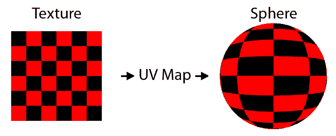

# WebGL 简介

在苹果创建了 Canvas 元素之后，Mozilla 基金会在 2006 年开始致力于 Canvas 3D 原型的开发，到 2007 年，这个早期版本已经有了实现，最终将成为 WebGL。2009 年，一个名为克罗诺斯集团的财团成立了一个网络地理信息工作组。到 2011 年，这个团队已经生产了基于 OpenGL ES 2.0 应用编程接口的 WebGL 1.0 版本。

正如我之前所说的，WebGL 被视为一个 3D 渲染应用编程接口，将与 HTML5 画布元素一起使用。它的实现消除了传统 2D 画布应用编程接口的一些渲染瓶颈，并提供了对计算机图形处理器的近乎直接的访问。因此，使用 WebGL 将 2D 图像渲染到 HTML5 画布通常比使用原始的 2D 画布实现更快。然而，由于三维渲染的复杂性增加，WebGL 的使用要复杂得多。因此，在 WebGL 的基础上构建了几个库。这允许用户使用 WebGL，但使用简化的 2D 应用编程接口。如果我们用传统的 JavaScript 编写游戏，为了简化代码，我们可能会在 WebGL 之上使用一个库，比如 Pixi.js 或者 Cocos2d-x 来进行 2d 渲染。目前，WebAssembly 使用的是**简单 direct media Layer**(**SDL**)的实现，是大多数开发者用来编写游戏的库。SDL 的这个 WebAssembly 版本建立在 WebGL 之上，提供高端性能，但是更容易使用。

使用 SDL 并不妨碍您直接从编译成网络程序集的 C++ 代码中使用网络 GL。有时我们可能会对直接与 WebGL 交互感兴趣，因为我们感兴趣的功能在 SDL 内部无法直接获得。这些用例的一个例子是创建允许特殊 2D 照明效果的自定义着色器。

In this chapter, you will need an image file from the GitHub project to run the examples. The app requires the `/Chapter03/spaceship.png` image file from the project directory. Please download the project from the following URL: [https://github.com/PacktPublishing/Hands-On-Game-Development-with-WebAssembly](https://github.com/PacktPublishing/Hands-On-Game-Development-with-WebAssembly).

在本章中，我们将涵盖以下主题:

*   WebGL 和画布上下文
*   WebGL 着色器简介
*   WebGL 和 JavaScript

# WebGL 和画布上下文

WebGL 是一个绘制 HTML5 元素的渲染上下文，是 2D 渲染上下文的替代。通常，当有人提到画布时，他们指的是 2D 渲染上下文，通过调用`getContext`并传入字符串`2d`来访问该上下文。这两种上下文都是呈现 HTML5 画布元素的方法。上下文是一种用于即时模式呈现的应用编程接口。可以请求两个不同的 WebGL 上下文，这两个上下文都提供了对不同版本的 WebGL API 的访问。这些上下文是 *webgl* 和 *webgl2* 。在下面的例子中，我将使用 *webgl* 上下文，并将使用 WebGL 1.0 API。还有一个很少使用的将位图渲染到画布上的上下文，我们可以通过将`bitmaprenderer`作为字符串值传入来访问它。

I want to point out that the term canvas is sometimes used to refer to the 2D canvas context and sometimes used to refer to the immediate mode rendering HTML5 canvas element. When I refer to canvas in this book without mentioning the 2D context, I am referring to the HTML5 canvas element.

在下一节中，我将向您介绍着色器和 GLSL 着色器语言。

# WebGL 着色器简介

当 OpenGL 或 WebGL 与 GPU 交互时，它们会传入数据，告诉 GPU 它需要渲染的几何图形和纹理。在这一点上，图形处理器需要知道它必须如何将这些纹理和与其相关的几何图形渲染成一个单一的 2D 图像，该图像将显示在您的计算机显示器上。 **OpenGL 着色器语言** ( **GLSL** )是一种与 OpenGL 和 WebGL 一起使用的语言，用于指导 GPU 如何渲染 2D 图像。

Technically, WebGL uses the GLSL ES shader language (sometimes referred to as ELSL), which is a subset of the GLSL language. GLSL ES is the shader language that's used with OpenGL ES, a mobile-friendly subset of OpenGL (the ES is for Embedded Systems). Because WebGL is based on OpenGL ES, it inherited the GLSL ES shader language. Note that whenever I refer to GLSL within the context of WebGL or WebAssembly, I am referring to GLSL ES.

WebGL 渲染管道要求我们编写两种类型的着色器来将图像渲染到屏幕上。它们是顶点着色器和片段着色器，顶点着色器基于每个顶点渲染几何图形，片段着色器渲染候选像素，称为片段。GLSL 看起来很像 C 语言，所以如果你用 C 或 C++ 工作，代码看起来会有些熟悉。

对 GLSL 着色器的介绍不会涉及太多细节。在后面的章节中，我将更广泛地讨论 WebGL 着色器。现在，我只想介绍一下这个概念，并向您展示一个非常简单的 2D WebGL 着色器。我将在关于 2D 照明的一章中详细介绍。下面是一个简单的顶点着色器示例，用于为 2D WebGL 渲染引擎渲染四边形:

```cpp
precision mediump float;

attribute vec4 a_position;
attribute vec2 a_texcoord;

uniform vec4 u_translate;

varying vec2 v_texcoord;

void main() {
   gl_Position = u_translate + a_position;
    v_texcoord = a_texcoord;
}
```

这个非常简单的着色器接受顶点的位置，并根据通过 WebGL 传递到着色器中的位置统一值来移动它。这个着色器将在我们几何图形中的每个顶点上运行。在 2D 游戏中，所有的几何图形都会被渲染成四边形(即矩形)。以这种方式使用 WebGL 可以让我们更好地利用计算机的 GPU。让我简单讨论一下这个顶点着色器的代码中发生了什么。

If you are new to game development, the concept of vertex and pixel shaders may feel a little foreign. They are not as mysterious as they may first seem. You may want to quickly read over the Wikipedia *Shader* article if you want a better understanding of what shaders are ([https://en.wikipedia.org/wiki/Shader](https://en.wikipedia.org/wiki/Shader)). If you are still feeling lost, feel free to ask me questions on Twitter (`@battagline`).

该着色器的第一行设置浮点精度:

```cpp
precision mediump float;
```

计算机上的所有浮点运算都是实分数的近似值。我们可以用 0.333 逼近 1/3 的低精度，用 0.33333333333 逼近 1/3 的高精度。代码的精度行表示 GPU 上浮点值的精度。我们可以使用三种可能的精度之一:`highp`、`mediump`或`lowp`。浮点精度越高，GPU 执行代码越慢，但所有计算值的精度越高。总的来说，我一直将这个值保持在`mediump`，这对我来说很有效。如果您有一个应用要求性能高于精度，您可以将其更改为`lowp`。如果您需要高精度，请确保您知道目标图形处理器的功能。并非所有图形处理器都支持`highp`。

属性变量是通过顶点数组传递到管道中的值。在我们的代码中，这些值包括与顶点关联的纹理坐标，以及与顶点关联的 2D 变换矩阵:

```cpp
attribute vec4 a_position;
attribute vec2 a_texcoord;
```

统一变量类型是一种在所有顶点和片段上保持不变的变量类型。在这个顶点着色器中，我们通过一个统一的矢量`u_translate`。通常情况下，除非是针对相机，否则您不会希望将所有顶点平移相同的量，但是因为我们只编写了一个 WebGL 程序来绘制单个精灵，所以使用`translate`的`uniform`变量会很好:

```cpp
uniform vec4 u_translate;
```

`varying`变量(有时称为插值器)是从顶点着色器传递到片段着色器的值，片段着色器中的每个片段都获得该值的插值版本。在这段代码中，唯一的`varying`变量是顶点的纹理坐标:

```cpp
varying vec2 v_texcoord;
```

在数学中，插值是一个计算的中间值。例如，如果我们在 0.2 和 1.2 之间插入中间点，我们将得到 0.7 的值。即起始值 0.2，加上(1.2 - 0.2) / 2 = 0.5 的平均值。所以，0.2 + 0.5 = 0.7。使用`varying`关键字从顶点着色器传递到片段着色器的值将根据片段相对于顶点的位置进行插值。
最后，顶点着色器中执行的代码在`main`函数内部。该代码获取顶点的位置，并将其乘以平移矩阵，以获得顶点的世界坐标，以便将其放入`gl_Position`。然后，它将传递到顶点着色器的纹理坐标直接设置到可变变量中，这样它就可以将其传递到片段着色器中:

```cpp
void main() {
    gl_Position = u_translate + a_position;
    v_texcoord = a_texcoord;
}
```

运行顶点着色器后，顶点着色器生成的所有片段都通过片段着色器运行，片段着色器为每个片段插值所有可变变量。

下面是一个片段着色器的简单示例:

```cpp
precision mediump float;

varying vec2 v_texcoord;

uniform sampler2D u_texture;

void main() {
    gl_FragColor = texture2D(u_texture, v_texcoord);
}
```

就像在我们的顶点着色器中一样，我们从将浮点精度设置为`mediump`开始。这些碎片有一个`uniform sample2D`纹理，它定义了在我们的游戏中用来生成 2D 精灵的纹理贴图:

```cpp
uniform sampler2D u_texture;
```

`uniform`有点像传递到管道中的全局变量，应用于使用它的着色器中的每个顶点或每个片段。在`main`函数中执行的代码也很简单。它从`v_texcoord`变化变量中获取插值纹理坐标，并从我们采样的纹理中检索颜色值，然后使用该值设置`gl_FragColor`片段的颜色:

```cpp
void main() {
    gl_FragColor = texture2D(u_texture, v_texcoord);
}
```

直接在 JavaScript 中使用 WebGL 在屏幕上绘制一个简单的 2D 图像需要更多的代码。在下一节中，我们将写出我能想到的最简单的 2D 雪碧渲染 WebGL 应用版本，它恰好是我们在上一章中编写的 2D 画布应用的新版本。我认为有必要看看将 2D 图像渲染到 HTML 画布上的两种方法之间的区别。当我们最终在 WebAssembly 中使用 SDL API 时，了解更多关于 WebGL 的信息也将有助于我们了解幕后发生了什么。在创建 WebGL JavaScript 应用时，我将尽可能地保持演示和代码的简单性。

As I mentioned previously, the point of this chapter is for you to get some hands-on experience with WebGL. For most of this book, we will not directly deal with WebGL, but rather use the simpler SDL API. If you are not interested in writing your own shaders, you can consider this chapter optional but beneficial information.

在下一节中，我们将学习如何使用 WebGL 绘制到画布上。

# WebGL 和 JavaScript

正如我们在上一章中了解到的，使用 2D 画布非常简单。要绘制图像，只需要将上下文翻译成想要绘制图像的像素坐标，通过传入图像、图像的宽度和高度来调用`drawImage`上下文函数。如果你愿意的话，你可以把它变得更简单，忘记把 x 和 y 坐标直接传递给`drawImage`函数的转换。使用 2D 画布，您可以处理图像，但是使用 WebGL，您总是在处理 3D 几何图形，即使您正在编写 2D 游戏。使用 WebGL，您需要将纹理渲染到几何图形上。你需要使用顶点缓冲区和纹理坐标。我们之前编写的顶点着色器获取三维坐标数据和纹理坐标，并将这些值传递给片段着色器，片段着色器将在几何图形之间进行插值，并使用纹理采样函数来检索适当的纹理数据，以将像素渲染到画布上。

# WebGL 坐标系与 2D 画布

对于 WebGL，画布元素的中心是原点(0，0)。**正 Y** 向上，而**正 X** 向右。对于从未接触过 2D 图形的人来说，这有点更直观，因为它类似于坐标几何中的象限，这是我们在小学时了解到的。使用 2D 画布，您将始终使用像素，并且画布上不会出现负数:


当你调用`drawImage`时，X 和 Y 坐标是图像左上角将要绘制的位置。WebGL 有点不同。一切都在使用几何图形，顶点和像素着色器都是必需的。我们将图像转换成纹理，然后在几何图形上拉伸它，以便显示出来。以下是 WebGL 坐标系的外观:


如果您想将图像放置在画布上的特定像素位置，您必须知道画布的宽度和高度。你画布的**中心点**是 **(0，0)** ，**左上角**是 **(-1，1)** ，**右下角**是 **(1，-1)** 。因此，如果要将图像放置在 x=150，y=160 的位置，则需要使用以下等式来找到 WebGL x 坐标:

```cpp
 webgl_x = (pixel_x - canvas_width / 2) / (canvas_width / 2)
```

所以，对于 150 的`pixel_x`位置，我们必须从 150 减去 400 才能得到-250。然后，我们必须用-250 除以 400，我们会得到-0.625。我们必须做一些类似的事情来获得 WebGL 的 y 坐标，但是轴的符号被翻转了，所以我们需要做以下事情来代替我们对`pixel_x`值所做的事情:

```cpp
((canvas_height / 2) - pixel_y) / (canvas_height / 2)
```

通过插入这些值，我们得到((600 / 2) - 160) / (600 / 2)或(300 - 160) / 300 = 0.47。

I am skipping a lot of information about WebGL to simplify this explanation. WebGL is not a 2D space, even though I am treating it as a 2D space in this example. Because it is a 3D space, the size of the canvas in units is based on a view area known as clip space. Mozilla has an excellent article on clip space if you would like to learn more: [https://developer.mozilla.org/en-US/docs/Web/API/WebGL_API/WebGL_model_view_projection](https://developer.mozilla.org/en-US/docs/Web/API/WebGL_API/WebGL_model_view_projection).

# 顶点和紫外线数据

在我们看一大块可怕的 WebGL JavaScript 代码之前，我想简单讨论一下数据缓冲区，以及我们如何将几何和纹理坐标数据传递到着色器中。我们将在一个大缓冲区中传递 32 位浮点数据，该缓冲区将包含顶点的 X 和 Y 坐标以及同一顶点的 UV 纹理坐标的组合。紫外线贴图是图形处理器将 2D 纹理坐标映射到三维几何图形的方法:



WebGL 和 OpenGL 通过为每个顶点分配一个 U 和 V 坐标来实现这一点。指定给顶点的 UV 坐标(0，0)意味着顶点将根据左上角纹理中的颜色进行着色。紫外坐标(1，1)意味着它将根据右下角纹理的颜色进行绘制。当我们在 3D 对象的点之间插值时，我们也在纹理内部的不同紫外线坐标之间插值。这些紫外线坐标可以在我们的片段着色器中使用`texture2D`内置函数通过传递纹理和当前紫外线坐标进行采样。

让我们来看看我们在这个 WebGL 应用中使用的顶点和纹理数据数组:

```cpp
var vertex_texture_data = new Float32Array([
 //  X,     Y,     U,   V
     0.16,  0.213, 1.0, 1.0,
    -0.16,  0.213, 0.0, 1.0,
     0.16, -0.213, 1.0, 0.0,
    -0.16, -0.213, 0.0, 0.0,
    -0.16,  0.213, 0.0, 1.0,
     0.16, -0.213, 1.0, 0.0
 ]);
```

这些数据已按行和列键入。尽管这是一个数据的线性数组，但是格式允许您看到我们有四个浮点值，将为每个顶点传递。数据上方有一个注释，显示每列代表什么。前两个数据值是几何图形的 X 和 Y 坐标。后两个值是将纹理映射到几何图形中的 X 和 Y 坐标的 U 和 V 坐标。这里有六行，尽管我们绘制的是一个矩形。我们需要六个点而不是四个点的原因是，WebGL 使用的几何图形通常由三角形组成。因此，我们需要重复两个顶点。

You may be wondering, *why triangles?* Well, there was a time when computer graphics used geometry that was not decomposed into triangles. But a problem arises when you have a quad, and not all the points are coplanar (in the same plane). This is the same problem I have whenever I go to a bar that uses four-legged stools. I am pretty sure the existence of the four-legged stool is some sort of Illuminati plot to keep me off balance, but I digress. Because three points define a plane, a triangle is, by definition, always coplanar, just like a three-legged stool will never wobble.

# 2D 画布到 WebGL

让我们从将画布代码从`Chapter02`目录复制到`Chapter03`目录开始。接下来，我们将把`canvas_shell.html`文件重命名为`webgl_shell.html`。我们将`canvas.css`更名为`webgl.css`。最后，我们将重命名`canvas.c`文件`webgl.c`。我们还需要确保我们复制了`spaceship.png`文件。我们根本不会更改`webgl.css`文件。我们将对`webgl_shell.html`文件进行最重要的更改。要从 2D 画布切换到 WebGL，必须添加大量代码；几乎所有这些都是额外的 JavaScript 代码。我们将需要对`webgl.c`进行一些小的调整，以便船舶在`MoveShip`功能中的位置反映 WebGL 坐标系，其原点在画布的中心。

在我们开始之前，我想提一下，这个 WebGL 代码并不意味着可以生产。我们将要创建的游戏不会像我在这里演示的那样使用 WebGL。这不是最有效或可伸缩的代码。如果没有重大的改变，我们正在写的东西将不能一次呈现一个以上的精灵。我向您介绍使用 WebGL 渲染 2D 图像的方法，是为了让您了解在使用像 SDL 这样的库时，幕后发生了什么。如果你不关心幕后的工作，没有人会因为你跳过而责备你。就我个人而言，我总是更喜欢多了解一点。

# 头部标签的小改动

在我们的`head`标签内部，我们想要更改`title`，并且因为我们将`canvas.css`重命名为`webgl.css`，我们需要将我们的`link`标签指向新的样式表名称。以下是 HTML 开头必须更改的两个标签:

```cpp
<title>WebGL Shell</title>
<link href="webgl.css" rel="stylesheet" type="text/css">
```

稍后在 HTML 中，我们将移除`src`设置为`"spaceship.png"`的`img`标签。严格来说没有必要这样做。在画布版本中，我们使用这个标签将图像渲染到画布上。在这个 WebGL 版本中，我们将动态加载图像，因此没有必要保留它，但是如果您忘记删除它，将它放在那里不会对应用造成任何伤害。

# 主要的 JavaScript 更改

`webgl_shell.html`文件的 JavaScript 部分内部的`Module`代码将保持不变，因此您不必担心修改以下行之后的任何内容:

```cpp
var Module = {
```

然而，`script`标签中代码的上半部分将需要一些重要的修改。您可能需要重新开始并删除整个模块。

# WebGL 全局变量

我们要做的第一件事是创建大量的 JavaScript 全局变量。如果这段代码不仅仅是为了演示，那么使用这么多全局变量通常会被认为是不好的做法。但是对于我们现在正在做的事情，它有助于简化事情:

```cpp
<script type='text/javascript'>
 var gl = null; // WebGLRenderingContext
 var program = null; // WebGLProgram
 var texture = null; // WebGLTexture
 var img = null; // HTMLImageElement
 var canvas = null;
 var image_width = 0;
 var image_height = 0;
 var vertex_texture_buffer = null; // WebGLBuffer
 var a_texcoord_location = null; // GLint
 var a_position_location = null; // GLint
 var u_translate_location = null; // WebGLUniformLocation
 var u_texture_location = null; // WebGLUniformLocation
```

第一个变量`gl`是渲染上下文的新版本。通常，如果您使用的是 2D 渲染上下文，您将其称为`ctx`，如果您使用的是 WebGL 渲染上下文，则将其命名为`gl`。第二行定义了程序变量。当我们编译顶点和片段着色器时，我们得到一个以`WebGLProgram`对象的形式存储在这个`program`变量中的编译版本。`texture`变量将保存一个我们将从`spaceship.png`图像文件加载的`WebGLTexture`。这是我们在上一章的 2D 画布教程中使用的图像。`img`变量将用于加载`spaceship.png`图像文件，该文件将用于加载纹理。画布变量将再次引用我们的 HTML 画布元素和`image_width`，一旦加载，`image_height`将保存`spaceship.png`图像的高度和宽度。

`vertex_texture_buffer`属性是一个缓冲区，将用于将顶点几何和纹理数据传输到 GPU，以便我们在上一节中编写的着色器可以使用它。`a_texcoord_location`和`a_position_location`变量将用于保存对顶点着色器中`a_texcoord`和`a_position`属性变量的引用，最后，`u_translate_location`和`u_texture_location`用于引用着色器中的`u_translate`和`u_texture`统一变量。

# 顶点和纹理数据的返回

如果我告诉你我们还有一些变数要讨论，你会不高兴吗？下一个是我们之前讨论过的变量，但是我会再次提到它，因为它很重要。`vertex_texture_data`数组是存储用于渲染的所有顶点几何图形和紫外线纹理坐标数据的数组:

```cpp
var vertex_texture_data = new Float32Array([
     // x,  y,     u,   v
     0.16,  0.213, 1.0, 1.0,
    -0.16,  0.213, 0.0, 1.0,
     0.16, -0.213, 1.0, 0.0,
    -0.16, -0.213, 0.0, 0.0,
    -0.16,  0.213, 0.0, 1.0,
     0.16, -0.213, 1.0, 0.0
 ]);
```

有一点我之前没有提到，就是为什么 x 轴上的`x`和`y`数值范围是从`-0.16`到`0.16`，y 轴上的`-0.213`到`0.213`。因为我们渲染的是单个图像，所以不需要缩放几何图形来动态适应图像。我们使用的宇宙飞船图像是 128 x 128 像素。我们使用的画布大小是 800 x 600 像素。正如我们之前所讨论的，无论我们使用什么尺寸的画布，WebGL 都将两个轴放在-1 到+1 的范围内。这使得坐标(0，0)成为画布元素的中心。这也意味着无论画布元素有多宽或多高，画布宽度始终为 2，画布高度始终为 2。所以，如果我们想知道我们的几何图形有多宽，以使它与图像的宽度相匹配，我们必须做一些计算。首先，我们需要算出一个像素对应多少个单位的 WebGL 剪辑空间宽度。WebGL 剪辑空间的宽度为 2.0，实际画布的宽度为 800 像素，因此 WebGL 空间中单个像素的宽度为 2.0 / 800 = 0.0025。我们需要知道我们的图像在 WebGL 剪辑空间中有多宽，所以我们将 128 像素乘以 0.0025，得到 WebGL 剪辑空间宽度为 0.32。因为我们希望几何中心的 x 值为 0，所以我们的 x 几何范围为-0.16 到+0.16。

既然我们已经做了宽度，让我们解决高度。画布的高度为 600 像素，但在 WebGL 剪辑空间中，画布的高度始终为 2.0 (-1.0 Y 到+1.0 Y)。那么，一个像素中有多少个 WebGL 单位呢？2.0/600 = 0.00333333…重复。显然，这是一个浮点精度无法匹配真实值的实例。我们将砍掉一些拖尾的 3，希望精度足够。回到计算图像在 WebGL 剪辑空间中的高度，它有 128 像素高，所以我们需要将 128 乘以 0.0033333…重复。结果是 0.4266666…重复，我们将截断为 0.426。所以，我们的 y 几何必须从`-0.213`到`+0.213`。

I am doing my best to ignore the complexity of the WebGL clip space. This is a 3D volume and not a simple 2D drawing area like the 2D canvas context. For more information on this topic, please consult the Mozilla developer docs for clip space: [https://developer.mozilla.org/en-US/docs/Web/API/WebGL_API/WebGL_model_view_projection#Clip_space](https://developer.mozilla.org/en-US/docs/Web/API/WebGL_API/WebGL_model_view_projection#Clip_space).

正如我之前所说的，当我们在游戏中工作时，很多事情将由 SDL 为我们管理，但是在未来，你可能希望在网络组装中使用 OpenGL。OpenGL ES 2.0 和 OpenGL ES 3.0 库已经移植到 WebAssembly，这些库或多或少都与 WebGL 有直接的相似之处。WebGL 1.0 是 OpenGL ES 2.0 的修改版本，它是 OpenGL 的一个版本，设计用于在移动硬件上运行。WebGL 2.0 是 OpenGL ES 3.0 的修改版。通过给 SDL 打电话了解 WebGL 在做什么，可以让我们成为更好的游戏开发者，即使 SDL 为我们做了很多繁重的工作。

# 缓冲常数

我选择使用一个`Float32Array`来保存这个应用的所有顶点数据。这包括 X 和 Y 坐标数据，以及 U 和 V 纹理坐标数据。正因为如此，当我们将这些数据加载到 GPU 的缓冲区时，我们需要告诉 WebGL 如何将这些数据分成不同的属性。我们将使用以下常量来告诉 WebGL】中的数据是如何分解的:

```cpp
const FLOAT32_BYTE_SIZE = 4; // size of a 32-bit float
const STRIDE = FLOAT32_BYTE_SIZE * 4; // there are 4 elements for every vertex. x, y, u, v
const XY_OFFSET = FLOAT32_BYTE_SIZE * 0;
const UV_OFFSET = FLOAT32_BYTE_SIZE * 2;
```

`FLOAT32_BYTE_SIZE`常量是`Float32Array`中每个变量的大小。`STRIDE`常数将用于告诉 WebGL 单个顶点的数据使用了多少字节。我们在前面的代码中定义的四列分别代表 *x* 、 *y* 、 *u* 和 *v* 。由于这些变量中的每一个都使用四个字节的数据，我们将变量的数量乘以每个变量使用的字节数，以获得*步幅*，或者单个顶点使用的字节数。`XY_OFFSET`常数是每个步幅内的起始位置，我们将在这里找到 *x* 和 *y* 坐标数据。为了一致性，我将浮点字节大小乘以位置，但是由于它是`0`，我们可以只使用`const XY_OFFSET = 0`。现在，`UV_OFFSET`是从我们将找到紫外线纹理坐标数据的每个跨步开始的字节偏移量。因为它们在位置 2 和 3，偏移量是每个变量使用的字节数乘以`2`。

# 定义着色器

我浏览了上一节中着色器所做的一切。你可能想再复习一遍那一节。代码的下一部分定义了多行 JavaScript 字符串中的顶点着色器代码和片段着色器代码。以下是顶点着色器代码:

```cpp
var vertex_shader_code = `
    precision mediump float;
    attribute vec4 a_position;
    attribute vec2 a_texcoord;
    varying vec2 v_texcoord;
    uniform vec4 u_translate;

    void main() {
        gl_Position = u_translate + a_position;
        v_texcoord = a_texcoord;
    }
`;
```

片段着色器代码如下:

```cpp
var fragment_shader_code = `
    precision mediump float;
    varying vec2 v_texcoord;
    uniform sampler2D u_texture;

    void main() {
        gl_FragColor = texture2D(u_texture, v_texcoord);
    }
`;
```

让我们看看顶点着色器代码中的属性:

```cpp
attribute vec4 a_position;
attribute vec2 a_texcoord;
```

这两个属性将从`Float32Array`中的数据传入。WebGL 中一个巧妙的技巧是，如果你没有使用所有四个位置变量( *x* 、 *y* 、 *z* 、 *w* )，你可以传入你正在使用的两个( *x* 、 *y* )，GPU 将知道如何在另外两个位置使用适当的值。这些着色器需要传入两个属性:

```cpp
attribute vec4 a_position;
attribute vec2 a_texcoord;
```

我们将再次使用缓冲区和`Float32Array`来实现这一点。我们还需要传入两个`uniform`变量。顶点着色器将使用`u_translate`变量来转换子画面的位置，`u_texture`是片段着色器将使用的纹理缓冲区。这些着色器几乎和它们得到的一样简单。许多教程开始时没有纹理，只是硬编码片段着色器的颜色输出，如下所示:

```cpp
gl_FragColor = vec4(1.0, 0.0, 0.0, 1.0);
```

进行此更改会导致片段着色器始终输出红色，因此请不要进行此更改。我能想到的唯一能让本教程变得更简单的事情是不加载纹理和渲染纯色，也不允许移动几何图形。

# 模块加载功能

在旧的 2D 画布代码中，我们在`ModuleLoaded`函数之前定义了`ShipPosition` JavaScript 函数，但是我们已经在 WebGL 演示中交换了这两个函数。我觉得最好在代码的渲染部分之前解释一下 WebGL 初始化。以下是全新版本的`ModuleLoaded`功能:

```cpp
function ModuleLoaded() {
    canvas = document.getElementById('canvas');
    gl = canvas.getContext("webgl", { alpha: false }) ||
                            canvas.getContext("experimental-webgl", { 
                            alpha: false });

    if (!gl) {
        console.log("No WebGL support!");
        return;
    }

    gl.blendFunc( gl.SRC_ALPHA, gl.ONE_MINUS_SRC_ALPHA );
    gl.enable( gl.BLEND );

    var vertex_shader = gl.createShader(gl.VERTEX_SHADER);
    gl.shaderSource( vertex_shader, vertex_shader_code );
    gl.compileShader( vertex_shader );

    if( !gl.getShaderParameter(vertex_shader, gl.COMPILE_STATUS) ) {
        console.log('Failed to compile vertex shader' + 
                     gl.getShaderInfoLog(vertex_shader));
        gl.deleteShader(vertex_shader);
        return;
    }

    var fragment_shader = gl.createShader(gl.FRAGMENT_SHADER);
    gl.shaderSource( fragment_shader, fragment_shader_code );
    gl.compileShader( fragment_shader );

    if( !gl.getShaderParameter(fragment_shader, gl.COMPILE_STATUS) ) {
        console.log('Failed to compile fragment shader' + 
                     gl.getShaderInfoLog(fragment_shader));
        gl.deleteShader(fragment_shader);
        return;
    }

    program = gl.createProgram();

    gl.attachShader(program, vertex_shader);
    gl.attachShader(program, fragment_shader);
    gl.linkProgram(program);

    if( !gl.getProgramParameter(program, gl.LINK_STATUS) ) {
        console.log('Failed to link program');
        gl.deleteProgram(program);
        return;
    }

    gl.useProgram(program);

    u_texture_location = gl.getUniformLocation(program, "u_texture");
    u_translate_location = gl.getUniformLocation(program, 
    "u_translate");

    a_position_location = gl.getAttribLocation(program, "a_position");
    a_texcoord_location = gl.getAttribLocation(program, "a_texcoord");

    vertex_texture_buffer = gl.createBuffer();

    gl.bindBuffer(gl.ARRAY_BUFFER, vertex_texture_buffer);
    gl.bufferData(gl.ARRAY_BUFFER, vertex_texture_data, 
    gl.STATIC_DRAW);

    gl.enableVertexAttribArray(a_position_location);
    gl.vertexAttribPointer(a_position_location, 2, gl.FLOAT, false, 
    STRIDE, XY_OFFSET);

    gl.enableVertexAttribArray(a_texcoord_location);
    gl.vertexAttribPointer(a_texcoord_location, 2, gl.FLOAT, false, 
    STRIDE, UV_OFFSET);

    texture = gl.createTexture();

    gl.bindTexture(gl.TEXTURE_2D, texture);
    gl.texParameteri(gl.TEXTURE_2D, gl.TEXTURE_WRAP_S, gl.REPEAT);
    gl.texParameteri(gl.TEXTURE_2D, gl.TEXTURE_WRAP_T, gl.REPEAT);

    gl.texParameteri(gl.TEXTURE_2D, gl.TEXTURE_MAG_FILTER, gl.NEAREST);
    gl.texParameteri(gl.TEXTURE_2D, gl.TEXTURE_MIN_FILTER, gl.NEAREST);

    img = new Image();
    img.addEventListener('load', function() {
        image_width = img.width;
        image_height = img.height;

        gl.bindTexture(gl.TEXTURE_2D, texture);
        gl.texImage2D(gl.TEXTURE_2D, 0, gl.RGBA, gl.RGBA,
        gl.UNSIGNED_BYTE, img );
    });
    img.src = "spaceship.png";

    gl.viewport(0, 0, gl.canvas.width, gl.canvas.height);
}
```

前几行获得`canvas`元素，并使用它获得一个 WebGL 上下文。如果 JavaScript 无法获取 WebGL 上下文，我们会提醒用户，让他们知道他们的浏览器不支持 WebGL:

```cpp
canvas = document.getElementById('canvas');

gl = canvas.getContext("webgl", { alpha: false }) ||
                        canvas.getContext("experimental-webgl", { 
                        alpha: false });
if (!gl) {
    console.log("No WebGL support!");
    return;
}
```

之后的两行打开 alpha 混合:

```cpp
gl.blendFunc( gl.SRC_ALPHA, gl.ONE_MINUS_SRC_ALPHA );
gl.enable( gl.BLEND );
```

编译、加载和链接顶点和片段着色器是非常具有挑战性的代码。我不知道为什么 WebGL 库中没有一个函数可以一步完成所有这些。几乎每个为 2D 写 webgl 的人都这样做，他们要么把它放到一个单独的`.js`文件中，要么把它复制粘贴到每个项目的代码中。目前，您需要了解的关于下面一批代码的所有信息是，它采用了我们之前编写的顶点和片段着色器，并将其编译到程序变量中。从那时起，我们将使用程序变量与着色器进行交互。下面是代码:

```cpp
var vertex_shader = gl.createShader(gl.VERTEX_SHADER);
gl.shaderSource( vertex_shader, vertex_shader_code );
gl.compileShader( vertex_shader );

if( !gl.getShaderParameter(vertex_shader, gl.COMPILE_STATUS) ) {
    console.log('Failed to compile vertex shader' + 
    gl.getShaderInfoLog(vertex_shader));
    gl.deleteShader(vertex_shader);
    return;
}

var fragment_shader = gl.createShader(gl.FRAGMENT_SHADER);
gl.shaderSource( fragment_shader, fragment_shader_code );
gl.compileShader( fragment_shader );

if( !gl.getShaderParameter(fragment_shader, gl.COMPILE_STATUS) ) {
    console.log('Failed to compile fragment shader' + 
    gl.getShaderInfoLog(fragment_shader));
    gl.deleteShader(fragment_shader);
    return;
}

program = gl.createProgram();
gl.attachShader(program, vertex_shader);
gl.attachShader(program, fragment_shader);
gl.linkProgram(program);

if( !gl.getProgramParameter(program, gl.LINK_STATUS) ) {
    console.log('Failed to link program');
    gl.deleteProgram(program);
    return;
}
gl.useProgram(program);
```

现在我们的`program`变量中有了`WebGLProgram`对象，我们可以使用该对象与着色器进行交互。

1.  我们要做的第一件事是获取对着色器程序中`uniform`变量的引用:

```cpp
u_texture_location = gl.getUniformLocation(program, "u_texture");
u_translate_location = gl.getUniformLocation(program, "u_translate");
```

2.  之后，我们将使用`program`对象来获取我们的顶点着色器使用的属性变量的引用:

```cpp
a_position_location = gl.getAttribLocation(program, "a_position");
a_texcoord_location = gl.getAttribLocation(program, "a_texcoord");
```

3.  现在，是时候开始使用缓冲区了。你还记得当我们用所有的顶点数据创建那个`Float32Array`的时候吗？是时候使用缓冲区将数据发送到 GPU 了:

```cpp
vertex_texture_buffer = gl.createBuffer();

gl.bindBuffer(gl.ARRAY_BUFFER, vertex_texture_buffer);
gl.bufferData(gl.ARRAY_BUFFER, vertex_texture_data, 
              gl.STATIC_DRAW);

gl.enableVertexAttribArray(a_position_location);
gl.vertexAttribPointer(a_position_location, 2, gl.FLOAT, false, 
                        STRIDE, XY_OFFSET);

gl.enableVertexAttribArray(a_texcoord_location);
gl.vertexAttribPointer(a_texcoord_location, 2, gl.FLOAT, false, 
                        STRIDE, UV_OFFSET);
```

第一行创建一个名为`vertex_texture_buffer`的新缓冲区。以`gl.bindBuffer`开头的行将`vertex_texture_buffer`绑定到`ARRAY_BUFFER`，然后`bufferData`将我们在`vertex_texture_data`中的数据添加到`ARRAY_BUFFER`。之后，我们需要使用我们之前在`a_position_location`和`a_texcoord_location`变量中创建的对`a_position`和`a_texcoord`的引用来告诉 WebGL 在这个数组缓冲区中的什么地方可以找到`a_position`和`a_texcoord`属性的数据。它做的第一件事是调用`enableVertexAttribArray`来使用我们创建的位置变量启用该属性。接下来，`vertexAttribPointer`使用`STRIDE`和`XY_OFFSET`或`UV_OFFSET`来告诉 WebGL 属性数据在缓冲区数据中的位置。

4.  之后，我们将创建并绑定一个纹理缓冲区:

```cpp
texture = gl.createTexture();
gl.bindTexture(gl.TEXTURE_2D, texture);
```

5.  现在我们有了一个绑定的纹理缓冲区，我们可以在缩放时为镜像环绕和最近邻插值配置该缓冲区:

```cpp
gl.texParameteri(gl.TEXTURE_2D, gl.TEXTURE_WRAP_S, gl.REPEAT);
gl.texParameteri(gl.TEXTURE_2D, gl.TEXTURE_WRAP_T, gl.REPEAT);

gl.texParameteri(gl.TEXTURE_2D, gl.TEXTURE_MAG_FILTER, gl.NEAREST);
gl.texParameteri(gl.TEXTURE_2D, gl.TEXTURE_MIN_FILTER, gl.NEAREST);
```

我们用`gl.NEAREST`代替`gl.LINEAR`，因为我希望游戏有一个老派的像素化外观。在你的游戏中，你可能更喜欢不同的算法。

6.  配置纹理缓冲区后，我们将下载`spaceship.png`图像并将该图像数据加载到纹理缓冲区:

```cpp
img = new Image();

img.addEventListener('load', function() {
    image_width = img.width;
    image_height = img.height;

    gl.bindTexture(gl.TEXTURE_2D, texture);
    gl.texImage2D(gl.TEXTURE_2D, 0, gl.RGBA, gl.RGBA,
                    gl.UNSIGNED_BYTE, img );
});

img.src = "spaceship.png";
```

7.  我们要做的最后一件事是将视口从(0，0)设置为画布的宽度和高度。视口告诉 WebGL 画布元素中的空间将如何与我们的 WebGL 剪辑空间相关联:

```cpp
gl.viewport(0, 0, gl.canvas.width, gl.canvas.height);
```

# 装运位置功能

如果这是生产质量代码，我会在这个渲染函数的初始化例程中做很多工作。在画布上独立移动精灵需要更新我们的数组缓冲区。我可能不会用我的方式定义我的几何，也就是用手计算尺寸。我目前没有对数组缓冲区或纹理缓冲区进行任何更改；我试图将这段代码保持在使用 WebGL 在画布上渲染精灵所需的最低限度。以下是我所拥有的:

```cpp
function ShipPosition( ship_x, ship_y ) {
    if( image_width == 0 ) {
        return;
    }

    gl.uniform4fv(u_translate_location, [ship_x, ship_y, 0.0, 0.0]);
    gl.drawArrays(gl.TRIANGLES, 0, 6);
}

```

1.  前几行检查图像下载是否完成。如果没有，我们将退出该功能:

```cpp
if( image_width == 0 ) {
    return;
}
```

2.  接下来，我们告诉 WebGL 用我们飞船的坐标加载统一`u_translate`统一变量:

```cpp
gl.uniform4fv(u_translate_location, [ship_x, ship_y, 0.0, 0.0]);
```

3.  最后，我们指示 WebGL 用数组缓冲区中的六个顶点绘制三角形:

```cpp
gl.drawArrays(gl.TRIANGLES, 0, 6);
```

# 移动功能

我们需要跳回网络组装 C 模块。`webgl.c`文件是`canvas.c`的复制版本，我们只需要在`MoveShip`函数中进行更改。以下是`MoveShip`的新版本:

```cpp
void MoveShip() {
    ship_x += 0.002;
    ship_y += 0.001;

    if( ship_x >= 1.16 ) {
        ship_x = -1.16;
    }

    if( ship_y >= 1.21 ) {
        ship_y = -1.21;
    }

    EM_ASM( ShipPosition($0, $1), ship_x, ship_y );
}
```

这些变化都是从像素空间到 WebGL 剪辑空间的转换。在 2D 画布版本中，我们在每一帧中向船的`x`坐标添加两个像素，向船的`y`坐标添加一个像素。但是在 WebGL 中，将`x`坐标移动两个将会移动整个屏幕宽度。因此，相反，我们必须将这些值修改为小单位，以便与 WebGL 坐标系配合使用:

```cpp
ship_x += 0.002;
ship_y += 0.001;
```

将`0.002`添加到`x`坐标会使船每帧移动画布宽度的 1/500。通过`0.001`移动`y`坐标，使船舶在 y 轴上移动每帧屏幕高度的千分之一。你可能会注意到，在这个应用的 2D 画布版本中，船向右下方移动。这是因为增加 2D 画布坐标系中的`y`坐标会使图像在屏幕上下移。在 WebGL 坐标系中，船向上移动。我们唯一要做的另一件事是将飞船包裹其`x`和`y`坐标的坐标更改为 WebGL 剪辑空间:

```cpp
if( ship_x >= 1.16 ) {
    ship_x = -1.16;
}

if( ship_y >= 1.21 ) {
    ship_y = -1.21;
}
```

现在我们已经有了所有的源代码，继续运行`emcc`来编译我们新的`webgl.html`文件:

```cpp
emcc webgl.c -o webgl.html --shell-file webgl_shell.html
```

一旦你编译好`webgl.html`，把它加载到一个网页浏览器中。应该是这样的:


Figure 3.1: Screenshot of our WebGL app

It is important to remember that the app must be run from a web server, or using `emrun`. If you do not run the app from a web server, or use `emrun`, you will receive a variety of errors when the JavaScript glue code attempts to download the WASM and data files. You should also know that IIS requires additional configuration in order to set the proper MIME types for the `.wasm` and `.data` file extensions.

现在我们已经在 WebGL 中完成了所有这些工作，在下一章中，我将讨论如果我们首先使用 SDL 来完成这些工作，会变得多么容易。

# 摘要

在这一章中，我们已经讨论了 WebGL 以及它如何提高网络游戏的性能。我已经向您介绍了 GLSL 着色器的概念，并讨论了顶点着色器和片段着色器，这两种着色器之间的区别，以及它们如何用于将几何图形和图像的组合渲染到 HTML5 画布上。

我们还使用 WebGL 重新创建了我们用 2D 画布创建的移动飞船。我们已经讨论了如何使用顶点几何将 2D 图像渲染到三维画布上。我们还讨论了基于像素的 2D 画布坐标系和 3D WebGL 坐标系之间的差异。

WebGL 是一个涉及面很广的话题，所以单个章节最多只能给出非常粗略的介绍。WebGL 是一个 3D 渲染空间，在这一章中，我特意忽略了这一点，把它当成了一个 2D 空间。您可以利用我们在这里所做的工作并在此基础上进行构建，但是为了提高我们应用的性能，我们将在未来使用网络组装 SDL 应用编程接口与网络 GL 进行所有交互。如果你想了解更多关于网络教学语言的知识，帕克特在 https://search.packtpub.com/?query=webgl 有大量关于网络教学语言的书籍。

在下一章中，我将教你 SDL 的基础知识，它是什么，以及它如何与网络组装一起工作。我们还将学习如何使用 SDL 将精灵渲染到 HTML5 画布上，制作动画，并在画布上移动它。