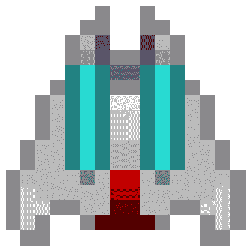
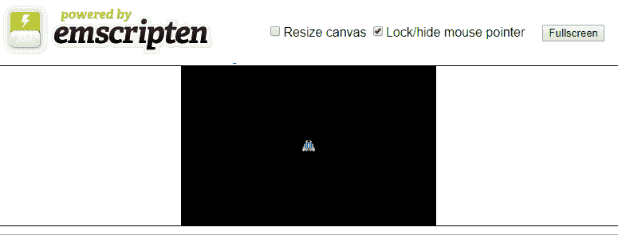

# 四、WebAssembly 中使用 SDL 的的精灵动画

在撰写本文时， **S** **实现 direct media Layer**(**SDL**)是唯一一个集成到 Emscripten 中用于 WebAssembly 的 2D 渲染库。但是，即使有更多的渲染库可用，SDL 也是一个高度受支持的渲染库，它已经被移植到大量的平台上，并且在可预见的未来，它对于 WebAssembly 和 C++ 开发仍然是相关和有用的。使用 SDL 渲染到 WebGL 节省了我们大量的时间，因为我们不需要编写代码来连接我们的 WebAssembly C++ 代码和 WebGL。大型社区也提供支持和文档。你可以在[libsdl.org](http://libsdl.org)找到更多的 SDL 在线资源。

You will need to include several images in your build to make this project work. Make sure you include the `/Chapter04/sprites/` and `/Chapter04/font/` folders from the project's GitHub. If you haven't yet downloaded the GitHub project, you can get it online from: [https://github.com/PacktPublishing/Hands-On-Game-Development-with-WebAssembly](https://github.com/PacktPublishing/Hands-On-Game-Development-with-WebAssembly).

我们将在本章中讨论以下主题:

*   在 WebAssembly 中使用 SDL
*   将精灵渲染到画布上
*   动画精灵
*   移动精灵

# 在 WebAssembly 中使用 SDL

在这一点上，我可以滚动我自己的系统，以便在 WebAssembly 模块和 JavaScript 网络 GL 库之间进行交互。这将涉及使用一个函数表从 C++ 内部调用 JavaScript WebGL 函数。幸运的是，Emscripten 团队已经完成了大部分工作。他们为我们创建了一个流行的 2D C++ 图形库的端口。SDL 是一个 2D 图形**应用编程** **接口** ( **应用编程接口**)在大多数实现中建立在 OpenGL 之上。有一个 Emscripten 端口，用来帮助我们在 WebGL 上渲染我们的 2D 图形。如果您想知道 Emscripten 中还集成了哪些库，请使用以下`emcc`命令:

```cpp
emcc --show-ports
```

如果运行此命令，您会注意到显示了几个不同的 SDL 库。其中包括 SDL2、SDL2_image、SDL2_gfx、SDL2_ttf 和 SDL2_net。SDL 的创建采用了模块化设计，允许用户只包括他们需要的 SDL 部分，从而使核心的 SDL 图书馆保持较小。如果你的目标是创建一个下载量有限的网络游戏，这是非常有用的。

我们要做的第一件事是通过创建一个简单的“Hello World”应用来熟悉 SDL，该应用向 HTML5 画布元素写入一些文本。为此，我们需要包含两个在运行`emcc --show-ports`命令时列出的 Emscripten 库。我们需要将核心 SDL 库添加到用`USE_SDL=2,`标志编译的 Emscripten 中，并且我们需要通过添加`USE_SDL_TTF=2`标志来添加 SDL TrueType 字体库。

将在 HTML 画布中显示诸如`"HELLO SDL!"`等消息的`.c`源代码相对简单:

```cpp
#include <SDL2/SDL.h>
#include <SDL2/SDL_ttf.h>
#include <emscripten.h>
#include <stdio.h>

#define MESSAGE "HELLO SDL!"
#define FONT_SIZE 16
#define FONT_FILE "font/Roboto-Black.ttf"

int main() {
    SDL_Window *window;
    SDL_Renderer *renderer;

    SDL_Rect dest = {.x = 160, .y = 100, .w = 0, .h = 0 };

    TTF_Font *font;
    SDL_Texture* texture;

    SDL_Init( SDL_INIT_VIDEO );
    TTF_Init();

    SDL_CreateWindowAndRenderer( 320, 200, 0, &window, &renderer );

    SDL_SetRenderDrawColor( renderer, 0, 0, 0, 255 );
    SDL_RenderClear( renderer );

    font = TTF_OpenFont( FONT_FILE, FONT_SIZE );

    SDL_Color font_color = {255, 255, 255, 255 }; // WHITE COLOR
    SDL_Surface *temp_surface = TTF_RenderText_Blended( font, 
                                                        MESSAGE, 
                                                       font_color );

    texture = SDL_CreateTextureFromSurface( renderer, temp_surface );

    SDL_FreeSurface( temp_surface );
    SDL_QueryTexture( texture,
                        NULL, NULL,
                        &dest.w, &dest.h ); // query the width and 
                                               height

    dest.x -= dest.w / 2;
    dest.y -= dest.h / 2;

    SDL_RenderCopy( renderer, texture, NULL, &dest );
    SDL_RenderPresent( renderer );

    return EXIT_SUCCESS;
}
```

让我带你看看到底发生了什么。前四行代码是 SDL 头文件和 Emscripten 头文件:

```cpp
#include <SDL2/SDL.h>
#include <SDL2/SDL_ttf.h>
#include <emscripten.h>
#include <stdio.h>
```

接下来，有三个预处理器定义。如果我们想快速更改消息或字体大小，我们可以修改前两行。第三个定义不太清楚。我们有一个叫做`FONT_FILE`的东西，它是一个字符串，看起来是一个文件系统位置。这有点奇怪，因为网络程序集不能访问本地文件系统。为了让 WebAssembly 模块访问字体目录中的 TrueType 字体文件，我们将在编译`WASM`文件时使用`--preload-file`标志。这将根据字体目录的内容生成一个`.data`文件。网络浏览器将该数据文件加载到虚拟文件系统中，该文件系统由 WebAssembly 模块访问。这意味着我们正在编写的 C 代码可以访问这个文件，就像它在本地文件系统中访问它一样:

```cpp
#define MESSAGE "HELLO SDL!"
#define FONT_SIZE 16
#define FONT_FILE "font/Roboto-Black.ttf"
```

# 初始化 SDL

与 C/C++ 的其他目标一样，代码从`main`函数内部开始执行。我们将通过声明一些变量来启动我们的`main`函数:

```cpp
int main() {
    SDL_Window *window;
    SDL_Renderer *renderer;

    SDL_Rect dest = {.x = 160, .y = 100, .w = 0, .h = 0 };
    TTF_Font *font;

    SDL_Texture *texture;
```

前两个变量是`SDL_Window`和`SDL_Renderer`对象。`window`对象将定义应用窗口，如果我们为 Windows、Mac 或 Linux 系统编写代码，我们将把它渲染到其中。当我们为 WebAssembly 构建时，在我们的 HTML 中有一个画布，但是 SDL 仍然需要一个`window`对象指针来初始化和清理。所有对 SDL 的调用都使用`renderer`对象将图像渲染到画布上。

`SDL_Rect dest`变量是一个矩形，表示我们将在画布上渲染的目的地。我们将渲染到 320x200 画布的中心，因此我们将从`x`和`y`的值`160`和`100`开始。我们还不知道要渲染的文本的宽度和高度，所以，在这一点上，我们将设置`w`和`h`为`0`。我们稍后将重置该值，因此，理论上，我们可以将其设置为任何值。

`TTF_Font *font`变量是指向`SDL_TTF`库的`font`对象的指针。稍后，我们将使用该对象从虚拟文件系统加载一种字体，并将该字体呈现给`SDL_Texture *texture`指针变量。SDL 使用`SDL_Texture`变量将精灵渲染到画布上。

接下来的几行用于在 SDL 进行一些初始化工作:

```cpp
SDL_Init( SDL_INIT_VIDEO );
TTF_Init();

SDL_CreateWindowAndRenderer( 320, 200, 0, &window, &renderer );
```

使用仅初始化视频子系统的单个标志调用`SDL_Init`功能。顺便说一下，我不知道 SDL 有任何不需要初始化视频子系统的用例。许多开发人员使用 SDL 作为 OpenGL/WebGL 图形渲染系统；所以，除非你设计了一款只有音频的游戏，否则你应该始终传入`SDL_INIT_VIDEO`标志。如果您想要初始化额外的 SDL 子系统，您可以使用布尔或`|`运算符传递这些子系统的标志，如下面的代码片段所示:

```cpp
 SDL_Init( SDL_INIT_VIDEO | SDL_INIT_AUDIO | SDL_INIT_HAPTIC );
```

如果我们使用前一行，SDL 也将初始化音频和触觉子系统，但我们现在不需要它们，所以我们不会做出改变。

`TTF_Init();`函数初始化我们的 TrueType 字体，`SDL_CreateWindowAndRenderer`返回一个`window`和`renderer`对象给我们。我们通过`320`获得画布的宽度，通过`200`获得高度。第三个变量是`window`标志。我们为该参数传递`0`以表明我们不需要任何`window`标志。因为我们使用的是 SDL 脚本端口，所以我们无法控制窗口，所以这些标志不适用。

# 清除 SDL 渲染器

初始化完成后，我们需要清除渲染器。我们可以用我们选择的任何颜色来清除渲染器。为此，我们将调用`SDL_RenderDrawColor`函数:

```cpp
SDL_SetRenderDrawColor( renderer, 0, 0, 0, 255 );
SDL_RenderClear( renderer );
```

它将渲染器的绘图颜色设置为黑色，具有完全不透明度。`0, 0, 0`为 RGB 颜色值，`255`为 alpha 不透明度。这些数字的范围都是从 0 到 255，其中 255 是色谱上的全部颜色。我们这样设置是为了当我们在下一行调用`SDL_RenderClear`函数时，它将清除带有黑色的渲染器。如果我们想让颜色变成透明的红色而不是黑色，我们必须按照以下方式修改调用:

```cpp
SDL_SetRenderDrawColor( renderer, 255, 0, 0, 255 );
```

这不是我们想要的，所以我们不会做出改变。我只想指出，我们可以用任何我们喜欢的颜色来清除渲染器。

# 使用网络组件虚拟文件系统

接下来的几行将在虚拟文件系统中打开 TrueType 字体文件，并将其渲染到`SDL_Texture`，可用于渲染到画布:

```cpp
font = TTF_OpenFont( FONT_FILE, FONT_SIZE );
SDL_Color font_color = {255, 255, 255, 255 }; // WHITE COLOR
SDL_Surface *temp_surface = TTF_RenderText_Blended( font, MESSAGE,
                                                    font_color );
texture = SDL_CreateTextureFromSurface( renderer, temp_surface );
SDL_FreeSurface( temp_surface ); 
```

在前面代码的第一行中，我们通过传入在程序顶部定义的 WebAssembly 虚拟文件系统中的文件位置来打开 TrueType 字体。我们还需要指定字体的磅值，它在程序的顶部也被定义为 16。接下来我们要做的是创建一个`SDL_Color`变量，我们将把它用于字体。这是一种 RGBA 颜色，我们将所有值设置为 255，因此它是一种完全不透明的白色。完成后，我们需要使用`TTF_RenderText_Blended`功能将文本渲染到一个表面。我们传递前面几行打开的 TrueType 字体，程序顶部附近定义为`"HELLO SDL!"`的`MESSAGE`，以及定义为白色的字体颜色。然后，我们将从我们的表面创建一个纹理，并释放我们刚刚分配的表面内存。在使用表面指针创建纹理之后，您应该总是立即从表面指针中释放内存，因为一旦您有了纹理，就不再需要表面了。

# 向 HTML5 画布渲染纹理

在我们从虚拟文件系统加载一个字体，然后将该字体渲染到纹理之后，我们需要将该纹理复制到渲染器对象中的一个位置。完成之后，我们将需要使用该渲染器，并将其内容呈现给 HTML5 画布元素。

以下是将纹理渲染到画布上的源代码:

```cpp
SDL_QueryTexture( texture,
                    NULL, NULL,
                    &dest.w, &dest.h ); // query the width and height

dest.x -= dest.w / 2;
dest.y -= dest.h / 2;

SDL_RenderCopy( renderer, texture, NULL, &dest );
SDL_RenderPresent( renderer ); 
```

对`SDL_QueryTexture`函数的调用用于检索纹理的宽度和高度。我们需要在目标矩形中使用这些值，以便在不改变画布尺寸的情况下将纹理渲染到画布上。在那次调用之后，程序知道纹理的宽度和高度，因此它可以使用这些值来修改目标矩形的 *x* 和 *y* 变量，以便它可以将我们的文本放在画布的中心。因为`dest`(目的地)矩形的 *x* 和 *y* 值指定了该矩形的左上角，所以我们需要减去矩形的一半宽度和一半高度，以确保它居中。`SDL_RenderCopy`函数随后将这个纹理渲染到我们的渲染缓冲区中，`SDL_RenderPresent`将整个缓冲区移动到 HTML5 画布中。

此时，代码中剩下要做的就是`return`:

```cpp
return EXIT_SUCCESS;
```

返回一个值`EXIT_SUCCESS`告诉我们的 JavaScript 粘合代码，运行这个模块时一切都很顺利。

# 清理 SDL

您可能注意到这段代码中缺少了一些东西，这些东西可能在 SDL 应用的 Windows 或 Linux 版本中，是在程序结束时进行一些 SDL 清理的代码。例如，如果我们退出了 Windows 中的一个应用，并且没有进行清理工作，我们将在没有清除 SDL 分配的一些内存的情况下退出。如果这不是一个 WebAssembly 模块，那么在函数的末尾将包含以下几行:

```cpp
SDL_Delay(5000);
SDL_DestroyWindow(window);
SDL_Quit();
```

因为我们没有花时间进行游戏循环，所以我们希望通过调用`SDL_Delay(5000)``5000`将程序的清理和退出延迟 5 秒，T0 是在进行清理之前等待的毫秒数。我们想重申，因为我们正在编译到网络汇编，我们不想清理我们的 SDL。这样做在不同的浏览器上有不同的效果。

在 Firefox 中测试这段代码时，使用延迟是不必要的，因为即使在 WebAssembly 模块停止执行后，网页浏览器选项卡也将保持打开状态。然而，一旦 SDL 破坏了`window`对象，Chrome 浏览器标签就会显示一个错误页面。

如果这是一个 Windows 环境，`SDL_DestroyWindow`函数会破坏`window`对象。`SDL_Quit`功能终止 SDL 引擎，最后，`return EXIT_SUCCESS;`成功退出`main`功能。

# 编译 hello_sdl.html

最后，我们将使用 Emscripten `emcc`编译器编译和测试我们的 WebAssembly 模块:

```cpp
emcc hello_sdl.c --emrun --preload-file font -s USE_SDL=2 -s USE_SDL_TTF=2 -o hello_sdl.html
```

It is important to remember that you must run WebAssembly apps using a web server, or with `emrun`. If you would like to run your WebAssembly app using `emrun`, you must compile it with the `--emrun` flag. The web browser requires a web server to stream the WebAssembly module. If you attempt to open an HTML page that uses WebAssembly in a browser directly from your hard drive, that WebAssembly module will not load.

在这次对`emcc`的调用中，我们使用了一些新的标志，我们暂时省略了用于生成模板定制版本的`--shell-file new_shell.html`标志。如果您想继续使用`emrun`测试该应用，您必须包含`--emrun`标志，才能使用`emrun`命令运行。如果你正在使用一个网络服务器，比如 Node.js，来为应用服务，你可以从现在开始省略`--emrun`标志。如果你喜欢使用`emrun`，用那个标志继续编译。

我们添加了`--preload-file`字体标志，允许我们创建包含在`hello_sdl.data`文件中的虚拟文件系统。这个文件保存了我们的 TrueType 字体。该应用使用核心的 SDL 库和附加的 SDL TrueType 字体模块，因此我们包含了以下标志:`-s USE_SDL=2 -s USE_SDL_TTF=2`，以允许调用`SDL`和`SDL_ttf`。如果您的编译一切顺利，当您在浏览器中调出新的`hello_sdl.html`文件时，它将是这样的:


Figure 4.1: Hello SDL! app screenshot

在下一节中，我们将学习如何使用 SDL 渲染一个精灵到 HTML5 画布。

# 将精灵渲染到画布上

现在，我们已经学习了如何使用 SDL 和 Emscripten 将文本渲染到我们的 HTML 画布元素，我们可以进行下一步，学习如何渲染精灵。用于将精灵渲染到画布上的代码与我们用于渲染 TrueType 字体的代码非常相似。我们将仍然使用虚拟文件系统来生成一个包含我们正在使用的精灵的数据文件，但是我们将需要一个新的 SDL 库来做到这一点。我们不再需要`SDL2_ttf`来加载一个 TrueType 字体并将其渲染成纹理。相反，我们需要`SDL2_image`。稍后，我们将向您展示如何更改我们对`emcc`的调用，以包括这个新的库。

首先，让我们看看新版本的 SDL 代码，它将图像渲染到我们的 HTML 画布元素中，而不是我们在上一节中渲染的文本:

```cpp
#include <SDL2/SDL.h>
#include <SDL2/SDL_image.h>
#include <emscripten.h>
#include <stdio.h>
#define SPRITE_FILE "sprites/Franchise1.png"

int main() {
    SDL_Window *window;
    SDL_Renderer *renderer;
    SDL_Rect dest = {.x = 160, .y = 100, .w = 0, .h = 0 };
    SDL_Texture *texture;
    SDL_Init( SDL_INIT_VIDEO );
    SDL_CreateWindowAndRenderer( 320, 200, 0, &window, &renderer );
    SDL_SetRenderDrawColor( renderer, 0, 0, 0, 255 );
    SDL_RenderClear( renderer );
    SDL_Surface *temp_surface = IMG_Load( SPRITE_FILE );

    if( !temp_surface ) {
        printf("failed to load image: %s\n", IMG_GetError() );
        return 0;
    }

    texture = SDL_CreateTextureFromSurface( renderer, temp_surface );

    SDL_FreeSurface( temp_surface );

    SDL_QueryTexture( texture,
                        NULL, NULL,
                        &dest.w, &dest.h ); // query the width and 
                        height

    dest.x -= dest.w / 2;
    dest.y -= dest.h / 2;

    SDL_RenderCopy( renderer, texture, NULL, &dest );
    SDL_RenderPresent( renderer );

 SDL_Delay(5000);
 SDL_DestroyWindow(window);
 SDL_Quit();
    return 1;
}
```

这段代码类似于我们在上一节 *HTML5 和 WebAssembly* 中为 *HELLO SDL 编写的代码！*应用。我们使用的不是`SDL2_ttf`模块，而是`SDL2_image`模块。因此，我们需要包含`SDL2/SDL_image.h`头文件。我们还需要从`sprites`目录加载一个精灵文件，我们将把它添加到 WebAssembly 虚拟文件系统中:

```cpp
SDL_Surface *temp_surface = IMG_Load( SPRITE_FILE );

if( !temp_surface ) {
    printf("failed to load image: %s\n", IMG_GetError() );
    return 0;
}
```

在对`IMG_Load`的调用下面，我们添加了一个错误检查，如果文件加载失败，它会让我们知道哪里出错了。除此之外，代码基本相同。如果我们成功了，画布将显示我们的星际飞船系列的 16x16 像素图像:



Figure 4.2: Franchise1.png

在下一节中，我们将学习如何使用 SDL 在画布上制作精灵动画。

# 动画精灵

在这一节中，我们将学习如何在我们的 SDL 应用中制作一个快速而肮脏的小动画。这不会是我们在最终游戏中制作动画的方式，但它会让你知道我们如何通过随着时间的推移交换纹理来从 SDL 内部创建动画。我将展示将精灵分成两部分制作动画的代码。第一部分包括预处理器宏、全局变量和`show_animation`函数:

```cpp
#include <SDL2/SDL.h>
#include <SDL2/SDL_image.h>

#include <emscripten.h>
#include <stdio.h>

#define SPRITE_FILE "sprites/Franchise1.png"
#define EXP_FILE "sprites/FranchiseExplosion%d.png"
#define FRAME_COUNT 7

int current_frame = 0;
Uint32 last_time;
Uint32 current_time;
Uint32 ms_per_frame = 100; // animate at 10 fps

SDL_Window *window;
SDL_Renderer *renderer;
SDL_Rect dest = {.x = 160, .y = 100, .w = 0, .h = 0 };
SDL_Texture *sprite_texture;
SDL_Texture *temp_texture;
SDL_Texture* anim[FRAME_COUNT];

void show_animation() {
    current_time = SDL_GetTicks();
    int ms = current_time - last_time;

    if( ms < ms_per_frame) {
        return;
    }

    if( current_frame >= FRAME_COUNT ) {
        SDL_RenderClear( renderer );
        return;
    }

    last_time = current_time;
    SDL_RenderClear( renderer );

    temp_texture = anim[current_frame++ ];

    SDL_QueryTexture( temp_texture,
                        NULL, NULL,
                        &dest.w, &dest.h ); // query the width and       
                                               height

    dest.x = 160 - dest.w / 2;
    dest.y = 100 - dest.h / 2;

    SDL_RenderCopy( renderer, temp_texture, NULL, &dest );
    SDL_RenderPresent( renderer );
}

```

在我们定义了我们的`show_animation`函数之后，我们将需要定义我们模块的`main`函数:

```cpp
int main() {
    char explosion_file_string[40];
    SDL_Init( SDL_INIT_VIDEO );
    SDL_CreateWindowAndRenderer( 320, 200, 0, &window, &renderer );

    SDL_SetRenderDrawColor( renderer, 0, 0, 0, 255 );
    SDL_RenderClear( renderer );

    SDL_Surface *temp_surface = IMG_Load( SPRITE_FILE );

    if( !temp_surface ) {
        printf("failed to load image: %s\n", IMG_GetError() );
        return 0;
    }

    sprite_texture = SDL_CreateTextureFromSurface( renderer, 
    temp_surface );

    SDL_FreeSurface( temp_surface );

    for( int i = 1; i <= FRAME_COUNT; i++ ) {
        sprintf( explosion_file_string, EXP_FILE, i );
        SDL_Surface *temp_surface = IMG_Load( explosion_file_string );

        if( !temp_surface ) {
            printf("failed to load image: %s\n", IMG_GetError() );
            return 0;
        }

        temp_texture = SDL_CreateTextureFromSurface( renderer, 
        temp_surface );
        anim[i-1] = temp_texture;
        SDL_FreeSurface( temp_surface );
    }

    SDL_QueryTexture( sprite_texture,
                        NULL, NULL,
                        &dest.w, &dest.h ); // query the width and 
                                               height

    dest.x -= dest.w / 2;
    dest.y -= dest.h / 2;

    SDL_RenderCopy( renderer, sprite_texture, NULL, &dest );
    SDL_RenderPresent( renderer );

    last_time = SDL_GetTicks();
    emscripten_set_main_loop(show_animation, 0, 0);
    return 1;
}
```

这里有很多东西要打开。有很多更有效的方法来制作这个动画，但是我们在这里所做的是将我们已经做的事情加以补充。在早期版本的代码中，我们在画布上呈现了一个框架，然后退出了 WebAssembly 模块。如果你的目标是把静态的东西渲染到画布上，并且永远不改变它，这就足够好了。然而，如果你正在写一个游戏，你需要能够激活你的精灵并在画布上移动它们。在这里，我们遇到了一个问题，如果我们为 WebAssembly 之外的任何目标编译 C++ 代码，我们就不会遇到这个问题。游戏通常以循环方式运行，并直接负责向屏幕呈现。WebAssembly 在您的 web 浏览器中的 JavaScript 引擎内部运行。WebAssembly 模块本身无法更新我们的画布。Emscripten 使用 JavaScript 粘合代码从 SDL API 间接更新 HTML 画布。但是，如果 WebAssembly 在一个循环中运行，并使用该循环通过 SDL 动画化我们的精灵，则 WebAssembly 模块永远不会放开它所在的线程，并且 JavaScript 永远不会有机会更新画布。正因为如此，我们不能把游戏循环放在`main`功能里面。相反，我们必须创建一个不同的函数，并使用 Emscripten 来设置每次浏览器呈现一个框架时调用该函数的 JavaScript 粘合代码。我们将使用的函数如下:

```cpp
emscripten_set_main_loop(show_animation, 0, 0);
```

我们要传递给`emscripten_set_main_loop`的第一个参数是`show_animation`。这是我们在代码顶部定义的一个函数的名称。稍后我将讨论`show_animation`功能的细节。现在，只要知道这是每次浏览器在画布上渲染新帧时调用的函数就足够了。

`emscripten_set_main_loop`的第二个参数是**每秒帧数** ( **FPS** )。如果您想将游戏的 FPS 设置为固定速率，您可以通过将目标帧速率传递到此处的函数中来实现。如果你通过了`0`，这将告诉`emscripten_set_main_loop`以最高的帧速率运行。一般来说，你希望你的游戏以尽可能高的帧率运行，所以传入`0`通常是最好的做法。如果你传入一个高于计算机渲染能力的值，它只会尽可能快地渲染，所以这个值只会限制你的 FPS。

我们传入的第三个参数是`simulate_infinite_loop`。传递`0`相当于传递一个`false`值。如果该参数的值为`true`，它会强制模块通过`main`功能重新进入每一帧。我不确定这是什么用例。我建议将它保持在`0`并将你的游戏循环分成另一个功能，就像我们在这里所做的那样。

在调用`emscripten_set_main_loop`之前，我们将设置一组 SDL 纹理表面指针:

```cpp
for( int i = 1; i <= FRAME_COUNT; i++ ) {
 sprintf( explosion_file_string, EXP_FILE, i );
    SDL_Surface *temp_surface = IMG_Load( explosion_file_string );

    if( !temp_surface ) {
        printf("failed to load image: %s\n", IMG_GetError() );
        return 0;
    }

    temp_texture = SDL_CreateTextureFromSurface( renderer, temp_surface );
    anim[i-1] = temp_texture;
    SDL_FreeSurface( temp_surface );
}
```

这个循环将`FranchiseExplosion1.png`到`FranchiseExplosion7.png`加载到一个 SDL 纹理数组中，并将它们存储到一个不同的数组中，称为`anim`。这就是我们稍后将在`show_animation`函数中循环的数组。有更有效的方法来做到这一点，使用精灵表，并通过修改目标矩形。我们将在后面的章节中讨论渲染动画精灵的技术。

在代码顶部附近，我们定义了`show_animation`函数，调用每个渲染帧:

```cpp
void show_animation() {
    current_time = SDL_GetTicks();
    int ms = current_time - last_time;

    if( ms < ms_per_frame) {
        return;
    }

    if( current_frame >= FRAME_COUNT ) {
        SDL_RenderClear( renderer );
        return;
    }

    last_time = current_time;
    SDL_RenderClear( renderer );

    temp_texture = anim[current_frame++ ];

    SDL_QueryTexture( temp_texture,
                        NULL, NULL,
                        &dest.w, &dest.h ); // query the width and 
                                               height

    dest.x = 160 - dest.w / 2;
    dest.y = 100 - dest.h / 2;

    SDL_RenderCopy( renderer, temp_texture, NULL, &dest );
    SDL_RenderPresent( renderer );
}
```

这个函数被设计成等待一定的毫秒数，然后更新我们正在渲染的纹理。我创作了一个七帧动画，在一个像素化的小爆炸中炸毁了星际飞船系列。我们在这个循环中需要短暂等待的原因是，我们的刷新率可能是 60+ FPS，如果我们在每次调用`show_animation`时渲染我们动画的新帧，整个动画将在大约 1/10 秒内运行。经典街机游戏经常以比游戏帧速率慢得多的速率翻转动画序列。许多经典的**任天堂娱乐系统** ( **NES** )游戏使用两阶段动画，动画每隔几百毫秒交替播放精灵，即使 NES 以 60 FPS 的帧速率运行。

这个函数的核心类似于我们之前创建的单一纹理渲染。主要区别在于，我们等待固定的毫秒数，然后通过增加`current_frame`变量来改变动画的帧。这让我们在不到一秒钟的时间内完成了动画的所有七个阶段。

# 移动精灵

现在，我们已经学习了如何在逐帧动画中动画化我们的精灵，我们将学习如何在画布上移动精灵。我想让我们的飞船保持活力，但我更希望它不要以`explosion`循环运行。在我们的`sprites`文件夹中，我包含了一个简单的四阶段动画，它会导致我们船的引擎闪烁。源代码相当长，所以我将分三部分介绍:预处理器和全局变量部分、`show_animation`函数和`main`函数。

下面是在我们的`cpp`文件开头定义预处理器指令和全局变量的代码:

```cpp
#include <SDL2/SDL.h>
#include <SDL2/SDL_image.h>

#include <emscripten.h>
#include <stdio.h>

#define SPRITE_FILE "sprites/Franchise1.png"
#define EXP_FILE "sprites/Franchise%d.png"

#define FRAME_COUNT 4

int current_frame = 0;
Uint32 last_time;
Uint32 current_time;
Uint32 ms_per_frame = 100; // animate at 10 fps

SDL_Window *window;

SDL_Renderer *renderer;
SDL_Rect dest = {.x = 160, .y = 100, .w = 0, .h = 0 };
SDL_Texture *sprite_texture;
SDL_Texture *temp_texture;
SDL_Texture* anim[FRAME_COUNT];
```

遵循预处理器指令和全局变量，我们的`cpp`文件包含一个`show_animation`函数，它定义了我们的游戏循环。以下是我们的`show_animation`功能代码:

```cpp
void show_animation() {
    current_time = SDL_GetTicks();
    int ms = current_time - last_time;

    if( ms >= ms_per_frame) {
        ++ current_frame;
        last_time = current_time;
    }

    if( current_frame >= FRAME_COUNT ) {
        current_frame = 0;
    }

    SDL_RenderClear( renderer );
    temp_texture = anim[current_frame];

    dest.y--;

    if( dest.y < -16 ) {
        dest.y = 200;
    }

    SDL_RenderCopy( renderer, temp_texture, NULL, &dest );
    SDL_RenderPresent( renderer );
}

```

我们的`cpp`文件的最后一部分定义了`main`函数。这是我们的 WebAssembly 模块中的初始化代码:

```cpp
int main() {
    char explosion_file_string[40];
    SDL_Init( SDL_INIT_VIDEO );
    SDL_CreateWindowAndRenderer( 320, 200, 0, &window, &renderer );
    SDL_SetRenderDrawColor( renderer, 0, 0, 0, 255 );
    SDL_RenderClear( renderer );
    SDL_Surface *temp_surface = IMG_Load( SPRITE_FILE );

    if( !temp_surface ) {
        printf("failed to load image: %s\n", IMG_GetError() );
        return 0;
    }

    sprite_texture = SDL_CreateTextureFromSurface( renderer, 
    temp_surface );
    SDL_FreeSurface( temp_surface );

    for( int i = 1; i <= FRAME_COUNT; i++ ) {
        sprintf( explosion_file_string, EXP_FILE, i );
        SDL_Surface *temp_surface = IMG_Load( explosion_file_string );

        if( !temp_surface ) {
            printf("failed to load image: %s\n", IMG_GetError() );
            return 0;
        }

        temp_texture = SDL_CreateTextureFromSurface( renderer, 
        temp_surface );

        anim[i-1] = temp_texture;
        SDL_FreeSurface( temp_surface );
    }

    SDL_QueryTexture( sprite_texture,
                        NULL, NULL,
                        &dest.w, &dest.h ); // query the width and 
                                               height

    dest.x -= dest.w / 2;
    dest.y -= dest.h / 2;

    SDL_RenderCopy( renderer, sprite_texture, NULL, &dest );
    SDL_RenderPresent( renderer );

    last_time = SDL_GetTicks();
    emscripten_set_main_loop(show_animation, 0, 0);
    return 1;
}
```

这个代码类似于我们的`sprite_animation`代码。修改的地方很少，大部分都在`show_animation`功能内:

```cpp
void show_animation() {
    current_time = SDL_GetTicks();

    int ms = current_time - last_time;

    if( ms >= ms_per_frame) {
        ++ current_frame;
        last_time = current_time;
    }

    if( current_frame >= FRAME_COUNT ) {
        current_frame = 0;
    }

    SDL_RenderClear( renderer );
    temp_texture = anim[current_frame];

    dest.y--;

    if( dest.y < -16 ) {
        dest.y = 200;
    }

    SDL_RenderCopy( renderer, temp_texture, NULL, &dest );
    SDL_RenderPresent( renderer );
}
```

每当`ms`中的值(跟踪自上次帧更改以来的毫秒数)超过`ms_per_frame`时，我们就提前帧，我们将该值设置为`100`。因为飞船正在移动，我们仍然需要用新的飞船位置更新我们的画布每一帧。我们通过修改`dest.y`值来做到这一点，该值告诉 SDL 在 y 轴上何处渲染我们的飞船。我们每隔一帧从`dest.y`变量中减去一帧，将飞船向上移动。我们还会检查该值是否变得小于`-16`。因为精灵是 16 像素高，这将发生时，精灵已经完全离开屏幕顶部。如果是这种情况，我们需要通过将`y`值设置回`200`来将精灵移回游戏画面底部。在实际的游戏中，像这样将我们的运动直接与帧速率联系起来是一个坏主意，但是对于这个演示来说，它将是好的。

# 编译 sprite.html

我们现在可以使用`emcc`命令编译我们的精灵 WebAssembly 应用。您将需要 GitHub 上的`Chapter02`文件夹中的`sprites`文件夹。下载`sprites`文件夹并将其放入项目文件夹后，可以使用以下命令编译应用:

```cpp
emcc sprite_move.c --preload-file sprites -s USE_SDL=2 -s USE_SDL_IMAGE=2 -s SDL2_IMAGE_FORMATS=["png"] -o sprite_move.html
```

It is important to remember that the app must be run from a web server, or using `emrun`. If you do not run the app from a web server, or use `emrun`, you will receive a variety of errors when the JavaScript glue code attempts to download the WASM and data files. You should also know that IIS requires additional configuration in order to set the proper MIME types for the `.wasm` and `.data` file extensions.

我们仍然使用`--preload-file`标志，但是，这次我们传递的是`sprites`文件夹，而不是`fonts`文件夹。我们将继续使用`-s USE_SDL=2`标志，并将添加`-s USE_SDL_IMAGE=2`标志，这将允许我们使用与 SDL 的图像作为`.bmp`文件格式的替代。

为了告诉`SDL_IMAGE`使用哪种文件格式，我们使用下面的`-s SDL2_IMAGE_FORMATS=["png"]`标志传递`png`格式:



Figure 4.3: Screenshot of sprite_move.html

# 摘要

在本章中，我向您介绍了 SDL 及其模块库，这些模块可在 WebAssembly 中使用。我们已经了解了 WebAssembly 虚拟文件系统，以及 Emscripten 如何创建`.data`文件，以便在 WebAssembly 虚拟文件系统中访问。我已经教过你如何使用 SDL 渲染图像和字体到 HTML 画布。最后，我们学习了如何使用 SDL 在我们的游戏中创建一个简单的动画。

在下一章中，我们将学习如何使用键盘输入在画布上移动游戏对象。