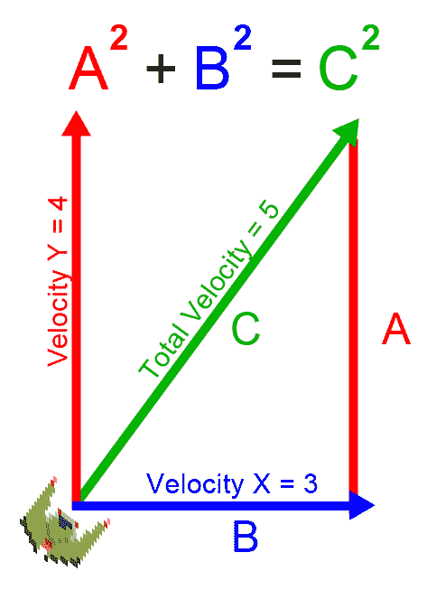

# 六、游戏对象和游戏循环

在这一章，我们将开始把一个游戏的框架放到适当的位置。所有游戏都有**游戏对象**和一个**游戏循环**。每个游戏都有一个游戏循环。一些工具，比如 Unity，尽最大努力抽象出游戏循环，这样开发者不一定需要知道它在那里，但是即使在这些情况下，它仍然在那里。所有游戏都必须对运行它的操作系统或硬件的渲染能力有所控制，并在游戏运行时将图像绘制到屏幕上。游戏的所有工作都在一个**大循环**内完成。游戏对象可以是类的实例，在面向对象编程语言如 C++ 的情况下，或者在过程语言如 C 的情况下，它们可以是变量或结构的松散集合。在这一章中，我们将学习如何设计一个游戏循环，以及从 C++ 内部编译成**网络组件**的一些早期版本的游戏对象。

You will need to include several images in your build to make this project work. Make sure you include the `/Chapter06-game-object/sprites/` folder from the project's GitHub repository. If you haven't yet downloaded the GitHub project, you can get it online here: [https://github.com/PacktPublishing/Hands-On-Game-Development-with-WebAssembly](https://github.com/PacktPublishing/Hands-On-Game-Development-with-WebAssembly).

在本章中，我们将涵盖以下主题:

*   游戏循环
*   对象池
*   玩家游戏对象
*   敌人游戏对象
*   导弹

# 理解游戏循环

游戏设计中的一个关键概念是游戏循环。在任何游戏中，代码都必须一遍又一遍地运行，执行一系列任务，如输入、人工智能、物理和渲染。游戏循环可能如下所示:

```cpp
while(loop_forever) {
    get_user_input();
    move_game_objects();
    collision_detection();
    render_game_objects();
    play_audio();
}
```

一个 SDL/C++ 游戏，目标几乎是除了 WebAssembly 之外的任何平台，它会有一个`while`循环，可能位于 C++ 代码的`main`函数中，只有当玩家退出游戏时才会退出。WebAssembly 与您的 web 浏览器中的 JavaScript 引擎共享其运行时。JavaScript 引擎在一个线程上运行，Emscripten 使用 JavaScript **粘合代码**在WebAssembly中获取您在 SDL 内部所做的事情，并将其呈现到 HTML 画布元素中。因此，我们需要为我们的游戏循环使用一段特定于 Emscripten 的代码:

```cpp
emscripten_set_main_loop(game_loop, 0, 0);
```

在接下来的几章中，我们将在游戏中添加以下一些功能:

*   游戏对象管理
*   游戏对象之间的碰撞检测
*   粒子系统
*   敌方飞船 AI 使用**有限状态机** ( **有限状态机**)
*   追踪我们玩家的游戏摄像机
*   播放音频和声音效果
*   游戏物理
*   用户界面

这些将是从游戏循环中调用的函数。

# 写一个基本的游戏循环

在某种程度上，我们已经有了一个简单的游戏循环，尽管我们没有显式地创建一个名为`game_loop`的函数。我们将修改我们的代码，使其有一个更明确的游戏循环，将`input`、`move`和`render`功能分开。此时，我们的`main`函数成为一个初始化函数，通过使用 Emscripten 设置游戏循环来完成。这个新应用的代码比以前的应用大。让我们首先从较高的层次浏览代码，介绍每个部分。然后，我们将详细介绍代码的各个部分。

我们以`#include`和`#define`预处理器宏开始代码:

```cpp
#include <SDL2/SDL.h>
#include <SDL2/SDL_image.h>
#include <emscripten.h>
#include <stdio.h>
#include <stdbool.h>
#include <math.h>

#define SPRITE_FILE "sprites/Franchise.png"
#define PI 3.14159
#define TWO_PI 6.28318
#define MAX_VELOCITY 2.0
```

在预处理器宏之后，我们有一些全局时间变量:

```cpp
Uint32 last_time;
Uint32 last_frame_time;
Uint32 current_time;
```

然后，我们将定义几个与 SDL 相关的全局变量:

```cpp
SDL_Window *window;
SDL_Renderer *renderer;
SDL_Rect dest = {.x = 160, .y = 100, .w = 16, .h = 16 };
SDL_Texture *sprite_texture;
SDL_Event event;
```

在我们的 SDL 全局变量之后，我们有一组键盘标志:

```cpp
bool left_key_down = false;
bool right_key_down = false;
bool up_key_down = false;
bool down_key_down = false;
```

最后一个全局变量跟踪玩家数据:

```cpp
float player_x = 160.0;
float player_y = 100.0;
float player_rotation = PI;
float player_dx = 0.0;
float player_dy = 1.0;
float player_vx = 0.0;
float player_vy = 0.0;
float delta_time = 0.0;
```

现在我们已经定义了所有的全局变量，我们需要两个函数来左右旋转玩家的飞船:

```cpp

void rotate_left() {
    player_rotation -= delta_time;
    if( player_rotation < 0.0 ) {
        player_rotation += TWO_PI;
    }
    player_dx = sin(player_rotation);
    player_dy = -cos(player_rotation);
}

void rotate_right() {
    player_rotation += delta_time;
    if( player_rotation >= TWO_PI ) {
        player_rotation -= TWO_PI;
    }
    player_dx = sin(player_rotation);
    player_dy = -cos(player_rotation);
}
```

然后，我们为玩家的飞船提供了三个与移动相关的功能。我们用它们来加速和减速我们的宇宙飞船，并控制我们宇宙飞船的速度:

```cpp

void accelerate() {
    player_vx += player_dx * delta_time;
    player_vy += player_dy * delta_time;
}

void decelerate() {
    player_vx -= (player_dx * delta_time) / 2.0;
    player_vy -= (player_dy * delta_time) / 2.0;
}

void cap_velocity() {
    float vel = sqrt( player_vx * player_vx + player_vy * player_vy );
    if( vel > MAX_VELOCITY ) {
        player_vx /= vel;
        player_vy /= vel;
        player_vx *= MAX_VELOCITY;
        player_vy *= MAX_VELOCITY;
    }
}
```

`move`功能执行游戏对象的高级移动:

```cpp

void move() {
    current_time = SDL_GetTicks();
    delta_time = (float)(current_time - last_time) / 1000.0;
    last_time = current_time;

    if( left_key_down ) {
        rotate_left();
    }
    if( right_key_down ) {
        rotate_right();
    }
    if( up_key_down ) {
        accelerate();
    }
    if( down_key_down ) {
        decelerate();
    }
    cap_velocity();

    player_x += player_vx;

    if( player_x > 320 ) {
        player_x = -16;
    }
    else if( player_x < -16 ) {
        player_x = 320;
    }

    player_y += player_vy;

    if( player_y > 200 ) {
        player_y = -16;
    }
    else if( player_y < -16 ) {
        player_y = 200;
    }
} 
```

`input`功能确定键盘输入状态并设置我们的全局键盘标志:

```cpp

void input() {
    if( SDL_PollEvent( &event ) ){
        switch( event.type ){
            case SDL_KEYDOWN:
                switch( event.key.keysym.sym ){
                    case SDLK_LEFT:
                        left_key_down = true;
                        break;
                    case SDLK_RIGHT:
                        right_key_down = true;
                        break;
                    case SDLK_UP:
                        up_key_down = true;
                        break;
                    case SDLK_DOWN:
                        down_key_down = true;
                        break;
                    default:
                        break;
                }
                break;
            case SDL_KEYUP:
                switch( event.key.keysym.sym ){
                    case SDLK_LEFT:
                        left_key_down = false;
                        break;
                    case SDLK_RIGHT:
                        right_key_down = false;
                        break;
                    case SDLK_UP:
                        up_key_down = false;
                        break;
                    case SDLK_DOWN:
                        down_key_down = false;
                        break;
                    default:
                        break;
                }
                break;

            default:
                break;
        }
    }
}
```

`render`功能将玩家的精灵绘制到画布上:

```cpp
void render() {
    SDL_RenderClear( renderer );

    dest.x = player_x;
    dest.y = player_y;

    float degrees = (player_rotation / PI) * 180.0;
    SDL_RenderCopyEx( renderer, sprite_texture,
                        NULL, &dest,
    degrees, NULL, SDL_FLIP_NONE );

    SDL_RenderPresent( renderer );
 }
```

`game_loop`功能在每一帧中运行我们所有的高级游戏对象:

```cpp
void game_loop() {
    input();
    move();
    render();
}
```

像往常一样，`main`函数完成我们所有的初始化:

```cpp
int main() {
    char explosion_file_string[40];
    SDL_Init( SDL_INIT_VIDEO );
    SDL_CreateWindowAndRenderer( 320, 200, 0, &window, &renderer );
    SDL_SetRenderDrawColor( renderer, 0, 0, 0, 255 );
    SDL_RenderClear( renderer );
    SDL_Surface *temp_surface = IMG_Load( SPRITE_FILE );

    if( !temp_surface ) {
        printf("failed to load image: %s\n", IMG_GetError() );
        return 0;
    }

    sprite_texture = SDL_CreateTextureFromSurface( renderer, 
                                                  temp_surface );
    SDL_FreeSurface( temp_surface );
    last_frame_time = last_time = SDL_GetTicks();

    emscripten_set_main_loop(game_loop, 0, 0);
    return 1;
}
```

您可能已经注意到，在前面的代码中，我们添加了大量全局变量来定义玩家特定的值:

```cpp
float player_x = 160.0;
float player_y = 100.0;
float player_rotation = PI;
float player_dx = 0.0;
float player_dy = 1.0;
float player_vx = 0.0;
float player_vy = 0.0;
```

在*游戏对象*部分，我们将开始创建游戏对象，并将这些值从全局定义移动到对象中，但是，就目前而言，将它们作为全局变量是可行的。我们增加了移动玩家飞船的能力，类似于经典的街机游戏*小行星*。在我们游戏的最终版本中，我们将有两艘宇宙飞船在决斗中战斗。为此，我们需要跟踪我们的船的 *x* 和 *y* 坐标以及船的旋转；`player_dx`和`player_dy`组成了我们飞船的归一化方向向量。

`player_vx`和`player_vy`变量分别是玩家当前的`x`和`y`速度。

在按住左右键的同时，我们将让这些键将飞船向左或向右转动，而不是让左右键将飞船向左或向右移动。为此，我们将让我们的输入函数调用`rotate_left`和`rotate_right`函数:

```cpp
void rotate_left() {
    player_rotation -= delta_time;
    if( player_rotation < 0.0 ) {
        player_rotation += TWO_PI;
    }
    player_dx = sin(player_rotation);
    player_dy = -cos(player_rotation);
}

void rotate_right() {
    player_rotation += delta_time;
    if( player_rotation >= TWO_PI ) {
         player_rotation -= TWO_PI;
    }
    player_dx = sin(player_rotation);
    player_dy = -cos(player_rotation);
}
```

如果玩家正在左转，我们从玩家旋转中减去`delta_time`变量，这是自最后一帧渲染以来的时间(以秒为单位)。`player_rotation`变量是玩家旋转的弧度，其中 180 度= π (3.14159…)。这意味着玩家可以通过按住左箭头或右箭头大约三秒钟来旋转 180 度。如果玩家的旋转低于 0°或者玩家的旋转高于 2π (360 度)，我们也必须修正我们的旋转。如果你不熟悉弧度，它是一种替代测量角度的系统，在这个系统中，一个圆有 360 度。使用弧度，你会想到你必须绕着一个单位圆的圆周走多远才能到达那个角度。半径为 1 的圆称为**单位圆**。

单位圆在左边:


A unit circle and a circle with a radius of 2

圆直径的公式是 2πr(在我们的代码`2 * PI * radius`中)。所以，弧度为 2π等于说 360 度。大多数游戏引擎和数学库使用弧度而不是度数，但是出于某种原因，SDL 在旋转精灵时使用度数，所以我们需要在渲染游戏对象时将弧度旋转回度数(讨厌！).

Just to make sure everyone is following me, in our code the `PI` macro holds an approximate value for π that is defined as the ratio of a circle's diameter to its circumference. A typical approximation for π is 3.14, although we will approximate π as 3.14159 in our code. 

如果玩家按键盘上的向上或向下键，我们还需要加速或减速飞船。为此，我们将创建`accelerate`和`decelerate`函数，当玩家按住向上或向下键时调用这些函数:

```cpp
void accelerate() {
    player_vx += player_dx * delta_time;
    player_vy += player_dy * delta_time;
}

void decelerate() {
    player_vx -= (player_dx * delta_time) / 2.0;
    player_vy -= (player_dy * delta_time) / 2.0;
}
```

这两个函数都采用在我们的旋转函数中使用`sin`和`-cos`计算的`player_dx`和`player_dy`变量，并使用这些值添加到存储在`player_vx`和`player_vy`变量中的玩家的 *x* 和 *y* 速度。我们将该值乘以`delta_time`，这将把我们的加速度设置为每秒 1 像素的平方。我们的减速函数将该值除以 2，这将我们的减速率设置为每秒 0.5 像素的平方。

在我们定义了`accelerate`和`decelerate`函数之后，我们需要创建一个函数，将我们飞船的`x`和`y`速度限制在每秒 2.0 像素:

```cpp
void cap_velocity() {
    float vel = sqrt( player_vx * player_vx + player_vy * player_vy );

    if( vel > MAX_VELOCITY ) {
        player_vx /= vel;
        player_vy /= vel;
        player_vx *= MAX_VELOCITY;
        player_vy *= MAX_VELOCITY;
     }
}
```

这不是定义这个函数最有效的方法，但却是最容易理解的。第一条线决定了我们速度矢量的大小。如果你不知道那是什么意思，让我稍微解释一下。我们沿着 *x* 轴有一个速度。我们还有一个沿 *y* 轴的速度。我们想限制整体速度。如果我们分别设定`x`和`y`速度的上限，我们将能够通过对角行进而走得更快。计算我们的总速度，需要用到勾股定理(你还记得高中的三角学吗？).如果你不记得了，当你有一个直角三角形时，要计算它的斜边，你要取其他两边的平方和的平方根(还记得`A<sup>2</sup> + B<sup>2</sup> = C<sup>2</sup>`吗？):



<sub>Using the Pythagorean theorem to determine the magnitude of the velocity using the x and y velocities</sub>

所以，为了计算我们的速度，我们需要对`x`速度进行平方，对`y`速度进行平方，将它们相加，然后求平方根。此时，我们对照`MAX_VELOCITY`值来检查我们的速度，我们已经将其定义为`2.0`。如果当前速度大于这个最大速度，我们需要调整我们的`x`和`y`速度，使我们处于`2`的值。我们通过将`x`和`y`速度除以总速度，然后乘以`MAX_VELOCITY`来实现。

我们最终需要编写一个`move`函数来移动我们所有的游戏对象，但目前我们只移动玩家的飞船:

```cpp
void move() {
    current_time = SDL_GetTicks();
    delta_time = (float)(current_time - last_time) / 1000.0;
    last_time = current_time;

    if( left_key_down ) {
        rotate_left();
    }

    if( right_key_down ) {
        rotate_right();
    }

    if( up_key_down ) {
        accelerate();
    }

    if( down_key_down ) {
        decelerate();
    }

    cap_velocity();
    player_x += player_vx;

    if( player_x > 320 ) {
         player_x = -16;
     }
    else if( player_x < -16 ) {
        player_x = 320;
    }
    player_y += player_vy;

    if( player_y > 200 ) {
        player_y = -16;
    }
    else if( player_y < -16 ) {
        player_y = 200;
    }
}
```

我们需要做的第一件事是获取该帧的当前时间，然后结合我们之前的帧时间来计算`delta_time`。`delta_time`变量是自上一帧时间以来的时间量，单位为秒。我们需要将大部分动作和动画与该值联系起来，以获得一致的游戏速度，该速度与任何给定计算机上的帧速率无关。之后，我们需要根据我们在`input`功能中设置的旗帜旋转和加速或减速我们的飞船。然后我们限制我们的速度，使用`x`和`y`值来修改玩家飞船的 *x* 和 *y* 坐标。

我们在`move`功能中使用了一系列标志，告诉我们当前是否按下了键盘上的特定键。要设置这些标志，我们需要一个`input`功能，该功能使用`SDL_PollEvent`来查找键盘事件并相应地设置标志:

```cpp

void input() {
    if( SDL_PollEvent( &event ) ){
        switch( event.type ){
            case SDL_KEYDOWN:
                switch( event.key.keysym.sym ){
                    case SDLK_LEFT:
                        left_key_down = true;
                        break;
                    case SDLK_RIGHT:
                        right_key_down = true;
                        break;
                    case SDLK_UP:
                        up_key_down = true;
                        break;
                    case SDLK_DOWN:
                        down_key_down = true;
                        break;
                    default:
                        break;
                }
                break;
            case SDL_KEYUP:
                switch( event.key.keysym.sym ){
                    case SDLK_LEFT:
                        left_key_down = false;
                        break;
                    case SDLK_RIGHT:
                        right_key_down = false;
                        break;
                    case SDLK_UP:
                        up_key_down = false;
                        break;
                    case SDLK_DOWN:
                        down_key_down = false;
                        break;
                    default:
                        break;
                }
                break;
            default:
                break;
        }
    }
}
```

该功能包括一些寻找箭头键按压和释放的`switch`语句。如果按下其中一个箭头键，我们将相应的标志设置为`true`；如果有一个被释放，我们就把它设为`false`。

接下来，我们定义`render`函数。这个函数目前渲染我们的宇宙飞船精灵，最终将我们所有的精灵渲染到 HTML 画布上:

```cpp
void render() {
    SDL_RenderClear( renderer );
    dest.x = player_x;
    dest.y = player_y;
    float degrees = (player_rotation / PI) * 180.0;
    SDL_RenderCopyEx( renderer, sprite_texture,
                        NULL, &dest,
                        degrees, NULL, SDL_FLIP_NONE );
    SDL_RenderPresent( renderer );
}
```

该函数清除 HTML 画布，将目的地`x`和`y`值设置为`player_x`和`player_y`，计算玩家的旋转度数，然后将该精灵渲染到画布上。我们将之前对`SDL_RenderCopy`的呼叫换成了对`SDL_RenderCopyEx`的呼叫。这个新函数允许我们传入一个旋转飞船精灵的值。

在我们定义了`render`函数之后，我们有了新的`game_loop`函数:

```cpp
void game_loop() {
    input();
    move();
    render();
}
```

这个函数将由`emscripten_set_main_loop`从我们的`main`函数中调用。这个函数运行渲染的每一帧，并负责管理我们游戏中进行的所有活动。它目前调用我们之前在游戏代码中定义的`input`、`move`和`render`函数，未来还会调用我们的 AI 代码、音效、物理代码等等。

# 编译 gameloop.html

现在我们已经写好了代码，我们可以继续编译我们的游戏循环应用了。在运行这个命令之前，我想重申一下，你需要从 GitHub([https://GitHub . com/PacktPublishing/hand-On-Game-Development-with-WebAssembly](https://github.com/PacktPublishing/Hands-On-Game-Development-with-WebAssembly))下载这个项目，因为你需要位于`/Chapter06-game-loop/sprites`文件夹中的 PNG 文件来构建这个项目。

正确设置文件夹后，使用以下命令编译应用:

```cpp
emcc game_loop.c -o gameloop.html  --preload-file sprites -s NO_EXIT_RUNTIME=1 -s USE_SDL_IMAGE=2 -s SDL2_IMAGE_FORMATS=["png"] -s EXTRA_EXPORTED_RUNTIME_METHODS="['cwrap', 'ccall']" -s USE_SDL=2
```

使用 web 服务器为编译它的目录提供服务，或者使用 emrun 构建并运行它，当加载到 web 浏览器中时，它应该是这样的:


The screenshot gameloop.html It is important to remember that you must run WebAssembly apps using a web server, or with `emrun`.  If you would like to run your WebAssembly app using `emrun`, you must compile it with the `--emrun` flag.  The web browser requires a web server to stream the WebAssembly module.  If you attempt to open an HTML page that uses WebAssembly in a browser directly from your hard drive, that WebAssembly module will not load.

应用编译完成后，你应该可以使用箭头键在画布上移动飞船。现在我们有了一个基本的游戏循环，在下一部分，我们将在我们的应用中添加一些游戏对象，使它更像一个游戏。

# 游戏对象

到目前为止，我们的方法完全是程序性的，并且已经被编码，所以它可以用 C 而不是 C++ 编写。开发人员已经用 C 语言甚至汇编语言编写游戏很长时间了，所以拥有面向对象的游戏设计方法并不是严格必要的，但是从代码管理的角度来看，OOP 是设计和编写游戏的一个很好的方法。游戏对象可以帮助我们通过对象池管理分配的内存。在这一点上，开始将我们的程序分成多个文件也是有意义的。我的方法是有一个单独的`.hpp`文件来定义我们所有的游戏对象，每个对象有一个`.cpp`文件。

# 玩家的宇宙飞船游戏对象

到目前为止，我们一直在全球变量中保留所有跟踪玩家船的值。从组织的角度来看，这并不理想。我们将创建的第一个游戏对象将是玩家的飞船对象。我们将从一个基本类开始，并在以后的代码中添加更多面向对象的特性。

下面是我们新头文件`game.hpp`的代码:

```cpp
#ifndef __GAME_H__
#define __GAME_H__#include <SDL2/SDL.h>
#include <SDL2/SDL_image.h>
#include <emscripten.h>
#include <stdio.h>
#include <stdbool.h>
#include <math.h>
#include <string>
#include <vector>

#define SPRITE_FILE "sprites/Franchise.png"
#define MAX_VELOCITY 2.0
#define PI 3.14159
#define TWO_PI 6.28318

extern Uint32 last_time;
extern Uint32 last_frame_time;
extern Uint32 current_time;
extern SDL_Window *window;
extern SDL_Renderer *renderer;
extern SDL_Rect dest;
extern SDL_Texture *sprite_texture;
extern SDL_Event event;
extern bool left_key_down;
extern bool right_key_down;
extern bool up_key_down;
extern bool down_key_down;
extern bool space_key_down;
extern float delta_time;
extern int diff_time;

class PlayerShip {
    public:
        float m_X;
        float m_Y;
        float m_Rotation;
        float m_DX;
        float m_DY;
        float m_VX;
        float m_VY;

        PlayerShip();
        void RotateLeft();
        void RotateRight();
        void Accelerate();
        void Decelerate();
        void CapVelocity();
        void Move();
        void Render();
};

extern PlayerShip player;
#endif
```

我们所有的 CPP 文件都会包含这个`game.hpp`头文件。该文件的前几行是为了确保我们不会多次包含该文件。然后我们定义了我们在旧的 C 文件中定义的所有全局变量:

```cpp
extern Uint32 last_time;
extern Uint32 last_frame_time;
extern Uint32 current_time;
extern SDL_Window *window;
extern SDL_Renderer *renderer;
extern SDL_Rect dest;
extern SDL_Texture *sprite_texture;
extern SDL_Event event;
extern bool left_key_down;
extern bool right_key_down;
extern bool up_key_down;
extern bool down_key_down;
extern float delta_time;
```

在头文件中，我们没有给堆分配空间。在我们的全局变量定义之前使用`extern`关键字告诉编译器，我们在其中一个`.cpp`文件中声明了全局变量。现在，我们仍然有很多全局变量。当我们在本章中修改代码时，我们将减少这些全局变量的数量。

如果这是生产代码，将所有这些值移动到类中是有意义的，但是，目前，我们只创建了一个`PlayerShip`对象。我们对`PlayerShip`也有自己的类定义。开发人员通常在头文件中创建类定义。

在我们定义了所有的全局变量之后，我们将需要我们的类定义。

下面是我们`PlayerShip`类的定义:

```cpp
class PlayerShip {
    public:
        float m_X;
        float m_Y;
        float m_Rotation;
        float m_DX;
        float m_DY;
        float m_VX;
        float m_VY;

        PlayerShip();
        void RotateLeft();
        void RotateRight();
        void Accelerate();
        void Decelerate();
        void CapVelocity();
        void Move();
        void Render();
 };

extern PlayerShip player;
```

在本书中，我们将声明我们所有的属性`public`。这意味着我们的代码可以从任何地方访问它们，而不仅仅是从这个函数内部。如果你和不止一个开发人员在一个项目上工作，这通常不被认为是一个好的实践。如果您不想让另一个开发人员直接修改只有类中的函数才能修改的特定属性，那么防止其他类直接修改我们的某些属性(如`m_DX`和`m_DY`)是一个好主意。然而，出于演示的目的，将我们类中的所有东西定义为`public`将简化我们的设计。

在我们定义了我们的属性之后，我们有了一系列的函数，这些函数一旦被定义就会与这个类相关联。第一个函数`PlayerShip()`与我们的类同名，这使得它成为构造函数，也就是我们的 app 创建`PlayerShip`类型的对象时默认调用的函数。如果我们愿意，我们可以定义一个析构函数，当对象被破坏时，通过调用它`~PlayerShip()`来运行它。我们目前不需要这个对象的析构函数，所以我们不会在这里定义它，这意味着我们将依赖 C++ 为这个类创建一个*默认析构函数*。

我们在这个类中定义的所有其他函数都对应于我们在游戏的早期 C 版本中创建的函数。将所有这些函数移到一个类中可以让我们更好地组织代码。请注意，在我们的类定义之后，我们创建了另一个全局变量，即名为`player`的`PlayerShip`。编译器在所有包含我们的`game.hpp`文件的`.cpp`文件中共享这个播放器对象。

# 对象池

我们已经定义了我们的第一个游戏对象，它代表了我们玩家的飞船，但是我们所能做的就是在游戏屏幕上飞来飞去。我们需要允许我们的玩家发射炮弹。如果我们在每次玩家发射炮弹时都创建一个新的炮弹对象，我们将很快填满 WASM 模块的内存。我们需要做的是创建一个所谓的**对象池**。对象池用于创建具有固定寿命的对象。我们的射弹只需要存活足够长的时间，要么击中目标，要么在消失前移动一段固定的距离。如果我们一次在屏幕上创建的投射物数量比我们需要的多一点，我们就可以将池中的这些对象保持在活动或非活动状态。当我们需要发射一个新的射弹时，我们扫描我们的对象池寻找一个不活动的，然后激活它并把它放在发射点。这样，我们就不会不断地分配和取消分配内存来创建我们的射弹。

让我们回到我们的`game.hpp`文件，在`#endif`宏之前添加一些类定义:

```cpp
class Projectile {
    public:
        const char* c_SpriteFile = "sprites/Projectile.png";
        const int c_Width = 8;
        const int c_Height = 8;
        SDL_Texture *m_SpriteTexture;
        bool m_Active;
        const float c_Velocity = 6.0;
        const float c_AliveTime = 2000;
        float m_TTL;
        float m_X;
        float m_Y;
        float m_VX;
        float m_VY;

        Projectile();
        void Move();
        void Render();
        void Launch(float x, float y, float dx, float dy);
};

class ProjectilePool {
    public:
        std::vector<Projectile*> m_ProjectileList;
        ProjectilePool();
        ~ProjectilePool();
        void MoveProjectiles();
        void RenderProjectiles();
        Projectile* GetFreeProjectile();
};

extern ProjectilePool* projectile_pool; 
```

因此，我们已经在`game.hpp`文件中定义了所有的类。现在，我们有三个班级:`PlayerShip`、`Projectile`和`ProjectilePool`。

`PlayerShip`类以前就存在了，但是我们正在给这个类增加一些额外的功能来允许我们发射炮弹。为了实现这一新功能，我们在类定义中添加了一些新的公共属性:

```cpp
public:
    const char* c_SpriteFile = "sprites/Franchise.png";
    const Uint32 c_MinLaunchTime = 300;
    const int c_Width = 16;
    const int c_Height = 16;
    Uint32 m_LastLaunchTime;
    SDL_Texture *m_SpriteTexture;
```

我们将`#define`宏中的一些值直接移动到类中。`c_SpriteFile`常量是我们将加载的用来渲染玩家飞船精灵的 PNG 文件的名称。`c_MinLaunchTime`常数是两次发射射弹之间的最短时间，单位为毫秒。我们还用`c_Width`和`c_Height`常数定义了精灵的宽度和高度。这样，我们可以为不同的对象类型设置不同的值。`m_LastLaunchTime`属性以毫秒为单位跟踪最近的射弹发射时间。雪碧纹理，之前是一个全局变量，将移动到玩家的船级属性。

在对`PlayerShip`类定义进行修改后，我们必须为两个新类添加一个类定义。这两个类中的第一个是`Projectile`类:

```cpp
class Projectile {
    public:
        const char* c_SpriteFile = "sprites/Projectile.png";
        const int c_Width = 8;
        const int c_Height = 8;
        const float c_Velocity = 6.0;
        const float c_AliveTime = 2000;

        SDL_Texture *m_SpriteTexture;
        bool m_Active;
        float m_TTL;
        float m_X;
        float m_Y;
        float m_VX;
        float m_VY;

        Projectile();
        void Move();
        void Render();
        void Launch(float x, float y, float dx, float dy);
};
```

这个类代表玩家将要射击的抛射体游戏物体，然后是敌人的飞船。我们从几个常数开始，这些常数定义了我们在虚拟文件系统中放置精灵的位置，以及宽度和高度:

```cpp
class Projectile {
    public:
        const char* c_SpriteFile = "sprites/Projectile.png";
        const int c_Width = 8;
        const int c_Height = 8;
```

下一个属性是`m_SpriteTexture`，这是一个指向 SDL 纹理的指针，用来渲染我们的射弹。我们需要一个变量来告诉我们的对象池这个游戏对象是活动的。我们称之为属性`m_Active`。接下来，我们有一个常数来定义我们的射弹每秒移动的速度，以像素为单位，称为`c_Velocity`，还有一个常数来指示射弹在自毁之前存活的时间，以毫秒为单位，称为`c_AliveTime`。

`m_TTL`变量是一个**生存时间**变量，它跟踪剩余多少毫秒，直到该射弹将其`m_Active`变量更改为`false`，并将其自身回收到**射弹池**中。`m_X`、`m_Y`、`m_VX`和`m_VY`变量用于跟踪我们射弹的`x`和`y`位置以及`x`和`y`速度。

然后，我们为射弹类声明四个函数:

```cpp
Projectile();
void Move();
void Render();
void Launch(float x, float y, float dx, float dy);
```

`Projectile`函数是我们的类构造函数。如果我们的抛射体当前处于活动状态，每帧将调用一次`Move`和`Render`。`Move`功能将管理活动投射体的移动，`Render`将管理将投射体精灵绘制到我们的 HTML 画布元素中。`Launch`功能将从我们的`PlayerShip`类调用，使我们的船向船面对的方向发射一枚炮弹。

我们必须添加到`game.hpp`文件中的最后一个类定义是`ProjectilePool`类:

```cpp
class ProjectilePool {
    public:
        std::vector<Projectile*> m_ProjectileList;
        ProjectilePool();
        ~ProjectilePool();
        void MoveProjectiles();
        void RenderProjectiles();
        Projectile* GetFreeProjectile();
};
```

这个职业管理一个由 10 个射弹组成的**池，储存在一个矢量属性`m_ProjectileList`中。这个类的函数包括构造函数和析构函数、`MoveProjectiles`、`RenderProjectils`和`GetFreeProjectile`。**

`MoveProjectiles()`函数在我们的射弹列表中循环调用任何活动射弹上的`move`函数。`RenderProjectiles()`功能在我们的投射物列表中循环并渲染以画布任何活动的投射物，并且`GetFreeProjectile`返回我们池中第一个不活动的投射物。

# 汇集玩家的投射物

现在我们已经查看了`Projectile`和`ProjectilePool`类的类定义，我们需要创建一个`projectile.cpp`文件和一个`projectile_pool.cpp`文件来存储这些类的函数代码。因为这是在 [第 6 章](06.html)*游戏对象和游戏循环*中，我建议创建一个名为`Chapter06`的新文件夹来保存这些文件。该代码将完成汇集我们的射弹、在我们需要时请求一个非活动射弹以及移动和渲染我们的活动射弹的工作。首先，我们来看看`projectile.cpp`中的代码:

```cpp
#include "game.hpp"

Projectile::Projectile() {
    m_Active = false;
    m_X = 0.0;
    m_Y = 0.0;
    m_VX = 0.0;
    m_VY = 0.0;

    SDL_Surface *temp_surface = IMG_Load( c_SpriteFile );

    if( !temp_surface ) {
        printf("failed to load image: %s\n", IMG_GetError() );
        return;
    }

    m_SpriteTexture = SDL_CreateTextureFromSurface( renderer, 
    temp_surface );

    if( !m_SpriteTexture ) {
        printf("failed to create texture: %s\n", IMG_GetError() );
        return;
    }

    SDL_FreeSurface( temp_surface );
}

void Projectile::Move() {
    m_X += m_VX;
    m_Y += m_VY;
    m_TTL -= diff_time;

    if( m_TTL <= 0 ) {
        m_Active = false;
        m_TTL = 0;
    }
}

void Projectile::Render() {
    dest.x = m_X;
    dest.y = m_Y;
    dest.w = c_Width;
    dest.h = c_Height;

    int return_val = SDL_RenderCopy( renderer, m_SpriteTexture,
                                     NULL, &dest );
    if( return_val != 0 ) {
        printf("SDL_Init failed: %s\n", SDL_GetError());
    }
}

void Projectile::Launch(float x, float y, float dx, float dy) {
    m_X = x;
    m_Y = y;
    m_VX = c_Velocity * dx;
    m_VY = c_Velocity * dy;
    m_TTL = c_AliveTime;
    m_Active = true;
}
```

这是处理移动、渲染和发射单个射弹的代码。这里声明的第一个函数是构造函数:

```cpp
Projectile::Projectile() {
    m_Active = false;
    m_X = 0.0;
    m_Y = 0.0;
    m_VX = 0.0;
    m_VY = 0.0;

    SDL_Surface *temp_surface = IMG_Load( c_SpriteFile );

    if( !temp_surface ) {
        printf("failed to load image: %s\n", IMG_GetError() );
        return;
    }

    m_SpriteTexture = SDL_CreateTextureFromSurface( renderer, 
    temp_surface );

    if( !m_SpriteTexture ) {
        printf("failed to create texture: %s\n", IMG_GetError() );
        return;
    }
    SDL_FreeSurface( temp_surface );
}
```

这个构造器主要关心的是将投射体设置为非活动状态，并创建一个 SDL 纹理，我们稍后将使用它来将我们的精灵渲染到画布元素。在定义了我们的构造函数之后，我们定义了我们的`Move`函数:

```cpp
void Projectile::Move() {
    m_X += m_VX;
    m_Y += m_VY;
    m_TTL -= diff_time;
    if( m_TTL <= 0 ) {
        m_Active = false;
        m_TTL = 0;
    }
}
```

该功能根据速度改变我们射弹的 *x* 和 *y* 位置，并减少我们射弹的生存时间，如果生存时间小于或等于零，将其设置为非活动状态并将其回收到射弹池中。我们定义的下一个函数是我们的`Render`函数:

```cpp
void Projectile::Render() {
    dest.x = m_X;
    dest.y = m_Y;
    dest.w = c_Width;
    dest.h = c_Height;

    int return_val = SDL_RenderCopy( renderer, m_SpriteTexture,
                                    NULL, &dest );

    if( return_val != 0 ) {
        printf("SDL_Init failed: %s\n", SDL_GetError());
    }
}
```

这段代码类似于我们用来渲染飞船的代码，所以你应该很熟悉。我们最后的投射函数是`Launch`函数:

```cpp
void Projectile::Launch(float x, float y, float dx, float dy) {
    m_X = x;
    m_Y = y;
    m_VX = c_Velocity * dx;
    m_VY = c_Velocity * dy;
    m_TTL = c_AliveTime;
    m_Active = true;
}
```

每当玩家按下键盘上的空格键时，从`PlayerShip`类调用该函数。`PlayerShip`对象将在玩家船只的 *x* 和 *y* 坐标中通过，同时在`dx`和`dy`参数中船只正对的方向也将通过。这些参数用于设定射弹的 *x* 和 *y* 坐标以及射弹的`x`和`y`速度。游戏将生存时间设置为默认生存时间，然后将对象设置为活动状态。

现在我们已经完全定义了我们的`Projectile`类，让我们设置`ProjectilePool`类来管理那些射弹。以下代码将在我们的`projectile_pool.cpp`文件中:

```cpp
#include "game.hpp"

ProjectilePool::ProjectilePool() {
    for( int i = 0; i < 10; i++ ) {
        m_ProjectileList.push_back( new Projectile() );
    }
}

ProjectilePool::~ProjectilePool() {
    m_ProjectileList.clear();
}

void ProjectilePool::MoveProjectiles() {
    Projectile* projectile;
    std::vector<Projectile*>::iterator it;

    for( it = m_ProjectileList.begin(); it != m_ProjectileList.end(); it++ ) {
        projectile = *it;
        if( projectile->m_Active ) {
            projectile->Move();
        }
    }
}

void ProjectilePool::RenderProjectiles() {
    Projectile* projectile;
    std::vector<Projectile*>::iterator it;

    for( it = m_ProjectileList.begin(); it != m_ProjectileList.end(); it++ ) {
        projectile = *it;
        if( projectile->m_Active ) {
            projectile->Render();
         }
    }
}

Projectile* ProjectilePool::GetFreeProjectile() {
    Projectile* projectile;
    std::vector<Projectile*>::iterator it;

    for( it = m_ProjectileList.begin(); it != m_ProjectileList.end(); it++ ) {
        projectile = *it;
        if( projectile->m_Active == false ) {
            return projectile;
        }
    }
    return NULL;
}
```

前两个函数是构造函数和析构函数。这些功能会产生并摧毁我们列表中的投射物。下一个函数是`MoveProjectiles`函数，它在我们的`m_ProjectileList`中循环寻找活动的抛射体并移动它们。之后，我们有了一个`RenderProjectiles`功能，和我们的`MoveProjectiles`功能非常相似。这个函数在我们的列表中循环，在所有活动的射弹上调用`Render`函数。最后一个功能是`GetFreeProjectile`功能，它通过`m_ProjectileList`寻找第一个未激活的射弹以将其返回。每当我们想要发射一个抛射体时，我们都需要调用这个函数来找到一个不活动的。

# 制造敌人

所以，现在我们有一艘玩家船正在射击，我们可以增加一艘敌人船。它将类似于`PlayerShip`类。稍后，我们将进入类继承，这样我们就不会得到相同代码的复制和粘贴版本，但是现在我们将向我们的`game.hpp`文件添加一个新的类定义，它几乎与我们的`PlayerShip`类相同:

```cpp
enum FSM_STUB {
    SHOOT = 0,
    TURN_LEFT = 1,
    TURN_RIGHT = 2,
    ACCELERATE = 3,
    DECELERATE = 4
};

class EnemyShip {
    public:
        const char* c_SpriteFile = "sprites/BirdOfAnger.png";
        const Uint32 c_MinLaunchTime = 300;
        const int c_Width = 16;
        const int c_Height = 16;
        const int c_AIStateTime = 2000;

        Uint32 m_LastLaunchTime;
        SDL_Texture *m_SpriteTexture;

        FSM_STUB m_AIState;
        int m_AIStateTTL;

        float m_X;
        float m_Y;
        float m_Rotation;
        float m_DX;
        float m_DY;
        float m_VX;
        float m_VY;

        EnemyShip();
        void RotateLeft();
        void RotateRight();
        void Accelerate();
        void Decelerate();
        void CapVelocity();
        void Move();
        void Render();
        void AIStub();
};
```

您会注意到在`EnemyShip`类之前，我们定义了一个`FSM_STUB`枚举。枚举就像一种可以在 C 或 C++ 代码中定义的新数据类型。我们将在另一章中讨论**人工智能**和**有限状态机**，但是现在我们仍然希望我们的敌船做一些事情，即使这些事情不是很智能。我们创建了一个`FSM_STUB`枚举来定义我们的敌船当前可以做的事情。我们还在我们的`EnemyShip`类中创建了一个`AIStub`，它将作为未来人工智能逻辑的替身。`m_AIStateTTL`整数属性是人工智能状态变化的倒计时。还有一个名为`c_AIStateTime`的新常数，其值为`2000`。这是我们的人工智能状态在随机变化之前持续的毫秒数。

我们将创建一个`enemy_ship.cpp`文件，并向其中添加九个函数。第一个函数是我们的构造函数，前面是我们的`game.hpp`文件的`#include`:

```cpp
#include "game.hpp"
EnemyShip::EnemyShip() {
 m_X = 60.0;
    m_Y = 50.0;
    m_Rotation = PI;
    m_DX = 0.0;
    m_DY = 1.0;
    m_VX = 0.0;
    m_VY = 0.0;
    m_LastLaunchTime = current_time;

    SDL_Surface *temp_surface = IMG_Load( c_SpriteFile );

    if( !temp_surface ) {
        printf("failed to load image: %s\n", IMG_GetError() );
        return;
    }
    else {
        printf("success creating enemy ship surface\n");
    }
    m_SpriteTexture = SDL_CreateTextureFromSurface( renderer, 
    temp_surface );

    if( !m_SpriteTexture ) {
        printf("failed to create texture: %s\n", IMG_GetError() );
        return;
    }
    else {
        printf("success creating enemy ship texture\n");
    }
    SDL_FreeSurface( temp_surface );
}
```

之后，我们有了`RotateLeft`和`RotateRight`这两个用来转动宇宙飞船的功能:

```cpp
void EnemyShip::RotateLeft() {
    m_Rotation -= delta_time;

    if( m_Rotation < 0.0 ) {
        m_Rotation += TWO_PI;
    }
    m_DX = sin(m_Rotation);
    m_DY = -cos(m_Rotation);
}
void EnemyShip::RotateRight() {
    m_Rotation += delta_time;

    if( m_Rotation >= TWO_PI ) {
        m_Rotation -= TWO_PI;
    }
    m_DX = sin(m_Rotation);
    m_DY = -cos(m_Rotation);
}
```

功能`Accelerate`、`Decelerate`和`CapVelocity`都是用来修改敌方飞船的速度。：

```cpp
void EnemyShip::Accelerate() {
    m_VX += m_DX * delta_time;
    m_VY += m_DY * delta_time;
}

void EnemyShip::Decelerate() {
    m_VX -= (m_DX * delta_time) / 2.0;
    m_VY -= (m_DY * delta_time) / 2.0;
}

void EnemyShip::CapVelocity() {
    float vel = sqrt( m_VX * m_VX + m_VY * m_VY );

    if( vel > MAX_VELOCITY ) {
        m_VX /= vel;
        m_VY /= vel;

        m_VX *= MAX_VELOCITY;
        m_VY *= MAX_VELOCITY;
    }
}
```

我们添加到文件中的下一件事是`Render`函数:

```cpp
void EnemyShip::Render() {
    dest.x = (int)m_X;
    dest.y = (int)m_Y;
    dest.w = c_Width;
    dest.h = c_Height;

    float degrees = (m_Rotation / PI) * 180.0;

    int return_code = SDL_RenderCopyEx( renderer, m_SpriteTexture,
                                        NULL, &dest,
                                        degrees, NULL, SDL_FLIP_NONE );

 if( return_code != 0 ) {
 printf("failed to render image: %s\n", IMG_GetError() );
 }
}

```

最后，我们添加`Move`和`AIStub`功能:

```cpp
void EnemyShip::Move() {
     AIStub();

 if( m_AIState == TURN_LEFT ) {
     RotateLeft();
 }

 if( m_AIState == TURN_RIGHT ) {
     RotateRight();
 }

 if( m_AIState == ACCELERATE ) {
     Accelerate();
 }

 if( m_AIState == DECELERATE ) {
     Decelerate();
 }

 CapVelocity();
 m_X += m_VX;

 if( m_X > 320 ) {
     m_X = -16;
 }
 else if( m_X < -16 ) {
     m_X = 320;
 }

 m_Y += m_VY;

 if( m_Y > 200 ) {
     m_Y = -16;
 }
 else if( m_Y < -16 ) {
     m_Y = 200;
 }

 if( m_AIState == SHOOT ) {
     Projectile* projectile;
     if( current_time - m_LastLaunchTime >= c_MinLaunchTime ) {
         m_LastLaunchTime = current_time;
         projectile = projectile_pool->GetFreeProjectile();

         if( projectile != NULL ) {
             projectile->Launch( m_X, m_Y, m_DX, m_DY );
             }
         }
     }
}

void EnemyShip::AIStub() {
     m_AIStateTTL -= diff_time;
     if( m_AIStateTTL <= 0 ) {
         // for now get a random AI state.
         m_AIState = (FSM_STUB)(rand() % 5);
         m_AIStateTTL = c_AIStateTime;
     }
}
```

除了`Move`功能外，这些功能都与我们的`player_ship.cpp`文件中定义的功能相同。我们增加了一个新功能，`AIStub`。以下是`AIStub`功能中的代码:

```cpp
void EnemyShip::AIStub() {
    m_AIStateTTL -= diff_time;

    if( m_AIStateTTL <= 0 ) {
        // for now get a random AI state.
        m_AIState = (FSM_STUB)(rand() % 5);
        m_AIStateTTL = c_AIStateTime;
    }
}
```

这个功能是暂时的。我们最终将为我们的敌人飞船定义一个真正的人工智能。现在，该功能使用`m_AIStateTTL`倒计时固定的毫秒数，直到达到或低于`0`。此时，它会根据我们之前定义的名为`FSM_STUB`的枚举中的一个值随机设置一个新的人工智能状态。我们还对为玩家船创建的`Move()`功能进行了一些修改:

```cpp
void EnemyShip::Move() {
    AIStub();

    if( m_AIState == TURN_LEFT ) {
        RotateLeft();
    }
    if( m_AIState == TURN_RIGHT ) {
        RotateRight();
    }
    if( m_AIState == ACCELERATE ) {
        Accelerate();
    }
    if( m_AIState == DECELERATE ) {
        Decelerate();
    }
    CapVelocity();
     m_X += m_VX;

    if( m_X > 320 ) {
        m_X = -16;
    }
    else if( m_X < -16 ) {
        m_X = 320;
    }
    m_Y += m_VY;

    if( m_Y > 200 ) {
        m_Y = -16;
    }
    else if( m_Y < -16 ) {
        m_Y = 200;
    }

    if( m_AIState == SHOOT ) {
        Projectile* projectile;
        if( current_time - m_LastLaunchTime >= c_MinLaunchTime ) {
            m_LastLaunchTime = current_time;
            projectile = projectile_pool->GetFreeProjectile();

            if( projectile != NULL ) {
                projectile->Launch( m_X, m_Y, m_DX, m_DY );
            }
        }
    }
}
```

我已经从我们的`PlayerShip::Move`函数中获取了代码，并对其进行了一些修改。在这个新函数的开始，我们增加了对`AIStub`函数的调用。这个功能是我们未来 AI 的替身。而不是像我们对玩家船那样看我们的键盘输入，敌人船会看 AI 状态，选择向左旋转、向右旋转、加速、减速或射击。那不是真正的 AI，它只是船在做随机的事情，但是它让我们对船有了真正的 AI 之后会是什么样子有了一个大概的了解，它会让我们以后增加更多的功能，比如碰撞检测。

# 编译游戏对象. html

现在我们已经构建了所有这些游戏对象，我们不再拥有单个文件中的所有内容。我们需要包含几个 CPP 文件，并将它们全部编译成一个我们称之为`game_objects.html`的输出文件。因为我们已经从 C 的世界转移到 C++，我们将使用 em++ 来表示我们正在编译的文件是 C++ 文件，而不是 C 文件。严格来说，这并不是必须的，因为当 Emscripten 接收到带有`.cpp`扩展名的文件作为输入时，它会发现我们正在用 C++ 进行编译。当我们传入`-std=c++ 17`标志时，我们也明确地告诉编译器我们正在使用的 C++ 版本。使用以下 em++ 命令编译`game_objects.html`文件:

```cpp
em++ main.cpp enemy_ship.cpp player_ship.cpp projectile.cpp projectile_pool.cpp -std=c++ 17 --preload-file sprites -s USE_WEBGL2=1 -s USE_SDL=2 -s USE_SDL_IMAGE=2 -s SDL2_IMAGE_FORMATS=["png"] -o game_objects.html
```

现在我们已经编译了我们的`game_objects.html`文件，使用网络服务器来提供文件并在浏览器中打开它，它应该如下所示:


A screenshot of game_objects.html

Do not forget that you must run WebAssembly apps using a web server, or with `emrun`.  If you would like to run your WebAssembly app using `emrun`, you must compile it with the `--emrun` flag.  The web browser requires a web server to stream the WebAssembly module.  If you attempt to open an HTML page that uses WebAssembly in a browser directly from your hard drive, that WebAssembly module will not load.

你可以用箭头键在画布上移动你的飞船，用空格键发射炮弹。敌舰会在画布周围随意移动射击。

If you are having problems building this app, or any of the other apps in this book, please remember you can contact me on Twitter, [https://twitter.com/battagline/](https://twitter.com/battagline/), using the Twitter handle `@battagline` to ask questions. I am happy to help.

# 摘要

在这一章中，我们学习了如何创建一个基本的游戏框架。我们了解了什么是游戏循环，以及如何使用 Emscripten 为WebAssembly创建一个游戏循环。我们了解了游戏对象，并创建了一些类来定义玩家的飞船、敌人的飞船和投射物。我们了解了对象池，以及如何使用对象池来回收内存中的对象，这样我们就不需要不断地在内存中创建和销毁新对象。我们利用这些知识为我们的射弹创建了一个对象池。我们还为我们的敌人飞船创建了一个人工智能存根，给了那个物体随机行为，我们还创建了一些功能，让我们的玩家和敌人互相射击，同时我们的投射物无害地穿过飞船。

在下一章结束时，我们将添加碰撞检测；这将允许我们的射弹摧毁他们击中的宇宙飞船，并添加一个动画序列，显示一艘船被其中一枚射弹击中时被摧毁。