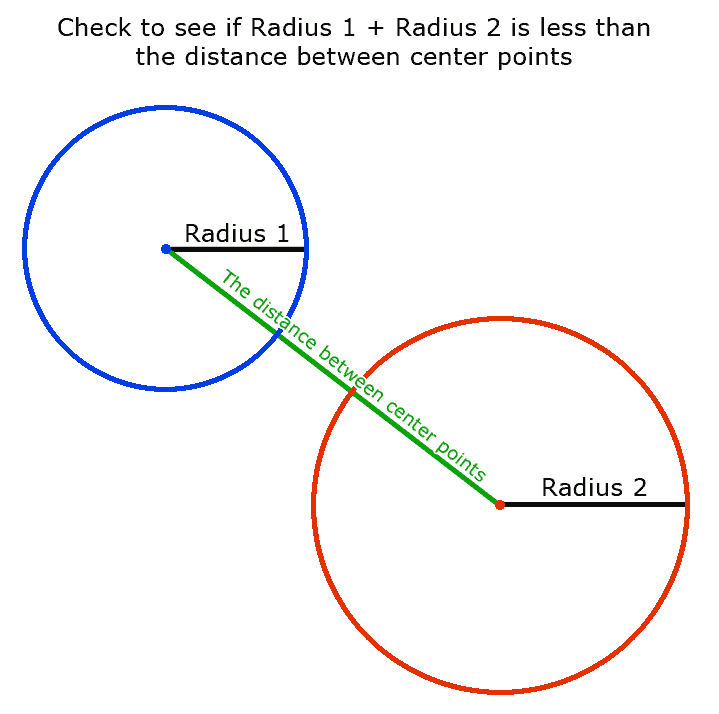
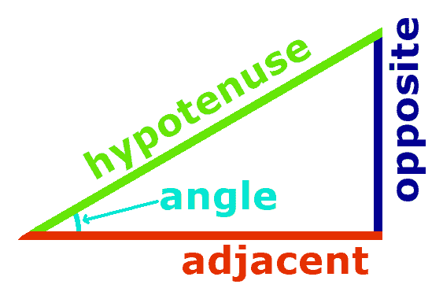
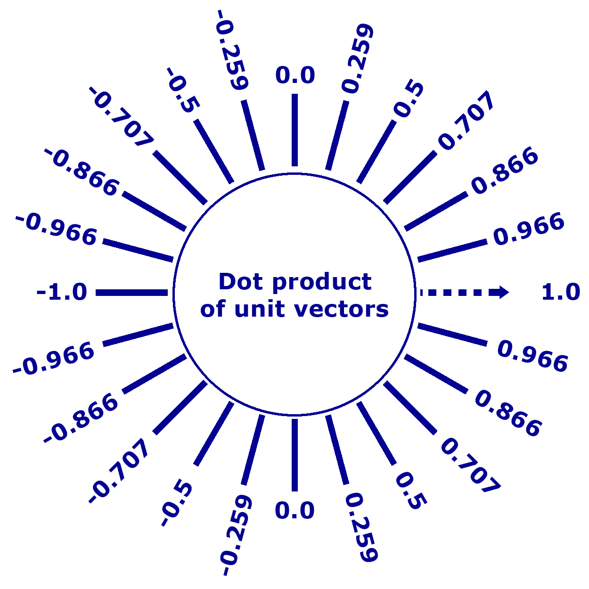
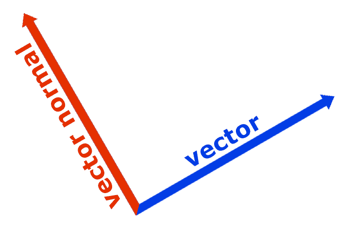
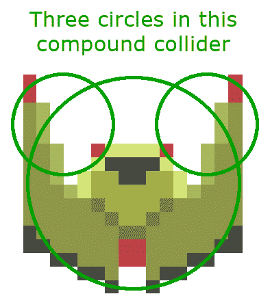
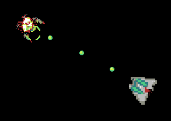

# 冲突检出

现在，我们的宇宙飞船可以飞来飞去，互相射击，但是什么都没有发生。

**碰撞检测**在绝大多数电子游戏中用于判断游戏物体是否相交。有很多方法可以检测不同游戏对象之间的冲突。各种方法可以在不同的情况下更好地工作。在计算时间和碰撞检测的准确性之间也有权衡。

You will need to include several images in your build to make this project work. Make sure you include the `/Chapter07/sprites/` folder from the project's GitHub. If you haven't yet downloaded the GitHub project, you can get it online here: [https://github.com/PacktPublishing/Hands-On-Game-Develop](https://github.com/PacktPublishing/Hands-On-Game-Development-with-WebAssembly)[ment-with-WebAssembly](https://github.com/PacktPublishing/Hands-On-Game-Development-with-WebAssembly).

在本章中，我们将讨论以下内容:

*   冲突检出
*   碰撞物体
*   对撞机的类型
*   给我们的游戏对象添加碰撞器

# 2D 碰撞检测的类型

我可以写一整本书，介绍我们可以使用的 2D 碰撞检测的种类，更不用说 3D 碰撞检测的数量了。我已经在[https://www . embed . com/TypeScript-games/basic-collection-detection . html](https://www.embed.com/typescript-games/basic-collision-detection.html)上写了几个关于如何使用不同检测技术的 TypeScript 教程，既有基本的也有复杂的，但是，在本书中，我们将坚持使用一些更基本的碰撞技术的组合。

# 圆形碰撞检测

最基本的一种碰撞检测是**圆**或**距离**碰撞检测。如果我们把我们所有的对撞机都当作有半径和位置的小圆，我们就可以计算出两个位置之间的距离，看看这个距离是否小于我们半径的总和。这种形式的碰撞检测速度很快，但精度有限。如果你看看我们游戏中的抛射体，这个方法效果相当不错。另一方面，我们的宇宙飞船并不整齐地排成一圈。我们可以在任何给定的船上调整我们的圆形对撞机的半径，以给出稍微不同的结果。当圆碰撞检测工作时，它可以非常有效:



<sub>Circle collision hit test</sub>

# 矩形碰撞检测

**矩形**碰撞检测是另一种快速碰撞检测方法。在许多情况下，它可能比圆碰撞检测更快。矩形碰撞器由一个 *x* 和一个 *y* 坐标定义，这是我们矩形左上角的位置，以及宽度和高度。检测矩形碰撞非常简单。我们在两个矩形之间的 *x* 轴上寻找重叠。如果在 *x* 轴上有重叠，那么我们在 *y* 轴上寻找重叠。如果我们在两个轴上都有重叠，就会发生碰撞。这种技术在许多老派电子游戏中非常有效。任天堂娱乐系统上发布的几款经典游戏都使用了这种碰撞检测方法。在我们正在写的游戏中，我们正在旋转我们的精灵，所以使用传统的无导向碰撞检测对我们来说没有用。

# 三角学的短期复习

此时，我们的碰撞检测算法开始变得更加复杂。你可能还记得高中三角学课上的一些概念，但是一些基本的三角学对于很多碰撞检测算法来说非常重要。甚至我们前面讨论的圆碰撞检测都依赖于毕达哥拉斯定理，所以，在现实中，除非你在做简单的非定向矩形碰撞检测，否则至少需要极少量的三角测量。三角学是数学中对三角形的研究。大多数游戏使用所谓的笛卡尔坐标系。如果你不熟悉这个短语，*笛卡尔坐标系*意味着我们有一个带有 *x* 和 *y* 坐标的网格(对于 2D 游戏)。

The word *Cartesian* means Rene Descartes invented it—the "*I think; therefore, I am"* guy who had a lot of great ideas in mathematics and a lot of stupid ideas in philosophy (ghost in the machine…yuck!).

高中三角学课上有几个关键概念我们要记住，都和直角三角形有关。直角三角形是一个 90 度角的三角形。当您使用笛卡尔坐标系时，这是一件很方便的事情，因为您的 *x* 和 *y* 轴恰好形成直角，因此两点之间不共享 *x* 或 *y* 坐标的任何直线都可以被视为直角三角形的斜边(长边)。有几个比率我们也需要记住；它们如下:

*   sine-y/下丘脑
*   *余弦- X /斜边*
*   *切线- Y / X*

你还记得 SOHCAHTOA 吗？(发音为“*袜子-啊-脚趾-啊*”)

这是为了提醒你三角比率的以下版本:

*   *正弦-相反/斜边*
*   *余弦-相邻/斜边*
*   *切线-相反/相邻*

在这个公式中，三角形的*对面的*边是 *y* 轴，三角形的相邻边是 *x* 轴。如果你记得 SOHCAHTOA，你可能会更容易记住这些比率。如果没有，就打开这本书备份或使用谷歌:



<sub>SOHCAHTOA</sub> Some people have been taught the phrase "*Some Old Horse Came A-Hoppin' Through Our Alley."* I'm not sure if that is helpful. I find it more difficult to remember than SOHCAHTOA, but that's a matter of opinion. So, if imagining a horse that hops like a rabbit around some city's back alley is your bag, then, by all means, use that instead.

你可能还记得在这本书的前面，我们用`sin`和`cos`数学库函数来计算我们的船在 *x* 轴和 *y* 轴上移动的速度。这些函数返回给定角度的比值。

我们需要知道的另一个概念是两个**单位向量**之间的**点积**。单位向量是长度为 1 的向量。两个单位向量之间的点积正好是这两个单位向量之间角度的余弦。点积越接近 1，两个向量之间的角度越接近 0 度。如果点积接近 0，则两个向量之间的角度接近 90 度，如果两个角度之间的点积接近-1，则两个向量之间的角度接近 180 度。不同矢量之间的点积在碰撞检测和游戏物理中都非常有用。参考下图:



<sub>The dot product of two normalized vectors</sub>

# 直线碰撞检测

所以，我们需要做的第一件事是谈论直线和线段的区别。我们用两点定义一条线。那条线一直延伸到无穷远。线段在两点处终止，不会无限延续。两条不平行的线总会在某处相交。两条不平行的线段可以相交，也可以不相交。

大多数情况下，在游戏中，我们有兴趣知道两条线段是否相交:


<sub>Line versus line segment</sub>

确定直线是否与线段相交相对容易。你所要做的就是看线段的两个点是否在你的直线的相对两侧。因为一条线是无限的，这意味着你的线段必须与你的线相交。如果想找出两条线段是否相交，可以分两个阶段来做。首先，找出线段 A 是否与无限线段 B 相交，如果相交，则找出线段 B 是否与无限线段 A 相交，如果这两种情况都成立，则线段相交。

那么，下一个问题是，我们如何从数学上知道两点是否在一条线的相对两侧？为此，我们将使用前面讨论的点积和一个叫做**向量法线**的东西。向量法线只是向量的 90 度旋转版本。请参见下图:



A vector and that vector's normal

我们还需要一个矢量，它的原点在同一点，但方向指向线段的点 1。如果这两个向量的点积是正值，这意味着该点与归一化向量在同一条直线上。如果点积是负值，那就意味着点在法向量的直线的另一边。如果线段相交，这意味着一个点有一个正点积，而另一边有一个负点积。因为将两个负数和两个正数相乘会得到正结果，将一个负数和一个正数相乘会得到负结果，所以将两个点积相乘，看看结果值是否为负。如果是，线段与直线相交:


<sub>Determining whether two points are on the opposite side of a line</sub>

# 复合对撞机

一个**复合碰撞器**是当一个游戏物体使用多个碰撞器来判断是否发生了碰撞。我们将在我们的船上使用复合圆碰撞器来提高我们的船碰撞检测的准确性，同时仍然提供使用圆碰撞器的增加的速度。我们将用三个圆圈覆盖玩家的船和敌人的船。我们的射弹是圆形的，所以用圆形射弹是完全自然的。没有理由需要限制复合对撞机只使用一种形状的对撞机。在内部，一个复合对撞机可以混合圆形对撞机和矩形对撞机或者任何你喜欢的类型。

下图显示了由一个圆形和两个矩形对撞机组成的假想复合对撞机:


<sub>A compound collider composed of three basic colliders</sub>

在下一节中，我们将学习如何实现一个基本的圆碰撞检测算法。

# 实现圆碰撞检测

我们将从实现圆形碰撞检测开始，因为这是最快的碰撞检测方法。它也非常适合我们的射弹，这将是我们游戏中最常见的碰撞器。它不会在我们的飞船上做得很好，但是后来，我们可以通过实现一个复合对撞机来改善这种情况，该对撞机将对每艘飞船使用多个圆形对撞机，而不是只有一个。因为我们只有两艘宇宙飞船，这将使我们在碰撞检测中两全其美:圆形碰撞检测的速度，以及我们一些更好的碰撞检测方法的准确性。

让我们从在我们的`game.hpp`文件中添加一个`Collider`类定义开始，并创建一个新的`collider.cpp`文件，我们可以在其中定义我们的`Collider`类使用的函数。以下是我们新的`Collider`类在`game.hpp`文件中的样子:

```cpp
class Collider {
    public:
        double m_X;
        double m_Y;
        double m_Radius;

        Collider(double radius);

        bool HitTest( Collider *collider );
};
```

下面是我们放入`collider.cpp`文件的代码:

```cpp
#include "game.hpp"
Collider::Collider(double radius) {
    m_Radius = radius;
}

bool Collider::HitTest( Collider *collider ) {
    double dist_x = m_X - collider->m_X;
    double dist_y = m_Y - collider->m_Y;
    double radius = m_Radius + collider->m_Radius;

    if( dist_x * dist_x + dist_y * dist_y <= radius * radius ) {
        return true;
    }
    return false;
}
```

`Collider`类是一个相当简单的圆碰撞器。正如我们之前讨论的，圆形对撞机有一个 *x* 和一个 *y* 坐标和一个半径。`HitTest`功能做了一个非常简单的距离测试，看看两个圆是否足够近，可以相互接触。我们通过平方 *x* 距离和平方 *y* 两个对撞机之间的距离来实现，这就给出了两点之间的距离平方。我们可以用平方根来确定实际距离，但是平方根是一个执行起来相对较慢的函数，对半径之和求平方来进行比较要快得多。

我们还需要简单谈谈类继承。如果你回顾我们之前的代码，我们有一个`PlayerShip`类和一个`EnemyShip`类。这些类共享它们的大部分属性。它们都有 *x* 和 *y* 坐标， *x* 和 *y* 速度，以及许多其他相同的属性。许多函数使用相同的代码复制和粘贴。让我们返回并创建一个`Ship`类，该类具有我们的`PlayerShip`和`EnemyShip`类所共有的所有特性，而不是将这段代码定义两次。然后，我们可以重构我们的`EnemyShip`和`PlayerShip`类来继承我们的`Ship`类。这是我们添加到`game.hpp`中的新的`Ship`类定义:

```cpp
class Ship: public Collider {
    public:
        Uint32 m_LastLaunchTime;
        const int c_Width = 16;
        const int c_Height = 16;
        SDL_Texture *m_SpriteTexture;
        Ship();
        float m_Rotation;
        float m_DX;
        float m_DY;
        float m_VX;
        float m_VY;

        void RotateLeft();
        void RotateRight();
        void Accelerate();
        void Decelerate();
        void CapVelocity();

        virtual void Move() = 0;
        void Render();
};
```

第一行`Ship class: public Collider`，告诉我们`Ship`将继承`Collider`类的所有公共和受保护成员。我们这样做是因为我们希望能够执行命中测试。`Collider`类现在还定义了`m_X`和`m_Y`属性变量，用于跟踪我们对象的 *x* 和 *y* 坐标。我们已经将`EnemyShip`和`PlayerShip`课程中常见的内容移到了`Ship`课程中。你会注意到我们有一个虚拟功能，`virtual void Move() = 0;`。这一行告诉我们，我们将在所有继承自`Ship`的类中有一个`Move`函数，但是我们需要在这些类中定义`Move`，而不是直接在`Ship`类中定义。这使得`Ship`成为一个**抽象类**，这意味着我们不能创建一个`Ship`的实例，相反，它是一个其他类将继承的类。

Class inheritance, abstract classes, and virtual functions are all a part of a style of programming known as **Object-Oriented Programming** (**OOP**). C++ was created in 1979 by Bjarne Stroustrup to add OOP to the C programming language. If you're not familiar with OOP, there are hundreds of books that go into great detail on this topic. I will only be able to cover it in a cursory manner in this book.

接下来，我们将修改`game.hpp`文件中的`PlayerShip`和`EnemyShip`类，以移除我们已经移动到父`Ship`类中的所有方法和属性。我们还将修改这些类，使它们继承自`Ship`。以下是新版本的类定义:

```cpp
class PlayerShip: public Ship {
    public:
        const char* c_SpriteFile = "sprites/Franchise.png";
        const Uint32 c_MinLaunchTime = 300;
        PlayerShip();
        void Move();
};

class EnemyShip: public Ship {
    public:
        const char* c_SpriteFile = "sprites/BirdOfAnger.png";
        const Uint32 c_MinLaunchTime = 300;
        const int c_AIStateTime = 2000;
        FSM_STUB m_AIState;
        int m_AIStateTTL;

        EnemyShip();
        void AIStub();
        void Move();
};
```

现在，我们需要添加一个`ship.cpp`文件，并定义所有对`EnemyShip`和`PlayerShip`通用的方法。这些方法以前在`PlayerShip`和`EnemyShip`都有，但是现在我们可以把它们都放在一个地方。以下是`ship.cpp`文件的样子:

```cpp
#include "game.hpp"

Ship::Ship() : Collider(8.0) {
    m_Rotation = PI;
    m_DX = 0.0;
    m_DY = 1.0;
    m_VX = 0.0;
    m_VY = 0.0;
    m_LastLaunchTime = current_time;
}

void Ship::RotateLeft() {
    m_Rotation -= delta_time;

    if( m_Rotation < 0.0 ) {
        m_Rotation += TWO_PI;
    }
    m_DX = sin(m_Rotation);
    m_DY = -cos(m_Rotation);
}

void Ship::RotateRight() {
    m_Rotation += delta_time;

    if( m_Rotation >= TWO_PI ) {
        m_Rotation -= TWO_PI;
    }
    m_DX = sin(m_Rotation);
    m_DY = -cos(m_Rotation);
}

void Ship::Accelerate() {
    m_VX += m_DX * delta_time;
    m_VY += m_DY * delta_time;
}

void Ship::Decelerate() {
    m_VX -= (m_DX * delta_time) / 2.0;
    m_VY -= (m_DY * delta_time) / 2.0;
}
void Ship::CapVelocity() {
    double vel = sqrt( m_VX * m_VX + m_VY * m_VY );

    if( vel > MAX_VELOCITY ) {
        m_VX /= vel;
        m_VY /= vel;

        m_VX *= MAX_VELOCITY;
        m_VY *= MAX_VELOCITY;
    }
}
void Ship::Render() {
    dest.x = (int)m_X;
    dest.y = (int)m_Y;
    dest.w = c_Width;
    dest.h = c_Height;

    double degrees = (m_Rotation / PI) * 180.0;

    int return_code = SDL_RenderCopyEx( renderer, m_SpriteTexture,
                                        NULL, &dest,
                                        degrees, NULL, SDL_FLIP_NONE );

    if( return_code != 0 ) {
        printf("failed to render image: %s\n", IMG_GetError() );
    }
}
```

这些类在`player_ship.cpp`和`enemy_ship.cpp`文件中的版本之间唯一真正的区别是，我们现在在函数定义前面有`Ship::`，而不是在每个函数定义前面有`PlayerShip::`或`EnemyShip::`。

接下来，我们需要修改`player_ship.cpp`和`enemy_ship.cpp`，删除我们现在在`ship.cpp`文件中定义的所有函数。让我们来看看`enemy_ship.cpp`文件分成两部分是什么样子的。第一部分是我们的`game.hpp`文件的`#include`和`EnemyShip`构造函数:

```cpp
#include "game.hpp"

EnemyShip::EnemyShip() {
    m_X = 60.0;
    m_Y = 50.0;
    m_Rotation = PI;
    m_DX = 0.0;
    m_DY = 1.0;
    m_VX = 0.0;
    m_VY = 0.0;
    m_LastLaunchTime = current_time;

    SDL_Surface *temp_surface = IMG_Load( c_SpriteFile );

    if( !temp_surface ) {
        printf("failed to load image: %s\n", IMG_GetError() );
        return;
    }
    else {
        printf("success creating enemy ship surface\n");
    }
    m_SpriteTexture = SDL_CreateTextureFromSurface( renderer, 
    temp_surface );

    if( !m_SpriteTexture ) {
        printf("failed to create texture: %s\n", IMG_GetError() );
        return;
    }
    else {
        printf("success creating enemy ship texture\n");
    }

    SDL_FreeSurface( temp_surface );
}

```

在我们的`enemy_ship.cpp`文件的第二部分，我们有`Move`和`AIStub`功能:

```cpp
void EnemyShip::Move() {
    AIStub();

    if( m_AIState == TURN_LEFT ) {
        RotateLeft();
    }

    if( m_AIState == TURN_RIGHT ) {
        RotateRight();
    }

    if( m_AIState == ACCELERATE ) {
        Accelerate();
    }

    if( m_AIState == DECELERATE ) {
        Decelerate();
    }

    CapVelocity();
    m_X += m_VX;

    if( m_X > 320 ) {
        m_X = -16;
    }
    else if( m_X < -16 ) {
        m_X = 320;
    }

    m_Y += m_VY;

    if( m_Y > 200 ) {
        m_Y = -16;
    }
    else if( m_Y < -16 ) {
        m_Y = 200;
    }

    if( m_AIState == SHOOT ) {
        Projectile* projectile;

        if( current_time - m_LastLaunchTime >= c_MinLaunchTime ) {
            m_LastLaunchTime = current_time;
            projectile = projectile_pool->GetFreeProjectile();

            if( projectile != NULL ) {
                projectile->Launch( m_X, m_Y, m_DX, m_DY );
            }
        }
    }
}

void EnemyShip::AIStub() {
    m_AIStateTTL -= diff_time;

    if( m_AIStateTTL <= 0 ) {
        // for now get a random AI state.
        m_AIState = (FSM_STUB)(rand() % 5);
        m_AIStateTTL = c_AIStateTime;
    }
}
```

现在我们已经看到了`enemy_ship.cpp`文件中的内容，让我们来看看新的`player_ship.cpp`文件是什么样子的:

```cpp
#include "game.hpp"
PlayerShip::PlayerShip() {
    m_X = 160.0;
    m_Y = 100.0;
    SDL_Surface *temp_surface = IMG_Load( c_SpriteFile );

    if( !temp_surface ) {
        printf("failed to load image: %s\n", IMG_GetError() );
        return;
    }

    m_SpriteTexture = SDL_CreateTextureFromSurface( renderer, 
    temp_surface );

    if( !m_SpriteTexture ) {
        printf("failed to create texture: %s\n", IMG_GetError() );
        return;
    }

    SDL_FreeSurface( temp_surface );
}

void PlayerShip::Move() {
    current_time = SDL_GetTicks();
    diff_time = current_time - last_time;
    delta_time = (double)diff_time / 1000.0;
    last_time = current_time;

    if( left_key_down ) {
        RotateLeft();
    }

    if( right_key_down ) {
        RotateRight();
    }

    if( up_key_down ) {
        Accelerate();
    }

    if( down_key_down ) {
        Decelerate();
    }

    CapVelocity();
    m_X += m_VX;

    if( m_X > 320 ) {
        m_X = -16;
    }
    else if( m_X < -16 ) {
        m_X = 320;
    }

    m_Y += m_VY;

    if( m_Y > 200 ) {
        m_Y = -16;
    }
    else if( m_Y < -16 ) {
        m_Y = 200;
    }

    if( space_key_down ) {
        Projectile* projectile;

        if( current_time - m_LastLaunchTime >= c_MinLaunchTime ) {
            m_LastLaunchTime = current_time;
            projectile = projectile_pool->GetFreeProjectile();
            if( projectile != NULL ) {
                projectile->Launch( m_X, m_Y, m_DX, m_DY );
            }
        }
    }
}
```

接下来，让我们修改`ProjectilePool`类中的`Move`函数，这样每次它移动`Projectile`时，它也会测试它是否击中了我们的一艘船:

```cpp
void ProjectilePool::MoveProjectiles() {
    Projectile* projectile;
    std::vector<Projectile*>::iterator it;
    for( it = m_ProjectileList.begin(); it != m_ProjectileList.end(); 
        it++ ) {
        projectile = *it;
        if( projectile->m_Active ) {
            projectile->Move();
            if( projectile->HitTest( player ) ) {
                printf("hit player\n");
            }
            if( projectile->HitTest( enemy ) ) {
                printf("hit enemy\n");
            }
        }
    }
}
```

目前，我们只打算在玩家或敌人与投射物相撞时打印到控制台上。这将告诉我们碰撞检测是否正常工作。在后面的部分中，我们将添加动画来摧毁我们的船只，当它们与抛射体碰撞时。

我们需要对`Projectile`类的`Launch`功能做最后一个更改。当我们从我们的船上发射一枚炮弹时，我们给炮弹一个 x 和一个 y 位置以及一个 *x* 和 *y* 速度，这是基于船面对的方向。我们需要朝那个方向移动射弹的起点。也就是通过将射弹移出船只的碰撞检测圈来防止射弹击中发射它的船只:

```cpp
void Projectile::Launch(double x, double y, double dx, double dy) {
    m_X = x + dx * 9;
    m_Y = y + dy * 9;
    m_VX = velocity * dx;
    m_VY = velocity * dy;
    m_TTL = alive_time;
    m_Active = true;
}
```

在下一节中，我们将检测我们的船何时与抛射体相撞，并运行爆炸动画。

# 在碰撞中摧毁宇宙飞船

现在我们正在探测射弹和宇宙飞船之间的碰撞，做一些比在控制台上打印一行更有趣的事情会很好。当我们的射弹和我们的飞船撞到什么东西时，有一个小小的爆炸动画会很好。当这些对象被销毁时，我们可以添加一个与它们相关的动画。

我将介绍**精灵表**的概念，而不是像我们在前一章所做的那样，为动画的每一帧加载多个精灵。我们将为每艘宇宙飞船加载一个精灵表，而不是为每艘宇宙飞船加载一个单一的射弹框架和一个单一的飞船框架，这个精灵表不仅包括每艘飞船的未损坏版本，还包括一个销毁序列，当这些物体中的任何一个被销毁时，我们将制作这个序列的动画。

在这个例子中有三个不同的精灵表只是为了方便。当你决定如何包装你的雪碧表生产，有几个考虑因素，你必须考虑。你很可能会想打破你的雪碧表根据什么时候你会需要它们。你可能有一系列你需要的精灵，这些精灵在游戏的所有级别都是通用的。你可以根据等级选择分解精灵。您还需要考虑到，出于性能原因，WebGL 需要 2 次方大小的精灵文件。这可能会影响你的决定，什么样的精灵包装到什么样的精灵表。你也可以考虑购买一个工具，比如纹理打包器，比手工打包更快。

我们已经创建了三个精灵表来替换我们正在使用的三个精灵。这些`Sprites`分别是`FranchiseExp.png`代替`Franchise.png`、`BirdOfAngerExp.png`代替`BirdOfAnger.png`、`ProjectileExp.png`代替`Projectile.png`。我们需要对`Projectile`类、`Ship`类、`EnemyShip`类、`PlayerShip`类、`ProjectilePool`类以及`game_loop`功能进行一些调整。

我们将从修改游戏循环开始，以跟踪游戏的计时数据。我们必须从`player_ship.cpp`文件内的`PlayerShip::Move`函数中删除一些代码。这段代码存在于[第 4 章](04.html)、*精灵动画与 SDL* 的网络组装中，我们讨论了通过动画`PlayerShip`来制作精灵动画的基础知识。我们必须从`PlayerShip::Move`的前几行中删除以下代码:

```cpp
current_time = SDL_GetTicks();
diff_time = current_time - last_time;
delta_time = (double)diff_time / 1000.0;
last_time = current_time;
```

这段代码获取当前时间，并计算我们用于速度调整和动画计时的所有时间相关信息。我们可能应该在几章前将这段代码移到游戏循环中，但迟做总比不做好。以下是`main.cpp`中新增`game_loop`功能的代码:

```cpp
void game_loop() {
    current_time = SDL_GetTicks();
    diff_time = current_time - last_time;
    delta_time = (double)diff_time / 1000.0;
    last_time = current_time;
    input();
    move();
    render();
}
```

严格来说，我们没有必要进行这种更改，但是在游戏循环中使用游戏计时代码更有意义。现在我们已经改变了我们的游戏循环，我们将修改`Projectile`类。以下是我们必须在`game.hpp`文件中对类定义进行的更改:

```cpp
class Projectile: public Collider {
    public:
        const char* c_SpriteFile = "sprites/ProjectileExp.png";
        const int c_Width = 16;
        const int c_Height = 16;
        const double velocity = 6.0;
        const double alive_time = 2000;
        SDL_Texture *m_SpriteTexture;
        SDL_Rect src = {.x = 0, .y = 0, .w = 16, .h = 16 };
        Uint32 m_CurrentFrame = 0;
        int m_NextFrameTime;
        bool m_Active;

        float m_TTL;
        float m_VX;
        float m_VY;

        Projectile();
        void Move();
        void Render();
        void Launch(float x, float y, float dx, float dy);
};
```

我们需要修改`c_SpriteFile`变量指向新的精灵表 PNG 文件，而不是单个精灵文件。我们需要增加它的宽度和高度。为了给爆炸腾出空间，我们将把精灵表中的所有帧都做成 16 x 16，而不是 8 x 8。我们还需要一个源矩形。当每个精灵都使用了一个完整的文件时，我们可以将`null`传递给`SDL_RenderCopy`，该函数将呈现精灵文件的全部内容。现在我们只想渲染一帧，所以我们需要一个矩形，从 0，0 开始，渲染宽度和高度为 16。我们创建的精灵表是**水平条状精灵表**，意思是每一帧都按顺序排列，水平放置。要渲染动画的不同帧，我们只需要修改源矩形内的`.x`值。我们添加的最后一个属性是公共部分，是`m_CurrentFrame`属性。它跟踪我们当前正在播放的动画中的哪一帧。当我们不渲染爆炸动画时，我们将保持当前帧为 0。

接下来，我们需要修改`Projectile`类上的几个函数。这些功能是`projectile.cpp`文件中的`Projectile::Move`功能和`Projectile::Render`功能。以下是新版本的`Projectile::Move`功能:

```cpp
void Projectile::Move() {
    if( m_CurrentFrame > 0 ) {
        m_NextFrameTime -= diff_time;
        if( m_NextFrameTime <= 0 ) {
            ++ m_CurrentFrame;
            m_NextFrameTime = ms_per_frame;
            if( m_CurrentFrame >= 4 ) {
                m_Active = false;
                m_CurrentFrame = 0;
                return;
            }
        }
        return;
    }
    m_X += m_VX;
    m_Y += m_VY;
    m_TTL -= diff_time;
    if( m_TTL < 0 ) {
        m_Active = false;
        m_TTL = 0;
    }
}
```

`Move`功能的顶部是全新的。如果当前帧不是`0`，我们将运行动画直到它结束，然后停用我们的射弹，将其发送回射弹池。我们通过减去应用程序上次运行游戏循环以来的时间来实现这一点。这是存储在`diff_time`全局变量中的值。`m_NextFrameTime`属性变量存储我们切换到系列中的下一帧之前的毫秒数。一旦值低于 0，我们就增加当前帧，并将`m_NextFrameTime`重置为动画每一个新帧之间的毫秒数。现在我们已经增加了当前动画帧，我们可以检查它是否大于或等于该动画中最后一帧的帧数(在本例中为 4)。如果是这样的话，我们需要停止投射并将当前帧重置为 0。

现在，我们已经对`Move()`功能进行了所需的更改，下面是我们必须对`Projectile::Render()`功能进行的更改:

```cpp
void Projectile::Render() {
    dest.x = m_X + 8;
    dest.y = m_Y + 8;
    dest.w = c_Width;
    dest.h = c_Height;
    src.x = 16 * m_CurrentFrame;
    int return_val = SDL_RenderCopy( renderer, m_SpriteTexture,
                                    &src, &dest );
    if( return_val != 0 ) {
        printf("SDL_Init failed: %s\n", SDL_GetError());
    }
}
```

`Render`功能的第一个变化是将`src`矩形添加到`SDL_RenderCopy`调用中，并将其 *x* 值设置在该调用的正上方。我们的精灵表中的每一帧都是 16 像素宽，因此将 *x* 值设置为`16 * m_CurrentFrame`将从精灵表中选择不同的 16 x 16 精灵。该矩形的宽度和高度将始终为 16，并且 *y* 值将始终为 0，因为我们将子画面作为水平条放置在该子画面中。

现在我们将对`game.hpp`文件中的`Ship`类定义进行一些修改:

```cpp
class Ship: public Collider {
    public:
        Uint32 m_LastLaunchTime;
        const int c_Width = 32;
        const int c_Height = 32;

        SDL_Texture *m_SpriteTexture;
        SDL_Rect src = {.x = 0, .y = 0, .w = 32, .h = 32 };
        bool m_Alive = true;
        Uint32 m_CurrentFrame = 0;
        int m_NextFrameTime;

        float m_Rotation;
        float m_DX;
        float m_DY;
        float m_VX;
        float m_VY;

        void RotateLeft();
        void RotateRight();
        void Accelerate();
        void Decelerate();
        void CapVelocity();

        virtual void Move() = 0;
        Ship();
        void Render();
};
```

我们修改了宽度和高度常数，以反映在我们的精灵表中出现的 32 x 32 像素的新精灵大小。我们还必须给`Projectile`类添加一个源矩形。在我们的公共属性部分，我们添加了一些变量来跟踪船只的生存或死亡状态，`(m_Alive)`；游戏正在渲染的当前帧，`(m_CurrentFrame)`；以及直到我们渲染下一帧的时间(毫秒)，`(m_NextFrameTime)`。接下来，我们将对`ship.cpp`文件进行必要的修改。我们需要修改`Ship::Render`功能:

```cpp
void Ship::Render() {
    if( m_Alive == false ) {
        return;
    }
    dest.x = (int)m_X;
    dest.y = (int)m_Y;
    dest.w = c_Width;
    dest.h = c_Height;

    src.x = 32 * m_CurrentFrame;
    float degrees = (m_Rotation / PI) * 180.0;
    int return_code = SDL_RenderCopyEx( renderer, m_SpriteTexture,
                                    &src, &dest,
                                    degrees, NULL, SDL_FLIP_NONE );
    if( return_code != 0 ) {
        printf("failed to render image: %s\n", IMG_GetError() );
    }
}
```

在函数的顶部，我们添加了代码来检查船当前是否还活着。如果不是，我们不想渲染船，所以我们返回。稍后，我们将源矩形 *x* 值设置为当前帧的 32 倍，线条为:`src.x = 32 * m_CurrentFrame;`。这改变了我们的渲染，根据我们想要渲染的帧，从我们的精灵表中渲染一个不同的 32 x 32 像素块。最后，我们必须将那个`src`矩形传递到对`SDL_RenderCopyEx`的调用中。

现在我们已经修改了`Ship`类，我们将更改`EnemyShip`类定义和`PlayerShip`类定义，以使用我们的精灵表 PNG 文件，而不是旧的单一精灵文件。以下是对`game.hpp`文件中这两个类定义的修改:

```cpp
class PlayerShip: public Ship {
    public:
        const char* c_SpriteFile = "sprites/FranchiseExp.png";
        const Uint32 c_MinLaunchTime = 300;
        PlayerShip();
        void Move();
};

class EnemyShip: public Ship {
    public:
        const char* c_SpriteFile = "sprites/BirdOfAngerExp.png";
        const Uint32 c_MinLaunchTime = 300;
        const int c_AIStateTime = 2000;

        FSM_STUB m_AIState;
        int m_AIStateTTL;

        EnemyShip();
        void AIStub();
        void Move();
};
```

对这些类定义所做的唯一更改是每个类中`c_SpriteFile`常量的值。`PlayerShip`类中的`c_SpriteFile`常量由`"sprites/Franchise.png"`修改为`"sprites/FranchiseExp.png"`，`EnemyShip`中的`c_SpriteFile`常量由`"sprites/BirdOfAnger.png"`修改为`"sprites/BirdOfAngerExp.png"`。现在我们已经做了那个改变，这些类将使用精灵表`.png`文件，而不是原始的精灵文件。

现在我们已经修改了这些类的定义，我们必须为它们中的每一个改变`Move`函数。首先，我们将修改`enemy_ship.cpp`文件中的`EnemyShip::Move`功能:

```cpp
void EnemyShip::Move() {
    if( m_Alive == false ) {
        return;
    }
    AIStub();

    if( m_AIState == TURN_LEFT ) {
        RotateLeft();
    }
    if( m_AIState == TURN_RIGHT ) {
        RotateRight();
    }
    if( m_AIState == ACCELERATE ) {
        Accelerate();
    }
    if( m_AIState == DECELERATE ) {
        Decelerate();
    }

    if( m_CurrentFrame > 0 ) {
        m_NextFrameTime -= diff_time;

        if( m_NextFrameTime <= 0 ) {
            m_NextFrameTime = ms_per_frame;
            if( ++ m_CurrentFrame >= 8 ) {
                m_Alive = false;
                return;
            }
        }
    }
    CapVelocity();

    m_X += m_VX;

    if( m_X > 320 ) {
        m_X = -16;
    }
    else if( m_X < -16 ) {
        m_X = 320;
    }

    m_Y += m_VY;

    if( m_Y > 200 ) {
        m_Y = -16;
    }
    else if( m_Y < -16 ) {
        m_Y = 200;
    }

    if( m_AIState == SHOOT ) {
        Projectile* projectile;
        if( current_time - m_LastLaunchTime >= c_MinLaunchTime ) {
            m_LastLaunchTime = current_time;
            projectile = projectile_pool->GetFreeProjectile();

            if( projectile != NULL ) {
                projectile->Launch( m_X, m_Y, m_DX, m_DY );
            }
        }
    }
}
```

有两个地方必须更改代码。首先，如果敌方飞船不存在，我们不想做任何`Move`功能的工作，所以我们在该功能的开始添加了这个检查，以便在飞船不存在的情况下返回:

```cpp
if( m_Alive == false ) {
    return;
}
```

接下来，我们需要添加代码来检查是否需要运行死亡动画。如果当前帧大于 0，我们就这样做。本节中的代码类似于我们为弹丸运行死亡动画所做的。我们从下一帧时间`(m_NextFrameTime)`中减去帧之间的时间`(diff_time)`，以确定是否需要增加帧。当该值下降到 0 以下时，通过增加`m_CurrentFrame`帧准备改变，并且我们通过将`m_NextFrameTime`倒计时定时器设置为我们想要的每帧之间的毫秒数`(ms_per_frame)`来重置它。如果我们的当前帧击中了我们的帧精灵表的末尾，`(++ m_CurrentFrame >= 8)`，那么我们将敌人的船设置为不再活着，`(m_Alive = false)`。如下所示:

```cpp
if( m_CurrentFrame > 0 ) {
    m_NextFrameTime -= diff_time;
    if( m_NextFrameTime <= 0 ) {
        m_NextFrameTime = ms_per_frame;
        if( ++ m_CurrentFrame >= 8 ) {
            m_Alive = false;
            return;
        }
    }
}
```

现在，我们将对`player_ship.cpp`文件中的`PlayerShip::Move`功能进行相同的更改:

```cpp
void PlayerShip::Move() {
    if( m_Alive == false ) {
        return;
    }
    if( left_key_down ) {
        RotateLeft();
    }
    if( right_key_down ) {
        RotateRight();
    }
    if( up_key_down ) {
        Accelerate();
    }
    if( down_key_down ) {
        Decelerate();
    }
    if( m_CurrentFrame > 0 ) {
        m_NextFrameTime -= diff_time;
        if( m_NextFrameTime <= 0 ) {
            m_NextFrameTime = ms_per_frame;
            if( ++ m_CurrentFrame >= 8 ) {
                m_Alive = false;
                return;
            }
        }
    }
    CapVelocity();
    m_X += m_VX;

    if( m_X > 320 ) {
        m_X = -16;
    }
    else if( m_X < -16 ) {
        m_X = 320;
    }

    m_Y += m_VY;

    if( m_Y > 200 ) {
        m_Y = -16;
    }
    else if( m_Y < -16 ) {
        m_Y = 200;
    }

    if( space_key_down ) {
        Projectile* projectile;
        if( current_time - m_LastLaunchTime >= c_MinLaunchTime ) {
            m_LastLaunchTime = current_time;
            projectile = projectile_pool->GetFreeProjectile();
            if( projectile != NULL ) {
                projectile->Launch( m_X, m_Y, m_DX, m_DY );
            }
        }
    }
}
```

就像在我们的`EnemyShip::Move`函数中一样，我们用下面的代码添加一个检查来查看玩家是否还活着:

```cpp
if( m_Alive == false ) {
    return;
}
```

如果当前帧大于 0，我们还会添加一些代码来运行死亡动画:

```cpp
if( m_CurrentFrame > 0 ) {
    m_NextFrameTime -= diff_time;
    if( m_NextFrameTime <= 0 ) {
        m_NextFrameTime = ms_per_frame;
        if( ++ m_CurrentFrame >= 8 ) {
            m_Alive = false;
            return;
        }
    }
}
```

我们需要做的最后一件事是修改我们之前添加到`ProjectilePool::MoveProjectiles`函数中的碰撞检测代码，以便在船只和抛射体碰撞时运行它们的死亡动画。这是新版本的`projectile_pool.cpp`文件里面的`ProjectilePool::MoveProjectiles`:

```cpp
void ProjectilePool::MoveProjectiles() {
    Projectile* projectile;
    std::vector<Projectile*>::iterator it;
    for( it = m_ProjectileList.begin(); it != m_ProjectileList.end(); it++ ) {
        projectile = *it;
        if( projectile->m_Active ) {
            projectile->Move();
            if( projectile->m_CurrentFrame == 0 &&
                player->m_CurrentFrame == 0 &&
                projectile->HitTest( player ) ) {

                player->m_CurrentFrame = 1;
                player->m_NextFrameTime = ms_per_frame;
                projectile->m_CurrentFrame = 1;
                projectile->m_NextFrameTime = ms_per_frame;
            }
            if( projectile->m_CurrentFrame == 0 &&
                enemy->m_CurrentFrame == 0 &&
                projectile->HitTest( enemy ) ) {

                enemy->m_CurrentFrame = 1;
                enemy->m_NextFrameTime = ms_per_frame;
                projectile->m_CurrentFrame = 1;
                projectile->m_NextFrameTime = ms_per_frame;
            }
        }
    }
}
```

在这段代码中，每次我们移动一枚炮弹，我们都会对该炮弹和玩家进行一次命中测试，以及该炮弹和敌人之间的命中测试。如果飞船或抛射体正在运行其死亡动画(`m_CurrentFrame == 0`为假)，那么我们不需要运行命中测试，因为飞船或抛射体已经被摧毁。如果命中测试返回真，那么我们需要将射弹和飞船的当前帧都设置为 1 来开始破坏动画。我们还需要将下一帧时间设置为帧改变前的毫秒数。

现在我们已经添加了所有这些新代码，飞船和敌方飞船将运行一个爆炸动画，在被击中时摧毁飞船。射弹也会爆炸，而不是消失。圆形对撞机速度很快，但不太精确。在*实现复合圆对撞机*部分，我们将学习在一艘船上使用多个圆对撞机需要做的修改。这将使我们的碰撞看起来比简单的圆更精确。

# 内存中的指针

WebAssembly 的内存模型搭载在 asm.js 内存模型上，该模型使用一个大型类型化的`ArrayBuffer`来保存模块要操作的所有原始字节。对`WebAssembly.Memory`的 JavaScript 调用将模块的内存缓冲区设置为 64 KB **页面**。

A *page* is a block of linear data that is the smallest unit of data that can be allocated by an operating system, or, in the case of WebAssembly, a virtual machine. For more information on memory pages, see the Wikipedia Page: [https://en.wikipedia.org/wiki/Page_%28computer_memory%29](https://en.wikipedia.org/wiki/Page_%28computer_memory%29).

网络组件模块只能从这个`ArrayBuffer`中访问数据。这可以防止来自 WebAssembly 的恶意攻击，这些攻击会创建指向浏览器沙箱之外的内存地址的指针。由于这种设计，WebAssembly 的内存模型和 JavaScript 一样安全。

在下一节中，我们将在我们的`collider`对象中使用 C++ 指针。如果你是一个 JavaScript 开发人员，你可能不熟悉**指针**。指针是一个变量，它保存内存位置而不是直接保存值。让我们看一点代码:

```cpp
int VAR1 = 1;
int* POINTER = &VAR1;
```

在这段代码中，我们创建了一个`VAR1`变量，并给了它一个值 1。在第二行，我们使用`int*`创建一个名为`POINTER`的指针。然后，我们使用`&`字符初始化指向`VAR1`地址的指针，在 C++ 中，这个字符被称为运算符的**地址。这个接线员给了我们之前申报的`VAR1`的地址。如果我们想改变`VAR1`，我们可以使用指针而不是直接改变，如下所示:**

```cpp
*POINTER = 2;
 printf("VAR1=%d\n", VAR1); // prints out "VAR1=2"
```

将`*`放在`POINTER`前面，告诉 C++ 在`POINTER`指向的内存地址中设置值；`*`以这种方式使用时称为**解引用运算符**。

If you would like to learn more about pointers in C++ and how they work, the following article goes into a good deal of detail on the subject: [http://www.cplusplus.com/doc/tutorial/pointers/](http://www.cplusplus.com/doc/tutorial/pointers/).

在下一节中，我们将在我们的宇宙飞船上实现用于碰撞检测的复合圆碰撞器。

# 实现复合圆碰撞器

现在，我们的碰撞检测正在工作，并且我们的船只和射弹在碰撞中爆炸，让我们看看如何使我们的碰撞检测更好。我们选择圆碰撞检测有两个原因:碰撞算法快速，简单。然而，我们可以做得更好，只需在每艘船上增加更多的圆圈。这将使我们的碰撞检测时间增加一倍 *n* ，其中 *n* 是我们在每艘船上的平均圈数。这是因为我们所做的唯一碰撞检测是在射弹和船只之间。即便如此，我们也不想过分追求我们为每艘船选择的圈数。

对于玩家船来说，飞船的正面被基本圈很好的覆盖。然而，我们可以通过在玩家飞船的每一侧增加一个圆圈来更好地覆盖飞船的背面:


<sub>我们的玩家飞船复合对撞机</sub>

敌舰则相反。飞船的背面被一个默认的圆圈覆盖得很好，但是前面可以使用一些更好的覆盖，所以，对于敌舰，我们将在前面添加一些额外的圆圈:



<sub>我方敌船复合对撞机</sub>

我们需要做的第一件事是改变`Collider`类，以包含来自我们碰撞器的父级的信息。这是我们的`game.hpp`文件中的新版本的`Collider`类定义:

```cpp
class Collider {
    public:
        float* m_ParentRotation;
        float* m_ParentX;
        float* m_ParentY;
        float m_X;
        float m_Y;
        float m_Radius;

        bool CCHitTest( Collider* collider );
        void SetParentInformation( double* rotation, double* x, double* 
                                   y );
        Collider(double radius);
        bool HitTest( Collider *collider );
};
```

我们已经为`Collider`类的父类的属性添加了三个指针。这些将指向 *x* 和 *y* 坐标，以及对撞机母体的`Rotation`，它将是敌方飞船、玩家飞船或`NULL`。我们将在构造函数中将这些值初始化为`NULL`，如果该值为空，我们将不会修改碰撞器的行为。但是，如果这些值被设置为其他值，我们将调用`CCHitTest`函数来确定是否存在冲突。这个版本的碰撞测试将在进行碰撞测试之前调整碰撞器的位置，使其相对于其父级的位置和旋转。现在我们已经更改了碰撞器的定义，我们将更改`collider.cpp`文件中的功能，以支持新的复合碰撞器。

首先要做的是修改我们的构造函数来初始化指向`NULL`的新指针:

```cpp
Collider::Collider(double radius) {
    m_ParentRotation = NULL;
    m_ParentX = NULL;
    m_ParentY = NULL;
    m_Radius = radius;
}
```

我们有一个新的函数要添加到我们的`collider.cpp`文件中，`CCHitTest`函数，这将是我们的复合对撞机命中测试。这个版本的撞击测试将调整我们对撞机的 *x* 和 *y* 坐标，使其相对于我们母船的位置和旋转:

```cpp
bool Collider::CCHitTest( Collider* collider ) {
    float sine = sin(*m_ParentRotation);
    float cosine = cos(*m_ParentRotation);
    float rx = m_X * cosine - m_Y * sine;
    float ry = m_X * sine + m_Y * cosine;
    float dist_x = (*m_ParentX + rx) - collider->m_X;
    float dist_y = (*m_ParentY + ry) - collider->m_Y;
    float radius = m_Radius + collider->m_Radius;

    if( dist_x * dist_x + dist_y * dist_y <= radius * radius ) {
        return true;
    }
    return false;
}
```

这个函数做的第一件事是获取父对象旋转的正弦和余弦，并使用该旋转来获得变量`rx`和`ry`中 *x* 和 *y* 的旋转版本。然后，在计算两个碰撞器 *x* 和 *y* 位置之间的距离之前，我们通过父母的 *x* 和 *y* 位置来调整旋转后的 *x* 和 *y* 位置。在我们添加了这个新的`CCHitTest`函数之后，如果父值被设置，我们需要修改`HitTest`函数来调用这个版本的命中测试。以下是最新版本的`HitTest`:

```cpp
bool Collider::HitTest( Collider *collider ) {
    if( m_ParentRotation != NULL && m_ParentX != NULL && m_ParentY !=         NULL ) {
        return CCHitTest( collider );
    }

    float dist_x = m_X - collider->m_X;
    float dist_y = m_Y - collider->m_Y;
    float radius = m_Radius + collider->m_Radius;

    if( dist_x * dist_x + dist_y * dist_y <= radius * radius ) {
        return true;
    }
    return false;
}
```

我们创建了一个函数来设置所有这些值，称为`SetParentInformation`。下面是函数定义:

```cpp
void Collider::SetParentInformation( float* rotation, float* x, float* y ) {
    m_ParentRotation = rotation;
    m_ParentX = x;
    m_ParentY = y;
}
```

为了利用这些新型碰撞器，我们需要在`Ship`类中添加一个新的碰撞器向量。以下是`game.hpp`文件中`Ship`的新类定义:

```cpp
class Ship : public Collider {
    public:
        Uint32 m_LastLaunchTime;
        const int c_Width = 32;
        const int c_Height = 32;

        SDL_Texture *m_SpriteTexture;
        SDL_Rect src = {.x = 0, .y = 0, .w = 32, .h = 32 };
        std::vector<Collider*> m_Colliders;
        bool m_Alive = true;
        Uint32 m_CurrentFrame = 0;

        int m_NextFrameTime;
        float m_Rotation;
        float m_DX;
        float m_DY;
        float m_VX;
        float m_VY;

        void RotateLeft();
        void RotateRight();
        void Accelerate();
        void Decelerate();
        void CapVelocity();
        virtual void Move() = 0;
        Ship();
        void Render();
        bool CompoundHitTest( Collider* collider );
};
```

这个版本和之前版本的`Ship`类有两个区别。首先是`m_Colliders`向量属性的添加:

```cpp
 std::vector<Collider*> m_Colliders;
```

第二个变化是在类的底部增加了新的`CompoundHitTest`函数:

```cpp
bool CompoundHitTest( Collider* collider );
```

对于我们类的更改，我们需要在我们的`ship.cpp`文件中添加一个新的函数:

```cpp
bool Ship::CompoundHitTest( Collider* collider ) {
    Collider* col;
    std::vector<Collider*>::iterator it;
    for( it = m_Colliders.begin(); it != m_Colliders.end(); it++ ) {
        col = *it;
        if( col->HitTest(collider) ) {
            return true;
        }
    }
    return false;
}
```

这个`CompoundHitTest`函数是一个非常简单的函数，它循环遍历我们所有的附加碰撞器，并对它们进行命中测试。这条线创建了一个碰撞指针向量。我们现在将修改我们的`EnemyShip`和`PlayerShip`构造器，在这个向量中添加一些碰撞器。首先，我们将向`enemy_ship.cpp`文件中的`EnemyShip`构造函数添加一些新行:

```cpp
EnemyShip::EnemyShip() {
    m_X = 60.0;
    m_Y = 50.0;
    m_Rotation = PI;
    m_DX = 0.0;
    m_DY = 1.0;
    m_VX = 0.0;
    m_VY = 0.0;
    m_AIStateTTL = c_AIStateTime;
    m_Alive = true;
    m_LastLaunchTime = current_time;

    Collider* temp_collider = new Collider(2.0);
    temp_collider->SetParentInformation( &(this->m_Rotation),
                                         &(this->m_X), &(this->m_Y) );
    temp_collider->m_X = -6.0;
    temp_collider->m_Y = -6.0;
    m_Colliders.push_back( temp_collider );
    temp_collider = new Collider(2.0);
    temp_collider->SetParentInformation( &(this->m_Rotation),
                                         &(this->m_X), &(this->m_Y) );
    temp_collider->m_X = 6.0;
    temp_collider->m_Y = -6.0;
    m_Colliders.push_back( temp_collider );

    SDL_Surface *temp_surface = IMG_Load( c_SpriteFile );

    if( !temp_surface ) {
        printf("failed to load image: %s\n", IMG_GetError() );
        return;
    }
    else {
        printf("success creating enemy ship surface\n");
    }
    m_SpriteTexture = SDL_CreateTextureFromSurface( renderer, 
    temp_surface );
    if( !m_SpriteTexture ) {
        printf("failed to create texture: %s\n", IMG_GetError() );
        return;
    }
    else {
        printf("success creating enemy ship texture\n");
    }
    SDL_FreeSurface( temp_surface );
}
```

我们添加的代码创建了新的碰撞器，并将这些碰撞器的父信息设置为指向 *x* 和 *y* 坐标的指针，以及指向该对象内部这些值的地址的半径。我们设置这个碰撞器相对于这个物体位置的`m_X`和`m_Y`值，然后我们将新的碰撞器推入`m_Colliders`矢量属性:

```cpp
Collider* temp_collider = new Collider(2.0);
temp_collider->SetParentInformation( &(this->m_Rotation),
                                     &(this->m_X), &(this->m_Y) );
temp_collider->m_X = -6.0;
temp_collider->m_Y = -6.0;
m_Colliders.push_back( temp_collider );
temp_collider = new Collider(2.0);
temp_collider->SetParentInformation( &(this->m_Rotation),
                                     &(this->m_X), &(this->m_Y) );
temp_collider->m_X = 6.0;
temp_collider->m_Y = -6.0;
m_Colliders.push_back( temp_collider );
```

我们现在将对`player_ship.cpp`文件中的`PlayerShip`构造函数进行类似的操作:

```cpp
PlayerShip::PlayerShip() {
    m_X = 160.0;
    m_Y = 100.0;
    SDL_Surface *temp_surface = IMG_Load( c_SpriteFile );

    Collider* temp_collider = new Collider(3.0);
    temp_collider->SetParentInformation( &(this->m_Rotation),
                                         &(this->m_X), &(this->m_Y) );
    temp_collider->m_X = -6.0;
    temp_collider->m_Y = 6.0;
    m_Colliders.push_back( temp_collider );
    temp_collider = new Collider(3.0);
    temp_collider->SetParentInformation( &(this->m_Rotation),
                                         &(this->m_X), &(this->m_Y) );
    temp_collider->m_X = 6.0;
    temp_collider->m_Y = 6.0;
    m_Colliders.push_back( temp_collider );

    if( !temp_surface ) {
        printf("failed to load image: %s\n", IMG_GetError() );
        return;
    }
    m_SpriteTexture = SDL_CreateTextureFromSurface( renderer, 
    temp_surface );

    if( !m_SpriteTexture ) {
        printf("failed to create texture: %s\n", IMG_GetError() );
        return;
    }
    SDL_FreeSurface( temp_surface );
}
```

现在，我们必须改变我们的射弹池，在我们的船上运行这些新的复合对撞机的碰撞检测。以下是`projectile_pool.cpp`文件中`MoveProjectiles`功能的修改版本:

```cpp
void ProjectilePool::MoveProjectiles() {
    Projectile* projectile;
    std::vector<Projectile*>::iterator it;

    for( it = m_ProjectileList.begin(); it != m_ProjectileList.end(); 
         it++ ) {
        projectile = *it;
        if( projectile->m_Active ) {
            projectile->Move();
            if( projectile->m_CurrentFrame == 0 &&
                player->m_CurrentFrame == 0 &&
                ( projectile->HitTest( player ) ||
                  player->CompoundHitTest( projectile ) ) ) {
                player->m_CurrentFrame = 1;
                player->m_NextFrameTime = ms_per_frame;
                projectile->m_CurrentFrame = 1;
                projectile->m_NextFrameTime = ms_per_frame;
            }
            if( projectile->m_CurrentFrame == 0 &&
                enemy->m_CurrentFrame == 0 &&
                ( projectile->HitTest( enemy ) ||
                  enemy->CompoundHitTest( projectile ) ) ) {
                enemy->m_CurrentFrame = 1;
                enemy->m_NextFrameTime = ms_per_frame;
                projectile->m_CurrentFrame = 1;
                projectile->m_NextFrameTime = ms_per_frame;
            }
        }
    }
}
```

因为我们在`Ship`类中继续继承`Collider`，所以我们仍然会对玩家和敌舰进行常规命中测试。我们在`Ship`类中添加了一个对`CompoundHitTest`的调用，它循环遍历我们的`m_Colliders`向量，并对该向量中的每个碰撞器执行碰撞命中测试。

Our compound collider solution is not generalized, and, for the most part, neither is our collision detection. We are only detecting collisions between our ships and our projectiles. We are not currently performing any collision detection between our ships. To have a generalized approach to collision detection, we would need to implement spacial segmenting. That would prevent the number of collision checks from growing exponentially with each additional collider added to our game.

# 编译 collider.html

我们用来编译`collider.html`文件的命令类似于上一章的编译命令。我们需要在命令行中添加一个新的`collider.cpp`文件，但除此之外，它应该是相同的。下面是你用来编译`collider.html`的命令:

```cpp
em++ main.cpp collider.cpp ship.cpp enemy_ship.cpp player_ship.cpp projectile.cpp projectile_pool.cpp -std=c++ 17 --preload-file sprites -s USE_WEBGL2=1 -s USE_SDL=2 -s USE_SDL_IMAGE=2 -s SDL2_IMAGE_FORMATS=["png"] -o collider.html
```

现在我们已经编译了`collider.html`，我们可以从我们选择的网络服务器上提供它，或者用`emrun`运行它，并将其加载到网络浏览器中。这是它的样子:



<sub>The enemy spaceship explodes when hit by a projectile</sub> Please remember that you must run WebAssembly apps using a web server, or with `emrun`.  If you would like to run your WebAssembly app using `emrun`, you must compile it with the `--emrun` flag.  The web browser requires a web server to stream the WebAssembly module.  If you attempt to open an HTML page that uses WebAssembly in a browser directly from your hard drive, that WebAssembly module will not load.

我没有像之前的游戏截图那样拍摄整个浏览器的截图，因为我想放大玩家船摧毁敌人船的画面。正如你所看到的，我们现在有了对撞机，它可以探测到抛射体何时与宇宙飞船相撞，并可以通过运行爆炸动画在碰撞发生时摧毁宇宙飞船。

# 摘要

圆对撞机是我们现在需要的。它们速度快，效率高，对于这样一个简单的游戏，你也许可以不做任何复杂的事情。我们添加了一个复合碰撞器来演示这个简单的修改如何显著提高碰撞器的精度。我们将需要在本书后面添加更多的碰撞检测方法。未来，我们将在游戏中添加小行星和一颗恒星，我们将创建一个 **AI** ( **人工智能**)代理来导航我们的游戏并攻击我们的玩家。这个代理最终将需要知道它是否与玩家有视线，这样线碰撞检测将变得更加重要。我们的特工还想快速扫描它附近的区域，看看是否有它必须避开的小行星。对于这个特性，我们将使用矩形碰撞。

2D 奥运会的碰撞检测技术有很多种，我们在这一章只触及了表面。我们学习了如何实现一些基本的圆形对撞机和复合对撞机，我们还添加了检测我们游戏中的射弹与玩家和敌方宇宙飞船之间碰撞的代码。这类对撞机速度快，相对容易实现，但也不是没有缺点。

你可能会注意到像我们已经实现的简单碰撞器的一个缺点是，如果两个物体以足够高的相对速度相互通过，它们可能会相互通过而不会碰撞。这是因为我们的物体每一帧都有一个新的计算位置，它们不会从 A 点到 B 点连续移动，如果从 A 点到 B 点移动一帧，物体就有效地在两点之间进行了瞬间移动。如果在这两个点之间有第二个物体，但是我们在 A 点或 B 点都没有和那个物体碰撞，那么物体碰撞就错过了。这在我们的游戏中应该不成问题，因为我们将保持我们的最大物体速度相对较低。然而，在编写游戏时，这是需要记住的。

在下一章中，我们将构建一个工具来帮助我们配置**粒子系统**。