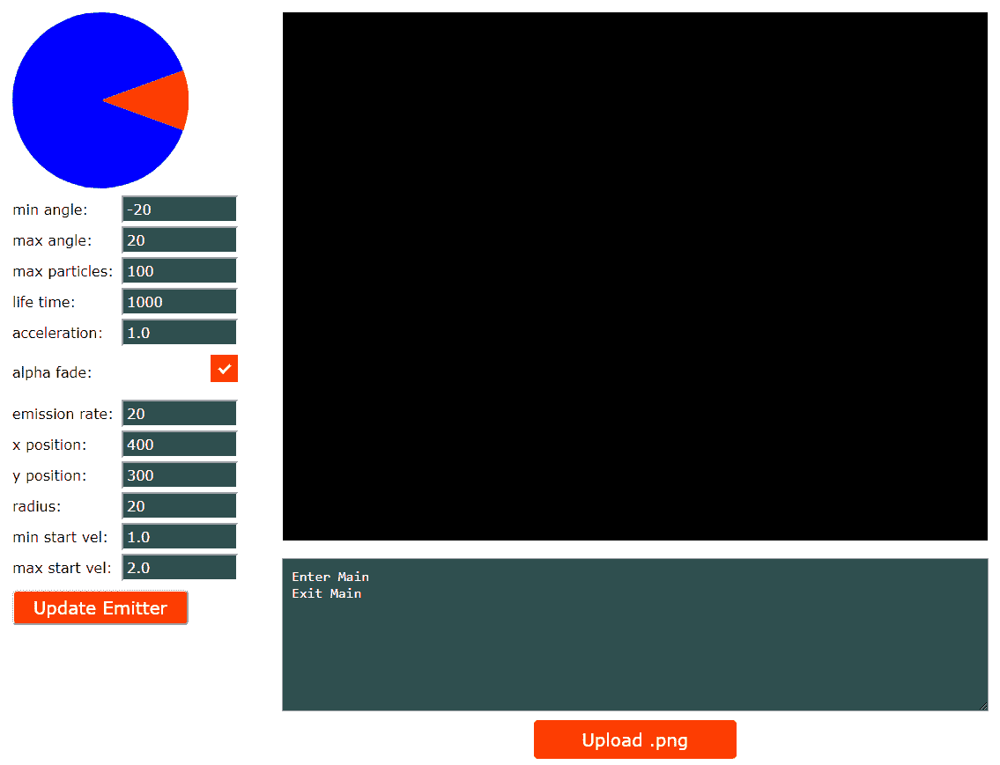

# 基本粒子系统

粒子系统 *m* 是一种图形技术，我们从*发射器*发射大量精灵，并让这些精灵经历一个生命周期，在这个周期中它们以各种方式变化。我们在雪碧的生命周期中构建了一些随机性，以创建各种有趣的效果，如爆炸、火花、雪、灰尘、火灾、发动机排气等。一些粒子效应可以与它们的环境相互作用。在我们的游戏中，我们将使用粒子效果来创建好看的发动机排气和船只爆炸效果。

For this chapter, you will need to include several images in your build to make this project work. Make sure you include the `/Chapter08/sprites/` folder from the project's GitHub. If you haven't yet downloaded the GitHub project, you can get it online here: [https://github.com/PacktPublishing/Hands-On-Game-Develop](https://github.com/PacktPublishing/Hands-On-Game-Development-with-WebAssembly).

这一章和下一章的开头一开始会让人觉得有点跑题。在接下来的两章中，我们会花很多时间在游戏以外的事情上。如果你对粒子系统感兴趣，我保证这是值得的。当你创建一个粒子系统时，你会花很多时间来调整它们，并玩它们来让它们看起来正确。在游戏中直接这样做将会导致大量的编译和测试。我们需要的是一个工具，我们可以在将粒子系统添加到游戏之前对其进行配置和测试。本章和下一章的一半致力于构建这个工具。如果你对学习如何构建这个工具不感兴趣，可以浏览一下本章的文字，从 GitHub 下载并编译这个工具。如果你对学习 JavaScript、HTML 和 WebAssembly 如何在应用中交互感兴趣，本章和第 9 章*改进粒子系统*的前半部分是学习如何编写应用的好教程，而不仅仅是一个使用 WebAssembly 的游戏。

在本章中，我们将涵盖以下主题:

*   SVG 简介
*   又是三角学？
*   添加 JavaScript
*   简单的粒子发射器工具
*   点类
*   粒子类
*   发射器类
*   WebAssembly 接口函数
*   编译和测试粒子发射器

# 添加到虚拟文件系统

这一部分将从*粒子系统*中简短地脱离出来，因为我想花时间创建一个*粒子系统设计工具*，它将要求我们向网络组件虚拟文件系统添加文件。我们将添加一个带有文件类型的输入元素，我们可以用它来将图像加载到虚拟文件系统中。我们将需要检查我们正在加载的文件，以验证它是一个`.png`文件，如果是，我们将使用网络组装和 SDL 在画布上绘制和移动图像。

Emscripten does not create a virtual file system by default. Because we will need to use a virtual file system that will not initially have anything inside of it, we will need to pass the following flag to em++ to force Emscripten to build a virtual filesystem: `-s FORCE_FILESYSTEM=1`.

我们首先要做的是从[第二章](02.html)、 *HTML5 和 WebAssembly* 中复制`canvas_shell.html`，用它创建一个新的 shell 文件，我们称之为`upload_shell.html`。我们需要在 JavaScript 中添加一些代码来处理文件加载，并将该文件插入到 WebAssembly 虚拟文件系统中。我们还需要添加一个`file`类型的 HTML `input`元素，直到`Module`对象加载完毕才会显示。在下面的代码中，我们有了新的 shell 文件:

```cpp
<!doctype html><html lang="en-us">
<head><meta charset="utf-8"><meta http-equiv="Content-Type" content="text/html; charset=utf-8">
    <title>Upload Shell</title>
    <link href="upload.css" rel="stylesheet" type="text/css">
</head>
<body>
    <canvas id="canvas" width="800" height="600" 
     oncontextmenu="event.preventDefault()"></canvas>
    <textarea class="em_textarea" id="output" rows="8"></textarea>
    <script type='text/javascript'>
        var canvas = null;
        var ctx = null;
        function ShowFileInput()         
            {document.getElementById("file_input_label")
            .style.display="block";}
        var Module = {
            preRun: [],
            postRun: [ShowFileInput],
            print: (function() {
                var element = document.getElementById('output');
                if (element) element.value = '';
                return function(text) {
                    if (arguments.length > 1)         
                    text=Array.prototype.slice.call(arguments).join('                     
                    ');
                    console.log(text);
                    if (element) {
                        element.value += text + "\n";
                        element.scrollTop = element.scrollHeight;
                } }; })(),
    printErr: function(text) {
        if (arguments.length > 1) 
        text=Array.prototype.slice.call(arguments).join(' ');
        if (0) { dump(text + '\n'); } 
        else { console.error(text); } },
    canvas: (function() {
        var canvas = document.getElementById('canvas');
        canvas.addEventListener("webglcontextlost", function(e) { 
        alert('WebGL context lost. You will need to reload the page.'); 
        e.preventDefault(); }, false);
        return canvas; })(),
    setStatus: function(text) {
        if (!Module.setStatus.last) Module.setStatus.last = { time: 
            Date.now(), text: '' };
        if (text === Module.setStatus.last.text) return;
        var m = text.match(/([^(]+)\((\d+(\.\d+)?)\/(\d+)\)/);
        var now = Date.now();
        if (m && now - Module.setStatus.last.time < 30) return;
        Module.setStatus.last.time = now;
        Module.setStatus.last.text = text;
        if (m) { text = m[1]; }
        console.log("status: " + text);
    },
    totalDependencies: 0,
    monitorRunDependencies: function(left) {
        this.totalDependencies = Math.max(this.totalDependencies,left);
        Module.setStatus(left ? 'Preparing... (' + 
        (this.totalDependencies-left) + '/' +
         this.totalDependencies + ')' : 'All downloads complete.'); }
};
Module.setStatus('Downloading...');
window.onerror = function() {
    Module.setStatus('Exception thrown, see JavaScript console');
    Module.setStatus = function(text) { if (text) Module.printErr('[post-exception status] ' + text); };
};
function handleFiles(files) {
    var file_count = 0;
    for (var i = 0; i < files.length; i++) {
        if (files[i].type.match(/image.png/)) {
            var file = files[i];
            console.log("file name=" + file.name);
            var file_name = file.name;
            var fr = new FileReader();
            fr.onload = function (file) {
                var data = new Uint8Array(fr.result);
                Module.FS_createDataFile('/', file_name, data, true, 
                true, true);
                Module.ccall('add_image', 'undefined', ["string"], 
                [file_name]);
            };
            fr.readAsArrayBuffer(files[i]);
        }
    }
}
</script>
<input type="file" id="file_input" onchange="handleFiles(this.files)" />
<label for="file_input" id="file_input_label">Upload .png</label>
{{{ SCRIPT }}}
</body></html>
```

在标题中，我们只对标题和样式表进行了更改:

```cpp
<title>Upload Shell</title>
<link href="upload.css" rel="stylesheet" type="text/css">
```

在`body`标签中，我们只留下了`canvas`和`textarea`元素，但是 JavaScript 有很大的变化。我们将对 JavaScript 做的第一件事是添加一个`ShowFileInput`函数来显示`file_input_label`元素，它从我们的 CSS 隐藏开始。您可以在下面的代码片段中看到它:

```cpp
function ShowFileInput() {
    document.getElementById("file_input_label").style.display = "block";
}

var Module = {
    preRun: [],
    postRun: [ShowFileInput],
```

请注意，我们在`postRun`数组中添加了对该函数的调用，以便它在模块加载后运行。这是为了确保在`Module`对象加载之前没有人加载图像文件，并且我们的页面可以处理它。除了在`postRun`阵中增加`ShowFileInput`之外，`Module`的目标没有改变。在我们的`Module`目标代码之后，我们添加了一个`handleFiles`函数，当用户选择一个新文件进行加载时，我们的文件输入元素会调用这个函数。下面是该函数的代码:

```cpp
function handleFiles(files) {
    var file_count = 0;
    for (var i = 0; i < files.length; i++) {
        if (files[i].type.match(/image.png/)) {
            var file = files[i];
            var file_name = file.name;
            var fr = new FileReader();

            fr.onload = function (file) {
                var data = new Uint8Array(fr.result);
                Module.FS_createDataFile('/', file_name, data, true, 
                true, true);
                Module.ccall('add_image', 'undefined', ["string"], 
                [file_name]);
            };
            fr.readAsArrayBuffer(files[i]);
        }
    }
}
```

您会注意到，该函数旨在通过循环传递到`handleFiles`的`files`参数来同时处理多个文件。我们要做的第一件事是检查图像文件类型是否是 PNG。当我们编译网络程序集时，我们需要告诉它 SDL 将处理哪些图像文件类型。PNG 格式应该是您所需要的，但是在这里添加其他类型并不难。

如果不想特别检查 PNG 文件，可以省略匹配字符串的`.png`部分，稍后在编译命令行参数中添加其他文件类型。如果文件是`img/png`类型，我们将文件名放入其变量`file_name`，并创建一个`FileReader`对象。然后我们定义`FileReader`加载文件时运行的函数:

```cpp
fr.onload = function (file) {
    var data = new Uint8Array(fr.result);
    Module.FS_createDataFile('/', file_name, data, true, true, true);
    Module.ccall('add_image', 'undefined', ["string"], [file_name]);
};
```

该函数将数据作为一个 8 位无符号整数数组，然后将其传递给`Module`函数`FS_createDataFile`。该函数将一个字符串作为其参数，该字符串是我们文件的父目录`'/'`、文件名`file_name`、我们从文件中读取的数据，后面是`canRead`、`canWrite`和`canOwn`，它们都应该设置为`true`，因为我们希望能够让我们的网络程序集读取、写入和拥有该文件。然后，我们使用`Module.ccall`调用我们的网络组件中定义的函数`add_image`，该函数将采用文件名，以便我们的网络组件可以使用 SDL 将该图像渲染到 HTML 画布上。当我们定义了告诉`FileReader`加载文件时该做什么的函数后，我们必须指示`FileReader`继续读取加载的文件作为`ArrayBuffer`:

```cpp
fr.readAsArrayBuffer(files[i]);
```

在 JavaScript 之后，我们添加了一个文件`input`元素和一个标签，如下所示:

```cpp
<input type="file" id="file_input" onchange="handleFiles(this.files)" />
<label for="file_input" id="file_input_label">Upload .png</label>
```

这个标签纯粹是为了造型。设定输入文件元素的样式在 CSS 中并不是一件简单的事情。我们稍后将讨论如何做到这一点。在讨论 CSS 之前，我想回顾一下我们将使用 SDL 加载和渲染这个图像的网络组装 C 代码。以下代码将进入我们命名为`upload.c`的文件:

```cpp
#include <emscripten.h>
#include <stdlib.h>
#include <SDL2/SDL.h>
#include <SDL2/SDL_image.h>

SDL_Window *window;
SDL_Renderer *renderer;
char* fileName;
SDL_Texture *sprite_texture = NULL;
SDL_Rect dest = {.x = 160, .y = 100, .w = 16, .h = 16 };

int sprite_x = 0;
int sprite_y = 0;

void add_image(char* file_name) {
    SDL_Surface *temp_surface = IMG_Load( file_name );

    if( !temp_surface ) {
        printf("failed to load image: %s\n", IMG_GetError() );
        return;
    }
    sprite_texture = SDL_CreateTextureFromSurface( renderer, 
    temp_surface );
    SDL_FreeSurface( temp_surface );
    SDL_QueryTexture( sprite_texture,
                        NULL, NULL,
                        &dest.w, &dest.h );
}

void show_animation() {
    if( sprite_texture == NULL ) {
        return;
    }

    SDL_SetRenderDrawColor( renderer, 0, 0, 0, 255 );
    SDL_RenderClear( renderer );

    sprite_x += 2;
    sprite_y++ ;

    if( sprite_x >= 800 ) {
        sprite_x = -dest.w;
    }

    if( sprite_y >= 600 ) {
        sprite_y = -dest.h;
    }
    dest.x = sprite_x;
    dest.y = sprite_y;

    SDL_RenderCopy( renderer, sprite_texture, NULL, &dest );
    SDL_RenderPresent( renderer );
}

int main() {
    printf("Enter Main\n");
    SDL_Init( SDL_INIT_VIDEO );

    int return_val = SDL_CreateWindowAndRenderer( 800, 600, 0, &window, 
    &renderer );

    if( return_val != 0 ) {
        printf("Error creating renderer %d: %s\n", return_val, 
        IMG_GetError() );
         return 0;
    }
    emscripten_set_main_loop(show_animation, 0, 0);
    printf("Exit Main\n");
    return 1;
}
```

我们在新的`upload.c`文件中定义了三个函数。第一个功能是`add_image`功能。这个函数接收一个`char*`字符串，该字符串代表我们刚刚加载到网络组件虚拟文件系统中的文件。我们使用 SDL 加载图像到一个表面，然后我们使用该表面创建一个纹理，我们将使用它来渲染我们加载的图像。第二个功能是`show_animation`，我们用它在画布上移动图像。第三个是`main`函数，它总是在模块加载时运行，所以我们用它来初始化我们的 SDL。

让我们快速了解一下`add_image`功能:

```cpp
void add_image(char* file_name) {
    SDL_Surface *temp_surface = IMG_Load( file_name );

    if( !temp_surface ) {
        printf("failed to load image: %s\n", IMG_GetError() );
        return;
    }
    sprite_texture = SDL_CreateTextureFromSurface( renderer, 
    temp_surface );
    SDL_FreeSurface( temp_surface );
    SDL_QueryTexture( sprite_texture,
                        NULL, NULL,
                        &dest.w, &dest.h );
}
```

我们在`add_image`函数中做的第一件事是使用我们传入的`file_name`参数，使用属于`SDL_image`库的`IMG_Load`函数将图像加载到`SDL_Surface`对象指针中:

```cpp
SDL_Surface *temp_surface = IMG_Load( file_name );
```

如果加载失败，我们将打印一条错误消息，并从函数返回:

```cpp
if( !temp_surface ) {
    printf("failed to load image: %s\n", IMG_GetError() );
    return;
}
```

如果它没有失败，我们使用表面创建一个纹理，我们将能够在帧动画中渲染。然后，我们释放表面，因为我们不再需要它:

```cpp
sprite_texture = SDL_CreateTextureFromSurface( renderer, temp_surface );
SDL_FreeSurface( temp_surface );
```

我们要做的最后一件事是使用`SDL_QueryTexture`函数获取图像的宽度和高度，并将这些值加载到`dest`矩形中:

```cpp
SDL_QueryTexture( sprite_texture,
                  NULL, NULL,
                  &dest.w, &dest.h );
```

`show_animation`功能类似于我们过去写过的其他游戏循环。它应该运行每一帧，只要加载了精灵纹理，它就应该清除画布，增加精灵的`x`和`y`值，然后将精灵渲染到画布上:

```cpp
void show_animation() {
    if( sprite_texture == NULL ) {
        return;
    }

    SDL_SetRenderDrawColor( renderer, 0, 0, 0, 255 );
    SDL_RenderClear( renderer );
    sprite_x += 2;
    sprite_y++ ;

    if( sprite_x >= 800 ) {
        sprite_x = -dest.w;
    }
    if( sprite_y >= 600 ) {
        sprite_y = -dest.h;
    }

    dest.x = sprite_x;
    dest.y = sprite_y;
    SDL_RenderCopy( renderer, sprite_texture, NULL, &dest );
    SDL_RenderPresent( renderer );
}
```

我们在`show_animation`做的第一件事就是检查`sprite_texture`是否还是`NULL`。如果是，用户还没有加载一个 PNG 文件，所以我们不能渲染任何东西:

```cpp
if( sprite_texture == NULL ) {
    return;
}
```

我们接下来要做的是用黑色清除画布:

```cpp
SDL_SetRenderDrawColor( renderer, 0, 0, 0, 255 );
SDL_RenderClear( renderer );
```

然后，我们将增加精灵的`x`和`y`坐标，并使用这些值来设置`dest`(目的地)矩形:

```cpp
sprite_x += 2;
sprite_y++ ;
if( sprite_x >= 800 ) {
    sprite_x = -dest.w;
}
if( sprite_y >= 600 ) {
    sprite_y = -dest.h;
}
dest.x = sprite_x;
dest.y = sprite_y;
```

最后，我们将精灵渲染到后缓冲区，然后将后缓冲区移动到画布:

```cpp
SDL_RenderCopy( renderer, sprite_texture, NULL, &dest );
SDL_RenderPresent( renderer );
```

`upload.c`中的最后一个函数是`main`函数，该函数在模块加载时被调用。此函数用于初始化目的，如下所示:

```cpp
int main() {
    printf("Enter Main\n");
    SDL_Init( SDL_INIT_VIDEO );
    int return_val = SDL_CreateWindowAndRenderer( 800, 600, 0, &window, 
    &renderer );

    if( return_val != 0 ) {
        printf("Error creating renderer %d: %s\n", return_val, 
        IMG_GetError() );
        return 0;
    }

    emscripten_set_main_loop(show_animation, 0, 0);
    printf("Exit Main\n");
    return 1;
}
```

它调用一些 SDL 函数来初始化我们的 SDL 渲染器:

```cpp
SDL_Init( SDL_INIT_VIDEO );
int return_val = SDL_CreateWindowAndRenderer( 800, 600, 0, &window, &renderer );

if( return_val != 0 ) {
    printf("Error creating renderer %d: %s\n", return_val, 
    IMG_GetError() );
    return 0;
}
```

然后，它设置`show_animation`函数在我们每次渲染一帧时运行:

```cpp
emscripten_set_main_loop(show_animation, 0, 0);
```

我们要做的最后一件事是设置一个 CSS 文件，以便在我们的 shell 文件中正确显示 HTML。以下是新`upload.css`文件的内容:

```cpp
body {
    margin-top: 20px;
}
#output {
    background-color: darkslategray;
    color: white;
    font-size: 16px;
    padding: 10px;
    margin-left: auto;
    margin-right: auto;
    display: block;
    width: 780px;
}
#canvas {
    width: 800px;
    height: 600px;
    margin-left: auto;
    margin-right: auto;
    display: block;
    background-color: black;
    margin-bottom: 20px;
}
[type="file"] {
    height: 0;
    overflow: hidden;
    width: 0;
    display: none;
}

[type="file"] + label {
    background: orangered;
    border-radius: 5px;
    color: white;
    display: none;
    font-size: 20px;
    font-family: Verdana, Geneva, Tahoma, sans-serif;
    text-align: center;
    margin-top: 10px;
    margin-bottom: 10px;
    margin-left: auto;
    margin-right: auto;
    width: 130px;
    padding: 10px 50px;
    transition: all 0.2s;
    vertical-align: middle;
}
[type="file"] + label:hover {
    background-color: orange;
}
```

前几个类`body`、`#output`和`#canvas`与我们在以前的 CSS 文件中拥有的那些类的版本没有太大的不同，所以我们不需要深入这些类的任何细节。在这些类之后是一个看起来有些不同的 CSS 类:

```cpp
[type="file"] {
 height: 0;
 overflow: hidden;
 width: 0;
 display: none;
 }
```

它定义了一个类型为`file`的`input`元素的外观。出于某种原因，使用 CSS 来设置文件输入元素的样式不是很简单。我们将隐藏带有`display: none;`属性的元素，然后创建一个样式化的标签，而不是直接设置元素的样式，如下所示:

```cpp
[type="file"] + label {
    background: orangered;
    border-radius: 5px;
    color: white;
    display: none;
    font-size: 20px;
    font-family: Verdana, Geneva, Tahoma, sans-serif;
    text-align: center;
    margin-top: 10px;
    margin-bottom: 10px;
    margin-left: auto;
    margin-right: auto;
    width: 130px;
    padding: 10px 50px;
    transition: all 0.2s;
    vertical-align: middle;
}
[type="file"] + label:hover {
    background-color: orange;
}
```

这就是为什么，在 HTML 中，我们在输入文件元素之后有一个标签元素。您可能会注意到，我们的标签也将`display`设置为`none`。也就是说，在加载`Module`对象之前，用户不能使用元素上传 PNG 文件。如果您回顾一下我们的 HTML shell 文件中的 JavaScript，我们在`postRun`上调用了以下代码，以便在加载我们的`Module`后标签变得可见:

```cpp
function ShowFileInput() {
    document.getElementById("file_input_label").style.display = 
    "block";
}
```

现在，我们应该有一个可以将图像加载到 WebAssembly 虚拟文件系统中的应用。在接下来的几个部分中，我们将扩展这个应用来配置和测试一个简单的粒子发射器。

# SVG 简介

SVG 代表*可缩放矢量图形*，是发生在 HTML 画布中的即时模式光栅图形渲染的替代方案。SVG 是一种基于 XML 的图形渲染语言，对于熟悉 HTML 的人来说，至少应该看起来有些熟悉。一个 SVG 标签可以放在 HTML 的正内部，并像任何其他 DOM 节点一样被访问。因为我们正在编写一个配置粒子发射器数据的工具，我们将把 SVG 添加到我们的应用中，用于数据可视化目的。

# 矢量图形与光栅图形

作为游戏开发者，你可能不太熟悉*矢量图形*。当我们渲染计算机图形时，无论我们使用什么格式，在游戏将它们显示在计算机屏幕上之前，它们都需要被*光栅化为像素网格。使用光栅图形就是在像素级别上使用我们的图像。另一方面，矢量图形涉及到在不同的抽象层次上处理图形，这里我们使用的是线、点和曲线。最后，基于矢量的图形引擎仍然必须弄清楚它所处理的线、点和曲线是如何转换成像素的，但是使用矢量图形并不是没有好处。它们如下:*

*   矢量图形可以干净地缩放
*   矢量图形支持较小的下载量
*   矢量图形很容易在运行时修改

在网络上使用矢量图形的最佳地点之一是*数据可视化*。这本书不是关于 SVG 或数据可视化的，SVG 目前还不够快，不能用于大多数应用的游戏渲染。然而，当您想要在网站上呈现图形辅助以配合数据时，它是一个有用的工具。我们将在我们的粒子发射器配置工具中添加一点 SVG 作为视觉辅助，以帮助用户看到发射器被配置为发射粒子的方向。因为我们使用这个作为视觉辅助，所以严格来说没有必要把它放在我们的应用中。

我们要做的第一件事是给我们的 HTML 添加一些标签。我们需要一个 SVG 标签来设置一个区域，我们可以用它来绘制我们的矢量圆图形。我们还需要几个输入值，允许我们输入两个角度的度数值。这两个输入场将采用最小和最大角度来发射粒子。当我们进行这项工作时，它会给我们的粒子发射提供一些方向。下面是我们需要添加到`body`标签中的 HTML 代码:

```cpp
<svg id="pie" width="200" height="200" viewBox="-1 -1 2 2"></svg>
 <br/>
 <div style="margin-left: auto; margin-right: auto">
 <span class="label">min angle:</span>
 <input type="number" id="min_angle" max="359" min="-90" step="1" 
  value="-20" class="em_input"><br/>
 <span class="label">max angle:</span>
 <input type="number" id="max_angle" max="360" min="0" step="1" 
  value="20" class="em_input"><br/>
 </div>
```

我们已经在`svg`标签中将`id`设置为饼图。这将允许我们稍后用直线和圆弧修改这个标签内部的值。我们给了它`200`像素的高度和宽度。

`viewbox`设置为`-1 -1 2 2`。这表示我们的 SVG 绘图区域的左上角坐标设置为坐标`-1, -1`。后两个数字`2 2`是 SVG 绘图区域绘图空间中的宽度和高度。这意味着我们的绘图空间将从左上角的坐标`-1, -1`到右下角的`1, 1`。当我们需要计算角度时，这将使处理正弦和余弦值变得容易。

# 又是三角学？

OMG 是的，还有更多*三角*。我已经在，[第七章](07.html)、*碰撞检测*中介绍过基本的三角学了，但信不信由你，三角学在游戏开发中确实有用。三角学碰巧对粒子系统非常有用，我们将使用 SVG 和一些 trig 来构建一个小饼图，我们可以用它来可视化我们的粒子发射器的方向。所以，让我们花一点时间再快速回顾一遍:

*   *正弦=相反/斜边(SOH)*
*   *余弦=相邻/斜边(CAH)*
*   *正切=相反/相邻(TOA)*

还记得 SOHCAHTOA 这个词吗？

如果我们使用的是 2D 笛卡尔坐标系(剧透警报，我们是)我们场景中*对面的*边只是 *Y* 坐标，相邻的*边是 *X* 坐标。所以，在 2D 笛卡尔坐标系中，我们的比率是这样的:*

*   *正弦= Y/圆半径*
*   *余弦= X/圆半径*
*   *切线= Y/X*

如果您正在调用 JavaScript 数学库中的函数，如`cos`(表示余弦)或`sin`(表示正弦)，则通常会传入以弧度为单位的角度。你会得到这个比值，如果你处理的是一个*单位圆*(半径为 1 的圆)，它会给出余弦的 *X* 值和正弦的 *Y* 值。所以大多数时候，你需要记住的是:

*   如果你想要 *Y* 坐标，使用正弦
*   如果你想要 *X* 坐标，使用余弦

我们之前用这个算出了我们船的方向和速度。我们稍后将使用它来获得给定角度下粒子的方向和速度。我们现在要用它来计算如何画出 SVG 图，显示我们将在什么角度发射粒子。

我们采用两个不同的角度来获得发射粒子的角度范围。因为我们希望我们的角度与角度 0 度重叠，所以我们必须允许`min_angle`为负。我们的最小角度可以从-90 度到 359 度，最大角度可以从 0 度到 360 度。

我更喜欢用角度而不是弧度来测量角度。数学函数通常使用弧度，因此，如果您在界面中更习惯使用弧度，就可以省去运行转换的麻烦。弧度是基于*单位圆*的角度测量。一个*单位圆*的周长为 *2π* 。如果你用弧度来测量角度，你就要根据你绕着*单位圆*走多远才能到达那个点来确定你的角度。所以，如果你从你的*单位圆*的一边走到对面，你就要走π的距离。因此 *π* (弧度)= 180 度。如果你想要一个四分之一圆的角度，你必须绕着你的圆走一段 *π / 2* 的距离，所以 *π / 2 = 90 度*。我仍然觉得 360 度的圆圈更直观，因为我在学校的时候，我们花了很多时间学习学位。弧度是后来才提到的。如果不是这样，我相信我会发现用*单位圆*来测量我的角度更有意义。

The idea of a 360-degree circle is only intuitive because they drilled it into us when we were in school. The only reason we have this model of a circle is that we inherited it from the ancient Babylonians who used a base 60 mathematical system, which is also the reason we have 60 seconds in a minute and 60 minutes in an hour.

稍后，我们将使用 SVG 和一些 trig 绘制一个小饼图，表示粒子将从我们的粒子系统发射的方向。我们需要这种方向性来创建我们的发动机废气粒子发射器:


Figure 8.1: Our SVG pie chart

在下一节中，我们将使用 JavaScript 实现我们的 SVG 饼图。

# 添加 JavaScript

现在，我们已经讨论了绘制 SVG 图表所需的一些三角函数，让我来逐步了解一下我们需要添加哪些 JavaScript 来使代码正常工作:

```cpp

<script>
    document.getElementById("min_angle").onchange = function() {
        var min_angle = Number(this.value);
        var max_angle = Number(document.getElementById         
                        ("max_angle").value);

        if( min_angle >= max_angle ) {
            max_angle = min_angle + 1;
            document.getElementById("max_angle").value = max_angle;
        }

        if( min_angle < this.min ) {
            min_angle = this.min;
            this.value = min_angle;
        }
        SetPie( min_angle / 180 * Math.PI, max_angle / 180 * Math.PI );
    }

    document.getElementById("max_angle").onchange = function() {
        var min_angle = Number(document.getElementById         
                        ("min_angle").value);
        var max_angle = Number(this.value);

        if( min_angle >= max_angle ) {
            min_angle = max_angle - 1;
            document.getElementById("min_angle").value = min_angle;
        }

        if( max_angle > this.max ) {
            max_angle = this.max;
            this.value = max_angle;
        }

        SetPie( min_angle / 180 * Math.PI, max_angle / 180 * Math.PI );
    }

    function SetPie( start_angle, end_angle ) {
        const svg = document.getElementById('pie');
        const start_x = Math.cos( start_angle );
        const start_y = Math.sin( start_angle );

        const end_x = Math.cos( end_angle );
        const end_y = Math.sin( end_angle );
        var arc_flag_1 = 0;
        var arc_flag_2 = 0;

        if( end_angle - start_angle <= 3.14) {
            arc_flag_1 = 0;
            arc_flag_2 = 1;
        }
        else {
            arc_flag_1 = 1;
            arc_flag_2 = 0;
        }

        const path_data_1 = 
            `M 0 0 L ${start_x} ${start_y} A 1 1 0 ${arc_flag_1} 1 
            ${end_x} ${end_y} L 0 0`;

        const path_1 = document.createElementNS         
        ('http://www.w3.org/2000/svg', 'path');
        path_1.setAttribute('d', path_data_1);
        path_1.setAttribute('fill', 'red');
        svg.appendChild(path_1);

        const path_data_2 = 
            `M 0 0 L ${end_x} ${end_y} A 1 1 0 ${arc_flag_2} 1 
             ${start_x} ${start_y} L 0 0`;

        const path_2 = 
        document.createElementNS('http://www.w3.org/2000/svg', 'path');
        path_2.setAttribute('d', path_data_2);
        path_2.setAttribute('fill', 'blue');
        svg.appendChild(path_2);
    }

    SetPie( Number(document.getElementById("min_angle").value) / 180 *             
            Math.PI,
    Number(document.getElementById("max_angle").value) / 180 * Math.PI );
</script>
```

即使这是本代码中的最后一个功能，我也想先解释一下`SetPie`功能，该功能用于设置 SVG 饼图，以红色显示用户输入的发射角度范围。早在我们设置 SVG 标签时，我们将`viewport`设置为从`-1`的`x`和`y`值到`1`值。那太好了，因为使用`Math.cos`和`Math.sin`会给我们*单位圆*的 *X* 和 *Y* 坐标的值，其半径为`1`，所以这些值也会从`-1`到`1`运行。

我们使用`document.getElementById('pie')`从 DOM 中抓取`svg`元素，这样我们就可以根据角度值的变化来修改它。接下来，我们分别用`Math.cos`和`Math.sin`函数得到单位圆上的`x`和`y`坐标。然后我们用`end_angle`做同样的事情得到结束`x`和`y`坐标:

```cpp
const end_x = Math.cos( end_angle );
const end_y = Math.sin( end_angle );
```

我们在 SVG 中需要做的是画两条路径。第一条路径将以红色绘制，代表粒子系统发射器发射粒子的角度。第二条路径将以蓝色绘制，将代表我们发射圆中不发射粒子的部分。当我们画一个 SVG 弧时，我们给弧两点，用旗帜告诉它我们需要绕圆走长路(钝角)还是走短路(锐角)。我们通过检查发射角度是否小于π来实现这一点，并基于此设置一个标志，该标志将进入我们的 SVG:

```cpp
if( end_angle - start_angle <= 3.14) {
    arc_flag_1 = 0;
    arc_flag_2 = 1;
}
else {
    arc_flag_1 = 1;
    arc_flag_2 = 0;
}
```

现在，我们需要定义路径数据，并将其放入 SVG 路径对象中。下面的代码为我们发射粒子的发射器部分设置路径数据:

```cpp
const path_data_1 = `M 0 0 L ${start_x} ${start_y} A 1 1 0 ${arc_flag_1} 1 ${end_x} ${end_y} L 0 0`;

const path_1 = document.createElementNS('http://www.w3.org/2000/svg',                                         
                                        'path');
path_1.setAttribute('d', path_data_1);
path_1.setAttribute('fill', 'red');
svg.appendChild(path_1);
```

一系列命令在 SVG 中定义路径数据。如果看`path_data_1`的定义，是从`M 0 0`开始的，它告诉 SVG 移动光标定位`0, 0`不用画图。下一个命令是`L ${start_x} ${start_y}`。因为我们使用的是字符串模板文字，`${start_x}`和`${start_y}`被替换为`start_x`和`start_y`变量中的值。该命令从我们在上一步`(0,0)`移动到的当前位置到坐标`start_x`和`start_y`之间画一条线。我们路径中的下一个命令是`Arc`命令，以`A` : `A 1 1 0 ${arc_flag_1} 1 ${end_x} ${end_y}`开始。

前两个参数`1 1`是椭圆的`x`和`y`半径。因为我们想要一个单位圆，这两个值都是`1`。接下来的`0`是 SVG 绘制椭圆时使用的 *X* 轴旋转。因为我们在画圆，所以设置为`0`。之后的数值为`${arc_flag_1}`。用于设置*大圆弧标志*，告诉 SVG 我们画的是钝角圆弧(我们设置值为 1)还是锐角圆弧(我们设置值为 0)。之后的值是*扫描标志*。该标志确定我们是在顺时针(值为 1)还是逆时针(值为 0)方向绘制。我们总是想顺时针方向画，所以这个值将是 1。我们的*弧线*命令中的最后两个参数是`${end_x} ${end_y}`。这些值是我们弧线的终点位置，我们之前通过得到终点角度的余弦和正弦来确定。在我们完成我们的弧之后，我们通过使用`L 0 0`直线命令画一条线回到`0,0`坐标来完成我们的形状。

在我们用红色画出发射角之后，我们用第二条路径覆盖蓝色圆圈的剩余部分，从结束位置画到开始位置。

在下一节中，我们将构建一个简单的粒子发射器配置工具。

# 简单的粒子发射器工具

现在我们已经创建了一个简单的 web app，可以上传一个 PNG 图像文件到 WebAssembly *虚拟文件系统*，以及一个 SVG 图表来显示粒子的发射方向，接下来我们要添加一个简单的粒子系统配置工具。对于粒子系统配置工具的第一个版本，我们将保持可配置值的数量较少。稍后，我们将向粒子系统工具添加更多功能，但目前，这是我们可以用来配置粒子发射器的参数列表:

*   图象档案
*   最小发射角
*   最大发射角
*   最大粒子数
*   粒子寿命(毫秒)
*   粒子加速(或减速)
*   Alpha 褪色(粒子会随着时间的推移而褪色吗？)
*   发射率(每秒发射的粒子数)
*   x 位置(发射器 x 坐标)
*   y 位置(发射器 y 坐标)
*   半径(离发射器的位置有多远我们可以创建一个粒子？)
*   最小起动速度
*   最大起动速度

这将让我们创建一个非常基本的粒子发射器。我们将在下一部分改进这个发射器，但我们需要从某个地方开始。我不打算讨论我们添加的任何 CSS 来增强这个工具的外观。我想做的第一件事是覆盖将进入新外壳文件的 HTML，我们称之为`basic_particle_shell.html`。我们需要添加一些 HTML `input`字段来接受我们之前讨论过的所有可配置值。我们还需要一个按钮来更新发射器，一旦我们写了我们的变化。

在我们新的 shell 文件的`<body>`标签中添加以下代码:

```cpp
<div class="container">
    <svg id="pie" width="200" height="200" viewBox="-1 -1 2 2"></svg>
    <br/>
    <div style="margin-left: auto; margin-right: auto">
        <span class="label">min angle:</span>
        <input type="number" id="min_angle" max="359" min="-90" 
         step="1" value="-20" class="em_input">
        <br/>
        <span class="label">max angle:</span>
        <input type="number" id="max_angle" max="360" min="0" step="1" 
         value="20" class="em_input">
        <br/>
    </div>
    <span class="label">max particles:</span>
    <input type="number" id="max_particles" max="10000" min="10" 
            step="10" value="100" class="em_input">    
    <br/>
    <span class="label">life time:</span>
    <input type="number" id="lifetime" max="10000" min="10"
            step="10" value="1000" class="em_input"><br/>
    <span class="label">acceleration:</span>

    <input type="number" id="acceleration" max="2.0" min="0.0"
                        step="0.1" value="1.0" class="em_input"><br/>
    <label class="ccontainer"><span class="label">alpha fade:</span>
        <input type="checkbox" checked="checked">
        <span class="checkmark"></span>
    </label>
    <br/>
    <span class="label">emission rate:</span>
    <input type="number" id="emission_rate" max="100" min="1" step="1" 
     value="20" class="em_input">
    <br/>

    <span class="label">x position:</span>
    <input type="number" id="x_pos" max="800" min="0" step="1" 
     value="400" class="em_input">
    <br/>
    <span class="label">y position:</span>
    <input type="number" id="y_pos" max="600" min="0" step="1" 
     value="300" class="em_input">
    <br/>
    <span class="label">radius:</span>
    <input type="number" id="radius" max="500" min="0" step="1" 
     value="20" class="em_input">
    <br/>

    <span class="label">min start vel:</span>
    <input type="number" id="min_starting_vel" max="9.9" min="0.0"
                        step="0.1" value="1.0" class="em_input"><br/>
    <span class="label">max start vel:</span>
    <input type="number" id="max_starting_vel" max="10.0" min="0.0"
                        step="0.1" value="2.0" class="em_input"><br/>

    <div class="input_box">
        <button id="update_btn" class="em_button" 
         onclick="UpdateClick()">Update Emitter</button>
    </div>
 </div>
```

CSS 文件使这个容器显示在网页的左侧。用户可以像以前一样将图像加载到虚拟文件系统中，但这次这些输入字段中的所有值都用于创建粒子发射器。用户可以修改这些设置，并单击“更新发射器”按钮来更新发射器使用的值。这将允许用户测试一些基本的发射器设置。

The code inside of the main function will need to be added to prevent the SDL Event handler from intercepting the keyboard events and preventing the default behavior inside of these input elements. We will cover that code a little later.

现在，我已经向您展示了必须添加的 HTML 元素，以允许我们配置粒子系统，让我们逐步完成 JavaScript 代码，它将使我们能够将这些值传递到网络组装模块中。这是 JavaScript 代码的样子:

```cpp
<script type='text/javascript'>
 var canvas = null;
 var ctx = null;
 var ready = false;
    var image_added = false;
    function ShowFileInput() {
        document.getElementById("file_input_label").style.display = 
        "block";
        ready = true;
    }
    function UpdateClick() {
        if( ready == false || image_added == false ) { return; }
        var max_particles = Number(document.getElementById         
                             ("max_particles").value);
        var min_angle = Number(document.getElementById         
                            ("min_angle").value) / 180 * Math.PI;
        var max_angle = Number(document.getElementById             
                              ("max_angle").value) / 180 * Math.PI
        var particle_lifetime = Number(document.getElementById         
                                    ("lifetime").value);
        var acceleration = Number(document.getElementById        
                               ("acceleration").value);
        var alpha_fade = Boolean(document.getElementById         
                               ("alpha_fade").checked);
        var emission_rate = Number(document.getElementById             
                                ("emission_rate").value);
        var x_pos = Number(document.getElementById("x_pos").value);
        var y_pos = Number(document.getElementById("y_pos").value);
        var radius = Number(document.getElementById("radius").value);
        var min_starting_velocity = Number(document.getElementById                                                                                                                                                         
                                    ("min_starting_vel").value);
        var max_starting_velocity = Number(document.getElementById                                                                                                                                                         
                                    ("max_starting_vel").value);
        Module.ccall('update_emitter', 'undefined',             
        ["number","number","number","number", "number","bool", 
        "number","number","number","number","number","number"],

        [max_particles,min_angle,max_angle,particle_lifetime,
         acceleration,alpha_fade,min_starting_velocity,
         max_starting_velocity,emission_rate,x_pos ,y_pos,radius]);
        }
        var Module = {
            preRun: [],
            postRun: [ShowFileInput],
            print: (function() {
                var element = document.getElementById('output');
                if (element) element.value = '';
                return function(text) {
                    if (arguments.length > 1) text =   
                    Array.prototype.slice.call(arguments).join(' ');
                    console.log(text);
                    if (element) {
                        element.value += text + "\n";
                        element.scrollTop = element.scrollHeight;
                    }
                }; })(),
        printErr: function(text) {
            if (arguments.length > 1) text = 
            Array.prototype.slice.call(arguments).join(' ');
            if (0) { dump(text + '\n'); } 
            else { console.error(text); }
        },
        canvas: (function() {
            var canvas = document.getElementById('canvas');
            canvas.addEventListener("webglcontextlost", function(e) {
                alert('WebGL context lost. You will need to reload the 
                       page.');
                e.preventDefault();},false);
            return canvas; })(),
        setStatus: function(text) {
            if (!Module.setStatus.last) Module.setStatus.last={ time: 
                Date.now(), text: '' };
            if (text === Module.setStatus.last.text) return;
            var m = text.match(/([^(]+)\((\d+(\.\d+)?)\/(\d+)\)/);
            var now = Date.now();
            if (m && now - Module.setStatus.last.time < 30) return;
            Module.setStatus.last.time = now;
            Module.setStatus.last.text = text;
            if(m) { text = m[1]; }
            console.log("status: " + text); },
        totalDependencies: 0,
        monitorRunDependencies: function(left) {
            this.totalDependencies = Math.max(this.totalDependencies, 
                                              left);
            Module.setStatus(left?'Preparing... (' + 
                            (this.totalDependencies-left) +
                '/' + this.totalDependencies + ')' : 
                'All downloads complete.');
        } };
    Module.setStatus('Downloading...');
    window.onerror = function() {
        Module.setStatus('Exception thrown, see JavaScript console');
        Module.setStatus = function(text) {
            if (text) Module.printErr('[post-exception status] ' + 
                                        text);
        }; };
    function handleFiles(files) {
      var file_count = 0;
      for (var i = 0; i < files.length; i++) {
          if (files[i].type.match(/image.png/)) {
              var file = files[i];
              var file_name = file.name;
              var fr = new FileReader();
              fr.onload = function(file) {
                var data = new Uint8Array(fr.result);
                Module.FS_createDataFile('/', file_name, data, 
                                          true, true, true);
                var max_particles = Number(document.getElementById                                         
                                    ("max_particles").value);
                var min_angle = Number(document.getElementById                                       
                                ("min_angle").value) / 180 * 
                                Math.PI;
                var max_angle = Number(document.getElementById                                     
                                ("max_angle").value) / 180 * 
                                 Math.PI
                var particle_lifetime = Number(document.getElementById                                                
                                        ("lifetime").value);
                var acceleration = Number(document.getElementById 
                                    ("acceleration").value);
                var alpha_fade = Boolean(document.getElementById 
                                 ("alpha_fade").checked);
                var emission_rate = Number(document.getElementById 
                                    ("emission_rate").value);
                var x_pos = Number(document.getElementById 
                            ("x_pos").value);
                var y_pos = Number(document.getElementById 
                            ("y_pos").value);
                var radius = Number(document.getElementById                                          
                            ("radius").value);
                var min_starting_velocity = Number(document.getElementById
                                            ("min_starting_vel").value);
                var max_starting_velocity = Number(document.getElementById                                             
                                            ("max_starting_vel").value);
                Module.ccall('add_emitter','undefined', 
                ["string","number", "number", "number", "number", 
                 "number", "bool",  "number", "number","number", 
                 "number", "number", "number"],
                [file_name, max_particles, min_angle, max_angle, 
                particle_lifetime, acceleration, alpha_fade, 
                min_starting_velocity, max_starting_velocity, 
                emission_rate, x_pos, y_pos, radius]);
                image_added = true; };
              fr.readAsArrayBuffer(files[i]);
} } }
</script>
```

`Module`代码大部分没有修改，但是我们增加了几个函数和一些新的变量。我们添加了一个全局`ready`变量，初始化时设置为`false`。当`Module`装载时，该标志将被设置为`true`。与上一节一样，`ShowFileInput`在使用`postRun`数组加载`Module`后运行。我们已经调整了这个代码来设置我们前面提到的`ready`标志:

```cpp
function ShowFileInput() {
    document.getElementById("file_input_label").style.display = "block";
    ready = true;
}
```

在前面的部分中，我们创建了一个`handleFiles`函数，该函数将一个文件加载到我们的网络组装虚拟文件系统中。我们现在需要修改这个函数来调用一个函数`add_emitter`，我们需要在我们的 C++ 代码中定义这个函数。我们将调用这个函数，传入我们在 HTML 输入元素中定义的所有值。这个函数是这样的:

```cpp
function handleFiles(files) {
    var file_count = 0;
    for (var i = 0; i < files.length; i++) {
        if (files[i].type.match(/image.png/)) {
            var file = files[i];
            var file_name = file.name;
            var fr = new FileReader();
            fr.onload = function (file) {
                var data = new Uint8Array(fr.result);
                Module.FS_createDataFile('/', file_name, data, true, 
                                          true, true);
                var max_particles = Number(document.getElementById( 
                                    "max_particles").value);
                var min_angle = Number(document.getElementById         
                                ("min_angle").value) / 180 * Math.PI;
                var max_angle = Number(document.getElementById         
                                ("max_angle").value) / 180 * Math.PI
                var particle_lifetime = Number(document.getElementById                                         
                                        ("lifetime").value);
                var acceleration = Number(document.getElementById 
                                   ("acceleration").value);
                var alpha_fade = Boolean(document.getElementById 
                                 ("alpha_fade").checked);
                var emission_rate = Number(document.getElementById 
                                    ("emission_rate").value);
                var x_pos = Number(document.getElementById 
                            ("x_pos").value);
                var y_pos = Number(document.getElementById    
                            ("y_pos").value);
                var radius = Number(document.getElementById 
                             ("radius").value);
              var min_starting_velocity = Number(document.getElementById 
                                         ("min_starting_vel").value);
              var max_starting_velocity = Number(document.getElementById                                                        
                                          ("max_starting_vel").value);
                Module.ccall('add_emitter', 'undefined', ["string", 
                "number", "number", "number",
                "number", "number", "bool",
                "number", "number",
                "number", "number", "number", "number"],
                [file_name, max_particles,
                min_angle, max_angle,
                particle_lifetime, acceleration, alpha_fade,                                                      
                min_starting_velocity, max_starting_velocity,
                emission_rate, x_pos, y_pos, radius]);
                image_added = true;
            };
            fr.readAsArrayBuffer(files[i]);
        }
    }
}
```

`FileReader`代码，以及这个函数上一次迭代对`Module.FS_createDataFile`的调用，还在这里。除此之外，我们使用`document.getElementById`抓取 HTML 元素并将这些元素的值存储到一组变量中:

```cpp
var max_particles = Number(document.getElementById    
                    ("max_particles").value);
var min_angle = Number(document.getElementById("min_angle").value) / 
                180 * Math.PI;
var max_angle = Number(document.getElementById("max_angle").value) / 
                180 * Math.PI
var particle_lifetime = Number(document.getElementById     
                        ("lifetime").value);
var acceleration = Number(document.getElementById         
                   ("acceleration").value);
var alpha_fade = Boolean(document.getElementById 
                 ("alpha_fade").checked);
var emission_rate = Number(document.getElementById 
                    ("emission_rate").value);
var x_pos = Number(document.getElementById("x_pos").value);
var y_pos = Number(document.getElementById("y_pos").value);
var radius = Number(document.getElementById("radius").value);
var min_starting_velocity = Number(document.getElementById 
                            ("min_starting_vel").value);
var max_starting_velocity = Number(document.getElementById   
                            ("max_starting_vel").value);
```

其中许多值需要使用`Number`强制函数显式强制为数字。必须将`alpha_fade`变量强制转换为`Boolean`值。现在我们已经在变量中有了所有这些值，我们可以使用`Module.ccall`调用 C++ 函数`add_emitter`，传入所有这些值:

```cpp
Module.ccall('add_emitter', 'undefined', ["string", "number", "number", 
             "number",
             "number", "number", "bool",
             "number", "number",
             "number", "number", "number", "number"],
             [file_name, max_particles, min_angle, max_angle,
             particle_lifetime, acceleration, alpha_fade,
             min_starting_velocity, max_starting_velocity,
             emission_rate, x_pos, y_pos, radius]);
```

最后，我们将`image_added`标志设置为`true`。我们不允许用户更新发射器，除非对`add_emitter`的调用已经创建了它。我们还增加了一个新的函数`UpdateClick`，只要有人点击更新发射器按钮，我们就会调用这个函数，假设他们已经创建了一个发射器。下面是该函数中的代码:

```cpp
function UpdateClick() {
    if( ready == false || image_added == false ) {
        return;
    }
    var max_particles = Number(document.getElementById    
                        ("max_particles").value);
    var min_angle = Number(document.getElementById("min_angle").value) 
                    / 180 * Math.PI;
    var max_angle = Number(document.getElementById("max_angle").value) 
                    / 180 * Math.PI
    var particle_lifetime = Number(document.getElementById 
                            ("lifetime").value);
    var acceleration = Number(document.getElementById     
                       ("acceleration").value);
    var alpha_fade = Boolean(document.getElementById 
                     ("alpha_fade").checked);
    var emission_rate = Number(document.getElementById 
                        ("emission_rate").value);
    var x_pos = Number(document.getElementById("x_pos").value);
    var y_pos = Number(document.getElementById("y_pos").value);
    var radius = Number(document.getElementById("radius").value);
    var min_starting_velocity = Number(document.getElementById     
                                ("min_starting_vel").value);
    var max_starting_velocity = Number(document.getElementById 
                                ("max_starting_vel").value);

    Module.ccall('update_emitter', 'undefined', ["number", "number", 
                 "number",
                 "number", "number", "bool",
                 "number", "number",
                 "number", "number", "number", "number"],
                 [max_particles, min_angle, max_angle,
                 particle_lifetime, acceleration, alpha_fade,
                 min_starting_velocity, max_starting_velocity,
                 emission_rate, x_pos, y_pos, radius]);
}
```

我们要做的第一件事是确保`Module`对象被加载，并且我们创建了发射器。如果这两种情况都没有发生，我们就不想运行这段代码，所以我们必须返回:

```cpp
if( ready == false || image_added == false ) {
    return;
}
```

这段代码的其余部分类似于我们添加到`handleFiles`的代码。首先，我们抓取所有的 HTML 元素，并将其中的值强制转换为适当的数据类型，以传递给我们对 C++ 函数的调用:

```cpp
var max_particles = Number(document.getElementById             
                    ("max_particles").value);
var min_angle = Number(document.getElementById("min_angle").value) / 
                180 * Math.PI;
var max_angle = Number(document.getElementById("max_angle").value) / 
                180 * Math.PI
var particle_lifetime = Number(document.getElementById     
                        ("lifetime").value);
var acceleration = Number(document.getElementById         
                   ("acceleration").value); 
var alpha_fade = Boolean(document.getElementById 
                 ("alpha_fade").checked);
var emission_rate = Number(document.getElementById     
                    ("emission_rate").value);
var x_pos = Number(document.getElementById("x_pos").value);
var y_pos = Number(document.getElementById("y_pos").value);
var radius = Number(document.getElementById("radius").value);
var min_starting_velocity = Number(document.getElementById 
                            ("min_starting_vel").value);
var max_starting_velocity = Number(document.getElementById 
                            ("max_starting_vel").value);
```

从输入元素中获取所有值后，我们使用这些值调用`update_emitter` C++ 函数，传递这些值:

```cpp
Module.ccall('update_emitter', 'undefined', ["number", "number", 
             "number",
             "number", "number", "bool",
             "number", "number",
             "number", "number", "number", "number"],
             [max_particles, min_angle, max_angle,
             particle_lifetime, acceleration, alpha_fade,
             min_starting_velocity, max_starting_velocity,
             emission_rate, x_pos, y_pos, radius]);

```

在下一节中，我们将实现一个`Point`类来跟踪游戏对象的位置。

# 点类

在前面的章节中，我们已经在课堂上直接处理了 2D *X* 和 *Y* 坐标。我想增加一点功能，处理我们的 *X* 和 *Y* 坐标。为此，我们需要定义一个名为`Point`的新类。最终，`Point`将会比我们在这里使用它做的更多。但是现在，我希望能够创建一个`Point`对象，并且能够以一个角度`Rotate`指向那个点。以下是我们添加到`game.hpp`文件中的`Point`的类定义:

```cpp
class Point {
    public:
        float x;
        float y;
        Point();
        Point( float X, float Y );
        Point operator=(const Point& p);
        void Rotate( float radians );
};
```

前几个函数和`operator=`非常简单。他们通过构造函数或使用一行代码(如`point_1 = point_2;`)来设置 x 和 y 属性。最后一个函数`Rotate`，是我们创建这个类的全部原因。它的工作是获取 *X* 和 *Y* 坐标，并围绕点`0,0`旋转它们。下面是实现这一点的代码:

```cpp
void Point::Rotate( float radians ) {
    float sine = sin(radians);
    float cosine = cos(radians);
    float rx = x * cosine - y * sine;
    float ry = x * sine + y * cosine;
    x = rx;
    y = ry;
}
```

这个`Rotate`功能最终会在整个游戏中使用。现在，我们将根据发射角度用它来定义粒子的速度。

# 粒子类

`Particle`类是我们将用来表示由我们的粒子系统发射的单个粒子的类。需要使用构造函数创建`Particles`类，然后使用用于修改粒子定义属性的`Update`函数进行更新。将有一个`Spawn`功能用于激活`Particle`，一个`Move`功能用于在粒子的生命周期中移动粒子并最终将其停用，还有一个`Render`功能用于执行将粒子绘制到画布上所需的 SDL 渲染任务。以下是`Particle`类在我们的`game.hpp`文件中的样子:

```cpp
class Particle {
    public:
        bool m_active;
        bool m_alpha_fade;
        SDL_Texture *m_sprite_texture;
        int m_ttl;
        Uint32 m_life_time;
        float m_acceleration;
        float m_alpha;
        Point m_position;
        Point m_velocity;
        SDL_Rect m_dest = {.x = 0, .y = 0, .w = 0, .h = 0 };
        Particle( SDL_Texture *sprite, Uint32 life_time, float 
        acceleration, bool alpha_fade, int width, int height );
        void Update( Uint32 life_time, float acceleration,
                    bool alpha_fade );
        void Spawn( float x, float y, float velocity_x, float 
        velocity_y, float alpha );
        void Move();
        void Render();
};
```

我们将在`particle.cpp`文件中定义与`Particle`类相关的函数。在这个文件的顶部，我们定义了一个构造函数和一个`Update`函数。每当用户点击网页上的更新发射器按钮时，我们就调用`Update`功能。这将更新所有粒子，使其使用寿命、加速度和阿尔法衰减的新值。以下是前两个函数的代码:

```cpp
Particle::Particle( SDL_Texture *sprite_texture, Uint32 life_time, 
                    float acceleration, bool alpha_fade, 
                    int width, int height ) {
    m_sprite_texture = sprite_texture;
    m_life_time = life_time;
    m_acceleration = acceleration;
    m_alpha_fade = alpha_fade;
    m_dest.w = width;
    m_dest.h = height;
    m_active = false;
}
void Particle::Update( Uint32 life_time, float acceleration, bool 
                       alpha_fade ) {
    m_life_time = life_time;
    m_acceleration = acceleration;
    m_alpha_fade = alpha_fade;
    m_active = false;
}
```

每当需要发射粒子时，`Spawn`函数被`Emitter`调用。`Emitter`检查它发射的粒子是否有设置为`false`的激活标志。传入`Spawn`的数值，如 *X* 和 *Y* 坐标、速度`x`和`y`值以及起始α值，都是在发射新粒子时由`Emitter`计算的。代码如下所示:

```cpp
void Particle::Spawn( float x, float y, float velocity_x, 
                      float velocity_y, float alpha ) {
    m_position.x = x;
    m_dest.x = (int)m_position.x;
    m_position.y = y;
    m_dest.y = (int)m_position.y;
    m_velocity.x = velocity_x;
    m_velocity.y = velocity_y;
    m_alpha = alpha;
    m_active = true;
    m_ttl = m_life_time;
}
```

发射器每帧调用一次每个活动粒子的`Move`函数，该函数是粒子计算其新位置α的地方，并根据它存活的时间来确定它是否仍处于活动状态。代码如下所示:

```cpp
void Particle::Move() { 
    float acc_adjusted = 1.0f;
    if( m_acceleration < 1.0f ) {
        acc_adjusted = 1.0f - m_acceleration;
        acc_adjusted *= delta_time;
        acc_adjusted = 1.0f - acc_adjusted;
    }
    else if( m_acceleration > 1.0f ) {
        acc_adjusted = m_acceleration - 1.0f;
        acc_adjusted *= delta_time;
        acc_adjusted += 1.0f;
    }
    m_velocity.x *= acc_adjusted;
    m_velocity.y *= acc_adjusted;
    m_position.x += m_velocity.x;
    m_position.y += m_velocity.y;
    m_dest.x = (int)m_position.x;
    m_dest.y = (int)m_position.y;

    if( m_alpha_fade == true ) {
        m_alpha = 255.0 * (float)m_ttl / (float)m_life_time;
        if( m_alpha < 0 ) {
            m_alpha = 0;
        }
    }
    else {
        m_alpha = 255.0;
    }
    m_ttl -= diff_time;
    if( m_ttl <= 0 ) {
        m_active = false;
    }
}
```

最后，`Render`函数调用设置粒子阿尔法值的 SDL 函数，然后将该粒子复制到渲染器:

```cpp
void Particle::Render() {
    SDL_SetTextureAlphaMod(m_sprite_texture, (Uint8)m_alpha );
    SDL_RenderCopy( renderer, m_sprite_texture, NULL, &m_dest );
}
```

在下一节中，我们将讨论`Emitter`类以及使该类工作所需的代码。

# 发射器类

`Emitter`类管理一个粒子池，是粒子用来渲染自己的加载精灵纹理所在的地方。我们的发射器只会是圆形的。可以用许多不同的可能形状来定义发射器，但是对于我们的游戏来说，圆形发射器可以很好地工作。现在，我们的`Emitter`课将会非常基础。在后面的部分，我们将添加一些新的功能，但现在我想创建一个非常基本的粒子系统。以下是`game.hpp`文件中的类定义:

```cpp
class Emitter {
    public:
        SDL_Texture *m_sprite_texture;
        std::vector<Particle*> m_particle_pool;
        int m_sprite_width;
        int m_sprite_height;
        Uint32 m_max_particles;
        Uint32 m_emission_rate;
        Uint32 m_emission_time_ms;
        int m_next_emission;
        float m_max_angle;
        float m_min_angle;
        float m_radius;
        float m_min_starting_velocity;
        float m_max_starting_velocity;
        Point m_position;

        Emitter(char* sprite_file, int max_particles, float min_angle, 
                float max_angle,
                Uint32 particle_lifetime, float acceleration, bool 
                alpha_fade,
                float min_starting_velocity, float 
                max_starting_velocity,
                Uint32 emission_rate, int x_pos, int y_pos, float 
                radius );
        void Update(int max_particles, float min_angle, float 
        max_angle,
                    Uint32 particle_lifetime, float acceleration, bool 
                    alpha_fade,
                    float min_starting_velocity, float 
                    max_starting_velocity,
                    Uint32 emission_rate, int x_pos, int y_pos, float 
                    radius );
        void Move();
        Particle* GetFreeParticle();
};
```

这个类中的属性反映了我们在本章前面创建的 HTML 输入元素。当使用构造函数创建`Emitter`时，或者当用户单击调用`Update`函数的更新按钮时，这些值被设置。`Move`功能将每帧调用一次，然后移动并渲染粒子池中所有活跃的粒子。它还将通过调用自由粒子上的`Spawn`函数来确定是否应该发射新粒子。

我们将在`emitter.cpp`文件中定义所有这些函数。以下是`Emitter`构造函数和`Update`函数在`emitter.cpp`文件中的样子:

```cpp
Emitter::Emitter(char* sprite_file, int max_particles, float min_angle, 
float max_angle, Uint32 particle_lifetime, float acceleration, bool alpha_fade, float min_starting_velocity, float max_starting_velocity,
Uint32 emission_rate, int x_pos, int y_pos, float radius ) {

    if( min_starting_velocity > max_starting_velocity ) {
        m_min_starting_velocity = max_starting_velocity;
        m_max_starting_velocity = min_starting_velocity;
    }
    else {
        m_min_starting_velocity = min_starting_velocity;
        m_max_starting_velocity = max_starting_velocity;
    }
    SDL_Surface *temp_surface = IMG_Load( sprite_file );

    if( !temp_surface ) {
        printf("failed to load image: %s\n", IMG_GetError() );
        return;
    }
    m_sprite_texture = SDL_CreateTextureFromSurface( renderer, 
    temp_surface );
    SDL_FreeSurface( temp_surface );
    SDL_QueryTexture( m_sprite_texture,
                     NULL, NULL, &m_sprite_width, &m_sprite_height );
    m_max_particles = max_particles;

    for( int i = 0; i < m_max_particles; i++ ) {
        m_particle_pool.push_back(
            new Particle( m_sprite_texture, particle_lifetime, 
            acceleration, alpha_fade, m_sprite_width, m_sprite_height )
        );
    }
    m_max_angle = max_angle;
    m_min_angle = min_angle;
    m_radius = radius;
    m_position.x = (float)x_pos;
    m_position.y = (float)y_pos;
    m_emission_rate = emission_rate;
    m_emission_time_ms = 1000 / m_emission_rate;
    m_next_emission = 0;
}

void Emitter::Update(int max_particles, float min_angle, float 
                     max_angle, Uint32 particle_lifetime, float 
                     acceleration, bool alpha_fade,
                     float min_starting_velocity, float 
                     max_starting_velocity, Uint32 emission_rate, int 
                     x_pos, int y_pos, float radius ) {
    if( min_starting_velocity > max_starting_velocity ) {
        m_min_starting_velocity = max_starting_velocity;
        m_max_starting_velocity = min_starting_velocity;
    }
    else {
        m_min_starting_velocity = min_starting_velocity;
        m_max_starting_velocity = max_starting_velocity;
    }
    m_max_particles = max_particles;
    m_min_angle = min_angle;
    m_max_angle = max_angle;
    m_emission_rate = emission_rate;
    m_position.x = (float)x_pos;
    m_position.y = (float)y_pos;
    m_radius = radius;

    if( m_particle_pool.size() > m_max_particles ) {
        m_particle_pool.resize( m_max_particles );
    }
    else if( m_max_particles > m_particle_pool.size() ) {
        while( m_max_particles > m_particle_pool.size() ) {
            m_particle_pool.push_back(
                new Particle( m_sprite_texture, particle_lifetime, 
                acceleration, alpha_fade, m_sprite_width, 
                m_sprite_height )
            );
        }
    }

    Particle* particle;
    std::vector<Particle*>::iterator it;

    for( it = m_particle_pool.begin(); it != m_particle_pool.end(); 
         it++ ) {
        particle = *it;
        particle->Update( particle_lifetime, acceleration, alpha_fade );
    }
}
```

这两个函数都设置了`Emitter`类的属性，并基于传递给这些函数的`max_particles`值设置了粒子池。`GetFreeParticle`函数由`Move`函数调用，从当前未激活的粒子池中获取粒子。`Move`函数首先计算出它是否需要发射一个新粒子，如果需要，调用`GetFreeParticle`函数抓取一个不活动的粒子，然后使用`Emitter`的属性设置产生粒子时要使用的值。它将循环覆盖池中的所有粒子，如果粒子是活动的，它将`Move`然后`Render`该粒子:

```cpp
Particle* Emitter::GetFreeParticle() {
    Particle* particle;
    std::vector<Particle*>::iterator it;
    for( it = m_particle_pool.begin(); it != m_particle_pool.end(); 
         it++ ) {
        particle = *it;
        if( particle->m_active == false ) {
            return particle;
        }
    }
    return NULL;
}

void Emitter::Move() {
    Particle* particle;
    std::vector<Particle*>::iterator it;
    static int count = 0;
    m_next_emission -= diff_time;
    if( m_next_emission <= 0 ) {
        m_next_emission = m_emission_time_ms;
        particle = GetFreeParticle();
        if( particle != NULL ) {
            float rand_vel = (rand() %
                (int)((m_max_starting_velocity - 
                       m_min_starting_velocity) * 1000)) / 1000.0f;
            Point spawn_point;
            spawn_point.x = (float)(rand() % (int)(m_radius * 1000)) / 
            1000.0;
            Point velocity_point;
            velocity_point.x = (float)(rand() %
                (int)((m_max_starting_velocity + rand_vel) * 1000)) / 
                 1000.0;
            int angle_int = (int)((m_max_angle - m_min_angle) * 
            1000.0);
            float add_angle = (float)(rand() % angle_int) /1000.0f;
            float angle = m_min_angle + add_angle;
            velocity_point.Rotate(angle);
            angle = (float)(rand() % 62832) / 10000.0;
            spawn_point.Rotate( angle );
            spawn_point.x += m_position.x;
            spawn_point.y += m_position.y;
            particle->Spawn(spawn_point.x, spawn_point.y, 
            velocity_point.x, velocity_point.y, 255.0f );
        }
    }
    for( it = m_particle_pool.begin(); it != m_particle_pool.end(); 
         it++ ) {
        particle = *it;
        if( particle->m_active ) {
            particle->Move();
            particle->Render();
        }
    }
}
```

我们将把这些类编译到我们的 WebAssembly 模块中，但是它们不会被用来直接与我们之前定义的 JavaScript 进行交互。为此，我们需要在一个新文件中定义一些函数，我们将在下一节中讨论。

# WebAssembly 接口函数

我们需要定义将与我们的 JavaScript 交互的函数。我们还需要定义一些将被我们的几个类使用的全局变量。以下是来自新`basic_particle.cpp`文件的代码:

```cpp
#include "game.hpp"
#include <emscripten/bind.h>
SDL_Window *window;
SDL_Renderer *renderer;
char* fileName;
Emitter* emitter = NULL;
Uint32 last_time = 0;
Uint32 current_time = 0;
Uint32 diff_time = 0;
float delta_time = 0.0f;
extern "C"
    EMSCRIPTEN_KEEPALIVE
    void add_emitter(char* file_name, int max_particles, float 
    min_angle, float max_angle, Uint32 particle_lifetime, float 
    acceleration, bool alpha_fade, float min_starting_velocity, float 
    kmax_starting_velocity, Uint32 emission_rate, float x_pos, float 
    y_pos, float radius) {
        if( emitter != NULL ) {
            delete emitter;
        }
        emitter = new Emitter(file_name, max_particles, min_angle, 
                              max_angle, particle_lifetime, 
                              acceleration, alpha_fade,
                              min_starting_velocity, 
                              max_starting_velocity,
                              emission_rate, x_pos, y_pos, radius );
        }
extern "C"
    EMSCRIPTEN_KEEPALIVE
    void update_emitter(int max_particles, float min_angle, float   
    max_angle, Uint32 particle_lifetime, float acceleration, bool   
    alpha_fade, float min_starting_velocity, float 
    max_starting_velocity, Uint32 emission_rate, float x_pos, float 
    y_pos, float radius ) {
        if( emitter == NULL ) {
            return;
        }
        emitter->Update(max_particles, min_angle, max_angle,
                        particle_lifetime, acceleration, alpha_fade,
                        min_starting_velocity, max_starting_velocity,
                        emission_rate, x_pos, y_pos, radius );
    }
    void show_emission() {
        current_time = SDL_GetTicks();
        delta_time = (double)(current_time - last_time) / 1000.0;
        diff_time = current_time - last_time;
        last_time = current_time;
        if( emitter == NULL ) {
            return;
        }
        SDL_SetRenderDrawColor( renderer, 0, 0, 0, 255 );
        SDL_RenderClear( renderer );
        emitter->Move();
        SDL_RenderPresent( renderer );
    }
    int main() {
        printf("Enter Main\n");
        SDL_Init( SDL_INIT_VIDEO );
        int return_val = SDL_CreateWindowAndRenderer( 800, 600, 0, 
        &window, &renderer );
        SDL_EventState(SDL_TEXTINPUT, SDL_DISABLE);
        SDL_EventState(SDL_KEYDOWN, SDL_DISABLE);
        SDL_EventState(SDL_KEYUP, SDL_DISABLE);
        if( return_val != 0 ) {
            printf("Error creating renderer %d: %s\n", return_val, 
            IMG_GetError() );
            return 0;
        }
        last_time = SDL_GetTicks();
        emscripten_set_main_loop(show_emission, 0, 0);
        printf("Exit Main\n");
        return 1;
    }
```

前两个全局变量是`SDL_Window`和`SDL_Renderer`。我们需要这些作为全局对象(特别是渲染器)，以便它们可以用来将我们的纹理渲染到画布上:

```cpp
SDL_Window *window;
SDL_Renderer *renderer;
```

之后，我们有了我们的发射器。现在，我们只支持一个发射器。在以后的版本中，我们希望有几个已经配置好的发射器:

```cpp
Emitter* emitter = NULL;
```

其余的全局变量都与跟踪毫秒(`diff_time`)帧间的时间和秒的分数项(`delta_time`)有关。`last_time`和`current_time`变量主要用于计算另外两个与时间相关的变量。下面是代码中的定义:

```cpp
Uint32 last_time = 0;
Uint32 current_time = 0;
Uint32 diff_time = 0;
float delta_time = 0.0f;
```

在我们定义了全局变量之后，是时候定义将与我们的 JavaScript 交互的函数了。第一个功能是`add_emitter`。这是一个简单的函数，查看是否定义了发射器，如果定义了，就删除它。然后，它创建一个新的发射器，其值是使用当时在 HTML 输入元素内部的值从 JavaScript 传递到这个函数的。函数如下所示:

```cpp
extern "C"
    EMSCRIPTEN_KEEPALIVE
    void add_emitter(char* file_name, int max_particles, float 
    min_angle, float max_angle, Uint32 particle_lifetime, float   
    acceleration, bool alpha_fade, float min_starting_velocity, float 
    max_starting_velocity, Uint32 emission_rate, float x_pos, float 
    y_pos, float radius) {
        if( emitter != NULL ) {
            delete emitter;
        }
        emitter = new Emitter(file_name, max_particles, min_angle, 
        max_angle, particle_lifetime, acceleration, alpha_fade,
        min_starting_velocity, max_starting_velocity,
        emission_rate, x_pos, y_pos, radius );
    }

```

您可能已经注意到`add_emitter`函数定义之前的这两行:

```cpp
extern "C"
    EMSCRIPTEN_KEEPALIVE
```

我们需要这些线来防止*名称篡改*和*死码消除*。如果你以前从未听过这些术语，让我解释一下。

# C++ 名称 mangling

第一行`extern "C"`告诉编译器这是一个 C 函数，并指示它不要在该函数上使用 C++ *名称 mangling* 。如果你不熟悉 C++ 的名字 mangling，它的基础是这样的:C++ 支持函数重载。换句话说，可以有多个同名的函数具有不同的参数。C++ 将根据传递给该函数的参数调用正确的函数。由于这一功能，C++ 在编译时会对名称进行“T4”篡改，在编译过程中给每个函数一个不同的名称。因为我现在使用 C++ 并且不再使用 C，所以我希望从 JavaScript 调用的这些函数都服从这个名称 mangling 进程。`extern "C"`指令告诉 C++ 编译器，这些是 C 函数，请不要混淆名称，这样我就可以从我的 JavaScript 外部调用它们。

# 死代码消除

默认情况下，Emscripten 使用*死代码消除*从 C++ 代码中的某个地方移除您没有调用的任何函数。在大多数情况下，这是一件好事。您不希望未使用的代码占用您的 WebAssembly 模块的空间。当有一个函数需要从 JavaScript 调用，而不是从 C++ 代码内部调用时，这就产生了一个问题。Emscripten 编译器发现没有任何东西在调用这个函数，并消除了它。`EMSCRIPTEN_KEEPALIVE`告诉 Emscripten 编译器不要删除这段代码，因为您希望从外部源调用它。

# 更新发射器

在`add_emitter`代码之后，为外部呼叫设置的下一个功能是`update_emitter`。这个函数首先检查是否有定义的发射器，如果有，调用一个更新函数，将发射器上的所有属性更新为从 HTML 输入元素传入的值。代码如下所示:

```cpp
extern "C"
    EMSCRIPTEN_KEEPALIVE
    void update_emitter(int max_particles, float min_angle, float   
    max_angle, Uint32 particle_lifetime, float acceleration, bool 
    alpha_fade, float min_starting_velocity, float 
    max_starting_velocity, Uint32 emission_rate, float x_pos, float 
    y_pos, float radius ) {
        if( emitter == NULL ) {
            return;
        }
        emitter->Update(max_particles, min_angle, max_angle,
                        particle_lifetime, acceleration, alpha_fade,
                        min_starting_velocity, max_starting_velocity,
                        emission_rate, x_pos, y_pos, radius );
    }
```

# 循环功能

下一个功能`show_emission`，是如果这个应用是一个游戏，我们的游戏循环的功能。该函数为渲染的每一帧调用，负责设置定时器值，准备渲染我们的 SDL，并调用发射器`Move`函数，该函数将移动和渲染我们粒子系统中的所有粒子:

```cpp
void show_emission() {
    current_time = SDL_GetTicks();
    delta_time = (double)(current_time - last_time) / 1000.0;
    diff_time = current_time - last_time;
    last_time = current_time;

    if( emitter == NULL ) {
        return;
    }
    SDL_SetRenderDrawColor( renderer, 0, 0, 0, 255 );
    SDL_RenderClear( renderer );
    emitter->Move();
    SDL_RenderPresent( renderer );
}
```

前几行计算`delta_time`和`diff_time`全局变量，这些变量被粒子用来根据帧速率调整粒子的运动:

```cpp
current_time = SDL_GetTicks();
delta_time = (double)(current_time - last_time) / 1000.0;
diff_time = current_time - last_time;
last_time = current_time;
```

如果发射器尚未设置，我们不想渲染任何东西，因此返回:

```cpp
if( emitter == NULL ) {
    return;
}
```

如果发射器存在，我们需要使用黑色清除渲染器:

```cpp
SDL_SetRenderDrawColor( renderer, 0, 0, 0, 255 );
SDL_RenderClear( renderer );
```

之后，我们调用发射器`Move`函数，该函数既移动所有粒子，又将子画面纹理复制到渲染器中的适当位置。然后，我们调用`SDL_RenderPresent`函数，渲染到 HTML 画布元素:

```cpp
emitter->Move();
SDL_RenderPresent( renderer );
```

# 初始化

最后一个函数是`main`函数，在加载 WebAssembly 模块时自动调用:

```cpp
int main() {
    SDL_Init( SDL_INIT_VIDEO );
    int return_val = SDL_CreateWindowAndRenderer( 800, 600, 0, &window, 
                                                  &renderer );
    if( return_val != 0 ) {
        printf("Error creating renderer %d: %s\n", return_val, 
                IMG_GetError() );
        return 0;
    }
    SDL_EventState(SDL_TEXTINPUT, SDL_DISABLE);
    SDL_EventState(SDL_KEYDOWN, SDL_DISABLE);
    SDL_EventState(SDL_KEYUP, SDL_DISABLE);
    last_time = SDL_GetTicks();
    emscripten_set_main_loop(show_emission, 0, 0);
    return 1;
}
```

前两行初始化了我们的 SDL:

```cpp
SDL_Init( SDL_INIT_VIDEO );
int return_val = SDL_CreateWindowAndRenderer( 800, 600, 0, &window, 
                                              &renderer );
```

之后，接下来的几行用于禁用 SDL 文本输入和键盘事件。这些行阻止 SDL 捕获我们需要在 HTML 元素中设置输入值的键盘输入。在大多数游戏中，我们不想要这些线，因为我们更喜欢捕捉这些事件，这样我们就可以从我们的网络组装模块中管理我们的游戏输入。但是，如果我们希望我们的应用能够工作，并且希望我们的用户能够更改我们的 HTML 输入，那么我们的代码中必须有以下几行:

```cpp
SDL_EventState(SDL_TEXTINPUT, SDL_DISABLE);
SDL_EventState(SDL_KEYDOWN, SDL_DISABLE);
SDL_EventState(SDL_KEYUP, SDL_DISABLE);
```

下一行获取`last_time`全局变量的起始时钟值:

```cpp
last_time = SDL_GetTicks();
```

这个函数在返回之前的最后一行用于设置我们的循环函数。我们的循环函数将在每次渲染帧时调用:

```cpp
emscripten_set_main_loop(show_emission, 0, 0);
```

在下一节中，我们将编译并测试发射器配置工具的早期版本。

# 编译和测试粒子发射器

哇，代码真多。好了，现在我们已经在粒子发射器配置工具中拥有了我们需要的一切，我们需要花时间来编译和测试它。在我们测试这个版本之后，我们可以使用对 em++ 的同样调用来测试我们将在下一节开始构建的高级版本。

在命令行运行以下命令:

```cpp
em++ emitter.cpp particle.cpp point.cpp basic_particle.cpp -o particle.html -std=c++ 17 --shell-file basic_particle_shell.html -s NO_EXIT_RUNTIME=1 -s USE_WEBGL2=1 -s USE_SDL=2 -s USE_SDL_IMAGE=2 -s SDL2_IMAGE_FORMATS=["png"] -s NO_EXIT_RUNTIME=1 -s EXPORTED_FUNCTIONS="['_add_emitter', '_update_emitter', '_main']" -s EXTRA_EXPORTED_RUNTIME_METHODS="['cwrap', 'ccall']" -s FORCE_FILESYSTEM=1
```

您的粒子发射器配置工具应该如下所示:



Figure 8.2: Screenshot of the particle system configuration tool Do not forget that you must run WebAssembly apps using a web server, or with `emrun`. If you would like to run your WebAssembly app using `emrun`, you must compile it with the `--emrun` flag. The web browser requires a web server to stream the We1bAssembly module.  If you attempt to open an HTML page that uses WebAssembly in a browser directly from your hard drive, that WebAssembly module will not load.

用这个界面上传一个`.png`图像文件，在左边的字段里玩我们有的数字。我们还没有足够的值来制作一个优秀的粒子发射器，但是你可以用我们目前拥有的东西来感受一下基础知识。

# 摘要

在本章中，我们学习了如何创建一个基本的粒子发射器配置工具。我们介绍了在应用启动时没有文件加载到虚拟文件系统中时，如何强制 Emscripten 创建虚拟文件系统。我们学习了如何将图像从用户的计算机加载到浏览器的虚拟文件系统中，并添加了允许我们上传`.png`图像文件的功能。我们介绍了 SVG 的一些基础知识，讨论了矢量图形和光栅图形的区别，并学习了如何使用 SVG 为我们的配置工具绘制饼图。我们介绍了本章中有用的一些基本三角学，在后面的章节中会变得更加有用。我们创建了一个新的与我们的网络组件交互的 HTML 外壳文件，来帮助我们为我们的游戏配置一个新的粒子系统。我们在一个用于发射器的网络组装模块中创建了一个`Point`、`Particle`和`Emitter`类，我们最终将在游戏中使用它。最后，我们学习了 C++ 名称篡改、死代码消除，以及编写 Emscripten 代码时必须避免的情况。

在下一章中，我们将改进我们的*粒子发射器配置工具*。在这一章的最后，我们将使用它来配置我们游戏中的效果，如爆炸、太阳耀斑和宇宙飞船排气羽流。该工具可以用来玩不同的效果，并在我们将该效果添加到游戏中之前了解它们的外观。最后，我们将使用我们在配置工具中使用的值，并将其用作在我们的游戏中配置粒子效果的起点。