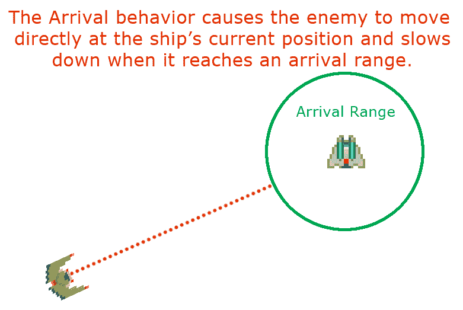
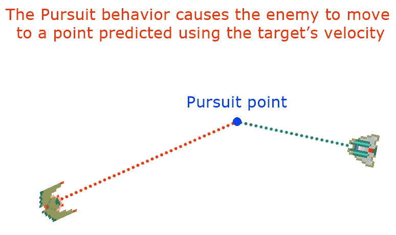
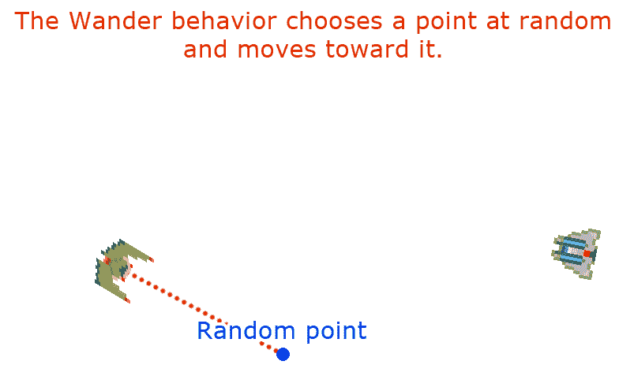
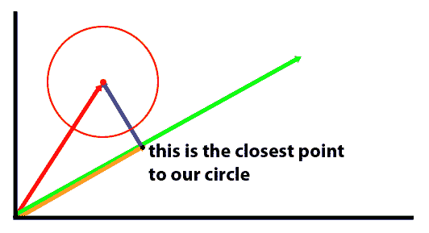
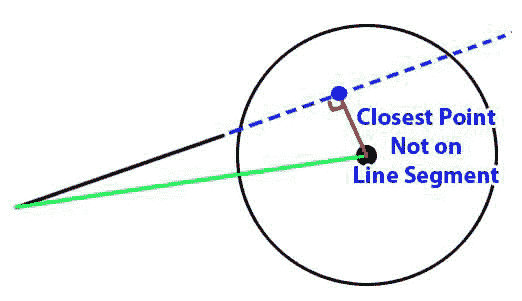

# 人工智能与驾驶行为

我们一直在写的游戏，松散的基于电脑游戏 *Spacewar！*如果你不熟悉*太空战！*，这是有史以来写的第一款电脑游戏。它最初运行在麻省理工学院拥有的 PDP-1 上，由麻省理工学院的学生史蒂夫·拉塞尔于 1962 年编写。当时，仅仅让计算机显示图形输出已经足够困难了。*太空战！*以及许多其他早期的游戏系统，如 *Pong* ，都是设计成多人玩的。那是因为把计算机编程得像人一样是一件非常困难的事情。这在今天仍然有些道理，尽管更多的处理能力和数据允许现代**人工智能** ( **AI** )算法比过去表现得更加智能。

因为我们的游戏是一个单人网络游戏，我们没有使用第二个人类智能来驱动我们的敌人飞船的好处。在这一章之前，我们使用了一个人工智能存根来允许我们的敌人飞船在我们的游戏区域内随意移动和射击。到目前为止，这可能对我们有用，但现在我们希望我们的玩家感受到敌人船只的威胁。它应该足够聪明，可以在一对一的战斗中战斗并杀死我们的玩家。

You will need to include several images in your build to make this project work. Make sure you include the `/Chapter10/sprites/` folder from the project's GitHub. If you haven't yet downloaded the GitHub project, you can get it online at: [https://github.com/PacktPublishing/Hands-On-Game-Development-with-WebAssembly](https://github.com/PacktPublishing/Hands-On-Game-Development-with-WebAssembly).

在本章中，我们将执行以下操作:

*   介绍人工智能和游戏人工智能的概念
*   为游戏增加障碍以避免 AI(并增加画布大小)
*   为视线添加新的碰撞检测
*   引入**有限状态机** ( **有限状态机**)的概念
*   引入**自主代理**的概念
*   引入**转向行为**的概念
*   给我们的游戏增加力场
*   使用有限状态机和操纵行为来创建人工智能
*   调整我们的人工智能，让敌人的宇宙飞船通过障碍物

# 什么是游戏 AI？

许多早期的视频游戏避免了人工智能，因为在当时可用的硬件中，这是一个非常具有挑战性的问题。例如*太空入侵者**加拉加*和*加拉西安*都有以特定的非智能模式移动的外星人。早期的雅达利游戏要么是双人游戏( *Pong* )，要么是让玩家与非智能环境交互(*breaking*)。一个早期成功的人工智能游戏尝试是*吃豆人*。 *PAC-MAN* 中的每个鬼魂都有不同的性格，在相同的情况下会表现得有些不同。 *PAC-MAN* 也使用了简单的**有限状态机** ( **FSM** )。这是一种人工智能，人工智能在不同的环境下表现不同。如果玩家在“吃豆人”中吃了一个“T21”能量球，鬼魂就会变成蓝色，然后在“猎人变成猎物”的“财富逆转”中突然变得可以吃。虽然鬼魂可以被吃掉，但对程序员来说，让这些鬼魂像以前一样继续追捕“吃豆人”会更容易。这将使鬼魂看起来要么愚蠢，要么有自杀倾向，这是我们在写人工智能时希望避免的行为。

1950 年，数学和计算机天才艾伦·图灵为人工智能提出了一个基准，他称之为“模仿游戏”，但后来它被称为图灵测试。他提出了一种游戏，让人类玩家通过基于文本的界面与人类和计算机互动。如果一台计算机能让一个人相信他们正在与另一个人而不是一台计算机进行交互，那么这台计算机应该被认为是智能的。就我个人而言，我觉得我们好像很久以前就通过了这个门槛。但是当机器威胁到人类的智力时，人类喜欢移动目标。

1964 年，麻省理工学院的约瑟夫·韦森鲍姆写了一个名叫伊莱扎的聊天机器人。伊莱扎在聊天系统的另一端假装是一名心理治疗师。伊莱扎设法愚弄了相当多的人，让他们相信这是一个真正的心理治疗师，这可能既是对心理治疗的评论，也是对人类智力的评论。任何寻找聊天机器人的人都可以很容易地分辨出 ELLIA 不是人类，但是 Joesph Weizenbaum 对愿意向 ELLIA 倾诉心声的人数感到非常不安，好像她是一个真实的人。

罗布纳奖是一年一度的图灵测试比赛，一系列身为人工智能专家的评委还没有被一个聊天机器人愚弄。如今，许多程序经常愚弄人们，让他们以为自己是人类。我认为，需要一个人类专家来确定一个人工智能是否通过了图灵测试，这将大大偏离艾伦·图灵最初设定的目标。我相信，如果我们有大量被聊天机器人愚弄的非专家样本，我们应该认为聊天机器人是智能的，但我跑题了。

我提出图灵测试的观点是，游戏人工智能需要通过图灵测试的修改形式。当你写一个游戏人工智能时，你的目标是让玩家相信他们不是在和一个完全失败的人玩游戏。所有的游戏人工智能或多或少都是蹩脚的。目前，我们将无法创建一个 IBM 沃森的游戏人工智能版本(在危险中击败肯·詹宁斯的人工智能)。就像电脑游戏中的一切一样，我们需要学会在系统的约束下工作。对于基于网络的游戏来说，这些限制可能很重要。

记住，作弊可以，但不要被抓。许多游戏玩家作弊。一个 RTS 也许能看穿战争的迷雾。人工智能扑克玩家可能会在玩家的牌上达到顶峰。我们要作弊的一个方法是允许我们的敌人飞船向玩家不允许的方向加速。用游戏人工智能作弊的关键是确保行为或动作看起来不自然。很多年前，我写了一个在线版的纸牌游戏黑桃，可在[https://www.icardgames.com/spades.html](https://www.icardgames.com/spades.html)玩。玩家的伙伴 AI 被允许在每个人的牌上达到顶峰。我得到的一个常见抱怨是，玩家的搭档经常会胜过玩家的高牌。这是因为人工智能看的不是当前谁赢了这一招，而是如果跟随他的玩家没有打出比他领先的牌更高的牌，他是否能赢这一招。没有意识到这种行为正在帮助他们，我从玩家那里得到了许多沮丧的抱怨，关于合作伙伴胜过他们的牌。这是一个例子，玩家实际上因为人工智能做得更好，但给人的印象是人工智能正在做出愚蠢的选择。我的观点是，游戏 AI 就是印象。还记得 AI 主持人在 HBO 电视节目*西部世界*中说的话吗，其中一个角色问她是不是真的:“如果你分不清，真的有关系吗？”

# 自主代理与自顶向下人工智能

1986 年，克雷格·雷诺兹创建了一个备受关注的人工智能程序，名为 *Boids* (鸟和机器人的结合体)。这个程序创造了一种令人着迷的类似鸟的群集行为，小三角形在屏幕上移动，提醒观察者成群结队的鸟或鱼。当环境有障碍时，机器人会分开绕过障碍，然后重新加入。两群鸟之间的碰撞通常会以鸟群会合并继续前进而告终。Boids 算法是用于人工智能的自治代理的实现。每个独立的 boid 基于一些简单的规则和它的直接环境做出决定。这导致了所谓的**紧急行为**，这种行为看起来好像是自上而下设计的，但实际上并非如此。具有讽刺意味的是，自上而下实现的人工智能通常看起来不如允许单个代理做出自己的决定聪明。这有点像旧的苏联自上而下的命令和控制经济，而不是资本主义经济，在资本主义经济中，个人根据他们周围的环境做出决定。在游戏中，就像在经济学中一样，你也可以有一个混合系统，其中自上而下的人工智能可以向自主代理发送消息，给他们新的目标或指令。在我们正在编写的游戏中，我们有一个单一的敌人飞船，因此自上而下或通过自主代理来管理 AI 的决定实际上并没有太大关系，但因为您可能会选择在未来扩展游戏以支持多个敌人及其 AI，所以我们的代理将自主管理自己。

# 什么是密克罗尼西亚联邦？

FSM 在游戏中非常常见。正如我之前提到的，PAC-MAN 是一个早期的游戏，它有一个多状态的 AI。当吃豆人吃掉屏幕上的一个大点，也就是通常所说的“T4”能量球“T5”时，基于全局条件的翻转，鬼魂可能处于“T0”狩猎“T1”或“T2”逃跑“T3”状态。FSM 中的特定状态可以是全局条件，或者在**有限** **状态自动机**的情况下，可以是游戏中任何*自治代理*特定的状态。管理行为或状态转换可以像使用 switch 语句一样简单，也可以是在触发不同状态时加载和卸载 AI 模块的更复杂的系统。状态可以选择何时转换到不同的状态，或者状态转换可以由游戏自上而下地管理。

我们将为这个游戏编写的有限状态机将是非常基本的。这将是一个简单的开关，根据当前状态执行不同的行为。敌舰相对于玩家的位置以及它们之间是否有通畅的视线将用于确定状态之间的转换。我们的密克罗尼西亚联邦将有四种基本状态:

1.  `WANDER`
2.  `APPROACH`
3.  `ATTACK`
4.  `FLEE`

进入这些状态的条件如下:如果敌舰没有通往玩家舰的通畅路径，则进入`WANDER`状态，在该状态下，它会在游戏区域四处游荡，定期检查是否有通往玩家的视线路径。一旦有了玩家的视线路径，敌舰就会进入`APPROACH`状态，在该状态下它会尝试足够靠近玩家舰来攻击它。一旦玩家足够接近，它就会进入`ATTACK`状态，在玩家船上开火。如果玩家船离敌人船太近，敌人会`FLEE`，试图增加自己和玩家船之间的距离。

# 引入转向行为

转向行为是一种基于力的方法，用于在避开障碍物的同时朝着或远离特定点导航。它最初是由 Craig Reynolds(the*Boids*guy)在 1999 年**游戏开发者大会** ( **GDC** )上的演讲中讨论的，讨论转向行为的原始论文可以在网上[https://www.red3d.com/cwr/steer/gdc99/](https://www.red3d.com/cwr/steer/gdc99/)上找到。与寻路算法(如 A*或 Dijkstra 算法)不同，转向行为本质上是战术性的。它们包括一个目标位置，并迫使自主代理向其目标移动，同时将代理推离您希望它避开的障碍。在我们的游戏中，敌方飞船是我们的自主代理，它将使用转向行为。它将追逐玩家飞船，同时避开包括小行星、抛射体和游戏区域中心的恒星在内的障碍物。在接下来的几节中，我们将详细讨论几种转向行为。

# 寻求行为

**寻道转向行为**是一种将代理(敌船)指向所需目标并将代理向该目标方向移动的力。这种行为试图达到最大速度，并在最短时间内达到目标。寻道行为假设它所寻找的位置是静态的，不会随着时间而改变。此图显示了寻道行为的样子:


The seek behavior

# 逃跑行为

**逃离**是一种转向行为，与寻求行为相反。这种行为占据一个位置或游戏对象，并试图尽可能远离它。

Fleeing is the behavior you demonstrate when chased by a bear. Your only goal is to put as much distance between you and the current location of that bear as you can. So, the next time a bear chases you, stop for a moment and think, "*Wow, my brain is currently implementing a version of the autonomous agent steering behavior known as* flee." Or you could keep running. The choice is yours. Take a look at the next diagram:


An artist's rendering of a bear eating the reader

你可以通过否定寻找行为的方向来编程逃离行为。换句话说，如果寻道行为产生的方向矢量力为 1，1，则逃离转向行为将产生的方向矢量力为-1，-1。此图描述了逃离行为:


The flee behavior

# 到达行为

寻道转向行为的问题在于，在代理到达其目标位置之前，它不会得到满足。另一个问题是，因为它试图以最大速度到达那个位置，它几乎总是会超过它，导致围绕期望的目的地振荡。当到达目标的**到达范围**时，**到达转向行为**允许通过开始减速来优雅地结束搜寻行为。只要目标目的地在期望的范围内，到达行为将减少向搜寻位置的移动。下图描述了到达行为:



The arrival behavior

# 追求行为

我们在寻求行为的基础上建立**追求行为**。当寻道行为希望到达一个静态点时，寻道行为假设目标在移动。因为我们的代理(敌船)希望追踪并摧毁玩家，玩家通常是移动的，所以我们将使用追击转向行为。追击行为看目标的速度。它不是直接向目标的当前位置前进，而是试图找到它预测的目标所在的拦截点。Seek 让我想起了一个儿童足球队。所有的孩子都跑向球在哪里，而不是球会在哪里。正因为如此，足球场上的每个人都像一个大单元一样在场上跑来跑去。总有一天，他们会长大，把追逐引导行为融入到他们的足球策略中。

下图描述了追求行为:



The pursuit behavior

# 逃避行为

**躲避**是为了*追击*如同*逃跑*是为了*寻找*。和追击一样，**躲避转向行为**是试图确定你正在躲避的障碍物会在哪里，并尽可能远离那个点。换句话说，它采取了我们在追求行为中发现的相同点，然后从那个点逃跑。下图描述了规避行为:


The evade behavior

# 排除故障

**避障**与逃离和躲避行为的不同之处在于，当我们的代理试图寻找新的位置时，障碍物可能会潜在地出现在我们的代理的路径上。逃离和躲避使我们试图尽可能远离物体的位置或我们正在逃离的位置，而避障更多的是为了避免在到达目标的途中与障碍物发生碰撞。在我们的游戏中，需要避开的障碍物包括小行星、抛射体和游戏屏幕中央的星星。避障通常只涉及寻求避开最具威胁性(最近的)障碍物。我们的代理有一个给定的前视距离，可以看到它移动的方向。如果它的当前位置和它移动方向上的最大前视之间的一条线与一个物体相撞，避障要求我们调整方向。我们躲避的区域应该比障碍物的碰撞检测区域要大，这样才能给我们一个躲避的缓冲区，尤其是因为游戏中小行星和抛射体都在移动。

下图描述了避障:


Obstacle avoidance

# 流浪行为

**游走**是代理在游戏画面中有些随机移动的状态。让敌人飞船的方向随机旋转每一帧会导致非常不稳定的行为。相反，应该有一个随机的毫秒数(200-2000)，飞船保持其当前方向。当船已经走了随机的毫秒数，它应该随机选择左转或右转，但应该有一个偏向性的机会转向与前一次相同的方向，这种偏向性在最初选择后每次选择相同的方向时都会减少。这将使流浪行为更加一致，显得不那么紧张。

查看游走行为如何随机选择一个点并向其移动:



Demonstrating the wander behavior

# 合力

我们之前对读者利用逃跑行为逃离熊的讨论过于简单。它假设你正在一片开阔的田野里逃离那只熊。如果你在树林里躲避一只熊，你俩都需要避免跑进树林，尽可能远离那只熊。你必须将这两种活动无缝融合，否则就会被那只熊吃掉。如果我们想让敌船追击或逃离玩家船，同时避开障碍物，我们就需要联合转向力量。最优先考虑的总是避免障碍。如果你在逃离那只熊的时候撞上了一棵树，它最终还是会吃掉你。我们的转向行为将实施的一般策略是找到玩家船的视线向量。有几个机会，我们必须找到一个视线，因为我们的游戏水平缠绕在自己身上的方式。如果那条视线比选择的距离长，我们会徘徊，直到我们的距离足够短，我们可以在向玩家射击的同时追上他。当我们漫游时，我们会希望将任何漫游力量与帮助敌船避免撞击小行星或恒星的力量结合起来。一旦我们在追求，我们就会想要继续避开障碍。会有一个很大的到达区域，我们的船会慢慢停下来，向玩家的方向开火。一旦玩家接近特定范围，我们的船就会逃跑。

# 修改 game.hpp

在我们深入了解新代码之前，我想对`game.hpp`文件进行一些快速更改，以添加一些我们将在本章稍后使用的功能。我想在`game.hpp`文件顶部附近添加的第一件事是几个宏，它们可以让我们快速地从角度(以度为单位)转换为弧度，也可以从弧度转换为角度。我发现自己在使用 SDL 的时候经常这样做，因为 SDL，出于某种原因，想要以度为单位的旋转，而其他所有的库都使用弧度。因此，让我们继续在靠近`game.hpp`文件顶部的某处添加以下两行代码:

```cpp
#define DEG_TO_RAD(deg) ((float)deg/180.0)*3.14159
#define RAD_TO_DEG(rad) ((float)rad*180.0)/3.14159
```

我们将把画布的尺寸从 320 x 200 改为 800 x 600。为了便于以后切换，我们先定义几个宏，用于画布的宽度和高度，并将它们放在靠近`game.hpp`文件顶部的某个地方:

```cpp
#define CANVAS_WIDTH 800
#define CANVAS_HEIGHT 600
```

在 C 和 C++中用来获取随机数的`rand()`函数，只能用来返回一个整数。我将添加一个函数来获取介于最小和最大浮点值之间的随机数，因此我需要在我们的`game.hpp`文件中添加对该函数的外部引用:

```cpp
extern float get_random_float( float min, float max );
```

我们也开始需要循环引用。`FiniteStateMachine`类需要引用`EnemyShip`类，`EnemyShip`类需要引用`FiniteStateMachine`类。不幸的是，我们需要先定义其中一个类，再定义另一个类。在过去，我们已经能够以特定的顺序定义我们的类来避免这个问题，但是现在我们需要在任何类定义之前有一组类声明。这将允许编译器知道一个类将在定义之前被定义。将这个类声明块添加到`game.hpp`文件顶部附近的某个地方:

```cpp
class Ship;
class Particle;
class Emitter;
class Collider;
class Asteroid;
class Star;
class PlayerShip;
class EnemyShip;
class Projectile;
class ProjectilePool;
class FiniteStateMachine;
```

我们将添加一个枚举来跟踪我们的 FSM 状态。正如我前面提到的，我们的密克罗尼西亚联邦有四个州:`APPROACH`、`ATTACK`、`FLEE`和`WANDER`。我们将在一个名为`FSM_STATE`的枚举中定义这些状态:

```cpp
enum FSM_STATE {
    APPROACH = 0,
    ATTACK = 1,
    FLEE = 2,
    WANDER = 3
};
```

我们在`game.hpp`中定义的第一个类之一是`Point`类。这个职业有 *x* 和 *y* 属性和一些有用的功能，比如`Rotate`。我们需要极大地扩展这个类的用途以及它能做什么。以至于称之为*点*不再准确。我更愿意把这个类叫做*向量*，因为从现在开始我们将把它用于向量数学。我对这个名字唯一的问题是它可能会令人困惑，因为我们在代码中使用`std::vector`来处理类似数组的数据。正因为如此，我决定把这个班叫做`Vector2D`。我们将大大扩展这个类的功能，包括一个将向量归一化的函数(也就是说，将其大小改为 1)。我们需要两个函数来确定向量的大小和平方大小。我们需要一个函数将向量投影到另一个向量上(以帮助我们进行视线碰撞检测)。我们需要能够找到两个向量的点积。我们还需要能够找到给定向量的旋转。除了这些新函数之外，我们将在向量上重载运算符，以允许我们添加向量、减去向量以及用标量值乘和除向量。

继续删除`Point`类定义，并用新的`Vector2D`类定义替换该代码:

```cpp
class Vector2D {
    public:
        float x;
        float y;

        Vector2D();
        Vector2D( float X, float Y );

        void Rotate( float radians );
        void Normalize();
        float MagSQ();
        float Magnitude();
        Vector2D Project( Vector2D &onto );
        float Dot(Vector2D &vec);
        float FindRotation();

        Vector2D operator=(const Vector2D &vec);
        Vector2D operator*(const float &scalar);
        void operator+=(const Vector2D &vec);
        void operator-=(const Vector2D &vec);
        void operator*=(const float &scalar);
        void operator/=(const float &scalar);
 };
```

我们新的碰撞检测也需要一个`Range`类。范围表示最小值和最大值之间的值范围。我们可以把两个范围加在一起。我们可以找到这两个范围之间的重叠。我们可以通过给定的标量值来扩展一个范围，或者我们可以将一个值限制在给定的范围内。以下是新的`Range`类定义:

```cpp
class Range {
    public:
        float min;
        float max;

        Range();
        Range( float min_val, float max_val );

        void operator+=(const Range& range);
        Range operator+(const Range& range);
        Range operator=(const Range& range);

        bool Overlap( Range &other );
        void Sort();
        void Extend( float ex );
        float Clamp( float value );
 };
```

如果您向下滚动到`Collider`类，我们将添加一些新的函数和一些新的属性。我想使用我们的`Collider`类来支持新的转向行为。因此，我们需要一些特定于转向的属性:

```cpp
float m_SteeringRadius;
float m_SteeringRadiusSQ;
```

`m_SteeringRadius`是`m_Radius`的倍数的新属性。出于转向的目的，我们希望确保我们想要避免的物体的尺寸小于物体的碰撞面积。这为我们的转向行为创造了额外的空间，有助于我们避开这些物体。`m_SteeringRadiusSQ`属性是转向半径的平方。这将使我们不必为了一次又一次的碰撞检查而调整转向半径。

我们还需要添加以下函数的声明:

```cpp
bool SteeringLineTest( Vector2D &p1, Vector2D &p2 );
bool SteeringRectTest( Vector2D &start_point, Vector2D &end_point );
void WrapPosition();
```

`SteeringLineTest`和`SteeringRecTest`功能将不同于实线和矩形碰撞测试。转向矩形测试(`SterringRectTest`)将用于限制我们为避免物体碰撞而必须测试的物体数量。我们只希望我们的人工智能担心敌人飞船周围 200 x 200 像素的盒子内的物体。如果我们有大量的对象要测试，这将非常有用。为了保持快速测试，我们将检查该框中的对象，就像它们是点一样，并且不会考虑对象的半径。`SteeringLineTest`功能将测试该对撞机的转向半径是否击中测试中两点定义的直线。

在我们的游戏中，我们没有增加命中点系统。与小行星或抛射体的一次碰撞会导致瞬间死亡。这让比赛变得非常短。为了增加游戏时间，我们将在船上增加护盾。只要护盾有效，这些护盾将使玩家或敌人无坚不摧。当你使用护盾时，它们会慢慢从绿色变成红色，在某个时候，它们会停止工作。这将取决于你在给定游戏中使用护盾的时间，以鼓励玩家仅在需要时使用护盾。以下是`Shield`类的定义:

```cpp
class Shield : public Collider {
    public:
        bool m_Active;
        int m_ttl;
        int m_NextFrame;
        Uint32 m_CurrentFrame;
        Ship* m_Ship;
        SDL_Texture *m_SpriteTexture;

        SDL_Rect m_src = {.x = 0, .y = 0, .w = 32, .h = 32 };
        SDL_Rect m_dest = {.x = 0, .y = 0, .w = 32, .h = 32 };

        Shield( Ship* ship, const char* sprite_file );

        void Move();
        void Render();
        bool Activate();
        void Deactivate();
};
```

在`Shield`类定义之后，我们需要为我们的`Asteroid`类添加一个类定义。与雅达利游戏*小行星*不同，我们无法通过射击来摧毁这些小行星。它们本来就是障碍物，但是如果玩家在护盾激活的情况下撞上它们，我们会(暂时)允许小行星被摧毁。它们将在游戏屏幕周围缓慢移动，并在游戏过程中为玩家和敌人的人工智能导航提供障碍。下面是代码:

```cpp
class Asteroid : public Collider {
    public:
        SDL_Texture *m_SpriteTexture;
        SDL_Rect m_src = {.x = 0, .y = 0, .w = 16, .h = 16 };
        SDL_Rect m_dest = {.x = 0, .y = 0, .w = 0, .h = 0 };

        bool m_Alive;
        Uint32 m_CurrentFrame = 0;
        int m_NextFrameTime;
        float m_Rotation;

        Vector2D m_Direction;
        Vector2D m_Velocity;

        Emitter* m_Explode;
        Emitter* m_Chunks;

        Asteroid( float x, float y,
                  float velocity,
                  float rotation );

        void Move();
        void Render();
        void Explode();
};
```

我们还将在游戏区域的中心增加一颗大星星。这类似于游戏中心的黑洞*太空战！*，这是我们游戏的松散基础。这颗恒星最终将提供引力，使游戏更具挑战性。我们将制作一张恒星图像的动画，并使用粒子发射器添加一些太阳耀斑:

```cpp
class Star : public Collider {
    public:
        SDL_Texture *m_SpriteTexture;
        SDL_Rect m_src = {.x = 0, .y = 0, .w = 64, .h = 64 };
        SDL_Rect m_dest = {.x = 0, .y = 0, .w = 64, .h = 64 };

        std::vector<Emitter*> m_FlareList;
        Uint32 m_CurrentFrame = 0;
        int m_NextFrameTime;

        Star();

        void Move();
        void Render();
};
```

现在我们可以对我们的`Ship`类做一些修改。以下是我们完成后的样子:

```cpp
class Ship : public Collider {
    public:
        const float c_Acceleration = 10.0f;
        const float c_MaxVelocity = 50.0f;
        const int c_AliveTime = 2000;
        const Uint32 c_MinLaunchTime = 300;
        const int c_Width = 32;
        const int c_Height = 32;

        bool m_Accelerating = false;
        Uint32 m_LastLaunchTime;
        SDL_Texture *m_SpriteTexture;
        SDL_Rect src = {.x = 0, .y = 0, .w = 32, .h = 32 };

        Emitter* m_Explode;
        Emitter* m_Exhaust;
        Shield* m_Shield;
        std::vector<Collider*> m_Colliders;

        bool m_Alive = true;
        Uint32 m_CurrentFrame = 0;
        int m_NextFrameTime;
        float m_Rotation;

        Vector2D m_Direction;
        Vector2D m_Velocity;

        void RotateLeft();
        void RotateRight();
        void Accelerate();
        void Decelerate();
        void CapVelocity();
        void Shoot();
        virtual void Move() = 0;
        Ship();
        void Render();
        bool CompoundHitTest( Collider* collider );
};
```

我们要做的第一件事是添加`m_Shield`属性，这是一个指向`Shield`对象的指针:

```cpp
Shield* m_Shield;
```

之后，我们对 *x* 方向和 *y* 方向使用单独的变量，对 *x* 速度和 *y* 速度使用不同的变量，如下所示:

```cpp
double m_DX;  // x-direction variable
double m_DY;  // y-direction variable
double m_VX;  // x-velocity variable
double m_VY;  // y-velocity variable
```

让我们去掉所有的代码，换成一些`Vector2D`对象，表示方向向量和速度向量，如下所示:

```cpp
Vector2D m_Direction;
Vector2D m_Velocity;
```

最后，为了防止敌舰和玩家舰之间的代码重复，我们将增加一个`Shoot()`功能，从飞船发射一枚炮弹:

```cpp
void Shoot();
```

我们需要修改的下一个类是我们的`EnemyShip`类。我们需要添加一个带有`Shield`精灵文件名的字符串。我们还需要删除旧的`AIStub()`函数，并将其替换为指向我们的有限状态机的指针。以下是新版本的`EnemyShip`类的外观:

```cpp
class EnemyShip: public Ship {
    public:
        const char* c_SpriteFile = "/sprites/BirdOfAngerExp.png";
        const char* c_ShieldSpriteFile = "/sprites/shield-bird.png";
        const int c_AIStateTime = 2000;

        int m_AIStateTTL;
        FiniteStateMachine* m_FSM;

        EnemyShip();
        void Move();
};
```

我们将要添加的一个重要的新类是`FiniteStateMachine`类。这门课将承担人工智能的所有重任。以下是您必须添加到`game.hpp`中的类定义:

```cpp
class FiniteStateMachine {
    public:
        const float c_AttackDistSq = 40000.0;
        const float c_FleeDistSq = 2500.0;
        const int c_MinRandomTurnMS = 100;
        const int c_RandTurnMS = 3000;
        const int c_ShieldDist = 20;
        const int c_AvoidDist = 80;
        const int c_StarAvoidDistSQ = 20000;
        const int c_ObstacleAvoidForce = 150;
        const int c_StarAvoidForce = 120;

        FSM_STATE m_CurrentState;
        EnemyShip* m_Ship;
        bool m_HasLOS;
        bool m_LastTurnLeft;
        int m_SameTurnPct;
        int m_NextTurnMS;
        int m_CheckCycle;
        float m_DesiredRotation;
        float m_PlayerDistSQ;

        FiniteStateMachine(EnemyShip* ship);

        void SeekState(Vector2D &seek_point);
        void FleeState(Vector2D &flee_point);
        void WanderState();
        void AttackState();
        void AvoidForce();
        bool ShieldCheck();
        bool LOSCheck();
        Vector2D PredictPosition();
        float GetPlayerDistSq();
        void Move();
};
```

在这个类定义的顶部是九个常数:

```cpp
 const float c_AttackDistSq = 40000.0;
 const float c_FleeDistSq = 2500.0;
 const int c_MinRandomTurnMS = 100;
 const int c_RandTurnMS = 3000;
 const int c_ShieldDist = 20;
 const int c_AvoidDist = 80;
 const int c_StarAvoidDistSQ = 20000;
 const int c_ObstacleAvoidForce = 150;
 const int c_StarAvoidForce = 120;
```

前两个常数`c_AttackDistSq`和`c_FleeDistSq`是密克罗尼西亚联邦用来确定是否将状态变为`ATTACK`或`FLEE`状态的值；`c_MinRandomTurnMS`和`c_RandTurnMS`都是`WANDER`状态用来确定 AI 下一次决定随机改变方向的常数。`c_ShieldDist`常数是障碍物将导致人工智能开启其护盾的距离。`c_AvoidDist`常数给出了人工智能进行校正调整以避开物体的范围。`c_StarAvoidDistSQ`功能是 AI 进行航向调整以避开游戏区域中心的星星的距离。`c_ObstacleAvoidForce`常数是一个加在物体速度上的转向力，帮助物体避开障碍物，`c_StarAvoidForce`是一个类似的力，用来避开恒星。

在常量之后，我们有一组属性，由 FSM 用来做出基于状态的决策:

```cpp
 FSM_STATE m_CurrentState;
 EnemyShip* m_Ship;
 bool m_HasLOS;
 bool m_LastTurnLeft;
 int m_SameTurnPct;
 int m_NextTurnMS;
 int m_CheckCycle;
 float m_DesiredRotation;
 float m_PlayerDistSQ;
```

`m_CurrentState`属性保存我们的 FSM 的当前状态。`m_Ship`属性包含一个指向船只的指针。现在，这总是我们游戏中的单个敌舰，但是在未来，你可能会想要添加多个敌舰。`m_HasLOS`属性是一个`boolean`，用来记录我们的飞船当前是否有玩家的无障碍视线。`m_LastTurnLeft`属性是一个`boolean`，它记录了船在`WANDER`状态下最后一次转向的方向。`m_SameTurnPct`属性是船在`WANDER`状态下继续朝同一个方向转弯的概率百分比。`m_NextTurnMS`属性是在改变方向航向之前，处于`WANDER`状态的船只将持续的毫秒数。`m_CheckCycle`变量用于将人工智能分解为在不同的帧渲染周期中执行不同的检查。如果你让你的人工智能在每次渲染的每一帧之间做所有的工作，你可能会让系统陷入困境。通常更好的做法是将人工智能分成多个部分，并在每个帧渲染时只执行部分逻辑。`m_DesiredRotation`属性是 AI 想要的航向，最后`m_PlayerDistSQ`是敌舰和玩家舰的平方距离。

我们需要修改`Projectile`类，使用一个`Vector2D`来跟踪速度，而不是两个浮点变量，`m_VX`和`m_VY`。以下是修改后的新版`Projectile`类:

```cpp
class Projectile: public Collider {
    public:
        const char* c_SpriteFile = "sprites/ProjectileExp.png";
        const int c_Width = 16;
        const int c_Height = 16;
        const double velocity = 6.0;
        const double alive_time = 2000;

        SDL_Texture *m_SpriteTexture;
        SDL_Rect src = {.x = 0, .y = 0, .w = 16, .h = 16 };

        Uint32 m_CurrentFrame = 0;
        int m_NextFrameTime;
        bool m_Active;
        float m_TTL;
        float m_VX;
        float m_VY;

        Projectile();
        void Move();
        void Render();
        void Launch(double x, double y, double dx, double dy);
};
```

在`game.hpp`文件的末尾，我们应该给我们新的小行星列表添加一些外部参考，以及将在游戏区域中心出现的恒星:

```cpp
extern std::vector<Asteroid*> asteroid_list;
extern Star* star;
```

现在我们已经处理了需要对`game.hpp`文件进行的修改，让我们进入正在添加的障碍。

# 给我们的游戏增加障碍

现在，我们的游戏中没有任何人工智能可以操控的东西。我们需要增加一些障碍物来阻挡我们的敌舰。我们希望我们的敌船在试图接近和攻击我们玩家的飞船时，尽可能避开这些障碍。我们将添加的第一件事是在我们的游戏区域的正中间有一颗大星星。我们可以制作这颗恒星的动画，并为恒星的日冕添加一些不错的粒子效果。在最后一节中，我们在`game.hpp`文件中创建了这颗星的类定义，它看起来像这样:

```cpp
class Star : public Collider {
    public:
        SDL_Texture *m_SpriteTexture;
        SDL_Rect m_src = {.x = 0, .y = 0, .w = 64, .h = 64 };
        SDL_Rect m_dest = {.x = 0, .y = 0, .w = 64, .h = 64 };

        std::vector<Emitter*> m_FlareList;

        Uint32 m_CurrentFrame = 0;
        int m_NextFrameTime;

        Star();

        void Move();
        void Render();
};
```

我们需要创建一个名为`star.cpp`的新文件来伴随这个类定义。在其中，我们应该定义我们的构造函数以及`Move`和`Render`函数。与我们所有的 CPP 文件一样，我们首先要做的是包含`game.hpp`文件:

```cpp
#include "game.hpp"
```

在那之后，我们有一些`#define`指令，用来定义我们将用来渲染我们的恒星和耀斑粒子系统的精灵文件:

```cpp
#define STAR_SPRITE_FILE "/sprites/rotating-star.png"
#define FLARE_FILE (char*)"/sprites/flare.png"
```

构造函数相当长，但很多看起来应该很熟悉:

```cpp
Star::Star() : Collider(32.0) {
    SDL_Surface *temp_surface = IMG_Load( STAR_SPRITE_FILE );

    if( !temp_surface ) {
        printf("failed to load image: %s\n", IMG_GetError() );
        return;
    }
    else {
        printf("success creating enemy ship surface\n");
    }
    m_SpriteTexture = SDL_CreateTextureFromSurface( renderer, 
    temp_surface );

    if( !m_SpriteTexture ) {
        printf("failed to create texture: %s\n", IMG_GetError() );
        return;
    }
    else {
        printf("success creating enemy ship texture\n");
    }
    SDL_FreeSurface( temp_surface );

    m_Radius = 36;

    m_Position.x = CANVAS_WIDTH / 2;
    m_Position.y = CANVAS_HEIGHT / 2;

    m_dest.x = m_Position.x - m_Radius / 2;
    m_dest.y = m_Position.y - m_Radius / 2;

    m_FlareList.push_back(new 
    Emitter(FLARE_FILE,100,160,220,1500,0.05,true,30,40, 1, 
    m_Position.x+8, m_Position.y+8, 10,0.1, 0.2,0.5, 1.0,0xffffff, 
    0xffffff, 0.1, 50,true, true, 4409, 1));

    m_FlareList.push_back(new 
    Emitter(FLARE_FILE,100,220,280,1500,0.05,true,30,40, 1, m_Position.x+8, 
    m_Position.y+8,10,0.1,0.2,0.5,1.0,0xffffff, 0xffffff, 0.0, 
    50,true,true,3571, 1));

    m_FlareList.push_back(new 
    Emitter(FLARE_FILE,100,280,360,1500,0.05,true,30,40, 1, 
    m_Position.x+8, m_Position.y+8, 10, 0.1, 0.2, 0.5, 1.0, 0xffffff, 
    0xffffff, 0.2, 50, true, true, 3989, 1));

    m_FlareList.push_back(new 
    Emitter(FLARE_FILE,100,0,60,1500,0.05,true,30,40, 1, m_Position.x+8, 
    m_Position.y+8, 10, 0.1, 0.2, 0.5, 1.0, 0xffffff, 0xffffff, 0.1, 50, 
    true, true, 3371, 1));

    m_FlareList.push_back(new 
    Emitter(FLARE_FILE,100,60,100,1500,0.05,true,30,40, 1, m_Position.x+8, 
    m_Position.y+8, 10, 0.1, 0.2, 0.5, 1.0, 0xffffff, 0xffffff, 0.3, 50, 
    true, true, 4637, 1));
}
```

这个构造函数从继承`Collider`构造函数开始，传递给它一个半径`32`:

```cpp
Star::Star() : Collider(32.0) {
```

然后它会创建一个精灵纹理，在渲染星星时使用。这部分代码看起来应该很熟悉:

```cpp
SDL_Surface *temp_surface = IMG_Load( STAR_SPRITE_FILE );

if( !temp_surface ) {
    printf("failed to load image: %s\n", IMG_GetError() );
    return;
}
else {
    printf("success creating enemy ship surface\n");
}
m_SpriteTexture = SDL_CreateTextureFromSurface( renderer, temp_surface );
if( !m_SpriteTexture ) {
    printf("failed to create texture: %s\n", IMG_GetError() );
    return;
}
else {
    printf("success creating enemy ship texture\n");
}
SDL_FreeSurface( temp_surface );
```

设置完 sprite 纹理后，构造函数会设置一些属性，包括半径和位置:

```cpp
m_Radius = 36;
m_Position.x = CANVAS_WIDTH / 2;
m_Position.y = CANVAS_HEIGHT / 2;
m_dest.x = m_Position.x - m_Radius / 2;
m_dest.y = m_Position.y - m_Radius / 2;
```

最后，它将发射器添加到`m_FlareList`向量中。这些将是一些太阳耀斑粒子系统。我使用粒子系统配置工具得出了我们在这些发射器中创建的值。如果你愿意，你可以使用这些值，但是我觉得这些值创造了一个好看的闪光效果:

```cpp
m_FlareList.push_back(new Emitter(FLARE_FILE,100,160,220,1500,0.05,true,30,40, 1, m_Position.x+8, m_Position.y+8, 10,0.1, 0.2,0.5, 1.0,0xffffff, 0xffffff, 0.1, 50,true, true,4409, 1));

m_FlareList.push_back(new Emitter(FLARE_FILE,100,220,280,1500,0.05,true,30,40, 1, m_Position.x+8, m_Position.y+8,10,0.1,0.2,0.5,1.0,0xffffff, 0xffffff, 0.0, 50,true,true,3571, 1));

m_FlareList.push_back(new Emitter(FLARE_FILE,100,280,360,1500,0.05,true,30,40, 1, m_Position.x+8, m_Position.y+8, 10, 0.1, 0.2, 0.5, 1.0, 0xffffff, 0xffffff, 0.2, 50, true, true, 3989, 1));

m_FlareList.push_back(new Emitter(FLARE_FILE,100,0,60,1500,0.05,true,30,40, 1, m_Position.x+8, m_Position.y+8, 10, 0.1, 0.2, 0.5, 1.0, 0xffffff, 0xffffff, 0.1, 50, true, true, 3371, 1));

m_FlareList.push_back(new Emitter(FLARE_FILE,100,60,100,1500,0.05,true,30,40, 1, m_Position.x+8, m_Position.y+8, 10, 0.1, 0.2, 0.5, 1.0, 0xffffff, 0xffffff, 0.3, 50, true, true, 4637, 1));
```

恒星的`Move`功能相当简单。它循环播放明星动画序列的八帧:

```cpp
void Star::Move() {
    m_NextFrameTime -= diff_time;
    if( m_NextFrameTime <= 0 ) {
        ++m_CurrentFrame;
        m_NextFrameTime = ms_per_frame;
        if( m_CurrentFrame >= 8 ) {
            m_CurrentFrame = 0;
        }
    }
}
```

恒星的`Render`功能稍微复杂一点，因为它需要在耀斑发射器上循环，并在渲染恒星的精灵纹理之前移动它们:

```cpp
void Star::Render() {
    Emitter* flare;
    std::vector<Emitter*>::iterator it;

    for( it = m_FlareList.begin(); it != m_FlareList.end(); it++ ) {
        flare = *it;
        flare->Move();
    }
    m_src.x = m_dest.w * m_CurrentFrame;

    SDL_RenderCopy( renderer, m_SpriteTexture,
                    &m_src, &m_dest );
}
```

接下来，我们需要定义`asteroid.cpp`文件。这将保存我们的`Asteroid`类的函数定义。以下是我们在`games.hpp`文件中对`Asteroid`的类定义:

```cpp
class Asteroid : public Collider {
    public:
        SDL_Texture *m_SpriteTexture;
        SDL_Rect m_src = {.x = 0, .y = 0, .w = 16, .h = 16 };
        SDL_Rect m_dest = {.x = 0, .y = 0, .w = 0, .h = 0 };

        bool m_Alive;
        Uint32 m_CurrentFrame = 0;
        int m_NextFrameTime;
        float m_Rotation;
        Vector2D m_Direction;
        Vector2D m_Velocity;

        Emitter* m_Explode;
        Emitter* m_Chunks;

        Asteroid( float x, float y,
                  float velocity,
                  float rotation );

        void Move();
        void Render();
        void Explode();
};
```

在我们的`asteroid.cpp`文件中，我们需要定义`Asteroid`构造函数、`Move`函数、`Render`函数和`Explode`函数。在`asteroid.cpp`文件的顶部，我们需要`#include``game.hpp`文件，并定义我们的小行星精灵文件在虚拟文件系统中的位置。以下是前几行代码的样子:

```cpp
#include "game.hpp"
#define ASTEROID_SPRITE_FILE (char*)"/sprites/asteroid.png"
```

我们将定义的第一个函数是我们的构造函数。以下是构造函数的全部内容:

```cpp
Asteroid::Asteroid( float x, float y,
                    float velocity,
                    float rotation ): Collider(8.0) {
    SDL_Surface *temp_surface = IMG_Load( ADSTEROID_SPRITE_FILE );

    if( !temp_surface ) {
        printf("failed to load image: %s\n", IMG_GetError() );
        return;
    }
    else {
        printf("success creating asteroid surface\n");
    }

    m_SpriteTexture = SDL_CreateTextureFromSurface( renderer, temp_surface );

    if( !m_SpriteTexture ) {
        printf("failed to create texture: %s\n", IMG_GetError() );
        return;
    }
    else {
        printf("success creating asteroid texture\n");
    }

    SDL_FreeSurface( temp_surface );

    m_Explode = new Emitter((char*)"/sprites/Explode.png",
         100, 0, 360,     // int max_particles, float min_angle, float 
         max_angle,
         1000, 0.3, false, // Uint32 particle_lifetime, float acceleration, 
         bool alpha_fade,
         20.0, 40.0,     // float min_starting_velocity, float 
         max_starting_velocity,
         10, 0, 0, 5,     // Uint32 emission_rate, int x_pos, int y_pos, 
         float radius,
         1.0, 2.0,         // float min_start_scale, float max_start_scale,
         1.0, 2.0,         // float min_end_scale, float max_end_scale,
         0xffffff, 0xffffff,
         0.01, 10,         // float burst_time_pct, Uint32 burst_particles,
         false, false,     // bool loop, bool align_rotation,
         800, 8 );         // Uint32 emit_time_ms, Uint32 animation_frames
    m_Explode->m_parent_rotation_ptr = &m_Rotation;
    m_Explode->m_parent_x_ptr = &(m_Position.x);
    m_Explode->m_parent_y_ptr = &(m_Position.y);
    m_Explode->m_active = false;

    m_Chunks = new Emitter((char*)"/sprites/small-asteroid.png",
         40, 0, 360, // int max_particles, float min_angle, float 
         max_angle,
         1000, 0.05, false, // Uint32 particle_lifetime, float 
         acceleration, 
         bool alpha_fade,
         80.0, 150.0, // float min_starting_velocity, float 
         max_starting_velocity,
         5, 0, 0, 10, // Uint32 emission_rate, int x_pos, int y_pos, 
         float radius,
         2.0, 2.0, // float min_start_scale, float max_start_scale,
         0.25, 0.5, // float min_end_scale, float max_end_scale,
         0xffffff, 0xffffff,
         0.1, 10, // float burst_time_pct, Uint32 burst_particles,
         false, true, // bool loop, bool align_rotation,
         1000, 8 ); // Uint32 emit_time_ms, Uint32 animation_frames

    m_Chunks->m_parent_rotation_ptr = &m_Rotation;
    m_Chunks->m_parent_x_ptr = &m_Position.x;
    m_Chunks->m_parent_y_ptr = &m_Position.    
    m_Chunks->m_active = false;

    m_Position.x = x;
    m_Position.y = y;

    Vector2D direction;
    direction.x = 1;
    direction.Rotate( rotation );

    m_Direction = direction;
    m_Velocity = m_Direction * velocity;

    m_dest.h = m_src.h = m_dest.w = m_src.w = 16;

    m_Rotation = rotation;
    m_Alive = true;
    m_CurrentFrame = 0;
    m_NextFrameTime = ms_per_frame;
}
```

构造函数的定义调用`Collider`类中的父构造函数，传递的半径为`8.0`的`Collider`:

```cpp
Asteroid::Asteroid( float x, float y,
                    float velocity,
                    float rotation ): Collider(8.0) {
```

之后，构造函数使用 SDL 加载并初始化 sprite 纹理，这个过程我们现在应该都很熟悉了:

```cpp
SDL_Surface *temp_surface = IMG_Load( ADSTEROID_SPRITE_FILE );

if( !temp_surface ) {
    printf("failed to load image: %s\n", IMG_GetError() );
    return;
}
else {
    printf("success creating asteroid surface\n");
}

m_SpriteTexture = SDL_CreateTextureFromSurface( renderer, temp_surface );

if( !m_SpriteTexture ) {
    printf("failed to create texture: %s\n", IMG_GetError() );
    return;
}
else {
    printf("success creating asteroid texture\n");
}

SDL_FreeSurface( temp_surface );
```

然后我们定义我们的爆炸发射器。如果我们的小行星被摧毁，这个发射器将被激活:

```cpp
m_Explode = new Emitter((char*)"/sprites/Explode.png",
     100, 0, 360, // int max_particles, float min_angle, float max_angle,
     1000, 0.3, false, // Uint32 particle_lifetime, float acceleration, 
     bool alpha_fade,
     20.0, 40.0, // float min_starting_velocity, float 
     max_starting_velocity,
     10, 0, 0, 5, // Uint32 emission_rate, int x_pos, int y_pos, 
     float radius,
     1.0, 2.0, // float min_start_scale, float max_start_scale,
     1.0, 2.0, // float min_end_scale, float max_end_scale,
     0xffffff, 0xffffff,
     0.01, 10, // float burst_time_pct, Uint32 burst_particles,
     false, false, // bool loop, bool align_rotation,
     800, 8 ); // Uint32 emit_time_ms, Uint32 animation_frames

m_Explode->m_parent_rotation_ptr = &m_Rotation;
m_Explode->m_parent_x_ptr = &(m_Position.x);
m_Explode->m_parent_y_ptr = &(m_Position.y);
m_Explode->m_active = false;
```

之后，我们创造了第二个发射器，当我们的小行星被摧毁时，它会射出小块的岩石。这是为了配合`m_Explosion`发射器，它会在小行星爆炸的同时运行:

```cpp
m_Chunks = new Emitter((char*)"/sprites/small-asteroid.png",
     40, 0, 360, // int max_particles, float min_angle, float max_angle,
     1000, 0.05, false, // Uint32 particle_lifetime, float acceleration, 
     bool alpha_fade,
     80.0, 150.0, // float min_starting_velocity, float 
     max_starting_velocity,
     5, 0, 0, 10, // Uint32 emission_rate, int x_pos, int y_pos, 
     float radius,
     2.0, 2.0, // float min_start_scale, float max_start_scale,
     0.25, 0.5, // float min_end_scale, float max_end_scale,
     0xffffff, 0xffffff,
     0.1, 10, // float burst_time_pct, Uint32 burst_particles,
     false, true, // bool loop, bool align_rotation,
     1000, 8 ); // Uint32 emit_time_ms, Uint32 animation_frames

m_Chunks->m_parent_rotation_ptr = &m_Rotation;
m_Chunks->m_parent_x_ptr = &m_Position.x;
m_Chunks->m_parent_y_ptr = &m_Position.y;
m_Chunks->m_active = false;
```

最后几行设定了小行星属性的起始值:

```cpp
m_Position.x = x;
m_Position.y = y;

Vector2D direction;
direction.x = 1;
direction.Rotate( rotation );

m_Direction = direction;
m_Velocity = m_Direction * velocity;
m_dest.h = m_src.h = m_dest.w = m_src.w = 16;

m_Rotation = rotation;
m_Alive = true;
m_CurrentFrame = 0;
m_NextFrameTime = ms_per_frame;
```

我们将定义的下一个函数是`Move`函数。这是它的样子:

```cpp
void Asteroid::Move() {
m_NextFrameTime -= diff_time;
if( m_NextFrameTime <= 0 ) {
    m_NextFrameTime = ms_per_frame;
    m_CurrentFrame++;
    if( m_CurrentFrame >= 8 ) {
        m_CurrentFrame = 0;
    }
}
m_Position += m_Velocity * delta_time;
WrapPosition();
}
```

处理`m_NextFrameTime`和`m_CurrentFrame`的第一批代码只是根据过去的时间在子画面帧之间交替:

```cpp
m_NextFrameTime -= diff_time;
if( m_NextFrameTime <= 0 ) {
    m_NextFrameTime = ms_per_frame;
    m_CurrentFrame++;

    if( m_CurrentFrame >= 8 ) {
        m_CurrentFrame = 0;
    }
}
```

之后，我们根据时间增量和流速更新位置:

```cpp
m_Position += m_Velocity * delta_time;
```

最后调用`WrapPosition`函数。如果我们的小行星离开了屏幕，这个功能会把它移回屏幕的右侧，如果它离开了屏幕的底部，这个功能会把它移到顶部。每当一颗小行星以给定的方向离开屏幕时，它的位置就会被绕到游戏区域的另一边。

在`Move`函数之后，我们定义`Asteroid Render`函数。完整的功能如下所示:

```cpp
void Asteroid::Render() {
    m_Explode->Move();
    m_Chunks->Move();
    if( m_Alive == false ) {
        return;
    }
    m_src.x = m_dest.w * m_CurrentFrame;
    m_dest.x = m_Position.x + m_Radius / 2;
    m_dest.y = m_Position.y + m_Radius / 2;
    SDL_RenderCopyEx( renderer, m_SpriteTexture,
                        &m_src, &m_dest,
                        RAD_TO_DEG(m_Rotation), NULL, SDL_FLIP_NONE );
}
```

前两行移动爆炸发射器和块发射器。如果小行星没有被摧毁，这些功能将不起任何作用。如果小行星已经被摧毁，这些功能将运行粒子发射器。这些发射器不循环，因此当它们的发射时间到了，它们将停止:

```cpp
m_Explode->Move();
m_Chunks->Move();
```

之后，我们检查小行星是否有生命，如果没有，我们就退出这个功能。我们在移动发射器后这样做的原因是，在小行星被摧毁后，我们必须继续运行发射器:

```cpp
if( m_Alive == false ) {
    return;
}
```

我们在这个函数中做的最后一件事是渲染我们的小行星精灵纹理，这个过程现在看起来应该很熟悉了:

```cpp
m_src.x = m_dest.w * m_CurrentFrame;
m_dest.x = m_Position.x + m_Radius / 2;
m_dest.y = m_Position.y + m_Radius / 2;
SDL_RenderCopyEx( renderer, m_SpriteTexture,
                  &m_src, &m_dest,
                  RAD_TO_DEG(m_Rotation), NULL, SDL_FLIP_NONE );
```

我们的`asteroid.cpp`文件中的最后一个函数是`Explode`函数。当小行星被摧毁时，该功能将运行。该功能将运行我们的两个发射器，这两个发射器旨在创建爆炸效果。它还将把小行星的活旗设定为`false`。下面是代码:

```cpp
void Asteroid::Explode() {
    m_Explode->Run();
    m_Chunks->Run();
    m_Alive = false;
}
```

现在我们已经定义了我们的游戏障碍，让我们看看如何为我们的宇宙飞船创造一些护盾。

# 添加力场

目前，在我们的游戏中，我们的宇宙飞船被一次碰撞摧毁。这最终创造了一个游戏，很快就结束了。当碰撞即将发生时，有一个力场来防止船的毁灭会很好。这也将使我们的人工智能在它的技巧包中有所作为。当防护罩打开时，使用它的飞船周围会有一点力场动画。盾牌的使用是有时间限制的。这将阻止玩家或人工智能在整个游戏中保持盾。当护盾激活时，护盾的颜色将从绿色变为红色。颜色越接近红色，护盾就越接近耗尽能量。每次盾牌被击中，玩家或人工智能的盾牌都会有额外的时间被拿掉。我们已经在`game.hpp`文件中创建了类定义。这是它的样子:

```cpp
class Shield : public Collider {
    public:
        bool m_Active;
        int m_ttl;
        int m_NextFrame;
        Uint32 m_CurrentFrame;
        Ship* m_Ship;
        SDL_Texture *m_SpriteTexture;

        SDL_Rect m_src = {.x = 0, .y = 0, .w = 32, .h = 32 };
        SDL_Rect m_dest = {.x = 0, .y = 0, .w = 32, .h = 32 };

        Shield( Ship* ship, const char* sprite_file );

        void Move();
        void Render();
        bool Activate();
        void Deactivate();
};
```

为了配合这个类定义，我们需要一个`shield.cpp`文件，在这里我们可以定义这个类使用的所有函数。我们将在`shield.cpp`文件中定义的第一个函数是`Shield`构造函数:

```cpp
Shield::Shield( Ship* ship, const char* sprite_string ) : Collider(12.0) {
    m_Active = false;
    m_ttl = 25500;
    m_Ship = ship;
    m_CurrentFrame = 0;
    m_NextFrame = ms_per_frame;
    SDL_Surface *temp_surface = IMG_Load( sprite_string );

    if( !temp_surface ) {
        printf("failed to load image: %s\n", IMG_GetError() );
        return;
    }

    m_SpriteTexture = SDL_CreateTextureFromSurface( renderer, 
   temp_surface );

    if( !m_SpriteTexture ) {
        printf("failed to create texture: %s\n", IMG_GetError() );
        return;
    }
    SDL_FreeSurface( temp_surface );
}
```

`Shield`构造函数将调用`Collider`构造函数，半径为`12.0`。这是一个比船半径更大的半径。如果护盾有效，我们希望这个`Collider`而不是飞船被击中。此构造函数中的第一个代码块设置此类属性的起始值:

```cpp
m_Active = false;
m_ttl = 25500;
m_Ship = ship;
m_CurrentFrame = 0;
m_NextFrame = ms_per_frame;
```

请注意，我们将`m_ttl`设置为`25500`。这是你可以使用盾牌的时间，以毫秒为单位。总计 25.5 秒。我希望它是 255 的倍数，这样绿色将根据剩余时间从 255 过渡到 0。

相反，红色将从 0 过渡到 255，也是基于剩余的时间。之后，我们以标准方式创建盾牌的精灵纹理:

```cpp
SDL_Surface *temp_surface = IMG_Load( sprite_string );

if( !temp_surface ) {
    printf("failed to load image: %s\n", IMG_GetError() );
    return;
}

m_SpriteTexture = SDL_CreateTextureFromSurface( renderer, temp_surface );

if( !m_SpriteTexture ) {
    printf("failed to create texture: %s\n", IMG_GetError() );
return;
}

SDL_FreeSurface( temp_surface );
```

构造函数之后，我们需要定义我们的`Move`函数:

```cpp
void Shield::Move() {
    if( m_Active ) {
        m_NextFrame -= diff_time;
        m_ttl -= diff_time;

        if( m_NextFrame <= 0 ) {
            m_NextFrame = ms_per_frame;
            m_CurrentFrame++;

            if( m_CurrentFrame >= 6 ) {
                m_CurrentFrame = 0;
            }
        }
        if( m_ttl <= 0 ) {
            m_Active = false;
        }
    }
}
```

如果防护罩没有激活，这个功能什么也做不了。如果激活，`m_ttl`参数将根据自最后一帧以来经过的毫秒数递减。然后，如果经过了适当的毫秒数，我们就增加当前帧。如果护盾的剩余时间低于 0，护盾将被关闭。

在我们定义了我们的`Move`函数之后，我们将定义我们的`Render`函数:

```cpp
void Shield::Render() {
    if( m_Active ) {
        int color_green = m_ttl / 100 + 1;
        int color_red = 255 - color_green;
        m_src.x = m_CurrentFrame * m_dest.w;
        m_dest.x = m_Ship->m_Position.x;
        m_dest.y = m_Ship->m_Position.y;

        SDL_SetTextureColorMod(m_SpriteTexture,
                             color_red,
                             color_green,
                             0 );

        SDL_RenderCopyEx( renderer, m_SpriteTexture,
                             &m_src, &m_dest,
                             RAD_TO_DEG(m_Ship->m_Rotation),
                             NULL, SDL_FLIP_NONE );
    }
}
```

与`Move`功能一样，`Render`功能在活动标志为假时不做任何事情。我们使用以下公式根据剩余时间计算颜色:

```cpp
int color_green = m_ttl / 100 + 1;
int color_red = 255 - color_green;
```

这将使我们的护盾的颜色从绿色平稳过渡到红色。我们使用对`SDL_SetTextureColorMod`的调用来设置精灵纹理的颜色:

```cpp
SDL_SetTextureColorMod(m_SpriteTexture,
                     color_red,
                     color_green,
                     0 );
```

`Shield::Render`功能中的其他一切都非常标准，现在看起来应该很熟悉了。

# 更多碰撞检测

让我们看看我们需要对我们的`Collider`类进行的修改。正如我们之前讨论的，我们的人工智能将实现转向行为。这些转向行为将在我们的`Collider`类中需要一些新的属性和功能。以下是新的`Collider`班级的样子:

```cpp
class Collider {
    public:
        float* m_ParentRotation;
        float* m_ParentX;
        float* m_ParentY;
        Vector2D m_TempPoint;

        bool CCHitTest( Collider* collider );

        Vector2D m_Position;
        float m_Radius;
        float m_SteeringRadius;
        float m_SteeringRadiusSQ;

        void SetParentInformation( float* rotation, float* x, float* y );
        Collider(float radius);
        bool HitTest( Collider *collider );
        bool SteeringLineTest( Vector2D &p1, Vector2D &p2 );
        bool SteeringRectTest( Vector2D &start_point, Vector2D &end_point 
        );
        void WrapPosition();
 };
```

我们有三个新功能，其中两个用于转向。其中一个功能`WrapPosition()`将用于包装在一个方向上离开屏幕的物体，以便它们重新出现在游戏屏幕的另一侧。让我们打开`collider.cpp`看看。我们首先需要改变的是构造函数。下面是新版本的构造函数的外观:

```cpp
Collider::Collider(float radius) {
    m_ParentRotation = NULL;
    m_ParentX = NULL;
    m_ParentY = NULL;

    m_Radius = radius;
    m_SteeringRadius = m_Radius * 1.5;
    m_SteeringRadiusSQ = m_SteeringRadius * m_SteeringRadius;
}
```

最后两行是唯一的修改。您会注意到我们将`m_SteeringRadius`属性设置为`1.5`乘以`m_Radius`值。这个额外的缓冲空间是为了防止我们的敌舰离小行星太近，尤其是当它们在移动的时候。这一因素有效地使转向行为更加警惕与小行星的碰撞。`1.5`的倍数选择有些随意，因为我测试的时候效果不错。如果你想让你的人工智能不那么关心小行星碰撞，更有可能通过将自己置于危险中来追求玩家，你可以降低这个值，也许是类似`1.1`的值。你也可以增加这个值，让人工智能更加警惕小行星。将该值设置得太高会导致 AI 过于胆小。将它设置得太低会让它在几乎任何情况下都追求玩家，模仿海军上将大卫·法拉格特在移动海湾战役中臭名昭著的话，“*该死的鱼雷——全速前进！*”

接下来，我们需要将新功能`SteeringLineText`添加到`collider.cpp`中。这个新的功能将在连接我们的敌舰和我们的玩家的一条线之间进行圆-线碰撞检测，并检测我们的船可能沿着这条路径撞击的所有小行星和射弹。这是一个视线测试，以确定从我们的位置是否有一条通往玩家的清晰路径。与圆-圆或矩形-矩形碰撞检测相比，圆-线碰撞检测有些复杂。我大量借用了我在[embed.com](https://www.embed.com)上创建的一个解决方案，地址如下:[https://www . embed . com/typescript-games/multi-type-防撞检测. html](https://www.embed.com/typescript-games/multiple-type-collision-detection.html) 。

# 圆-线碰撞检测

确定圆和线是否碰撞的第一步是最简单的:检查线的任一端点是否落在圆的半径内。这是通过使用毕达哥拉斯定理的简单距离检查来完成的。如果其中一个点与我们的圆心之间的距离小于半径，则直线在圆内。这是一个落在圆半径内的点的示意图:


The line's p2 point falls inside the circle radius

如果任一点落在圆的半径内，我们就知道直线和圆碰撞了。如果两个点都不在圆的半径内，我们就完了。那么我们需要做的就是找到直线上离圆心最近的点。让我离题一会儿，讲得更专业一点。从技术上讲，所有的线都是无限的。当我们有两个点，并在这两个点之间画一条“线”时，它就是一条线段。为了找到直线和我们的圆之间最近的点，我们需要谈论一些叫做**向量投影**的东西。

# 向量投影

矢量投影有点复杂。如果你将一个给定的向量 b 投影到向量 *a* 上，你会得到向量 *a* 的标量倍数(我们将这个标量倍数称为 *c* )，在这里你可以添加一个垂直于向量 *ca* 的向量来得到向量 *b* 。

下图是将向量 *b* 投影到向量 *a* 的示例:


An example of projecting vector b onto vector a

另一种观点是，向量 b 在向量 a 上的投影给了我们距离向量 b 的端点最近的点，该点位于线段上，由向量 a 的任何标量倍数定义。你可能想知道这与检测圆和线之间的碰撞有什么关系。好吧，如果我们假设向量 b 代表我们圆的中心点的位置，我们就能算出我们线上离那个圆的中心点最近的点是什么。然后我们测试用投影找到的点和圆心之间的碰撞。请参见下图中如何使用矢量投影来确定直线上离圆最近的点:



Notice that projecting the vector onto our line gives us the closest point on the line to the circle

还有一个潜在的问题你必须考虑。向量 a 的投影可能会给你一个大于 1 的 c 值(标量倍数)。如果是这种情况，那可能是我们的直线与我们终点以外的圆发生了碰撞。正因为如此，我们还需要做一些范围检查，看看我们是否超过了我们的底线:



Projecting the circle's vector on to our line gives us the closest point that is passed the range of our line segment

现在我已经解释了什么是向量投影，让我们看一下代码:

```cpp
bool Collider::SteeringLineTest( Vector2D &start, Vector2D &end ) {
    if( m_Active == false ) {
        return false;
    }
    Vector2D dist = start;
    dist -= m_Position;

    if( m_SteeringRadiusSQ > dist.MagSQ() ) {
        return true;
    }
    dist = end;
    dist -= m_Position;

    if( m_SteeringRadiusSQ > dist.MagSQ() ) {
        return true;
    }
    dist = end;
    dist -= start;

    Vector2D circle_vec = m_Position;
    circle_vec -= start;

    Vector2D near_point = circle_vec.Project( dist );
    near_point += start;

    Vector2D temp_vector = near_point;
    circle_vec += start;
    temp_vector -= circle_vec;

    Range x_range;
    x_range.min = start.x;
    x_range.max = end.x;
    x_range.Sort();
    Range y_range;
    y_range.min = start.y;
    y_range.max = end.y;
    y_range.Sort();

    if ((x_range.min <= near_point.x && near_point.x <= x_range.max &&
         y_range.min <= near_point.y && near_point.y <= y_range.max) == 
         false) {
        return false;
    }
    if( temp_vector.MagSQ() < m_SteeringRadiusSQ ) {
        return true;
    }
    return false;
}
```

如前所述，我们首先要做的是测试起点和终点到这个`Collider`物体位置的距离。如果距离的平方小于任一点的转向半径的平方，我们知道直线与我们的转向半径相冲突:

```cpp
if( m_Active == false ) {
    return false;
}

Vector2D dist = start;
dist -= m_Position;

if( m_SteeringRadiusSQ > dist.MagSQ() ) {
    return true;
}

dist = end;
dist -= m_Position;
if( m_SteeringRadiusSQ > dist.MagSQ() ) {
    return true;
}
```

如果两个点都不在圆内，我们需要对照投影进行测试。我们需要将线段转化为穿过原点的矢量。为此，我们需要从终点减去起点，并且还需要将圆的位置调整相同的量:

```cpp
dist = end;
dist -= start;

Vector2D circle_vec = m_Position;
circle_vec -= start;

Vector2D near_point = circle_vec.Project( dist );
near_point += start;

Vector2D temp_vector = near_point;
circle_vec += start;
temp_vector -= circle_vec;
```

我们需要确保离对撞机最近的点仍然在线段上。这可以通过对开始和结束 *x* 和 *y* 值的简单范围测试来完成。如果 *x* 和 *y* 坐标都在我们的范围内，我们知道该点一定位于线段上的某个地方。如果没有，我们知道线不会与圆碰撞:

```cpp
Range x_range;
x_range.min = start.x;
x_range.max = end.x;
x_range.Sort();

Range y_range;
y_range.min = start.y;
y_range.max = end.y;
y_range.Sort();

if ((x_range.min <= near_point.x && near_point.x <= x_range.max &&
     y_range.min <= near_point.y && near_point.y <= y_range.max) == false) {
    return false;
}
```

如果此时我们没有返回`false`值，我们就知道碰撞器最近的点在我们的线段上。现在我们可以测试从那个点到我们的对撞机的距离，看看它是否足够近，可以与我们的转向半径发生碰撞；如果是，我们返回`true`，如果不是，我们返回`false`:

```cpp
if( m_SteeringRadiusSQ > dist.MagSQ() ) {
    return true;
}
return false;
```

# Vector2D 类

我之前提到过，我们需要废弃我们的旧`Point`类，取而代之的是具有更多功能的东西。新的`Vector2D`类将为我们之前使用的`Point`类增加几个新功能。让我们再看看我们的`game.hpp`文件中的函数定义:

```cpp
class Vector2D {
    public:
        float x;
        float y;

        Vector2D();
        Vector2D( float X, float Y );

        void Rotate( float radians );
        void Normalize();
        float MagSQ();
        float Magnitude();

        Vector2D Project( Vector2D &onto );
        float Dot(Vector2D &vec);
        float FindAngle();

        Vector2D operator=(const Vector2D &vec);
        Vector2D operator*(const float &scalar);
        void operator+=(const Vector2D &vec);
        void operator-=(const Vector2D &vec);
        void operator*=(const float &scalar);
        void operator/=(const float &scalar);
};
```

与点不同，向量有大小。因为计算起来比较快，我们还会加一个平方量级，`MagSQ`，函数。矢量可以归一化，这意味着它们可以被修改为具有 1 的幅度。我们之前讨论过矢量投影，我们已经创建了一个`Project`函数来允许我们这样做。求两个向量的点积在游戏中是一个非常有用的操作。两个归一化向量的点积是一个标量值，范围在 1 和-1 之间，具体取决于这两个向量之间的角度。如果向量指向同一个方向，则值为 1；如果向量指向相反的方向，则值为-1；如果两个向量相互垂直，则值为 0。

The dot product of two normalized vectors is the same as the cosine of the angle between those two normalized vectors. Getting the dot product of any two vectors, *a* and *b*, gives you the (magnitude of *a*) * (magnitude of *b*) * cosine (angle between *a* and *b*). The reason we normalize these vectors first is to set the magnitude of *a* and the magnitude of *b* to 1, which causes our normalized dot product to return the cosine of the angle between vectors *a* and *b*.

我们还会增加一个`FindAngle`函数，它会告诉我们这个函数的方向角。我们将重载许多操作符，以允许更容易的向量操作。

让我们整体来看一下`vector.cpp`:

```cpp
#include "game.hpp"

Vector2D::Vector2D( float X, float Y ) {
    x = X;
    y = Y;
}
Vector2D::Vector2D() {
    y = x = 0.0;
}
Vector2D Vector2D::operator=(const Vector2D& p) {
    x = p.x;
    y = p.y;
    return *this;
}
void Vector2D::operator+=(const Vector2D& p) {
    x += p.x;
    y += p.y;
}
void Vector2D::operator-=(const Vector2D& p) {
    x -= p.x;
    y -= p.y;
}
void Vector2D::operator*=(const float& scalar) {
    x *= scalar;
    y *= scalar;
}
void Vector2D::operator/=(const float& scalar) {
    x /= scalar;
    y /= scalar;
}
Vector2D Vector2D::operator*(const float& scalar) {
    Vector2D vec = *this;
    vec *= scalar;
    return vec;
}
void Vector2D::Rotate( float radians ) {
    float sine = sin(radians);
    float cosine = cos(radians);
    float rx = x * cosine - y * sine;
    float ry = x * sine + y * cosine;
    x = rx;
    y = ry;
}
void Vector2D::Normalize() {
    float mag = Magnitude();
    x /= mag;
    y /= mag;
}
Vector2D Vector2D::Project(Vector2D &onto) {
    Vector2D proj = *this;
    float proj_dot_onto = proj.Dot(onto);
    proj *= proj_dot_onto;
    return proj;
}
float Vector2D::Dot(Vector2D &vec) {
    Vector2D this_norm;
    this_norm = *this;
    this_norm.Normalize();
    Vector2D vec_norm;
    vec_norm = vec;
    vec_norm.Normalize();

    return this_norm.x * vec_norm.x + this_norm.y * vec_norm.y;
}
float Vector2D::FindAngle() {
    if( x == 0.0 && y == 0.0 ) {
        return 0.0;
    }
    Vector2D this_norm;
    this_norm = *this;
    this_norm.Normalize();
    return atan2( this_norm.y, this_norm.x ) + PI / 2;
}
float Vector2D::MagSQ() {
    return x * x + y * y;
}
float Vector2D::Magnitude() {
    return sqrt( MagSQ() );
}
```

前两个函数是构造函数，它们本质上与`Point`类中的构造函数相同:

```cpp
Vector2D::Vector2D( float X, float Y ) {
    x = X;
    y = Y;
}
Vector2D::Vector2D() {
    y = x = 0.0;
}
```

在那之后，我们有我们的重载操作符。这让我们可以轻松地进行矢量的加减乘除:

```cpp
Vector2D Vector2D::operator=(const Vector2D& p) {
    x = p.x;
    y = p.y;
    return *this;
}
void Vector2D::operator+=(const Vector2D& p) {
    x += p.x;
    y += p.y;
}
void Vector2D::operator-=(const Vector2D& p) {
    x -= p.x;
    y -= p.y;
}
void Vector2D::operator*=(const float& scalar) {
    x *= scalar;
    y *= scalar;
}
void Vector2D::operator/=(const float& scalar) {
    x /= scalar;
    y /= scalar;
}
Vector2D Vector2D::operator*(const float& scalar) {
    Vector2D vec = *this;
    vec *= scalar;
    return vec;
}
```

`Rotate`函数是`Point`类中为数不多的函数之一。它与`Point`级版本没有变化:

```cpp
void Vector2D::Rotate( float radians ) {
    float sine = sin(radians);
    float cosine = cos(radians);
    float rx = x * cosine - y * sine;
    float ry = x * sine + y * cosine;
    x = rx;
    y = ry;
}
```

`Normalize`功能将向量的大小更改为值 1。它通过确定矢量的大小并将 *x* 和 *y* 值除以该大小来实现:

```cpp
void Vector2D::Normalize() {
    float mag = Magnitude();
    x /= mag;
    y /= mag;
}
```

`Project`函数使用归一化角度的点积，并将标量值乘以向量，以确定新的投影向量:

```cpp
Vector2D Vector2D::Project(Vector2D &onto) {
    Vector2D proj = *this;
    float proj_dot_onto = proj.Dot(onto);
    proj *= proj_dot_onto;
    return proj;
}
```

我们的`Dot`积函数实际上是归一化向量的点积。这给了我们两个向量之间的角度信息。我们首先进行归一化，因为我们只在矢量投影中使用这个点积:

```cpp
float Vector2D::Dot(Vector2D &vec) {
    Vector2D this_norm;
    this_norm = *this;
    this_norm.Normalize();

    Vector2D vec_norm;
    vec_norm = vec;
    vec_norm.Normalize();

    return this_norm.x * vec_norm.x + this_norm.y * vec_norm.y;
}
```

`FindAngle`函数使用反正切来求两个矢量之间的角度，单位为弧度:

```cpp
float Vector2D::FindAngle() {
    if( x == 0.0 && y == 0.0 ) {
        return 0.0;
    }
    Vector2D this_norm;
    this_norm = *this;
    this_norm.Normalize();
    return atan2( this_norm.y, this_norm.x ) + PI / 2;
}
```

最后两个函数得到向量的大小和大小的平方:

```cpp
float Vector2D::MagSQ() {
    return x * x + y * y;
}

float Vector2D::Magnitude() {
    return sqrt( MagSQ() );
}
```

# 写一个有限状态机

现在我们在`Collider`和`Vector2D`类中有了我们需要的工具，我们可以构建我们的 FSM 了。`FiniteStateMachine`班将管理我们的人工智能。我们的密克罗尼西亚联邦将有四种状态:`SEEK`、`FLEE`、`ATTACK`和`WANDER`。它将实施转向行为，并在试图通过小行星等障碍物时增加一个躲避力。人工智能还需要检查敌舰是否应该升起或降下护盾。让我们再来看一下`FiniteStateMachine`类的定义，因为我们已经在`game.hpp`文件中定义了它:

```cpp
class FiniteStateMachine {
    public:
        const float c_AttackDistSq = 40000.0;
        const float c_FleeDistSq = 2500.0;
        const int c_MinRandomTurnMS = 100;
        const int c_RandTurnMS = 3000;
        const int c_ShieldDist = 20;
        const int c_AvoidDist = 80;
        const int c_StarAvoidDistSQ = 20000;
        const int c_ObstacleAvoidForce = 150;
        const int c_StarAvoidForce = 120;

        FSM_STATE m_CurrentState;
        EnemyShip* m_Ship;

        bool m_HasLOS;
        bool m_LastTurnLeft;
        int m_SameTurnPct;
        int m_NextTurnMS;
        int m_CheckCycle;
        float m_DesiredRotation;
        float m_PlayerDistSQ;

        FiniteStateMachine(EnemyShip* ship);

        void SeekState(Vector2D &seek_point);
        void FleeState(Vector2D &flee_point);
        void WanderState();
        void AttackState();

        void AvoidForce();
        bool ShieldCheck();
        bool LOSCheck();

        Vector2D PredictPosition();

        float GetPlayerDistSq();
        void Move();
};
```

现在让我们花一点时间浏览一下我们将在`finite_state_machine.cpp`文件中定义的所有函数。这个文件开头的构造函数没有做任何复杂的事情。它进行一些基本的初始化:

```cpp
FiniteStateMachine::FiniteStateMachine(EnemyShip* ship) {
    m_Ship = ship;
    m_CurrentState = APPROACH;
    m_HasLOS = false;
    m_DesiredRotation = 0.0;
    m_CheckCycle = 0;
    m_PlayerDistSQ = 0;
}
```

在构造函数之后，我们定义了四个状态函数:`SeekState`、`FleeState`、`WanderState`和`AttackState`。这四种状态中的第一种会导致我们的敌舰在我们的游戏区域中寻找一个特定的点。该点将在我们的`Move`函数或`AttackState`函数中计算。代码如下所示:

```cpp
void FiniteStateMachine::SeekState(Vector2D &seek_point) {
    Vector2D direction = seek_point;
    direction -= m_Ship->m_Position;
    m_DesiredRotation = direction.FindAngle();
    float rotate_direction = m_Ship->m_Rotation - m_DesiredRotation;

    if( rotate_direction > PI ) {
        rotate_direction -= 2 * PI;
    }
    else if( rotate_direction < -PI ) {
        rotate_direction += 2 * PI;
    }

    if( rotate_direction < -0.05 ) {
        m_Ship->RotateRight();
        m_Ship->RotateRight();
    }
    else if( rotate_direction > 0.05 ) {
        m_Ship->RotateLeft();
        m_Ship->RotateLeft();
    }
    m_Ship->Accelerate();
    m_Ship->Accelerate();
    m_Ship->Accelerate();
    m_Ship->Accelerate();
}
```

该函数做的第一件事是确定船只应该指向哪个角度来寻找目的地:

```cpp
Vector2D direction = seek_point;
direction -= m_Ship->m_Position;
m_DesiredRotation = direction.FindAngle();
float rotate_direction = m_Ship->m_Rotation - m_DesiredRotation;

if( rotate_direction > PI ) {
    rotate_direction -= 2 * PI;
}
else if( rotate_direction < -PI ) {
    rotate_direction += 2 * PI;
}
```

基于我们计算的`rotate_direction`值，人工智能决定向左或向右旋转船只:

```cpp
if( rotate_direction < -0.05 ) {
    m_Ship->RotateRight();
    m_Ship->RotateRight();
}
else if( rotate_direction > 0.05 ) {
    m_Ship->RotateLeft();
    m_Ship->RotateLeft();
}
```

你可能想知道为什么有两个电话打给`RotateRight()`和`RotateLeft()`。嗯，这有点人工智能作弊。我希望敌方飞船比玩家旋转和加速更快，所以我们两次调用`Rotate`功能，四次调用`Accelerate`功能。你作弊的数量取决于个人喜好，以及你作弊的明显程度。一般来说，你希望你的 AI 有挑战性，但不要太有挑战性。一个明显作弊的 AI 会让玩家不爽。最重要的是，如果你作弊，一定不要被抓！

旋转之后，我们用对`Accelerate()`的四次调用来结束函数:

```cpp
m_Ship->Accelerate();
m_Ship->Accelerate();
m_Ship->Accelerate();
m_Ship->Accelerate();
```

在我们的`SEEK`状态之后，我们需要定义我们在`FLEE`状态下运行的函数。`FLEE`状态与`SEEK`状态相反，因为人工智能试图尽可能远离逃离位置。在我们版本的`FLEE`状态中，我们少做了一点欺骗，但这可以根据个人喜好来改变:

```cpp
void FiniteStateMachine::FleeState(Vector2D& flee_point) {
    Vector2D direction = flee_point;
    direction -= m_Ship->m_Position;
    m_DesiredRotation = direction.FindAngle();
    float rotate_direction = m_DesiredRotation - m_Ship->m_Rotation;
    rotate_direction -= PI;

    if( rotate_direction > 0 ) {
        m_Ship->RotateRight();
    }
    else {
        m_Ship->RotateLeft();
    }
    m_Ship->Accelerate();
    m_Ship->Accelerate();
}
```

`WANDER`状态是 AI 在游戏区游荡的状态。如果敌人的船对玩家的船没有通畅的视线，这个状态就会运行。人工智能会在游戏区域四处游荡，寻找一条通往玩家的无障碍路径。在`WANDER`状态下，飞船更有可能继续朝着上次转向的方向转向，而不是选择新的方向。下面是代码:

```cpp
void FiniteStateMachine::WanderState() {
    m_NextTurnMS -= delta_time;

    if( m_NextTurnMS <= 0 ) {
        bool same_turn = ( m_SameTurnPct >= rand() % 100 );
        m_NextTurnMS = c_MinRandomTurnMS + rand() % c_RandTurnMS;

        if( m_LastTurnLeft ) {
            if( same_turn ) {
                m_SameTurnPct -= 10;
                m_Ship->RotateLeft();
            }
            else {
                m_SameTurnPct = 80;
                m_Ship->RotateRight();
            }
        }
        else {
            if( same_turn ) {
                m_SameTurnPct -= 10;
                m_Ship->RotateRight();
            }
            else {
                m_SameTurnPct = 80;
                m_Ship->RotateLeft();
            }
        }
    }
    m_Ship->Accelerate();
}
```

向玩家射击时`Attack`状态称为`Seek`状态:

```cpp
void FiniteStateMachine::AttackState() {
    Vector2D prediction = PredictPosition();
    SeekState( prediction );
    m_Ship->Shoot();
}
```

为了知道当我们寻找和攻击时该去哪里，我们可以将我们的敌舰直接指向玩家当前的位置。如果我们能在到达时预测玩家的船会在哪里，那就更好了。我们有一个`PredictPosition`函数，它会利用玩家当前的速度来预测玩家会在哪里。以下是我们的`PredictPosition`功能:

```cpp
Vector2D FiniteStateMachine::PredictPosition() {
    Vector2D dist = player->m_Position;
    dist -= m_Ship->m_Position;
    float mag = dist.Magnitude();
    Vector2D dir = player->m_Velocity;

    if( dir.MagSQ() > 0 ) {
        dir.Normalize();
    }
    dir *= (mag / 10);
    Vector2D prediction = player->m_Position;
    prediction += dir;
    return prediction;
}
```

这只是猜测，并不完美。我们用这个函数来预测我们将在哪里寻找和攻击。如果我们在寻找玩家，我们可能会想要预测玩家将移动的距离，这将与敌人船和玩家船之间的当前距离大致相同。然而，更重要的是，当我们发射炮弹时，我们要预测炮弹的位置。投射物的移动速度比我们的飞船快很多，所以我们用敌人飞船和玩家飞船之间的距离除以 10 来做我们的预测。投射物的移动速度实际上并不是 10 倍，但是，就像我们为人工智能选择的许多常量一样，试错和看起来正确的东西胜过实际数据。将倍数降低到 5 倍将使我们每次射击领先玩家飞船的距离增加一倍。将值设为 20 会将领先优势减半。当我在测试人工智能时，10 的值在我看来是正确的，但是你可以根据自己的口味调整这个数字。如果你愿意，你甚至可以添加一个随机因素。

# 回避力函数

`AvoidForce`功能也有点骗。转向行为使用避免力来防止自主代理与障碍物碰撞。如果躲避力值设置得太高，看起来敌人的船会被魔法从障碍物上击退。如果太低，它会直接撞上他们。我们的`AvoidForce`功能将寻找离我们的敌船最近的障碍物，并将提高敌船的速度，使其绕过任何障碍物。这个函数是这样的:

```cpp
void FiniteStateMachine::AvoidForce() {
    Vector2D start_corner;
    Vector2D end_corner;
    Vector2D avoid_vec;
    Vector2D dist;

    float closest_square = 999999999999.0;
    float msq;
    Vector2D star_avoid;

    star_avoid.x = CANVAS_WIDTH / 2;
    star_avoid.y = CANVAS_HEIGHT / 2;
    star_avoid -= m_Ship->m_Position;

    msq = star_avoid.MagSQ();

    if( msq >= c_StarAvoidDistSQ ) {
        start_corner = m_Ship->m_Position;
        start_corner.x -= c_AvoidDist;
        start_corner.y -= c_AvoidDist;
        end_corner = m_Ship->m_Position;
        end_corner.x += c_AvoidDist;
        end_corner.y += c_AvoidDist;
        Asteroid* asteroid;
        std::vector<Asteroid*>::iterator it;
        int i = 0;

        for( it = asteroid_list.begin(); it != asteroid_list.end(); 
             it++ ) {
            asteroid = *it;
            if( asteroid->m_Active == true &&
                asteroid->SteeringRectTest( start_corner, end_corner ) ) {

                dist = asteroid->m_Position;
                dist -= m_Ship->m_Position;
                msq = dist.MagSQ();

                if( msq <= closest_square ) {
                    closest_square = msq;
                    avoid_vec = asteroid->m_Position;
                }
            }
        }

        // LOOP OVER PROJECTILES
        Projectile* projectile;
        std::vector<Projectile*>::iterator proj_it;

        for( proj_it = projectile_pool->m_ProjectileList.begin(); 
             proj_it != projectile_pool->m_ProjectileList.end(); 
             proj_it++ ) {

            projectile = *proj_it;

            if( projectile->m_Active == true &&
                projectile->SteeringRectTest( start_corner, end_corner ) 
                ) {

                dist = projectile->m_Position;
                dist -= m_Ship->m_Position;
                msq = dist.MagSQ();

                if( msq <= closest_square ) {
                    closest_square = msq;
                    avoid_vec = projectile->m_Position;
                }
            }
        }
        if( closest_square != 999999999999.0 ) {
            avoid_vec -= m_Ship->m_Position;
            avoid_vec.Normalize();
            float rot_to_obj = avoid_vec.FindAngle();

            if( std::abs( rot_to_obj - m_Ship->m_Rotation ) < 0.75 ) {
                if( rot_to_obj >= m_Ship->m_Rotation ) {
                    m_Ship->RotateLeft();
                }
                else {
                    m_Ship->RotateRight();
                }
            }
            m_Ship->m_Velocity -= avoid_vec * delta_time * 
            c_ObstacleAvoidForce;
        }
    }
    else {
        avoid_vec.x = CANVAS_WIDTH / 2;
        avoid_vec.y = CANVAS_HEIGHT / 2;
        avoid_vec -= m_Ship->m_Position;
        avoid_vec.Normalize();
        float rot_to_obj = avoid_vec.FindAngle();

        if( std::abs( rot_to_obj - m_Ship->m_Rotation ) < 0.75 ) {
            if( rot_to_obj >= m_Ship->m_Rotation ) {
                m_Ship->RotateLeft();
            }
            else {
                m_Ship->RotateRight();
            }
        }
        m_Ship->m_Velocity -= avoid_vec * delta_time * c_StarAvoidForce;
    }
}
```

我们在这个功能中的第一个检查是我们离游戏区域中心的星星有多近。这个明星是我们最需要避免的。即使我们的护盾打开，它也是唯一会摧毁我们的物体，所以人工智能需要额外确保它不会击中恒星。这个检查包括找到游戏区域中心和敌方飞船之间的平方距离，并根据我们在类定义调用`c_StarAvoidDistSQ`中设置的常数来检查该值:

```cpp
if( msq >= c_StarAvoidDistSQ ) {
```

你可以调整`c_StarAvoidDistSQ`的值，让敌方飞船靠近或远离游戏画面的中心。如果我们的敌船不太靠近可视游戏区域，我们会查看飞船附近是否有障碍物:

```cpp
if( msq >= c_StarAvoidDistSQ ) {
    start_corner = m_Ship->m_Position;
    start_corner.x -= c_AvoidDist;
    start_corner.y -= c_AvoidDist;

    end_corner = m_Ship->m_Position;
    end_corner.x += c_AvoidDist;
    end_corner.y += c_AvoidDist;

    Asteroid* asteroid;
    std::vector<Asteroid*>::iterator it;
    int i = 0;

    for( it = asteroid_list.begin(); it != asteroid_list.end(); it++ ) {
        asteroid = *it;
        if( asteroid->m_Active == true &&
            asteroid->SteeringRectTest( start_corner, end_corner ) ) {

            dist = asteroid->m_Position;
            dist -= m_Ship->m_Position;
            msq = dist.MagSQ();

            if( msq <= closest_square ) {
                closest_square = msq;
                avoid_vec = asteroid->m_Position;
            }
        }
    }
    // LOOP OVER PROJECTILES
    Projectile* projectile;
    std::vector<Projectile*>::iterator proj_it;

    for( proj_it = projectile_pool->m_ProjectileList.begin(); 
         proj_it != projectile_pool->m_ProjectileList.end(); proj_it++ 
         ) {

        projectile = *proj_it;

        if( projectile->m_Active == true &&
            projectile->SteeringRectTest( start_corner, end_corner 
            ) ) {
            dist = projectile->m_Position;
            dist -= m_Ship->m_Position;
            msq = dist.MagSQ();

            if( msq <= closest_square ) {
                closest_square = msq;
                avoid_vec = projectile->m_Position;
            }
        }
    }
    if( closest_square != 999999999999.0 ) {
        avoid_vec -= m_Ship->m_Position;
        avoid_vec.Normalize();
        float rot_to_obj = avoid_vec.FindAngle();
        if( std::abs( rot_to_obj - m_Ship->m_Rotation ) < 0.75 ) {
            if( rot_to_obj >= m_Ship->m_Rotation ) {
                m_Ship->RotateLeft();
            }
            else {
                m_Ship->RotateRight();
            }
        }
        m_Ship->m_Velocity -= avoid_vec * delta_time * 
        c_ObstacleAvoidForce;
    }
}
```

我们对游戏中的所有小行星和抛射体进行矩形测试。在`if`块的开始，我们设置矩形测试的角:

```cpp
start_corner = m_Ship->m_Position;
start_corner.x -= c_AvoidDist;
start_corner.y -= c_AvoidDist;

end_corner = m_Ship->m_Position;
end_corner.x += c_AvoidDist;
end_corner.y += c_AvoidDist;
```

`c_AvoidDist`常量在`FiniteStateMachine`类定义中设置，可以根据自己的口味进行更改。增加躲避距离使人工智能与所有射弹保持更大的距离。如果你把这个值设置得太高，你的 AI 会相当胆小。减少距离，人工智能将能够忍受飞得离障碍物更近。如果太低，它会频繁地撞上它们。在确定用于矩形测试的值后，我们在所有小行星上循环，寻找一颗既活跃又在矩形测试范围内的小行星:

```cpp
Asteroid* asteroid;
std::vector<Asteroid*>::iterator it;
int i = 0;

for( it = asteroid_list.begin(); it != asteroid_list.end(); it++ ) 
{
    asteroid = *it;
    if( asteroid->m_Active == true &&
        asteroid->SteeringRectTest( start_corner, end_corner ) ) {

        dist = asteroid->m_Position;
        dist -= m_Ship->m_Position;
        msq = dist.MagSQ();

        if( msq <= closest_square ) {
             closest_square = msq;
             avoid_vec = asteroid->m_Position;
        }
    }
}
```

当增加躲避力时，我们只是在躲避最近的障碍物。您可以编写一个更复杂的版本，能够为我们的边界框内的几个对象添加一个躲避力，但是躲避最近的障碍物效果相当好。在检查了我们所有的小行星后，我们检查是否有一个抛射体比最近的小行星更活跃、更近:

```cpp
    // LOOP OVER PROJECTILES
    Projectile* projectile;
    std::vector<Projectile*>::iterator proj_it;
    for( proj_it = projectile_pool->m_ProjectileList.begin(); 
         proj_it != projectile_pool->m_ProjectileList.end(); proj_it++ ) {
        projectile = *proj_it;
        if( projectile->m_Active == true &&
            projectile->SteeringRectTest( start_corner, end_corner ) ) {
            dist = projectile->m_Position;
            dist -= m_Ship->m_Position;
            msq = dist.MagSQ();

            if( msq <= closest_square ) {
                closest_square = msq;
                avoid_vec = projectile->m_Position;
            }
        }
    }
```

如果我们在我们的边界框中找到至少一个物体，我们希望两者都旋转我们的宇宙飞船，这样它就会像玩家一样自然地移动以避开它，我们还会添加一个回避力，这有点欺骗。根据我们在类定义中设置的常数`c_ObstacleAvoidForce`，躲避力将我们的敌人飞船推离物体。这个值可以上下调整。总的来说，我喜欢保持这个值很高，冒着玩家可能意识到这是作弊的风险。您可以根据自己的喜好修改`c_ObstacleAvoidForce`的值:

```cpp
if( closest_square != 999999999999.0 ) {
    avoid_vec -= m_Ship->m_Position;
    avoid_vec.Normalize();
    float rot_to_obj = avoid_vec.FindAngle();
    if( std::abs( rot_to_obj - m_Ship->m_Rotation ) < 0.75 ) {
        if( rot_to_obj >= m_Ship->m_Rotation ) {
            m_Ship->RotateLeft();
        }
        else {
            m_Ship->RotateRight();
        }
    }
    m_Ship->m_Velocity -= avoid_vec * delta_time * c_ObstacleAvoidForce;
}
```

如果敌舰不太靠近恒星，障碍分支就会运行。如果物体离恒星太近，代码会跳到`else`块。该代码创建了一个避免力，推动和引导船只远离游戏区域的中心。它有自己的常数避免力，我们在类定义中设置:

```cpp
else {
    avoid_vec.x = CANVAS_WIDTH / 2;
    avoid_vec.y = CANVAS_HEIGHT / 2;
    avoid_vec -= m_Ship->m_Position;
    avoid_vec.Normalize();
    float rot_to_obj = avoid_vec.FindAngle();

    if( std::abs( rot_to_obj - m_Ship->m_Rotation ) < 0.75 ) {
        if( rot_to_obj >= m_Ship->m_Rotation ) {
            m_Ship->RotateLeft();
        }
        else {
            m_Ship->RotateRight();
        }
    }
    m_Ship->m_Velocity -= avoid_vec * delta_time * c_StarAvoidForce;
}
```

`ShieldCheck`功能类似于躲避力功能，它检查一个包围矩形，看我们的船附近是否有障碍物。然后，它确定船只是否不太可能避免碰撞。无论我们的转向力有多强，有时我们都无法避开小行星或抛射体。如果是这样的话，我们要举起护盾。我们不需要检查我们是否靠近恒星，因为无论我们的护盾是否打开，恒星都会杀死我们，所以没有必要在`ShieldCheck`功能中担心这个:

```cpp
bool FiniteStateMachine::ShieldCheck() {
    Vector2D start_corner;
    Vector2D end_corner;

    start_corner = m_Ship->m_Position;
    start_corner.x -= c_ShieldDist;
    start_corner.y -= c_ShieldDist;

    end_corner = m_Ship->m_Position;
    end_corner.x += c_ShieldDist;
    end_corner.y += c_ShieldDist;

    Asteroid* asteroid;
    std::vector<Asteroid*>::iterator it;
    int i = 0;

    for( it = asteroid_list.begin(); it != asteroid_list.end(); it++ ) {
        asteroid = *it;
        if( asteroid->m_Active &&
            asteroid->SteeringRectTest( start_corner, end_corner ) ) {
            return true;
        }
    }
    // LOOP OVER PROJECTILES
    Projectile* projectile;
    std::vector<Projectile*>::iterator proj_it;

    for( proj_it = projectile_pool->m_ProjectileList.begin(); 
         proj_it != projectile_pool->m_ProjectileList.end(); proj_it++ ) {
        projectile = *proj_it;
        if( projectile->m_Active &&
            projectile->SteeringRectTest( start_corner, end_corner ) ) {
            return true;
        }
    }
    return false;
}
```

像躲避力检查一样，我们在我们的船周围设置了一个边界矩形`c_ShieldDist`常数。该值应低于避免力。如果不是，当我们可以避开这个物体时，我们会不必要地举起我们的护盾。就像我们 AI 中的其他东西一样，如果`c_ShieldDist`的值设置得太高，我们在不需要的时候就会举起护盾。我们的护盾用途有限，所以这将浪费我们以后可以使用的护盾时间。如果我们把数值设得太低，在我们有机会升起护盾之前，我们就有可能碰到飞船正在加速前进的障碍物。

下一个功能`LOSCheck`，是视线检查。这意味着它看起来是不是可以在敌人的船和玩家的船之间画一条直线，而不与任何障碍物相交。如果视线清晰，该功能返回`true`。如果有障碍物阻挡视线，该功能返回`false`:

```cpp
bool FiniteStateMachine::LOSCheck() { // LINE OF SIGHT CHECK
    // LOOP OVER ASTEROIDS
    Asteroid* asteroid;
    std::vector<Asteroid*>::iterator it;
    int i = 0;
    for( it = asteroid_list.begin(); it != asteroid_list.end(); it++ ) {
        asteroid = *it;
        if( asteroid->SteeringLineTest( m_Ship->m_Position, 
        player->m_Position ) ) {
            return false;
        }
    }

    // LOOP OVER PROJECTILES
    Projectile* projectile;
    std::vector<Projectile*>::iterator proj_it;
    for( proj_it = projectile_pool->m_ProjectileList.begin(); 
         proj_it != projectile_pool->m_ProjectileList.end(); proj_it++ ) {
        projectile = *proj_it;
        if( projectile->SteeringLineTest( m_Ship->m_Position, 
        player->m_Position ) ) {
            return false;
        }
    }
    return true;
}
```

我们经常想要检查的一件事是玩家到敌舰的距离。因为平方根是一个耗时的操作，我们通过检查平方距离来消除它。我们使用`GetPlayerDistSq`函数获得敌方飞船和玩家飞船之间的平方距离:

```cpp
float FiniteStateMachine::GetPlayerDistSq() {
    float x_diff = m_Ship->m_Position.x - player->m_Position.x;
    float y_diff = m_Ship->m_Position.y - player->m_Position.y;
    return x_diff * x_diff + y_diff * y_diff;
}
```

FSM 的`Move`功能是每帧运行我们的 AI 的功能。它执行一系列检查来确定人工智能应该处于什么状态，并执行该状态的功能。它还检查人工智能是否应该升起或降下飞船的护盾。以下是该功能的全部内容:

```cpp
void FiniteStateMachine::Move() {
    m_CheckCycle++;
    if( m_CheckCycle == 0 ) {
        m_HasLOS = LOSCheck();
        if( !m_HasLOS ) {
            m_CurrentState = WANDER;
        }
        float player_dist_sq = 0.0f;
    }
    else if( m_CheckCycle == 1 ) {
        if( m_HasLOS ) {
            m_PlayerDistSQ = GetPlayerDistSq();
            if( m_PlayerDistSQ <= c_FleeDistSq ) {
                m_CurrentState = FLEE;
            }
            else if( m_PlayerDistSQ <= c_AttackDistSq ) {
                m_CurrentState = ATTACK;
            }
            else {
                m_CurrentState = APPROACH;
            }
        }
    }
    else {
        AvoidForce();
        m_CheckCycle = -1;
    }
    if( ShieldCheck() ) {
        m_Ship->m_Shield->Activate();
    }
    else {
        m_Ship->m_Shield->Deactivate();
    }
    if( m_CurrentState == APPROACH ) {
        Vector2D predict = PredictPosition();
        SeekState(predict);
    }
    else if( m_CurrentState == ATTACK ) {
        AttackState();
    }
    else if( m_CurrentState == FLEE ) {
        Vector2D predict = PredictPosition();
        FleeState(predict);
    }
    else if( m_CurrentState == WANDER ) {
        WanderState();
    }
}
```

我们使用`m_CheckCycle`属性来循环执行不同的状态检查，以减轻 CPU 的负担。对于像这样简单的人工智能来说，这并不是真正必要的。在我们的游戏中只有一个代理在执行这个人工智能，但是如果我们扩展它来使用多个代理，我们可能会设置每个代理从一个不同的循环检查号开始来分散我们的计算。目前，此循环检查仅用于演示目的:

```cpp
m_CheckCycle++;

if( m_CheckCycle == 0 ) {
    m_HasLOS = LOSCheck();
    if( !m_HasLOS ) {
        m_CurrentState = WANDER;
    }
    float player_dist_sq = 0.0f;
}
else if( m_CheckCycle == 1 ) {
    if( m_HasLOS ) {
        m_PlayerDistSQ = GetPlayerDistSq();
        if( m_PlayerDistSQ <= c_FleeDistSq ) {
            m_CurrentState = FLEE;
        }
        else if( m_PlayerDistSQ <= c_AttackDistSq ) {
            m_CurrentState = ATTACK;
        }
        else {
            m_CurrentState = APPROACH;
        }
    }
}
else {
    AvoidForce();
    m_CheckCycle = -1;
}
```

如你所见，如果我们在周期 0，我们运行视线检查，如果我们没有视线，我们将当前状态设置为`WANDER`。在第一个周期中，我们会查看我们在最后一帧是否有视线，如果有，我们会根据敌舰和玩家舰之间的距离来判断我们是想要靠近、逃跑还是攻击。在周期 2 中，我们添加任何避免力并重置我们的检查周期属性。

然后我们每个周期都进行一次屏蔽检查。我最初每隔四个周期进行一次护盾检查，但是敌人的船被迎面射来的炮弹击中的次数太多了。正因为如此，我更改了代码，以便在每个周期执行屏蔽检查。这就是你最终在游戏人工智能中做的那种手动调整，以使其工作。有很多尝试和错误:

```cpp
if( ShieldCheck() ) {
    m_Ship->m_Shield->Activate();
}
else {
    m_Ship->m_Shield->Deactivate();
}
```

最后几个代码块只是一系列的`if`和`else if`语句，它们查看当前状态是什么，并基于该状态调用适当的函数:

```cpp
if( m_CurrentState == APPROACH ) {
    Vector2D predict = PredictPosition();
    SeekState(predict);
}
else if( m_CurrentState == ATTACK ) {
    AttackState();
}
else if( m_CurrentState == FLEE ) {
    Vector2D predict = PredictPosition();
    FleeState(predict);
}
else if( m_CurrentState == WANDER ) {
    WanderState();
}
```

# 正在编译 ai.html 文件

我们现在准备编译和测试我们的`ai.html`文件。这个版本的游戏截图看起来和我们之前的版本有很大的不同:

```cpp
em++ asteroid.cpp collider.cpp emitter.cpp enemy_ship.cpp finite_state_machine.cpp main.cpp particle.cpp player_ship.cpp projectile_pool.cpp projectile.cpp range.cpp shield.cpp ship.cpp star.cpp vector.cpp -o ai.html --preload-file sprites -std=c++17 -s USE_WEBGL2=1 -s USE_SDL=2 -s USE_SDL_IMAGE=2 -s SDL2_IMAGE_FORMATS=["png"] -s USE_SDL_IMAGE=2 -s SDL2_IMAGE_FORMATS=["png"] 
```

新版本的游戏将有一个更大的画布，小行星和一颗星星在中间。敌人的飞船会找到玩家并发动攻击。下面是截图:


A screenshot of ai.html Remember that you must run WebAssembly apps using a web server, or with `emrun`.  If you would like to run your WebAssembly app using `emrun`, you must compile it with the `--emrun` flag.  The web browser requires a web server to stream the WebAssembly module.  If you attempt to open an HTML page that uses WebAssembly in a browser directly from your hard drive, that WebAssembly module will not load.

# 摘要

在这一章中，我们讨论了游戏人工智能，它是什么，以及它与学术人工智能有什么不同。我们讨论了使用自主代理与自上而下的人工智能，以及每种人工智能风格的优势，以及我们如何将这两种风格混合在一起。

我介绍了 FSM 的概念，并提到了 FSM 在游戏中的早期使用，如 *PAC-MAN* ，我们探索了转向行为，以及我们将在游戏中用来指导代理的转向行为的种类。我们增加了小行星和一颗恒星作为我们游戏的障碍，并增加了我们游戏区域的大小。我们增加了新的碰撞检测形式，使我们的人工智能能够确定它何时与我们的玩家有视线。我们还增加了矩形碰撞检测，以确定是否有障碍物足够近，我们的人工智能可以使用躲避力。我们将`Point`类扩展为`Vector2D`类，并增加了新的功能，包括投影、幅度和点积计算。我们编写了一个有限状态机，并使用它来确定我们将使用什么转向力，以及在什么情况下使用。

在下一章中，我们将大大扩展我们关卡的尺寸，并增加一个摄像头，这样我们就可以在这个更大版本的游戏区域移动我们的飞船。