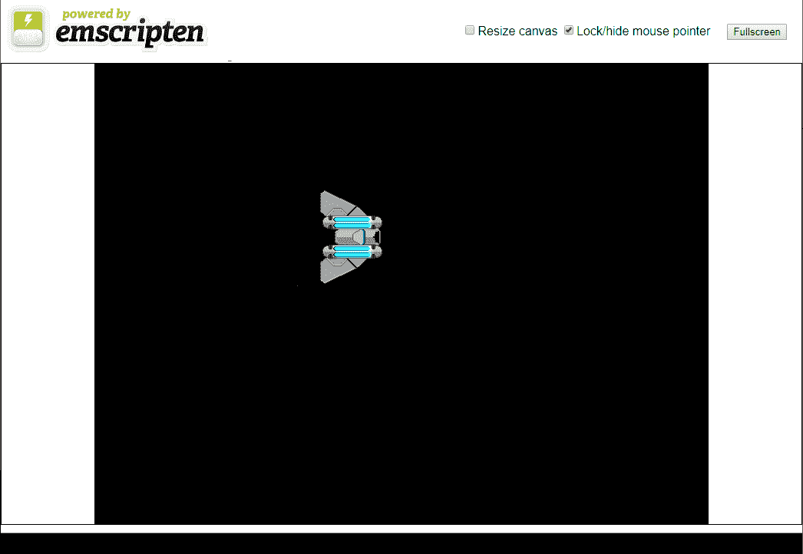
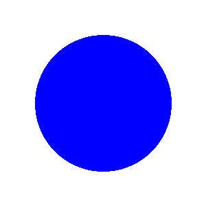
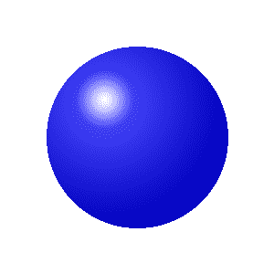
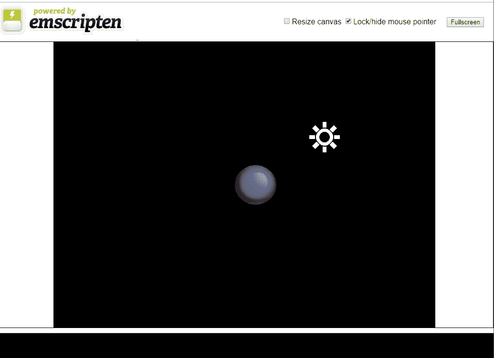

# 着色器和 2D 照明

我们已经在 [第 3 章](03.html)*中谈到了着色器，介绍了 WebGL* 。不幸的是，SDL 不允许用户定制它的着色器，除非深入库的源代码并在那里修改它们。这些修改超出了

这本书的范围。结合 OpenGL 使用 SDL 并不少见。SDL 可以用来渲染游戏的用户界面，而 OpenGL 渲染游戏对象。这一章将与前面的许多章节有所不同，因为我们不会在已经编写的游戏中直接混合 SDL 和 OpenGL。更新游戏以支持 OpenGL 2D 渲染引擎将需要对游戏进行彻底的重新设计。然而，我想为那些对创建更高级的 2D 渲染引擎感兴趣的人提供一章，让他们通过结合 OpenGL 和 SDL 并为该引擎编写着色器来涉猎。

You will need to include several images in your build to make this project work. Make sure that you include the `/Chapter15/sprites/` folder from this project's GitHub repository. If you haven't downloaded the GitHub project yet, you can get it online here: [https://github.com/PacktPublishing/Hands-On-Game-Development-with-WebAssembly](https://github.com/PacktPublishing/Hands-On-Game-Development-with-WebAssembly).

在本章中，我们将执行以下操作:

*   重新创建我们在[第 3 章](https://cdp.packtpub.com/hands_on_game_development_with_webassembly/wp-admin/post.php?post=38&action=edit#post_26)*中制作的应用程序，使用 SDL 和 OpenGL 的组合进行网络组装*
*   了解如何创建一个新的着色器，将多个纹理加载并渲染到一个四边形中
*   了解普通地图，以及如何在 2D 游戏对象上创建深度错觉
*   了解如何在 OpenGL 和网络组装中使用普通地图来近似 2D 的 Phong 照明模型

# 将 OpenGL 与网络组件结合使用

Emscripten 能够通过将这些调用分别映射到 WebGL 或 WebGL 2 调用来编译使用 OpenGL ES 2.0 或 OpenGL ES 3.0 的 C/C++ 代码。因此，Emscripten 只支持 OpenGL ES 命令的一个子集，该子集对应于您使用的 WebGL 库中可用的命令。例如，如果您想使用 OpenGL ES 3.0，您需要在编译时通过将`-s USE_WEBGL2=1`参数传递给 Emscripten 编译器来包含 WebGL 2。在本章中，我们将使用 OpenGL ES 2.0 结合 SDL 使用着色器渲染子画面，稍后我们将使用 SDL 渲染一个图标，该图标代表我们应用程序中光源的位置。SDL 提供了许多 OpenGL 没有的功能，比如音频库、图像加载库以及鼠标和键盘输入库。在许多方面，SDL 更适合渲染游戏的用户界面，因为它将对象渲染到屏幕坐标，而不是 OpenGL 剪辑空间。在幕后，SDL 的 WebAssembly 版本也在使用依赖于 WebGL 的 Emscripten OpenGL ES 实现。因此，更好地理解 WebAssembly 的 OpenGL 实现可以帮助我们将我们的游戏开发技能提升到一个新的水平，即使我们不会在我们为这本书开发的游戏中使用这些技能。

# 关于着色器的更多信息

我们在[第 2 章](02.html)、 *HTML5 和*中简单介绍了着色器的概念。着色器是现代三维图形渲染的关键部分。回到计算机和视频游戏的早期，图形都是 2D 的，图形渲染的速度取决于系统将像素从一个数据缓冲区移动到另一个数据缓冲区的速度。这个过程叫做*无忧无虑*。早期的一个重大进步是任天堂在其任天堂娱乐系统中增加了一个**图像处理单元** ( **PPU** )。这是一个早期的硬件，旨在通过移动像素来加速图形处理，而不使用游戏系统的中央处理器。阿米加准将也是这些早期 2D 图形协处理器的先驱，到 20 世纪 90 年代中期，用于传输的硬件成为计算机行业的标准。1996 年，像 Quake 这样的游戏开始创造消费者对 3D 图形处理的需求，早期的显卡开始提供具有固定功能流水线的 GPU。这允许应用程序加载几何数据，并在该几何上执行不可编程的纹理和照明功能。21 世纪初，英伟达推出了 GeForce 3。这是第一个支持可编程流水线的图形处理器。最终，这些可编程流水线图形处理器开始围绕*统一着色器模型*进行标准化，该模型允许程序员为所有支持着色语言的显卡编写 GLSL 等着色语言。

# GLSL ES 1.0 和 3.0

我们将用来编写着色器的语言是 GLSL 着色器语言的一个子集，称为 GLSL ES。这种着色器语言恰好可以与 WebGL 一起工作，因此被移植到 WebAssembly 的 OpenGL ES 版本所支持。我们正在编写的代码将在 GLSL ES 1.0 和 3.0 上运行，这是 WebAssembly 支持的 GLSL ES 的两个版本。

If you are wondering why there is no support for GLSL ES 2.0, it's because it doesn't exist. OpenGL ES 1.0 used a fixed function pipeline and so it had no shader language associated with it. When the Khronos Group created OpenGL ES 2.0, they created GLSL ES 1.0 as the shader language to go with it. When they released OpenGL ES 3.0, they decided that they wanted the version number of the shader language to be the same number as the API. Therefore, all the new versions of OpenGL ES will come with a version of GLSL that bears the same version number.

GLSL 是一种非常类似于 c 语言的语言。每个着色器都有一个`main`函数作为其入口点。GLSL ES 2.0 仅支持两种着色器类型:*顶点着色器*和*片段着色器*。这些着色器的执行是高度并行的。如果你习惯于单线程思维，你需要重新安排你的大脑。着色器经常同时处理数千个顶点和像素。

I briefly discussed the definition of a vertex and a fragment in [Chapter 3](03.html), *Introduction to WebGL*. A vertex is a point in space, and a collection of vertices define the geometry that our graphics card uses to render to the screen. A fragment is a pixel candidate. Multiple fragments usually go into determining the pixel output.

传递给顶点着色器的几何图形的每个顶点都由该着色器处理。然后使用*变量*将值传递给大量通过片段着色器处理单个像素的线程。片段着色器接收在多个顶点着色器的输出之间插值的值。片段着色器的输出是一个*片段*，它是一个候选像素。不是所有的碎片都会变成像素。有些片段被丢弃，这意味着它们根本不会渲染。其他片段混合在一起，形成完全不同的像素颜色。我们在[第 3 章](03.html)*中为我们的 WebGL 应用程序创建了一个顶点和一个片段着色器。让我们逐步将该应用程序转换为 OpenGL/WebAssembly 应用程序。一旦我们有了一个可用的应用程序，我们就可以进一步讨论着色器以及编写这些着色器以改进我们的 2D 网络组装游戏的新方法。*

# WebGL 应用程序 redux

现在，我们将使用 SDL 和 OpenGL，演示如何重写我们在[第三章](03.html)、*中制作的 WebGL 应用程序。如果你不记得了，这是一个非常简单的应用程序，它在我们的画布上画了一艘飞船，并向左移动了 2 个像素，每帧向上移动一个像素。我们制作这个应用程序的原因是，这是我认为在 WebGL 中可以做的最简单的事情，比画三角形更有趣。出于同样的原因，这将是我们使用 OpenGL 进行网络组装的第一件事。继续创建一个名为`webgl-redux.c`的新文件并打开它。现在，让我们开始添加一些代码。我们需要的第一个代码块是我们的`#include`命令，用于引入这个应用程序所需的所有库:*

```cpp
#include <SDL2/SDL.h>
#include <SDL2/SDL_image.h>
#include <SDL_opengl.h>
#include <GLES2/gl2.h>
#include <stdlib.h>
#include <emscripten.h>
```

第一行包括标准的 SDL2 库。第二个库`SDL_image.h`，是我们用来加载图像文件的库。这个文件的第三行包括`SDL_opengl.h`，是允许我们混合 SDL 和 OpenGL 调用的库。包括`GLES2/gl2.h`让我们可以访问所有的 OpenGL 命令，我们可以使用 OpenGL ES 2.0。像往常一样，我们包含`stdlib.h`让我们使用`printf`命令，`emscripten.h`为我们提供了使用 Emscripten 编译器编译到目标网络程序集所需的功能。

在我们的`#include`命令之后，我们有一系列的`#define`宏来定义我们的游戏需要的常量:

```cpp
#define CANVAS_WIDTH 800
#define CANVAS_HEIGHT 600
#define FLOAT32_BYTE_SIZE 4
#define STRIDE FLOAT32_BYTE_SIZE*4
```

前两个定义了我们的画布宽度和画布高度。剩余的`#define`调用用于设置我们在定义顶点缓冲区时将使用的值。在这些`#define`宏之后，我们为着色器定义代码。

# 着色器代码

下面我将要展示的几个代码块将定义我们创建 2D 照明效果所需的着色器。以下是顶点着色器代码:

```cpp
const GLchar* vertex_shader_code[] = {
    "precision mediump float; \n"
    "attribute vec4 a_position; \n"
    "attribute vec2 a_texcoord; \n"

    "uniform vec4 u_translate; \n"

    "varying vec2 v_texcoord; \n"

    "void main() { \n"
        "gl_Position = u_translate + a_position; \n"
        "v_texcoord = a_texcoord; \n"
    "} \n"
};
```

这是我们在创建这个应用程序的 WebGL 版本时使用的同一着色器代码。在 C 语言中看起来有些不同，因为 JavaScript 可以使用多行字符串，这使得代码的阅读更加清晰。像在 WebGL 版本中一样，我们使用精度调用将浮点精度设置为中等。我们设置属性来接收位置和紫外线纹理坐标数据作为向量。我们将使用顶点缓冲对象来传递这些向量。我们定义了一个统一的翻译变量，该变量将与所有顶点使用的值相同，这通常不是我们在游戏中使用的方式，但对于这个应用程序来说会很好。最后，我们定义一个可变的`v_texcoord`变量。这个变量将代表我们从顶点着色器传递到片段着色器的纹理坐标值。这个顶点着色器中的`main()`函数非常简单。它将传递到顶点着色器的`u_translate`统一变量平移值添加到通过`a_position`传递的顶点的属性位置，以获得我们使用`gl_Position`变量设置的最终顶点位置。之后，我们通过将`v_texcoord`变量设置为`a_texcoord`将顶点的纹理坐标传递给片段着色器。

定义顶点着色器后，我们创建定义片段着色器的字符串。片段着色器接收`v_texcoord`的插值版本，这是从顶点着色器传递出来的可变变量。你需要戴上你的并行处理帽子一会儿来理解这是如何工作的。当 GPU 处理我们的顶点着色器和片段着色器时，它不是一次处理一个，而是可能一次处理数千个顶点和片段。片段着色器也不是从这些线程中的单个线程接收输出，而是从当前正在处理的多个顶点混合的值。

例如，如果您的顶点着色器有一个名为 X 的可变变量作为输出，并且您的片段位于 X 为 0 的顶点和 X 为 10 的顶点之间，那么进入片段的可变变量中的值将是 5。这是因为 5 位于 0 和 10 这两个顶点值的中间。同样，如果片段位于两点之间的 30%，X 中的值将是 3。

以下是片段着色器代码的定义:

```cpp
const GLchar* fragment_shader_code[] = {
    "precision mediump float; \n"
    "varying vec2 v_texcoord; \n"

    "uniform sampler2D u_texture; \n"

    "void main() { \n"
        "gl_FragColor = texture2D(u_texture, v_texcoord); \n"
    "} \n"
 };
```

与顶点材质球一样，我们从设置精度开始。之后，我们有一个变化的变量，这是一个插值为我们的纹理坐标。该值存储在`v_texcoord`中，并将用于将我们的纹理映射到像素颜色。最后一个变量是类型为`sampler2D`的均匀变量。这是一块内存，我们已经加载了我们的纹理。这个片段明暗器的主要功能唯一做的就是使用内置的`texture2D`函数，使用我们传递到片段明暗器的纹理坐标从我们的纹理中抓取一个像素颜色。

# OpenGL 全局变量

在定义我们的着色器之后，我们需要在 C 中定义几个变量，我们将使用这些变量与它们进行交互:

```cpp
GLuint program = 0;
GLuint texture;

GLint a_texcoord_location = -1;
GLint a_position_location = -1;

GLint u_texture_location = -1;
GLint u_translate_location = -1;

GLuint vertex_texture_buffer;
```

OpenGL 使用引用变量与 GPU 进行交互。这些变量中的前两个属于`GLuint`类型。A `GLuint`是无符号整数，使用`GLuint`类型只是一个 OpenGL 类型。看到`GLuint`而不是`unsigned int`是给阅读你代码的人一个暗示，你正在使用这个变量与 OpenGL 交互的好方法。程序变量最终将保存对由着色器定义的程序的引用，纹理变量将保存对已加载到图形处理器中的纹理的引用。在引用程序和纹理之后，我们有两个变量将用于引用着色器程序属性。`a_texcoord_location`变量将引用`a_texcoord`着色器属性，`a_position_location`变量将引用`a_position`着色器属性值。属性引用后面是两个统一的变量引用。如果您想知道统一变量和属性变量之间的区别，统一变量对所有顶点都保持相同的值，而属性变量是特定于顶点的。最后，我们在`vertex_texture_buffer`变量中引用了我们的顶点纹理缓冲区。

在我们定义了这些价值之后，我们需要定义我们的四元。你可能还记得，我们的四边形是由六个顶点组成的。这是因为它是由两个三角形组成的。我在[第三章](03.html)、*WebGL 简介*中谈到了为什么要这样设置顶点数据。如果你觉得这令人困惑，你可能想回到那一章做一点回顾。以下是`vertex_texture_data`数组的定义:

```cpp
float vertex_texture_data[] = {
    // x,   y,        u,   v
    0.167,  0.213,    1.0, 1.0,
   -0.167,  0.213,    0.0, 1.0,
    0.167, -0.213,    1.0, 0.0,
   -0.167, -0.213,    0.0, 0.0,
   -0.167,  0.213,    0.0, 1.0,
    0.167, -0.213,    1.0, 0.0
};
```

# SDL 全局变量

我们仍将使用 SDL 来初始化我们的画布，以便进行 OpenGL 渲染。我们还将使用 SDL 从虚拟文件系统加载我们的图像数据。因此，我们需要定义以下与 SDL 相关的全局变量:

```cpp
SDL_Window *window;
SDL_Renderer *renderer;
SDL_Texture* sprite_texture;
SDL_Surface* sprite_surface;
```

之后，当我们使用 SDL 加载图像时，我们需要变量来保存我们的精灵宽度和高度值:

```cpp
int sprite_width;
int sprite_height;
```

当我们将船绘制到画布上时，我们将需要该船的`x`和`y`坐标，因此我们将创建一些全局变量来保存这些值:

```cpp
float ship_x = 0.0;
float ship_y = 0.0;
```

最后，我们将为我们的游戏循环创建一个函数原型。我想在定义我们的主要功能后定义我们的游戏循环，因为我想先完成我们的初始化。这是我们游戏循环的函数原型:

```cpp
void game_loop();
```

# 主要功能

现在，我们来到了我们的`main`功能。我们需要做大量的初始化工作。我们不仅初始化了 SDL，就像我们创建游戏时做的那样。我们还需要为 OpenGL 做几个初始化步骤。以下是`main`功能的全部内容:

```cpp
int main() {
 SDL_Init( SDL_INIT_VIDEO );
 SDL_CreateWindowAndRenderer( CANVAS_WIDTH, CANVAS_HEIGHT, 0, &window, &renderer );
    SDL_SetRenderDrawColor( renderer, 0, 0, 0, 255 );
    SDL_RenderClear( renderer );
    GLuint vertex_shader = glCreateShader(GL_VERTEX_SHADER);
    glShaderSource( vertex_shader,1,vertex_shader_code,0);
    glCompileShader(vertex_shader);
    GLint compile_success = 0;
    glGetShaderiv(vertex_shader, GL_COMPILE_STATUS, &compile_success);
    if(compile_success == GL_FALSE)
    {
        printf("failed to compile vertex shader\n");
        glDeleteShader(vertex_shader);
        return 0;
    }
    GLuint fragment_shader = glCreateShader(GL_FRAGMENT_SHADER);
    glShaderSource( fragment_shader,1,fragment_shader_code,0);
    glCompileShader(fragment_shader);
    glGetShaderiv(fragment_shader, GL_COMPILE_STATUS,&compile_success);
    if(compile_success == GL_FALSE)
    {
        printf("failed to compile fragment shader\n");
        glDeleteShader(fragment_shader);
        return 0;
    }
    program = glCreateProgram();
    glAttachShader( program,vertex_shader);
    glAttachShader( program,fragment_shader);
    glLinkProgram(program);
    GLint link_success = 0;
    glGetProgramiv(program, GL_LINK_STATUS, &link_success);
    if (link_success == GL_FALSE)
    {
        printf("failed to link program\n");
        glDeleteProgram(program);
        return 0;
    }
    glUseProgram(program);
    u_texture_location = glGetUniformLocation(program, "u_texture");
    u_translate_location = glGetUniformLocation(program,"u_translate");
    a_position_location = glGetAttribLocation(program, "a_position");
    a_texcoord_location = glGetAttribLocation(program, "a_texcoord");
    glGenBuffers(1, &vertex_texture_buffer);
    glBindBuffer( GL_ARRAY_BUFFER, vertex_texture_buffer );
    glBufferData(GL_ARRAY_BUFFER, 
    sizeof(vertex_texture_data),vertex_texture_data, GL_STATIC_DRAW);
    sprite_surface = IMG_Load( "/sprites/spaceship.png" );
    if( !sprite_surface ) {
        printf("failed to load image: %s\n", IMG_GetError() );
        return 0;
    }
    sprite_texture = SDL_CreateTextureFromSurface( renderer, 
    sprite_surface );
    if( !sprite_texture ) {
        printf("failed to create texture: %s\n", IMG_GetError() );
        return 0;
    }
    SDL_QueryTexture( sprite_texture,NULL, NULL,&sprite_width, &sprite_height );
    glTexImage2D( GL_TEXTURE_2D,0,GL_RGBA,sprite_width,sprite_height,
                  0,GL_RGBA,GL_UNSIGNED_BYTE,sprite_surface );
    SDL_FreeSurface( sprite_surface );
    glBlendFunc(GL_SRC_ALPHA, GL_ONE_MINUS_SRC_ALPHA);
    glEnable(GL_BLEND);
    glEnableVertexAttribArray(a_position_location);
    glEnableVertexAttribArray(a_texcoord_location);
    glVertexAttribPointer(a_position_location,2,GL_FLOAT,GL_FALSE,4 * 
    sizeof(float),(void*)0 );
    glVertexAttribPointer(a_texcoord_location,2,GL_FLOAT,GL_FALSE,
                          4 * sizeof(float),(void*)(2 * sizeof(float)));
    emscripten_set_main_loop(game_loop, 0, 0);
}
```

让我把它分成一些更容易消化的部分。我们在`main`函数中需要做的第一件事是标准的 SDL 初始化。我们需要初始化视频模块，创建一个渲染器，并设置绘制和清晰的颜色。到目前为止，您应该对这段代码非常熟悉:

```cpp
SDL_Init( SDL_INIT_VIDEO );
SDL_CreateWindowAndRenderer( CANVAS_WIDTH, CANVAS_HEIGHT, 0, &window, &renderer );
SDL_SetRenderDrawColor( renderer, 0, 0, 0, 255 );
SDL_RenderClear( renderer );
```

接下来，我们需要创建和编译我们的顶点着色器。这需要几个步骤。我们需要创建我们的着色器，将源代码加载到着色器中，编译着色器，然后检查以确保编译时没有任何错误。基本上，这些步骤会获取您的代码，编译它，然后将编译后的代码加载到视频卡中以供以后执行。以下是编译顶点着色器所需执行的所有步骤:

```cpp
GLuint vertex_shader = glCreateShader(GL_VERTEX_SHADER);
glShaderSource( vertex_shader,
                1,
                vertex_shader_code,
                0);

glCompileShader(vertex_shader);

GLint compile_success = 0;1
glGetShaderiv(vertex_shader, GL_COMPILE_STATUS, &compile_success);
if(compile_success == GL_FALSE)
{
    printf("failed to compile vertex shader\n");
    glDeleteShader(vertex_shader);
    return 0;
}
```

在编译顶点着色器之后，我们需要编译片段着色器。这是同样的过程。我们首先调用`glCreateShader`来创建一个片段着色器。然后我们使用`glShaderSource`加载我们的片段着色器源代码。之后，我们调用`glCompileShader`来编译我们的片段着色器。最后，我们调用`glGetShaderiv`来查看当我们试图编译我们的片段着色器时是否发生了编译器错误:

```cpp
GLuint fragment_shader = glCreateShader(GL_FRAGMENT_SHADER);
glShaderSource( fragment_shader,
                1,
                fragment_shader_code,
                0);

glCompileShader(fragment_shader);
glGetShaderiv(fragment_shader, GL_COMPILE_STATUS, &compile_success);

if(compile_success == GL_FALSE)
{
    printf("failed to compile fragment shader\n");
    glDeleteShader(fragment_shader);
    return 0;
}
```

为了简单起见，我对着色器何时无法编译的错误消息保持模糊。它只告诉你哪个着色器编译失败。在本章的后面，我将向您展示如何从着色器编译器获得更详细的错误消息。

现在我们已经编译了我们的着色器，我们需要将我们的着色器链接到一个程序中，然后告诉 OpenGL 这是我们想要使用的程序。如果你正在使用 OpenGL 编写一个游戏，很有可能你会使用不止一个程序。例如，您可能希望在游戏中的某些对象上有灯光效果，而不是其他对象。一些游戏对象可能需要旋转和缩放，而另一些可能不需要。

As you will learn in the next chapter, using multiple programs with WebGL has a significantly higher CPU hit than it does in a native OpenGL app. This has to do with the web browser's security checks.

对于这个应用程序，我们将使用一个单独的程序，我们将使用以下代码来附加我们的着色器并将它们链接到程序:

```cpp
program = glCreateProgram();
glAttachShader( program,
                vertex_shader);

glAttachShader( program,
                fragment_shader);

glLinkProgram(program);

GLint link_success = 0;

glGetProgramiv(program, GL_LINK_STATUS, &link_success);

if (link_success == GL_FALSE)
{
    printf("failed to link program\n");
    glDeleteProgram(program);
    return 0;
}
glUseProgram(program);
```

`glCreateProgram`函数创建一个新程序，并为其返回一个引用标识。我们将在程序变量中存储引用标识。我们对`glAttachShader`进行两次调用，将我们的顶点和片段着色器附加到我们刚刚创建的程序中。然后我们调用`glLinkProgram`将程序着色器链接在一起。我们调用`glGetProgramiv`验证程序链接成功。最后，我们打电话给`glUseProgram`告诉 OpenGL，这是我们想要使用的程序。

现在我们正在使用一个特定的程序，我们可以用下面几行代码检索对该程序内部的属性和统一变量的引用:

```cpp
u_texture_location = glGetUniformLocation(program, "u_texture");
u_translate_location = glGetUniformLocation(program, "u_translate");

a_position_location = glGetAttribLocation(program, "a_position");
a_texcoord_location = glGetAttribLocation(program, "a_texcoord");
```

第一行检索对`u_texture`统一变量的引用，第二行检索对`u_translate`统一变量的引用。我们可以稍后使用这些引用在着色器内部设置这些值。其后的两行用于检索对着色器内部的`a_position`位置属性和`a_texcoord`纹理坐标属性的引用。像统一变量一样，我们稍后将使用这些引用来设置着色器中的值。

现在，我们需要创建数据并将其加载到顶点缓冲区中。顶点缓冲区保存我们将要渲染的每个顶点的所有属性数据。如果我们要渲染一个三维模型，我们需要加载我们从外部获取的模型数据。幸运的是，我们只需要渲染一些二维四边形。四边形非常简单，我们可以在前面的数组中定义它们。

在我们将数据加载到缓冲区之前，我们需要通过调用`glGenBuffers`来生成该缓冲区。然后我们需要*使用`glBindBuffer`绑定*缓冲区。绑定一个缓冲区只是你告诉 OpenGL 你当前正在处理的缓冲区的方式。下面是生成并绑定顶点缓冲区的代码:

```cpp
glGenBuffers(1, &vertex_texture_buffer);
glBindBuffer( GL_ARRAY_BUFFER, vertex_texture_buffer );
```

现在我们已经选择了一个缓冲区，我们可以通过调用`glBufferData`将数据放入该缓冲区。我们将传入前面定义的`vertex_texture_data`。它定义了四边形顶点的`x`和`y`坐标以及这些顶点的紫外线映射数据:

```cpp
glBufferData(GL_ARRAY_BUFFER, sizeof(vertex_texture_data),
                vertex_texture_data, GL_STATIC_DRAW);
```

在缓冲我们的数据后，我们将使用 SDL 加载一个精灵表面。然后，我们将从那个表面创建一个纹理，我们可以用它来找到我们刚刚加载的图像的宽度和高度。之后，我们调用`glTexImage2D`从 SDL 表面创建一个 OpenGL 纹理。下面是代码:

```cpp
sprite_surface = IMG_Load( "/sprites/spaceship.png" );

if( !sprite_surface ) {
    printf("failed to load image: %s\n", IMG_GetError() );
    return 0;
}

sprite_texture = SDL_CreateTextureFromSurface( renderer, sprite_surface );

if( !sprite_texture ) {
    printf("failed to create texture: %s\n", IMG_GetError() );
    return 0;
}

SDL_QueryTexture( sprite_texture,
                    NULL, NULL,
                    &sprite_width, &sprite_height );

glTexImage2D( GL_TEXTURE_2D,
                0,
                GL_RGBA,
                sprite_width,
                sprite_height,
                0,
                GL_RGBA,
                GL_UNSIGNED_BYTE,
                sprite_surface );

SDL_FreeSurface( sprite_surface );
```

前面的大部分代码看起来应该很熟悉。我们已经使用`IMG_Load`从虚拟文件系统加载 SDL 曲面有一段时间了。然后我们使用`SDL_CreateTextureFromSurface`来创建一个 SDL 纹理。一旦我们有了纹理，我们就使用`SDL_QueryTexture`来计算图像的宽度和高度，并将这些值存储在`sprite_width`和`sprite_height`中。下一个函数调用是新的。`GlTexImage2D`功能用于创建新的 OpenGL 纹理图像。我们传入`sprite_surface`作为我们的图像数据，我们之前已经加载了几行。最后一行使用`SDL_FreeSurface`释放曲面。

然后，我们在游戏中添加了两条启用 alpha 混合的线:

```cpp
glBlendFunc(GL_SRC_ALPHA, GL_ONE_MINUS_SRC_ALPHA);
glEnable(GL_BLEND);
```

启用 alpha 混合后，我们有几条线在着色器中设置属性:

```cpp
glEnableVertexAttribArray(a_position_location);
glEnableVertexAttribArray(a_texcoord_location);

glVertexAttribPointer(
        a_position_location,     // set up the a_position attribute
        2,                       // how many attributes in the position
        GL_FLOAT,                // data type of float
        GL_FALSE,                // the data is not normalized
        4 * sizeof(float),       // stride (how many array items until 
                                 //the next position)
        (void*)0                 // starting point for attribute
);

glVertexAttribPointer(
        a_texcoord_location,         // set up the a_texcoord attribute
        2,                           // how many attributes in the 
                                     //texture coordinates
        GL_FLOAT,                    // data type of float
        GL_FALSE,                    // the data is not normalized
        4 * sizeof(float),           // stride (how many array items 
                                     //until the next position)
        (void*)(2 * sizeof(float))   // starting point for attribute
);
```

前两行在我们的着色器中启用`a_position`和`a_texcoord`属性。之后，我们有两个电话打给`glVertexAttribPointer`。对`glVertexAttribPointer`的调用用于告诉我们的着色器，分配给每个特定属性的数据位于我们的顶点缓冲区中的什么位置。我们用 32 位浮点变量填充了顶点缓冲区。对`glVertexAttribPointer`的第一次调用使用我们在`a_position_location`中创建的参考变量来设置分配给`a_position`属性的值的位置。然后，我们传入用于该属性的值的数量。在位置的情况下，我们传入一个`x`和一个`y`坐标，所以这个值是 2。我们传入缓冲区数组的数据类型，这是一种浮点数据类型。我们告诉函数，我们没有标准化数据。`stride`值是倒数第二个参数。这是此缓冲区中用于顶点的字节数。因为缓冲区中的每个顶点都使用四个浮点值，所以我们传入`4 * sizeof( float )`来计算步幅。最后，我们传入的最后一个值是我们用来填充该属性的数据的偏移量(以字节为单位)。对于`a_position`属性，该值为`0`，因为位置在开头。对于`a_texcoord`属性，该值为`2 * sizeof(float)`，因为我们在`a_texcoord`数据之前有两个用于`a_position`的浮点值。

`main`功能中的最后一行设置游戏循环回调:

```cpp
emscripten_set_main_loop(game_loop, 0, 0);
```

# 游戏循环

我们的游戏循环非常简单。在我们的游戏循环中，我们将使用 OpenGL 来清除画布，移动我们的船，并将我们的船渲染到画布上。下面是代码:

```cpp
void game_loop() {
    glClearColor( 0, 0, 0, 1 );
    glClear( GL_COLOR_BUFFER_BIT|GL_DEPTH_BUFFER_BIT );

    ship_x += 0.002;
    ship_y += 0.001;

    if( ship_x >= 1.16 ) {
        ship_x = -1.16;
    }

    if( ship_y >= 1.21 ) {
        ship_y = -1.21;
    }

    glUniform4f(u_translate_location,
                ship_x, ship_y, 0, 0 );

    glDrawArrays(GL_TRIANGLES, 0, 6);
}
```

游戏循环的前两行清空画布:

```cpp
glClearColor( 0, 0, 0, 1 );
glClear( GL_COLOR_BUFFER_BIT|GL_DEPTH_BUFFER_BIT );
```

之后，我们有几条线更新飞船的`x`和`y`坐标，然后在着色器中设置新坐标:

```cpp
ship_x += 0.002;
ship_y += 0.001;

if( ship_x >= 1.16 ) {
    ship_x = -1.16;
}

if( ship_y >= 1.21 ) {
    ship_y = -1.21;
}

glUniform4f(u_translate_location,
            ship_x, ship_y, 0, 0 );
```

最后，游戏循环使用`glDrawArrays`将我们的飞船画到画布上:

```cpp
glDrawArrays(GL_TRIANGLES, 0, 6);
```

# 编译和运行我们的代码

您将希望从 GitHub 项目中下载 sprites 文件夹，以便包含我们编译和运行该项目所需的图像文件。一旦你有了这些图像，并把我们刚刚写的代码保存到`webgl-redux.c`文件中，我们就可以编译和测试这个新的应用程序了。如果成功了，应该就像[第三章](03.html)、*WebGL 简介*，WebGL 版本。运行以下`emcc`命令编译应用程序:

```cpp
emcc webgl-redux.c -o redux.html --preload-file sprites -s USE_WEBGL2=1 -s USE_SDL=2 -s USE_SDL_IMAGE=2 -s SDL2_IMAGE_FORMATS=["png"]
```

如果应用程序运行成功，你应该有一个飞船，从左向右移动，并在 HTML 画布上。以下是该应用程序工作版本的截图:


Figure 15.1: Screenshot of the OpenGL and SDL app

在下一节中，我们将学习如何在着色器中混合纹理。

# 混合纹理以获得发光效果

现在，我们将花一些时间学习如何将多个纹理加载到我们的程序中。我们将添加这两种纹理的颜色来创建脉冲发光效果。为此，我们需要修改我们的片段着色器，以接收第二个纹理和时间一致的变量。我们将把这个变量转换成正弦波函数，用它来计算发光引擎的强度。我们将需要添加一些代码来跟踪已经过去的时间，以及一些新的初始化代码来加载第二个纹理。我们可以从将`webgl-redux.c`复制到一个名为`glow.c`的新文件开始。现在我们有了新的`glow.c`文件，我们可以浏览我们需要的改变，使我们的发光引擎效果。第一个代码变化是增加了一个新的`#define`宏来定义`2π`的值。

我们将使用一个从`0`循环到`2π`的值，并将其输入正弦波函数，以在我们的发动机辉光上产生脉冲效果。这里是我们应该在我们的`glow.c`文件的开头附近添加的`#define`:

```cpp
#define TWOPI 6.2831853 // 2π
```

# 片段着色器更改

在新的宏之后，我们需要对片段着色器代码进行一些更改。我们的顶点着色器代码将保持不变，因为确定我们顶点位置的过程不会与应用程序的上一版本有任何不同。以下是片段着色器的更新版本:

```cpp
const GLchar* fragment_shader_code[] = {
    "precision mediump float; \n"
    "varying vec2 v_texcoord; \n"

    "uniform float u_time; \n"
    "uniform sampler2D u_texture; \n"
    "uniform sampler2D u_glow; \n"

    "void main() { \n"
        "float cycle = (sin(u_time) + 1.0) / 2.0; \n"
        "vec4 tex = texture2D(u_texture, v_texcoord); \n"
        "vec4 glow = texture2D(u_glow, v_texcoord); \n"
        "glow.rgb *= glow.aaa; \n"
        "glow *= cycle; \n"
        "gl_FragColor = tex + glow; \n"
    "} \n"
};
```

我们添加了一个新的统一变量`u_time`，它将用于传递一个基于时间的变量，该变量将在`0`和`2π`之间循环。我们还增加了第二个`sampler2D`统一变量`u_glow`，它将保存我们新的发光纹理。我们的`main`函数的第一行根据`u_time`中的值计算`0.0`和`1.0`之间的值。我们使用内置的`texture2D`功能从`u_texture`和`u_glow`中检索采样值。这次，我们将这两个值保存到名为`tex`和`glow`的`vec4`变量中，而不是将纹理中的一个值直接存储到`gl_FragColor`中。我们将把这两个值加在一起，所以为了防止任何地方都变得太亮，我们将`glow`样本颜色中的`rgb`(红色、绿色和蓝色)值乘以 alpha 通道。之后，我们将`glow`颜色中的所有值乘以之前计算的`cycle`值。

`cycle`中的值将遵循在值`0.0`和`1.0`之间振荡的正弦波。这将导致我们的`glow`值随时间上下循环。然后，我们通过将`tex`颜色添加到`glow`颜色来计算片段颜色。然后，我们将输出值存储在`gl_FragColor`中。

# OpenGL 全局变量更改

接下来，我们需要更新与 OpenGL 相关的变量，这样我们就可以添加三个新的全局变量。我们将需要一个名为`glow_tex`的新变量，我们将使用它来存储对发光纹理的引用。我们还需要两个新的参考变量，用于着色器中的两个新的统一变量，称为`u_time_location`和`u_glow_location`。一旦我们添加了这三个新行，新的 OpenGL 变量块将会是什么样子:

```cpp
GLuint program = 0;
GLuint texture;
GLuint glow_tex;

GLint a_texcoord_location = -1;
GLint a_position_location = -1;
GLint u_texture_location = -1;
GLint u_glow_location = -1;
GLint u_time_location = -1;

GLint u_translate_location = -1;
GLuint vertex_texture_buffer;
```

# 其他全局变量变化

在我们的 OpenGL 全局变量之后，我们将需要添加一个新的与时间相关的全局变量块。我们需要他们让我们的着色器循环通过引擎发光的值。这些与时间相关的变量看起来应该很熟悉。我们已经使用了与我们正在开发的游戏中将要使用的技术相似的技术。以下是这些全局时间变量:

```cpp
float time_cycle = 0;
float delta_time = 0.0;
int diff_time = 0;

Uint32 last_time;
Uint32 last_frame_time;
Uint32 current_time;
```

我们需要再添加一个与 SDL 相关的全局表面变量，我们将使用它来加载我们的发光纹理。在`main`函数之前的全局变量块附近添加以下行:

```cpp
SDL_Surface* glow_surface;
```

# 对 main()的更改

我们将对我们在`main`函数中进行的初始化进行一些重大修改。让我首先向您展示整个功能。然后，我们将逐一介绍所有的变化:

```cpp
int main() {
    last_frame_time = last_time = SDL_GetTicks();

    SDL_Init( SDL_INIT_VIDEO );

    SDL_CreateWindowAndRenderer( CANVAS_WIDTH, CANVAS_HEIGHT, 0, 
    &window, &renderer );

    SDL_SetRenderDrawColor( renderer, 0, 0, 0, 255 );
    SDL_RenderClear( renderer );

    GLuint vertex_shader = glCreateShader(GL_VERTEX_SHADER);

    glShaderSource( vertex_shader,
                    1,
                    vertex_shader_code,
                    0);

    glCompileShader(vertex_shader);

    GLint compile_success = 0;
    glGetShaderiv(vertex_shader, GL_COMPILE_STATUS, &compile_success);

    if(compile_success == GL_FALSE)
    {
        printf("failed to compile vertex shader\n");
        glDeleteShader(vertex_shader);
        return 0;
    }

    GLuint fragment_shader = glCreateShader(GL_FRAGMENT_SHADER);

    glShaderSource( fragment_shader,
                    1,
                    fragment_shader_code,
                    0);

    glCompileShader(fragment_shader);
    glGetShaderiv(fragment_shader, GL_COMPILE_STATUS, 
    &compile_success);

    if(compile_success == GL_FALSE)
    {
        printf("failed to compile fragment shader\n");
        glDeleteShader(fragment_shader);
        return 0;
    }

    program = glCreateProgram();
    glAttachShader( program,
                    vertex_shader);

    glAttachShader( program,
                    fragment_shader);

    glLinkProgram(program);

    GLint link_success = 0;

    glGetProgramiv(program, GL_LINK_STATUS, &link_success);

    if (link_success == GL_FALSE)
    {
        printf("failed to link program\n");
        glDeleteProgram(program);
        return 0;
    }

    glUseProgram(program);

    u_glow_location = glGetUniformLocation(program, "u_glow");
    u_time_location = glGetUniformLocation(program, "u_time");

    u_texture_location = glGetUniformLocation(program, "u_texture");
    u_translate_location = glGetUniformLocation(program, 
    "u_translate");

    a_position_location = glGetAttribLocation(program, "a_position");
    a_texcoord_location = glGetAttribLocation(program, "a_texcoord");

    glGenBuffers(1, &vertex_texture_buffer);

glBindBuffer( GL_ARRAY_BUFFER, vertex_texture_buffer );
 glBufferData(GL_ARRAY_BUFFER, sizeof(vertex_texture_data),
 vertex_texture_data, GL_STATIC_DRAW);

sprite_surface = IMG_Load( "/sprites/spaceship.png" );

    if( !sprite_surface ) {
        printf("failed to load image: %s\n", IMG_GetError() );
        return 0;
    }

    sprite_texture = SDL_CreateTextureFromSurface( renderer, 
    sprite_surface );

    if( !sprite_texture ) {
        printf("failed to create texture: %s\n", IMG_GetError() );
        return 0;
    }

    SDL_QueryTexture( sprite_texture,
                        NULL, NULL,
                        &sprite_width, &sprite_height );

    glTexImage2D( GL_TEXTURE_2D,
                    0,
                    GL_RGBA,
                    sprite_width,
                    sprite_height,
                    0,
                    GL_RGBA,
                    GL_UNSIGNED_BYTE,
                    sprite_surface );

    SDL_FreeSurface( sprite_surface );

    glGenTextures( 1,
                    &glow_tex);

    glActiveTexture(GL_TEXTURE1);
    glEnable(GL_TEXTURE_2D);
    glBindTexture(GL_TEXTURE_2D, glow_tex);

    glow_surface = IMG_Load( "/sprites/glow.png" );

    if( !glow_surface ) {
        printf("failed to load image: %s\n", IMG_GetError() );
        return 0;
    }

    glTexImage2D( GL_TEXTURE_2D,
                    0,
                    GL_RGBA,
                    sprite_width,
                    sprite_height,
                    0,
                    GL_RGBA,
                    GL_UNSIGNED_BYTE,
                    glow_surface );

    glGenerateMipmap(GL_TEXTURE_2D);

    SDL_FreeSurface( glow_surface );

    glUniform1i(u_texture_location, 0);
    glUniform1i(u_glow_location, 1);

    glBlendFunc(GL_SRC_ALPHA, GL_ONE_MINUS_SRC_ALPHA);
    glEnable(GL_BLEND);

    glEnableVertexAttribArray(a_position_location);
    glEnableVertexAttribArray(a_texcoord_location);

    glVertexAttribPointer(
        a_position_location,     // set up the a_position attribute
        2,                       // how many attributes in the position
        GL_FLOAT,                // data type of float
        GL_FALSE,                // the data is not normalized
        4 * sizeof(float),       // stride (how many array items until 
                                 //the next position)
        (void*)0                 // starting point for attribute
    );

    glVertexAttribPointer(
        a_texcoord_location,       // set up the a_texcoord attribute
        2,                         // how many attributes in the 
                                   //texture coordinates
        GL_FLOAT,                  // data type of float
        GL_FALSE,                  // the data is not normalized
        4 * sizeof(float),         // stride (how many array items 
                                   //until the next position)
        (void*)(2 * sizeof(float)) // starting point for attribute
    );

    emscripten_set_main_loop(game_loop, 0, 0);
}
```

我们`main`功能的第一行是新的。我们使用该行将`last_frame_time`和`last_time`设置为系统时间，我们使用`SDL_GetTicks()`检索系统时间:

```cpp
last_frame_time = last_time = SDL_GetTicks();
```

在那之后，我们将不会做任何改变，直到我们到达我们检索我们的统一位置的代码部分。我们将需要从我们的程序中检索两个更统一的位置，因此在我们调用`glUseProgram`的情况下，我们应该进行以下调用来获取`u_glow`和`u_time`的统一位置:

```cpp
u_glow_location = glGetUniformLocation(program, "u_glow");
u_time_location = glGetUniformLocation(program, "u_time");
```

在我们调用`SDL_FreeSurface`来释放`sprite_surface`变量之后，必须有以下代码块。该代码块将生成一个新的纹理，激活它，绑定它，并将`glow.png`图像加载到该纹理中。然后，它将释放 SDL 表面，并为我们的纹理生成 mipmaps。最后，我们使用`glUniform1i`设置纹理的统一位置。下面是我们用来加载新纹理的代码:

```cpp
glGenTextures( 1,
                &glow_tex);

glActiveTexture(GL_TEXTURE1);
glEnable(GL_TEXTURE_2D);
glBindTexture(GL_TEXTURE_2D, glow_tex);

glow_surface = IMG_Load( "/sprites/glow.png" );

if( !glow_surface ) {
    printf("failed to load image: %s\n", IMG_GetError() );
    return 0;
}

glTexImage2D( GL_TEXTURE_2D,
                0,
                GL_RGBA,
                sprite_width,
                sprite_height,
                0,
                GL_RGBA,
                GL_UNSIGNED_BYTE,
                glow_surface );

SDL_FreeSurface( glow_surface );

glGenerateMipmap(GL_TEXTURE_2D);

glUniform1i(u_texture_location, 0);
glUniform1i(u_glow_location, 1);
```

If you are not familiar with Mipmaps, you may be wondering what the `glGenerateMipmap(GL_TEXTURE_2D);` line does. When you scale textures using OpenGL, those textures take time to generate. Mipmaps are a way to speed up scaling by performing some power of two scaled versions of your images while the game is initializing. This will reduce the amount of time it will take to scale these images at runtime.

# 更新 game_loop()

为了在我们飞船的引擎上循环发光效果，我们需要在我们的游戏循环中添加一些代码，从`0.0`循环到`2π`。然后我们将这个值作为`u_time`统一变量传递到着色器中。我们需要在游戏循环函数的开头添加这段新代码:

```cpp
current_time = SDL_GetTicks();

diff_time = current_time - last_time;

delta_time = diff_time / 1000.0;
last_time = current_time;

time_cycle += delta_time * 4;

if( time_cycle >= TWOPI ) {
    time_cycle -= TWOPI;
}

glUniform1f( u_time_location, time_cycle );
```

第一行使用`SDL_GetTicks()`检索当前时钟时间。然后我们从当前时间中减去最后一次，得到`diff_time`变量的值。这将告诉我们此帧与生成的前一帧之间的毫秒数。之后，我们计算`delta_time`，这将是这一帧和前一帧之间一秒的分数。计算完`diff_time`和`delta_time`后，我们将`last_time`变量设置为`current_time`。

我们这样做是为了下一次我们通过游戏循环时，我们会有这个帧运行的时间。所有这些行都在我们代码的先前迭代中。现在，让我们为`time_cycle`获取一个值，我们将它传递到片段着色器中的`u_time`统一变量中。首先，用以下行将`delta-time * 4`添加到时间周期中:

```cpp
time_cycle += delta_time * 4;
```

你可能想知道为什么我要乘以`4`。最初，我没有添加倍数，这意味着发动机发光大约每 6 秒钟循环一次。这感觉好像周期太长了。玩这个数字，4 的倍数对我来说刚刚好，但是如果你希望你的引擎循环更快或更慢，你没有理由坚持这个特定的倍数。

因为我们使用正弦函数来循环我们的发光级别，所以我们需要确保当我们的时间循环达到`TWOPI`时，我们从`time_cycle`变量中减去`TWOPI`:

```cpp
if( time_cycle >= TWOPI ) {
    time_cycle -= TWOPI;
}
```

现在我们已经计算了我们周期的值，我们通过调用`glUniform1f`使用`u_time_location`参考变量设置该值:

```cpp
glUniform1f( u_time_location, time_cycle );
```

# 编译和运行我们的代码

现在我们已经完成了所有需要的代码更改，我们可以继续编译和运行新版本的应用程序了。通过运行以下`emcc`命令编译`glow.c`文件:

```cpp
emcc glow.c -o glow.html --preload-file sprites -s USE_WEBGL2=1 -s USE_SDL=2 -s USE_SDL_IMAGE=2 -s SDL2_IMAGE_FORMATS=["png"]
```

如果建造成功，在你的网络浏览器中运行`glow.html`应该会显示飞船像以前一样移动。但是，现在，发动机上会有发光效果。当发动机处于最大发光状态时，该发光将上下循环，如下所示:



Figure 15.2: Screenshot of the glow shader app

在下一节中，我们将讨论 Phong 3D 照明模型。

# 三维照明

我想简单地讨论一下三维照明，因为我们会用 2D 照明效果来近似它。Phong 照明模型是计算机图形学中三维照明模型的标准。这是 1975 年犹他大学的裴祥风创造的照明模型，但直到 20 世纪 90 年代末，台式电脑才变得足够快，可以在游戏中实现这一模型。此后，灯光模型成为 3D 游戏开发的标准。它结合了环境光、漫射光和镜面光来渲染几何体。我们将无法实现一个合适版本的照明模型，因为我们没有写一个 3D 游戏。然而，我们可以通过使用 2D 精灵和法线贴图来实现模型的近似。

# 背景光

在现实世界中，有一定量的光从周围表面随机反射。这创造了照明，将照亮一切均匀。如果没有环境照明，一个物体在另一个物体的阴影下会完全变黑。环境光照量因环境而异。在游戏中，环境照明的数量通常取决于游戏设计者试图达到的情绪和外观。对于 2D 奥运会来说，环境照明可能是我们唯一有效的照明方式。在 3D 游戏中，完全依赖环境光会产生看起来扁平的模型:



Figure 15.3: A sphere with only ambient lighting

# 漫射光

漫射光是来自特定方向的光。如果你在现实世界中观察一个三维物体，面对光源的一面看起来会比远离光源的一面更亮。这为 3D 环境中的对象提供了真实的 3D 外观。在许多 2D 游戏中，漫射照明不是用着色器创建的，而是由创建它的艺术家包含在精灵中。例如，在平台游戏中，艺术家可能假设有一个光源来自游戏物体的上方。艺术家将通过改变艺术品中像素的颜色来设计游戏对象，使其具有一种漫射照明。对于许多 2D 奥运会来说，这将非常有效。但是，如果您希望在游戏中有一个手电筒，在游戏对象移动时改变它们的外观，那么您需要设计能够完成这项工作的着色器:


Figure 15.4: Sphere with diffuse lighting

# 镜面光

有些物体是有光泽的，有反光的斑点，可以产生明亮的高光。当光线照射到一个表面上时，它有一个基于光线照射到表面的角度的反射矢量，相对于它照射到的表面的法线。镜面高光的强度基于表面的反射率，结合视角，相对于反射光角度。游戏对象上的镜面高光可以使其看起来平滑或抛光。并非所有游戏对象都需要这种照明，但它在您想要发光的对象上看起来很棒:



Figure 15.5: Sphere with specular lighting

在下一节中，我们将讨论普通地图以及它们如何在现代游戏中使用。

# 普通地图

法线贴图是一种用于在 3D 游戏中使用相对较低的多边形数量创建非常详细的模型的方法。这个想法是，游戏引擎可以使用低多边形模型，而不是创建一个有大量多边形的表面，该模型有一个法线贴图，其中法线贴图中的每个像素将包含使用图像的红色、绿色和蓝色的法线的 x、y 和 z 值。在着色器内部，我们可以像采样其他纹理贴图一样采样普通贴图纹理。然而，我们可以使用正常数据来帮助我们计算对我们的精灵的照明效果。如果，在我们的游戏中，我们希望我们的宇宙飞船总是相对于游戏区域中心的星星被照亮，我们可以为我们的宇宙飞船创建一个普通的地图，并在我们的游戏中心创建一个光源。我们现在将创建一个应用程序来演示 2D 照明正常地图的使用。

# 创建 2D 照明演示应用程序

我们可以通过创建一个名为`lighting.c`的新 C 文件来启动我们的照明应用。`lighting.c`开头的宏与我们在`glow.c`中使用的宏相同，但是我们可以删除`#define TWOPI`宏，因为它不再需要了。以下是我们的`lighting.c`文件中的宏:

```cpp
#include <SDL2/SDL.h>
#include <SDL2/SDL_image.h>
#include <SDL_opengl.h>

#include <GLES3/gl3.h>
#include <stdlib.h>
#include <emscripten.h>

#define CANVAS_WIDTH 800
#define CANVAS_HEIGHT 600
#define FLOAT32_BYTE_SIZE 4
#define STRIDE FLOAT32_BYTE_SIZE*4
```

这个文件中的顶点着色器代码将非常类似于我们在`glow.c`文件中的顶点着色器代码。我们要做的一个改变是去掉`u_translate`统一变量。我们这样做是因为我们将把我们的阴影精灵图像放在中心，我们将允许用户在画布上移动光线。以下是顶点着色器的新版本:

```cpp
const GLchar* vertex_shader_code[] = {
    "precision mediump float; \n"
    "attribute vec4 a_position; \n"
    "attribute vec2 a_texcoord; \n"
    "varying vec2 v_texcoord; \n"

    "void main() { \n"
        "gl_Position = a_position; \n"
        "v_texcoord = a_texcoord; \n"
    "} \n"
};
```

# 片段着色器更新

现在，我们需要创建一个新版本的片段着色器。除了加载的原始纹理外，该着色器还将加载法线贴图。这个法线贴图将被用来计算我们游戏对象的光照法线。这个版本的着色器将使用 Phong 光照模型的 2D 形式，因为我们将为正在渲染的精灵计算环境、漫射和正常光照。下面是我们新的片段着色器的代码:

```cpp
const GLchar* fragment_shader_code[] = {
    "precision mediump float; \n"

    "varying vec2 v_texcoord; \n"

    "uniform sampler2D u_texture; \n"
    "uniform sampler2D u_normal; \n"
    "uniform vec3 u_light_pos; \n"

    "const float ambient = 0.6; \n"
    "const float specular = 32.0; \n"
    "const vec3 view_pos = vec3(400, 300,-100); \n"
    "const vec4 light_color = vec4( 0.6, 0.6, 0.6, 0.0); \n"

    "void main() { \n"
        "vec4 tex = texture2D(u_texture, v_texcoord); \n"

        "vec4 ambient_frag = tex * ambient; \n"
        "ambient_frag.rgb *= light_color.rgb; \n"

        "vec3 norm = vec3(texture2D(u_normal, v_texcoord)); \n"
        "norm.xyz *= 2.0; \n"
        "norm.xyz -= 1.0; \n"

        "vec3 light_dir = normalize(gl_FragCoord.xyz - u_light_pos); \n"

        "vec3 view_dir = normalize(view_pos - gl_FragCoord.xyz); \n"
        "vec3 reflect_dir = reflect(light_dir, norm); \n"

        "float reflect_dot = max( dot(view_dir, reflect_dir), 0.0 ); \n"
        "float spec = pow(reflect_dot, specular); \n"
        "vec4 specular_frag = spec * light_color; \n"

        "float diffuse = max(dot(norm, light_dir), 0.0); \n"
        "vec4 diffuse_frag = vec4( diffuse*light_color.r, 
         diffuse*light_color.g, "
                                    "diffuse*light_color.b,  0.0);    \n"
        "gl_FragColor = ambient_frag + diffuse_frag + specular_frag; \n"
    "} \n"
};
```

让我们来分析一下新版本的片段着色器内部发生了什么。首先你会注意到我们有两个`sampler2D`均匀变量；第二个称为`u_normal`，用于对我们图像的法线贴图进行采样:

```cpp
"uniform sampler2D u_texture; \n"
"uniform sampler2D u_normal; \n"
```

在我们的采样器之后，我们需要一个`uniform vec3`变量来保存我们的光的位置。我们我们称之为`u_light_pos`:

```cpp
"uniform vec3 u_light_pos; \n"
```

我们将在新的片段着色器中使用几个常量。我们将需要环境和镜面照明的因素，以及视图位置和灯光颜色。我们将在以下四行代码中定义这些常数:

```cpp
"const float ambient = 0.6; \n"
"const float specular = 0.8; \n"
"const vec3 view_pos = vec3(400, 300,-100); \n"
"const vec4 light_color = vec4( 0.6, 0.6, 0.6, 0.0); \n"
```

在我们的`main`函数内部，我们首先需要做的是获取环境碎片颜色。确定环境颜色非常容易。你所需要做的就是将纹理颜色乘以环境因子，然后再乘以浅色。下面是计算片段的环境分量值的代码:

```cpp
"vec4 tex = texture2D(u_texture, v_texcoord); \n"
"vec4 ambient_frag = tex * ambient; \n"

"ambient_frag.rgb *= light_color.rgb; \n"
```

在计算我们的环境颜色分量之后，我们需要根据传递到着色器的法线贴图纹理来计算片段的法线。纹理使用红色来表示法线的`x`值。绿色代表`y`值。最后，蓝色代表`z`价值。颜色都是从`0.0`到`1.0`的浮点，所以我们需要修改普通的`x`、`y`、`z`组件才能从`-1.0`到`+1.0`。下面是我们用来定义法线的代码:

```cpp
"vec3 norm = vec3(texture2D(u_normal, v_texcoord)); \n"
"norm.xyz *= 2.0; \n"
"norm.xyz -= 1.0; \n"
```

要将`0.0`的`norm`向量中的值转换为`1.0`、`-1.0`和`+1.0`，我们需要将法向量中的值乘以 2，然后减去 1。计算法线的值后，我们需要找到光源的方向:

```cpp
"vec3 light_dir = normalize(gl_FragCoord.xyz - u_light_pos); \n"
```

我们正在使用归一化 GLSL 函数对该值进行归一化，因为我们在这个应用程序中不会有任何光衰减。如果你有一个带手电筒的游戏，你可能想要一个基于光源距离的平方的急剧衰减。对于这个应用，我们假设光源有无限的范围。对于我们的镜面照明，我们需要计算我们的视图方向:

```cpp
"vec3 view_dir = normalize(view_pos - gl_FragCoord.xyz); \n"
```

我们将`view_pos`向量设置到画布的中心，所以当我们的光源也在画布的中心时，我们的镜面照明应该是最大的。当你编译这个应用程序的时候，你可以测试一下。计算视图方向后，我们将需要计算反射向量，我们也将在镜面照明计算中使用该向量:

```cpp
"vec3 reflect_dir = reflect(light_dir, norm); \n"
```

然后，我们可以计算这两个向量的点积，并将它们提升到我们的镜面反射因子(前面定义为 32)的幂，以计算这个片段所需的镜面反射光量:

```cpp
"float reflect_dot = max( dot(view_dir, reflect_dir), 0.0 ); \n"
"float spec = pow(reflect_dot, specular); \n"
"vec4 specular_frag = spec * light_color; \n"
```

之后，我们使用法线和光线方向的点积计算碎片的漫射分量。我们将其与浅色相结合，以获得漫射分量值:

```cpp
"float diffuse = max(dot(norm, light_dir), 0.0); \n"
"vec4 diffuse_frag = vec4(diffuse*light_color.r, diffuse*light_color.g, diffuse*light_color.b, 0.0); \n"
```

最后，我们将所有这些值加在一起，找到我们的片段值:

```cpp
"gl_FragColor = ambient_frag + diffuse_frag + specular_frag; \n"
```

# OpenGL 全局变量

在定义了我们的片段着色器之后，我们需要定义一系列与 OpenGL 相关的全局变量。从这个应用的前两个版本来看，这些变量应该是你所熟悉的。我们应该注意一些新的变量。我们将不再只有一个程序标识。SDL 使用自己的程序，我们也需要该程序的 ID。我们将这个变量称为`sdl_program`。我们还需要新的纹理参考。此外，我们将需要传递到着色器中的统一变量的新引用。下面是新版本的 OpenGL 全局变量代码:

```cpp
GLuint program = 0;
GLint sdl_program = 0;
GLuint circle_tex, normal_tex, light_tex;
GLuint normal_map;

GLint a_texcoord_location = -1;
GLint a_position_location = -1;
GLint u_texture_location = -1;
GLint u_normal_location = -1;
GLint u_light_pos_location = -1;

GLint u_translate_location = -1;
GLuint vertex_texture_buffer;

float vertex_texture_data[] = {
    // x,    y,         u,   v
     0.167,  0.213,     1.0, 1.0,
    -0.167,  0.213,     0.0, 1.0,
     0.167, -0.213,     1.0, 0.0,
    -0.167, -0.213,     0.0, 0.0,
    -0.167,  0.213,     0.0, 1.0,
     0.167, -0.213,     1.0, 0.0
};
```

# SDL 全局变量

一些 SDL 变量与我们在本章之前创建的应用程序中使用的变量相同。照明和法线的其他变量在这个部分是新的。以下是本应用程序需要的与 SDL 相关的全球变量:

```cpp
SDL_Window *window;
SDL_Renderer *renderer;

SDL_Texture* light_texture;

SDL_Surface* surface;

int light_width;
int light_height;

int light_x = 600;
int light_y = 200;
int light_z = -300;
```

我们需要声明一个名为`light_texture`的`SDL_Texture`变量，我们将使用它来保存灯光图标的 SDL 纹理。我们将使用 SDL 绘制我们的光图标，而不是使用 OpenGL 绘制它。我们将使用一个表面指针变量来加载我们所有的纹理，在我们创建纹理后立即释放该表面。我们需要宽度和高度值来跟踪灯光图标的宽度和高度。我们还需要数值来跟踪光源的`x`、`y`和`z`坐标。

# 功能原型

因为我想把`main`函数的代码放在我们其他函数的代码之前，所以我们需要一些函数原型。在这个应用程序中，我们将有一个游戏循环功能，一个通过 SDL 检索鼠标输入的功能，以及一个使用 SDL 绘制我们的灯光图标的功能。下面是这些函数原型的样子:

```cpp
void game_loop();
void input();
void draw_light_icon();
```

# 主要功能

与我们在本章中创建的其他应用程序一样，我们的`main`函数将需要初始化 SDL 和 OpenGL 变量。`main`功能的开始与我们的发光应用程序开始时相同。它初始化 SDL，然后编译并链接 OpenGL 着色器，并创建一个新的 OpenGL 程序:

```cpp
int main() {
    SDL_Init( SDL_INIT_VIDEO );
    SDL_CreateWindowAndRenderer( CANVAS_WIDTH, CANVAS_HEIGHT, 0, 
    &window, &renderer );
    SDL_SetRenderDrawColor( renderer, 0, 0, 0, 255 );
    SDL_RenderClear( renderer );

    GLuint vertex_shader = glCreateShader(GL_VERTEX_SHADER);

    glShaderSource( vertex_shader,
                    1,
                    vertex_shader_code,
                    0);

    glCompileShader(vertex_shader);

    GLint compile_success = 0;
    glGetShaderiv(vertex_shader, GL_COMPILE_STATUS, &compile_success);

    if(compile_success == GL_FALSE)
    {
        printf("failed to compile vertex shader\n");
        glDeleteShader(vertex_shader);
        return 0;
    }

    GLuint fragment_shader = glCreateShader(GL_FRAGMENT_SHADER);

    glShaderSource( fragment_shader,
                    1,
                    fragment_shader_code,
                    0);

    glCompileShader(fragment_shader);
    glGetShaderiv(fragment_shader, GL_COMPILE_STATUS, 
    &compile_success);

    if(compile_success == GL_FALSE)
    {
        printf("failed to compile fragment shader\n");

        GLint maxLength = 0;
        glGetShaderiv(fragment_shader, GL_INFO_LOG_LENGTH, &maxLength);

        GLchar* errorLog = malloc(maxLength);
        glGetShaderInfoLog(fragment_shader, maxLength, &maxLength, 
        &errorLog[0]);
        printf("error: %s\n", errorLog);

        glDeleteShader(fragment_shader);
        return 0;
    }

    program = glCreateProgram();
    glAttachShader( program,
                    vertex_shader);

    glAttachShader( program,
                    fragment_shader);

    glLinkProgram(program);

    GLint link_success = 0;

    glGetProgramiv(program, GL_LINK_STATUS, &link_success);

    if (link_success == GL_FALSE)
    {
        printf("failed to link program\n");
        glDeleteProgram(program);
        return 0;
    }

    glDeleteShader(vertex_shader);
    glDeleteShader(fragment_shader);
    glUseProgram(program);
```

在初始化 SDL 和创建 OpenGL 着色器程序后，我们需要为我们的 OpenGL 着色器程序获取统一的变量引用。其中两个引用对于这个版本的程序来说是新的。`u_normal_location`变量将是对`u_normal`采样器均匀变量的引用，`u_light_pos_location`变量将是对`u_light_pos`均匀变量的引用。以下是我们参考资料的新版本:

```cpp
u_texture_location = glGetUniformLocation(program, "u_texture");
u_normal_location = glGetUniformLocation(program, "u_normal");
u_light_pos_location = glGetUniformLocation(program, "u_light_pos");
u_translate_location = glGetUniformLocation(program, "u_translate");
```

在获取对我们的统一变量的引用之后，我们需要对我们的属性做同样的事情:

```cpp
a_position_location = glGetAttribLocation(program, "a_position");
a_texcoord_location = glGetAttribLocation(program, "a_texcoord");
```

然后，我们需要生成顶点缓冲区，绑定它，并缓冲我们之前创建的数组中的数据。这应该与我们在`glow.c`文件中的代码相同:

```cpp
glGenBuffers(1, &vertex_texture_buffer);

glBindBuffer( GL_ARRAY_BUFFER, vertex_texture_buffer );
glBufferData( GL_ARRAY_BUFFER, sizeof(vertex_texture_data),
              vertex_texture_data, GL_STATIC_DRAW);
```

接下来，我们需要设置所有的纹理。其中两个将使用 OpenGL 渲染，而另一个将使用 SDL 渲染。以下是所有三种纹理的初始化代码:

```cpp
glGenTextures( 1,
                &circle_tex);

glActiveTexture(GL_TEXTURE0);
glBindTexture(GL_TEXTURE_2D, circle_tex);

surface = IMG_Load( "/sprites/circle.png" );
if( !surface ) {
    printf("failed to load image: %s\n", IMG_GetError() );
    return 0;
}

glTexImage2D( GL_TEXTURE_2D,
                0,
                GL_RGBA,
                128, // sprite width
                128, // sprite height
                0,
                GL_RGBA,
                GL_UNSIGNED_BYTE,
                surface );

glUniform1i(u_texture_location, 1);
glGenerateMipmap(GL_TEXTURE_2D);

SDL_FreeSurface( surface );

glGenTextures( 1,
                &normal_tex);

glActiveTexture(GL_TEXTURE1);
glBindTexture(GL_TEXTURE_2D, normal_tex);

surface = IMG_Load( "/sprites/ball-normal.png" );

if( !surface ) {
    printf("failed to load image: %s\n", IMG_GetError() );
    return 0;
}

glTexImage2D( GL_TEXTURE_2D,
                0,
                GL_RGBA,
                128, // sprite width
                128, // sprite height
                0,
                GL_RGBA,
                GL_UNSIGNED_BYTE,
                surface );

glUniform1i(u_normal_location, 1);
glGenerateMipmap(GL_TEXTURE_2D);

SDL_FreeSurface( surface );

surface = IMG_Load( "/sprites/light.png" );

if( !surface ) {
    printf("failed to load image: %s\n", IMG_GetError() );
    return 0;
}

light_texture = SDL_CreateTextureFromSurface( renderer, surface );

if( !light_texture ) {
    printf("failed to create light texture: %s\n", IMG_GetError() );
    return 0;
}

SDL_QueryTexture( light_texture,
                    NULL, NULL,
                    &light_width, &light_height );

SDL_FreeSurface( surface );
```

这是一个相当大的代码块，所以让我一次浏览一段。前三行生成、激活和绑定圆形纹理，以便我们可以开始更新它:

```cpp
glGenTextures( 1,
                &circle_tex);

glActiveTexture(GL_TEXTURE0);
glBindTexture(GL_TEXTURE_2D, circle_tex);
```

现在我们已经准备好更新圆形纹理，我们可以使用 SDL 加载图像文件:

```cpp
surface = IMG_Load( "/sprites/circle.png" );

if( !surface ) {
    printf("failed to load image: %s\n", IMG_GetError() );
    return 0;
}
```

接下来，我们需要将该数据加载到绑定纹理中:

```cpp
glTexImage2D( GL_TEXTURE_2D,
                0,
                GL_RGBA,
                128, // sprite width
                128, // sprite height
                0,
                GL_RGBA,
                GL_UNSIGNED_BYTE,
                surface );
```

然后，我们可以激活纹理，生成纹理贴图，并释放表面:

```cpp
glUniform1i(u_texture_location, 1);
glGenerateMipmap(GL_TEXTURE_2D);

SDL_FreeSurface( surface );
```

在为我们的圆形纹理做了这些之后，我们需要为我们的普通贴图做同样的一系列步骤:

```cpp
glGenTextures( 1,
                &normal_tex);

glActiveTexture(GL_TEXTURE1);
glBindTexture(GL_TEXTURE_2D, normal_tex);
surface = IMG_Load( "/sprites/ball-normal.png" );

if( !surface ) {
    printf("failed to load image: %s\n", IMG_GetError() );
    return 0;
}

glTexImage2D( GL_TEXTURE_2D,
    0,
    GL_RGBA,
    128, // sprite width
    128, // sprite height
    0,
    GL_RGBA,
    GL_UNSIGNED_BYTE,
    surface );

glUniform1i(u_normal_location, 1);
glGenerateMipmap(GL_TEXTURE_2D);

SDL_FreeSurface( surface );
```

我们将以不同的方式处理最终纹理，因为它将只使用 SDL 渲染。你现在应该很熟悉了。我们需要从图像文件加载表面，从表面创建纹理，查询该纹理的大小，然后释放原始表面:

```cpp
surface = IMG_Load( "/sprites/light.png" );

if( !surface ) {
    printf("failed to load image: %s\n", IMG_GetError() );
    return 0;
}

light_texture = SDL_CreateTextureFromSurface( renderer, surface );

if( !light_texture ) {
    printf("failed to create light texture: %s\n", IMG_GetError() );
    return 0;
}

SDL_QueryTexture( light_texture,
                    NULL, NULL,
                    &light_width, &light_height );

SDL_FreeSurface( surface );
```

既然我们已经创建了纹理，我们应该设置我们的 alpha 混合:

```cpp
glBlendFunc(GL_SRC_ALPHA, GL_ONE_MINUS_SRC_ALPHA);
glEnable(GL_BLEND);
```

我们的`main`函数的最后一行使用 Emscripten 调用游戏循环:

```cpp
emscripten_set_main_loop(game_loop, 0, 0);
```

# 游戏循环功能

既然我们已经定义了`main`函数，我们需要定义我们的`game_loop`。因为`game_loop`函数使用 SDL 和 OpenGL 进行渲染，所以每次在 OpenGL 渲染之前，我们都需要通过循环设置顶点属性指针。我们还需要在多个 OpenGL 程序之间切换，因为 SDL 使用的着色程序与我们使用的 OpenGL 程序不同。让我首先向您展示整个功能，然后我们可以一次一个地浏览:

```cpp
void game_loop() {
    input();

    glGetIntegerv(GL_CURRENT_PROGRAM,&sdl_program);
    glUseProgram(program);

    glClearColor( 0, 0, 0, 1 );
    glClear( GL_COLOR_BUFFER_BIT|GL_DEPTH_BUFFER_BIT );

    glBindBuffer(GL_ARRAY_BUFFER, vertex_texture_buffer);
    glVertexAttribPointer(
        a_position_location,       // set up the a_position attribute
        2,                         // how many attributes in the 
                                   //position
        GL_FLOAT,                  // data type of float
        GL_FALSE,                  // the data is not normalized
        4 * sizeof(float),         // stride (how many array items 
                                   //until the next position)
        (void*)0                   // starting point for attribute
     );

    glEnableVertexAttribArray(a_texcoord_location);
    glBindBuffer(GL_ARRAY_BUFFER, vertex_texture_buffer);
    glVertexAttribPointer(
        a_texcoord_location,     // set up the a_texcoord attribute
        2,                       // how many attributes in the texture 
                                 //coordinates
        GL_FLOAT,                // data type of float
        GL_FALSE,                // the data is not normalized
        4 * sizeof(float),       // stride (how many array items until 
                                 //the next position)
        (void*)(2 * sizeof(float)) // starting point for attribute
    );

    glUniform3f( u_light_pos_location,
                (float)(light_x), (float)(600-light_y), (float)(light_z) );

    glDrawArrays(GL_TRIANGLES, 0, 6);

    glUseProgram(sdl_program);
    draw_light_icon();
}

```

游戏循环的第一行调用`input`函数。该功能将使用鼠标输入来设置灯光位置。第二行和第三行检索 SDL 着色器程序，并将其保存到`sdl_program`变量。然后，调用`glUseProgram`，切换到自定义的 OpenGL 着色器。以下是我们调用来保存当前程序并设置新程序的两行代码:

```cpp
glGetIntegerv(GL_CURRENT_PROGRAM,&sdl_program);
glUseProgram(program);
```

之后，我们调用 OpenGL 来清除画布:

```cpp
glClearColor( 0, 0, 0, 1 );
glClear( GL_COLOR_BUFFER_BIT|GL_DEPTH_BUFFER_BIT );
```

接下来，我们需要设置我们的几何图形:

```cpp
glBindBuffer(GL_ARRAY_BUFFER, vertex_texture_buffer);
glVertexAttribPointer(
            a_position_location,   // set up the a_position attribute
            2,                     // how many attributes in the 
                                   //position
            GL_FLOAT,              // data type of float
            GL_FALSE,              // the data is not normalized
            4 * sizeof(float),     // stride (how many array items 
                                   //until the next position)
            (void*)0               // starting point for attribute
);

glEnableVertexAttribArray(a_texcoord_location);
glBindBuffer(GL_ARRAY_BUFFER, vertex_texture_buffer);
glVertexAttribPointer(
    a_texcoord_location,          // set up the a_texcoord attribute
    2,                            // how many attributes in the texture 
                                  //coordinates
    GL_FLOAT,                     // data type of float
    GL_FALSE,                     // the data is not normalized
    4 * sizeof(float),            // stride (how many array items until 
                                  //the next position)
    (void*)(2 * sizeof(float))    // starting point for attribute
);
```

然后，我们使用对`glUniform3f`的调用将`vec3 uniform u_light_pos`变量设置为我们之前定义的`light_x`、`light_y`和`light_z`全局变量。这些灯光位置可以用鼠标移动。允许用户移动灯光的代码将在后面我们编写`input`功能时定义。在我们设置了光线位置的值后，我们可以使用 OpenGL 绘制我们的三角形:

```cpp
glDrawArrays(GL_TRIANGLES, 0, 6);
```

最后，我们需要切换回我们的 SDL 程序并调用`draw_light_icon`函数，该函数将使用 SDL 绘制我们的灯光图标:

```cpp
glUseProgram(sdl_program);
draw_light_icon();
```

# 输入功能

既然我们已经定义了我们的游戏循环，我们将需要编写一个函数来捕获我们的鼠标输入。我希望能够点击我们的画布，让灯光图标和光源移动到我刚刚点击的位置。我还希望能够按住鼠标按钮，并在画布上拖动灯光图标，以查看当灯光位于画布上不同位置时，阴影是如何工作的。这些代码的大部分看起来都很熟悉。我们使用`SDL_PollEvent`来检索事件，并查看鼠标左键是否按下，或者用户是否移动了滚轮。如果用户转动了滚轮，`light_z`变量会改变，这又会改变我们光源的`z`位置。我们使用`static int mouse_down`变量来跟踪用户是否按下了鼠标按钮。如果用户按下鼠标按钮，我们将调用`SDL_GetMouseState`来检索`light_x`和`light_y`变量，这将修改我们的光源的 x 和 y 位置。以下是输入函数的完整代码:

```cpp
void input() {
    SDL_Event event;
    static int mouse_down = 0;

    if(SDL_PollEvent( &event ) )
    {
        if(event.type == SDL_MOUSEWHEEL )
        {
            if( event.wheel.y > 0 ) {
                light_z+= 100;
            }
            else {
                light_z-=100;
            }

            if( light_z > 10000 ) {
                light_z = 10000;
            }
            else if( light_z < -10000 ) {
                light_z = -10000;
            }
        }
        else if(event.type == SDL_MOUSEMOTION )
        {
            if( mouse_down == 1 ) {
                SDL_GetMouseState( &light_x, &light_y );
            }
        }
        else if(event.type == SDL_MOUSEBUTTONDOWN )
        {
            if(event.button.button == SDL_BUTTON_LEFT)
            {
                SDL_GetMouseState( &light_x, &light_y );
                mouse_down = 1;
            }
        }
        else if(event.type == SDL_MOUSEBUTTONUP )
        {
            if(event.button.button == SDL_BUTTON_LEFT)
            {
                mouse_down = 0;
            }
        }
    }
}
```

# 绘图灯图标功能

我们在`lighting.c`文件中需要定义的最后一个函数是`draw_light_icon`函数。该函数将使用 SDL 根据`light_x`和`light_y`变量中的值绘制我们的灯光图标。我们创建一个名为`dest`的`SDL_Rect`变量，并设置该结构的`x`、`y`、`w`和`h`属性。然后我们调用`SDL_RenderCopy`在适当的位置渲染我们的灯光图标。下面是该函数的代码:

```cpp
void draw_light_icon() {
    SDL_Rect dest;
    dest.x = light_x - light_width / 2 - 32;
    dest.y = light_y - light_height / 2;
    dest.w = light_width;
    dest.h = light_height;

    SDL_RenderCopy( renderer, light_texture, NULL, &dest );
}
```

# 编译和运行我们的照明应用程序

当我们编译和运行我们的照明应用程序时，我们应该能够在画布上点击和拖动我们的灯光。我们有一个与普通地图相关联的小圆。加上我们的阴影和照明，它应该会让那个圆圈看起来更像一个闪亮的按钮。在命令行执行以下命令编译`lighting.html`文件:

```cpp
emcc lighting.c -o lighting.html --preload-file sprites -s USE_SDL=2 -s USE_SDL_IMAGE=2 -s SDL2_IMAGE_FORMATS=["png"]
```

现在，您应该能够从网络服务器或 emrun 提供`lighting.html`文件。如果一切顺利，这款应用应该是什么样子:



Figure 15.6: Screenshot of the 2D lighting app

# 摘要

在本章中，我们在[第 3 章](03.html)、*WebGL*的简介中介绍了概念之后，进一步了解了着色器，当时我们构建了一个 WebGL 应用程序。当您使用 OpenGL 进行 WebAssembly 时，了解 WebGL 是有帮助的，因为从 WebAssembly 对 OpenGL 的每次调用都是在内部调用相应的 WebGL 函数。我们从用 C++ 中的 OpenGL ES 和 SDL 的组合重建那个 WebGL 应用程序开始，并将其编译成 WebAssembly。然后，我们学习了如何使用 OpenGL 和着色器以有趣的方式混合不同的纹理。我们利用这些知识在宇宙飞船的引擎周围创造了一个脉冲辉光。最后，我们讨论了三维照明和普通地图，然后开发了一个 2D 照明模型，并创建了一个应用程序，允许我们用该照明模型照亮一个简单的圆圈。这个应用程序展示了 2D 照明的可能性，它允许我们用一张普通的地图围绕 2D 圆移动我们的光线，这张地图用来给 2D 表面以深度的外观。

在下一章中，我们将讨论调试我们的 WebAssembly 应用程序以及可以用于性能测试的工具。