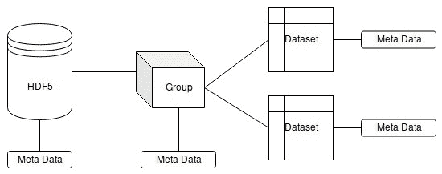
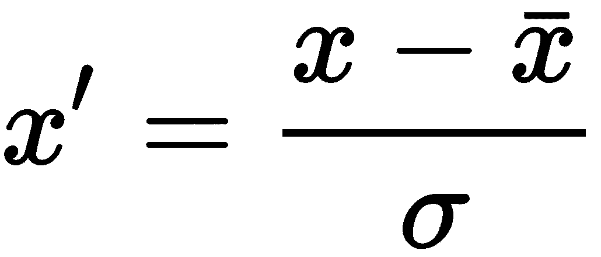
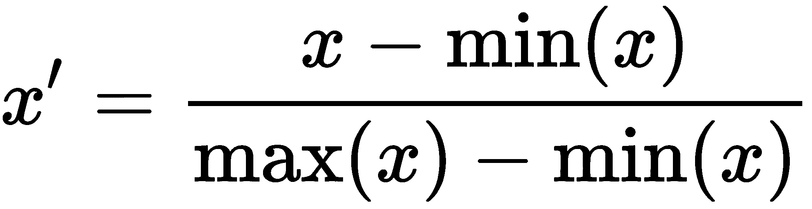
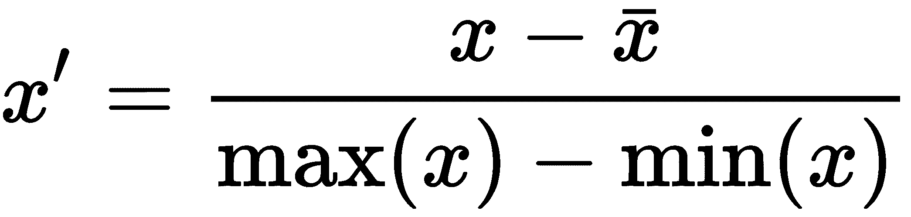
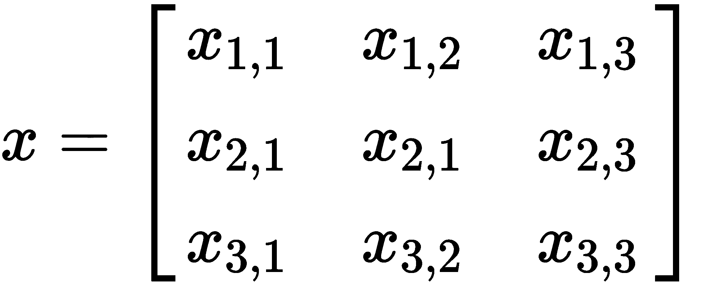

# 二、数据处理

机器学习中最重要的事情之一是我们用于训练的数据。我们可以从我们工作的流程中收集培训数据，也可以从第三方获取已经准备好的培训数据。在任何情况下，我们都必须以满足我们开发需求的文件格式存储训练数据。这些需求取决于我们解决的任务以及数据收集过程。有时，我们需要将以一种格式存储的数据转换为另一种格式，以满足我们的需求。这种需求的例子如下:

*   增加可读性，方便与工程师沟通
*   压缩的存在允许数据在二级存储上占据更少的空间
*   使用二进制形式的数据来加快解析过程
*   支持不同数据部分之间的复杂关系，以对特定域进行精确镜像
*   平台无关性，能够在不同的开发和生产环境中使用数据集

如今，有多种文件格式用于存储不同种类的信息。其中有些是非常具体的，有些是通用的。有一些软件库允许我们操作这些文件格式。很少需要从头开始开发新的格式和解析器。使用现有软件读取格式可以显著减少开发和测试时间，这使我们能够专注于特定的任务。

本章讨论如何处理我们用来存储数据的流行文件格式。它显示了存在哪些库来处理 **JavaScript 对象符号** ( **JSON** )、**逗号分隔值** ( **CSV** )和**分层数据格式 v5** ( **HDF5** )格式。本章还介绍了使用`OpenCV`和`Dlib`库加载和处理图像数据所需的基本操作，以及如何将这些库中使用的数据格式转换为线性代数库中使用的数据类型。它还描述了数据规范化技术，例如处理异构数据的功能扩展和标准化过程。

本章将涵盖以下主题:

*   将数据格式解析为 c++ 数据结构
*   从 C++ 数据结构初始化矩阵和张量对象
*   使用`OpenCV`和`Dlib`库操作图像
*   将图像转换成各种库的矩阵和张量对象
*   标准化数据

# 技术要求

本章所需的技术和安装如下:

*   支持 C++ 17 的现代 C++ 编译器
*   CMake 构建系统版本> = 3.8
*   `Dlib`库安装
*   `Shogun`工具箱库安装
*   `Shark-ML`库安装
*   `Eigen`库安装
*   `hdf5lib`库安装
*   `HighFive`库安装
*   `RapidJSON`库安装
*   `Fast-CPP-CSV-Parser`库安装

本章的代码可以在以下 GitHub repo 中找到:https://GitHub . com/PacktPublishing/动手机器学习与 CPP/tree/master/Chapter02

# 将数据格式解析为 C++ 数据结构

最流行的表示结构化数据的格式叫做 CSV。这种格式只是一个文本文件，其中有一个二维表，一行中的值用逗号分隔，行被放在每一个新行上。看起来是这样的:

```cpp
1, 2, 3, 4
5, 6, 7, 8
9, 10, 11, 12

```

这种文件格式的优点是结构简单明了，有很多软件工具可以处理，可读性强，各种计算机平台都支持。缺点是缺乏对多维数据和复杂结构数据的支持，以及与二进制格式相比解析速度慢。

另一种广泛使用的格式是 JSON。虽然该格式的缩写中包含 JavaScript，但我们几乎可以在所有编程语言中使用它。这是一种具有名称-值对和这种对的数组的文件格式。它有关于如何将这样的对分组到不同的对象和数组声明的规则，也有关于如何定义不同类型的值的规则。下面的代码示例显示了 JSON 格式的文件:

```cpp
{
    name:"Bill",
    age: 25,
    phones:[
       {
            type:"home"
            number:43534590
       },
       {
            type:"work"
            number:56985468
       } 
    ]
}
```

这种格式的优点是人的可读性，在许多计算机平台上的软件支持，以及存储分层和嵌套数据结构的可能性。缺点是与二进制格式相比，它的解析速度较慢，而且它对于表示数字矩阵并不太有用。

通常，我们使用文件格式的组合来表示复杂的数据集。例如，我们可以用 JSON 描述对象关系，二进制形式的数据/数字数据可以存储在文件系统的文件夹结构中，并在 JSON 文件中引用它们。

HDF5 是存储科学数据的专用文件格式。这种文件格式是为了存储具有复杂结构的异构多维数据而开发的。它提供了对单个元素的快速访问，因为它为使用二级存储优化了数据结构。此外，HDF5 支持数据压缩。通常，这种文件格式由包含多维多类型数据数组的命名组组成。该文件格式的每个元素都可以包含元数据，如下图所示:



HDF5 format structure

这种格式的优势在于其高读写速度、对不同元素的快速访问以及支持复杂结构和各种类型数据的能力。缺点是需要专门的工具供用户编辑和查看，对不同平台之间的类型转换支持有限，并且对整个数据集使用单个文件。最后一个问题使得在文件损坏的情况下几乎不可能进行数据恢复。

有很多其他的格式来表示机器学习的数据集，但是我们发现提到的那些是最有用的。

# 用快速解析器库读取 CSV 文件

考虑如何在 C++ 中处理 CSV 格式。用 C++ 解析 CSV 格式有很多不同的库。它们有不同的功能集和集成到应用中的不同方式。使用 C++ 库最简单的方法是使用只包含标题的库，因为这样就不需要构建和链接它们了。我们建议使用`Fast-CPP-CSV-Parser`库，因为它是一个小的单文件头文件库，所需功能最少，可以很容易地集成到开发代码库中。

作为 CSV 文件格式的一个例子，我们使用了 Iris 数据集，它描述了三种不同类型的鸢尾植物，是由 R.A. Fisher 构思的。文件中的每一行都包含以下字段:萼片长度、萼片宽度、花瓣长度、花瓣宽度和带有类名的字符串。

The reference to the Iris dataset is the following: Dua, D. and Graff, C. (2019). UCI Machine Learning Repository [[http://archive.ics.uci.edu/ml](http://archive.ics.uci.edu/ml)]. Irvine, CA: University of California, School of Information and Computer Science.

要使用`Fast-CPP-CSV-Parser`库读取该数据集，我们需要包含一个头文件，如下所示:

```cpp
#include <csv.h>
```

然后，我们定义一个类型为`io::CSVReader`的对象。我们必须将列数定义为模板参数。这个参数是库的限制之一，因为我们需要知道 CSV 文件的结构。下面的代码片段说明了这一点:

```cpp
const uint32_t columns_num = 5;
io::CSVReader<columns_num> csv_reader(file_path);
```

接下来，我们定义容器来存储我们读取的值，如下所示:

```cpp
std::vector<std::string> categorical_column;
std::vector<double> values;
```

然后，为了使我们的代码更通用，并在一个地方收集关于列类型的所有信息，我们引入了以下帮助器类型和函数。我们定义一个元组对象来描述一行的值，如下所示:

```cpp
using RowType = std::tuple<double, double, double, double, std::string>;
RowType row;
```

使用元组的原因是我们可以用元编程技术轻松地迭代它。然后，我们定义两个辅助函数。一个是从文件中读取一行，它使用的是`io::CSVReader`类的`read_row()`方法。`read_row()`方法采用不同类型的可变数量的参数。我们的`RowType`类型描述了这些值。我们使用带有`std::get`功能的`std::index_sequence`类型进行自动参数填充，如以下代码片段所示:

```cpp
template <std::size_t... Idx, typename T, typename R>
bool read_row_help(std::index_sequence<Idx...>, T& row, R& r) {
 return r.read_row(std::get<Idx>(row)...);
}
```

第二个助手函数使用类似的技术将行元组对象转换为我们的值向量，如下所示:

```cpp
template <std::size_t... Idx, typename T>
void fill_values(std::index_sequence<Idx...>,
 T& row,
 std::vector<double>& data) {
 data.insert(data.end(), {std::get<Idx>(row)...});
}
```

现在，我们可以把所有的部分放在一起。我们定义了一个循环，在这个循环中，我们连续读取行值并将它们移动到我们的容器中。读取一行后，我们检查`read_row()`方法的返回值，它告诉我们读取是否成功。一个`false`返回值意味着我们已经到了文件的末尾。在出现解析错误的情况下，我们从`io::error`名称空间中捕捉到一个异常。不同的解析失败有不同的异常类型。在下面的例子中，我们处理数字解析错误:

```cpp
 try {
   bool done = false;
   while (!done) {
     done = !read_row_help(
     std::make_index_sequence<std::tuple_size<RowType>::value>{}, row,
         csv_reader);
     if (!done) {
        categorical_column.push_back(std::get<4>(row));
        fill_values(std::make_index_sequence<columns_num - 1>{}, row,
            values);
     }
   }
 } catch (const io::error::no_digit& err) {
   // ignore badly formatted samples
   std::cerr << err.what() << std::endl;
 }
```

此外，请注意，我们只将四个值移动到双精度向量，因为最后一列包含字符串对象，我们将其放在另一个分类值向量中。

# 预处理 CSV 文件

有时，我们拥有的数据格式与我们想要使用的库不兼容。例如，Iris 数据集文件包含一个包含字符串的列。许多机器学习库无法读取这样的值，因为它们假设 CSV 文件只包含可以直接加载到内部矩阵表示中的数值。

因此，在使用这样的数据集之前，我们需要对它们进行预处理。在 Iris 数据集的情况下，我们需要用数字编码替换包含字符串标签的分类列。在下面的代码示例中，我们用不同的数字替换字符串，但是一般来说，这种方法是个坏主意，尤其是对于分类任务。机器学习算法通常只学习数字关系，因此更合适的方法是使用专门的编码——例如，一键编码。代码可以在下面的块中看到:

```cpp
#include <fstream>
#include <regex>
...
std::ifstream data_stream("iris.data");
std::string data_string((std::istreambuf_iterator<char>(data_stream)),
                         std::istreambuf_iterator<char>());
data_string =
    std::regex_replace(data_string, std::regex("Iris-setosa"), "1");
data_string =
    std::regex_replace(data_string, std::regex("Iris-versicolor"), "2");
data_string =
    std::regex_replace(data_string, std::regex("Iris-virginica"), "3");
std::ofstream out_stream("iris_fix.csv");
out_stream << data_string;
```

我们用`std::ifstream`对象将 CSV 文件内容读取到`std::string`对象。此外，我们使用`std::regex`例程用数字替换字符串类名。与循环方法相比，使用`regex`函数允许我们减少代码大小并使其更具表现力，循环方法通常使用`std::string::find()`和`std::string::replace()`方法。在替换文件中的所有分类类名后，我们用`std::ofstream`对象创建一个新文件。

# 用 Shark-ML 库读取 CSV 文件

许多机器学习框架已经有了将 CSV 文件格式读入其内部表示的例程。在下面的代码示例中，我们展示了如何将带有`Shark-ML`库的 CSV 文件加载到`ClassificationDataset`对象中。这个库中的 CSV 解析器假设一个文件中的所有值都只有一个数字类型，所以它无法用我们在前面例子中使用的 Iris 数据集读取原始文件。然而，在前面的部分中，我们已经通过用数字值替换字符串值修复了这个问题，并且我们可以使用名为`iris_fix.csv`的新文件。

要使用`Shark-ML`库读取 CSV 文件，我们必须包含相应的标题，如下所示:

```cpp
#include <shark/Data/Csv.h>
#include <shark/Data/Dataset.h>
using namespace shark;
```

我们可以使用`ClassificationDataset`对象的`importCSV()`方法从文件中加载 CSV 数据。请注意，最后一个函数的参数指定数据集中的哪一列包含标签，如以下代码片段所示:

```cpp
ClassificationDataset dataset;
importCSV(dataset, "iris_fix.csv", LAST_COLUMN);
```

然后，我们可以在`Shark-ML`库提供的机器学习算法中使用这个对象。此外，我们还可以打印一些关于导入数据集的统计数据，如下所示:

```cpp
std::size_t classes = numberOfClasses(dataset);
std::cout << "Number of classes " << classes << std::endl;
std::vector<std::size_t> sizes = classSizes(dataset);
std::cout << "Class size: " << std::endl;
for (auto cs : sizes) {
  std::cout << cs << std::endl;
}
std::size_t dim = inputDimension(dataset);
std::cout << "Input dimension " << dim << std::endl;
```

# 用幕府图书馆阅读 CSV 文件

`Shogun`库也有读取 CSV 文件的功能，它也只将它们解释为数字矩阵。因此，要用`Shogun`库将 CSV 文件加载为数据集，我们需要对其进行预处理，并用数字值替换字符串值，就像我们在前面一节中所做的那样。我们可以将带有 Iris 数据集的 CSV 文件加载到矩阵对象中，然后使用该矩阵初始化`Shogun`库数据集对象，用于机器学习算法。首先，我们需要包含所需的头，并为助手类型进行定义，如下所示:

```cpp
#include <shogun/base/init.h>
#include <shogun/base/some.h>
#include <shogun/io/File.h>

using namespace shogun;
using DataType = float64_t;
using Matrix = shogun::SGMatrix<DataType>
```

然后，我们定义`shogun::CCSVFile`对象来解析数据集文件。初始化的`shogun::CCSVFile`对象用于将值加载到矩阵对象中，如以下代码片段所示:

```cpp
auto csv_file = shogun::some<shogun::CCSVFile>("iris_fix.csv");
Matrix data;
data.load(csv_file);
```

为了能够将这些数据用于机器学习算法，我们需要将这个矩阵对象分成两部分:一部分包含训练样本，第二部分包含标签。`Shogun` CSV 解析器以列主顺序加载矩阵。因此，为了使矩阵看起来像原始文件，我们需要转置，如下面的代码片段所示:

```cpp
 Matrix::transpose_matrix(data.matrix, data.num_rows, data.num_cols);
 Matrix inputs = data.submatrix(0, data.num_cols - 1); // make a view
 inputs = inputs.clone(); // copy exact data
 Matrix outputs = data.submatrix(data.num_cols - 1, data.num_cols);
        // make a view
 outputs = outputs.clone(); // copy exact data
```

现在，我们的训练数据在`inputs`矩阵对象中，标签在`outputs`矩阵对象中。为了能够在`Shogun`算法中使用`inputs`对象，我们需要将其转置回来，因为`Shogun`算法期望训练样本被放置在矩阵列中。为此，我们运行以下代码:

```cpp
Matrix::transpose_matrix(inputs.matrix, inputs.num_rows, inputs.num_cols);
```

我们可以使用这些矩阵来初始化`shogun::CDenseFeatures`和`shogun::CMulticlassLabels`对象，最终可以用于机器学习算法的训练。为此，我们运行以下代码:

```cpp
 auto features = shogun::some<shogun::CDenseFeatures<DataType>>(inputs);
 auto labels =
 shogun::wrap(new shogun::CMulticlassLabels(outputs.get_column(0)));
```

初始化这些对象后，我们可以打印一些关于训练数据的统计，如下所示:

```cpp
std::cout << "samples num = " << features->get_num_vectors() << "\n"
 << "features num = " << features->get_num_features() << std::endl;
 auto features_matrix = features->get_feature_matrix();
 // Show first 5 samples
 for (int i = 0; i < 5; ++ i) {
     std::cout << "Sample idx " << i << " ";
     features_matrix.get_column(i).display_vector();
 }
 std::cout << "labels num = " << labels->get_num_labels() << std::endl;
```

# 用 Dlib 库读取 CSV 文件

`Dlib`库可以像`Shogun`库一样将 CSV 文件直接加载到其矩阵类型中，但不需要它们创建解析器对象。对于这个操作，我们可以使用一个简单的 C++ 流操作符和一个标准的`std::ifstream`对象。

作为第一步，我们做了必要的包括，如下:

```cpp
include <Dlib/matrix.h>
using namespace Dlib;
```

然后，我们定义`matrix`对象并从文件中加载数据，如下所示:

```cpp
matrix<double> data;
std::ifstream file("iris_fix.csv");
file >> data;
std::cout << data << std::endl;
```

在`Dlib`库中，`matrix`对象直接用于训练机器学习算法，不需要将它们转化为中间数据集类型。

# 用 RapidJSON 库读取 JSON 文件

有些数据集带有结构化注释，可以包含多个文件和文件夹。这种复杂数据集的一个例子是**上下文中的公共对象** ( **可可**)数据集。该数据集包含一个带有注释的文本文件，用于描述对象及其结构部分之间的关系。这个广为人知的数据集用于训练用于分割、对象检测和分类任务的模型。该数据集中的注释是以 JSON 文件格式定义的。JSON 是一种广泛用于对象(实体)表示的文件格式。它只是一个带有特殊符号的文本文件，用于描述对象及其部分之间的关系。在下面的代码示例中，我们展示了如何使用`RapidJSON` C++ 库来处理这种文件格式。然而，我们将使用更直接的数据集来定义论文评论。该数据集的作者是 Keith，b .，Fuentes，e .，& Meneses，C. (2017)，他们为他们的工作制作了该数据集，标题为*一种应用于论文评论的混合情感分析方法*。以下代码示例显示了该数据集的缩减部分:

```cpp
{
    "paper": [
        {
            "id": 1,
            "preliminary_decision": "accept",
            "review": [
                {
                    "confidence": "4",
                    "evaluation": "1",
                    "id": 1,
                    "lan": "es",
                    "orientation": "0",
                    "remarks": "",
                    "text": "- El artículo aborda un problema contingente 
                      y muy relevante, e incluye tanto un diagnóstico
                      nacional de uso de buenas prácticas como una solución
                      (buenas prácticas concretas)...",
                    "timespan": "2010-07-05"
                },
                {
                    "confidence": "4",
                    "evaluation": "1",
                    "id": 2,
                    "lan": "es",
                    "orientation": "1",
                    "remarks": "",
                    "text": "El artículo presenta recomendaciones
                      prácticas para el desarrollo de software seguro...",
                    "timespan": "2010-07-05"
                },
                {
                    "confidence": "5",
                    "evaluation": "1",
                    "id": 3,
                    "lan": "es",
                    "orientation": "1",
                    "remarks": "",
                    "text": "- El tema es muy interesante y puede ser de
                      mucha ayuda una guía para incorporar prácticas de
                      seguridad...",
                    "timespan": "2010-07-05"
                }
            ]
        },
        ...
   ]
}
```

解析和处理 JSON 文件有两种主要方法，如下所示:

*   第一种方法假设一次解析整个文件并创建一个**文档对象模型** ( **DOM** )。DOM 是对象的层次结构，表示存储在文件中的实体。它通常存储在计算机内存中，对于大型文件，它会占用大量内存。
*   另一种方法是连续解析文件，并为用户提供**应用接口** ( **应用编程接口**，以处理与文件解析过程相关的每个事件。第二种方法通常被称为“T4 简单应用编程接口”。尽管它有名字，但它也是一种用于非 XML 数据的通用方法。

使用 DOM 处理训练数据集通常需要大量的内存，而这些内存对于机器学习算法来说是无用的。因此，在许多情况下，最好使用 SAX 接口。它允许我们过滤不相关的数据，并初始化我们可以直接在算法中使用的结构。在下面的代码示例中，我们使用了这种方法。

作为第一步，我们定义`paper/review`实体的类型，如下所示:

```cpp
...
struct Paper {
  uint32_t id{0};
  std::string preliminary_decision;
  std::vector<Review> reviews;
};

using Papers = std::vector<Paper>;
...
struct Review {
  std::string confidence;
  std::string evaluation;
  uint32_t id{0};
  std::string language;
  std::string orientation;
  std::string remarks;
  std::string text;
  std::string timespan;
};
...
```

然后，我们为对象声明一个类型，解析器将使用它来处理解析事件。这种类型应该继承自`rapidjson::BaseReaderHandler`基类，我们需要覆盖解析器在特定解析事件发生时将调用的虚拟处理函数，如下面的代码块所示:

```cpp
#include <rapidjson/error/en.h>
#include <rapidjson/filereadstream.h>
#include <rapidjson/reader.h>
...
struct ReviewsHandler
 : public rapidjson::BaseReaderHandler<rapidjson::UTF8<>, ReviewsHandler> {
 ReviewsHandler(Papers* papers) : papers_(papers) {}
 bool Uint(unsigned u) ;
 bool String(const char* str, rapidjson::SizeType length, bool /*copy*/);
 bool Key(const char* str, rapidjson::SizeType length, bool /*copy*/);
 bool StartObject();
 bool EndObject(rapidjson::SizeType /*memberCount*/);
 bool StartArray();
 bool EndArray(rapidjson::SizeType /*elementCount*/);

 Paper paper_;
 Review review_;
 std::string key_;
 Papers* papers_{nullptr};
 HandlerState state_{HandlerState::None};
};
```

请注意，我们只为解析事件的对象和数组以及解析无符号`int/string`值的事件创建了处理程序。现在，我们可以创建`rapidjson::FileReadStream`对象，并使用打开文件的处理程序和解析器将用于中间存储的缓冲对象来初始化它。我们使用`rapidjson::FileReadStream`对象作为`rapidjson::Reader`类型对象的`Parse()`方法的参数。第二个参数是我们从`rapidjson::BaseReaderHandler`派生的类型的对象，如下面的代码块所示:

```cpp
auto file = std::unique_ptr<FILE, void (*)(FILE*)>(
      fopen(filename.c_str(), "r"), [](FILE* f) {
        if (f)
          ::fclose(f);
      });
  if (file) {
    char readBuffer[65536];
    rapidjson::FileReadStream is(file.get(), readBuffer,
        sizeof(readBuffer));
    rapidjson::Reader reader;
    Papers papers;
    ReviewsHandler handler(&papers);
    auto res = reader.Parse(is, handler);
    if (!res) {
      throw std::runtime_error(rapidjson::GetParseError_En(res.Code()));
    }
    return papers;
  } else {
    throw std::invalid_argument("File can't be opened " + filename);
  }
```

当没有解析错误时，我们将有一个`Paper`类型对象的初始化数组。更准确地说，考虑事件处理程序的实现细节。我们的事件处理程序作为一个状态机工作。在一个状态中，我们用`Review`对象填充它，在另一个状态中，用`Papers`对象填充它，并且还有其他事件的状态，如下面的代码片段所示:

```cpp
enum class HandlerState {
  None,
  Global,
  PapersArray,
  Paper,
  ReviewArray,
  Review
};
```

我们只解析`Paper`和`Review`对象的`Id`属性的无符号`unit`值，并根据当前状态和之前解析的密钥更新这些值，如下所示:

```cpp
bool Uint(unsigned u) {
    bool res{true};
    try {
      if (state_ == HandlerState::Paper && key_ == "id") {
        paper_.id = u;
      } else if (state_ == HandlerState::Review && key_ == "id") {
        review_.id = u;
      } else {
        res = false;
      }
    } catch (...) {
      res = false;
    }
    key_.clear();
    return res;
}
```

字符串值也存在于两种类型的对象中，因此我们执行相同的检查来更新相应的值，如下所示:

```cpp
bool String(const char* str, rapidjson::SizeType length, bool /*copy*/) {
    bool res{true};
    try {
      if (state_ == HandlerState::Paper && key_ == "preliminary_decision") {
        paper_.preliminary_decision = std::string(str, length);
      } else if (state_ == HandlerState::Review && key_ == "confidence") {
        review_.confidence = std::string(str, length);
      } else if (state_ == HandlerState::Review && key_ == "evaluation") {
        review_.evaluation = std::string(str, length);
      } else if (state_ == HandlerState::Review && key_ == "lan") {
        review_.language = std::string(str, length);
      } else if (state_ == HandlerState::Review && key_ == "orientation") {
        review_.orientation = std::string(str, length);
      } else if (state_ == HandlerState::Review && key_ == "remarks") {
        review_.remarks = std::string(str, length);
      } else if (state_ == HandlerState::Review && key_ == "text") {
        review_.text = std::string(str, length);
      } else if (state_ == HandlerState::Review && key_ == "timespan") {
        review_.timespan = std::string(str, length);
      } else {
        res = false;
      }
    } catch (...) {
      res = false;
    }
    key_.clear();
    return res;
}
```

JSON `key`属性的事件处理程序将`key`值存储到适当的变量中，我们在解析过程中使用该变量来标识当前对象，如下所示:

```cpp
bool Key(const char* str, rapidjson::SizeType length, bool /*copy*/) {
    key_ = std::string(str, length);
    return true;
}
```

`StartObject`事件处理程序根据`current key`值和先前的状态值切换状态。我们基于当前 JSON 文件结构的知识来实现当前的实现:没有`Paper`对象的数组，每个`Paper`对象包括一个评论数组。这是 SAX 接口的局限性之一——我们需要知道文档的结构来正确实现所有事件处理程序。代码可以在下面的块中看到:

```cpp
bool StartObject() {
    if (state_ == HandlerState::None && key_.empty()) {
      state_ = HandlerState::Global;
    } else if (state_ == HandlerState::PapersArray && key_.empty()) {
      state_ = HandlerState::Paper;
    } else if (state_ == HandlerState::ReviewArray && key_.empty()) {
      state_ = HandlerState::Review;
    } else {
      return false;
    }
    return true;
}
```

在`EndObject`事件处理程序中，我们根据当前状态填充`Paper`和`Review`对象的数组。此外，我们通过运行以下代码将当前状态切换回之前的状态:

```cpp
bool EndObject(rapidjson::SizeType /*memberCount*/) {
    if (state_ == HandlerState::Global) {
      state_ = HandlerState::None;
    } else if (state_ == HandlerState::Paper) {
      state_ = HandlerState::PapersArray;
      papers_->push_back(paper_);
      paper_ = Paper();
    } else if (state_ == HandlerState::Review) {
      state_ = HandlerState::ReviewArray;
      paper_.reviews.push_back(review_);
    } else {
      return false;
    }
    return true;
}
```

在`StartArray`事件处理程序中，我们通过运行以下代码，根据当前状态值将当前状态切换到新状态:

```cpp

bool StartArray() {
    if (state_ == HandlerState::Global && key_ == "paper") {
      state_ = HandlerState::PapersArray;
      key_.clear();
    } else if (state_ == HandlerState::Paper && key_ == "review") {
      state_ = HandlerState::ReviewArray;
      key_.clear();
    } else {
      return false;
    }
    return true;
}
```

在`EndArray`事件处理程序中，我们通过运行以下代码，根据我们对文档结构的了解，将当前状态切换到上一个状态:

```cpp
bool EndArray(rapidjson::SizeType /*elementCount*/) {
    if (state_ == HandlerState::ReviewArray) {
      state_ = HandlerState::Paper;
    } else if (state_ == HandlerState::PapersArray) {
      state_ = HandlerState::Global;
    } else {
      return false;
    }
    return true;
}
```

这种方法的关键是在对象处理后清除`current key`值。这有助于我们调试解析错误，并且我们总是有关于当前处理的实体的实际信息。

对于小文件，使用 DOM 方法可能更好，因为这样可以减少代码和更简洁的算法。

# 使用 HighFive 库写入和读取 HDF5 文件

HDF5 是存储数据集和科学值的高效文件格式。`HighFive`库为 HDF 集团提供的 C 库提供了更高级别的 C++ 接口。在本例中，我们建议通过将上一节中使用的数据集转换为 HDF5 格式来查看它的接口。

HDF5 格式的主要概念是组和数据集。每个组可以包含其他组，并具有不同类型的属性。此外，每个组可以包含一组数据集条目。每个数据集都是同一类型值的多维数组，也可以有不同类型的属性。

让我们从包含必需的头开始，如下所示:

```cpp
#include <highfive/H5DataSet.hpp>
#include <highfive/H5DataSpace.hpp>
#include <highfive/H5File.hpp>
```

然后，我们必须创建一个文件对象，我们将在其中编写数据集，如下所示:

```cpp
HighFive::File file(file_name, HighFive::File::ReadWrite |
                                   HighFive::File::Create |
                                   HighFive::File::Truncate);
```

有了文件对象后，我们就可以开始创建组了。我们定义了一组应该包含所有纸张对象的纸张，如下所示:

```cpp
auto papers_group = file.createGroup("papers");
```

然后，我们遍历一个试卷数组(如前一节所示)，并为每个试卷对象创建一个组，该组有两个属性:字符串类型的数字`id`属性和`preliminary_decision`属性，如下面的代码块所示:

```cpp
for (const auto& paper : papers) {
  auto paper_group =
      papers_group.createGroup("paper_" + std::to_string(paper.id));
  std::vector<uint32_t> id = {paper.id};
  auto id_attr = paper_group.createAttribute<uint32_t>(
      "id", HighFive::DataSpace::From(id));

  id_attr.write(id);
  auto dec_attr = paper_group.createAttribute<std::string>(
      "preliminary_decision",
      HighFive::DataSpace::From(paper.preliminary_decision));
  dec_attr.write(paper.preliminary_decision);
```

在我们创建了一个属性之后，我们必须用`write()`方法输入它的值。注意`HighFive::DataSpace::From`功能自动检测属性值的大小。大小是保存属性值所需的内存量。然后，对于每个`paper_group`，我们创建一个相应的评论组，如下所示:

```cpp
 auto reviews_group = paper_group.createGroup("reviews");
```

我们在每个`reviews_group`中插入一个由`confidence`、`evaluation`和`orientation`字段的数值组成的数据集。对于数据集，我们定义大小为`3`的`DataSpace`(数据集中元素的数量)，并将存储类型定义为 32 位整数，如下所示:

```cpp
std::vector<size_t> dims = {3};
 std::vector<int32_t> values(3);
 for (const auto& r : paper.reviews) {
     auto dataset = reviews_group.createDataSet<int32_t>(
     std::to_string(r.id), HighFive::DataSpace(dims));
     values[0] = std::stoi(r.confidence);
     values[1] = std::stoi(r.evaluation);
     values[2] = std::stoi(r.orientation);
     dataset.write(values);
 }
}
```

创建并初始化所有对象后，HDF5 格式的论文/评论数据集就准备好了。当`file`对象离开范围时，其析构函数将所有内容保存到二级存储中。

有了 HDF5 格式的文件，我们可以考虑`HighFive`库接口进行文件读取。作为第一步，我们再次创建`HighFive::File`对象，但是带有用于读取的属性，如下所示:

```cpp
HighFive::File file(file_name, HighFive::File::ReadOnly);
```

然后，我们使用`getGroup()`方法获取顶层`papers_group`对象，如下所示:

```cpp
auto papers_group = file.getGroup("papers");
```

我们需要获得这个组中所有嵌套对象的列表，因为我们只能通过对象的名称来访问它们。我们可以通过运行以下代码来做到这一点:

```cpp
auto papers_names = papers_group.listObjectNames();
```

使用循环，我们迭代`papers_group`容器中的所有`papers_group`对象，如下所示:

```cpp
for (const auto& pname : papers_names) {
  auto paper_group = papers_group.getGroup(pname);
  ...
}
```

对于每个`paper`对象，我们读取其属性，以及属性值所需的内存空间。此外，因为每个属性都可以是多维的，所以我们应该处理它并分配一个适当的容器，如下所示:

```cpp
  std::vector<uint32_t> id;
  paper_group.getAttribute("id").read(id);
  std::cout << id[0];

  std::string decision;
  paper_group.getAttribute("preliminary_decision").read(decision);
  std::cout << " " << decision << std::endl;
```

对于读取数据集，我们可以使用相同的方法:获取`reviews`组，然后获取数据集名称列表，最后循环读取每个数据集，如下所示:

```cpp
  auto reviews_group = paper_group.getGroup("reviews");
  auto reviews_names = reviews_group.listObjectNames();
  std::vector<int32_t> values(2);
  for (const auto& rname : reviews_names) {
    std::cout << "\t review: " << rname << std::endl;
    auto dataset = reviews_group.getDataSet(rname);
    auto selection = dataset.select(
        {1}, {2});  // or use just dataset.read method to get whole data
    selection.read(values);
    std::cout << "\t\t evaluation: " << values[0] << std::endl;
    std::cout << "\t\t orientation: " << values[1] << std::endl;
  }
```

请注意，我们对数据集使用`select()`方法，这允许我们只读取数据集的一部分。我们用给定的范围作为参数来定义这一部分。数据集类型中有`read()`方法，可以一次读取整个数据集。

使用这些技术，我们可以读取和转换任何 HDF5 数据集。这种文件格式允许我们只处理部分所需数据，而不将整个文件加载到内存中。此外，因为这是二进制格式，所以它的读取比读取大型文本文件更有效。

# 从 C++ 数据结构初始化矩阵和张量对象

数据集使用多种文件格式，并非所有文件格式都受库支持。为了使用来自不支持的格式的数据，我们可能需要编写定制的解析器。在我们将值读入常规的 C++ 容器之后，我们通常需要将它们转换成在我们使用的机器学习框架中使用的对象类型。例如，让我们考虑将矩阵数据从文件读入 C++ 对象的情况。

# 人名

使用`Eigen`库，我们可以将一个 C++ 数组包装成具有`Eigen::Map`类型的`Eigen::Matrix`对象。包裹的物体将表现为标准的`Eigen`矩阵。我们必须用具有所需行为的矩阵类型来参数化`Eigen::Map`类型。此外，当我们创建`Eigen::Map`对象时，它将指向 C++ 数组和矩阵维度的指针作为参数，如下面的代码片段所示:

```cpp
std::vector<double> values;
...
auto x_data = Eigen::Map<Eigen::Matrix<double, Eigen::Dynamic,
                         Eigen::Dynamic, Eigen::RowMajor>>(values.data(), 
                                                           rows_num, 
                                                           columns_num );
```

# 鲨鱼-毫升

`Shark-ML`框架有特殊的适配器函数，为 C++ 数组创建包装器。这些函数创建表现为规则`Shark-ML`矩阵的对象。为了用适配器函数包装 C++ 容器，我们必须传递一个指向数据和相应维度的指针作为参数，如下面的代码片段所示:

```cpp
std::vector<float> data{1, 2, 3, 4};
auto m = remora::dense_matrix_adaptor<float>(data.data(), 2, 2);
auto v = remora::dense_vector_adaptor<float>(data.data(), 4);
```

# 德列卜

`Dlib`库具有将 C++ 容器包装到`Dlib`矩阵对象中的`Dlib::mat()`功能。它还将指向数据和矩阵维度的指针作为参数，如下面的代码片段所示:

```cpp
double data[] = {1, 2, 3, 4, 5, 6};
auto m2 = Dlib::mat(data, 2, 3);  // create matrix with size 2x3
```

# 幕府将军

使用`Shogun`库，我们可以使用`SGMatrix`类型的特定构造函数用 C++ 数组初始化它。它接受指向数据和矩阵维度的指针，如下面的代码片段所示:

```cpp
std::vector<double> values;
...
SGMatrix<float64_t> matrix(values.data(), num_rows, numcols);
```

请注意，所有这些函数只对存储数据的原始 C++ 数组进行包装，而不会将值复制到新位置。如果我们想将值从 C++ 数组复制到`matrix`对象，我们通常需要为包装器对象调用`clone()`方法或其模拟方法。

在我们使用的机器学习框架有了矩阵对象之后，我们可以初始化其他专门的对象来训练机器学习算法。这类对象的例子有`Shogun`图书馆的`CDenseFeatures`名词或`Shark-ML`图书馆的`CClassificationDataset`名词。

# 使用 OpenCV 和 Dlib 库操作图像

许多机器学习算法都与计算机视觉问题有关。这些任务是图像中的对象检测、分割、图像分类等。为了能够处理这样的任务，我们需要处理图像的仪器。我们通常需要将图像加载到计算机内存的例程，以及图像处理的例程。例如，标准操作是图像缩放，因为许多机器学习算法仅在特定大小的图像上训练。这种限制来自算法结构，或者是硬件要求。例如，由于尺寸有限，我们无法将大图像加载到**图形处理单元** ( **GPU** )内存中。

此外，硬件要求可能导致我们的硬件支持的数字类型范围有限，因此我们需要将初始图像表示更改为我们的硬件可以有效处理的表示。此外，机器学习算法通常假设图像通道的预定义布局，这可能不同于原始图像文件中的布局。

另一种类型的图像处理任务是创建训练数据集。在许多情况下，我们对于特定任务的可用图像数量有限。然而，要让一个机器算法训练好，我们通常需要更多的训练图像。因此，典型的方法是增强现有图像。可以通过随机缩放、裁剪部分图像、旋转和其他操作来进行增强，这些操作可以用来从现有的集合中制作不同的图像。

在本节中，我们将展示如何使用两个最流行的库来进行 C++ 图像处理。`OpenCV`是一个用于解决计算机视觉问题的框架，包括许多现成的计算机视觉算法实现。此外，它还具有许多图像处理功能。`Dlib`是一个计算机视觉和机器学习框架，有大量实现的算法，以及一套丰富的图像处理例程。

# 使用 OpenCV

在`OpenCV`库中，图像被视为多维值矩阵。为此有一种特殊的`cv::Mat`型。有两个基本函数:`cv::imread()`函数加载图像，`cv::imwrite()`函数将图像写入文件，如以下代码片段所示:

```cpp
#include <opencv2/opencv.hpp>
..
cv::Mat img = cv::imread(file_name);
cv::imwrite(new_file_name, img);
```

此外，还有管理内存缓冲区中的图像的功能。`cv::imdecode()`函数从内存缓冲区加载图像，`cv::imencode()`函数将图像写入内存缓冲区。

`OpenCV`库中的缩放操作可以通过`cv::resize()`功能完成。该函数以输入图像、输出图像、输出图像大小或比例因子以及插值类型为参数。插值类型决定缩放后输出图像的外观。一般建议如下:

*   使用`cv::INTER_AREA`进行收缩。
*   使用`cv::INTER_CUBIC`(慢速)或`cv::INTER_LINEAR`进行缩放。
*   使用`cv::INTER_LINEAR`来调整大小，因为它很快。

下面的代码示例显示了如何缩放图像:

```cpp
  cv::resize(img, img, {img.cols / 2, img.rows / 2}, 0, 0, cv::INTER_AREA);
  cv::resize(img, img, {}, 1.5, 1.5, cv::INTER_CUBIC);
```

`OpenCV`库中没有图像裁剪的特殊功能，但是`cv::Mat`类型覆盖了`operator()`方法，该方法以裁剪矩形为参数，返回一个新的`cv::Mat`对象，其中部分图像被指定的矩形包围。此外，请注意，该对象将与原始图像共享相同的内存，因此其修改也会改变原始图像。要对`cv::Mat`对象进行深度复制，我们需要使用`clone()`方法，如下所示:

```cpp
  img = img(cv::Rect(0, 0, img.cols / 2, img.rows / 2));
```

有时，我们需要移动或旋转图像。`OpenCV`库支持通过仿射变换对图像进行平移和旋转操作。我们必须手动地——或者使用辅助函数——创建一个 2D 仿射变换矩阵，然后将其应用于我们的图像。对于移动(平移)，我们可以手动创建这样一个矩阵，然后使用`cv::wrapAffine()`功能将其应用于图像，如下所示:

```cpp
  cv::Mat trm = (cv::Mat_<double>(2, 3) << 1, 0, -50, 0, 1, -50);
  cv::wrapAffine(img, img, trm, {img.cols, img.rows});
```

我们可以用`cv::getRotationMatrix2D()`函数创建一个旋转矩阵。这需要一个原点和旋转角度，如下面的代码片段所示:

```cpp
  auto rotm = cv::getRotationMatrix2D({img.cols / 2, img.rows / 2}, 45, 1);
  cv::wrapAffine(img, img, rotm, {img.cols, img.rows});
```

另一个有用的操作是扩展图像大小，无需缩放，但添加了边框。为此，在`OpenCV`库中有`cv::copyMakeBorder()`功能。这个函数在如何创建边框上有不同的选项。它采用输入图像、输出图像、顶部、底部、左侧和右侧的边框大小、边框类型和边框颜色。边框类型可以是以下类型之一:

*   `BORDER_CONSTANT`-使函数用单一颜色填充边框。
*   `BORDER_REPLICATE`-使函数在每一侧用最后一个像素值的副本填充边框(例如，*aaaaa | abcdefgh | hhhhh*)。
*   `BORDER_REFLECT`—使函数在每一侧用相反像素值的副本填充边框(例如， *fedcba|abcdefgh|hgfedcb* )。
*   `BORDER_WRAP`—通过模拟图像复制使函数填充边框(例如， *cdefgh|abcdefgh|abcdefg* )。

以下示例显示了如何使用该函数:

```cpp
  int top = 50;     // px
  int bottom = 20;  // px
  int left = 150;   // px
  int right = 5;    // px
  cv::copyMakeBorder(img, img, top, bottom, left, right,
                     cv::BORDER_CONSTANT | cv::BORDER_ISOLATED,
                     cv::Scalar(255, 0, 0));
```

当我们使用这个功能时，我们应该注意源图像的来源。`OpenCV`文档显示:*如果源图像是更大图像的一部分，该函数将尝试使用感兴趣区域(感兴趣区域的简称)之外的像素来形成边界。要禁用此功能并始终进行外推，就像源图像不是另一个图像的一部分一样，请使用边框类型* `BORDER_ISOLATED` *。*

当我们需要将不同大小的训练图像调整为某些机器学习算法中使用的标准图像大小时，前面描述的函数非常有用，因为使用该函数，我们不会扭曲目标图像内容。

在`OpenCV`库中有`cv::cvtColor()`功能转换不同的颜色空间。该函数接受输入图像、输出图像和转换方案类型。例如，在下面的代码示例中，我们将**红色、绿色和蓝色** ( **RGB** )颜色空间转换为灰度空间:

```cpp
  cv::cvtColor(img, img,
               cv::COLOR_RGB2GRAY);  // now pixels values are in range 0-1
```

# 使用 Dlib

`Dlib`是另一个流行的图像处理库。这个库有不同的类型用于数学例程和图像处理。库文档建议对图像使用`Dlib::array2d`类型。`Dlib::array2d`类型是模板类型，必须用像素类型进行参数化。`Dlib`库中的像素类型是用像素类型特征定义的。有以下预定义的像素类型:`rgb_pixel`、`bgr_pixel`、`rgb_alpha_pixel`、`hsi_pixel`、`lab_pixel`，任何标量类型都可以用于灰度像素的表示。

我们可以使用`load_image()`功能从磁盘加载图像，如下所示:

```cpp
#include <Dlib/image_io.h>
#include <Dlib/image_transforms.h>
using namespace Dlib;
...
array2d<rgb_pixel> img;
load_image(img, file_path);
```

对于缩放操作，有`Dlib::resize_image()`功能。这个函数有两种不同的重载。一种是采用单个比例因子和对图像对象的引用。第二个选择输入图像、输出图像、所需大小和插值类型。要在`Dlib`库中指定插值类型，我们应该调用特殊函数:`interpolate_nearest_neighbor()`、`interpolate_quadratic()`和`interpolate_bilinear()`函数。选择其中一个的标准与我们在*使用 OpenCV* 部分讨论的标准相同。请注意，`resize_image()`函数的输出图像应该已经预分配，如下面的代码片段所示:

```cpp
array2d<rgb_pixel> img2(img.nr() / 2, img.nc() / 2);
resize_image(img, img2, interpolate_nearest_neighbor());
resize_image(1.5, img);  // default interpolate_bilinear
```

要裁剪带有`Dlib`的图像，我们可以使用`Dlib::extract_image_chips()`功能。这个函数接受一个原始图像、一个矩形定义的边界和一个输出图像。此外，该函数还有重载，采用矩形边界数组和输出图像数组，如下所示:

```cpp
extract_image_chip(img, rectangle(0, 0, img.nc() / 2, img.nr() / 2), img2);
```

`Dlib`库支持通过仿射变换进行图像变换操作。有`Dlib::transform_image()`功能，获取输入图像、输出图像和仿射变换对象。变换对象的一个例子可以是`Dlib::point_transform_affine`类的一个实例，它用旋转矩阵和平移向量定义仿射变换。此外，`Dlib::transform_image()`函数可以将插值类型作为最后一个参数，如以下代码片段所示:

```cpp
transform_image(img, img2, interpolate_bilinear(),
                point_transform_affine(identity_matrix<double>(2),
                                       Dlib::vector<double, 2>(-50, -50)));
```

在我们只需要做一个旋转的情况下，`Dlib`有`Dlib::rotate_image()`功能。`Dlib::rotate_image()`功能获取输入图像、输出图像、旋转角度(度)和插值类型，如下所示:

```cpp
rotate_image(img, img2, -45, interpolate_bilinear());
```

在`Dlib`库中没有给图像添加边框的功能的完全模拟。有两个功能:`Dlib::assign_border_pixels()`和`Dlib::zero_border_pixels()`用于用指定值填充图像边框。在使用这些例程之前，我们应该调整图像的大小，并将内容放在正确的位置。新的图像尺寸应该包括边框宽度。我们可以使用`Dlib::transform_image()`功能将图像内容移动到正确的位置。下面的代码示例演示如何向图像添加边框:

```cpp
int top = 50;     // px
int bottom = 20;  // px
int left = 150;   // px
int right = 5;    // px
img2.set_size(img.nr() + top + bottom, img.nc() + left + right);
    transform_image(
        img, img2, interpolate_bilinear(),
        point_transform_affine(identity_matrix<double>(2),
                              Dlib::vector<double, 2>(-left/2, -top/2)));
```

对于色彩空间转换，在`Dlib`库中存在`Dlib::assign_image()`函数。这个函数使用来自像素类型特征的颜色类型信息，我们用它来定义图像。因此，要将图像转换到另一个颜色空间，我们应该定义一个具有所需像素类型的新图像，并将其传递给该函数。以下示例显示了如何将 RGB 图像转换为**蓝色、绿色、红色** ( **BGR** )图像:

```cpp
array2d<bgr_pixel> img_bgr;
assign_image(img_bgr, img);
```

为了制作灰度图像，我们可以定义一个`unsigned char`像素类型的图像，如下所示:

```cpp
array2d<unsigned char> img_gray;
assign_image(img_gray, img);
```

# 将图像转换成各种库的矩阵或张量对象

在大多数情况下，图像在计算机内存中以交错格式表示，这意味着像素值以线性顺序一个接一个地放置。每个像素值由代表一种颜色的几个数字组成。例如，对于 RGB 格式，它将是放在一起的三个值。因此，在内存中，我们将看到 4 x 4 图像的以下布局:

```cpp
rgb rgb rgb rgb
rgb rgb rgb rgb
rgb rgb rgb rgb
rgb rgb rgb rgb
```

对于图像处理库，这样的值布局不是问题，但是许多机器学习算法需要不同的排序。例如，对于神经网络来说，一个接一个地对图像通道进行单独排序是一种常见的方法。以下示例显示了这种布局通常如何放置在内存中:

```cpp
r r r r   g g g g   b b b b
r r r r   g g g g   b b b b
r r r r   g g g g   b b b b
r r r r , g g g g , b b b b
```

因此，通常，我们需要在将图像表示传递给某种机器学习算法之前对其进行去交织。

此外，我们通常还需要转换颜色的值数据类型。例如，`OpenCV`库用户经常使用浮点格式，这允许他们在图像变换和处理例程中保留更多的颜色信息。相反的情况是，当我们使用 256 位类型的颜色通道信息，但然后我们需要将其转换为浮点类型。因此，在许多情况下，我们需要将底层数据类型转换为更适合我们需求的另一种数据类型。

# OpenCV 中的去交错

默认情况下，当我们用`OpenCV`库加载图像时，它会以 BGR 格式加载图像，并以`char`作为底层数据类型。因此，我们需要将其转换为 RGB 格式，如下所示:

```cpp
cv::cvtColor(img, img, cv::COLOR_BGR2RGB);
```

然后，我们可以将底层数据类型转换为`float`类型，如下所示:

```cpp
img.convertTo(img, CV_32FC3, 1/255.0);
```

接下来，要对信道进行解交织，我们需要使用`cv::split()`功能对其进行拆分，如下所示:

```cpp
cv::Mat bgr[3];
cv::split(img, bgr);
```

然后，我们可以使用`cv::vconcat()`函数按照我们需要的顺序将通道放回`cv::Mat`对象，该函数垂直连接矩阵，如下所示:

```cpp
cv::Mat ordered_channels;
cv::vconcat(bgr[2], bgr[1], ordered_channels);
cv::vconcat(ordered_channels, bgr[0], ordered_channels);
```

在名为`isContinuous`的`cv::Mat`类型中有一个有用的方法，它允许我们检查矩阵的数据是否放在具有单个连续块的内存中。如果这是真的，我们可以复制这个内存块，或者将其传递给使用普通 C 数组的例程。

# Dlib 中的去交错

`Dlib`库使用`unsigned char`类型进行像素颜色表示，我们只能对灰度图像使用浮点类型。`Dlib`库以交错通道的行主顺序存储像素，数据以单个块的形式连续存储在内存中。`Dlib`库中没有管理图像通道的特殊功能，因此我们无法对其进行解交织或混合。但是，我们可以使用原始像素数据来手动管理颜色值。`Dlib`库中有两个函数可以帮助我们:访问原始像素数据的`image_data()`函数和获取填充值的`width_step()`函数。

去交错`Dlib`图像对象最直接的方法是在所有像素上使用循环。在这样的循环中，我们可以将每个像素值分割成不同的颜色。

作为第一步，我们为每个通道定义容器，如下所示:

```cpp
auto channel_size = static_cast<size_t>(img.nc() * img.nr());
std::vector<unsigned char> ch1(channel_size);
std::vector<unsigned char> ch2(channel_size);
std::vector<unsigned char> ch3(channel_size);
```

然后，我们用图像行和列上的两个嵌套循环读取每个像素的颜色值，如下所示:

```cpp
size_t i{0};
for (long r = 0; r < img.nr(); ++ r) {
  for (long c = 0; c < img.nc(); ++ c) {
    ch1[i] = img[r][c].red;
    ch2[i] = img[r][c].green;
    ch3[i] = img[r][c].blue;
    ++ i;
  }
}
```

结果是三个容器具有颜色通道值，我们可以分别使用。它们适合初始化灰度图像，用于图像处理程序。或者，我们可以使用它们来初始化一个矩阵类型的对象，我们可以用线性代数例程来处理它。

# 标准化数据

数据归一化是机器学习中一个关键的预处理步骤。通常，数据标准化是将多尺度数据转换为相同尺度的过程。数据集中的要素值可以有非常不同的比例，例如，高度可以用厘米表示，数值很小，但收入可以有很大的数值。这一事实对许多机器学习算法产生了重大影响。例如，如果某些特征值与其他特征值相差数倍，那么在基于欧几里德距离的分类算法中，该特征将优于其他特征。有些算法对输入数据的规范化有很强的要求；这种算法的一个例子是**支持向量机** ( **SVM** )算法。神经网络通常也需要标准化的输入数据。此外，数据规范化对优化算法也有影响。例如，如果数据具有相同的规模，基于**梯度下降** ( **GD** )方法的优化器可以更快地收敛。

有几种归一化方法，但从我们的角度来看，最流行的是标准化、最小-最大和平均归一化方法。

**标准化**是使数据的均值为零，标准差等于 1 的过程。标准化向量的公式为，其中为原始向量，为用公式计算的的平均值，为用公式计算的的标准差。

**最小-最大归一化**或**重新缩放**是使数据符合`[0, 1]`范围的过程。我们可以使用以下公式进行重新缩放:



**均值归一化**用于将数据拟合到范围`[-1, 1]`中，因此其均值为零。我们可以使用以下公式进行均值归一化:



考虑我们如何实现这些规范化技术，以及可以使用哪些机器学习框架函数来计算它们。

我们假设这个矩阵的每一行是一个训练样本，每一列的值是当前样本的一个特征的值。

# 用特征归一化

`Eigen`库中没有数据归一化的功能。但是，我们可以根据提供的公式来实现它们。

为了标准化，我们首先要计算标准差，如下所示:

```cpp
Eigen::Array<double, 1, Eigen::Dynamic> std_dev =
  ((x.rowwise() - x.colwise().mean())
       .array()
       .square()
       .colwise()
       .sum() /
   (x_data.rows() - 1))
      .sqrt();
```

注意`Eigen`库中的一些约简函数只对数组表示起作用；例如`sum()`和`sqrt()`功能。我们还计算了每个特征的平均值——我们使用了返回`mean`向量的`x.colwise().mean()`函数组合。我们可以使用相同的方法进行其他特征统计的计算。

有了标准偏差值，标准化公式的其余部分将如下所示:

```cpp
Eigen::Matrix<double, Eigen::Dynamic, Eigen::Dynamic> x_std =
  (x.rowwise() - x.colwise().mean()).array().rowwise() /
  std_dev;
```

`min_max`规范化的实现非常简单，不需要中间值，如下面的代码片段所示:

```cpp
Eigen::Matrix<double, Eigen::Dynamic, Eigen::Dynamic> x_min_max =
  (x.rowwise() - x.colwise().minCoeff()).array().rowwise() /
  (x.colwise().maxCoeff() - x.colwise().minCoeff()).array();
```

我们以同样的方式实现`mean`规范化，如下所示:

```cpp
Eigen::Matrix<double, Eigen::Dynamic, Eigen::Dynamic> x_avg =
 (x.rowwise() - x.colwise().mean()).array().rowwise() /
 (x.colwise().maxCoeff() - x.colwise().minCoeff()).array();
```

请注意，我们以没有循环的矢量化方式实现公式；这种方法计算效率更高，因为它可以被编译以在 GPU 或**中央处理单元的** ( **中央处理器的** ) **单指令多数据** ( **SIMD** )指令上执行。

# 与幕府将军正常化

`Shogun`库中的`shogun::CRescaleFeatures`类实现最小-最大归一化(或重新缩放)。我们可以重用这个类的对象，用相同的学习统计来缩放不同的数据。当我们在一种数据格式上训练机器学习算法并应用重新缩放，然后在新数据上使用该算法进行预测时，这可能会很有用。为了让这个算法按照我们想要的方式工作，我们必须以与训练过程中相同的方式重新缩放新数据，如下所示:

```cpp
include <shogun/preprocessor/RescaleFeatures.h>
...
auto features = shogun::some<shogun::CDenseFeatures<DataType>>(inputs);
...
auto scaler = shogun::wrap(new shogun::CRescaleFeatures());
scaler->fit(features); // learn statistics - min and max values
scaler->transform(features); // apply scaling
```

为了学习统计值，我们使用`fit()`方法，对于特征修改，我们使用`CRescaleFeatures`类的`transform()`方法。

我们可以使用`SGVector`类的`display_vector()`方法打印更新的特征，如下所示:

```cpp
auto features_matrix = features->get_feature_matrix();
for (int i = 0; i < n; ++ i) {
  std::cout << "Sample idx " << i << " ";
  features_matrix.get_column(i).display_vector();
}
```

`Shogun`库中的一些算法可以执行输入数据的规范化，作为其实现的内部步骤，因此我们应该阅读文档以确定是否需要手动规范化。

# 用 Dlib 规范化

`Dlib`库提供了`Dlib::vector_normalizer`类的特征标准化功能。使用这个类有一个限制——我们不能用一个包含所有训练样本的大矩阵来使用它。或者，我们应该用一个单独的向量对象表示每个样本，并将它们放入 C++ `std::vector`容器中，如下所示:

```cpp
std::vector<matrix<double>> samples;
...
vector_normalizer<matrix<double>> normalizer;
samples normalizer.train(samples);
samples = normalizer(samples);
```

我们看到这个类的对象是可以重用的，但是首先要训练它。训练方法实现可以如下所示:

```cpp
matrix<double> m(mean(mat(samples)));
matrix<double> sd(reciprocal(stddev(mat(samples))));
for (size_t i = 0; i < samples.size(); ++ i)
    samples[i] = pointwise_multiply(samples[i] - m, sd);
```

请注意，`Dlib::mat()`函数对于不同来源的矩阵创建有不同的重载。此外，如果 *m* 是输入矩阵，我们使用`reciprocal()`函数生成矩阵。

在`Dlib`库中打印用于调试目的的矩阵可以用简单的流操作符来完成，如下面的代码片段所示:

```cpp
std::cout << mat(samples) << std::endl;
```

# 用鲨鱼毫升归一化

`Shark-ML`库实现了几种规范化方法。它们被实现为`Normalizer`模型类型的教练课程。我们可以在不同的数据上训练后重用`Normalizer`类型。有以下规范化培训师课程:

*   `NormalizeComponentsUnitInterval`—这个类训练一个归一化模型，该模型转换数据以适合一个单位间隔。
*   `NormalizeComponentsUnitVariance`—这个类训练一个归一化模型，该模型将数据转换成单位方差，并可选地转换成零均值。
*   `NormalizeComponentsWhitening`—这个类训练了一个归一化模型，默认情况下将数据转换成零均值和单位方差，但是我们可以指定目标方差值。

下面的代码示例显示了如何使用训练器的规范化模型:

```cpp
#include <shark/Algorithms/Trainers/NormalizeComponentsUnitVariance.h>
#include <shark/Models/Normalizer.h>
...
Normalizer<RealVector> normalizer;
NormalizeComponentsUnitVariance<RealVector> normalizingTrainer(
    /*removeMean*/ true);
normalizingTrainer.train(normalizer, dataset.inputs());
dataset = transformInputs(dataset, normalizer);
```

定义好模型和训练器对象后，我们要调用`train()`方法从输入数据集学习统计数据，然后使用`transformInputs()`函数更新目标数据集。我们可以使用标准的 C++ 流操作符打印`Shark-ML`数据集，如下所示:

```cpp
std::cout << dataset << std::endl;
```

# 摘要

在本章中，我们考虑了如何从 CSV、JSON 和 HDF5 格式加载数据。我们看到了如何将加载的数据转换成适用于不同机器学习框架的对象。我们使用库的 API 将原始 C++ 数组转换成矩阵和机器学习算法的高级数据集对象。我们研究了如何用`OpenCV`和`Dlib`库加载和处理图像。我们熟悉了数据规范化过程，这对于许多机器学习算法非常重要。此外，我们看到了机器学习库中可用的规范化技术，并且我们使用来自`Eigen`库的线性代数函数实现了一些规范化方法。

在下一章中，我们将看到如何在不同类型的数据上衡量模型的性能。我们将研究特殊的技术，帮助我们理解模型如何很好地描述训练数据集，以及它在新数据上的表现。另外，我们将学习机器学习模型所依赖的不同类型的参数，并看看如何选择它们的最佳组合来提高模型的性能。

# 进一步阅读

*   HDF5 库和文件格式:[https://www.hdfgroup.org/solutions/hdf5/](https://www.hdfgroup.org/solutions/hdf5/)
*   Fast C++ CSV 解析器的 GitHub 链接:https://github . com/Ben-strasse/fast-CPP-CSV 解析器
*   `OpenCV`:[https://opencv.org/](https://opencv.org/)
*   `Dlib` C++ 库:[http://Dlib.net/](http://dlib.net/)
*   `RapidJSON`文件:[http://rapidjson.org/](http://rapidjson.org/)
*   Iris 数据集的官方页面:[https://archive.ics.uci.edu/ml/datasets/iris](https://archive.ics.uci.edu/ml/datasets/iris)