# 三、衡量表现和选择模型

本章描述了训练**机器学习** ( **ML** )模型时通常出现的偏差和方差效应及其病理情况。例如，高方差效应，也称为过拟合，是 ML 中的一种现象，其中构建的模型解释了来自训练集的示例，但是对没有参与训练过程的示例的效果相对较差。出现这种情况是因为在训练模型时，随机模式将开始出现，而这些模式通常在一般人群中是不存在的。过度拟合的反义词是欠拟合。当训练好的模型无法预测新数据甚至训练数据中的模式时，就会出现这种情况。这种效果可能是有限训练数据集或弱模型设计的结果。

在本章中，我们将学习如何使用正则化处理过拟合，并讨论我们可以使用的不同技术。我们还将考虑不同的模型性能估计度量，以及如何使用它们来检测训练问题。在这一章的最后，我们将通过介绍网格搜索技术及其在 C++ 中的实现来看看如何为模型找到最佳超参数。

本章将涵盖以下主题:

*   ML 模型的性能指标
*   了解偏差和方差特征
*   用网格搜索技术选择模型

# 技术要求

对于本章，您将需要以下内容:

*   支持 C++ 17 的现代 C++ 编译器
*   CMake 构建系统版本> = 3.8
*   `Dlib`库
*   `Shogun-toolbox`库
*   `Shark-ML`库
*   `Plotcpp`库

The code files for this chapter can be found at the following GitHub repo: [https://github.com/PacktPublishing/Hands-On-Machine-Learning-with-CPP/tree/master/Chapter03](https://github.com/PacktPublishing/Hands-On-Machine-Learning-with-CPP/tree/master/Chapter03)

# ML 模型的性能指标

当我们开发或实现一个特定的 ML 算法时，我们需要估计它的工作情况。换句话说，我们需要估计它在多大程度上解决了我们的任务。通常，我们使用一些数字度量来估计算法性能。这种度量的一个例子可以是为目标值和预测值计算的均方误差值。我们可以使用这个值来估计我们的预测距离我们用于训练的目标值有多远。性能度量的另一个用例是在优化过程中将其用作目标函数。一些性能指标用于手动观察，但其他指标也可用于优化目的。

每种最大似然算法类型的性能指标都不同。在[第 1 章](01.html)、*c++ 机器学习入门*中，我们讨论了 ML 算法存在两大类:回归算法和分类算法。ML 学科中还有其他类型的算法，但这两种是最常见的。本节将讨论回归和分类算法最流行的性能指标。

# 回归度量

回归任务度量用于衡量预测值与实际值的接近程度。这样的测量可以帮助我们估计算法的预测质量。在回归度量下，有四个主要度量。

# 均方误差和均方根误差

**均方误差** ( **均方误差**)是回归算法用来估计其质量的一个广泛使用的度量。这是预测值和基本真实值之间的平均平方差。这由以下等式给出:

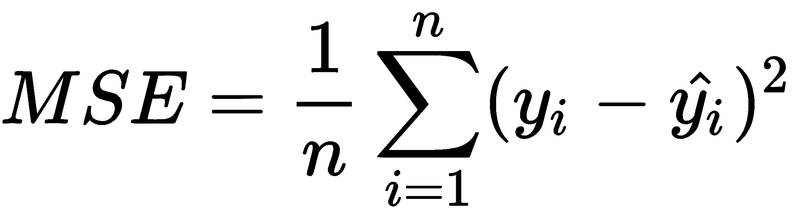

这里，是预测数和地面真值项，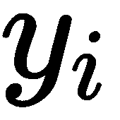是第*I*T4 项的地面真值，是第*I*T9 项的预测值。

最小均方误差通常用作优化算法的目标损失函数，因为它是光滑可微的，并且是凸函数。

**均方根误差**(**【RMSE】**)度量通常用于估计性能，例如当我们需要对更高的误差赋予更大的权重(以惩罚它们)时。我们可以将此解释为预测值和基本真实值之间差异的标准偏差。这由以下等式给出:

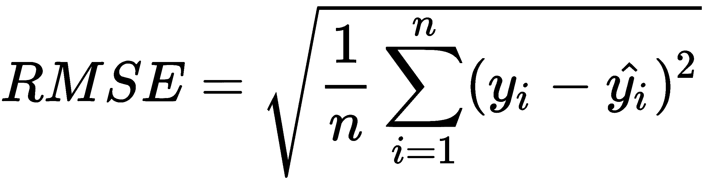

以下示例显示了使用`Shark-ML`库执行的均方误差计算:

```cpp
SquaredLoss<> mse_loss;
auto mse = mse_loss(train_data.labels(), predictions);
auto rmse = std::sqrt(mse);
```

在本例中，我们使用`SquaredLoss`类型的对象计算了 MSE 值。`SquaredLoss`类型的对象可以用作功能对象，它们以训练标签(地面真值)值和预测值作为参数。计算结果是一个浮点值。请注意，为了得到 RMSE 值，我们只需取结果值的平方根。

以下示例显示了使用`Shogun`库执行的均方误差计算:

```cpp
auto mse_error = some<CMeanSquaredError>();
auto mse = mse_error->evaluate(predictions, train_labels);
```

在本例中，我们使用`CMeanSquareError`类型对象计算了均方误差值。`evaluate`方法以预测值和训练标签(基础真值)为参数，返回浮点值作为结果。

# 绝对平均误差

**平均绝对误差** ( **MAE** )是另一个流行的度量标准，用于回归算法的质量估计。MAE 度量是一个线性函数，具有相等的加权预测误差。这一指标对于异常值比 RMSE 更稳健。它由以下等式给出:


以下示例显示了如何使用`Shark-ML`库计算均方误差:

```cpp
AbsoluteLoss<> abs_loss;
auto mae = abs_loss(train_data.labels(), prediction);
```

以下示例显示了如何使用`Shogun`库计算均方误差:

```cpp
auto mae_error = some<CMeanAbsoluteError>();
auto mae = mae_error->evaluate(predictions, train_labels);
```

# r 平方

平方度量也称为决定系数。它用于衡量我们的自变量(来自训练集的特征)描述问题和解释因变量(预测值)可变性的能力。较高的值告诉我们，模型很好地解释了我们的数据，而较低的值告诉我们，模型会产生许多错误。这由以下等式给出:


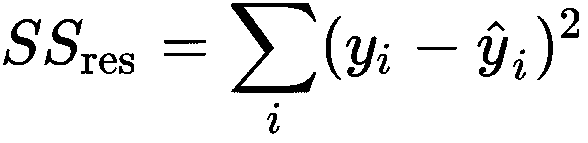


这里，是预测数和地面真值项， <sub xmlns:epub="http://www.idpf.org/2007/ops"></sub> 是 *i* <sup xmlns:epub="http://www.idpf.org/2007/ops">第</sup>项的地面真值，<sub xmlns:epub="http://www.idpf.org/2007/ops">T10】是 *i* 第<sup xmlns:epub="http://www.idpf.org/2007/ops">项的预测值。</sup></sub>

这个度量的唯一问题是，当我们向模型中添加新的独立变量时，这个值总是会增加。这个模型似乎开始更好地解释数据，但事实并非如此——只有当训练项目更多时，这个值才会增加。
在我们使用的库中，没有现成的函数来计算这个度量。然而，用线性代数函数实现它很简单。

以下示例显示了如何使用`Shark-ML`库计算均方误差:

```cpp
auto var = shark::variance(train_data.labels());
auto r_squared = 1 - mse / var(0);
```

# 调整后的 R 平方

调整后的 R 平方度量被设计来解决前面描述的 R 平方度量的问题。它与 R 平方度量相同，但对大量独立变量进行了惩罚。主要思想是，如果新的自变量提高了模型的质量，这个度量的值就会增加；否则，它们会减少。这可以由以下等式给出:

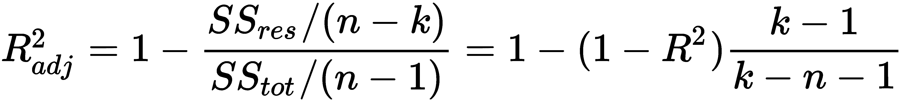

这里， *k* 为参数个数， *n* 为样本个数。

# 分类指标

在开始讨论分类度量之前，我们必须引入一个重要的概念，称为**混淆矩阵**。让我们假设我们有两个类和一个将它们分配给一个对象的算法。这里，混淆矩阵如下所示:

|  | <sub></sub> | <sub></sub> |
| <sub></sub> | **真阳性** ( **TP** ) | **假**T2 阳性( **FP** |
| <sub></sub> | **假** **负** (FN) | **真负** ( **TN** ) |

在这里， <sub xmlns:epub="http://www.idpf.org/2007/ops"></sub> 是预测类的对象而 <sub xmlns:epub="http://www.idpf.org/2007/ops">是地面真理的标签。混淆矩阵是我们用来计算不同分类度量的抽象。它给出了正确分类和错误分类的项目数量。它还为我们提供了关于错误分类类型的信息。假阴性是我们的算法错误地归类为阴性的项目，而假阳性是我们的算法错误地归类为阳性的项目。在本节中，我们将学习如何使用该矩阵并计算不同的分类性能指标。</sub>

# 准确(性)

最明显的分类指标之一是准确性:

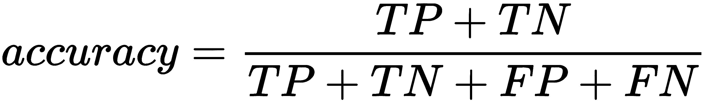

这为我们提供了所有积极预测与所有其他预测的比率。总的来说，这个度量不是很有用，因为它没有用奇数个类的情况向我们展示真实的情况。让我们考虑一个垃圾邮件分类任务，假设我们有 10 封垃圾邮件和 100 封非垃圾邮件。我们的算法正确预测了其中的 90 封非垃圾邮件，并且只正确分类了 5 封垃圾邮件。在这种情况下，精度将具有以下值:

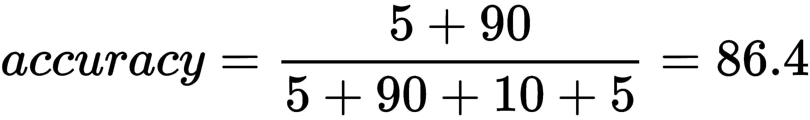

但是，如果算法预测所有的字母都是非垃圾邮件，那么它的准确性应该如下:


这个例子表明，我们的模型仍然不起作用，因为它无法预测所有的垃圾邮件，但准确性值足够好。

`Shark-ML`库中有一个名为`ZeroOneLoss`的类，可以用来计算分类任务的准确率值。我们也可以使用这个类的对象作为学习目的的目标损失函数。

在`Shogun`库中，有一个名为`CAccuracyMeasure`的类，可以用来计算精度值。

# 精确度和召回率

为了估计每个分类类的算法质量，我们将引入两个度量标准:*精度*和*召回*。下图显示了分类中使用的所有对象，以及它们是如何根据算法结果进行标记的:


中心的圆包含*个选定的元素*–我们的算法预测为正的元素。

精度与所选项目中正确分类的项目数量成正比。精确度的另一个名称是*特异性*:

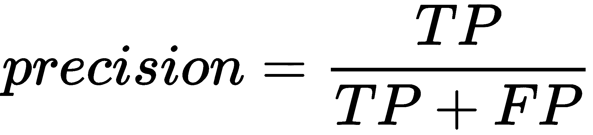

回忆与所有地面真实阳性项目中正确分类项目的数量成正比。召回的另一个名称是*灵敏度*:


让我们假设我们对阳性项目的检测感兴趣——让我们称它们为相关项目。因此，我们使用召回值作为算法检测相关项目的能力的度量，使用精度值作为算法查看类之间差异的能力的度量。这些度量不依赖于每个类中的对象数量，我们可以将它们用于不平衡数据集分类。

在`Shogun`库中有两个类叫做`CRecallMeasure`和`CPrecisionMeasure`，我们可以用它们来计算这些度量。`Shark-ML`和`Dlib`库不包含计算这些度量的函数。

# f 分数

在许多情况下，只有一个度量来显示分类的质量是有用的。例如，使用一些算法来搜索最佳超参数是有意义的，例如 GridSearch 算法，这将在本章后面讨论。这种算法通常在搜索过程中应用各种参数值后，使用一个度量来比较不同的分类结果。这种情况下最受欢迎的指标之一是 F-测度(或 F-得分)，可以给出如下:


这里， <sub></sub> 是精确的公制重量。通常， <sub></sub> 值等于 1。在这种情况下，我们有一个等于 *2* 的乘数值，如果*精度* = *1* 和*召回* = *1* 就给我们 <sub></sub> 。在其他情况下，当精度值或召回值趋于零时，F-measure 值也会降低。

在`Shogun`库中有一个名为`CF1Measure`的类，我们可以用它来计算这个度量。`Shark-ML`和`Dlib`库没有计算 f 测度的类或函数。

# 澳柯币–中华民国

通常，分类算法不会返回一个具体的类标识符，而是一个对象属于某个类的概率。所以，我们通常用一个阈值来决定一个对象是否属于一个类。最明显的阈值是 0.5，但在数据不平衡的情况下，它可能会工作不正常(当一个类有很多值，而另一个类的值明显更少时)。

在没有实际阈值的情况下，我们可以用来估计模型的方法之一是接收机工作特性曲线下的**区域的值** ( **AUC-ROC)** 。该曲线是**真阳性率** ( **TPR** )和**假阳性率** ( **FPR** )坐标中从(0，0)到(1，1)的直线:

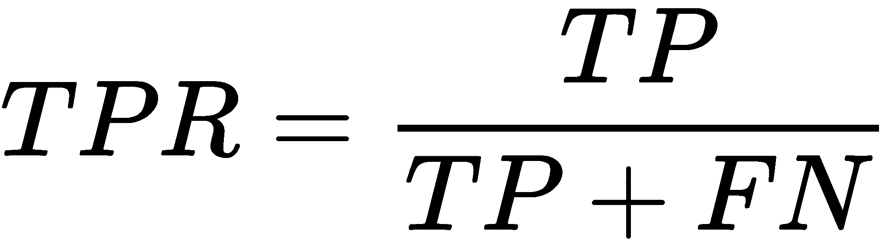


TPR 等于召回，而 FPR 值与被错误分类的负类对象的数量成比例(它们应该是正的)。在理想情况下，当没有分类错误时，我们有 FPR = 0，TPR =1，ROC 曲线下的面积将等于 1。在随机预测的情况下，ROC 曲线下的面积将等于 0.5，因为我们将有相同数量的 TP 和 FP 分类:


曲线上的每个点对应于某个阈值。请注意，曲线的陡度是一个基本特征，因为我们希望最小化 FPR，所以我们通常希望这条曲线趋向于点(0，1)。我们也可以在不平衡数据集上成功地使用 AUC-ROC 度量。Shark-ML 库中有一个名为`NegativeAUC`的类，可以用来计算 AUC-ROC。出于同样的目的，`Shogun`图书馆有一个名为`CROCEvaluation`的班级。

# 对数损失

出于优化目的，逻辑损失函数值(对数损失)用作目标损失函数。它由以下等式给出:

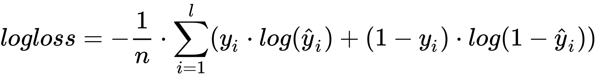

我们可以将对数损失值理解为被校正的精度，但会对不正确的预测进行惩罚。这个函数给出了很大的惩罚，即使对于单个未分类的对象也是如此，所以数据中的所有异常对象都应该单独处理或者从数据集中移除。

在`Shark-ML`库中有一个名为`CrossEntropy`的类，可以用来计算这个度量，并将其用作损失函数。出于同样的目的，`Shogun`图书馆有一个名为`CLogLoss`的班级。

# 了解偏差和方差特征

偏差和方差特征用于预测模型行为。它们是通用关键词。在我们进一步描述它们的含义之前，我们应该考虑验证。验证是一种用于测试模型性能的技术。它估计了模型对新数据的预测能力。新数据是我们在培训过程中没有使用的数据。为了执行验证，我们通常将初始数据集分成两三部分。一部分应该包含大部分数据，并将用于培训，而其他部分将用于验证和测试模型。通常，在一个训练周期(通常称为历元)后，对迭代算法进行验证。或者，我们在整个培训过程之后进行测试。

验证和测试操作根据我们从培训过程中排除的数据来评估模型，从而得出我们为该特定模型选择的性能指标的值。这些验证指标的值可用于估计模型、预测误差趋势。验证和测试最关键的问题是，它们的数据应该总是来自与训练数据相同的分布。

在本章的其余部分，我们将使用多项式回归模型来显示不同的预测行为。多项式次数将被用作超参数。

# 偏见

偏差是一种预测特征，它告诉我们模型预测和地面真实值之间的距离。通常，我们用高偏差或拟合不足这个术语来表示模型预测离地面真值太远，这意味着模型泛化能力弱。考虑以下图表:

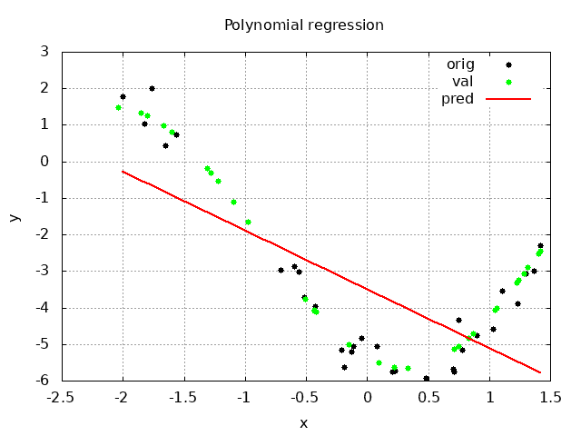

该图用黑点显示原始值，用绿点显示用于验证的值，并用一条线表示多项式回归模型输出。在这种情况下，多项式次数等于 1。我们可以看到预测值完全没有描述原始数据，所以可以说这个模型有很高的偏差。此外，我们可以绘制每个训练周期的验证指标，以获得更多关于训练过程和模型行为的信息。

下图显示了多项式回归模型训练过程的 MAE 度量值，其中多项式次数等于 1:


我们可以看到，列车和验证数据的度量值的线是平行的，并且足够远。此外，这些线在多次训练迭代后不会改变方向。这些事实还告诉我们，该模型具有很高的偏差，因为对于常规的训练过程，验证度量值应该接近训练值。

为了处理高偏差，我们可以向训练样本中添加更多的特征。例如，增加多项式回归模型的多项式次数会增加更多的特征；这些全新的特征描述了原始训练样本，因为每个附加多项式项都基于原始样本值。

# 差异

方差是一个预测特征，它告诉我们模型预测的可变性；换句话说，输出值的范围可以有多大。通常，当模型试图非常精确地包含许多训练样本时，我们使用术语高方差或过拟合。在这种情况下，该模型不能为新数据提供良好的近似，但是在训练数据上具有优异的性能。

下图显示多项式回归模型的行为，多项式次数等于 15:

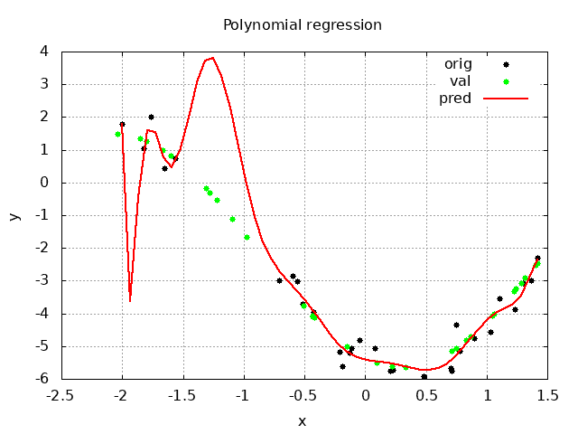

我们可以看到该模型包含了几乎所有的训练数据。请注意，训练数据用黑点表示，而用于验证的数据用绿点表示。我们可以看到，这两组数据在某种程度上彼此相距甚远，并且我们的模型由于缺乏近似性而错过了验证数据。下图显示了学习过程的 MAE 值:


我们可以看到，在大约 75 次学习迭代后，模型开始更好地预测训练数据，误差值变得更低。然而，对于验证数据，MAE 值开始增加。为了处理高方差，我们可以使用特殊的正则化技术，这将在下面的章节中讨论。我们还可以增加训练样本的数量，减少一个样本中的特征数量，以减少高方差。

我们在前面段落中讨论的性能指标图可以在训练过程的运行时绘制。我们可以使用它们来监控训练过程，以查看高偏差或高方差问题。请注意，对于多项式回归模型，MAE 是比 MSE 或 RMSE 更好的性能特征，因为平方函数平均误差太大。此外，即使是直线模型，这种数据的均方误差值也会很低，因为直线两侧的误差会相互补偿。

# 正常训练

考虑一个训练过程的情况，其中模型具有平衡的偏差和方差:

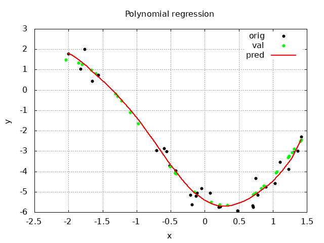

在这个图中，我们可以看到多项式回归模型对于多项式次数的输出等于 8。输出值接近训练数据和验证数据。下图显示了培训过程中的 MAE 值:


我们可以看到 MAE 值持续下降，训练和验证数据的预测值变得接近地面真实值。这意味着模型的超参数足以平衡偏差和方差。

# 正规化

正则化是一种用于减少模型过拟合的技术。有两种主要的正则化方法。第一种称为训练数据预处理。第二种是损失函数修正。损失函数修改技术的主要思想是向损失函数添加惩罚算法结果的项，从而导致显著的方差。训练数据预处理技术的思想是添加更多不同的训练样本。通常，在这种方法中，新的训练样本是通过扩充现有样本生成的。总的来说，这两种方法都给模型增加了一些关于任务领域的先验知识。这些额外的信息帮助我们进行方差正则化。因此，我们可以得出结论，正则化是导致最小化泛化误差的任何技术。

# L1 正则化–套索

L1 正则化是损失函数的附加项:


这个附加项将参数幅度的绝对值相加作为惩罚。这里， ***λ*** 是正则化系数。该系数的值越高，正则化越强，可能导致拟合不足。有时，这种类型的正则化被称为**最小绝对收缩和选择算子** ( **套索**)正则化。L1 正则化背后的一般思想是惩罚不太重要的特征。我们可以把它看作是一个特征选择过程。

在`Shark-ML`库中有一个名为`shark::OneNormRegularizer`的类，其实例可以添加到训练器中执行 L1 正则化。在`Shogun`库中，正则化通常被合并到模型(算法)类中，并且不能被改变。

# L2 正则化-岭

L2 正则化也是损失函数的附加项:


这个附加项增加了参数幅度的平方值作为惩罚。*T1】λT3】也是正则化系数。它的值越高，正则化越强，可能导致拟合不足。这种正则化类型的另一个名称是 Ridge 正则化。与 L1 正则化不同，这种类型没有特征选择特征。相反，我们可以将其解释为模型平滑度配置器。此外，L2 正则化对于基于梯度下降的优化器来说计算效率更高，因为它的微分具有解析解。*

在`Shark-ML`库中有一个名为`shark::TwoNormRegularizer`的类，它的实例可以添加到训练器中来执行 L2 正则化。在`Shogun`库中，正则化通常被合并到模型(算法)类中，并且不能被改变。这种算法的一个例子是`CKernelRidgeRegression`类，它实现了具有 L2 正则化的线性回归模型。

# 日期增加

数据增强过程可以被视为正则化，因为它向模型添加了一些关于问题的先验知识。这种方法在计算机视觉任务中很常见，例如图像分类或物体检测。在这种情况下，当我们可以看到模型开始过度拟合并且没有足够的训练数据时，我们可以增加已经拥有的图像，以增加数据集的大小，并提供更清晰的训练样本。图像增强是随机的图像旋转、裁剪和平移、镜像翻转、缩放和比例变化。

# 提前停止

提前停止训练过程也可以解释为一种正规化的形式。这意味着，如果我们检测到模型开始过度训练，我们可以停止训练过程。在这种情况下，一旦训练停止，模型就会有参数。

# 神经网络的正则化

L1 和 L2 正则化被广泛用于训练神经网络，通常被称为权重衰减。数据扩充在神经网络的训练过程中也起着重要的作用。还有其他正则化方法可以用于神经网络。例如，Dropout 是一种特别为神经网络开发的正则化类型。该算法随机丢弃一些神经网络节点；它使其他节点对其他节点的权重更加不敏感，这意味着模型变得更加健壮，并停止过度拟合。

# 用网格搜索技术选择模型

有必要有一组合适的超参数值来创建一个好的 ML 模型。其原因是，具有随机值会导致有争议的结果和行为，这是从业者所不期望的。我们可以遵循几种方法来选择最佳的超参数值集。我们可以尝试使用我们已经训练过的算法中的超参数，类似于我们的任务。我们也可以尝试找到一些试探法，并手动调整它们。然而，这项任务可以自动化。网格搜索技术是搜索最佳超参数值的自动化方法。它使用交叉验证技术进行模型性能评估。

# 交叉验证

我们已经讨论了什么是验证过程。它用于估计我们没有用于训练的模型性能数据。如果我们的训练数据集有限或很小，从原始数据集中随机采样验证数据会导致以下问题:

*   原始数据集的大小会减小。
*   有可能留下对培训部分的验证很重要的数据。

为了解决这些问题，我们可以使用交叉验证方法。它背后的主要思想是分割原始数据集，以便所有数据都将用于训练和验证。然后，对所有分区执行训练和验证过程，并对结果值进行平均。

# k 倍交叉验证

最著名的交叉验证方法是 K 倍交叉验证。其思想是将数据集划分为相同大小的 *K* 块。然后，我们使用其中一个模块进行验证，其他模块进行训练。我们重复这个过程 *K* 次，每次选择不同的块进行验证，最后，我们对所有结果进行平均。整个交叉验证周期中的数据拆分方案如下所示:

1.  将数据集划分为相同大小的 *K* 块。
2.  选择一个模块进行验证，其余模块进行培训。
3.  重复这个过程，确保每个模块都用于验证，其余模块用于训练。
4.  对每次迭代中为验证集计算的性能度量结果求平均值。

下图显示了交叉验证周期:


# 网格搜索

网格搜索方法背后的主要思想是创建一个包含最合理的超参数值的网格。网格用于快速生成合理数量的不同参数集。我们应该有一些关于任务域的先验知识来初始化网格生成的最小值和最大值，或者我们可以用一些合理的宽范围来初始化网格。但是，如果选择的范围太宽，搜索参数的过程可能需要很长时间，并且需要大量的计算资源。

在每一步，网格搜索算法选择一组超参数值并训练一个模型。之后，训练步骤算法使用 K 倍交叉验证技术来估计模型性能。我们还应该为模型比较定义一个单一的模型性能估计度量，算法将在每个模型的每个训练步骤中计算该度量。在用来自每个网格单元的每组参数完成模型训练过程之后，该算法通过比较度量值并选择最佳值来选择最佳超参数值组。通常，值最小的集合是最好的集合。

考虑这个算法在不同库中的实现。我们的任务是为多项式回归模型选择最佳的超参数集，这给我们提供了适合给定数据的最佳曲线。这个例子中的数据是一些带有随机噪声的余弦函数值。

# 幕府的例子

`Shogun`库包含网格搜索方法所需的所有类。我们从定义基础模型开始。在`Shogun`库中，我们可以为此使用`CKernelRidgeRegression`类。这个类实现了基于 SVM 算法的多项式回归模型，并使用核进行精确的模型特殊化。因此，我们可以用多项式核来模拟多项式回归模型。此外，这种内核类型有一个可配置的超参数，称为多项式次数。下面的代码示例显示了如何创建内核对象:

```cpp
auto kernel = some<CPolyKernel>(/*cache size*/ 256, /*degree*/ 15);
kernel->init(x, x);
```

请注意，内核对象需要我们的训练数据进行初始化。尽管数据规范化例程通常被合并到`Shogun`库中的算法管道中，但是内核对象需要额外的配置，因此我们将规范化对象添加到内核对象中:

```cpp
auto kernel_normaiizer = some<CSqrtDiagKernelNormalizer>();
kernel->set_normalizer(kernel_normaiizer);
```

`CKernelRidgeRegression`类已经实现了 L2(岭)正则化。下面的代码示例向我们展示了如何配置正则化系数的初始值:

```cpp
float64_t tau_regularization = 0.00000001;
float64_t tau_regularization_max = 0.000001;
auto model = some<CKernelRidgeRegression>(tau_regularization, kernel, y);
```

接下来，我们为网格搜索定义交叉验证对象。`Shogun`库中有几种我们可以使用的数据拆分策略。我们在这里选择了`CStratifiedCrossValidationSplitting`类，它实现了相同大小的折叠(数据块)进行拆分。在下面的代码片段中，我们将数据集分为五个部分:

```cpp
auto splitting_strategy = some<CStratifiedCrossValidationSplitting>(y, 5);
```

我们选择了最小均方误差作为性能指标。`CMeanSquaredError`类实现了它:

```cpp
auto evaluation_criterium = some<CMeanSquaredError>();  
```

然后，我们创建`CCrossValidation`对象，并用拆分策略对象和性能度量对象的实例初始化它:

```cpp
auto cross_validation = some<CCrossValidation>(
   model, x, y, splitting_strategy, evaluation_criterium);
cross_validation->set_autolock(false);
cross_validation->set_num_runs(1);
```

我们禁用了`CCrossValidation`对象的`autolock`，因为这个类不支持这个选项。在模型支持的情况下，该选项可以加快训练过程。我们也只为交叉验证过程配置了一次运行。我们这样做是出于演示的目的，但是对于现实项目，多次运行交叉验证是有意义的。

要定义参数网格，我们使用`CModelSelectionParameters`类。这个类的对象实现了一个树的节点，该节点包含一个超参数的预定义值范围。下面的代码显示了如何创建这样的节点树，它将是参数网格的模拟:

```cpp
auto params_root = some<CModelSelectionParameters>();
auto param_tau = some<CModelSelectionParameters>("tau");
params_root->append_child(param_tau);
param_tau->build_values(tau_regularization, tau_regularization_max,
                        ERangeType::R_LINEAR, tau_regularization_max);
auto param_kernel = some<CModelSelectionParameters>("kernel", kernel);
auto param_kernel_degree = some<CModelSelectionParameters>("degree");
param_kernel_degree->build_values(5, 15, ERangeType::R_LINEAR, 1);
param_kernel->append_child(param_kernel_degree);
params_root->append_child(param_kernel);
```

请注意，我们使用`build_values()`方法生成了一系列值。此方法将最小值和最大值作为参数。在我们配置了交叉验证和参数网格(在我们的例子中是树)对象之后，我们可以初始化并运行网格搜索算法。`CGridSearchModelSelection`类实现网格搜索算法:

```cpp
auto model_selection =
     some<CGridSearchModelSelection>(cross_validation, params_root);
auto best_parameters = model_selection->select_model(/*print_state*/
                                                     true);
best_parameters->apply_to_machine(model);
```

实例化`CGridSearchModelSelection`对象后，我们使用`select_model()`方法搜索最佳参数值。然后，我们用`apply_to_machine()`方法将它们应用到模型中。`Shogun`库不保证模型选择后会处于参数最优的训练状态。它将与最后一个处于训练状态。因此，我们需要用整个数据集重新训练模型，以获得更好的性能:

```cpp
if (!model->train(x)) {
  std::cerr << "training failed\n";
}
```

在最后的训练过程之后，模型就可以被评估了。

# 鲨鱼-ML 示例

`Shark-ML`库还包含网格搜索算法的类。然而，它没有多项式回归模型的实现，所以我们实现了这个模型和这个例子中的代码。首先，我们定义数据集的分区，它们是五个大小相同的块。以下示例显示了如何使用`createCVSameSize`功能来实现此目的:

```cpp
const unsigned int num_folds = 5;
CVFolds<RegressionDataset> folds =
      createCVSameSize<RealVector, RealVector>(train_data, num_folds);
```

因此，我们有了`CVFolds<RegressionDataset>`对象，它包含了我们的分区。然后，我们初始化并配置我们的模型。在 Shark-ML 库中，模型参数通常配置有训练器对象，训练器对象将参数传递给模型对象:

```cpp
double regularization_factor = 0.0;
double polynomial_degree = 8;
int num_epochs = 300;
PolynomialModel<> model;
PolynomialRegression trainer(regularization_factor, polynomial_degree,
                              num_epochs);
```

现在我们已经有了训练器、模型和折叠对象，我们初始化`CrossValidationError`对象。作为性能指标，我们使用了`AbsoluteLoss`对象，它实现了 MAE 指标:

```cpp
AbsoluteLoss<> loss;
CrossValidationError<PolynomialModel<>, RealVector> cv_error(
                    folds, &trainer, &model, &trainer, &loss);
```

在`Shark-ML`库中有一个名为`GridSearch`的类，我们可以用它来执行网格搜索算法。我们应该用参数范围配置这个类的对象。有`configure()`方法，以三个容器作为参数。第一个指定每个参数范围的最小值，第二个指定每个参数范围的最大值，第三个指定每个参数范围中的值的数量。请注意，范围容器中参数的顺序应该与它们在教练课程中定义的顺序相同。有关参数顺序的信息可以在相应的文档或源代码中找到:

```cpp
GridSearch grid;
std::vector<double> min(2);
std::vector<double> max(2);
std::vector<size_t> sections(2);
// regularization factor
min[0] = 0.0;
max[0] = 0.00001;
sections[0] = 6;
// polynomial degree
min[1] = 4;
max[1] = 10.0;
sections[1] = 6;
grid.configure(min, max, sections);
```

初始化网格后，我们可以使用`step()`方法进行网格搜索，寻找最佳超参数值；这个方法应该只被调用一次。与前面的`Shogun`库的例子一样，我们必须用找到的参数重新训练我们的模型:

```cpp
grid.step(cv_error);

trainer.setParameterVector(grid.solution().point);
trainer.train(model, train_data)
```

# Dlib 示例

`Dlib`库还包含网格搜索算法的所有必要功能。但是，我们应该使用函数而不是类。下面的代码片段显示了`CrossValidationScore`函数的定义。此函数执行交叉验证并返回性能指标的值:

```cpp
auto CrossValidationScore = [&](const double gamma, const double c,
                                const double degree_in) {
  auto degree = std::floor(degree_in);
  using KernelType = Dlib::polynomial_kernel<SampleType>;
  Dlib::svr_trainer<KernelType> trainer;
  trainer.set_kernel(KernelType(gamma, c, degree));
  Dlib::matrix<double> result = Dlib::cross_validate_regression_trainer(
      trainer, samples, raw_labels, 10);
  return result(0, 0);
};
```

`CrossValidationScore`函数采用被设置为参数的超参数。在这个函数中，我们为带有`svr_trainer`类的模型定义了一个训练器，它实现了基于 SVM 算法的核岭回归。我们使用了多项式内核，就像我们对`Shogun`库示例所做的那样。在我们定义了模型之后，我们使用`cross_validate_regression_trainer()`函数来用交叉验证方法训练模型。这个函数自动将我们的数据分割成折叠，最后一个参数是折叠的数量。`cross_validate_regression_trainer()`函数返回矩阵，以及不同性能指标的值。请注意，我们不需要定义它们，因为它们是在库的实现中预定义的。

该矩阵中的第一个值是平均均方误差值。我们使用这个值作为函数结果。但是，对于这个函数应该返回什么值没有很强的要求；要求是返回值应该是数字并且可以比较。另外，请注意，我们将`CrossValidationScore`函数定义为 lambda，以简化对外部范围中定义的训练数据容器的访问。

接下来，我们可以搜索用`find_min_global`功能设置的最佳参数:

```cpp
 auto result = find_min_global(
 CrossValidationScore,
 {0.01, 1e-8, 5}, // minimum values for gamma, c, and degree
 {0.1, 1, 15}, // maximum values for gamma, c, and degree
 max_function_calls(50)); 
```

此函数采用交叉验证函数、具有参数范围最小值的容器、具有参数范围最大值的容器以及交叉验证重复次数。请注意，参数范围的初始值应该与`CrossValidationScore`函数中定义的参数的顺序相同。然后，我们可以提取最佳超参数，并用它们训练我们的模型:

```cpp
double gamma = result.x(0);
double c = result.x(1);
double degree = result.x(2);
using KernelType = Dlib::polynomial_kernel<SampleType>;
Dlib::svr_trainer<KernelType> trainer;
trainer.set_kernel(KernelType(gamma, c, degree));
auto descision_func = trainer.train(samples, raw_labels)
```

我们使用了与`CrossValidationScore`函数相同的模型定义。在培训过程中，我们使用了所有的培训数据。使用训练者对象的`train`方法完成训练过程。训练结果是一个以单个样本作为参数并返回预测值的函数。

# 摘要

在这一章中，我们讨论了如何估计 ML 模型的性能，以及什么度量可以用于这种估计。我们考虑了回归和分类任务的不同指标，以及它们有哪些特征。我们还看到了如何使用性能指标来确定模型的行为，并考察了偏差和方差特征。我们研究了一些高偏差(欠拟合)和高方差(过拟合)问题，并考虑了如何解决它们。我们还了解了正则化方法，它通常用于处理过拟合。然后，我们研究了什么是验证，以及如何在交叉验证技术中使用它。我们看到交叉验证技术允许我们在训练有限数据的同时估计模型性能。在最后一部分，我们在网格搜索算法中结合了一个评估度量和交叉验证，我们可以用它来为我们的模型选择最佳的超参数集。

在下一章中，我们将学习我们可以用来解决具体问题的最大似然算法。我们将深入讨论的下一个主题是聚类——将原始对象集拆分为按属性分类的组的过程。我们将研究不同的聚类方法及其特点。

# 进一步阅读

*   为评估机器学习模型选择正确的度量标准—第 1 部分:[https://medium . com/usf-MSDS/为机器学习模型选择正确的度量标准—第 1 部分-a99d7d7414e4](https://medium.com/usf-msds/choosing-the-right-metric-for-machine-learning-models-part-1-a99d7d7414e4)
*   了解回归性能指标:[https://beinghuanman . ai/了解-回归-性能-指标-bdb0e7fcc1b3](https://becominghuman.ai/understand-regression-performance-metrics-bdb0e7fcc1b3)

*   分类性能指标:[https://nlpforhacker . io/分类-性能-指标/](https://nlpforhackers.io/classification-performance-metrics/)

*   正则化:机器学习中的一个重要概念:[https://towards data science . com/正则化-机器学习中的一个重要概念-5891628907ea](https://towardsdatascience.com/regularization-an-important-concept-in-machine-learning-5891628907ea)
*   深度学习中的正则化技术概述(Python 代码):[https://www . analyticsvidhya . com/blog/2018/04/foundation-Deep-Learning-正则化-技术](https://www.analyticsvidhya.com/blog/2018/04/fundamentals-deep-learning-regularization-techniques/)
*   了解偏差-方差权衡:[https://towards data science . com/了解偏差-方差权衡-165e6942b229](https://towardsdatascience.com/understanding-the-bias-variance-tradeoff-165e6942b229)
*   深度学习:过拟合:[https://towards data science . com/深度学习-过拟合-846bf5b35e24](https://towardsdatascience.com/deep-learning-overfitting-846bf5b35e24)
*   k 倍交叉验证的温和介绍:[https://machinelearningmastery.com/k-fold-cross-validation/](https://machinelearningmastery.com/k-fold-cross-validation/)