# 五、异常检测

异常检测是我们在给定数据集中搜索意外值的地方。异常是系统行为偏离或数据值偏离标准值。异常还有其他名称，如异常值、错误、偏差和异常。由于技术故障、事故、蓄意攻击等原因，它们可能出现在不同性质和结构的数据中。

我们可以使用许多方法和算法来搜索各种类型数据中的异常。这些方法使用不同的方法来解决同一个问题。有无监督、有监督和半监督算法。然而，在实践中，无监督方法是最受欢迎的。无监督异常检测技术在假设大部分数据集是正常的情况下，检测未标记测试数据集中的异常。它通过搜索不太可能适合数据集其余部分的数据点来实现这一点。由于异常事件的性质，无监督算法更受欢迎，与正常或预期数据相比，异常事件非常罕见，因此通常很难获得适当标记的数据集用于异常检测。

广义地说，异常检测应用于广泛的领域，例如入侵检测、欺诈检测、故障检测、健康监测、事件检测(在传感器网络中)以及环境破坏的检测。通常，在将数据传递给其他算法之前，异常检测被用作数据准备的预处理步骤。

因此，在本章中，我们将讨论最流行的无监督异常检测算法及其应用。

本章将涉及以下主题:

*   探索异常检测的应用
*   异常检测的学习方法
*   使用不同 C++ 库进行异常检测的示例

# 技术要求

完成本章示例所需的软件列表如下:

*   `Shogun-toolbox`库
*   `Shark-ML`库
*   `Dlib`库
*   `PlotCpp`库
*   支持 C++ 17 的现代 C++ 编译器
*   CMake 构建系统版本> = 3.8

The code files for this chapter can be found at the following GitHub repo: [https://github.com/PacktPublishing/Hands-On-Machine-Learning-with-CPP/tree/master/Chapter05](https://github.com/PacktPublishing/Hands-On-Machine-Learning-with-CPP/tree/master/Chapter05)

# 探索异常检测的应用

数据分析中有两个寻找异常的领域:异常值检测和新颖性检测。

一个*新对象*或新鲜感是一个属性不同于训练数据集中对象的对象。与异常值不同，新对象不在数据集中，但它可以在系统开始工作后的任何时候出现。它的任务是检测它何时出现。例如，如果我们要分析现有的温度测量值并识别异常高或异常低的值，那么我们将检测到异常值。另一方面，如果我们要创建一种算法，对于每一个新的测量，评估温度与过去值的相似性，并识别明显不同寻常的值，那么我们就在检测新奇的事物。

出现异常值的原因包括数据错误、噪声的存在、错误分类的对象以及来自其他数据集或分布的外来对象。让我们解释两种最模糊的异常值:数据错误和来自不同分布的数据。数据误差可以广义地指测量中的不准确性、舍入误差和不正确的输入。属于不同分布的对象的一个例子是来自损坏的传感器的测量值。这是因为这些值将属于一个可能与预期不同的范围。

新奇事物通常是全新的物体行为的结果。例如，如果我们的对象是计算机系统行为描述，那么在病毒侵入计算机并从这些描述中删除一些信息后，它们将被呈现为新奇的东西。另一个新奇的例子可能是一个新的客户群，他们的行为不同于其他客户，但与其他客户有一些相似之处。新奇对象的主要特征是它们是新的，因为不可能在训练集中有关于所有可能的病毒感染或故障的信息。创建这样的训练数据集是一个复杂的过程，通常没有意义。然而，幸运的是，我们可以通过关注系统或机制的普通(常规)操作来获得足够大的数据集。

通常，异常检测的任务类似于分类的任务，但有一个本质的区别:类别不平衡。例如，设备故障(异常)比设备正常运行要少得多。

我们可以在不同种类的数据中观察到异常。在下图中，我们可以看到一个数值序列异常的例子:

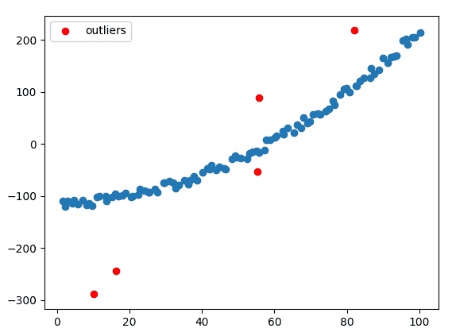

在下图中，我们可以看到图形中的异常；这些异常可以是边也可以是顶点(请参见用浅色标记的元素):

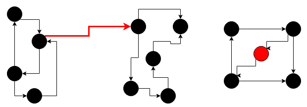

以下文本显示了字符序列中的异常:

`AABBCCCAABBCCCAACABBBCCCAABB`

异常检测任务的质量或性能可以通过使用例如 AUC-ROC 来估计，就像分类任务一样。

我们已经讨论了什么是异常，所以让我们看看有什么方法来检测它们。

# 异常检测的学习方法

在这一节中，我们将看看我们可以用于异常检测的最流行和最直接的方法。

# 用统计测试检测异常

统计测试通常用于捕捉单个特征的极值。这类测试的通称是极值分析。这种测试的一个例子是使用 Z 分数测量:


这里， <sub></sub> 是来自数据集的样本，是来自数据集的所有样本的均值， <sub></sub> 是数据集内样本的标准差。*Z*-值被放置在区间[-1，1]中，接近零的最小值是最正常或预期的值。下图显示了通过使用 *Z* 分数测试，某些类型的正态分布数据中的哪些值可以被视为异常值或异常值:


我们应该提到的一个重要概念是极值——给定数据集的最大值和最小值。重要的是要理解极值和异常是不同的概念。以下是一个小数据示例:

`[1, 39, 2, 1, 101, 2, 1, 100, 1, 3, 101, 1, 3, 100, 101, 100, 100]`

我们可以将值`39`视为异常，但不是因为它是最大值或最小值。理解异常不必是一个极端值是至关重要的。

尽管极值一般不是异常，但在某些情况下，我们可以根据异常检测的需要调整极值分析的方法。但这取决于手头的任务，应该由机器学习从业者仔细分析。

# 用局部异常因子法检测异常

基于距离测量的方法被广泛用于解决不同的机器学习问题以及异常检测。这些方法假设在对象空间中有一个特定的度量来帮助我们发现异常。当我们使用基于距离的方法进行异常检测时，一般的假设是异常只有几个邻居，而正常点有很多邻居。因此，例如，到第 *k* <sup>第</sup>邻居的距离可以作为异常的良好度量，如**局部异常因子** ( **LOF** )方法中所反映的。这种方法基于对已检查异常的物体密度的估计。位于密度最低区域的物体被认为是异常或异常值。与其他方法相比，LOF 方法的优势在于它与对象的局部密度相结合。因此，在训练数据集中存在不一定是异常的不同类别的对象的情况下，LOF 成功地识别出异常值。

例如，我们假设从物体*【A】*到最近的邻居 *k* <sup xmlns:epub="http://www.idpf.org/2007/ops">有一个距离，k 距离( *A* )。请注意，最近邻集包括该距离的所有对象。我们把 *k* 最近邻的集合表示为 *N <sub>k</sub> (A)* 。该距离用于确定可达性距离:</sup>


如果点 *A* 位于点 *B* 的 *k* 邻居之间，那么可达性距离将等于点 *B* 的 k 距离。否则，它将等于点 *A* 和点 *B* 之间的精确距离，该距离由 *dist* 函数给出。对象 *A* 的局部可达性密度定义如下:

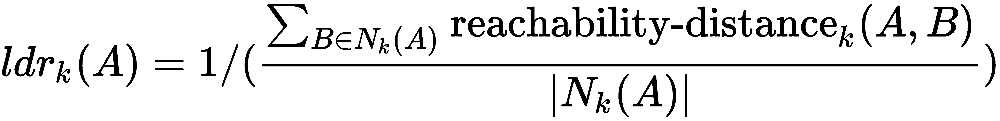

局部可达性密度是对象与其邻居的平均可达性距离 *A* 的倒数。注意，这不是邻居到 *A* 的平均可达性距离(根据定义，应该是 k 距离( *A* )，而是从其邻居可以到达 *A* 的距离。然后将本地可达性密度与邻居的本地可达性密度进行比较:


所提供的公式给出了邻居的平均局部可达性密度，除以对象本身的局部可达性密度。大约为 1 的值意味着该对象可以与其邻居进行比较(因此它不是离群值)。小于 1 的值表示密集区域(对象有许多邻居)，而明显大于 1 的值表示异常。

这种方法的缺点是结果值难以解释。值为 1 或更小表示一个点纯粹是内部的，但是没有明确的规则来确定一个点是否是异常值。在一个数据集中，值 1.1 可能表示异常值。但是，在另一个具有不同参数集的数据集中(例如，如果有局部剧烈波动的数据)，值 2 也可能表示内部对象。由于方法的局部性，这些差异也可能出现在单个数据集中。

# 用隔离林检测异常

隔离森林的思想基于蒙特卡罗原理:对特征空间进行随机划分，从而平均而言，将隔离点与正常点隔离开。最终结果在随机算法的几次运行中平均，结果将形成相应树的隔离森林。隔离树算法随后构建随机二进制决策树。树根是整个特征空间。在下一个节点中，选择随机特征和随机划分阈值，并且从所选特征的最小值和最大值范围上的均匀分布中对它们进行采样。停止标准是节点中所有对象的完全一致，这意味着决策树的构建已经完成。叶子的标记是算法的`anomaly_score`值，即叶子在构建的树中的深度。以下公式显示了如何计算异常分数:

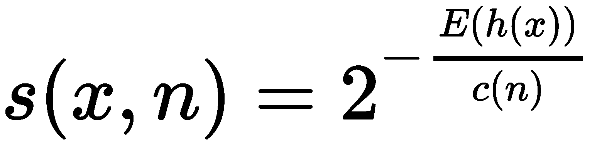

这里，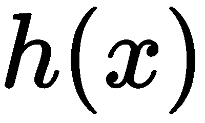是观察的路径长度，，是来自隔离树集合的的平均值，是在二叉查找树搜索不成功的平均路径长度，是外部节点的数量。

我们假设异常出现在靠近根的低深度的叶子中是很常见的，但是对于常规的对象，树将建立更多的层次。此类级别的数量与集群的大小成比例。因此，`anomaly_score`与其中的点成正比。

这一假设意味着来自小尺寸集群(可能是异常)的对象将比来自常规数据集群的对象具有更低的`anomaly_score`:


# 用一类 SVM 检测异常

支持向量方法是一种基于使用超平面将对象划分为类的二元分类方法。超平面的尺寸总是被选择成小于原始空间的尺寸。例如在 <sub></sub> 中，超平面就是一个普通的二维平面。从超平面到每个类的距离应该尽可能短。最接近分离超平面的向量称为支持向量。实际上，数据可以被超平面分割的情况——换句话说，线性情况——非常罕见。在这种情况下，使用特殊的映射将训练数据集的所有元素嵌入到更高维度的空间中。在这种情况下，选择映射使得在新空间中，数据集是线性可分的。

**一类 SVM** ( **OCSVM** )是支持向量法的一种适应，侧重于异常检测。OCSVM 与标准版 SVM 的不同之处在于，由此产生的优化问题包括用于确定小百分比的预定异常值的改进，这允许使用该方法来检测异常。这些异常值位于起始点和最佳分离超平面之间。属于同一类别的所有其他数据落在最佳分离超平面的相反侧。

还有另一种类型的开放式支持向量机使用球面方法，而不是平面(或线性)方法。该算法在数据周围的特征空间中获得球形边界。这个超球面的体积被最小化，以减少在解中包含异常值的影响。

OCSVM 分配一个标签，即从测试数据点到最优超平面的距离。OCSVM 输出中的正值代表正常行为(较高的值代表较大的正常性)，而负值代表异常行为(值越低，异常越显著)。

# 用于异常检测的密度估计方法(多元高斯分布)

让我们假设我们在一个数据集中有一些样本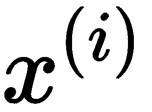，并且它们被标记并且正态分布(高斯分布)。在这种情况下，我们可以使用分布属性来检测异常。假设函数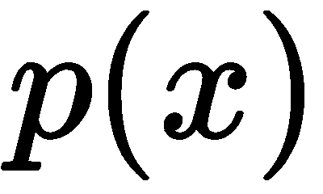给出了样本正常的概率。高概率对应常规样本，低概率对应异常。因此，我们可以使用以下**异常模型**公式选择阈值来区分规则值和异常:


如果[ 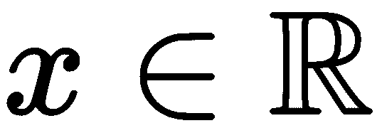 ]和遵循均值为，方差为的高斯分布，则表示如下:


以下公式给出了在高斯分布中的概率:


这里， <sub xmlns:epub="http://www.idpf.org/2007/ops"></sub> 是均值， <sub xmlns:epub="http://www.idpf.org/2007/ops">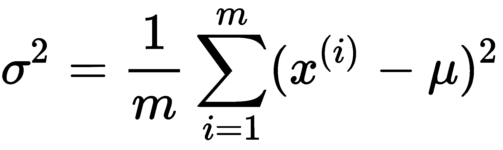是方差(是标准差)。</sub>

接下来，我们将介绍一个使用高斯分布密度估计进行异常检测的一般方法示例:

1.  假设我们得到了一个新的例子， <sub>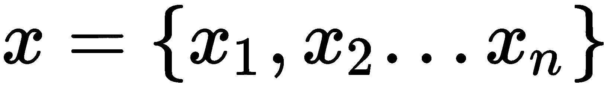。</sub>
2.  选择规则的特征，这意味着它们决定异常行为。
3.  拟合和参数。
4.  计算 <sub></sub> 用一个方程计算在高斯分布中的概率。
5.  通过与阈值进行比较，确定是否为异常；参见**异常模型**公式。

下图显示了正态分布数据的高斯分布密度估计示例:


在这种方法中，我们假设所选特征是独立的，但是通常在真实数据中，它们之间存在一些相关性。在这种情况下，我们应该使用多变量高斯分布模型，而不是单变量模型。

以下公式给出了多元高斯分布中的概率:


这里，是均值，是相关矩阵，是矩阵的行列式，:


下图显示了具有相关数据的数据集的单变量和多变量高斯分布估计模型之间的差异。请注意，分布边界如何用蓝色覆盖常规数据，而异常用较浅的颜色标记:

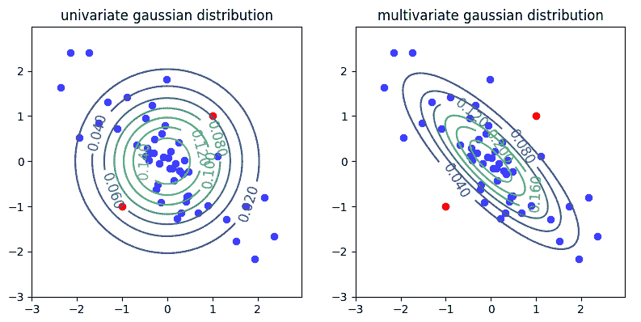

我们可以看到，多元高斯分布可以考虑数据中的相关性，并使其形状适应这些相关性。这一特性使我们能够正确检测其分布遵循高斯(正态)分布形状的数据类型的异常。

在本节中，我们讨论了各种异常检测方法，在接下来的部分中，我们将看到如何使用各种 C++ 库来处理异常检测任务。

# 使用不同 C++ 库进行异常检测的示例

在本节中，我们将看一些如何实现我们之前描述的异常检测算法的例子。

# 异常检测隔离森林算法的 C++ 实现

隔离森林算法可以很容易地用纯 C++ 实现，因为它的逻辑非常简单。此外，在流行的 C++ 库中没有该算法的实现。让我们假设我们的实现将只用于二维数据。我们将检测一系列样本中的异常，其中每个样本包含相同数量的特征。

因为我们的数据集足够大，我们可以为实际的数据容器定义一个包装器。这使我们能够减少对实际数据执行的复制操作数量:

```cpp
 using DataType = double;
 template <size_t Cols>
 using Sample = std::array<DataType, Cols>;
 template <size_t Cols>
 using Dataset = std::vector<Sample<Cols>>;
 ...
 template <size_t Cols>
 struct DatasetRange {
     DatasetRange(std::vector<size_t>&& indices, const Dataset<Cols>* 
     dataset)
         : indices(std::move(indices)), dataset(dataset) {}
     size_t size() const { return indices.size(); }
     DataType at(size_t row, size_t col) const {
         return (*dataset)[indices[row]][col];
     }

     std::vector<size_t> indices;
     const Dataset<Cols>* dataset;
 };
```

`DatasetRange`类型包含对`Sample`类型对象的`vector`和指向数据集中样本的索引容器的引用。这些索引定义了这个`DatasetRange`对象所指向的确切数据集对象。

接下来，我们定义隔离树的元素，第一个是`Node`类型:

```cpp
struct Node {
     Node() {}
     Node(const Node&) = delete;
     Node& operator=(const Node&) = delete;
     Node(std::unique_ptr<Node> left,
          std::unique_ptr<Node> right,
          size_t split_col,
          DataType split_value)
         : left(std::move(left)),
           right(std::move(right)),
           split_col(split_col),
           split_value(split_value) {}
     Node(size_t size) : size(size), is_external(true) {}

     std::unique_ptr<Node> left;
     std::unique_ptr<Node> right;
     size_t split_col{0};
     DataType split_value{0};
     size_t size{0};
     bool is_external{false};
 };
```

这种类型是常规的树节点结构。以下成员特定于隔离树算法:

*   `split_col`:这是算法导致拆分的特征列的索引。
*   `split_value`:这是算法导致分裂的特征的值。
*   `size`:这是节点的底层项目数。
*   `is_external`:这是表示节点是否为叶子的标志。

以`Node`类型为基础，我们可以定义建立隔离树的过程。我们将该程序与辅助`IsolationTree`类型合并。因为当前算法基于随机拆分，所以辅助数据是随机引擎对象。

我们只需要初始化这个对象一次，然后它将在所有树型对象之间共享。这种方法允许我们在不断播种的情况下使算法的结果可再现。此外，它使随机化算法的调试变得更加简单:

```cpp
 template <size_t Cols>
 class IsolationTree {
 public:
     using Data = DatasetRange<Cols>;

     IsolationTree(const IsolationTree&) = delete;
     IsolationTree& operator=(const IsolationTree&) = delete;
     IsolationTree(std::mt19937* rand_engine, Data data, size_t hlim)
         : rand_engine(rand_engine) {
         root = MakeIsolationTree(data, 0, hlim);
     }
     IsolationTree(IsolationTree&& tree) {
         rand_engine = std::move(tree.rand_engine);
         root = td::move(tree.root);
     }

     double PathLength(const Sample<Cols>& sample) {
         return PathLength(sample, root.get(), 0);
     }

 private:
     std::unique_ptr<Node> MakeIsolationTree(const Data& data,
                                             size_t height,
                                             size_t hlim);

     double PathLength(const Sample<Cols>& sample,
                       const Node* node,
                       double height);

 private:
     std::mt19937* rand_engine;
     std::unique_ptr<Node> root;
 };
```

接下来，我们将在`MakeIsolationTree()`方法中进行最关键的工作，该方法在构造函数中用于初始化根数据成员:

```cpp
std::unique_ptr<Node> MakeIsolationTree(const Data& data,
                                         size_t height,
                                         size_t hlim) {
     auto len = data.size();
     if (height >= hlim || len <= 1) {
         return std::make_unique<Node>(len);
     } else {
         std::uniform_int_distribution<size_t> cols_dist(0, Cols - 1);
         auto rand_col = cols_dist(*rand_engine);

         std::unordered_set<DataType> values;
         for (size_t i = 0; i < len; ++ i) {
             auto value = data.at(i, rand_col);
             values.insert(value);
         }

         auto min_max = std::minmax_element(values.begin(), values.end());
         std::uniform_real_distribution<DataType> 
            value_dist(*min_max.first, *min_max.second);
         auto split_value = value_dist(*rand_engine);

         std::vector<size_t> indices_left;
         std::vector<size_t> indices_right;
         for (size_t i = 0; i < len; ++ i) {
             auto value = data.at(i, rand_col);
             if (value < split_value) {
                 indices_left.push_back(data.indices[i]);
             } else {
                 indices_right.push_back(data.indices[i]);
             }
         }

         return std::make_unique<Node>(
             MakeIsolationTree(Data{std::move(indices_left), data.dataset},
                           height + 1, hlim),
             MakeIsolationTree(Data{std::move(indices_right), 
                           data.dataset}, height + 1, hlim),
             rand_col,
             split_value);
     }
 }
```

最初，我们检查终止条件以停止拆分过程。如果遇到它们，我们会返回一个标记为外部叶的新节点。否则，我们开始分割传递的数据范围。对于分割，我们随机选择特征列，并确定所选特征的唯一值。然后，我们从所有样本的特征值中从**最大**和**最小**值之间的间隔中随机选择一个值。在我们进行这些随机选择之后，我们将所选分割特征的值与来自输入数据范围的所有样本进行比较，并将它们的索引放入两个列表中。一个列表用于高于拆分值的值，而另一个列表用于低于拆分值的值。然后，我们返回一个新的树节点，该节点用对左节点和右节点的引用初始化，这些节点用对`MakeIsolationTree()`方法的递归调用初始化。

`IsolationTree`类型的另一个重要方法是`PathLength()`方法。我们用它来计算异常分数。它将样本作为输入参数，并从根节点返回对应树叶的摊销路径长度:

```cpp
double PathLength(const Sample<Cols>& sample,
                   const Node* node,
                   double height) {
     assert(node != nullptr);
     if (node->is_external) {
         return height + CalcC(node->size);
     } else {
         auto col = node->split_col;
         if (sample[col] < node->split_value) {
             return PathLength(sample, node->left.get(), height + 1);
         } else {
             return PathLength(sample, node->right.get(), height + 1);
         }
     }
 }
```

`PathLength()`方法在树遍历过程中根据样本特征值找到叶节点。这些值用于根据当前节点拆分值选择树的遍历方向。在每个步骤中，这种方法还会增加最终的高度。该方法的结果是实际的树遍历高度和调用`CalcC()`函数返回的值的总和，然后该函数返回与叶节点高度相等的二叉查找树中不成功搜索的平均路径长度。`CalcC()`功能可以通过以下方式实现，根据原论文中描述隔离森林算法的公式(可以在*中找到对此的参考，进一步阅读*部分):

```cpp
 double CalcC(size_t n) {
     double c = 0;
     if (n > 1)
         c = 2 * (log(n - 1) + 0.5772156649) - (2 * (n - 1) / n);
     return c;
 }
```

算法实现的最后一部分是创建森林。森林是从原始数据集中随机选择的有限数量的样本构建的树的阵列。用于构建树的样本数量是该算法的超参数。此外，该实现使用试探法作为停止标准，因为它是最大树高`hlim`值。

让我们看看它在树构建过程中是如何使用的。`hlim`值只计算一次，下面的代码显示了这一点。此外，它基于用于构建单个树的样本数量:

```cpp
template <size_t Cols>
 class IsolationForest {
 public:
     using Data = DatasetRange<Cols>;

     IsolationForest(const IsolationForest&) = delete;
     IsolationForest& operator=(const IsolationForest&) = delete;
     IsolationForest(const Dataset<Cols>& dataset,
     size_t num_trees,
     size_t sample_size)
     : rand_engine(2325) {
         std::vector<size_t> indices(dataset.size());
         std::iota(indices.begin(), indices.end(), 0);

         size_t hlim = static_cast<size_t>(ceil(log2(sample_size)));
         for (size_t i = 0; i < num_trees; ++ i) {
             std::vector<size_t> sample_indices;
             std::sample(indices.begin(), indices.end(),
             std::back_insert_iterator(sample_indices), sample_size,
             rand_engine);
             trees.emplace_back(&rand_engine,
             Data(std::move(sample_indices), &dataset), hlim);
         }

         double n = dataset.size();
         c = CalcC(n);
     }

     double AnomalyScore(const Sample<Cols>& sample) {
         double avg_path_length = 0;
         for (auto& tree : trees) {
             avg_path_length += tree.PathLength(sample);
         }
         avg_path_length /= trees.size();

         double anomaly_score = pow(2, -avg_path_length / c);
         return anomaly_score;
     }

 private:
     std::mt19937 rand_engine;
     std::vector<IsolationTree<Cols>> trees;
     double c{0};
 };
 }
```

树林建立在`IsolationForest`类型的构造器中。我们还计算了构造函数中所有样本在二叉查找树搜索失败的平均路径长度值。我们在`AnomalyScore()`方法中使用这个森林进行异常检测的实际过程。它实现了给定样本的异常分值公式。它返回一个值，可以这样解释:如果返回值接近`1`，则样本具有异常特征，而如果值小于`0.5`，则我们可以假设样本是正常的。

下面的代码展示了我们如何使用这个算法。此外，它使用`Dlib`基元表示数据集:

```cpp
void IsolationForest(const Matrix& normal,
                      const Matrix& test) {
     iforest::Dataset<2> dataset;
     auto put_to_dataset = [&](const Matrix& samples) {
         for (long r = 0; r < samples.nr(); ++ r) {
             auto row = dlib::rowm(samples, r);
             double x = row(0, 0);
             double y = row(0, 1);
             dataset.push_back({x, y});
         }
     };

     put_to_dataset(normal);
     put_to_dataset(test);

     iforest::IsolationForest iforest(dataset, 300, 50);

     double threshold = 0.6;  // change this value to see isolation 
                              // boundary
     for (auto& s : dataset) {
         auto anomaly_score = iforest.AnomalyScore(s);
         // std::cout << anomaly_score << " " << s[0] << " " << s[1]
         // << std::endl;

         if (anomaly_score < threshold) {
             // Do something with normal
         } else {
             // Do something with anomalies
         }
     }
 }
```

在前面的例子中，我们为适合我们算法的容器转换并合并了给定的数据集。然后，我们初始化`IsolationForest`类型的对象，它立即用以下超参数构建隔离林:树的数量是 100，一棵树使用的样本数量是 50。

最后，我们对数据集中的每个样本调用`AnomalyScore()`方法，以便用阈值检测异常并返回它们的值。在下图中，我们可以看到使用`Isolation Forest`算法后的异常检测结果。红点是异常:


# 使用 Dlib 库进行异常检测

`Dlib`库提供了几个我们可以用于异常检测的实现算法:OCSVM 模型和多元高斯模型。

# 一-卡斯·SVM 和德利布

在`Dlib`库中，只有一种算法是开箱即用的:OCSVM。这个库中有一个`svm_one_class_trainer`类，可以用来训练相应的算法，应该配置一个内核对象，还有`nu`参数，控制解的平滑度(换句话说，控制泛化和过拟合的比例的程度)。

最广泛使用的核是基于高斯分布的，被称为径向基核。在`radial_basis_kernel`类中实现。通常，我们将`Dlib`库中的数据集表示为单独样本的 C++ `vector`。因此，在使用这个训练器对象之前，我们必须将矩阵数据集转换为向量:

```cpp
void OneClassSvm(const Matrix& normal,
                  const Matrix& test) {
     typedef matrix<double, 0, 1> sample_type;
     typedef radial_basis_kernel<sample_type> kernel_type;
     svm_one_class_trainer<kernel_type> trainer;
     trainer.set_nu(0.5);             // control smoothness of the solution
     trainer.set_kernel(kernel_type(0.5));  // kernel bandwidth
     std::vector<sample_type> samples;
     for (long r = 0; r < normal.nr(); ++ r) {
         auto row = rowm(normal, r);
         samples.push_back(row);
     }
     decision_function<kernel_type> df = trainer.train(samples);
     Clusters clusters;
     double dist_threshold = -2.0;

     auto detect = [&](auto samples) {
         for (long r = 0; r < samples.nr(); ++ r) {
             auto row = dlib::rowm(samples, r);
             auto dist = df(row);
             if (p > dist_threshold) {
                 // Do something with anomalies
             } else {
                 // Do something with normal
             }
         }
     };

     detect(normal);
     detect(test);
 }
```

训练过程的结果是`decision_function<kernel_type>`类的一个决策函数对象，我们可以用它来进行单样本分类。这种类型的对象可以用作常规函数。决策函数的结果是与正常类边界的距离，因此最远的样本可以归类为异常。下图显示了`Dlib`库中的 OCSVM 算法如何工作的示例。请注意，红点对应异常:

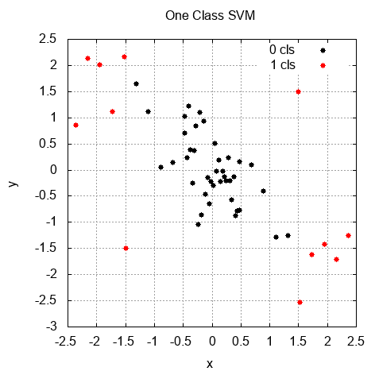

# 带 Dlib 的多元高斯模型

使用`Dlib`库(或者任何其他库)的线性代数工具，我们可以用多元高斯分布方法实现异常检测。以下示例显示了如何使用`Dlib`线性代数例程实现这种方法:

```cpp
void multivariateGaussianDist(const Matrix& normal,
                               const Matrix& test) {
     // assume that rows are samples and columns are features

     // calculate per feature mean
     dlib::matrix<double> mu(1, normal.nc());
     dlib::set_all_elements(mu, 0);

     for (long c = 0; c < normal.nc(); ++ c) {
         auto col_mean = dlib::mean(dlib::colm(normal, c));
         dlib::set_colm(mu, c) = col_mean;
     }

     // calculate covariance matrix
     dlib::matrix<double> cov(normal.nc(), normal.nc());
     dlib::set_all_elements(cov, 0);
     for (long r = 0; r < normal.nr(); ++ r) {
         auto row = dlib::rowm(normal, r);
         cov += dlib::trans(row - mu) * (row - mu);
     }
     cov *= 1.0 / normal.nr();
     double cov_det = dlib::det(cov); // matrix determinant
     dlib::matrix<double> cov_inv = dlib::inv(cov); // inverse matrix

     // define probability function
     auto first_part =
     1\. / std::pow(2\. * M_PI, normal.nc() / 2.) / std::sqrt(cov_det);

     auto prob = [&](const dlib::matrix<double>& sample) {
         dlib::matrix<double> s = sample - mu;
         dlib::matrix<double> exp_val_m = s * (cov_inv * dlib::trans(s));
         double exp_val = -0.5 * exp_val_m(0, 0);
         double p = first_part * std::exp(exp_val);
         return p;
     };

     // change this parameter to see the decision boundary
     double prob_threshold = 0.001;

     auto detect = [&](auto samples) {
         for (long r = 0; r < samples.nr(); ++ r) {
             auto row = dlib::rowm(samples, r);
             auto p = prob(row);
             if (p >= prob_threshold) {
                 // Do something with anomalies
             } else {
                 // Do something with normal
             }
         }
     };

     detect(normal);
     detect(test);
 }
```

这种方法的思想是定义一个返回出现概率的函数，给定数据集中的一个样本。为了实现这样的功能，我们计算训练数据集的统计特征。在第一步中，我们计算每个特征的平均值，并将它们存储到一维矩阵中。然后，我们使用相关矩阵的公式计算训练样本的协方差矩阵，该公式在先前的理论部分*异常检测的密度估计方法*中给出。接下来，我们确定相关矩阵行列式和逆版本。我们定义了一个名为`prob`的λ函数，使用*异常检测密度估计方法*部分中给出的概率计算公式来计算单个样本的概率。我们还定义了一个概率阈值来分离异常。

然后，我们迭代所有的例子(包括训练和测试数据集)来找出算法如何从异常中分离出规则样本。在下图中，我们可以看到这种分离的结果。标有较浅颜色的点是异常点:

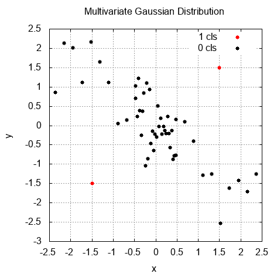

# 幕府的开放式计算机支持向量机

幕府图书馆中的异常检测算法用 OCSVM 算法表示。该算法分两类实现:`CSVMLightOneClass`和`CLibSVMOneClass`。注意，它们对于 SVM 实现有不同的后端:前者使用`SVMLight`库([http://svmlight.joachims.org/](http://svmlight.joachims.org/))，而后者使用`LibSVM`库([https://www.csie.ntu.edu.tw/~cjlin/libsvm/](https://www.csie.ntu.edu.tw/~cjlin/libsvm/))。

让我们从使用`CLibSVMOneClass`类进行异常检测开始:

```cpp
 auto csv_file = some<CCSVFile>(dataset_name.string().c_str());
 Matrix data;
 data.load(csv_file);

 Matrix train = data.submatrix(0, 50);
 train = train.clone();
 Matrix test = data.submatrix(50, data.num_cols);
 test = test.clone();

 // create a dataset
 auto features = some<CDenseFeatures<DataType>>(train);
 auto test_features = some<CDenseFeatures<DataType>>(test);

 auto gauss_kernel = some<CGaussianKernel>(features, features, 0.5);

 auto c = 0.5;
 auto svm = some<CLibSVMOneClass>(c, gauss_kernel);
 svm->train(features);

 double dist_threshold = -3.15;

 auto detect = [&](Some<CDenseFeatures<DataType>> data) {
     auto labels = svm->apply(data);
     for (int i = 0; i < labels->get_num_labels(); ++ i) {
         auto dist = labels->get_value(i);
         if (dist > dist_threshold) {
             // Do something with anomalies
         } else {
             // Do something with normal
         }
     }
 };

 detect(features);
 detect(test_features);
```

首先，我们从 CSV 文件中加载数据集，使其成为`Matrix`类型的对象，并将其分为两部分进行训练和测试。然后，我们声明了`CDenseFeatures`类型的对象，以便在幕府算法中使用加载的数据。接下来，我们声明了`CGaussianKernel`类型的内核对象，并使用它来初始化`CLibSVMOneClass`类型的 SVM 算法对象。请注意，SVM 对象还采用了一个控制解的平滑度的参数。在 SVM 对象就位后，我们对训练数据集使用`train()`方法来使算法适合我们的数据。最后，我们定义了一个距离阈值，并在每个数据集上使用`apply()`方法来检测异常。请注意，我们在这里使用了不同于`Dlib`实现的阈值。下图显示了该算法的结果与我们的多元高斯分布方法相同。数据集中的两个样本被检测为异常，因为它们是人工添加到数据集中的:

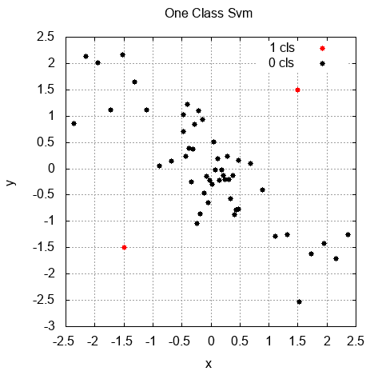

# 基于鲨鱼最大似然的开放式支持向量机

`Shark-ML`库还实现了异常检测的 OCSVM 算法。在这种情况下，`OneClassSvmTrainer`和`KernelExpansion`类实现算法。以下示例显示了它的工作原理:

```cpp
 UnlabeledData<RealVector> data;
 importCSV(data, dataset_name);

 // separate last two samples in test dataset
 data.splitBatch(0, 50);
 auto test_data = data.splice(1);

 double gamma = 0.5;  // kernel bandwidth parameter
 GaussianRbfKernel<> kernel(gamma);
 KernelExpansion<RealVector> ke(&kernel);

 double nu = 0.5;  // parameter of the method for controlling the 
                   //smoothness of the solution

 OneClassSvmTrainer<RealVector> trainer(&kernel, nu);
 trainer.stoppingCondition().minAccuracy = 1e-6;
 trainer.train(ke, data);

 double dist_threshold = -0.2;
 RealVector output;
 auto detect = [&](const UnlabeledData<RealVector>& data) {
     for (size_t i = 0; i < data.numberOfElements(); ++ i) {
         ke.eval(data.element(i), output);
         if (output[0] > dist_threshold) {
             // Do something with anomalies
         } else {
             // Do something with normal
         }
     }
 };
 detect(data);
 detect(test_data);
```

首先，我们从 CSV 文件中加载`UnlabeledData`类的对象，并将其分成两部分:一部分用于训练，一部分用于测试。然后，我们声明了`GaussianRbfKernel`类型的内核对象，并用它初始化了`KernelExpansion`类的一个对象。`KernelExpansion`类实现了仿射线性核扩展。这可以用以下公式表示:

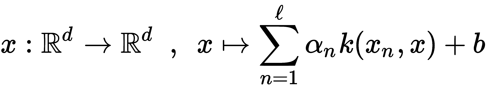

使用这个对象的类型是 Shark-ML API 定义的要求，但是我们可以使用它来更精确地配置算法。在我们放置好内核扩展对象之后，我们初始化了`OneClassSvmTrainer`类的一个对象并对其进行了配置。我们还配置了停止标准和解决方案平滑度参数。然后，我们使用`train()`方法将该算法拟合到我们的训练数据中。训练完成后，我们使用`KernelExpansion`对象的`eval()`方法来检测异常。这个方法返回的值可以解释为离类边界的距离。通过这样做，我们可以将它们与阈值进行比较。

# 摘要

在这一章中，我们研究了数据中的异常现象。我们讨论了几种异常检测方法，并研究了两种异常:异常值和新奇值。我们考虑了这样一个事实，即异常检测主要是一个无监督的学习问题，但尽管如此，一些算法需要标记数据，而其他算法是半监督的。究其原因，一般在异常检测任务中存在极少数的正例(即异常样本)和大量的负例(即标准样本)。

换句话说，我们通常没有足够的正样本来训练算法。这就是为什么有些解决方案使用标记数据来提高算法的泛化能力和精度。相反，监督学习通常需要大量的正反例，它们的分布需要平衡。

此外，请注意，检测异常的任务没有一个单一的公式，并且根据数据的性质和具体任务的目标，通常会有不同的解释。此外，选择正确的异常检测方法主要取决于任务、数据和可用的先验信息。我们还了解到，不同的库可以给出稍微不同的结果，即使是对于相同的算法。

在下一章中，我们将讨论降维方法。这些方法帮助我们将高维数据降维为低维数据的新表示，同时保留原始数据的基本信息。

# 进一步阅读

*   异常检测学习资源:[https://github.com/yzhao062/anomaly-detection-resources](https://github.com/yzhao062/anomaly-detection-resources)。
*   异常检测:A 教程:[http://webdocs . cs . ualberta . ca/~ icdm 2011/downloads/icdm 2011 _ exception _ Detection _ Tutorial . pdf](http://webdocs.cs.ualberta.ca/~icdm2011/downloads/ICDM2011_anomaly_detection_tutorial.pdf)。
*   异常检测(机器学习基础系列):[https://machinelearning medium . com/2018/05/02/异常检测/](https://machinelearningmedium.com/2018/05/02/anomaly-detection/) 。
*   单类支持向量机异常检测:在黑色素瘤预后中的应用:[https://www.ncbi.nlm.nih.gov/pmc/articles/PMC3041295/](https://www.ncbi.nlm.nih.gov/pmc/articles/PMC3041295/)。
*   一类支持向量机简介:[http://rvlasveld . github . io/blog/2013/07/12/一类支持向量机简介/](http://rvlasveld.github.io/blog/2013/07/12/introduction-to-one-class-support-vector-machines/) 。
*   隔离森林:[https://feitonyliu . files . WordPress . com/2009/07/Liu-ifest . pdf](https://feitonyliu.files.wordpress.com/2009/07/liu-iforest.pdf)。