# 九、集成学习

任何从事数据分析和机器学习工作的人都会明白，没有一种方法是理想的或通用的。这就是为什么有这么多方法。研究人员和爱好者多年来一直在寻求各种模型的准确性、简单性和可解释性之间的折衷。而且，如何提高模型的精度，最好不改变其本质？提高模型精度的一种方法是创建和训练模型集成——即用于解决同一问题的模型集。集成训练方法是训练最后一组简单分类器，随后将它们的预测结果合并成聚合算法的单个预测。

本章描述了什么是集成学习，存在哪些类型的集成，以及它们如何帮助获得更好的预测性能。在本章中，我们还将使用不同的 C++ 库实现这些方法的示例。

本章将涵盖以下主题:

*   集成学习综述
*   了解决策树和随机森林
*   使用 C++ 库创建系综的示例

# 技术要求

本章要求的技术和安装如下:

*   `Eigen`图书馆
*   `Armadillo`图书馆
*   `mlpack`图书馆
*   支持 C++ 17 的现代 C++ 编译器
*   CMake 构建系统版本> = 3.8

本章的代码文件可在以下 GitHub repo 中找到:[https://GitHub . com/PacktPublishing/动手机器学习与 CPP/tree/master/Chapter09](https://github.com/PacktPublishing/Hands-On-Machine-Learning-with-CPP/tree/master/Chapter09)

# 集成学习综述

模型集合的训练被理解为训练最终一组基本算法的过程，然后将这些基本算法的结果组合起来形成聚集分类器的预测。模型集成的目的是提高聚集分类器的预测精度，特别是与每个基本分类器的精度相比。很明显，组合简单的分类器可以给出比单独使用每个简单分类器更准确的结果。尽管如此，简单的分类器可以在特定的数据集上足够精确，但同时，它们也可能在不同的数据集上出错。

系综的一个例子是**孔多塞的陪审团定理** (1784)。陪审团必须达成正确或不正确的共识，每个陪审员都有独立的意见。如果每个陪审员做出正确决定的概率大于 0.5，那么整个陪审团做出正确决定的概率(趋向于 1)会随着陪审团的规模而增加。如果每个陪审员做出正确决定的概率小于 0.5，那么随着陪审团规模的增加，做出正确决定的概率单调下降(趋于零)。

定理如下:

*   *N* :评审团成员人数
*   <sub></sub> :陪审团成员做出正确决定的概率
*   ***μ*** :整个陪审团做出正确决定的概率
*   **m** :陪审团成员的最低多数:


*   <sub></sub> :由 *I* 得到的 *N* 的组合数:


若 <sub></sub> 则 <sub>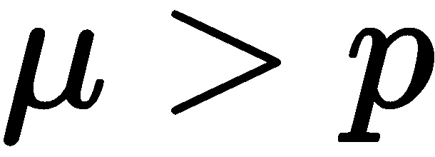为</sub>

若 <sub></sub> 则 <sub>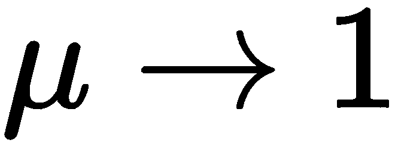为</sub>

因此，基于一般推理，分类器集成能够成功的三个原因可以被区分如下:

*   **统计**:分类算法可以看作是在 ***H*** 假设空间中的一个搜索过程，关注数据的分布，以便找到最佳假设。通过从最终的数据集学习，该算法可以找到同样好地描述训练样本的许多不同假设。通过建立一组模型，我们*平均出*每个假设的误差，并减少不稳定性和随机性对新假设形成的影响。
*   **计算性**:大部分学习算法都使用寻找特定目标函数极值的方法。例如，神经网络使用**梯度下降** ( **GD** )方法来最小化预测误差。决策树使用贪婪算法来最小化数据熵。这些优化算法可能会陷入局部极值点，这是一个问题，因为它们的目标是找到全局最优。在源数据的不同子集上训练的组合简单分类器的预测结果的模型集合具有更高的机会找到全局最优，因为它们从初始假设集合中的不同点开始搜索最优。
*   **代表性**:组合假设可能不在简单分类器的可能假设集中。因此，通过构建一个组合假设，我们扩展了可能假设的集合。

孔多塞的陪审团定理和前面提供的理由并不完全适合真实的、实际的情况，因为算法不是独立的(它们解决一个问题，它们在一个目标向量上学习，并且只能使用一个模型，或者少量模型)。

因此，应用集成开发中的大多数技术都旨在确保集成的多样性。这允许通过其他算法的正确操作来补偿单个对象中的单个算法的错误。总的来说，构建集成可以提高简单算法的质量和多样性。

最简单的集合类型是模式平均，即集合中的每个成员对最终预报做出相同的贡献。事实上，每个模式对最终集合的预报有相同的贡献，这是这种方法的一个局限。问题在于不平衡的贡献。尽管如此，仍有一个要求，即全体成员的预测技能高于随机概率。

然而，众所周知，一些模型比其他模型工作得更好或更差。可以进行一些改进来解决这个问题，使用加权集成，其中每个成员对最终预测的贡献由模型的性能加权。当模型的权重为小正值且所有权重之和等于 1 时，权重可以表示对每个模型的信心百分比(或预期性能)。

此时，最常见的集成构建方法如下:

*   **装袋**:这是在同一训练集的不同随机样本上并行学习的模型集合。最终的结果由整体算法的投票决定。例如，在分类中，选择由最多分类器预测的类别。
*   **Boosting** :这是一个顺序训练的模型的集合，每个连续的算法都是在之前的算法出错的样本上训练的。
*   **堆叠**:这是一种将训练集划分为***【N】***块，并在其中 ***N-1*** 块上训练一组简单模型的方法。然后在剩余的块上训练第 N 个**模型，但是底层算法的输出(形成所谓的**元属性**)被用作目标变量。**
***   **随机森林**:这是一组独立构建的决策树，其答案进行平均，以多数票决定。**

 **以下各节详细讨论了前面描述的方法。

# 使用打包方法创建合奏

**Bagging** (来自 bootstrap 聚合)是最早也是最直接的合奏类型之一。装袋是基于统计自举方法，旨在获得最准确的样本估计，并将结果扩展到整个人口。引导方法如下。

假设有一个大小为 *M* 的 *X* 数据集。均匀地从数据集 *N* 个对象中获取并返回每个对象。在选择下一个之前，我们可以生成 *N* 个子数据集。这个程序是指 *N* 次，我们选择任意一个样本对象(我们假设每个对象都是*以相同的概率 <sub>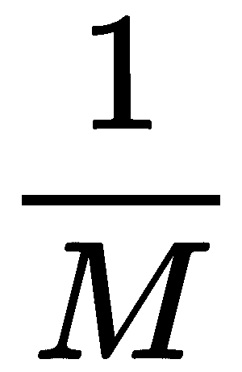</sub> 拾取*，每次都是从所有原始的 *M* 个对象中选择。

我们可以把它想象成一个用来取球的袋子。在给定步骤中选择的球在其选择之后返回到袋中，并且从相同数量的球中以相同的概率再次进行下一次选择。请注意，由于每次球都被退回，所以会有重复。

每个新的选择都表示为 *X <sub>1</sub>* 。重复步骤 *k* 次，我们生成 *k* 子数据集。现在，我们有相当多的样本，我们可以评估原始分布的各种统计数据。

主要的描述性统计是样本平均值、中位数和标准差。汇总统计数据(例如样本平均值、中位数和相关性)可能因样本而异。bootstrap 的思想是将抽样结果作为一个虚构的总体来确定统计量的样本分布。bootstrap 方法分析大量的幻影样本，称为 **bootstrap 样本**。对于每个样本，计算目标统计的估计，然后对估计进行平均。自举法可以看作是蒙特卡罗方法的一种改进。

假设有 *X* 训练数据集。借助自举，我们可以生成 <sub>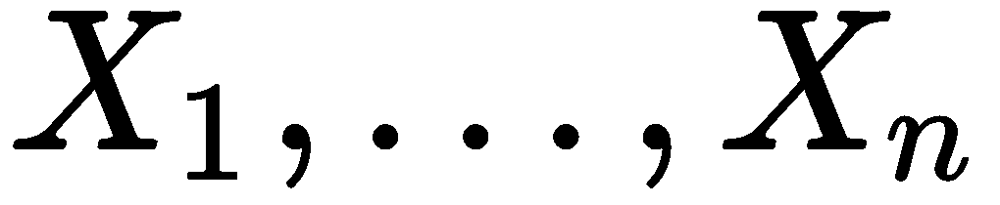</sub> 子数据集。现在，在每个子数据集上，我们可以训练我们的 <sub></sub> 分类器。最终的分类器对这些分类器响应进行平均(在分类的情况下，这对应于投票)，如下所示: <sub>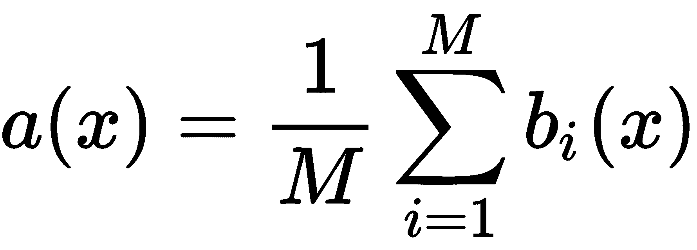</sub> 。下图显示了该方案:


用简单的算法 <sub></sub> 考虑回归问题。假设所有 *y(x)* 对象都有一个真答案函数，在 <sub></sub> 对象上也有分布。在这种情况下，我们可以将每个回归函数的误差写成如下:

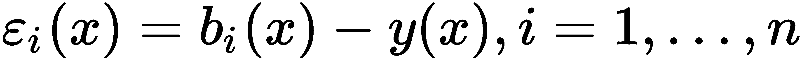

我们也可以将**均方误差** ( **均方误差**)的期望值写成如下:


构建的回归函数的平均误差如下:


现在，假设误差是无偏和不相关的，如下所示:

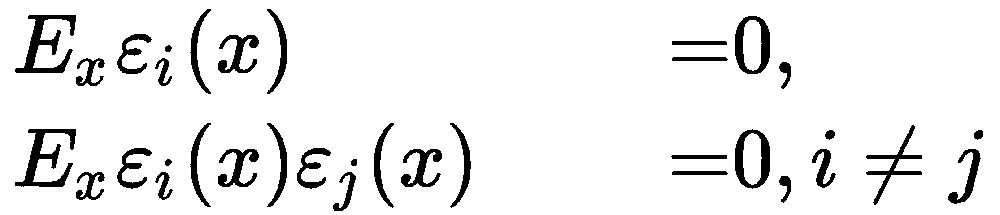

现在，我们可以编写一个新的回归函数，对我们构建的函数的响应进行平均，如下所示:


让我们找到它的**根 MSE** ( **RMSE** )来看看求平均值的效果，如下:

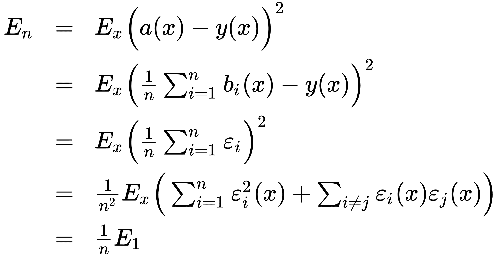

因此，对答案求平均值允许我们将误差的平均平方减少 ***n*** 倍。

打包还允许我们减少训练算法的方差，防止过度拟合。bagging 的有效性是基于底层算法的，这些算法是在各种完全不同的子数据集上训练的，它们的误差在投票过程中相互补偿。此外，外围对象可能不属于某些训练子数据集，这也提高了打包方法的有效性。

当排除甚至少量的训练对象导致构造实质上不同的简单算法时，打包对于小数据集是有用的。在大数据集的情况下，生成的子数据集通常比原始数据集小得多。

请注意，关于不相关误差的假设很少得到满足。如果这个假设是不正确的，那么误差的减少就没有我们假设的那么显著。

实际上，与简单的单个算法相比，bagging 可以很好地提高结果的准确性，特别是如果简单的算法足够精确但不稳定的话。通过减少单个算法的易错预测的传播来提高预测的准确性。bagging 算法的优点是易于实现，并且可以在不同的计算节点上并行计算训练每个基本算法。

# 使用梯度增强方法创建系综

boosting 的主要思想是基本算法不是独立构建的。我们构建每一个顺序算法，这样它就可以纠正前一个算法的错误，从而提高整个集成的质量。第一个成功的助推版本是 **AdaBoost** ( **自适应助推**)。现在很少使用它，因为梯度助推已经取代了它。

假设我们有一组对，其中每对由属性 *x* 和目标变量 *y* 、<sub>T5</sub>组成。在这个集合上，我们恢复了 <sub>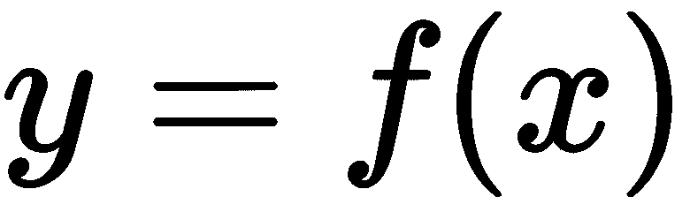</sub> 形式的依赖。我们通过近似 <sub>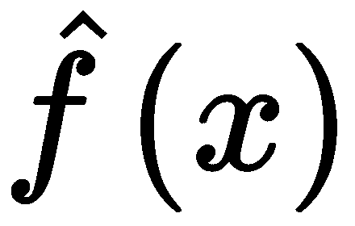</sub> 来恢复它。为了选择最佳近似解，我们使用特定的损失函数形式 <sub></sub> ，我们应该优化如下:

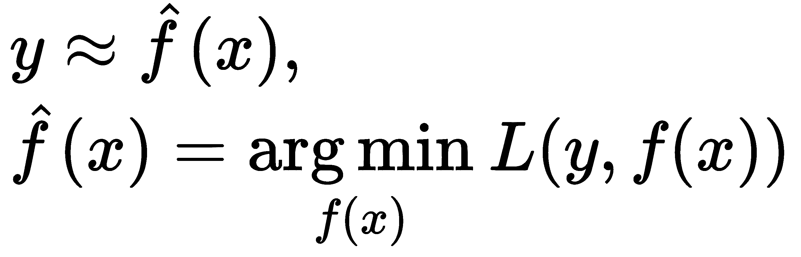

由于可用于学习的数据量有限，我们也可以用数学期望改写表达式，如下所示:


我们的近似不准确。然而，boosting 背后的想法是，可以通过将另一个模型的结果添加到模型中来修正其误差，从而改进这种近似，如下所示:

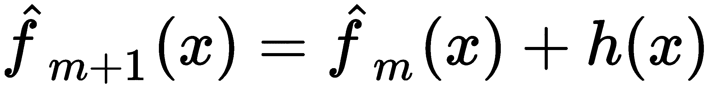

以下等式显示了理想的误差校正模型:


我们可以把这个公式改写成下面的形式，这样更适合矫正模型:


基于前面列出的假设，提升的目标是近似，使其结果尽可能接近*残差* 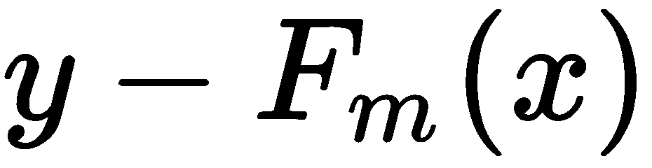。这样的操作是按顺序执行的，也就是说，改进了
之前的功能的结果。

这种方法的进一步推广允许我们将残差视为损失函数的负梯度，特别是形式为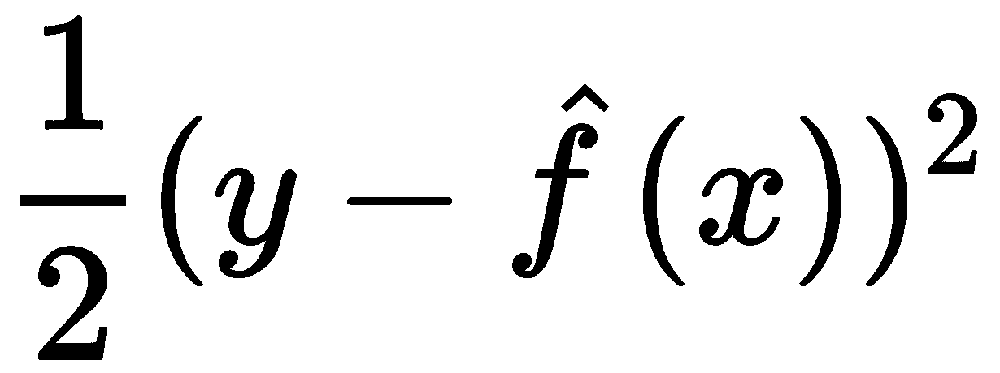。换句话说，梯度提升是一种用损失函数及其梯度替换的 GD 方法。

现在，知道了损失函数梯度的表达式，我们就可以在数据上计算它的值。因此，我们可以训练模型，使我们的预测更好地与这个梯度(带负号)相关联。因此，我们将解决回归问题，试图纠正这些残差的预测。对于分类、回归和排序，我们总是最小化残差和预测之间的平方差。

在梯度增强方法中，使用以下形式的函数的近似值:


这是类的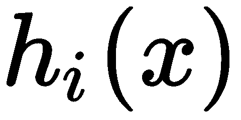函数之和；它们统称为**弱模型**(算法)。这样的近似是从初始近似开始顺序执行的，初始近似是某个常数，如下所示:


不幸的是，在任意损失函数的每一步选择最优函数是极其困难的，因此使用了一种更直接的方法。其思想是使用 GD 方法，通过使用可微函数和可微损失函数，如下图所示:

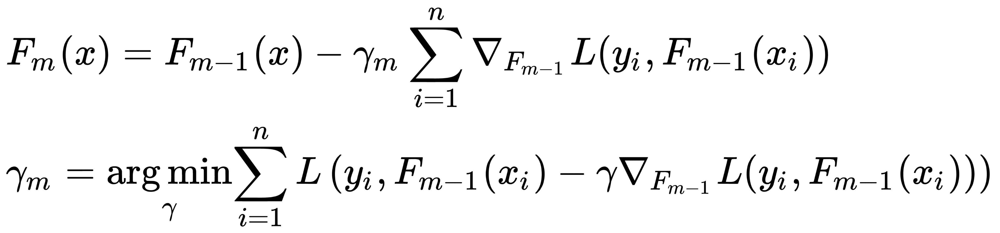

然后，升压算法形成如下:

1.  用常数值初始化模型，如下所示:


2.  重复指定的迭代次数，并执行以下操作:

*   计算伪残差，如下所示:

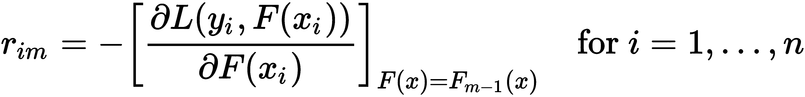

这里， *n* 为训练样本数， *m* 为迭代数， *L* 为损失函数。

*   用表格 <sub>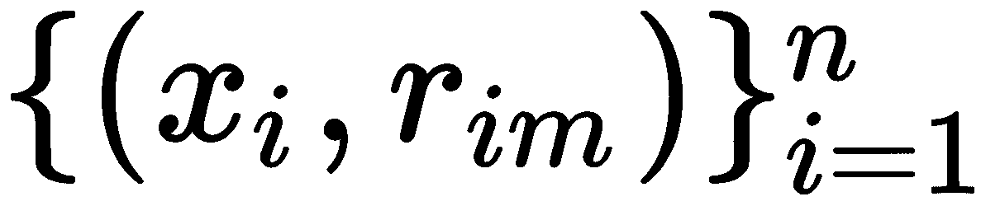</sub> 的数据在伪残差上训练基本算法(回归模型) <sub>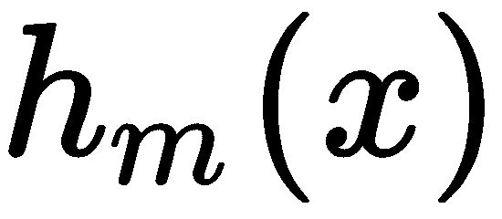</sub> 。
*   通过求解该形式的一维优化问题计算系数，如下所示:

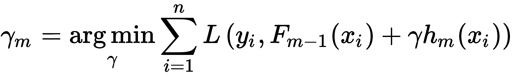

*   更新模型，如下所示:

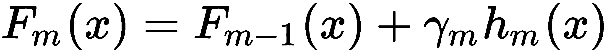

该算法的输入如下:

*   <sub></sub> 数据集
*   *M* 次迭代的次数
*   *L( y，f )* 损失函数带有一个解析书写的梯度(这种形式的梯度允许我们减少数值计算的次数)
*   *h* *(x)* 基本算法的函数族的选择，以及它们的训练和超参数的过程

初始近似值的常数，以及最佳系数，可以通过二分搜索法或相对于初始损失函数的另一种线搜索算法(而不是梯度)找到。

回归的损失函数示例如下:

*   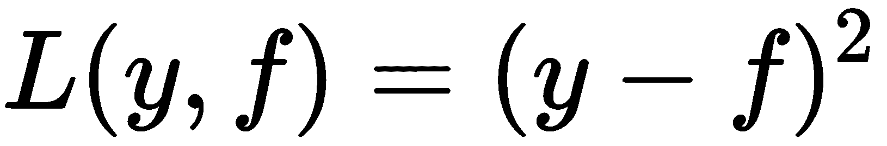 : An *L <sub> 2 </sub>* 损失，也叫高斯损失。这个公式是经典的条件均值，也是最常见、最简单的选项。如果没有额外的信息或模型可持续性要求，则应使用它。
*   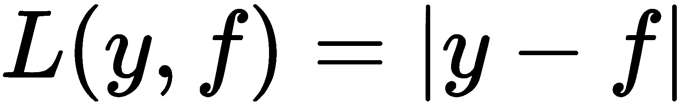 : An *L <sub> 1 </sub>* 损失，也叫拉普拉斯损失。这个公式，乍一看，不是很可微，决定了条件中位数。正如我们所知，中位数更能抵御异常值。因此，在一些问题中，这个损失函数是优选的，因为它不像二次函数那样惩罚大的偏差。
*   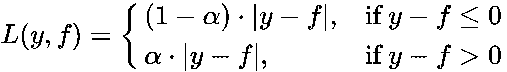 : An *L <sub> q </sub>* 亏损，也叫分位数亏损。如果我们不想要条件中位数，但想要条件 75 %分位数，我们将使用这个选项。这个函数是非对称的，并且会惩罚更多的观测值，这些观测值会出现在我们需要的分位数的一边。

分类的损失函数示例如下:

*   :这是逻辑损耗，也叫**伯努利损耗**。这个损失函数的一个有趣的性质是，我们甚至惩罚正确预测的类标签。通过优化这个损失函数，即使所有的观测值都被正确预测，我们也可以继续对类进行距离分类并改进分类器。该函数是二进制分类任务中最标准和最常用的损失函数。
*   :这是 AdaBoost 损失。碰巧的是，使用该损失函数的经典 AdaBoost 算法(在 AdaBoost 算法中也可以使用不同的损失函数)相当于梯度增强。从概念上讲，这种损失函数与逻辑损失非常相似，但它对分类错误具有更强的指数惩罚，并且使用频率较低。

装袋的想法是，它也可以与梯度增强方法一起使用，这被称为**随机梯度增强**。这样，在训练集的子样本上训练新算法。这种方法可以帮助我们提高集成的质量，并减少构建基本算法所需的时间(每个算法都是在数量减少的训练样本上训练的)。

尽管增强本身是一个集合，但其他集合方案也可以应用于它——例如，通过对几种增强方法求平均值。即使我们用相同的参数平均提升，由于实现的随机性，它们也会不同。这种随机性来自于在每一步选择随机子数据集，或者在我们构建决策树时选择不同的特征(如果选择它们作为基本算法)。

目前基地**梯度助推机** ( **GBM** )针对不同的统计任务有很多扩展。这些措施如下:

*   GLMBoost 和 GAMBoost 作为现有**广义可加模型** ( **GAM** )的增强
*   生存曲线的 CoxBoost
*   排名用的 RankBoost 和 LambdaMART

其次，同一个 GBM 在不同的名称和不同的平台下有很多实现，比如:

*   随机 GBM
*   **梯度增强决策树** ( **GBDT** )
*   **梯度增强回归树** ( **GBRT** )
*   **多元加性回归树** ( **MART** )
*   **通用增压机** ( **GBM** )

此外，在搜索引擎承担的排名任务中，可以长时间应用和使用提升。任务是基于损失函数编写的，损失函数会因搜索结果顺序中的错误而受到惩罚；因此，将它插入到 GBM 中变得很方便。

# 使用堆叠方法创建合奏

堆叠的目的是使用在与基本模型相同的数据上训练的不同算法。元分类器然后在基本算法或源数据的结果上被训练，也由基本算法本身的结果补充。有时元分类器使用它接收到的分布参数的估计值(例如，用于分类的每个类的概率的估计值)来进行训练，而不是使用基本算法的结果。

最直接的堆叠方案是混合。对于这个方案，我们将训练集分为两部分。第一部分用来教一套初等算法。它们的结果可以被认为是新的特征(元特征)。然后，我们将它们用作数据集第二部分的补充特征，并训练新的元算法。这种混合方案的问题在于，基本算法和元算法都不使用整个数据集进行训练。为了提高混合的质量，可以对数据中不同分区上训练的几个混合的结果进行平均。

实现堆叠的第二种方法是使用整个训练集。在某些来源中，这被称为*泛化*。整个集合被分成多个部分(折叠)，然后算法依次通过折叠，并在除了随机选择的折叠之外的所有折叠上教授基本算法。剩余的折叠用于基本算法的推理。基本算法的输出值被解释为根据折叠计算的新元属性(或新特征)。在这种方法中，还希望将几个不同的分区实现为折叠，然后平均相应的元属性。对于元算法，应用正则化或向元属性添加一些正常噪声是有意义的。发生这种加法的系数类似于正则化系数。我们可以总结出，所描述的方法背后的基本思想是使用一组基本算法；然后，使用另一种元算法，我们结合他们的预测，目的是减少泛化误差。

与增强和传统打包不同，您可以在堆叠中使用不同性质的算法(例如，与随机森林相结合的岭回归)。然而，重要的是要记住，对于不同的算法，需要不同的特征空间。例如，如果分类特征被用作目标变量，那么随机森林算法可以按原样使用，但是对于回归算法，您必须首先运行 one-hot 编码。

因为元特征是已经训练好的算法的结果，所以它们有很强的相关性。这个事实是*先验*这种方法的缺点之一；在对抗相关性的训练过程中，基本算法常常没有得到充分优化。有时，为了克服这个缺点，基本算法的训练不是用在目标特征上，而是用在特征和目标之间的差异上。

# 使用随机森林方法创建系综

首先，我们需要介绍决策树算法，它是随机森林集成算法的基础。

# 决策树算法概述

决策树是一种有监督的机器学习算法，基于人类如何解决预测或分类的任务。通常，这是一个在节点处具有决策规则并且在叶节点处具有目标函数预测的 *k* 维树。决策规则是一个函数，允许您确定哪些子节点应该用作所考虑对象的父节点。决策树叶子中可以有不同类型的对象，即分配给对象的类标签(在分类任务中)、类的概率(在分类任务中)和目标函数的值(在回归任务中)。

实际上，二进制决策树比具有任意数量子节点的树使用得更频繁。

构建一般形式决策树的算法如下:

1.  首先，检查停止算法的标准。如果执行此标准，请选择为该节点发布的预测。否则，我们必须将训练集分成几个不相交的更小的集。
2.  在一般情况下，在 *t* 节点定义一个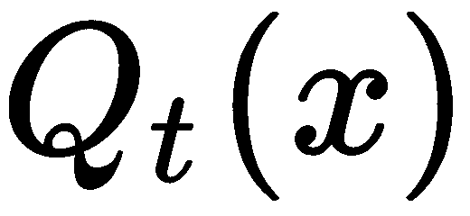决策规则，该规则考虑一定范围的值。这个范围分为 *R <sub> t </sub>* 不相交的对象集合:，其中 *R <sub> t </sub>* 是节点的后代数量，每个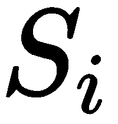是落入后代的一组对象。
3.  根据选择的规则划分节点中的集合，并对每个节点递归地重复该算法。

大多数情况下，决策规则仅仅是特征，即。对于分区，我们可以使用以下规则:

*   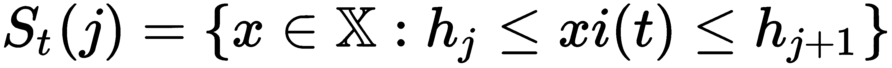为选定的边界值 <sub>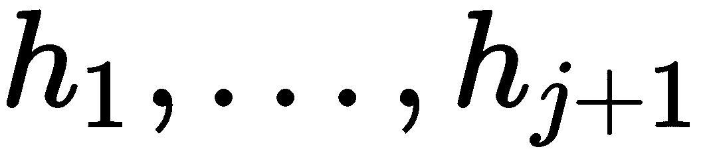</sub>
*   ，其中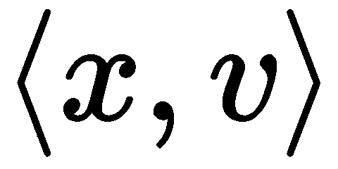是向量的标量积。事实上，这是一个角值检查
*   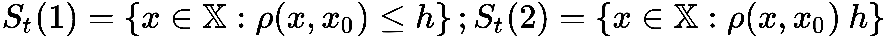，其中
    距离在某个度量空间中定义(例如，)
*   ，其中为谓语

一般来说，您可以使用任何决策规则，但是那些最容易解释的规则更好，因为它们更容易配置。接受比谓词更复杂的东西没有什么特别的意义，因为在谓词的帮助下，您可以在训练集上创建一个 100%正确的树。

通常，选择一组决策规则来构建树。为了找到每个特定节点的最优解，我们需要引入一个衡量最优性的标准。为此引入了度量，用于度量对象如何分散(回归)，或者类如何在特定的节点中混合(分类)。这项措施被称为**杂质功能**。需要根据一组决策规则中的所有特征和参数找到最大值，以便选择决策规则。通过这种选择，我们可以为当前节点中的对象集生成最佳分区。

信息增益是我们对于所选拆分可以获得多少信息，计算如下:


在上式中，以下公式适用:

*   *R* 是当前节点被分解成的子节点数
*   *t* 为当前节点
*   <sub>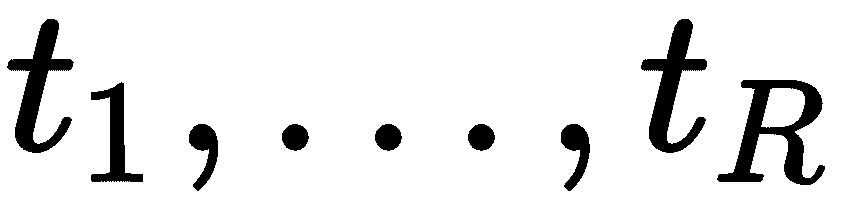</sub> 是用所选分区获得的后代节点
*   <sub>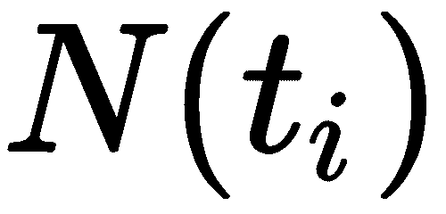</sub> 是训练样本中落入子 *** i *** 的对象数量
*   <sub></sub> 是被困在当前节点的对象数量
*   <sub></sub> 是物体被困在*t<sub>I</sub>*T7<sup>th</sup>T10】的顶点

我们可以使用均方误差或平均绝对误差作为回归任务的杂质函数。对于分类任务，我们可以使用以下功能:

*   基尼标准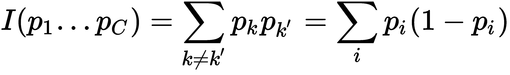作为错误分类的概率，特别是如果我们用它们在给定节点出现的概率来预测类
*   熵作为随机变量不确定性的度量
*   分类错误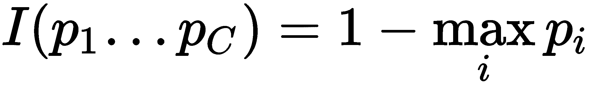作为分类中最有力类的错误率

在前面描述的函数中，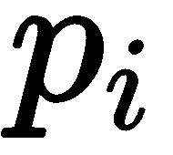是在节点**中遇到类 *** i *** 的*先验*概率，即类 *** i *** 落入 *** t *** 的训练样本中的对象数除以 *** t *** 中的对象总数(**

 ***以下规则可用作构建决策树的停止标准:

*   限制树的最大深度
*   限制工作表中对象的最小数量
*   限制一棵树的最大叶子数量
*   如果节点上的所有对象都属于同一个类，则停止
*   要求信息增益在分裂期间至少提高 *8* 个百分点

任何训练集都有一个无错树，这就导致了过拟合的问题。找到正确的停止标准来解决这个问题是具有挑战性的。一种解决方法是**修剪**——整棵树构造好之后，我们可以剪一些节点。这种操作可以使用测试或验证集来执行。剪枝可以降低最终分类器的复杂度，并通过减少过拟合来提高预测精度。

修剪算法形成如下:

1.  我们为训练集建立一棵树。
2.  然后，我们通过构造的树传递一个验证集，并考虑任何内部节点 *t* 及其左右子节点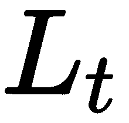、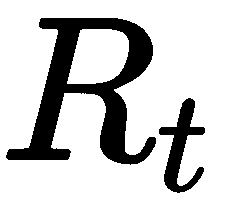。
3.  如果验证样本中没有一个对象达到了 *t* ，那么我们可以说这个节点(及其所有子树)是不重要的，并使 *t* 成为叶子(使用训练集将这个节点的谓词值设置为等于多数类的集合)。
4.  如果验证集中的对象已经达到 *t* ，那么我们必须考虑以下三个值:

*   *t* 子树的分类错误数
*   来自子树的分类错误数
*   来自子树的分类错误数

如果第一种情况的值为零，那么我们将节点 *t* 作为叶节点，并对该类进行相应的预测。否则，我们选择这些值中的最小值。根据哪一个是最小的，我们分别执行以下操作:

*   如果第一个是最小的，什么也不做
*   如果第二个最小，用节点的子树替换节点 *t* 的树
*   如果第三个最小，用节点的子树替换节点 *t* 的树

这样的过程规范了算法，避免了过拟合，提高了泛化能力。在 *k* 维树的情况下，可以使用不同的方法来选择叶子中的预测。我们可以把落在这片叶子上的训练对象中最常见的一类进行分类。或者，我们可以计算这些回归对象的目标函数的平均值。

我们将决策规则应用于从树根开始的新对象，以预测或分类新数据。因此，确定对象应该进入哪个子树。我们递归地重复这个过程，直到到达某个叶节点，最后，我们返回我们找到的叶节点的值，作为分类或回归的结果。

# 随机森林方法概述

决策树是一组适合打包的基本算法，因为它们非常复杂，最终可以在任何训练集上实现零错误。我们可以使用一种使用随机子空间的方法(比如装袋)来降低树之间的相关性，避免过度拟合。基本算法在特征空间的不同子集上训练，这些子集也是随机选择的。使用随机子空间方法的决策树模型的集合可以使用以下算法来构建。

当训练对象的数量为 *N* 且特征的数量为时，进行如下操作:

1.  选择作为系综中单棵树的数量。
2.  对于每个单独的树，选择作为的特征数量。通常，所有树只使用一个值。
3.  对于每棵树，使用自举创建一个训练子集。

现在，从样本构建决策树，如下所示:

1.  从源中选择个随机特征，那么训练集的最优划分将把搜索限制在这些特征上。
2.  根据给定的标准，我们选择最佳属性，并根据它在树中进行分割。
3.  直到每片叶子中剩下的物体不超过，或者直到我们到达树的某个高度，或者直到训练集耗尽，树才会被构建。

现在，要将集成模型应用于新对象，需要通过多数投票或通过组合*后验*概率来组合单个模型的结果。最终分类器的示例如下:


考虑算法的以下基本参数及其属性:

*   **树数**:树越多质量越好，但训练时间和算法工作量也成比例增加。通常，随着树数量的增加，训练集的质量会提高(甚至可以达到 100%的精度)，但测试集的质量是渐近线(因此，您可以估计所需的最小树数量)。
*   **分裂选择的特征数量**:随着特征数量的增加，森林的建造时间也增加，树木变得比以前更加均匀。通常，在分类问题中，选择的属性数量等于回归问题的<sub></sub><sub>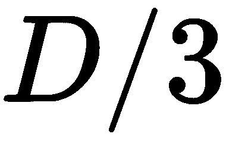</sub>。
*   **最大树深**:深度越小，算法构建和工作的速度越快。随着深度的增加，训练过程中的质量会显著提高。测试集的质量也可能会提高。建议使用最大深度(训练对象太多的情况除外，我们获得的是非常深的树，其构建需要相当长的时间)。当使用浅树时，更改与限制叶子中的对象数量和分割相关的参数不会产生明显的效果(叶子已经很大了)。在有大量噪声对象(异常值)的任务中，建议使用浅树。
*   **杂质函数**:这是选择分支特征(决策规则)的标准。对于回归问题，通常是 MSE/MAE。对于分类问题，它是基尼标准、熵或分类误差。树木的平衡和深度可能因我们选择的特定杂质函数而异。

我们可以将一个随机森林视为打包决策树，在这些树的训练过程中，我们使用每个分区的随机特征子集的特征。这种方法是一种通用算法，因为随机森林的存在是为了解决分类、回归、聚类、异常搜索和特征选择等问题。

在下一节中，我们将看到如何使用不同的 C++ 库来开发机器学习模型集成。

# 使用 C++ 库创建系综的示例

以下部分将展示如何在`Shogun`和`Shark-ML`库中使用系综。这些库中有随机森林和梯度增强算法的现成实现；我们将展示如何使用他们的**应用编程接口** ( **API** )来处理这些算法。此外，我们将使用`Shark-ML`库中的原语从头开始实现堆叠集成技术。

# 幕府将军合奏团

`Shogun`库中有梯度提升和随机森林算法实现，下面几节将展示在实践中使用它们的具体 API。

# 使用幕府的梯度推进

`Shogun`库中有一个梯度提升算法的实现，但它受到限制，因为它只支持回归任务。该算法在`CStochasticGBMachine`类中实现。配置该类对象的主要参数是基本集成算法模型和损失函数，而其他参数包括迭代次数、学习速率和每次迭代随机选择的训练向量的比例。

假设我们已经有一个可用的训练和测试数据集，我们将创建一个使用梯度提升进行余弦函数逼近的示例(数据生成器的确切实现可以在这个示例的源代码中找到)。对于这个例子，我们将使用一组决策树。决策树算法在`Shogun`库中的实现可以在`CCARTree`类中找到。一个**分类回归树** ( **CART** )是一个二元决策树，通过将一个节点反复拆分为两个子节点，从包含整个数据集的根节点开始构建。

第一步是`CCARTree`类型对象的创建和配置。此对象的构造函数采用特征类型(名义或连续)和问题类型的向量。在构造对象之后，我们可以配置树深度，这是算法性能的关键参数。

然后，我们必须创建一个损失函数对象。对于当前任务，一个`CSquaredLoss`类型的对象是一个合适的选择。

有了模型和损失函数对象，我们就可以实例化`CStochasticGBMachine`类的一个对象。对于训练，我们必须使用具有适当参数的`set_labels`和`train`方法:分别是`CRegressionLabels`类型的对象和`CDenseFeatures`类型的对象。为了评估，可以使用`apply_regression`方法，如以下代码块所示:

```cpp
void GBMClassification(Some<CDenseFeatures<DataType>> features,
                       Some<CRegressionLabels> labels,
                       Some<CDenseFeatures<DataType>> test_features,
                       Some<CRegressionLabels> test_labels) {
    // mark feature type as continuous
    SGVector<bool> feature_type(1);
    feature_type.set_const(false);

    auto tree = some<CCARTree>(feature_type, PT_REGRESSION);
    tree->set_max_depth(3);
    auto loss = some<CSquaredLoss>();

    auto sgbm = some<CStochasticGBMachine>(tree, 
                                           loss, 
                                           /*iterations*/ 100,
                                           /*learning rate*/ 0.1, 
                                           /*sub-set fraction*/ 1.0);
    sgbm->set_labels(labels);
    sgbm->train(features);

    // evaluate model on test data
    auto new_labels = wrap(sgbm->apply_regression(test_features));

    auto eval_criterium = some<CMeanSquaredError>();
    auto accuracy = eval_criterium->evaluate(new_labels, test_labels);
    ...
}
```

在下图中，我们可以看到在最大`CART tree`深度等于 2 的情况下，梯度增强如何逼近`cosine`函数。请注意，我们实现的概括并不是特别好:


在下图中，我们可以看到，由于我们将`CART tree`深度增加到 3，泛化能力显著增强:


我们可以为这种类型的算法调整的其他参数是迭代次数、学习速率和一次迭代中使用的训练样本数量。

# 使用幕府将军的随机森林

在`Shogun`库中实现的另一种集成学习算法是随机森林算法。我们将把它用于同样的函数逼近任务。在`CRandomForest`类中实现。要实例化这个类的对象，我们必须向构造函数传递两个参数:一个是树的数量(同样，它等于数据集应该划分到的包的数量)；第二个是算法构建树时，在节点拆分过程中随机选择的属性数量。

下一个重要的配置选项是关于如何将树结果组合成最终答案的规则。使用`set_combination_rule`方法进行配置。在下面的例子中，我们使用了`CMajorityVote`类的一个对象，它实现了多数票方案。

我们还需要配置我们想用随机森林解决什么类型的问题，我们可以用`CRandomForest`类的`set_machine_problem_type`方法来实现。另一个必需的配置是我们希望在问题中使用的一种特征:名义特征或连续特征。这可以通过`set_feature_types`方法来完成。对于训练，我们将使用具有适当参数的`set_labels`和`train`方法，以及`CRegressionLabels`类型的对象和`CDenseFeatures`类型的对象。评估将使用`apply_regression`方法，如以下代码块所示:

```cpp
 void RFClassification(Some<CDenseFeatures<DataType>> features,
                       Some<CRegressionLabels> labels,
                       Some<CDenseFeatures<DataType>> test_features,
                       Some<CRegressionLabels> test_labels) {
     int32_t num_rand_feats = 1;
     int32_t num_bags = 10;

     auto rand_forest =
     shogun::some<CRandomForest>(num_rand_feats, num_bags);

     auto vote = shogun::some<CMajorityVote>();
     rand_forest->set_combination_rule(vote);
     // mark feature type as continuous
     SGVector<bool> feature_type(1);
     feature_type.set_const(false);
     rand_forest->set_feature_types(feature_type);

     rand_forest->set_labels(labels);
     rand_forest->set_machine_problem_type(PT_REGRESSION);
     rand_forest->train(features);

     // evaluate model on test data
     auto new_labels = wrap(rand_forest->apply_regression(test_features));

     auto eval_criterium = some<CMeanSquaredError>();
     auto accuracy = eval_criterium->evaluate(new_labels, test_labels);
     ...
 }
```

下图显示了应用`Shogun`库中的随机森林算法的结果:


请注意，此方法不适用于此数据集上的回归任务。我们可以看到，上一节中使用的梯度增强在这个数据集上产生了更易于解释和更不容易出错的输出。

# 与鲨鱼的合奏

`Shark-ML`库中只有一个集成学习算法，就是随机森林，只能针对解决分类任务进行训练。因此，对于这组样本，我们将使用位于[的*乳腺癌威斯康星(诊断)*数据集。摘自加州大学欧文分校信息与计算机科学学院:](https://archive.ics.uci.edu/ml/datasets/Breast+Cancer+Wisconsin+(Diagnostic))[【http://archive.ics.uci.edu/ml】](http://archive.ics.uci.edu/ml)【2019】*UCI 机器学习寄托器* *y。*

这个数据集中有 569 个实例，每个实例有 32 个属性:标识、诊断和 30 个实值输入特征。诊断可以有两个值: **M** =恶性，和 **B** =良性。其他属性为每个细胞核计算了 10 个实值特征，如下所示:

*   半径(从中心到周边的平均距离)
*   纹理(灰度值的标准偏差)
*   周长
*   面积
*   平滑度(半径长度的局部变化)
*   紧凑
*   凹度(轮廓凹陷部分的严重程度)
*   凹点(轮廓凹面部分的数量)
*   对称
*   分形维数(*海岸线近似* —1)

This dataset can be used for a binary classification task.

# 使用随机森林与鲨鱼毫升

`Shark-ML`库中的随机森林算法位于`RFClassifier`类，对应的训练器位于`RFTrainer`类。对于随机森林算法实现，我们使用未经预处理的原始数据集值。首先，我们为这种分类器配置训练器。以下是接下来的配置方法:

*   `setNTrees`:设置树的数量。
*   `setMinSplit`:设置分割的最小样本数。
*   `setMaxDepth`:设置树的最大深度。
*   `setNodeSize`:当节点被认为是纯节点时，设置最大节点大小。
*   `minImpurity`:设置最低杂质水平，低于该水平的节点被认为是纯的。

配置好训练器对象后，可以使用其`train `方法进行训练过程。该方法采用两个参数:`RFClassifier`类的对象，它应该被训练，以及`ClassificationDataset`对象，它代表数据集。

当训练完成时，我们可以使用分类器对象作为功能对象，在其他数据上对其进行评估。例如，如果我们有类型为`ClassificationDataset`的测试数据集，我们可以通过以下方式获得一个分类:`Data<unsigned int> predictions = rf(test.inputs());`，其中`rf`是`RFClassifier`类的对象，如下面的代码块所示:

```cpp
void RFClassification(const ClassificationDataset& train,
                      const ClassificationDataset& test) {
    RFTrainer<unsigned int> trainer;
    trainer.setNTrees(100);
    trainer.setMinSplit(10);
    trainer.setMaxDepth(10);
    trainer.setNodeSize(5);
    trainer.minImpurity(1.e-10);

    RFClassifier<unsigned int> rf;
    trainer.train(rf, train);

    // compute errors
    ZeroOneLoss<unsigned int> loss;
    Data<unsigned int> predictions = rf(test.inputs());
    double accuracy = 1\. - loss.eval(test.labels(), predictions);
    std::cout << "Random Forest accuracy = " << accuracy << std::endl;
}
```

这个样本在数据集上的输出是`Random Forest accuracy = 0.971014`。

# 使用与 Shark-ML 的堆叠集成

为了展示更多集成学习技术的实现，我们可以手动开发堆叠方法。这对于`Shark-ML`库或者任何其他库来说都不难。

首先，我们需要定义用于堆叠的弱(或基本)算法。为了统一对弱算法的访问，我们定义了基类，如下所示:

```cpp
struct WeakModel {
virtual ~WeakModel() {}
  virtual void Train(const ClassificationDataset& data_set) = 0;
  virtual LinearClassifier<RealVector>& GetClassifier() = 0;
};
```

我们用它来创建三个弱算法模型——逻辑回归、**线性判别分析** ( **LDA** )和线性 SVM 模型，如下面的代码块所示:

```cpp
struct LogisticRegressionModel : public WeakModel {
    LinearClassifier<RealVector> classifier;
    LogisticRegression<RealVector> trainer;
    void Train(const ClassificationDataset& data_set) override {
        trainer.train(classifier, data_set);
    }
    LinearClassifier<RealVector>& GetClassifier() override { return 
    classifier; }
};

struct LDAModel : public WeakModel {
    LinearClassifier<RealVector> classifier;
    LDA trainer;
    void Train(const ClassificationDataset& data_set) override {
        trainer.train(classifier, data_set);
    }
    LinearClassifier<RealVector>& GetClassifier() override { return 
    classifier; }
};

struct LinearSVMModel : public WeakModel {
    LinearClassifier<RealVector> classifier;
    LinearCSvmTrainer<RealVector> trainer{SVM_C, false};
    void Train(const ClassificationDataset& data_set) override {
        trainer.train(classifier, data_set);
    }
    LinearClassifier<RealVector>& GetClassifier() override { return 
    classifier; }
};
```

这些类隐藏了不同类型教练类的用法，但是通过`GetClassifier()`方法公开了`LinearClassifier<RealVector>`类型的标准接口。此外，他们执行通用的`Train`方法，该方法以`ClassificationDataset`类为对象。

堆叠方法的关键时刻之一是将弱算法的结果组合(堆叠)成一个集合，用于训练或评估元算法。在我们的实现中有`MakeMetaSet`方法，它完成这种类型的工作。它从弱算法中获取预测向量，从原始数据集中获取相应的标签，并将它们组合成`ClassificationDataset`类的新对象，如以下代码块所示:

```cpp
 ClassificationDataset MakeMetaSet(
                        const std::vector<Data<unsigned int>>& inputs,
                        const Data<unsigned int>& labels) {
     auto num_elements = labels.numberOfElements();
     std::vector<RealVector> vinputs(num_elements);
     std::vector<unsigned int> vlabels(num_elements);
     std::vector<RealVector::value_type> vals(inputs.size());
     for (size_t i = 0; i < num_elements; ++ i) {
         for (size_t j = 0; j < inputs.size(); ++ j) {
             vals[j] = inputs[j].element(i);
         }
         vinputs[i] = RealVector(vals.begin(), vals.end());
         vlabels[i] = labels.element(i);
     }
     return createLabeledDataFromRange(vinputs, vlabels);
 }
```

该方法创建输入和标签的两个向量，并使用`Shark-ML`函数`createLabeledDataFromRange`创建新的数据集对象。请注意，新的输入是`RealVector`类型对象的向量，这些对象具有等于 3 的新维度，因为我们使用了三种算法来预测元特征。看看用来组合输出的`vals`对象(这里是`inputs`变量)。这些算法也以`RealVector`对象为输入。在原始数据集中，它们有 30 个要素；然而，在我们的实现中，它们在`PCA`降维之后只有 5 个。

由于所选算法的性质，我们需要标准化我们的数据。假设我们有两个数据集用于训练和测试，如下所示:

```cpp
 void StackingEnsemble(const ClassificationDataset& train,
                       const ClassificationDataset& test) {
     ...
 }
```

为了规范化训练数据集，我们需要复制原始数据集，因为`Normalizer`算法在适当的位置工作，并修改它所处理的对象，如下面的代码块所示:

```cpp
 ClassificationDataset train_data_set = train;
 train_data_set.makeIndependent();
```

当我们有数据集的副本时，我们可以用用`NormalizeComponentsUnitVariance`类对象训练的分类器对象的实例来规范化它。与`Shark-ML`库中的所有算法一样，我们必须先训练规格化器，然后才能将其应用于`transformInputs`函数。这个函数只转换输入特征，因为我们不需要规范化二进制标签，可以在下面的代码块中看到:

```cpp
 bool removeMean = true;
 Normalizer<RealVector> normalizer;
 NormalizeComponentsUnitVariance<RealVector> 
     normalizing_trainer(removeMean);
 normalizing_trainer.train(normalizer, train_data_set.inputs());
 train_data_set = transformInputs(train_data_set, normalizer);
```

为了加快和推广我们使用的模型，我们还使用`PCA`算法降低了训练特征的维数。请注意，`PCA`类不使用`train`方法，而是使用`encoder`方法获取`LinearModel`类的对象，然后用于降维，如下代码块所示:

```cpp
 PCA pca(train_data_set.inputs());
 LinearModel<> pca_encoder;
 pca.encoder(pca_encoder, 5);
 train_data_set = transformInputs(train_data_set, pca_encoder);
```

现在，在预处理我们的训练数据集之后，我们可以定义和训练我们将要用于评估的弱模型，如下所示:

```cpp
 // weak models
 std::vector<std::shared_ptr<WeakModel>> weak_models;
 weak_models.push_back(std::make_shared<LogisticRegressionModel>());
 weak_models.push_back(std::make_shared<LDAModel>());
 weak_models.push_back(std::make_shared<LinearSVMModel>());

 // train weak models for predictions
 for (auto weak_model : weak_models) {
     weak_model->Train(train_data_set);
 }
```

对于训练，元算法需要获得元特征，并且根据堆叠方法，我们将把训练数据集分成几个折叠——在我们的例子中是 10 个。然后我们将在每个折叠上分别训练几个弱模型。fold 的验证方面将用于弱模型评估，其结果将被添加到元训练数据集，并用于训练元算法。

`Shark-ML`库中有`createCVSameSizeBalanced`功能，可用于文件夹创建。它创建大小相等的折叠，每个折叠由两部分组成:训练部分和验证部分。我们将迭代创建的折叠来训练弱模型和创建元特征。请注意，在下面的代码块中，我们将在循环的每次迭代中创建新模型:

```cpp
     size_t num_partitions = 10;
     ClassificationDataset meta_data_train;
     auto folds = createCVSameSizeBalanced(train_data_set, num_partitions);
     for (std::size_t i = 0; i != folds.size(); ++ i) {
         // access the fold
         ClassificationDataset training = folds.training(i);
         ClassificationDataset validation = folds.validation(i);

         // train local weak models - new ones on each of folds
         std::vector<std::shared_ptr<WeakModel>> local_weak_models;
         local_weak_models.push_back(
             std::make_shared<LogisticRegressionModel>());
         local_weak_models.push_back(std::make_shared<LDAModel>());
         local_weak_models.push_back(std::make_shared<LinearSVMModel>());

         std::vector<Data<unsigned int>> meta_predictions;
         for (auto weak_model : local_weak_models) {
             weak_model->Train(training);
             auto predictions = 
                 weak_model->GetClassifier()(validation.inputs());
             meta_predictions.push_back(predictions);
         }

         // combine meta features
         meta_data_train.append(MakeMetaSet(meta_predictions, 
             validation.labels()));
     }
```

`meta_data_train`对象包含元特征，用于训练元模型，在我们的例子中是规则线性 SVM 模型，如下所示:

```cpp
     LinearClassifier<RealVector> meta_model;
     LinearCSvmTrainer<RealVector> trainer(SVM_C, true);
     trainer.train(meta_model, meta_data_train);
```

训练好集合后，我们可以在测试数据集上进行尝试。由于我们使用了数据预处理，我们也应该像转换训练数据一样转换测试数据。这可以通过`normalizer`和`pca_encoder`对象轻松完成，这两个对象已经被训练并在内部保存了所需的变换选项。通常，这样的对象(以及模型)应该存储在二级存储器上。代码可以在下面的代码片段中看到:

```cpp
     ClassificationDataset test_data_set = test;
     test_data_set.makeIndependent();
     test_data_set = transformInputs(test_data_set, normalizer);
     test_data_set = transformInputs(test_data_set, pca_encoder);
```

集成评估从预测元特征开始，使用我们之前训练的弱模型。我们将像制作训练元数据集一样制作`meta_test`数据集对象。我们将在`meta_predictions`向量中存储来自每个弱模型的预测，并将使用我们的辅助函数将它们组合到`ClassificationDataset`类型的对象中，如下所示:

```cpp
     std::vector<Data<unsigned int>> meta_predictions;
     for (auto weak_model : weak_models) {
         auto predictions =
             weak_model->GetClassifier()(test_data_set.inputs());
         meta_predictions.push_back(predictions);
     }
     ClassificationDataset meta_test =
     MakeMetaSet(meta_predictions, test_data_set.labels());
```

在我们创建了元特征之后，我们可以将它们作为输入传递给`meta_model`对象来生成真实的预测。我们也可以这样计算精度:

```cpp
     Data<unsigned int> predictions = meta_model(meta_test.inputs());

     ZeroOneLoss<unsigned int> loss;
     double accuracy = 1\. - loss.eval(meta_test.labels(), predictions);
     std::cout << "Stacking ensemble accuracy = " << accuracy << std::endl;
 }
```

该代码的输出为`Stacking ensemble accuracy = 0.985507`。您可以看到，即使使用默认设置，该集成也比随机森林实现表现更好。在一些额外调整的情况下，它可以给出更好的结果。

# 摘要

在这一章中，我们研究了构建机器学习算法集成的各种方法。创建合奏的主要目的是:

*   减少基本算法的误差
*   扩展可能假设的集合
*   在优化过程中增加达到全局最优的概率

我们看到有三种主要的构建集成的方法:在不同的数据集上训练基本的算法和平均误差(bagging)；持续改进先前较弱算法的结果(增强)；以及从基本算法(堆叠)的结果中学习元算法。请注意，我们已经介绍过的构建合集的方法，除了堆叠之外，都要求基本算法属于同一类，这是合集的主要要求之一。人们还认为，助推比套袋能给出更准确的结果，但同时，也更容易过度拟合。堆叠的主要缺点是，仅使用相对大量的训练样本，它就开始显著改善基本算法的结果。

在下一章中，我们将讨论**人工神经网络** ( **神经网络**)的基本原理。我们将从历史的角度来看他们的创作，我们将浏览 ANNs 中使用的基本数学概念，我们将实现一个**多层感知器** ( **MLP** )网络和一个简单的**卷积神经网络** ( **CNN** )，我们将讨论什么是深度学习以及它为什么如此新潮。

# 进一步阅读

*   集成方法:装袋助推:[https://medium . com/@ sainikhilesh/装袋助推差-f996253 CD 22](https://medium.com/@sainikhilesh/difference-between-bagging-and-boosting-f996253acd22)
*   一篇解释梯度增强的文章:[https://explained.ai/gradient-boosting/](https://explained.ai/gradient-boosting/)
*   杰罗姆·弗里德曼的原创文章，名为*贪婪函数逼近:梯度增强机*:[https://statweb.stanford.edu/~jhf/ftp/trebst.pdf](https://statweb.stanford.edu/~jhf/ftp/trebst.pdf)
*   集成学习提高机器学习效果:[https://blog.statsbot.co/ensemble-learning-d1dcd548e936](https://blog.statsbot.co/ensemble-learning-d1dcd548e936)

*   决策树简介:[https://medium . com/grey atom/决策树-一种简单的可视化决策方法-DC 506 a 403 EB](https://medium.com/greyatom/decision-trees-a-simple-way-to-visualize-a-decision-dc506a403aeb)
*   了解随机森林:[https://towards data science . com/了解-随机-森林-58381e0602d2](https://towardsdatascience.com/understanding-random-forest-58381e0602d2)*****