# 十一、基于循环神经网络的情感分析

目前，**循环神经网络(RNN)** 是用于构建深度神经网络的最知名和最实用的方法之一。它们被设计用来处理时间序列数据。通常，这种性质的数据可以在以下任务中找到:

*   自然语言文本处理，如文本分析和自动翻译
*   自动语音识别
*   视频处理，用于基于先前帧预测下一帧，以及用于识别情绪
*   图像处理，用于生成图像描述
*   时间序列分析，用于预测汇率或公司股票价格的波动

在递归网络中，元素之间的通信形成一个有向序列。由于这一点，处理事件的时间序列或连续的空间链成为可能。与多层感知器不同，递归网络可以使用其内部存储器来处理任意长度的序列。在撰写本文时，已经提出了许多不同的递归网络架构解决方案(从简单到复杂)。目前最广泛的递归网络架构是**长短期记忆(LSTM)** 和**门控递归单元(GRU)** 。

在本章中，我们将考虑递归网络的主要体系结构特征，并学习如何使用递归网络来处理自然语言；描述将自然语言元素转换成数学抽象的算法；并编写程序评估语言的情感特征，对影评进行情感分析。

具体而言，本章将涵盖以下主题:

*   RNN 概念概述
*   使用时间反向传播的概念训练神经网络
*   探索 RNN 建筑
*   用 RNNs 理解自然语言处理
*   带有 RNNs 的情感分析示例

# 技术要求

以下是本章的技术要求:

*   PyTorch 库
*   支持 C++ 17 的现代 C++ 编译器
*   CMake 构建系统版本> = 3.8

The code files for this chapter can be found at the following GitHub repo: [https://github.com/PacktPublishing/Hands-On-Machine-Learning-with-CPP/tree/master/Chapter11/pytorch](https://github.com/PacktPublishing/Hands-On-Machine-Learning-with-CPP/tree/master/Chapter11/pytorch)

# RNN 概念概述

RNN 的目标是在假设连续数据元素之间存在某种依赖性的情况下保持一致的数据使用。在传统的神经网络中，所有的输入和输出都是独立的。但是对于很多任务来说，这种独立性是不适合的。例如，如果你想预测一个句子中的下一个单词，知道它前面的单词顺序是最可靠的方法。rnn 是递归的，因为它们对序列的每个元素执行相同的任务，并且输出取决于以前的计算。

换句话说，无线网络是有反馈回路和记忆的网络。rnn 使用内存来考虑先验信息和计算结果。循环网络的思想可以表示如下:


在上图中，神经网络的一个片段，(具有乙状结肠激活功能的一层神经元)，取输入值， <sub></sub> ，并返回值， <sub></sub> 。反馈的存在允许我们将信息从网络的一个时间步长传递到另一个时间步长。一个循环网络可以被认为是同一个网络的几个副本，每个副本都将信息传输到下一个副本。以下是我们扩展反馈时发生的情况:


这可以更详细地表示如下:

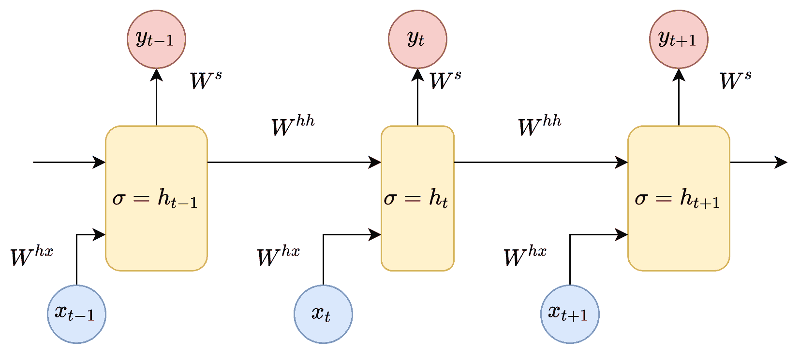

在这里，我们可以看到输入的数据向量，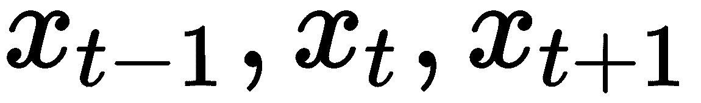。每一步的每个向量都有一个隐藏的状态向量。我们称这种配对为**模块**。每个 RNN 模块中的隐藏状态是上一步的输入向量和隐藏状态向量的函数，如下所示:

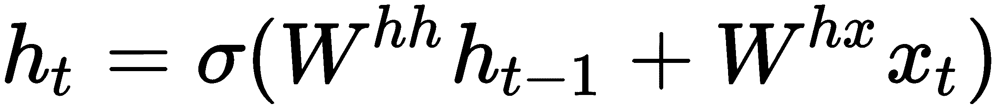

如果我们看上标，可以看到有一个权重矩阵， <sub></sub> ，我们乘以输入值，还有一个递归的权重矩阵， <sub></sub> ，乘以上一步的隐藏状态向量。这些递归权重矩阵在每一步都是相同的。这个概念是 RNN 的关键组成部分。如果你仔细考虑一下，这种方法与传统的两层神经网络有很大的不同。在这种情况下，我们通常为每一层选择一个单独的矩阵*W*:*W*<sub>1</sub>和 *W* <sub>2</sub> 。这里，权重的递归矩阵对于整个网络是相同的。表示具有 sigmoid 作为激活函数的神经网络层。

此外，另一个权重矩阵 <sub></sub> 用于获得每个模块的输出值 *y* ，乘以 *h* :

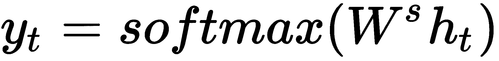

无线网络的一个吸引人的想法是，它们可能知道如何将先前的信息与手头的任务联系起来。例如，在视频流分析任务中，视频前一帧的知识可以帮助理解当前帧(知道以前的对象位置可以帮助我们预测它们的新位置)。RNNs 使用先验信息的能力并不是绝对的，通常取决于一些情况，我们将在下面的章节中讨论。

有时候，为了完成当前的任务，我们只需要最近的信息。例如，考虑一个语言模型，它试图根据前面的单词预测下一个单词。如果我们要预测短语中的最后一个词，*云飘在**天空*** ，我们不需要更广阔的语境；在这种情况下，最后一个词几乎可以肯定是*天空*。在这种情况下，我们可以说相关信息和预测主题之间的距离很小，这意味着 RNNs 可以学习如何使用过去的信息。

但有时候，我们需要更多的背景。假设我们要预测短语中的最后一个词，*我说法语*。在同一篇文章的后面是这样一句话，*我在法国长大*。因此，上下文表明，最后一个单词很可能是该国语言的名称。然而，这可能在文本中更远的地方——可能在不同的段落或页面上——并且随着关键上下文和其应用点之间的差距扩大，网络节点失去了准确绑定信息的能力。

理论上，RNNs 不应该有长期处理依赖的问题。一个人可以仔细选择网络参数来解决这种类型的人工问题。不幸的是，在实践中，由于消失的梯度问题，用这些参数训练 RNN 似乎是不可能的。Sepp Hochriter(1991)和 Yoshua Bengio 等人(1994)详细研究了这个问题。他们发现，反向传播算法中使用的梯度越低，网络更新其权重就越困难，训练时间也就越长。为什么我们可以在训练过程中获得低梯度值有不同的原因，但其中一个主要原因是网络大小。对于 RNNs，它是最关键的参数，因为它取决于我们使用的输入序列的大小。我们使用的序列越长，我们得到的网络就越大。幸运的是，在 RNNs 中有一些方法可以用来处理这个问题，我们将在本章的后面讨论所有这些方法。

# 使用时间反向传播的概念训练神经网络

在撰写本文时，为了在几乎所有地方训练神经网络，使用了误差反向传播算法。对训练样本集(在我们的例子中是子序列集)执行推理的结果与预期结果(标记数据)进行核对。实际值和期望值之间的差异称为误差。该误差以相反的方向传播到网络权重。因此，网络适应于标记的数据，并且这种适应的结果对于网络在初始训练示例(概括假设)中没有遇到的数据来说工作良好。

在循环网络的情况下，我们有几个关于哪个网络输出可以考虑误差的选项。本节介绍两种主要方法:第一种方法考虑最后一个单元格的输出值，而第二种方法考虑最后一层所有单元格的输出。让我们逐一看看这些方法:

*   在第一种方法中，我们可以通过比较子序列最后一个单元格的输出和当前训练样本的目标值来计算误差。这种方法适用于分类任务。例如，如果我们需要确定一条推文的情绪(换句话说，我们需要对一条推文的极性进行分类；表达的观点是消极的、积极的还是中立的？).为此，我们选择推文，并将其分为三类:负面、正面和中立。单元格的输出应该是三个数字:类别的权重。这条推文也可以用三个不同的数字来标记:这条推文属于相应类别的概率。在计算了数据子集的误差后，我们可以通过输出和单元状态反传它。
*   在第二种方法中，对于子序列的每个元素，我们可以在单元计算的输出端立即读取错误。这种方法非常适合预测序列中下一个元素的任务。例如，这种方法可以用于确定时间序列数据中的异常的问题，用于预测文本中的下一个字符的任务，或者用于自然语言翻译任务。误差反向传播也可以通过输出和单元状态实现，但在这种情况下，我们需要计算尽可能多的输出误差。这意味着我们还应该为我们想要预测的每个序列元素设置目标值。

与常规的全连接神经网络不同，递归网络的深度在于误差不仅从网络输出向其权重反向传播，而且通过时间步长状态之间的连接传播。因此，输入子序列的长度决定了网络的深度。误差反向传播的方法有一种变体，称为**通过时间** ( **BPTT** )反向传播，它通过循环网络的状态传播误差。

BPTT 背后的想法很简单——我们展开一个循环网络一定数量的时间步长，它转换成一个通常的深度神经网络，然后用通常的反向传播方法进行训练。请注意，该方法假设我们对所有时间步长使用相同的参数。此外，当误差在状态(步骤)中向后传播时，权重梯度被相互总结。它们在网络的初始配置期间被复制次，就像给常规前馈网络添加层一样。展开 RNN 所需的步数对应于输入序列的长度。如果输入序列很长，那么训练网络的计算成本就会增加。

下图显示了 BPTT 方法的基本原理:


该算法的一个修改版本被称为**通过时间截断反向传播(TBPTT)** ，用于降低计算复杂度。它的本质在于，我们限制正向传播步骤的数量，在反向传播时，我们更新有限条件集的权重。这个版本的算法有两个额外的超参数: *k1* ，这是更新之间的前向传递时间步长数， *k2* ，这是应用 BPTT 的时间步长数。次数应足够多，以捕捉网络所学问题的内部结构。误差仅在 *k2* 状态下累积。

这些神经网络的训练方法很容易受到爆发或消失梯度的影响。因此，作为反向传播的结果，误差可能变得非常大，或者相反地，逐渐消失。这些问题与网络的深度以及错误的积累有关。RNNs 的特化细胞就是为了避免训练中的这些缺点而发明的。第一个这样的细胞是 LSTM，现在有各种各样的替代品；其中最受欢迎的是 GRU。以下部分将详细描述不同类型的 RNN 建筑。

# 探索 RNN 建筑

在本节中，我们将了解各种各样的 RNN 建筑。我们还将根据它们的性质和实现来了解它们之间的区别。

# -什么

**长短期记忆**(**【LSTM】**)是一种特殊的 RNN 架构，能够学习长期依赖。它是由 Sepp Hochreiter 和 Jürgen Schmidhuber 在 1997 年提出的，然后在许多其他研究人员的作品中得到改进和介绍。它完美地解决了我们已经讨论过的许多不同的问题，现在被广泛使用。

在 LSTM，每个单元有一个存储单元和三个门(滤波器):一个输入门、一个输出门和一个遗忘门。这些大门的目的是保护信息。输入门决定了来自前一层的多少信息应该存储在单元中。输出门决定了后续层应该接收多少信息。遗忘之门，不管看起来有多奇怪，都有一个有用的功能。例如，如果网络研究一本书并进入新的章节，旧章节中的一些单词可以安全地忘记:


LSTM 的关键组成部分是细胞状态——沿着电路顶部的水平线。细胞的状态类似传送带。它直接穿过整个链条，只参与几个线性变换。信息可以很容易地流过它，而不会被修改。

然而，LSTM 可以从细胞状态中移除信息。称为门或过滤器的结构控制着这个过程。根据某些条件，门或过滤器允许您跳过信息。它们由一个乙状结肠神经网络层和逐点乘法运算组成:

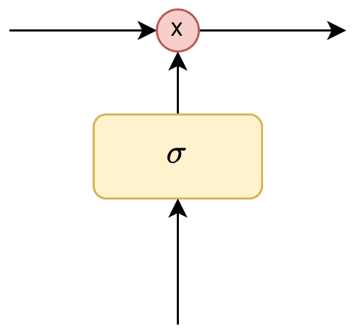

sigmoidal 层返回从 0 到 1 的数字，这表示每个信息块在网络中应该跳过的部分。在这种情况下，零值意味着*跳过所有的*，而零值意味着*保留所有的*。

在 LSTM 有三个这样的门，允许你保存和控制细胞的状态。LSTM 的第一个信息流阶段决定了哪些信息可以从小区状态中丢弃。这个决定是由乙状线层做出的，称为**遗忘门层**。它查看单元格的状态，并为每个值返回一个从 0 到 1 的数字。1 表示*保留一切*，0 表示*跳过一切*:

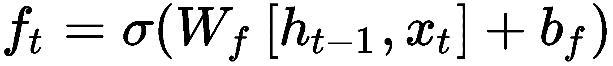

LSTM 中的下一个流阶段决定应该在单元状态中存储什么新信息。这一阶段由两部分组成。首先，一个叫做**输入层门**的乙状线层决定了哪些值应该更新。然后， *tanh* 层构建一个新候选值的向量，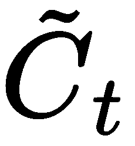，它可以添加到单元的状态中:


要用新状态替换细胞的旧状态，我们需要将 <sub>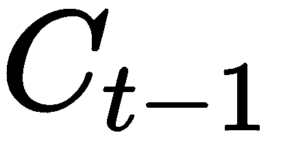</sub> 的旧状态乘以 <sub></sub> ，忘记我们决定忘记的。然后，我们添加 <sub>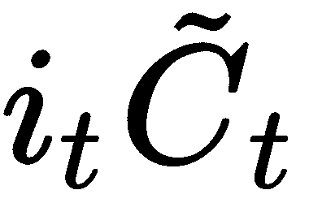</sub> (新的候选值，乘以我们想要更新每个状态值的数量):

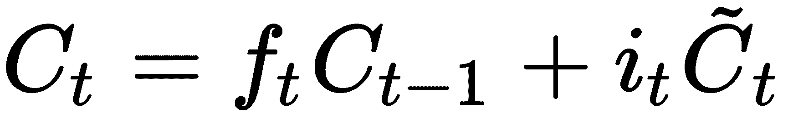

输出值基于我们的单元状态，门函数(滤波器)应该应用于它们。首先，我们应用一个名为输出门的 sigmoidal 层，它决定我们应该输出来自单元状态的什么信息。然后，单元的状态值通过 *tanh* 层，得到从 **-1** 到 **1** 的值作为输出，乘以 sigmoid 层的输出值。这允许您仅输出所需的信息:

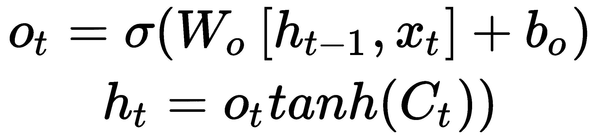

基于这一思想，LSTM 有许多变体。现在让我们来看看其中的一些。

# 天鹤座

GRU 是 LSTM 建筑的变体。它们少了一个门(滤波器)，连接方式也不同。在这个变体中，忘记门和输入门被组合成一个*更新门*。除此之外，细胞状态和潜伏状态是结合在一起的。由此产生的模型比标准 LSTM 模型更简单，因此越来越受欢迎:


更新后的门决定了从最后一个状态应该保留多少信息，以及应该从前一层获取多少信息:

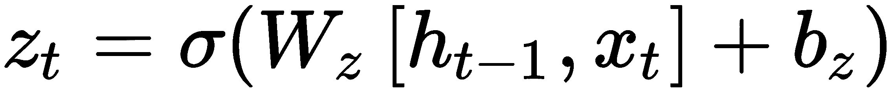

复位门的工作方式类似于遗忘门:

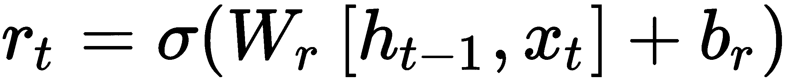

*tanh* 层构建了一个新的候选值向量，可以将其添加到单元的状态中。*复位门*的值应用于先前状态的值:


基于先前状态值和新候选值的组合获得新状态。*更新门*值控制应使用何种比例的状态值:


# 双向 RNN

双向 RNN、LSTMs 和 gru(BiRNN、BiLSTM 和 BiGRU)与其单向变体没有太大区别。不同的是，这些网络不仅使用来自*过去*的数据，还使用来自该系列的*未来*的数据。当我们在循环网络中处理一个序列时，我们通常输入一个元素，然后输入下一个元素，并将网络的前一个状态作为输入。这个过程的自然方向是从左到右。

然而，在许多情况下，从一开始就已经给出了完整的序列。因此，我们可以用两个神经网络从两侧将其传递给神经网络，然后组合它们的结果:

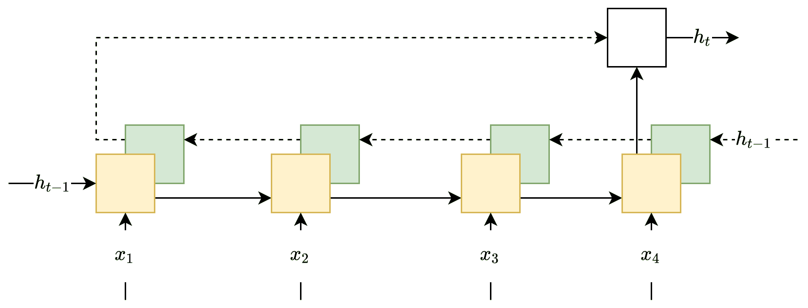

这种建筑被称为双向 RNN。它的质量甚至比普通的递归网络更高，因为序列的每个元素都有更广泛的上下文。现在有两种情况——一种在前，一种在后。对于许多任务，这增加了质量，尤其是与处理自然语言相关的任务。

# 多层 RNN

多层 RNNs(也称为深度 RNNs)是另一个概念。这里的想法是，我们在源网络之上添加额外的无线网络，其中每个添加的 RNN 都是不同的层。第一个(或最低的)RNN 的隐藏状态的输出是它上面的下一层的 RNN 的输入。一般预测通常从最近(最高电流输出)层的潜在状态计算得出:

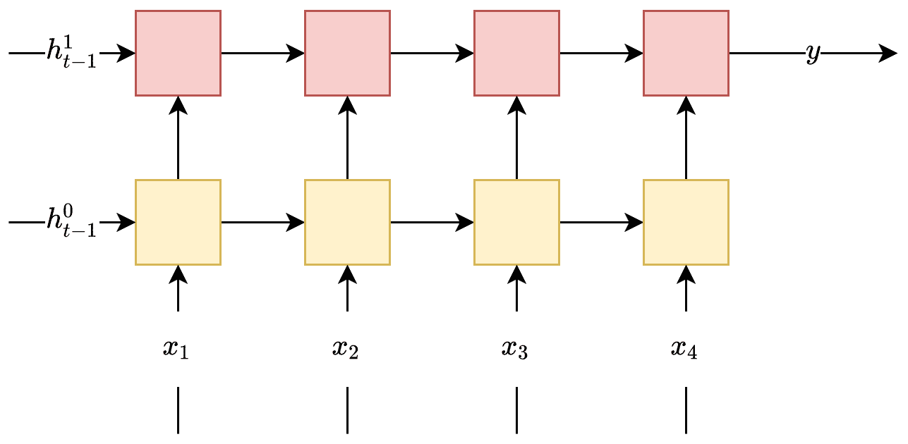

上图显示了一个多层单向 RNN，其中层号表示为上标。另外，注意每一层都需要自己的初始隐藏状态。

现在我们已经了解了 RNN 的各种体系结构，让我们来看看 RNN 在自然语言处理方面的另一个方面。

# 用 RNNs 理解自然语言处理

**自然语言处理(NLP)** 是计算机科学的一个分支，研究处理和分析人类语言的算法。有各种算法和方法来教计算机解决假设使用人类语言数据的任务。让我们从这个领域使用的基本原则开始。毕竟，计算机不知道如何阅读，所以自然语言处理的第一个问题是你必须教一台机器使用自然语言单词。我想到的一个想法是按照单词在字典中存在的顺序用数字编码。这个想法相当简单——数字是无穷无尽的，你可以轻松地对单词进行编号和重新编号。但是这个想法有一个明显的缺点；字典里的单词是按字母顺序排列的，当我们添加新单词时，我们需要对很多单词重新编号。这种方法计算效率很低，但即使这样也不是一个重要的问题。重要的是这个单词的拼写和它的意思无关。*公鸡*、*母鸡*、*小鸡*这几个词在字母顺序上几乎没有什么共同之处，在字典里也相距甚远，尽管它们可以确定同一只鸟的雌雄幼体。

因此，我们可以区分两种类型的单词邻近度:词汇和语义。换句话说，字典顺序不能保持单词的语义接近性。比如*葱属*这个词在字典里可以跟*调配*这个词，但是它们没有任何共同的语义。另一个词汇相似的例子是*雨*和*痛*，但它们通常也用于不同的语境。如鸡的例子所示，词汇差异很大的单词(*公鸡*和*母鸡*)可以有很多语义上的相似性(它们指的是鸟)，即使它们在字典中彼此相距很远。所以，这些接近度是独立的。

为了能够表示语义上的接近，我们可以使用嵌入；也就是说，将一个单词与一个向量相关联，并在含义的*空间*中显示其含义。嵌入是我们将任意实体映射到特定向量；例如，图形中的节点、图片中的对象或单词的定义。

有许多方法可以创建单词嵌入。在接下来的几个小节中，我们将考虑两个最广泛的:Word2Vec 和**全局向量** ( **手套**)。

# Word2Vec

2013 年，托马什·米科洛夫提出了一种新的单词嵌入方法，他称之为 Word2Vec。他的方法基于另一个关键假设，在科学中通常被称为分布假设或位置假设:*意义相似的单词出现在相似的上下文中*(鲁宾斯坦和古德托，1965)。在这种情况下，邻近性度量被非常广泛地理解为只有语义相似的单词才可以邻近的事实。比如*发条闹钟*这句话在这款车型中是可以接受的，但是*发条橘子*就不行。*发条*和*橘子*这两个词，用语义是不容易组合的。Mikolov 提出的模型非常简单(因此也很有用)——我们根据一个单词所处的环境(语境)来预测它出现的概率。具体来说，我们学习单词向量，使得模型分配给单词的概率接近于在原始文本的环境(上下文)中遇到这个单词的概率。

培训过程组织如下:

1.  读取语料库，计算语料库中每个单词的出现次数(即每个单词在语料库中出现的次数)。
2.  一个词的数组按频率排序，稀有词删除(也叫 *hapax* )。

3.  从语料库中读取子内容，并对最频繁的单词进行二次抽样。一个子内容是语料库的一个特定的基本元素，通常只是一个句子，但它可以是一个段落，甚至是一整篇文章。二次抽样是从分析中移除最频繁的单词的过程，这加快了算法的学习过程，并有助于显著提高所得模型的质量。
4.  我们通过一个窗口(窗口大小被设置为一个参数)来检查子内容。这意味着我们按顺序取 2k + 1 个单词，应该预测的单词在中间。周围的单词是一个长度的上下文， *k* ，在每一边。
5.  所选单词用于训练简单的前馈神经网络，通常具有一个隐藏层，并具有输出层的分级软最大值和/或负采样激活函数。对于隐藏层，使用线性激活函数。
6.  预测的目标值是窗口中心需要预测的单词。
7.  训练过程中的单词通常是使用一键编码呈现的。
8.  在整个训练语料库上训练网络后，我们模型中的每个单词都应该与我们在训练模型的过程中改变的唯一向量相关联。
9.  对应于单词的向量的大小等于学习网络的隐藏层的大小，而向量的值是隐藏层神经元的输出值。这些值可以在我们向网络输入馈送一些训练样本后获得。

尽管该模型没有明确包括任何语义——只有文本语料库的统计属性——但事实证明，经过训练的 Word2Vec 模型可以捕获单词的一些语义属性。目前，该算法有各种修改，例如 Doc2Vec 算法，它学习段落和文档嵌入。

# 手套

请注意，Word2Vec 算法只考虑单词的本地上下文。它没有在整个训练语料库中使用全局统计数据。比如 *the* 和 *cat* 这两个词会经常一起使用，但是 Word2Vec 无法判断 *the* 这个词是不是标准冠词，或者 *the* 和 *cat* 这两个词是否有很强的隐含联系。这个问题引出了使用全局统计的想法。

例如，**潜在语义分析(LSA)** 通过使用奇异分解分解术语文档矩阵来计算单词的嵌入。然而，即使这种方法利用了全局信息，所获得的向量也没有显示出与使用 Word2Vec 获得的向量相同的泛化特性。例如，使用 Word2Vec 获得的向量具有这样的一般化属性，通过使用算术运算，您可以生成以下类型的结果:国王-男人+女人=女王。

还有另一种流行的算法叫做**手套**。GloVe 旨在实现两个目标:

*   创建在向量空间中捕捉意义的单词向量
*   利用全球统计数据，而不仅仅是使用本地信息

与使用句子流进行训练的 Word2Vec 不同，GloVe 基于共现矩阵进行训练，并训练单词向量，以便它们的差异预测共现比率。

首先，我们需要建立一个同现矩阵。有可能使用固定大小的窗口来计算共现矩阵，以使 GloVe 也考虑局部上下文。比如*猫坐在垫子上*这句话，窗口大小为 2，可以转换成下面的共现矩阵:

| 这 | 猫 | 坐 | 在 | 垫子 |
| 这 | Two | one | one | one |
| 猫 | one | one | one | Zero |
| 坐 | Two | one | one | Zero |
| 在 | one | one | one | one |
| 垫子 | one | Zero | one | one |

请注意，矩阵是对称的，因为当单词 *cat* 出现在单词 *sat* 的上下文中时，也会发生相反的情况。

为了将向量与我们之前计算的统计数据联系起来，我们可以制定以下原则:就上下文而言，两个单词之间的巧合关系与其含义密切相关。例如，考虑单词*冰*和*蒸汽*。冰和蒸汽的状态不同，但相似之处在于它们是水的形式。因此，我们可以预期，与水相关的词语(如*水分*和*水分*)将在词语*冰*和*蒸汽*的上下文中同等显示。相比之下，*冷**固*等词很可能出现在*冰*这个词旁边，而不是*汽*这个词旁边。

让我们将同现矩阵表示为 *X* 。在这种情况下 <sub></sub> 指的是 *X* 中的元素 *i* 和 *j* ，等于 *j* 这个词在这个词的上下文中出现的次数。我们也可以将 <sub></sub> 定义为 *i* 这个词的上下文中出现的总字数。

接下来，我们需要使用单词向量生成一个表达式来估计共现率。为此，我们从以下关系开始:

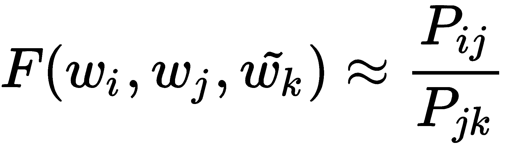

这里， <sub></sub> 表示单词 *j* 在单词 *i* 上下文中出现的概率，可以表示如下:


*F* 是一个未知函数，对 *i* 、 *k* 和 *j* 进行嵌入。注意嵌入有两种:上下文输入和目标词输出(分别表示为 <sub></sub> 和 <sub></sub> )。这两种嵌入是一个小细节，但仍然需要记住。

现在，问题是，*我们如何生成函数，* *F* ？大家可能还记得，GloVe 的目标之一是创建具有良好泛化能力的值的向量，这些值可以使用简单的算术运算(如加法和减法)来表示。我们必须选择 *F* ，这样我们在使用这个函数时得到的向量就与这个属性相匹配。

因为我们希望向量之间算术运算的使用有意义，所以我们必须输入函数 *F* ，向量之间算术运算的结果。最简单的方法是将 *F* 应用于我们正在比较的向量之间的差异，如下所示:

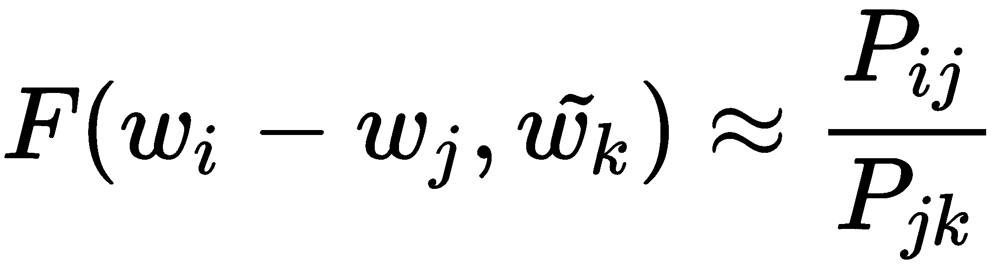

要指定 <sub></sub> 和 <sub></sub> 之间的线性关系，我们使用点积运算:


现在，为了简化表达式并计算函数， *F* ，我们使用以下方法。

首先，我们可以取概率比的对数，将概率比转化为概率之差。然后，我们可以通过为每个单词添加一个偏移项来表达一些单词比其他单词更常见的事实。

考虑到这些因素，我们得到以下等式:

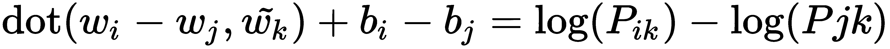

我们可以将这个等式转换为来自同现矩阵的单个记录的等式:


通过这样做，我们将等式右侧的最后一项转化为偏置项。通过增加对称性的输出偏置，我们得到以下公式:

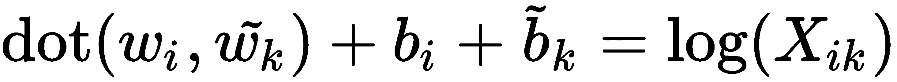

这个公式是中心手套方程。但是这个等式有一个问题:它同等地评估单词的所有同现。然而，在现实中，并不是所有的同现都具有相同的信息质量。很少出现的同现往往会很吵，也不可靠，所以我们希望对更频繁的同现赋予更强的权重。另一方面，我们不希望频繁的同现完全支配损失函数，因此我们不希望估计值完全依赖于频率。

作为实验的结果，原文章《手套:单词表示的全局向量》的作者杰弗里·潘宁顿、理查德·索彻和克里斯托弗·曼宁发现以下权重函数运行良好:

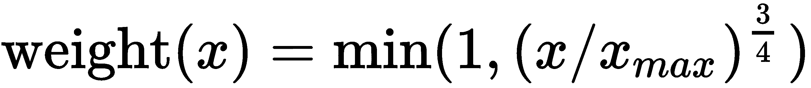

使用这个函数，我们可以将损失函数转换为以下形式:

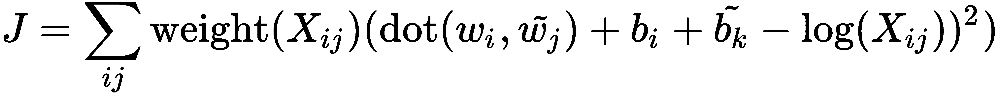

现在，寻找嵌入向量的任务被简化为最小化这个损失函数。这个操作可以例如使用随机梯度下降方法来完成。

在下一节中，我们将使用我们在前面几节中学习的 RNN 原则，利用`PyTorch`库开发一个情感分析模型。

# RNN 情感分析示例

在本节中，我们将构建一个机器学习模型，该模型可以使用 PyTorch 检测评论情绪(检测评论是积极的还是消极的)。作为一个训练集，我们将使用大型电影评论数据集，其中包含一组 25，000 个电影评论用于训练，25，000 个用于测试，这两个数据集都是高度极化的。

首先，我们必须开发解析器和数据加载器类，以适合 PyTorch 使用的格式将数据集移动到内存中。

让我们从解析器开始。我们的数据集组织如下:火车和测试集有两个文件夹，每个文件夹包含两个名为`pos`和`neg`的子文件夹，分别放置正面评审文件和负面评审文件。数据集中的每个文件只包含一个评论，它的情感取决于它所在的文件夹。在下面的代码示例中，我们将定义读取器类的接口:

```cpp
 class ImdbReader {
     public:
     ImdbReader(const std::string& root_path);

     size_t GetPosSize() const;
     size_t GetNegSize() const;
     size_t GetMaxSize() const;

     using Review = std::vector<std::string>;
     const Review& GetPos(size_t index) const;
     const Review& GetNeg(size_t index) const;

     private:
     using Reviews = std::vector<Review>;

     void ReadDirectory(const std::string& path, Reviews& reviews);

     private:
     Reviews pos_samples_;
     Reviews neg_samples_;
     size_t max_size_{0};
 };
```

我们将`Review`类型定义为字符串的向量。还有两个向量，`pos_samples_`和`neg_samples_`，包含从相应文件夹中读取的评论。

我们将假设这个类的对象应该用其中一个数据集(训练集或测试集)所在的根文件夹的路径初始化。我们可以通过以下方式初始化:

```cpp
 int main(int argc, char** argv) {
     if (argc > 0) {
         auto root_path = fs::path(argv[1]);
         ...
         ImdbReader train_reader(root_path / "train");
         ImdbReader test_reader(root_path / "test");
     }
     ...
 }
```

这个类最重要的部分是构造函数和`ReadDirectory`方法。构造器是我们填充容器`pos_samples_`和`neg_samples_`的主要点，实际评审来自`pos`和`neg`文件夹:

```cpp
 namespace fs = std::filesystem;
 ...
 ImdbReader::ImdbReader(const std::string& root_path) {
     auto root = fs::path(root_path);
     auto neg_path = root / "neg";
     auto pos_path = root / "pos";
     if (fs::exists(neg_path) && fs::exists(pos_path)) {
         auto neg = std::async(std::launch::async,
         [&]() { ReadDirectory(neg_path, neg_samples_); });
         auto pos = std::async(std::launch::async,
         [&]() { ReadDirectory(pos_path, pos_samples_); });
         neg.get();
         pos.get();
     } else {
         throw std::invalid_argument("ImdbReader incorrect path");
     }
 }
```

`ReadDirectory`方法实现了在给定目录中迭代文件的逻辑。它还读取它们，标记行，并填充数据集容器，然后将其作为函数参数传递。下面的代码显示了`ReadDirectory`方法的实现:

```cpp
void ImdbReader::ReadDirectory(const std::string& path, Reviews& reviews) {
     std::regex re("[^a-zA-Z0-9]");
     std::sregex_token_iterator end;

     for (auto& entry : fs::directory_iterator(path)) {
         if (entry.is_regular_file()) {
             std::ifstream file(entry.path());
             if (file) {
                 std::string text;
                 {
                     std::stringstream buffer;
                     buffer << file.rdbuf();
                     text = buffer.str();
                 }

                 std::sregex_token_iterator token(text.begin(), text.end(), 
                                                  re, -1);

                 Review words;
                 for (; token != end; ++ token) {
                     if (token->length() > 1) {  // don't use one letter 
                                                 // words
                         words.push_back(*token);
                     }
                 }
                 max_size_ = std::max(max_size_, words.size());
                 reviews.push_back(std::move(words));
             }
         }
     }
 }
```

我们使用标准的库目录迭代器类`fs::directory_iterator`，来获取文件夹中的每个文件。这个类的对象返回`fs::directory_entry`类的对象，这个对象可以用`is_regular_file`方法判断这是否是一个常规文件。我们用`path`方法得到了这个条目的文件路径。

我们使用`std::ifstream`类型对象的`rdbuf`方法将整个文件读入一个字符串对象。然后，我们使用正则表达式标记(分割不同的单词)这个字符串。C++ 标准库中的`std::sregex_token_iterator`类可以精确地用于此目的。这个类的对象是用我们需要拆分的目标文本字符串的迭代器范围、正则表达式对象和对象将搜索的子匹配的索引初始化的。我们用正则表达式定义了`re`对象(它匹配所有不是字母数字字符的东西)。作为子匹配索引，我们使用了 *-1* ，因为 *0* 代表整个匹配， *-1* 代表匹配之间的字符。通过对标记进行迭代，我们选择长度大于 1 的单词，以降低计算复杂度并消除无意义的字符。所有相关的令牌都放在`Review`容器类型中，这代表一个单独的评论。这个评论也被放在顶层容器中，作为函数参数传递。请注意，我们使用了`std::move`功能来移动容器，以消除繁重的复印操作。

在我们阅读了训练和测试数据集之后，我们需要建立一个单词词汇表，其中代表一个单词的每个字符串都匹配一个唯一的索引。我们将使用这样的词汇表来将基于字符串的评论转换为基于整数的表示，这些表示可以与线性代数抽象一起使用。我们可以从评论中出现的一整套单词中建立这样一个词汇，但这会产生一个巨大的语料库；在实践中，许多单词很少使用，因此会产生不必要的噪音。为了避免这些问题，我们只能使用一定数量的最常用的单词。要选择这样的词，我们需要计算评论中所有词的出现频率。我们可以通过使用哈希映射对象来做到这一点:

```cpp
 using WordsFrequencies = std::unordered_map<std::string, size_t>; 
```

我们可以通过累加单词在地图第二个成员中出现的次数来计算频率。这是通过遍历评论中的所有单词来完成的:

```cpp
 void GetWordsFrequencies(const ImdbReader& reader,
                          WordsFrequencies& frequencies) {
     for (size_t i = 0; i < reader.GetPosSize(); ++ i) {
         const ImdbReader::Review& review = reader.GetPos(i);
         for (auto& word : review) {
             frequencies[word] += 1;
         }
     }

     for (size_t i = 0; i < reader.GetNegSize(); ++ i) {
         const ImdbReader::Review& review = reader.GetNeg(i);
         for (auto& word : review) {
             frequencies[word] += 1;
         }
     }
 }
```

该功能的使用方式如下:

```cpp
 WordsFrequencies words_frequencies;
 GetWordsFrequencies(train_reader, words_frequencies);
 GetWordsFrequencies(test_reader, words_frequencies);
```

在我们计算了数据集中每个单词的出现次数后，我们可以选择特定数量的最常用单词。让我们将词汇量设置为 25，000 个单词:

```cpp
int64_t vocab_size = 25000;
```

要选出最常见的 25000 个单词，我们必须根据它们的频率对所有单词进行排序。为了执行这个操作，我们需要使用一个不同于哈希映射的容器(因为它是一个无序的容器)。因此，我们将使用 C++ 向量类。它应该用包含频率值和原始项目迭代器的对类型进行参数化。这个迭代器应该指向哈希映射中的元素。这样的方法将允许我们减少复制操作。然后，我们可以使用带有自定义比较函数的标准排序算法。这一概念在`SelectTopFrequencies`功能中得到了充分实现:

```cpp
 void SelectTopFrequencies(WordsFrequencies& vocab, int64_t new_size) {
     using FreqItem = std::pair<size_t, WordsFrequencies::iterator>;
     std::vector<FreqItem> freq_items;
     freq_items.reserve(vocab.size());
     auto i = vocab.begin();
     auto e = vocab.end();
     for (; i != e; ++ i) {
         freq_items.push_back({i->second, i});
     }

     std::sort(
         freq_items.begin(), freq_items.end(),
         [](const FreqItem& a, const FreqItem& b) 
         { return a.first < b.first; });

     std::reverse(freq_items.begin(), freq_items.end());

     freq_items.resize(static_cast<size_t>(new_size));

     WordsFrequencies new_vocab;

     for (auto& item : freq_items) {
         new_vocab.insert({item.second->first, item.first});
     }

     vocab = new_vocab;
 }
```

标准库的`sort`函数假设如果第一个参数小于第二个参数，则传递的比较函数返回真。因此，在排序之后，我们反转结果，以便将最频繁的单词移动到容器的开头。然后，我们简单地将`freq_items`容器调整到所需的长度。该功能的最后一步是从代表最常用单词的项目中创建新的`WordsFrequencies`类型对象。另外，我们用`new_vocab`对象内容替换了原来`vocab`对象的内容。下面的代码显示了如何使用这个函数:

```cpp
 SelectTopFrequencies(words_frequencies, vocab_size);
```

在我们给单词分配索引之前，我们必须决定如何为它们生成嵌入。这是一个重要的问题，因为我们分配的索引将用于访问单词嵌入。在这个例子中，我们使用了预先训练好的 GloVe 单词嵌入。我们可以在原创文章的网站上找到不同的变体:[https://nlp.stanford.edu/projects/glove/](https://nlp.stanford.edu/projects/glove/)。

本例选择了从维基百科 2014 年材料和 Gigaword 5 文本语料库中学习的单词向量，该语料库包含 60 亿个标记和 100 维向量。和前面的例子一样，我们需要为下载的嵌入创建一个解析器。下载的嵌入文件每行包含一个键值对，其中键是单词，值是 100 维向量。该行中的所有项目都用空格分隔，因此格式看起来如下:word*x<sub>0</sub>x<sub>1</sub>x<sub>2</sub>...x99* 。

以下代码为手套嵌入的解析器定义了`class`接口:

```cpp
 class GloveDict {
   public:
     GloveDict(const std::string& file_name, int64_t vec_size);
     torch::Tensor Get(const std::string& key) const;
     torch::Tensor GetUnknown() const;

   private:
     torch::Tensor unknown_;
     std::unordered_map<std::string, torch::Tensor> dict_;
 };
```

`GloveDict`类构造器获取嵌入向量的文件名和大小。这里使用了两种方法。`Get`方法返回对应于输入单词的嵌入的`torch::Tensor`类型对象。第二种方法`GetUnknown`返回表示嵌入列表中不存在的单词的嵌入的张量。在我们的例子中，这是零张量。

主要的工作由类的构造器完成，我们读取一个带有 GloVe 向量的文件，解析它，并用 key 角色中的单词初始化`dict_` map 对象，并将张量嵌入为值:

```cpp
 GloveDict::GloveDict(const std::string& file_name, int64_t vec_size) {
     std::ifstream file;
     file.exceptions(std::ifstream::badbit);
     file.open(file_name);
     if (file) {
         auto sizes = {static_cast<long>(vec_size)};
         std::string line;
         std::vector<float> vec(static_cast<size_t>(vec_size));
         unknown_ = torch::zeros(sizes, torch::dtype(torch::kFloat));
         std::string key;
         std::string token;
         while (std::getline(file, line)) {
             if (!line.empty()) {
                 std::stringstream line_stream(line);
                 size_t num = 0;
                 while (std::getline(line_stream, token, ' ')) {
                     if (num == 0) {
                         key = token;
                     } else {
                         vec[num - 1] = std::stof(token);
                     }
                     ++ num;
                 }
                 assert(num == (static_cast<size_t>(vec_size) + 1));
                 torch::Tensor tvec = torch::from_blob(
                     vec.data(), sizes, 
                     torch::TensorOptions().dtype(torch::kFloat));
                 dict_[key] = tvec.clone();
             }
         }
     }
 }
```

在这种方法中，我们用标准库中的`std::getline`函数逐行读取文件。我们定义了一个`std::vector<float>`类型的对象来保存嵌入向量值，并且我们使用来自`PyTorch`库的`torch::zeros`函数初始化了带有零的未知单词的`unknown_`张量。为了分割令牌中的行，我们还使用了`std::getline`功能。这是因为它有第二个参数可以用来指定分隔符。默认情况下，分隔符是换行符，但是我们指定了空格字符作为分隔符。我们使用第一个令牌作为关键字。关于每个文件行中的其他标记，我们将它们放入浮点数的向量中。当我们解析一整行时，我们用`torch::from_blob`方法构造`torch::Tensor`对象，该方法包装现有数据，而不将其复制到具有指定选项的张量对象。最后，我们把键值对放到地图上；关键是单词，值是张量对象。请注意，我们使用`clone`方法将精确数据复制到地图中存储的新对象。`vec`对象用于在解析向量时重用内存。标准库中的`std::stof`函数用于将字符串转换为浮点数。

现在，我们拥有了创建一个词汇类所需的一切，这个词汇类可以将一个单词与一个唯一的索引相关联，并将该索引与一个向量嵌入相关联。下面的代码片段显示了它的定义:

```cpp
 class Vocabulary {
     public:
     Vocabulary(const WordsFrequencies& words_frequencies,
                const GloveDict& glove_dict);

     int64_t GetIndex(const std::string& word) const;
     int64_t GetPaddingIndex() const;
     torch::Tensor GetEmbeddings() const;
     int64_t GetEmbeddingsCount() const;

     private:
     std::unordered_map<std::string, size_t> words_to_index_map_;
     std::vector<torch::Tensor> embeddings_;
     size_t unk_index_;
     size_t pad_index_;
 };
```

`Vocabulary`类的对象应该用`WordsFrequencies`和`GloveDict`类的实例初始化；它实现了下一个重要的方法。`GetIndex`返回输入单词的索引，而`GetEmbeddings`返回包含所有嵌入的张量(以行为单位)，其顺序与单词索引相同。`GetPaddingIndex`方法返回嵌入的索引，可用于填充(实际上是零张量)。`GetEmbeddingsCount`方法返回嵌入的总数。

Notice that this number can be different from the total number of the words in our dictionary because some words can be missed in the GloVe embeddings. Such missed words should be associated with the unknown index and zero-valued embedding.

下面的代码显示了如何实现构造函数:

```cpp
 Vocabulary::Vocabulary(const WordsFrequencies& words_frequencies,
 const GloveDict& glove_dict) {
     words_to_index_map_.reserve(words_frequencies.size());
     embeddings_.reserve(words_frequencies.size());

     unk_index_ = 0;
     pad_index_ = unk_index_ + 1;

     embeddings_.push_back(glove_dict.GetUnknown());  // unknown
     embeddings_.push_back(glove_dict.GetUnknown());  // padding

     size_t index = pad_index_ + 1;
     for (auto& wf : words_frequencies) {
         auto embedding = glove_dict.Get(wf.first);
         if (embedding.size(0) != 0) {
             embeddings_.push_back(embedding);
             words_to_index_map_.insert({wf.first, index});
             ++ index;
         } else {
             words_to_index_map_.insert({wf.first, unk_index_});
         }
     }
 }
```

在这个方法中，我们填充了`words_to_index_map_`和`embeddings_`容器。首先，我们将两个零值张量插入到`embeddings_`容器中:一个用于手套未知单词，另一个用于填充值:

```cpp
 embeddings_.push_back(glove_dict.GetUnknown());  // unknown
 embeddings_.push_back(glove_dict.GetUnknown());  // padding
```

我们使用填充值来创建一批用于训练的评论，因为几乎所有的评论文本都有不同的长度。然后，我们迭代作为参数传递的`words_frequencies`对象，并使用`glove_dict`对象从字典中搜索单词的嵌入向量。如果在`glove_dict`对象中找到了单词，那么我们用张量填充`embeddings_`对象，用单词作为关键字和索引作为值填充`words_to_index_map_`对象。如果在`glove_dict`对象中找不到单词，那么我们只填充`words_to_index_map_`对象，单词作为关键字，`unk_index_`作为值。注意`index`值是如何初始化和递增的；从 *2* 开始，因为 *0* 索引被未知嵌入占用，1 索引被填充值嵌入占用:

```cpp
 unk_index_ = 0;
 pad_index_ = unk_index_ + 1;
 ...
 size_t index = pad_index_ + 1;
```

请注意，我们只是在将新的嵌入张量插入`embeddings_`对象后增加了索引。在相反的情况下，当没有找到该单词的嵌入时，该单词与未知值索引相关联。`GetEmbeddings`方法中`Vocabulary`类的下一个重要方法，它从嵌入张量的向量中生成单个张量。下面的代码显示了它的实现:

```cpp
 at::Tensor Vocabulary::GetEmbeddings() const {
     at::Tensor weights = torch::stack(embeddings_);
     return weights;
 }
```

这里，我们使用了`torch::stack`函数，它沿着一个新的维度连接来自给定容器的张量(默认情况下，该函数添加一个索引为 0 的维度)。

其他`Vocabulary`类方法返回相应的值:

*   `GetIndex`:返回词汇表中给定单词的索引
*   `GetPaddingIndex`:返回词汇表中填充值的索引
*   `GetEmbeddings`:将所有嵌入作为一个张量对象返回
*   `GetEmbeddingsCount`:返回词汇表中嵌入的数量

现在，我们已经有了数据集类实现所需的所有类。这样的类可以用于 PyTorch 数据加载器的初始化。然而，在我们开发它之前，我们应该讨论我们的模型应该如何处理训练批次。我们已经提到过复习课文的长度不同，所以不可能将几篇合并成一个矩形张量(记住单词是用数字索引表示的)。为了解决这个问题，我们需要让它们都一样长。这个操作可以通过使用`ImdbReader`的`GetMaxSize`方法确定数据集中最长的文本并分配这个大小的张量作为维度之一来完成。较短的文本用零值填充。我们已经定义了在`Vocabulary`类中获取填充索引的方法。

然而，这种方法也会导致大量不必要的计算，并给我们的训练数据增加噪声，这可能会使我们的模型不太精确。幸运的是，因为这是一个常见的问题，所以有一个解决方案。`PyTorch`库有一个 LSTM 模块实现，可以通过忽略填充值来有效地处理填充批次。为了使用这样的功能，我们需要添加关于批处理中每个文本(序列)长度的信息。

因此，我们的数据集类应该返回一对训练张量:一个表示编码文本，另一个包含其长度。此外，我们需要开发一个自定义函数，将一批张量的向量转换为一个张量。如果我们想使 PyTorch 与自定义训练数据兼容，则需要此功能。

让我们为一个定制的训练数据样本定义`ImdbSample`类型。我们将使用`torch::data::Dataset`类型:

```cpp
 using ImdbData = std::pair<torch::Tensor, torch::Tensor>;
 using ImdbSample = torch::data::Example<ImdbData, torch::Tensor>;
```

`ImdbData`代表训练数据，有两个测试序列和长度的张量。`ImdbSample`代表具有目标值的整个样本。张量包含 1 或 0，分别代表积极或消极情绪。

下面的代码片段显示了`ImdbDataset`类的声明:

```cpp
 class ImdbDataset : public torch::data::Dataset<ImdbDataset, ImdbSample> {
     public:
         ImdbDataset(ImdbReader* reader,
                     Vocabulary* vocabulary,
                     torch::DeviceType device);

         // torch::data::Dataset implementation
         ImdbSample get(size_t index) override;
         torch::optional<size_t> size() const override;

     private:
         torch::DeviceType device_{torch::DeviceType::CPU};
         ImdbReader* reader_{nullptr};
         Vocabulary* vocabulary_{nullptr};
 };
```

我们从`torch::data::Dataset`类继承了我们的数据集类，这样我们就可以将其用于数据加载器初始化。PyTorch 数据加载器对象负责对随机训练对象进行采样，并从中制作批次。我们的`ImdbDataset`类的对象应该用`ImdbReader`和`Vocabulary`类实例初始化。我们还在构造器中加入了`torch::DeviceType`的`device`参数，告诉对象训练对象在 CPU 或 GPU 内存中的位置。在构造函数中，我们存储指向输入对象和设备类型的指针。我们覆盖了`torch::data::Dataset`类中的两种方法:`get`和`size`方法。

下面的代码展示了我们如何实现`size`方法:

```cpp
 torch::optional<size_t> ImdbDataset::size() const {
     return reader_->GetPosSize() + reader_->GetNegSize();
 } 
```

`size`方法返回`ImdbReader`对象中的评论数。`get`方法的实现比前一个更复杂，如下面的代码所示:

```cpp
 ImdbSample ImdbDataset::get(size_t index) {
     torch::Tensor target;
     const ImdbReader::Review* review{nullptr};
     if (index < reader_->GetPosSize()) {
         review = &reader_->GetPos(index);
         target = torch::tensor(1.f, 
            torch::dtype(torch::kFloat).device(
                device_).requires_grad(false));
     } else {
         review = &reader_->GetNeg(index - reader_->GetPosSize());
         target = torch::tensor(0.f, 
            torch::dtype(torch::kFloat).device(
                device_).requires_grad(false));
     }
```

首先，我们从给定的索引(函数参数值)中获取评论文本和情感值。在`size`方法中，我们返回了正面和负面评论的总数，所以如果输入的指标大于正面评论的数量，那么这个指标就指向了负面。然后，我们从中减去正面评价的数量。

在我们得到正确的索引后，我们也得到相应的文本评论，并将其地址分配给`review`指针并初始化`target`张量。`torch::tensor`函数用于初始化目标张量。该函数接受任意数值和张量选项，如类型和设备。请注意，我们将`requires_grad`选项设置为 false，因为我们不需要计算该变量的梯度。以下代码显示了`get`方法实现的延续:

```cpp
     // encode text
     std::vector<int64_t> indices(reader_->GetMaxSize());
     size_t i = 0;

     for (auto& w : (*review)) {
         indices[i] = vocabulary_->GetIndex(w);
         ++ i;
     }
```

这里，我们将评论文本从字符串编码到它们的索引。为了存储最大可能长度的编码，我们定义了整数值的`indices`向量。然后，我们通过对每个单词应用词汇对象的`GetIndex`方法，在循环中填充它。请注意，我们使用了`i`变量来计算我们编码的字数。需要使用此变量，因为序列中的其他位置将使用特定的填充索引进行填充。

下面的代码显示了我们如何将填充索引添加到序列中:

```cpp
     // pad text to same size
     for (; i < indices.size(); ++ i) {
         indices[i] = vocabulary_->GetPaddingIndex();
     }
```

当我们初始化了一个训练样本所需的所有数据后，我们必须将其转换成一个`torch::Tensor`对象。为此，我们可以使用已知的函数，即`torch::from_blob`和`torch::tensor`。`torch::from_blob`函数接受原始数值数据、尺寸容器和张量选项的指针。下面的代码显示了我们如何使用这些函数在`get`方法实现的末尾创建最终的张量对象:

```cpp
     auto data = torch::from_blob(indices.data(),
                        {static_cast<int64_t>(reader_->GetMaxSize())},
                         torch::dtype(torch::kLong).requires_grad(false));

     auto data_len = torch::tensor(static_cast<int64_t>(review->size()),
                         torch::dtype(torch::kLong).requires_grad(false));

     return {{data.clone().to(device_), data_len.clone()}, 
         target.squeeze()};
 }
```

请注意，包含文本序列的`data`对象已通过`to`方法移动到特定设备，但`data_len`留在默认(中央处理器)设备中，因为这是 PyTorch LSTM 实现 API 的要求。此外，看看`squeeze`方法的使用——该方法移除了所有等于 1 的张量维度，因此在我们的例子中，我们使用它来制作单值张量(而不是矩形张量)。

下面的代码显示了如何使用我们之前定义的类来初始化训练和测试数据集的数据加载器:

```cpp
torch::DeviceType device = torch::cuda::is_available()
                                        ? torch::DeviceType::CUDA
                                        : torch::DeviceType::CPU;
 ...
 // create datasets
 ImdbDataset train_dataset(&train_reader, &vocab, device);
 ImdbDataset test_dataset(&test_reader, &vocab, device);

 // init data loaders
 size_t batch_size = 32;
 auto train_loader = torch::data::make_data_loader(train_dataset,
      torch::data::DataLoaderOptions().batch_size(batch_size).workers(4));

 auto test_loader = torch::data::make_data_loader(test_dataset,
      torch::data::DataLoaderOptions().batch_size(batch_size).workers(4));
```

在我们继续之前，我们需要定义一个辅助函数，它将张量的批处理向量转换成一个张量。为了更好地利用硬件资源，为了提高性能，需要进行这种转换来对计算进行矢量化。请注意，当我们用`make_data_loader`函数初始化数据加载器时，我们没有像前面的例子那样使用数据集对象的映射和转换方法。这样做是因为默认情况下，PyTorch 不能自动将任意类型(在我们的例子中，是`ImdbData`对类型)转换成张量。下面的代码显示了`MakeBatchTensors`函数实现的开始:

```cpp
 std::tuple<torch::Tensor, torch::Tensor, torch::Tensor>
 MakeBatchTensors(const std::vector<ImdbSample>& batch) {
     // prepare batch data
     std::vector<torch::Tensor> text_data;
     std::vector<torch::Tensor> text_lengths;
     std::vector<torch::Tensor> label_data;
     for (auto& item : batch) {
         text_data.push_back(item.data.first);
         text_lengths.push_back(item.data.second);
         label_data.push_back(item.target);
     }
```

首先，我们将`ImdbSample`对象的单个向量拆分为三个:`text_data`，包含所有文本；`text_lengths`，其中包含相应的长度；和包含目标值的`label_data`。然后，我们需要按照文本长度的降序对它们进行排序。这个顺序是`pack_padded_sequence`函数的一个要求，我们将在我们的模型中使用它来将填充序列转换成打包序列以提高性能。我们不能在 C++ 中同时对三个容器进行排序，所以我们必须使用基于定义的排列的自定义方法。下面的代码显示了我们如何在继续实现方法的同时应用这种方法:

```cpp
 std::vector<std::size_t> permutation(text_lengths.size());
 std::iota(permutation.begin(), permutation.end(), 0);
 std::sort(permutation.begin(), permutation.end(),
                 [&](std::size_t i, std::size_t j) {
                     return text_lengths[i].item().toLong() <
                     text_lengths[j].item().toLong();
                 });
 std::reverse(permutation.begin(), permutation.end());
```

这里，我们定义了`permutation`指数向量，其项目数等于批次大小。然后，我们用从 *0* 开始的数字一致地填充它，并用标准的`std::sort`算法函数进行排序，但是用一个自定义的比较函子，它将序列的长度与相应的索引进行比较。请注意，要从`torch::Tensor`类型对象获取原始值，需要使用`item()`和`toLong()`方法。另外，因为我们需要项目的递减顺序，所以我们使用了`std::reverse`算法。下面的代码显示了我们如何使用`permutation`对象以相同的方式对三个容器进行排序:

```cpp
     auto appy_permutation = [&permutation](
     const std::vector<torch::Tensor>& vec) {
         std::vector<torch::Tensor> sorted_vec(vec.size());
         std::transform(permutation.begin(), permutation.end(), 
                        sorted_vec.begin(),
         [&](std::size_t i) { return vec[i]; });
         return sorted_vec;
     };
     text_data = appy_permutation(text_data);
     text_lengths = appy_permutation(text_lengths);
     label_data = appy_permutation(label_data);
```

为了执行排序操作，我们定义了一个 lambda 函数，通过给定的索引向量来改变容器项的顺序。这就是`appy_permutation`λ。这个函数创建了一个新的中间向量，其大小与我们想要重新排序的向量相同，并用带有自定义函子的`std::transform`算法填充它，该函子从原始容器返回项目，但索引取自置换对象。

当所有的批次向量已经按照要求的顺序排序后，我们可以使用`torch::stack`函数将它们连接成具有附加维度的单个张量。下面的代码片段显示了我们如何使用这个函数来创建最终的张量对象。这是`MakeBatchTensors`方法实现的最后一部分:

```cpp
     torch::Tensor texts = torch::stack(text_data);
     torch::Tensor lengths = torch::stack(text_lengths);
     torch::Tensor labels = torch::stack(label_data);

     return {texts, lengths, labels};
 }
```

至此，我们已经编写了解析和准备训练数据所需的所有代码。现在，我们可以为我们的 RNN 模型创建类。我们将把我们的模型建立在 LSTM 建筑的基础上。PyTorch C++ API 中有一个名为`torch::nn::LSTM`的模块用于此目的。问题是这个模块不能处理打包序列。有一个名为`torch::lstm`的独立函数可以做到这一点，所以我们需要创建我们的定制模块来组合`torch::nn::LSTM`模块和`torch::lstm`函数，这样我们就可以处理打包的序列。这种方法导致我们的 RNN 只处理序列中的非填充元素。

下面的代码显示了`PackedLSTMImpl`类的声明和`PackedLSTM`模块的定义:

```cpp
 class PackedLSTMImpl : public torch::nn::Module {
     public:
     explicit PackedLSTMImpl(const torch::nn::LSTMOptions& options);

     std::vector<torch::Tensor> flat_weights() const;

     torch::nn::RNNOutput forward(const torch::Tensor& input,
                                  const torch::Tensor& lengths,
                                  torch::Tensor state = {});

     const torch::nn::LSTMOptions& options() const;

     private:
     torch::nn::LSTM rnn_ = nullptr;
 };

 TORCH_MODULE(PackedLSTM);
```

`PackedLSTM`模块定义使用`PackedLSTMImpl`类作为模块函数的实现。另外，请注意`PackedLSTM`模块定义与`torch::nn::LSTM`模块的不同之处在于`forward`功能采用了附加参数`lengths`。该模块的实现基于来自`PyTorch`库的`torch::nn::LSTM`模块的代码。`flat_weights`和`forward`函数大部分是从`PyTorch`库的源代码中复制的。我们覆盖了`flat_weights`函数，因为它隐藏在基类中，我们可以从`torch::nn::LSTM`模块访问它。

下面的代码显示了`PackedLSTMImpl`类构造函数的实现:

```cpp
 PackedLSTMImpl::PackedLSTMImpl(const torch::nn::LSTMOptions& options) {
     rnn_ = torch::nn::LSTM(options);
     register_module("rnn", rnn_);
 }
```

在构造器中，我们创建并注册了`torch::nn::LSTM`模块对象。请注意，我们使用了`torch::nn::LSTM`模块的一个实例来访问 LSTM 实现的正确初始化的权重。

下面的代码展示了`flat_weights`方法的实现:

```cpp
 std::vector<torch::Tensor> PackedLSTMImpl::flat_weights() const {
     std::vector<torch::Tensor> flat;

     const auto num_directions = rnn_->options.bidirectional_ ? 2 : 1;
     for (int64_t layer = 0; layer < rnn_->options.layers_; layer++) {
         for (auto direction = 0; direction < num_directions; direction++) {
             const auto layer_idx =
             static_cast<size_t>((layer * num_directions) + direction);
             flat.push_back(rnn_->w_ih[layer_idx]);
             flat.push_back(rnn_->w_hh[layer_idx]);
             if (rnn_->options.with_bias_) {
                 flat.push_back(rnn_->b_ih[layer_idx]);
                 flat.push_back(rnn_->b_hh[layer_idx]);
             }
         }
     }
     return flat;
 }
```

在`flat_weights`方法中，我们按照 <sub></sub> 的顺序将所有权重组织成一个平面向量，对每一层重复，并且彼此相邻。这是来自`torch::nn::LSTM`模块的相同方法的副本。

下面的代码展示了`forward`方法的实现:

```cpp
 torch::nn::RNNOutput PackedLSTMImpl::forward(const torch::Tensor& input,
                                              const at::Tensor& lengths,
                                              torch::Tensor state) {
     if (!state.defined()) {
         const auto max_batch_size = lengths[0].item().toLong();
         const auto num_directions = rnn_->options.bidirectional_ ? 2 : 1;
         state = torch::zeros({2, rnn_->options.layers_ * num_directions,
                              max_batch_size, rnn_->options.hidden_size_},
                              input.options());
     }
     torch::Tensor output, hidden_state, cell_state;
     std::tie(output, hidden_state, cell_state) = torch::lstm(
           input, lengths, {state[0], state[1]}, flat_weights(),
           rnn_->options.with_bias_, rnn_->options.layers_, 
           rnn_->options.dropout_, rnn_->is_training(),
           rnn_->options.bidirectional_);
     return {output, torch::stack({hidden_state, cell_state})};
 }
```

`forward`方法也是来自`torch::nn::LSTM`模块的相同方法的副本，但是它使用了不同的`torch::lstm`函数重载。我们可以看到`forward`方法中的主要逻辑是如果没有定义就初始化单元状态并调用`torch::lstm`函数。请注意，该类中的所有方法都考虑`options.bidirectional_`标志，以便配置权重和状态张量的维度。另外，请注意，模块的状态是两个张量的组合张量:隐藏状态和单元状态。

下面的代码展示了如何用`SentimentRNN`类定义我们的 RNN 模型:

```cpp
 class SentimentRNNImpl : public torch::nn::Module {
   public:
     SentimentRNNImpl(int64_t vocab_size,
                      int64_t embedding_dim,
                      int64_t hidden_dim,
                      int64_t output_dim,
                      int64_t n_layers,
                      bool bidirectional,
                      double dropout,
                      int64_t pad_idx);

     void SetPretrainedEmbeddings(const torch::Tensor& weights);

     torch::Tensor forward(const torch::Tensor& text, 
                           const at::Tensor& length);

   private:
     int64_t pad_idx_{-1};
     torch::autograd::Variable embeddings_weights_;
     PackedLSTM rnn_ = nullptr;
     torch::nn::Linear fc_ = nullptr;
     torch::nn::Dropout dropout_ = nullptr;
 };

 TORCH_MODULE(SentimentRNN);
```

我们的模型可以配置为多层和双向的。这些属性可以显著提高情感分析任务的模型性能。

请注意，我们定义了`embeddings_weights_`类成员，它属于`torch::autograd::Variable`类型。这样做是因为我们使用`torch::embedding`函数将输入批处理序列的项目自动转换成嵌入。我们可以为此使用`torch::nn:Embeding`模块，但是 C++ API 不能使用预先训练好的值。这就是为什么我们直接使用`torch::embedding`功能。我们还使用了`torch::autograd::Variable`类型，而不是简单的张量，因为我们需要在训练过程中计算模块的梯度。

下面的代码显示了`SentimentRNNImpl`类构造函数的实现:

```cpp
 SentimentRNNImpl::SentimentRNNImpl(int64_t vocab_size,
                                    int64_t embedding_dim,
                                    int64_t hidden_dim,
                                    int64_t output_dim,
                                    int64_t n_layers,
                                    bool bidirectional,
                                    double dropout,
                                    int64_t pad_idx)
       : pad_idx_(pad_idx) {
     embeddings_weights_ = register_parameter(
         "embeddings_weights", torch::empty({vocab_size, embedding_dim}));

     rnn_ = PackedLSTM(torch::nn::LSTMOptions(embedding_dim, hidden_dim)
                                             .layers(n_layers)
                                             .bidirectional(bidirectional)
                                             .dropout(dropout));
     register_module("rnn", rnn_);

     fc_ = torch::nn::Linear(torch::nn::LinearOptions(hidden_dim * 2, 
                             output_dim));
     register_module("fc", fc_);

     dropout_ = torch::nn::Dropout(torch::nn::DropoutOptions(dropout));
     register_module("dropout", dropout_);
 }
```

在我们模块的构造器中，我们初始化了网络的基本块。我们使用了`torch::nn::Module`类的`register_parameter`方法来创建`embeddings_weights_`对象，该对象用空张量填充。配准使得自动计算梯度成为可能。注意`embeddings_weights_`对象的一维等于词汇长度，而另一维等于嵌入向量的长度(在我们的例子中是 100)。`rnn_`对象用`torch::nn::LSTMOptions`类型对象初始化。我们定义了嵌入的长度、隐藏维度的数量(LSTM 模块层中隐藏神经元的数量)、RNN 层的数量、告诉我们 RNN 是否是双向的标志，并指定了正则化参数(丢失因子值)。

`fc_`对象是我们的输出层，只有一个完全连接的层和一个线性激活函数。它被配置为采用`hidden_dim * 2`数量的输入项，这意味着我们将把 RNN 最后两个模块的隐藏状态传递到其中。`fc_`对象只返回一个值；我们没有对其使用 sigmoid 激活函数，因为正如 PyTorch 文档中所述，使用名为`binary_cross_entropy_with_logits`的特殊损失函数是有意义的，它包括 sigmoid，并且比使用普通 sigmoid 后跟二元交叉熵损失更稳定。我们还初始化并注册了`dropout_`对象，用于附加正则化；`torch::nn::DropoutOptions`对象只取一个脱落因子值作为其设置。

下面的代码片段显示了`forward`方法的实现:

```cpp
 torch::Tensor SentimentRNNImpl::forward(const at::Tensor& text,
                                         const at::Tensor& length) {
     auto embedded =
         dropout_(torch::embedding(embeddings_weights_, text, pad_idx_));

     torch::Tensor packed_text, packed_length;
     std::tie(packed_text, packed_length) = torch::_pack_padded_sequence(
                     embedded, length.squeeze(1), /*batch_first*/ false);

     auto rnn_out = rnn_->forward(packed_text, packed_length);

     auto hidden_state = rnn_out.state.narrow(0, 0, 1);
     hidden_state.squeeze_(0);  // remove 0 dimension equals to 1 after 
                                // narrowing

     // take last hidden layers state
     auto last_index = rnn_->options().layers() - 2;
     hidden_state = 
         at::cat({hidden_state.narrow(0, last_index, 1).squeeze(0),
                  hidden_state.narrow(0, last_index + 1, 1).squeeze(0)},
                  /*dim*/ 1);

     auto hidden = dropout_(hidden_state);

     return fc_(hidden);
 }
```

`forward`方法的实现以两个张量作为输入参数。一个是文本序列，大小为`[sequence length x batch size]`，另一个是文本长度，大小为`[batch size x 1]`。首先，我们将`torch::embedding`功能应用到文本序列中。这个函数将索引序列转换成具有嵌入值的序列(这只是一个查表操作)。也以`embeddings_weights_`为参数。`embeddings_weights_`是包含我们预先训练好的嵌入的张量。`pad_idx_`参数告诉我们什么索引指向填充值嵌入。调用该函数的结果是`[sequence length x batch size x 100]`。我们还将丢失模块应用于嵌入序列以执行正则化。

然后，我们用`torch::_pack_padded_sequence`函数将填充的嵌入序列转换成打包的序列。该函数取长度为(应该是一维张量)的填充序列，并返回一对大小不同的新张量，它们也相应地表示压缩序列和压缩长度。我们使用压缩序列来提高模型的性能。

之后，我们将打包的序列及其长度传递到`PackedLSTM`模块的正向功能中。该模块使用 RNN 处理输入序列，并返回一个具有两个成员的`torch::nn::RNNOutput`类型的对象:`output`和`state`。`state`成员的格式如下:`{hidden_state, cell_state}`。

我们使用隐藏状态的值作为完全连接层的输入。为了获得隐藏状态值，我们从组合状态中提取它们，这是用张量对象的`narrow`方法完成的。此方法返回原始张量的缩小版本。第一个参数是应该执行收缩的维度索引，而接下来的两个参数是开始位置和长度。返回的张量和输入张量共享相同的底层存储。

隐藏状态的形状如下:`{num layers * num directions x batch size x hid dim}`。在双向 RNN 的情况下，方向数是 2。RNN 层数排序如下:`[forward_layer_0, backward_layer_0, forward_layer_1, backward_layer 1, ..., forward_layer_n, backward_layer n]`。

下面的代码显示了如何获取最后(顶部)层的隐藏状态:

```cpp
auto last_index = rnn_->options().layers() - 2;
 hidden_state = 
        at::cat({hidden_state.narrow(0, last_index, 1).squeeze(0),
                 hidden_state.narrow(0, last_index + 1, 1).squeeze(0)},
                 /*dim*/ 1);
```

在这里，我们得到了第一维的前两个隐藏层状态。然后，在将它们传递到线性层之前，我们用`torch::cat`函数连接它们(在应用脱落之后)。`torch::cat`函数沿现有维度组合张量。注意张量应该是相同的形状，与`torch::stack`函数相反(当它组合张量时增加了一个新的维度)。执行这些缩小操作会保留原始尺寸。因此，我们使用`squeeze`功能将其删除。

`forward`函数的最后一步是应用丢弃并将结果传递给完全连接的层。下面的代码片段显示了这是如何完成的:

```cpp
 auto hidden = dropout_(hidden_state);
 return fc_(hidden);
```

下面的代码显示了我们如何初始化模型:

```cpp
 int64_t hidden_dim = 256;
 int64_t output_dim = 1;
 int64_t n_layers = 2;
 bool bidirectional = true;
 double dropout = 0.5;
 int64_t pad_idx = vocab.GetPaddingIndex();

 SentimentRNN model(vocab.GetEmbeddingsCount(),
                    embedding_dim,
                    hidden_dim,
                    output_dim,
                    n_layers,
                    bidirectional,
                    dropout,
                    pad_idx);
```

我们将其配置为多层和双向的，有 256 个隐藏的神经元。模型配置过程中的下一个重要步骤是初始化预训练的嵌入。下面的代码片段显示了如何使用`SetPretrainedEmbeddings`方法来实现这一点:

```cpp
 model->SetPretrainedEmbeddings(vocab.GetEmbeddings());
```

`SetPretrainedEmbeddings`方法通过以下方式实现:

```cpp
 void SentimentRNNImpl::SetPretrainedEmbeddings(const at::Tensor& weights) {
     torch::NoGradGuard guard;
     embeddings_weights_.copy_(weights);
 }
```

以`torch::NoGradGuard`类型为例，我们将`PyTorch`库置于特殊模式，这允许我们在不影响梯度计算的情况下更新模块的内部结构。我们使用张量`copy_`方法一个接一个地复制数据。

当模型被初始化和配置后，我们就可以开始训练了。训练过程的必要部分是优化器对象。在这个例子中，我们将使用亚当优化算法。亚当这个名字来源于自适应矩估计。与纯随机梯度下降算法相比，该算法通常具有更好、更快的收敛性。下面的代码显示了如何定义`torch::optim::Adam`类的实例:

```cpp
 double learning_rate = 0.01;
 torch::optim::Adam optimizer(model->parameters(),
                              torch::optim::AdamOptions(learning_rate));
```

与`PyTorch`库中的所有优化器对象一样，它应该用优化参数列表进行初始化。我们传递了模型`model->parameters()`的所有参数(权重)。

现在，我们可以将模型转移到计算设备上，如图形处理器:

```cpp
 model->to(device);
```

然后，我们可以开始训练模型。将对训练数据集中的所有样本执行`100`时期的训练。在每个时期之后，我们将运行测试模型的评估，以检查没有过度拟合。下面的代码显示了如何定义这样的培训过程:

```cpp
 int epochs = 100;
 for (int epoch = 0; epoch < epochs; ++ epoch) {
     TrainModel(epoch, model, optimizer, *train_loader);
     TestModel(epoch, model, *test_loader);
 }
```

`TrainModel`功能将以标准化的方式实现，用于使用 PyTorch 训练神经网络。它的声明显示在下面的代码中:

```cpp
 void TrainModel(int epoch,
                 SentimentRNN& model,
                 torch::optim::Optimizer& optimizer,
                 torch::data::StatelessDataLoader<ImdbDataset,
                 torch::data::samplers::RandomSampler>& train_loader);
```

在我们开始训练迭代之前，我们必须将模型切换到训练模式。这样做是很重要的，因为一些模块在评估模式和训练模式下表现不同。例如，在评估模式下不应用压差，仅产生平均校正。下面的代码显示了如何为模型启用训练模式:

```cpp
model->train();  // switch to the training mode
```

下面的代码片段显示了`TrainModel`函数实现的开始:

```cpp
double epoch_loss = 0;
double epoch_acc = 0;
int batch_index = 0;
for (auto& batch : train_loader) { 
    ...
}
```

这里，我们定义了两个变量来计算每个时期的平均损失值和精度。我们从`train_loader`对象开始对所有批次执行的迭代被用来训练模型。

以下一系列代码片段展示了训练周期迭代的实现:

1.  首先，我们从优化器中清除之前的梯度:

```cpp
optimizer.zero_grad();
```

2.  然后，我们将批处理数据转换成不同的张量:

```cpp
torch::Tensor texts, lengths, labels;
 std::tie(texts, lengths, labels) = MakeBatchTensors(batch);
```

3.  现在我们有了样本文本和长度，我们可以执行模型的正向传递:

```cpp
torch::Tensor prediction = model->forward(texts.t(), lengths);
prediction.squeeze_(1);
```

请注意，我们使用了转置的文本序列张量，因为 LSTM 模块需要`[seq_len, batch_size, features]`格式的输入数据。这里，`seq_len`是一个序列中的项目(单词)数量，`batch_size`是当前批次的大小，`features`是一个项目中的元素数量(不是嵌入维度)。

4.  现在我们已经有了模型的预测，我们使用`squeeze_`函数删除任何不必要的维度，以便模型与损失函数兼容。请注意，`squeeze_`函数有一个下划线，这意味着该函数在适当的位置计算，没有分配任何额外的内存。
5.  然后，我们计算一个损失值来估计我们模型的误差:

```cpp
torch::Tensor loss = torch::binary_cross_entropy_with_logits(
                         prediction, labels, {}, {}, Reduction::Mean);
```

这里，我们使用了`torch::binary_cross_entropy_with_logits`函数，它测量了`prediction`逻辑和目标`labels`之间的二元交叉熵。该函数已经包含一个 sigmoid 计算。这就是为什么我们的模型返回线性全连接层的输出。我们还指定了减少类型，以便应用于损失输出。批次中每个样品的损失被求和并除以批次中元素的数量。

6.  然后，我们计算模型的梯度，并用这些梯度更新其参数:

```cpp
loss.backward();
optimizer.step();
```

7.  训练函数的最后一步是累加损失和精度值，以便求平均值:

```cpp
auto loss_value = static_cast<double>(loss.item<float>());
auto acc_value = static_cast<double>(BinaryAccuracy(prediction, labels));

epoch_loss += loss_value;
epoch_acc += acc_value;
```

这里，我们使用了自定义的`BinaryAccuracy`函数进行精度计算。下面的代码显示了它的实现:

```cpp
 float BinaryAccuracy(const torch::Tensor& preds, 
                      const torch::Tensor& target) {
     auto rounded_preds = torch::round(torch::sigmoid(preds));
     auto correct =  torch::eq(rounded_preds, 
                      target).to(torch::dtype(torch::kFloat));
     auto acc = correct.sum() / correct.size(0);
     return acc.item<float>();
 }
```

在这个函数中，我们将`torch::sigmoid`应用于我们模型的预测。这个操作将逻辑值转换成我们可以解释为标签(1 或 0)的值，但是因为这些值是浮点，我们对它们应用了`torch::round`函数。`torch::round`函数将输入值舍入到最接近的整数。然后，我们使用`torch::eq`函数将预测标签与目标值进行比较。这个操作给了我们一个初始化的张量，标签匹配时为 1，否则为 0。我们计算了批次中所有标签的数量和正确预测的数量之间的比率作为准确度值。

下面的代码片段显示了训练函数实现的结尾:

```cpp
std::cout << "Epoch: "   << epoch
          << " | Loss: " << (epoch_loss / (batch_index - 1))
          << " | Acc: "  << (epoch_acc / (batch_index - 1)) 
          << std::endl;
```

在这里，我们打印了损失和准确性的平均值。请注意，我们将累计值除以批次数。

下面的代码显示了`TestModel`函数的实现，看起来非常类似于`TrainModel`函数:

```cpp
 void TestModel(int epoch, SentimentRNN& model,
                torch::data::StatelessDataLoader<ImdbDataset,
                torch::data::samplers::RandomSampler>& test_loader) {
     torch::NoGradGuard guard;
     double epoch_loss = 0;
     double epoch_acc = 0;
     model->eval();  // switch to the evaluation mode
     // Iterate the data loader to get batches from the dataset
     int batch_index = 0;
     for (auto& batch : test_loader) {
         // prepare batch data
         torch::Tensor texts, lengths, labels;
         std::tie(texts, lengths, labels) = MakeBatchTensors(batch);

         // Forward pass the model on the input data
         torch::Tensor prediction = model->forward(texts.t(), lengths);
         prediction.squeeze_(1);

         // Compute a loss value to estimate error of our model
         torch::Tensor loss = torch::binary_cross_entropy_with_logits(
                                            prediction, labels, {}, 
                                            {}, Reduction::Mean);

         auto loss_value = static_cast<double>(loss.item<float>());
         auto acc_value = static_cast<double>(BinaryAccuracy(prediction, 
                                              labels));
         epoch_loss += loss_value;
         epoch_acc += acc_value;

         ++ batch_index;
     }

     std::cout << "Epoch: " << epoch
     << " | Test Loss: " << (epoch_loss / (batch_index - 1))
     << " | Test Acc: " << (epoch_acc / (batch_index - 1)) << std::endl;
 }
```

关于这个函数的主要区别是，我们使用`test_loader`对象进行数据，使用`model->eval()`调用将模型切换到评估状态，并且没有使用任何优化操作。

这种 RNN 架构，加上我们使用的设置，在电影评论的情感分析中有 85%的准确率。

# 摘要

在这一章中，我们学习了 RNNs 的基本原理。这种类型的神经网络通常用于序列分析。前馈神经网络类型之间的主要区别是存在递归链接；它在时间步长的权重之间共享的事实；它在内存中保存一些内部状态的能力；以及它具有正向和反向数据流(双向网络)的事实。

我们熟悉了不同类型的 rnn，发现最简单的 rnn 存在渐变消失和爆炸的问题，而更高级的架构可以成功处理这些问题。我们学习了 LSTM 体系结构的基础知识，该体系结构基于隐藏状态、单元状态和三种类型的门(过滤器)，这些门控制使用前一个时间步长中的哪些信息、忘记哪些信息以及将哪部分信息传递到下一个时间步长。

然后，我们看了 GRU，它比 LSTM 简单，只有一个隐藏的国家和两个门。我们还研究了双向 RNN 架构，并了解了如何使用它来向后处理输入序列。然而，我们看到这种类型的架构有时会使网络扩大一倍。我们还学习了如何在 RNN 中使用多层来处理上层底层的隐藏状态，这种方法可以显著提高网络性能。

接下来，我们了解到我们需要一个被称为 BPTT 的改进的反向传播算法来训练无线网络。该算法假设 RNN 展开到前馈网络，其层数等于时间步长(序列长度)。此外，BPTT 对所有层共享相同的权重，并且在更新权重之前累积梯度。然后，我们讨论了该算法的计算复杂度以及 TBPTT 算法的修改更适合于实际应用。TBPTT 算法使用有限数量的时间步长来展开和向后传递。

我们讨论的另一个主题与自然语言处理有关。这个主题是单词嵌入。一般来说，嵌入是与其他类型项(如单词)相关联的数值向量，但是该向量的代数性质应该反映原始项的某些固有性质。嵌入用于将非数字概念转换为数字概念，以便我们可以使用它们。我们研究了基于局部统计信息创建单词嵌入的 Word2Vec 算法，以及主要基于全局统计信息的 GloVe 算法。

最后，在本章的最后一部分，我们开发了一个应用，以便对电影评论进行情感分析。我们使用 PyTorch 框架实现了一个双向多层 LSTM 网络。我们还制作了助手类，这样我们就可以读取训练和测试数据集以及预训练的手套嵌入。然后，我们实现了完整的训练和测试周期，并应用了压缩序列的优化技术，提高了模型的计算复杂度，使其忽略了来自填充序列的噪声(零噪声)。

在下一章中，我们将讨论如何保存和加载模型参数。为此，我们还将查看存在于 ML 库中的不同 API。保存和加载模型参数可能是训练过程中相当重要的一部分，因为它允许我们在任意时刻停止和恢复训练。此外，模型经过训练后，保存的模型参数可用于评估目的。

# 进一步阅读

*   PyTorch 文件:[https://pytorch . org/cppdocs/](https://pytorch.org/cppdocs/)
*   安德鲁·马斯、雷蒙德·戴利、彼得·范、黄丹、安德鲁·吴和克里斯托弗·波茨。(2011).*学习用于情感分析的词向量。*计算语言学协会第 49 届年会(ACL 2011):[http://ai.stanford.edu/~amaas/data/sentiment](http://ai.stanford.edu/~amaas/data/sentiment/)
*   *GloVe 的简化描述:单词表示的全局向量*算法:[http://mlexplained . com/2018/04/29/paper-sparted-GloVe-Global-Vectors-for-Word-presentation-explained/](http://mlexplained.com/2018/04/29/paper-dissected-glove-global-vectors-for-word-representation-explained/)
*   *GloVe:单词表示的全局向量，* Jeffrey Pennington，Richard Socher，Christopher d . Manning:[https://nlp.stanford.edu/projects/glove/](https://nlp.stanford.edu/projects/glove/)
*   *神经网络背后的数学理论*，伊恩·古德费勒，约舒·本吉奥，亚伦·库维尔 2016，深度学习。
*   文字嵌入:如何将文字转化为数字:[https://monkey learn . com/blog/word-嵌入-转化-文字-数字](https://monkeylearn.com/blog/word-embeddings-transform-text-numbers)
*   详细的 LSTM 建筑描述:[http://colah.github.io/posts/2015-08-Understanding-LSTMs](http://colah.github.io/posts/2015-08-Understanding-LSTMs)
*   *学习具有梯度下降的长期依赖性是困难的*由 Yoshua Bengio 等人(1994):[http://www.iro.umontreal.ca/~lisa/pointeurs/ieeetrnn94.pdf](http://www.iro.umontreal.ca/~lisa/pointeurs/ieeetrnn94.pdf)
*   *关于循环神经网络的训练难度*Razvan Pascanu 等(2013):[http://proceedings.mlr.press/v28/pascanu13.pdf](http://proceedings.mlr.press/v28/pascanu13.pdf)
*   *同义关系的语境关联*美国计算机学会通讯，627-633。鲁宾斯坦(1965 年)。
*   *向量空间中单词表示的有效估计*，米科洛夫，托马斯；等人(2013):[https://arxiv.org/abs/1301.3781](https://arxiv.org/abs/1301.3781)
*   *句子和文档的分布式表示*，Quoc Le，Tomas Mikolov:[https://arxiv.org/pdf/1405.4053v2.pdf](https://arxiv.org/pdf/1405.4053v2.pdf)