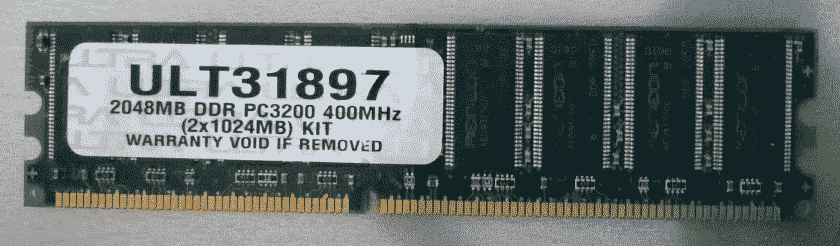
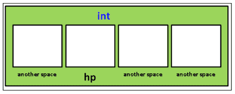
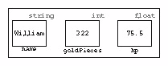
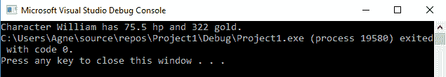
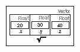
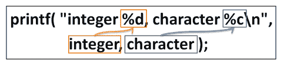

# 变量和内存

要编写你的 C++游戏程序，你将需要你的电脑记住很多东西，比如玩家在世界的什么地方，他们有多少命中点，他们还剩多少弹药，物品在世界的什么地方，他们提供什么加电，以及组成玩家屏幕名称的字母。

你的电脑里面其实有一种叫做**内存***或者内存的电子画板。从物理上讲，计算机内存是由硅制成的，它看起来类似于下图所示:*

 *

这个内存看起来像停车场吗？因为这是我们要用的比喻。

随机存取存储器是随机存取存储器的简称。它被称为随机访问，因为你可以随时访问它的任何部分。如果你身边还有一些光盘，它们是非随机存取的一个例子。光盘应该按顺序阅读和播放。我还记得在迈克尔·杰克逊的*危险*专辑中跳跃曲目的那段时间，当时在 CD 上切换曲目要花很多时间！然而，跳来跳去并访问不同的内存单元根本不需要太多时间。随机存取存储器是一种被称为闪存的快速存储器。

内存被称为易失性闪存，因为当计算机关闭时，内存的内容会被清除，内存的旧内容会丢失，除非它们先保存到硬盘上。

为了永久存储，您必须将数据保存到硬盘上。硬盘主要有两种类型:

*   基于盘片的**硬盘驱动器** ( **硬盘**)
*   **固态硬盘** ( **固态硬盘**)

固态硬盘比基于盘片的硬盘更现代，因为它们使用随机存取存储器的快速存取(闪存)原理。然而，与内存不同，固态硬盘上的数据在计算机关闭后仍然存在。如果你能得到一个固态硬盘，我强烈建议你使用它！基于盘片的驱动器已经过时。

当程序运行时，访问存储在内存中的数据比从硬盘或固态硬盘访问要快得多，因此我们需要一种方法在内存中保留空间并从中读写。幸运的是，C++使这变得容易。

# 变量

计算机内存中我们可以读取或写入的保存位置称为**变量**。

变量是其值可以变化的组件。在计算机程序中，你可以把变量想象成一个容器，你可以在里面存储一些数据。在 C++中，这些数据容器(变量)有类型，以及可以用来引用它们的名称。您必须使用正确类型的数据容器将数据保存在程序中。

如果要保存一个整数，如 1、0 或 20，将使用`int`类型的容器。您可以使用浮点型容器来携带浮点(十进制)值，例如 38.87，也可以使用字符串变量来携带字符串(可以将其想象为一串*珍珠*，其中每个字母都是一颗珍珠)。

你可以把你在内存中预留的位置想象成在停车场里预留一个停车位:一旦我们声明了我们的变量并为它获得了一个位置，操作系统就不会给任何其他人(甚至是在同一台机器上运行的其他程序)这块内存。变量旁边的内存可能没有使用，或者可能被其他程序使用。

The operating system exists to keep programs from stepping on each other's toes and accessing the same bits of computer hardware at the same time. In general, civil computer programs should not read or write to each other's memory. However, some types of cheat programs (for example, maphacks) secretly access your program's memory. Programs such as PunkBuster were introduced to prevent cheating in online games.

# 声明变量–触摸硅片

使用 C++在计算机内存中保留一个位置很容易。我们想用一个好的、描述性的名字来命名我们将要存储数据的内存块。

例如，假设我们知道玩家**的命中点** ( **hp** )将是一个整数(整数)，例如 1、2、3 或 100。要获得一块硅来将玩家的`hp`存储在内存中，我们将声明下面一行代码:

```cpp
int hp;     // declare variable to store the player's hp 
```

这一行代码保留了一小块内存来存储一个名为`hp`的整数(`int`是整数的缩写)。以下是我们用来存储玩家的`hp`的内存块的例子。这在内存中为我们预留了一个停车位(在所有其他停车位中)，我们可以通过它的标签(`hp`)来引用内存中的这个空间:



在内存中的所有其他空间中，我们有一个位置来存储 hp 数据。

When you name a variable, there are a few rules. Variable names can't start with a number, and there are certain "reserved words" the compiler won't let you use (usually because they are used by C++ itself). You will learn these as you learn more C++, or you can look for lists of reserved words online.

请注意，如果变量空间是一个双精度或不同类型变量的空间，那么在该图中变量空间是如何被类型标记为`int`的。C++记住你在内存中为你的程序保留的空间，不仅仅是名字，还有变量的类型。

请注意，我们还没有在惠普的盒子里放任何东西！我们稍后会这样做——现在`hp`变量的值没有设置，所以它将具有前一个占用者留在那个停车位上的值(可能是另一个程序留下的值)。告诉 C++变量的类型很重要！稍后，我们将声明一个变量来存储十进制值，例如 3.75。

# 对你记忆中保留的位置进行读写

将值写入内存很容易！一旦你有了一个`hp`变量，你只需要用`=`符号来写:

```cpp
hp = 500; 
```

瞧啊。玩家有 500 点生命值。

读取变量同样简单。要打印出变量值，只需输入以下内容:

```cpp
cout << hp << endl; 
```

这将打印存储在`hp`变量中的值。`cout`对象足够聪明，可以算出它是什么类型的变量，并打印内容。如果您更改`hp`的值，然后再次使用`cout`，将打印最新的值，如下所示:

```cpp
hp = 1200; 
cout << hp << endl; // now shows 1200 
```

# 数字和数学

标题说明了一切；在这一节中，我们将深入探讨 C++中数字和数学的重要性。

# 数字就是一切

当你开始计算机编程时，你需要习惯的是，惊人数量的东西可以作为数字存储在计算机内存中。玩家的血量？正如我们在上一节看到的，hp 可以是一个整数。如果玩家受伤，我们减少这个数字。如果玩家获得生命值，我们增加数量。

颜色也可以存储为数字！如果您使用了标准的图像编辑程序，可能会有一些滑块指示颜色，如使用了多少红色、绿色和蓝色，如 Pixelmator 的颜色滑块。Photoshop 没有滑块，但会向您显示数字，并允许您直接编辑它们来更改颜色。一种颜色用三个数字来表示。下图截图中显示的紫色为(R: `127`、G: `34`、B: `203`):


如您所见，Photoshop 允许您使用其他数字来表示颜色，例如 HSB(色调、饱和度、亮度)，这是一种表示颜色的替代方式，或者用于打印的 CMYK(青色、品红色、黄色、黑色)，因为专业印刷机在打印时使用这些颜色的油墨。在计算机显示器上观看时，您通常会坚持使用 RGB 颜色表示，因为这是显示器使用的颜色。

世界几何呢？这些也只是数字；我们所要做的就是存储一个 3D 空间点的列表( *x* 、 *y* 和 *z* 坐标)，然后存储另一个点的列表，解释这些点如何连接形成三角形。在下面的截图中，我们可以看到 3D 空间点是如何用来表示世界几何的:


颜色的数字和三维空间点的数字的组合将让你在你的游戏世界中画出大的彩色风景。

前面例子的诀窍是我们如何解释存储的数字，这样我们就可以让它们表达我们想要表达的意思。

# 更多变量

你可以把变量想象成宠物携带者。猫背带可以用来背猫，但不能背狗。同样，您应该使用浮点型变量来携带十进制值的数字。如果您将十进制值存储在`int`变量中，它将不适合:

```cpp
int x = 38.87f; 
cout << x << endl; // prints 38, not 38.87 
```

这里真正发生的是 C++在`38.87`、*上进行自动类型转换，将*转换成整数以适合`int`携带盒。它会将小数`38.87`转换为整数值`38`。

因此，例如，我们可以修改代码以包含三种类型变量的使用，如以下代码所示:

```cpp
#include <iostream> 
#include <string>  // need this to use string variables! 
using namespace std; 
int main() 
{ 
  string name; 
  int goldPieces; 
  float hp; 
  name = "William"; // That's my name 
  goldPieces = 322; // start with this much gold  
  hp = 75.5f;       // hit points are decimal valued 
  cout << "Character " << name << " has "  
           << hp << " hp and "  
           << goldPieces << " gold."; 
} 
```

在前三行中，我们声明了三个存储数据部分的框，如下所示:

```cpp
string name; int goldPieces; float hp; 
```

这三条线在内存中预留了三个位置(比如停车位)。接下来的三行用我们需要的值填充变量，如下所示:

```cpp
name = "William"; 
goldPieces = 322; 
hp = 75.5f; 
```

在计算机内存中，如下图所示:



您可以随时更改变量的内容。您可以使用`=`赋值运算符编写一个变量，如下所示:

```cpp
goldPieces = 522;// = is called the "assignment operator" 
```

您也可以随时读取变量的内容。这就是接下来三行代码的作用，如下所示:

```cpp
cout << "Character " << name << " has "  
     << hp << " hp and "  
     << goldPieces << " gold."; 
```

请看下面一行:

```cpp
cout << "I have " << hp << " hp." << endl; 
```

`hp`这个词在这行有两种用法。一个在双引号之间，另一个不在。双引号之间的单词总是完全按照您键入的内容输出。当不使用双引号时(例如，`<< hp <<`)，将执行变量查找。如果变量不存在，那么您将得到一个编译器错误(未声明的标识符)。

内存中有一个空间分配给名字，一个空间分配给玩家有多少`goldPieces`，一个空间分配给玩家的血量。

这是您运行程序时应该看到的内容:



In general, you should always try to store the right type of data inside the right type of variable. If you happen to store the wrong type of data, your code may misbehave. For example, accidentally storing a float into an `int` variable will make you lose the decimal points, and storing the value of a char in an `int` will give you the ASCII value, but will no longer treat it as a letter. Sometimes, it even doesn't have any type of automatic type conversion so it won't know how to handle the value at all.

# C++中的数学

C++的数学很好做；`+`(正)、`-`(负)、`*`(次)、`/`(除)都是常见的 C++运算，会遵循适当的**括号**、**指数**、*、* **除法**、**乘法**、**加法**、**减法** ( **BEDMAS** )顺序。例如，我们可以按照下面的代码进行操作:

```cpp
int answer = 277 + 5 * 4 / 2 + 20; 
```

当然，如果你想绝对确定顺序，使用括号总是一个好主意。另一个您可能还不熟悉的运算符是%(模数)。模数(例如 10 % 3)求`x` (10)除以`y` (3)的余数。有关示例，请参见下表:

| 操作员(姓名) | 例子 | 回答 |
| +(加号) | 7 + 3 | Ten |
| -(减) | 8 - 5 | three |
| *(次) | 5*6 | Thirty |
| /(分部) | 12/6 | Two |
| %(模量) | 10 % 3 | 1(因为 10/3 是 3，余数= 1)。 |

然而，我们经常不想以这种方式做数学。相反，我们通常希望将变量值改变一定的计算量。这是一个比较难理解的概念。假设玩家遇到一个小鬼，受到 15 点伤害。

下面一行代码将用来把玩家的`hp`减少`15`(信不信由你):

```cpp
hp = hp - 15;                  // probably confusing :) 
```

你可能会问为什么。因为在右边，我们正在计算 hp 的新值(`hp-15`)。找到 hp 的新值后(比之前少 15)，新值被写入`hp`变量。

把`hp`想象成墙上某个特定位置的一幅画。`-15`告诉你在画上画个小胡子，但留在原地。这幅新的留胡子的画现在是`hp`。

Pitfall
An uninitialized variable has the bit pattern that was held in memory for it before. Declaring a variable does not clear the memory.

假设我们使用了下面一行代码:

```cpp
int hp;   
hp = hp - 15;   
```

The second line of code reduces the hp by 15 from its previous value. What was its previous value if we never set `hp = 100` or so? It could be 0, but not always.
One of the most common errors is to proceed with using a variable without initializing it first.

下面是这样做的简写语法:

```cpp
hp -= 15; 
```

除`-=`外，可以使用`+=`给变量加一个量，`*=`给变量乘以一个量，`/=`给变量除以一个量。

如果您使用的是`int`并想将其增加(或减少)1，您可以缩短语法。您不需要编写以下内容:

```cpp
hp = hp + 1;
hp = hp - 1;
```

相反，您可以执行以下任一操作:

```cpp
hp++;
++hp;
hp--;
--hp;
```

将它放在变量之前，在使用值之前递增或递减它(如果您在更大的语句中使用它)。放在后面会在变量使用后更新变量。

# 练习

执行以下操作后，记下`x`的值，然后与您的编译器核对:

| 练习 | 解决方法 |
| --- | --- |
| `int x = 4; x += 4;` | `8` |
| `int x = 9; x-=2;` | `7` |
| `int x = 900; x/=2;` | `450` |
| `int x = 50; x*=2;` | `100` |
| `int x = 1; x += 1;` | `2` |
| `int x = 2; x -= 200;` | `-198` |
| `int x = 5; x*=5;` | `25` |

# 广义变量语法

在前一节中，您了解到用 C++保存的每一条数据都有一个类型。所有变量都是以同样的方式创建的；在 C++中，变量声明的形式如下:

```cpp
variableType variableName; 
```

`variableType`对象告诉你我们要在变量中存储什么类型的数据。`variableName`对象是我们用来读取或写入内存的符号。

# 原始类型

我们之前讨论过计算机内部的所有数据在某个时候将会是一个数字。您的计算机代码负责正确解释该数字。

据说 C++只定义了几个基本的数据类型，如下表所示:

| `Char` | 单个字母，如 *a* 、 *b* 或 *+* 。使用 ASCII 将它存储为-127 到 127 之间的数值，ASCII 是一种为每个字符分配特定数值的标准。 |
| `Short` | 从`-32,767`到`+32,768`的整数。 |
| `Int` | 从`-2,147,483,647`到`+2,147,483,648`的整数。 |
| `Long` | 从`-2,147,483,647`到`+2,147,483,648`的整数。 |
| `Float` | 从大约。`-1x10<sup>38</sup>`至`1x10<sup>38</sup>`。 |
| `Double` | 从大约。`-1x10<sup>308</sup>`至`1x10<sup>308</sup>`。 |
| `Bool` | 是真是假。 |

上表中提到的每种变量类型都有无符号版本(当然 Bool 除外，它不会真正有意义)。无符号变量可以包含自然数，包括 0 (x >= 0)。例如，无符号的`short`可能具有介于`0`和`65535`之间的值。如果有必要，您也可以使用`long long`或`long long int`获得更大的整数。

The size of variables can sometimes be different for different compilers, or depending on whether you are compiling for a 32-bit or 64-bit operating system. Keep that in mind if you find yourself working on something different in the future.

在这种情况下，我们关注的是 Visual Studio 或 Xcode 和(最有可能的)64 位。

If you're interested in the difference between float and double, please feel free to look it up on the internet. I will keep my explanations only for the most important C++ concepts used for games. If you are curious about something that's not covered by this text, feel free to look it up.

# 高级可变主题

较新版本的 C++增加了一些与变量相关的新特性，还有一些还没有提到。这里有几件事你应该记住。

# 自动检测类型

从 C++ 11 开始，有一个新的变量*类型*，你可以用在你可能不确定你期望得到什么类型的情况下。这种新型被称为`auto`。它的意思是，它会检测你首先赋予它的任何值的类型，然后使用它。假设您键入以下内容:

```cpp
auto x = 1.5;
auto y = true;
```

如果这样做，`x`将自动成为浮点数，`y`将成为布尔值。一般来说，如果你知道实际的变量类型，你会想使用它(大多数时候你会)，作为初学者，最好避免使用它。然而，当你看到它的时候，你应该能够认出它，如果你最终遇到了你需要它的情况，你应该知道它。

# 枚举数

枚举已经存在很长时间了，但是从 C++ 11 开始，您可以更好地控制它们。枚举背后的想法是，有时你想在游戏中跟踪不同类型的东西，你只是想要一个简单的方法来给每个东西一个值，告诉你它是什么，你可以稍后检查。枚举如下所示:

```cpp
enum weapon {
    sword = 0;
    knife,
    axe,
    mace,
    numberOfWeaponTypes,
    defaultWeapon = mace
}; // Note the semicolon at the end
```

这将创建这些武器类型中的每一种，并通过给每一种添加 1 来为每一种分配唯一的值，因此刀将等于 1，斧等于 2，依此类推。请注意，您不需要将第一个数字设置为 0(它会自动设置)，但是如果您想从不同的数字开始，您可以这样做(并且它不仅仅是第一个可以设置为特定值的数字)。您也可以将任何`enum`成员分配给不同的成员，它将具有相同的值(在本例中，`defaultWeapon`具有与`mace` : 3 相同的值)。每当您在枚举列表中的任何位置分配一个特定值时，您在该列表中添加的任何类型都将从该值开始增加 1。

枚举总是包含一个 int 值，但是从 C++ 11 开始，您可以指定一个变量类型。例如，您可能想做类似以下的事情:

```cpp
enum isAlive : bool {
    alive = true,
    dead = false
}
```

虽然您可以使用 0 和 1 来实现这一点，但在某些情况下，您可能会发现这更方便。

# 常量变量

有时候你会有一个你不想在游戏中改变的价值。你不希望生命值、最大生命值、达到特定等级所需的经验值或移动速度发生变化(除非你的角色确实达到了那个等级，在这种情况下，你可能会切换到不同的常量值)。

在某些情况下，一个`enum`可以实现这一点，但是对于单个值，更容易创建一个新的变量并将其声明为`const`。这里有一个例子:

```cpp
const int kNumLives = 5;
```

将`const`放在变量类型的前面，告诉程序永远不允许改变那个值，如果你尝试，会给你一个错误。将`k`放在变量名前面是`const`变量常用的命名约定。许多公司会坚持让你遵循这个标准。

# 构建更复杂的类型

事实证明，这些简单的数据类型可以单独用来构建任意复杂的程序。*如何？*你问。只用浮点数和整数构建一个 3D 游戏不是很难吗？

从`float`和`int`构建一个游戏其实并不难，但是更复杂的数据类型会有帮助。如果我们为玩家的位置使用松散的浮动，那么编程将是乏味和混乱的。

# 对象类型–结构

C++为你提供了将变量组合在一起的结构，这将使你的生活变得更加容易。以下面的代码块为例:

```cpp
#include <iostream> 
using namespace std; 
struct Vector        // BEGIN Vector OBJECT DEFINITION 
{ 
  float x, y, z;     // x, y and z positions all floats 
};                   // END Vector OBJECT DEFINITION. 
// The computer now knows what a Vector is 
// So we can create one. 
int main() 
{ 
  Vector v; // Create a Vector instance called v 
  v.x=20, v.y=30, v.z=40; // assign some values 
  cout << "A 3-space vector at " << v.x << ", " << v.y << ", " <<  
   v.z << endl; 
} 
```

这在记忆中的样子很直观；一个**向量**只是一个有三个浮点的内存块，如下图所示:



Don't confuse the `struct Vector` in the preceding screenshot with the `std::vector` of the **Standard Template Library** (**STL**)—we'll get into that later. The preceding `Vector` object is meant to represent a three-space vector, while the STL's `std::vector` type represents a collection of values.

下面是关于前面代码清单的一些回顾性注释。

首先，甚至在我们使用我们的`Vector`对象类型之前，我们就必须定义它。C++没有数学向量的内置类型(它只支持标量数字，他们认为这就足够了！).因此，C++让您可以构建自己的对象结构，让您的生活更轻松。我们首先有了以下定义:

```cpp
struct Vector        // BEGIN Vector STRUCT DEFINITION 
{ 
  float x, y, z;     // x, y, and z positions all floats 
};                   // END Vector STRUCT DEFINITION. 
```

这告诉计算机什么是`Vector`(它是三个浮动，在内存中它们都被声明为彼此相邻)。上图显示了`Vector`在内存中的样子。

接下来，我们使用`Vector`对象定义来创建一个名为`v`的矢量实例:

```cpp
Vector v; // Create a Vector instance called v 
```

一旦你有了一个`Vector`的实例，你就可以使用我们所说的**点语法**访问其中的变量。您可以使用`v.x`访问矢量`v`上的变量`x`。`struct`矢量定义实际上并没有创建矢量对象，它只是定义了对象类型。你做不到`Vector.x = 1`。你说的是哪个对象实例？C++编译器会问。需要先创建一个 Vector 实例，比如 Vector `v`。这会创建一个向量的实例，并将其命名为`v`。然后，你可以在`v`实例上做作业，比如`v.x = 0`。

然后，我们使用这个实例将值写入`v`:

```cpp
v.x=20, v.y=30, v.z=40; // assign some values 
```

We used commas in the preceding code to initialize a bunch of variables on the same line. This is okay in C++. Although you can do each variable on its own line, the approach shown here is okay too.

这使得`v`看起来像前面的图像。然后，我们把它们打印出来:

```cpp
cout << "A 3-space vector at " << v.x << ", " << v.y << ", " <<  
   v.z << endl;
```

在这两行代码中，我们通过简单地使用一个点(`.`)来访问对象内部的各个数据成员；`v.x`指物体内部的`x`成员`v`。每个矢量对象内部正好有三个浮动:一个叫做`x`，一个叫做`y`，一个叫做`z`。

# 锻炼-玩家

为`Player`对象定义一个 C++数据结构。然后，创建一个`Player`结构的实例，并用值填充每个数据成员。

# 解决办法

让我们声明我们的`Player`对象。我们想把和玩家有关的一切都归入`Player`对象。我们这样做是为了代码整洁。您在虚幻引擎中阅读的代码将在任何地方使用这样的对象，因此请注意:

```cpp
struct Player 
{ 
  string name; 
  int hp; 
  Vector position; 
}; // Don't forget this semicolon at the end! 
int main() 
{ 
  // create an object of type Player, 
  Player me; // instance named 'me' 
  me.name = "William"; 
  me.hp = 100; 
  me.position.x = me.position.y = me.position.z=0; 
} 
```

The line `me.position.x = me.position.y = me.position.z=0;` means `me.position.z` is set to `0`, and then that value is passed on to set `me.position.y` to 0, and then it is passed along and sets `me.position.x` to `0`.

`struct Player`定义告诉计算机一个`Player`对象是如何在内存中布局的。

I hope you noticed the mandatory semicolon at the end of the struct declaration. Struct object declarations need to have a semicolon at the end, but functions do not (we'll go over functions later). This is just a C++ rule that one must remember.

在一个`Player`对象中，我们声明了一个字符串代表玩家的名字，一个浮点数代表他们的血量，一个`Vector`对象代表他们完整的`x`、`y`和`z`位置。

我说的对象，是指一个 C++结构(后面我们会介绍术语*类*)。

等等！我们把一个矢量对象放在一个玩家对象里面！是的，你能做到。只要确保向量是在同一个文件中定义的。

在定义了`Player`对象内部的内容之后，我们实际上创建了一个名为`me`的`Player`对象实例，并为其分配了一些值。

# 两颗北极指极星

一个特别难理解的概念是指针的概念。指针并不难理解，但需要一段时间才能掌握。指针基本上包含内存中存储对象的地址，因此它们“指向”内存中的对象。

假设我们像以前一样，在内存中声明了一个类型为`Player`的变量:

```cpp
Player me; 
me.name = "William"; 
me.hp = 100; 
```

我们现在声明一个指向`Player`的指针:

```cpp
Player* ptrMe;               // Declaring a pointer to 
                             // a Player object
```

`*`改变变量类型的含义。正是`*`使`ptrMe`成为指向`Player`对象的指针，而不是常规的`Player`对象。

我们现在要将`ptrMe`链接到`me`:

```cpp
ptrMe = &me;                  // LINKAGE 
```

This linkage step is very important. If you don't link the pointer to an object before you use the pointer, you will get a memory access violation—an error that you are trying to access memory that you didn't set, so it could contain random data or even part of another program!

`ptrMe`指针现在指向与`me`相同的对象。更改对象`ptrMe`指向的变量值将在`me`中更改它们，如下图所示:


# 指针能做什么？

当我们在指针变量和它所指向的对象之间建立链接时，我们可以通过指针来操作它所指向的变量。

指针的一个用途是从代码中的几个不同位置引用同一个对象。如果您经常尝试访问它，您可能希望在本地存储一个指向它的指针，以便于访问。`Player`对象是被指向的一个很好的候选对象，因为代码中的许多地方可能会不断地访问它。

您可以创建任意多的指向同一个对象的指针，但是您需要跟踪所有的指针(除非您使用智能指针，我们将在后面讨论)。被指向的对象不一定知道它们被指向，但是可以通过指针对对象进行更改。

比如说，玩家被攻击了。结果将是他们的血量减少，这种减少将使用指针来完成，如下面的代码所示:

```cpp
ptrMe->hp -= 33;      // reduced the player's hp by 33 
ptrMe->name = "John";// changed his name to John 
```

使用指针时，需要使用`->`而不是`.`来访问指向对象中的变量。

以下是`Player`对象现在的样子:


所以，我们通过改变`ptrMe->name`来改变`me.name`。因为`ptrMe`指向`me`，通过`ptrMe`的变化直接影响`me`。

# 操作员地址(&)

请注意前面代码示例中`&`符号的使用。`&`运算符获取存储变量的内存地址。变量的内存地址是计算机内存空间中为存储变量的值而保留的位置。C++能够获取程序内存中任何对象的内存地址。变量的地址是唯一的，也是随机的。

假设我们打印一个整数变量的地址`x`，如下所示:

```cpp
int x = 22; 
cout << &x << endl; // print the address of x 
```

在程序第一次运行时，我的计算机会打印以下内容:

```cpp
0023F744 
```

这个数字(`&x`的值)只是存储`x`变量的存储单元。这意味着在程序的这个特定启动中，`x`变量位于存储单元号`0023F744`，如下图所示:


You may wonder why the preceding number contains an `F`. Addresses are in hexadecimal (base 16) so since you run out of numerical digits after 9, but you can't really fit two digits in 1, you set the values that would be 10-15 to A-F instead. So A = 10, B = 11, and in this case F = 15.

现在，创建一个指针变量并分配给`x`的地址:

```cpp
int *px; 
px = &x; 
```

我们在这里做的是将`x`的内存地址存储在`px`变量中。所以，我们用另一个不同的变量`px`来比喻`x`变量。这可能类似于下图所示:


这里`px`变量里面有`x`变量的地址。换句话说，`px`变量是对另一个变量的引用。去引用`px`意味着访问`px`正在引用的变量。使用`*`符号进行去参考:

```cpp
cout << *px << endl; 
```

# 使用 nullptr

`nullptr`变量是一个指针变量，值为`0`。一般来说，大多数程序员喜欢在创建新的指针变量时初始化指向`nullptr` ( `0`)的指针。一般来说，计算机程序不能访问内存地址`0`(它是保留的)，所以如果你试图引用一个空指针，你的程序就会崩溃。

*Pointer Fun with Binky* is a fun video about pointers. Take a look at [http://www.youtube.com/watch?v=i49_SNt4yfk](http://www.youtube.com/watch?v=i49_SNt4yfk).

# 智能指针

指针可能很难管理。一旦我们在本书后面开始创建和删除新对象，我们可能不知道指向特定对象的所有指针在哪里。删除另一个指针仍在使用的对象(导致崩溃)或者停止从指向某个对象的唯一指针指向该对象，并让它在内存中浮动而没有任何引用它的对象(这称为内存泄漏，会降低您的计算机速度)可能太容易了。

智能指针跟踪特定对象的引用数量，并随着代码的变化自动增加或减少这个数量。这使得控制正在发生的事情变得容易得多，在现实编程中，如果可能的话，最好使用常规指针。

人们过去必须编写自己的智能指针，但从 C++ 11 开始就没有了。现在有一个`shared_ptr`模板可用(我们稍后将讨论模板和 STL)。这将自动跟踪指向某个对象的指针，如果没有其他对象引用该对象，将自动删除该对象，从而防止内存泄漏。这就是为什么使用智能指针比指针更好的原因，因为常规指针可能指向代码中其他地方已经删除的对象。

# 输入和输出

在编程中，您必须不断地向用户传递信息，或者从用户那里获取信息。对于简单的情况，比如我们将要开始的情况(以及以后发现错误的许多情况)，您需要输入和输出标准文本和数字。C++使这变得容易。

# cin 和 cout 物件

我们已经在前面的例子中看到了`cout`是如何工作的。`cin`对象是 C++传统上将用户输入输入程序的方式。`cin`对象很容易使用，因为它查看它将放入值的变量的类型，并使用它来确定放入其中的类型。例如，假设我们想询问用户的年龄，并将其存储在`int`变量中。我们可以这样做:

```cpp
cout << "What is your age?" << endl; 
int age; 
cin >> age; 
```

当你运行这个时，它会打印`What is your age?`并等待你的响应。输入答案，点击*进入*输入。除了`int`变量之外，你可能想试着输入其他东西，看看会发生什么！

# printf()函数

虽然到目前为止我们已经使用`cout`打印出变量，但是您应该还知道另一个用于打印到控制台的常用函数。这个函数被称为`printf`函数，它最初来自于 c .`printf`函数包含在`<iostream>`库中，所以您不必额外使用`#include`任何东西。游戏行业有些人更喜欢`printf`而不是`cout`，下面就来介绍一下。

让我们继续讨论`printf()`是如何工作的，如下面的代码所示:

```cpp
#include <iostream> 
#include <string> 
using namespace std; 
int main() 
{ 
  char character = 'A'; 
  int integer = 1; 
  printf( "integer %d, character %c\n", integer, character ); 
} 
```

Downloading the example code

You can download the example code files from your account at [http://www.packtpub.com](http://www.packtpub.com) for all the Packt books you have purchased. If you purchased this book elsewhere, you can visit [http://www.packtpub.com/support](http://www.packtpub.com/support) and register to have the files emailed directly to you.

我们从格式字符串开始。格式字符串就像一个图片框，变量会插在格式字符串中`%`的位置。然后，整个事情被转到控制台。在上例中，整数变量将插入第一个`%` ( `%d`)的位置，字符将插入第二个`%` ( `%c`)的位置，如下截图所示:



您必须使用正确的格式代码才能使输出正确格式化；请看下表:

| 数据类型 | 格式代码 |
| `Int` | `%d` |
| `Char` | `%c` |
| `String` | `%s` |

要打印 C++字符串，必须使用`string.c_str()`函数:

```cpp
string s = "Hello"; printf( "string %s\n", s.c_str() ); 
```

`s.c_str()`函数访问字符串的 C 指针，`printf`需要。

如果您使用了错误的格式代码，输出将不会正确显示，或者程序可能会崩溃。

您可能还会发现需要使用这种格式来设置字符串的情况，因此了解这一点很有帮助。但是如果你想避免记住这些不同的格式代码，就使用`cout`。它会帮你找出类型。只要确保你使用你最终工作的公司喜欢的任何标准。在编程中的大多数事情上这样做通常是一个好主意。

# 锻炼

询问用户的姓名和年龄，并使用`cin`将他们带入。然后，在控制台使用`printf()`(不是`cout`)为他们发出问候。

# 解决办法

这是程序的外观:

```cpp
#include <iostream> 
#include <string> 
using namespace std; 
int main() 
{ 
  cout << "Name?" << endl; 
  string name; 
  cin >> name; 
  cout << "Age?" << endl;  
  int age; 
  cin >> age; 
  //Change to printf:
  cout << "Hello " << name << " I see you have attained " << age  
   << " years. Congratulations." << endl; 
} 
```

A string is actually an object type. Inside, it is just a bunch of chars!

# 命名空间

到目前为止，我们已经在`std`的例子中看到了名称空间，我们通过将以下内容放在文件的顶部，基本上避免了这个问题:

```cpp
using namespace std;
```

但是，你应该知道这对未来意味着什么。

名称空间是将相关代码组合在一起的方法，它允许您在不同的名称空间中使用相同的变量名，而不会有任何命名冲突(当然，除非您将两者的`using namespace`放在顶部，这就是为什么许多人不喜欢使用它)。

您可以在 C++文件中创建自己的命名空间，如下所示:

```cpp
namespace physics {
    float gravity = 9.80665;
    //Add the rest of your your physics related code here...
}
```

一旦创建了命名空间，就可以像这样访问代码:

```cpp
float g = physics::gravity;
```

或者，您可以在顶部放一个 using 语句(只需确保该名称没有用于其他用途)。但是，一般来说，您不希望将此用于更复杂的程序，因为一个命名空间允许您在不同的命名空间中重用相同的变量名，所以如果您将它与一个命名空间一起使用，该命名空间中的变量与当前命名空间中的变量同名，并试图访问它，编译器将不会知道您指的是哪个变量，这将导致冲突。

# 摘要

在这一章中，我们谈到了变量和记忆。我们讨论了变量的数学运算，以及它们在 C++中有多简单。

我们还讨论了如何使用这些简单数据类型的组合来构建任意复杂的数据类型，例如浮点数、整数和字符。像这样的结构称为对象。在下一章中，我们将开始谈论我们可以用这些对象做什么！*