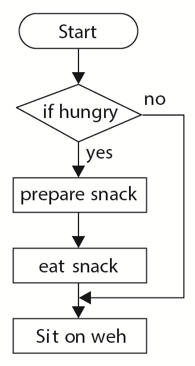
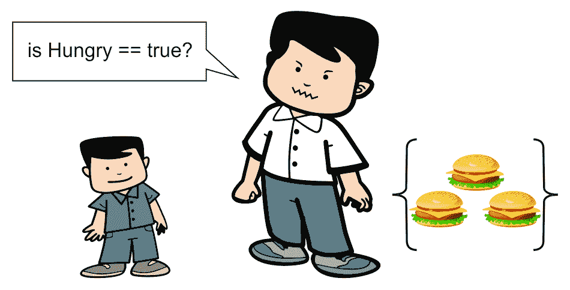
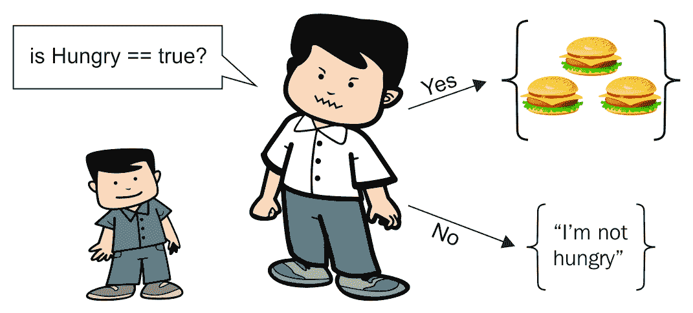
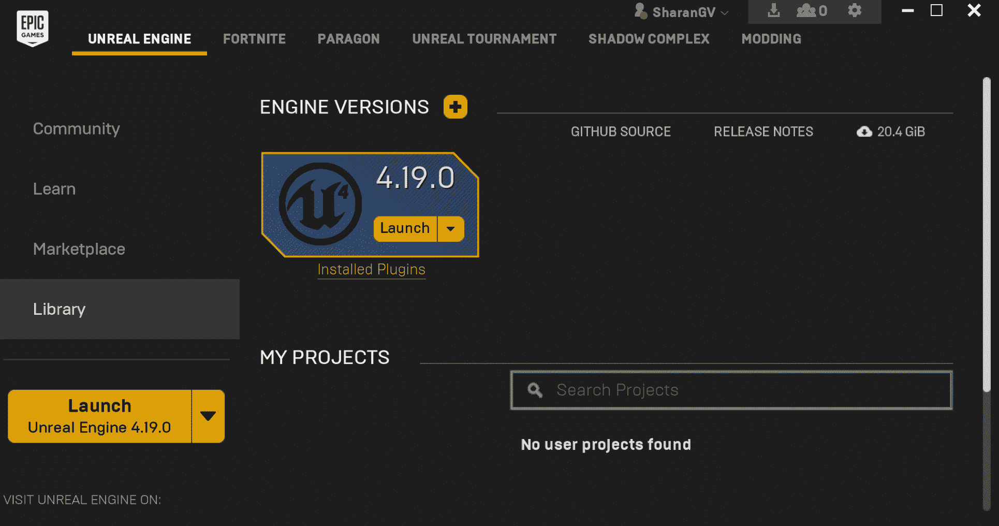
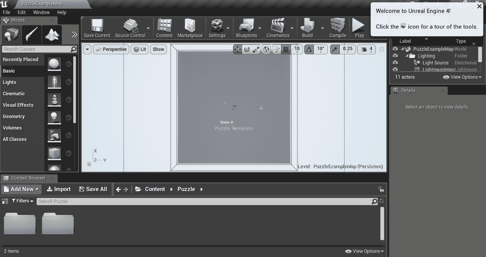

# 如果、否则和切换

在前一章中，我们讨论了内存的重要性，以及如何在计算机中存储数据。我们谈到了如何使用变量为程序保留内存，以及如何在变量中包含不同类型的信息。

在本章中，我们将讨论如何控制程序的流程，以及如何通过使用控制流语句来分支代码来更改执行的代码。在这里，我们将讨论不同类型的控制流，如下所示:

*   `If`陈述
*   如何使用`==`运算符检查事物是否相等
*   `else`陈述
*   如何测试不等式(即如何使用`>`、`>=`、`<`、`<=`和`!=`运算符检查一个数是大于还是小于另一个数)
*   使用逻辑运算符(如 not ( `!`)和(`&&`)或(`||`)
*   分支方式不止两种:
    *   `else if`声明
    *   `switch`声明
*   我们的第一个虚幻引擎示例项目

# 分支

我们在[第二章](02.html)、*变量和记忆*中写的计算机代码朝着一个方向:一直向下。有时，我们可能希望能够跳过部分代码。我们可能希望代码能够分支到多个方向。示意性地，我们可以用以下方式表示:



换句话说，我们希望选项在某些条件下不运行某些代码行。前面的图表称为流程图。根据这个流程图，如果，也只有当，我们饿了，我们会去准备一个三明治，吃了它，然后去沙发上休息。如果我们不饿，那么就没有必要做三明治，所以我们会简单地在沙发上休息。

我们有时会在这本书里只使用流程图，但是在 UE4 中，你甚至可以使用流程图来编程你的游戏(使用一些叫做蓝图的东西)。

This book is about C++ code, so we will always transform our flowcharts into actual C++ code in this book.

# 控制程序的流程

最终，我们想要的是代码在特定条件下以一种方式分支。改变接下来执行哪一行代码的代码命令称为控制流语句。最基本的控制流语句是`if`语句。为了能够对`if`语句进行编码，我们首先需要一种检查变量值的方法。

所以，首先，我们来介绍一下`==`符号，它用来检查一个变量的值。

# ==运算符

为了在 C++中检查两件事是否相等，我们需要一个接一个地使用两个等号(`==`)而不是一个，如下所示:

```cpp
int x = 5; // as you know, we use one equals sign  
int y = 4; // for assignment.. 
// but we need to use two equals signs  
// to check if variables are equal to each other 
cout << "Is x equal to y? C++ says: " << (x == y) << endl; 
```

如果运行前面的代码，您会注意到输出如下:

```cpp
Is x equal to y? C++ says: 0  
```

在 C++中，`1`表示真，`0`表示假。如果您希望出现单词`true`或`false`而不是`1`和`0`，您可以在`cout`行代码中使用`boolalpha`流操纵器，如下所示:

```cpp
cout << "Is x equal to y? C++ says: " << boolalpha <<  
        (x == y) << endl; 
```

`==`运算符是一种比较运算符。C++之所以使用`==`检查等式而不仅仅是`=`是因为我们已经用完了赋值运算符的`=`符号！(详见[第二章](02.html)、*变量和记忆*中的*变量*部分)。如果我们使用单个`=`符号，C++将假设我们想要用`y`覆盖`x`，而不是比较它们。

# if 语句编码

现在我们已经有了双等号，让我们来编码流程图。上述流程图的代码如下:

```cpp
bool isHungry = true;  // can set this to false if not 
                       // hungry! 
if( isHungry == true ) // only go inside { when isHungry is true 
{ 
  cout << "Preparing snack.." << endl; 
  cout << "Eating .. " << endl; 
} 
cout << "Sitting on the couch.." << endl; 
```

This is the first time we are using a `bool` variable! A `bool` variable either holds the value `true` or the value `false`.

首先，我们从一个名为`isHungry`的`bool`变量开始，并将其设置为`true`。

然后，我们使用一个`if`语句，如下所示:

```cpp
if( isHungry == true )
```

`if`语句就像是对它下面的代码块的守卫(记住，一个代码块是一组封装在`{`和`}`中的代码):



只有在`isHungry==true`的情况下，才能读取`{`和`}`之间的代码。

只有当`isHungry == true`时，才能得到花括号内的代码。否则，您将被拒绝访问并被迫跳过整个代码块。

Basically, anything that can be evaluated as a boolean can go inside `if (boolean)`. So, we can achieve the same effect by simply writing the following line of code:
`if( isHungry ) // only go here if isHungry is true` This can be used as an alternative for the following:
`if( isHungry == true )`

人们可能使用`if( isHungry )`形式的原因是为了避免出错的可能性。每次`if`语句被击中时，偶然写`if( isHungry = true )`会将`isHungry`设置为真！为了避免这种可能性，我们可以只写`if( isHungry )`来代替。或者，一些(明智的)人使用所谓的尤达条件来检查`if`语句:`if( true == isHungry )`。我们这样写`if`语句的原因是，如果我们不小心写了`if( true = isHungry )`，这会产生一个编译器错误，抓住错误。

试着运行这段代码，看看我的意思:

```cpp
int x = 4, y = 5; 
cout << "Is x equal to y? C++ says: " << (x = y) << endl; //bad! 
// above line overwrote value in x with what was in y, 
// since the above line contains the assignment x = y 
// we should have used (x == y) instead. 
cout << "x = " << x << ", y = " << y << endl; 
```

下面几行显示了前面几行代码的输出:

```cpp
Is x equal to y? C++ says: 5 
x = 5, y = 5 
```

有`(x = y)`的代码行用`y`的值(5)覆盖`x`的前一个值(4)。虽然我们试图检查`x`是否等于`y`，但是在前面的陈述中发生的是`x`被赋予了`y`的值。

# 编码 else 语句

`else`语句用于让我们的代码在代码的`if`部分没有运行的情况下做一些事情。

例如，假设我们有其他事情要做，以防不饿，如下面的代码片段所示:

```cpp
bool isHungry = true; 
if( isHungry )      // notice == true is implied! 
{ 
  cout << "Preparing snack.." << endl; 
  cout << "Eating .. " << endl; 
} 
else                // we go here if isHungry is FALSE 
{ 
  cout << "I'm not hungry" << endl; 
} 
cout << "Sitting on the couch.." << endl; 
```

关于`else`关键词，有几件重要的事情你需要记住，如下:

*   `else`语句必须紧跟在`if`语句之后。在`if`块的末尾和相应的`else`块之间不能有任何额外的代码行。
*   一个程序永远不能同时执行`if`和相应的`else`块。总是这样或那样:



else 语句是`isHungry`不等于真时你要走的路。

你可以把`if` / `else`语句想象成一个守卫，让人们转向左边或右边。每个人要么走向食物(当`isHungry==true`)，要么远离食物(当`isHungry==false`)。

# 使用其他比较运算符(>，> =，

其他逻辑比较可以很容易地在 C++中完成。`>`和`<`符号的意思就是它们在数学中的作用。它们是大于(`>`)和小于(`<`)的符号。`>=`和数学中的`≥`符号意思相同。`<=`是`≤`的 C++代码。由于键盘上没有`≤`符号，我们不得不用 C++中的两个字符来写。`!=`就是我们在 C++中怎么说*“不等于”*。例如，假设我们有以下几行代码:

```cpp
int x = 9; 
int y = 7; 
```

我们可以问电脑是`x > y`还是`x < y`，如下图:

```cpp
cout << "Is x greater than y? " << (x > y) << endl; 
cout << "Is x greater than OR EQUAL to y? " << (x >= y) << endl; 
cout << "Is x less than y? " << (x < y) << endl; 
cout << "Is x less than OR EQUAL to y? " << (x <= y) << endl; 
cout << "Is x not equal to y? " << (x != y) << endl; 
```

We need the brackets around the comparisons of `x` and `y` because of something known as operator precedence. If we don't have the brackets, C++ will get confused between the `<<` and `<` operators. It's weird and you will better understand this later, but you need C++ to evaluate the `(x < y)` comparison before you output the result (<<). There is an excellent table available for reference at [http://en.cppreference.com/w/cpp/language/operator_precedence](http://en.cppreference.com/w/cpp/language/operator_precedence).

# 使用逻辑运算符

逻辑运算符允许您进行更复杂的检查，而不是检查简单的等式或不等式。比方说，进入一个特殊房间的条件要求玩家同时拥有红色和绿色的钥匙卡。我们想检查两个条件是否同时成立。为了进行这种复杂的逻辑语句检查，我们需要学习另外三个构造:not ( `!`)、and ( `&&`)和 or ( `||`)运算符。

# The not(！)操作员

`!`运算符可以方便地反转`boolean`变量的值。以下面的代码为例:

```cpp
bool wearingSocks = true; 
if( !wearingSocks ) // same as if( false == wearingSocks ) 
{
         cout << "Get some socks on!" << endl;
 } 
else 
{ 
        cout << "You already have socks" << endl; 
} 
```

这里的`if`语句检查你是否穿了袜子。然后，你会接到一个命令，让你穿上袜子。`!`运算符将`boolean`变量中的任何值反转为相反的值。

我们使用一个叫做真值表的东西来显示在一个`boolean`变量上使用`!`运算符的所有可能结果，如下所示:

| `wearingSocks` | `!wearingSocks` |
| `true` | `false` |
| `false` | `true` |

所以，当`wearingSocks`有值`true`时，`!wearingSocks`有值`false`，反之亦然。

# 练习

1.  当`wearingSocks`的值为`true`时，你认为`!!wearingSocks`的值会是多少？
2.  运行以下代码后`isVisible`的值是多少？

```cpp
bool hidden = true; 
bool isVisible = !hidden; 
```

# 解决方法

1.  如果`wearingSocks`是`true`，那么`!wearingSocks`就是`false`。于是，`!!wearingSocks`又变成了`true`。就像在说“我不饿。”不是不是是双重否定，所以这句话的意思是我其实是饿了。
2.  第二个问题的答案是`false`。`hidden`的价值是`true`，所以`!hidden`是`false`。然后`false`值被保存到`isVisible`变量中。但是`hidden`本身的价值依然是`true`。

The `!` operator is sometimes colloquially known as a bang. The preceding bang-bang operation (`!!`) is a double negative and a double logical inversion. If you bang-bang a `bool` variable, there is no net change to the variable.

Of course, you can use these on an `int` and in that case, if the `int` is set to zero, `! int` will be `true`, and if it is greater than zero, `! int` will be `false`. Therefore, if you bang-bang that `int` variable, and the `int` value is greater than zero, it is reduced to a simple `true`. If the `int` value is 0 already, it is reduced to a simple `false`.

# and (&&)运算符

假设两个条件为`true`，我们只想运行一段代码。例如，我们只在穿袜子和衣服的情况下才穿衣服。您可以使用以下代码来检查这一点:

```cpp
bool wearingSocks = true; 
bool wearingClothes = false; 
if( wearingSocks && wearingClothes )// && requires BOTH to be true 
{ 
        cout << "You are dressed!" << endl; 
} 
else 
{ 
        cout << "You are not dressed yet" << endl; 
} 
```

# or (||)运算符

如果其中一个变量是`true`，我们有时想要运行一段代码。

例如，假设玩家在关卡中找到一个特殊的星星，或者完成关卡的时间少于 60 秒，那么他就赢得了一定的奖励。在这种情况下，您可以使用以下代码:

```cpp
bool foundStar = false; 
float levelCompleteTime = 25.f; 
float maxTimeForBonus = 60.f; 
// || requires EITHER to be true to get in the { below 
if( foundStar || (levelCompleteTime < maxTimeForBonus) ) 
{ 
        cout << "Bonus awarded!" << endl; 
} 
else 
{ 
        cout << "No bonus." << endl; 
} 
```

You may notice that I added parentheses around `levelCompleteTime < maxTimeForBonus`. While precedence rules may let you add longer statements without them, I've found it can be better to just add them if you have any doubt. It's better safe than sorry (and may be a little clearer to someone else looking at it later).

# 锻炼

到现在为止，你应该已经注意到了，提高编程水平的最好方法就是去做。你必须经常练习编程，才能在这方面做得更好。

创建两个整数变量，称为`x`和`y`，并从用户处读入。编写一个`if` / `else`语句对，打印大值变量的名称。

# 解决办法

前面练习的解决方案显示在下面的代码块中:

```cpp
int x, y; 
cout << "Enter two numbers (integers), separated by a space " << endl; 
cin >> x >> y; 
if( x < y )  
{ 
  cout << "x is less than y" << endl; 
} 
else 
{ 
  cout << "x is greater than y" << endl; 
} 
```

Don't type a letter when `cin` expects a number. If that happens, `cin` can fail and give a bad value to your variable.

# 以两种以上的方式分支代码

在前面几节中，我们只能用两种方法之一来创建代码分支。在伪代码中，我们有以下代码:

```cpp
if( some condition is true ) 
{ 
  execute this; 
} 
else // otherwise 
{ 
  execute that; 
} 
```

Pseudocode is *fake code*. Writing pseudocode is a great way to brainstorm and plan out your code, especially if you are not quite used to C++.

这段代码有点像一个隐喻性的岔路口，只有两个方向可以选择。

有时，我们可能想在两个方向上分支代码。我们可能希望代码以三种方式分支，甚至更多。例如，假设代码的方向取决于玩家当前持有的物品。玩家可以拿着三种不同的物品中的一种:硬币、钥匙或沙币。而 C++允许这样！事实上，在 C++中，你可以向任何你希望的方向分支。

# else if 语句

`else if`语句是一种不止在两个可能的分支方向上编码的方式。在下面的代码示例中，代码将以三种不同的方式之一运行，具体取决于玩家是拿着`Coin`、`Key`还是`Sanddollar`对象:

```cpp
#include <iostream> 
using namespace std; 
int main() 
{ 
  enum Item  // This is how enums come in handy!
  { 
    Coin, Key, Sanddollar // variables of type Item can have  
    // any one of these 3 values 
  };
  Item itemInHand = Key;  // Try changing this value to Coin,  
                          // Sanddollar 
  if( itemInHand == Key ) 
  { 
    cout << "The key has a lionshead on the handle." << endl; 
    cout << "You got into a secret room using the Key!" << endl; 
  } 
  else if( itemInHand == Coin ) 
  { 
    cout << "The coin is a rusted brassy color. It has a picture  
     of a lady with a skirt." << endl; 
    cout << "Using this coin you could buy a few things" << endl; 
  } 
  else if( itemInHand == Sanddollar ) 
  { 
    cout << "The sanddollar has a little star on it." << endl; 
    cout << "You might be able to trade it for something." <<  
     endl; 
  } 
  return 0;  
} 
```

Note that the preceding code only goes in one of the three separate ways! In an `if`, `else`, and `else if` series of checks, we will only ever go into one of the blocks of code.


# 锻炼

使用 C++程序回答代码后面的问题。请务必尝试这些练习，以便熟练使用这些等式运算符:

```cpp
#include <iostream> 
using namespace std; 
int main() 
{ 
  int x; 
  int y; 
  cout << "Enter an integer value for x:" << endl; 
  cin >> x; // This will read in a value from the console 
  // The read in value will be stored in the integer  
  // variable x, so the typed value better be an integer! 
  cout << "Enter an integer value for y:" << endl; 
  cin >> y; 
  cout << "x = " << x << ", y = " << y << endl; 
  // *** Write new lines of code here 
} 
```

在写着(`// *** Write new...`)的地方写一些新的代码行:

1.  检查`x`和`y`是否相等。如果它们相等，打印`x and y are equal`。否则，打印`x and y are not equal`。
2.  不等式练习:检查`x`是否大于`y`。如果是，打印`x is greater than y`。否则，打印`y is greater than x`。

# 解决办法

要计算相等性，请插入以下代码:

```cpp
if( x == y ) 
{ 
  cout << "x and y are equal" << endl; 
} 
else 
{ 
  cout << "x and y are not equal" << endl; 
} 
```

要检查哪个值更大，请插入以下代码:

```cpp
if( x > y ) 
{ 
  cout << "x is greater than y" << endl; 
} 
else if( x < y ) 
{ 
  cout << "y is greater than x" << endl; 
} 
else // in this case neither x > y nor y > x 
{ 
  cout << "x and y are equal" << endl; 
} 
```

# switch 语句

`switch`语句允许您的代码以多种方式分支。`switch`语句要做的是看一个变量的值，根据它的值，代码会往不同的方向走。

我们还将在这里看到`enum`结构:

```cpp
#include <iostream> 
using namespace std; 
enum Food  // enums are very useful with switch! 
{ 
  // a variable of type Food can have any of these values 
  Fish, 
  Bread, 
  Apple, 
  Orange 
}; 
int main() 
{ 
  Food food = Bread; // Change the food here 
  switch( food ) 
  { 
    case Fish: 
      cout << "Here fishy fishy fishy" << endl; 
      break; 
    case Bread: 
      cout << "Chomp! Delicious bread!" << endl; 
      break; 
    case Apple: 
      cout << "Mm fruits are good for you" << endl; 
      break; 
    case Orange: 
      cout << "Orange you glad I didn't say banana" << endl; 
      break; 
    default:  // This is where you go in case none 
              // of the cases above caught 
      cout << "Invalid food" << endl; 
      break; 
  } 
  return 0; 
} 
```

开关就像硬币分拣机。当你把一枚 25 美分的硬币投入硬币分类机时，它会进入 25 美分的硬币堆。类似地，一个`switch`语句将简单地允许代码跳到适当的部分。下图显示了硬币分类的示例:


`switch`语句中的代码将继续运行(逐行运行)，直到命中`break;`语句。`break`声明让你跳出了`switch`声明。如果您省略了`break;`语句，它将继续运行下一个案例语句中的代码，并且不会停止，直到它到达`break;`或`switch`的末尾。如果你想实验，试着拿出所有的`break;`语句，看看会发生什么！请看下图，了解`switch`的工作原理:


1.  首先，检查`Food`变量。它有什么价值？在这种情况下，它内部有`Fish`。
2.  `switch`命令跳至正确的案例标签。(如果没有匹配的案例标签，`switch`将被跳过)。
3.  运行`cout`语句，控制台上出现`Here fishy fishy fishy`。
4.  检查变量并打印用户响应后，点击`break`语句。这使得我们停止在`switch`中运行代码行，并退出`switch`。正在运行的下一行代码正是如果`switch`根本不存在(在`switch`语句的右大括号之后)程序中的下一行代码。退出程序的是`return 0`。

# switch 语句与 if 语句

开关就像早期的`if` / `else if` / `else`链。但是，交换机生成代码的速度比`if` / `else if` / `else if` / `else`链更快。直观地说，开关只跳转到要执行的代码的适当部分。一个`if` / `else if` / `else`链可能涉及更复杂的比较(包括逻辑比较)，这可能需要更多的 CPU 时间。您将使用`if`语句的主要原因是，如果您试图检查比仅仅比较一组特定值中的某些内容更复杂的内容。

An instance of an `enum` is really an `int`. To verify this, print the following code:
`cout << "Fish=" << Fish <<
   " Bread=" << Bread <<
   " Apple=" << Apple <<` 
` "Orange=" << Orange << endl;`

你会看到`enum`的整数值——正如你所知。

有时候，程序员想在同一个开关`case`标签下分组多个值。假设我们有一个`enum`对象，如下所示:

```cpp
enum Vegetables { Potato, Cabbage, Broccoli, Zucchini }; 
```

一个程序员想把所有的绿色组织在一起，所以他们写了一个`switch`语句如下:

```cpp
Vegetable veg = Zucchini;

switch( veg ) 
{ 
case Zucchini:             // zucchini falls through because no break 
case Broccoli:             // was written here 
  cout << "Greens!" << endl; 
  break; 
default: 
  cout << "Not greens!" << endl; 
  break; 
} 
```

在这种情况下，`Zucchini`会失败并执行与`Broccoli`相同的代码。
非绿色蔬菜在`default`箱标签中。为了防止失败，你必须记得在每个`case`标签后插入一个明确的`break`语句。

通过在开关中明确使用`break`关键字，我们可以编写另一个版本的不会让西葫芦掉下去的开关:

```cpp
switch( veg ) 
{ 
case Zucchini:              // zucchini no longer falls due to break 
  cout << "Zucchini is a green" << endl; 
  break;// stops case zucchini from falling through 
case Broccoli:               // was written here 
  cout << "Broccoli is a green" << endl; 
  break; 
default: 
  cout << "Not greens!" << endl; 
  break; 
} 
```

请注意，对`break``default`情况也是很好的编程实践，即使它是列出的最后一种情况。

# 锻炼

完成以下程序，其中有一个`enum`对象，有一系列挂载可供选择。编写一个`switch`语句，打印所选装载的以下消息:

| `Horse` | 这匹骏马骁勇善战。 |
| `Mare` | 这匹母马又白又漂亮。 |
| `Mule` | 你有一头骡子可以骑。你讨厌这样。 |
| `Sheep` | 咩！羊几乎支撑不了你的体重。 |
| `Chocobo` | 巧克力棒！ |

记住，一个`enum`对象实际上是一个`int`语句。默认情况下，`enum`对象中的第一个条目是`0`，但是您可以使用`=`运算符给`enum`对象任何您想要的起始值。`enum`对象中的后续值按顺序排列。

# 解决办法

下面的代码显示了前面练习的解决方案:

```cpp
#include <iostream> 
using namespace std; 
enum Mount 
{ 
  Horse=1, Mare, Mule, Sheep, Chocobo 
  // Since Horse=1, Mare=2, Mule=3, Sheep=4, and Chocobo=5\. 
}; 
int main() 
{ 
  int mount;  // We'll use an int variable for mount 
              // so cin works 
  cout << "Choose your mount:" << endl; 
  cout << Horse << " Horse" << endl; 
  cout << Mare << " Mare" << endl; 
  cout << Mule << " Mule" << endl; 
  cout << Sheep << " Sheep" << endl; 
  cout << Chocobo << " Chocobo" << endl; 
  cout << "Enter a number from 1 to 5 to choose a mount" << endl; 
  cin >> mount; 
    // Describe what happens 
    // when you mount each animal in the switch below 
  switch( mount ) 
  { 
    default: 
      cout << "Invalid mount" << endl; 
      break; 
  } 
return 0; 
} 
```

# 移位枚举

在`enum`对象中，一个常见的做法是为每个条目分配一个移位值:

```cpp
enum   WindowProperties   
{   
    Bordered    = 1 << 0, // binary 001   
    Transparent = 1 << 1, // binary 010   
    Modal       = 1 << 2  // binary 100   
};   
```

移位值应该能够组合窗口属性。作业是这样的:

```cpp
//   bitwise OR combines properties   
WindowProperties   wp = Bordered | Modal;   
```

检查哪些`WindowProperties`已经被设置涉及使用`bitwise AND`的检查:

```cpp
//   bitwise AND checks to see if wp is Modal   
if( wp   & Modal )   
{   
    cout << "You are looking at a modal window" << endl;
}   
```

Bit-shifting is a technique that is slightly beyond the scope of this book, but I've included this tip just so you know about it.

# 我们关于虚幻引擎的第一个例子

我们需要开始使用虚幻引擎。

A word of warning: when you open your first Unreal project, you will find that the code looks very complicated. Don't get discouraged. Simply focus on the highlighted parts. Throughout your career as a programmer, you will often have to deal with very large code bases containing sections that you do not understand. However, focusing on the parts that you do understand will make this section productive.

首先，你需要下载启动器来安装引擎。转到[https://www.unrealengine.com/en-US/what-is-unreal-engine-4](https://www.unrealengine.com/en-US/what-is-unreal-engine-4)，当你点击立即开始或下载时，你必须创建一个免费账户，然后才能下载启动器。

下载启动器后，打开史诗游戏启动器应用程序。选择启动虚幻引擎 4.20.X(当你读到这个的时候可能会有一个新版本)，如下图截图所示:



If you don't have the engine installed, you need to go to the Unreal Engine tab and download an engine (~7 GB).

引擎启动后(可能需要几秒钟)，您将进入虚幻项目浏览器屏幕，如下图所示:


现在，在 UE4 项目浏览器中选择“新建项目”选项卡。选择 C++选项卡并选择拼图项目。这是一个简单的项目，没有太多的代码，所以它是一个很好的开始。我们稍后将继续进行 3D 项目。

在此屏幕中，需要注意以下几点:

*   确保您在“新项目”选项卡中。
*   当你点击拼图时，确保它是在 C++选项卡中的拼图，而不是蓝图选项卡。

*   在“名称”框中输入您的项目名称`Puzzle`(这对于我稍后将提供给您的示例代码很重要)。
*   如果您想更改存储文件夹(例如，到不同的驱动器)，请单击...按钮，以便出现浏览窗口。然后，找到要存储项目的目录。

完成所有这些后，选择创建项目。

Note: if it tells you it can't create the project because you do not have the Windows 8.1 SDK installed, you can download it from [https://developer.microsoft.com/en-us/windows/downloads/sdk-archive](https://developer.microsoft.com/en-us/windows/downloads/sdk-archive).

Visual Studio 2017 将使用您项目的代码以及虚幻编辑器打开，如下图所示:



看起来很复杂？哦，天啊，的确是！我们将在后面探讨工具栏中的一些功能。现在，只需选择播放，如前面的截图所示。

这就启动了游戏。应该是这样的:


现在，试着点击方块。只要你点击一个块，它就会变成橙色，这增加了你的分数。您可以通过单击停止或按键盘上的 *Esc* 来结束您的播放会话。

我们要做的是找到这样做的部分，稍微改变一下行为。

找到并打开`PuzzleBlock.cpp`文件。在 C++类|拼图下寻找 PuzzleBlock，双击它在 IDE 中打开它。

In Visual Studio, the list of files in the project is located inside the Solution Explorer. If your Solution Explorer is hidden, simply click on View/Solution Explorer from the menu at the top.

在这个文件中，向下滚动到底部，您会发现一个以下列单词开头的部分:

```cpp
void APuzzleBlock::BlockClicked(UPrimitiveComponent* ClickedComp, FKey ButtonClicked)
```

`APuzzleBlock`是类名(我们后面会讲到类)，而`BlockClicked`是函数名。每当点击一个拼图块，从开始的`{`到结束的`}`的代码段就会运行。希望这到底是如何发生的，以后会更有意义。

这在某种程度上有点像`if`语句。如果点击了一个拼图块，那么这组代码将为该拼图块运行。

我们将逐步使块在被点击时翻转颜色(因此，第二次点击会将块的颜色从橙色改回蓝色)。

极其小心地执行以下步骤:

1.  打开`PuzzleBlock.h`文件。在具有此代码的行之后:

```cpp
/** Pointer to blue material used on inactive blocks */
  UPROPERTY()
  class UMaterialInstance* BlueMaterial;

  /** Pointer to orange material used on active blocks */
  UPROPERTY()
  class UMaterialInstance* OrangeMaterial;
```

2.  现在，打开`PuzzleBlock.cpp`文件。查找以下代码:

```cpp
BlueMaterial = ConstructorStatics.BlueMaterial.Get();
OrangeMaterial = ConstructorStatics.OrangeMaterial.Get()
```

3.  在`PuzzleBlock.cpp`中，用以下代码替换无效的`APuzzleBlock::BlockClicked`部分代码的内容:

```cpp
void APuzzleBlock::BlockClicked(UPrimitiveComponent* ClickedComp, FKey ButtonClicked) 
{ 
  // --REPLACE FROM HERE-- 
  bIsActive = !bIsActive; // flip the value of bIsActive 
  // (if it was true, it becomes false, or vice versa) 
  if ( bIsActive ) 
  { 
    BlockMesh->SetMaterial(0, OrangeMaterial); 
  } 
  else 
  { 
    BlockMesh->SetMaterial(0, BlueMaterial); 
  } 
  // Tell the Grid 
  if(OwningGrid != NULL) 
  { 
    OwningGrid->AddScore(); 
  } 
  // --TO HERE-- 
}
```

Only replace inside the `void APuzzleBlock::BlockClicked(UPrimitiveComponent* ClickedComp, FKey ButtonClicked)`statement.
Do not replace the line that starts with `void APuzzleBlock::BlockClicked`. You might get an error (if you haven't named your project `Puzzle`). If so, you can start over by creating a new project with the correct name.

按“播放”观看您的动作变化！让我们来分析一下。这是第一行代码:

```cpp
bIsActive = !bIsActive; // flip the value of bIsActive 
```

这一行代码只是翻转`bIsActive`的值。`bIsActive`变量是一个`bool`变量(它是在`APuzzleBlock.h`中创建的)，它跟踪块是否处于活动状态，并且应该以橙色显示。就像扳动开关一样。如果`bIsActive`是`true`，`!bIsActive`就是`false`。因此，每当命中这一行代码时(点击任何一个块都会发生这种情况)，`bIsActive`值就会反转(从`true`到`false`或从`false`到`true`)。

让我们考虑下一段代码:

```cpp
if ( bIsActive ) 
  { 
    BlockMesh->SetMaterial(0, OrangeMaterial); 
  } 
  else 
  { 
    BlockMesh->SetMaterial(0, BlueMaterial); 
  } 
```

我们只是改变块的颜色。如果`bIsActive`为`true`，则该区块变为橙色。否则，区块会变成蓝色。

# 摘要

在本章中，您学习了如何分支代码。分支使得代码可以朝着不同的方向前进，而不是直接向下。

在下一章中，我们将继续讨论一种不同的控制流语句，它允许您返回并重复一行代码一定的次数。重复的代码段将被称为循环。