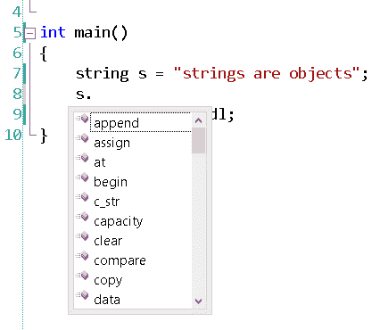
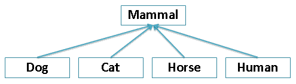
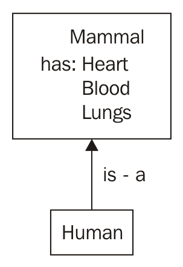
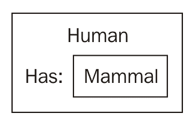
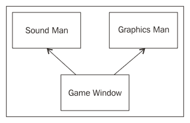

# 对象、类和继承

在前一章中，我们讨论了函数作为捆绑一堆相关代码行的方法。我们讨论了函数是如何抽象出实现细节的，以及`sqrt()`函数如何不需要你理解它在内部是如何工作的，就可以用它来寻找根。这是一件好事，主要是因为它节省了程序员的时间和精力，同时使寻找平方根的实际工作更容易。当我们讨论对象时，这个抽象原则会再次出现。

在本章中，我们将介绍:

*   什么是物体？
*   结构
*   类与结构
*   吸气剂和沉降剂
*   构造函数和析构函数
*   类继承
*   多重继承
*   将您的类放入标题中
*   面向对象编程设计模式
*   可调用对象和调用

This chapter contains a lot of keywords that might be difficult to grasp at first, including `virtual` and `abstract`.

Don't let the more difficult sections of this chapter bog you down. I included descriptions of many advanced concepts for completeness. However, bear in mind that you don't need to completely understand everything in this chapter to write working C++ code in UE4\. It helps to understand everything, but if something doesn't make sense, don't get stuck. Give it a read and then move on. Probably what will happen is you will not get it at first, but remember a reference to the concept in question when you're coding. Then, when you open this book up again, voilà! It will make sense.

# 什么是物体？

简而言之，对象将方法(函数的另一个词)和它们相关的数据绑定到一个单一的结构中。这种结构称为类。使用对象背后的主要思想是为游戏中的所有东西创建一个代码表示。代码中表示的每个对象都有数据和对该数据进行操作的相关函数。因此，您将有一个对象来表示您的`Player`和相关函数，这些函数构成了`Player``jump()``shoot()`和`pickupItem()`。您还可以有一个对象来表示每个怪物实例和相关功能，例如`growl()`、`attack()`，可能还有`follow()`。

然而，对象是变量的类型，只要你把它们保存在内存中，对象就会一直存在。一旦在你的游戏中它所代表的东西被创建，你就创建一个实例，或者一个具有它自己的一组值的对象的特定表示，并且当它所代表的东西在你的游戏中死亡时，你就销毁该对象实例。

对象可以用来表示游戏中的事物，但也可以用来表示任何其他类型的事物。例如，您可以将图像存储为对象。数据字段将是图像的宽度、高度和其中的像素集合。C++字符串也是对象。

# 结构对象

C++中的对象基本上是由简单类型的集合组成的任何变量类型。C++中最基本的对象是`struct`。我们使用`struct`关键字将一堆较小的变量粘合成一个大变量。如果你还记得的话，我们在[第二章](02.html)*变量和记忆*中确实简单介绍过`struct`。让我们修改这个简单的例子:

```cpp
struct Player 
{ 
  string name; 
  int hp; 
}; 
```

这是构成`Player`对象的结构定义。`Player`的`name`值有一个`string`，其`hp`值有一个整数。

如果你回忆一下[第二章](02.html)、*变量和记忆*，我们对`Player`对象进行实例化的方式是这样的:

```cpp
Player me;    // create an instance of Player, called me 
```

从这里，我们可以访问`me`对象的字段，如下所示:

```cpp
me.name = "Tom"; 
me.hp = 100; 
```

# 成员职能

现在，激动人心的部分来了。我们可以将成员函数附加到`struct`定义中，只需将这些函数写入`struct Player`定义中:

```cpp
struct Player 
{ 
  string name; 
  int hp; 
  // A member function that reduces player hp by some amount 
  void damage( int amount )      
  { 
    hp -= amount; 
  } 
  void recover( int amount ) 
  { 
    hp += amount; 
  } 
}; 
```

成员函数只是在`struct`或`class`定义中声明的 C++函数。

这里有点搞笑的想法，我就出来说一下。`struct Player`的变量对`struct Player`内的所有功能都是可访问的。在`struct Player`的每个成员函数中，我们实际上可以访问`name`和`hp`变量，就好像它们是函数的本地变量一样。换句话说，`struct Player`的`name`和`hp`变量在`struct Player`的所有成员函数之间共享。

# 这个关键字

在一些 C++代码中(在后面的章节中)，你会看到更多对`this`关键字的引用。`this`关键字是指向当前对象的指针。例如，在`Player::damage()`函数内部，我们可以显式地编写对`this`的引用:

```cpp
void damage( int amount ) 
{ 
  this->hp -= amount; 
} 
```

`this`关键字只在成员函数中有意义。我们可以在成员函数中明确包含`this`关键字的使用，但是不写`this`，这意味着我们在谈论当前对象的`hp`。因此，虽然这在大多数情况下并不是绝对必要的，但这可能是个人或公司的偏好，并可能使代码更易读。

# 字符串是对象吗？

是的，字符串是对象！过去每次使用`string`变量时，都是在使用一个对象。让我们尝试一下`string`类的一些成员函数。

```cpp
#include <iostream> 
#include <string> 
using namespace std; 
int main() 
{ 
  string s = "strings are objects"; 
  s.append( "!!" ); // add on "!!" to end of the string! 
  cout << s << endl; 
} 
```

我们在这里所做的是使用`append()`成员函数在字符串(`!!`)的末尾添加两个额外的字符。成员函数始终应用于调用成员函数的对象(点左边的对象)。

要查看对象上可用的成员和成员函数列表，请执行以下步骤:

1.  在 Visual Studio 中键入对象的变量名
2.  然后输入一个点(`.`)
3.  然后按下 *Ctrl* 和空格键

将弹出如下成员列表:



Pressing Ctrl and the spacebar will make the member listing appear

# 调用成员函数

可以使用以下语法调用成员函数:

```cpp
objectName.memberFunction(); 
```

调用成员函数的对象在点的左边。要调用的成员函数在点的右边。成员函数调用总是跟在圆括号`()`后面，即使没有参数传递给括号。

所以，在程序中怪物攻击的部分，我们可以将`player`的`hp`值降低如下:

```cpp
player.damage( 15 );  // player takes 15 damage 
```

这难道不比下面的更易读吗？

```cpp
player.hp -= 15;      // player takes 15 damage 
```

When member functions and objects are used effectively, your code will read more like prose or poetry than a bunch of operator symbols slammed together.

除了美观和可读性，写成员函数还有什么意义？在`Player`对象之外，我们现在可以用一行代码做更多的事情，而不仅仅是通过`15`减少`hp`成员。我们还可以在减少`player`的`hp`的同时做其他的事情，比如考虑`player`的护甲，检查玩家是否刀枪不入，或者在`Player`被破坏的时候有其他的效果出现。玩家受损时发生的事情应该通过`damage()`功能抽象掉。

现在，想象一下`Player`有一个`armorClass`。让我们为`armorClass`在`struct Player`中添加一个字段:

```cpp
struct Player 
{ 
  string name; 
  int hp; 
  int armorClass; 
}; 
```

我们需要将`Player`受到的伤害减少`Player`的护甲等级。所以，我们会输入一个公式来减少`hp`。我们可以通过非面向对象的方式直接访问`Player`对象的数据字段:

```cpp
player.hp -= 15 - player.armorClass; // non OOP 
```

否则，我们可以通过编写一个成员函数，根据需要改变`Player`对象的数据成员，以面向对象的方式来实现。在`Player`对象内部，我们可以编写一个`damage()`成员函数:

```cpp
struct Player 
{ 
  string name; 
  int hp; 
  int armorClass;  
  void damage( int dmgAmount )                
  { 
    hp -= dmgAmount - armorClass; 
  } 
}; 
```

# 练习

1.  在前面的代码中`Player`的`damage`函数有一个细微的错误。你能找到并修复它吗？提示:如果造成的伤害低于`Player`的`armorClass`会怎么样？
2.  只有一个装甲等级的数字并不能给出足够的关于装甲的信息！盔甲的名字是什么？它看起来像什么？为`Player`的装甲设计一个`struct`功能，包括`name`、`armorClass`和`durability`等级的字段。

# 解决方法

第一个练习的解决方案是在下一节*私有和封装*中列出的`struct Player`代码。

对于第二个，使用下面的代码怎么样？

```cpp
struct Armor 
{ 
  string name; 
  int armorClass; 
  double durability; 
}; 
```

`Armor`的一个实例将被放入`struct Player`中:

```cpp
struct Player 
{ 
  string name; 
  int hp; 
  Armor armor; // Player has-an Armor 
}; 
```

这意味着`Player`有盔甲。记住这一点——我们稍后将探讨`has-a`和`is-a`的关系。

All variable names thus far start with a lowercase character. This is a good convention with C++ code. You may find some cases where specific teams or other languages prefer to use uppercase characters to start variable names, in which case it's better to just do what people at your company expect.

# 私处和封装

所以现在我们定义了几个成员函数，其目的是修改和维护我们的`Player`对象的数据成员，但是有些人提出了一个论点。

论据如下:

*   一个对象的数据成员应该只能通过它的成员函数来访问，而不能直接访问。

这意味着您永远不要直接从对象外部访问对象的数据成员，换句话说，直接修改`player`的`hp`:

```cpp
player.hp -= 15 - player.armorClass; // bad: direct member access 
```

这是应该禁止的，应该强制该类的用户使用适当的成员函数来更改数据成员的值:

```cpp
player.damage( 15 );  // right: access through member function 
```

这个原理叫做*封装*。封装是一个概念，即每个对象只能通过其成员函数进行交互。封装说原始数据成员永远不应该被直接访问。

封装背后的原因如下:

*   **使类自包含**:封装背后的主要思想是，当对象被编程为管理和维护自己的内部状态变量，而不需要类外的代码来检查该类的私有数据时，对象工作得最好。当对象以这种方式编码时，它使对象更容易处理，也就是说，更容易阅读和维护。要让`Player`对象跳跃，你只需要调用`player.jump()`；让`Player`对象管理其`y-height`位置的状态变化(使`Player`跳跃！).当一个对象的内部成员没有被公开时，与该对象的交互更加容易和有效。仅与对象的公共成员函数交互；让对象管理它的内部状态(我们稍后会解释关键词`private`和`public`)。
*   **避免破坏代码**:当类外的代码只与该类的公共成员函数(类的公共接口)交互时，对象的内部状态管理可以自由改变，而不会破坏任何调用代码。这样，如果一个对象的内部数据成员因为任何原因发生变化，只要成员函数的签名(名称、返回类型和任何参数)保持不变，所有使用该对象的代码仍然有效。

那么，如何才能防止一个程序员做错事情，直接访问数据成员呢？C++引入了*访问修饰符*的概念，以防止访问对象的内部数据。

下面是我们如何使用访问修饰符来禁止从`struct Player`外部访问`struct Player`的某些部分。

你要做的第一件事是决定`struct`定义的哪些部分你想在类外被访问。这些部分将被标记为`public`。在`struct`之外无法进入的所有其他区域将被标为`private`、
，如下所示:

```cpp
struct Player 
{ 
private:        // begins private section.. cannot be accessed  
                // outside the class until 
  string name; 
  int hp;  
  int armorClass; 
public:         //  until HERE. This begins the public section 
  // This member function is accessible outside the struct 
  // because it is in the section marked public: 
  void damage( int amount ) 
  { 
    int reduction = amount - armorClass; 
    if( reduction < 0 ) // make sure non-negative! 
      reduction = 0; 
    hp -= reduction; 
  } 
}; 
```

# 有些人喜欢公开

有些人不加掩饰地使用`public`数据成员，不封装他们的对象。这是一个偏好问题，尽管被认为是糟糕的面向对象编程实践。

但是，UE4 中的类有时确实会使用`public`成员。这是一个判断的电话；数据成员应该是`public`还是`private`真的要看程序员了。

有了经验，你会发现，有时候，当你创建一个本该是`private`的数据成员`public`时，你会遇到一个需要大量重构(修改代码)的情况。

# 类关键字与结构

您可能已经看到了一种不同的声明对象的方式，使用`class`关键字，而不是`struct`，如下面的代码所示:

```cpp
class Player // we used class here instead of struct! 
{ 
  string name; 
  // 
}; 
```

C++中的`class`和`struct`关键词几乎相同。`class`和`struct`只有一个区别，那就是一个`struct`关键字里面的数据成员默认会被声明为`public`，而一个`class`关键字里面的数据成员默认会被声明为`private`。(这就是为什么我用`struct`介绍对象；我不想莫名其妙地把`public`作为`class`的第一行。)

一般来说，`struct`对于不使用封装、成员函数不多、必须向后兼容 c 的简单类型是首选，其他地方几乎都在使用类。

从现在开始，让我们用`class`关键字代替`struct`。

# 吸气剂和沉降剂

你可能已经注意到，一旦我们把`private`放到`Player`类定义上，我们就不能再从`Player`类之外读取或写入`Player`的名字。

假设我们试着用下面的代码读这个名字:

```cpp
Player me; 
cout << me.name << endl; 
```

或者写到名字，如下:

```cpp
me.name = "William"; 
```

使用带有`private`成员的`struct Player`定义，我们将得到以下错误:

```cpp
    main.cpp(24) : error C2248: 'Player::name' : cannot access private 
    member declared in class 'Player'
```

这正是我们在标注`name`字段`private`时所要求的。我们让它在`Player`班之外完全无法进入。

# 吸气剂

getter(也称为访问器函数)用于将内部数据成员的副本传递回调用者。为了读取`Player`的名称，我们将使用成员函数来包装`Player`类，具体来说就是检索该`private`数据成员的副本:

```cpp
class Player 
{ 
private: 
  string name;  // inaccessible outside this class! 
                //  rest of class as before 
public: 
  // A getter function retrieves a copy of a variable for you 
  string getName() 
  { 
    return name; 
  } 
}; 
```

所以，现在可以读取`player`的`name`信息了。我们可以通过使用下面的代码语句来做到这一点:

```cpp
cout << player.getName() << endl; 
```

Getters 用于检索`private`成员，否则您将无法从类外访问这些成员。

Real world tip - the const keyword

Inside a class, you can add the `const` keyword to a member function declaration. What the `const` keyword does is promise to the compiler that the internal state of the object will not change as a result of running this function. Attaching the `const` keyword will look something like this:

`string getName() const`
`{`
  `return name;`
`}`

标记为`const`的成员函数中不能分配数据成员。由于对象的内部状态保证不会因为运行`const`函数而改变，编译器可以对`const`成员函数的函数调用进行一些优化。

# 安装员

setter(也称为修饰符函数或 mutator 函数)是一个成员函数，其唯一目的是更改类内部变量的值，如以下代码所示:

```cpp
class Player 
{ 
private: 
  string name;  // inaccessible outside this class! 
                //  rest of class as before 
public: 
  // A getter function retrieves a copy of a variable for you 
  string getName() 
  { 
    return name; 
  } 
  void setName( string newName ) 
  { 
    name = newName; 
  } 
}; 
```

因此，我们仍然可以从`class`函数之外的`class`中更改`private`变量，但前提是我们通过 setter 函数进行更改。

# 但是 get/set 操作有什么意义呢？

所以，当新手程序员第一次在`private`成员上遇到 get / set 操作时，脑海中浮现的第一个问题是，get/set 不是弄巧成拙吗？我的意思是，当我们打算以另一种方式再次公开相同的数据时，隐藏对数据成员的访问有什么意义呢？这就像说，*“你不能吃任何巧克力，因为它们是私人的，除非你说请* `getMeTheChocolate()`”。*然后，你可以吃巧克力了。”*

一些专业程序员甚至将 get/set 函数缩短为一行，如下所示:

```cpp
string getName(){ return name; } 
void setName( string newName ){ name = newName; } 
```

让我们来回答这个问题。get/set 对不会因为完全公开数据而破坏封装吗？

答案是双重的。首先，get 成员函数通常只返回被访问的数据成员的副本。这意味着原始数据成员的值仍然受到保护，并且不能通过`get()`操作进行修改。

但是`set()`(变异方法)操作有点反直觉。如果二传手是`passthru`操作，比如`void setName( string newName ) { name=newName; }`，那么拥有二传手似乎毫无意义。使用 mutator 方法而不是直接覆盖变量有什么好处？

使用 mutator 方法的理由是在赋值变量之前编写额外的代码，以防止变量接受不正确的值。
比方说，我们有一个`hp`数据成员的设置器，如下所示:

```cpp
void setHp( int newHp ) 
{ 
  // guard the hp variable from taking on negative values 
  if( newHp < 0 ) 
  { 
    cout << "Error, player hp cannot be less than 0" << endl; 
    newHp = 0; 
  } 
  hp = newHp; 
} 
```

mutator 方法应该防止内部`hp`数据成员取负值。您可能会认为 mutator 方法有点追溯性。在调用`setHp( -2 )`之前，是否应该由调用代码检查它正在设置的值，而不是让它只被变异器方法捕获？你不能使用一个`public`成员变量，并在调用代码中而不是在 setter 中负责确保该变量不接受无效值吗？你可以。

这就是使用 mutator 方法背后的核心原因。mutator 方法背后的思想是，调用代码可以将它想要的任何值传递给`setHp`函数(例如，`setHp( -2 )`)，而不必担心它传递给函数的值是否有效。`setHp`函数负责确保该值对`hp`变量有效。

一些程序员认为像`getHp()` / `setHp()`这样的直接变异函数是一种代码味道。总的来说，代码味道是一种糟糕的编程实践，人们不会公开注意到，除了一种令人担忧的感觉，即某些事情正在以次优的方式进行。他们认为可以编写更高级别的成员函数来代替变异函数。例如，我们应该有`heal()`、`damage()`等`public`成员函数来代替`setHp()`成员函数。关于这个话题的文章可以在[http://c2.com/cgi/wiki?AccessorsAreEvil](http://c2.com/cgi/wiki?AccessorsAreEvil)上找到。

# 构造函数和析构函数

C++代码中的构造函数是一个简单的小函数，在第一次创建 C++对象实例时运行一次。当 C++对象实例被销毁时，析构函数运行一次。假设我们有以下程序:

```cpp
#include <iostream> 
#include <string> 
using namespace std; 
class Player 
{ 
private: 
  string name;  // inaccessible outside this class! 
public: 
  string getName(){ return name; } 
// The constructor! 
  Player() 
  { 
    cout << "Player object constructed" << endl; 
    name = "Diplo"; 
  } 
  // ~Destructor (~ is not a typo!) 
  ~Player() 
  { 
    cout << "Player object destroyed" << endl; 
  } 
}; 

int main() 
  { 
    Player player; 
    cout << "Player named '" << player.getName() << "'" << endl; 
  } 
  // player object destroyed here 
```

在这里，我们创建了一个`Player`对象。该代码的输出如下:

```cpp
Player object constructed 
Player named 'Diplo' 
Player object destroyed 
```

对象构造期间发生的第一件事是构造函数实际运行。这会打印线条`Player object constructed`。随后，印有`Player`名字的一行被打印出来:`Player named 'Diplo'`。`Player`为什么叫迪普？因为这是`Player()`建造者的名字。

最后，在程序的最后，调用`Player`析构函数，我们看到`Player object destroyed`。`Player`物体在`main()`末端(在`main`的`}`处)超出范围时被摧毁。

那么，构造函数和析构函数有什么用呢？确切地说，它们看起来是为了什么:建立和拆除一个对象。构造函数可以用于数据字段的初始化，析构函数可以对任何动态分配的资源调用`delete`(我们还没有涉及到动态分配的资源，所以不用担心最后这一点)。

# 类继承

当您想要基于现有的代码类创建一个新的、功能更强的代码类时，可以使用继承。继承是一个棘手的话题。让我们从派生类(或子类)的概念开始。

# 派生类

最自然的考虑继承的方式是类比动物王国。生物的分类如下图所示:



这个图的意思是**狗**、**猫**、**马**、**人**都是哺乳动物。这意味着它们都有一些共同的特征，比如有共同的器官(女性的大脑有新皮层、肺、肝和子宫)，而在其他方面完全不同。每个人走路的方式都不一样。每个人交流的方式也不同。

如果你是编码生物，那意味着什么？您只需要对公共功能编程一次。然后，您将为每个`Dog`、`Cat`、`Horse`和`Human`类实现不同部分的代码。

上图的一个具体例子如下:

```cpp
#include <iostream> 
using namespace std; 
class Mammal 
{ 
protected: 
  // protected variables are like privates: they are 
  // accessible in this class but not outside the class. 
  // the difference between protected and private is 
  // protected means accessible in derived subclasses also 
int hp; 
  double speed; 

public: 
  // Mammal constructor - runs FIRST before derived class ctors! 
  Mammal() 
  { 
    hp = 100; 
    speed = 1.0; 
    cout << "A mammal is created!" << endl; 
  } 
  ~Mammal() 
  { 
    cout << "A mammal has fallen!" << endl; 
  } 
  // Common function to all Mammals and derivatives 
  void breathe() 
  { 
    cout << "Breathe in.. breathe out" << endl; 
  } 
  virtual void talk() 
  { 
    cout << "Mammal talk.. override this function!" << endl; 
  } 
  // pure virtual function, (explained below) 
  virtual void walk() = 0; 
}; 

// This next line says "class Dog inherits from class Mammal" 
class Dog : public Mammal // : is used for inheritance 
{ 
public: 
  Dog() 
  { 
    cout << "A dog is born!" << endl; 
  } 
  ~Dog() 
  { 
    cout << "The dog died" << endl; 
  } 
  virtual void talk() override 
  { 
    cout << "Woof!" << endl; // dogs only say woof! 
  } 
  // implements walking for a dog 
  virtual void walk() override 
  { 
    cout << "Left front paw & back right paw, right front paw &  
     back left paw.. at the speed of " << speed << endl; 
  } 
}; 

class Cat : public Mammal 
{ 
public: 
  Cat() 
  { 
    cout << "A cat is born" << endl; 
  } 
  ~Cat() 
  { 
    cout << "The cat has died" << endl; 
  } 
  virtual void talk() override 
  { 
    cout << "Meow!" << endl; 
  } 
  // implements walking for a cat.. same as dog! 
  virtual void walk() override 
  { 
    cout << "Left front paw & back right paw, right front paw &  
     back left paw.. at the speed of " << speed << endl; 
  } 
}; 

class Human : public Mammal 
{ 
  // Data member unique to Human (not found in other Mammals) 
  bool civilized; 
public: 
  Human() 
  { 
    cout << "A new human is born" << endl; 
    speed = 2.0; // change speed. Since derived class ctor 
    // (ctor is short for constructor!) runs after base  
    // class ctor, initialization sticks initialize member  
    // variables specific to this class 
    civilized = true; 
  } 
  ~Human() 
  { 
    cout << "The human has died" << endl; 
  } 
  virtual void talk() override 
  { 
    cout << "I'm good looking for a .. human" << endl; 
  } 
  // implements walking for a human.. 
  virtual void walk() override 
  { 
    cout << "Left, right, left, right at the speed of " << speed  
     << endl; 
  } 
  // member function unique to human derivative 
  void attack( Human & other ) 
  { 
    // Human refuses to attack if civilized 
    if( civilized ) 
      cout << "Why would a human attack another? I refuse" <<  
       endl; 
    else 
      cout << "A human attacks another!" << endl; 
  } 
}; 

int main() 
{ 
  Human human; 
  human.breathe(); // breathe using Mammal base class  
   functionality 
  human.talk(); 
  human.walk(); 

  Cat cat; 
  cat.breathe(); // breathe using Mammal base class functionality 
  cat.talk(); 
  cat.walk(); 

  Dog dog; 
  dog.breathe(); 
  dog.talk(); 
  dog.walk(); 
} 
```

`Dog`、`Cat`、`Human`都是从`class Mammal`继承的。这意味着`dog`、`cat`和`human`是哺乳动物，还有更多。

# 继承语法

继承的语法很简单。我们以`Human`类定义为例。下面的截图是典型的继承语句:


冒号左边的类( **:** )是新的派生类，冒号右边的类是基类。

# 继承是做什么的？

继承的目的是让派生类承担基类的所有特性(数据成员和成员函数)，然后用更多的功能扩展它。例如，所有哺乳动物都有`breathe()`功能。通过继承`Mammal`类，`Dog`、`Cat`和`Human`类都自动获得`breathe()`的能力。

继承减少了代码的复制，因为我们不必为`Dog`、`Cat`和`Human`重新实现公共功能(如`.breathe()`)。相反，这些派生类中的每一个都可以重用在`class Mammal`中定义的`breathe()`函数。

但是只有`Human`类有`attack()`成员功能。这意味着，在我们的代码中，只有`Human`类攻击。`cat.attack()`函数会引入编译器错误，除非你在`class Cat`里面(或者在`class Mammal`里面)写了一个`attack()`成员函数。

# 这是一种关系

继承常被说成是一种`is-a`关系。当一个`Human`类继承了`Mammal`类，那么我们说人类*就是——一个*哺乳动物:



人类继承了哺乳动物的所有特征。

但是如果一个`Human`对象内部包含一个`Mammal`对象，会怎么样呢，如下所示？

```cpp
class Human 
{ 
  Mammal mammal; 
}; 
```

在这个例子中，我们会说人类在某个地方有一个`Mammal`(如果人类怀孕了，或者以某种方式携带了哺乳动物，这就有意义了):



这个`Human`类实例附着了某种哺乳动物

还记得我们之前在里面给了`Player`一个`Armor`物体吗？`Player`对象从`Armor`类继承是没有意义的，因为说`Player` *是-装甲*是没有意义的。在代码设计中决定一个类是否从另一个类继承时(例如`Human`类从`Mammal`类继承)，你必须总是能够舒服地说一些类似`Human`类 *is-a* `Mammal`的话。如果*是-a* 语句听起来不对，那么继承很可能是那对对象的错误关系。

在前面的例子中，我们引入了一些新的 C++关键字。首先是`protected`。

# 受保护变量

`protected`成员变量不同于`public`或`private`变量。所有三类变量都可以在定义它们的类中访问。它们之间的区别在于类外的可访问性。一个`public`变量可以在类内和类外的任何地方访问。一个`private`变量可以在类内访问，但不能在类外访问。一个`protected`变量可以在类内部和派生子类内部访问，但不能在类外部访问。因此，`class Mammal`的`hp`和`speed`成员在派生类`Dog`、`Cat`、`Horse`和`Human`中是可访问的，但不能在这些类之外访问(例如在`main()`中)。

# 虚函数

虚函数是一个成员函数，它的实现可以在派生类中重写。在本例中，`talk()`成员函数(在`class Mammal`中定义)被标记为`virtual`。这意味着派生类可能会也可能不会选择实现他们自己版本的`talk()`成员函数。

# 纯虚函数

纯`virtual`函数(和抽象类)是一个需要在派生类中重写其实现的函数。`class Mammal`中的`walk()`功能纯粹是虚拟的；它是这样宣布的:

```cpp
virtual void walk() = 0; 
```

前面代码末尾的`= 0`部分是使函数纯粹虚拟的部分。

`class Mammal`中的`walk()`函数是纯虚函数，这使得`Mammal`类变得抽象。C++中的抽象类是至少有一个纯虚函数的任何类。

如果一个类包含一个纯虚函数并且是抽象的，那么这个类不能被直接实例化。也就是说，由于纯虚函数`walk()`，现在不能创建`Mammal`对象。如果您尝试执行以下代码，将会得到一个错误:

```cpp
int main() 
{ 
  Mammal mammal; 
} 
```

如果您试图创建一个`Mammal`对象，您将得到以下错误:

```cpp
error C2259: 'Mammal' : cannot instantiate abstract class 
```

但是，您可以创建`class Mammal`的派生实例，只要派生类实现了所有的纯虚拟成员函数。

你可能会想为什么要用这个。嗯，你真的认为你会想要在游戏中创建一个`Mammal`对象吗？不，您需要创建一个从`Mammal`派生的类型的对象，例如`Cat`或`Dog`。这样的话，你就不会不小心创造出一个`Mammal`，这对于`Player`来说是非常混乱的！

# 多重继承

并非所有倍数都像听起来那么好。多重继承是指派生类从多个基类继承。通常，如果我们继承的多个基类是完全不相关的，那么这种方法就不会有问题。

例如，我们可以有一个继承自`SoundManager`和`GraphicsManager`基类的类`Window`。如果`SoundManager`提供了成员功能`playSound()`，`GraphicsManager`提供了成员功能`drawSprite()`，那么`Window`类将能够顺利使用这些附加功能:



Game Window inheriting from Sound Man and Graphics Man means Game Window will have both sets of capabilities

然而，多重继承可能会产生负面后果。假设我们想要创建一个从`Donkey`和`Horse`类派生的`Mule`类。然而`Donkey`和`Horse`类都继承自`Mammal`基类。我们马上就有问题了！如果我们要调用`mule.talk()`，但是`mule`没有覆盖`talk()`函数，应该调用哪个成员函数，是`Horse`还是`Donkey`？很暧昧。

# 私人继承

C++一个较少被提及的特性是`private`继承。每当一个类从另一个类公开继承时，它所属的父类的所有代码都知道它，例如:

```cpp
class Cat : public Mammal 
```

这意味着所有代码都知道`Cat`是`Mammal`的对象，并且可以使用基类`Mammal*`指针指向`Cat*`实例。例如，以下代码将是有效的:

```cpp
Cat cat; 
Mammal* mammalPtr = &cat; // Point to the Cat as if it were a  
                          // Mammal 
```

将一个类的对象放入父类类型的变量中称为转换。如果`Cat`从`Mammal`公开继承，前面的代码没问题。私有继承是指`Cat`类之外的代码不允许知道父类:

```cpp
class Cat : private Mammal 
```

这里，外部调用的代码不会“知道”`Cat`类派生自`Mammal`类。当继承为`private`时，编译器不允许将`Cat`实例强制转换为`Mammal`基类。当需要隐藏某个类派生自某个父类的事实时，使用`private`继承。

但是`private`继承在实践中很少使用。大多数类只是使用`public`继承。如果你想了解更多关于`private`继承的信息，请访问。

# 将您的类放入标题中

到目前为止，我们的课只是在`main()`之前贴的。如果你继续用这种方式编程，你的代码将全部在一个文件中，并且看起来像一个混乱的大文件。

因此，将您的类组织到单独的文件中是一种很好的编程实践。当项目中有多个类时，这使得单独编辑每个类的代码变得更加容易。

取`class Mammal`及其之前的派生类。我们将把这个例子组织成单独的文件。让我们分步骤进行:

1.  在你的 C++项目中创建一个名为`Mammal.h`的新文件。将整个`Mammal`类剪切并粘贴到该文件中。请注意，由于`Mammal`类包含了`cout`的使用，我们也在该文件中编写了一个`#include <iostream>`语句。
2.  在你的`Source.cpp`文件顶端写一个`"#include` `Mammal.h"`语句。

下面的截图显示了这种情况的一个示例:


代码编译时这里发生的是整个`Mammal`类被复制粘贴(`#include`)到`Source.cpp`文件中，这个文件包含`main()`函数，其余的类都是从`Mammal`派生出来的。由于`#include`是复制粘贴功能，所以代码的功能会和之前完全一样；唯一不同的是，它会更好地组织和更容易看。在此步骤中编译并运行您的代码，以确保它仍然有效。

Check that your code compiles and runs often, especially when refactoring. When you don't know the rules, you're bound to make a lot of mistakes. This is why you should do your refactoring only in small steps. Refactoring is the name for the activity we are doing now - we are reorganizing the source to make more sense to other readers of our code base. Refactoring usually does not involve rewriting too much of it.

接下来需要做的是将`Dog`、`Cat`和`Human`类隔离到自己的文件中。为此，创建`Dog.h`、`Cat.h`和`Human.h`文件并将其添加到您的项目中。

先从`Dog`类开始，如下图截图所示。

如果您完全使用这种设置并尝试编译和运行您的项目，您将看到“哺乳动物”:“类”类型重定义错误，如以下屏幕截图所示:


这个错误意味着`Mammal.h`在你的项目中被包含了两次，一次是在`Source.cpp`中，另一次是在`Dog.h`中。这实际上意味着两个版本的`Mammal`类被添加到编译代码中，C++不确定使用哪个版本。

有几种方法可以解决这个问题，但最简单的(也是虚幻引擎使用的)是`#pragma once`宏，如下图截图所示:


我们在每个头文件的顶部写`#pragma once`。这样，第二次包含`Mammal.h`时，编译器就不会再复制粘贴它的内容了，因为之前已经包含过了，它的内容实际上已经在文件的编译组中了。

对`Cat.h`和`Human.h`做同样的事情，然后在您的`main()`功能所在的`Source.cpp`文件中对它们进行`include`:


Screenshot with all classes included

现在我们已经将所有的类都包含到了您的项目中，代码应该可以编译和运行了。

# 使用。h 和。cpp 文件

下一级组织是将类声明留在头文件(`.h`)中，将实际的函数实现体放在一些新的`.cpp`文件中。此外，将现有成员保留在`class Mammal`声明中。

对于每个类，执行以下操作:

1.  删除所有函数体(在`{`和`}`之间的代码)并用分号替换。对于`Mammal`类，如下所示:

```cpp
// Mammal.h 
#pragma once 
class Mammal 
{ 
protected: 
  int hp; 
  double speed; 

public: 
  Mammal(); 
  ~Mammal(); 
  void breathe(); 
  virtual void talk(); 
  // pure virtual function,  
  virtual void walk() = 0; 
}; 
```

2.  创建一个名为`Mammal.cpp`的新`.cpp`文件。然后，简单地将成员函数体放在这个文件中:

```cpp
// Mammal.cpp 
#include <iostream> 
using namespace std; 

#include "Mammal.h" 
Mammal::Mammal() // Notice use of :: (scope resolution operator) 
{ 
  hp = 100; 
  speed = 1.0; 
  cout << "A mammal is created!" << endl; 
} 
Mammal::~Mammal() 
{ 
  cout << "A mammal has fallen!" << endl; 
} 
void Mammal::breathe() 
{ 
  cout << "Breathe in.. breathe out" << endl; 
} 
void Mammal::talk() 
{ 
  cout << "Mammal talk.. override this function!" << endl; 
} 
```

声明成员函数体时，务必注意类名和范围解析运算符(双冒号)的使用。我们在所有属于`Mammal`类的成员函数前面加上`Mammal::`。这表明它们属于该类(这使它们不同于用于该类类型的特定对象实例的`.`)。

注意纯虚函数是如何没有身体的；不应该的！纯虚函数只是在基类中声明(并初始化为`0`)，但稍后在派生类中实现。

# 锻炼

完成以上不同生物类到类头(`.h`)和类定义文件(`.cpp`)的分离。

# 面向对象编程设计模式

如果你一直在研究编程，你可能会遇到术语*设计模式*。设计模式很重要，因为它们是标准的做事方式，可以应用于许多编程项目。想要深入了解设计模式的话，一本经典的书就是*设计模式*([https://www.goodreads.com/book/show/85009.Design_Patterns](https://www.goodreads.com/book/show/85009.Design_Patterns))。一旦你熟悉了它们，你会发现它们在你的职业生涯中有很多用途。并不是所有的都与对象相关，但这里有几个例子。

# 一个

有时，您只想拥有一个对象实例。假设你在做一个王国模拟器。你只想有一个国王。否则，你将面临一个到处都是阴谋和红色婚礼的*权力游戏-* 类型的局面，这不是你想要的游戏类型，对吗？(当然，对于不同的游戏，您可能会记住这一点。)但是对于这个特殊的游戏，你需要一个国王来管理事情。

那么，你如何确保其他国王不会到处出现呢？你使用单例。singleton 是一个保存对象实例的类，您可以在任何地方使用它，而不是创建一个新的对象，您可以调用一个函数来访问一个对象的实例，然后您可以在这个对象上调用函数。为了确保您只创建一个对象实例，它会在类内部的静态变量中保存一个自身的副本(注意:我们将在下一节中详细讨论静态类成员)，当您调用`GetInstance()`时，它会检查您是否已经创建了对象实例。如果有，它会使用现有的。如果没有，它会创建一个新的。这里有一个例子:

```cpp
//King.h

#pragma once
#include <string>

using namespace std;

class King
{
public:
    ~King();

    static King* getInstance();

    void setName(string n) { name = n; };
    string getName() const { return name; };
    //Add more functions for King
private:
    King();

    static King* instance;
    string name;
};
```

以下是`cpp`的代码:

```cpp
//King.cpp

#include "King.h"

King* King::instance = nullptr;

King::King()
{
}

King::~King()
{
}

King* King::getInstance()
{
    if (instance == nullptr)
    {
        instance = new King();
    }
    return instance;
}
```

The constructor is listed in the `private:` section of the code. This is important. If you do this, the constructor will not be accessible from outside the class, meaning that no other programmers, who may not realize that this is a singleton, can start creating new `King` objects and wreak havoc on the game. If they try, they will get an error. So, this enforces that this class can only be accessed through the `getInstance()` function.

要使用这个新的 singleton 类，您应该这样做:

```cpp
    King::getInstance()->setName("Arthur");
    cout << "I am King " << King::getInstance()->getName();
```

一旦你设置了名称，它就会输出`I am King Arthur`，不管你从代码的哪个地方调用它(只要确保在文件的顶部加上`#include "King.h"`)。

# 工厂

当你想到*工厂*这个术语时，你会想到什么？可能是他们大量生产物品的地方，比如汽车、鞋子或电脑。在代码中，一个`Factory`的工作原理是一样的。工厂是一个可以创建其他类型对象的类。但是它更加灵活，因为它可以创建不同类型的对象。

我们之前看到哺乳动物可以是狗、猫、马或人。因为这四种类型都是从`Mammal`派生出来的，一个`Factory`对象可以有一个函数，你告诉它你想要哪种类型的`Mammal`，它会创建一个那种类型的对象，做任何必要的设置，然后返回。因为一个叫做多态的原理，你可以得到一个类型为`Mammal`的对象，但是当你调用任何虚函数时，它知道使用那些用于`Cat`、`Dog`或`Human`的虚函数，这取决于所创建的对象的类型。您的 C++编译器知道这一点，因为它在幕后维护一个虚拟函数表，该表保存指向您真正想要使用的每个虚拟函数版本的指针，并将这些指针存储在每个对象中。

# 对象池

假设您正在创建许多对象，例如用于显示烟花的粒子系统，并且您必须在整个屏幕上不断创建新的烟花动画。过一会儿，你会注意到事情变得缓慢，你甚至可能耗尽内存并崩溃。幸运的是，有办法解决这个问题。

您可以创建一个对象池，它基本上是一组足够大的对象，可以在任何给定的时间包含屏幕上的每个对象。当一个完成了它的动画并消失后，你不是创建一个新的，而是把它扔回池中，当你需要另一个的时候，你可以把那个拉回来重新使用它(你可能想先改变颜色或其他设置)。重用池中的对象比不断创建新对象要快得多，处理时间也更少。它还有助于避免内存泄漏。

# 静态成员

正如我们在单例中看到的，类可以有静态成员。一个类的静态成员对该类的所有实例都存在一次，而不是对每个实例都不同。您通常可以像我们访问 singleton 一样访问它们:

```cpp
King::getInstance()->setName("Arthur");
```

静态变量也常用于与类相关的常数。但是它们也可以用来跟踪一些事情，比如你有多少个对象实例，方法是在构造函数中增加静态变量，然后在析构函数中减少它。这类似于智能指针如何跟踪仍存在多少对对象的引用。

# 可调用对象和调用

另一个新的 C++特性是可调用对象。这是一个高级话题，所以在这一点上不要太担心理解它，但我会给你一个简短的概述。但是要解释它，首先我需要提到另一个话题——运算符重载。

你可能认为不能改变`+`、`-`、`*`、`/`等运算符的含义。其实在 C++里，可以。您可以添加一个名为`operator(symbol)`的功能。因此，如果你有一个字符串类，你可以创建一个`operator+`函数，使字符串连接起来，而不是试图找出如何添加两个实际上不是数字的对象。

通过用`operator()`覆盖`()`，可调用对象走得更远。因此，您可以拥有一个可以作为对象调用的类。C++ 17 增加了一个新的函数，`invoke()`，它可以让你调用一个带参数的可调用对象。

# 摘要

在这一章中，你学习了 C++中的对象；它们是将数据成员和成员函数联系在一起的代码片段，这些代码被称为`class`或`struct`。面向对象编程意味着你的代码将充满东西，而不仅仅是`int`、`float`和`char`变量。你会有一个代表`Barrel`的变量，另一个代表`Player`的变量，以此类推，也就是一个代表你游戏中每一个实体的变量。您将能够通过使用继承来重用代码；如果你必须编码`Cat`和`Dog`的实现，你可以在基类`Mammal`中编码一个公共功能。我们还讨论了封装，以及如何更容易和更有效地对对象进行编程，使它们保持自己的内部状态。我们还介绍了一些对象的设计模式(你会发现还有很多)。

在下一章中，我们将讨论如何动态分配内存，以及数组和向量。