# 演员和棋子

现在，我们将真正深入研究 UE4 代码。起初，这看起来让人望而生畏。UE4 类框架很庞大，但不用担心:框架很庞大，所以你的代码不必如此。你会发现，你可以用更少的代码完成很多事情，在屏幕上显示很多东西。这是因为 UE4 引擎代码如此广泛且编程良好，以至于它们可以轻松完成几乎任何与游戏相关的任务。只要调用正确的功能，瞧，你想看的就会出现在屏幕上。框架的整个概念是，它旨在让你获得你想要的游戏性，而不必花很多时间去解决细节问题。

本章的学习成果如下:

*   演员对棋子
*   创造一个让你的演员参与的世界
*   UE4 编辑器
*   从零开始
*   给场景增加一个演员
*   创建玩家实体
*   编写控制游戏角色的 C++ 代码
*   创建非玩家角色实体
*   显示每个 NPC 对话框中的报价

# 演员对棋子

在这一章中，我们将讨论演员和棋子。虽然听起来典当会是一个比演员更基础的阶层，但实际上恰恰相反。一个 UE4 演员(`Actor`类)对象是 UE4 游戏世界中可以放置的东西的基本类型。为了在 UE4 世界放置任何东西，你必须从`Actor`类派生。

A `Pawn`是一个代表你或者电脑的**人工智能** ( **AI** )可以在屏幕上控制的东西的物体。`Pawn`职业来源于`Actor`职业，拥有由玩家直接控制或者通过 AI 脚本控制的额外能力。当一个棋子或演员被一个控制器或人工智能控制时，它被称为被那个控制器或人工智能拥有。

把`Actor`类想象成一个戏剧中的角色(虽然它也可能是一个戏剧中的道具)。你的游戏世界将由一群*演员*组成，所有人一起行动，让游戏运行起来。游戏角色，**非玩家角色** ( **NPC** s)，甚至宝箱都会是演员。

# 创造一个让你的演员参与的世界

在这里，我们将从头开始，创建一个基本的水平，我们可以把我们的游戏角色。UE4 团队已经很好地展示了如何使用世界编辑器在 UE4 中创建一个世界。我希望您花点时间通过执行以下步骤来创建自己的世界:

1.  创建一个新的空白 UE4 项目来开始。为此，在虚幻启动器中，单击最近安装的引擎旁边的启动按钮，如下图所示:

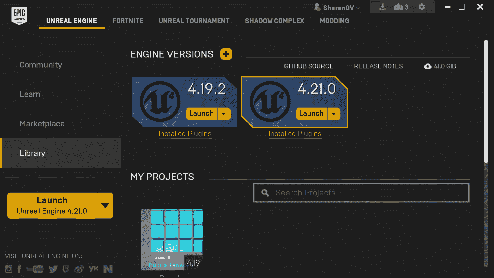

这将启动虚幻编辑器。虚幻编辑器用于可视化编辑你的游戏世界。您将在虚幻编辑器中花费大量时间，因此请花一些时间进行实验并玩它。

我将只介绍如何使用 UE4 编辑器的基本知识。然而，你需要让你的创造力流动起来，并投入一些时间来熟悉编辑。

To learn more about the UE4 editor, take a look at the *Getting Started: Introduction to the UE4 Editor* playlist, which is available at [https://www.youtube.com/playlist?list=PLZlv_N0_O1gasd4IcOe9Cx9wHoBB7rxFl](https://www.youtube.com/playlist?list=PLZlv_N0_O1gasd4IcOe9Cx9wHoBB7rxFl).

2.  您将看到“项目”对话框。下面的屏幕截图显示了要执行的步骤，数字对应于它们需要执行的顺序:


3.  执行以下步骤创建项目:
    1.  选择屏幕顶部的“新建项目”选项卡。
    2.  单击 C++ 选项卡(第二子选项卡)。
    3.  从可用的项目列表中选择“基本代码”。
    4.  设置你的项目所在的目录(我的是 Y:虚幻项目)。选择一个有大量空间的硬盘位置(最终项目将在 1.5 GB 左右)。
    5.  说出你的项目。我叫我的 GoldenEgg。
    6.  单击创建项目以完成项目创建。

一旦你做到了这一点，UE4 启动器将启动 Visual Studio(或 Xcode)。这可能需要一段时间，进度条可能会出现在其他窗口后面。只有几个源文件可用，但我们现在不打算接触这些。

4.  确保从屏幕顶部的配置管理器下拉列表中选择了开发编辑器，如下图所示:

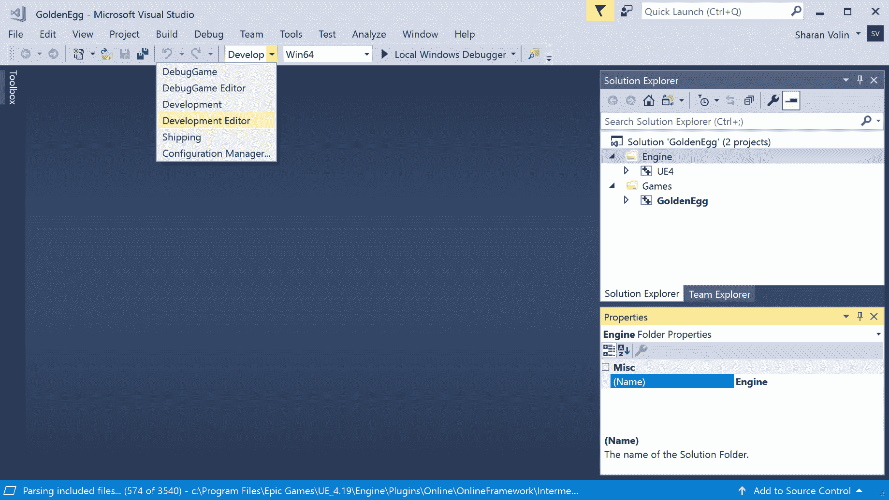

虚幻编辑器也已经启动，如下图所示:

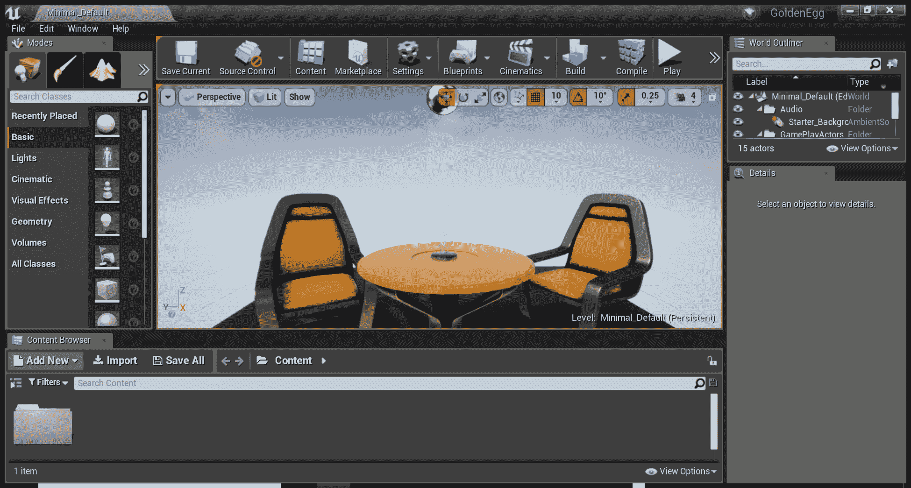

# UE4 编辑器

我们将在这里探索 UE4 编辑器。我们将从控件开始，因为知道如何在虚幻中导航很重要。

# 编辑器控件

如果你以前从未使用过 3D 编辑器，这些控件可能会很难学习。这些是编辑模式下的基本导航控件:

*   使用箭头键在场景中移动
*   按下*向上翻页*或*向下翻页*垂直上下移动
*   鼠标左键单击并向左或向右拖动，以更改您面对的方向
*   鼠标左键点击+上下拖动至*移动*(前后移动相机，与按上下箭头键相同)
*   鼠标右键单击+拖动可改变您面临的反应
*   鼠标中键单击+拖动可平移视图
*   鼠标右键点击 *W* 、 *A* 、 *S* 和 *D* 键在场景中移动

# 播放模式控制

点击顶部栏中的播放按钮，如下图所示。这将启动播放模式:


一旦你点击播放按钮，控制就会改变。在播放模式下，控制如下:

*   移动的 *W* 、 *A* 、 *S* 和 *D* 键
*   向左或向右箭头键分别向左或向右看
*   鼠标移动来改变你看的方向
*   按*键退出播放模式并返回编辑模式*

在这一点上，我建议你尝试在场景中添加一堆形状和对象，并尝试用不同的*材质*给它们上色。

# 向场景添加对象

将对象添加到场景中就像从内容浏览器选项卡中拖放对象一样简单，如下所示:

1.  默认情况下，“内容浏览器”选项卡停靠在窗口底部。如果看不到，只需选择“窗口”并导航到“内容浏览器”即可显示:


确保内容浏览器可见，以便向您的级别添加对象

2.  双击`StarterContent`文件夹打开。
3.  双击`Props`文件夹，找到可以拖到场景中的对象。

4.  将内容浏览器中的内容拖放到游戏世界中:

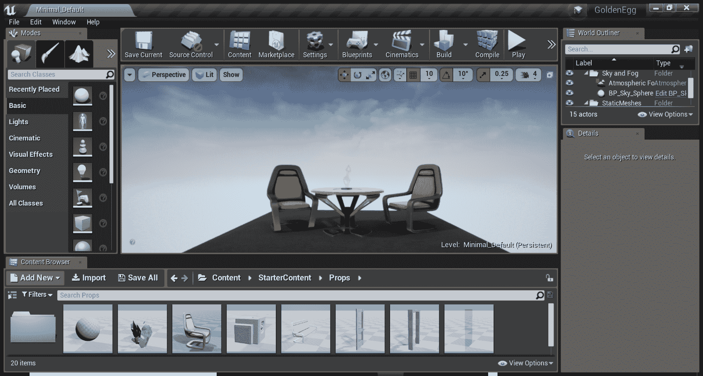

5.  要调整对象的大小，请按键盘上的 *R* (点击 *W* 再次移动，或点击 *E* 旋转对象)。对象周围的操纵器将显示为方框，表示调整大小模式:

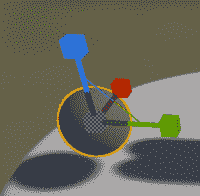

6.  要更改用于绘制对象的材质，只需从“材质”文件夹内的“内容浏览器”窗口中拖放新材质:

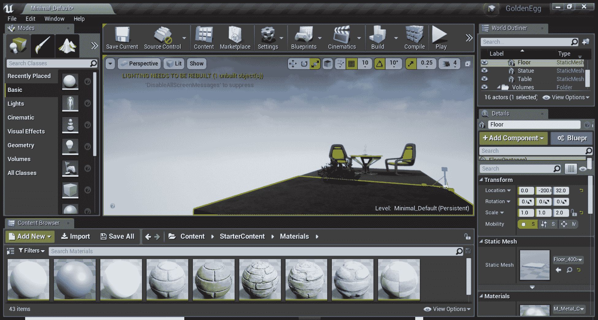

材料就像颜料。只需将所需的材料拖放到要在其上绘画的对象上，就可以在对象上涂上所需的任何材料。材料只是皮囊；它们不会改变对象的其他属性(如重量)。

# 开始一个新的水平

如果要从头开始创建级别，请执行以下步骤:

1.  单击文件并导航至新级别...，如下所示:

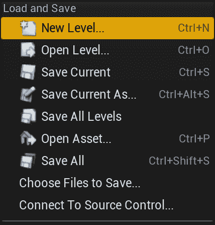

2.  然后，您可以在默认、虚拟现实-基本和空级别之间进行选择。我认为选择空级别是个好主意:


3.  新的关卡开始时将完全是黑色的。再次尝试从内容浏览器选项卡拖放一些对象。
    这一次，我为地平面添加了一个调整了大小的 shapes/shape_plane(模式下不要使用常规平面，否则一旦添加玩家就会掉进去)，并用 T_ground_Moss_D、几个道具/ SM_Rocks 和粒子/ P_Fire 对其进行了纹理化。
    一定要保存好你的地图。这是我的地图的快照(你的看起来怎么样？):

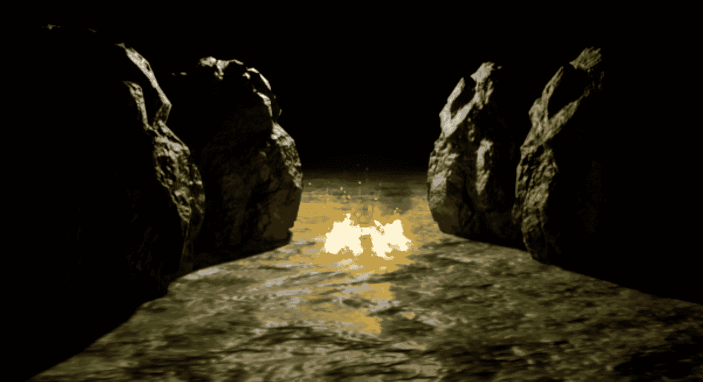

4.  如果要更改启动编辑器时打开的默认级别，请转到编辑|项目设置|地图和模式；然后，您将看到一个游戏默认地图和编辑器启动地图设置，如下图所示:

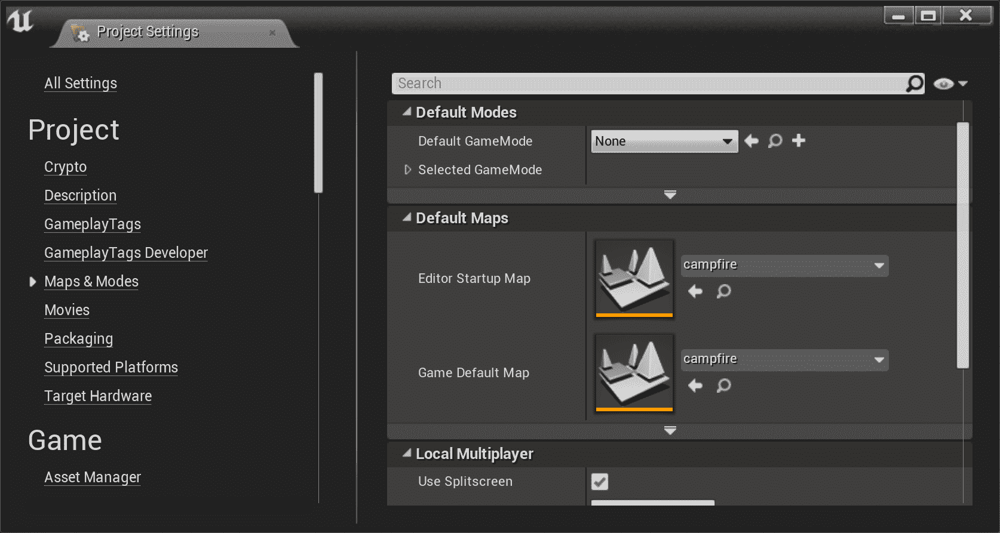

只要确保先保存当前场景！

# 添加光源

请注意，当您尝试运行场景时，它可能会完全(或大部分)呈现黑色。这是因为你还没有在里面放光源！

在前面的场景中，P_Fire 粒子发射器充当光源，但它只发出少量的光。为了确保场景中的一切看起来都很亮，您应该添加一个光源，如下所示:

1.  转到窗口，然后单击模式以确保显示光源面板:


2.  从“模式”面板中，将其中一个灯光对象拖到场景中:


3.  选择灯泡和盒子图标(它看起来像蘑菇，但不是)。
4.  单击左侧面板中的“灯光”。
5.  选择你想要的光的类型，然后把它拉进你的场景。

如果您没有光源，当您尝试运行它时(或者如果场景中没有对象)，您的场景将显示为完全黑色。

# 碰撞体积

你可能已经注意到，到目前为止，相机只是通过至少一些场景的几何图形，即使在播放模式。这可不好。让我们把它做好，这样玩家就不能在我们的场景中穿过岩石。

有几种不同类型的碰撞体积。一般来说，完美的网格-网格碰撞在运行时代价太高。相反，我们使用近似(包围体)来猜测碰撞体。

A mesh is the actual geometry of an object.

# 添加碰撞体积

我们要做的第一件事是将碰撞体积与场景中的每个岩石相关联。

我们可以从 UE4 编辑器中这样做，如下所示:

1.  单击场景中要为其添加碰撞体积的对象。
2.  在“世界大纲视图”选项卡中右键单击该对象(默认显示在屏幕右侧)，然后选择编辑，如下图所示:


You will find yourself in the mesh editor.

3.  转到碰撞菜单，然后单击添加胶囊简化碰撞:

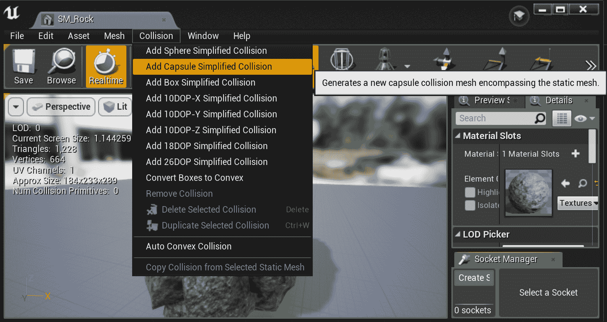

4.  添加成功后，碰撞体积将显示为围绕对象的一串线条，如下图所示:

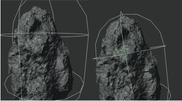

The default collision capsule (left) and manually resized versions (right)

5.  您可以根据需要调整大小(R)、旋转(E)、移动(W)和更改碰撞体积，就像在 UE4 编辑器中操纵对象一样。
6.  添加完碰撞网格后，保存并返回编辑器主窗口，点击播放；你会注意到你不能再通过你的可碰撞物体。

# 将玩家添加到场景中

现在我们已经有一个场景开始运行，我们需要添加一个演员到场景中。让我们首先为玩家添加一个头像，完成一个碰撞体。为此，我们必须从 UE4 `GameFramework`中继承一个类，如`Actor`或`Character`。

为了创建玩家的屏幕表现，我们需要从虚幻中的`ACharacter`类派生。

# 继承自 UE4 游戏框架类

UE4 使得从基础框架类继承变得容易。您所要做的就是执行以下步骤:

1.  在 UE4 编辑器中打开您的项目。
2.  转到文件，然后选择新建 C++ 类...：

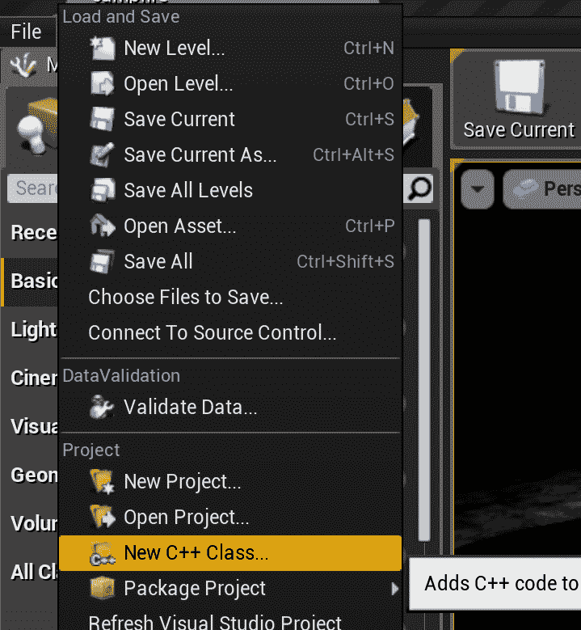

导航到文件|新的 C++ 类...将允许你从任何 UE4 游戏框架类派生

3.  选择要从中派生的基类。你有角色、棋子、演员等等，但现在，我们将从角色中得到:

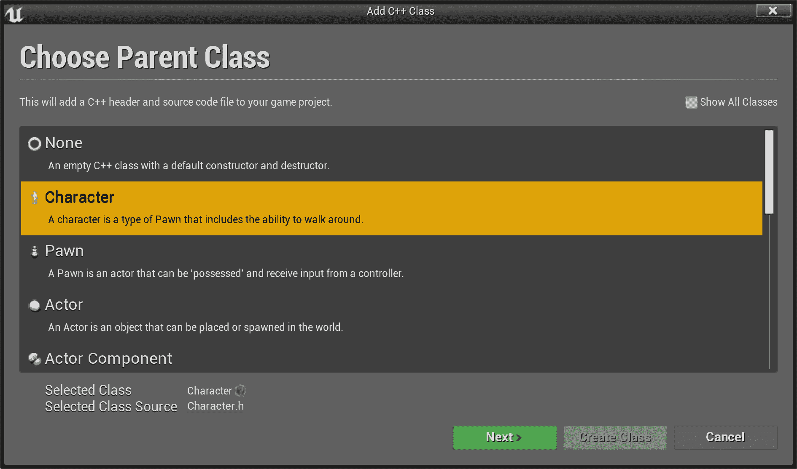

4.  选择要从中派生的 UE4 类。
5.  单击“下一步”以显示该对话框，您可以在其中命名该类。我给我的玩家等级命名为`Avatar`:

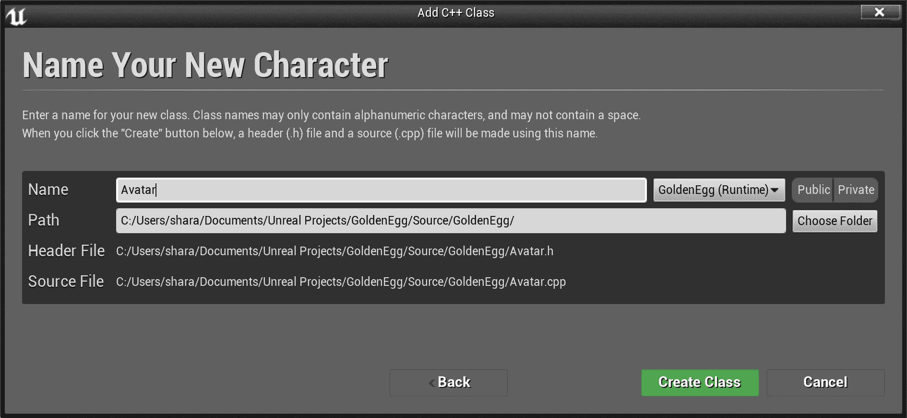

6.  点击创建类，用代码创建类，如前面的截图所示。

让 UE4 刷新你的 Visual Studio 或 Xcode 项目，如果它问你。从解决方案资源管理器中打开新的`Avatar.h`文件。

UE4 生成的代码看起来会有点奇怪。还记得我在[第五章](05.html)、*功能和宏*中建议大家避开的宏吗？UE4 代码广泛使用宏。这些宏用于复制和粘贴样板启动代码，让您的代码与 UE4 编辑器集成。

`Avatar.h`文件的内容如下代码所示:

```cpp
#pragma once

#include "CoreMinimal.h"
#include "GameFramework/Character.h"
#include "Avatar.generated.h"

UCLASS()
class GOLDENEGG_API AAvatar : public ACharacter
{
    GENERATED_BODY()

public:
    // Sets default values for this character's properties
    AAvatar();

protected:
    // Called when the game starts or when spawned
    virtual void BeginPlay() override;

public:    
    // Called every frame
    virtual void Tick(float DeltaTime) override;

    // Called to bind functionality to input
    virtual void SetupPlayerInputComponent(class UInputComponent* PlayerInputComponent) override;

};
```

我们先来谈谈宏。

`UCLASS()`宏基本上使你的 C++ 代码类在 UE4 编辑器中可用。`GENERATED_BODY()`宏复制并粘贴 UE4 需要的代码，以使您的类作为 UE4 类正常运行。

For `UCLASS()` and `GENERATED_BODY()`, you don't truly need to understand how UE4 works its magic. You just need to make sure that they are present at the right spot (where they were when you generated the class).

# 将模型与化身类相关联

现在，我们需要将模型与角色对象相关联。为此，我们需要一个可以玩的模型。幸运的是，UE4 市场上有一整套免费的样车。

# 下载免费模型

要创建播放器对象，请执行以下步骤:

1.  从市场选项卡下载动画初学者工具包文件(免费)。找到它最简单的方法是搜索它:


2.  从虚幻启动器，点击市场和搜索动画初学者包，这是免费的时候写这本书。

3.  下载动画初学者工具包文件后，您可以将其添加到之前创建的任何项目中，如下图所示:

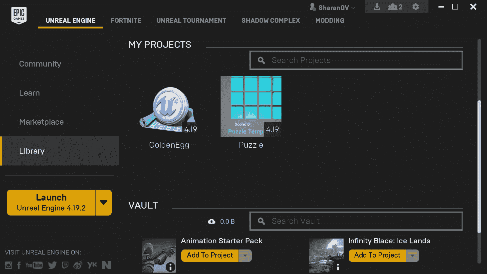

4.  当您单击动画初学者工具包下的添加到项目时，您会看到一个弹出窗口，询问要将工具包添加到哪个项目:


5.  只需选择您的项目，新的图稿就会出现在您的内容浏览器中。

# 加载网格

一般来说，将你的资产(或游戏中使用的对象)硬编码到游戏中被认为是一种不好的做法。硬编码意味着您编写指定要加载的资产的 C++ 代码。然而，硬编码意味着加载的资产是最终可执行文件的一部分，这意味着更改加载的资产在运行时是不可修改的。这是一种不好的做法。能够在运行时更改加载的资产要好得多。

为此，我们将使用 UE4 蓝图功能来设置我们`Avatar`类的模型网格和碰撞胶囊。

# 从我们的 C++ 类创建蓝图

让我们继续创建一个蓝图—这非常简单:

1.  导航到窗口|开发人员工具，然后单击类查看器，打开类查看器选项卡，如下所示:


2.  在“类查看器”对话框中，开始键入 C++ 类的名称。如果您已经正确地从 C++ 代码中创建并导出了该类，它将会出现，如下面的屏幕截图所示:

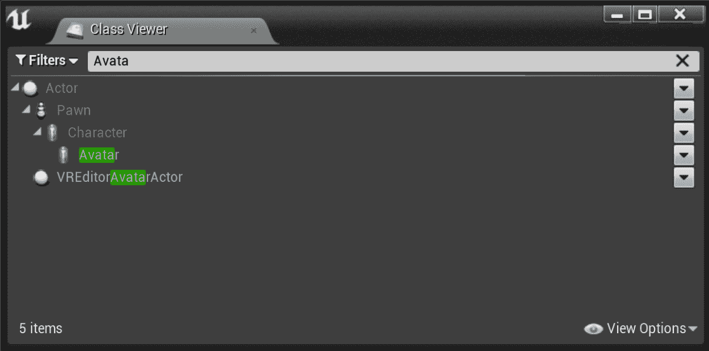

If your `Avatar` class does not show up, close the editor and compile/run the C++ project in Visual Studio or Xcode again.

3.  右键单击要创建蓝图的类(在我的例子中，
    是我的头像类)，然后选择创建蓝图类....
4.  给你的蓝图起一个独特的名字。我把我的蓝图叫做 BP_Avatar。BP_ 将其标识为蓝图，便于以后搜索。

5.  新蓝图应该会自动打开进行编辑。如果没有，双击 BP_Avatar 打开(添加后会出现在类查看器选项卡中，就在 Avatar 下)，如下图截图所示:

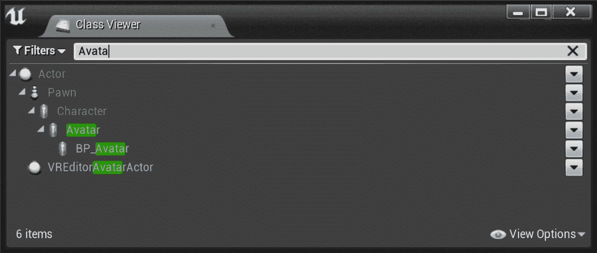

6.  您将看到新 BP_Avatar 对象的蓝图窗口，如下所示(确保选择事件图选项卡):

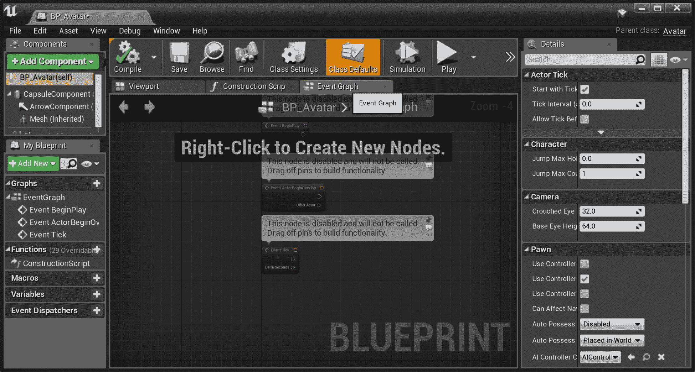

From this window, you can attach a model to the `Avatar` class visually. Again, this is the recommended pattern since artists will typically be the ones setting up their assets for game designers to play with.

7.  您的蓝图将已经继承了默认的骨骼网格。要查看其选项，请单击左侧封装组件下的网格(继承的):


8.  点击下拉菜单，为你的网格选择“人体模型”:


9.  如果 SK_Mannequin 没有出现在下拉列表中，请确保下载动画初学者工具包并将其添加到项目中。
10.  碰撞体积呢？您已经有一个名为封装组件的。如果您的胶囊没有封装您的模型，请调整模型使其适合。

If your model ended up like mine, the capsule is off the mark! We need to adjust it.

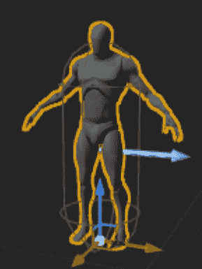

11.  点击头像模型，然后点击并按住指向上方的蓝色箭头，如前面的截图所示。把他放下来，直到他能放进胶囊里。如果胶囊不够大，您可以在胶囊半高和胶囊半径下的详细信息选项卡中调整其大小:


您可以通过调整胶囊半高属性来拉伸胶囊

12.  让我们把这个头像加入游戏世界。单击并将您的 BP_Avatar 模型从“类查看器”选项卡拖到 UE4 编辑器中的场景中:


Our Avatar class added to the scene

头像的姿势是默认姿势。你想让他充满活力，你说！很简单，只需执行以下步骤:

1.  在蓝图编辑器中点击你的网格，你会在右边的细节下看到动画。注意:如果您出于任何原因关闭了蓝图并重新打开它，您将看不到完整的蓝图。如果发生这种情况，请单击链接打开完整的蓝图编辑器。
2.  现在，您可以使用动画的蓝图。这样，艺术家可以根据角色正在做的事情来适当地设置动画。如果从`AnimClass`下拉菜单中选择 UE4ASP _ HeroTPP _ animal bluetooth，随着角色的移动，动画将根据蓝图(由艺术家完成)进行调整:


如果你保存并编译好蓝图，在游戏主窗口点击播放，你会看到闲置的动画。

We can't cover everything here. Animation blueprints are covered in [Chapter 11](11.html), *Monsters*. If you're really interested in animation, it wouldn't be a bad idea to sit through a couple of Gnomon Workshop tutorials on IK, animation, and rigging, which can be found at [gnomonworkshop.com/tutorials](http://gnomonworkshop.com/tutorials).

还有一件事:让《阿凡达》的镜头出现在它的背后。这会给你一个第三人称的视角，让你看到整个角色，如下图截图所示，有相应的步骤:

1.  在 BP_Avatar 蓝图编辑器中，选择 BP_Avatar(自身)，然后单击添加组件。
2.  向下滚动以选择添加摄像机。

视口中将出现一个摄像机。你可以点击摄像头并移动它。把相机放在播放器后面的某个地方。确保播放器上的蓝色箭头与相机朝向相同的方向。如果不是，请旋转化身模型网格，使其面向与蓝色箭头相同的方向:

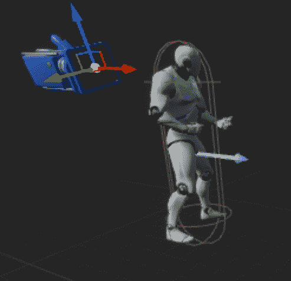

模型网格上的蓝色箭头指示模型网格的前进方向。确保摄像机的开口与角色的前向矢量朝向相同的方向。

# 编写控制游戏角色的 C++ 代码

当你启动你的 UE4 游戏时，你可能会注意到相机没有改变。我们现在要做的是使起始字符成为我们的`Avatar`类的一个实例，并使用键盘控制我们的字符。

# 让玩家成为化身类的一个实例

让我们看看我们是怎么做的。在虚幻编辑器中，执行以下步骤:

1.  通过导航到文件|新的 C++ 类来创建游戏模式的子类...以及选择游戏模式库。我给我的起名`GameModeGoldenEgg`:


UE4 游戏模式包含游戏规则，并描述了游戏如何在引擎上进行。稍后我们将更多地与我们的`GameMode`班合作。目前，我们需要将其子类化。

它应该会在你创建类后自动编译你的 C++ 代码，这样你就可以创建一个`GameModeGoldenEgg`蓝图。

2.  创建游戏模式蓝图，方法是转到顶部菜单栏中的蓝图图标，单击游戏模式新建，然后选择+创建|游戏模式 GoldenEgg(或您在步骤 1 中命名的游戏模式子类):


3.  说出你的蓝图；我称我的为`BP_GameModeGoldenEgg`:

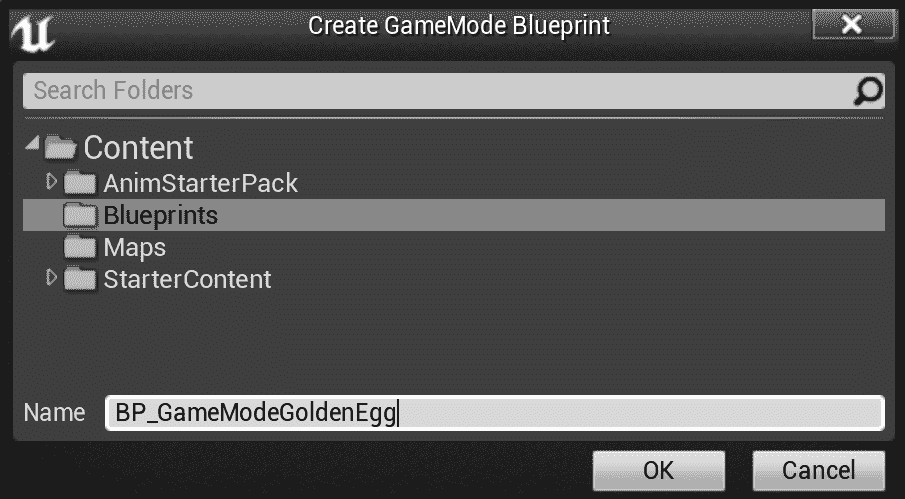

4.  您新创建的蓝图将在蓝图编辑器中打开。如果没有，您可以从“类查看器”选项卡中打开 BP _ GameModeGoldenEgg 类。
5.  从默认棋子类面板中选择你的 BP_Avatar 类，如下图所示。“默认棋子类别”面板是将用于玩家的对象类型:


6.  启动你的游戏。当摄像机放在播放器后面时，您可以看到背面视图:


你会注意到你不能动。为什么会这样？答案是因为我们还没有设置控制器输入。下一节将教你如何去做。

# 设置控制器输入

以下是设置输入的步骤:

1.  要设置控制器输入，请转到设置|项目设置...：

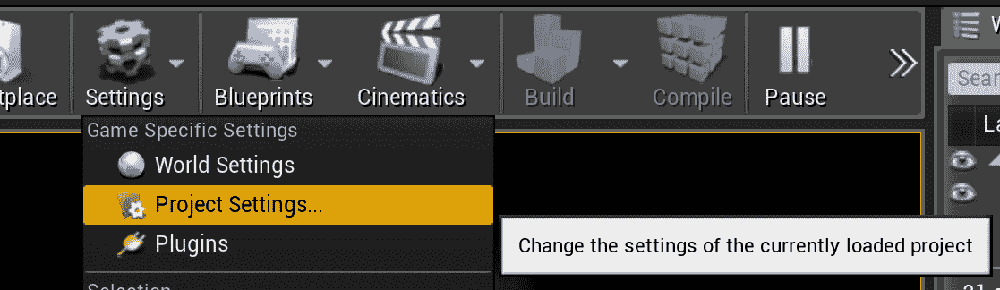

2.  在左侧面板中，向下滚动，直到在“引擎:


3.  在右侧，您可以设置一些绑定。单击+添加新绑定，然后单击轴映射旁边的小箭头将其展开。只需添加两个轴映射即可开始，一个名为 Forward(连接到键盘字母 *W* )，一个名为钢鞭(连接到键盘字母 *D* )。记住你设定的名字；我们将在稍后用 C++ 代码查找它们。
4.  关闭“项目设置”对话框。打开你的 C++ 代码。在`Avatar.h`构造函数中，需要添加两个成员函数声明，如下图所示:

```cpp
UCLASS()
class GOLDENEGG_API AAvatar : public ACharacter
{
    GENERATED_BODY()

public:
    // Sets default values for this character's properties
    AAvatar();

protected:
    // Called when the game starts or when spawned
    virtual void BeginPlay() override;

public:    
    // Called every frame
    virtual void Tick(float DeltaTime) override;

    // Called to bind functionality to input
    virtual void SetupPlayerInputComponent(class UInputComponent* PlayerInputComponent) override;

    // New! These 2 new member function declarations 
    // they will be used to move our player around! 
    void MoveForward(float amount);
    void MoveRight(float amount);

}; 
```

请注意现有函数`SetupPlayerInputComponent`和`Tick`是如何覆盖虚拟函数的。`SetupPlayerInputComponent`是`APawn`基类中的一个虚函数。我们还将向这个函数添加代码。

5.  在`Avatar.cpp`文件中，需要添加功能体。在`Super::SetupPlayerInputComponent(PlayerInputComponent);`下的`SetupPlayerInputComponent`中，添加以下行:

```cpp
  check(PlayerInputComponent);
    PlayerInputComponent->BindAxis("Forward", this,
        &AAvatar::MoveForward);
    PlayerInputComponent->BindAxis("Strafe", this, &AAvatar::MoveRight);
```

这个成员函数查找我们刚刚在虚幻编辑器中创建的前向和钢鞭轴绑定，并将它们连接到`this`类中的成员函数。我们应该连接到哪些成员函数？为什么，我们应该连接到`AAvatar::MoveForward`和`AAvatar::MoveRight`。以下是这两个函数的成员函数定义:

```cpp
void AAvatar::MoveForward( float amount ) 
{ 
  // Don't enter the body of this function if Controller is 
  // not set up yet, or if the amount to move is equal to 0 
  if( Controller && amount ) 
  { 
    FVector fwd = GetActorForwardVector(); 
    // we call AddMovementInput to actually move the 
    // player by `amount` in the `fwd` direction 
    AddMovementInput(fwd, amount); 
  } 
} 

void AAvatar::MoveRight( float amount ) 
{ 
  if( Controller && amount ) 
  { 
    FVector right = GetActorRightVector(); 
    AddMovementInput(right, amount); 
  } 
} 
```

The `Controller` object and the `AddMovementInput` function are defined in the `APawn` base class. Since the `Avatar` class derives from `ACharacter`, which in turn derives from `APawn`, we get free use of all the member functions in the `APawn` base class. Now, do you see the beauty of inheritance and code reuse?    If you test this out, make sure you click inside the game window, because otherwise the game won't receive keyboard events.

# 锻炼

添加轴绑定和 C++ 函数，将播放器向左后移动。

Here's a hint: you only need to add axis bindings if you realize going backward is simply the negative of going forward.

# 解决办法

导航到设置|项目设置，输入两个额外的轴绑定...|输入，如下图所示:


将 S 和 A 输入缩放-1.0。这将使轴反转，因此在游戏中按下 *S* 键将使玩家向前移动。试试看！

或者，您可以在`AAvatar`类中定义两个完全独立的成员函数，如下所示，并将 *A* 和 *S* 键分别绑定到`AAvatar::MoveLeft`和`AAvatar::MoveBack`(并确保将这些键的绑定添加到`AAvatar::SetupPlayerInputComponent`):

```cpp
void AAvatar::MoveLeft( float amount ) 
{ 
  if( Controller && amount ) 
  { 
    FVector left = -GetActorRightVector(); 
    AddMovementInput(left, amount); 
  } 
} 
void AAvatar::MoveBack( float amount ) 
{ 
  if( Controller && amount ) 
  { 
    FVector back = -GetActorForwardVector(); 
    AddMovementInput(back, amount); 
  } 
} 
```

# 偏航和俯仰

我们可以通过设置控制器的偏航和俯仰来改变玩家看的方向。检查以下步骤:

1.  为鼠标添加新的轴绑定，如下图所示:

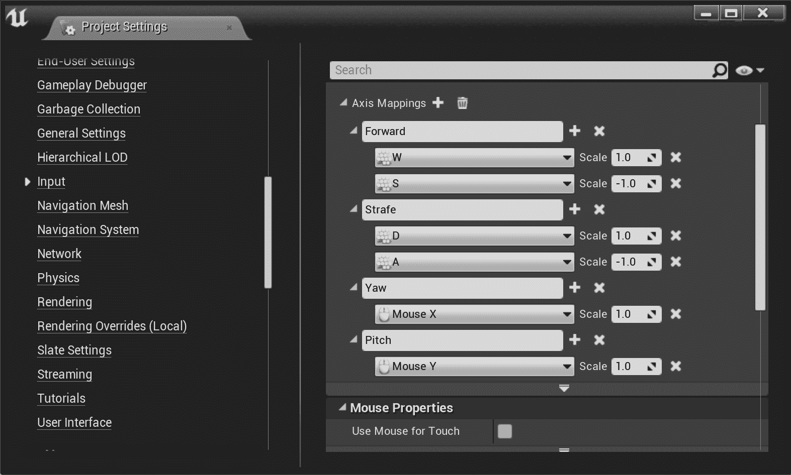

2.  从 C++ 中，给`AAvatar.h`增加两个新的成员函数声明:

```cpp
void Yaw( float amount ); 
void Pitch( float amount ); 
```

这些成员函数的主体将进入`AAvatar.cpp`文件:

```cpp
void AAvatar::Yaw(float amount)
{
    AddControllerYawInput(200.f * amount * GetWorld()->GetDeltaSeconds());
}
void AAvatar::Pitch(float amount)
{
    AddControllerPitchInput(200.f * amount * GetWorld()->GetDeltaSeconds());
}
```

3.  `SetupPlayerInputComponent`增加两行:

```cpp
void AAvatar::SetupPlayerInputComponent(UInputComponent* PlayerInputComponent)
{ 
  // .. as before, plus: 
  PlayerInputComponent->BindAxis("Yaw", this, &AAvatar::Yaw);
  PlayerInputComponent->BindAxis("Pitch", this, &AAvatar::Pitch); 
} 
```

这里，请注意我是如何将`Yaw`和`Pitch`函数中的`amount`值乘以 200 的。这个数字代表鼠标的灵敏度。您可以(应该)在`AAvatar`类中添加一个`float`成员，以避免硬编码这个敏感号。

`GetWorld()->GetDeltaSeconds()`给出最后一帧和这一帧之间经过的时间。不是很多；`GetDeltaSeconds()`大部分时间应该在 16 毫秒(0.016 s)左右(如果你的游戏运行速度是 60 fps)。

注意:你可能会注意到，现在推销实际上并不奏效。这是因为你用的是第三人称相机。虽然它可能对这个相机没有意义，但您可以通过进入 BP_Avatar，选择相机，并选中相机选项下的使用棋子控制旋转来让它工作:


所以，现在我们有了玩家输入和控制。要为您的头像添加新功能，您只需完成以下工作:

1.  通过转到设置|项目设置|输入来绑定您的按键或鼠标操作。
2.  添加按下该键时运行的成员函数。
3.  在`SetupPlayerInputComponent`处加一行，将绑定输入的名称连接到我们要在该键被按下时运行的成员函数。

# 创建非玩家角色实体

所以，我们需要创建几个 **NPC** ( **不可玩角色**)。NPC 是游戏中帮助玩家的角色。有些提供特殊物品，有些是商店小贩，有些有信息给玩家。在这个游戏中，当玩家靠近时，他们会做出反应。让我们对一些行为进行编程:

1.  创建另一个字符子类。在 UE4 编辑器中，转到文件|新建 C++ 类...并选择可以创建子类的字符类。说出你的子类`NPC`。
2.  在 Visual Studio 中编辑您的代码。每个 NPC 都会有一个消息告诉玩家，所以我们在`NPC`类中增加了一个`UPROPERTY() FString`属性。

`FString` is UE4's version of C++'s `<string>` type. When programming in UE4, you should use `FString` objects over C++ STL's `string` objects. In general, you should use UE4's built-in types, as they guarantee cross-platform compatibility.

3.  下面是如何将`UPROPERTY() FString`属性添加到`NPC`类:

```cpp
UCLASS()
class GOLDENEGG_API ANPC : public ACharacter
{
    GENERATED_BODY()

    // This is the NPC's message that he has to tell us. 
    UPROPERTY(EditAnywhere, BlueprintReadWrite, Category =
        NPCMessage)
        FString NpcMessage;
    // When you create a blueprint from this class, you want to be  
    // able to edit that message in blueprints, 
    // that's why we have the EditAnywhere and BlueprintReadWrite  
    // properties. 
public:
    // Sets default values for this character's properties
    ANPC();

protected:
    // Called when the game starts or when spawned
    virtual void BeginPlay() override;

public:    
    // Called every frame
    virtual void Tick(float DeltaTime) override;

    // Called to bind functionality to input
    virtual void SetupPlayerInputComponent(class UInputComponent* PlayerInputComponent) override;

};
```

请注意，我们将`EditAnywhere`和`BlueprintReadWrite`属性放入了`UPROPERTY`宏。这将使`NpcMessage`在蓝图中可编辑。

Full descriptions of all the UE4 property specifiers are available at [https://docs.unrealengine.com/latest/INT/Programming/UnrealArchitecture/Reference/Properties/index.html](https://docs.unrealengine.com/latest/INT/Programming/UnrealArchitecture/Reference/Properties/index.html).

4.  重新编译你的项目(就像我们对`Avatar`类所做的那样)。然后，转到类查看器，右键单击您的`NPC`类，并从中创建一个蓝图类。
5.  你想要创造的每个 NPC 角色都可以是基于`NPC`类的蓝图。为每个蓝图命名一些独特的东西，因为我们将为出现的每个 NPC 选择不同的模型网格和消息，如下图所示:

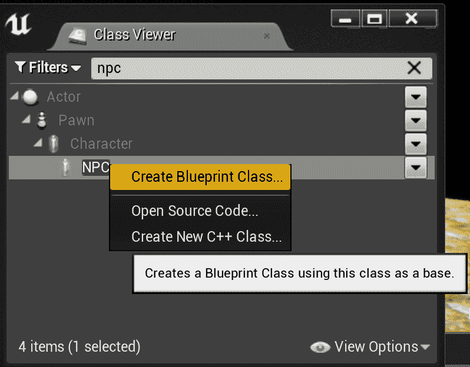

6.  打开蓝图并选择网格(继承的)。然后，您可以在骨骼网格下拉列表中更改新角色的材质，使其看起来与玩家不同:


通过从每个可用元素的下拉列表中进行选择，更改网格属性中角色的材质

7.  在组件选项卡中选择蓝图名称(自身)的详细信息选项卡中，查找`NpcMessage`属性。这是我们在 C++ 代码和蓝图之间的联系；因为我们在`FString NpcMessage`变量上输入了一个`UPROPERTY()`函数，该属性在 UE4 中显示为可编辑，如下图所示:

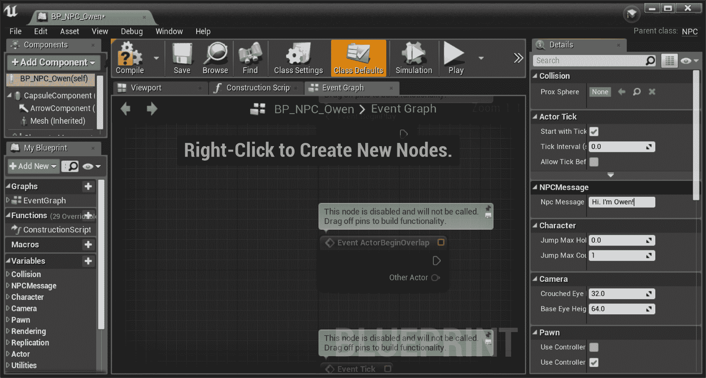

8.  将 BP _ NPC _ 欧文拖到场景中。您也可以创建第二个或第三个角色，并确保给它们唯一的名称、外观和消息:


我根据 NPC 的基本类创建了两个 NPC 蓝图:BP _ NPC _ 乔纳森和 BP _ NPC _ 欧文。它们对玩家来说有不同的外观和不同的信息:


Jonathan and Owen in the scene

# 显示每个 NPC 对话框中的报价

要显示一个对话框，我们需要一个自定义的**平视显示器** ( **平视显示器**)。在 UE4 编辑器中，转到文件|新建 C++ 类...并选择创建子类的`HUD`类(你需要向下滚动找到它)。根据您的意愿命名您的子类；我已经命名我的`MyHUD`。

创建`MyHUD`类后，让 Visual Studio 重新加载。我们将进行一些代码编辑。

# 在抬头显示器上显示信息

在`AMyHUD`类中，我们需要实现`DrawHUD()`功能，以便将我们的消息绘制到平视显示器上，并初始化一个字体绘制到平视显示器上，如`MyHUD.h`中的以下代码所示:

```cpp
UCLASS()
class GOLDENEGG_API AMyHUD : public AHUD
{
    GENERATED_BODY()
public:
    // The font used to render the text in the HUD. 
    UPROPERTY(EditAnywhere, BlueprintReadWrite, Category = HUDFont)
    UFont* hudFont;
    // Add this function to be able to draw to the HUD! 
    virtual void DrawHUD() override;
};
```

抬头显示器字体将在`AMyHUD`类的蓝色打印版本中设置。`DrawHUD()`功能每帧运行一次。为了在框架内绘图，向`AMyHUD.cpp`文件添加一个函数:

```cpp
void AMyHUD::DrawHUD()
{
    // call superclass DrawHUD() function first 
    Super::DrawHUD();
    // then proceed to draw your stuff. 
    // we can draw lines.. 
    DrawLine(200, 300, 400, 500, FLinearColor::Blue);
    // and we can draw text! 
    const FVector2D ViewportSize = FVector2D(GEngine->GameViewport->Viewport->GetSizeXY());
    DrawText("Greetings from Unreal!", FLinearColor::White, ViewportSize.X/2, ViewportSize.Y/2, hudFont);
}
```

等等！我们还没有初始化字体。我们现在就开始吧:

1.  在蓝图中设置。在编辑器中编译您的 Visual Studio 项目，然后转到顶部的“蓝图”菜单，导航到游戏模式| HUD | +创建|我的 HUD:


Creating a blueprint of the MyHUD class

2.  我称我的为`BP_MyHUD`。找到`Hud Font`，选择下拉菜单，创建一个新的字体资产。我给我的起名`MyHUDFont`:

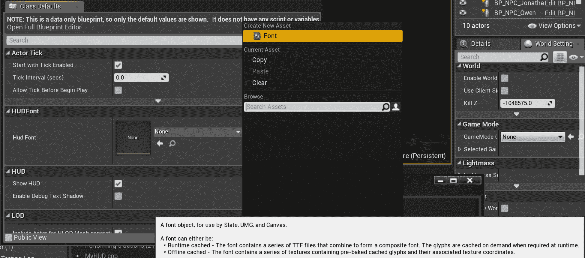

3.  在内容浏览器中找到我的字体，双击它进行编辑:

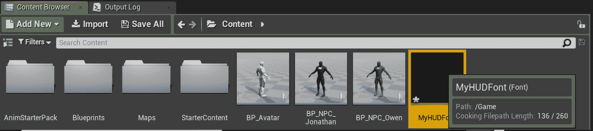

在接下来的窗口中，您可以点击显示`+ Add Font`的位置来创建新的默认字体系列。你可以给它起一个你喜欢的名字，然后点击文件夹图标从你的硬盘中选择一种字体(你可以找到。TTF 或 TrueType 字体在线在许多网站免费-我使用了我发现的闪耀字体)；当您导入字体时，它会要求您保存字体。您还需要将我的主字体中的传统字体大小更改为更大的大小(我使用了 36)。

4.  编辑您的游戏模式蓝图(BP _ GameModeGoldenEgg)，并为抬头显示器类别面板选择您的新`BP_MyHUD`(不是`MyHUD`)类别:


通过运行来编译和测试你的程序！您应该会看到屏幕上打印的文本:

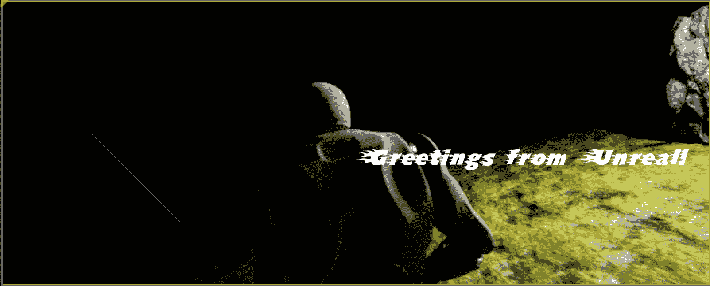

# 锻炼

您可以看到文本没有完全居中。这是因为位置是基于文本的左上角，而不是中间。

See whether you can fix that. Here's a hint: get the width and height of the text and subtract half of that from the viewport width and height/2 you're already using. You'll want to use something similar to the following:

```cpp
    const FVector2D ViewportSize = FVector2D(GEngine->GameViewport->Viewport->GetSizeXY());
    const FString message("Greetings from Unreal!");
    float messageWidth = 0;
    float messageHeight = 0;
    GetTextSize(message, messageWidth, messageHeight, hudFont);
    DrawText(message, FLinearColor::White, (ViewportSize.X - messageWidth) / 2, (ViewportSize.Y - messageHeight) / 2, hudFont);
```

# 使用 TArray<message></message>

我们要为玩家显示的每个消息都有几个属性:

*   消息的`FString`变量
*   显示时间的`float`变量
*   消息颜色的`FColor`变量

所以，我们写一个小小的`struct`函数来包含所有这些信息是有意义的。

在`MyHUD.h`顶部，插入以下`struct`声明:

```cpp
struct Message 
{ 
  FString message; 
  float time; 
  FColor color; 
  Message() 
  { 
    // Set the default time. 
    time = 5.f; 
    color = FColor::White; 
  } 
  Message( FString iMessage, float iTime, FColor iColor ) 
  { 
    message = iMessage; 
    time = iTime; 
    color = iColor; 
  } 
}; 
```

现在，在`AMyHUD`类中，我们想要添加这些消息的一个`TArray`。`TArray`是 UE4 定义的一种特殊类型的可动态增长的 C++ 数组。我们将在[第 9 章](09.html)、*模板和常用容器*中介绍`TArray`的详细使用，但是`TArray`的这种简单使用应该是一个很好的介绍，可以让你对数组在游戏中的用途感兴趣。这将被声明为`TArray<Message>`:

```cpp
UCLASS()
class GOLDENEGG_API AMyHUD : public AHUD
{
    GENERATED_BODY()
public:
    // The font used to render the text in the HUD. 
    UPROPERTY(EditAnywhere, BlueprintReadWrite, Category = HUDFont)
        UFont* hudFont;
    // New! An array of messages for display 
    TArray<Message> messages;
    virtual void DrawHUD() override;
    // New! A function to be able to add a message to display 
    void addMessage(Message msg);
};
```

还将 **`#include "CoreMinimal.h"`** *添加到文件的顶部*。

现在，每当 NPC 有消息要显示时，我们只需要用我们的消息呼叫`AMyHud::addMessage()`。该消息将被添加到要显示的消息的`TArray`中。当消息过期时(经过一定时间)，它将从抬头显示器中删除。

在`AMyHUD.cpp`文件中，添加以下代码:

```cpp
void AMyHUD::DrawHUD()
{
    Super::DrawHUD();
    // iterate from back to front thru the list, so if we remove 
    // an item while iterating, there won't be any problems 
    for (int c = messages.Num() - 1; c >= 0; c--)
    {
        // draw the background box the right size 
        // for the message 
        float outputWidth, outputHeight, pad = 10.f;
        GetTextSize(messages[c].message, outputWidth, outputHeight,
            hudFont, 1.f);

        float messageH = outputHeight + 2.f*pad;
        float x = 0.f, y = c * messageH;

        // black backing 
        DrawRect(FLinearColor::Black, x, y, Canvas->SizeX, messageH
        );
        // draw our message using the hudFont 
        DrawText(messages[c].message, messages[c].color, x + pad, y +
            pad, hudFont);

        // reduce lifetime by the time that passed since last  
        // frame. 
        messages[c].time -= GetWorld()->GetDeltaSeconds();

        // if the message's time is up, remove it 
        if (messages[c].time < 0)
        {
            messages.RemoveAt(c);
        }
    }
}

void AMyHUD::addMessage(Message msg)
{
    messages.Add(msg);
}
```

`AMyHUD::DrawHUD()`函数现在绘制`messages`数组中的所有消息，并按照自上一帧以来经过的时间量排列`messages`数组中的每个消息。一旦过期消息的`time`值降至 0 以下，它们将从`messages`集合中删除。

# 锻炼

重构`DrawHUD()`函数，使得将消息绘制到屏幕上的代码在一个单独的函数中，称为`DrawMessages()`。您可能想要创建至少一个示例消息对象，并使用它调用`addMessage`，以便您可以看到它。

`Canvas`变量只在`DrawHUD()`中可用，所以你必须在类级变量中保存`Canvas->SizeX`和`Canvas->SizeY`。

Refactoring means changing the way code works internally so that it is more organized or easier to read but still has the same apparent result to the user running the program. Refactoring often is a good practice. The reason why refactoring occurs is because nobody knows exactly what the final code should look like when they start writing it.

# 当玩家在 NPC 附近时触发事件

要触发 NPC 附近的事件，我们需要设置一个比默认胶囊形状稍宽的额外碰撞检测体积。额外的碰撞检测体积将是围绕每个 NPC 的球体。当玩家进入 NPC 球体时，NPC(如下所示)会做出反应并显示一条信息:

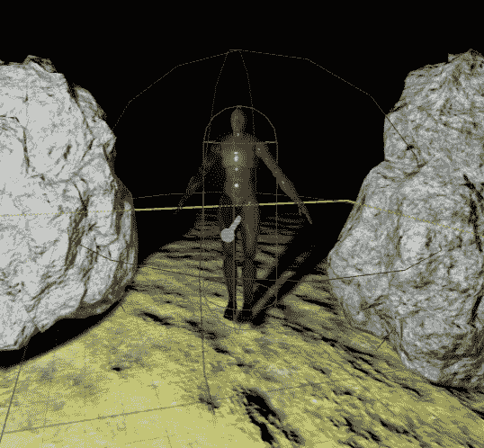

我们将把暗红色的球体添加到 NPC，这样它就可以知道玩家何时在附近。

在您的`NPC.h`类文件中，在顶部添加`#include "Components/SphereComponent.h"`和以下代码:

```cpp
UCLASS() class GOLDENEGG_API ANPC : public ACharacter {
    GENERATED_BODY()

public:
    // The sphere that the player can collide with tob
    UPROPERTY(VisibleAnywhere, BlueprintReadOnly, Category =
        Collision)
        USphereComponent* ProxSphere;
    // This is the NPC's message that he has to tell us. 
    UPROPERTY(EditAnywhere, BlueprintReadWrite, Category =
        NPCMessage)
        FString NpcMessage; // The corresponding body of this function is 
                            // ANPC::Prox_Implementation, __not__ ANPC::Prox()! 
                            // This is a bit weird and not what you'd expect, 
                            // but it happens because this is a BlueprintNativeEvent 
    UFUNCTION(BlueprintNativeEvent, Category = "Collision")
        void Prox(UPrimitiveComponent* OverlappedComponent, AActor* OtherActor, UPrimitiveComponent* OtherComp,
            int32 OtherBodyIndex, bool bFromSweep, const FHitResult& SweepResult);
    // You shouldn't need this unless you get a compiler error that it can't find this function.
    virtual int Prox_Implementation(UPrimitiveComponent* OverlappedComponent, AActor* OtherActor, UPrimitiveComponent* OtherComp,
        int32 OtherBodyIndex, bool bFromSweep, const FHitResult& SweepResult);

    // Sets default values for this character's properties
    ANPC(const FObjectInitializer& ObjectInitializer);

protected:
    // Called when the game starts or when spawned
    virtual void BeginPlay() override;

public:
    // Called every frame
    virtual void Tick(float DeltaTime) override;

    // Called to bind functionality to input
    virtual void SetupPlayerInputComponent(class UInputComponent* PlayerInputComponent) override;
};
```

这看起来有点乱，但实际上没那么复杂。在这里，我们声明了一个额外的被称为`ProxSphere`的包围球体积，它可以检测玩家何时在 NPC 附近。

在`NPC.cpp`文件中，我们需要添加以下代码来完成接近检测:

```cpp
ANPC::ANPC(const FObjectInitializer& ObjectInitializer)
 : Super(ObjectInitializer)
{
 ProxSphere = ObjectInitializer.CreateDefaultSubobject<USphereComponent>(this,
 TEXT("Proximity Sphere"));
 ProxSphere->AttachToComponent(RootComponent, FAttachmentTransformRules::KeepWorldTransform);
 ProxSphere->SetSphereRadius(32.0f);
 // Code to make ANPC::Prox() run when this proximity sphere 
 // overlaps another actor. 
 ProxSphere->OnComponentBeginOverlap.AddDynamic(this, &ANPC::Prox);
 NpcMessage = "Hi, I'm Owen";//default message, can be edited 
 // in blueprints 
}

// Note! Although this was declared ANPC::Prox() in the header, 
// it is now ANPC::Prox_Implementation here. 
int ANPC::Prox_Implementation(UPrimitiveComponent* OverlappedComponent, AActor* OtherActor, UPrimitiveComponent* OtherComp,
 int32 OtherBodyIndex, bool bFromSweep, const FHitResult& SweepResult) 
{ 
    // This is where our code will go for what happens 
    // when there is an intersection 
    return 0;
} 
```

# 当玩家在附近时，让 NPC 在平视显示器上显示一些东西

当玩家靠近 NPC 球体碰撞体积时，向平视显示器显示一条消息，提醒玩家 NPC 在说什么。

这是`ANPC::Prox_Implementation`的完整实现:

```cpp
int ANPC::Prox_Implementation(UPrimitiveComponent* OverlappedComponent, AActor* OtherActor, UPrimitiveComponent* OtherComp,
    int32 OtherBodyIndex, bool bFromSweep, const FHitResult& SweepResult)
{ 
    // if the overlapped actor is not the player, 
    // you should just simply return from the function 
    if( Cast<AAvatar>( OtherActor ) == nullptr ) { 
        return -1; 
    } 
    APlayerController* PController = GetWorld()->GetFirstPlayerController(); 
    if( PController ) 
    { 
        AMyHUD * hud = Cast<AMyHUD>( PController->GetHUD() ); 
        hud->addMessage( Message( NpcMessage, 5.f, FColor::White ) ); 
    } 
    return 0;
} 
```

此外，请确保在文件顶部添加以下内容:

```cpp
#include "Avatar.h"
#include "MyHud.h"
```

我们在这个函数中做的第一件事是将`OtherActor`(靠近 NPC 的东西)铸造成`AAvatar`。当`OtherActor`是`AAvatar`对象时，演员成功了(不是`nullptr`)。我们得到了平视显示器对象(碰巧附在播放器控制器上)，并将 NPC 的信息传递给平视显示器。只要玩家在 NPC 周围的红色边界球内，就会显示该消息:

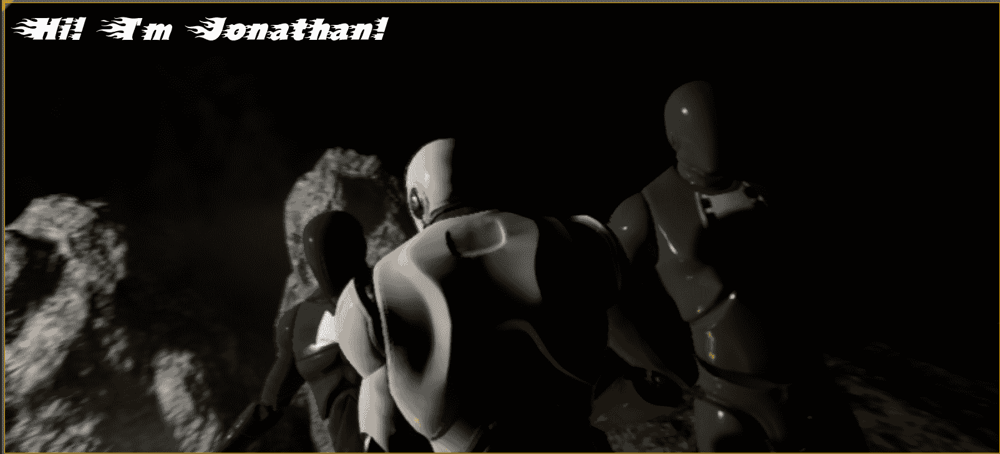

Jonathan's greeting

# 练习

试试这些，进行更多练习:

1.  为 NPC 的名字添加一个`UPROPERTY`函数名，这样 NPC 的名字就可以在蓝图中编辑，类似于 NPC 给玩家的信息。在输出中显示 NPC 的名字。
2.  为 NPC 的脸部纹理添加一个`UPROPERTY`功能(键入`UTexture2D*`)。在输出的信息旁边画出 NPC 的脸。
3.  将玩家的血量渲染为条形(实心矩形)。

# 解决方法

将以下属性添加到`ANPC`类中:

```cpp
// This is the NPC's name 
UPROPERTY(EditAnywhere, BlueprintReadWrite, Category = NPCMessage) 
FString name; 
```

然后，在`ANPC::Prox_Implementation`中，将传递给抬头显示器的字符串改为:

```cpp
name + FString(": ") + NpcMessage
```

这样，NPC 的名字就会附在信息上。

将`this`属性添加到`ANPC`类中:

```cpp
UPROPERTY(EditAnywhere, BlueprintReadWrite, Category = NPCMessage) 
UTexture2D* Face; 
```

然后，你可以在蓝图中选择要贴在 NPC 脸上的脸图标。

给你的`struct Message`加上一个纹理:

```cpp
UTexture2D* tex; 
```

要渲染这些图标，您需要添加对`DrawTexture()`的调用，并向其传递正确的纹理:

```cpp
DrawTexture( messages[c].tex, x, y, messageH, messageH, 0, 0, 1, 1  
   );
```

在渲染纹理之前，一定要检查它是否有效。图标应该类似于屏幕顶部显示的内容:

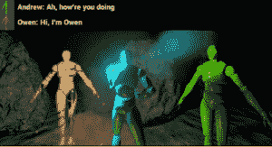

这是一个在条形图中绘制玩家剩余生命值的函数的外观:

```cpp
void AMyHUD::DrawHealthbar()
{
    // Draw the healthbar. 
    AAvatar *avatar = Cast<AAvatar>(
b        UGameplayStatics::GetPlayerPawn(GetWorld(), 0));
    float barWidth = 200, barHeight = 50, barPad = 12, barMargin = 50;
    float percHp = avatar->Hp / avatar->MaxHp;
    const FVector2D ViewportSize = FVector2D(GEngine->GameViewport->Viewport->GetSizeXY());
    DrawRect(FLinearColor(0, 0, 0, 1), ViewportSize.X - barWidth -
        barPad - barMargin, ViewportSize.Y - barHeight - barPad -
        barMargin, barWidth + 2 * barPad, barHeight + 2 * barPad);  DrawRect(FLinearColor(1 - percHp, percHp, 0, 1), ViewportSize.X
            - barWidth - barMargin, ViewportSize.Y - barHeight - barMargin,
            barWidth*percHp, barHeight);
}
```

还需要在 Avatar 类中添加`Hp`和`MaxHp`(测试时可以只设置现在的默认值)，并在文件顶部添加以下内容:

```cpp
#include "Kismet/GameplayStatics.h"
#include "Avatar.h"
```

# 摘要

在这一章里，我们看了很多材料。我们向您展示了如何创建一个角色并将其显示在屏幕上，如何使用轴绑定来控制您的角色，以及如何创建和显示可以向平视显示器发布消息的 NPC。现在看起来可能让人望而生畏，但一旦你多加练习，这就有意义了。

在接下来的章节中，我们将进一步开发我们的游戏，增加库存系统和拾取物品，以及代码和概念来说明玩家携带的东西。然而，在此之前，在下一章中，我们将对一些 UE4 容器类型进行深入的探索。