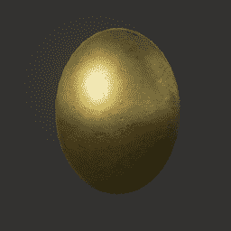
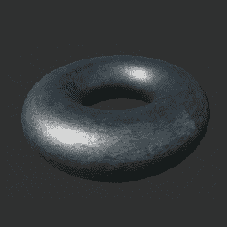
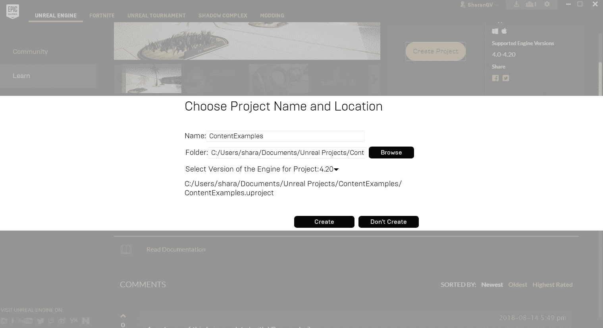
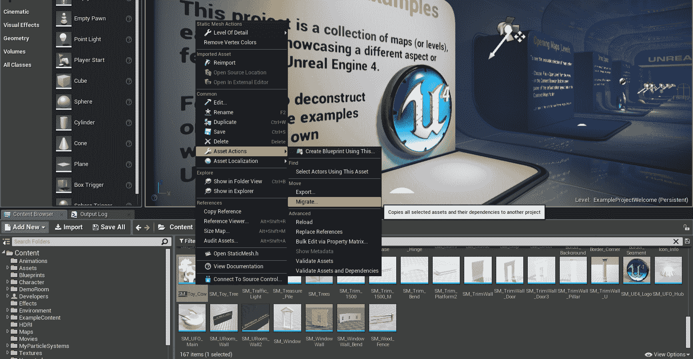
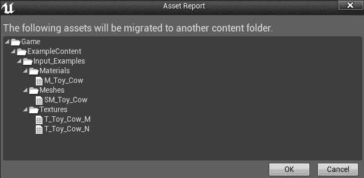
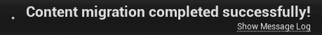
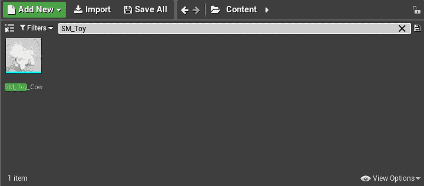
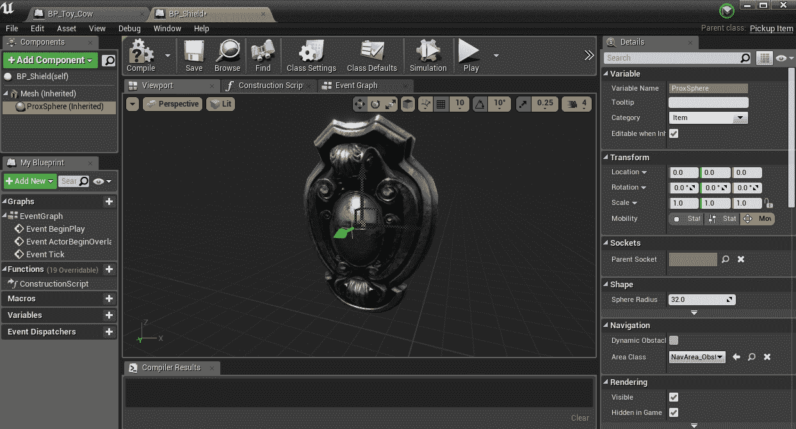
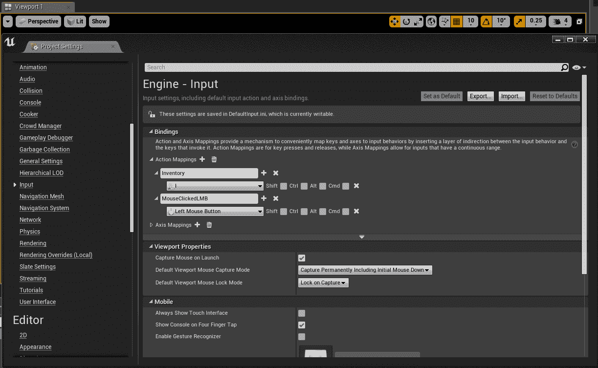

# 库存系统和提货项目

我们希望我们的玩家能够从游戏世界中挑选物品。在这一章中，我们将为我们的玩家编码和设计一个背包来存放物品。当用户按下 *I* 键时，我们将显示玩家在背包中携带的物品。

作为数据表示，我们可以使用上一章中介绍的`TMap<FString, int>`项来存储我们的项。当玩家拿起一个物品时，我们把它添加到地图上。如果该物品已经在地图中，我们只需根据新获得的物品数量增加其价值。

我们将在本章中讨论以下主题:

*   申报背包
*   PickupItem 基类
*   绘制玩家清单

# 申报背包

我们可以将玩家的背包表示为一个简单的`TMap<FString, int>`物品。为了让我们的玩家从世界上收集物品，打开`Avatar.h`文件并添加以下`TMap`声明:

```cpp
class APickupItem; //  forward declare the APickupItem class, 
                   // since it will be "mentioned" in a member  
                    function decl below 
UCLASS() 
class GOLDENEGG_API AAvatar : public ACharacter 
{ 
  GENERATED_BODY() 
public: 
  // A map for the player's backpack 
  TMap<FString, int> Backpack; 

  // The icons for the items in the backpack, lookup by string 
  TMap<FString, UTexture2D*> Icons; 

  // A flag alerting us the UI is showing 
  bool inventoryShowing; 
  // member function for letting the avatar have an item 
  void Pickup( APickupItem *item ); 
  // ... rest of Avatar.h same as before 
}; 
```

# 远期申报

在`AAvatar`课之前，注意我们有一个`class APickupItem`正向申报。当提到一个类(例如`APickupItem::Pickup( APickupItem *item );`函数原型)时，代码文件中需要正向声明，但是文件中没有实际使用文件中该类型对象的代码。由于`Avatar.h`头文件不包含使用类型为`APickupItem`的对象的可执行代码，因此我们需要一个正向声明。虽然包含. h 文件似乎更容易。有时最好避免这种情况，否则你可能会得到循环依赖(两个类，每个都试图包含另一个会导致问题)。

没有正向声明会导致编译器错误，因为编译器在`class AAvatar`中编译代码之前不会听说过`class APickupItem`。编译器错误将出现在`APickupItem::Pickup( APickupItem *item );`函数原型声明的声明中。

我们在`AAvatar`类中声明了两个`TMap`对象。这就是对象的外观，如下表所示:

| `FString`(名称) | `int`(数量) | `UTexture2D*` (im) |
| `GoldenEgg` | `2` |  |
| `MetalDonut` | `1` |  |
| `Cow` | `2` |  |

在`TMap`背包中，我们存储了玩家所持物品的`FString`变量。在`Icons`地图中，我们存储了玩家所持物品图像的单一参考。

在渲染时，我们可以使用两个地图一起工作来查找玩家拥有的物品数量(在他的`Backpack`地图中)和该物品的纹理资产参考(在`Icons`地图中)。以下截图显示了抬头显示器的渲染效果:


请注意，我们也可以使用带有`FString`变量和`UTexture2D*`的`struct`数组，而不是使用两个地图。

例如，我们可以用一个`struct`变量来保存`TArray<Item> Backpack;`，如下面的代码所示:

```cpp
struct Item   
{   
  FString name;   
  int qty;   
  UTexture2D*   tex;   
};   
```

然后，当我们拾取项目时，它们将被添加到线性阵列中。然而，计算我们背包中的每件物品的数量需要不断地重新评估，每次我们想要查看数量时都要遍历物品的数组。例如，要想知道你有多少发刷，你需要遍历整个数组。这不如使用地图有效。

# 导入资产

您可能已经注意到了前面截图中的 Cow 资产，它不是 UE4 在新项目中提供的标准资产集的一部分。为了使用 cow 资产，您需要从内容示例项目中导入 Cow。UE4 使用了一个标准的导入程序。

在下面的截图中，我已经概述了导入 Cow 资产的过程。其他资产将使用相同的方法从 UE4 中的其他项目导入。

执行以下步骤导入奶牛资产:

1.  下载并打开 UE4 的内容示例项目。在史诗游戏启动器的“学习”下找到它，如下所示:


2.  下载内容示例后，打开并点击
    创建项目:



3.  接下来，命名您将放置`ContentExamples`的文件夹，并点击创建。
4.  从库中打开你的`ContentExamples`项目。浏览项目中的可用资源，直到找到您喜欢的资源。搜索`SM_`会有所帮助，因为按照惯例，所有静态网格通常以`SM_`开头:


Assets available in the project

5.  找到您喜欢的资产后，右键单击该资产，然后单击资产操作>迁移，将其导入到项目中...：



6.  在资产报告对话框中单击确定:



7.  从项目中选择要添加 SM_Toy_Cow 文件的内容文件夹。我们将其添加到`/Documents/Unreal Projects/GoldenEgg/Content`，如下图截图所示:


8.  如果导入成功完成，您将看到以下消息:



9.  导入资产后，您将看到它显示在项目内部的资产浏览器中:



然后，您可以正常使用项目中的资产。

# 将动作映射附加到键

我们需要附上一把钥匙来激活玩家清单的显示。在 UE4 编辑器中，按照以下步骤操作:

1.  添加一个名为`Inventory`的动作映射+
2.  分配到键盘键 *I* ，如图:


3.  接下来，在`Avatar.h`文件中，添加一个需要显示玩家库存时要运行的会员功能:

```cpp
void ToggleInventory(); 
```

4.  在`Avatar.cpp`文件中，实现`ToggleInventory()`功能，如下代码所示:

```cpp
void AAvatar::ToggleInventory() 
{ 
  if( GEngine ) 
  { 
    GEngine->AddOnScreenDebugMessage( -1, 5.f, FColor::Red,  
     "Showing inventory..." ); 
  } 
} 
```

5.  然后，将`"Inventory"`动作连接到`SetupPlayerInputComponent()`中的`AAvatar::ToggleInventory()`:

```cpp
void AAvatar::SetupPlayerInputComponent(class UInputComponent*  
   InputComponent) 
{ 
 Super::SetupPlayerInputComponent(PlayerInputComponent);

    check(PlayerInputComponent);
    PlayerInputComponent->BindAction("Inventory", IE_Pressed, this,
        &AAvatar::ToggleInventory);
  // rest of SetupPlayerInputComponent same as before 
} 
```

# PickupItem 基类

我们需要在代码中定义提货项目的外观。每个拾取项目都将从一个公共基类派生。现在让我们为一个`PickupItem`类构建基类。

`PickupItem`基类应该继承自`AActor`类。类似于我们如何从 NPC 基类创建多个 NPC 蓝图，我们可以从单个`PickupItem`基类创建多个`PickupItem`蓝图，如下图所示:


The text in this screenshot is not important. this image gives you an idea of how to create multiple `PickupItem` blueprints from a single `PickupItem` base class

创建`PickupItem`类后，在 Visual Studio 中打开它的代码。

`APickupItem`类将需要相当多的成员，如下所示:

*   一个`FString`变量，用于被拾取项目的名称
*   一个`int32`变量，表示被拾取物品的数量
*   一个`USphereComponent`变量，用于要拾取的物品将与之碰撞的球体
*   一个`UStaticMeshComponent`变量来保存实际的`Mesh`
*   代表项目的图标的`UTexture2D`变量
*   平视显示器的指针(我们稍后会初始化)

`PickupItem.h`中的代码是这样的:

```cpp
// Fill out your copyright notice in the Description page of Project Settings.

#pragma once

#include "CoreMinimal.h"
#include "GameFramework/Actor.h"
#include "Components/SphereComponent.h"
#include "Components/StaticMeshComponent.h"
#include "PickupItem.generated.h"

UCLASS()
class GOLDENEGG_API APickupItem : public AActor
{
    GENERATED_BODY()

public:    
    // Sets default values for this actor's properties
    APickupItem(const FObjectInitializer& ObjectInitializer);

    // The name of the item you are getting 
    UPROPERTY(EditAnywhere, BlueprintReadWrite, Category = Item)
        FString Name;

    // How much you are getting 
    UPROPERTY(EditAnywhere, BlueprintReadWrite, Category = Item)
        int32 Quantity;

    // the sphere you collide with to pick item up 
    UPROPERTY(VisibleDefaultsOnly, BlueprintReadOnly, Category = Item)
        USphereComponent* ProxSphere;

    // The mesh of the item 
    UPROPERTY(VisibleDefaultsOnly, BlueprintReadOnly, Category = Item)
        UStaticMeshComponent* Mesh;
    // The icon that represents the object in UI/canvas 
    UPROPERTY(EditAnywhere, BlueprintReadWrite, Category = Item) 
        UTexture2D* Icon; 
    // When something comes inside ProxSphere, this function runs 
    UFUNCTION(BlueprintNativeEvent, Category = Collision) 
        void Prox(UPrimitiveComponent* OverlappedComponent, AActor* OtherActor, UPrimitiveComponent* OtherComp,
            int32 OtherBodyIndex, bool bFromSweep, const FHitResult& SweepResult);
        virtual int Prox_Implementation(UPrimitiveComponent* OverlappedComponent, AActor* OtherActor, UPrimitiveComponent* OtherComp,
        int32 OtherBodyIndex, bool bFromSweep, const FHitResult& SweepResult);

protected:
    // Called when the game starts or when spawned
    virtual void BeginPlay() override;

public:    
    // Called every frame
    virtual void Tick(float DeltaTime) override;
};
```

所有这些`UPROPERTY()`声明的目的是使`APickupItem`完全可由蓝图配置。例如，“拾取”类别中的项目将在蓝图编辑器中显示如下:


在`PickupItem.cpp`文件中，我们完成了`APickupItem`类的构造函数，如下代码所示:

```cpp
APickupItem::APickupItem(const FObjectInitializer& ObjectInitializer)
    : Super(ObjectInitializer)
{
    Name = "UNKNOWN ITEM";
    Quantity = 0;

    // initialize the unreal objects 
    ProxSphere = ObjectInitializer.CreateDefaultSubobject<USphereComponent>(this,
        TEXT("ProxSphere"));  
    Mesh = ObjectInitializer.CreateDefaultSubobject<UStaticMeshComponent>(this,
            TEXT("Mesh"));

    // make the root object the Mesh 
    RootComponent = Mesh;
    Mesh->SetSimulatePhysics(true);

    // Code to make APickupItem::Prox() run when this 
    // object's proximity sphere overlaps another actor. 
    ProxSphere->OnComponentBeginOverlap.AddDynamic(this, &APickupItem::Prox);
    ProxSphere->AttachToComponent(Mesh, FAttachmentTransformRules::KeepWorldTransform); // very important!              
}
```

在前两行中，我们将`Name`和`Quantity`初始化为游戏设计者认为未初始化的值。我们使用了大写的块，这样设计者可以清楚地看到变量以前从未被初始化过。

然后我们使用`ObjectInitializer.CreateDefaultSubobject`初始化`ProxSphere`和`Mesh`组件。新初始化的对象可能会初始化它们的一些默认值，但是`Mesh`将从空开始。稍后，您将不得不在蓝图中加载实际的网格。

对于网格，我们将其设置为模拟真实的物理，以便拾取的项目在掉落或移动时会反弹和滚动。特别注意线路`ProxSphere->AttachToComponent(Mesh, FAttachmentTransformRules::KeepWorldTransform);`。该行告诉您确保拾取项目的`ProxSphere`组件连接到`Mesh`根组件。这意味着当网格在层中移动时，`ProxSphere`跟随。如果你忘记了这一步(或者你反过来做了)，那么`ProxSphere`将不会跟随网格反弹。

# 根组件

在前面的代码中，我们将`APickupItem`的`RootComponent`分配给了`Mesh`对象。`RootComponent`成员是`AActor`基类的一部分，所以每个`AActor`及其派生都有一个根组件。根组件基本上意味着是对象的核心，并且还定义了如何与对象碰撞。`RootComponent`对象在`Actor.h`文件中定义，如下代码所示:

```cpp
/** Collision primitive that defines the transform (location, rotation, scale) of this Actor. */
    UPROPERTY(BlueprintGetter=K2_GetRootComponent, Category="Utilities|Transformation")
    USceneComponent* RootComponent;
```

所以，UE4 的创造者们希望`RootComponent`永远是碰撞原语的参考。有时碰撞图元可以是胶囊形的，有时也可以是球形的，甚至是盒形的，或者是任意形状的，就像我们的例子中的网格一样。然而，一个角色很少会有盒状的根部件，因为盒子的角会被墙壁卡住。圆形通常是首选。`RootComponent`属性显示在蓝图中，您可以在其中看到并操作它:



You can edit the ProxSphere root component from its blueprints once you create a blueprint based on the PickupItem class

最后，`Prox_Implementation`函数实现如下:

```cpp
int APickupItem::Prox_Implementation(UPrimitiveComponent* OverlappedComponent, AActor* OtherActor, UPrimitiveComponent* OtherComp,
    int32 OtherBodyIndex, bool bFromSweep, const FHitResult& SweepResult)
{
    // if the overlapped actor is NOT the player, 
    // you simply should return 
    if (Cast<AAvatar>(OtherActor) == nullptr)
    {
        return -1;
    }

    // Get a reference to the player avatar, to give him 
    // the item 
    AAvatar *avatar = Cast<AAvatar>(UGameplayStatics::GetPlayerPawn(GetWorld(), 0));

    // Let the player pick up item 
    // Notice use of keyword this! 
    // That is how _this_ Pickup can refer to itself. 
    avatar->Pickup(this);

    // Get a reference to the controller 
    APlayerController* PController = GetWorld()->GetFirstPlayerController();

    // Get a reference to the HUD from the controller 
    AMyHUD* hud = Cast<AMyHUD>(PController->GetHUD());
    hud->addMessage(Message(Icon, FString("Picked up ") + FString::FromInt(Quantity) + FString(" ") + Name, 5.f, FColor::White)
);

    Destroy();

    return 0;
}
```

此外，请确保在文件顶部添加以下内容:

```cpp
#include "Avatar.h"
#include "MyHUD.h"
#include "Kismet/GameplayStatics.h"
```

这里有几个非常重要的提示:首先，我们必须访问几个*全局*来获取我们需要的对象。我们将通过这些操纵抬头显示器的功能访问三个主要对象:

*   控制器(`APlayerController`)
*   抬头显示器(`AMyHUD`)
*   玩家本人(`AAvatar`)

在游戏实例中，这三种类型的对象中只有一种。UE4 让找到它们变得很容易。

同样，为了编译这个，你还需要在`MyHud.h`的`Message`结构中添加另一个构造函数。你需要一个这样的图像:

```cpp
Message(UTexture2D* img, FString iMessage, float iTime, FColor iColor)
    {
        tex = img;
        message = iMessage;
        time = iTime;
        color = iColor;
    }
```

要编译，还需要向结构中添加另一个变量`UTexture2D* tex;`。你还需要在头像中实现拾取功能。

# 获得头像

只需调用以下代码，就可以随时从代码中的任何位置找到`player`类对象:

```cpp
AAvatar *avatar = Cast<AAvatar>( 
  UGameplayStatics::GetPlayerPawn( GetWorld(), 0 ) ); 
```

然后我们通过调用前面定义的`AAvatar::Pickup()`函数将物品传递给玩家。

因为`PlayerPawn`对象实际上是一个`AAvatar`实例，所以我们使用`Cast<AAvatar>`命令将结果投射到`AAvatar`类。`UGameplayStatics`函数系列可以在代码中的任何地方访问，因为它们是全局函数。

# 获取播放器控制器

也可以从全局函数中检索播放器控制器:

```cpp
APlayerController* PController = 
  GetWorld()->GetFirstPlayerController(); 
```

`GetWorld()`函数实际上是在`UObject`基类中定义的。由于所有 UE4 对象都来自`UObject`，游戏中的任何对象实际上都可以访问`world`对象。

# 获取抬头显示器

虽然这个组织一开始看起来很奇怪，但 HUD 实际上是附着在玩家的控制器上的。您可以按如下方式检索抬头显示器:

```cpp
AMyHUD* hud = Cast<AMyHUD>( PController->GetHUD() ); 
```

我们投射平视显示器对象，因为我们之前在蓝图中将平视显示器设置为`AMyHUD`实例。由于我们将经常使用平视显示器，我们实际上可以在我们的`APickupItem`类中存储一个指向平视显示器的永久指针。这一点我们以后再讨论。

接下来，我们实现`AAvatar::Pickup`，它将类型为`APickupItem`的对象添加到头像的背包中:

```cpp
void AAvatar::Pickup(APickupItem *item)
{
    if (Backpack.Find(item->Name))
    {
        // the item was already in the pack.. increase qty of it 
        Backpack[item->Name] += item->Quantity;
    }
    else
    {
        // the item wasn't in the pack before, add it in now 
        Backpack.Add(item->Name, item->Quantity);
        // record ref to the tex the first time it is picked up 
        Icons.Add(item->Name, item->Icon);
    }
}
```

另外，确保在文件顶部添加`#include "PickupItem.h"`。

在前面的代码中，我们检查玩家刚刚获得的拾取物品是否已经在他的包中。如果是，我们增加它的数量。如果它不在他的包中，我们将其添加到他的包和`Icons`映射中。

要将提货物品添加到包装中，请使用以下代码行:

```cpp
avatar->Pickup( this ); 
```

`APickupItem::Prox_Implementation`是这个成员函数被调用的方式。

现在，当玩家按下 *I* 时，我们需要在 HUD 中显示我们背包的内容。

# 绘制玩家清单

游戏中的库存屏幕，如*暗黑破坏神*有一个弹出窗口，你过去拿过的物品的图标排列在一个网格中。我们可以在 UE4 中实现这种类型的行为。

在 UE4 中有许多绘制用户界面的方法。最基本的方法就是简单使用`HUD::DrawTexture()`调用。另一种方法是使用 Slate。还有一种方法就是使用最新的 UE4 UI 功能:**虚幻运动图形** ( **UMG** )设计师。

Slate 使用声明性语法来布局 C++ 中的用户界面元素。Slate 最适合菜单之类的。自 UE 4.5 以来，UMG 一直在使用大量基于蓝图的工作流程。由于我们这里的重点是使用 C++ 代码的练习，我们将坚持使用`HUD::DrawTexture()`实现，但是我们将在后面的章节中讨论 UMG。这意味着我们必须管理代码中处理库存的所有数据。

# 使用 HUD::DrawTexture()

`HUD::DrawTexture()`是此时我们将用于将库存绘制到屏幕上的内容。我们将分两步实现这一目标:

1.  当用户按下 *I* 键时，我们将库存的内容推送到平视显示器。
2.  然后，我们以类似网格的方式将图标渲染到平视显示器中。

    为了保存关于如何渲染小部件的所有信息，我们声明了一个简单的结构来保存关于它使用什么图标、它的当前位置和当前大小的信息。

    这就是`Icon`和`Widget`结构的样子:

```cpp
struct Icon 
{ 
  FString name; 
  UTexture2D* tex; 
  Icon(){ name = "UNKNOWN ICON"; tex = 0; } 
  Icon( FString& iName, UTexture2D* iTex ) 
  { 
    name = iName; 
    tex = iTex; 
  } 
}; 

struct Widget 
{ 
  Icon icon; 
  FVector2D pos, size; 
  Widget(Icon iicon) 
  { 
    icon = iicon; 
  } 
  float left(){ return pos.X; } 
  float right(){ return pos.X + size.X; } 
  float top(){ return pos.Y; } 
  float bottom(){ return pos.Y + size.Y; } 
}; 
```

您可以将这些结构声明添加到`MyHUD.h`的顶部，或者您可以将它们添加到一个单独的文件中，并在使用这些结构的任何地方包含该文件。

注意`Widget`结构上的四个成员函数，到达小部件的`left()`、`right()`、`top()`和`bottom()`函数。我们稍后将使用这些来确定点击点是否在框内。

3.  接下来，我们在`AMyHUD`类中声明将在屏幕上呈现小部件的函数。首先，在`MyHud.h`中，添加一个数组来保存小部件，添加一个向量来保存屏幕尺寸:

```cpp
    // New! An array of widgets for display 
    TArray<Widget> widgets;
    //Hold screen dimensions
    FVector2D dims;
```

4.  另外，增加一行`void DrawWidgets();`。然后，将其添加到`MyHud.cpp`:

```cpp
void AMyHUD::DrawWidgets()
{
    for (int c = 0; c < widgets.Num(); c++)
    {
        DrawTexture(widgets[c].icon.tex, widgets[c].pos.X,
            widgets[c].pos.Y, widgets[c].size.X, widgets[c].size.Y, 0, 0,
            1, 1);    DrawText(widgets[c].icon.name, FLinearColor::Yellow,
                widgets[c].pos.X, widgets[c].pos.Y, hudFont, .6f, false);
    }
}
```

5.  对`DrawWidgets()`函数的调用应该被添加到`DrawHUD()`函数中，您可能想要将当前的消息处理代码移动到一个单独的`DrawMessages`函数中，这样您就可以得到这个(或者将原始代码留在那里):

```cpp
void AMyHUD::DrawHUD()
{
    Super::DrawHUD();
    // dims only exist here in stock variable Canvas 
    // Update them so use in addWidget() 
    const FVector2D ViewportSize = FVector2D(GEngine->GameViewport->Viewport->GetSizeXY());
    dims.X = ViewportSize.X;
    dims.Y = ViewportSize.Y;
    DrawMessages();
    DrawWidgets();
}
```

6.  接下来，我们将填充`ToggleInventory()`功能。这是用户按下 *I* 时运行的功能:

```cpp
void AAvatar::ToggleInventory()
{
    // Get the controller & hud 
    APlayerController* PController = GetWorld()->GetFirstPlayerController();
    AMyHUD* hud = Cast<AMyHUD>(PController->GetHUD());

    // If inventory is displayed, undisplay it. 
    if (inventoryShowing)
    {
        hud->clearWidgets();
        inventoryShowing = false;
        PController->bShowMouseCursor = false;
        return;
    }

    // Otherwise, display the player's inventory 
    inventoryShowing = true;
    PController->bShowMouseCursor = true;
    for (TMap<FString, int>::TIterator it =
        Backpack.CreateIterator(); it; ++ it)
    {
        // Combine string name of the item, with qty eg Cow x 5 
        FString fs = it->Key + FString::Printf(TEXT(" x %d"), it->Value);
        UTexture2D* tex;
        if (Icons.Find(it->Key))
        {
            tex = Icons[it->Key];
            hud->addWidget(Widget(Icon(fs, tex)));
        }    
    }
}
```

7.  对于前面要编译的代码，我们需要给`AMyHUD`增加两个函数:

```cpp
void AMyHUD::addWidget( Widget widget ) 
{ 
  // find the pos of the widget based on the grid. 
  // draw the icons.. 
  FVector2D start( 200, 200 ), pad( 12, 12 ); 
  widget.size = FVector2D( 100, 100 ); 
  widget.pos = start; 
  // compute the position here 
  for( int c = 0; c < widgets.Num(); c++ ) 
  { 
    // Move the position to the right a bit. 
    widget.pos.X += widget.size.X + pad.X; 
    // If there is no more room to the right then 
    // jump to the next line 
    if( widget.pos.X + widget.size.X > dims.X ) 
    { 
      widget.pos.X = start.X; 
      widget.pos.Y += widget.size.Y + pad.Y; 
    } 
  } 
  widgets.Add( widget ); 
} 

void AMyHUD::clearWidgets()
{
    widgets.Empty();
}
```

确保将以下内容也添加到`.h`文件中:

```cpp
    void clearWidgets();
    void addWidget(Widget widget);
```

8.  我们一直使用`inventoryShowing`中的`Boolean`变量来告诉我们库存当前是否显示。当显示清单时，我们还会显示鼠标，以便用户知道他在点击什么。此外，当清单被显示时，玩家的自由运动被禁止。禁用玩家自由移动的最简单方法是在实际移动之前简单地从移动功能返回。以下代码是一个示例:

```cpp
void AAvatar::Yaw( float amount ) 
{ 
  if( inventoryShowing ) 
  { 
    return; // when my inventory is showing, 
    // player can't move 
  } 
  AddControllerYawInput(200.f*amount * GetWorld()- 
   >GetDeltaSeconds()); 
} 
```

# 锻炼

将`if( inventoryShowing ) { return; }`添加到每个移动功能中，这样当库存显示时，它将阻止所有移动。

# 检测库存项目点击

我们可以通过做一个简单的测试来检测是否有人在点击我们的库存物品，看看该点是否在物体的`rect`(矩形)内。该测试通过对照包含您想要测试的区域的`rect`的内容检查点击点来完成。

为了对照`rect`进行检查，在`struct Widget`中增加以下成员功能:

```cpp
struct Widget 
{ 
  // .. rest of struct same as before .. 
  bool hit( FVector2D p ) 
  { 
    // +---+ top (0) 
    // |   | 
    // +---+ bottom (2) (bottom > top) 
    // L   R 
    return p.X > left() && p.X < right() && p.Y > top() && p.Y <  
     bottom(); 
  } 
}; 
```

对`rect`的测试如下:


所以，如果`p.X`全是:

*   `left() (p.X > left())`右侧
*   `right() (p.X < right())`左侧
*   下方`top() (p.Y > top())`
*   以上`bottom() (p.Y < bottom())`

请记住，在 UE4 中(以及一般的 UI 渲染中)， *y* 轴是倒置的。换句话说，y 在 UE4 中下降。这意味着`top()`小于`bottom()`，因为原点(`(0, 0)`点)在屏幕的左上角。

# 拖动元素

我们可以轻松拖动元素:

1.  启用拖动的第一步是响应鼠标左键单击。首先，我们将编写单击鼠标左键时要执行的函数。在`Avatar.h`文件中，将以下原型添加到类声明中:

```cpp
void MouseClicked();
```

2.  在`Avatar.cpp`文件中，我们可以添加一个在鼠标点击时执行的功能，并将点击请求传递给 HUD，如下所示:

```cpp
void AAvatar::MouseClicked() 
{ 
  APlayerController* PController = GetWorld()- 
   >GetFirstPlayerController(); 
  AMyHUD* hud = Cast<AMyHUD>( PController->GetHUD() ); 
  hud->MouseClicked(); 
} 
```

3.  然后，在`AAvatar::SetupPlayerInputComponent`中，我们必须附上我们的应答者:

```cpp
PlayerInputComponent->BindAction( "MouseClickedLMB", IE_Pressed, this, &AAvatar::MouseClicked );
```

下面的截图显示了如何设置绑定:



4.  向`AMyHUD`类添加一个成员，加上两个新的函数定义:

```cpp
    Widget* heldWidget;  // hold the last touched Widget in memory 

    void MouseClicked();
    void MouseMoved();
```

5.  接下来，在`AMyHUD::MouseClicked()`中，我们开始搜索`Widget`命中:

```cpp
void AMyHUD::MouseClicked()
{
    FVector2D mouse;
    APlayerController* PController = GetWorld()->GetFirstPlayerController();
    PController->GetMousePosition(mouse.X, mouse.Y);
    heldWidget = NULL; // clear handle on last held widget 
                       // go and see if mouse xy click pos hits any widgets 
    for (int c = 0; c < widgets.Num(); c++)
    {
        if (widgets[c].hit(mouse))
        {
            heldWidget = &widgets[c];// save widget 
            return;                  // stop checking 
        }
    }
}
```

6.  在`AMyHUD::MouseClicked`功能中，我们遍历屏幕上的所有小部件，并检查当前鼠标位置是否命中。只需查阅`PController->GetMousePosition()`，即可随时从控制器获取当前鼠标位置。
7.  每个小部件都根据当前的鼠标位置进行检查，一旦鼠标被拖动，被鼠标点击的小部件就会被移动。一旦我们确定了哪个小部件被击中，我们就可以停止检查了，因此我们有了来自`MouseClicked()`函数的`return`值。
8.  然而，点击小部件是不够的。我们需要拖动鼠标移动时被击中的小部件。为此，我们需要在`AMyHUD`中实现一个`MouseMoved()`功能:

```cpp
void AMyHUD::MouseMoved()
{
    static FVector2D lastMouse;
    FVector2D thisMouse, dMouse;
    APlayerController* PController = GetWorld()->GetFirstPlayerController();
    PController->GetMousePosition(thisMouse.X, thisMouse.Y);
    dMouse = thisMouse - lastMouse;
    // See if the left mouse has been held down for 
    // more than 0 seconds. if it has been held down, 
    // then the drag can commence. 
    float time = PController->GetInputKeyTimeDown(
        EKeys::LeftMouseButton);
    if (time > 0.f && heldWidget)
    {
        // the mouse is being held down. 
        // move the widget by displacement amt 
        heldWidget->pos.X += dMouse.X;
        heldWidget->pos.Y += dMouse.Y; // y inverted 
    }
    lastMouse = thisMouse;
}
```

拖动功能查看最后一帧和此帧之间的鼠标位置差异，并将选定的小部件移动该量。一个`static`变量(具有局部范围的全局变量)用于记住`MouseMoved()`函数调用之间的`lastMouse`位置。

如何将鼠标的运动与运行`AMyHUD`中的`MouseMoved()`功能联系起来？如果你记得的话，我们已经在`Avatar`课上把鼠标运动联系起来了。我们使用的两个函数是:

*   `AAvatar::Pitch()`(y 轴)
*   `AAvatar::Yaw()`(x 轴)

扩展这些功能将使您能够将鼠标输入传递到抬头显示器。我现在将向您展示`Yaw`功能，您可以从那里推断`Pitch`将如何工作:

```cpp
void AAvatar::Yaw( float amount ) 
{ 
  //x axis 
  if( inventoryShowing ) 
  { 
    // When the inventory is showing, 
    // pass the input to the HUD 
    APlayerController* PController = GetWorld()- 
     >GetFirstPlayerController(); 
    AMyHUD* hud = Cast<AMyHUD>( PController->GetHUD() ); 
    hud->MouseMoved(); 
    return; 
  } 
  else 
  { 
    AddControllerYawInput(200.f*amount * GetWorld()- 
     >GetDeltaSeconds()); 
  } 
} 
```

`AAvatar::Yaw()`功能首先检查库存是否显示。如果显示，输入将直接发送到抬头显示器，不会影响`Avatar`。如果抬头显示器没有显示，输入直接进入`Avatar`。

确保您在文件顶部添加了`#include "MyHUD.h"`以使其生效。

# 练习

1.  完成`AAvatar::Pitch()`功能(y 轴)，将输入发送到抬头显示器，而不是`Avatar`。
2.  取[第八章](08.html)*演员和棋子*中的 NPC 角色，在玩家靠近时给其一个物品(如`GoldenEgg`)。

# 把东西放在一起

现在您已经有了所有这些代码，您将希望把它们放在一起，并看到它工作。使用您复制的网格来创建新的蓝图，方法是在类查看器中右键单击`PickupItem`类，然后选择创建蓝图类，就像我们之前所做的那样。设置值(包括网格)，然后将对象拖到游戏中。当你走进它们时，你会得到一个信息，它被捡起来了。届时，您可以点击 *I* 查看您的库存。

# 摘要

在这一章中，我们讲述了如何设置多个拾取项目，让玩家看到显示在关卡中，并且也拾取。我们还在屏幕上显示它们，并添加了拖动小部件的功能。在[第 11 章](11.html)*怪物*中，我们将介绍怪物以及如何让它们跟随并攻击玩家。