# 怪物

在本章中，我们将为玩家添加对手。我们将创建一个新的场景来漫游，当怪物足够接近玩家时，它们会开始向玩家走来。一旦他们进入玩家的范围内，他们也会攻击，给你一些基本的游戏玩法。

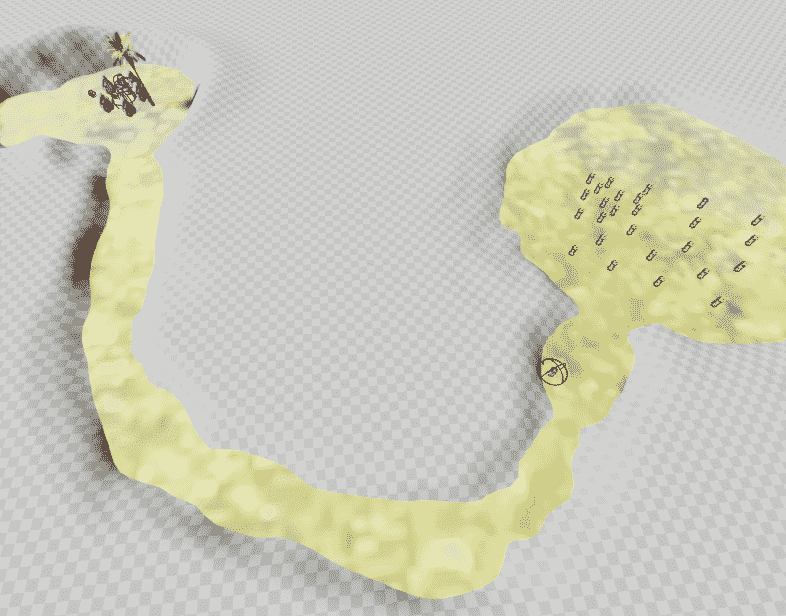

Let's take a look at the topics covered in this chapter:

*   风景
*   创造怪物
*   怪物攻击玩家

# 风景

我们还没有在这本书里讨论如何雕刻风景，所以我们将在这里讨论。首先，你必须有一个工作环境。为此，请遵循以下步骤:

1.  导航到文件|新级别，开始一个新文件....可以选择空的关卡或者有天空的关卡。在这个例子中，我选择了没有天空的那个。
2.  要创建一个景观，我们必须从模式面板工作。通过导航到窗口|模式，确保显示模式面板:

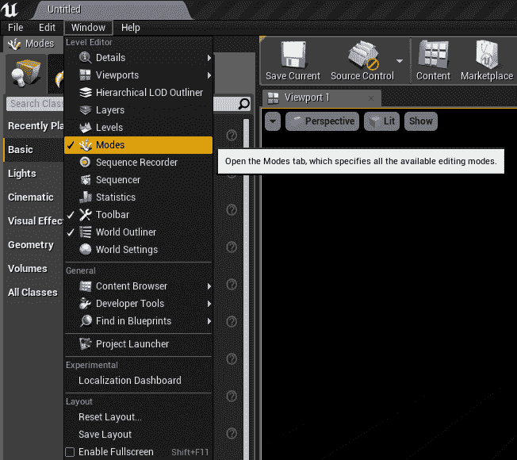

3.  风景可以分三步创建，如下图所示:

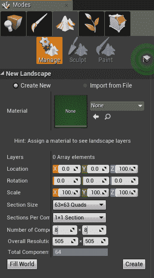

这三个步骤如下:

4.  你现在应该有一个可以工作的环境了。它将在主窗口中显示为灰色平铺区域:

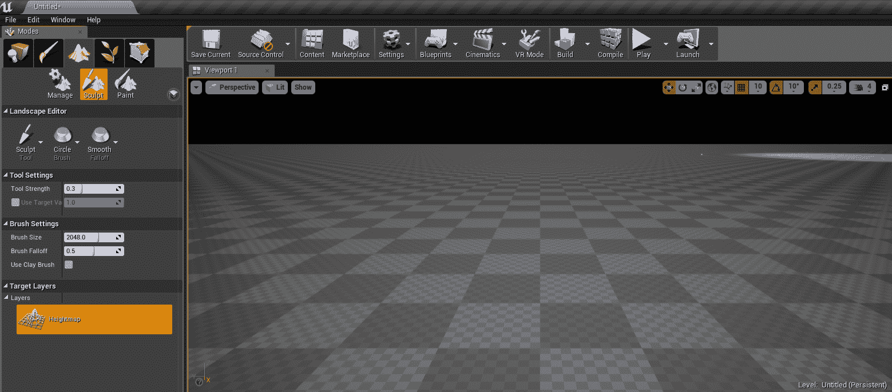

你要做的第一件事就是给你的风景添加一些颜色。没有颜色的风景是什么？

5.  单击灰色平铺景观对象上的任意位置。在右侧的“详细信息”面板中，您将看到其中填充了信息，如下图所示:

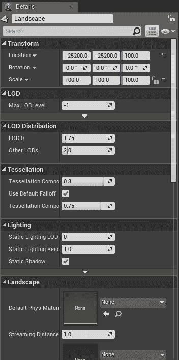

6.  向下滚动，直到看到“风景材质”属性。您可以为逼真的地面选择“地面草”材质。
7.  为场景添加灯光。你可能应该使用一个方向灯，这样所有的地面上都有一些光。我们在[第 8 章](08.html)、*演员和棋子*中讨论了如何做到这一点。

# 雕刻风景

平坦的风景可能很无聊。我们至少应该给这个地方增加一些曲线和山丘。为此，请执行以下步骤:

1.  单击“模式”面板中的“雕刻”按钮:

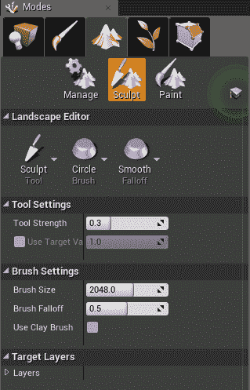

笔刷的强度和大小由“模式”窗口中的“笔刷大小”和“工具强度”参数决定。

2.  点击你的风景，拖动鼠标改变草坪的高度。
3.  一旦你对你所拥有的感到满意，点击“播放”按钮进行尝试。结果输出可以在下面的截图中看到:

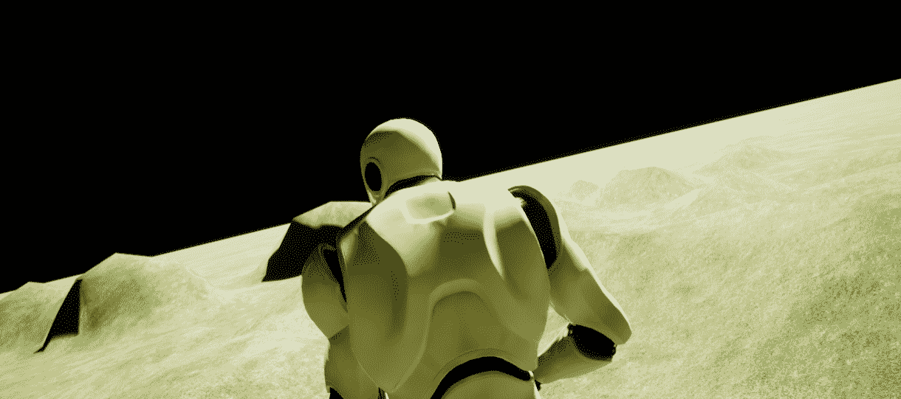

4.  玩转你的风景，创造一个场景。我所做的是降低一个平坦地面周围的景观，这样玩家就有一个清晰的平坦区域可以行走，如下面的截图所示:

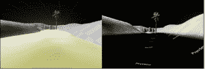

随意对你的风景做任何你喜欢的事情。如果你愿意，你可以用我在这里做的事情作为灵感。

I recommend that you import assets from ContentExamples or from StrategyGame so that you can use them inside your game. To do this, refer to the *Importing assets* section in [Chapter 10](10.html), *Inventory System and Pickup Items*. When you're done importing assets, we can proceed to bringing monsters into our world.

# 创造怪物

我们将像编程 NPC 和`PickupItem`一样开始编程怪物。我们将编写一个基类(通过从字符派生)来表示`Monster`类，然后为每个怪物类型派生一堆蓝图。每个怪物都有几个共同的属性来决定它的行为。以下是常见属性:

*   它将有一个`float`速度变量。
*   它将有一个`HitPoints`值的`float`变量(我通常使用浮动来表示惠普，所以我们可以很容易地模拟惠普的背风效果，比如穿过熔岩池)。
*   它会有一个`int32`变量来表示击败怪物的经验。
*   它会对怪物掉落的战利品有`UClass`功能。
*   对于每次攻击完成的`BaseAttackDamage`，它将有一个`float`变量。
*   它将有一个`AttackTimeout`的`float`变量，这是怪物在攻击之间休息的时间
*   它会有两个`USphereComponents`物体:其中一个是`SightSphere`——怪物能看多远。另一个是`AttackRangeSphere`，这就是它的攻击范围。`AttackRangeSphere`物体总是比`SightSphere`小。

请遵循以下步骤:

1.  从`Character`类派生，为`Monster`创建你的类。您可以在 UE4 中通过转到文件|新的 C++ 类来做到这一点...然后从基类的菜单中选择字符选项。
2.  用基本属性填写`Monster`类。
3.  一定要声明`UPROPERTY(EditAnywhere, BlueprintReadWrite, Category = MonsterProperties)`，这样怪物的属性就可以在蓝图中改变了。这是你在`Monster.h`应该有的:

```cpp
#pragma once

#include "CoreMinimal.h"
#include "GameFramework/Character.h"
#include "Components/SphereComponent.h"
#include "Monster.generated.h"

UCLASS()
class GOLDENEGG_API AMonster : public ACharacter
{
    GENERATED_BODY()
public:
    AMonster(const FObjectInitializer& ObjectInitializer);

        // How fast he is 
        UPROPERTY(EditAnywhere, BlueprintReadWrite, Category =
            MonsterProperties)
        float Speed;

    // The hitpoints the monster has 
    UPROPERTY(EditAnywhere, BlueprintReadWrite, Category =
        MonsterProperties)
        float HitPoints;

    // Experience gained for defeating 
    UPROPERTY(EditAnywhere, BlueprintReadWrite, Category =
        MonsterProperties)
        int32 Experience;

    // Blueprint of the type of item dropped by the monster 
    UPROPERTY(EditAnywhere, BlueprintReadWrite, Category =
        MonsterProperties)
        UClass* BPLoot;

    // The amount of damage attacks do 
    UPROPERTY(EditAnywhere, BlueprintReadWrite, Category =
        MonsterProperties)
        float BaseAttackDamage;

    // Amount of time the monster needs to rest in seconds 
    // between attacking 
    UPROPERTY(EditAnywhere, BlueprintReadWrite, Category =
        MonsterProperties)
        float AttackTimeout;

    // Time since monster's last strike, readable in blueprints 
    UPROPERTY(VisibleAnywhere, BlueprintReadOnly, Category =
        MonsterProperties)
        float TimeSinceLastStrike;

    // Range for his sight 
    UPROPERTY(VisibleDefaultsOnly, BlueprintReadOnly, Category =
        Collision)
        USph.ereComponent* SightSphere;

    // Range for his attack. Visualizes as a sphere in editor, 
    UPROPERTY(VisibleDefaultsOnly, BlueprintReadOnly, Category =
        Collision)
        USphereComponent* AttackRangeSphere;
};
```

4.  在你的`Monster`构造函数中，你需要一些最少的代码来初始化怪物的属性。在`Monster.cpp`文件中使用以下代码(这将替换默认构造函数):

```cpp
AMonster::AMonster(const FObjectInitializer& ObjectInitializer)
 : Super(ObjectInitializer)
{
 Speed = 20;
 HitPoints = 20;
 Experience = 0;
 BPLoot = NULL;
 BaseAttackDamage = 1;
 AttackTimeout = 1.5f;
 TimeSinceLastStrike = 0;

 SightSphere = ObjectInitializer.CreateDefaultSubobject<USphereComponent>
 (this, TEXT("SightSphere"));
 SightSphere->AttachToComponent(RootComponent, FAttachmentTransformRules::KeepWorldTransform);

 AttackRangeSphere = ObjectInitializer.CreateDefaultSubobject
 <USphereComponent>(this, TEXT("AttackRangeSphere"));
 AttackRangeSphere->AttachToComponent(RootComponent, FAttachmentTransformRules::KeepWorldTransform);
}
```

5.  编译并运行代码。
6.  打开虚幻编辑器，根据你的`Monster`类导出一个蓝图(称之为`BP_Monster`)。
7.  现在，我们可以开始配置我们怪物的`Monster`属性了。对于骨骼网格，我们不会对怪物使用相同的模型，因为我们需要怪物能够进行近战攻击，并且相同的模型不会附带近战攻击。然而，Mixamo 动画包文件中的一些模型有近战攻击动画。

8.  所以，从 UE4 市场下载 Mixamo 动画包文件(免费):


包里面有一些我会避免的很恶心的模型，但是其他的都很好。

9.  您应该将 Mixamo 动画包文件添加到您的项目中。它有一段时间没有更新了，但是您可以通过选中“显示所有项目”并从下拉列表中选择 4.10 版本来添加它，如下图所示:


10.  编辑`BP_Monster`蓝图的类属性，选择 Mixamo_Adam(在当前一期的包中实际上是键入 Maximo_Adam)作为骨架网格。确保将其与胶囊组件对齐。另外，选择 MixamoAnimBP_Adam 作为动画蓝图:


稍后我们将修改动画蓝图，以正确合并近战攻击动画。

While you're editing your `BP_Monster` blueprint, change the sizes of the `SightSphere` and `AttackRangeSphere` objects to values that make sense to you. I made my monster's `AttackRangeSphere` object just big enough to be about an arm's reach (60 units) and his `SightSphere` object to be 25 times bigger than that (about 1,500 units).

请记住，怪物一旦进入玩家的`SightSphere`就会开始向玩家移动，一旦进入怪物的`AttackRangeSphere`物体内部，怪物就会开始攻击玩家:

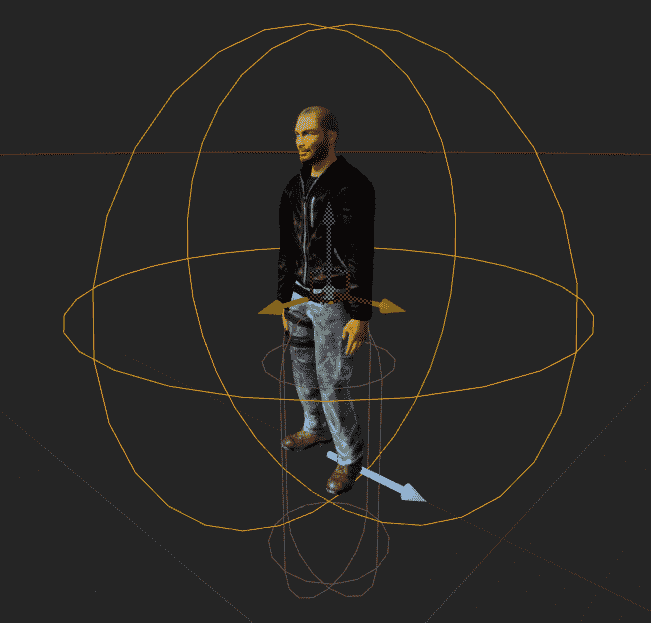

在你的游戏中放置一些你的`BP_Monster`实例；编译并运行。没有任何代码驱动`Monster`角色移动，你的怪物应该只是站在那里无所事事。

# 基本怪物智能

在我们的游戏中，我们将只给`Monster`角色添加基本智力。怪物会知道如何做两件基本的事情:

*   跟踪玩家，跟着他
*   攻击玩家

怪物不会做其他任何事情。当玩家第一次被看到的时候，你可以让怪物嘲讽玩家，但是我们会留给你一个练习。

# 移动怪物-转向行为

非常基础的游戏中的怪物通常不会有复杂的动作行为。通常，他们只是走向目标并攻击它。我们将在这个游戏中编程这种类型的怪物，但是你可以得到更有趣的游戏，怪物可以在地形上有利地定位自己来执行远程攻击等等。我们不会在这里编程，但这是需要考虑的事情。

为了让`Monster`角色向玩家移动，我们需要在每一帧动态更新`Monster`角色移动的方向。为了更新怪物面对的方向，我们用`Monster::Tick()`方法编写代码。

`Tick`功能运行在游戏的每一帧。`Tick`功能的签名如下:

```cpp
virtual void Tick(float DeltaSeconds) override; 
```

您需要将这个函数的原型添加到您的`Monster.h`文件中的`AMonster`类中。如果我们覆盖`Tick`，我们可以在每一帧中放置`Monster`角色应该做的自定义行为。以下是一些基本代码，可以在每一帧中将怪物移向玩家:

```cpp
void AMonster::Tick(float DeltaSeconds) {
    Super::Tick(DeltaSeconds); 

    //basic intel : move the monster towards the player 
    AAvatar *avatar = Cast<AAvatar>(
            UGameplayStatics::GetPlayerPawn(GetWorld(), 0)); 
    if (!avatar) return;
    FVector toPlayer = avatar->GetActorLocation() - GetActorLocation(); 
    toPlayer.Normalize(); // reduce to unit vector 
                        // Actually move the monster towards the player a bit
    AddMovementInput(toPlayer, Speed*DeltaSeconds); // At least face the target
    // Gets you the rotator to turn something // that looks in the `toPlayer`direction 
    FRotator toPlayerRotation = toPlayer.Rotation();
    toPlayerRotation.Pitch = 0; // 0 off the pitch
    RootComponent->SetWorldRotation(toPlayerRotation);
}
```

您还必须在文件顶部添加以下内容:

```cpp
#include "Avatar.h"

#include "Kismet/GameplayStatics.h"
```

要使`AddMovementInput`工作，您必须在蓝图中的“控制器类”面板下选择一个控制器，如下图所示:


如果选择了`None`，对`AddMovementInput`的调用不会有任何影响。为防止这种情况，请选择`AIController`类或`PlayerController`类作为您的管理员类。确保你对地图上的每个怪物都进行了检查。

前面的代码非常简单。它包含了敌人情报的最基本形式——在每一帧中向玩家移动一点点:


If your monsters are facing away from the player, try changing the rotation of the mesh -90 degrees in the Z direction.

结果，在一系列的帧之后，怪物会在关卡周围跟踪玩家。要理解这是如何工作的，你必须记住`Tick`函数平均每秒被调用大约 60 次。这意味着，在每一帧中，怪物都会向玩家靠近一点。由于怪物的移动步伐非常小，所以它的动作看起来流畅而连续(而在现实中，它在每一帧中都在进行小的跳跃和跳跃):


Discrete nature of tracking—a monster's motion over three superimposed frames The reason why the monster moves about 60 times a second is because of a hardware constraint. The refresh rate of a typical monitor is 60 Hz, so it acts as a practical limiter on how many updates per second are useful. Updating at a frame rate faster than the refresh rate is possible, but it is not necessarily useful for games since you will only see a new picture once every 1/60 of a second on most hardware. Some advanced physics modeling simulations do almost 1,000 updates a second, but arguably, you don't need that kind of resolution for a game and you should reserve the extra CPU time for something that the player will enjoy instead, such as better AI algorithms. Some newer hardware boasts of a refresh rate of up to 120 Hz (look up gaming monitors, but don't tell your parents I asked you to blow all your money on one).

# 怪物运动的离散性

电脑游戏本质上是离散的。在前面的叠加帧序列截图中，玩家被视为以微小的步伐在屏幕上直线移动。怪物的动作也是在小步前进。在每一帧中，怪物向玩家迈出一小步。怪物正沿着一条明显弯曲的路径，直接朝着玩家在每一帧中的位置移动。

要将怪物移向玩家，请执行以下步骤:

1.  我们必须得到玩家的位置。由于玩家可以在全局函数`UGameplayStatics::GetPlayerPawn`中访问，我们只需使用该函数检索指向玩家的指针。
2.  我们从指向玩家(`avatar->GetActorLocation()`)的`Monster`函数(`GetActorLocation()`)中找到指向向量。
3.  我们需要找到从怪物指向化身的向量。为此，您必须从头像的位置减去怪物的位置，如下图所示:

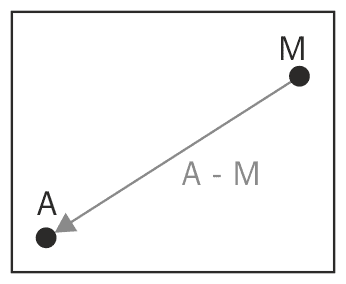

这是一个简单的数学规则要记住，但往往容易出错。为了得到正确的向量，总是从目标(终点)向量中减去源(起点)向量。在我们的系统中，我们必须从`Avatar`向量中减去`Monster`向量。这是因为从系统中减去`Monster`矢量会将`Monster`矢量移动到原点，而`Avatar`矢量会移动到`Monster`矢量的左下角:

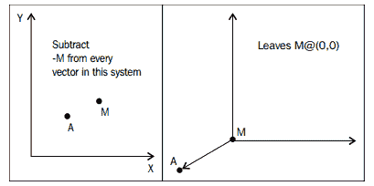

请务必试用您的代码。此时，怪物会向你的玩家跑来，并挤在他周围。有了前面概述的代码，它们就不会攻击了；他们会一直跟着他，如下图所示:


# 怪物视界

现在，怪物们没有注意`SightSphere`组件。也就是说，玩家在世界上的任何地方，怪物都会在当前设置中向他移动。我们现在想改变这种状况。

为此，我们所要做的就是让`Monster`尊重`SightSphere`的限制。如果玩家在怪物的`SightSphere`对象里面，怪物就会追击。否则，怪物会对玩家的位置浑然不觉，不会追击玩家。

检查一个物体是否在球体内部很简单。在下面的截图中，如果 **p** 和中心 **c** 之间的距离 **d** 小于球体半径 **r** ，则点 **p** 在球体内部:

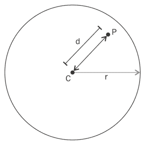

P is inside the sphere when d is less than r

因此，在我们的代码中，前面的截图可以翻译为以下内容:

```cpp
void AMonster::Tick(float DeltaSeconds) 
{ 
  Super::Tick( DeltaSeconds ); 
  AAvatar *avatar = Cast<AAvatar>(  
   UGameplayStatics::GetPlayerPawn(GetWorld(), 0) ); 
  if( !avatar ) return; 
    FVector toPlayer = avatar->GetActorLocation() -  
     GetActorLocation(); 
  float distanceToPlayer = toPlayer.Size(); 
  // If the player is not in the SightSphere of the monster, 
  // go back 
  if( distanceToPlayer > SightSphere->GetScaledSphereRadius() ) 
  { 
    // If the player is out of sight, 
    // then the enemy cannot chase 
    return; 
  } 

  toPlayer /= distanceToPlayer;  // normalizes the vector 
  // Actually move the monster towards the player a bit 
  AddMovementInput(toPlayer, Speed*DeltaSeconds); 
  // (rest of function same as before (rotation)) 
} 
```

前面的代码为`Monster`字符增加了额外的智能。如果玩家在怪物的`SightSphere`对象之外，那么`Monster`角色现在可以停止追逐玩家。结果是这样的:

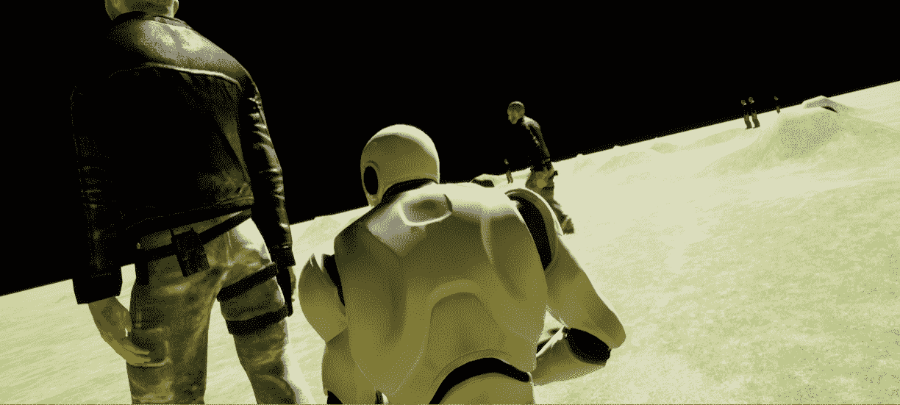

这里要做的一件好事是将距离比较打包成一个简单的内联函数。我们可以在`Monster`头中提供这两个内联成员函数，如下所示:

```cpp
inline bool isInSightRange( float d ) 
{ return d < SightSphere->GetScaledSphereRadius(); } 
inline bool isInAttackRange( float d ) 
{ return d < AttackRangeSphere->GetScaledSphereRadius(); } 
```

当传递的参数`d`在所讨论的球体内部时，这些函数返回值`true`。

An inline function means that the function is more like a macro than a function. Macros are copied and pasted to the calling location, while functions are jumped to by C++ and executed at their location. Inline functions are good because they give good performance while keeping the code easy to read. They are reusable.

# 怪物攻击玩家

怪物可以进行几种不同类型的攻击。根据`Monster`角色的类型，怪物的攻击可能是近战(近距离)或远程(投射武器)。

每当玩家处于其`AttackRangeSphere`对象中时，`Monster`角色就会攻击玩家。如果玩家不在怪物的`AttackRangeSphere`对象的范围内，但是玩家在怪物的`SightSphere`对象中，那么怪物会向玩家靠近，直到玩家在怪物的`AttackRangeSphere`对象中。

# 近战攻击

*混战*的字典定义是一大群迷茫的人。近战攻击是在近距离进行的攻击。想象一群*小狗*与一群*雷兽*搏斗(如果你是星际争霸玩家，你会知道小狗和雷兽都是近战单位)。近战攻击基本都是近距离、肉搏战。要进行近战攻击，你需要一个近战攻击动画，在怪物开始近战攻击时开启。为此，您需要在 UE4 的动画编辑器中编辑动画蓝图。

Zak Parrish's series is an excellent place to get started with programming animations in blueprints: [https://www.youtube.com/watch?v=AqYmC2wn7Cg&list=PL6VDVOqa_mdNW6JEu9UAS_s40OCD_u6yp&index=8](https://www.youtube.com/watch?v=AqYmC2wn7Cg&list=PL6VDVOqa_mdNW6JEu9UAS_s40OCD_u6yp&index=8).

现在，我们将只对近战攻击进行编程，然后担心以后会修改蓝图中的动画。

# 定义近战武器

将有三个部分来定义我们的近战武器。它们如下:

*   表示它的 C++ 代码
*   模型
*   将代码和模型连接在一起的 UE4 蓝图

# C++ 中近战武器的编码

我们将定义一个新的类`AMeleeWeapon`(源自`AActor`)，来表示手持战斗武器(你现在可能已经想通了，A 会自动添加到你使用的名称中)。我将为`AMeleeWeapon`类附加几个蓝图可编辑的属性，并且`AMeleeWeapon`类将如下代码所示:

```cpp
#include "CoreMinimal.h"
#include "GameFramework/Actor.h"
#include "Components/BoxComponent.h"
#include "MeleeWeapon.generated.h"

class AMonster;

UCLASS()
class GOLDENEGG_API AMeleeWeapon : public AActor
{
    GENERATED_BODY()

public:
    AMeleeWeapon(const FObjectInitializer& ObjectInitializer);

    // The amount of damage attacks by this weapon do 
    UPROPERTY(EditAnywhere, BlueprintReadWrite, Category =
        MeleeWeapon)
        float AttackDamage;

    // A list of things the melee weapon already hit this swing 
    // Ensures each thing sword passes thru only gets hit once 
    TArray<AActor*> ThingsHit;

    // prevents damage from occurring in frames where 
    // the sword is not swinging 
    bool Swinging;

    // "Stop hitting yourself" - used to check if the  
    // actor holding the weapon is hitting himself 
    AMonster *WeaponHolder;

    // bounding box that determines when melee weapon hit 
    UPROPERTY(VisibleDefaultsOnly, BlueprintReadOnly, Category =
        MeleeWeapon)
        UBoxComponent* ProxBox;

    UPROPERTY(VisibleDefaultsOnly, BlueprintReadOnly, Category =
        MeleeWeapon)
        UStaticMeshComponent* Mesh;

    UFUNCTION(BlueprintNativeEvent, Category = Collision)
        void Prox(UPrimitiveComponent* OverlappedComponent, AActor* OtherActor, UPrimitiveComponent* OtherComp,
            int32 OtherBodyIndex, bool bFromSweep, const FHitResult& SweepResult);

    // You shouldn't need this unless you get a compiler error that it can't find this function.
    virtual int Prox_Implementation(UPrimitiveComponent* OverlappedComponent, AActor* OtherActor, UPrimitiveComponent* OtherComp,
        int32 OtherBodyIndex, bool bFromSweep, const FHitResult& SweepResult);

    void Swing();
    void Rest();
};
```

请注意我是如何为`ProxBox`使用边界框而不是边界球的。这是因为剑和斧更接近于盒子而不是球体。有两个成员功能，`Rest()`和`Swing()`，让`MeleeWeapon`知道演员处于什么状态(休息还是摇摆)。这个职业中还有一个`TArray<AActor*> ThingsHit`属性，可以记录每次挥杆时被近战武器击中的演员。我们正在对它进行编程，这样武器每次挥杆只能击中一个物体。

`AMeleeWeapon.cpp`文件将只包含一个基本的构造函数和一些简单的代码，当我们的剑击中它时，会向`OtherActor`发送伤害。我们还将实现`Rest()`和`Swing()`功能来清除命中的事物列表。`MeleeWeapon.cpp`文件有以下代码:

```cpp
#include "MeleeWeapon.h"
#include "Monster.h"

AMeleeWeapon::AMeleeWeapon(const FObjectInitializer& ObjectInitializer)
    : Super(ObjectInitializer)
{
    AttackDamage = 1;
    Swinging = false;
    WeaponHolder = NULL;

    Mesh = ObjectInitializer.CreateDefaultSubobject<UStaticMeshComponent>(this,
        TEXT("Mesh"));
    RootComponent = Mesh;

    ProxBox = ObjectInitializer.CreateDefaultSubobject<UBoxComponent>(this,
        TEXT("ProxBox"));  
    ProxBox->OnComponentBeginOverlap.AddDynamic(this,
            &AMeleeWeapon::Prox);
    ProxBox->AttachToComponent(RootComponent, FAttachmentTransformRules::KeepWorldTransform);
}

int AMeleeWeapon::Prox_Implementation(UPrimitiveComponent* OverlappedComponent, AActor* OtherActor, UPrimitiveComponent* OtherComp,
    int32 OtherBodyIndex, bool bFromSweep, const FHitResult& SweepResult)
{
    // don't hit non root components 
    if (OtherComp != OtherActor->GetRootComponent())
    {
        return -1;
    }

    // avoid hitting things while sword isn't swinging, 
    // avoid hitting yourself, and 
    // avoid hitting the same OtherActor twice 
    if (Swinging && OtherActor != (AActor *) WeaponHolder &&
        !ThingsHit.Contains(OtherActor))
    {
        OtherActor->TakeDamage(AttackDamage + WeaponHolder->BaseAttackDamage, FDamageEvent(), NULL, this);
        ThingsHit.Add(OtherActor);
    }

    return 0;
}

void AMeleeWeapon::Swing()
{
    ThingsHit.Empty();  // empty the list 
    Swinging = true;
}

void AMeleeWeapon::Rest()
{
    ThingsHit.Empty();
    Swinging = false;
}
```

# 下载剑

为了完成这个练习，我们需要一把剑放入模型的手中。我在卡根·居尔汉的[http://tf3dm.com/3d-model/sword-95782.html](http://tf3dm.com/3d-model/sword-95782.html)的项目中加入了一把名为*基里奇*的剑。以下是您将获得免费模型的其他地方的列表:

*   [http://www.turbosquid.com/](http://www.turbosquid.com/)
*   [http://tf3dm.com/](http://tf3dm.com/)
*   [http://archive3d.net/](http://archive3d.net/)
*   [http://www.3dtotal.com/
    T2】](http://www.3dtotal.com/)

Secret tip

It might appear at first on [TurboSquid.com](http://TurboSquid.com) that there are no free models. In fact, the secret is that you have to select free under Price:


我不得不稍微编辑一下 kilic 剑网来修正初始尺寸和旋转。您可以将 **Filmbox** ( **FBX** )格式的任何网格导入到游戏中。kilic 剑模型在本章的示例代码包中。要将您的剑导入 UE4 编辑器，请执行以下步骤:

1.  右键单击要添加模型的任何文件夹
2.  导航到新资产|导入到(路径)...
3.  从弹出的文件资源管理器中，选择要导入的新资产。
4.  如果“模型”文件夹不存在，只需右键单击左侧的树视图，然后在“内容浏览器”选项卡左侧的窗格中选择“新建文件夹”，即可创建一个文件夹

我从桌面上选择了`kilic.fbx`资产:


# 为你的近战武器创建一个蓝图

创建近战武器蓝图的步骤如下:

1.  在 UE4 编辑器中，基于`AMeleeWeapon`创建一个名为`BP_MeleeSword`的蓝图。
2.  配置`BP_MeleeSword`使用 kilic 刀片型号(或您选择的任何刀片型号)，如下图截图所示:

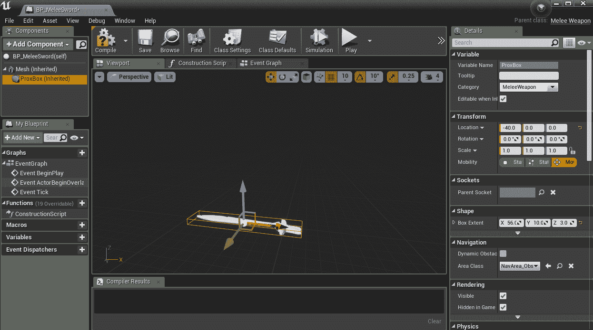

3.  `ProxBox`类将决定是否有东西被武器击中，所以我们将修改`ProxBox`类，使其刚好围住剑之刃，如下图截图所示:


4.  在“碰撞预设”面板下，为网格选择“无碰撞”选项(而不是“全部阻止”)非常重要。下面的截图说明了这一点:


5.  如果你选择了 BlockAll，那么游戏引擎会通过推开剑每次挥动时接触到的东西，自动解决剑和角色之间的所有穿插。结果是你的角色看起来会在挥剑的时候飞起来。

# 套接字

UE4 中的插座是一个骨架网上另一个的插座`Actor`。您可以将插座放置在骨骼网格体的任何位置。正确放置插座后，可以在 UE4 代码中将另一个`Actor`附加到该插座上。

例如，如果我们想把一把剑放在我们的怪物手里，我们只需要在我们的怪物手里创建一个插座。我们可以通过在玩家的头上创建一个插座来为他安装头盔。

# 在怪物的手上创建一个骨骼网格插座

要将插座连接到怪物的手上，我们必须编辑怪物正在使用的骨骼网格。由于我们对怪物使用了 Mixamo_Adam 骨骼网格，我们必须打开并编辑这个骨骼网格。为此，请执行以下步骤:

1.  双击内容浏览器选项卡中的 Mixamo_Adam 骨架网格(这将显示为 T 姿势)以打开骨架网格编辑器。
2.  如果您在内容浏览器选项卡中没有看到 Mixamo Adam，请确保您已经从虚幻启动器应用中将 Mixamo 动画包文件导入到项目中:


3.  点击屏幕右上角的骨架。
4.  向下滚动左侧面板中的骨骼树，直到找到右侧骨骼。

5.  我们会在这块骨头上安一个插座。右键单击右侧骨骼，选择添加插座，如下图所示:

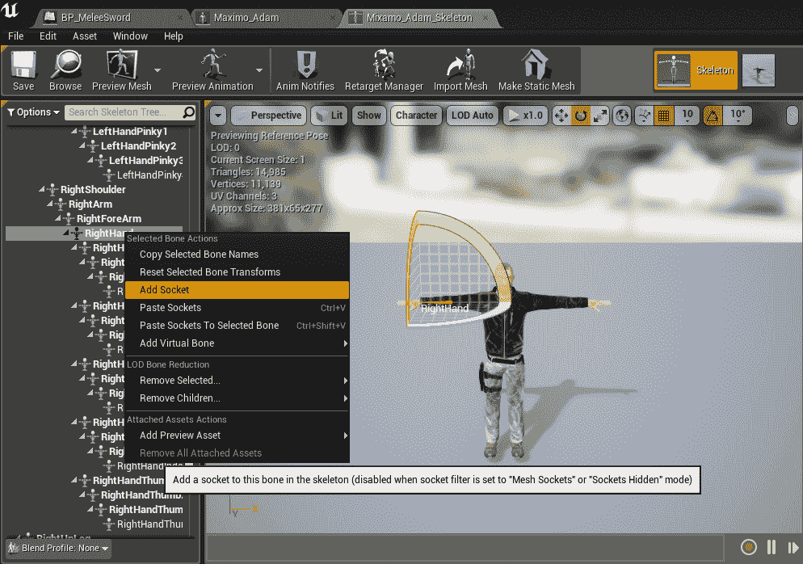

6.  您可以保留默认名称(RightHandSocket)或根据需要重命名套接字，如下图所示:


接下来，我们需要在演员的手上加一把剑。

# 将剑附在模型上

附剑步骤如下:

1.  打开 Adam 骨骼网格，在树视图中找到 RightHandSocket 选项。既然亚当用右手挥杆，你就应该把剑挂在他的右手上。

2.  右键单击右侧锁定选项，选择添加预览资源，并在出现的窗口中找到剑的骨架网格:

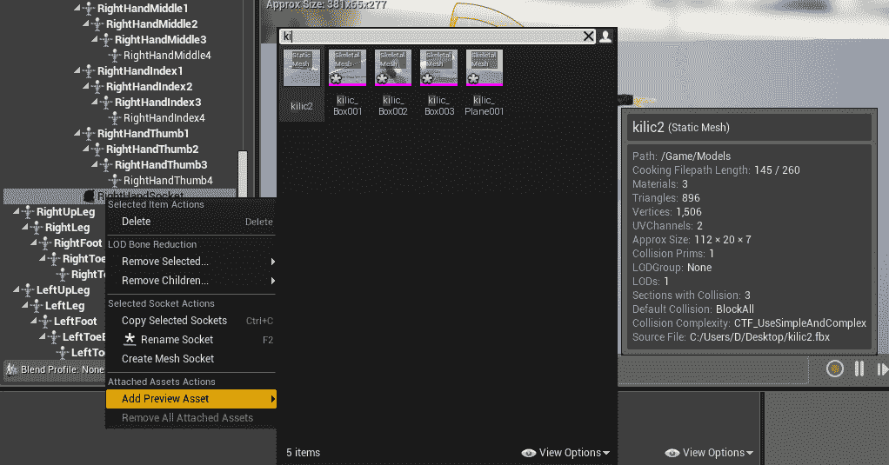

3.  您应该会在模型的图像中看到亚当握剑，在下面截图的右侧:

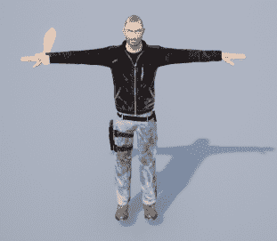

4.  现在，点击右手锁定，放大亚当的手。我们需要在预览中调整插座的位置，以便剑正确地放入其中。
5.  使用移动和旋转操纵器或手动更改“详细信息”窗口中的插座参数，将剑排成一行，使其正确放在他的手中:

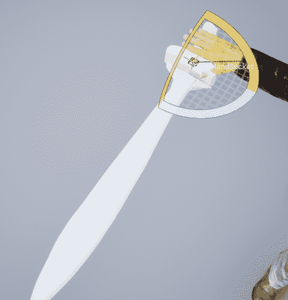

A real-world tip

If you have several sword models that you want to switch in and out of the same `RightHandSocket`, you will need to ensure quite a bit of uniformity (lack of anomalies) between the different swords that are supposed to go in that same socket.

6.  您可以通过转到屏幕右上角的“动画”选项卡来预览手握剑的动画:

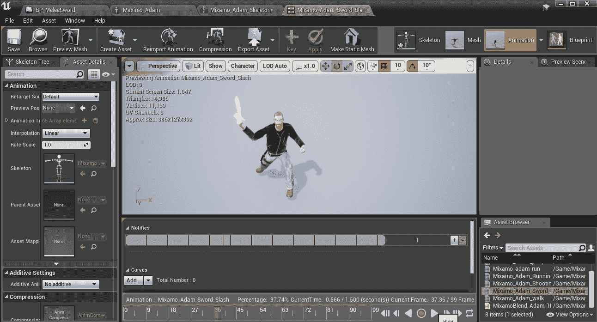

然而，如果你启动你的游戏，亚当不会拿着剑。这是因为在 Persona 中将剑添加到插座只是为了预览。

# 给玩家装备剑的代码

要从代码中为玩家装备一把剑，并将其永久绑定到角色，请实例化一个`AMeleeWeapon`实例，并在怪物实例初始化后将其附加到`RightHandSocket`上。我们在`PostInitializeComponents()`中这样做，因为在这个函数中，`Mesh`对象已经被完全初始化了。

在`Monster.h`文件中，添加一个钩子来选择要使用的近战武器的`Blueprint`类名(`UClass`)。此外，使用以下代码为变量添加一个钩子来实际存储`MeleeWeapon`实例:

```cpp
// The MeleeWeapon class the monster uses 
// If this is not set, he uses a melee attack 
UPROPERTY(EditAnywhere, BlueprintReadWrite, Category =  
   MonsterProperties) 
UClass* BPMeleeWeapon; 

// The MeleeWeapon instance (set if the character is using 
// a melee weapon) 
AMeleeWeapon* MeleeWeapon; 
```

另外，确保在文件顶部添加`#include "MeleeWeapon.h"`。现在，在你的怪物蓝图职业中选择`BP_MeleeSword`蓝图。

在 C++ 代码中，您需要实例化武器。为此，我们需要为`Monster`类声明并实现一个`PostInitializeComponents`函数。在`Monster.h`中，添加一个原型声明:

```cpp
virtual void PostInitializeComponents() override; 
```

`PostInitializeComponents`在怪物对象的构造器完成并且对象的所有组件都被初始化(包括蓝图构造)之后运行。因此，这是检查怪物是否附有`MeleeWeapon`蓝图的最佳时机，如果有，则实例化该武器。在`AMonster::PostInitializeComponents()`的`Monster.cpp`实现中添加了以下代码来实例化武器:

```cpp
void AMonster::PostInitializeComponents()
{
    Super::PostInitializeComponents();

    // instantiate the melee weapon if a bp was selected 
    if (BPMeleeWeapon)
    {
        MeleeWeapon = GetWorld()->SpawnActor<AMeleeWeapon>(
            BPMeleeWeapon, FVector(), FRotator());

        if (MeleeWeapon)
        {
            const USkeletalMeshSocket *socket = GetMesh()->GetSocketByName(
                FName("RightHandSocket")); // be sure to use correct 
                                    // socket name! 
            socket->AttachActor(MeleeWeapon, GetMesh());
            MeleeWeapon->WeaponHolder = this;
        }
    }
}
```

另外，确保将`#include "Engine/SkeletalMeshSocket.h"`放在文件的顶部。如果选择`BPMeleeWeapon`作为怪物的蓝图，怪物现在将开始手握剑:


# 触发攻击动画

默认情况下，我们的 C++ `Monster`类与触发攻击动画之间没有联系；换句话说，`MixamoAnimBP_Adam`类没有办法知道怪物什么时候处于攻击状态。

因此，我们需要更新亚当骨架(`MixamoAnimBP_Adam`)的动画蓝图，在`Monster`类变量列表中加入一个查询，检查怪物是否处于攻击状态。我们以前没有在这本书里使用过动画蓝图(或者一般的蓝图)，但是按照这些说明一步一步来，你应该会看到它走到一起。

I'll introduce blueprints terminology gently here, but I'll encourage you to have a look at Zak Parrish's tutorial series at [https://www.youtube.com/playlist?list=PLZlv_N0_O1gbYMYfhhdzfW1tUV4jU0YxH](https://www.youtube.com/playlist?list=PLZlv_N0_O1gbYMYfhhdzfW1tUV4jU0YxH) for your first introduction to blueprints.

# 蓝图基础

UE4 蓝图是代码的可视化实现(不要与有时人们说 C++ 类是类实例的隐喻蓝图相混淆)。在 UE4 蓝图中，您不是实际编写代码，而是将元素拖放到图形上，并将它们连接起来以实现所需的播放。通过将正确的节点连接到正确的元素，您可以在游戏中编写任何您想要的程序。

This book does not encourage the use of blueprints since we are trying to encourage you to write your own code instead. Animations, however, are best worked with blueprints, because that is what artists and designers will know.

让我们开始编写一个示例蓝图，了解它们是如何工作的:

1.  点击顶部的蓝图菜单栏，选择开放级蓝图，如下图所示:


当您开始层级时，层级蓝图选项会自动执行。一旦你打开这个窗口，你应该会看到一个空白的石板来创建你的游戏，如下所示:


2.  右键单击图表纸上的任意位置。
3.  开始输入`begin`并从出现的下拉列表中点击事件开始播放选项。

Ensure that the Context Sensitive checkbox is checked, as shown in the following screenshot:


4.  点击事件开始播放选项后，屏幕上会立即出现一个红色框。它的右手边有一个白色别针。这称为执行引脚，如下所示:


关于动画蓝图，您首先需要知道的是白色 pin 执行路径(白线)。如果您以前看过蓝图图，您一定注意到一条白线穿过该图，如下图所示:


白色引脚执行路径相当于让代码行一行接一行地排列和运行。白线决定了哪些节点将被执行以及执行的顺序。如果一个节点没有一个白色的执行管脚，那么这个节点根本不会被执行。

5.  将白色执行针拖离事件开始播放。
6.  首先在可执行动作对话框中输入`draw debug box`。
7.  选择第一个弹出的东西(fDraw 调试框)，如下所示:


8.  填写一些您希望盒子看起来如何的细节。在这里，我选择了框的蓝色，框的中心在(0，0，100)，框的大小为(200，200，200)，持续时间为 180 秒(一定要输入足够长的持续时间，以便您可以看到结果)，如下图所示:


9.  现在，点击播放按钮实现图形。请记住，您必须找到世界的原点才能看到调试框。
10.  通过在(`0, 0`，(某个`z`值))放置一个金蛋来查找世界原点，如下图截图所示，或者尝试增加线条粗细使其更加可见:


这是盒子在关卡中的外观:

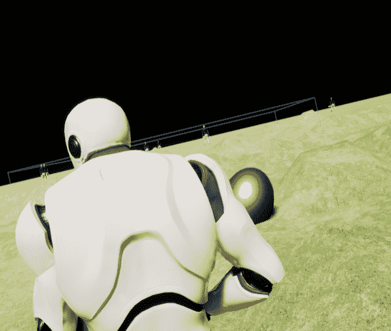

# 修改 Mixamo Adam 的动画蓝图

为了整合我们的攻击动画，我们必须修改蓝图。在内容浏览器下，打开`MixamoAnimBP_Adam`。

您将注意到的第一件事是，该图在事件通知部分上方有两个部分:

*   顶部标记为基本角色移动....
*   底部说 Mixamo 示例角色动画....

基本角色动作负责模型的行走和跑步动作。我们将在 Mixamo 示例角色动画的攻击和跳跃部分工作，该部分负责攻击动画。我们将在图的后半部分工作，如下面的截图所示:

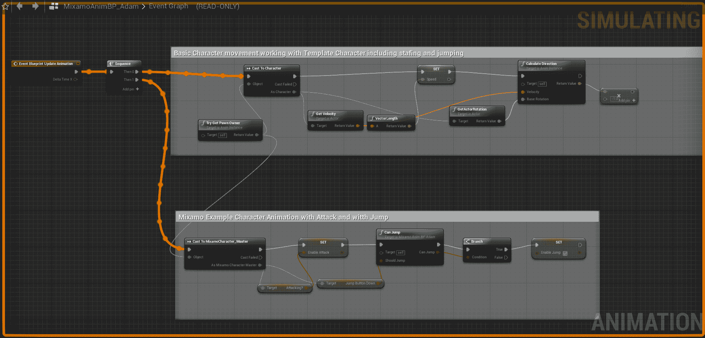

当您第一次打开图表时，它是从靠近底部的部分放大开始的。要向上滚动，右键单击鼠标并向上拖动。您也可以使用鼠标滚轮或按住 *Alt* 键和鼠标右键，同时向上移动鼠标来缩小。

在继续之前，您可能希望复制 MixamoAnimBP_Adam 资源，这样就不会损坏原始资源，以防以后需要返回并更改某些内容。这样，如果您发现自己在一次修改中犯了错误，就可以轻松地返回并纠正错误，而不必将整个动画包的新副本重新安装到项目中:

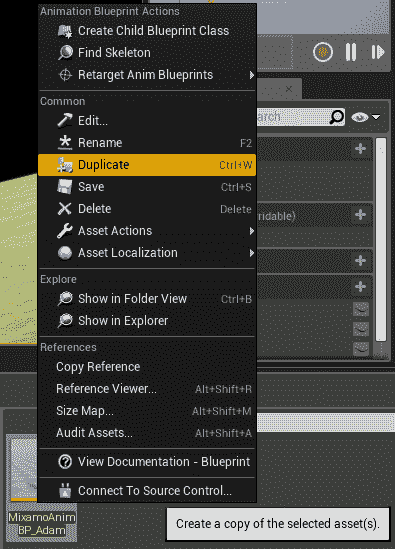

When assets are added to a project from the Unreal Launcher, a copy of the original asset is made, so you can modify MixamoAnimBP_Adam in your project now and get a fresh copy of the original assets in a new project later.

我们只做几件事，让亚当在进攻时挥剑。让我们按照这个顺序来做:

1.  删除写着攻击的节点？：

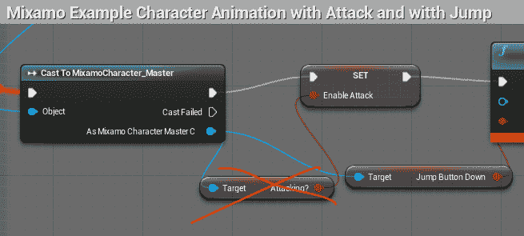

2.  重新排列节点，如下所示，使“启用攻击”节点位于底部:

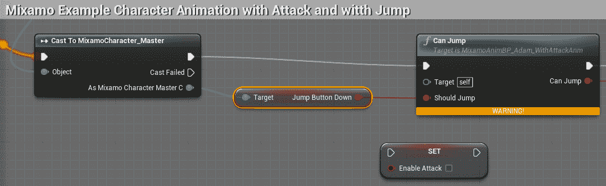

3.  我们将处理这个动画制作的怪物。向上滚动图形一点，并在“尝试获取典当物主”对话框中拖动标记为“返回值”的蓝点。将它放入图形中，当弹出菜单出现时，选择“转换为怪物”(确保选中了“上下文相关”，否则“转换为怪物”选项将不会出现)。“尝试获取棋子所有者”选项获取拥有动画的`Monster`实例，它只是`AMonster`类对象，如下图所示:

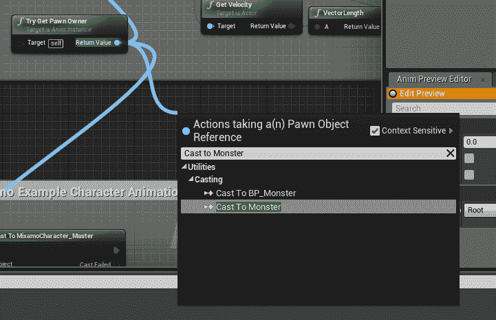

4.  单击序列对话框中的+并将另一个执行引脚从序列组拖到“转换为怪物”节点实例，如下图所示。这确保了“强制转换为怪物”实例实际得到执行:


5.  下一步是从“施放到怪物”节点的“作为怪物”终端拔出大头针，并查找“在攻击范围内”属性:

For this to show up, you need to go back to `Monster.h` and add the following line before the is in Attack Range function and compile the project (this will be explained a little later):
`UFUNCTION(BlueprintCallable, Category = Collision)`


6.  从左侧的“施法到怪物”节点到右侧的“在攻击范围内”节点之间，应该会自动出现一条线。接下来，从“作为怪物”中拖动另一条线，这次查找“获取距离到”:


7.  您需要添加一个节点，让玩家角色发送到“获取距离”的“其他参与者”节点。只需右键单击任意位置并查找获取玩家角色:

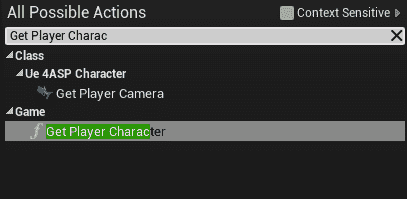

8.  将“获取玩家角色”的“返回值”节点连接到“其他角色”，并将“获取距离”的“返回值”连接到“在攻击范围内”:

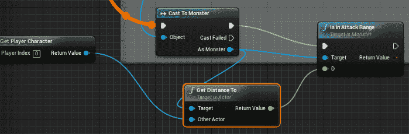

9.  将白色和红色引脚拉到 SET 节点，如下所示:

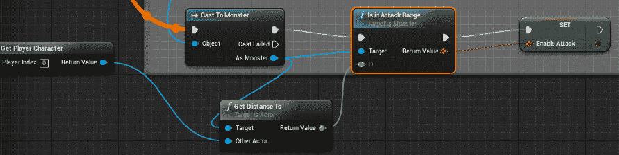

The equivalent pseudocode of the preceding blueprint is something similar to the following:

```cpp
if(   Monster.isInAttackRangeOfPlayer() )   
{   
    Monster.Animation = The Attack Animation;   
}   
```

测试你的动画。怪物应该只在玩家的范围内摆动。如果不起作用，并且您创建了一个副本，请确保您将`animBP`切换到副本。还有，默认动画是射击，不是挥剑。我们稍后会解决这个问题。

# 挥剑密码

我们想在挥剑时添加一个动画通知事件:

1.  声明一个蓝图可调用 C++ 函数并将其添加到您的`Monster`类中:

```cpp
// in Monster.h: 
UFUNCTION( BlueprintCallable, Category = Collision ) 
void SwordSwung(); 
```

`BlueprintCallable`语句意味着可以从蓝图中调用该函数。换句话说，`SwordSwung()`将是一个我们可以从蓝图节点调用的 C++ 函数，如下所示:

```cpp
// in Monster.cpp 
void AMonster::SwordSwung() 
{ 
  if( MeleeWeapon ) 
  { 
    MeleeWeapon->Swing(); 
  } 
} 
```

2.  通过在内容浏览器中双击打开 Mixamo_Adam_Sword_Slash 动画(它应该在 mixamoanimspack/Mixamo _ Adam/Anims/Mixamo _ Adam _ Sword _ Slash 中)。
3.  找到亚当开始挥剑的地方。

4.  右键单击通知栏上的那个点，并在添加通知下选择新建通知...，如下图所示:

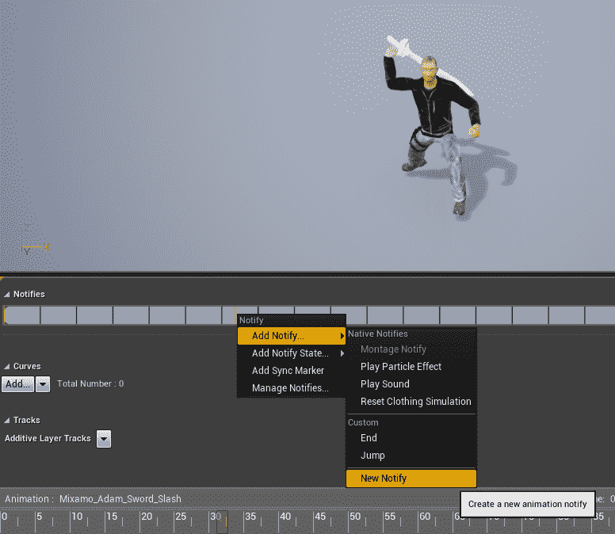

5.  通知名称`SwordSwung`:


通知名称应该出现在动画的时间线中，如下所示:

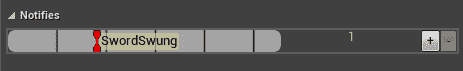

6.  保存动画，然后再次打开你的 MixamoAnimBP_Adam 版本。
7.  在 SET 节点组下面，创建以下图形:

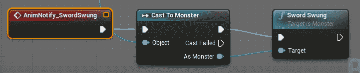

8.  当您在图形中右键单击(打开上下文相关)并开始键入`SwordSwung`时，会出现动漫通知 _ 剑挥节点。“投射到怪物”节点再次从“尝试获得棋子所有者”节点输入，如*修改“米夏莫·亚当”*动画蓝图部分的第 2 步。
9.  剑挥是我们的蓝图-在`AMonster`类中可调用的 C++ 函数(你需要为此编译项目才能显示出来)。
10.  你还需要进入 MaximoAnimBP_Adam 的动画选项卡。
11.  双击状态机打开该图。
12.  双击攻击状态打开它。
13.  选择左边写着“播放 Mixamo_Adam 拍摄”的那个。
14.  拍摄是默认动画，但这显然不是我们想要发生的。所以，删除它，右键单击并寻找“玩 Mixamo_Adam_Sword_Slash”。然后，从一个人的小图标上单击并拖动它最终动画姿势的结果:


如果你现在开始游戏，你的怪物会在实际攻击时执行他们的攻击动画。如果你也在`AAvatar`类中覆盖`TakeDamage`来降低血量，当剑的包围盒接触到你的时候，你会看到你的血量条下降了一点(回想一下血量条是在[第八章](08.html)、*演员和棋子*的末尾增加的，作为练习):

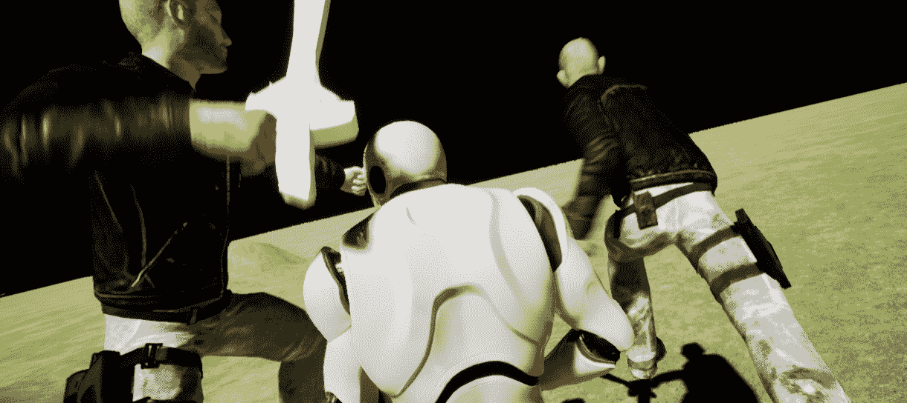

# 投射或远程攻击

远程攻击通常包括某种投射物。射弹是子弹之类的东西，但也可以包括闪电魔法攻击或火球攻击之类的东西。要对投射攻击进行编程，你应该生成一个新的物体，并且只在投射物到达玩家时对玩家造成伤害。

为了在 UE4 中实现一个基本项目符号，我们应该派生一个新的对象类型。我从`AActor`类派生了一个`ABullet`类，如下面的代码所示:

```cpp
#pragma once

#include "CoreMinimal.h"
#include "GameFramework/Actor.h"
#include "Components/SphereComponent.h"
#include "Bullet.generated.h"

UCLASS()
class GOLDENEGG_API ABullet : public AActor
{
 GENERATED_BODY()

public:
 // Sets default values for this actor's properties
 ABullet(const FObjectInitializer& ObjectInitializer);

 // How much damage the bullet does. 
 UPROPERTY(EditAnywhere, BlueprintReadWrite, Category =
 Properties)
 float Damage;

 // The visible Mesh for the component, so we can see 
 // the shooting object 
 UPROPERTY(VisibleDefaultsOnly, BlueprintReadOnly, Category =
 Collision)
 UStaticMeshComponent* Mesh;

 // the sphere you collide with to do impact damage 
 UPROPERTY(VisibleDefaultsOnly, BlueprintReadOnly, Category =
 Collision)
 USphereComponent* ProxSphere;

 UFUNCTION(BlueprintNativeEvent, Category = Collision)
 void Prox(UPrimitiveComponent* OverlappedComponent, AActor* OtherActor, UPrimitiveComponent* OtherComp,
 int32 OtherBodyIndex, bool bFromSweep, const FHitResult& SweepResult);

 // You shouldn't need this unless you get a compiler error that it can't find this function.
 virtual int Prox_Implementation(UPrimitiveComponent* OverlappedComponent, AActor* OtherActor, UPrimitiveComponent* OtherComp,
 int32 OtherBodyIndex, bool bFromSweep, const FHitResult& SweepResult); };
```

`ABullet`类中有几个重要成员，如下所示:

*   子弹接触时造成的伤害的变量
*   一个`Mesh`变量为子弹的主体
*   一个`ProxSphere`变量，用于检测子弹何时最终击中某物
*   在物体附近检测到`Prox`时运行的功能

`ABullet`类的构造函数应该有`Mesh`和`ProxSphere`变量的初始化。在构造器中，我们将`RootComponent`设置为`Mesh`变量，然后将`ProxSphere`变量附加到`Mesh`变量。`ProxSphere`变量将用于碰撞检查。`Mesh`变量的碰撞检查应该关闭，如下代码所示:

```cpp
ABullet::ABullet(const FObjectInitializer& ObjectInitializer)
    : Super(ObjectInitializer)
{
    Mesh = ObjectInitializer.CreateDefaultSubobject<UStaticMeshComponent>(this,
        TEXT("Mesh"));
    RootComponent = Mesh;

    ProxSphere = ObjectInitializer.CreateDefaultSubobject<USphereComponent>(this,
        TEXT("ProxSphere"));
    ProxSphere->AttachToComponent(RootComponent, FAttachmentTransformRules::KeepWorldTransform);

    ProxSphere->OnComponentBeginOverlap.AddDynamic(this,
        &ABullet::Prox);
    Damage = 1;
}
```

我们在构造函数中将`Damage`变量初始化为`1`，但是一旦我们从`ABullet`类中创建了一个蓝图，就可以在 UE4 编辑器中进行更改。接下来，`ABullet::Prox_Implementation()`函数应该会对演员造成伤害，如果我们与其他演员的`RootComponent.`发生碰撞，我们可以通过代码实现:

```cpp
int ABullet::Prox_Implementation(UPrimitiveComponent* OverlappedComponent, AActor* OtherActor, UPrimitiveComponent* OtherComp,
    int32 OtherBodyIndex, bool bFromSweep, const FHitResult& SweepResult)
{
    if (OtherComp != OtherActor->GetRootComponent())
    {
        // don't collide w/ anything other than 
        // the actor's root component 
        return -1;
    }

    OtherActor->TakeDamage(Damage, FDamageEvent(), NULL, this);
    Destroy();
    return 0;
}
```

# 子弹物理学

要让子弹飞过关卡，可以使用 UE4 的物理引擎。

基于`ABullet`类创建蓝图。我为网格选择了 Shape_Sphere，并将其缩小到更合适的大小。子弹的网格应该启用碰撞物理，但是子弹的边界球将用于计算伤害。

将项目符号配置为适当的行为有点棘手，因此我们将分四个步骤进行介绍，如下所示:

1.  在“组件”选项卡中选择“网格(继承)”。`ProxSphere`变量应该在网格下。
2.  在详细信息选项卡中，选中模拟物理和模拟生成命中事件。
3.  从碰撞预设下拉列表中，选择自定义....
4.  从启用冲突下拉列表中选择启用冲突(查询和物理)。此外，检查碰撞响应框，如图所示；选中阻止大多数类型(世界静态、世界动态等)并选中重叠，但仅适用于典当:

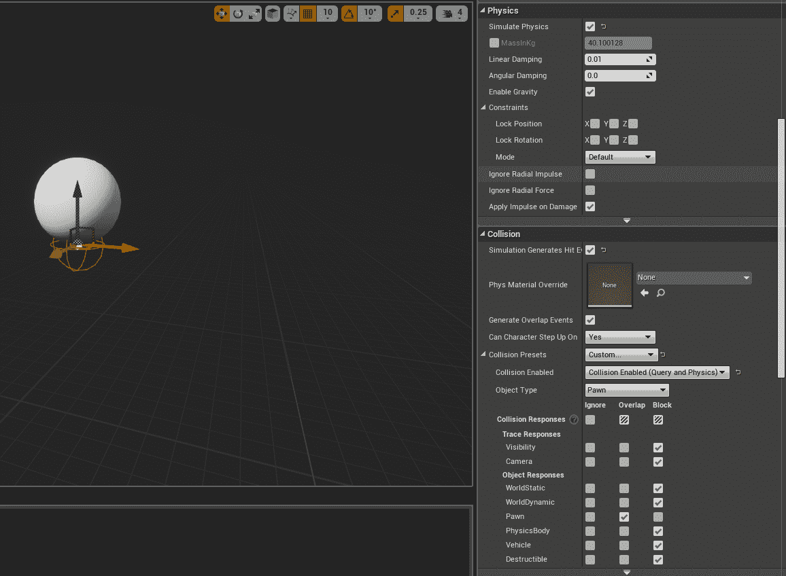

“模拟物理”复选框使`ProxSphere`属性经历重力和施加在其上的脉冲力。冲动是一种瞬间的力量，我们将用它来推动子弹的射出。如果您没有选中“模拟生成击球事件”复选框，则球会掉到地板上。阻挡所有碰撞的作用是确保球不能穿过任何东西。

如果你现在将这些`BP_Bullet`对象从内容浏览器标签直接拖放到世界上，它们将会简单地掉落到地板上。一旦它们掉在地上，你就可以踢它们。下面的截图显示了地板上的球对象:

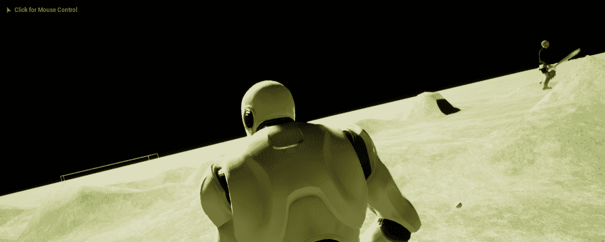

然而，我们不希望我们的子弹落在地板上。我们希望他们被枪毙。所以，让我们把子弹放在`Monster`班。

# 给怪物类添加子弹

让我们来看一个循序渐进的方法:

1.  向接收蓝图实例引用的`Monster`类添加成员。这就是`UClass`对象类型的用途。另外，添加一个蓝图可配置`float`属性来调整射出子弹的力，如以下代码所示:

```cpp
// The blueprint of the bullet class the monster uses 
UPROPERTY(EditAnywhere, BlueprintReadWrite, Category =  
   MonsterProperties) 
UClass* BPBullet; 
// Thrust behind bullet launches 
UPROPERTY(EditAnywhere, BlueprintReadWrite, Category =  
   MonsterProperties) 
float BulletLaunchImpulse; 
```

2.  编译运行 C++ 项目，打开你的`BP_Monster`蓝图。
3.  现在可以在`BPBullet`下选择一个蓝图类，如下图截图所示:


4.  一旦你选择了一个蓝图类类型来实例化怪物射击时，你必须编程怪物射击时，玩家在其范围内。

怪物从哪里射来？实际上，它应该是从骨头里射出来的。如果您不熟悉这个术语，骨骼只是模型网格中的参考点。模型网格通常由许多“骨骼”组成

5.  要查看一些骨骼，通过双击内容浏览器选项卡中的资源打开 Mixamo_Adam 网格，如下图所示:

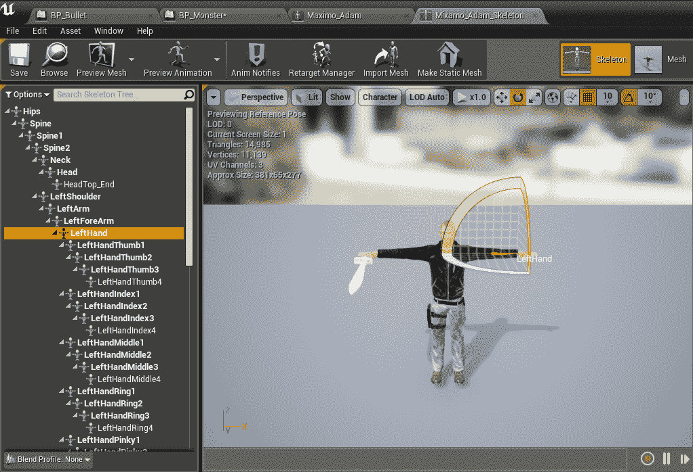

6.  转到骨骼选项卡，您将在左侧的树视图列表中看到所有怪物的骨骼。我们要做的是选择一根骨头，子弹将从骨头中射出。这里，我选择了`LeftHand`选项。

An artist will normally insert an additional bone into the model mesh to emit the particle, which is likely to be on the tip of the nozzle of a gun.

从基础模型网格开始，我们可以获得`Mesh`骨骼的位置，并让怪物从代码中的该骨骼发出`Bullet`实例。

使用以下代码可以获得完整的怪物`Tick`和`Attack`功能:

```cpp
void AMonster::Tick(float DeltaSeconds) 
{ 
  Super::Tick( DeltaSeconds ); 

  // move the monster towards the player 
  AAvatar *avatar = Cast<AAvatar>(  
   UGameplayStatics::GetPlayerPawn(GetWorld(), 0) ); 
  if( !avatar ) return; 

  FVector playerPos = avatar->GetActorLocation(); 
  FVector toPlayer = playerPos - GetActorLocation(); 
  float distanceToPlayer = toPlayer.Size(); 

  // If the player is not the SightSphere of the monster, 
  // go back 
  if( distanceToPlayer > SightSphere->GetScaledSphereRadius() ) 
  { 
    // If the player is OS, then the enemy cannot chase 
    return; 
  } 

  toPlayer /= distanceToPlayer;  // normalizes the vector 

  // At least face the target 
  // Gets you the rotator to turn something 
  // that looks in the `toPlayer` direction 
  FRotator toPlayerRotation = toPlayer.Rotation(); 
  toPlayerRotation.Pitch = 0; // 0 off the pitch 
  RootComponent->SetWorldRotation( toPlayerRotation ); 

  if( isInAttackRange(distanceToPlayer) ) 
  { 
    // Perform the attack 
    if( !TimeSinceLastStrike ) 
    { 
      Attack(avatar); 
    } 

    TimeSinceLastStrike += DeltaSeconds; 
    if( TimeSinceLastStrike > AttackTimeout ) 
    { 
      TimeSinceLastStrike = 0; 
    } 

    return;  // nothing else to do 
  } 
  else 
  { 
    // not in attack range, so walk towards player 
    AddMovementInput(toPlayer, Speed*DeltaSeconds); 
  } 
} 
```

`AMonster::Attack`功能比较简单。当然，我们首先需要在`Monster.h`文件中添加一个原型声明，以便在`.cpp`文件中编写我们的函数:

```cpp
void Attack(AActor* thing); 
```

在`Monster.cpp`中，我们实现`Attack`功能，如下所示:

```cpp
void AMonster::Attack(AActor* thing) 
{ 
  if( MeleeWeapon ) 
  { 
    // code for the melee weapon swing, if  
    // a melee weapon is used 
    MeleeWeapon->Swing(); 
  } 
  else if( BPBullet ) 
  { 
    // If a blueprint for a bullet to use was assigned, 
    // then use that. Note we wouldn't execute this code 
    // bullet firing code if a MeleeWeapon was equipped 
    FVector fwd = GetActorForwardVector(); 
    FVector nozzle = GetMesh()->GetBoneLocation( "RightHand" ); 
    nozzle += fwd * 155;// move it fwd of the monster so it  
     doesn't 
    // collide with the monster model 
    FVector toOpponent = thing->GetActorLocation() - nozzle; 
    toOpponent.Normalize(); 
    ABullet *bullet = GetWorld()->SpawnActor<ABullet>(  
     BPBullet, nozzle, RootComponent->GetComponentRotation()); 

    if( bullet ) 
    { 
      bullet->Firer = this; 
      bullet->ProxSphere->AddImpulse(  
        toOpponent*BulletLaunchImpulse ); 
    } 
    else 
    { 
      GEngine->AddOnScreenDebugMessage( 0, 5.f,  
      FColor::Yellow, "monster: no bullet actor could be spawned.  
       is the bullet overlapping something?" ); 
    } 
  } 
} 
```

另外，确保在文件顶部添加`#include "Bullet.h"`。我们让实现近战攻击的代码保持原样。假设怪物没有手持近战武器，那么我们就检查一下`BPBullet`成员是否设置好了。如果设置了`BPBullet`成员，这意味着怪物将创建并触发`BPBullet`蓝印类的一个实例。

请特别注意以下几行:

```cpp
ABullet *bullet = GetWorld()->SpawnActor<ABullet>(BPBullet,  
   nozzle, RootComponent->GetComponentRotation() );
```

这就是我们如何给这个世界增加一个新的演员。`SpawnActor()`函数将您传入的`UCLASS`实例放入`spawnLoc`，并带有一些初始方向。

在我们生成子弹后，我们调用其`ProxSphere`变量上的`AddImpulse()`函数来推进它。

另外，在 Bullet.h 中添加以下一行:

```cpp
AMonster *Firer;
```

# 玩家反击

为了给玩家添加一个震退，我给`Avatar`类添加了一个名为`knockback`的成员变量。每当化身受到伤害时，就会发生反击:

```cpp
FVector knockback; // in class AAvatar
```

要想知道玩家被击中后要往哪个方向回击，我们需要给`AAvatar::TakeDamage`添加一些代码。这将覆盖`AActor`类中的版本，所以首先，将它添加到头像中。

```cpp
virtual float TakeDamage(float DamageAmount, struct FDamageEvent const& DamageEvent, class AController* EventInstigator, AActor* DamageCauser) override;
```

计算从攻击者到玩家的方向向量，并将该向量存储在`knockback`变量中:

```cpp
float AAvatar::TakeDamage(float DamageAmount, struct FDamageEvent const& DamageEvent, class AController* EventInstigator, AActor* DamageCauser)
{
    // add some knockback that gets applied over a few frames 
    knockback = GetActorLocation() - DamageCauser->GetActorLocation();
    knockback.Normalize();
    knockback *= DamageAmount * 500; // knockback proportional to damage 
    return AActor::TakeDamage(DamageAmount, DamageEvent, EventInstigator, DamageCauser);
}
```

在`AAvatar::Tick`中，我们将震退应用到头像的位置:

```cpp
void AAvatar::Tick( float DeltaSeconds ) 
{ 
  Super::Tick( DeltaSeconds ); 

  // apply knockback vector 
  AddMovementInput( -1*knockback, 1.f ); 

  // half the size of the knockback each frame 
  knockback *= 0.5f; 
} 
```

由于回退向量随着每一帧而减小，所以它会随着时间的推移而变弱，除非回退向量随着另一次命中而更新。

For the bullets to work, you need to set BPMelee Weapon to None. You should also increase the size of AttackRangeSphere and adjust Bullet Launch Impulse to a value that works.

# 摘要

在这一章中，我们探索了如何在屏幕上实例化追赶玩家并攻击他的怪物。我们使用了不同的球体来检测怪物是否在视野或攻击范围内，并根据怪物是否有近战武器增加了近战或射击攻击的能力。如果你想进一步实验，你可以尝试改变射击动画，或者增加一个额外的球体，让怪物在移动的同时开火，在攻击范围内切换到近战。在下一章中，我们将通过研究先进的人工智能技术来进一步扩展怪物的能力。