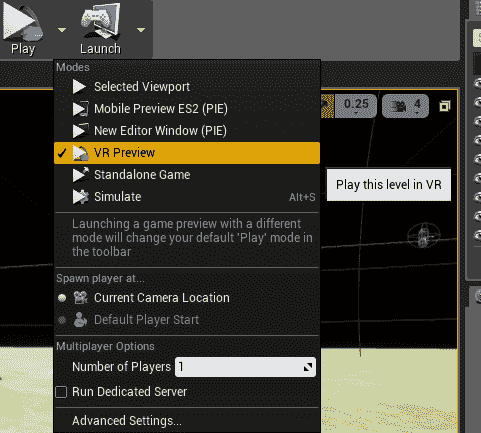
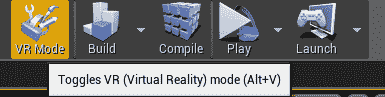
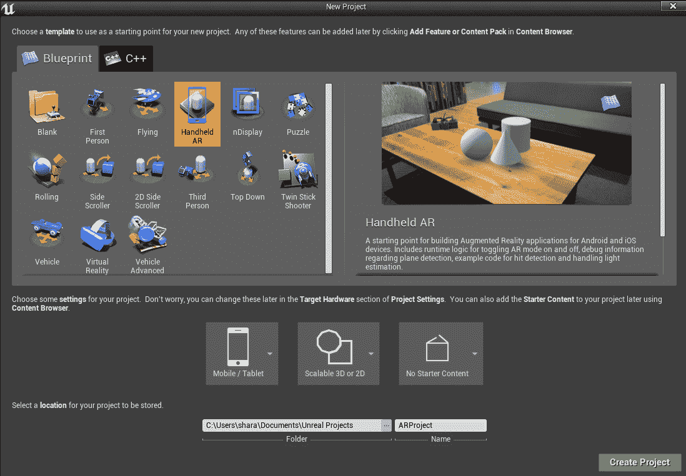

# 十五、虚拟现实及其他

除非你一直住在山洞里，否则你可能听说过**虚拟现实** ( **VR** )。VR 和**增强现实** ( **AR** )是目前游戏领域最热门的趋势之一，这将在本章稍后介绍。由于超便宜的谷歌纸板和类似设备等创新，让你可以在最近的智能手机上查看基本的虚拟现实，很容易获得虚拟现实技术。

无论你只有一个谷歌纸板，还是你有一个更高端的设备，如 Oculus Rift 或 HTC VIVE，UE4 都可以很容易地为虚拟现实编程。当然，如果你有 PlayStation VR，你需要成为索尼官方开发人员来为其编程(就像你为 PlayStation 编程其他东西一样)，所以你可能无法做到这一点，除非你为一家正在做 PSVR 冠军的公司工作。

在这里，您将获得虚拟现实和 UE4 的概述，这将有助于您开始。以下是我们将要讲述的内容:

*   为虚拟现实做准备
*   使用虚拟现实预览和虚拟现实模式
*   虚拟现实中的控件
*   虚拟现实开发技巧

我还将介绍 UE4 的一些更高级的功能。我们将从现在关注的另一个大的热门技术 AR 开始，然后转向其他技术。以下是我们将介绍的内容:

*   阿肯色州
*   程序设计
*   用插件和附加组件扩展功能
*   移动、控制台和其他平台

# 为虚拟现实做准备

这是一个进入虚拟现实开发的激动人心的时刻。也许你是想接触最新的热门技术。或者，也许你和我一样，几十年来一直在阅读威廉·吉布森、尼尔·斯蒂芬森、威廉敏娜·贝尔德和布鲁斯·贝克等作家的赛博朋克书籍中关于虚拟现实的内容，并为它终于出现而感到兴奋。无论是哪种情况，以下是你如何为你的虚拟现实编程之旅做准备。

要开始使用 Oculus Rift 或 HTC Vive 进行虚拟现实，首先您需要一台准备好虚拟现实的计算机。Oculus 有一个免费程序，你可以在他们的网站[https://ocul.us/compat-tool](https://ocul.us/compat-tool)下载，或者去他们的支持页面，它会告诉你你的显卡是否有问题。

即使你有一台最新的电脑，除非你有一台特别标记为虚拟现实就绪的电脑，否则你很可能需要一个新的显卡。虚拟现实是非常图形密集型的，所以它需要一个相当高端(通常相当昂贵)的显卡。

当然，如果你想做的只是手机上的 VR，没有它你可能也能过得去，但你将不得不在手机上做所有的测试，并且无法访问 UE4 的很多很酷的功能，比如 VR 编辑。

一旦你有了一台可以处理的电脑，你可能会想要一台 Oculus Rift 或 HTC Vive(或者两者都要，如果你真的很认真，并且有足够的钱投入其中，因为两者都不便宜)。作为安装过程的一部分，您得到的任何设备都将安装您需要的所有驱动程序。

然后，进入 UE4，转到编辑|插件，并确保您拥有任何设备的插件(您可以搜索它们)。它应该看起来像这样，这取决于您的虚拟现实硬件:

此外，请确保您的虚拟现实软件正在运行(当您打开 UE4 时，它可能会自动启动，具体取决于您的虚拟现实硬件)。

# 使用虚拟现实预览和虚拟现实模式

如果你想在虚拟现实中查看一些东西，好消息是你不需要写任何新的东西！只需进入现有项目，单击播放按钮旁边的箭头，然后选择虚拟现实预览:

现在，只要戴上你的虚拟现实耳机，你就应该可以在虚拟现实中看到游戏了！

一旦你运行了游戏，你就能看到游戏世界。你将无法四处移动(当你在虚拟现实中时，你看不到你的键盘或鼠标)，但你将能够转过头来环顾四周。

Be very careful if you're prone to motion sickness. This is a serious problem in VR, although there are ways to minimize the effects in your game, which we will talk about later. You might not want to be in  VR mode for too long until you get used to it and know how it affects you.

UE4 还有另一个真正能帮到你的工具，VR 模式。这允许你在虚拟现实中实际查看和编辑游戏，所以你可以看到当你做出改变时，它们会是什么样子。这可能非常有帮助，因为许多东西在虚拟现实中看起来不像在非虚拟现实游戏中一样。

要激活虚拟现实模式，请单击工具栏中的虚拟现实模式或点击 *Alt* + *V* :

你可以四处看看，在虚拟现实模式下，你可以在游戏中使用你的运动控制器
。在第一次进入虚拟现实模式之前，您可能想要查找您需要的控件。在虚幻网站上有关于虚拟现实模式及其控件的详细说明，网址为:[https://docs.unrealengine.com/en-us/Engine/Editor/VR](https://docs.unrealengine.com/en-us/Engine/Editor/VR)。

If you want to go further, by programming for specific VR systems, such as the Oculus Rift, Vive, Steam VR, or others, there are detailed instructions on working with many different VR systems on the Unreal website. You can find them here: [https://docs.unrealengine.com/en-us/Platforms/VR](https://docs.unrealengine.com/en-us/Platforms/VR).

# 虚拟现实中的控件

你可能会注意到，在虚拟现实模式下，通常的控制不会起作用。你甚至看不到带着虚拟现实耳机的键盘和鼠标，这使得使用它们变得极其困难。幸运的是，高端设备有自己的控制器，UE4 有一个运动控制器组件，你可以把它添加到你的玩家棋子上，这样你就可以用它而不是鼠标来指向东西。

If you know from the beginning that you are aiming for VR, UE4 has VR-specific classes and templates available that will add some of the functionality you need automatically. There is also a VR expansion plugin that is extremely helpful, and if you're not on a big team of developers, you should really look into it. You can find it here: [https://forums.unrealengine.com/development-discussion/vr-ar-development/89050-vr-expansion-plugin](https://forums.unrealengine.com/development-discussion/vr-ar-development/89050-vr-expansion-plugin)

UI 在 VR 中非常棘手，很多人还在努力想出最好的方法。你最好的选择可能是玩很多现有的游戏，看看你认为什么最适合你。确保你尽可能多地进行实验，因为这是观察什么有效的最好方法！

# 虚拟现实开发技巧

虚拟现实是一项新的令人兴奋的技术。人们仍在寻找可行的方法，因此有足够的实验空间，而且还有很多这样的实验正在进行。但是你仍然需要记住一些最佳实践，因为你不想让玩你游戏的人有不好的体验，甚至在玩你的游戏时生病。如果他们这样做了，他们可能不会再玩它，也不太可能买你的下一个游戏。所以，你希望体验对每个人都好。

VR 最大的问题是模拟病(或晕动病)。有些人比其他人更容易受到这种影响，但是如果你不小心，即使是通常不容易晕车的人也会有问题。所以，小心很重要。确保你有其他人测试你的游戏，因为虽然你可能会习惯，但这并不意味着其他人不会有麻烦。

最重要的考虑之一是保持非常高的帧速率。不同的设备对最低帧速率有不同的建议，如果你低于这些，人们很可能会开始有问题。

总的来说，保持尽可能高的质量很重要。任何看起来假的或坏的东西都可能把人扔出去，导致晕车。所以，如果你试图达到的任何效果看起来不像你预期的那样，试着做些别的事情。

你可能会注意到，许多虚拟现实游戏没有让玩家在游戏中走动，或者让他们坐在移动的车辆上。这是避免模拟疾病的另一种方法。最大的问题是运动，尤其是垂直运动，比如跳跃，或者通过控制器旋转，而不仅仅是转动你的头。基本上，你的大脑认为你在运动，但是你的身体得到了冲突的信息，因为它没有感觉到运动。如果你认为你坐在车里，你的身体并不期望感觉到运动，所以这就是为什么它似乎工作得更好。虽然，如果玩家在玩的时候站着，他们的问题可能会少一些。

网上有很多关于虚拟现实的信息和最佳实践。虚幻网站有一个关于最佳实践的页面，包含一些非常好的特定于 UE4 的信息。我建议在你开始你的项目之前仔细检查一下，因为从一开始就记住最佳实践比在项目结束时发现有些东西不工作或者不会很好地工作要好。

正如我之前所说，让人们去测试它是非常重要的。虚拟现实技术是如此新，以至于你会想确保它能为尽可能多的人服务。

# 阿肯色州

AR 类似于 VR，只是，不是完全被虚拟世界包围，在这种情况下，你看到的是放置在现实世界中的虚拟物体(通过摄像头观看)。这可能是通过耳机，如微软的全息镜头，或魔术飞跃。但是由于这些都是新的，目前只能作为面向开发人员的昂贵设备提供，您将主要通过移动设备看到增强现实。

移动设备上流行的 ar 游戏包括口袋妖怪 Go，在这里你可以抓住口袋妖怪，在你周围的世界面前观看它们。在 AR 模式下，你必须环顾四周，直到你找到一只口袋妖怪(它显示要转向的方向)并抓住它。你甚至可以拍照，这使得一些有趣的图像。它的前身，入口，让你去游戏中的真实世界的位置，但口袋妖怪围棋真的在这一点上有所扩展。

由于那款游戏的成功，手机 AR 游戏现在非常受欢迎。因为你在处理你无法控制的现实世界的物体，这可能会涉及一些复杂的计算机视觉，但幸运的是，UE4 有内置的功能来帮助你。

UE4 支持的两个主要移动 AR 系统是 iOS 的 ARKit 和安卓的 ARCore。你可以在[https://docs.unrealengine.com/en-us/Platforms/AR](https://docs.unrealengine.com/en-us/Platforms/AR)的虚幻网站上找到更多关于 AR 编程和每种类型的先决条件的详细信息。要启动其中任何一个，您需要使用手持增强现实模板创建一个新项目:

如前一张截图所示，您的设置应该是移动/平板电脑、可缩放 3D 或 2D 以及无入门内容。创建项目后，您可以将手机连接到电脑，如果手机已完全设置好(取决于您的手机，您可能需要在电脑上安装软件才能看到它)，当您单击“启动”旁边的箭头时，应该会在“设备”下看到它。否则，您仍然可以在“播放”下使用移动预览 ES2 (PIE)。

While you're not likely to be programming for Magic Leap anytime soon, there is early access documentation on it available on the Unreal site at: [https://docs.unrealengine.com/en-us/Platforms/AR/MagicLeap](https://docs.unrealengine.com/en-us/Platforms/AR/MagicLeap).

# 程序设计

游戏中的程序设计最近非常流行。如果你玩过《《我的世界》》、《无人区的天空》或《孢子》等游戏，你就玩过一个程序性游戏。程序游戏的历史可以追溯到几十年前，可以追溯到老的基于文本的游戏，如莫莉亚、安格班德和网络黑客。Rogue like 游戏(以原作命名，Rogue)仍然是一种流行的游戏类型，它使用程序技术来生成随机等级，因此每次你玩的时候，你都会得到一个完全不同的游戏。因此，程序编程增加了可重放性，当必须手工构建关卡时，这是很难得到的。

程序化编程让你通过代码中的规则和算法来创建游戏的各个部分，无论是环境、关卡，甚至是音频。基本上，代码不是让一个人设置每个细节，而是为你设置。

结果可能是不可预测的，尤其是在 3D 中，这比用 2D 文本字符绘制房间和路径要复杂得多。正因为如此，有时候会提前创建程序级别，所以设计师可以在添加到游戏之前选择自己喜欢的级别。

有许多不同的技术有助于过程编程。一种是使用**体积像素** ( **体素**)，它允许您根据点与其他体素的关系，以简单的方式引用 3D 空间中的点。体素已经被用在很多项目中，包括现在已经停止运行的游戏《地标》(我曾经参与过)，并且应该被用在现在已经取消的 EverQuest Next 中。UE4 通过插件支持体素，比如体素插件([https://voxelplugin.com/](https://voxelplugin.com/))。

程序编程也可以用于音乐。有些项目已经对特定类型的音乐进行了神经网络训练，并推出了类似风格的令人印象深刻的音乐。您还可以根据游戏中发生的事情修改播放的音乐。孢子用这个做了一些令人印象深刻的事情。

如果你对学习更多感兴趣，可以查阅大卫·科普，他是一位研究人员，已经就这个主题写了几本书。或者，你可以在这里看到虚幻的开发人员一直在用程序音频做什么:[http://proceduralaudionow . com/aaron-mcleran-and-Dan-Reynolds-procedural-audio-in-new-Unreal-audio-engine/](http://proceduralaudionow.com/aaron-mcleran-and-dan-reynolds-procedural-audio-in-the-new-unreal-audio-engine/)。你也可以找到 UE4 插件，比如我以前用过的一个程序性 MIDI 插件。

# 用插件和附加组件扩展功能

我们已经看到了一些插件和其他插件的例子，以及它们如何扩展 UE4，从为您的特定虚拟现实耳机添加虚拟现实功能到添加支持体素或程序音乐的功能。但是还有很多。

对于插件，您可以转到编辑|插件，并按类别查看所有可用的内容:

这些是内置插件。

但是如果你想了解更多，你可以在史诗游戏的启动器中查看市场:

虽然您会看到很多图形和模型，但您可以添加大量可用的功能。有些是免费的，有些你需要付费。例如，以下是对“程序性”的搜索:

UE4 是一个非常受欢迎的游戏引擎，所以如果你有什么需要，很有可能别人已经为它开发了一个插件。你也可以在互联网上的其他地方找到许多项目，其中许多是开源的，开发者很乐意帮助你实现它们。但是这些可能需要额外的工作来实现，您需要小心，并确切知道您正在下载和安装什么。

# 移动、控制台和其他平台

正如您在我们提到 AR 时所看到的，您可以在 UE4 中为移动设备开发，并在您的计算机或手机上预览您的游戏。UE4 的一大优点就是支持很多不同的平台。

很多 AAA 游戏工作室都使用 UE4，所以它肯定支持所有主要的游戏主机(Xbox One、PS4、Switch，甚至是 3DS 和 Vita 等移动主机)。其中的诀窍是，你通常不能只为他们开发——你需要成为一名授权的开发人员，通常需要花很多钱购买一个开发工具包(一个专门用于开发的控制台版本，允许你在控制台上调试)。

幸运的是，随着游戏机上独立游戏市场的发展，现在获得开发者访问权限的门槛比过去低了很多。但是在你开始研究这个之前，你可能仍然想要更多的经验和出版的游戏标题。

同时，你还有很多不同的游戏选择和平台。一旦你为一个平台构建了一个游戏，将这个游戏移植到另一个平台就容易多了(UE4 让这变得非常容易！).

主要区别在于控制，因为你可能使用触摸屏、控制器、运动控制器(在虚拟现实中)或键盘和鼠标。每一个都会有不同的要求，并且会稍微改变游戏的玩法。但是，只要你从一开始就记住你的目标是哪个平台，你就能以一种适合所有平台的方式来规划你的游戏。

# 摘要

这本书我们已经讲了很多，但我们已经到了结尾。我们已经学习了 C++ 的基础知识，并在 UE4 中创建了一个非常简单的游戏，其中包含一些基本的 AI，一个包含库存的部分 UI，以及使用粒子系统施法的能力。我们还了解了虚拟现实、增强现实以及 UE4 可以帮助您解决的其他新兴新技术。

你现在已经学得足够多，可以开始自己的游戏了。如果你需要更多关于特定主题的信息，还有很多其他的高级书籍和网站可以看，但是你应该对你现在正在看的东西有一个更好的想法。

我希望你旅途愉快。祝你未来的项目好运！