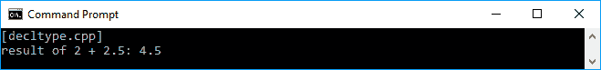
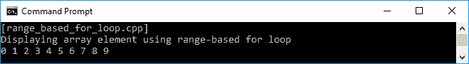
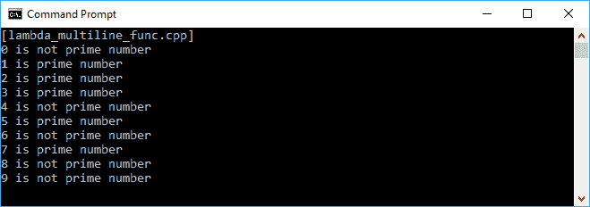
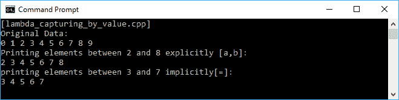
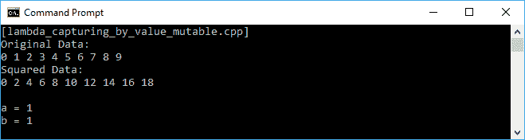
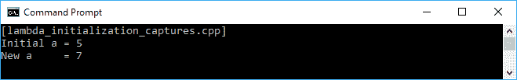
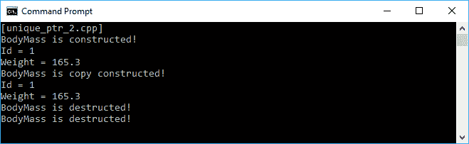
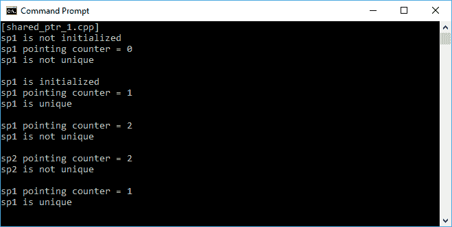
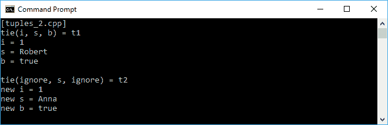
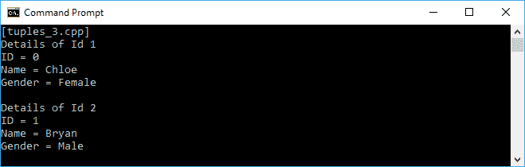

# 潜入现代 C++

自 1979 年发明以来，C++编程语言发生了巨大的变化。这个时代的一些人可能有点害怕使用 C++语言进行编码，因为它对用户不友好。我们要处理的内存管理有时会让人不愿意使用这种语言。幸运的是，自从 **C++11** -也被称为**现代 C++** ，以及 **C++14** 和 **C++17** -发布以来，已经引入了许多特性来简化我们在 C++语言中的代码。此外，它最好的部分是 C++编程语言是任何项目的伟大语言，从低级编程到 web 编程，以及函数式编程。

这一章是我们在这本书里开始旅程的最好的地方，因为它是针对 C++程序员的，以刷新他们的知识，并将讨论以下主题:

*   理解现代 C++的几个新特性
*   在现代 C++中实现 C++标准库
*   Lambda 表达式的使用以及 C++ Lambda 中包含的所有特性
*   使用智能指针避免手动内存管理
*   使用元组处理许多返回值

# 更接近现代 C++的几个新特性

那么，与旧的 C++相比，现代 c++有什么新的地方呢？现代 C++与旧的相比有如此多的变化，如果我们讨论所有的变化，书的页数将会大大增加。然而，我们将讨论现代 C++中的新特性，我们应该了解这些特性，以使我们在编码活动中更有效率。我们将讨论几个新的关键词，如`auto`、`decltype`、`nullptr`。我们还将讨论`begin()`和`end()`功能的增强，该功能现已成为非成员类功能。我们还将讨论对`for-each`技术的增强支持，以使用`range-based for loop`技术迭代集合。

本章接下来的几个小节还将讨论现代 C++的新特性，即 Lambda 表达式、智能指针和元组，它们刚刚在 C++11 版本中添加。

# 使用 auto 关键字自动定义数据类型

在现代 C++之前，C++语言有一个名为`auto`的关键字，用来明确指定变量应该有**自动持续时间**。附着在变量上的自动持续时间将在定义点(和初始化，如果相关的话)创建变量，并在定义它们的块退出时销毁变量。例如，局部变量将在函数开始定义时被创建，当程序退出局部变量所在的函数时被销毁。

从 C++11 开始，`auto`关键字被用来告诉编译器从其初始化器中推导出正在声明的变量的实际类型。并且由于 C++14，关键字也可以应用于函数，以指定作为尾随返回类型的函数的返回类型。现在，在现代 C++中，使用`auto`关键字来指定自动持续时间被取消，因为默认情况下所有变量都被设置为自动持续时间。

下面是一个`auto.cpp`代码，演示了`auto`关键字在变量中的使用。我们将使用`auto`关键字定义四个变量，然后使用`typeid()`函数找出每个变量的数据类型。让我们来看看:

```cpp
    /* auto.cpp */

    #include <iostream>
    #include <typeinfo>

    int main()
    {
      std::cout << "[auto.cpp]" << std::endl;

      // Creating several auto-type variables
      auto a = 1;
      auto b = 1.0;
      auto c = a + b;
      auto d = {b, c};

      // Displaying the preceding variables' type
      std::cout << "type of a: " << typeid(a).name() << std::endl;
      std::cout << "type of b: " << typeid(b).name() << std::endl;
      std::cout << "type of c: " << typeid(c).name() << std::endl;
      std::cout << "type of d: " << typeid(d).name() << std::endl;
      return 0;
    }

```

正如我们在前面的代码中看到的，我们有一个存储`integer`值的`a`变量和一个存储`double`值的`b`变量。我们计算`a`和`b`的相加，并将结果存储在变量`c`中。在这里，我们预计`c`将存储`double`对象，因为我们添加了`integer`和`double`对象。最后一个是`d`变量，它将存储`initializer_list<double>`数据类型。当我们运行前面的代码时，我们将在控制台上看到以下输出:


从前面的快照中可以看到，我们只是得到了数据类型的第一个字符，比如`i`代表`integer`、`d`代表`double`、`St16initializer_listIdE`代表`initializer_list<double>`，也就是代表`double`的最后一个小写`d`字符。

We may have to enable the **Run-Time Type Information** (**RTTI**) feature in our compiler options to retrieve the data type object. However, GCC has enabled the feature by default. Also, the output of the use of the `typeid()` function depends on the compiler. We may get the raw type name or just a symbol as we did in the preceding example.

此外，对于变量，如前所述，`auto`关键字也可以应用于函数，自动推导函数的返回类型。假设我们有以下名为`add()`的平凡函数来计算两个参数的相加:

```cpp
    int add(int i, int j)
    {
      return i + j;
    }

```

我们可以重构前面的方法来使用`auto`关键字，正如我们在下面几行代码中看到的:

```cpp
    auto add(int i, int j)
    {
      return i + j;
    }

```

类似于自动类型变量，编译器可以根据函数的返回值决定正确的返回类型。并且，如前面的代码所示，由于我们只添加了两个整数值，因此该函数确实会返回整数值。

在现代 C++中使用`auto`关键字的另一个特性是尾随返回类型语法。通过使用这个特性，我们可以指定返回类型、函数原型的其余部分或函数签名。从前面的代码中，我们可以重构它以使用如下特性:

```cpp
    auto add(int i, int j) -> int
    {
      return i + j;
    }

```

你可能会问我，为什么我们要在箭头符号(`->`)之后再次指定数据类型，尽管我们已经使用了`auto`关键字。我们将在下一节讨论`decltype`关键词时找到答案。此外，通过使用这个特性，我们现在可以通过修改`main()`方法的语法来重构前面的`auto.cpp`代码，而不是下面的`main()`函数签名的语法:

```cpp
    int main()
    {
      // The body of the function
    }

```

我们可以将签名语法更改为以下代码行:

```cpp
    auto main -> int
    {
      // The body of the function
    }

```

现在，我们将在本书中看到我们所有的代码都使用这个尾随返回类型特性来应用现代 C++语法。

# 使用 decltype 关键字查询表达式的类型

我们在上一节中讨论了`auto`关键字可以根据变量存储的值的类型自动推断变量的类型。关键字还可以根据返回值的类型推断函数的返回类型。现在，让我们结合`auto`关键词和`decltype`关键词，获得现代 C++的力量。

在我们结合这两个关键词之前，我们会发现`decltype`关键词是用来做什么的——它是用来询问一个对象或者一个表达式的类型。让我们看看下面几行琐碎的变量声明:

```cpp
    const int func1();
    const int& func2();
    int i;

    struct X { double d; };
    const X* x = new X();

```

现在，基于前面的代码，我们可以使用`decltype`关键字声明其他变量，如下所示:

```cpp
    // Declaring const int variable
    // using func1() type
    decltype(func1()) f1;

    // Declaring const int& variable
    // using func2() type
    decltype(func2()) f2;

    // Declaring int variable
    // using i type
    decltype(i) i1;

    // Declaring double variable
    // using struct X type
    decltype(x->d) d1; // type is double
    decltype((x->d)) d2; // type is const double&

```

正如我们在前面的代码中看到的，我们可以基于另一个对象的类型来指定一个对象的类型。现在，让我们假设我们需要重构前面的`add()`方法成为一个模板。没有`auto`和`decltype`关键字，我们将有以下模板实现:

```cpp
    template<typename I, typename J, typename K>
    K add(I i, J j)
    {
      return i + j;
    }

```

幸运的是，由于`auto`关键字可以指定函数的返回类型，这是一个尾随返回类型，而`decltype`关键字可以根据表达式推导出类型，所以我们可以如下重构前面的模板:

```cpp
    template<typename I, typename J>
    auto add(I i, J j) -> decltype(i + j)
    {
      return i + j;
    }

```

为了证明，让我们编译并运行以下`decltype.cpp`代码。我们将使用以下模板来计算两个不同值类型的加法- `integer`和`double`:

```cpp
    /* decltype.cpp */
    #include <iostream>

    // Creating template
    template<typename I, typename J>
    auto add(I i, J j) -> decltype(i + j)
    {
      return i + j;
    }

    auto main() -> int
    {
      std::cout << "[decltype.cpp]" << std::endl;

      // Consuming the template
      auto d = add<int, double>(2, 2.5);

      // Displaying the preceding variables' type
      std::cout << "result of 2 + 2.5: " << d << std::endl;

      return 0;
    }

```

编译过程应该平稳运行，没有错误。如果运行前面的代码，我们将在屏幕上看到以下输出:



正如我们所看到的，我们已经成功地组合了`auto`和`decltype`关键字，创建了一个比现代 C++宣布之前我们通常做的更简单的模板。

# 指向空指针

现代 C++的另一个新特性是一个名为`nullptr`的关键字，它取代了`NULL`宏来表示空指针。现在，使用`NULL`宏来表示零数字或空指针没有任何歧义。假设我们的声明中有以下两个方法的签名:

```cpp
    void funct(const char *);
    void funct(int)

```

前者将传递一个指针作为参数，后者将传递整数作为参数。然后调用`funct()`方法，传递`NULL`宏作为参数，如下图:

```cpp
    funct(NULL);

```

我们打算称之为前一个函数。但是由于我们传递的是`NULL`参数，基本定义为`0`，后面的函数将被调用。在现代 C++中，我们可以使用`nullptr`关键字来确保我们将传递一个空指针给参数。`funct()`方法的调用如下:

```cpp
    funct(nullptr);

```

现在编译器将调用前一个函数，因为它向参数传递了一个空指针，这就是我们所期望的。不会再有歧义了，也避免了以后不必要的问题。

# 使用非成员 begin()和 end()函数返回迭代器

在现代 C++之前，为了迭代一个序列，我们调用每个容器的`begin()`和`end()`成员方法。对于数组，我们可以通过迭代索引来迭代它的元素。从 C++11 开始，该语言有一个非成员函数- `begin()`和`end()` -来检索序列的迭代器。假设我们有一个由以下元素组成的数组:

```cpp
    int arr[] = { 0, 1, 2, 3, 4, 5, 6, 7, 8, 9 };

```

当语言没有`begin()`和`end()`函数时，我们需要使用我们可以在下面几行代码中看到的索引来迭代数组的元素:

```cpp
    for (unsigned int i = 0; i < sizeof(arr)/sizeof(arr[0]); ++i)
    // Do something to the array

```

幸运的是，使用`begin()`和`end()`函数，我们可以将前面的`for`循环重构如下:

```cpp
    for (auto i = std::begin(arr); i != std::end(arr); ++i)
    // Do something to the array

```

我们可以看到，`begin()`和`end()`函数的使用创建了一个紧凑的代码，因为我们不需要担心数组的长度，因为`begin()`和`end()`的迭代器指针会为我们做这件事。为了比较，我们来看看下面的`begin_end.cpp`代码:

```cpp
    /* begin_end.cpp */
    #include <iostream>

    auto main() -> int
    {
      std::cout << "[begin_end.cpp]" << std::endl;

      // Declaring an array
      int arr[] = { 0, 1, 2, 3, 4, 5, 6, 7, 8, 9 };

      // Displaying the array elements
      // using conventional for-loop
      std::cout << "Displaying array element using conventional for-
       loop";
      std::cout << std::endl;
      for (unsigned int i = 0; i < sizeof(arr)/sizeof(arr[0]); ++i)
      std::cout << arr[i] << " ";
      std::cout << std::endl;

      // Displaying the array elements
      // using non-member begin() and end()
      std::cout << "Displaying array element using non-member begin()
       and end()";
      std::cout << std::endl;
      for (auto i = std::begin(arr); i != std::end(arr); ++i)
       std::cout << *i << " ";
      std::cout << std::endl;

      return 0;
    }

```

为了证明前面的代码，我们可以编译代码，当我们运行它时，控制台屏幕上将显示以下输出:


正如我们在截图中看到的，当我们使用传统的`for-loop`或`begin()`和`end()`函数时，我们得到了完全相同的输出。

# 使用基于范围的 for 循环迭代集合

在现代 C++中，有一个新的特性被扩充以支持迭代集合的`for-each`技术。如果您想对集合或数组的元素做些什么，而不考虑元素的数量或索引，那么这个特性非常有用。该功能的语法也很简单。假设我们有一个名为`arr`的数组，我们希望使用`range-based for loop`技术迭代每个元素；我们可以使用以下语法:

```cpp
    for (auto a : arr)
    // Do something with a

```

因此，我们可以重构前面的`begin_end.cpp`代码来使用`range-based for loop`，如下面的代码所示:

```cpp
    /* range_based_for_loop.cpp */
    #include <iostream>

    auto main() -> int
    {
      std::cout << "[range_based_for_loop.cpp]" << std::endl;

      // Declaring an array
      int arr[] = {0, 1, 2, 3, 4, 5, 6, 7, 8, 9};

      // Displaying the array elements
      // using non-member begin() and end()
      std::cout << "Displaying array element using range-based for
        loop";
      std::cout << std::endl;
      for (auto a : arr) std::cout << a << " ";
      std::cout << std::endl;

      return 0;
    }

```

我们在前面代码中看到的语法现在更简单了。如果我们编译前面的代码，应该不会发现错误，如果我们运行代码，应该会在控制台屏幕上看到以下输出:



我们现在有了一种新的技术来迭代集合，而不用考虑集合的索引。我们将在这本书里继续使用它。

# 利用 C++标准库使用 C++语言

C++标准库是一组强大的类和函数，具有创建应用程序所需的许多功能。它们由 C++ ISO 标准委员会控制，并受**标准模板库** ( **STL** )的影响，这是 C++11 推出之前的通用库。标准库中的所有特性都在`std namespace`中声明，不再有以`.h`结尾的头(除了并入 C++标准库中的 ISO C90 C 标准库的 18 个头)。

有几个头文件包含 C++标准库的声明。然而，几乎不可能在这些小章节中讨论所有的头文件。因此，我们将讨论一些在日常编码活动中最常用的特性。

# 在容器中放置任何物体

**容器**是一个对象，用于存储其他对象并管理其包含的对象所使用的内存。数组是 C++11 中添加的一项新功能，用于存储特定数据类型的集合。它是一个序列容器，因为它存储相同的数据类型对象并线性排列它们。让我们看看下面的代码片段:

```cpp
    /* array.cpp */
    #include <array>
    #include <iostream>

    auto main() -> int
    {
      std::cout << "[array.cpp]" << std::endl;

      // Initializing an array containing five integer elements
      std::array<int, 10> arr = { 0, 1, 2, 3, 4, 5, 6, 7, 8, 9 };

      // Displaying the original elements of the array
      std::cout << "Original Data : ";
      for(auto a : arr) std::cout << a << " ";
      std::cout << std::endl;

      // Modifying the content of
      // the 1st and 3rd element of the array
      arr[1] = 9;
      arr[3] = 7;

      // Displaying the altered array elements
      std::cout << "Manipulated Data: ";
      for(auto a : arr) std::cout << a << " ";
      std::cout << std::endl;

      return 0;
     }

```

正如我们在前面的代码中看到的，我们实例化了一个名为`arr`的新数组，将其长度设置为`10`，并且只批准了`int`元素。我们可以猜测，代码的输出是一行数字`0`到`9`，显示在原始数据中，另一行将显示修改后的数据，如下图截图所示:


There is no performance issue if we declare an array using `std::array`; we use in the `array.cpp` code and compare it with a usual array as we use in the `begin_end.cpp` code. However, in modern C++, we are given a new array declaration that has a friendly value semantic, so that it can be passed to or returned from functions by value. Also, the interface of this new array declaration makes it more convenient to find the size, and use it with **Standard Template Library** (**STL**)-style iterator-based algorithms.

使用数组作为容器是很好的，因为我们可以存储数据并操作它们。如果我们愿意，我们也可以分类并找到特定的元素。然而，由于数组是一个编译时不可调整大小的对象，我们必须在一开始就决定我们打算使用的数组的大小，因为我们不能在以后更改大小。换句话说，我们不能在现有数组中插入或移除元素。作为这个问题的解决方案，也是使用容器的最佳实践，我们现在可以使用`vector`来存储我们的收藏。让我们看看下面的代码:

```cpp
    /* vector.cpp */
    #include <vector>
    #include <iostream>

    auto main() -> int
    {
      std::cout << "[vector.cpp]" << std::endl;

      // Initializing a vector containing three integer elements
      std::vector<int> vect = { 0, 1, 2 };

      // Displaying the original elements of the vector
      std::cout << "Original Data : ";
      for (auto v : vect) std::cout << v << " ";
      std::cout << std::endl;

      // Adding two new data
      vect.push_back(3);
      vect.push_back(4);

      // Displaying the elements of the new vector
      // and reverse the order
      std::cout << "New Data Added : ";
      for (auto v : vect) std::cout << v << " ";
      std::cout << std::endl;

      // Modifying the content of
      // the 2nd and 4th element of the vector
      vect.at(2) = 5;
      vect.at(4) = 6;

      // Displaying the altered array elements
      std::cout << "Manipulate Data: ";
      for (auto v : vect) std::cout << v << " ";
      std::cout << std::endl;

      return 0;
    }

```

现在，我们在前面的代码中有一个`vector`实例，而不是`array`实例。如我们所见，我们使用`push_back()`方法为`vector`实例赋予了一个附加值。我们可以随时增加价值。每个元素的操作也更容易，因为`vector`有一个`at()`方法，返回对特定索引元素的引用。下面的截图是我们在运行代码时将看到的输出:


It is better to always use the `at()` method instead of the `[]` operator when we want to access the specific element by its index in a `vector` instance. It's because, when we accidentally access the out of range position, the `at()` method will throw an `out_of_range` exception. Otherwise, the `[]` operator will give undefined behavior.

# 使用算法

我们可以在`array`或`vector`中对集合的元素进行排序，也可以找到元素的具体内容。出于这些目的，我们必须使用 C++标准库提供的算法特性。让我们看看下面的代码，演示算法特性中的排序元素功能:

```cpp
    /* sort.cpp */
    #include <vector>
    #include <algorithm>
    #include <iostream>

    bool comparer(int a, int b)
    {
      return (a > b);
    }

    auto main() -> int
    {
      std::cout << "[sort.cpp]" << std::endl;

      // Initializing a vector containing several integer elements
      std::vector<int> vect = { 20, 43, 11, 78, 5, 96 };

      // Displaying the original elements of the vector
      std::cout << "Original Data : ";
      for (auto v : vect)
      std::cout << v << " ";
      std::cout << std::endl;

      // Sorting the vector element ascending
      std::sort(std::begin(vect), std::end(vect));

      // Displaying the ascending sorted elements
      // of the vector
      std::cout << "Ascending Sorted : ";
      for (auto v : vect)
      std::cout << v << " ";
      std::cout << std::endl;

      // Sorting the vector element descending
      // using comparer
      std::sort(std::begin(vect), std::end(vect), comparer);

      // Displaying the descending sorted elements
      // of the vector
      std::cout << "Descending Sorted: ";
      for (auto v : vect)
      std::cout << v << " ";
      std::cout << std::endl;

      return 0;
   }

```

正如我们在前面的代码中看到的，我们调用了`sort()`方法两次。首先，我们只是提供了我们想要排序的元素的范围。然后我们添加了比较函数`comparer()`，提供给`sort()`方法，以获得该方法更大的灵活性。我们将在控制台上看到前面代码的输出如下:


从前面的截图中，我们可以看到我们在开始的一个`vector`中有六个元素。然后，我们使用简单的`sort()`方法对向量的元素进行排序。然后，我们再次调用`sort()`方法，但是我们现在向`sort()`方法提供`comparer()`而不是简单的`sort()`方法。因此，向量元素将向下排序，因为`comparer()`函数从两个输入中寻找更大的值。

现在，让我们转到算法特性的另一个功能，即查找特定元素。假设我们的代码中有`Vehicle`类。它有两个名为`m_vehicleType`和`m_totalOfWheel`的私有字段，我们可以分别从名为`GetType()`和`GetNumOfWheel()`的 getter 方法中检索值。它还有两个构造函数，即默认构造函数和用户定义的构造函数。类的声明应该如下:

```cpp
    /* vehicle.h */
    #ifndef __VEHICLE_H__
    #define __VEHICLE_H__

    #include <string>

    class Vehicle
    {
      private:
        std::string vehicleType;
        int totalOfWheel;

      public:
        Vehicle(
          const std::string &type,
          int _wheel);
        Vehicle();
        ~Vehicle();
        std::string GetType() const {return vehicleType;}
        int GetNumOfWheel() const {return totalOfWheel;}
    };

    #endif // End of __VEHICLE_H__

```

`Vehicle`类的实现如下:

```cpp
    /* vehicle.cpp */
    #include "vehicle.h"

    using namespace std;

    // Constructor with default value for
    // m_vehicleType and m_totalOfWheel
    Vehicle::Vehicle() : m_totalOfWheel(0)
    {
    }

    // Constructor with user-defined value for
    // m_vehicleType and m_totalOfWheel
    Vehicle::Vehicle( const string &type, int wheel) :
     m_vehicleType(type),
     m_totalOfWheel(wheel)
    {
    }

    // Destructor
    Vehicle::~Vehicle()
    {
    }

```

我们将在`vector`容器中存储`Vehicle`的集合，然后我们将根据其属性搜索一些元素。代码如下:

```cpp
    /* find.cpp */
    #include <vector>
    #include <algorithm>
    #include <iostream>
    #include "../vehicle/vehicle.h"

    using namespace std;

    bool TwoWheeled(const Vehicle &vehicle)
    {
      return _vehicle.GetNumOfWheel() == 2 ? 
        true : false;
     }

    auto main() -> int
    {
      cout << "[find.cpp]" << endl;

      // Initializing several Vehicle instances
      Vehicle car("car", 4);
      Vehicle motorcycle("motorcycle", 2);
      Vehicle bicycle("bicycle", 2);
      Vehicle bus("bus", 6);

      // Assigning the preceding Vehicle instances to a vector
      vector<Vehicle> vehicles = { car, motorcycle, bicycle, bus };

      // Displaying the elements of the vector
      cout << "All vehicles:" << endl;;
      for (auto v : vehicles)
        std::cout << v.GetType() << endl;
      cout << endl;

      // Displaying the elements of the vector
      // which are the two-wheeled vehicles
      cout << "Two-wheeled vehicle(s):" << endl;;
      auto tw = find_if(
                      begin(vehicles),
                      end(vehicles),
                      TwoWheeled);
      while (tw != end(vehicles))
      {
        cout << tw->GetType() << endl ;
        tw = find_if(++tw, end(vehicles), TwoWheeled);
      }
      cout << endl;

      // Displaying the elements of the vector
      // which are not the two-wheeled vehicles
      cout << "Not the two-wheeled vehicle(s):" << endl;;
      auto ntw = find_if_not(begin(vehicles),
                           end(vehicles),
                           TwoWheeled);
      while (ntw != end(vehicles))
      {
        cout << ntw->GetType() << endl ;
        ntw = find_if_not(++ntw, end(vehicles), TwoWheeled);
      }

      return 0;
     }

```

如我们所见，我们实例化四个`Vehicle`对象，然后将它们存储在`vector`中。在那里，我们试图找到有两个轮子的车辆。`find_if()`功能用于此目的。我们还有`TwoWheeled()`方法提供比较值。由于我们正在寻找两轮车，我们将通过调用`GetNumOfWheel()`方法来检查`Vehicle`类中的`totalOfWheel`变量。相比之下，如果我们想找到不符合比较值的元素，可以使用 C++11 中添加的`find_if_not()`函数。我们得到的输出应该如下所示:


As we can see in the `vehicle.cpp` code and `find.cpp` code, we now add the `using namespace std;` line in the `*.cpp` files. We do this to make our coding activity become more productive since we don't have to type many words. In contrast, in `vehicle.h`, we still using `std::` followed by the methods or properties name rather than use the std namespace at the beginning. It's best practice to not declare `using namespace` in header files since the header files are the files we will deliver if we create some libraries for instances. The user of our library may have another method with the same name as the function our library has. It will definitely create conflict between these two functions.

我们最常用的另一个算法特性是`for_each`循环。使用`for_each`循环将使我们的代码在许多情况下更加简洁，而不是使用`for`循环。它也比`for`循环更简单，更不容易出错，因为我们可以为`for_each`循环定义一个特定的函数。现在让我们重构之前的代码，使用`for_each`循环。代码编写如下:

```cpp
    /* for_each.cpp */
    #include <vector>
    #include <algorithm>
    #include <iostream>
    #include "vehicle.h"

    using namespace std;

    void PrintOut(const Vehicle &vehicle)
    {
      cout << vehicle.GetType() << endl;
    }

    auto main() -> int
   {
      cout << "[for_each.cpp]" << endl;

      // Initializing several Vehicle instances
      Vehicle car("car", 4);
      Vehicle motorcycle("motorcycle", 2);
      Vehicle bicycle("bicycle", 2);
      Vehicle bus("bus", 6);

      // Assigning the preceding Vehicle instances to a vector
      vector<Vehicle> vehicles = { car, motorcycle, bicycle, bus };

      // Displaying the elements of the vector
      cout << "All vehicles:" << endl;
      for_each(begin(vehicles), end(vehicles), PrintOut);

      return 0;
    }

```

现在，通过`for_each`循环，我们有了更清晰的代码。我们只需要提供第一个和最后一个迭代器，然后传递一个函数——在这种情况下是`PrintOut()`函数——它将在范围内的每个元素中被调用。

# 使用 Lambda 表达式简化函数符号

Lambda 表达式是一个匿名符号，表示执行操作或计算的东西。在函数式编程中，Lambda 表达式对于生成第一类和纯函数非常有用，我们将在本书的单独章节中讨论。现在，让我们通过研究 Lambda 表达式的三个基本部分来熟悉 C++11 中引入的这个新特性:

*   捕获列表:[]
*   参数列表: ()
*   正文:{}

这三个基本部分的顺序如下:

```cpp
    [](){} 

```

捕获列表部分也用作标识 Lambda 表达式的标记。它是表达式中涉及的值的占位符。唯一的捕获默认值是&符号(`&`)，它将通过引用隐式捕获自动变量，以及等号(`=`)，它将通过复制隐式捕获自动变量(我们将在下一节中进一步讨论)。参数列表类似于每个函数中的捕获列表，我们可以将值传递给它。身体是功能本身的实现。

# 对一个小函数使用 Lambda 表达式

假设我们有一个只调用一次的微小的单行函数。如果我们在需要的时候直接写那个函数的操作就更好了。在前面的例子中，当讨论 C++标准库时，我们实际上有这个函数。回到`for_each.cpp`文件，我们会发现`for_each()`只调用了一次的`PrintOut()`函数。如果我们使用 Lambda，我们可以使这个`for_each`循环更易读。让我们看看下面的代码片段，看看我们如何重构`for_each.cpp`文件:

```cpp
    /* lambda_tiny_func.cpp */
    #include <vector>
    #include <algorithm>
    #include <iostream>
    #include "../vehicle/vehicle.h"

    using namespace std;

    auto main() -> int
    {
      cout << "[lambda_tiny_func.cpp]" << endl;

      // Initializing several Vehicle instances
      Vehicle car("car", 4);
      Vehicle motorcycle("motorcycle", 2);
      Vehicle bicycle("bicycle", 2);
      Vehicle bus("bus", 6);

      // Assigning the preceding Vehicle instances to a vector
      vector<Vehicle> vehicles = { car, motorcycle, bicycle, bus };

      // Displaying the elements of the vector
      // using Lambda expression
      cout << "All vehicles:" << endl;
      for_each(
             begin(vehicles),
             end(vehicles),
             [](const Vehicle &vehicle){
                 cout << vehicle.GetType() << endl;
            });

      return 0;
    }

```

正如我们所看到的，我们已经将在`for_each.cpp`文件中使用的`PrintOut()`函数转换成了一个 Lambda 表达式，并将其传递给了`for_each`循环。它确实会给出与`for_each.cpp`文件相同的输出。然而，现在我们的代码变得更加简洁易读。

# 将 Lambda 表达式用于多行函数

Lambda 表达式也可以用于多行函数，所以我们可以将函数体放在上面。这也将使我们的代码更易读。让我们制定一个新的代码。在这段代码中，我们将有一个整数集合，并打算检查所选元素是否是质数。我们可以创建一个单独的函数，例如`PrintPrime()`，然后调用它。然而，由于质数检查操作只被调用一次，如果我们将其转换成一个 Lambda 表达式，它会更易读。代码应该如下所示:

```cpp
    /* lambda_multiline_func.cpp */
    #include <vector>
    #include <algorithm>
    #include <iostream>

    using namespace std;

    auto main() -> int
    {
      cout << "[lambda_multiline_func.cpp]" << endl;

      // Initializing a vector containing integer element
      vector<int> vect;
      for (int i = 0; i < 10; ++i)
        vect.push_back(i);

      // Displaying whether or not the element is prime number
      for_each(
             begin(vect),
             end(vect),
             [](int n) {
                cout << n << " is";
                if(n < 2)
                {
                  if(n == 0)
                  cout << " not";
                }
                else
                {
                  for (int j = 2; j < n; ++j)
                    {
                       if (n % j == 0)
                       {
                         cout << " not";
                         break;
                       }
                   }
                 }

                cout << " prime number" << endl;
            });

        return 0;
     }

```

我们应该在屏幕上看到的输出如下:



正如我们在前面的截图中看到的，我们已经通过使用 Lambda 表达式成功地识别了质数。

# 从 Lambda 表达式中返回一个值

我们前面的两个 Lambda 表达式示例只是为了在控制台上打印。这意味着函数不需要返回值。但是，如果我们在函数内部进行计算并返回计算结果，我们可以要求 Lambda 表达式为实例返回值。让我们看一下下面的代码来检查这个 Lambda 的使用:

```cpp
    /* lambda_returning_value.cpp */
    #include <vector>
    #include <algorithm>
    #include <iostream>

    using namespace std;

    auto main() -> int
    {
      cout << "[lambda_returning_value.cpp]" << endl;

      // Initializing a vector containing integer element
      vector<int> vect;
      for (int i = 0; i < 10; ++i)
        vect.push_back(i);

      // Displaying the elements of vect
      cout << "Original Data:" << endl;
      for_each(
             begin(vect),
             end(vect),
             [](int n){
                cout << n << " ";
            });
      cout << endl;

      // Creating another vect2 vector
      vector<int> vect2;
      // Resize the size of vect2 exactly same with vect
      vect2.resize(vect.size());
      // Doubling the elements of vect and store to vect2
      transform(
              begin(vect),
              end(vect),
              begin(vect2),
              [](int n) {
                return n * n;
            });

      // Displaying the elements of vect2
      cout << "Squared Data:" << endl;
      for_each(
             begin(vect2),
             end(vect2),
             [](int n) {
                cout << n << " ";
            });
      cout << endl;

      // Creating another vect3 vector
      vector<double> vect3;
      // Resize the size of vect3 exactly same with vect
      vect3.resize(vect.size());
      // Finding the average of the elements of vect
      // and store to vect2
      transform(
              begin(vect2),
              end(vect2),
              begin(vect3),
              [](int n) -> double {
                return n / 2.0;
            });

      // Displaying the elements of vect3
      cout << "Average Data:" << endl;
      for_each(
             begin(vect3),
             end(vect3),
             [](double d) {
                cout << d << " ";
            });
      cout << endl;

      return 0;
     }

```

当我们在前面的代码中使用`transform()`方法时，我们有一个 Lambda 表达式，它从`n * n`的计算中返回一个值。但是，表达式中没有声明返回类型。这是因为我们可以省略返回类型的语句，因为编译器已经理解表达式将返回一个`integer`值。所以，在我们有了另一个向量`vect2`之后，它的大小和`vect`一样，我们可以和 Lambda 表达式一起调用`transform()`方法，而`vect`的值将会加倍并存储在`vect2`中。

如果我们愿意，我们可以指定 Lambda 表达式的返回类型。正如我们在前面的代码中看到的，我们基于`vect`向量的所有值来转换`vect3`向量，但是现在我们使用箭头符号(`->`)将返回类型指定给`double`。前面代码的结果应该如下图所示:


从前面的截图中我们可以看到，我们已经成功地使用 Lambda 表达式找到了翻倍的平均结果。

# 捕获 Lambda 表达式的值

在我们之前的 Lambda 表达式示例中，我们保持捕获部分和方括号(`[]`)为空，因为 Lambda 不捕获任何内容，并且在编译器生成的匿名对象中没有任何额外的成员变量。我们也可以通过在这个方括号中指定对象来指定我们想要在 Lambda 表达式中捕获的对象。让我们看看下面这段代码来完成讨论:

```cpp
    /* lambda_capturing_by_value.cpp */
    #include <vector>
    #include <algorithm>
    #include <iostream>

    using namespace std;

    auto main() -> int
    {
      cout << "[lambda_capturing_by_value.cpp]" << endl;

      // Initializing a vector containing integer element
      vector<int> vect;
      for (int i = 0; i < 10; ++i)
      vect.push_back(i);

      // Displaying the elements of vect
      cout << "Original Data:" << endl;
      for_each(
             begin(vect),
             end(vect),
             [](int n){
                cout << n << " ";
             });
      cout << endl;

      // Initializing two variables
      int a = 2;
      int b = 8;

      // Capturing value explicitly from the two variables
      cout << "Printing elements between " << a;
      cout << " and " << b << " explicitly [a,b]:" << endl;
      for_each(
             begin(vect),
             end(vect),
             [a,b](int n){
                if (n >= a && n <= b)
                cout << n << " ";
             });
      cout << endl;

      // Modifying variable a and b
      a = 3;
      b = 7;

      // Capturing value implicitly from the two variables
      cout << "printing elements between " << a;
      cout << " and " << b << " implicitly[=]:" << endl;
      for_each(
             begin(vect),
             end(vect),
             [=](int n){
                if (n >= a && n <= b)
                cout << n << " ";
            });
      cout << endl;

      return 0;
    }

```

在前面的代码中，我们将尝试显式和隐式地捕获 Lambda 表达式中的值。假设我们有两个变量，`a`和`b`，我们想要显式捕获这些值，我们可以使用`[a,b]`语句在 Lambda 表达式中指定它们，然后使用函数体内部的值。此外，如果我们希望隐式捕获该值，只需将`[=]`用于捕获部分，然后当我们在函数体中指定它们时，表达式将知道我们打算使用哪个变量。如果我们运行前面的代码，我们将在屏幕上获得以下输出:



我们还可以变异我们捕获的值的状态，而无需修改 Lambda 表达式函数体之外的值。为此，我们可以使用与之前相同的技术，并添加`mutable`关键字，如下面的代码块所示:

```cpp
    /* lambda_capturing_by_value_mutable.cpp */
    #include <vector>
    #include <algorithm>
    #include <iostream>

    using namespace std;

    auto main() -> int
    {
      cout << "[lambda_capturing_by_value_mutable.cpp]" << endl;

      // Initializing a vector containing integer element
      vector<int> vect;
      for (int i = 0; i < 10; ++i)
        vect.push_back(i);

      // Displaying the elements of vect
      cout << "Original Data:" << endl;
      for_each(
             begin(vect),
             end(vect),
             [](int n){
                 cout << n << " ";
            });
      cout << endl;

      // Initializing two variables
      int a = 1;
      int b = 1;

      // Capturing value from the two variables
      // without mutate them
      for_each(
             begin(vect),
             end(vect),
             [=](int& x) mutable {
                 const int old = x;
                 x *= 2;
                 a = b;
                 b = old;
             });

      // Displaying the elements of vect
      cout << "Squared Data:" << endl;
      for_each(
             begin(vect),
             end(vect),
             [](int n) {
                  cout << n << " ";
            });
      cout << endl << endl;

      // Displaying value of variable a and b
      cout << "a = " << a << endl;
      cout << "b = " << b << endl;

      return 0;
    }

```

前面的代码将使`vect`向量的元素加倍。它在 Lambda 表达式中使用了按值捕获，还使用了`mutable`关键字。如我们所见，我们通过引用`(int& x)`传递了向量元素，并将其乘以 2，然后更改了`a`和`b`的值。但是，由于我们使用了`mutable`关键字，所以`a`和`b`的最终结果将保持不变，尽管我们已经通过引用传递了向量。控制台上的输出如下图所示:



如果我们想改变`a`和`b`变量的值，我们必须使用 Lambda 表达式来引用捕获。我们可以通过将引用传递给 Lambda 表达式中的尖括号来实现，例如，`[&a, &b]`。有关更多详细信息，让我们看看下面这段代码:

```cpp
    /* lambda_capturing_by_reference.cpp */
    #include <vector>
    #include <algorithm>
    #include <iostream>

    using namespace std;

    auto main() -> int
    {
      cout << "[lambda_capturing_by_reference.cpp]" << endl;

      // Initializing a vector containing integer element
      vector<int> vect;
      for (int i = 0; i < 10; ++i)
        vect.push_back(i);

      // Displaying the elements of vect
      cout << "Original Data:" << endl;
      for_each(
             begin(vect),
             end(vect),
             [](int n){
                 cout << n << " ";
            });
      cout << endl;

      // Initializing two variables
      int a = 1;
      int b = 1;

      // Capturing value from the two variables
      // and mutate them
      for_each(
             begin(vect),
             end(vect),
             [&a, &b](int& x){
                 const int old = x;
                 x *= 2;
                 a = b;
                 b = old;
            });

      // Displaying the elements of vect
      cout << "Squared Data:" << endl;
      for_each(
             begin(vect),
             end(vect),
             [](int n) {
                 cout << n << " ";
            });
      cout << endl << endl;

      // Displaying value of variable a and b
      cout << "a = " << a << endl;
      cout << "b = " << b << endl;

      return 0;
     }

```

前面的代码与将使`vect`向量的元素加倍的`lambda_capturing_by_value_mutable.cpp`文件具有相同的行为。然而，通过引用捕获，当在`for_each`循环中处理`a`和`b`时，它现在也修改它们的值。`a`和`b`值将在代码末尾更改，如下图所示:


# 使用初始化捕获准备值

C++14 中出现的 Lambda 表达式的另一个很好的特性是它的初始化捕获。表达式可以捕获变量值并将其分配给表达式的变量。让我们看看下面这段实现初始化捕获的代码:

```cpp
    /* lambda_initialization_captures.cpp */
    #include <iostream>

    using namespace std;

    auto main() -> int
    {
      cout << "[lambda_initialization_captures.cpp]" << endl;

      // Initializing a variable
      int a = 5;
      cout << "Initial a = " << a << endl;

      // Initializing value to lambda using the variable
      auto myLambda = [&x = a]() { x += 2; };

      // Executing the Lambda
      myLambda();

      // Displaying a new value of the variable
      cout << "New a = " << a << endl;

      return 0;
     }

```

正如我们在前面的代码中看到的，我们有一个名为`a`的 int 变量，值为`5`。λ表达式`myLambda`，然后捕获`a`值并在代码中执行。结果就是现在的`a`值会是`7`，因为是`2`加的。当我们运行前面的代码时，下面的输出截图应该会出现在我们的控制台窗口中:



从前面的快照中，我们看到我们可以准备要包含在 Lambda 表达式内部计算中的值。

# 编写一个通用的 Lambda 表达式，用于许多不同的数据类型

在 C++14 之前，我们必须明确说明参数列表的类型。幸运的是，现在在 C++14 中，Lambda 表达式接受`auto`作为有效的参数类型。因此，我们现在可以构建一个通用的 Lambda 表达式，如下面的代码所示。在这段代码中，我们只有一个 Lambda 表达式来找出传递给该表达式的两个数字之间的最大值。我们将在参数声明中使用`auto`关键字，以便它可以由任何数据类型传递。因此，`findMax()`功能参数可以通过`int`和`float`数据类型传递。代码应如下所示:

```cpp
    /* lambda_expression_generic.cpp */
    #include <iostream>

    using namespace std;

    auto main() -> int
    {
      cout << "[lambda_expression_generic.cpp]" << endl;

      // Creating a generic lambda expression
      auto findMax = [](auto &x, auto &y){
        return x > y ? x : y; };

      // Initializing various variables
      int i1 = 5, i2 = 3;
      float f1 = 2.5f, f2 = 2.05f;

      // Consuming generic lambda expression
      // using integer data type
      cout << "i1 = 5, i2 = 3" << endl;
      cout << "Max: " << findMax(i1, i2) << endl << endl;

      // Consuming generic lambda expression
      // using double data type
      cout << "f1 = 2.5f, f2 = 2.05f" << endl;
      cout << "Max: " << findMax(f1, f2) << endl << endl;

      return 0;
     }

```

我们将在控制台上看到如下输出:


The C++17 language plans to introduce two new features for the Lambda expression--they are capturing `*this`, which allows the expression to capture the enclosing object by copy, and the `constexpr` Lambda expressions, which allows us to use the result of the Lambda expressions and generate `constexpr` objects at compile time. However, since C++17 has not been released yet, we cannot try it for now.

# 使用智能指针避免手动内存管理

智能指针非常有用，并且具有有效使用 C++的基本知识。C++11 为智能指针增加了许多新的能力，我们可以在`memory`头文件中找到。很长一段时间，在 C++11 之前，我们使用`auto_ptr`作为智能指针。但是，它非常不安全，因为它具有不兼容的复制语义。现在也不推荐使用了，不应该再用了。幸运的是，C++已经展示了`unique_ptr`，它有类似的功能，但是有额外的特性，比如增加`deleters`和对数组的支持。我们可以用`auto_pt`做的任何事情，我们都可以也应该用`unique_ptr`来代替。我们将深入讨论`unique_ptr`以及 C++11 - `shared_ptr`和`weak_ptr`中的其他新智能指针。

# 使用 unique_ptr 替换原始指针

我们将看到的下一个指针是`unique_ptr`指针。它快速、高效，几乎可以替代原始指针或裸指针。它提供独占所有权语义，独占它所指向的对象。由于它的排他性，如果它有一个非空指针，当它的析构函数被调用时，它可以销毁对象。由于它的排他性，它也不能被复制。它没有复制构造函数和复制赋值。虽然不能复制，但可以移动，因为它提供了移动构造函数和移动赋值。

这些是我们可以用来构建`unique_ptr`的方法:

```cpp
    auto up1 = unique_ptr<int>{};
    auto up2 = unique_ptr<int>{ nullptr };
    auto up3 = unique_ptr<int>{ new int { 1234 } };

```

基于前面的代码，`up1`和`up2`将构造两个新的`unique_ptr`，它们什么都不指向(空)，而`up3`将指向保存`1234`值的地址。但是 C++14 增加了一个新的库函数来构造`unique_ptr`，也就是`make_unique`。因此，我们可以如下构造一个新的`unique_ptr`指针:

```cpp
    auto up4 = make_unique<int>(1234);

```

`up4`变量也将指向保存`1234`值的地址。

现在，让我们看看下面的代码块:

```cpp
    /* unique_ptr_1.cpp */
    #include <memory>
    #include <iostream>

    using namespace std;

    struct BodyMass
    {
      int Id;
      float Weight;

      BodyMass(int id, float weight) :
        Id(id),
        Weight(weight)
        {
          cout << "BodyMass is constructed!" << endl;
          cout << "Id = " << Id << endl;
          cout << "Weight = " << Weight << endl;
        }

       ~BodyMass()
       {
         cout << "BodyMass is destructed!" << endl;
       }
     };

     auto main() -> int
     {
       cout << "[unique_ptr_1.cpp]" << endl;
       auto myWeight = make_unique<BodyMass>(1, 165.3f);
       cout << endl << "Doing something!!!" << endl << endl;
       return 0;
     }

```

我们试图构造一个新的`unique_ptr`指针，指向保存`BodyMass`数据类型的地址。在`BodyMass`中，我们有一个构造函数和一个析构函数。现在，让我们通过运行前面的代码来看看`unique_ptr`指针是如何工作的。我们在屏幕上得到的输出应该如下图所示:


正如我们在前面的截图中看到的，构造`unique_ptr`时会调用构造函数。此外，与传统的 C++语言不同，在传统 C++语言中，当我们使用指针时，我们必须释放内存，而在现代 c++中，当内存超出范围时，它将自动释放。我们可以看到`BodyMass`的析构函数在程序退出时被调用，这意味着`myWeight`超出了范围。

现在，让我们通过分析下面的代码片段来测试`unique_ptr`的排他性:

```cpp
    /* unique_ptr_2.cpp */
    #include <memory>
    #include <iostream>

    using namespace std;

    struct BodyMass
    {
      int Id;
      float Weight;

      BodyMass(int id, float weight) :
        Id(id), 
        Weight(weight)
        {
          cout << "BodyMass is constructed!" << endl;
          cout << "Id = " << Id << endl;
          cout << "Weight = " << Weight << endl;
        }

 BodyMass(const BodyMass &other) :
 Id(other.Id),
 Weight(other.Weight)
 {
 cout << "BodyMass is copy constructed!" << endl;
 cout << "Id = " << Id << endl;
 cout << "Weight = " << Weight << endl;
 }

      ~BodyMass()
       {
          cout << "BodyMass is destructed!" << endl;
       }
    };

    auto main() -> int
    {
      cout << "[unique_ptr_2.cpp]" << endl;

      auto myWeight = make_unique<BodyMass>(1, 165.3f);

      // The compiler will forbid to create another pointer
      // that points to the same allocated memory/object
      // since it's unique pointer
      //auto myWeight2 = myWeight;

      // However, we can do the following expression
      // since it actually copies the object that has been allocated
      // (not the unique_pointer)
      auto copyWeight = *myWeight;

      return 0;
    }

```

正如我们在前面的代码中看到的，我们看到我们不能将`unique_ptr`实例分配给另一个指针，因为它将打破`unique_ptr`的排他性。如果我们生成以下表达式，编译器将抛出一个错误:

```cpp
    auto myWeight2 = myWeight;

```

但是，我们可以将`unique_ptr`的值分配给另一个对象，因为它已经被分配了。为了证明这一点，我们在执行以下表达式时向日志中添加了一个复制构造函数:

```cpp
    auto copyWeight = *myWeight;

```

如果我们运行前面的`unique_ptr_2.cpp`代码，我们将在屏幕上看到以下输出:



正如我们在前面的截图中看到的，在执行复制分配时，会调用复制构造函数。证明我们可以复制`unique_ptr`对象的值，但不能复制对象本身。

正如我们前面讨论的，`unique_ptr`已经移动了构造函数，尽管它没有复制构造函数。这种结构的使用可以在下面的代码中找到:

```cpp
    /* unique_ptr_3.cpp */
    #include <memory>
    #include <iostream>

    using namespace std;

    struct BodyMass
    {
      int Id;
      float Weight;

      BodyMass(int id, float weight) :
        Id(id), 
        Weight(weight)
        {
          cout << "BodyMass is constructed!" << endl;
          cout << "Id = " << Id << endl;
          cout << "Weight = " << Weight << endl;
        }

      ~BodyMass()
       {
         cout << "BodyMass is destructed!" << endl;
       }
    };

    unique_ptr<BodyMass> GetBodyMass()
    {
      return make_unique<BodyMass>(1, 165.3f);
    }

    unique_ptr<BodyMass> UpdateBodyMass(
      unique_ptr<BodyMass> bodyMass)
      {
        bodyMass->Weight += 1.0f;
        return bodyMass;
      }

     auto main() -> int
     {
       cout << "[unique_ptr_3.cpp]" << endl;

       auto myWeight = GetBodyMass();

       cout << "Current weight = " << myWeight->Weight << endl;

       myWeight = UpdateBodyMass(move(myWeight));

       cout << "Updated weight = " << myWeight->Weight << endl;

       return 0;
     }

```

在前面的代码中，我们有两个新的函数- `GetBodyMass()`和`UpdateBodyMass()`。我们从`GetBodyMass()`函数构造一个新的`unique_ptr`对象，然后使用`UpdateBodyMass()`函数更新其*权重*的值。我们可以看到，当我们向`UpdateBodyMass()`函数传递参数时，我们使用了`move`函数。这是因为`unique_ptr`没有复制构造函数，为了更新其属性的值，必须移动它。前面代码的屏幕输出如下:


# 使用 shared_ptr 共享对象

与`unique_ptr`相比，`shared_ptr`实现了共享所有权语义，因此提供了复制构造函数和复制赋值的能力。虽然在实现上有区别，`shared_ptr`实际上是`unique_ptr`的计数版。我们可以调用`use_count()`方法找出`shared_ptr`参考的计数器值。`shared_ptr`有效对象的每个实例都计为一个。我们可以将`shared_ptr`实例复制到其他`shared_ptr`变量，引用计数将会增加。当`shared_ptr`对象被销毁时，析构函数减少引用计数。只有当计数达到零时，对象才会被删除。现在让我们检查以下`shared_ptr`代码:

```cpp
    /* shared_ptr_1.cpp */
    #include <memory>
    #include <iostream>

    using namespace std;

    auto main() -> int
    {
      cout << "[shared_ptr_1.cpp]" << endl;

      auto sp1 = shared_ptr<int>{};

      if(sp1)
         cout << "sp1 is initialized" << endl;
      else
         cout << "sp1 is not initialized" << endl;
      cout << "sp1 pointing counter = " << sp1.use_count() << endl;
      if(sp1.unique())
         cout << "sp1 is unique" << endl;
      else
        cout << "sp1 is not unique" << endl;
      cout << endl;

      sp1 = make_shared<int>(1234);

      if(sp1)
        cout << "sp1 is initialized" << endl;
      else
        cout << "sp1 is not initialized" << endl;
      cout << "sp1 pointing counter = " << sp1.use_count() << endl;
      if(sp1.unique())
        cout << "sp1 is unique" << endl;
      else
        cout << "sp1 is not unique" << endl;
      cout << endl;

      auto sp2 = sp1;

      cout << "sp1 pointing counter = " << sp1.use_count() << endl;
      if(sp1.unique())
        cout << "sp1 is unique" << endl;
      else
        cout << "sp1 is not unique" << endl;
      cout << endl;

      cout << "sp2 pointing counter = " << sp2.use_count() << endl;
      if(sp2.unique())
        cout << "sp2 is unique" << endl;
      else
        cout << "sp2 is not unique" << endl;
      cout << endl;

      sp2.reset();

      cout << "sp1 pointing counter = " << sp1.use_count() << endl;
      if(sp1.unique())
        cout << "sp1 is unique" << endl;
      else
        cout << "sp1 is not unique" << endl;
      cout << endl;

      return 0;
    }

```

在我们检查前面代码的每一行之前，让我们看一下应该出现在控制台窗口上的以下输出:



首先，我们创建一个名为`sp1`的`shared_ptr`对象，但不实例化它。从控制台上，我们看到`sp1`没有初始化，计数器仍然是`0`。它也不是唯一的，因为指针没有指向任何东西。然后我们使用`make_shared`方法构建`sp1`。现在`sp1`被初始化，计数器变成`1`。它也变得独一无二，因为它只是`shared_ptr`对象之一(由计数器的值`1`证明)。接下来，我们创建另一个名为`sp2`的变量，并将`sp1`复制到其中。因此，`sp1`和`sp2`现在共享由计数器和唯一性值证明的同一对象。然后，调用`sp2`中的`reset()`方法会破坏`sp2`的对象。现在`sp1`的计数器变成了`1`，又是独一无二的。

In the `shared_ptr_1.cpp` code, we declare the `unique_ptr` object using `shared_ptr<int>`, then invoke `make_shared<int>` to instance the pointer. It's because we just need to analyze the `shared_ptr` behavior. However, we should use `make_shared<>` for shared pointers since it has to keep the reference counter somewhere in memory and allocates the counter and memory for objects together instead of two separate allocations.

# 使用弱指针跟踪对象

我们已经在前一节讨论了`shared_ptr`。指针实际上是一个有点胖的指针。它在逻辑上指向两个对象，被管理的对象和使用`use_count()`方法的指向计数器。每个`shared_ptr`基本上都有一个防止对象被删除的强引用计数和一个不防止对象被删除的弱引用计数，如果`shared_ptr`对象的使用计数达到 0，虽然我们甚至没有使用弱引用计数。由于这个原因，我们只能使用一个引用计数，因此我们可以使用`weak_ptr`指针。`weak_ptr`指针指向由`shared_ptr`管理的对象。`weak_ptr`的优点是可以用来引用一个对象，但是我们只能在对象仍然存在的情况下访问它，而不能在强引用计数达到零时阻止该对象被其他引用持有者删除。当我们处理数据结构时，它很有用。让我们来看看下面这段代码，分析一下`weak_ptr`的用法:

```cpp
    /* weak_ptr_1.cpp */
    #include <memory>
    #include <iostream>

    using namespace std;

    auto main() -> int
    {
      cout << "[weak_ptr_1.cpp]" << endl;

      auto sp = make_shared<int>(1234);

      auto wp = weak_ptr<int>{ sp };

      if(wp.expired())
       cout << "wp is expired" << endl;
      else
       cout << "wp is not expired" << endl;
      cout << "wp pointing counter = " << wp.use_count() << endl;
      if(auto locked = wp.lock())
       cout << "wp is locked. Value = " << *locked << endl;
      else
      {
        cout << "wp is unlocked" << endl;
        wp.reset();
      }
      cout << endl;

      sp = nullptr;

      if(wp.expired())
       cout << "wp is expired" << endl;
      else
       cout << "wp is not expired" << endl;
      cout << "wp pointing counter = " << wp.use_count() << endl;
      if(auto locked = wp.lock())
       cout << "wp is locked. Value = " << *locked << endl;
      else
      {
        cout << "wp is unlocked" << endl;
        wp.reset();
      }
      cout << endl;

      return 0;
     }

```

在我们分析前面的代码之前，让我们从输出控制台看一下下面的截图，如果我们运行代码的话:


首先，我们实例化`shared_ptr`，正如我们之前讨论的那样，`weak_ptr`指向由`shared_ptr`管理的对象。然后我们将`wp`分配给`shared_ptr`变量`sp`。有了`weak_ptr`指针后，我们就可以检查它的行为了。通过调用`expired()`方法，我们可以知道被引用的对象是否已经被删除。而且`wp`变量是刚构造的，还没有过期。`weak_ptr`指针还通过调用`use_count()`方法保存对象计数的值，就像我们在`shared_ptr`中使用的那样。然后我们调用`locked()`方法创建一个`shared_ptr`，管理被引用的对象并找到`weak_ptr`所指向的值。我们现在有一个`shared_ptr`变量指向保存`1234`值的地址。

之后我们将`sp`重置为`nullptr`。虽然我们没有碰`weak_ptr`指针，但它也变了。从控制台截图可以看到，现在`wp`已经过期，因为对象已经被删除了。计数器也变了，变成了`0`，因为它什么都不指向。而且由于`shared_ptr`对象被删除，所以是解锁的。

# 使用元组存储许多不同的数据类型

我们将熟悉元组，一个能够保存元素集合的对象，每个元素可以是不同的类型。这是 C++11 中的一个新特性，为函数式编程提供了动力。元组在创建返回值的函数时最有用。此外，由于函数不会改变函数编程中的全局状态，因此我们可以返回需要改变的所有值的元组。现在，让我们检查下面这段代码:

```cpp
    /* tuples_1.cpp */
    #include <tuple>
    #include <iostream>

    using namespace std;

    auto main() -> int
    {
      cout << "[tuples_1.cpp]" << endl;

      // Initializing two Tuples
      tuple<int, string, bool> t1(1, "Robert", true);
      auto t2 = make_tuple(2, "Anna", false);

      // Displaying t1 Tuple elements
      cout << "t1 elements:" << endl;
      cout << get<0>(t1) << endl;
      cout << get<1>(t1) << endl;
      cout << (get<2>(t1) == true ? "Male" : "Female") << endl;
      cout << endl;

      // Displaying t2 Tuple elements
      cout << "t2 elements:" << endl;
      cout << get<0>(t2) << endl;
      cout << get<1>(t2) << endl;
      cout << (get<2>(t2) == true ? "Male" : "Female") << endl;
      cout << endl;

      return 0;
    }

```

在前面的代码中，我们创建了两个元组`t1`和`t2`，使用`tuple<int, string, bool>`和`make_tuple`使用不同的构建技术。然而，这两种不同的技术会给出相同的结果。显然，在代码中，我们使用`get<x>(y)`访问元组中的每个元素，其中`x`是索引，`y`是元组对象。并且，满怀信心，我们将在控制台上获得以下结果:


# 解包元组值

在元组类中起作用的另一个有用的成员是`tie()`，它用于将元组解包为单个对象或创建一个引用的元组`lvalue`。此外，我们在元组中有`ignore`助手类，当使用`tie()`解包元组时，它是一个跳过元素的占位符。让我们看看下面这段代码中`tie()`和`ignore`的用法:

```cpp
    /* tuples_2.cpp */
    #include <tuple>
    #include <iostream>

    using namespace std;

    auto main() -> int
   {
      cout << "[tuples_2.cpp]" << endl;

      // Initializing two Tuples
      tuple<int, string, bool> t1(1, "Robert", true);
      auto t2 = make_tuple(2, "Anna", false);

      int i;
      string s;
      bool b;

      // Unpacking t1 Tuples
      tie(i, s, b) = t1;
      cout << "tie(i, s, b) = t1" << endl;
      cout << "i = " << i << endl;
      cout << "s = " << s << endl;
      cout << "b = " << boolalpha << b << endl;
      cout << endl;

      // Unpacking t2 Tuples
      tie(ignore, s, ignore) = t2;
      cout << "tie(ignore, s, ignore) = t2" << endl;
      cout << "new i = " << i << endl;
      cout << "new s = " << s << endl;
      cout << "new b = " << boolalpha << b << endl;
      cout << endl;

      return 0;
    }

```

在前面的代码中，我们有相同的两个元组`tuples_1.cpp`。我们希望使用`tie()`方法将`t1`分别解包为变量`i`、`s`和`b`。然后，我们只将`t2`解包到`s`变量，忽略`t2`中的`int`和`bool`数据。如果我们运行代码，输出应该如下所示:



# 返回元组值类型

正如我们前面讨论的，当我们想要编写一个返回多个数据的函数时，我们可以在函数编程中最大限度地使用元组。让我们看看下面的代码块，了解如何返回元组和访问返回值:

```cpp
    /* tuples_3.cpp */
    #include <tuple>
    #include <iostream>

    using namespace std;

    tuple<int, string, bool> GetData(int DataId)
    {
      if (DataId == 1) 
        return std::make_tuple(0, "Chloe", false);
      else if (DataId == 2) 
        return std::make_tuple(1, "Bryan", true);
      else 
        return std::make_tuple(2, "Zoey", false);
     }

    auto main() -> int
    {
      cout << "[tuples_3.cpp]" << endl;

      auto name = GetData(1);
      cout << "Details of Id 1" << endl;
      cout << "ID = " << get<0>(name) << endl;
      cout << "Name = " << get<1>(name) << endl;
      cout << "Gender = " << (get<2>(name) == true ? 
        "Male" : "Female");
      cout << endl << endl;

      int i;
      string s;
      bool b;
      tie(i, s, b) = GetData(2);
      cout << "Details of Id 2" << endl;
      cout << "ID = " << i << endl;
      cout << "Name = " << s << endl;
      cout << "Gender = " << (b == true ? "Male" : "Female");
      cout << endl;

      return 0;
    }

```

正如我们在前面的代码中看到的，我们有一个名为`GetData()`的新函数，返回一个`Tuple`值。从该函数中，我们将使用从中返回的数据。我们从创建名称变量开始，从`GetData()`函数中获取值。我们也可以使用`tie()`方法来解包来自`GetData()`函数的元组，正如我们在代码中看到的，当我们访问数据时，ID = `2`。当我们运行代码时，控制台上的输出应该如下图所示:



# 摘要

通过完成这一章，我们更新了我们在 C++语言方面的经验。现在我们知道 C++更现代，它有许多功能可以帮助我们创建更好的程序。我们可以使用标准库来提高代码的效率，因为我们不需要编写太多多余的函数。我们可以使用 Lambda 表达式来使我们的代码整洁、易读和易于维护。我们还可以使用智能指针，这样我们就不再需要担心内存管理了。此外，由于我们关心函数式编程中的不变性，我们将在下一章更深入地讨论这个问题；元组的使用可以帮助我们确保代码中不涉及全局状态。

在下一章中，我们将讨论 First-Class 和 Pure Function，它用于净化我们的类，并确保当前函数中不涉及任何外部状态。因此，它将避免我们的函数代码中的副作用。