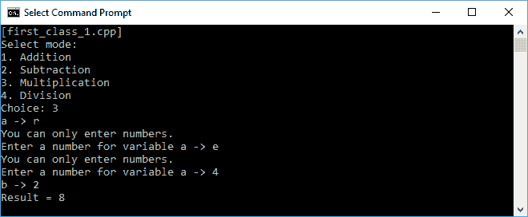
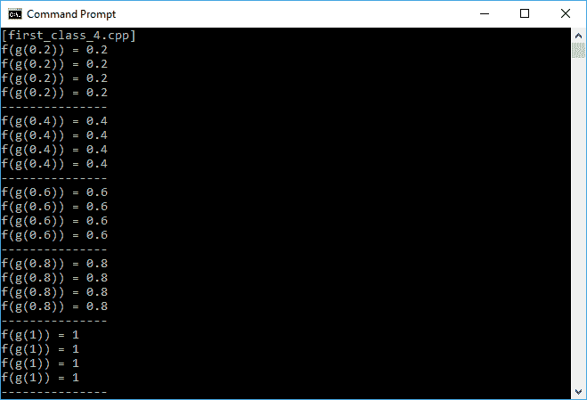
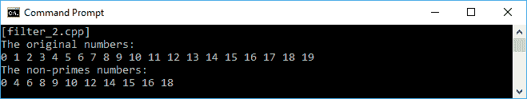
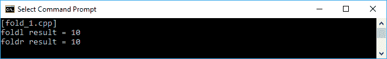
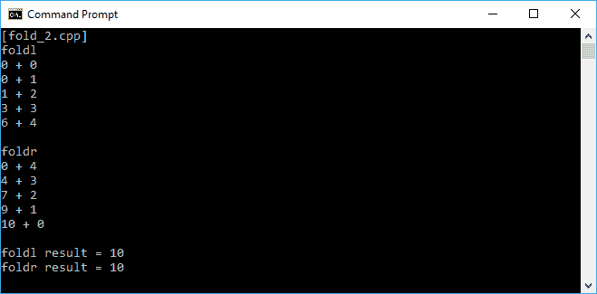
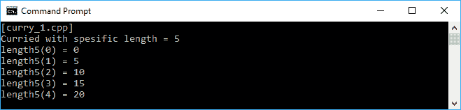
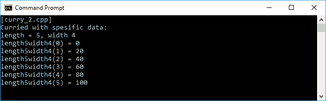

# 函数编程中的函数操作

在前一章中，我们深入讨论了现代 C++ 语言，特别是 C++ 11 中的新特性 Lambda 表达式。正如我们前面所讨论的，Lambda 表达式在简化函数符号时非常有用。因此，在本章中，我们将再次应用 Lambda 表达式的能力，这将在函数代码中使用，尤其是当我们谈论 curry-拆分和减少当前函数的技术时。

在本章中，我们将讨论以下主题:

*   应用一级函数和高阶函数，这样我们的函数不仅可以作为函数调用，还可以赋给任何变量、传递函数和返回函数
*   纯功能，以避免我们的功能的副作用，因为它不再接触外部状态
*   正如本章开头提到的，Currying 是为了减少多参数函数，这样我们就可以计算一系列函数，每个函数中只有一个参数

# 在所有函数中应用第一类函数

一级函数只是一个普通类。我们可以像对待任何其他数据类型一样对待第一类函数。但是，在支持一级函数的语言中，我们可以在不递归调用编译器的情况下完成以下任务:

*   将一个函数作为另一个函数的参数传递
*   将函数分配给变量
*   在集合中存储函数
*   运行时从现有函数创建新函数

幸运的是，C++ 可以用来解决前面的任务。我们将在以下主题中深入讨论它。

# 将一个函数作为另一个函数的参数传递

让我们开始传递一个函数作为函数参数。我们将从四个函数中选择一个，并从其主函数中调用该函数。代码如下所示:

```cpp
    /* first_class_1.cpp */
    #include <functional>
    #include <iostream>

    using namespace std;

    // Defining a type of function named FuncType
    // representing a function
    // that pass two int arguments
    // and return an int value
    typedef function<int(int, int)> FuncType;

    int addition(int x, int y)
    {
      return x + y;
    }

    int subtraction(int x, int y)
    {
      return x - y;
    }

    int multiplication(int x, int y)
    {
      return x * y;
    }

    int division(int x, int y)
    {
      return x / y;
    }

    void PassingFunc(FuncType fn, int x, int y)
    {
      cout << "Result = " << fn(x, y) << endl;
    }

    auto main() -> int
    {
      cout << "[first_class_1.cpp]" << endl;
      int i, a, b;
      FuncType func;

      // Displaying menu for user
      cout << "Select mode:" << endl;
      cout << "1\. Addition" << endl;
      cout << "2\. Subtraction" << endl;
      cout << "3\. Multiplication" << endl;
      cout << "4\. Division" << endl;
      cout << "Choice: ";
      cin >> i;

      // Preventing user to select
      // unavailable modes
      if(i < 1 || i > 4)
      {
         cout << "Please select available mode!";
         return 1;
      }

      // Getting input from user for variable a
      cout << "a -> ";
      cin >> a;

      // Input validation for variable a
      while (cin.fail())
      {
        // Clearing input buffer to restore cin to a usable state
        cin.clear();

        // Ignoring last input
        cin.ignore(INT_MAX, '\n');

        cout << "You can only enter numbers.\n";
        cout << "Enter a number for variable a -> ";
        cin >> a;
      }

      // Getting input from user for variable b
      cout << "b -> ";
      cin >> b;

      // Input validation for variable b
      while (cin.fail())
      {
        // Clearing input buffer to restore cin to a usable state
        cin.clear();

        // Ignoring last input
        cin.ignore(INT_MAX, '\n');

        cout << "You can only enter numbers.\n";
        cout << "Enter a number for variable b -> ";
        cin >> b;
      }
      switch(i)
      {
        case 1: PassingFunc(addition, a, b); break;
        case 2: PassingFunc(subtraction, a, b); break;
        case 3: PassingFunc(multiplication, a, b); break;
        case 4: PassingFunc(division, a, b); break;
      }

      return 0;
    }

```

从前面的代码中，我们可以看到我们有四个函数，我们希望用户选择一个，然后运行它。在 switch 语句中，我们将根据用户的选择调用四个函数之一。我们将把选择的函数传递给`PassingFunc()`，如下面的代码片段所示:

```cpp
    case 1: PassingFunc(addition, a, b); break;
    case 2: PassingFunc(subtraction, a, b); break;
    case 3: PassingFunc(multiplication, a, b); break;
    case 4: PassingFunc(division, a, b); break;

```

我们还有输入验证，以防止用户选择不可用的模式以及输入变量`a`和`b`的非整数值。我们将在屏幕上看到的输出应该如下所示:



前面的截图显示我们从可用模式中选择`Multiplication`模式。然后，我们尝试为变量`a`输入`r`和`e`变量。幸运的是，程序拒绝了它，因为我们已经进行了输入验证。然后，我们将`4`给变量`a`，将`2`给变量`b`。正如我们所料，程序给我们的结果是`8`。

As we can see in the `first_class_1.cpp` program, we use the `std::function` class and the `typedef` keyword to simplify the code. The `std::function` class is used to store, copy, and invoke any callable functions, Lambda expressions, or other function objects, as well as pointers to member functions and pointers to data members. However, the `typedef` keyword is used as an alias name for another type or function.

# 将函数赋给变量

我们还可以给变量分配一个函数，这样我们就可以通过调用变量来调用函数。我们将重构`first_class_1.cpp`，如下所示:

```cpp
    /* first_class_2.cpp */
    #include <functional>
    #include <iostream>

    using namespace std;

    // Defining a type of function named FuncType
    // representing a function
    // that pass two int arguments
    // and return an int value
    typedef function<int(int, int)> FuncType;

    int addition(int x, int y)
    {
      return x + y;
    }

    int subtraction(int x, int y)
    {
      return x - y;
    }

    int multiplication(int x, int y)
    {
      return x * y;
    }

    int division(int x, int y)
    {
      return x / y;
    }

    auto main() -> int
    {
      cout << "[first_class_2.cpp]" << endl;

      int i, a, b;
      FuncType func;

      // Displaying menu for user
      cout << "Select mode:" << endl;
      cout << "1\. Addition" << endl;
      cout << "2\. Subtraction" << endl;
      cout << "3\. Multiplication" << endl;
      cout << "4\. Division" << endl;
      cout << "Choice: ";
      cin >> i;

      // Preventing user to select
      // unavailable modes
      if(i < 1 || i > 4)
      {
        cout << "Please select available mode!";
        return 1;
      }

      // Getting input from user for variable a
      cout << "a -> ";
      cin >> a;

      // Input validation for variable a
      while (cin.fail())
      {
        // Clearing input buffer to restore cin to a usable state
        cin.clear();

        // Ignoring last input
        cin.ignore(INT_MAX, '\n');

        cout << "You can only enter numbers.\n";
        cout << "Enter a number for variable a -> ";
        cin >> a;
      }

      // Getting input from user for variable b
      cout << "b -> ";
      cin >> b;

      // Input validation for variable b
      while (cin.fail())
      {
        // Clearing input buffer to restore cin to a usable state
        cin.clear();

        // Ignoring last input
        cin.ignore(INT_MAX, '\n');

        cout << "You can only enter numbers.\n";
        cout << "Enter a number for variable b -> ";
        cin >> b;
      }

      switch(i)
      {
        case 1: func = addition; break;
        case 2: func = subtraction; break;
        case 3: func = multiplication; break;
        case 4: func = division; break;
      }

      cout << "Result = " << func(a, b) << endl;

      return 0;
    }

```

我们现在将根据用户的选择分配四个函数，并将选择的函数存储在 switch 语句内部的`func`变量中，如下所示:

```cpp
    case 1: func = addition; break;
    case 2: func = subtraction; break;
    case 3: func = multiplication; break;
    case 4: func = division; break;

```

当`func`变量被赋予用户的选择后，代码将像调用函数一样调用该变量，如下一行代码所示:

```cpp
    cout << "Result = " << func(a, b) << endl;

```

如果我们运行代码，我们将在控制台上获得相同的输出。

# 在容器中存储函数

现在，让我们将函数保存到容器中。这里，我们将使用**向量**作为容器。代码编写如下:

```cpp
    /* first_class_3.cpp */
    #include <vector>
    #include <functional>
    #include <iostream>

    using namespace std;

    // Defining a type of function named FuncType
    // representing a function
    // that pass two int arguments
    // and return an int value
    typedef function<int(int, int)> FuncType;

    int addition(int x, int y)
    {
      return x + y;
    }

    int subtraction(int x, int y)
    {
      return x - y;
    }

    int multiplication(int x, int y)
    {
      return x * y;
    }

    int division(int x, int y)
    {
      return x / y;
    }

    auto main() -> int
    {
      cout << "[first_class_3.cpp]" << endl;

      // Declaring a vector containing FuncType element
      vector<FuncType> functions;

      // Assigning several FuncType elements to the vector
      functions.push_back(addition);
      functions.push_back(subtraction);
      functions.push_back(multiplication);
      functions.push_back(division);

      int i, a, b;
      function<int(int, int)> func;

      // Displaying menu for user
      cout << "Select mode:" << endl;
      cout << "1\. Addition" << endl;
      cout << "2\. Subtraction" << endl;
      cout << "3\. Multiplication" << endl;
      cout << "4\. Division" << endl;
      cout << "Choice: ";
      cin >> i;

      // Preventing user to select
      // unavailable modes
      if(i < 1 || i > 4)
      {
        cout << "Please select available mode!";
        return 1;
      }

      // Getting input from user for variable a
      cout << "a -> ";
      cin >> a;

      // Input validation for variable a
      while (cin.fail())
      {
        // Clearing input buffer to restore cin to a usable state
        cin.clear();

        // Ignoring last input
        cin.ignore(INT_MAX, '\n');

        cout << "You can only enter numbers.\n";
        cout << "Enter a number for variable a -> ";
        cin >> a;
      }

      // Getting input from user for variable b
      cout << "b -> ";
      cin >> b;

      // Input validation for variable b
      while (cin.fail())
      {
        // Clearing input buffer to restore cin to a usable state
        cin.clear();

        // Ignoring last input
        cin.ignore(INT_MAX, '\n');

        cout << "You can only enter numbers.\n";
        cout << "Enter a number for variable b -> ";
        cin >> b;
      }

      // Invoking the function inside the vector
      cout << "Result = " << functions.at(i - 1)(a, b) << endl;

      return 0;
    }

```

从前面的代码中，我们可以看到我们创建了一个名为 functions 的新向量，然后向它存储了四个不同的函数。就像前面两个代码示例一样，我们也要求用户选择模式。但是，现在代码变得更简单了，因为我们不需要添加 switch 语句；我们可以通过选择向量索引直接选择函数，如下面的代码片段所示:

```cpp
    cout << "Result = " << functions.at(i - 1)(a, b) << endl;

```

但是，由于向量是一个**零基**索引，我们必须用菜单选项来调整索引。结果将与我们前面的两个代码示例相同。

# 运行时从现有函数创建新函数

现在，让我们在运行时从先前存在的函数中创建一个新函数。假设我们有两个函数集合，第一个是双曲函数，第二个是第一个的反函数。除了这些内置函数，我们还添加了一个用户定义的函数来计算第一个集合中的平方数和第二个集合中平方数的倒数。然后，我们将实现函数组合，并从两个现有函数中构建一个新函数。

**Function composition** is a process to combine two or more simple functions to create a more complex one. The result of each function is passed as the argument to the next function. The final result is obtained from the last function result. In a mathematical approach, we usually use the following notation to function composition: `compose(f, g) (x) = f(g(x))`. Let's suppose we have the following code:

`double x, y, z; // ... y = g(x); z = f(y);`

因此，为了简化符号，我们可以使用函数组合，并对 *z* 有以下符号:

`z = f(g(x));`

如果我们运行双曲函数，然后将结果传递给反函数，我们会看到我们确实得到了传递给双曲函数的初始值。现在，让我们看看下面的代码:

```cpp
    /* first_class_4.cpp */
    #include <vector>
    #include <cmath>
    #include <algorithm>
    #include <functional>
    #include <iostream>

    using std::vector;
    using std::function;
    using std::transform;
    using std::back_inserter;
    using std::cout;
    using std::endl;

    // Defining a type of function named HyperbolicFunc
    // representing a function
    // that pass a double argument
    // and return an double value
    typedef function<double(double)> HyperbolicFunc;

    // Initializing a vector containing four functions
    vector<HyperbolicFunc> funcs = {
      sinh,
      cosh,
      tanh,
      [](double x) {
        return x*x; }
    };

    // Initializing a vector containing four functions
    vector<HyperbolicFunc> inverseFuncs = {
      asinh,
      acosh,
      atanh,
      [](double x) {
        return exp(log(x)/2); }
    };

    // Declaring a template to be able to be reused
    template <typename A, typename B, typename C>
    function<C(A)> compose(
      function<C(B)> f,
      function<B(A)> g) {
        return [f,g](A x) {
            return f(g(x));
      };
    }

    auto main() -> int
    {
      cout << "[first_class_4.cpp]" << endl;

      // Declaring a template to be able to be reused
      vector<HyperbolicFunc> composedFuncs;

      // Initializing a vector containing several double elements
      vector<double> nums;
      for (int i = 1; i <= 5; ++ i)
        nums.push_back(i * 0.2);

      // Transforming the element inside the vector
      transform(
        begin(inverseFuncs),
        end(inverseFuncs),
        begin(funcs),
        back_inserter(composedFuncs),
        compose<double, double, double>);

      for (auto num: nums)
      {
        for (auto func: composedFuncs)
            cout << "f(g(" << num << ")) = " << func(num) << endl;

        cout << "---------------" << endl;
      }

      return 0;
    }

```

正如我们在前面的代码中看到的，我们有两个函数集合- `funcs`和`inverseFuncs`。此外，正如我们之前讨论的那样，`inverseFuncs`函数是`funcs`函数的逆函数。`funcs`函数包含三个内置双曲函数，以及一个用于计算平方数的用户定义函数，而`inverseFuncs`包含三个内置反双曲函数以及一个用于计算平方数倒数的用户定义函数。

As we can see in the preceding `first_class_4.cpp` code, we will use individual classes/functions when calling the `using` keyword. Compared to the other code samples in this chapter, the use of the `using` keyword in individual classes/functions is inconsistent, since we use `using namespace std`. It's because there's a clashing function name in the `std` namespace, so we have to call them individually.

通过使用这两个函数集合，我们将从它们构造一个新的函数。为了达到这个目的，我们将使用`transform()`函数来组合来自两个不同集合的两个函数。代码片段如下:

```cpp
 transform(
 begin(inverseFuncs), 
 inverseFuncs.end(inverseFuncs), 
 begin(funcs), 
 back_inserter(composedFuncs), 
 compose<double, double, double>);

```

现在，我们在`composedFuncs`向量中存储了一个新的函数集合。我们可以迭代集合，并将我们在`nums`变量中提供的值传递给这个新函数。如果运行代码，我们应该在控制台上获得以下输出:



从前面的输出可以看出，无论我们传递给转换函数什么，我们都会得到与输入相同的输出。在这里，我们可以证明 C++ 编程可以用来从两个或多个现有函数组成一个函数。

On the preceding `first_class_4.cpp` code, we use `template<>` in the code. If you need a more detailed explanation about `template<>`, refer to [Chapter 7](7.html), *Running Parallel Execution Using Concurrency*.

# 熟悉高阶函数中的三种函数技巧

我们讨论过，在第一类函数中，C++ 语言将函数视为值，这意味着我们可以将它们传递给其他函数，分配给变量，等等。然而，我们在函数式编程中有另一个术语，即高阶函数，它是对其他函数起作用的函数。这意味着高阶函数可以传递函数作为参数，也可以返回函数。

高阶函数概念可以应用于一般函数，就像数学函数一样，而不是只能应用于函数编程语言的一级函数概念。现在，让我们来看看函数编程中最有用的三个高阶函数- **映射**、**过滤**和**折叠**。

# 使用映射执行每个元素列表

我们不会在 C++ 语言中讨论作为容器的 map，而是高阶函数中的一个特性。此功能用于对列表中的每个元素应用给定的函数，并以相同的顺序返回结果列表。我们可以使用`transform()`功能来达到这个目的。如您所知，我们之前已经讨论过这个函数。但是，我们可以看一下下面这段代码来查看`transform()`功能的使用情况:

```cpp
    /* transform_1.cpp */
    #include <vector>
    #include <algorithm>
    #include <iostream>

    using namespace std;

    auto main() -> int
    {
      cout << "[transform_1.cpp]" << endl;

      // Initializing a vector containing integer element
      vector<int> v1;
      for (int i = 0; i < 5; ++ i)
        v1.push_back(i);

      // Creating another v2 vector
      vector<int> v2;
      // Resizing the size of v2 exactly same with v1
      v2.resize(v1.size());

      // Transforming the element inside the vector
      transform (
        begin(v1),
        end(v1),
        begin(v2),
        [](int i){
            return i * i;});

      // Displaying the elements of v1
      std::cout << "v1 contains:";
      for (auto v : v1)
        std::cout << " " << v;
      std::cout << endl;

      // Displaying the elements of v2
      std::cout << "v2 contains:";
      for (auto v : v2)
        std::cout << " " << v;
      std::cout << endl;

      return 0;
    }

```

如我们前面在高阶函数中对 map 的定义所示，它会将给定的函数应用于列表的每个元素。在前面的代码中，我们尝试使用 Lambda 表达式中的给定函数将`v1`向量映射到`v2`向量，如下所示:

```cpp
 transform (
      begin(v1), 
      end(v1), 
      begin(v2), 
      [](int i){
        return i * i;});

```

如果我们运行代码，我们应该在控制台屏幕上获得以下输出:


正如我们在输出显示中看到的，我们使用 Lambda 表达式中的给定函数 notating 将`v1`转换为`v2`，该函数是输入值的两倍。

# 使用过滤器提取数据

在高阶函数中，Filter 是一种从现有数据结构生成新数据结构的函数，该数据结构将新数据结构中的每个元素与返回布尔值的给定谓词完全匹配。在 C++ 语言中，我们可以应用 C++ 11 中添加的`copy_if()`函数来获取过滤过程。让我们看看下面这段代码，用`copy_if()`函数分析过滤过程:

```cpp
    /* filter_1.cpp */
    #include <vector>
    #include <algorithm>
    #include <iterator>
    #include <iostream>

    using namespace std;

    auto main() -> int
    {
      cout << "[filter_1.cpp]" << endl;

      // Initializing a vector containing integer elements
      vector<int> numbers;
      for (int i = 0; i < 20; ++ i)
        numbers.push_back(i);

       // Displaying the elements of numbers
       cout << "The original numbers: " << endl;
       copy(
        begin(numbers),
        end(numbers),
        ostream_iterator<int>(cout, " "));
       cout << endl;

       // Declaring a vector containing int elements
       vector<int> primes;

      // Filtering the vector
      copy_if(
        begin(numbers),
        end(numbers),
        back_inserter(primes),
        [](int n) {
            if(n < 2) {
                return (n != 0) ? true : false;}
            else {
                for (int j = 2; j < n; ++ j) {
                    if (n % j == 0){
                        return false;}
            }

            return true;
         }});

        // Displaying the elements of primes
        // using copy() function
        cout << "The primes numbers: " << endl;
        copy(
         begin(primes),
         end(primes),
         ostream_iterator<int>(cout, " "));
         cout << endl;

         return 0;
    }

```

正如我们在前面的代码中看到的，我们使用`copy_if()`函数将`numbers`向量过滤成`0`素数向量。我们将通过 Lambda 表达式来决定所选元素是否是质数，就像我们在第 1 章*中使用的`lambda_multiline_func.cpp`代码一样，进入现代 C++* 。我们还将使用`copy()`功能复制要打印的选定矢量中的所有元素。当我们运行前面的代码时，结果应该如下:


除了`copy_if()`功能，我们还可以使用`remove_copy_if()`功能对数据结构进行过滤。使用`remove_copy_if()`函数将省略匹配谓词元素，选择不匹配的元素，并将其存储在新的数据结构中，而不是从现有数据结构中选择匹配谓词元素。让我们重构我们的`filter_1.cpp`代码，创建一个不是素数的新向量。代码如下:

```cpp
    /* filter_2.cpp */
    #include <vector>
    #include <algorithm>
    #include <iterator>
    #include <iostream>

    using namespace std;

    int main()
   {
      cout << "[filter_2.cpp]" << endl;

      // Initializing a vector containing integer elements
      vector<int> numbers;
      for (int i = 0; i < 20; ++ i)
        numbers.push_back(i);

      // Displaying the elements of numbers
      cout << "The original numbers: " << endl;
      copy(
        begin(numbers),
        end(numbers),
        ostream_iterator<int>(cout, " "));
      cout << endl;

      // Declaring a vector containing int elements
      vector<int> nonPrimes;

      // Filtering the vector
      remove_copy_if(
        numbers.begin(),
        numbers.end(),
        back_inserter(nonPrimes),
        [](int n) {
            if(n < 2){
                return (n != 0) ? true : false;}
            else {
                for (int j = 2; j < n; ++ j){
                    if (n % j == 0) {
                        return false;}
            }

            return true;
        }});

      // Displaying the elements of nonPrimes
      // using copy() function
      cout << "The non-primes numbers: " << endl;
      copy(
        begin(nonPrimes),
        end(nonPrimes),
        ostream_iterator<int>(cout, " "));
      cout << endl;

      return 0;
    }

```

从前面突出显示的代码中我们可以看到，我们重构了前面的代码，并使用`remove_copy_if()`函数来选择非质数。如我们所料，控制台窗口将显示以下输出:



我们现在有了非质数，而不是质数，就像我们在`filter_1.cpp`代码中一样。

# 使用 fold 组合列表的所有元素

在函数式编程中，折叠是一种将数据结构简化为单个值的技术。褶皱有两种类型——左褶皱(`foldl`)和右褶皱(`foldr`)。假设我们有一个包含 0、1、2、3 和 4 的列表。让我们使用折叠技术添加列表的所有内容，首先使用`foldl`，然后使用`foldr`。然而，这两者之间有一个显著的区别- `foldl`是左关联的，这意味着我们组合最左边的元素，然后向最右边的元素移动。例如，根据我们的列表，我们将得到以下括号:

```cpp
    ((((0 + 1) + 2) + 3) + 4)

```

而`foldr`是右边的关联，这意味着我们将组合最右边的元素，然后向最左边的元素移动。括号将类似于下面的代码行:

```cpp
    (0 + (1 + (2 + (3 + 4))))

```

现在，让我们看看下面的代码:

```cpp
    /* fold_1.cpp */
    #include <vector>
    #include <numeric>
    #include <functional>
    #include <iostream>

    using namespace std;

    auto main() -> int
    {
      cout << "[fold_1.cpp]" << endl;

      // Initializing a vector containing integer elements
      vector<int> numbers = {0, 1, 2, 3, 4};

      // Calculating the sum of the value
      // in the vector
      auto foldl = accumulate(
        begin(numbers),
        end(numbers),
        0,
        std::plus<int>());

      // Calculating the sum of the value
      // in the vector
      auto foldr = accumulate(
        rbegin(numbers),
        rend(numbers),
        0,
        std::plus<int>());

      // Displaying the calculating result
      cout << "foldl result = " << foldl << endl;
      cout << "foldr result = " << foldr << endl;

      return 0;
    }

```

在 C++ 编程中，我们可以使用`accumulate()`函数应用`fold`技术。正如我们在前面的代码中看到的，我们在`foldl`中使用正向迭代器，而在`foldr`中使用反向迭代器。控制台上的输出应该如下图所示:



正如我们在前面的输出截图中看到的，我们得到了相同的结果，即`foldl`和`foldr`技术。对于那些好奇总和顺序的人，我们可以将前面的代码重构为下面的代码:

```cpp
    /* fold_2.cpp */
    #include <vector>
    #include <numeric>
    #include <functional>
    #include <iostream>

    using namespace std;

    // Function for logging the flow
    int addition(const int& x, const int& y)
    {
      cout << x << " + " << y << endl;
      return x + y;
    }

    int main()
    {
      cout << "[fold_2.cpp]" << endl;

      // Initializing a vector containing integer elements
      vector<int> numbers = {0, 1, 2, 3, 4};

      // Calculating the sum of the value
      // in the vector
      // from left to right
      cout << "foldl" << endl;
      auto foldl = accumulate(
          begin(numbers),
          end(numbers),
          0,
          addition);

      // Calculating the sum of the value
      // in the vector
      // from right to left
      cout << endl << "foldr" << endl;
      auto foldr = accumulate(
          rbegin(numbers),
          rend(numbers),
          0,
          addition);

      cout << endl;

      // Displaying the calculating result
      cout << "foldl result = " << foldl << endl;
      cout << "foldr result = " << foldr << endl;

      return 0;
    }

```

在前面的代码中，我们传递了一个新的`addition()`函数，并将其传递给`accumulate()`函数。从`addition()`功能，我们将跟踪每个元素的操作。现在，让我们运行前面的代码，其输出如下:



从前面的输出截图中，我们可以看到，即使`foldl`和`foldr`给出了完全相同的结果，但它们做出了不同的操作顺序。由于我们将初始值设置为`0`，加法操作开始于将`0`添加到`foldl`技术中的第一个元素和`foldr`技术中的最后一个元素。

We will set the initial value to `0` because `0` is the additive identity that won't impact the addition result. However, in multiplication, we have to consider changing the initial value to `1` since `1` is the identity element for multiplication.

# 避免纯功能的副作用

A **纯函数**是一个每次给它相同的输入时总是返回相同结果的函数。结果不依赖于任何信息或状态，不会产生**副作用**，或功能外的系统状态变化。让我们看看下面这段代码:

```cpp
    /* pure_function_1.cpp */
    #include <iostream>

    using namespace std;

    float circleArea(float r)
    {
      return 3.14 * r * r;
    }

    auto main() -> int
    {
      cout << "[pure_function_1.cpp]" << endl;

      // Initializing a float variable
      float f = 2.5f;

      // Invoking the circleArea() function
      // passing the f variable five times
      for(int i = 1; i <= 5; ++ i)
      {
        cout << "Invocation " << i << " -> ";
        cout << "Result of circleArea(" << f << ") = ";
        cout << circleArea(f) << endl;
      }

      return 0;
    }

```

从前面的代码可以看出，我们有一个名为`circleArea()`的函数，根据给定的半径计算圆的面积。然后我们调用该函数五次，并传递相同的半径值。控制台上的输出应该如下图所示:


正如我们所看到的，在传递相同输入的五次调用中，函数也返回相同的输出。这样我们就可以说`circleArea()`是一个纯函数。现在，让我们看看下面这段代码中不纯函数的样子:

```cpp
    /* impure_function_1.cpp */
    #include <iostream>

    using namespace std;

    // Initializing a global variable
    int currentState = 0;

    int increment(int i)
    {
      currentState += i;
      return currentState;
    }

    auto main() -> int
    {
      cout << "[impure_function_1.cpp]" << endl;

      // Initializing a local variable
      int fix = 5;

      // Involving the global variable
      // in the calculation
      for(int i = 1; i <= 5; ++ i)
      {
        cout << "Invocation " << i << " -> ";
        cout << "Result of increment(" << fix << ") = ";
        cout << increment(fix) << endl;
      }

       return 0;
    }

```

在前面的代码中，我们看到一个名为`increment()`的函数增加了`currentState`变量的值。我们可以看到，`increment()`函数依赖于`currentState`变量的值，所以它不是一个纯函数。让我们通过运行前面的代码来证明它。控制台窗口应显示以下屏幕截图:


我们看到`increment()`函数给出了不同的结果，即使我们传递了相同的输入。这是不纯函数依赖于外部状态或改变外部状态值时的副作用。

我们已经能够区分纯函数和不纯函数。但是，请考虑以下代码:

```cpp
    /* im_pure_function_1.cpp */
    #include <iostream>

    using namespace std;

    // Initializing a global variable
    float phi = 3.14f;

    float circleArea(float r)
    {
      return phi * r * r;
    }

    auto main() -> int
    {
      cout << "[im_pure_function_1.cpp]" << endl;

      // Initializing a float variable
      float f = 2.5f;

      // Involving the global variable
      // in the calculation
      for(int i = 1; i <= 5; ++ i)
      {
        cout << "Invocation " << i << " -> ";
        cout << "Result of circleArea(" << f << ") = ";
        cout << circleArea(f) << endl;
      }

      return 0;
    }

```

前面的代码来自`pure_function_1.cpp`，但是我们添加了一个全局状态`phi`。如果我们运行前面的代码，我们肯定会得到与`pure_function_1.cpp`相同的结果。虽然函数在五次调用中返回相同的结果，但是`im_pure_function_1.cpp`中的`circleArea()`不是一个纯函数，因为它依赖于`phi`变量。

The side effect is not only the change of global state that is done by the function. Printing to the screen is also the side effect. However, since we need to show the result of every code we create, we cannot avoid the existence of printing to screen in our codes. In the next chapter, we will also discuss the immutable state, which is the way we can turn an impure function into a pure function.

# 用 currying 简化多参数函数

Currying 是一种拆分函数的技术，该技术将多个参数用于计算一系列函数，每个函数都有一个参数。换句话说，我们通过减少当前函数来创建基于当前函数的其他函数。假设我们有一个名为`areaOfRectangle()`的函数，它接受两个参数，`length`和`width`。代码是这样的:

```cpp
    /* curry_1.cpp */

    #include <functional>
    #include <iostream>

    using namespace std;

    // Variadic template for currying
    template<typename Func, typename... Args>
    auto curry(Func func, Args... args)
    {
      return [=](auto... lastParam)
      {
        return func(args..., lastParam...);
      };
    }

    int areaOfRectangle(int length, int width)
    {
      return length * width;
    }

    auto main() -> int
    {
      cout << "[curry_1.cpp]" << endl;

      // Currying the areaOfRectangle() function
      auto length5 = curry(areaOfRectangle, 5);

      // Invoking the curried function
      cout << "Curried with spesific length = 5" << endl;
      for(int i = 0; i <= 5; ++ i)
      {
        cout << "length5(" << i << ") = ";
        cout << length5(i) << endl;
      }

      return 0;
    }

```

正如我们在前面的代码中看到的，我们有一个名为`curry`的变量模板和函数。我们将使用这个模板来构造一个 currying function。在正常的函数调用中，我们可以如下调用`areaOfRectangle()`函数:

```cpp
    int i = areaOfRectangle(5, 2);

```

正如我们在前面的代码片段中看到的，我们将`5`和`2`作为参数传递给`areaOfRectangle()`函数。然而，使用 curried 函数，我们可以减少`areaOfRectangle()`函数，所以我们只有一个参数。我们要做的就是调用 curry 函数模板，如下所示:

```cpp
 auto length5 = curry(areaOfRectangle, 5);

```

现在，我们有了`areaOfRectangle()`函数，该函数具有名为`length5`的`length`参数的值。我们更容易调用函数，只添加`width`参数，如以下代码片段所示:

```cpp
 length5(i) // where i is the width parameter we want to pass

```

让我们看看运行前面的代码时在控制台上看到的输出:



变量模板和函数帮助我们将`areaOfRectangle()`函数简化为`length5()`函数。但是，它也可以帮助我们减少具有两个以上参数的函数。假设我们有一个名为`volumeOfRectanglular()`的函数，它传递三个参数。我们也将减少函数，如下面的代码所示:

```cpp
    /* curry_2.cpp */

    #include <functional>
    #include <iostream>

    using namespace std;

    // Variadic template for currying
    template<typename Func, typename... Args>
    auto curry(Func func, Args... args)
    {
      return [=](auto... lastParam)
      {
        return func(args..., lastParam...);
      };
    }

    int volumeOfRectanglular(
      int length,
      int width,
      int height)
     {
        return length * width * height;
     }

    auto main() -> int
    {
      cout << "[curry_2.cpp]" << endl;

      // Currying the volumeOfRectanglular() function
      auto length5width4 = curry(volumeOfRectanglular, 5, 4);

      // Invoking the curried function
      cout << "Curried with spesific data:" << endl;
      cout << "length = 5, width 4" << endl;
      for(int i = 0; i <= 5; ++ i)
      {
        cout << "length5width4(" << i << ") = ";
        cout << length5width4(i) << endl;
      }

      return 0;
    }

```

正如我们在前面的代码中看到的，我们已经成功地将`length`和`width`参数传递给了`volumeOfRectanglular()`函数，然后将其简化为`length5width4()`。我们可以调用`length5width4()`函数，并将剩下的参数`height`传递给它。如果运行前面的代码，下面是我们将在控制台屏幕上看到的输出:



通过使用 currying 技术，我们可以通过减少一个函数来部分评估一个多参数函数，这样它将只传递一个参数。

# 摘要

我们已经讨论了一些操作函数的技术。我们将从中获得许多好处。因为我们可以用 C++ 语言实现第一类函数，所以我们可以将一个函数作为另一个函数的参数传递。我们可以将函数视为数据对象，这样我们就可以将其分配给变量并将其存储在容器中。此外，我们可以从现有的函数组成一个新的函数。此外，通过使用映射、过滤和折叠，我们可以在创建的每个函数中实现高阶函数。

为了获得更好的函数代码，我们必须实现的另一种技术是纯函数，以避免副作用。我们可以重构我们拥有的所有函数，这样它就不会与外部变量或状态对话，也不会从外部状态改变和检索值。此外，为了减少多参数函数以便我们可以评估它的序列，我们可以对我们的函数实现 currying 技术。

在下一章中，我们将讨论另一种避免副作用的技术。我们将使代码中的所有状态都不可变，这样就不会有每次调用函数时都会发生变化的状态。