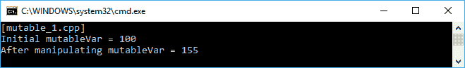
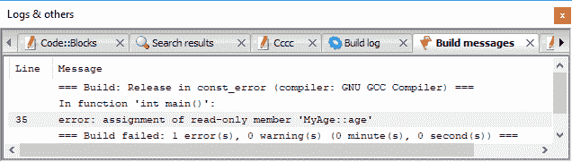
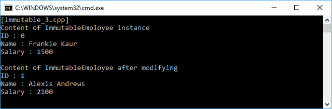

# 将不可变状态应用于函数

在前一章讨论了一级函数和纯函数之后，现在我们来讨论一个可变的和不可变的对象。如您所知，我们必须能够将一个函数传递给一级函数中的另一个函数，并确保如果我们也传递相同的参数，该函数将返回相同的值。我们将讨论的不可变对象可以帮助我们在代码中使用这两个函数式编程概念。我们将在本章中讨论的主题如下:

*   在函数式编程方法中修改变量
*   演示如何使用`const`关键字来避免修改值
*   将一流的纯函数应用于不可变对象
*   将可变对象重构为不可变对象
*   不可变对象优于可变对象的好处

# 从不可变对象理解本质部分

在面向对象编程中，我们通常多次操作变量对象，甚至在类本身内部，我们通常将其描述为属性。此外，我们有时会从特定函数更改全局变量。然而，要在函数式编程中获得不变性，我们必须遵守两个规则。首先，我们不允许改变局部变量。其次，我们必须避免函数中涉及全局变量，因为它会影响函数结果。

# 修改局部变量

当我们谈论变量时，我们谈论的是存储数据的容器。在日常编程中，我们通常会重用自己创建的变量。说清楚一点，我们来看看`mutable_1.cpp`代码。我们有`mutableVar`变量并将`100`存储到其中。然后我们为`i`变量迭代操作它的值。代码编写如下:

```cpp
    /* mutable_1.cpp */
    #include <iostream>

    using namespace std;

    auto main() -> int
    {
      cout << "[mutable_1.cpp]" << endl;

      // Initializing an int variable
      int mutableVar = 100;
      cout << "Initial mutableVar = " << mutableVar;
      cout << endl;

      // Manipulating mutableVar
      for(int i = 0; i <= 10; ++i)
        mutableVar = mutableVar + i;

      // Displaying mutableVar value
      cout << "After manipulating mutableVar = " << mutableVar;
      cout << endl;

      return 0;
    }

```

我们应该在屏幕上看到的结果将如下截图所示:



如我们所见，我们已经成功操纵了`mutableVar`变量。然而，我们将`mutableVar`变量视为可变对象。这是因为我们多次重复使用`mutableVar`变量。换句话说，我们打破了前面讨论的不可改变的规则。如果我们愿意，我们可以将`mutable_1.cpp`代码重构为不可变的代码。我们来分析一下`immutable_1.cpp`代码。在这里，我们将在每次打算更改之前的变量时创建一个新的局部变量。代码编写如下:

```cpp
    /* immutable_1.cpp */
    #include <iostream>

    using namespace std;

    auto main() -> int
    {
      cout << "[immutable_1.cpp]" << endl;

      // Initializing an int variable
      int mutableVar = 100;
      cout << "Initial mutableVar = " << mutableVar;
      cout << endl;

      // Manipulating mutableVar using immutable approach
      int mutableVar0 = mutableVar + 0;
 int mutableVar1 = mutableVar0 + 1;
 int mutableVar2 = mutableVar1 + 2;
 int mutableVar3 = mutableVar2 + 3;
 int mutableVar4 = mutableVar3 + 4;
 int mutableVar5 = mutableVar4 + 5;
 int mutableVar6 = mutableVar5 + 6;
 int mutableVar7 = mutableVar6 + 7;
 int mutableVar8 = mutableVar7 + 8;
 int mutableVar9 = mutableVar8 + 9;
 int mutableVar10 = mutableVar9 + 10;

      // Displaying mutableVar value in mutable variable
      cout << "After manipulating mutableVar = " << mutableVar10;
      cout << endl;

      return 0;
    }

```

可以看到，为了避免改变局部变量`mutableVar`，我们创建了另外十个局部变量。结果存储在`mutableVar10`变量中。然后我们向控制台显示结果。的确，这在我们的编程活动习惯中并不常见。然而，这是我们获得不可变对象的方法。通过这种不变的方法，我们永远不会错过之前的状态，因为我们拥有所有的状态。此外，我们通过运行`immutable_1.cpp`获得的输出与`mutable_1.cpp`代码的输出完全相同，如下图所示:


但是，由于`immutable_1.cpp`中的代码行比`mutable_1.cpp`中的代码多，因此`immutable_1.cpp`代码的性能会比`mutable_1.cpp`代码慢。此外，`mutable_1.cpp`代码当然比`immutable_1.cpp`代码更高效。

# 修改传递给函数的变量

现在，我们将讨论当变量被传递给函数时如何修改它。假设我们有一个名为`n`的变量，它包含一个字符串数据。然后，我们将其作为参数传递给名为`Modify()`的函数。在函数内部，我们操纵名称变量。我们来看看下面的`immutable_2.cpp`代码，分析一下:

```cpp
    /* immutable_2.cpp */
    #include <iostream>

    using namespace std;

    void Modify(string name)
    {
      name = "Alexis Andrews";
    }

    auto main() -> int
    {
      cout << "[immutable_2.cpp]" << endl;

      // Initializing a string variable
      string n = "Frankie Kaur";
      cout << "Initial name = " << n;
      cout << endl;

      // Invoking Modify() function
      // to modify the n variable
      Modify(n);

      // Displaying n value
      cout << "After manipulating = " << n;
      cout << endl;

      return 0;
    }

```

从前面的代码中，我们看到我们将`Frankie Kaur`存储为`n`变量的初始值，然后在`Modify()`函数中修改为`Alexis Andrews`。现在，让我们看看运行前面代码时屏幕上的输出:


从前面的截图中我们可以看到，名称变量仍然包含`Frankie Kaur`作为其值，尽管我们已经在`Modify()`函数内部对其进行了修改。这是因为我们在`main()`函数中传递`n`变量，`Modify()`函数接收存储在`name`变量中的值的副本，因此名称变量保持不变并包含原始值。如果我们将`n`变量作为引用传递，我们可以对其进行变异，如下面的`mutable_2.cpp`代码所示:

```cpp
    /* mutable_2.cpp */
    #include <iostream>

    using namespace std;

    void Modify(string &name)
    {
      name = "Alexis Andrews";
    }

    auto main() -> int
    {
      cout << "[mutable_2.cpp]" << endl;

      // Initializing a string variable
      string n = "Frankie Kaur";
      cout << "Initial name = " << n;
      cout << endl;

      // Invoking Modify() function
      // to modify the n variable
      Modify(n);

      // Displaying n value
      cout << "After manipulating = " << n;
      cout << endl;

      return 0;
    }

```

只需在`Modify()`函数的参数中添加&符号(`&`)即可将参数作为引用传递。屏幕上的输出将如下图所示:


根据前面的截图，由于我们通过了`n`变量的引用，而不是值本身，因此`Modify()`函数中的`n`变量现在已经成功更改。还有另一种使用结构或类类型变异变量的最佳方法，正如我们在下面的`mutable_2a.cpp`代码中看到的:

```cpp
     /* mutable_2a.cpp */
     #include <iostream>

     using namespace std;

 class Name
 {
       public:
 string str;
 };

     void Modify(Name &name)
     {
       name.str = "Alexis Andrews";
     }

     auto main() -> int
     {
       cout << "[mutable_2a.cpp]" << endl;

       // Initializing a string variable
       Name n = {"Frankie Kaur"};
       cout << "Initial name = " << n.str;
       cout << endl;

       // Invoking Modify() function
       // to modify the n variable
       Modify(n);

       // Displaying n value
       cout << "After manipulating = " << n.str;
       cout << endl;

       return 0;
    }

```

正如我们在前面的代码中看到的，我们有一个名为`Name`的类，它包含一个字符串变量。开始时，我们用初始值实例化`Name`类。然后我们修改类内的`str`值。如果我们运行代码，我们将获得与`mutable_2.cpp`代码完全相同的输出。然而，我们看到虽然`n`变量没有改变，`name.str`却改变了。

# 防止修改值

不变性的本质是防止值的修改。在 C++编程语言中，有一个关键字可以防止代码修改值。关键字是`const`，我们将在`const.cpp`代码中使用它。我们有一个名为`MyAge`的类，它包含一个名为`age`的公共字段，我们将其设置为`const`。我们将使用这个`const`字段，代码如下所示:

```cpp
    /* const.cpp */
    #include <iostream>

    using namespace std;

    // My Age class will store an age value
    class MyAge
    {
       public:
         const int age;
         MyAge(const int initAge = 20) :
          age(initAge)
         {
         }
     };

    auto main() -> int
    {
      cout << "[const.cpp]" << endl;

      // Initializing several MyAge variables
      MyAge AgeNow, AgeLater(8);

      // Displaying age property in AgeNow instance
      cout << "My current age is ";
      cout << AgeNow.age << endl;

      // Displaying age property in AgeLater instance
      cout << "My age in eight years later is ";
      cout << AgeLater.age << endl;

      return 0;
    }

```

正如我们在前面的代码中看到的，我们实例化了两个`MyAge`类；他们是`AgeNow`和`AgeLater`。对于`AgeNow`，我们使用年龄的初始值，而对于`AgeLater`，我们将`8`给`age`字段。控制台上的输出如下:


但是，无法将分配插入年龄字段。以下`const_error.cpp`代码将不会运行，因为编译器会拒绝它:

```cpp
    /* const_error.cpp */
    #include <iostream>

    using namespace std;

    // My Age class will store an age value
    class MyAge
    {
       public:
         const int age;
         MyAge(const int initAge = 20) :
          age(initAge)
        {
        }
    };

    auto main() -> int
    {
      cout << "[const_error.cpp]" << endl;

      // Initializing several MyAge variables
      MyAge AgeNow, AgeLater(8);

      // Displaying age property in AgeNow instance
      cout << "My current age is ";
      cout << AgeNow.age << endl;

      // Displaying age property in AgeLater instance
      cout << "My age in eight years later is ";
      cout << AgeLater.age << endl;

      // Trying to assign age property
      // in AgeLater instance
      // However, the compiler will refuse it
      AgeLater.age = 10;

      return 0;
    }

```

如我们所见，我们将`age`值修改为`10`。由于`age`被设置为`const`，编译器将拒绝运行，并将显示以下错误:



因此，我们通过添加`const`关键字成功地创建了一个不可变的对象。

# 将第一类函数和纯函数应用于不可变对象

我们从前面的讨论中获得了对不可变对象的介绍。正如您在上一章中所学习的，我们可以利用一流的函数和纯函数来创建一种不可变的编程方法。借用[章*2*](2.html)*在功能编程*中操作功能的代码，即`first_class_1.cpp`。我们将在下面的`first_class_pure_immutable.cpp`代码中使用`addition()`、`subtraction()`、`multiplication()`和`division()`方法。然后，我们将调用类的纯函数，并将结果赋给变量。代码编写如下:

```cpp
    /* first_class_pure_immutable.cpp */
    #include <iostream>

    using namespace std;

    // MyValue class stores the value
    class MyValue
    {
      public:
        const int value;
        MyValue(int v) : value(v)
       {
       }
    };

    // MyFunction class stores the methods
    class MyFunction
    {
      public:
        const int x, y;

        MyFunction(int _x, int _y) :
        x(_x), y(_y)
       {
       }

      MyValue addition() const
      {
        return MyValue(x + y);
      }

      MyValue subtraction() const
     {
        return MyValue(x - y);
      }

     MyValue multiplication() const
     {
        return MyValue(x * y);
     }

     MyValue division() const
     {
        return MyValue(x / y);
     }
   };

    auto main() -> int
    {
      cout << "[first_class_pure_immutable.cpp]" << endl;

      // Setting the initial value
      // for MyFunction class constructor
      int a = 100;
      int b = 10;

      // Displaying initial value
      cout << "Initial value" << endl;
      cout << "a = " << a << endl;
      cout << "b = " << b << endl;
      cout << endl;

      // Constructing the MyFunction class
      MyFunction func(a, b);

      // Generating wrapper for each function
      // in the MyFunction class
      // so it will be the first-class function
      auto callableAdd = mem_fn(&MyFunction::addition);
      auto callableSub = mem_fn(&MyFunction::subtraction);
      auto callableMul = mem_fn(&MyFunction::multiplication);
      auto callableDiv = mem_fn(&MyFunction::division);

      // Invoking the functions
      auto value1 = callableAdd(func);
      auto value2 = callableSub(func);
      auto value3 = callableMul(func);
      auto value4 = callableDiv(func);

      // Displaying result
      cout << "The result" << endl;
      cout << "addition = " << value1.value << endl;
      cout << "subtraction = " << value2.value << endl;
      cout << "multiplication = " << value3.value << endl;
      cout << "division = " << value4.value << endl;

      return 0;
    }

```

正如我们在前面的代码中看到的那样，`addition()`、`subtraction()`、`multiplication()`和`division()`方法是一个纯函数，因为只要它们接收到相同的输入，它们就会产生相同的输出。我们还制作了一个名为`MyValue`的类，并将其设置为`const`以使其不变。然后，为了使我们的函数成为一流的函数，我们使用`mem_fn()`函数将每个方法包装在`MyFunction`类中。之后，我们用我们得到的函数包装器分配四个变量。屏幕上的输出应该如下图所示:


# 开发不可变对象

在我们讨论了不变的概念之后，现在让我们开发不变的对象。我们将首先从可变对象开始，然后将其重构为不可变对象。

# 从可变对象开始

现在，让我们走得更远。我们将创建另一个类来设计一个不可变的对象。首先，我们将创建一个名为`MutableEmployee`的可变类。我们在那个类中有一些字段和方法。该类的标题类似于下面这段代码:

```cpp
    /* mutableemployee.h */
    #ifndef __MUTABLEEMPLOYEE_H__
    #define __MUTABLEEMPLOYEE_H__

    #include <string>

    class MutableEmployee
    {
      private:
        int m_id;
        std::string m_firstName;
        std::string m_lastName;
        double m_salary;

     public:
       MutableEmployee(
         int id,
         const std::string& firstName,
         const std::string& lastName,
         const double& salary);
       MutableEmployee();

       void SetId(const int id);
       void SetFirstName(
        const std::string& FirstName);
       void SetLastName(
        const std::string& LastName);
       void SetSalary(
        const double& Salary);

       int Id() const {return m_id;}
       std::string FirstName() const {return m_firstName;}
       std::string LastName() const {return m_lastName;}
       double Salary() const {return m_salary;}
     };

    #endif // End of __MUTABLEEMPLOYEE_H__

```

如我们所见，我们有四个字段- `m_id`、`m_firstName`、`m_lastName`和`m_salary`。我们还定义了四种方法来存储这些字段的任何值。这些方法的实现如下:

```cpp
    /* mutableemployee.cpp */
    #include "mutableemployee.h"

    using namespace std;

    MutableEmployee::MutableEmployee() :
      m_id(0),
      m_salary(0.0)
    {
    }

    MutableEmployee::MutableEmployee(
      int id,
      const string& firstName,
      const string& lastName,
      const double& salary) :
        m_id(id),
        m_firstName(firstName),
        m_lastName(lastName),
        m_salary(salary)
    {
    }

    void MutableEmployee::SetId(const int id)
    {
      m_id = id;
    }

    void MutableEmployee::SetFirstName(
      const std::string& FirstName) {
        m_firstName = FirstName;
      }

    void MutableEmployee::SetLastName(
      const std::string& LastName) {
        m_lastName = LastName;
      }

   void MutableEmployee::SetSalary(
      const double& Salary) {
        m_salary = Salary;
      }

```

正如我们在前面的代码中看到的，我们有一个很好的 OOP 代码，其中的成员是私有的；然而，我们可以通过 setters 和 getters 访问它们。换句话说，任何代码都可以改变任何值，使其可变。现在，让我们使用这个即将到来的`mutable_3.cpp`代码来消费前面的类。我们将使用初始值实例化该类，并尝试对其进行变异。代码如下所示:

```cpp
    /* mutable_3.cpp */
    #include <iostream>
    #include "../mutableemployee/mutableemployee.h"

    using namespace std;

    auto main() -> int
    {
      cout << "[mutable_3.cpp]" << endl;

      // Initializing several variables
      string first = "Frankie";
      string last = "Kaur";
      double d = 1500.0;

      // Creating an instance of MutableEmployee
      MutableEmployee me(0, first, last, d);

      // Displaying initial value
      cout << "Content of MutableEmployee instance" << endl;
      cout << "ID : " << me.Id() << endl;
      cout << "Name : " << me.FirstName();
      cout << " " << me.LastName() << endl;
      cout << "Salary : " << me.Salary() << endl << endl;

      // Mutating the instance of MutableEmployee
      me.SetId(1);
      me.SetFirstName("Alexis");
      me.SetLastName("Andrews");
      me.SetSalary(2100.0);

      // Displaying mutate value
      cout << "Content of MutableEmployee after mutating" << endl;
      cout << "ID : " << me.Id() << endl;
      cout << "Name : " << me.FirstName();
      cout << " " << me.LastName() << endl;
      cout << "Salary : " << me.Salary() << endl;

      return 0;
    }

```

正如我们在前面的代码中看到的，初始值存储在三个变量中- `first`、`last`和`d`。然后，我们将使用 setter 成功地变异实例。输出应如下所示:


前面的截图给我们展示了`MutableEmployee`类的变异结果。因为我们需要通过避免突变状态来避免副作用，所以我们必须将类重构为不可变的类。

# 将可变对象重构为不可变对象

正如我们之前讨论的，为了避免副作用，我们必须将我们的类设计成一个不可变的对象。我们将重构之前的`MutableEmployee`类。让我们看看下面的头类:

```cpp
    /* immutableemployee.h */
    #ifndef __IMMUTABLEEMPLOYEE_H__
    #define __IMMUTABLEEMPLOYEE_H__

    #include <string>

    class ImmutableEmployee
    {
      private:
        int m_id;
        std::string m_firstName;
        std::string m_lastName;
        double m_salary;

     public:
       ImmutableEmployee(
         const int id,
         const std::string& firstName,
         const std::string& lastName,
         const double& _salary);
       ImmutableEmployee();

       const int Id() const {
          return m_id;
       }

       const std::string& FirstName() const {
         return m_firstName;
       }

       const std::string& LastName() const {
         return m_lastName;
       }

       const double Salary() const {
        return m_salary;
       }
    };

    #endif // End of __IMMUTABLEEMPLOYEE_H__

```

正如我们在前面的头代码中看到的，我们从前面的`MutableEmployee`类中移除了设置器。我们这样做是为了使`ImmutableEmployee`类不变。标题的实现可以在下面的代码中找到:

```cpp
    /* immutableemployee.cpp */
    #include "immutableemployee.h"

    using namespace std;

    ImmutableEmployee::ImmutableEmployee() :
      m_id(0),
      m_salary(0.0)
      {
      }

    ImmutableEmployee::ImmutableEmployee(
      const int id,
      const string& firstName,
      const string& lastName,
      const double& salary) :
        m_id(id),
        m_firstName(firstName),
        m_lastName(lastName),
        m_salary(salary)
      {
      }

```

现在，让我们分析一下`ImmutableEmployee`类，并将其与`MutableEmployee`类进行比较。以下是我们应该获得的:

*   我们现在将所有成员变量设置为`const`，这意味着变量只能在构造函数中初始化。这将是创建不可变对象的最佳方法。但是`const`成员阻止对其他成员进行移动操作，这是一个整洁的 C++11 优化。
*   getter 方法现在返回`const`引用，而不是值。由于不可变对象不能修改值，最好返回对它们的引用。
*   getters 现在返回`const`值，以避免结果被其他语句修改。它还防止了一些常见的错误，比如使用`=`而不是`==`进行比较。它声明了我们使用不可变类型的事实。

例如，如果我们想要更改`m_firstName`或`m_salary`字段，就会出现问题。为了解决这个问题，我们可以将二传手添加到`ImmutableEmployee`类中。但是，它现在返回`ImmutableEmployee`实例，而不是突变场目标。`immutableemployee.h`代码如下:

```cpp
    /* immutableemployee.h */
    #ifndef __IMMUTABLEEMPLOYEE_H__
    #define __IMMUTABLEEMPLOYEE_H__

    #include <string>

    class ImmutableEmployee
    {
      private:
       int m_id;
       std::string m_firstName;
       std::string m_lastName;
       double m_salary;

      public:
        ImmutableEmployee(
          const int id,
          const std::string& firstName,
          const std::string& lastName,
          const double& _salary);
        ImmutableEmployee();
        ~ImmutableEmployee();

        const int Id() const {
          return m_id;
        }

        const std::string& FirstName() const {
          return m_firstName;
        }

        const std::string& LastName() const {
          return m_lastName;
         }

        const double Salary() const {
          return m_salary;
         }

        const ImmutableEmployee SetId(
          const int id) const {
            return ImmutableEmployee(
              id, m_firstName, m_lastName, m_salary);
          }

       const ImmutableEmployee SetFirstName(
          const std::string& firstName) const {
            return ImmutableEmployee(
              m_id, firstName, m_lastName, m_salary);
          }

       const ImmutableEmployee SetLastName(
          const std::string& lastName) const {
            return ImmutableEmployee(
              m_id, m_firstName, lastName, m_salary);
          }

       const ImmutableEmployee SetSalary(
          const double& salary) const {
            return ImmutableEmployee(
              m_id, m_firstName, m_lastName, salary);
          }
      };

    #endif // End of __IMMUTABLEEMPLOYEE_H__

```

如我们所见，现在，在`immutableemployee.h`文件中，我们有四个设置器。分别是`SetId`、`SetFirstName`、`SetLastName`和`SetSalary`。虽然`ImmutableEmployee`类中 setter 的名称与`MutableEmployee`类完全相同，但是在`ImmutableEmployee`类中，setter 返回类的实例，正如我们前面讨论的那样。通过使用这个`ImmutableEmployee`类，我们必须采用函数方法，因为这个类是不可变的对象。下面的代码是`immutable_3.cpp`，我们从`mutable_3.cpp`文件中重构出来的:

```cpp
    /* immutable_3.cpp */
    #include <iostream>
    #include "../immutableemployee/immutableemployee.h"

    using namespace std;

    auto main() -> int
    {
      cout << "[immutable_3.cpp]" << endl;

      // Initializing several variables
      string first = "Frankie";
      string last = "Kaur";
      double d = 1500.0;

      // Creating the instance of ImmutableEmployee
      ImmutableEmployee me(0, first, last, d);

      // Displaying initial value
      cout << "Content of ImmutableEmployee instance" << endl;
      cout << "ID : " << me.Id() << endl;
      cout << "Name : " << me.FirstName()
      << " " << me.LastName() << endl;
      cout << "Salary : " << me.Salary() << endl << endl;

      // Modifying the initial value
      ImmutableEmployee me2 = me.SetId(1);
      ImmutableEmployee me3 = me2.SetFirstName("Alexis");
      ImmutableEmployee me4 = me3.SetLastName("Andrews");
      ImmutableEmployee me5 = me4.SetSalary(2100.0);

      // Displaying the new value
      cout << "Content of ImmutableEmployee after modifying" << endl;
      cout << "ID : " << me5.Id() << endl;
      cout << "Name : " << me5.FirstName()
      << " " << me5.LastName() << endl;
      cout << "Salary : " << me5.Salary() << endl;

      return 0;
    }

```

正如我们在前面的代码中看到的，我们通过实例化其他四个`ImmutableEmployee`类来修改内容- `me2`、`me3`、`me4`和`me5`。这类似于我们在`immutable_1.cpp`中所做的。然而，我们现在处理一个类。前面代码的输出应该如下图所示:



通过获得前面的输出，我们可以说我们已经成功地修改了`ImmutableEmployee`类的实例，而没有对其进行变异。

# 列举不可变的好处

经过我们的讨论，我们现在知道不可变对象是函数式编程的重要部分。以下是我们可以从不可变对象中获得的好处:

*   我们不会处理副作用。这是因为我们已经确保没有外部状态被修改。每次我们打算更改对象内部的值时，也会创建一个新对象。
*   没有无效对象的状态。因为我们会一直处于不一致的状态。如果我们忘记调用特定的方法，我们肯定会得到正确的状态，因为方法之间没有联系。
*   它将是线程安全的，因为我们可以一起运行许多方法，而不需要锁定在池中运行的第一个方法。换句话说，我们永远不会面临任何同步问题。

# 摘要

首先，在本章中，我们试图用函数的方式修改局部变量。我们不能重用我们创建的变量；相反，当我们需要修改它时，我们必须创建另一个。我们还讨论了修改传递给另一个函数的变量的技术。我们必须通过引用传递参数来改变它，而不是通过值传递参数。

然后，我们挖掘`const`关键字的使用，为函数提供不可变的行为。通过使用这个关键字，我们可以确保类内部的变量不能被修改。另一个讨论是关于应用一流的纯函数——你在上一章学到的东西——来获得不变性的力量。

我们还创建了可变类，然后将其重构为不可变类。我们现在能够区分可变和不可变的对象，并且可以在我们的函数代码中应用它。最后，在本章中，我们列举了不可变对象的好处，因此我们有信心在日常代码中使用它。

另一个问题现在可能会出现在我们的脑海中。如果我们必须处理不可变的对象，我们如何运行递归？我们甚至不能修改方法中的一个变量。在下一章中，我们将通过讨论函数式编程中的递归来解决这个问题。