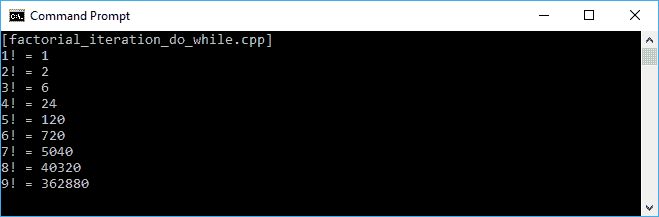
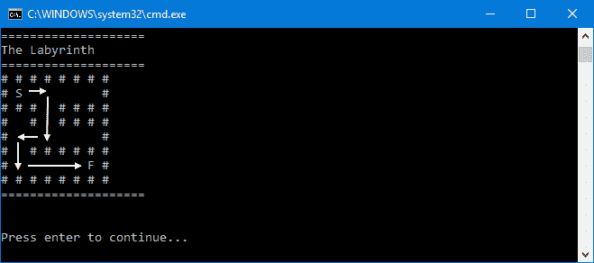
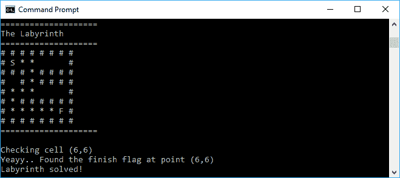
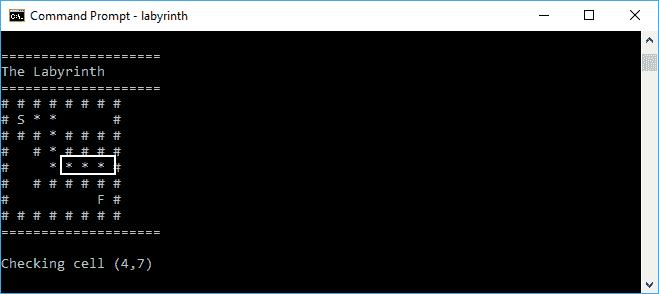
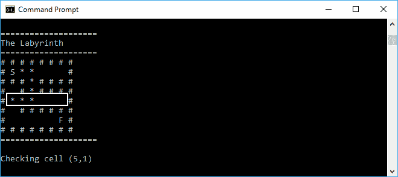

# 使用递归算法重复方法调用

在上一章中，您学习了不可变状态，这些状态使我们无法处理副作用。在本章中，让我们来看看递归的概念。作为面向对象编程的程序员，我们通常使用迭代来重复这个过程，而不是递归。然而，递归比迭代带来更多的好处。例如，一些问题(尤其是数学)很容易用递归解决，幸运的是，所有的算法都可以递归定义。这使得可视化和证明变得非常非常容易。为了进一步了解递归，本章将讨论以下主题:

*   区分迭代和递归调用
*   重复不可变函数
*   用尾部递归寻找更好的递归方法
*   列举了三种递归——函数递归、过程递归和回溯递归

# 递归重复函数调用

作为一名程序员，尤其是在面向对象编程中，我们通常使用迭代技术来重复我们的过程。现在，我们将讨论递归方法来重复我们的过程，并在函数方法中使用它。基本上，递归和迭代执行相同的任务，也就是一件一件地解决复杂的任务，然后组合结果。然而，它们有所不同。迭代过程强调我们应该不断重复这个过程，直到任务完成，而递归强调需要将任务分解成更小的部分，直到我们能够解决任务，然后组合结果。当我们需要运行某个进程直到达到极限时，我们可以使用迭代过程，或者读取一个流直到它达到`eof()`。此外，当我们使用递归时，递归可以给出最佳值，例如，在计算阶乘时。

# 执行迭代过程以重复该过程

我们将从迭代过程开始。正如我们之前讨论的，如果使用递归方法设计阶乘，阶乘的计算会更好。然而，也可以用迭代的方法来设计它。这里，我们将有一个`factorial_iteration_do_while.cpp`代码，我们可以用来计算阶乘。我们将有一个名为`factorial ()`的函数，它传递一个参数来计算我们在参数中传递的阶乘值。代码应该如下所示:

```cpp
    /* factorial_iteration_do_while.cpp */
    #include <iostream>

    using namespace std;

    // Function containing
    // do-while loop iteration

    int factorial (int n)
    {
      int result = 1;
      int i = 1;

      // Running iteration using do-while loop
      do
       {
         result *= i;
       }
       while(++ i <= n);

       return result;
    }

    auto main() -> int
    {
      cout << "[factorial_iteration_do_while.cpp]" << endl;

      // Invoking factorial() function nine times
      for(int i = 1; i < 10; ++ i)
      {
        cout << i << "! = " << factorial(i) << endl;
      }

      return 0;
    } 

```

正如我们在前面的代码中所看到的，我们依赖于`n`的值，我们将其传递给`factorial()`函数，以确定将发生多少次迭代。每次迭代执行时，`result`变量将乘以计数器`i`。最后，`result`变量将通过组合迭代的结果值来保存最后的结果。我们应该在屏幕上获得的输出如下:



迭代中的另一种技术是使用另一个迭代过程。我们可以重构前面的代码来使用`factorial()`函数中的`for`循环。以下是从我们之前的`factorial_iteration_do_while.cpp`代码重构而来的`factorial_iteration_for.cpp`代码:

```cpp
    /* factorial_iteration_do_while.cpp */
    #include <iostream>

    using namespace std;

    // Function containing
    // for loop iteration
    int factorial (int n)
    {
      int result = 1;

      // Running iteration using for loop
 for(int i = 1; i <= n; ++ i)
 {
 result *= i;
 }

      return result;
     }

     auto main() -> int
     {
      cout << "[factorial_iteration_for.cpp]" << endl;

      // Invoking factorial() function nine times
      for(int i = 1; i < 10; ++ i)
       {
         cout << i << "! = " << factorial(i) << endl;
       }

      return 0;
    }

```

如我们所见，我们将`do-while`循环替换为`for`循环。但是，程序的行为将完全相同，因为每次迭代执行时，它还会将当前结果与`i`计数器相乘。在这个迭代的最后，我们将从这个乘法过程中获得最终结果。屏幕应显示以下输出:


既然我们已经成功地执行了迭代来获得阶乘目的，要么使用`do-while`要么使用`for`循环。

It looks too trivial when we try to refactor the `do-while` loop into the `for` loop. As we may know, `for` loops allow us to run through the loop when we know how many times we'd like it to run through the problem, while the `do-while` loops give us more flexibility in what we put in it and when it will stop, for instance `while(i > 0)` or use a Boolean value such as `while(true)`. However, based on the preceding example, we now can say that we can switch the `for` loop or the `do-while` loop into recursion.

# 执行递归过程以重复该过程

我们之前讨论过递归在函数式编程中有更好的性能。我们还在迭代方法中开发了`factorial()`函数。现在，让我们将之前的代码重构为`factorial_recursion.cpp`，它将使用递归方法而不是迭代方法。与我们之前的代码相比，该代码将执行相同的任务。但是，我们将修改`factorial()`函数，使其在函数结束时调用自己。代码编写如下:

```cpp
    /* factorial_recursion.cpp */
    #include <iostream>

    using namespace std;

    int factorial(int n)
    {
      // Running recursion here
      if (n == 0)
        return 1;
      else
        return n * factorial (n - 1);
    }

    auto main() -> int
    {
       cout << "[factorial_recursion.cpp]" << endl;

      for(int i = 1; i < 10; ++ i)
      {
        cout << i << "! = " << factorial(i) << endl;
      }

      return 0;
    }

```

正如我们所看到的，前面代码中的`factorial()`函数调用自己直到`n`是`0`。每次函数调用自己时，都会递减`n`参数。传递的参数为`0`后，该功能将很快返回`1`。与前面的两个代码块相比，我们也将获得相同的输出，如下图所示:


Although recursion gives us the simplicity required to easily maintain code, we have to be aware of the parameter we pass to the recursion function. For instance, in the `factorial()` function in the `factorial_recursion.cpp` code, if we pass the negative number to the `n < 0` function, we will get the infinity loop, and it can crash our device.

# 重复不可变函数

正如我们在上一章中讨论的，我们需要递归地循环不可变函数。假设我们有不可变的`fibonacci()`函数。然后，我们需要将其重构为递归函数。`fibonacci_iteration.cpp`代码以迭代的方式实现`fibonacci()`函数。代码编写如下:

```cpp
    /* fibonacci_iteration.cpp */
    #include <iostream>

    using namespace std;

    // Function for generating
    // Fibonacci sequence using iteration
    int fibonacci(int n)
    {
      if (n == 0)
        return 0;

      int previous = 0;
      int current = 1;

      for (int i = 1; i < n; ++ i)
      {
        int next = previous + current;
        previous = current;
        current = next;
      }

      return current;
    }

    auto main() -> int
    {
      cout << "[fibonacci_iteration.cpp]" << endl;

      // Invoking fibonacci() function ten times
      for(int i = 0; i < 10; ++ i)
       {
         cout << fibonacci(i) << " ";
       }
      cout << endl;

      return 0;
    }

```

正如我们在前面的代码中看到的那样，`fibonacci()`函数是不可变的，因为每次它获得完全相同的`n`输入时，它都会返回相同的值。输出应该如下图所示:


如果需要将其重构为递归函数，可以使用以下`fibonacci_recursion.cpp`代码:

```cpp
    /* fibonacci_recursion.cpp */
    #include <iostream>

    using namespace std;

    // Function for generating
    // Fibonacci sequence using recursion
    int fibonacci(int n)
    {
      if(n <= 1)
        return n;

      return fibonacci(n-1) + fibonacci(n-2);
    }

    auto main() -> int
    {
      cout << "[fibonacci_recursion.cpp]" << endl;

      // Invoking fibonacci() function ten times
      for(int i = 0; i < 10; ++ i)
      {
        cout << fibonacci(i) << " ";
      }
      cout << endl;

      return 0;
    }

```

我们可以看到，前面的代码采用了递归方法，因为它在函数的末尾调用函数本身。现在我们有了递归`fibonacci()`函数，它将在控制台上给出如下输出:


现在，与`fibonacci_iteration.cpp`代码相比，`fibonacci_recursion.cpp`代码显示完全相同的输出。

# 更接近尾部递归

当函数在最后执行递归调用时，会发生尾部递归。它被认为比我们之前开发的非尾部递归代码更好，因为编译器可以更好地优化代码。由于递归调用是该函数执行的最后一条语句，因此在该函数中没有其他事情可做。结果是编译器不需要保存当前函数的堆栈帧。让我们看看下面实现尾部递归的`tail_recursion.cpp`代码:

```cpp
    /* tail_recursion.cpp */
    #include <iostream>

    using namespace std;

    void displayNumber(long long n)
    {
      // Displaying the current n value
      cout << n << endl;

      // The last executed statement 
      // is the recursive call
      displayNumber(n + 1);
    }

    auto main() -> int
    {
      cout << "[tail_recursion.cpp]" << endl;

      // Invoking the displayNumber() function
      // containing tail recursion
      displayNumber(0);

      return 0;
    }

```

正如我们在前面的代码中看到的那样，`displayNumber()`函数是一个尾部递归调用函数，因为它在进程结束时调用自己。事实上，如果我们运行前面的`tail_recursion.cpp`代码，程序不会结束，因为它会增加`displayNumber()`函数中`n`的值。当`n`的值达到`long long`数据类型的最大值时，程序可能会崩溃。但是，程序不会发出堆栈(堆栈溢出)，因为尾部递归不会在堆栈中存储值。

此外，我们可以重构`tail_recursion.cpp`代码中前面的`displayNumber()`函数，使用`goto`关键字，而不是反复调用该函数。重构的代码可以在下面的`tail_recursion_goto.cpp`代码中看到:

```cpp
    /* tail_recursion_goto.cpp */
    #include <iostream>

    using namespace std;

    void displayNumber(long long n)
    {
 loop:
        // Displaying the current n value
        cout << n << endl;

       // Update parameters of recursive call
 // and replace recursive call with goto
 n++ ;
 goto loop;
    }

    auto main() -> int
    {
      cout << "[tail_recursion_goto.cpp]" << endl;

      // Invoking the displayNumber() function
      // containing tail recursion
      displayNumber(0);

      return 0;
    }

```

正如我们在前面的代码中看到的，我们可以用`goto`关键字删除`displayNumber()`函数中的最后一个调用。这就是编译器如何通过执行尾调用消除来优化尾递归，该消除将最后一次调用替换为`goto`关键字。我们还会看到`displayNumber()`功能中不需要堆栈。

Don't forget to compile the code containing a tail recursion with the optimization option provided by the compiler. Since we use GCC, always enable optimization level 2 (`-O2`) to gain the optimized code. The effect of not compiling with optimizations enabled, is that our two preceding programs (`tail_recursion.cpp` and `tail_recursion_goto.cpp`) will crash with the stack overflowed issue. For more information about the optimizations option in GCC, check out [https://gcc.gnu.org/onlinedocs/gcc-7.1.0/gcc/Optimize-Options.html](https://gcc.gnu.org/onlinedocs/gcc-7.1.0/gcc/Optimize-Options.html).

现在，让我们创建一个有用的尾部递归调用。在前一节中，我们已经成功地将迭代函数重构为递归函数。`factorial()`函数现在变成了递归函数，并在函数结束时调用自己。然而，它不是尾部递归，尽管函数在函数的末尾调用自己。如果我们仔细看的话，`factorial(n-1)`返回的值是在`factorial(n)`中使用的，所以对`factorial(n-1)`的调用并不是`factorial(n)`做的最后一件事。

我们可以创建我们的`factorial_recursion.cpp`代码成为尾部递归函数。我们将开发以下`factorial_recursion_tail.cpp`代码，修改`factorial()`功能，并添加一个名为`factorialTail()`的新功能。代码编写如下:

```cpp
    /* factorial_recursion_tail.cpp */
    #include <iostream>

    using namespace std;

 // Function for calculating factorial
 // tail recursion
 int factorialTail(int n, int i)
 {
 if (n == 0)
 return i;

 return factorialTail(n - 1, n * i);
 } 
 // The caller of tail recursion function
 int factorial(int n)
 {
 return factorialTail(n, 1);
 }

    auto main() -> int
    {
      cout << "[factorial_recursion_tail.cpp]" << endl;

      // Invoking fibonacci() function ten times
      for(int i = 1; i < 10; ++ i)
      {
        cout << i << "! = " << factorial(i) << endl;
      }

     return 0;
    }

```

如我们所见，我们已经将`factorial_recursion.cpp`代码中的`factorial()`函数移动到了`factorial_recursion_tail.cpp`代码中需要两个参数的`factorialTail()`函数。因此，在我们调用`factorial(i)`之后，它将调用`factorialTail()`函数。在该功能结束时，`factorialTail()`功能是唯一被调用的功能。下图是`factorial_recursion_tail.cpp`代码的输出，和`factorial_recursion.cpp`代码完全一样。这也证明了我们已经成功地将`factorial_recursion.cpp`代码重构为尾部递归。


# 熟悉函数、过程和回溯递归

现在我们已经了解了一些关于递归的知识，递归函数将从它的体内调用它自己。递归只有在达到某个值时才会停止。我们马上要讨论的递归有三种:**函数递归**、**过程递归**、**回溯递归**；然而，这三种类型的递归可能不是标准术语。函数递归是返回一些值的递归过程。过程递归是一个递归过程，它不返回值，但在每次递归中执行它所采取的动作。回溯递归是一个递归过程，将任务分解成一小组子任务，如果这些子任务不起作用，就可以取消。让我们在下面的讨论中考虑这些递归类型。

# 期待函数递归的结果

在函数递归中，过程试图通过递归地组合子问题的结果来解决问题。我们结合的结果来自子问题的返回值。假设我们有一个计算一个数的幂的问题，例如，`2`幂`2`是`4` ( `2<sup>2</sup> = 4`)。通过使用迭代，我们可以构建像下面的`exponential_iteration.cpp`代码一样的代码。我们有一个名为`power()`的函数，它将通过两个参数传递- `base`和`exp`。符号为`base<sup>exp</sup>`，代码如下:

```cpp
    /* exponential_iteration.cpp */
    #include <iostream>

    using namespace std;

    // Calculating the power of number
    // using iteration
    int power(int base, int exp)
    {
      int result = 1;

      for(int i = 0; i < exp; ++ i)
       {
         result *= base;
       }

       return(result);
    } 

    auto main() -> int
    {
      cout << "[exponential_iteration.cpp]" << endl;

      // Invoking power() function six times
      for(int i = 0; i <= 5; ++ i)
      {
        cout << "power (2, " << i << ") = ";
        cout << power(2, i) << endl;
      }

      return 0;
    }

```

正如我们在前面的代码中看到的，在我们进入递归版本之前，我们首先使用迭代版本，因为我们通常每天使用迭代最多。我们在每次迭代中将`result`值与`base`值相乘。如果我们运行前面的代码，我们将在控制台上获得以下输出:


现在，让我们将前面的代码重构为递归版本。我们将拥有`exponential_recursion.cpp`代码，该代码将具有相同的`power()`函数签名。然而，我们不会使用`for`循环来代替函数在函数末尾调用自己的递归。代码应编写如下:

```cpp
    /* exponential_recursion.cpp */
    #include <iostream>

    using namespace std;

    // Calculating the power of number
    // using recursion
    int power(int base, int exp)
    {
      if(exp == 0)
        return 1;
      else
        return base * power(base, exp - 1);
    }

    auto main() -> int
    {
      cout << "[exponential_recursion.cpp]" << endl;

      // Invoking power() function six times
      for(int i = 0; i <= 5; ++ i)
      {
        cout << "power (2, " << i << ") = ";
        cout << power(2, i) << endl;
      }

      return 0;
    }

```

正如我们前面讨论的函数递归返回值一样，`power()`函数是函数递归，因为它返回`int`值。我们将从每个子函数返回的值中得到最终结果。因此，我们将在控制台上获得以下输出:


# 在过程递归中递归运行任务

因此，我们有一个函数递归，它期待函数的返回值。有时，我们不需要返回值，因为我们从函数内部运行任务。为了达到这个目的，我们可以使用过程递归。假设我们想要置换一个短字符串，以找到它的所有可能的排列。我们只需要在每次执行递归时打印结果，而不是返回值。

我们有以下`permutation.cpp`代码来演示这个任务。它有`permute()`函数，调用一次，然后递归调用`doPermute()`函数。代码应编写如下:

```cpp
    /* permutation.cpp */
    #include <iostream>

    using namespace std;

    // Calculation the permutation
    // of the given string
    void doPermute(
      const string &chosen,
      const string &remaining)
      {
       if(remaining == "")
       {
          cout << chosen << endl;
       }
       else
       {
         for(uint32_t u = 0; u < remaining.length(); ++ u)
         {
            doPermute(
              chosen + remaining[u],
              remaining.substr(0, u)
              + remaining.substr(u + 1));
         }
       }
    }     

    // The caller of doPermute() function
    void permute(
      const string &s)
    {
      doPermute("", s);
    }

    auto main() -> int
    {
      cout << "[permutation.cpp]" << endl;

      // Initializing str variable
      // then ask user to fill in
      string str;
      cout << "Permutation of a string" << endl;
      cout << "Enter a string: ";
      getline(cin, str);

      // Finding the possibility of the permutation
      // by calling permute() function
      cout << endl << "The possibility permutation of ";
      cout << str << endl;
      permute(str);

      return 0;
    }

```

正如我们在前面的代码中看到的，我们要求用户输入一个字符串，然后代码将使用`permute()`函数找到这种排列的可能性。它将以`doPermute()`中的空字符串开始，因为用户给出的字符串也是可能的。控制台上的输出应该如下所示:


# 回溯递归

正如我们之前讨论的，如果子任务不起作用，我们可以撤销这个过程。让我们试试迷宫，在那里我们必须找到从起点到终点的路。假设我们必须找到从`S`到`F`的路，如下图迷宫所示:

```cpp
    # # # # # # # #
    # S           #
    # # #   # # # #
    #   #   # # # #
    #             #
    #   # # # # # #
    #           F #
    # # # # # # # #

```

要解决这个问题，我们必须决定我们需要的路线，找到终点。然而，我们会假设每个选择都是好的，直到我们证明它不是。递归将返回一个布尔值来标记它是否正确。如果我们选择了错误的方式，调用堆栈会展开，它会撤销选择。首先，我们将在代码中绘制`labyrinth`。在下面的代码中，将有`createLabyrinth()`和`displayLabyrinth()`功能。代码如下所示:

```cpp
    /* labyrinth.cpp */
    #include <iostream>
    #include <vector>

    using namespace std;

    vector<vector<char>> createLabyrinth()
    {
      // Initializing the multidimensional vector
      // labyrinth 
      // # is a wall
      // S is the starting point
      // E is the finishing point
      vector<vector<char>> labyrinth = 
      {
        {'#', '#', '#', '#', '#', '#', '#', '#'},
        {'#', 'S', ' ', ' ', ' ', ' ', ' ', '#'},
        {'#', '#', '#', ' ', '#', '#', '#', '#'},
        {'#', ' ', '#', ' ', '#', '#', '#', '#'},
        {'#', ' ', ' ', ' ', ' ', ' ', ' ', '#'},
        {'#', ' ', '#', '#', '#', '#', '#', '#'},
        {'#', ' ', ' ', ' ', ' ', ' ', 'F', '#'},
        {'#', '#', '#', '#', '#', '#', '#', '#'}
     };

     return labyrinth;
    }

    void displayLabyrinth(vector<vector<char>> labyrinth)
    {
      cout << endl;
      cout << "====================" << endl;
      cout << "The Labyrinth" << endl;
      cout << "====================" << endl;

      // Displaying all characters in labyrinth vector
      for (int i = 0; i < rows; i++)
      {
        for (int j = 0; j < cols; j++)
        {
            cout << labyrinth[i][j] << " ";
        }
        cout << endl;
      }
      cout << "====================" << endl << endl;
    }

    auto main() -> int
    {
      vector<vector<char>> labyrinth = createLabyrinth();
      displayLabyrinth(labyrinth);

      string line;
      cout << endl << "Press enter to continue..." << endl;
      getline(cin, line);

      return 0;
    }

```

正如我们所看到的，在前面的代码中没有递归。`createLabyrinth()`函数只是创建一个包含`labyrinth`模式的二维数组，而`displayLabyrinth()`只是将数组显示给控制台。如果运行前面的代码，我们将在控制台上看到以下输出:


从前面的截图中，我们可以看到那里有两点- `S`是起点，`F`是终点。代码必须找到从`S`到达`F`的方法。预期路线如下:



前面截图上的白色箭头是我们期望从`S`到达`F`的路径。现在，让我们开发代码来解决这个迷宫问题。我们将创建一个名为`navigate`的函数，通过计算这三种状态来找到可能的路线:

*   如果我们发现`F`在[ *x* ， *y* ]位置，比如`labyrinth[2][4]`，我们已经解决了问题，那么就返回`true`作为返回值。
*   如果【 *x* 、 *y* 】位置为`#`，则意味着我们面对墙壁，不得不重新访问其他【 *x* 、 *y* 】位置。
*   否则，我们在那个位置打印`*`来标记我们已经访问过了。

分析完这三种状态后，我们将从递归情况开始，如下所示:

*   路径搜索者如果能导航到`row - 1`，并且大于或等于`0` ( `row - 1 >= 0 && navigate(labyrinth, row - 1, col)`)就会向上走
*   路径搜索者如果能导航到`row + 1`会向下走，而且比`8` ( `row + 1 < 8 && navigate(labyrinth, row + 1, col)`)小
*   路径搜索者如果能导航到`col - 1`就向左走，大于等于`0` ( `col - 1 >= 0 && navigate(labyrinth, row, col - 1)`)
*   路径搜索者如果能导航到`col + 1`就会向右走，而且比`8` ( `col + 1 < 8 && navigate(labyrinth, row, col + 1)`)小

我们将具有如下`navigate()`功能:

```cpp
    bool navigate(
      vector<vector<char>> labyrinth,
      int row,
      int col)
    {
      // Displaying labyrinth
      displayLabyrinth(labyrinth);

      cout << "Checking cell (";
      cout << row << "," << col << ")" << endl;

      // Pause 1 millisecond
      // before navigating
      sleep(1);

      if (labyrinth[row][col] == 'F')
      {
        cout << "Yeayy.. ";
        cout << "Found the finish flag ";
        cout << "at point (" << row << ",";
        cout << col << ")" << endl;
        return (true);
      }
      else if (
        labyrinth[row][col] == '#' ||
        labyrinth[row][col] == '*')
      {
        return (false);
      }
      else if (labyrinth[row][col] == ' ')
      {
        labyrinth[row][col] = '*';
      }

      if ((row + 1 < rows) &&
        navigate(labyrinth, row + 1, col))
        return (true);

      if ((col + 1 < cols) &&
        navigate(labyrinth, row, col + 1))
        return (true);

      if ((row - 1 >= 0) &&
        navigate(labyrinth, row - 1, col))
        return (true);

      if ((col - 1 >= 0) &&
        navigate(labyrinth, row, col - 1))
        return (true);

        return (false);
    }

```

我们现在有`navigate()`功能来找出找到`F`的正确路径。但是，在运行`navigate()`功能之前，我们必须确保`S`在那里。然后我们必须开发名为`isLabyrinthSolvable()`的助手函数。它将在迷宫阵列中循环，并通知`S`是否存在。下面的代码片段是`isLabyrinthSolvable()`函数的实现:

```cpp
    bool isLabyrinthSolvable(
      vector<vector<char>> labyrinth)
    {
      int start_row = -1;
      int start_col = -1;
      for (int i = 0; i < rows; i++)
      {
        for (int j = 0; j < cols; j++)
        {
            if (labyrinth[i][j] == 'S')
            {
                start_row = i;
                start_col = j;
                break;
            }
        }
      }

      if (start_row == -1 || start_col == -1)
      {
        cout << "No valid starting point found!" << endl;
        return (false);
      }

      cout << "Starting at point (" << start_row << ",";
      cout << start_col << ")" << endl;

      return navigate(labyrinth, start_row, start_col);
    }

```

正如我们在前面的代码片段中看到的，我们提到了`rows`和`cols`变量。我们将把它们初始化为全局变量，如下面的代码片段所示:

```cpp
    const int rows = 8;
    const int cols = 8;

```

现在，让我们看看下面的代码，如果我们将`navigate()`和`isLabyrinthSolvable()`功能插入到`labyrinth.cpp`代码中:

```cpp
    /* labyrinth.cpp */
    #include <iostream>
    #include <vector>
 #include <unistd.h>

    using namespace std;

 const int rows = 8;
 const int cols = 8;

    vector<vector<char>> createLabyrinth()
    {
      // Initializing the multidimensional vector
      // labyrinth
      // # is a wall
      // S is the starting point
      // E is the finishing point
      vector<vector<char>> labyrinth =
      {
        {'#', '#', '#', '#', '#', '#', '#', '#'},
        {'#', 'S', ' ', ' ', ' ', ' ', ' ', '#'},
        {'#', '#', '#', ' ', '#', '#', '#', '#'},
        {'#', ' ', '#', ' ', '#', '#', '#', '#'},
        {'#', ' ', ' ', ' ', ' ', ' ', ' ', '#'},
        {'#', ' ', '#', '#', '#', '#', '#', '#'},
        {'#', ' ', ' ', ' ', ' ', ' ', 'F', '#'},
        {'#', '#', '#', '#', '#', '#', '#', '#'}
       };

     return labyrinth;
    }

    void displayLabyrinth(
      vector<vector<char>> labyrinth)
    {
      cout << endl;
      cout << "====================" << endl;
      cout << "The Labyrinth" << endl;
      cout << "====================" << endl;
      // Displaying all characters in labyrinth vector
      for (int i = 0; i < rows; i++)
      {
        for (int j = 0; j < cols; j++)
        {
            cout << labyrinth[i][j] << " ";
        }
        cout << endl;
       }
      cout << "====================" << endl << endl;
    }

 bool navigate(
 vector<vector<char>> labyrinth,
 int row,
 int col)
 {
 // Displaying labyrinth
 displayLabyrinth(labyrinth);

 cout << "Checking cell (";
 cout << row << "," << col << ")" << endl;

 // Pause 1 millisecond
 // before navigating
 sleep(1);

 if (labyrinth[row][col] == 'F')
 {
 cout << "Yeayy.. ";
 cout << "Found the finish flag ";
        cout << "at point (" << row << ",";
 cout << col << ")" << endl;
 return (true);
 }
 else if (
 labyrinth[row][col] == '#' ||
 labyrinth[row][col] == '*')
 {
 return (false);
 }
 else if (labyrinth[row][col] == ' ')
 {
 labyrinth[row][col] = '*';
 }

 if ((row + 1 < rows) &&
 navigate(labyrinth, row + 1, col))
 return (true); 
 if ((col + 1 < cols) &&
 navigate(labyrinth, row, col + 1))
 return (true); 
 if ((row - 1 >= 0) &&
 navigate(labyrinth, row - 1, col))
 return (true); 
 if ((col - 1 >= 0) &&
 navigate(labyrinth, row, col - 1))
 return (true); 
 return (false);
 } 
 bool isLabyrinthSolvable(
 vector<vector<char>> labyrinth)
 {
 int start_row = -1;
 int start_col = -1;
 for (int i = 0; i < rows; i++)
 {
 for (int j = 0; j < cols; j++)
 {
 if (labyrinth[i][j] == 'S')
 {
 start_row = i;
 start_col = j;
 break;
 }
 }
 }

 if (start_row == -1 || start_col == -1)
 {
 cerr << "No valid starting point found!" << endl;
 return (false);
 }

 cout << "Starting at point (" << start_row << ",";
 cout << start_col << ")" << endl;

 return navigate(labyrinth, start_row, start_col);
 }

    auto main() -> int
    {
      vector<vector<char>> labyrinth = createLabyrinth();
      displayLabyrinth(labyrinth);

      string line;
      cout << endl << "Press enter to continue..." << endl;
      getline(cin, line);

 if (isLabyrinthSolvable(labyrinth))
 cout << "Labyrinth solved!" << endl;
 else
 cout << "Labyrinth could not be solved!" << endl;

     return 0;
    }

```

正如我们在前面的引用中看到的，在`main()`函数中，我们首先运行`isLabyrinthSolvable()`函数，该函数又调用`navigate()`函数。`navigate()`功能将通过迷宫找到正确的路径。下面是代码的输出:



但是，如果我们跟踪程序如何解决迷宫，当它找到完成标志时，它会面临错误的路线，如下面的截图所示:



我们可以看到，在前面的截图中有一个白色的方块。当它在寻找正确的道路时，这是错误的选择。一旦遇到障碍，它就会返回并找到其他方法。这也将撤销它所做的选择。让我们看看下面的截图，它向我们展示了当递归找到另一条路径并撤销之前的选择时的情形:



在前面的截图中，我们可以看到递归尝试了另一条路由，并且之前失败的路由已经消失，因为回溯递归撤销了该路由。递归现在有了正确的路径，它可以继续，直到找到完成标志。因此，我们现在已经成功地开发了回溯递归。

# 摘要

本章向我们介绍了使用迭代和递归重复函数调用的技术。然而，由于递归比迭代更具功能性，我们着重讨论递归而不是迭代。我们从迭代和递归的区别开始。然后，我们继续讨论将不可变函数重构为递归不可变函数。

在我们了解了递归之后，我们发现了其他更好的递归技术。我们还讨论了尾部递归来获得这种改进的技术。最后，我们列举了三种递归——函数递归、过程递归和回溯递归。当我们期望递归的返回值时，我们通常使用函数递归。否则，我们使用过程递归。而且，如果我们需要分解问题，并在递归不起作用时撤销递归性能，我们可以使用回溯递归来解决问题。

在下一章中，我们将讨论惰性评估，以使代码运行得更快。这将使代码变得高效，因为它将确保不必要的代码不会被执行。