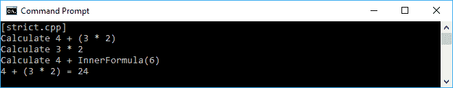
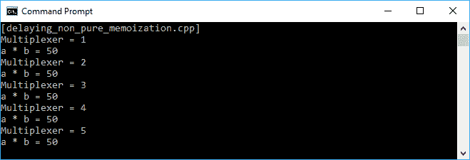
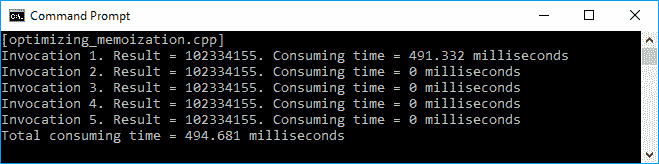
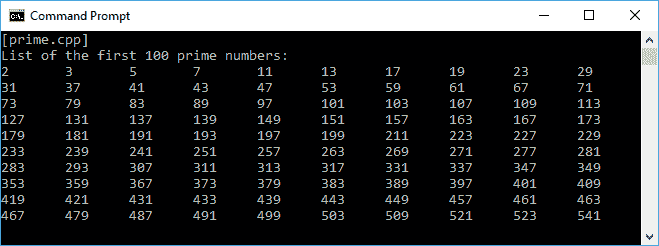
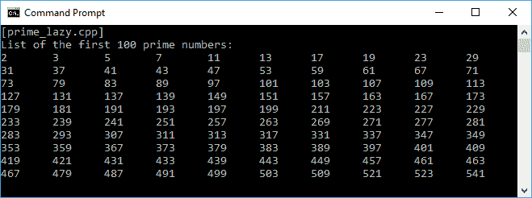

# 使用惰性评估拖延执行过程

在前一章中，我们讨论了在函数方法中重复函数调用的递归。现在，我们将讨论可以使我们的代码变得更高效的懒惰评估，因为它只会在我们需要的时候运行。我们还将应用递归(我们在上一章中讨论过的主题)来生成惰性代码。

在本章中，我们讨论**惰性评估**以使代码运行得更快。这将使代码变得高效，因为它将确保不必要的代码不会被执行。以下是我们将讨论的深入到懒惰评估的主题:

*   区分渴望和懒惰评价的区别
*   使用缓存技术优化代码
*   将急切评估重构为懒惰评估
*   设计可以在其他函数代码中重用的有用类

# 评估表达式

每种编程语言都有自己的策略来确定何时评估函数调用的参数，以及必须传递给参数的值的类型。一种编程语言中使用最多的策略评估有两种- **严格**(急切)评估和**非严格**(懒散)评估。

# 严格评估后立即运行表达式

严格评估用于最命令式的编程语言。它会立即执行我们的代码。假设我们有以下等式:

```cpp
    int i = (x + (y * z));

```

在严格的评估中，将首先计算最里面的括号，然后向外计算前面的等式。这意味着我们将计算`y * z`，然后将结果添加到`x`。为了更清楚，我们来看看下面的`strict.cpp`代码:

```cpp
    /* strict.cpp */
    #include <iostream>

    using namespace std;

    int OuterFormula(int x, int yz)
    {
      // For logging purpose only
      cout << "Calculate " << x << " + ";
      cout << "InnerFormula(" << yz << ")";
      cout << endl;

      // Returning the calculation result
      return x * yz;
    }

    int InnerFormula(int y, int z)
    {
      // For logging purpose only
      cout << "Calculate " << y << " * ";
      cout << z << endl;

      // Returning the calculation result
      return y * z;
    }

    auto main() -> int
    {
      cout << "[strict.cpp]" << endl;

      // Initializing three int variables
      // for the calculation
      int x = 4;
      int y = 3;
      int z = 2;

      // Calculating the expression
      cout << "Calculate " << x <<" + ";
      cout << "(" << y << " * " << z << ")";
      cout << endl;
      int result = OuterFormula(x, InnerFormula(y, z));

      // For logging purpose only
      cout << x << " + ";
      cout << "(" << y << " * " << z << ")";
      cout << " = " << result << endl;

      return 0;
    }

```

正如我们之前讨论的，前面代码的执行将首先是`y * z`，然后我们将结果添加到`x`，正如我们在下面的输出中看到的:



前面的执行顺序是我们通常所期待的。但是，在非严格评估中，我们将对这个执行过程重新排序。

# 用非严格求值延迟表达式

在一个非严格的评价中，首先对`+`算子进行约简，然后我们对内部公式进行约简，就是`(y * z)`。我们会看到评估会从外到内开始。我们将重构我们以前的`strict.cpp`代码，使其成为一个非严格的评估。代码应该如下`non_strict.cpp`代码:

```cpp
    /* non_strict.cpp */
    #include <functional>
    #include <iostream>

    using namespace std;

 int OuterFormulaNonStrict(
 int x,
 int y,
 int z,
 function<int(int, int)> yzFunc)
 {
 // For logging purpose only
 cout << "Calculate " << x << " + ";
 cout << "InnerFormula(" << y << ", ";
 cout << z << ")" << endl;

 // Returning the calculation result
 return x * yzFunc(y, z);
 }

     int InnerFormula(int y, int z)
     {
       // For logging purpose only
       cout << "Calculate " << y << " * ";
       cout << z << endl;

       // Returning the calculation result
       return y * z;
     }

     auto main() -> int
     {
       cout << "[non_strict.cpp]" << endl;

       // Initializing three int variables
       // for the calculation
       int x = 4;
       int y = 3;
       int z = 2;

       // Calculating the expression
       cout << "Calculate " << x <<" + ";
       cout << "(" << y << " * " << z << ")";
       cout << endl;
       int result = OuterFormulaNonStrict(x, y, z, InnerFormula);

       // For logging purpose only
       cout << x << " + ";
       cout << "(" << y << " * " << z << ")";
       cout << " = " << result << endl;

       return 0;
    }

```

如我们所见，我们将`strict.cpp`代码中的`OuterFormula()`函数修改为`non_strict.cpp`代码中的`OuterFormulaNonStrict()`函数。在`OuterFormulaNonStrict()`函数中，除了三个变量- `x`、`y`和`z`之外，我们还传递一个函数作为参数。结果，前面表达式的执行顺序被改变。以下是我们运行`non_strict.cpp`代码时应该在控制台屏幕上看到的内容:


从前面的输出中，我们已经证明我们的代码正在执行非严格评估，因为它现在首先计算加法运算符(`+`)而不是乘法(`*`)。然而，结果仍然是正确的，尽管顺序已经改变。

# 懒惰评价的基本概念

在我们创建懒惰代码之前，让我们讨论一下懒惰评估的基本概念。我们将使用延迟过程来使我们的代码变得懒惰，使用缓存技术来通过避免不必要的计算来提高代码的性能，使用优化技术来通过存储昂贵的函数调用的结果并在相同的输入再次出现时返回缓存的结果来加速代码。在我们研究了这些技术之后，我们将尝试开发真正的惰性代码。

# 推迟进程

懒惰的基本概念是拖延一个过程。在本节中，我们将讨论如何延迟特定流程的执行。我们将创建一个名为`Delay`的新类。我们将在构造类时向其中传递一个函数。除非我们调用`Fetch()`方法，否则该函数不会运行。该功能的实现如下:

```cpp
    template<class T> class Delay
    {
      private:
        function<T()> m_func;

      public:
        Delay(
          function<T()> func)
          : m_func(func)
          {
          }

        T Fetch()
        {
          return m_func();
        }
    };

```

现在，让我们消耗`Delay`类来延迟执行。我们将创建一个名为`delaying.cpp`的文件，它将运行两个功能- `multiply`和`division`。但是，这两个函数只有在我们调用`Fetch()`方法后才会运行。文件的内容如下:

```cpp
    /* delaying.cpp */
    #include <iostream>
    #include <functional>

    using namespace std;

    template<class T> class Delay
    {
      private:
        function<T()> m_func;

      public:
        Delay(function<T()> func) : m_func(func)
        {
        }

        T Fetch()
        {
          return m_func();
        }
    };

    auto main() -> int
    {
      cout << "[delaying.cpp]" << endl;

      // Initializing several int variables
      int a = 10;
      int b = 5;

      cout << "Constructing Delay<> named multiply";
      cout << endl;
      Delay<int> multiply([a, b]()
      {
        cout << "Delay<> named multiply";
        cout << " is constructed." << endl;
        return a * b;
      });

     cout << "Constructing Delay<> named division";
     cout << endl;
     Delay<int> division([a, b]()
     {
       cout << "Delay<> named division ";
       cout << "is constructed." << endl;
       return a / b; 
     });

     cout << "Invoking Fetch() method in ";
     cout << "multiply instance." << endl;
     int c = multiply.Fetch();

     cout << "Invoking Fetch() method in ";
     cout << "division instance." << endl;
     int d = division.Fetch();

     // Displaying the result
     cout << "The result of a * b = " << c << endl;
     cout << "The result of a / b = " << d << endl;

     return 0;
    }

```

正如我们在[第 1 章](1.html)、*深入到现代 C++* 中所讨论的，我们可以使用一个 Lambda 表达式来构建`multiply`和`division`函数。然后我们把它们传递给每个`Delay`建造者。在这个阶段，函数还没有运行。将在调用`Fetch()`方法- `multiply.Fetch()`和`division.Fetch()`后运行。我们将在屏幕上看到的输出应该如下图所示:


正如我们在前面的输出截图中看到的那样，`multiply`和`division`实例是在调用`Fetch()`方法时构造的(见两个白色箭头)，而不是在调用`Delay`类的构造函数时。现在，我们已经成功延迟了执行，可以说流程只有在需要的时候才会执行。

# 使用记忆技术缓存值

我们现在已经通过使用`Delay`类成功地延迟了函数的执行。但是，由于每次调用`Fetch()`方法时都会运行`Delay`类实例的函数，如果函数不纯或有副作用，可能会出现意外结果。让我们通过修改`multiply`函数来重构之前的`delaying.cpp`代码。这个函数现在变成了一个非纯函数，因为它依赖于一个外部变量。代码应该如下所示:

```cpp
    /* delaying_non_pure.cpp */
    #include <iostream>
    #include <functional>

    using namespace std;

    template<class T> class Delay
    {
      private:
        function<T()> m_func;

      public:
        Delay(function<T()> func) : m_func(func)
        {
        }

        T Fetch()
        {
          return m_func();
        }
    };

    auto main() -> int
    {
      cout << "[delaying_non_pure.cpp]" << endl;

      // Initializing several int variables
      int a = 10;
      int b = 5;
      int multiplexer = 0;

      // Constructing Delay<> named multiply_impure
      Delay<int> multiply_impure([&]()
      {
        return multiplexer * a * b;
      });

      // Invoking Fetch() method in multiply_impure instance
      // multiple times
      for (int i = 0; i < 5; ++i)
      {
        ++multiplexer;
        cout << "Multiplexer = " << multiplexer << endl;
        cout << "a * b = " << multiply_impure.Fetch();
        cout << endl;
      }

      return 0;
    }

```

正如我们在前面的代码中看到的，我们现在有了一个名为`multiply_impure`的新 Lambda 表达式，它是我们在`delaying.cpp`代码中创建的`multiply`函数的重构版本。`multiply_impure`函数依赖于`multiplexer`变量，每次调用`Fetch()`方法之前，该变量的值都会增加。以下是我们应该在屏幕上看到的屏幕截图输出:


如我们所见，`Fetch()`方法每次被调用时都会给出不同的结果。我们现在必须重构`Delay`类，以确保每次`Fetch()`方法使用相同的传递参数运行函数时，它都会返回完全相同的结果。为了实现这一点，我们将使用记忆技术来存储函数调用的结果，并在相同的输入再次出现时返回缓存的结果。

我们将`Delay`类重命名为`Memoization`类。这不仅会延迟函数调用，还会记录带有特定传递参数的函数。因此，下一次带有这些参数的函数出现时，函数本身将不会运行，而是返回缓存的结果。为了便于讨论，我们来看看下面的`Memoization`类实现:

```cpp
    template<class T> class Memoization
    {
      private:
        T const & (*m_subRoutine)(Memoization *);
        mutable T m_recordedFunc;
        function<T()> m_func;

        static T const & ForceSubroutine(Memoization * d)
        {
          return d->DoRecording();
        }

        static T const & FetchSubroutine(Memoization * d)
        {
          return d->FetchRecording();
        }

        T const & FetchRecording()
        {
          return m_recordedFunc;
        }

        T const & DoRecording()
        {
          m_recordedFunc = m_func();
          m_subRoutine = &FetchSubroutine;
          return FetchRecording();
        }

     public:
        Memoization(function<T()> func) : m_func(func),
         m_subRoutine(&ForceSubroutine),
         m_recordedFunc(T())
        {
        }

       T Fetch()
       {
         return m_subRoutine(this);
       }
    };

```

正如我们在前面的代码片段中看到的，我们现在有`FetchRecording()`和`DoRecording()`来获取和设置我们已经存储的函数。而且，当构造类时，它会记录传递的函数并保存到`m_subRoutine`。当调用`Fetch()`方法时，该类将检查`m_subRoutine`，并使用当前传递的参数查找它是否具有来自函数的值。如果是，它只是从`m_subRoutine`返回值，而不是运行函数。现在，让我们看看下面消耗`Memoization`类的`delaying_non_pure_memoization.cpp`代码:

```cpp
    /* delaying_non_pure_memoization.cpp */
    #include <iostream>
    #include <functional>

    using namespace std;

    template<class T> class Memoization
    {
      private:
        T const & (*m_subRoutine)(Memoization *);
        mutable T m_recordedFunc;
        function<T()> m_func;

        static T const & ForceSubroutine(Memoization * d)
        {
          return d->DoRecording();
        }

       static T const & FetchSubroutine(Memoization * d)
       {
          return d->FetchRecording();
       }

       T const & FetchRecording()
       {
          return m_recordedFunc;
       }

       T const & DoRecording()
       {
          m_recordedFunc = m_func();
          m_subRoutine = &FetchSubroutine;
          return FetchRecording();
       }

     public:
       Memoization(function<T()> func) : m_func(func),
        m_subRoutine(&ForceSubroutine),
        m_recordedFunc(T())
       {
       }

      T Fetch()
      {
        return m_subRoutine(this);
      }
    };

    auto main() -> int
    {
      cout << "[delaying_non_pure_memoization.cpp]" << endl;

      // Initializing several int variables
      int a = 10;
      int b = 5;
      int multiplexer = 0;

 // Constructing Memoization<> named multiply_impure
 Memoization<int> multiply_impure([&]()
 {
 return multiplexer * a * b;
 });

      // Invoking Fetch() method in multiply_impure instance
      // multiple times
      for (int i = 0; i < 5; ++i)
      {
        ++multiplexer;
        cout << "Multiplexer = " << multiplexer << endl;
        cout << "a * b = " << multiply_impure.Fetch();
        cout << endl;
      }

      return 0;
    }

```

从前面的代码片段中，我们看到我们在`main()`函数中没有太多修改。我们修改的只是用于`multiply_impure`变量的类类型，从`Delay`到`Memoization`。然而，结果现在已经改变了，因为我们将从第五次调用`multiply_impure()`函数中获得完全相同的返回值。我们来看看下面的截图来证明一下:



从前面的截图中，我们可以看到，即使`Multiplexer`的值增加了，计算的回报也总是一样的。这是因为记录了第一次函数调用的返回值，所以不需要为剩下的调用再次运行函数。

As we discussed in [Chapter 2](2.html), *Manipulating Functions in Functional Programming*, having an impure function seems wrong in functional programming. Hiding an impure function behind memoization might also cause a bug if the code really needs a different result (non-cached result). Use the preceding technique for caching the impure function wisely.

# 使用记忆技术优化代码

记忆对于应用于非纯函数或有副作用的函数非常有用。但是，它也可以用来优化代码。通过使用内存化，我们开发的代码将运行得更快。假设我们需要多次运行具有完全相同的传递参数的完全相同的函数。如果代码从我们记录值的地方获取值，而不是运行函数，速度会更快。对于昂贵的函数调用也更好，因为通过使用 memoization，我们不需要一遍又一遍地执行不必要的昂贵的函数调用。
让我们创建一个代码来讨论进一步的优化。我们将使用`Delay`类来证明与`Memoization`类相比，它不是一个优化的代码。我们将拥有消耗`Delay`类的`not_optimize_code.cpp`代码。在这段未优化的代码中，我们将调用我们在[第 4 章](4.html)、*中创建的`fibonacci()`函数，使用递归算法*重复方法调用。我们将把`40`作为参数传递给`fibonacci()`函数，并从`fib40`类实例中调用`Fetch()`方法五次。我们还将使用位于`chrono`头中的`high_resolution_clock`类计算方法每次调用的经过时间，以记录**开始**和**结束**时间，通过用开始值减去结束值来检索经过时间。除了每个`Fetch()`方法调用的经过时间，我们还计算整个代码的经过时间。`not_optimize_code.cpp`代码的实现如下:

```cpp
    /* not_optimize_code.cpp */
    #include <iostream>
    #include <functional>
    #include <chrono>

    using namespace std;

    template<class T> class Delay
    {
      private:
        function<T()> m_func;

      public:
        Delay(function<T()> func): m_func(func)
        {
        }

        T Fetch()
        {
          return m_func();
        }
    };

    // Function for calculating Fibonacci sequence
    int fibonacci(int n)
    {
      if(n <= 1)
         return n;
      return fibonacci(n-1) + fibonacci(n-2);
    }

    auto main() -> int
    {
      cout << "[not_optimize_code.cpp]" << endl;

      // Recording start time for the program
      auto start = chrono::high_resolution_clock::now();

      // Initializing int variable to store the result
      // from Fibonacci calculation
      int fib40Result = 0;

      // Constructing Delay<> named fib40
      Delay<int> fib40([]()
      {
        return fibonacci(40);
      });

      for (int i = 1; i <= 5; ++i)
      {
        cout << "Invocation " << i << ". ";

        // Recording start time
        auto start = chrono::high_resolution_clock::now();

        // Invoking the Fetch() method
        // in fib40 instance
        fib40Result = fib40.Fetch();

        // Recording end time
        auto finish = chrono::high_resolution_clock::now();

        // Calculating the elapsed time
        chrono::duration<double, milli> elapsed = finish - start;

        // Displaying the result
        cout << "Result = " << fib40Result << ". ";

        // Displaying elapsed time
        // for each fib40.Fetch() invocation
        cout << "Consuming time = " << elapsed.count();
        cout << " milliseconds" << endl;
      }

       // Recording end time for the program
       auto finish = chrono::high_resolution_clock::now();

       // Calculating the elapsed time for the program
       chrono::duration<double, milli> elapsed = finish - start;

       // Displaying elapsed time for the program
       cout << "Total consuming time = ";
       cout << elapsed.count() << " milliseconds" << endl;

       return 0;
    }

```

现在，让我们运行代码来获得前面代码过程的运行时间。以下截图是我们将在屏幕上看到的内容:


从前面的截图中，我们可以看到我们需要大约`2357.79`毫秒来处理代码。每次调用`fib40.Fetch()`方法，平均需要大约`470`毫秒，尽管我们将完全相同的参数传递给`fibonacci()`函数，也就是`40`。现在，让我们看看如果我们在前面的代码中使用记忆化技术会发生什么。我们不会修改太多代码，只是重构`fib40`的实例化。它不是从`Delay`类实例化，而是从`Memoization`类实例化。代码应如下所示:

```cpp
    /* optimizing_memoization.cpp */
    #include <iostream>
    #include <functional>
    #include <chrono>

    using namespace std;

    template<class T> class Memoization
    {
      private:
        T const & (*m_subRoutine)(Memoization *);
        mutable T m_recordedFunc;
        function<T()> m_func;

        static T const & ForceSubroutine(Memoization * d)
        {
          return d->DoRecording();
        }

        static T const & FetchSubroutine(Memoization * d)
        {
          return d->FetchRecording();
        }

        T const & FetchRecording()
        {
          return m_recordedFunc;
        }

        T const & DoRecording()
        {
          m_recordedFunc = m_func();
          m_subRoutine = &FetchSubroutine;
          return FetchRecording();
        }

      public:
        Memoization(function<T()> func): m_func(func),
          m_subRoutine(&ForceSubroutine),
          m_recordedFunc(T())
          {
          }

        T Fetch()
        {
          return m_subRoutine(this);
        }
     };

       // Function for calculating Fibonacci sequence
       int fibonacci(int n)
       {
         if(n <= 1)
           return n;
           return fibonacci(n-1) + fibonacci(n-2);
       }

       auto main() -> int
       {
         cout << "[optimizing_memoization.cpp]" << endl;

         // Recording start time for the program
         auto start = chrono::high_resolution_clock::now();

         // Initializing int variable to store the result
         // from Fibonacci calculation
         int fib40Result = 0;

         // Constructing Memoization<> named fib40
 Memoization<int> fib40([]()
 {
 return fibonacci(40);
 });

         for (int i = 1; i <= 5; ++i)
         {
           cout << "Invocation " << i << ". ";

           // Recording start time
           auto start = chrono::high_resolution_clock::now();

           // Invoking the Fetch() method
           // in fib40 instance
           fib40Result = fib40.Fetch();

           // Recording end time
           auto finish = chrono::high_resolution_clock::now();

           // Calculating the elapsed time
           chrono::duration<double, milli> elapsed = finish - start;

           // Displaying the result
           cout << "Result = " << fib40Result << ". ";

           // Displaying elapsed time
           // for each fib40.Fetch() invocation
           cout << "Consuming time = " << elapsed.count();
           cout << " milliseconds" << endl;
       }

          // Recording end time for the program
          auto finish = chrono::high_resolution_clock::now();

          // Calculating the elapsed time for the program
          chrono::duration<double, milli> elapsed = finish - start;

          // Displaying elapsed time for the program
          cout << "Total consuming time = ";
          cout << elapsed.count() << " milliseconds" << endl;

          return 0;
     }

```

以下是我们运行`optimizing_memoization.cpp`代码时在控制台屏幕上看到的内容:



令人惊讶的是，我们只需要`494.681`毫秒来执行`optimizing_memoization.cpp`代码。与`not_optimize_code.cpp`码相比，该码的速度大约快`4.7`倍。发生这种情况是因为代码在将`40`传递给其参数时成功地缓存了`fibonacci()`函数的结果。每次我们再次调用`fib40.Fetch()`方法，它都会再次调用`fibonacci()`函数，输入完全相同。代码将只返回缓存的结果，这样就可以避免运行不必要的昂贵的函数调用。

# 行动中的懒惰评价

讨论了惰性评估的基本概念后，让我们通过用惰性方法设计代码来深入研究惰性评估。在本节中，我们将首先开发一个急切的评估代码，然后将该代码重构为懒惰的评估代码。我们开发的代码将生成一系列素数。首先，我们将使用`for`循环迭代整数，以获得热切求值中的素数。以下`prime.cpp`代码就是我们正在谈论的:

```cpp
    /* prime.cpp */
    #include <iostream>
    #include <cmath>

    using namespace std;

    bool PrimeCheck(int i)
    {
      // All even numbers are not prime number
      // except 2
      if ((i % 2) == 0)
      {
        return i == 2;
      }

      // Calculating the square root of i
      // and store in int data type variable
      // if the argument i is not even number,
      int sqr = sqrt(i);

      // For numbers 9 and below,
      // the prime numbers is simply the odd numbers
      // For number above 9
      // the prime numbers is all of odd numbers
      // except the square number
      for (int t = 3; t <= sqr; t += 2)
      {
        if (i % t == 0)
        {
            return false;
        }
      }

       // The number 1 is not prime number
       // but still passing the preceding test
       return i != 1;
    }

    auto main() -> int
    {
      cout << "[delaying.cpp]" << endl;

      // Initializing a counting variable
      int n = 0;

      // Displaying the first 100 prime numbers
      cout << "List of the first 100 prime numbers:" << endl;
      for (int i = 0; ; ++i)
      {
        if (PrimeCheck(i))
        {
            cout << i << "\t";

            if (++n == 100)
                return 0;
        }
      }

      return 0;
    }

```

正如我们在前面的代码中看到的，我们有一个简单的`PrimeCheck()`函数来分析整数是否是素数。之后，代码使用`for`循环迭代无穷整数，然后检查它是否是质数。如果我们有一百个质数，循环就结束了。下面的截图是我们应该看到的控制台上的输出:



我们现在有了一个使用热切求值生成素数的代码。正如我们在前面的截图中看到的，我们使用`for`循环生成了一百个质数。接下来，我们将把它重构为惰性代码。

# 设计块和行类

在`prime.cpp`代码中，我们使用`for`循环生成一行整数。在这一行中，有几个数字被称为**组块**。现在，在我们重构代码之前，我们将准备一个名为`Row`和`Chunk`的类供我们进一步讨论。根据我们前面的类比，`Row`类将保存整数序列，`Chunk`类将保存单个数字。我们将从数据中最小的部分开始，也就是块。这里是`Chunk`类的实现:

```cpp
    template<class T> class Chunk
    {
      private:
        T m_value;
        Row<T> m_lastRow;

      public:
        Chunk()
         {
         }

        Chunk(T value, Row<T> lastRow): m_value(value),
         m_lastRow(std::move(lastRow))
        {
        }

        explicit Chunk(T value) : m_value(value)
        {
        }

        T Value() const
        {
          return m_value;
        }

        Row<T> ShiftLastToFirst() const
        {
          return m_lastRow;
        }
    };

```

由于`Row`类是由几个`Chunk`类构成的，除了`Chunk`本身的值之外，`Chunk`类还有当前`Row`中的下一个值`Chunk`，由`m_lastRow`成员变量标注。我们也可以通过调用`ShiftLastToFirst()`方法得到`m_lastRow`值。现在，让我们转到`Row`课。该类的实现如下:

```cpp
    template<class T> class Row
    {
      private:
        std::shared_ptr <Memoization<Chunk<T>>>
        m_lazyChunk;

      public:
         Row()
         {
         }

         explicit Row(T value)
         {
           auto chunk = ChunkPreparation<T>(value);
           m_lazyChunk = std::make_shared<Memoization<Chunk<T>>> 
           (chunk);
         }

         Row(T value, Row row)
         {
           auto chunk = ChunkPreparation<T>( value, std::move(row));

           m_lazyChunk = std::make_shared<Memoization<Chunk<T>>>(
           chunk);
         }

         Row(std::function<Chunk<T>()> func): m_lazyChunk(
         std::make_shared<Memoization<Chunk<T>>>(func))
         {
         }

         bool IsEmpty() const
         {
           return !m_lazyChunk;
         }

         T Fetch() const
         {
           return m_lazyChunk->Fetch().Value();
         }

         Row<T> ShiftLastToFirst() const
         {
          return m_lazyChunk->Fetch().ShiftLastToFirst();
         }

         Row Pick(int n) const
         {
           if (n == 0 || IsEmpty())
            return Row();

          auto chunk = m_lazyChunk;
          return Row([chunk, n]()
          {
            auto val = chunk->Fetch().Value();
            auto row = chunk->Fetch().ShiftLastToFirst();
            return Chunk<T>(val, row.Pick(n - 1));
          });
         }
    };

```

正如我们在前面的代码片段中看到的那样，`Row`类只有一个私有成员来存储`Chunk`数据的记忆。`Row`类有四个构造函数，我们将在下一个代码中使用它们。它还有`Fetch()`方法，我们在前一节设计`Memoization`类时得到的，用来得到`m_lazyChunk`值。其他方法对我们接下来的惰性代码也很有用。`IsEmpty()`方法会检查`m_lazyChunk`值是否为空，`ShiftLastToFirst()`方法会取`m_lazyChunk`的最后一行，`Pick(int n)`方法会取出第一个`n`行的元素，如果以后需要取出一百个整数质数，我们会用到。

我们还可以看到其中一个`Row`构造函数正在调用`ChunkPreparation`类构造函数。`ChunkPreparation`类将使用给定值和最后一行值初始化一个新的`Chunk`类构造函数。该类的实现如下:

```cpp
    template<class T> class ChunkPreparation
    {
      public:
        T m_value;
        Row<T> m_row;

        ChunkPreparation(T value, Row<T> row) :
          m_value(value),
          m_row(std::move(row))
          {
          }

        explicit ChunkPreparation(T value) :
          m_value(value)
          {
          }

        Chunk<T> operator()()
        {
          return Chunk<T>(
            m_value,
            m_row);
        }
    };

```

我们可以看到，通过调用`operator ()`，新的`Chunk`将以给定的`m_value`和`m_row`值生成。

# 连接几行

当我们计划生成一行素数时，我们必须能够将当前行与代码生成的新行连接起来。为了满足这一需求，下面是连接两行的`ConcatenateRows()`函数的实现:

```cpp
    template<class T> Row<T> ConcatenateRows(
      Row<T> leftRow,
      Row<T> rightRow)
      {
        if (leftRow.IsEmpty())
          return rightRow;

        return Row<T>([=]()
        {
          return Chunk<T>(
            leftRow.Fetch(),
            ConcatenateRows<T>(
             leftRow.ShiftLastToFirst(),
             rightRow));
         });
       }

```

当我们查看前面的代码片段时，很清楚`ConcatenateRows()`函数是做什么的。如果`leftRow`还是空的，就退回第二排，也就是`rightRow`。如果`leftRow`和`rightRow`可用，我们可以返回已经形成一行的给定行的块。

# 迭代每个行类的元素

构造素数行后，我们需要迭代每行的元素来操作它，例如，将值打印到控制台。为此，我们必须开发以下`ForEach()`方法:

```cpp
    template<class T, class U> void ForEach( Row<T> row, U func)
     {
        while (!row.IsEmpty())
        {
          func(row.Fetch());
          row = row.ShiftLastToFirst();
         }
     }

```

我们将把行本身和一个函数传递给`ForEach()`方法。我们传递给它的函数将对该行的每个元素运行。

For our convenience in developing the lazy code in this chapter, I will bundle our previous discussion `template` class into a single header file named `lazyevaluation.h`; we can also reuse it for other projects. The header will contain the `Memoization`, `Row`, `Chunk`, `ChunkPreparation`, `ConcatenateRows`, and `ForEach` template class. You can create the header file yourself or download it from the code repository on the Packt website ([https://github.com/PacktPublishing/LearningCPPFunctionalProgramming](https://github.com/PacktPublishing/LearningCPPFunctionalProgramming)).

# 生成无限整数行

现在是时候生成无限整数行了，就像我们在前面的`prime.cpp`代码中使用`for`循环一样。然而，我们现在将创建一个名为`GenerateInfiniteIntRow()`的新函数，从几个整数块中生成一个整数行。下面的代码片段是函数的实现:

```cpp
    Row<int> GenerateInfiniteIntRow( int initialNumber)
    {
      return Row<int>([initialNumber]()
      {
        return Chunk<int>(
            initialNumber,
            GenerateInfinityIntRow(
             initialNumber + 1));
      });
    }

```

正如我们所看到的，首先，我们从`initialNumber`到无限创建`Chunk`。这些块将在最后转换成`Row`数据类型。为了停止这个递归函数，我们可以在`Row`类中调用`Pick()`方法。

# 生成无限素数行

在成功生成无限个数字之后，我们现在必须将行限制为只生成质数。我们将从`prime.cpp`代码修改`CheckPrime()`功能。我们将改变函数的返回值，如果不是质数`Row<void*>(nullptr)`或者相反的话`Row<void*>()`。该功能的实现应如下所示:

```cpp
    Row<void*> PrimeCheck(int i)
    {
      if ((i % 2) == 0)
      {
        if (i == 2)
            return Row<void*>(nullptr);
        else
            return Row<void*>();
      }

      int sqr = sqrt(i);

      for (int t = 3; t <= sqr; t = t + 2)
      {
        if (i % t == 0)
        {
            return Row<void*>();
        }
      }

      if (i == 1)
        return Row<void*>();
      else
        return Row<void*>(nullptr);
    }

```

为什么我们需要改变函数的返回值？因为我们想将返回值传递给`JoiningPrimeNumber()`函数，该函数将把生成的 Chunk 与以下实现连接起来:

```cpp
    template<class T, class U> 
    auto JoiningPrimeNumber(
      Row<T> row, U func) -> decltype(func())
      {
         return JoiningAllRows(
           MappingRowByValue(row, func));
      }

```

此外，`MappingRowByValue()`函数会将给定的行映射到给定的函数。该功能的实现如下:

```cpp
    template<class T, class U> 
    auto MappingRowByValue(
      Row<T> row, U func) -> Row<decltype(func())>
    {
      using V = decltype(func());

      if (row.IsEmpty())
        return Row<V>();

      return Row<V>([row, func]()
      {
        return Chunk<V>(
          func(),
          MappingRowByValue(
            row.ShiftLastToFirst(),
            func));
      });
    }

```

使用`JoiningPrimeNumber()`函数成功连接所有素数后，我们必须使用`Binding()`函数将其绑定到现有行，实现如下:

```cpp
    template<class T, class U> Row<T> 
    Binding( Row<T> row, U func)
    {
       return JoiningAllRows( MappingRow( row, func));
    }

```

从前面的代码片段中，`MappingRow()`函数将给定的行映射到给定的函数，然后`JoiningAllRows()`将连接来自`MappingRow()`返回值的所有行。`MappingRow()`和`JoiningAllRows()`功能的实现如下:

```cpp
    template<class T, class U>
    auto MappingRow(
      Row<T> row, U func) -> Row<decltype(
        func(row.Fetch()))>
      {
        using V = decltype(func(row.Fetch()));

        if (row.IsEmpty())
          return Row<V>();

        return Row<V>([row, func]()
        {
          return Chunk<V>(func(
            row.Fetch()),
            MappingRow(
              row.ShiftLastToFirst(),
              func));
       });
    }

    template<class T> Row<T> 
    JoiningAllRows(
      Row<Row<T>> rowOfRows)
    {
      while (!rowOfRows.IsEmpty() && 
        rowOfRows.Fetch().IsEmpty())
      {
        rowOfRows = rowOfRows.ShiftLastToFirst();
      }

     if (rowOfRows.IsEmpty()) 
        return Row<T>();

     return Row<T>([rowOfRows]()
     {
        Row<T> row = rowOfRows.Fetch();

        return Chunk<T>(
          row.Fetch(), 
          ConcatenateRows(
            row.ShiftLastToFirst(), 
            JoiningAllRows(
              rowOfRows.ShiftLastToFirst())));
     });
    }

```

现在，我们可以创建一个函数来限制无限整数行，实现如下:

```cpp
    Row<int> GenerateInfinitePrimeRow()
    {
      return Binding(
        GenerateInfiniteIntRow(1),
        [](int i)
        {
          return JoiningPrimeNumber(
            PrimeCheck(i),
            [i]()
            {
              return ConvertChunkToRow(i);
            });
        });
     }

```

由于`JoiningPrimeNumber()`函数的第二个参数需要一行作为数据类型，我们需要使用`ConvertChunkToRow()`函数将`Chunk`转换为`Row`，实现如下:

```cpp
    template<class T> Row<T> 
    ConvertChunkToRow(
      T value)
      {
        return Row<T>([value]()
        {
          return Chunk<T>(value);
        });
      }

```

现在我们可以使用所有前面的类和函数来重构我们的`prime.cpp`代码。

# 将急切评估重构为懒惰评估

我们拥有将`prime.cpp`代码重构为惰性代码所需的所有功能。我们将创建一个`prime_lazy.cpp`代码，该代码将首先生成无限整数，并选择其元素的前一百个。之后，我们迭代 100 个元素，并将它们交给函数，函数将在控制台上打印值。代码应该如下所示:

```cpp
    /* prime_lazy.cpp */
    #include <iostream>
    #include <cmath>
    #include "../lazyevaluation/lazyevaluation.h"

    using namespace std;

    Row<void*> PrimeCheck(int i)
    {
      // Use preceding implementation
    }

    Row<int> GenerateInfiniteIntRow(
      int initialNumber)
    {
      // Use preceding implementation
    }

    template<class T, class U>
    auto MappingRow(
      Row<T> row, U func) -> Row<decltype(
        func(row.Fetch()))>
      {     
        // Use preceding implementation
      }

    template<class T, class U>
    auto MappingRowByValue(
      Row<T> row, U func) -> Row<decltype(func())>
      {
        // Use preceding implementation
      }

    template<class T> Row<T>
    ConvertChunkToRow(
      T value)
    {
      // Use preceding implementation
    }

    template<class T> Row<T>
    JoiningAllRows(
      Row<Row<T>> rowOfRows)
    {
      // Use preceding implementation
    }

    template<class T, class U> Row<T>
    Binding(
      Row<T> row, U func)
      {
        // Use preceding implementation
      }

    template<class T, class U>
    auto JoiningPrimeNumber(
      Row<T> row, U func) -> decltype(func())
      {
        // Use preceding implementation
      }

    Row<int> GenerateInfinitePrimeRow()
    {
      // Use preceding implementation
    }

    auto main() -> int
    {
      cout << "[prime_lazy.cpp]" << endl;

      // Generating infinite prime numbers list
      Row<int> r = GenerateInfinitePrimeRow();

      // Picking the first 100 elements from preceding list
      Row<int> firstAHundredPrimeNumbers = r.Pick(100);

      // Displaying the first 100 prime numbers
      cout << "List of the first 100 prime numbers:" << endl;
      ForEach(
        move(firstAHundredPrimeNumbers),
        [](int const & i)
        {
            cout << i << "\t";
        });

      return 0;
    }

```

从前面的代码中我们可以看到，我们有`r`保存无限个数字，然后我们挑选前一百个质数并存储到`firstAHundredPrimeNumbers`中。要将元素的值打印到控制台，我们使用`ForEach()`函数并将 Lambda 表达式传递给它。如果我们运行代码，结果与`prime.cpp`代码完全相同，只是使用的标题是一个区别点。如果我们运行`prime_lazy.cpp`代码，下面的输出是我们应该在控制台上看到的:



通过使用`template`类，我们在本章中已经揭示了我们可以开发其他的懒惰代码来获得懒惰的好处。

In the preceding `prime_lazy.cpp` code, I omitted several lines of code that were written in the previous section to avoid the code redundancy. If you find any difficulty following the code because it's not complete, go to [https://github.com/PacktPublishing/LearningCPPFunctionalProgramming](https://github.com/PacktPublishing/LearningCPPFunctionalProgramming).

# 摘要

惰性评估不仅对函数式编程有用，而且对命令式编程也有好处。使用惰性评估，我们可以通过实现缓存和优化技术来获得更高效、更快速的代码。

在下一章中，我们将讨论我们可以在函数式方法中使用的元编程。我们将讨论如何使用元编程来获得它的所有好处，包括代码优化。