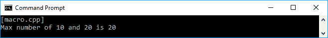
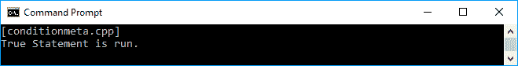
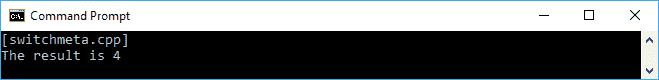
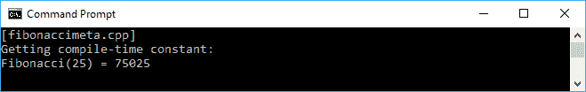
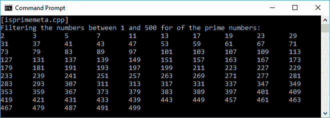

# 用元编程优化代码

在前一章中，我们讨论了使用惰性评估的优化技术，并使用延迟过程、缓存技术和内存化来使我们的代码快速运行。在本章中，我们将使用**元编程**来优化代码，在这里我们将创建一个将创建更多代码的代码。我们将在本章中讨论的主题如下:

*   元编程介绍
*   构建模板元编程的部分
*   将流控制重构为模板元编程
*   在编译时执行中运行代码
*   模板元编程的优缺点

# 元编程介绍

最简单的说法是元编程是一种通过使用代码来创建代码的技术。在实现元编程时，我们编写一个计算机程序来操纵其他程序，并将它们视为自己的数据。此外，模板是 C++中的编译时机制，即**图灵完成**，这意味着任何可由计算机程序表达的计算都可以在运行前由模板元程序以某种形式进行计算。它也经常使用递归，并且有不可变的变量。因此，在元编程中，我们创建在编译代码时运行的代码。

# 使用宏预处理代码

为了开始我们对元编程的讨论，让我们回到 ANSI C 编程语言是一种流行语言的时代。为了简单起见，我们通过创建一个宏来使用 C 预处理器。C 参数化宏也被称为**元函数**，是元编程的例子之一。考虑以下参数化宏:

```cpp
    #define MAX(a,b) (((a) > (b)) ? (a) : (b))

```

由于 C++编程语言与 C 语言的兼容性有缺陷，我们可以使用 C++编译器编译前面的宏。让我们创建代码来使用前面的宏，如下所示:

```cpp
    /* macro.cpp */
    #include <iostream>

    using namespace std;

    // Defining macro
    #define MAX(a,b) (((a) > (b)) ? (a) : (b))

    auto main() -> int
    {
      cout << "[macro.cpp]" << endl;

      // Initializing two int variables
      int x = 10;
      int y = 20;

      // Consuming the MAX macro
      // and assign the result to z variable
      int z = MAX(x,y);

      // Displaying the result
      cout << "Max number of " << x << " and " << y;
      cout << " is " << z << endl;

      return 0;
    }

```

正如我们在前面的`macro.cpp`代码中所看到的，我们向`MAX`宏传递了两个参数，因为它是一个参数化的宏，这意味着可以从用户那里获得参数。如果我们运行前面的代码，我们应该会在控制台上看到以下输出:



正如我们在本章开头所讨论的，元编程是一种将在编译时运行的代码。通过使用前面代码中的一个宏，我们可以演示从`MAX`宏生成了一个新代码。预处理器将在编译时解析宏并带来新的代码。在编译时，编译器修改代码如下:

```cpp
    auto main() -> int
    {
      // same code
      // ...

      int z = (((a) > (b)) ? (a) : (b)); // <-- Notice this section

      // same code
      // ...

      return 0;
    }

```

除了一行宏预处理器，我们还可以生成一个多行宏元函数。为此，我们可以在行尾使用反斜杠字符。假设我们需要交换这两个值。我们可以创建一个名为`SWAP`的参数化宏，并像下面的代码一样使用它:

```cpp
    /* macroswap.cpp */
    #include <iostream>

    using namespace std;

    // Defining multi line macro
    #define SWAP(a,b) { \
      (a) ^= (b); \
      (b) ^= (a); \
      (a) ^= (b); \
    }

    auto main() -> int
    {
      cout << "[macroswap.cpp]" << endl;

      // Initializing two int variables
      int x = 10;
      int y = 20;

      // Displaying original variable value
      cout << "before swapping" << endl;
      cout << "x = " << x << ", y = " << y ;
      cout << endl << endl;

      // Consuming the SWAP macro
      SWAP(x,y);

      // Displaying swapped variable value
      cout << "after swapping" << endl;
      cout << "x = " << x << ", y = " << y;
      cout << endl;

      return 0;
    }

```

正如我们在前面的代码中看到的，我们将创建一个多行预处理器宏，并在每行的末尾使用反斜杠字符。每次我们调用`SWAP`参数化宏时，它都会被宏的实现所取代。如果运行前面的代码，我们将在控制台上看到以下输出:


现在我们已经对元编程有了基本的了解，尤其是在元功能方面，我们可以在下一个主题中更进一步。

We use parenthesis for each variable in every implementation of the macro preprocessor because the preprocessor is simply replacing our code with the implementation of the macro. Let's suppose we have the following macro:
`MULTIPLY(a,b) (a * b)` It won't be a problem if we pass the number as the parameters. However, if we pass an operation as the argument, a problem will occur. For instance, if we use the `MULTIPLY` macro as follows:
`MULTIPLY(x+2,y+5);`
Then the compiler will replace it as `(x+2*y+5)`. This happens because the macro just replaces the `a` variable with the `x + 2` expression and the `b` variable with the `y + 5` expression, with any additional parentheses. And because the order of multiplication is higher than addition, we will have got the result as follows:
`(x+2y+5)`
And that is not what we expect. As a result, the best approach is to use parenthesis in each variable of the parameter.

# 在标准库中剖析模板元编程

我们在[第 1 章](1.html)、*潜入现代 C++* 中讨论了标准库，在前一章中也讨论过。C++语言提供的标准库大部分是包含不完整函数的模板。但是，它将用于生成完整的函数。模板元编程是在编译时生成 C++类型和代码的 C++模板。

让我们从标准图书馆中选一门课——T0 课。在`Array`类中，我们可以为其定义一个数据类型。当我们实例化数组时，编译器实际上为我们定义的数据类型的数组生成代码。现在，让我们尝试构建一个简单的`Array`模板实现如下:

```cpp
    template<typename T>
    class Array
    {
      T element;
    };

```

然后，我们将`char`和`int`数组实例化如下:

```cpp
    Array<char> arrChar;
    Array<int> arrInt;

```

编译器根据我们定义的数据类型创建模板的这两个实现。虽然我们不会在代码中看到这一点，但编译器实际上会创建以下代码:

```cpp
    class ArrayChar
    {
      char element;
    };

    class ArrayInt
    {
      int element;
    };

    ArrayChar arrChar;
    ArrayInt arrInt;

```

正如我们在前面的代码片段中看到的，模板元编程是一个在编译时创建另一个代码的代码。

# 构建模板元编程

在我们进一步讨论模板元编程之前，最好先讨论一下构建模板元编程的框架。形成模板元编程的因素有四个- **类型**、**值**、**分支**和**递归**。在本主题中，我们将深入探讨形成模板的因素。

# 向模板中的变量添加值

在本章的开始，我们讨论宏预处理器时讨论了元功能的概念。在宏预处理器中，我们显式地操作源代码；在这种情况下，宏(元功能)操纵源代码。相比之下，我们在 C++模板元编程中使用类型。这意味着元函数是一个处理类型的函数。因此，使用模板元编程的更好方法是只在可能的情况下使用类型参数。当我们谈论模板元编程中的变量时，它实际上不是一个变量，因为它的值不能被修改。我们需要变量的名称，这样我们就可以访问它。因为我们将使用类型进行编码，所以命名的值是`typedef`，正如我们在下面的代码片段中所看到的:

```cpp
    struct ValueDataType
    {
      typedef int valueDataType;
    };

```

通过使用前面的代码，我们将`int`类型存储到`valueDataType`别名中，这样我们就可以使用`valueDataType`变量访问数据类型。如果我们需要存储一个值而不是变量的数据类型，我们可以使用`enum`，所以它将是`enum`本身的数据成员。如果我们想要存储该值，让我们看一下下面的代码片段:

```cpp
    struct ValuePlaceHolder
    {
      enum 
       { 
        value = 1 
       };
    };

```

基于前面的代码片段，我们现在可以访问`value`变量来获取它的值。

# 将函数映射到输入参数

我们可以将该变量添加到模板元编程中。现在，我们接下来要做的是检索用户参数，并将它们映射到一个函数。假设我们想开发一个将两个值相乘的`Multiplexer`函数，我们必须使用模板元编程。下面的代码片段可以用来解决这个问题:

```cpp
    template<int A, int B>
    struct Multiplexer
    {
      enum 
      {
        result = A * B 
      };
    };

```

正如我们在前面的代码片段中看到的，模板需要来自用户的两个参数`A`和`B`，它将使用它们通过乘以这两个参数来获得`result`变量的值。我们可以使用以下代码访问结果变量:

```cpp
    int i = Multiplexer<2, 3>::result;

```

如果我们运行前面的代码片段，`i`变量将存储`6`，因为它将计算`2`时间`3`。

# 根据条件选择正确的流程

当我们有一个以上的功能时，我们必须根据特定的条件选择一个。我们可以通过提供`template`类的两个可选专门化来构建条件分支，如下所示:

```cpp
    template<typename A, typename B>
    struct CheckingType
    {
      enum 
      { 
        result = 0 
      };
    };

    template<typename X>
    struct CheckingType<X, X>
    {
      enum 
      { 
        result = 1 
      };
    };

```

正如我们在前面的`template`代码中看到的，我们有两个模板，它们的类型分别是`X`和`A` / `B`。当模板只有一个类型，即`typename X`时，意味着我们比较的两个类型(`CheckingType <X, X>`)完全相同。否则，这两种数据类型是不同的。下面的代码片段可以用来使用前面的两个模板:

```cpp
    if (CheckingType<UnknownType, int>::result)
    {
      // run the function if the UnknownType is int
    } 
    else 
    { 
      // otherwise run any function 
    }

```

正如我们在前面的代码片段中看到的，我们尝试将`UnknownType`数据类型与`int`类型进行比较。`UnknownType`数据类型可能来自另一个过程。然后，我们可以通过使用模板比较这两种类型来决定下一个要运行的进程。

Up to here, you might wonder how template multiprogramming will help us make code optimization. Soon we will use the template metaprogramming to optimize code. However, we need to discuss other things that will solidify our knowledge in template multiprogramming. For now, please be patient and keep reading.

# 递归重复该过程

我们已经成功地向模板添加了值和数据类型，然后创建了一个分支来根据当前条件决定下一个流程。在基本模板中，我们必须考虑的另一件事是重复这个过程。然而，由于模板中的变量是不可变的，我们不能迭代序列。相反，我们必须重复我们在[第 4 章](4.html)、*中讨论的过程，使用递归算法*重复方法调用。
假设我们正在开发一个计算阶乘值的模板。我们要做的第一件事是开发一个通用模板，将`I`值传递给函数，如下所示:

```cpp
    template <int I>
    struct Factorial
    {
      enum 
      { 
        value = I * Factorial<I-1>::value 
      };
    };

```

正如我们在前面的代码中看到的，我们可以通过运行下面的代码获得阶乘的值:

```cpp
    Factorial<I>::value;

```

在前面的代码中，`I`是一个整数。
接下来，我们必须开发一个模板，以确保它不会以无限循环结束。我们可以创建以下模板，将零(`0`)作为参数传递给它:

```cpp
    template <>
    struct Factorial<0>
    {
      enum 
      { 
        value = 1 
      };
    };

```

现在我们有了一对模板，可以在编译时生成阶乘的值。以下是在编译时获取`Factorial(10)`值的示例代码:

```cpp
    int main()
    {
      int fact10 = Factorial<10>::value;
    }

```

如果我们运行前面的代码，我们将得到`10`的阶乘结果`3628800`。

# 在编译时选择类型

正如我们在前面的主题中所讨论的，`type`是模板的基本部分。但是，我们可以根据用户的输入选择某种类型。让我们创建一个模板来决定变量中应该使用什么类型。以下`types.cpp`代码将展示模板的实现:

```cpp
    /* types.cpp */
    #include <iostream>

    using namespace std;

 // Defining a data type
 // in template
 template<typename T>
 struct datatype
 {
 using type = T;
 };

    auto main() -> int
    {
      cout << "[types.cpp]" << endl;

      // Selecting a data type in compile time
      using t = typename datatype<int>::type;

      // Using the selected data type
      t myVar = 123;

      // Displaying the selected data type
      cout << "myVar = " << myVar;

      return 0;
    }

```

正如我们在前面的代码中看到的，我们有一个名为`datatype`的模板。这个模板可以用来选择我们传递给它的`type`。我们可以使用`using`关键字给`type`分配一个变量。从前面的`types.cpp`代码中，我们将从`datatype`模板中为`type`分配一个`t`变量。由于我们将`int`数据类型传递给模板，现在的`t`变量将是`int`。
我们还可以创建一个代码，根据当前条件选择正确的数据类型。我们将有一个`IfElseDataType`模板，它接受三个参数，即`predicate`、`predicate`参数为真时的数据类型和`predicate`参数为假时的数据类型。代码如下所示:

```cpp
    /* selectingtype.cpp */
    #include <iostream>

    using namespace std;

    // Defining IfElseDataType template
    template<
      bool predicate,
      typename TrueType,
      typename FalseType>
      struct IfElseDataType
      {
      };

    // Defining template for TRUE condition
    // passed to 'predicate' parameter
    template<
      typename TrueType,
      typename FalseType>
      struct IfElseDataType<
       true,
       TrueType,
       FalseType>
       {
         typedef TrueType type;
       };

    // Defining template for FALSE condition
    // passed to 'predicate' parameter
    template<
      typename TrueType,
      typename FalseType>
      struct IfElseDataType<
      false,
      TrueType,
      FalseType>
      {
         typedef FalseType type;
      };

    auto main() -> int
    {
      cout << "[types.cpp]" << endl;

      // Consuming template and passing
      // 'SHRT_MAX == 2147483647'
      // It will be FALSE
      // since the maximum value of short
      // is 32767
      // so the data type for myVar
      // will be 'int'
      IfElseDataType<
        SHRT_MAX == 2147483647,
        short,
        int>::type myVar;

      // Assigning myVar to maximum value
      // of 'short' type
      myVar = 2147483647;

      // Displaying the data type of myVar
      cout << "myVar has type ";
      cout << typeid(myVar).name() << endl;

      return 0;
    }

```

现在，通过拥有`IfElseDataType`模板，我们可以根据我们拥有的条件为变量选择正确的类型。假设我们想将`2147483647`赋给一个变量，这样我们就可以检查它是否是一个短数字。如果是，则`myVar`为`short`类型，否则为`int`。此外，由于`short`类型的最大值是`32767`，因此将谓词赋予为`SHRT_MAX == 2147483647`将导致`FALSE`。因此，`myVar`的类型将是一个`int`类型，我们可以在控制台上出现的以下输出中看到:


# 使用模板元编程的流控制

代码流是编写程序的一个重要方面。在许多编程语言中，它们有一个`if-else`、`switch`和`do-while`语句来安排代码的流程。现在，让我们重构通常的代码流，使之成为基于模板的流。我们将从使用`if-else`语句开始，然后是`switch`语句，最后以`do-while`语句结束，所有这些都在模板中。

# 根据当前条件决定下一个进程

现在是时候使用我们之前讨论过的模板了。假设我们有两个函数，我们必须根据某个条件来选择。我们通常使用`if-else`语句，如下所示:

```cpp
    /* condition.cpp */
    #include <iostream>

    using namespace std;

    // Function that will run
    // if the condition is TRUE
    void TrueStatement()
    {
      cout << "True Statement is run." << endl;
    }

    // Function that will run
    // if the condition is FALSE
    void FalseStatement()
    {
      cout << "False Statement is run." << endl;
    }

    auto main() -> int
    {
      cout << "[condition.cpp]" << endl;

      // Choosing the function
      // based on the condition
      if (2 + 3 == 5)
        TrueStatement();
      else
        FalseStatement();

      return 0;
    }

```

正如我们在前面的代码中看到的，我们有两个函数- `TrueStatement()`和`FalseStatement()`。我们在代码中还有一个条件——`2 + 3 == 5`。由于条件是`TRUE`，那么`TrueStatement()`功能将运行，如下图所示:


现在，让我们重构前面的`condition.cpp`代码。我们将在这里创建三个模板。首先，输入条件的模板初始化如下:

```cpp
    template<bool predicate> class IfElse

```

然后，我们为每个条件创建两个模板- `TRUE`或`FALSE`。名称如下:

```cpp
    template<> class IfElse<true>
    template<> class IfElse<false> 

```

前面代码片段中的每个模板都将运行我们之前创建的函数-`TrueStatement()`和`FalseStatement()`函数。我们将得到完整的代码如下`conditionmeta.cpp`代码:

```cpp
    /* conditionmeta.cpp */
    #include <iostream>

    using namespace std;

    // Function that will run
    // if the condition is TRUE
    void TrueStatement()
    {
      cout << "True Statement is run." << endl;
    }

    // Function that will run
    // if the condition is FALSE
    void FalseStatement()
    {
      cout << "False Statement is run." << endl;
    }

    // Defining IfElse template
    template<bool predicate>
    class IfElse
    {
    };

    // Defining template for TRUE condition
    // passed to 'predicate' parameter
    template<>
    class IfElse<true>
    {
      public:
        static inline void func()
        {
          TrueStatement();
        }
    };

    // Defining template for FALSE condition
    // passed to 'predicate' parameter
    template<>
    class IfElse<false>
    {
      public:
        static inline void func()
        {
          FalseStatement();
        }
    };

    auto main() -> int
    {
      cout << "[conditionmeta.cpp]" << endl;

      // Consuming IfElse template
      IfElse<(2 + 3 == 5)>::func();

      return 0;
    }

```

可以看到，我们把条件放在`IfElse`模板的括号上，然后在模板里面调用`func()`方法。如果我们运行`conditionmeta.cpp`代码，我们将获得与`condition.cpp`代码完全相同的输出，如下所示:



我们现在有了`if-else`语句来在模板元编程中流动我们的代码。

# 选择正确的语句

在 C++编程中，以及其他编程语言中，我们使用`switch`语句根据我们给`switch`语句的值来选择某个进程。如果该值与开关情况匹配，它将在该情况下运行进程。让我们看看下面实现`switch`语句的`switch.cpp`代码:

```cpp
    /* switch.cpp */
    #include <iostream>

    using namespace std;

    // Function to find out
    // the square of an int
    int Square(int a)
    {
      return a * a;
    }

    auto main() -> int
    {
      cout << "[switch.cpp]" << endl;

      // Initializing two int variables
      int input = 2;
      int output = 0;

      // Passing the correct argument
      // to the function
      switch (input)
      {
        case 1:
            output = Square(1);
            break;
        case 2:
            output = Square(2);
            break;
        default:
            output = Square(0);
            break;
      }

      // Displaying the result
      cout << "The result is " << output << endl;

      return 0;
    }

```

正如我们在前面的代码中看到的，我们有一个名为`Square()`的函数，它接受一个参数。我们传递给它的参数基于我们给 switch 语句的值。由于我们传递给开关的值是`2`，因此将运行`Square(2)`方法。以下屏幕截图是我们将在控制台屏幕上看到的内容:


为了将`switch.cpp`代码重构为模板元编程，我们必须创建三个模板，这三个模板由我们计划运行的函数组成。首先，我们将创建初始化模板，从用户处检索值，如下:

```cpp
    template<int val> class SwitchTemplate 

```

前面的初始化模板也将用作默认值。接下来，我们将为每个可能的值添加两个模板，如下所示:

```cpp
    template<> class SwitchTemplate<1>
    template<> class SwitchTemplate<2> 

```

每个前面的模板将运行`Square()`函数，并根据模板的值传递参数。完整的代码编写如下:

```cpp
    /* switchmeta.cpp */
    #include <iostream>

    using namespace std;

    // Function to find out
    // the square of an int
    int Square(int a)
    {
      return a * a;
    }

    // Defining template for
    // default output
    // for any input value
    template<int val>
    class SwitchTemplate
    {
      public:
        static inline int func()
        {
          return Square(0);
        }
    };

    // Defining template for
    // specific input value
    // 'val' = 1
    template<>
    class SwitchTemplate<1>
    {
       public:
         static inline int func()
         {
           return Square(1);
         }
    };

    // Defining template for
    // specific input value
    // 'val' = 2
    template<>
    class SwitchTemplate<2>
    {
       public:
         static inline int func()
         {
            return Square(2);
         }
    };

    auto main() -> int
    {
      cout << "[switchmeta.cpp]" << endl;

      // Defining a constant variable
      const int i = 2;

      // Consuming the SwitchTemplate template
      int output = SwitchTemplate<i>::func();

      // Displaying the result
      cout << "The result is " << output << endl;

      return 0;
    }

```

我们可以看到，我们做的和`conditionmeta.cpp`一样——我们在模板里面调用`func()`方法来运行选中的函数。这个`switch-case`条件的值是我们放在尖括号中的模板。如果我们运行前面的`switchmeta.cpp`代码，我们将在控制台上看到以下输出:



正如我们在前面的截图中看到的，与`switch.cpp`代码相比，`switchmeta.cpp`代码的输出完全相同。因此，我们已经成功地将`switch.cpp`代码重构为模板元编程。

# 循环流程

当我们迭代一些东西时，我们通常使用`do-while`循环。假设我们需要打印某些数字，直到它达到零(`0`)。代码如下:

```cpp
    /* loop.cpp */
    #include <iostream>

    using namespace std;

    // Function for printing
    // given number
    void PrintNumber(int i)
    {
      cout << i << "\t";
    }

    auto main() -> int
    {
      cout << "[loop.cpp]" << endl;

      // Initializing an int variable
      // marking as maximum number
      int i = 100;

      // Looping to print out
      // the numbers below i variable
      cout << "List of numbers between 100 and 1";
      cout << endl;
      do
      {
        PrintNumber(i);
      }
      while (--i > 0);
      cout << endl;

      return 0;
    }

```

正如我们在前面的代码中看到的，我们将打印数字`100`，减少它的值，然后再次打印。它将一直运行，直到数字达到零(`0`)。控制台上的输出应该如下所示:


现在，让我们将其重构为模板元编程。在这里，我们只需要两个模板就可以实现模板元编程中的`do-while`循环。首先，我们将创建以下模板:

```cpp
    template<int limit> class DoWhile

```

前面代码中的限制是传递给`do-while`循环的值。并且，为了不使循环成为无限循环，我们必须在到达零点(`0`)时设计`DoWhile`模板，如下图所示:

```cpp
    template<> class DoWhile<0>

```

前面的模板不会做任何事情，因为它只是用来打破循环。`do-while`循环的完整重构类似于下面的`loopmeta.cpp`代码:

```cpp
    /* loopmeta.cpp */
    #include <iostream>

    using namespace std;

    // Function for printing
    // given number
    void PrintNumber(int i)
    {
      cout << i << "\t";
    }

    // Defining template for printing number
    // passing to its 'limit' parameter
    // It's only run
    // if the 'limit' has not been reached
    template<int limit>
    class DoWhile
    {
       private:
         enum
         {
           run = (limit-1) != 0
         };

       public:
         static inline void func()
         {
           PrintNumber(limit);
           DoWhile<run == true ? (limit-1) : 0>
            ::func();
         }
    };

    // Defining template for doing nothing
    // when the 'limit' reaches 0
    template<>
    class DoWhile<0>
    {
      public:
        static inline void func()
        {
        }
    };

    auto main() -> int
    {
      cout << "[loopmeta.cpp]" << endl;

      // Defining a constant variable
      const int i = 100;

      // Looping to print out
      // the numbers below i variable
      // by consuming the DoWhile
      cout << "List of numbers between 100 and 1";
      cout << endl;
      DoWhile<i>::func();
      cout << endl;

      return 0;
    }

```

然后我们调用模板中的`func()`方法来运行我们想要的函数。如果我们运行代码，我们将在屏幕上看到以下输出:


同样，我们已经成功地将`loop.cpp`代码重构为`loopmeta.cpp`代码，因为两者具有完全相同的输出。

# 在编译时执行代码

正如我们前面讨论的，模板元编程将通过创建新代码在编译时运行代码。现在，让我们看看如何在这一节中获取编译时常数并生成编译时类。

# 获取编译时常数

为了检索编译时常数，让我们创建一个包含斐波那契算法模板的代码。我们将使用模板，这样编译器将在编译时提供值。代码应如下所示:

```cpp
    /* fibonaccimeta.cpp */
    #include <iostream>

    using namespace std;

    // Defining Fibonacci template
    // to calculate the Fibonacci sequence
    template <int number>
    struct Fibonacci
    {
      enum
      {
        value =
            Fibonacci<number - 1>::value +
            Fibonacci<number - 2>::value
      };
    };

    // Defining template for
    // specific input value
    // 'number' = 1
    template <>
    struct Fibonacci<1>
    {
      enum
      {
        value = 1
      };
    };

    // Defining template for
    // specific input value
    // 'number' = 0
    template <>
    struct Fibonacci<0>
    {
      enum
      {
        value = 0
      };
    };

    auto main() -> int
    {
      cout << "[fibonaccimeta.cpp]" << endl;

      // Displaying the compile-time constant
      cout << "Getting compile-time constant:";
      cout << endl;
      cout << "Fibonacci(25) = ";
      cout << Fibonacci<25>::value;
      cout << endl;

      return 0;
    }

```

正如我们在前面的代码中看到的，斐波那契模板中的值变量将提供一个编译时常数。如果我们运行前面的代码，我们将在控制台屏幕上看到以下输出:



现在，我们有了由编译器生成的编译时常数`75025`。

# 使用编译时类生成来生成类

除了生成编译时常数，我们还将在编译时生成类。假设我们有一个模板来找出`0`到`X`范围内的素数。以下`isprimemeta.cpp`代码将解释寻找质数的模板元编程的实现:

```cpp
    /* isprimemeta.cpp */
    #include <iostream>

    using namespace std;

    // Defining template that decide
    // whether or not the passed argument
    // is a prime number
    template <
      int lastNumber,
      int secondLastNumber>
    class IsPrime
    {
      public:
        enum
        {
          primeNumber = (
            (lastNumber % secondLastNumber) &&
            IsPrime<lastNumber, secondLastNumber - 1>
                ::primeNumber)
        };
     };

    // Defining template for checking
    // the number passed to the 'number' parameter
    // is a prime number
    template <int number>
    class IsPrime<number, 1>
    {
      public:
        enum
        {
          primeNumber = 1
        };
    };

    // Defining template to print out
    // the passed argument is it's a prime number
    template <int number>
    class PrimeNumberPrinter
    {
      public:
        PrimeNumberPrinter<number - 1> printer;

      enum
      {
        primeNumber = IsPrime<number, number - 1>
            ::primeNumber
      };

      void func()
      {
        printer.func();

        if (primeNumber)
        {
            cout << number << "\t";
        }
      }
    };

    // Defining template to just ignoring the number
    // we pass 1 as argument to the parameter
    // since 1 is not prime number
    template<>
    class PrimeNumberPrinter<1>
    {
      public:
        enum
        {
          primeNumber = 0
        };

        void func()
        {
        }
    };

    int main()
    {
      cout << "[isprimemeta.cpp]" << endl;

      // Displaying the prime numbers between 1 and 500
      cout << "Filtering the numbers between 1 and 500 ";
      cout << "for of the prime numbers:" << endl;

      // Consuming PrimeNumberPrinter template
      PrimeNumberPrinter<500> printer;

      // invoking func() method from the template
      printer.func();

      cout << endl;
      return 0;
    }

```

有两种不同角色的模板-**质检员**，确保传递的数字是质数，以及**打印机**，向控制台显示质数。然后，当代码访问`PrimeNumberPrinter<500> printer`和`printer.func()`时，编译器在编译时生成该类。当我们运行前面的`isprimemeta.cpp`代码时，我们将在控制台屏幕上看到以下输出:



由于我们将`500`传递给模板，我们将得到从`0`到`500`的质数。前面的输出已经证明编译器已经成功地生成了一个编译时类，因此我们可以获得正确的值。

# 元编程的优点和缺点

在我们讨论了模板元编程之后，我们得到了以下优势:

*   模板元编程没有副作用，因为它是不可变的，所以我们不能修改现有的类型
*   与不实现元编程的代码相比，代码可读性更好
*   它减少了代码的重复

虽然我们可以从模板元编程中获益，但也有以下几个缺点:

*   语法相当复杂。
*   编译时间更长，因为我们现在在编译时执行代码。
*   编译器可以更好地优化生成的代码并执行内联，例如 C `qsort()`函数和 C++ `sort`模板。在 C 语言中，`qsort()`函数接受一个指向比较函数的指针，因此将会有一个没有内联的`qsort`代码副本。它将通过指向比较例程的指针进行调用。在 C++中，`std::sort`是一个模板，它可以拿一个`functor`对象作为比较器。对于用作比较器的每种不同类型，都有不同的`std::sort`副本。如果我们使用带有重载`operator()`函数的`functor`类，对比较器的调用可以很容易地内联到这个`std::sort`副本中。

# 摘要

元编程，尤其是模板元编程，会自动为我们创建新代码，因此我们不需要在源代码中编写大量代码。通过使用模板元编程，我们可以重构代码的流控制，并在编译时执行代码。
在下一章中，我们将讨论将为我们构建的应用程序带来响应性增强的并发技术。我们可以使用并行技术同时运行代码中的进程。