# 使用并发运行并行执行

在前一章中，我们讨论了将在编译时执行代码的模板元编程。它还将改进我们代码的流控制，因为我们可以使用模板重构流。现在，在本章中，我们将讨论 C++ 中的并发性，当我们同时运行两个或多个进程时，我们必须再次控制流。在本章中，我们将讨论以下主题:

*   在 C++ 编程中运行单线程和多线程
*   同步线程以避免死锁
*   使用 Windows 中的**句柄**资源创建一个线程

# C++ 中的并发性

如今，许多编程语言都支持并发。在并发编程中，代码的计算不是按顺序进行的，而是在重叠的时间段内执行。这将使我们的程序响应，因为代码不需要等到所有的计算完成。假设我们想开发一个可以同时播放视频和下载巨大视频文件的程序。如果没有并发技术，我们必须等待视频下载成功后才能播放另一个视频文件。通过使用这种技术，我们可以分割这两个任务，播放和下载一个视频，然后同时运行它们。

在 C++ 11 宣布之前，C++ 程序员依靠`Boost::thread`使用多线程技术创建并发程序。在多线程中，我们将进程分成最小的序列，并发运行这些小进程。现在，在 C++ 11 库中，我们得到了`thread`类来解决我们使用多线程技术的并发需求。

# 处理单线程代码

要使用`thread`类，我们只需要创建一个`std::thread`的实例，并传递函数名作为参数。然后我们调用`std::join()`暂停进程，直到所选线程完成其进程。我们来看看下面的`singlethread.cpp`代码:

```cpp
    /* singlethread.cpp */
    #include <thread>
    #include <iostream>

    using namespace std;

    void threadProc()
    {
      cout << "Thread ID: ";
      cout << this_thread::get_id() << endl;
    }

    auto main() -> int
    {
      cout << "[singlethread.cpp]" << endl;

      thread thread1(threadProc);
      thread1.join();

      return 0;
    }

```

正如我们在前面的代码中看到的，我们有一个名为`threadProc()`的函数，我们将其传递到`main()`函数中的`thread1`初始化中。初始化之后，我们调用`join()`方法来执行`thread1`对象。我们将在控制台上看到如下输出:

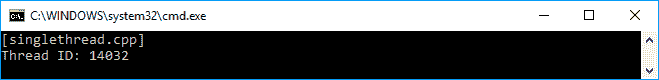

我们已经成功地在代码中运行了一个线程。现在，让我们在`main()`函数中添加一段代码，它将迭代一行代码。我们将同时运行它们。`singlethread2.cpp`的代码如下:

```cpp
    /* singlethread2.cpp */
    #include <thread>
    #include <chrono>
    #include <iostream>

    using namespace std;

    void threadProc()
    {
      for (int i = 0; i < 5; i++)
      {
        cout << "thread: current i = ";
        cout << i << endl;
      }
    }

    auto main() -> int
    {
      cout << "[singlethread2.cpp]" << endl;

      thread thread1(threadProc);

      for (int i = 0; i < 5; i++)
 {
 cout << "main : current i = " << i << endl;

        this_thread::sleep_for(
            chrono::milliseconds(5)); }

      thread1.join();

      return 0;
    }

```

正如我们在前面的代码中看到的，我们添加了一个`for`循环来迭代一些代码，并与`thread1`同时运行。为了理解它，我们还在`threadProc()`函数中添加了一个`for`循环。让我们看看下面的截图，以了解我们将获得什么样的输出:

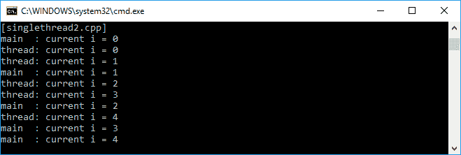

我们看到`threadProc()`函数和`main()`函数中的代码同时运行。你们中的一些人可能会得到不同的结果，但这没关系，因为结果无法预测，因为它取决于设备本身。然而，目前，我们已经能够同时运行两个进程。

I ran the preceding code multiple times to get the output we see in the preceding screenshot. You might see different order in between the `threadProc()` and `main()` function or get a messy output since the flow of the thread is unpredictable.

# 处理多线程代码

在多线程技术中，我们同时运行两个或多个线程。假设我们同时运行五个线程。我们可以使用下面的`multithread.cpp`代码将这五个线程存储在一个数组中:

```cpp
    /* multithread.cpp */
    #include <thread>
    #include <iostream>

    using namespace std;

    void threadProc()
    {
      cout << "Thread ID: ";
      cout << this_thread::get_id() << endl;
    }

    auto main() -> int
    {
      cout << "[multithread.cpp]" << endl;

      thread threads[5];

      for (int i = 0; i < 5; ++ i)
      {
        threads[i] = thread(threadProc);
      }

      for (auto& thread : threads)
      {
        thread.join();
      }

      return 0;
    }

```

在我们基于前面的代码初始化这五个线程之后，我们将为所有线程运行`join()`方法来执行它们。通过使用`join()`方法，程序将等待调用线程中的所有进程完成，然后继续下一个进程(如果有)。我们在控制台中看到的结果如下:

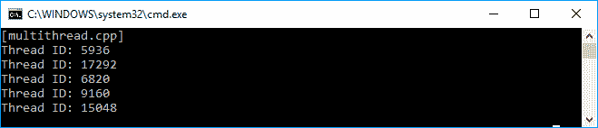

在前面的截图中，我们看到所有五个线程都已成功执行。我们也可以使用 Lambda 表达式初始化线程。下面的`lambdathread.cpp`代码是从前面的代码重构而来的，它使用 Lambda 而不是创建一个单独的函数:

```cpp
    /* lambdathread.cpp */
    #include <thread>
    #include <iostream>

    using namespace std;

    auto main() -> int
    {
      cout << "[lambdathread.cpp]" << endl;

      thread threads[5];

      for (int i = 0; i < 5; ++ i)
      {
 threads[i] = thread([]()
 {
 cout << "Thread ID: ";
 cout << this_thread::get_id() << endl;
 });
       }

      for (auto& thread : threads)
      {
        thread.join();
      }

      return 0;
    }

```

如果我们看到`lambdathread.cpp`代码与`multithread.cpp`代码相比没有显著变化。但是，由于该函数只会被调用一次，所以最好使用 Lambda，这样更容易维护它。我们将在控制台上看到的输出如下截图所示，与`multithread.cpp`代码输出相比没有太大区别:

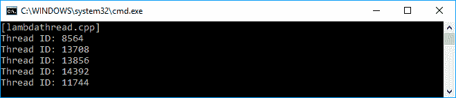

虽然我们在运行`lambdathread.cpp`时检索到了与`multithread.cpp`代码相同的输出，但是当我们使用 Lambda 表达式初始化线程时，我们有一个清晰的代码。我们不需要创建另一个传递给`Thread`的方法，例如`threadProc()`，因为这个方法实际上只使用一次。

Again, note that the result you see on your screen might be different from the screenshot I gave.

# 使用互斥体同步线程

到目前为止，我们已经成功执行了一个多线程代码。但是，如果我们使用一个共享对象并在线程中操作它，就会出现问题。叫做**同步**。在本节中，我们将尝试通过应用`mutex`技术来避免这个问题。

# 避免同步问题

正如我们前面讨论的，在这一节中，我们必须确保在线程中运行的共享对象在执行时给出正确的值。假设我们有一个名为`counter`的全局变量，我们计划在所有五个线程中增加它的值。每个线程将执行`10000`次增量迭代，因此我们期望得到所有五个线程的`50000`结果。代码如下:

```cpp
    /* notsync.cpp */
    #include <thread>
    #include <iostream>

    using namespace std;

    auto main() -> int
    {
      cout << "[notsync.cpp]" << endl;

      int counter = 0;

      thread threads[5];

      for (int i = 0; i < 5; ++ i)
      {
        threads[i] = thread([&counter]()
        {
 for (int i = 0; i < 10000; ++ i)
 {
 ++ counter;
 cout << "Thread ID: ";
 cout << this_thread::get_id();
 cout << "\tCurrent Counter = ";
 cout << counter << endl;
 }
        });
      }

      for (auto& thread : threads)
      {
        thread.join();
      }

      cout << "Final result = " << counter << endl;

      return 0;
    }

```

现在，让我们看看下面的截图，当我们运行前面的代码时，我们可能会在控制台上看到它:

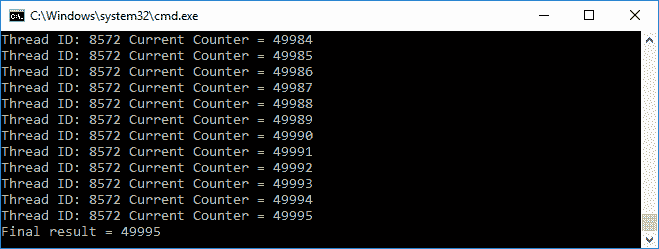

不幸的是，根据前面的截图，我们没有得到我们所期望的。这是因为增量进程不是原子操作，因为原子操作将保证并发进程的隔离。

If you get a different output, don't worry, we are still on the right track as this program demonstrates synchronization issues, as you will see next.

如果我们更深入地跟踪输出，我们会看到有两个线程为`counter`变量执行完全相同的值，如下面的截图所示:

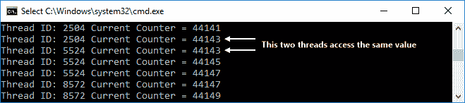

我们看到 ID 为`2504`和`5524`的线程在计数器变量的值为`44143`时访问计数器变量。这就是为什么我们在运行前面的代码时会检索到一个意外的结果。现在，我们需要使增量操作成为原子操作，该操作将在没有任何其他进程能够读取或更改操作期间读取或更改的状态的情况下执行。

为了解决这个问题，我们可以使用`mutex`类来使我们的计数器变量`thread-safe`。这意味着在线程访问计数器变量之前，它必须确保该变量不会被其他线程访问。我们可以使用`mutex`类中的`lock()`和`unlock()`方法来锁定和解锁目标变量。让我们看看下面的`mutex.cpp`代码来演示`mutex`的实现:

```cpp
    /* mutex.cpp */
    #include <thread>
    #include <mutex>
    #include <iostream>

    using namespace std;

    auto main() -> int
    {
      cout << "[mutex.cpp]" << endl;

      mutex mtx;
      int counter = 0;

      thread threads[5];

      for (int i = 0; i < 5; ++ i)
      {
        threads[i] = thread([&counter, &mtx]()
        {
           for (int i = 0; i < 10000; ++ i)
           {
             mtx.lock();
             ++ counter;
             mtx.unlock();

             cout << "Thread ID: ";
             cout << this_thread::get_id();
             cout << "\tCurrent Counter = ";
             cout << counter << endl;
           }
        });
      }

      for (auto& thread : threads)
      {
        thread.join();
      }

      cout << "Final result = " << counter << endl;

      return 0;
    }

```

正如我们在前面的代码中看到的，在代码递增`counter`变量之前，它调用`lock()`方法。之后，它调用`unlock()`方法通知其他线程`counter`变量现在可以自由操作了。如果我们运行前面的代码，我们应该会在控制台上看到以下输出:

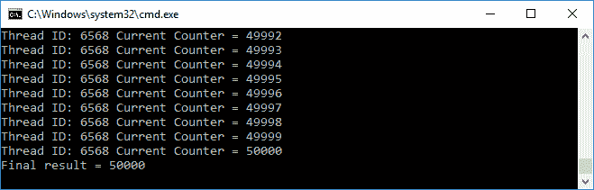

通过使用`mutex`类，现在我们检索我们期望的结果，正如我们在前面的截图中看到的。

# 自动解锁变量

我们现在知道如何锁定变量，以确保没有两个处理相同值的线程同时从中检索到正确的值。但是，如果在线程调用`unlock()`方法之前抛出异常，就会出现问题。如果变量的状态保持锁定，程序将被完全锁定。为了解决这个问题，我们可以使用`lock_guard<mutex>`来锁定变量，并确保无论发生什么情况，它都将在范围的末尾解锁。下面这段代码是通过添加`lock_guard<mutex>`功能从前面的代码重构而来的:

```cpp
    /* automutex.cpp */
    #include <thread>
    #include <mutex>
    #include <iostream>

    using namespace std;

    auto main() -> int
    {
      cout << "[automutex.cpp]" << endl;

      mutex mtx;
      int counter = 0;

      thread threads[5];

      for (int i = 0; i < 5; ++ i)
      {
        threads[i] = thread([&counter, &mtx]()
        {
          for (int i = 0; i < 10000; ++ i)
          {
            {
              lock_guard <mutex> guard(mtx);
              ++ counter;
             }

             cout << "Thread ID: ";
             cout << this_thread::get_id();
             cout << "\tCurrent Counter = ";
             cout << counter << endl;
          }
         });
       }

       for (auto& thread : threads)
       {
          thread.join();
       }

      cout << "Final result = " << counter << endl;

      return 0;
    }

```

从前面的`automutex.cpp`代码中我们可以看到，它在递增`counter`变量之前调用`lock_guard <mutex> guard(mtx)`。如果我们运行代码，我们将获得与`mutex.cpp`代码完全相同的输出。然而，现在我们有了一个不会被不可预测地锁定的程序。

# 使用递归互斥避免死锁

在前一节中，我们使用`lock_guard`来确保变量不会被多个线程访问。但是如果有多个`lock_guard`获得锁，我们还是会面临一个问题。在下面这段代码中，我们有两个函数将调用`lock_guard` - `Multiplexer()`和`Divisor()`。除此之外，我们还有一个函数会调用这两个函数- `RunAll()`在调用这两个函数之前会先调用`lock_guard`。代码应该如下所示:

```cpp
    /* deadlock.cpp */
    #include <thread>
    #include <mutex>
    #include <iostream>

    using namespace std;

    struct Math
    {
      mutex mtx;
      int m_content;

      Math() : m_content(0)
      {
      }

      // This method will lock the mutex
      void Multiplexer(int i)
      {
        lock_guard<mutex> lock(mtx);
        m_content *= i;
        cout << "Multiplexer() is called. m_content = ";
        cout << m_content << endl;
      }

      // This method will lock the mutex also
      void Divisor(int i)
      {
        lock_guard<mutex> lock(mtx);
        m_content /= i;
        cout << "Divisor() is called. m_content = ";
        cout << m_content << endl;
      }

      // This method will invoke 
      // the two preceding methods
      // which each method locks the mutex
      void RunAll(int a)
      {
        lock_guard<mutex> lock(mtx);
        Multiplexer(a);
        Divisor(a);
      }
    };

    auto main() -> int
    {
      cout << "[deadlock.cpp]" << endl;

      // Instantiating Math struct
      // and invoking the RunAll() method 
      Math math;
      math.RunAll(10);

      return 0;
    }

```

我们将成功编译以下代码。但是，如果我们运行前面的代码，由于**死锁**，程序不会退出，因此会出现错误。这是因为同一个互斥体不能被多个线程获取两次。调用`RunAll()`功能时，获取`lock`对象。`RunAll()`功能中的`Multiplexer()`功能也想获得`lock`。但是`lock`已经被`RunAll()`功能锁定。为了解决这个问题，我们可以将`lock_guard<mutex>`替换为`lock_guard<recursive_mutex>`，如下面这段代码所示:

```cpp
    /* recursivemutex.cpp */
    #include <thread>
    #include <mutex>
    #include <iostream>

    using namespace std;

    struct Math
    {
 recursive_mutex mtx;
      int m_content;

      Math() : m_content(1)
      {
      }

      // This method will lock the mutex
      void Multiplexer(int i)
      {
        lock_guard<recursive_mutex> lock(mtx);
        m_content *= i;
        cout << "Multiplexer() is called. m_content = ";
        cout << m_content << endl;
      }

      // This method will lock the mutex also
      void Divisor(int i)
      {
        lock_guard<recursive_mutex> lock(mtx);
        m_content /= i;
        cout << "Divisor() is called. m_content = ";
        cout << m_content << endl;
      }

      // This method will invoke 
      // the two preceding methods
      // which each method locks the mutex
      void RunAll(int a)
      {
        lock_guard<recursive_mutex> lock(mtx);
        Multiplexer(a);
        Divisor(a);
      }
    };

    auto main() -> int
    {
      cout << "[recursivemutex.cpp]" << endl;

      // Instantiating Math struct
      // and invoking the RunAll() method 
      Math math;
      math.RunAll(10);

      return 0;
    }

```

现在，我们可以成功编译并运行前面的代码。我们可以使用`lock_guard<recursive_mutex>`类，它将允许互斥锁被锁定不止一次，而不会进入死锁。当我们运行前面的代码时，将在控制台上看到下面的屏幕截图:


现在，我们知道如果我们想递归地调用锁定同一个`mutex`的函数，我们需要使用一个递归`mutex`。

# 了解 Windows 操作系统中的线程处理

让我们转到一个被许多用户计算机广泛使用的特定操作系统，那就是 Windows。我们的代码必须在领先的操作系统供应商(如微软)的商业平台上运行。因此，我们现在将在 Windows 操作系统中运行该线程。在这个操作系统中，线程是一个内核资源，这意味着它是一个由操作系统内核创建和拥有的对象，并且驻留在内核中。内核本身是一个核心程序，可以完全控制系统中的一切。在这一部分，我们将在视窗操作系统中开发一个线程，这样我们的程序就可以在这个操作系统中很好地工作。

# 使用手柄

在 Windows 操作系统中，句柄是对资源的抽象引用值。在本讨论中，我们将使用抽象引用来保持线程。让我们假设我们有一个`threadProc()`函数，它将在`hnd`变量中的线程内被调用。代码如下:

```cpp
    /* threadhandle.cpp */
    #include <iostream>
    #include <windows.h>

    using namespace std;

    auto threadProc(void*) -> unsigned long
    {
      cout << "threadProc() is run." << endl;
      return 100;
    }

    auto main() -> int
    {
      cout << "[threadhandle.cpp]" << endl;

      auto hnd = HANDLE
      {
        CreateThread(
            nullptr,
            0,
            threadProc,
            nullptr,
            0,
            nullptr)
      };

      if (hnd)
      {
        WaitForSingleObject(hnd, INFINITE);

        unsigned long exitCode;
        GetExitCodeThread(hnd, &exitCode);

        cout << "The result = " << exitCode << endl;

        CloseHandle(hnd);
      }

      return 0;
    }

```

正如我们在前面的代码中看到的，我们使用`windows.h`头提供的`CreateThread()`函数来生成一个线程。现在，我们只传递`nullptr`值作为默认参数，除了`threadProc`作为我们将从线程调用的函数。

我们初始化线程的句柄后，可以保证`hnd`变量包含线程的句柄，然后调用`WaitForSingleObject()`函数。它类似于我们在前一节中使用的`join()`方法，将运行线程并等待线程完成。既然线程句柄是我们使用的资源，别忘了使用`CloseHandle()`功能释放它。如果我们运行前面的代码，我们将在控制台屏幕上看到以下输出:

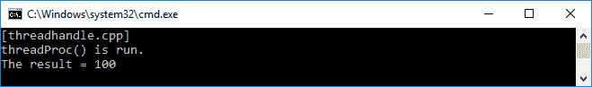

正如我们所看到的，我们已经成功地运行了线程，因为我们已经从`threadProc()`函数获得了预期的进程。

# 重构到唯一句柄

现在，为了简化我们的编程过程，我们将创建一个名为`NullHandle`的类，每当我们不再需要该资源时，它将自动释放该资源。它将从`UniqueHandle`类构建，我们也将开发它。这些课程可以在`uniquehandle.h`档案中找到。`UniqueHandle`实施如下:

```cpp
    template <typename C>
    class UniqueHandle
    {
      private:
        HANDLE m_val;

        void Close()
        {
          if (*this)
          {
            C::Exit(m_val);
          }
        }

      public:
        // Copy assignment operator 
        UniqueHandle(UniqueHandle const &) = delete;
        auto operator=(UniqueHandle const &)->UniqueHandle & = delete;

        // UniqueHandle constructor
        explicit UniqueHandle(HANDLE value = C::Invalid()) :
        m_val{ value }
        {
        }

        // Move assignment operator
        UniqueHandle(UniqueHandle && other) :
        m_val{ other.Release() }
        {
        }

        // Move assignment operator
        auto operator=(UniqueHandle && other) -> UniqueHandle &
        {
          if (this != &other)
          {
            Reset(other.Release());
          }

          return *this;
        }

        // Destructor of UniqueHandle class
        ~UniqueHandle()
        {
          Close();
        }

        // bool operator for equality
        explicit operator bool() const 
        {
          return m_val != C::Invalid();
        }

        // Method for retrieving the HANDLE value
        HANDLE Get() const
        {
          return m_val;
        }

       // Method for releasing the HANDLE value
       HANDLE Release()
       {
         auto value = m_val;
         m_val = C::Invalid();
         return value;
       }

       // Method for reseting the HANDLE
       bool Reset(HANDLE value = C::Invalid())
       {
        if (m_val != value)
        {
           Close();
           m_val = value;
        }

         return static_cast<bool>(*this);
       }
    };

```

正如我们所看到的，我们有一个完整的`UniqueHandle`类的实现，它可以被实例化，并将自动从其析构函数中关闭句柄。要使用`NullHandle`对象，我们将使用以下代码:

```cpp
    using NullHandle = UniqueHandle<NullHandleCharacteristics>;

```

`NullHandleCharacteristics`结构的实现如下:

```cpp
    struct NullHandleCharacteristics
    {
      // Returning nullptr when the HANDLE is invalid
      static HANDLE Invalid()
      {
         return nullptr;
      }

      // Exit the HANDLE by closing it
      static void Exit(HANDLE val)
      {
         CloseHandle(val);
      }
    };

```

现在，让我们重构前面的`threadhandle.cpp`代码。我们将`HANDLE`替换为`NullHandle`，如下:

```cpp
    auto hnd = NullHandle
    {
      CreateThread(
        nullptr,
        0,
        threadProc,
        nullptr,
        0,
        nullptr)
    };

```

然后，我们将创建一个名为`WaitOneThread()`的新函数来调用线程本身，并等待它完成。实施应如下:

```cpp
    auto WaitOneThread(
      HANDLE const h,
      DWORD const ms = INFINITE) -> bool
      {
        auto const r = WaitForSingleObject(
        h,
        ms);

        // Inform that thread is not idle
        if (r == WAIT_OBJECT_0)
          return true;

        // Inform that thread is not idle
        if (r == WAIT_TIMEOUT)
          return false;

        throw WinException();
      }

```

通过使用`WaitOneThread()`功能，我们可以知道线程是否已经运行。`WinException`结构可以如下实现:

```cpp
    struct WinException
    {
      unsigned long error;

      explicit WinException(
        unsigned long value = GetLastError()) :
        error{ value }
       {
       }
    };

```

现在，我们可以在初始化`hnd` HANDLE 后，将以下代码添加到`main()`函数中:

```cpp
    if (hnd)
    {
      if (WaitOneThread(hnd.Get(), 0))
        cout << "Before running thread" << endl;

      WaitOneThread(hnd.Get());

      if (WaitOneThread(hnd.Get(), 0))
        cout << "After running thread" << endl;

      unsigned long exitCode;
      GetExitCodeThread(hnd.Get(), &exitCode);

      cout << "The result = " << exitCode << endl;
    }

```

从前面的代码中我们可以看到，我们调用`WaitOneThread()`函数，并将`0`作为`ms`参数传递，以了解`WaitForSingleObject()`函数调用的状态。我们可以将`INFINITE`值传递给它来调用线程，并等待它完成。以下是从`threadhandle.cpp`代码重构并使用了`UniqueHandle`类的`threaduniquehandle.cpp`代码:

```cpp
    /* threaduniquehandle.cpp */
    #include <iostream>
    #include <windows.h>
    #include "../uniquehandle_h/uniquehandle.h"

    using namespace std;

    unsigned long threadProc(void*)
    {
      cout << "threadProc() is run." << endl;
      return 100;
    }

    struct WinException
    {
      unsigned long error;
      explicit WinException(
        unsigned long value = GetLastError()) :
        error{ value }
        {
        }
    };

    auto WaitOneThread(
      HANDLE const h,
      DWORD const ms = INFINITE) -> bool
      {
        auto const r = WaitForSingleObject(
        h,
        ms);

       // Inform that thread is not idle
       if (r == WAIT_OBJECT_0)
         return true;

       // Inform that thread is not idle
       if (r == WAIT_TIMEOUT)
         return false;

       throw WinException();
      }

    auto main() -> int
    {
      cout << "[threaduniquehandle.cpp]" << endl;

      auto hnd = NullHandle
      {
        CreateThread(
            nullptr,
            0,
            threadProc,
            nullptr,
            0,
            nullptr)
      };

      if (hnd)
      {
        if (WaitOneThread(hnd.Get(), 0))
          cout << "Before running thread" << endl;

        WaitOneThread(hnd.Get());

        if (WaitOneThread(hnd.Get(), 0))
          cout << "After running thread" << endl;

        unsigned long exitCode;
        GetExitCodeThread(hnd.Get(), &exitCode);

        cout << "The result = " << exitCode << endl;
      }

     return 0;
    }

```

下面的截图是我们应该在控制台屏幕上看到的输出:

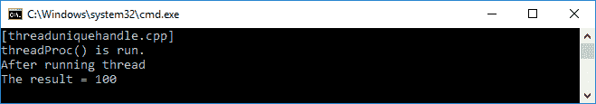

从前面的截图可以看出，上面没有`Before running thread`线。因为我们每次不调用线程都会得到`WAIT_TIMEOUT`输出。尽管如此，我们还是成功地执行了`threadProc()`函数中的代码。

# 触发事件

在 Windows 下玩转线程后，我们来试试另一种并发类型——`Event`。这是一个可以由系统触发的动作。为了进一步了解它，让我们看看下面的代码片段，其中我们创建了一个名为`Event`的新类，它也实现了`UniqueHandle`:

```cpp
    class Event
    {
      private:
        NullHandle hnd;

      public:
        Event(Event const &) = delete;
        auto operator=(Event const &)->Event & = delete;
        ~Event() = default;

        explicit Event(bool manual) :
         hnd
         {
           CreateEvent(nullptr,
            manual, false, nullptr)
         }
         {
           if (!hnd)
            throw WinException();
         }

        explicit Event(EventType evType) :
         hnd
         {
           CreateEvent(
            nullptr,
            static_cast<BOOL>(evType),
            false,
            nullptr)
         }
         {
           if (!hnd)
            throw WinException();
         }

         Event(Event && other) throw() :
           hnd
           {
             other.hnd.Release()
           }
           {
           }

         auto operator=(Event && other) throw()->Event &
         {
           hnd = move(other.hnd);
         }

         void Set()
         {
           cout << "The event is set" << endl;
           SetEvent(hnd.Get());
         }

         void Clear()
         {
           cout << "The event is cleared" << endl;
           ResetEvent(hnd.Get());
         }

         auto Wait(
           DWORD const ms = INFINITE) -> bool
           {
             auto const result = WaitForSingleObject(
             hnd.Get(), ms);

            return result == WAIT_OBJECT_0;
           }
     };

```

正如我们在前面的`Event`类实现中看到的，我们有`Set()`、`Clear()`和`Wait()`方法分别设置事件、清除事件和等待事件完成。我们有两种事件类型，即自动重置和手动重置，声明如下:

```cpp
    enum class EventType
    {
      AutoReset,
      ManualReset
    };

```

现在，我们将在`main()`功能中创建内容。我们将首先实例化`Event`类，然后检查事件信号。如果没有信号，我们将设置事件。相反，我们将清除事件。该代码将是以下`event.cpp`代码:

```cpp
    /* event.cpp */
    #include <iostream>
    #include <windows.h>
    #include "../uniquehandle_h/uniquehandle.h"

    using namespace std;

    struct WinException
    {
      unsigned long error;

      explicit WinException(
        unsigned long value = GetLastError()) :
        error{ value }
        {
        }
    };

    enum class EventType
    {
      AutoReset,
      ManualReset
    };

    class Event
    {
      private:
        NullHandle hnd;

      public:
        Event(Event const &) = delete;
        auto operator=(Event const &)->Event & = delete;
        ~Event() = default;

        explicit Event(bool manual) :
         hnd
         {
           CreateEvent(nullptr,
           manual, false, nullptr)
         }
         {
           if (!hnd)
            throw WinException();
         }

         explicit Event(EventType evType) :
          hnd
          {
            CreateEvent(
            nullptr,
            static_cast<BOOL>(evType),
            false,
            nullptr)
          }
          {
            if (!hnd)
             throw WinException();
          }

          Event(Event && other) throw() :
            hnd
            {
              other.hnd.Release()
            }
            {
            }

          auto operator=(Event && other) throw() -> Event &
          {
              hnd = move(other.hnd);
          }

          void Set()
          {
              cout << "The event is set" << endl;
              SetEvent(hnd.Get());
          }

          void Clear()
          {
               cout << "The event is cleared" << endl;
               ResetEvent(hnd.Get());
          }

          auto Wait(
            DWORD const ms = INFINITE) -> bool
              {
                auto const result = WaitForSingleObject(
                  hnd.Get(), ms);

                return result == WAIT_OBJECT_0;
             }
          };

          void CheckEventSignaling( bool b)
          {
            if (b)
            {
              cout << "The event is signaled" << endl;
            }
            else
            {
             cout << "The event is not signaled" << endl;
            }
         }

         auto main() -> int
         {
           cout << "[event.cpp]" << endl;

           auto ev = Event{
             EventType::ManualReset };

             CheckEventSignaling(ev.Wait(0));

             ev.Set();

             CheckEventSignaling(ev.Wait(0));

             ev.Clear();

             CheckEventSignaling(ev.Wait(0));

             return 0;
          }

```

正如我们在前面的代码中看到的，下面是代码的作用:

1.  它在`main()`函数中创建`Event`类的实例，并手动重置事件。
2.  它调用`CheckEventSignaling()`函数，通过将`Wait()`函数传递给`CheckEventSignaling()`函数来找出事件的状态，该函数又调用`WaitForSingleObject()`函数。
3.  它调用`Set()`和`Reset()`函数。
4.  现在运行前面的`event.cpp`代码。您将在控制台上看到以下输出:

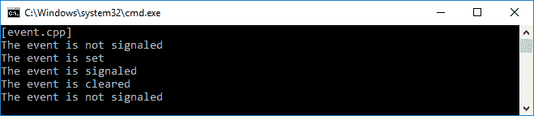

如果我们看一下前面的截图，首先`Event`类的初始化是没有信号的。然后我们设置事件，现在它作为状态信号从`CheckEventSignaling()`方法发出。这里，我们可以说，我们可以通过调用`WaitForSingleObject()`函数来检查发出信号的事件的状态。

# 从线程调用事件

现在，让我们用线程调用`Event`类。然而，在此之前，我们必须能够包装多个线程，将它们调用在一起，并等待它们的进程完成。以下代码块是将打包线程的`Wrap()`函数:

```cpp
    void Wrap(HANDLE *)
    {
    }

    template <typename T, typename... Args>
    void Wrap(
      HANDLE * left,
      T const & right,
      Args const & ... args)
      {
        *left = right.Get();
        Wrap(++ left, args...);
      }

```

当我们连接所有线程时，我们将调用前面的`Wrap()`函数。因此，我们需要另一个名为`WaitAllThreads()`的函数，正如我们在下面这段代码中看到的:

```cpp
    template <typename... Args>
    void WaitAllThreads(Args const & ... args)
    {
      HANDLE handles[sizeof...(Args)];

      Wrap(handles, args...);

      WaitForMultipleObjects(
        sizeof...(Args),
        handles,
        true,
        INFINITE);
    }

```

现在，我们可以使用下面的`eventthread.cpp`代码创建运行两个线程的完整代码:

```cpp
    /* eventthread.cpp */
    #include <iostream>
    #include <windows.h>
    #include "../uniquehandle_h/uniquehandle.h"

    using namespace std;

    void Wrap(HANDLE *)
    {
    }

    template <typename T, typename... Args>
    void Wrap(
      HANDLE * left,
      T const & right,
      Args const & ... args)
      {
        *left = right.Get();
        Wrap(++ left, args...);
      }

    template <typename... Args>
    void WaitAllThreads(Args const & ... args)
    {
      HANDLE handles[sizeof...(Args)];

      Wrap(handles, args...);

      WaitForMultipleObjects(
        sizeof...(Args),
        handles,
        true,
        INFINITE);
    }

    auto threadProc(void*) -> unsigned long
    {
      cout << "Thread ID: ";
      cout << GetCurrentThreadId() << endl;
      return 120;
    }

    auto main() -> int
    {
      cout << "[eventthread.cpp]" << endl;

      auto thread1 = NullHandle
      {
        CreateThread(
          nullptr,
          0,
          threadProc,
          nullptr,
          CREATE_SUSPENDED,
          nullptr)
      };

      auto thread2 = NullHandle
      {
        CreateThread(
          nullptr,
          0,
          threadProc,
          nullptr,
          CREATE_SUSPENDED,
          nullptr)
     };

 ResumeThread(thread1.Get());
 ResumeThread(thread2.Get());

     WaitAllThreads(thread1, thread2);

     return 0;
    }

```

此外，如果我们运行前面的`eventthread.cpp`代码，我们将在控制台屏幕上看到以下输出:


我们已经成功触发了一个`Event`，因此它可以被设置为已发出信号，并且可以在`event.cpp`代码中被清除为未发出信号。我们还成功地包装了一个以上的线程，然后在`eventthread.cpp`代码中一起调用它们。现在，让我们连接这两个代码，这样我们就可以从线程中访问事件。代码应该如下`eventthread2.cpp`代码:

```cpp
    /* eventthread2.cpp */
    #include <iostream>
    #include <windows.h>
    #include "../uniquehandle_h/uniquehandle.h"

    using namespace std;

    struct WinException
    {
      unsigned long error;

      explicit WinException(
        unsigned long value = GetLastError()) :
        error{ value }
        {
        }
    };

    enum class EventType
    {
      AutoReset,
      ManualReset
     };

    class Event
    {
      private:
        NullHandle hnd;

      public:
        Event(Event const &) = delete;
        auto operator=(Event const &)->Event & = delete;
        ~Event() = default;

        explicit Event(bool manual) :
          hnd
          {
            CreateEvent(nullptr,
            manual, false, nullptr)
          }
          {
            if (!hnd)
             throw WinException();
          }

        explicit Event(EventType evType) :
          hnd
          {
            CreateEvent(
              nullptr,
              static_cast<BOOL>(evType),
              false,
              nullptr)
           }
           {
             if (!hnd)
              throw WinException();
           }

        Event(Event && other) throw() :
          hnd
          {
            other.hnd.Release()
          }
          {
          }

        auto operator=(Event && other) throw() -> Event &
        {
          hnd = move(other.hnd);
        }

        void Set()
        {
          cout << "The event is set" << endl;
          SetEvent(hnd.Get());
        }

        void Clear()
        {
          cout << "The event is cleared" << endl;
          ResetEvent(hnd.Get());
        }

        auto Wait( DWORD const ms = INFINITE) -> bool
        {
           auto const result = WaitForSingleObject(
            hnd.Get(), ms);

           return result == WAIT_OBJECT_0;
        }
     };

        void Wrap(HANDLE *)
        {
        }

        template <typename T, typename... Args>
        void Wrap(
        HANDLE * left,
        T const & right,
        Args const & ... args)
        {
          *left = right.Get();
           Wrap(++ left, args...);
        }

        template <typename... Args>
        void WaitAllThreads(Args const & ... args)
        {
        HANDLE handles[sizeof...(Args)];

        Wrap(handles, args...);

        WaitForMultipleObjects(
          sizeof...(Args),
          handles,
          true,
          INFINITE);
        }

        static auto ev = Event{
        EventType::ManualReset };

        auto threadProc(void*) -> unsigned long
        {
          cout << "Thread ID: ";
          cout << GetCurrentThreadId() << endl;

          ev.Wait();

          cout << "Run Thread ID: ";
          cout << GetCurrentThreadId() << endl;

          return 120;
        }

        auto main() -> int
        {
          cout << "[eventthread2.cpp]" << endl;

          auto thread1 = NullHandle
          {
            CreateThread(
              nullptr,
              0,
              threadProc,
              nullptr,
              0,
              nullptr)
          };

          auto thread2 = NullHandle
          {
            CreateThread(
              nullptr,
              0,
              threadProc,
              nullptr,
              0,
              nullptr)
         };

 Sleep(100);
 ev.Set();
 Sleep(100);

         WaitAllThreads(thread1, thread2);

         return 0;
    }

```

在前面的`eventthread2.cpp`代码中，我们尝试使用线程触发事件。我们首先初始化两个`NullHandle`对象线程。然后，我们设置事件并调用`Sleep()`功能使事件激活。`WaitAllThreads()`函数然后调用`threadProc()`函数并运行每个线程。这将通过调用`ev.Wait()`功能触发事件。线程将会运行。下面的截图是我们将在控制台屏幕上看到的输出:

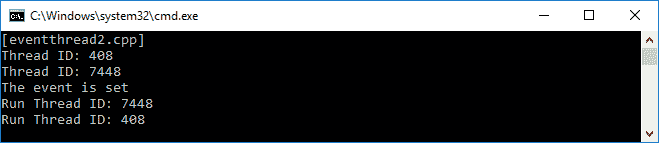

前面的代码是我们手动设置来重置事件的事件。这意味着我们必须在清除事件时声明。现在，我们将`AutoReset`传递给事件实例。我们也会稍微修改一下`threadProc()`功能。下面这段代码是我们正在谈论的`eventthread3.cpp`:

```cpp
    /* eventthread3.cpp */
    #include <iostream>
    #include <windows.h>
    #include "../uniquehandle_h/uniquehandle.h"

    using namespace std;

    struct WinException
    {
      unsigned long error;

      explicit WinException(
        unsigned long value = GetLastError()) :
        error{ value }
        {
        }
    };

    enum class EventType
    {
      AutoReset,
      ManualReset
    };

    class Event
    {
       private:
         NullHandle hnd;

       public:
         Event(Event const &) = delete;
         auto operator=(Event const &)->Event & = delete;
         ~Event() = default;

         explicit Event(bool manual) :
           hnd
           {
             CreateEvent(nullptr,
             manual, false, nullptr)
           }
           {
             if (!hnd)
              throw WinException();
           }

          explicit Event(EventType evType) :
             hnd
             {
               CreateEvent(
                 nullptr,
                 static_cast<BOOL>(evType),
                 false,
                 nullptr)
             }
             {
               if (!hnd)
                throw WinException();
             }

         Event(Event && other) throw() :
           hnd
           {
             other.hnd.Release()
           }
           {
           }

         auto operator=(Event && other) throw() -> Event &
           {
              hnd = move(other.hnd);
           }

          void Set()
          {
             cout << "The event is set" << endl;
             SetEvent(hnd.Get());
          }

          void Clear()
          {
              cout << "The event is cleared" << endl;
              ResetEvent(hnd.Get());
          }

          auto Wait(
            DWORD const ms = INFINITE) -> bool
            {
              auto const result = WaitForSingleObject(
                hnd.Get(), ms);

             return result == WAIT_OBJECT_0;
            }
       };

         void Wrap(HANDLE *)
         {
         }

         template <typename T, typename... Args>
         void Wrap(
           HANDLE * left,
           T const & right,
           Args const & ... args)
           {
             *left = right.Get();
             Wrap(++ left, args...);
           }

           template <typename... Args>
           void WaitAllThreads(Args const & ... args)
           {
              HANDLE handles[sizeof...(Args)];

              Wrap(handles, args...);

              WaitForMultipleObjects(
                sizeof...(Args),
                handles,
                true,
                INFINITE);
           }

 static auto ev = Event{
 EventType::AutoReset };

           auto threadProc(void*) -> unsigned long
           {
             cout << "Thread ID: ";
             cout << GetCurrentThreadId() << endl;

             ev.Wait();

             cout << "Run Thread ID: ";
             cout << GetCurrentThreadId() << endl;

             Sleep(1000);
 ev.Set();

             return 120;
           }

           auto main() -> int
           {
             cout << "[eventthread3.cpp]" << endl;

             auto thread1 = NullHandle
             {
               CreateThread(
                 nullptr,
                 0,
                 threadProc,
                 nullptr,
                 0,
                 nullptr)
             };

             auto thread2 = NullHandle
             {
                CreateThread(
                  nullptr,
                  0,
                  threadProc,
                  nullptr,
                  0,
                  nullptr)
             };

             Sleep(100);
             ev.Set();
             Sleep(100);

             WaitAllThreads(thread1, thread2);

             return 0;
       }

```

正如我们在前面的代码中看到的，我们将事件的`Set()`方法从`main()`功能移动到`threadProc()`功能。现在，每次调用`threadProc()`功能，都会自动设置事件。下面的截图是我们应该在控制台屏幕上看到的输出:


# 摘要

在本章中，我们已经学习了 C++ 并发的概念。我们现在可以处理单线程和多线程。我们还可以同步多线程，这样它就可以平稳运行；因此，我们可以避免同步问题和死锁。最后，我们可以使用 Windows 中的句柄资源来创建一个线程，并使用该事件触发事件。

在下一章中，我们将应用前几章中所学的知识，以功能性的方式生成一个应用。它还将解释如何测试使用 C++ 语言构建的应用。