# 内存管理

正如我们在[第 1 章](01.html)、*引言 t* *o CUDA 编程*中所描述的，CPU 和 GPU 架构有着根本的不同，它们的内存层次也是如此。它们不仅尺寸和类型不同，而且用途和设计也不同。到目前为止，我们已经研究了每个线程如何借助索引(`blockIdx`和`threadIdx`)访问自己的数据。我们还利用了像`cudaMalloc`这样的应用编程接口在设备上分配内存。图形处理器中有许多内存路径，每个路径都有不同的性能特征。启动 CUDA 内核可以帮助我们实现最大的性能，但前提是以最佳方式使用正确类型的内存层次结构。开发人员有责任将数据集映射到正确的内存类型。

从经验来看，如果我们绘制一个图表，概述图形处理器上的顶级应用性能限制，它看起来像下图:


前面的饼图显示了大多数基于 CUDA 的应用中出现的性能问题的大致分类。很明显，在大多数情况下，应用的性能会受到与内存相关的限制。根据应用和采用的内存路径，进一步划分内存相关的约束。

让我们从不同的角度来看待这种方法，并理解有效使用正确内存类型的重要性。采用 Volta 架构的最新 NVIDIA GPU 提供了 7，000 GFLOP 的峰值性能，其设备内存带宽为 900 GB/s。您将首先看到的是 FLOP 与内存带宽的比率，约为 7:1。这是假设所有线程都在访问 4 字节(浮点)的数据来执行操作。一次性执行此操作所需的总带宽为 *4*7，000 = 28，000* GB/s，即达到峰值性能。900 GB/s 将执行限制在 225 GFLOP。这将执行速率限制在设备浮点执行速率峰值的 3.2% ( 225 GFLOP 是峰值的 3.2%，即 7,000 GFLOP)。如您所知，GPU 是一种延迟隐藏架构，有许多线程可供执行，这意味着理论上它可以容忍长时间的内存访问延迟。尽管如此，对内存的多余调用可以防止极少数线程停止或等待，并将导致一些 SMs 空闲。CUDA 架构提供了其他几种我们可以用来访问内存的方法来解决内存瓶颈的问题。

下图演示了数据从中央处理器内存穿越到被内存管理器用于处理的路径。在这里，我们可以看到数据元素在到达 SM 核心进行计算之前的行程。每个内存带宽的数量级不同，访问它们的延迟也不同:

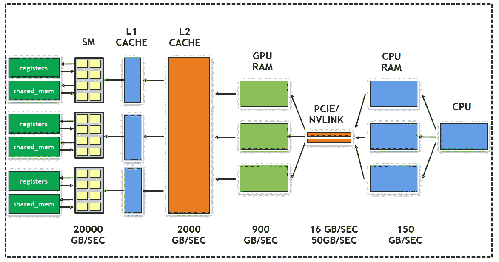

在上图中，我们可以看到从中央处理器到寄存器的数据路径，最终计算由算术逻辑单元/内核完成。

下图显示了最新图形处理器体系结构中存在的不同类型的内存层次结构。对于应用开发人员来说，每个内存可能有不同的大小、延迟、吞吐量和可见性:


上图显示了最新图形处理器架构中存在的不同类型的内存及其在硬件中的位置。

在本章中，您将学习如何优化利用不同类型的图形处理器内存。我们还将关注类似 GPU 的统一内存的最新功能，它使程序员的生活变得简单得多。本章将详细介绍以下内存主题:

*   全局内存/设备内存
*   共用存储器
*   只读数据/缓存
*   固定存储器
*   统一内存

但是在我们查看内存层次结构之前，我们将遵循优化周期，如下所示:

*   第一步:分析
*   步骤 2:并行化
*   第三步:优化

对应用的分析要求我们不仅要了解应用的特性，还要了解它在 GPU 上的运行效率。为此，在进入 GPU 内存之前，我们将首先向您介绍 Visual Profiler。由于我们在这里使用了 CUDA 的一些最新功能，请在继续本章之前阅读以下部分。

# 技术要求

本章需要一台带有现代 NVIDIA GPU(帕斯卡架构以上)的 Linux 电脑，以及所有必要的 GPU 驱动程序和安装的 CUDA 工具包(10.0 以上)。如果您不确定您的图形处理器的架构，请访问位于[https://developer.nvidia.com/cuda-gpus](https://developer.nvidia.com/cuda-gpus)的英伟达图形处理器网站并确认。本章的代码也可以在 https://github.com/PacktPublishing/Learn-CUDA-Programming的 GitHub 上找到。

本章的示例代码已经用 CUDA 工具包的 10.1 版本开发和测试。但是，建议使用最新的 CUDA 版本或更高版本。

在下一节中，我们将向您介绍 Visual Profiler，它将帮助我们分析应用。我们还将看看它在 GPU 上的运行情况。

# 英伟达视觉轮廓仪

为了理解不同内存层次的有效利用，在运行时分析应用的特性是很重要的。Profilers 是非常方便的工具，可以测量和显示不同的指标，帮助我们分析内存、SM、内核和其他资源的使用方式。NVIDIA 决定提供一个 API，探查器工具的开发人员可以使用它来挂钩到 CUDA 应用中，随着时间的推移，许多探查器工具也发生了变化，例如 TAU Performance 系统、Vampir Trace 和 HPC Toolkit。这些都利用 **CUDA Profiler 工具接口** ( **CUPTI** )为 CUDA 应用提供概要信息。

英伟达自己开发和维护作为 CUDA 工具包一部分的分析工具。本章利用这两个分析工具(NVPROF 和 NVVP)来演示不同内存类型的有效使用，并不是分析工具的指南。

我们将使用 NVPROF 或 NVVP 演示 CUDA 应用的特性。NVPROF 是命令行工具，`nvvp`有可视化界面。`nvvp`有两种格式，一种是独立版本，另一种是 Nsight Eclipse 内部的集成版本。

我们将广泛使用的 NVVP 探查器窗口如下所示:

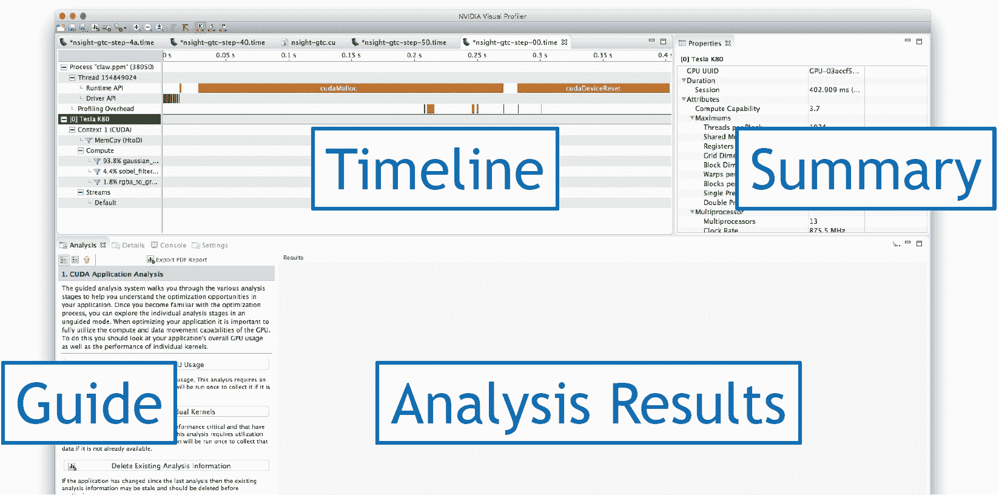

这是在 macOS 上拍摄的 9.0 版窗口快照。

窗口中有四个视图:时间线、指南、分析结果和摘要。顾名思义，时间轴视图显示了跨时间发生的中央处理器和图形处理器活动。可视化探查器显示了 CUDA 编程模型的内存层次的概要视图。“分析”视图显示分析结果。可视化探查器提供两种分析模式:

*   **引导式分析:**顾名思义，它通过采取循序渐进的方法来理解关键的性能限制因素，从而指导开发人员。一旦初学者成为理解不同指标的专家，我们会建议他们在进入无指导模式之前使用这种模式。
*   **无指导分析:**开发人员必须在此模式下手动查看结果，才能了解性能限制器。

CUDA 工具包提供了两个 GPU 应用配置文件工具，**NVIDIA Profiler**(**NVPROF**)和 **NVIDIA 可视化 Profiler** ( **NVVP** )。为了获得性能限制信息，我们需要进行不同类型的分析:时间线分析和度量分析。该代码可在`02_memory_overview/04_sgemm`处访问。分析命令可以按如下方式执行:

```cpp
$ nvcc -o sgemm sgemm.cu
$ nvprof -o sgemm.nvvp ./sgemm
$ nvprof --analysis-metrics -o sgemm-analysis.nvvp ./sgemm
```

让我们打开可视化探查器。如果你用的是 Linux 或者 OSX，可以在终端执行`nvvp`。或者，可以从 CUDA 工具包安装的二进制中找到`nvvp`二进制。如果您使用的是 Windows，您可以使用带有`nvvp`命令的 Windows 搜索框执行该工具。

要打开双概要数据，我们将使用文件|导入...菜单，如下所示:


然后，我们将继续单击底部的“下一步”按钮:

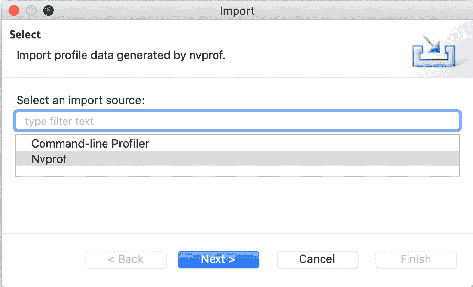。

我们的 CUDA 应用使用一个进程。因此，让我们继续点击底部的“下一步”按钮:

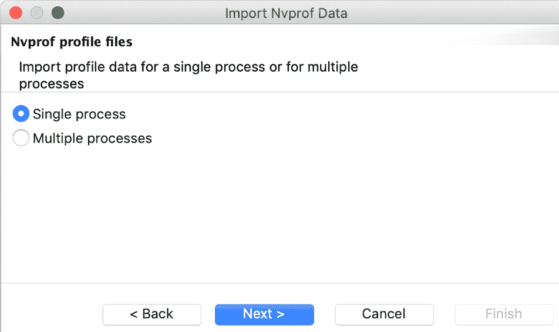

现在，让我们将收集的概要数据放入可视化概要分析器。下面的截图显示了一个例子。使用浏览将时间线数据放在第二个文本框中...右边的按钮。然后，以同样的方式将度量分析数据放入下一个文本框:

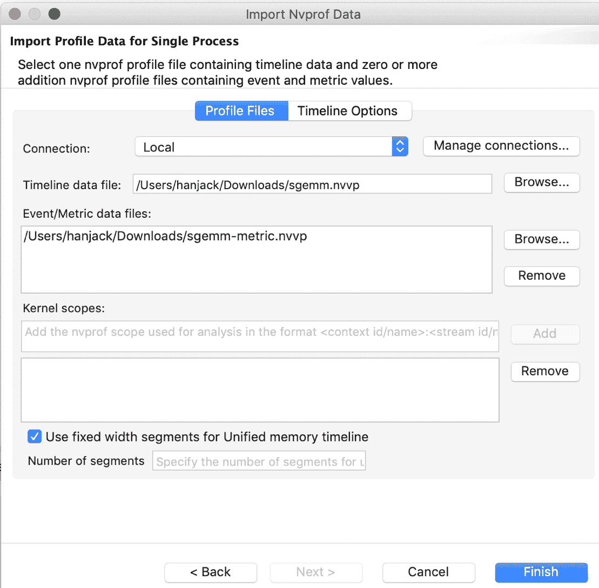

For detailed usage of profiling tools, please refer to the CUDA Profiling guide, which comes as part of the CUDA Toolkit (the respective web link is [https://docs.nvidia.com/cuda/profiler-users-guide/index.html](https://docs.nvidia.com/cuda/profiler-users-guide/index.html)).

在基于 Windows 的系统中，安装 CUDA 工具包后，您可以从“开始”菜单启动可视化探查器。在具有 X11 转发的 Linux 系统上，您可以通过运行`nvvp`命令来启动视觉探查器，该命令代表 NVIDIA 视觉探查器:

```cpp
$ ./nvvp
```

既然我们现在已经对将要使用的分析工具有了相当的了解，让我们跳到第一个也是最关键的 GPU 内存——全局内存/设备内存。

# 全局内存/设备内存

本节将详细介绍如何使用全局内存，也称为设备内存。在本节中，我们还将讨论如何高效地将数据从全局内存加载/存储到缓存中。由于全局内存是一个暂存区，所有数据都从中央处理器内存中复制，因此充分利用该内存至关重要。全局内存或设备内存对内核中的所有线程都是可见的。该内存对 CPU 也是可见的。

程序员分别用`cudaMalloc`和`cudaFree`明确管理分配和解除分配。数据分配`cudaMalloc`并声明为`__device__`。全局内存是使用`cudaMemcpy`应用编程接口从中央处理器传输的所有内存的默认暂存区。

# 全局内存上的向量加法

我们在第一章中使用的向量加法示例演示了全局内存的使用。让我们再次查看代码片段，并尝试了解如何使用全局内存:

```cpp
__global__ void device_add(int *a, int *b, int *c) {
     int index = threadIdx.x + blockIdx.x * blockDim.x;
     c[index] = a[index] + b[index];
}
int main (void) {
...
    // Alloc space for device copies of a, b, c
    cudaMalloc((void **)&d_a, size);
    cudaMalloc((void **)&d_b, size);
    cudaMalloc((void **)&d_c, size);
...

   // Free space allocated for device copies
   cudaFree(d_a); cudaFree(d_b); cudaFree(d_c);
...

}
```

`cudaMalloc`在设备内存上分配数据。内核中参数的指针(`a`、`b`和`c`)指向这个设备内存。我们使用`cudaFree`应用编程接口释放内存。如您所见，块中的所有线程都可以访问内核中的内存。

该代码可在`02_memory_overview/01_vector_addition`处访问。为了编译这段代码，您可以使用以下命令:

```cpp
$ nvcc -o vec_addition ./vector_addition_gpu_thread_block.cu
```

这是一个利用全局内存的简单例子。在下一节中，我们将了解如何以最佳方式访问数据。

# 合并与未合并的全局内存访问

为了有效地使用全局内存，理解 CUDA 编程模型中的翘曲概念非常重要，到目前为止，我们一直忽略了这一点。翘曲是 SMs 中线程调度/执行的一个单元。一旦一个块被分配给一个 SM，它就被分成一个称为**经线**的 32 线单元。这是 CUDA 编程中的基本执行单元。

为了演示扭曲的概念，让我们看一个例子。如果两个块被分配给一个 SM，并且每个块有 128 根线，那么一个块内的经纱数为 *128/32 = 4 根*经纱，SM 上的经纱总数为 *4 * 2 = 8 根*经纱。下图显示了 CUDA 块如何在 GPU SM 上被划分和调度:

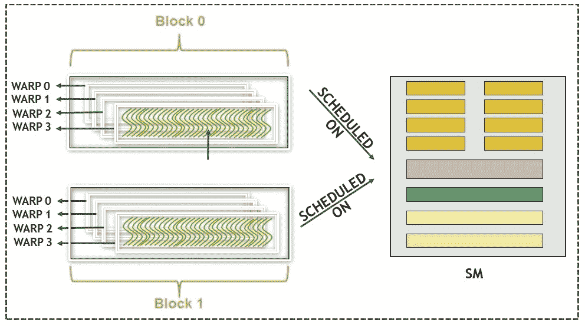

区块和扭曲在 SM 上是如何安排的，它的核心更多的是特定于架构的，对于开普勒、帕斯卡和最新的架构沃尔特来说会有所不同。目前，我们可以忽略调度的完整性。在所有可用的扭曲中，操作数准备好用于下一条指令的扭曲有资格执行。基于 CUDA 程序运行的 GPU 的调度策略，选择扭曲来执行。选中时，扭曲中的所有线程都执行相同的指令。CUDA 遵循**单指令，多线程** ( **SIMT** )模型，即一个 warp 中的所有线程在一个时间实例中获取并执行相同的指令。为了最佳地利用来自全局内存的访问，访问应该合并。聚结和未聚结的区别如下:

*   **合并全局内存访问:**顺序内存访问相邻。
*   **未完成的全局内存访问:**顺序内存访问不相邻。

下图更详细地显示了这种访问模式的一个示例。图的左侧显示了合并访问，其中来自 warp 的线程访问相邻数据，因此导致一个 32 位宽的操作和一个缓存未命中。图的右侧显示了一个场景，其中来自 warp 中线程的访问是随机的，可能导致调用 32 个一宽操作，因此可能有 32 个缓存未命中，这是最坏的情况:

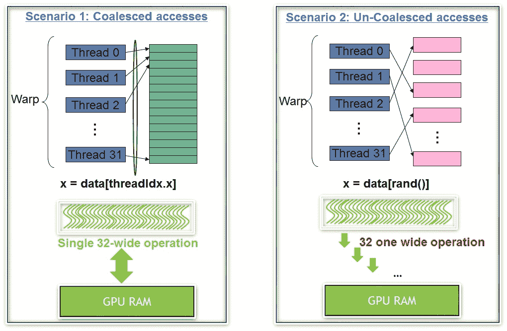

为了进一步理解这个概念，我们需要了解数据是如何通过缓存线从全局内存到达的。

**场景 1:** 扭曲请求 32 对齐，4 个连续字节

该地址属于一个高速缓存行和一个 32 位宽的操作。总线利用率是 100%，也就是说，我们正在利用从全局内存中提取到缓存中的所有数据，完全没有浪费任何带宽。如下图所示:


上图显示了合并访问，从而优化了总线利用率。

**场景 2:** 扭曲请求 32 个分散的 4 字节字

虽然 warp 需要 128 字节，但有 32 个一位宽的读取正在执行，导致 *32 * 128* 字节在总线上未命中。总线利用率实际上低于 1%，如下图所示:

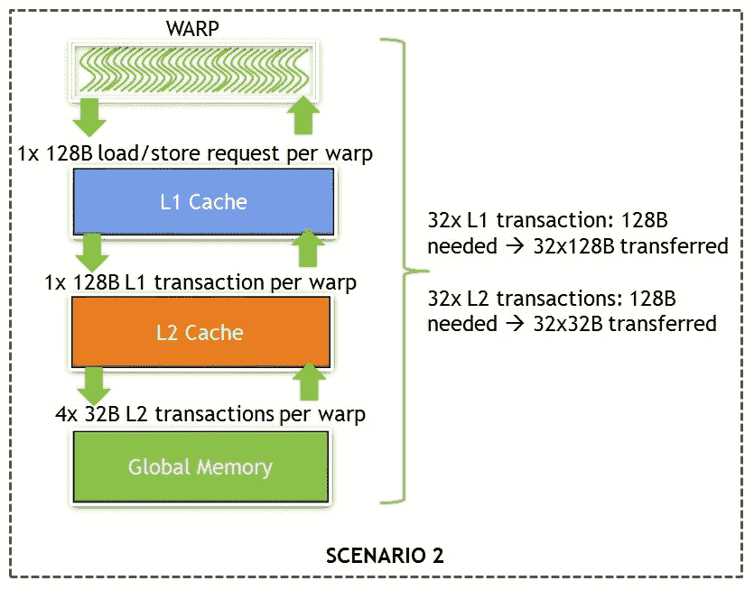

上图显示了未完成的访问，导致了总线带宽的浪费**。**

正如我们在上图中看到的，warp 中的线程如何从全局内存中访问数据非常重要。为了优化利用全局内存，改进合并非常重要。可以使用多种策略。一个这样的策略是改变数据布局以提高局部性。我们来看一个例子。将滤镜应用于图像或将遮罩应用于图像的计算机视觉算法要求将图像存储到数据结构中。在声明图像类型时，开发人员有两种选择。

下面的代码片段利用`Coefficients_SOA`数据结构以数组格式存储数据。`Coefficients_SOA`结构存储图像相关数据，如 RGB、色调和饱和度值:

```cpp
//Data structure representing an image stored in Structure of Array Format
struct Coefficients_SOA {
 int r;
 int b;
 int g;
 int hue;
 int saturation;
 int maxVal;
 int minVal;
 int finalVal;
};
```

下图显示了关于如何为`Coefficients_SOA`存储数据并由内核中的不同线程访问的数据布局:

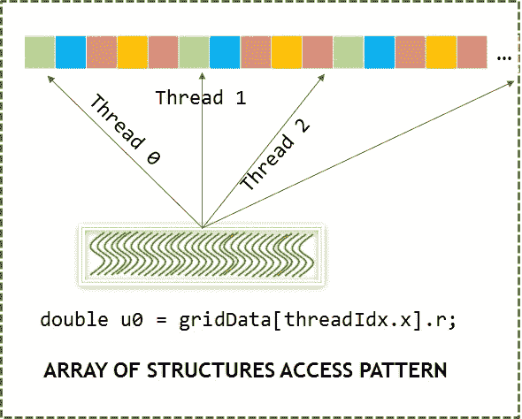

通过这样做，我们可以看到 AOS 数据结构的使用如何导致未完成的全局内存访问。

相同的图像可以以数组结构格式存储，如下面的代码片段所示:

```cpp
//Data structure representing an image stored in Array of Structure Format
struct Coefficients_AOS {
 int* r;
 int* b;
 int* g;
 int* hue;
 int* saturation;
 int* maxVal;
 int* minVal;
 int* finalVal;
};
```

下图显示了关于如何为`Coefficients_AOS`存储数据并由内核中的不同线程访问的数据布局:

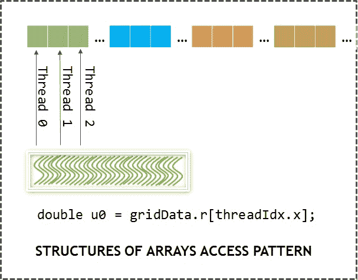

通过这样做，我们可以看到使用 SOA 数据结构如何导致非高级全局内存访问。

CPU 上的顺序代码更倾向于 AOS 的缓存效率，而 SOA 在**单指令多线程** ( **SIMT** ) 等模型中更倾向于 CUDA 的执行和内存效率。

让我们试着利用剖析器来分析这个方面。根据以下步骤配置您的环境:

1.  准备好你的 GPU 应用。作为一个例子，我们将使用两段代码来演示全局内存的有效使用。虽然`aos_soa.cu`文件包含使用 AOS 数据结构的简单实现，但是`aos_soa_solved.cu`使用了有效利用全局内存的 SOA 数据结构。这个代码可以在`02_memory_overview/02_aos_soa`找到。
2.  用`nvcc`编译器编译你的应用，然后用`nvprof`编译器分析它。以下命令是这方面的`nvcc`命令的一个例子。然后，我们使用`nvprof`命令来分析应用。`--analysis-metrics`标志也被传递，这样我们就可以得到内核的度量。
3.  生成的配置文件，即`aos_soa.prof`和`aos_soa_solved.prof`，然后被加载到 NVIDIA 可视化配置文件中。用户需要从文件|打开菜单加载分析输出。另外，不要忘记选择“所有文件”作为文件名选项的一部分:

```cpp
$ nvcc -o aos_soa ./aos_soa.cu
$ nvcc -o aos_soa_solved ./aos_soa_solved.cu
$ nvprof --analysis-metrics --export-profile aos_soa.prof ./aos_soa
$ nvprof --analysis-metrics --export-profile aos_soa_solved.prof ./aos_soa_solved
```

下面的截图显示了配置文件输出。这是一个使用 AOS 数据结构的幼稚实现:

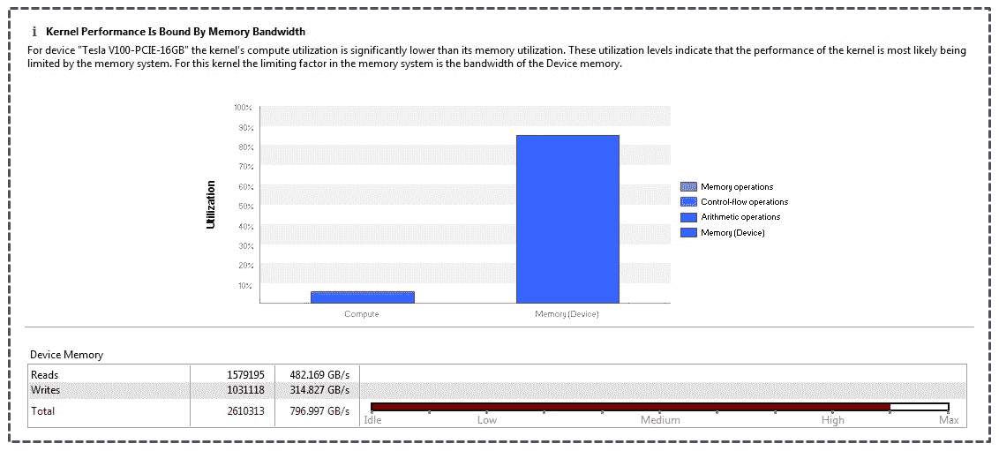

The preceding diagram shows the output of the profiler in guided analysis mode.

您将看到的第一件事是探查器清楚地声明应用是受内存限制的。正如您所看到的，概要分析器不仅仅显示指标，还显示对这些指标含义的分析。在这个例子中，由于我们使用的是 AOS，分析器清楚地表明访问模式效率不高。但是编译器是怎么得出这个结论的呢？让我们看一下下面的截图，它给出了更多关于它的细节:


正如我们所看到的，它清楚地表明访问数据的理想事务数是 4，而运行是 32 个事务/访问。

当我们将数据结构从 AOS 改变为 SOA 时，瓶颈就解决了。当您运行`aos_soa_solved`可执行文件时，您会看到内核时间减少了，这是对我们计时的改进。在 V100 16 GB 卡上，时间从 104 μs 减少到 47 μs，这是`2.2x`的加速因子。探查器输出`aos_soa_solved.prof`将显示内核仍然受内存限制，这一点非常明显，因为与执行计算相比，我们正在读写更多的内存数据。

# 内存吞吐量分析

对于应用开发人员来说，了解应用的内存吞吐量变得非常重要。这可以通过两种方式来定义:

*   **从应用的角度来看:**计算应用请求的字节数
*   **从硬件角度来看:**计算硬件移动的字节数

这两个数字完全不同。造成这种情况的原因有很多，包括未完成的访问导致不是所有的事务字节都被利用，共享内存库冲突等等。我们应该从内存角度分析应用的两个方面如下:

*   **地址模式:**确定真实代码中的访问模式相当困难，因此使用诸如 profilers 之类的工具变得非常重要。需要仔细查看探查器显示的指标，例如全局内存效率和每次访问的 L1/L2 事务。
*   **正在进行的并发访问数量:**由于 GPU 是一种延迟隐藏架构，因此使内存带宽饱和变得非常重要。但是确定并发访问的数量通常是不够的。此外，从硬件角度来看，吞吐量与理论值相差甚远。

下图表明，对于 Volta 架构，每个 SM 大约 6 KB 的飞行数据可以达到峰值带宽的 90%。同样的实验，在上一代架构上完成时，将产生不同的图形。一般来说，建议了解特定架构的 GPU 内存特性，以便从该硬件获得最佳性能:

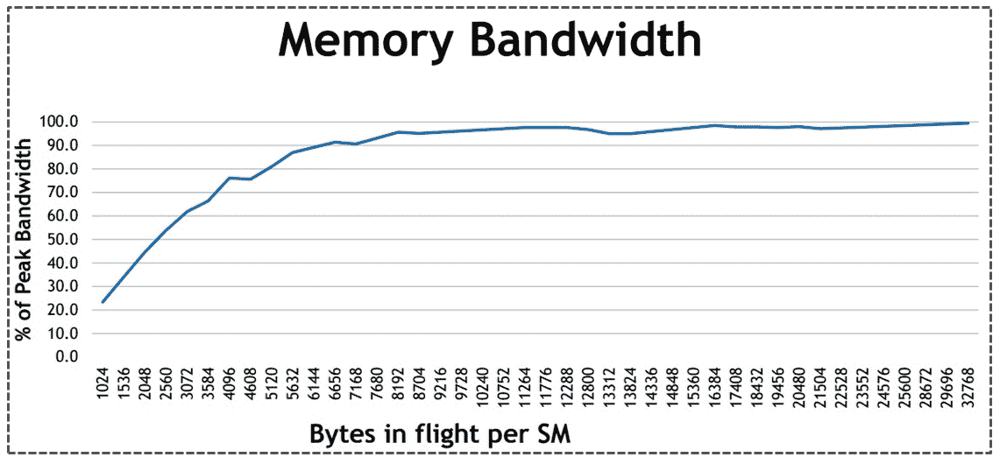

本节为我们提供了全局内存的示例用法，以及我们如何以最佳方式利用它。有时，从全局内存访问合并数据很困难(例如，在计算流体力学领域，在非结构化网格的情况下，相邻单元的数据可能不会在内存中彼此相邻)。为了解决这样的问题或减少对性能的影响，我们需要使用另一种形式的内存，称为共享内存。

# 共用存储器

共享内存在被称为**用户管理缓存**的 CUDA 内存层次结构中一直扮演着至关重要的角色。这为用户提供了一种机制，以便他们可以从全局内存中以合并的方式读取/写入数据，并将其存储在内存中，这就像缓存一样，但可以由用户控制。在本节中，我们不仅将介绍利用共享内存可以采取的步骤，还将讨论如何有效地从共享内存加载/存储数据，以及如何在内存库内部安排数据。共享内存仅对同一块中的线程可见。一个块中的所有线程都看到同一个版本的共享变量。

共享内存与中央处理器缓存有相似的好处；但是，虽然不能显式管理 CPU 缓存，但共享内存可以。共享内存的延迟比全局内存低一个数量级，带宽比全局内存高一个数量级。但是共享内存的关键用途来自于一个块中的线程可以共享内存访问。CUDA 程序员可以使用共享变量来保存在内核执行阶段多次重用的数据。此外，由于同一块中的线程可以共享结果，这有助于避免冗余计算。直到 9.0 版本，CUDA 工具包都没有在不同块中的线程之间提供可靠的通信机制。我们将在后续章节中更详细地介绍 CUDA 9.0 通信机制。现在，我们将假设线程之间的通信只可能在 CUDA 中通过使用共享内存来实现。

# 共享内存上的矩阵转置

用于演示共享内存的最原始的例子之一是矩阵转置。矩阵转置是一种受内存限制的操作。下面的代码片段使用`matrix_transpose_naive`内核，显示了矩阵转置内核的示例实现:

```cpp
__global__ void matrix_transpose_naive(int *input, int *output) {
     int indexX = threadIdx.x + blockIdx.x * blockDim.x;
     int indexY = threadIdx.y + blockIdx.y * blockDim.y;
     int index = indexY * N + indexX;
     int transposedIndex = indexX * N + indexY;
     output[index] = input[transposedIndex];
}
```

前面的代码展示了使用全局内存进行矩阵转置的简单实现。如果以简单的方式实现，这将导致在读取矩阵或写入矩阵时的非高级访问。内核在 V100 PCIe 16 GB 卡上的执行时间约为 60 μs。

根据以下步骤配置您的环境:

1.  准备好你的 GPU 应用。该代码可在`02_memory_overview/02_matrix_transpose`中找到。
2.  用`nvcc`编译器编译你的应用，然后用`nvprof`编译器分析它。以下命令是这方面的`nvcc`命令的一个例子。然后，我们使用`nvprof`命令来分析应用。`--analysis-metrics`标志也被传递来获取内核的度量。

3.  生成的配置文件，即`matrix_transpose.prof`，然后被加载到 NVIDIA 可视化配置文件中。用户需要从文件|打开菜单加载分析输出。另外，不要忘记选择“所有文件”作为文件名选项的一部分:

```cpp
$ nvcc -o matrix_transpose ./matrix_transpose.cu
$ nvcc -o conflict_solved ./conflict_solved.cu
$ nvprof --analysis-metrics --export-profile matrix_transpose.prof ./matrix_transpose
$ nvprof --analysis-metrics --export-profile conflict_solved.prof ./conflict_solved
```

下面的截图显示了分析的输出。该输出明确指出，存在对全局内存的非高级访问，这是一个需要努力的关键指标，以便我们能够提高性能:

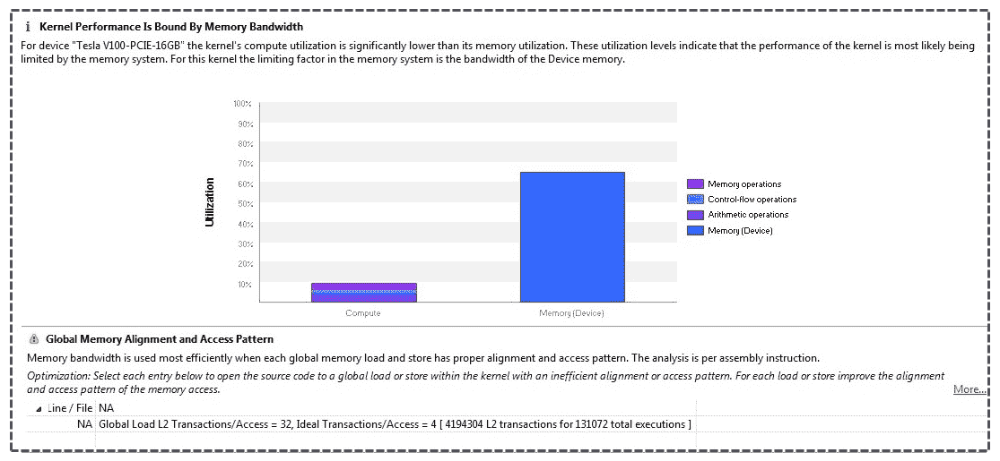

解决这个问题的一种方法是利用高带宽和低延迟的内存，例如共享内存。这里的技巧是以合并的方式从全局内存中读写。在这里，对共享内存的读或写可以是一种非高级模式。共享内存的使用带来了更好的性能，时间减少到 21 微秒，是时间加速的 3 倍:

```cpp
__global__ void matrix_transpose_shared(int *input, int *output) {

    __shared__ int sharedMemory [BLOCK_SIZE] [BLOCK_SIZE];

    //global index
     int indexX = threadIdx.x + blockIdx.x * blockDim.x;
     int indexY = threadIdx.y + blockIdx.y * blockDim.y;

    //transposed global memory index
     int tindexX = threadIdx.x + blockIdx.y * blockDim.x;
     int tindexY = threadIdx.y + blockIdx.x * blockDim.y;

    //local index
     int localIndexX = threadIdx.x;
     int localIndexY = threadIdx.y;
     int index = indexY * N + indexX;
     int transposedIndex = tindexY * N + tindexX;

    //transposed the matrix in shared memory. 
    // Global memory is read in coalesced fashion
     sharedMemory[localIndexX][localIndexY] = input[index];
     __syncthreads();

    //output written in global memory in coalesed fashion.
     output[transposedIndex] = sharedMemory[localIndexY][localIndexX];
}
```

前面的代码片段显示了使用共享内存实现矩阵转置。全局内存读/写合并，而转置发生在共享内存中。

# 银行冲突及其对共享记忆的影响

与使用全局内存相比，良好的加速并不一定意味着我们在有效地使用共享内存。如果我们查看探查器指标，这一点会变得更加清晰。如果我们将探查器输出的引导分析转换为非引导分析，即`matrix_transpose.prof`，我们将看到共享内存访问模式显示对齐问题，如下图所示:


我们可以看到探查器如何显示共享内存的非最佳使用，这是存储体冲突的迹象。

为了有效地理解这个对齐问题，理解*银行*的概念是很重要的。共享内存被组织成组，以实现更高的带宽。每家银行每个周期可以服务一个地址。内存可以提供与存储体一样多的同时访问。沃尔特图形处理器有 32 个存储体，每个存储体有 4 字节宽。当一个数组存储在共享内存中时，相邻的 4 字节字会进入连续的存储体，如下图所示:


上图中的逻辑视图显示了数据是如何存储在共享内存中的。

翘曲中的线程对存储体的多次同时访问会导致存储体冲突。换句话说，当两个或更多线程访问同一存储体中不同的 4 字节字时，就会发生存储体冲突。逻辑上，这是当两个或多个线程访问同一存储体中不同的*行*时。下图显示了不同的 *n* 路银行冲突的示例。最坏的情况是 32 路冲突| 31 次重放–每次重放都会增加几个周期的延迟:


前面的场景显示了来自同一经线的线程访问位于不同存储体中的相邻 4 字节元素，不会导致存储体冲突。请看下图:


这是另一个无存储体冲突的场景，其中来自同一扭曲的线程访问驻留在不同存储体中的随机 4 字节元素，从而不会导致存储体冲突。由于共享内存中的双向存储体冲突而导致的顺序访问如下图所示:

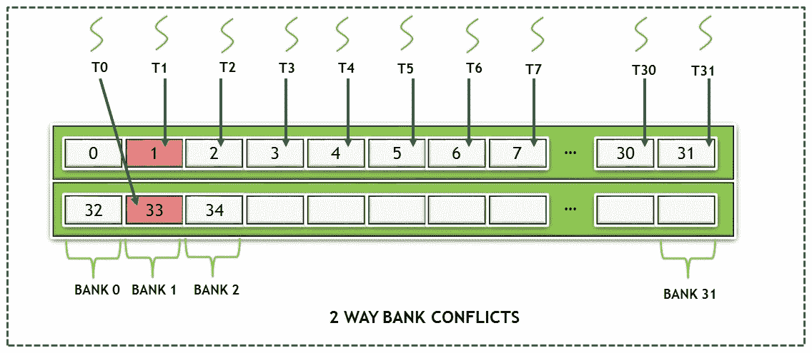

上图显示了一个场景，其中来自同一扭曲的线程 **T0** 和 **T1** 访问驻留在同一存储体中的 4 字节元素，从而导致双向存储体冲突。

在前面的矩阵转置的例子中，我们使用了共享内存来获得更好的性能。然而，我们可以看到一个 32 路的银行冲突。为了解决这个问题，可以使用一种称为填充的简单技术。所有这些都是在共享内存中填充一个虚拟内存，即一个额外的列，这将导致线程访问不同的内存库，从而获得更好的性能:

```cpp
__global__ void matrix_transpose_shared(int *input, int *output) {

     __shared__ int sharedMemory [BLOCK_SIZE] [BLOCK_SIZE + 1];

    //global index
     int indexX = threadIdx.x + blockIdx.x * blockDim.x;
     int indexY = threadIdx.y + blockIdx.y * blockDim.y;

    //transposed index
     int tindexX = threadIdx.x + blockIdx.y * blockDim.x;
     int tindexY = threadIdx.y + blockIdx.x * blockDim.y;
     int localIndexX = threadIdx.x;
     int localIndexY = threadIdx.y;
     int index = indexY * N + indexX;
     int transposedIndex = tindexY * N + tindexX;

    //reading from global memory in coalesed manner 
    // and performing tanspose in shared memory
     sharedMemory[localIndexX][localIndexY] = input[index];

    __syncthreads();

    //writing into global memory in coalesed fashion 
    // via transposed data in shared memory
     output[transposedIndex] = sharedMemory[localIndexY][localIndexX];
}
```

前面的代码片段中，我们使用了`matrix_transpose_shared`内核，展示了填充的概念，这将消除存储体冲突，从而更好地利用共享内存带宽。像往常一样，运行代码并在可视化探查器的帮助下验证此行为。有了这些变化，您应该会看到内核的时间减少到 13 微秒，这是 60%的进一步加速。

在这一节中，我们看到了如何最佳地利用共享内存，共享内存作为暂存区提供读写访问。但有时，数据只是只读输入，不需要写访问。在这种情况下，图形处理器提供了一个称为**纹理**内存的最佳内存。我们将在下一章中研究这一点，以及它为开发人员提供的其他优势。我们将在下一节讨论只读数据。

# 只读数据/缓存

根据内存名称，您可能已经猜到，只读缓存适合存储只读数据，并且在内核执行过程中不会改变。高速缓存为此目的进行了优化，并且基于 GPU 架构，释放并减少了另一个高速缓存上的负载，从而获得更好的性能。在这一节中，我们将详细介绍如何在图像处理代码示例的帮助下利用只读缓存来调整图像大小。

只读数据对图形处理器网格中的所有线程都是可见的。该数据被标记为 GPU 的只读，这意味着对该数据的任何更改都将导致内核中未指定的行为。另一方面，中央处理器对这些数据既有读写权限。

传统上，这个缓存也被称为纹理缓存。虽然用户可以显式调用纹理 API 来利用只读缓存，但使用最新的 GPU 架构，开发人员可以利用该缓存，而无需显式利用 CUDA 纹理 API。有了最新的 CUDA 版本和 Volta 等 GPU，标记为`const __restrict__`的内核指针参数就有资格成为遍历只读缓存数据路径的只读数据。开发人员也可以通过`__ldg`固有的缓存强制加载。

当算法要求整个 warp 读取相同的地址/数据时，最好使用只读数据，这主要导致每个时钟周期向所有请求数据的线程广播。纹理缓存针对 2D 和 3D 局部性进行了优化。由于线程是同一扭曲的一部分，从具有 2D 和 3D 局部性的纹理地址读取数据往往会获得更好的性能。纹理已被证明在需要随机存储器访问的应用中非常有用，尤其是在 Volta 架构卡之前。

纹理支持双线性和三线性插值，这对于图像处理算法(如缩放图像)特别有用。

下图显示了位于 2D 空间的经线访问元素中的线的示例。纹理适合以下几种工作负载:

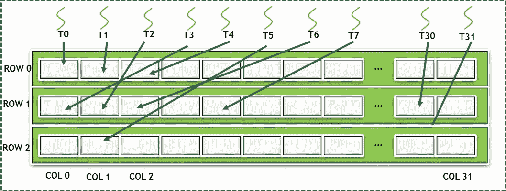

现在，让我们来看一个关于缩放的小的真实世界算法，以演示纹理内存的使用。

# 计算机视觉-使用纹理存储器的图像缩放

我们将以图像缩放为例来演示纹理记忆的使用。下图显示了图像缩放的示例:


图像缩放需要二维图像像素的插值。纹理提供了这两种功能(插值和对 2D 局部性的有效访问)，如果由全局内存直接访问，将导致不加掩饰的内存访问。

根据以下步骤配置您的环境:

1.  准备好你的 GPU 应用。这个代码可以在`02_memory_overview/03_image_scaling`找到。
2.  使用以下命令，使用`nvcc`编译器编译您的应用:

```cpp
$nvcc -c scrImagePgmPpmPackage.cpp 
$nvcc -c image_scaling.cu
$nvcc -o image_scaling image_scaling.o scrImagePgmPpmPackage.o
```

`scrImagePgmPpmPackage.cpp`文件包含读写扩展名为`.pgm`的图像的源代码。纹理代码存在于`image_scaling.cu`中。

For viewing the `pgm` files users can make use of viewers like IrfanView ([https://www.irfanview.com/main_download_engl.htm](https://www.irfanview.com/main_download_engl.htm)) which are free to use.

首先，我们需要四个步骤来利用纹理内存:

1.  声明纹理内存。
2.  将纹理内存绑定到纹理引用。
3.  使用 CUDA 内核中的纹理引用读取纹理内存。
4.  从你的纹理参考中解除纹理记忆。

下面的代码片段显示了我们可以用来利用纹理内存的四个步骤。从开普勒图形处理器架构和 CUDA 5.0 开始，引入了一个新特性，称为无绑定纹理。这暴露了纹理对象，它基本上是一个 C++ 对象，可以传递给 CUDA 内核。它们被称为无绑定，因为它们不需要手动绑定/解除绑定，早期的 GPU 和 CUDA 版本就是这种情况。纹理对象是使用`cudaTextureObject_t`类 API 声明的。让我们现在来看看这些步骤:

1.  首先，声明纹理内存:

```cpp
texture<unsigned char, 2, cudaReadModeElementType> tex;
```

创建一个通道描述，当我们链接到纹理时将使用它:

```cpp
cudaArray* cu_array;
cudaChannelFormatKind kind = cudaChannelFormatKindUnsigned;
cudaChannelFormatDesc channelDesc = cudaCreateChannelDesc(8, 0, 0, 0, kind);
```

2.  然后，指定纹理对象参数:

```cpp
struct cudaTextureDesc texDesc;
memset(&texDesc, 0, sizeof(texDesc)); 
//set the memory to zero
texDesc.addressMode[0] = cudaAddressModeClamp; 
// setting the x dimension addressmode to Clamp
texDesc.addressMode[1] = cudaAddressModeClamp; 
//Setting y dimension addressmode to Clamp
texDesc.filterMode = cudaFilterModePoint; 
// Filter mode set to Point
texDesc.readMode = cudaReadModeElementType; 
// Reading element type and not interpolated
texDesc.normalizedCoords = 0;
```

3.  接下来，从 CUDA 内核中的纹理引用中读取纹理内存:

```cpp
imageScaledData[index] = tex2D<unsigned char>(texObj,(float)(tidX*scale_factor),(float)(tidY*scale_factor));
```

4.  最后，破坏纹理对象:

```cpp
cudaDestroyTextureObject(texObj);
```

纹理内存的重要方面类似于配置，由开发人员设置，如下所示:

*   **纹理维度:**这定义了纹理是作为 1D、2D 还是三维阵列来处理的。纹理中的元素也被称为纹理元素。深度、宽度和高度也设置为定义每个尺寸。请注意，每个 GPU 架构都为每个维度定义了可接受的最大大小。
*   **纹理类型:**这根据它是基本整数还是浮点纹理元素来定义大小。
*   **纹理读取模式:**纹理的读取模式定义了元素的读取方式。它们可以以`NormalizedFloat`或`ModeElement`格式读取。对于无符号整数和有符号整数类型，规范化浮点模式要求索引在[0.0 1.0]和[-1.0 1.0]范围内。
*   **纹理寻址模式:**纹理的一个独特的特性是它如何处理超出范围的访问。这听起来可能不寻常，但事实上，在许多成像算法中非常常见。例如，如果您通过平均相邻像素来应用插值，边界像素的行为应该是什么？纹理为开发人员提供了一个选项，以便他们可以选择是将超出范围的部分视为夹紧、包裹还是镜像。在调整大小的例子中，我们将其设置为箝位模式，这基本上意味着超出范围的访问被箝位到边界。
*   **纹理过滤模式:**设置该模式定义了获取纹理时返回值的计算方式。支持两种过滤模式:`cudaFilterModePoint`和`cudaFilterModeLinear`。当设置为线性模式时，插值是可能的(1D 为简单线性，2D 为双线性，三维为三线性)。线性模式仅在返回类型为浮点类型时有效。`ModePoint`则不执行插值，而是返回最近坐标的纹理元素。

The key intention of introducing texture memory in this section is to provide you with an example of its usage and to show you where texture memory is useful. It provides a good overview of the different configuration parameters. Please refer to the CUDA API guide ([https://docs.nvidia.com/cuda/cuda-runtime-api/index.html](https://docs.nvidia.com/cuda/cuda-runtime-api/index.html)) for more information.

在本节中，我们通过一个例子描述了使用纹理内存的目的。在下一节中，我们将了解可用的最快(最低延迟)GPU 内存(寄存器)。与中央处理器相比，这在图形处理器中大量存在。

# 图形处理器中的寄存器

中央处理器和图形处理器架构之间的一个根本区别是，与中央处理器相比，图形处理器中有大量的寄存器。这有助于线程将大部分数据保存在寄存器中，从而减少上下文切换的延迟。因此，优化这种记忆也很重要。

寄存器有一个单线程的范围。为网格中所有启动的线程创建变量的私有副本。每个线程都可以访问其私有的变量副本，而其他线程的私有变量不能被访问。例如，如果一个内核用 1000 个线程启动，那么一个作用域为线程的变量会得到它自己的变量副本。

声明为内核一部分的局部变量存储在寄存器中。中间值也存储在寄存器中。每个 SM 都有一组固定的寄存器。在编译期间，编译器(`nvcc`)试图找到每个线程的最佳寄存器数量。在寄存器数量不足的情况下(这通常发生在 CUDA 内核较大且具有大量局部变量和中间计算的情况下)，数据被推送到本地内存，该内存可能位于 L1/L2 缓存中，或者甚至位于内存层次结构的较低位置，例如全局内存。这也称为寄存器溢出。每个线程的寄存器数量对于 SM 上有多少块和线程是活动的起着重要作用。下一章将详细介绍这一概念，其中有一节专门讨论占用问题。一般来说，建议不要声明大量不必要的局部变量。如果寄存器限制了 SM 上可以调度的线程数量，那么开发人员应该考虑通过将内核分成两个——或者更多，如果可能的话——来重组代码。

声明为`vecAdd`内核一部分的变量存储在寄存器存储器中。传递给内核的参数，即`A`、`B`和`C`，指向全局内存，但变量本身存储在基于 GPU 架构的寄存器共享内存中。下图显示了 UDA 内存层次结构和不同变量类型的默认位置:


到目前为止，我们已经看到了关键内存层次结构(全局、纹理、共享和寄存器)的用途和最佳用法。在下一节中，我们将了解 GPU 内存的一些优化和功能，这些优化和功能可以提高应用的性能，并提高开发人员编写 CUDA 程序时的工作效率。

# 固定存储器

现在是时候回忆一下数据所采取的路径了，也就是说，从中央处理器内存到图形处理器寄存器，这些寄存器最终被图形处理器内核用于计算。即使图形处理器具有更高的计算性能和更高的内存带宽，由于中央处理器内存和图形处理器内存之间的传输，应用获得的加速的整体优势也可以正常化。这种数据传输是通过总线/链路/协议进行的，例如 PCIe(对于英特尔和 AMD 的 CPU 架构)或 NVLink(对于 OpenPower Foundation 的`power`等 CPU 架构)。

为了克服这些瓶颈，建议采用以下技巧/指南:

*   首先，建议尽可能减少主机和设备之间传输的数据量。这甚至可能意味着将一部分顺序代码作为内核在 GPU 上运行，从而与在主机 CPU 上顺序运行它们相比，几乎没有加速。
*   其次，利用固定内存在主机和设备之间实现更高的带宽非常重要。
*   建议将小批量转移到一个大批量转移中。这有助于减少调用数据传输 CUDA 应用编程接口所涉及的延迟，根据系统的配置，延迟可能从几微秒到几毫秒不等。
*   最后，应用可以利用异步数据传输将内核执行与数据传输重叠。

在这一节中，我们将更详细地介绍固定内存传输。异步传输将在[第 4 章](04.html)、*内核执行模型和优化策略*中有更详细的介绍，我们将利用一个叫做 CUDA 流的概念。

# 带宽测试–固定与可分页

默认情况下，称为`malloc()`的内存分配应用编程接口分配可分页的内存类型。这意味着，如果需要，映射为页面的内存可以被其他应用或操作系统本身换出。因此，大多数设备，包括图形处理器和其他设备，如同样位于 PCIe 总线上的 InfiniBand，都希望在传输之前锁定内存。默认情况下，图形处理器不会访问可分页内存。因此，当调用内存传输时，CUDA 驱动程序分配临时固定内存，将数据从默认可分页内存复制到该临时固定内存，然后通过**设备内存控制器** ( **DMA** )将其传输到设备。

这个额外的步骤不仅增加了延迟，而且有机会将请求的页面传输到 GPU 内存，该页面已被交换，需要带回 GPU 内存。

为了理解使用固定内存的影响，让我们试着编译并运行一段示例代码。这是作为统一数据自动化系统样本的一部分提供的。根据以下步骤配置您的环境:

1.  准备好你的 GPU 应用。该代码出现在`<CUDA_SAMPLES_DIR>/1_Utilities/bandwidthTest`中。
2.  使用`make`命令编译您的应用。
3.  以两种模式运行可执行文件，即`pageable`和`pinned`，如下所示:

```cpp
$make
$./bandwidthTest --mode=shmoo --csv --memory=pageable > pageable.csv
$./bandwidthTest --mode=shmoo --csv --memory=pinned >  pinned.csv
```

Note that `CUDA_SAMPLES_DIR` is the path to the directory where the CUDA installation has been placed.

正如我们所看到的，与前面的代码相比，关键的变化是我们到目前为止编写的是一个数据分配 API。下面的代码片段显示了使用`cudaMallocHost`应用编程接口而不是`malloc`分配内存:

```cpp
cudaError_t status = cudaMallocHost((void**)&h_aPinned, bytes);
if (status != cudaSuccess)
 printf("Error allocating pinned host memory\n");
```

`cudaMallocHost` API 使内存成为固定内存，而不是可分页内存。虽然分配 API 发生了变化，但我们仍然可以使用相同的数据传输 API，即`cudaMemcpy()` *。*现在，重要的问题是，*这是什么固定内存，为什么它能提供更好的带宽？*我们将在下一节介绍这一点。

从带宽测试的输出可以看出对性能的影响。我们已经把结果绘制成图表，这样你就可以很容易地理解影响。 *x* 轴显示以千字节为单位传输的数据，而 *y* 轴显示以兆字节/秒为单位实现的带宽。

第一个图是**主机到设备**的传输，而第二个图是**设备到主机**的传输。首先你会看到，可以达到的最大带宽是~ 12gb/秒。PCIe 第三代的理论带宽为 16gb/秒，但可实现的带宽在 12gb/秒的范围内。可实现的带宽在很大程度上取决于系统(主板、中央处理器、PCIe 拓扑等):

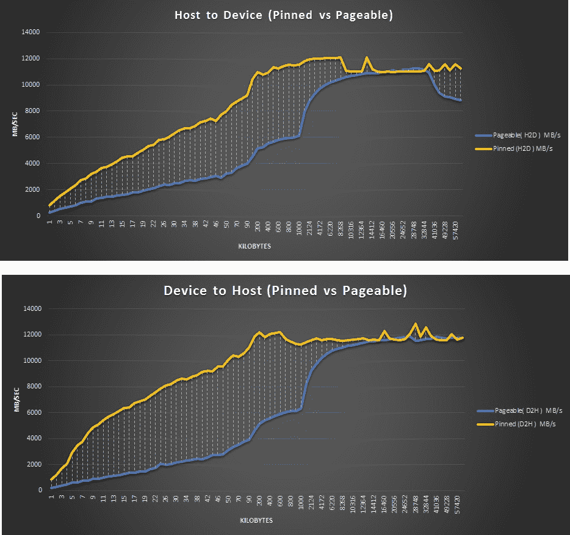

如您所见，对于固定内存，带宽对于较低的传输大小总是较高的，而可分页内存带宽在较高的数据大小传输时变得相等，因为驱动程序和 DMA 引擎开始通过应用重叠等概念来优化传输。尽管建议利用固定记忆，但过度使用也有不利的一面。为应用分配固定的整个系统内存会降低整体系统性能。发生这种情况是因为它会占用可用于其他应用和操作系统任务的页面。应该固定的正确大小非常依赖于应用和系统，对此没有现成的公式。我们能做的最好的事情是在可用的系统上测试应用，并选择最佳的性能参数。

此外，重要的是要理解，新的互连，如 NVLink，为受这些数据传输约束的应用提供了更高的带宽和更低的延迟。目前，中央处理器和图形处理器之间的非易失性链路仅由电源中央处理器提供。

在本节中，我们研究了如何提高中央处理器和图形处理器之间的数据传输速度。我们现在将继续利用 CUDA 的一个新特性，称为统一内存，这有助于提高开发人员编写 CUDA 程序的生产率。

# 统一内存

随着每一个新的 CUDA 和 GPU 架构的发布，新的功能被添加进来。这些新特性提供了更高的性能和更容易的编程，或者允许开发人员实现新的算法，否则就不可能使用 CUDA 移植到图形处理器上。从 CUDA 6.0 开始发布并在开普勒 GPU 架构中实现的一个重要特性是统一内存。在本章中，我们将统一内存称为 UM。

简单来说，UM 为用户提供了一个单一内存空间的视图，系统中的所有图形处理器和中央处理器都可以访问这个空间。下图说明了这一点:


在这一节中，我们将介绍如何利用 UM，优化它，并强调利用它的主要优势。与全局内存访问一样，如果以非高级方式进行，会导致性能下降，而 UM 功能如果使用不当，则会导致应用的整体性能下降。我们将采取循序渐进的方法，从一个简单的程序开始，并在此基础上进行构建，以便我们能够理解 UM 及其对性能的影响。

让我们试着编译并运行一些示例代码。根据以下步骤配置您的环境:

1.  准备好你的 GPU 应用。这个代码可以在`02_memory_overview/unified_memory`找到。
2.  使用以下`nvcc`命令编译您的应用:

```cpp
$nvcc -o unified_simple.out unified_memory.cu
$nvcc -o unified_initialized.out unified_memory_initialized.cu
$nvcc -o unified_prefetch.out unified_memory_prefetch.cu
$nvcc -o unified_64align.out unified_memory_64align.cu
```

请注意，本部分显示的结果是针对特斯拉 P100 卡的。同样的代码，当在开普勒等其他架构上运行时，预计会给出不同的结果。本节的重点是最新的架构，如帕斯卡和沃尔特。

# 了解统一内存页面分配和传输

让我们从 UM 的天真实现开始。第一段代码`unified_memory.cu`演示了这个概念的基本用法。代码的主要变化是使用了`cudaMallocManaged()`应用编程接口，而不是使用`malloc`分配内存，如下面的代码片段所示:

```cpp
float *x, *y;
int size = N * sizeof(float);
...
cudaMallocManaged(&x, size);
cudaMallocManaged(&y, size);
...

 for (int ix = 0; ix < N; ix++) {
    x[ix] = rand()%10;
    y[ix] = rand()%20;
  }
...

 add<<<numBlocks, blockSize>>>(x, y, N);
```

仔细看源代码，会发现`x`和`y`变量只分配一次，指向统一内存。相同的指针被发送到图形处理器`add<<<>>>()`内核，并使用`for`循环在中央处理器中进行初始化。这对程序员来说非常简单，因为他们不需要跟踪指针指向的是中央处理器内存还是图形处理器内存。但这是否一定意味着我们从中获得了良好的性能或传输速度？不一定，所以让我们试着通过分析这段代码来深入挖掘，如下面的截图所示:


我们使用以下命令来获取分析输出:

```cpp
$ nvprof ./unified_simple.out
```

不出所料，大部分时间都在`add<<<>>>`内核中度过。让我们尝试从理论上计算带宽。我们将使用以下公式计算带宽:

*带宽=字节/秒= (3 * 4，194，304 字节* 1e-9 字节/GB) / 2.6205e-3s = 5 GB/s*

如您所见，P100 提供的理论带宽为 720 GB/s，而我们只能达到 5 GB/s，这确实很差。你可能想知道为什么我们只计算内存带宽。这样做的原因是，应用是受内存限制的，因为它完成了三次内存操作，并且只有一次添加。因此，只专注于这方面是有意义的。

从帕斯卡卡开始，`cudaMallocManaged()`不分配物理内存，而是基于第一次触摸分配内存。如果 GPU 第一次接触变量，页面将在 GPU 页面表中进行分配和映射；否则，如果 CPU 第一次接触变量，它将被分配并映射到 CPU。在我们的代码中，`x`和`y`变量在中央处理器中用于初始化。因此，页面被分配给中央处理器。在`add<<<>>>`内核中，当访问这些变量时，会出现页面错误，页面迁移的时间会被添加到内核时间中。这是内核时间高的根本原因。现在，让我们深入探讨页面迁移的步骤。

页面迁移中完成的操作顺序如下:

1.  首先，我们需要在 GPU 和 CPU 上分配新页面(第一次接触的基础上)。如果页面不存在并映射到另一个页面，则会出现设备页面表页面错误。当位于**第 2 页**的 ***x** 在当前映射到 CPU 内存的 GPU 中被访问时，会出现页面错误。请看下图:


2.  在下一步中，将取消 CPU 上旧页面的映射，如下图所示:


3.  接下来，数据从中央处理器复制到图形处理器，如下图所示:

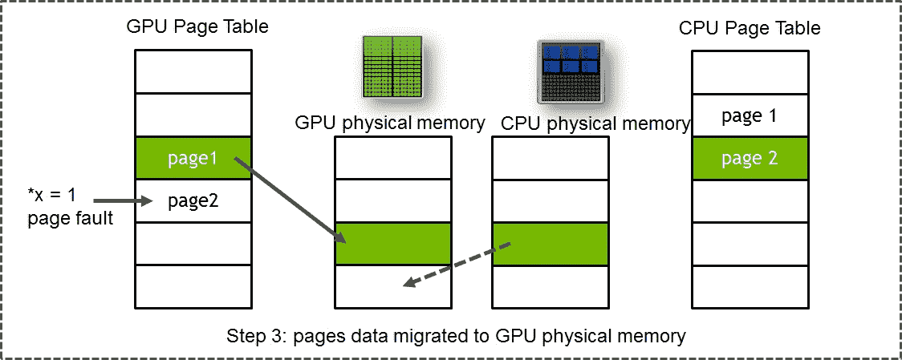

4.  最后，新页面映射到 GPU 上，而旧页面在 CPU 上释放，如下图所示:


GPU 中的**转换后备缓冲器** ( **TLB** )与 CPU 非常相似，执行从物理地址到虚拟地址的地址转换。当出现页面错误时，相应 SM 的 TLB 被锁定。这基本上意味着新指令将被停止，直到执行前面的步骤并最终解锁 TLB。这对于在 SM 中保持一致性和保持一致的内存视图状态是必要的。驱动程序负责删除这些重复项、更新映射和传输页面数据。正如我们前面提到的，所有这些时间都被添加到总内核时间中。

所以，我们现在知道问题了。不过，解决办法是什么？为了解决这个问题，我们将使用两种方法:

*   首先，我们将在 GPU 上创建一个初始化内核，以便在`add<<<>>>`内核运行期间没有页面错误。然后，我们将利用每页扭曲的概念来优化页面错误。
*   我们将预取数据。

我们将在接下来的章节中介绍这些方法。

# 通过每页扭曲优化统一内存

让我们从第一种方法开始，这就是初始化内核。如果您看一下`unified_memory_initialized.cu`文件中的源代码，我们在那里添加了一个名为`init<<<>>>`的新内核，如下代码所示:

```cpp
__global__ void init(int n, float *x, float *y) {
 int index = threadIdx.x + blockIdx.x * blockDim.x;
 int stride = blockDim.x * gridDim.x;
 for (int i = index; i < n; i += stride) {
   x[i] = 1.0f;
   y[i] = 2.0f;
  }
}
```

通过添加一个内核来初始化 GPU 本身中的数组，页面被分配并映射到 GPU 内存，因为它们首先在`init<<<>>>`内核中被触摸。让我们看看这段代码的分析结果输出，其中显示了使用初始化内核分析输出:

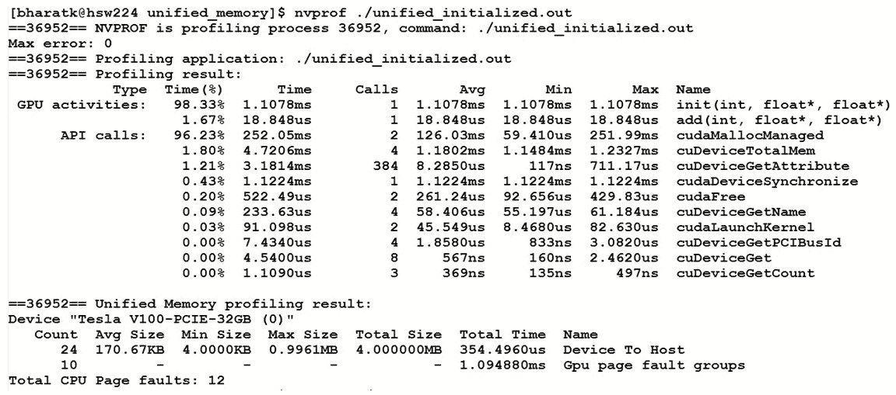

我们使用了以下命令来获取分析输出

```cpp
nvprof ./unified_initialized.out
```

如您所见，`add<<<>>>`内核的时间减少到了 18 μs。这有效地为我们提供了以下内核带宽:

*带宽=字节/秒= (3 * 4，194，304 字节* 1e-9 字节/GB) / 18.84e-6s = 670 GB/s*

这种带宽是您在非统一内存场景中所期望的。从前面截图中的简单实现可以看出，在分析输出中没有主机到设备行。但是，您可能已经看到，即使`add<<<>>>`内核时间减少了，但是`init<<<>>>`内核并没有成为占用最大时间的热点。这是因为我们第一次触摸到了记忆中的`init<<<>>>`内核。此外，您可能想知道这些 GPU 故障组是什么。正如我们之前所讨论的，单个页面错误可以分组在一起，以根据试探法以及访问模式来提高带宽。为了更深入地了解这一点，让我们用`--print-gpu-trace`重新编写代码，这样我们就可以看到单个页面错误。正如您可以看到下面的截图，GPU 跟踪显示了故障的整体跟踪和发生故障的虚拟地址:

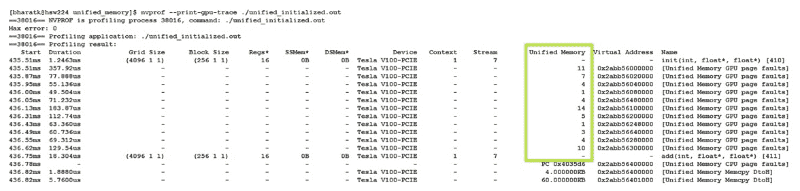

我们使用以下命令来获取分析输出:

```cpp
$ nvprof --print-gpu-trace ./unified_initialized.out
```

第二行显示了同一页面的 11 个页面错误。正如我们前面所讨论的，驱动程序的作用是过滤这些重复的错误，并且只传输每个页面一次。在复杂的访问模式中，通常驱动程序没有足够的信息来说明哪些数据可以迁移到 GPU。为了改善这种情况，我们将进一步实现每页扭曲的概念，这基本上意味着每个扭曲将访问相同页面中的元素。这需要开发人员付出额外的努力。让我们重新实现`init<<<>>>`内核。您可以在我们之前编译的`unified_memory_64align.cu`文件中看到这个实现。下面的代码片段显示了内核的快照:

```cpp
#define STRIDE_64K 65536
__global__ void init(int n, float *x, float *y) {
  int lane_id = threadIdx.x & 31;
  size_t warp_id = (threadIdx.x + blockIdx.x * blockDim.x) >> 5;
  size_t warps_per_grid = (blockDim.x * gridDim.x) >> 5;
  size_t warp_total = ((sizeof(float)*n) + STRIDE_64K-1) / STRIDE_64K;
  for(; warp_id < warp_total; warp_id += warps_per_grid) {
    #pragma unroll
    for(int rep = 0; rep < STRIDE_64K/sizeof(float)/32; rep++) {
      size_t ind = warp_id * STRIDE_64K/sizeof(float) + rep * 32 + lane_id;
      if (ind < n) {
        x[ind] = 1.0f;
        y[ind] = 2.0f;
      }
    }
  }
}
```

内核显示索引基于`warp_id`。GPU 中的 warp 大小为 32，负责在 64 KB 范围的索引内填充`x`和`y`变量，也就是说，warp 1 负责前 64 KB，而 warp 2 负责后 64 KB 的元素。经纱循环(最里面的`for`循环)中的每个纱线在相同的 64 KB 内填充索引。让我们看看这段代码的分析结果。从下面截图的剖析输出中我们可以看到，`init<<<>>>`内核的时间减少了，GPU 故障组也大大减少了:


我们可以通过运行`--print-gpu-trace`分析器来再次确认这一点:

```cpp
$ nvprof --print-gpu-trace ./unified_64align.out
```

下面的截图清楚地显示了每页的 GPU 页面错误已经减少:


# 使用数据预取优化统一内存

现在，让我们看看一种更简单的方法，称为数据预取。CUDA 的一个关键是它为开发者提供了不同的方法，从最简单的方法开始，到需要忍者编程技能的方法。**数据预取**基本上是提示驱动程序在设备使用之前预取我们认为将在设备中使用的数据。CUDA 为此提供了一个名为`cudaMemPrefetchAsync()`的预取 API。要看它的实现，我们先来看看我们之前编译的`unified_memory_prefetch.cu`文件。下面的代码片段显示了这段代码的快照:

```cpp
// Allocate Unified Memory -- accessible from CPU or GPU
 cudaMallocManaged(&x, N*sizeof(float));  cudaMallocManaged(&y, N*sizeof(float));
// initialize x and y arrays on the host
 for (int i = 0; i < N; i++) {  x[i] = 1.0f;  y[i] = 2.0f;  } 
//prefetch the memory to GPU
cudaGetDevice(&device);
cudaMemPrefetchAsync(x, N*sizeof(float), device, NULL);
cudaMemPrefetchAsync(y, N*sizeof(float), device, NULL); 
...
 add<<<numBlocks, blockSize>>>(N, x, y);
//prefetch the memory to CPU
 cudaMemPrefetchAsync(y, N*sizeof(float), cudaCpuDeviceId, NULL);
 // Wait for GPU to finish before accessing on host
 cudaDeviceSynchronize();
...
for (int i = 0; i < N; i++)
 maxError = fmax(maxError, fabs(y[i]-3.0f));

```

代码非常简单，并且可以自己解释。这个概念相当简单:在已知特定设备将使用什么内存的情况下，可以预取内存。让我们看一下分析结果，如下面的截图所示。

我们可以看到，`add<<<>>>`内核提供了我们期望它提供的带宽:


统一内存是一个不断发展的特性，随着每个 CUDA 版本和 GPU 架构的发布而变化。希望大家通过访问最新的 CUDA 编程指南([https://docs . NVIDIA . com/CUDA/CUDA-c-programming-guide/index . html # um-unified-memory-programming-HD](https://docs.nvidia.com/cuda/cuda-c-programming-guide/index.html#um-unified-memory-programming-hd))随时了解情况。

到目前为止，我们已经看到了 UM 概念的有用性，它不仅提供了编程的便利性(没有使用 CUDA API 显式管理内存)，而且在移植应用时更加强大和有帮助，否则这些应用要么无法在 GPU 上移植，要么太难移植。使用 UM 的一个主要优势是超额预订。与 CPU 内存相比，GPU 内存相当有限。最新的图形处理器(Volta 卡 V100)提供每个图形处理器最大 32 GB。在 UM 的帮助下，多块 GPU 内存和 CPU 内存可以看作一个大内存。比如 NVIDIA DGX2 机器，它的 16 Volta GPU 为 323 GB，可以看作是 GPU 内存的集合，最大容量为 512 GB。对于计算流体力学**(**计算流体力学**)和分析等应用来说，这些技术的优势是巨大的。以前，在图形处理器内存中很难容纳问题大小的地方，现在可以了。手工移动碎片容易出错，需要调整内存大小。**

 **此外，高速互连(如 NVLink 和 NVSwitch)的出现允许在具有高带宽和低延迟的 GPU 之间进行快速传输。使用统一内存，您实际上可以获得高性能！

数据预取与指定数据实际驻留位置的提示相结合，有助于需要同时访问相同数据的多个处理器。在这种情况下使用的应用编程接口名称是`cudaMemAdvice()`。因此，通过彻底了解您的应用，您可以利用这些提示来优化访问。如果您希望覆盖一些驱动程序试探法，这些也很有用。API 目前采纳的一些建议如下:

*   `cudaMemAdviseSetReadMostly`:顾名思义，这意味着数据大部分是只读的。驱动程序创建数据的只读副本，从而减少页面错误。需要注意的是，数据仍然可以写入。在这种情况下，除了写入内存的设备之外，页面副本将失效:

```cpp
// Sets the data readonly for the GPU
cudaMemAdvise(data, N, ..SetReadMostly, processorId); 
mykernel<<<..., s>>>(data, N); 
```

*   `cudaMemAdviseSetPreferredLocation`:此建议将数据的首选位置设置为属于设备的内存。设置首选位置不会导致数据立即迁移到该位置。像下面的代码一样，`mykernel<<<>>>`将页面出错，并生成到 CPU 上数据的直接映射。驱动程序试图使用`cudaMemAdvise`阻止将数据从设置的首选位置迁移出去:

```cpp
cudaMemAdvise(input, N, ..PreferredLocation, processorId); 
mykernel<<<..., s>>>(input, N); 
```

*   `cudaMemAdviseSetAccessedBy`:此建议暗示数据将被设备访问。该设备将在 CPU 内存中创建输入的直接映射，并且不会产生页面错误:

```cpp
cudaMemAdvise(input, N, ..SetAccessedBy, processorId); 
mykernel<<<..., s>>>(input, N); 
```

在下一节中，我们将从整体的角度来看 GPU 中不同的内存是如何随着更新的架构而发展的。

# 图形处理器内存进化

GPU 架构随着时间的推移而发展，内存架构也发生了很大变化。如果我们看一下过去四代人，就会发现一些常见的模式，其中一些如下:

*   总的来说，记忆容量在增加。
*   新一代架构增加了内存带宽和容量。

下表显示了过去四代的属性:

| **记忆类型** | **属性** | **转 V100** | **帕斯卡 P100** | **麦克斯韦 M60** | **开普勒 K80** |
| **注册** | 每个 SM 的大小 | 256 千字节 | 256 千字节 | 256 千字节 | 256 千字节 |
| **L1** | 大小 | 32...128 KiB | 24 KiB | 24 KiB | 16...48 KiB |
| 管道尺寸 | Thirty-two | 32 B | 32 B | 128 B |
| **L2** | 大小 | 6144 KiB | 4，096 KiB | 2，048 KiB | 1，536 Kib |
| 管道尺寸 | 64 B | 32B | 32B | 32B |
| **共享内存** | 每个 SMX 的尺寸 | 高达 96 KiB | 64 KiB | 64 KiB | 48 KiB |
| 每个图形处理器的大小 | 高达 7，689 KiB | 3，584 KiB | 1，536 KiB | 624 KiB |
| 理论带宽 | 每秒 13，800 次 | 每秒 9.519 次 | 每秒 2，410 次 | 每秒 2，912 次 |
| **全局内存** | 存储总线 | HBM2 | HBM2 | GDDR5 | GDDR5 |
| 大小 | 32，152 MiB | 16，276 MiB | 8，155 MiB | 12，237 MiB |
| 理论带宽 | 900 fps | 732 fps | 160 fps | 240 fps |

总的来说，前面的观察有助于 CUDA 应用在较新的架构下运行得更快。但与此同时，CUDA 编程模型以及内存架构也发生了一些根本性的变化，让 CUDA 程序员的生活变得更加轻松。我们观察到的一个变化是纹理内存，在 CUDA 5.0 之前，开发人员必须手动绑定和解除绑定纹理，并且必须全局声明。对于 CUDA 5.0，没有必要这样做。它还取消了开发人员在应用中可以拥有的纹理引用数量的限制。

我们还研究了 Volta 架构以及为简化开发人员的编程而进行的一些基本更改。Volta 中的总容量为 128 KB/SM，是其上一代卡 Pascal P100 的 7 倍，这使得开发人员可以使用更大的缓存。此外，由于 Volta 体系结构中的 L1 缓存因统一而具有更少的延迟，这使得它可以高带宽、低延迟地访问频繁重用的数据。这样做的主要原因是允许 L1 缓存操作获得共享内存性能的好处。共享内存的关键问题是它需要由开发人员明确控制。当与 Volta 等较新的架构一起工作时，这就变得不那么必要了。然而，这并不意味着共享内存变得多余。想要提取每一寸性能的忍者程序员仍然更喜欢使用共享内存，但许多其他应用不再需要这种专业知识。Pascal 和 Volta L1 缓存和共享内存之间的区别如下图所示:

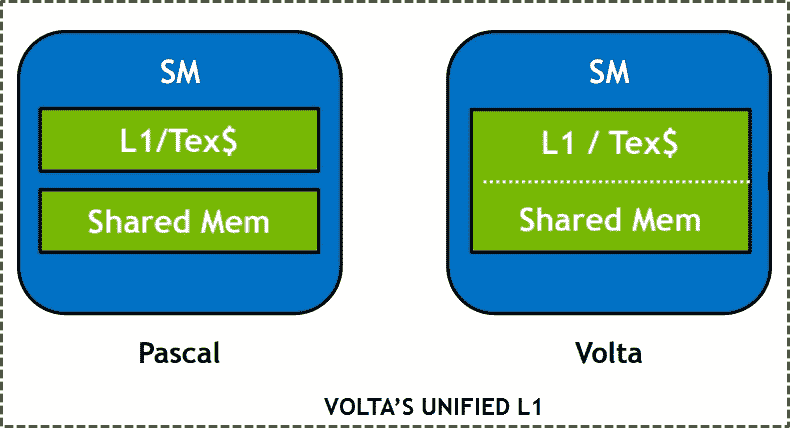

上图显示了与 Pascal 相比共享内存和 L1 缓存的统一。重要的是要理解，CUDA 编程模型从一开始就几乎保持不变。即使内存的容量、带宽或延迟随着每个架构而变化，相同的 CUDA 代码也将在所有架构上运行。然而，肯定会改变的是这些架构变化对性能的影响。例如，由于 L1 和共享内存的统一，在 Volta 之前使用共享内存的应用在 Volta 中可能看不到如此高的性能提升。

# 为什么 GPU 有缓存？

在这个演变过程中，同样重要的是要明白，CPU 和 GPU 缓存是非常不同的，服务于不同的目的。作为 CUDA 架构的一部分，我们通常为每个 SM 启动数百到数千个线程。数万个线程共享 L2 缓存。因此，L1 和 L2 的人均收入很低。例如，在 2048 个线程/80sm 的情况下，每个线程在 L1 只能获得 64 个字节，在 L2 只能获得 38 个字节。GPU 中的缓存缓存由许多线程访问的公共数据。这有时被称为空间局部性。一个典型的例子是当线程的访问不一致和不规则时。由于中央处理器高速缓存主要用于时间局部性，因此图形处理器高速缓存有助于减少寄存器溢出和本地内存的影响。

# 摘要

本章首先介绍了不同类型的 GPU 内存。我们详细讨论了全局、纹理、共享内存以及寄存器。我们还研究了图形处理器的内存进化提供了哪些新功能，例如统一内存，这有助于提高程序员的工作效率。我们看到了这些特性是如何在最新的 GPU 架构中实现的，例如 Pascal 和 Volta。

在下一章中，我们将深入探讨 CUDA 线程编程的细节，以及如何以最佳方式启动不同的线程配置，以获得 GPU 硬件的最佳性能。我们还将引入新的 CUDA 工具包功能，例如用于灵活线程编程和 GPU 多精度编程的协作组。**