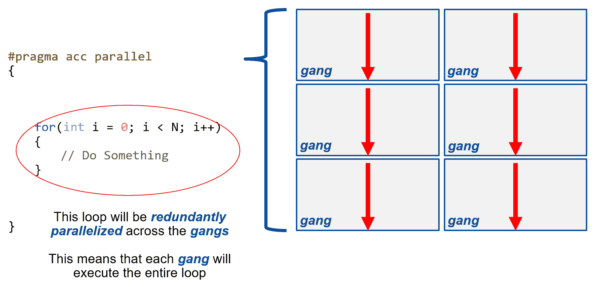
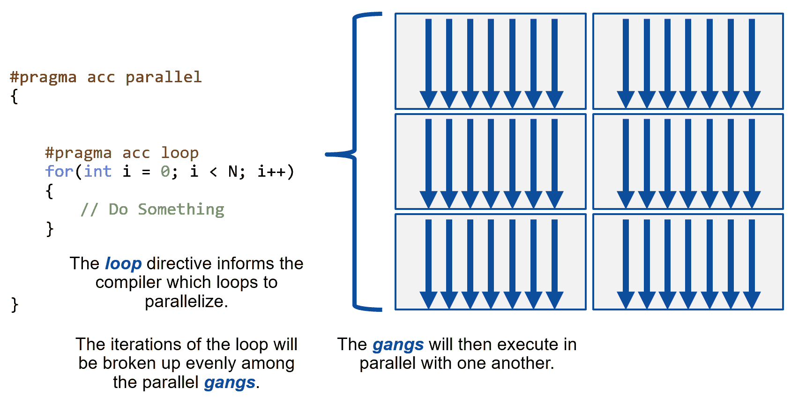
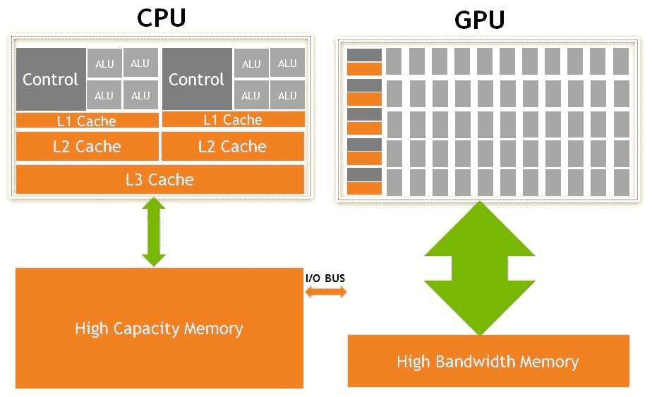
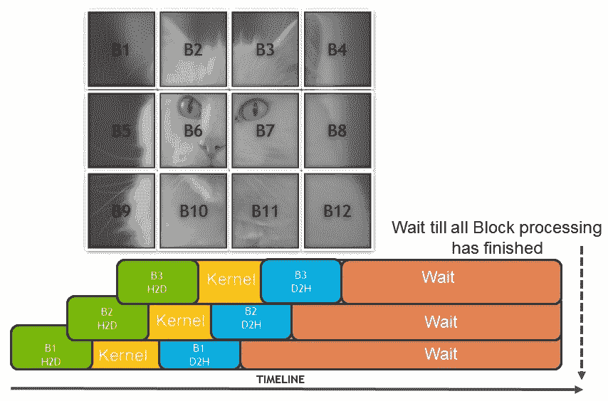
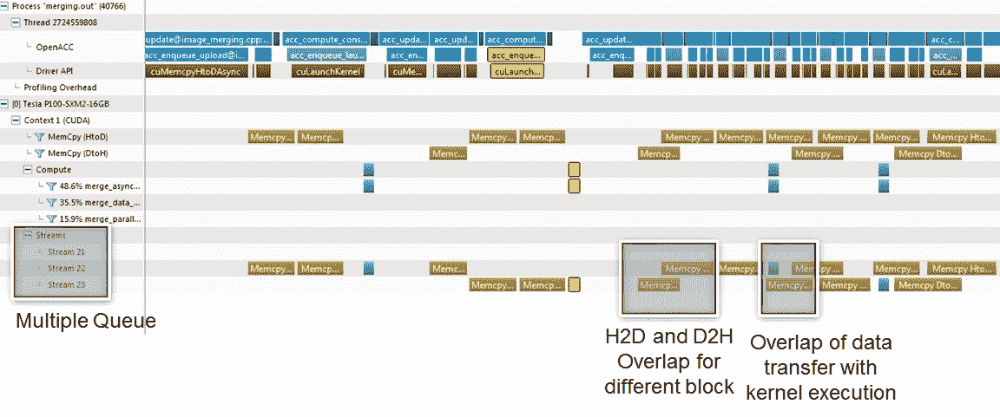
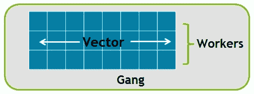

# 使用 OpenACC 进行图形处理器编程

每个处理器架构都提供了不同的方法来编写在处理器上运行的代码。CUDA 也不例外；它还提供了不同的编码方法。最近几年变得非常流行的一种方法是使用 OpenACC，它基本上是基于指令的编程。

OpenACC 基本上是一个将异构计算暴露为一流公民的标准。该标准从根本上规定有两种处理器，即主机和设备/加速器，这与 CUDA 编程模型所陈述的概念非常相似。

对于想要获得最佳性能的程序员来说，使用 C、C++、Fortran 和 Python 等语言进行 CUDA 编程是表达并行性的首选方式。编程语言要求程序员从头开始重新创建顺序程序，同时保持其关键操作的串行和并行版本。程序员可以对他们程序的一切进行微观管理，并经常使用特定于设备的特性来获得最佳性能，而这些特性对于更高级别的方法来说过于特定。用并行编程语言创建的并行程序往往只能在极少数平台上运行。

编译器指令融合了编程语言的灵活性和库的易用性。程序员用高级指令来注释代码，编译器可以使用这些指令来并行化代码，或者可以安全地忽略这些指令。这意味着，带有编译器指令的代码可以针对许多不同的并行平台进行编译，并且不需要维护代码的单独串行和并行版本。此外，有时需要快速测试和原型化应用，以便在图形处理器上运行。一个这样的例子是转换代码库，如天气代码，它有数百万行代码，运行在图形处理器上；使用流行的语言来完成这项工作需要花费大量的精力。在这样的场景下，OpenACC 成为一个合乎逻辑的选择。在 OpenACC 中，开发人员以指令的形式向编译器提供提示。编译器接受这些提示并生成特定于体系结构的加速器代码。

OpenACC 标准还为代码开发人员提供了供应商中立性。带有 OpenACC 指令的单一源代码可以针对不同的设备进行重新编译。例如，PGI 编译器目前支持 OpenACC 后端，如英特尔 CPU 多核、NVIDIA GPU、英特尔至强融核以及 **F** **现场可编程门阵列** ( **FPGA** ) / **专用集成电路** ( **ASIC** )架构。对于想要编写供应商中立代码的开发人员来说，这是一个非常有吸引力的提议。**高处理计算** ( **HPC** )中的关键应用，如**维也纳从头模拟包** ( **VASP** )(分子动力学/量子化学)**天气研究和预报** ( **WRF** )和 ANSYS Fluent **计算流体动力学** ( **CFD** )利用 OpenACC 编程模型瞄准 NVIDIA GPU

总结 OpenACC 的关键要点:

*   OpenACC 标准是在异构计算被认为是新的编程模型时发展起来的。
*   OpenACC 提供跨各种加速器的性能可移植性。
*   OpenACC 不是 CUDA 编程语言的替代品。当目标处理器被选为 NVIDIA 时，OpenACC 编译器会在幕后生成 CUDA 代码。

近年来，OpenMP 标准也开始融入异构计算 API。但是到目前为止，还没有一个编译器支持不同的处理器架构，所以我们在本书中选择了坚持使用 OpenACC。

我们将在本章中讨论以下主题:

*   OpenACC 准则
*   OpenACC 中的异步编程
*   附加的重要指令和条款

# 技术要求

本章需要一台带有现代英伟达图形处理器(帕斯卡架构)的 Linux/Windows 电脑。

正如在介绍中提到的，OpenACC 是一个标准，这个标准由不同的编译器实现，比如 GCC、PGI 和 CRAY 编译器。本章我们将使用的编译器是 PGI。PGI 编译器在 Fortran 社区中真的很受欢迎，在实现 OpenACC 最新规范方面一直走在曲线的前面，并且提供了社区版，可以从 PGI 网站免费下载。好的一面是，从根本上来说，社区版和付费版 PGI 编译器之间的功能没有变化。本章要求您下载 PGI 社区版。

本章代码也可在 GitHub 上获得，网址为:[https://github.com/PacktPublishing/Learn-CUDA-Programming](https://github.com/PacktPublishing/Learn-CUDA-Programming)。

示例代码示例是用 PGI 社区版的 19.4 版本开发和测试的。但是建议你使用最新的 PGI 版本。

# 基于 OpenACC 的图形处理器图像融合

为了理解 OpenACC 的概念，我们选择了一种简单的计算机视觉算法来合并两幅图像。在这段代码中，我们试图合并两个图像，如下所示:


上图展示了一个合并两幅图像的计算机视觉算法。

我们将在本章的后面讨论更多的代码结构。首先，根据以下步骤配置环境:

1.  准备好你的 GPU 应用。作为一个例子，我们将使用一个核心算法来合并两幅图像。这个代码可以在`09_openacc/`找到。
2.  使用`pgc++`编译器编译您的应用:

```cpp
$ pgc++ -c -acc -ta=tesla:pinned scrImagePgmPpmPackage.cpp
$ pgc++ -c -acc -ta=tesla:pinned -Minfo=accel image_merging.cpp
$ pgc++ -o merging.out -acc -ta=tesla:pinned -Minfo=accel scrImagePgmPpmPackage.o image_merging.o
$ ./merging.out
```

上述命令将创建一个名为`blurring.out`的二进制文件。正如你可能已经观察到的，我们正在使用`pgc++`编译器来编译我们的代码。此外，我们向代码传递一些参数。让我们更详细地了解它们:

*   `-acc`:这个标志告诉编译器解析代码中提供的 OpenACC 指令。
*   `-ta`:代表应该为其生成设备代码的目标架构。注意`-ta=tesla`表示我们瞄准的是一个 NVIDIA GPU。其他目标的一些例子包括以多核为目标的`-ta=multi-core`、以 AMD GPUs 为目标的`-ta=radeaon`以及其他一些目标。此外，我们可以添加特定于设备的标志；例如，我们在分配所有 CPU 内存为固定(不可分页)的 GPU 中添加了固定标志。
*   `-Minfo`:这个选项告诉编译器为我们提供更多关于编译器为使我们的代码并行而采取的步骤的信息。通过说`-Minfo-accel`，我们是要求编译器只给我们提供更多与加速器区域相关的信息。我们可以将标志更改为`-Minfo=all`，以提供非加速器区域的详细信息。以下输出显示了向我们的代码添加`Minfo`标志的部分输出:

```cpp
.... < More compiler output above>
merge_parallel_pragma(unsigned char *, unsigned char *, unsigned char *, long, long):
    30, Generating copyin(in1[:w*h])
    Generating copyout(out[:w*h])
    Generating copyin(in2[:w*h])
    Accelerator kernel generated
    Generating Tesla code
    30, #pragma acc loop gang /* blockIdx.x */
    32, #pragma acc loop vector(128) /* threadIdx.x */
    32, Loop is parallelizable
... < More compile output below >
```

为了理解这个编译输出，我们需要理解 OpenACC pragmas，这将在下一节中进行。稍后我们将重新讨论这个编译输出。使用`pgc++ --help` *可以找到其他可用标志的详细信息。*

运行二进制文件后的示例输出如下:

```cpp
$ ./merging.out
Reading image width height and width [1536][2048]
Time taken for serial merge: 0.0028 seconds
Time taken for OpenACC merge(data+kernel): 0.0010 seconds
Time taken for OpenACC merge(kernel only) with Blocking: 0.0002 seconds
 Time taken for OpenACC merge(data _kernel) with blocking: 0.0014 seconds
Time taken for OpenACC merge (data+kernel)with Pipeline Async: 0.0008 seconds
```

前面的输出显示我们正在读取大小为 1536*2048 的图像。代码有一个串行实现和三个使用 OpenACC pragmas 的并行实现。前面的输出显示了每个实现的时序。流水线方法的最后一个实现显示了最佳时机:`0.0008 seconds`。我们将采取一种渐进的方法，并在接下来的章节中详细介绍每个实现。

这个算法的串行实现非常简单，如下面的代码片段所示:

```cpp
void merge_serial(unsigned char *in1, unsigned char*in2, unsigned char *out, long w, long h)
{
    long x, y;
     for(y = 0; y < h; y++) {
         for(x = 0; x < w; x++) {
             out[y * w + x] = (in1[y * w + x]+in2[y * w + x])/2;
         }
     }
}
```

代码没有什么花哨的地方；基本上是取两个输入图像数据(`in1`和`in2`)，进行平均运算合并两个输入，最后存储输出。就并行性而言，对我们来说，最关键的是循环是令人尴尬的并行，并且适用于像图形处理器这样的架构。如前面的代码输出所示，串行实现花费了`0.0028`秒。请注意，根据运行代码的系统，计时可能会略有不同。

在下一节中，我们将向您介绍将示例代码转换为在 GPU 上运行所必需的 OpenACC 指令。

# OpenACC 准则

在本节中，我们将尝试理解 OpenACC pragmas 的语法，并为合并操作实现基本的并行和数据指令。OpenACC pragma 的基本语法如下:

```cpp
#pragma acc <directive> <clauses> 
!$acc parallel [clause [[,] clause]…] 
```

前面的命令解释如下:

*   `#pragma`在 C/C++中是所谓的“编译器提示”这些与程序员注释非常相似；然而，编译器实际上会读取我们的 pragmas。如果编译器不理解 pragma，它可以忽略它，而不是抛出语法错误。
*   `acc`是我们 pragma 的补充。它指定这是一个 OpenACC pragma。任何非 OpenACC 编译器都会忽略这个 pragma。
*   `directive`是 OpenACC 中的一个命令，它会告诉编译器执行一些操作。目前，我们将只使用允许编译器并行化代码的指令。
*   `clauses`是对我们指令的补充/修改。这些包括但不限于优化。

本节我们将介绍三个指令:*并行*、*循环、*和*数据*。我们将展示它们中的每一个，最后将它们应用到我们的合并算法中。

# 并行和循环指令

并行指令是最直接的指令。它将标记代码的一个区域进行并行化(这通常只涉及并行化单个`for`循环)，如以下代码所示:

```cpp
#pragma acc parallel loop 
for (int i = 0; i < N; i++ ) {  
    //loop code 
}
```

我们也可以定义一个平行区域。平行区域可能有多个循环(尽管通常不建议这样做！).平行区域是包含在最外侧大括号内的所有内容，如下面的代码片段所示:

```cpp
#pragma acc parallel
{
    #pragma acc loop
    for (int i = 0; i < N; i++ )
    {
        < loop code >
    }
}
```

包含循环极其重要；否则，您将无法正确地并行化循环。并行指令告诉编译器冗余地并行化代码，如下所示:



循环指令明确告诉编译器，我们希望循环并行化，如下图所示:



循环指令有两个主要用途:

*   要标记单个循环进行并行化
*   为了允许我们明确定义循环的优化/变更

我们将在本章后面介绍循环优化，以及 gang 和 vector 现在，我们将重点关注并行化方面。为了使循环指令正常工作，它必须包含在并行指令中:

```cpp
#pragma acc parallel loop
for (int i = 0; i < N; i++ )
{
    //loop code 
}
```

使用并行指令时，必须包含循环指令，代码才能正常运行。我们也可以使用循环指令来并行化多维循环嵌套。在下面的代码片段中，我们看到了一个嵌套循环，并为第二个循环明确提到了 loop 子句:

```cpp
#pragma acc parallel loop
for (int i = 0; i < N; i++ )
{
    #pragma acc loop
    for( int j = 0; j < M; j++ )
    {
        //loop code
    }
}
```

请注意，在前面的代码片段中，我们没有将 parallel 子句再次放入内部循环，因为我们已经在从外部循环开始的作用域中提到过它。

# 数据指令

OpenACC 并行模型声明我们有一个主机，它运行我们的顺序代码(主要是中央处理器)。然后我们有了我们的设备，这是某种并行硬件。主机和设备通常(虽然不总是)有独立的存储器，程序员可以使用 OpenACC 在两个存储器之间移动数据。

正如在第一章中所讨论的，图形处理器和中央处理器的架构有着根本的不同。图形处理器是一种基于吞吐量的架构，具有大量的计算单元和高速内存带宽。另一方面，中央处理器是一种减少延迟的架构，具有大的缓存层次结构，并且还提供了大的主内存。任何需要操作的数据都需要先拷贝到 GPU 内存中。(请注意，即使在统一内存的情况下，数据也会由驱动程序以页面的形式在幕后复制。)

如下图所示，两种架构(中央处理器和图形处理器)之间的数据传输通过输入/输出总线进行:



当在 OpenACC 中使用 GPU 作为目标架构时，我们的目标是只使用它来卸载我们的并行代码，顺序代码将继续在我们的 CPU 上运行。OpenACC 标准允许程序员通过使用 OpenACC **数据指令和数据条款**来明确定义数据管理。数据子句允许程序员指定主机和设备(或者，在我们的例子中，中央处理器和图形处理器)之间的数据传输。

**I** **mplicit 数据管理**:我们可以将数据的传输留给编译器，如下例所示:

```cpp
int *A = (int*) malloc(N * sizeof(int));

#pragma acc parallel loop
for( int i = 0; i < N; i++ )
{
    A[i] = 0;
}
```

在前面的代码中，编译器将理解`A`向量需要从 GPU 中复制，并为开发人员生成一个隐式转移。

**显式数据管理**:利用显式数据传输来获得对传输的更多控制是一个很好的做法，如下面的代码所示，其中我们使用了 copy data 子句:

```cpp
int *a = (int*) malloc(N * sizeof(int));
#pragma acc parallel loop copy(a[0:N])
for( int i = 0; i < N; i++ )
{
     a[i] = 0;
}
```

在前面的代码片段中，我们使用了 copy data 子句。下图解释了运行时到达复制数据指令时执行的步骤:


我们将在合并代码的帮助下深入这些步骤的细节，我们将在合并代码中应用数据子句。

其他可用数据条款如下:

| **数据条款** | **描述** | **按键用法** |
| `copy(list)` | 

*   Allocate memory on the device

*   When entering this area, copy data from the host to the exit area of the device

*   , copy data to the host

 | 这是修改后从函数返回的输入数据结构的默认值 |
| `copyin(list)` | 

*   Allocate memory on the device

*   When entering this area, copy the data from the host to the device

. | 刚刚输入子程序的向量 |
| `copyout(list)` | 

*   Allocate memory on the device

*   Copy data to the host

when exiting the area. | 不会覆盖输入数据结构的结果 |
| `create(list)` | 

*   Memory is only allocated on the device

*   without copying

 | 临时数组 |

为了最大化性能，程序员应该避免所有不必要的数据传输，因此显式内存管理优于隐式数据管理。

**数组整形:**数组整形是你指定数组大小的方式。如果不指定形状，编译器将尝试采用该大小。这在 Fortran 中运行良好，因为 Fortran 跟踪数组的大小；然而，它很可能在 C/C++中不起作用。数组整形也是从数组中复制一部分数据的唯一方法(例如，如果您只需要复制数组的一半，这可以提高性能，减少不必要的副本)，如以下代码片段所示:

```cpp
#pragma acc parallel loop copy(A[1:N-2])
```

这将复制除第一个和最后一个元素之外的所有`A`元素。

# 应用并行、循环和数据指令来合并图像代码

现在让我们尝试将并行、循环和数据指令应用于合并顺序代码:

```cpp
void merge_parallel_pragma(unsigned char *in1, unsigned char*in2,unsigned char *out, long w, long h)
{
    long x, y;
    #pragma acc parallel loop gang copyin(in1[:h*w],
                                          in2[:h*w]) 
                                          copyout(out[:h*w])
     for(y = 0; y < h; y++) {
        #pragma acc loop vector
        for(x = 0; x < w; x++) {
            out[y * w + x] = (in1[y * w + x]+in2[y * w + x])/2;
        }
    }
}
```

我们使用平行循环指令使两个循环(高度:`y`和宽度:`x`)平行。此外，我们还明确添加了数据子句来复制数据。请注意，由于`in1`和`in2`向量仅是输入，因此它们是使用`copyin()`数据子句复制的。`out`向量是输出，使用`copyout()`数据子句复制。让我们试着理解这个函数的编译器输出:

```cpp
merge_parallel_pragma(unsigned char *, unsigned char *, unsigned char *, long, long):
    30, Generating copyin(in1[:w*h])
        Generating copyout(out[:w*h])
        Generating copyin(in2[:w*h])
        Accelerator kernel generated
        Generating Tesla code
        30, #pragma acc loop gang /* blockIdx.x */
        32, #pragma acc loop vector(128) /* threadIdx.x */
32, Loop is parallelizable
```

前面的编译器输出显示，对于`merge_parallel_pragma`函数，编译器已经生成了以下动作:

*   在第 30 行，为`in1`和`in2 `变量生成了`copyin`。内核启动前复制到 GPU 的数组大小为`[0:w*h]`。
*   在第 30 行，为`out`变量生成了`copyout`。GPU 内核启动后将复制的阵列大小将是`[0:w*h]`。
*   在第 30 行和第 32 行，生成了特斯拉内核代码:
    *   在第 30 行，外部循环用组级并行化。
    *   在第 32 行，用向量级并行化了内部循环

当代码在 V100 上运行时，整个内核所花费的时间是`0.0010s`。这基本上是串行代码的两倍。这听起来可能并不令人印象深刻。原因是大部分时间花在数据传输上，而不是内核计算上。为了证实这一点，让我们利用`nvprof`:

```cpp
$ nvprof ./merging.out
==26601== DoneProfiling application: ./merging.out
==26601== Profiling result:
Type Time(%) Time Calls Avg Min Max Name
GPU activities: 67.36% 609.41us 2 304.71us 286.34us 323.08us [CUDA memcpy HtoD]
27.63% 250.02us 1 250.02us 250.02us 250.02us [CUDA memcpy DtoH]
5.01% 45.344us 1 45.344us 45.344us 45.344us merge_parallel_pragma_30_gpu(unsigned char*, unsigned char*, unsigned char*, long, long)
...
```

正如您在前面的分析输出中所观察到的，94%的时间用于数据传输，而只有 5%的时间(45 微秒)用于内核执行。您可能会有这样的疑问:我如何知道这是哪个内核？如果你仔细观察 GPU 内核的名称`merge_parallel_pragma_30_gpu`，PGI 编译器在第 30 行的`merge_parallel_pragma`函数中生成了一个 CUDA 内核，这就是我们如何将它与在该行号处放入函数的 pragmas 联系起来。

所以我们知道问题，但是解决方案呢？我们将用来隐藏这种延迟的优化技术是阻塞。在接下来的章节中，我们将更多地介绍阻塞技术，并使用异步子句来覆盖这个传输。

# OpenACC 中的异步编程

为了在合并并行代码时获得更好的性能，我们将使用一个叫做阻塞的概念。阻塞基本上意味着，我们可以创建可以并行传输和操作的数组块，而不是一次性传输整个输入和输出数组。下图演示了在内核执行时创建块和重叠数据传输:

 

上图显示了不同的块被传输，并且这些块的内核执行可以独立于每个块。为了实现这一点，我们需要异步激发和执行数据传输命令和内核调用。为了实现阻塞，我们将在本节中引入更多指令/子句:结构化/非结构化数据指令和`async`子句。我们将展示它们中的每一个，最后将它们应用到我们的基本 OpenACC 合并并行代码中。

# 结构化数据指令

OpenACC 数据指令允许程序员显式管理设备(在我们的例子中是图形处理器)上的数据。下面的代码片段显示了标记结构化数据区域的示例:

```cpp
< Initialize data on host (CPU) >
#pragma acc data < data clauses >
{
    //< Code >
}
```

设备内存分配发生在区域的开头，设备内存释放发生在区域的结尾。此外，从主机到设备(中央处理器到图形处理器)的任何数据移动都发生在区域的开头，从设备到主机(图形处理器到中央处理器)的任何数据移动都发生在区域的结尾。内存分配/解除分配和数据移动由程序员包含的子句定义。

**包含多个计算区域:**单个数据区域可以包含任意数量的并行/内核区域，如下例所示:

```cpp
#pragma acc data copyin(A[0:N]) create(C[0:N])
{
    #pragma acc parallel loop
    for( int i = 0; i < N; i++ )
    {
        C[i] = A[i] + 10;
    }
    #pragma acc parallel loop
    for( int i = 0; i < N; i++ )
    {
        C[i] = C[i] / 10;
    }
}
```

# 非结构化数据指令

有两个非结构化数据指令:

*   **输入数据**:处理设备内存分配，从主机复制到设备。您可以在输入数据时使用的两个子句是:
    *   `create`:这只会执行设备内存分配。
    *   `copyin`:这将执行分配以及设备的内存拷贝。
*   **退出数据**:处理设备内存释放，并从设备复制到主机。您可以使用退出数据的两个子句是:
    *   `delete`:这将只执行设备内存释放。
    *   `copyout`:这将首先进行从设备到主机的内存复制，然后进行设备内存释放。

非结构化数据指令不会标记数据区域，因为在代码中可以有多个输入数据和输出数据指令。最好把它们纯粹看作是内存分配和释放。使用非结构化数据指令的最大优势是能够跨多个功能进行分支。您可以在一个函数中分配数据，在另一个函数中取消分配。我们可以看一个简单的例子:

```cpp
#define N 1024
int* allocate(int size)
{
    int *ptr = (int*) malloc(size * sizeof(int));
    #pragma acc enter data create(ptr[0:size])
    return ptr;
} 
void deallocate(int *ptr)
{
    #pragma acc exit data delete(ptr)
    free(ptr);
}
int main()
{
    int *ptr = allocate(N);
    #pragma acc parallel loop
    for( int i = 0; i < N; i++ )
    {
        ptr[i] = 0;
    }
    deallocate(ptr);
}
```

前面的代码片段显示分配发生在单独的`allocate()`函数中，删除发生在`deallocate()`中。你可以在 C++中将同样的概念链接到`enter data create`作为构造函数的一部分和`exit data delete`作为析构函数的一部分。

# OpenACC 中的异步编程

默认情况下，所有 OpenACC 调用本质上都是同步的。这意味着，在每次调用数据传输或每次内核调用 GPU 之后，都会隐式添加一个同步。中央处理器将等到 OpenACC 调用完成，然后开始执行下一条指令。为了使调用异步，我们可以使用`async`子句以及数据和并行指令，如以下代码所示:

```cpp
#pragma acc data copyin(a[:N]) async 
// performing copyin asynchronously 
#pragma acc parallel loop async 
//performing parallel loop asynchronously. 
```

使用`async`的主要好处可以总结如下:

*   如果我们想同时执行主机和设备代码，我们可以用`async`启动我们的设备代码，在执行的同时，我们可以回到主机继续不相关的(非设备相关的)代码。
*   我们可以*将*多个设备内核启动进行排队，以便它们背靠背执行，这在某些情况下可以减少与启动设备内核相关的开销。
*   我们可以在主机和设备之间进行数据移动的同时进行设备计算**。**这是我们将要应用到代码中的优化，也是`async`最通用的用例。

在引擎盖下，每当我们使用`async`子句时，我们都会在队列中添加一些*工作*。提交到不同队列的工作可以异步执行*，同一队列中的工作将依次执行*(一个接一个)。当我们使用`async`时，我们能够指定一个队列号。如果没有指定队列号，将自动使用默认值。**

 **# 应用非结构化数据和异步指令来合并图像代码

现在让我们尝试将数据指令与`async`子句一起应用于合并并行代码:

```cpp
void merge_async_pipelined(unsigned char *in1, unsigned char*in2,unsigned char *out, long w, long h)
{
    long x, y;
    #pragma acc enter data create(in1[:w*h], in2[:h*w], out[:w*h])
    const long numBlocks = 8;
    const long rowsPerBlock = (h+(numBlocks-1))/numBlocks;
    for(long block = 0; block < numBlocks; block++) {
        long lower = block*rowsPerBlock; // Compute Lower
        long upper = MIN(h, lower+rowsPerBlock); // Compute Upper
        #pragma acc update device(in1[lower*w:(upper-lower)*w],
                                  in2[lower*w:(upper-lower)*w]) 
                                  async(block%2)
        #pragma acc parallel loop present(in1,in2, out) async(block%2)
        for(y = lower; y < upper; y++) {
            #pragma acc loop
            for(x = 0; x < w; x++) {
                out[y * w + x] = (in1[y * w + x]+in2[y * w + x])/2;
            }
        }
        #pragma acc update self(out[lower*w:(upper-lower)*w]) 
                                async(block%2)
    }
#pragma acc wait
#pragma acc exit data delete(in1, in2, out)
}
```

我们使用了数据指令和`async`子句来实现阻塞概念。让我们分解一下整体实现，这样会更容易理解:

1.  **进入数据区**:`enter data create`子句为 GPU 中的`in1`和`in2`变量以及`out`分配内存。
2.  **创建块**:我们决定将图像分割成八个块。这些块被分成若干行。由于这个原因，块的外部`for`循环被添加。

3.  **将数据从主机异步传输到设备** : `acc update device`基本上是将数据从主机异步复制到设备，因为我们在其中添加了`async`子句。
4.  **异步启动并行循环****:并行子句中增加`async`子句，异步启动 GPU 内核。**
***   **将数据从设备异步传输到主机** : `acc update self`基本上是将数据从设备异步复制到主机，因为我们在其中添加了`async`子句。*   **等待** : `acc wait`将确保在所有队列中前进之前，中央处理器一直等到所有 OpenACC 启动完成。*   **退出数据区** : `acc exit data delete`将删除`enter data`子句中分配的`in1`和`in2`向量和`out`。**

 **让我们试着理解`merge_async_pipelined `函数的编译器输出:

```cpp
merge_async_pipelined(unsigned char *, unsigned char *, 
                      unsigned char *, long, long):
     67, Generating enter data create(out[:h*w],in2[:h*w],in1[:h*w])
     74, Generating update device(in1[w*lower:w*(upper-lower)],
                                  in2[w*lower:w*(upper-lower)])
         Generating present(in1[:],out[:],in2[:])
         Accelerator kernel generated
         Generating Tesla code
         74, #pragma acc loop gang /* blockIdx.x */
         76, #pragma acc loop vector(128) /* threadIdx.x */
     76, Loop is parallelizable
     81, Generating update self(out[w*lower:w*(upper-lower)])
     84, Generating exit data delete(out[:1],in2[:1],in1[:1])
```

前面的编译器输出显示，对于`merge_async_pipelined`函数，编译器已经生成了以下动作:

*   在第`67`行，已经为`in1`、`in2`和`out`变量生成了`data create`区域。
*   在第`74`行，`update device`为`in1`和`in2`调用，数据到设备的传输被限制为阻塞上下界:`in1[w*lower:w*(upper-lower)],in2[w*lower:w*(upper-lower)]`。
*   在第`74`和`76`行，特斯拉内核代码已经生成。
*   在第`81`行，`out`变量调用`update self`，来自设备的数据传输被限制为阻塞上限和下限:`out[w*lower:w*(upper-lower)]`。
*   在第`84`行，数据区结束，调用`delete`释放分配在 GPU 上的内存。

当代码在 V100 上运行时，整个内核花费的时间是 0.0008 秒。为了更详细地理解这一点，让我们回到剖析器。这一次，我们将通过使用英伟达视觉分析器来可视化输出:



Output by using NVIDIA Visual Profiler

上图截图显示的是****视觉轮廓仪使用`async`并阻挡后的输出。探查器窗口的主要消息如下:****

 ****1.  我们看到三个流被创建和使用。这是因为我们的代码使用了`async(block%2)`，这意味着我们已经请求了最大`2`个队列。第三个队列是默认队列，在管道执行期间不使用。
2.  我们看到主机到设备和设备到主机的传输也重叠，因为 GPU 有两个**直接内存访问** ( **DMA** )引擎，因此相反方向的数据传输可以重叠。
3.  我们还看到我们的内核执行与数据传输重叠。

到目前为止，我们已经看到了一些关键指令，它们帮助我们在图形处理器上运行图像合并的顺序代码。在下一节中，我们将向您介绍更多的子句，这些子句将帮助您进一步优化您的 OpenACC 代码。

# 附加的重要指令和条款

在本节中，我们将介绍其他重要的、广泛使用的指令，这些指令可以应用到我们的合并算法中。

# 帮派/病媒/工人

Gang/worker/vector 定义了我们可以使用 OpenACC 实现的各种并行级别。这种并行性在并行化多维循环嵌套时最有用。OpenACC 允许我们定义一个通用的帮派/工作者/向量模型，该模型将适用于各种硬件，但我们将更加关注 GPU 特定的实现。下图显示了一个 OpenACC 并行编程模型:



上图代表了一个帮派。当并行化我们的`for`循环时，循环迭代将在多个组中被平均分解。每个组将包含多个线程。这些线程被组织成块。工作者是一排线程。

在上图中，有三个工人，这意味着有三行线程。向量是指每行有多长。所以在上图中，向量是 8，因为每行有 8 个线程长。默认情况下，为图形处理器编程时，会自动应用组和向量并行。

由于 OpenACC 是开放标准，针对多个硬件；它提供了通用构造。但是这个结构如何映射到特定的目标设备呢？答案很简单；它依赖于架构和编译器，因此提供了性能可移植性。如果我们要映射当前的 PGI 编译器如何将这个概念映射到 CUDA (NVIDIA GPU)上，将如下所示:

*   OpenACC 组映射到一个 CUDA 块。
*   工人本质上映射到一个 CUDA 翘曲。
*   OpenACC 矢量映射到`threadIdx.x`和(X 维度)。
*   OpenACC 工作人员映射到`threadIdx.y` (Y 维度)。

再次强调这一点很重要，PGI 编译器就是这样映射 OpenACC 构造的。其他编译器可能会对此进行不同的映射。特别是对于 NVIDIA GPUs，帮派工作向量将定义我们 GPU 线程的组织。通过添加以下子句，开发人员可以告诉编译器在给定的循环中使用哪些并行级别:

*   `gang`:标记成组并行的循环。
*   `worker`:标记工作机并行度的循环。
*   `vector`:标记向量平行的循环。

下面的代码片段有三个循环，每个循环的并行度都被明确定义了:外部循环为`gang`，中间循环为`worker`循环，最里面的循环为`vector`循环:

```cpp
#pragma acc parallel loop gang
for( i = 0; i < size; i++ )
    #pragma acc loop worker
    for( j = 0; j < size; j++ )
        #pragma acc loop vector
        for( k = 0; k < size; k++ )
          c[i][j] += a[i][k] * b[k][j];
```

**调整帮派、工人和向量:**编译器会为你选择多个帮派和工人以及一个向量长度，但你可以用以下子句进行更改:

*   `num_gangs(N)`:生成平行区域的`N`帮派
*   `num_workers(M)`:为平行区域生成`M`工人。
*   `vector_length(Q)`:对平行区域使用`Q`的矢量长度

例如，在下面的代码片段中，我们将组的数量设置为`2`，工人的数量设置为`2`，向量长度设置为`32`:

```cpp
#pragma acc parallel num_gangs(2) \
  num_workers(2) vector_length(32)
{
  #pragma acc loop gang worker
  for(int x = 0; x < 4; x++){
    #pragma acc loop vector
    for(int y = 0; y < 32; y++){
      array[x][y]++;
    }
  }
}
```

在代码中设置帮派的数量很少是一个好主意——让编译器来决定。大多数情况下，您可以通过仅调整向量长度来有效地调整循环嵌套。此外，很少对图形处理器使用工作循环。

# 托管内存

OpenACC 提供了一个选项，允许编译器处理内存管理。我们将能够通过自己管理内存来实现更好的性能；然而，允许编译器使用托管内存非常简单。我们不需要对代码进行任何更改来使托管内存工作。

为了利用托管内存，我们可以这样将托管标志传递给`pgc++`编译器:

```cpp
$ pgc++ -c -acc -ta=tesla:managed scrImagePgmPpmPackage.cpp
$ pgc++ -c -acc -ta=tesla:managed -Minfo=accel image_merging.cpp
$ pgc++ -o merging.out -acc -ta=tesla:managed -Minfo=accel scrImagePgmPpmPackage.o image_merging.o
$ ./blurring.out
```

添加托管子句后，编译器基本会忽略数据子句，托管内存用于在 CPU 和 GPU 之间传输数据。请注意，托管内存仅用于堆数据，而不是堆栈/静态数据。我们在前一章中介绍的统一内存概念将保持不变。

# 内核指令

内核指令允许程序员退后一步，只依赖编译器。使用内核指令的一些示例代码如下:

```cpp
#pragma acc kernels 
for (int i = 0; i < N; i++ ) 
{ 
    //< loop code > 
}
```

就像在并行指令示例中一样，我们正在并行化单个循环。回想一下，当使用并行指令时，它必须总是与循环指令配对；否则，代码将被不正确地并行化。内核指令不遵循相同的规则；在某些编译器中，添加循环指令可能会限制编译器优化代码的能力。

内核指令与并行指令完全相反。这意味着编译器做出了很多假设，甚至可能会推翻程序员并行化代码的决定。此外，默认情况下，编译器会尝试优化循环。编译器通常非常擅长优化循环，有时可能能够以程序员无法描述的方式优化循环。然而，通常程序员能够通过优化循环本身来获得更好的性能。

如果遇到编译器拒绝并行化循环的情况，您可能会忽略编译器的决定。(但是，请记住，通过覆盖编译器的决定，您要为并行化代码时出现的任何错误负责！)在这段代码中，我们使用独立子句向编译器保证我们认为循环是可并行的:

```cpp
#pragma acc kernels loop independent
for (int i = 0; i < N; i++ )
{
    //< loop code >
}
```

内核指令最显著的优点之一是它能够一次并行处理多个循环。例如，在下面的代码段中，我们能够通过利用一个内核区域同时有效地并行化两个循环:

```cpp
#pragma acc kernels
{
    for (int i = 0; i < N; i++ )
    {
        //< loop code >
    } 
... some other sequential code
    for (int j = 0; j < M; j++ )
    {
        //< loop code >
    }
}
```

# 折叠条款

**折叠子句**允许我们将多维循环嵌套转换为一维循环。这个过程有助于增加循环的总长度(这通常会增加并行性)，并且通常有助于内存局部性。让我们看看语法:

```cpp
#pragma acc parallel loop collapse( 3 )
for(int i = 0; i < N; i++)
{
    for(int j = 0; j < M; j++)
    {
        for(int k = 0; k < Q; k++)
        {
            < loop code >
        }
    }
}
```

代码将把三维循环嵌套组合成一个一维循环。

# 平铺条款

**瓦片条款**允许我们将多维循环分解成*瓦片*，或者*区块*。这对于增加某些代码中的内存局部性通常很有用。让我们看看语法:

```cpp
#pragma acc parallel loop tile( 32, 32 )
for(int i = 0; i < N; i++)
{
    for(int j = 0; j < M; j++)
    {
        < loop code >
    }
}
```

前面的代码将把我们的循环迭代分解成 32×32 块，然后并行执行这些块。

# CUDA 互操作性

正如本章前面提到的，OpenACC 不是 CUDA 语言的替代品；事实上，开发人员可以开始利用 OpenACC 将热点端口连接到一个 GPU。他们可以开始只为最关键的功能集成 CUDA 内核。有几种方法可以将 OpenACC/CUDA 转换成可互操作的代码。我们将在本节中研究其中的一些。

# DevicePtr 条款

该子句可用于映射使用`cudaMalloc`分配的 CUDA 设备指针，并将其传递给 OpenACC。下面的代码片段显示了`deviceptr`子句的用法:

```cpp
double *cuda_allocate(int size) {
    double *ptr;
    cudaMalloc((void**) &ptr, size * sizeof(double));
    return ptr;
}
int main() {
    double *cuda_ptr = cuda_allocate(100); 
    // Allocated on the device, but not the host!

    #pragma acc parallel loop deviceptr(cuda_ptr)
    for(int i = 0; i < 100; i++) {
        cuda_ptr[i] = 0.0;
    }
}
```

通常，OpenACC 运行时期望获得一个主机指针，然后将该指针转换为一些相关的设备指针。`deviceptr`子句是告诉 OpenACC 运行时不应该翻译给定指针的一种方式，因为它已经是一个设备指针。

# 常规指令

最后要讨论的主题是在 OpenACC 并行和内核区域中使用 CUDA 设备功能。这些函数被编译成由 GPU 内核或 OpenACC 区域内的加速器调用。为了在我们的 OpenACC 循环中使用 CUDA `__device__`函数，我们还可以使用例程指令:

```cpp
//In CUDA code
extern "C" __device__
int cuda_func(int x) {
        return x*x;
}

//In OpenACC Code
#pragma acc routine seq
extern int cuda_func(int);

...

int main() {
    A = (int*) malloc(100 * sizeof(int));
    #pragma acc parallel loop copyout(A[:100])
    for(int i = 0; i < 100; i++) {
        A[i] = cuda_func(i);
    }
}
```

Please note that this chapter provides a practical approach to making use of OpenACC and does not cover the whole standard API. For extensive API information, see [https://www.openacc.org/.](https://www.openacc.org/) 

# 摘要

在本章中，我们为您提供了一种使用图形处理器的替代方法。这种使用 OpenACC 的基于指令的编程方法非常受遗留应用的欢迎，对于新应用，它也提供了一种非常简单和可移植的方法。使用这种方法，您可以看到编译器是如何变得更加高级的。用户对指令的反馈已经被使用，利用指令可以为不同的体系结构生成最佳的并行代码。

我们介绍了并行指令，这些指令向编译器提供指令/提示，告诉编译器代码中的哪一部分是并行的。我们还利用数据指令来控制数据传输，而不是依赖托管内存。通过使用异步子句，我们还尝试通过重叠内核和数据传输来优化我们的应用。我们探索了将 OpenACC 构造映射到 CUDA 层次结构，以及 OpenACC 和 CUDA C/C++代码如何进行互操作。

在下一章中，我们将开始将我们的 CUDA 知识应用到深度学习中。********