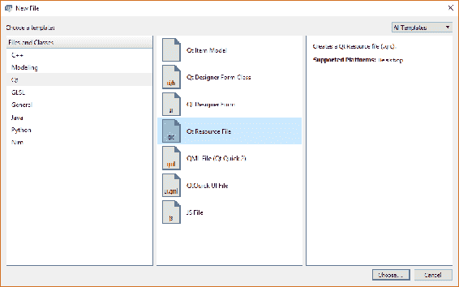
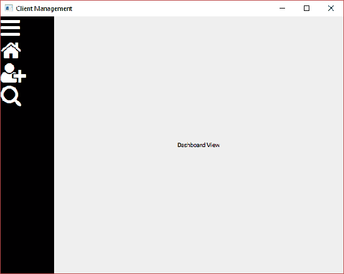
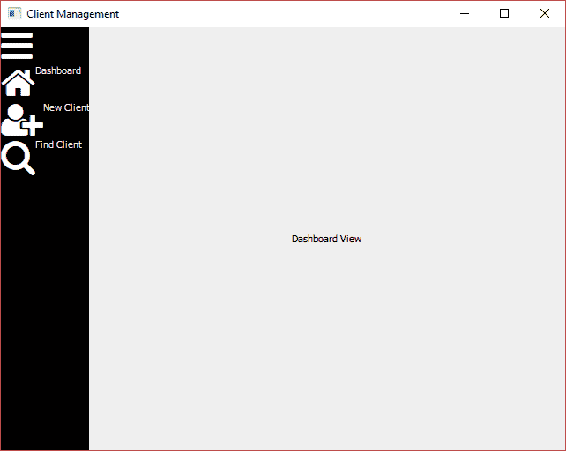
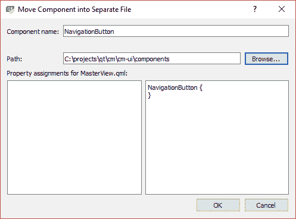
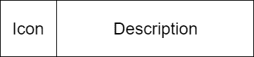
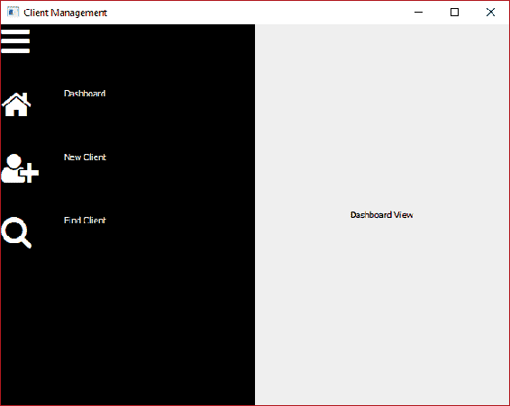
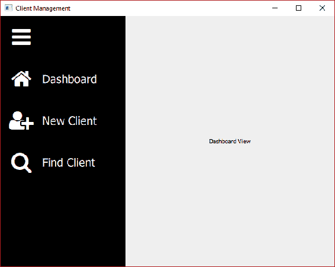

# 风格

一般来说，在开发过程中，将功能放在形式之前是一个好主意，但是用户界面是用户交互的应用的一部分，也是成功解决方案的关键要素。在这一章中，我们将介绍一个类似于 CSS 的样式资源，并基于我们在上一章中介绍的响应设计原则。

我们将创建定制的 QML 组件和模块，以最大限度地提高代码重用。我们将把 Font Awesome 集成到我们的解决方案中，为我们提供一套可扩展的图标，并帮助我们的用户界面呈现出现代的图形外观。我们将整理导航栏，介绍命令的概念，并为动态的、上下文相关的命令栏构建框架。

我们将在本章中讨论以下主题:

*   自定义样式资源
*   字体惊人
*   自定义组件
*   导航栏样式
*   命令

# 样式资源

首先，让我们创建一个新的资源文件来包含我们需要的非 QML 视觉元素。在`cm-ui`项目中，添加新项...> Qt > Qt 资源文件:



命名文件`assets.qrc`并放入`cm/cm-ui`。您的新文件将在资源编辑器中自动打开，我觉得这不是一个特别有用的编辑器，所以关闭它。您将看到`assets.qrc`文件已经被添加到`cm-ui`项目的参考资料部分。右键单击并选择添加新的… > Qt > QML 文件。调用文件`Style.qml`并保存到`cm/cm-ui/assets`。

在纯文本编辑器中编辑`assets.qrc`文件，方法与我们编辑视图的方法相同:

```cpp
<RCC>
    <qresource prefix="/assets">
        <file alias="Style.qml">img/Style.qml</file>
    </qresource>
</RCC>
```

现在，编辑`Style.qml`，我们将添加一个样式属性用于视图的背景颜色:

```cpp
pragma Singleton
import QtQuick 2.9

Item {
    readonly property color colourBackground: "#f4c842"
}
```

我们在这里用 C++ 术语做的是用一个名为`colourBackground`的 const color 类型的公共成员变量创建一个 singleton 类，该变量的初始化值为(非常)浅灰色的十六进制 RGB 代码。

现在，我们需要做一点手工操作来连接。我们需要在与`Style.qml` ( `cm/cm-ui/assets`)相同的文件夹中创建一个名为`qmldir`(无文件扩展名)的模块定义文件。这种类型的文件没有内置模板，所以我们需要自己创建。旧版本的 Windows 中的文件资源管理器曾经使这成为一个痛苦的练习，因为它总是坚持文件扩展名。需要控制台命令来强制重命名文件。Windows 10 很乐意创建没有扩展名的文件。在 Unix 世界中，没有扩展名的文件更常见。

创建`qmldir`文件后，编辑`assets.qrc`，并在`/assets`前缀内的`Style.qml`旁边插入一个新条目:

```cpp
<file alias="qmldir">img/qmldir</file>
```

双击新添加的`qmldir`文件，输入如下行:

```cpp
module assets
singleton Style 1.0 Style.qml
```

当我们**导入 QtQuick 2.9** 时，我们已经看到了模块。这使得 QtQuick 模块的 2.9 版本可以在我们的视图中使用。在我们的`qmldir`文件中，我们定义了一个自己的新模块`assets`，并告诉 Qt 在该模块的 1.0 版本中有一个**样式**对象，其实现在我们的`Style.qml`文件中。

随着我们新样式模块的创建和连线，现在让我们使用现代的灰白色。从我们看到的第一个子视图`SplashView`开始，添加以下内容来访问我们的新模块:

```cpp
import assets 1.0
```

你会注意到，我们看到一条愤怒的红色下划线，表明一切都不顺利。用鼠标指针悬停在线上，工具提示会告诉我们需要将导入路径添加到我们新的`qmldir`定义文件中。

有几种方法可以做到这一点。第一个选项是进入项目模式，选择当前工具包的构建设置，然后选择调试模式。在构建环境部分的底部，单击详细信息。在这里，您可以看到当前套件和配置的所有环境变量的列表。添加一个名为 QML2_IMPORT_PATH 的新变量，并将其值设置到`cm-ui`文件夹:


这会将`cm-ui`项目(`/projects/qt/cm/cm-ui`)的项目工作目录添加到 QML 导入路径中。请注意，我们的模块名称必须反映从该导入路径到`qmldir`文件的相对路径。

这种方法的问题在于，这个环境变量被绑定到`cm.pro.user`文件。如果你和其他开发人员共享这个项目，他们会有自己的`cm.pro.user`文件，他们也要记得添加这个变量。此外，它绑定到一个绝对路径，如果您将项目代码复制到另一台机器上，它可能不在那个位置。

第二个，也是首选的选项是在实例化**qmlapplicationengine**后立即在`main.cpp`中添加以下行:

```cpp
engine.addImportPath("qrc:/");
```

那么为什么`qrc:/`不是我们`qmldir`文件的绝对路径呢？你会记得我们在`cm-ui.pro`的`RESOURCES`变量中添加了`views.qrc`资源包。这样做是从`views.qrc`获取所有文件，并将它们编译成一种虚拟文件系统中的应用二进制文件，其中前缀充当虚拟文件夹。这个虚拟文件系统的根被称为`qrc:/`，通过在导入路径中使用它，我们实际上是要求 Qt 在所有捆绑的资源文件中查找任何模块。前往`cm-ui.pro`并确保我们的新`assets.qrc`也已添加至`RESOURCES`:

```cpp
RESOURCES += views.qrc \
    assets.qrc
```

这可能有点令人困惑，所以重申一下，我们添加了以下文件夹来搜索新模块，或者使用 QML2_IMPORT_PATH 环境变量来搜索本地物理文件系统上的`cm-ui`项目文件夹，或者使用`addImportPath()`方法在运行时搜索虚拟资源文件系统的根目录。

在这两种情况下，定义新模块的`qmldir`文件位于名为`assets`的文件夹中，该文件夹的级别低于此级别，即物理文件系统中的`<Qt Projects>/cm/cm-ui/assets`或虚拟文件系统中的`qrc:/assets`。

这就给了我们模块名称`assets`。如果我们的文件夹结构更深，像东西/獾/资产，那么我们的模块将需要被称为`stuff.badgers.assets`，因为这是相对于我们定义的导入路径的路径。类似地，如果我们想为我们现有的视图添加另一个模块，我们将在`cm-ui/views`中创建一个`qmldir`文件，并调用模块`views`。

If you see that Qt Creator is still a bit confused and the red line still persists, ensure that `cm-ui.pro` contains the `QML_IMPORT_PATH += $$PWD` line.

有了所有这些，我们现在可以使用我们的新模块。包含该模块意味着我们现在可以访问我们的 singleton `Style`对象并从中读取属性。更换我们`SplashView`的`color`房产:

```cpp
Rectangle {
    ...    
    color: Style.colourBackground
    ...
}
```

重复此操作，为除`MasterView`以外的所有视图设置背景颜色。每个视图中也记得`include ui.assets 1.0`。

当您构建和运行应用时，您可能会想，为什么视图看起来和以前完全一样，而我们却经历了所有这些繁琐的工作。好吧，假设我们刚刚和市场部的人开了一个会，他们告诉我们黄橙色不再适合这个品牌了，我们需要改变所有的观点，变成干净的灰白色。我们以前必须进入每个视图，将颜色从`#f4c842`更改为`#efefef`。现在，它们只有七个，所以没什么大不了的，但是想象一下，如果我们必须改变 50 个复杂视图中所有组件的所有颜色；那将是一项非常痛苦的工作。

但是，转到`Style.qml`将`colourBackground`属性从`#f4c842`更改为`#efefef`。构建并运行应用，享受我们更名应用的荣耀！通过尽早设置我们的共享样式组件，我们可以随时添加属性，然后在以后重新设计我们的应用变得更加容易。我们可以在这里添加所有类型的属性，而不仅仅是颜色，所以随着我们的进一步发展，我们将添加大小、字体和其他东西。

# 字体惊人

有了我们的样式框架，让我们回顾一下导航栏的外观，并找出我们想要实现的目标:


我们希望在导航栏上显示的按钮是仪表板视图(主页视图)、新客户端视图和查找客户端视图，以及顶部用于展开和折叠栏的切换按钮。

一种常见的用户界面设计模式是用图标表示简单的命令。关于该命令的进一步信息可以通过多种方式获得；例如，当您将鼠标悬停在按钮上时，信息可以显示在屏幕底部的工具提示或状态栏中。我们的方法是有一个可折叠的酒吧。该栏的默认状态将被折叠，并将显示代表每个命令的图标。在展开状态下，该栏将显示命令的图标和文本描述。用户可以通过一个额外的按钮来切换状态。这是一种在移动应用开发中特别流行的模式，默认情况下，您希望消耗尽可能少的屏幕空间。

有几个选项可以显示我们按钮的图标。旧的桌面应用很可能会使用某种描述的图像文件。这给了你对你的图标外观的完全艺术控制，但是有几个缺点。图像文件的大小相对较大，并且它们的大小是固定的。如果你需要以不同的尺寸绘制它们，那么它们可能看起来很糟糕，尤其是当它们被放大或者长宽比改变时。

**可伸缩矢量图形** ( **SVG** )是小得多的文件，伸缩性非常好。它们更难创造，在艺术上可能更受限制，但它们对图标的目的非常有用。然而，从经验来看，在 Qt/QML 使用它们可能相当棘手。

第三个选项是符号字体文件，它提供了 SVG 的小文件大小和可伸缩性优势，但更容易处理。这是 web 开发中非常常见的解决方案，这是我们将采取的方法。

有许多可用的符号字体，但最受欢迎的开发可能是**字体真棒**。它提供了广泛的恐怖符号，并有一个非常有用的网站；退房:[http://fontawesome.io/](http://fontawesome.io/)。

Check any licensing applicable for fonts you choose to use, especially if you are using them commercially.

下载工具包并打开存档文件。我们感兴趣的文件是`fonts` / `fontawesome-webfont.ttf`。将此文件复制到我们在`cm/cm-ui/assets`的项目文件夹中。

在我们的`cm-ui`项目中，编辑`assets.qrc`并将字体添加到我们的资源中:

```cpp
<file alias="fontawesome.ttf">img/fontawesome-webfont.ttf</file>
```

请记住，我们的别名不必与原始文件名相同，我们已经利用这个机会将其缩短了一点。

接下来，编辑`Style.qml`，我们将把字体连接到我们的自定义样式，以便于使用。我们首先需要加载字体并使其可供使用，这是我们使用`FontLoader`组件实现的。在根**项**元素中添加以下内容:

```cpp
FontLoader {
    id: fontAwesomeLoader
    source: "qrc:/img/fontawesome.ttf"
}    
```

在`source`属性中，我们使用在`assets.qrc`文件中定义的`/assets`前缀(或虚拟文件夹)以及`fontawesome.ttf`别名。现在，我们已经加载了字体，但是就目前的情况来看，我们无法从`Style.qml`之外引用它。这是因为只有根组件级别的属性可以在文件外部访问。子组件被认为实际上是私有的。我们解决这个问题的方法是为我们想要展示的元素创建一个`property alias`:

```cpp
Item {
    property alias fontAwesome: fontAwesomeLoader.name

    readonly property color colourBackground: "#efefef"

    FontLoader {
        id: fontAwesomeLoader
        source: "qrc:/img/fontawesome.ttf"
    }    
}
```

这将创建一个名为`fontAwesome`的公共可用属性，当调用该属性时，只需将调用方重定向到内部`fontAwesomeLoader`元素的`name`属性。

接线完成后，让我们找到想要使用的图标。回到字体真棒网站，导航到图标页面。在这里，你可以看到所有可用的图标。点击其中一个将显示更多关于它的信息，从这里我们可以获得显示它所需的关键信息，那就是 unicode 字符。我将为我们的菜单选择以下图标，但请随意选择您想要的图标:

| **命令** | **图标** | **Unicode 字符** |
| 切换菜单 | 酒吧 | f0c9 |
| 仪表盘 | 家 | f015 |
| 新客户端 | 用户-plus | f234 |
| 查找客户 | 搜索 | f002 |

现在，让我们用每个图标的`Text`组件替换`MasterView`上的`Button`组件:

```cpp
Column {
    Text {
        font {
            family: Style.fontAwesome
            pixelSize: 42
        }
        color: "#ffffff"
        text: "\uf0c9"
    }
    Text {
        font {
            family: Style.fontAwesome
            pixelSize: 42
        }
        color: "#ffffff"
        text: "\uf015"
    }
    Text {
        font {
            family: Style.fontAwesome
            pixelSize: 42
        }
        color: "#ffffff"
        text: "\uf234"
    }
    Text {
        font {
            family: Style.fontAwesome
            pixelSize: 42
        }
        color: "#ffffff"
        text: "\uf002"
    }
}
```

您还需要添加**资产 1.0** 导入，如果您还没有:



接下来，我们将添加客户端命令的描述性文本。将每个`Text`组件包装在一个`Row`中，并添加另一个`Text`组件进行描述，如下所示:

```cpp
Row {
    Text {
        font {
            family: Style.fontAwesome
            pixelSize: 42
        }
        color: "#ffffff"
        text: "\uf234"
    }
    Text {
        color: "#ffffff"
        text: "New Client"
    }
}
```

`Row`组件将水平布局其子组件——首先是图标，然后是描述性文本。对其他命令重复此操作。为其他按钮添加描述仪表板和查找客户端，并为切换命令添加一个空字符串:



在我们过于得意忘形地进行进一步的更改之前，我们将喘口气，做一些重构，并考虑引入组件。

# 成分

我们刚刚写的 QML 足够实用，但是已经变得难以维护了。我们的`MasterView`变得有点长，有点难读。当我们改变命令按钮的外观时，例如，对齐图标和文本，我们将不得不在四个地方改变它。如果我们想添加第五个按钮，我们必须复制、粘贴和编辑一大堆 QML 才能这样做。这就是可重用组件发挥作用的地方。

组件与我们已经创建的视图完全相同，只是 QML 的片段。区别纯粹在于语义。在这本书里，视图代表布局内容的屏幕，而组件就是内容。

创建一个新组件最简单的方法是，当你已经写好了 QML，你想形成你的组件的基础，我们已经这样做了。右键单击我们为命令添加的任何`Row`元素，并选择**重构>将组件移动到单独的文件中**。

命名新组件`NavigationButton`并将其保存到新文件夹— `cm/cm-ui/components`:



行元素将被移动到我们的新文件中，在`MasterView`中，您将剩下一个空的`NavigationButton`组件:

```cpp
NavigationButton {
}
```

不幸的是，它带有一个大的红色曲线，我们的应用将不再运行。虽然重构步骤愉快地为我们创建了一个新的`NavigationButton.qml`文件，但它实际上并没有包含在我们的项目中，所以 Qt 不知道它在哪里。不过，这很容易解决，我们只需要像处理视图和资产一样设置我们的资源包:

1.  在`cm/cm-ui`文件夹中创建新的`Qt Resource File`名为`components.qrc`
2.  在`cm/cm-ui/components`中创建一个空的`qmldir`文件，就像我们对资产所做的那样
3.  编辑`components.qrc`将我们的两个新文件包含在`/components`前缀中:

```cpp
<RCC>
    <qresource prefix="/components">
        <file alias="qmldir">components/qmldir</file>
        <file   
 alias="NavigationButton.qml">components/NavigationButton.qml</file>
    </qresource>
</RCC>
```

4.  编辑`qmldir`以设置我们的模块，并向其中添加我们的`NavigationButton`组件:

```cpp
module components
NavigationButton 1.0 NavigationButton.qml
```

5.  确保`cm-ui.pro`中的`components.qrc`已被添加到`RESOURCES`变量中
6.  在`MasterView`中，包括我们的新组件模块，以访问我们的新组件:

```cpp
import components 1.0
```

Sometimes, getting our module to be fully recognized and banishing the red squigglies may only be accomplished by restarting Qt Creator, as that forces the reload of all the QML modules.

我们现在有了一个可重用的组件，它隐藏了实现细节，减少了代码重复，并使添加新命令和维护旧命令变得更加容易。然而，在我们可以将它用于其他命令之前，我们需要对它进行一些更改。

目前，我们的`NavigationButton`有硬编码的图标和描述文本值，每当我们使用该组件时，这些值都是相同的。我们需要公开这两个文本属性，以便为每个命令设置不同的属性。正如我们所看到的，我们可以使用属性别名来实现这一点，但是我们需要向我们的`Text`元素添加唯一的标识符来实现这一点。让我们将默认值设置为通用值，并实现本书前面的建议，将`Item`组件作为根元素:

```cpp
import QtQuick 2.9
import assets 1.0

Item {
    property alias iconCharacter: textIcon.text
    property alias description: textDescription.text

    Row {
        Text {
            id: textIcon
            font {
                family: Style.fontAwesome
                pixelSize: 42
            }
            color: "#ffffff"
            text: "\uf11a"
        }
        Text {
            id: textDescription
            color: "#ffffff"
            text: "SET ME!!"
        }
    }
}
```

现在我们的组件可以用属性进行配置，我们可以在`MasterView`中替换我们的命令:

```cpp
Column {
    NavigationButton {
        iconCharacter: "\uf0c9"
        description: ""
    }
    NavigationButton {
        iconCharacter: "\uf015"
        description: "Dashboard"
    }
    NavigationButton {
        iconCharacter: "\uf234"
        description: "New Client"
    }
    NavigationButton {
        iconCharacter: "\uf002"
        description: "Find Client"
    }
}
```

这比我们之前复制的所有 QML 都要简洁和易于管理。现在，如果您运行该应用，您会看到，虽然我们向前迈出了几步，但我们也后退了一步:


正如您所看到的，我们所有的组件都绘制在彼此之上。这种情况的根本原因是我们之前提到的关于规模的问题。我们有一个带有根`Item`元素的视觉组件，我们还没有明确定义它的大小。我们忽略的另一件事是我们的定制风格。接下来让我们修理那些。

# 设计导航栏的样式

从简单的部分开始，我们先把硬编码的颜色和图标像素大小从`NavigationButton`移到`Style.qml`:

```cpp
readonly property color colourNavigationBarBackground: "#000000"
readonly property color colourNavigationBarFont: "#ffffff"
readonly property int pixelSizeNavigationBarIcon: 42
```

我们现在需要考虑如何确定按钮元素的大小。我们有一个图标，我们想成为正方形，所以宽度和高度将是相同的。接下来，我们有一个与图标高度相同但更宽的文本描述:



整个组件的宽度是图标的宽度加上描述的宽度。整个组件的高度与图标和描述的高度相同；然而，它给了我们更大的灵活性，使高度与两者中较大者相同。这样，如果我们决定让一个项目比另一个项目大，我们就知道这个组件足够大，可以包含两个项目。让我们为图标选择 80 x 80 的起始尺寸，为描述选择 80 x 240 的起始尺寸，并定义属性:

```cpp
readonly property real widthNavigationButtonIcon: 80
readonly property real heightNavigationButtonIcon: widthNavigationButtonIcon
readonly property real widthNavigationButtonDescription: 240
readonly property real heightNavigationButtonDescription: heightNavigationButtonIcon
readonly property real widthNavigationButton: widthNavigationButtonIcon + widthNavigationButtonDescription
readonly property real heightNavigationButton: Math.max(heightNavigationButtonIcon, heightNavigationButtonDescription)
```

这里有几件事需要注意。属性可以直接绑定到其他属性，这减少了重复的数量，并使整个设置更加动态。我们知道我们希望我们的图标是正方形的，所以通过将高度绑定为与宽度相同，如果我们想要更改图标的总大小，我们只需要更新宽度，高度就会自动更新。QML 还与 JavaScript 引擎有很强的集成，所以我们可以使用`Math.max()`功能来帮助我们找出哪个高度更大。

我们希望导航按钮做的另一件事是当用户将鼠标悬停在按钮上时提供某种视觉提示，以指示它是一个交互元素。为此，我们需要每个按钮都有自己的背景矩形。

在`NavigationButton`中，用新的`Rectangle`包裹`Row`元素，并将尺寸插入我们的组件:

```cpp
Item {
    property alias iconCharacter: textIcon.text
    property alias description: textDescription.text

    width: Style.widthNavigationButton
    height: Style.heightNavigationButton

    Rectangle {
        id: background
        anchors.fill: parent
        color: Style.colourNavigationBarBackground

        Row {
            Text {
                id: textIcon
                width: Style.widthNavigationButtonIcon
                height: Style.heightNavigationButtonIcon
                font {
                    family: Style.fontAwesome
                    pixelSize: Style.pixelSizeNavigationBarIcon
                }
                color: Style.colourNavigationBarFont
                text: "\uf11a"
            }
            Text {
                id: textDescription
                width: Style.widthNavigationButtonDescription
                height: Style.heightNavigationButtonDescription
                color: Style.colourNavigationBarFont
                text: "SET ME!!"
            }
        }
    }
}
```

再跑一次，你会看到轻微的改善:


我们的部分描述被删除了，因为我们的导航栏被硬编码为 100 像素宽。我们需要改变这一点，并实现切换展开/折叠功能。我们已经计算出了我们需要的尺寸，所以让我们通过向`Style.qml`添加几个新属性来做准备:

```cpp
readonly property real widthNavigationBarCollapsed: widthNavigationButtonIcon
readonly property real heightNavigationBarExpanded: widthNavigationButton
```

折叠状态对于图标来说刚好足够宽，而展开状态将包含整个按钮，包括描述。

接下来，让我们将导航栏封装在一个新组件中。在这种情况下不会有任何重用的好处，因为只会有一个，但它有助于保持我们的 QML 有条理，并使`MasterView`更加简洁和易于阅读。

您可以右键单击`MasterView`中的`Rectangle`组件，并将我们的导航栏重构为新的 QML 文件，就像我们对我们的`NavigationButton`所做的那样。但是，让我们手动完成它，这样您就可以适应这两种方法。右键单击`components.qrc`并选择添加新… > Qt > QML 文件。在`cm/cm-ui/components`中增加`NavigationBar.qml`:


编辑`components.qrc`并将我们的新`NavigationBar`移动到带有别名的`/components`前缀部分:

```cpp
<file alias="NavigationBar.qml">components/NavigationBar.qml</file>
```

通过编辑`qmldir`将组件添加到我们的组件模块中:

```cpp
NavigationBar 1.0 NavigationBar.qml
```

从`MasterView`中剪切`Rectangle`及其子元素，粘贴到根`Item`元素内的`NavigationBar.qml`中。如果`QtQuick`模块导入已经初始化为旧版本，请将其更新为 2.9 版本。为我们的资产模块添加一个导入来访问我们的样式对象。将矩形的`anchors`和`width`属性移动到根`Item`，并将`Rectangle`设置为填充其父级:

```cpp
import QtQuick 2.9
import assets 1.0

Item {
    anchors {
        top: parent.top
        bottom: parent.bottom
        left: parent.left
    }
    width: 100

    Rectangle {
        anchors.fill: parent
        color: "#000000"

        Column {
            NavigationButton {
                iconCharacter: "\uf0c9"
                description: ""
            }
            NavigationButton {
                iconCharacter: "\uf015"
                description: "Dashboard"
            }
            NavigationButton {
                iconCharacter: "\uf234"
                description: "New Client"
            }
            NavigationButton {
                iconCharacter: "\uf002"
                description: "Find Client"
            }
        }
    }
}
```

回到`MasterView`，现在可以在`Rectangle`原来的位置添加新的`NavigationBar`组件:

```cpp
NavigationBar {
    id: navigationBar
}
```

尽管您再次看到可怕的红色曲线，但您实际上能够运行应用并验证重构没有破坏任何东西。

我们新的`NavigationBar`组件的锚定没问题，但是`width`有点复杂——我们如何知道它应该是`Style.widthNavigationBarCollapsed`还是`Style.heightNavigationBarExpanded`？我们将使用一个公共可访问的布尔属性来控制这一点，该属性指示栏是否折叠。然后，我们可以使用条件`?`运算符语法，使用该属性值来决定我们想要的宽度。最初将属性设置为 true，这样默认情况下，该栏将以折叠状态呈现:

```cpp
property bool isCollapsed: true
```

在此基础上，将硬编码`width`替换为 100，如下所示:

```cpp
width: isCollapsed ? Style.widthNavigationBarCollapsed : Style.heightNavigationBarExpanded
```

接下来，将`Rectangle`的`color`属性更新为`Style.colourNavigationBarBackground`:


我们现在正在到达那里，但是一路上我们错过的一件关键的事情是，现在点击按钮实际上不再做任何事情。接下来我们来解决这个问题。

# 微小静电干扰声

在这本书的早期，我们研究了一个叫做`MouseArea`的组件。这很快被我们使用的`Button`组件所取代，它为我们提供了点击功能。然而，现在我们正在滚动我们自己的按钮形式，我们需要自己实现点击功能。就像`Button`组件一样，我们的`NavigationButton`在被点击时不应该做任何事情，除了通知他们的父母事件已经发生。组件应该尽可能通用，并且不了解上下文，以便您可以在多个地方使用它们。我们需要做的是添加一个`MouseArea`组件，并通过自定义信号传递`onClicked`事件。

在`NavigationButton`中，我们首先添加每当组件被点击时我们想要发出的信号。在属性后添加以下内容:

```cpp
signal navigationButtonClicked()
```

Try and give the signals quite specific names, even if they are a little long. If you simply call everything `clicked()`, then things can get a little confusing and sometimes you may find yourself referencing a different signal to the one you intended.

接下来，我们将添加另一个属性来支持我们将要实现的鼠标悬停魔法。这将是一个`color`类型，我们将默认为常规背景颜色:

```cpp
property color hoverColour: Style.colourNavigationBarBackground
```

我们将结合`Rectangle`的`states`属性使用此颜色:

```cpp
states: [
    State {
        name: "hover"
        PropertyChanges {
            target: background
            color: hoverColour
        }
    }
]
```

将阵列中的每个状态视为一个命名配置。默认配置没有名称("")，由我们已经在`Rectangle`元素中设置的属性组成。“悬停”状态将更改应用于`PropertyChanges`元素中指定的属性，也就是说，它会将 ID 为`background`的元素的`color`属性更改为`hoverColour`的任何值。

接下来，在`Rectangle`里面但是在`Row`下面，添加我们的`MouseArea`:

```cpp
MouseArea {
    anchors.fill: parent
    cursorShape: Qt.PointingHandCursor
    hoverEnabled: true
    onEntered: background.state = "hover"
    onExited: background.state = ""
    onClicked: navigationButtonClicked()
}
```

我们使用`anchors`属性填充整个按钮背景区域，包括图标和描述。接下来，我们将通过在鼠标光标进入按钮区域时将鼠标光标变为一只指向的手，并使用`hoverEnabled`标志启用悬停来使事情变得更有趣一些。启用时，当光标进出该区域时，会发出**进入**和**退出**的信号，我们可以通过在刚刚实现的悬停状态和默认("")之间切换，使用相应的槽来改变我们的背景`Rectangle`的外观。最后，我们用`onClicked()`槽响应`MouseArea`的`clicked()`信号，简单的发出自己的信号。

我们现在可以对我们的`NavigationBar`组件中的`navigationButtonClicked()`信号做出反应，并添加一些悬停颜色。首先实现切换按钮:

```cpp
NavigationButton {
    iconCharacter: "\uf0c9"
    description: ""
    hoverColour: "#993333"
    onNavigationButtonClicked: isCollapsed = !isCollapsed
}
```

我们执行`<MyCapitalisedSignalName>`约定为我们的信号创建一个时隙，当它触发时，我们只需在`true`和`false`之间切换`isCollapsed`的值。

现在可以运行应用了。单击切换按钮展开和折叠导航栏:



请注意，由于我们使用`anchors`，子视图如何动态调整自身大小以适应导航栏。当您将鼠标悬停在按钮上时，您还会看到指针光标和闪光的颜色，这有助于用户理解它是一个交互元素，并使边界可视化。

对于剩下的导航按钮，我们想要对点击的事件做出的反应是在`NavigationCoordinator`上发出`goDashboardView()`、`goCreateClientView()`和`goFindClientView()`信号。

将`onNavigationButtonClicked`插槽添加到其他按钮，并向下钻取`masterController`对象，以获得我们想要调用的信号。也添加一些您选择的花哨颜色:

```cpp
NavigationButton {
    iconCharacter: "\uf015"
    description: "Dashboard"
    hoverColour: "#dc8a00"
    onNavigationButtonClicked: masterController.ui_navigationController.goDashboardView();
}
NavigationButton {
    iconCharacter: "\uf234"
    description: "New Client"
    hoverColour: "#dccd00"
    onNavigationButtonClicked: masterController.ui_navigationController.goCreateClientView();
}
NavigationButton {
    iconCharacter: "\uf002"
    description: "Find Client"
    hoverColour: "#8aef63"
    onNavigationButtonClicked: masterController.ui_navigationController.goFindClientView();
}
```

现在，您可以单击按钮导航到不同的子视图。

完成导航栏的最后几个小调整是为了更好地对齐按钮的内容，并调整一些东西的大小。

描述文本应该与图标的中心垂直对齐，而不是顶部，我们的图标应该居中，而不是靠在窗口的边缘。第一个问题很容易解决，因为我们已经对尺寸进行了一致和明确的调整。只需将以下属性添加到`NavigationButton`中的两个`Text`组件中:

```cpp
verticalAlignment: Text.AlignVCenter
```

这两个`Text`元素的大小都是为了占据按钮的整个高度，所以我们只需要在这个空间内垂直对齐文本。

固定图标的对齐方式是一样的，但是这次是在水平轴上。将以下内容添加到图标的`Text`部分:

```cpp
horizontalAlignment: Text.AlignHCenter
```

至于尺寸，我们的描述文本有点小，文本后面有很多空白。给我们的`Style`对象添加一个新属性:

```cpp
readonly property int pixelSizeNavigationBarText: 22
```

使用描述`Text`元素中的新属性:

```cpp
font.pixelSize: Style.pixelSizeNavigationBarText
```

接下来，将`Style`中的`widthNavigationButtonDescription`属性降低到 160。

运行应用，我们就快到了。现在，尺寸和对齐更好了:



但是，有一点你可能没有注意到，当栏被折叠，只显示图标时，`MouseArea`仍然是包含描述的按钮的全宽。尝试将鼠标移动到描述所在的位置，您可以看到指针光标出现。你甚至可以点击组件，然后转换发生。我们需要做的是修复这个问题，而不是`NavigationButton`中的根`Item`元素是一个固定宽度(`Style.widthNavigationButton`，我们需要使其动态化，并将其设置为`parent.width`。为了做到这一点，我们需要沿着 QML 层级向上走，并确保它的父级也有宽度。它的父元素是`NavigationBar`中的`Column`元素。将`Column`的`width`属性也设置为`parent.width`。

有了这些更改，导航栏现在的行为与预期的一样。

# 命令

我们要做的下一件事是实现一个上下文相关的命令栏。尽管无论用户在做什么，我们的导航栏都是一个具有相同按钮的持续存在，但是命令栏会来来去去，并且会根据上下文包含不同的按钮。例如，如果用户正在添加或编辑客户端，我们将需要一个保存按钮来提交对数据库的任何更改。但是，如果我们正在搜索一个客户端，那么保存没有意义，一个“查找”按钮更相关。虽然创建命令栏的技术与导航栏大体相似，但所需的额外灵活性带来了更多挑战。

为了帮助我们克服这些障碍，我们将执行命令。这种方法的另一个好处是，我们可以将逻辑从用户界面层移到业务逻辑层。我喜欢用户界面尽可能的简单和通用。这使得您的应用更加灵活，C++ 代码中的错误比 QML 代码中的错误更容易识别和解决。

一个命令对象将封装一个图标、描述性文本、一个确定按钮是否被启用的功能，以及最后一个`executed()`信号，该信号将在相关按钮被按下时发出。命令栏中的每个按钮都将绑定到一个命令对象。

我们的每个子视图都可能有一个命令列表和一个关联的命令栏。对于这样做的视图，我们将通过命令控制器向用户界面呈现命令列表。

在`cm-lib`项目中创建两个新的`C++ `类，这两个类都应该从 QObject 继承:

*   **在新文件夹`cm-lib/source/framework`中命令**
*   **现有文件夹`cm-lib/source/controllers`中的命令控制器**

`command.h`:

```cpp
#ifndef COMMAND_H
#define COMMAND_H

#include <functional>

#include <QObject>
#include <QScopedPointer>
#include <QString>

#include <cm-lib_global.h>

namespace cm {
namespace framework {

class CMLIBSHARED_EXPORT Command : public QObject
{
    Q_OBJECT
    Q_PROPERTY( QString ui_iconCharacter READ iconCharacter CONSTANT )
    Q_PROPERTY( QString ui_description READ description CONSTANT )
    Q_PROPERTY( bool ui_canExecute READ canExecute NOTIFY canExecuteChanged )

public:
    explicit Command(QObject* parent = nullptr,
                     const QString& iconCharacter = "",
                     const QString& description = "",
                     std::function<bool()> canExecute = [](){ return 
                                                           true; });
    ~Command();

    const QString& iconCharacter() const;
    const QString& description() const;
    bool canExecute() const;

signals:
    void canExecuteChanged();
    void executed();

private:
    class Implementation;
    QScopedPointer<Implementation> implementation;
};

}}

#endif
```

`command.cpp`:

```cpp
#include "command.h"

namespace cm {
namespace framework {

class Command::Implementation
{
public:
    Implementation(const QString& _iconCharacter, const QString& 
     _description, std::function<bool()> _canExecute)
        : iconCharacter(_iconCharacter)
        , description(_description)
        , canExecute(_canExecute)
    {
    }

    QString iconCharacter;
    QString description;
    std::function<bool()> canExecute;
};

Command::Command(QObject* parent, const QString& iconCharacter, const QString& description, std::function<bool()> canExecute)
    : QObject(parent)
{
    implementation.reset(new Implementation(iconCharacter, description, canExecute));
}

Command::~Command()
{
}

const QString& Command::iconCharacter() const
{
    return implementation->iconCharacter;
}

const QString& Command::description() const
{
    return implementation->description;
}

bool Command::canExecute() const
{
    return implementation->canExecute();
}

}
}
```

QObject、名称空间和 dll 导出代码现在应该很熟悉了。我们将希望在用户界面按钮上显示的图标字符和描述值表示为字符串。我们将成员变量隐藏在私有实现中，并为它们提供`accessor`方法。我们可以将`canExecute`成员表示为一个简单的`bool`成员，调用代码可以根据需要设置为`true`或`false`；然而，一个更优雅的解决方案是传入一个方法，在运行中为我们计算价值。默认情况下，我们将其设置为返回`true`的λ，这意味着按钮将被启用。我们提供了一个`canExecuteChanged()`信号来配合它，只要我们想让用户界面重新评估按钮是否被启用，我们就可以触发这个信号。最后一个元素是`executed()`信号，当按下相应的按钮时，该信号将由用户界面触发。

`command-controller.h`:

```cpp
#ifndef COMMANDCONTROLLER_H
#define COMMANDCONTROLLER_H

#include <QObject>
#include <QtQml/QQmlListProperty>
#include <cm-lib_global.h>
#include <framework/command.h>

namespace cm {
namespace controllers {

class CMLIBSHARED_EXPORT CommandController : public QObject
{
    Q_OBJECT
    Q_PROPERTY(QQmlListProperty<cm::framework::Command> 
     ui_createClientViewContextCommands READ  
     ui_createClientViewContextCommands CONSTANT)

public:
    explicit CommandController(QObject* _parent = nullptr);
    ~CommandController();

    QQmlListProperty<framework::Command> 
    ui_createClientViewContextCommands();

public slots:
    void onCreateClientSaveExecuted();

private:
    class Implementation;
    QScopedPointer<Implementation> implementation;
};

}}

#endif
```

`command-controller.cpp`:

```cpp
#include "command-controller.h"

#include <QList>
#include <QDebug>

using namespace cm::framework;

namespace cm {
namespace controllers {

class CommandController::Implementation
{
public:
    Implementation(CommandController* _commandController)
        : commandController(_commandController)
    {
        Command* createClientSaveCommand = new Command( 
          commandController, QChar( 0xf0c7 ), "Save" );
        QObject::connect( createClientSaveCommand, &Command::executed,   
   commandController, &CommandController::onCreateClientSaveExecuted );
        createClientViewContextCommands.append( createClientSaveCommand );
    }

    CommandController* commandController{nullptr};

    QList<Command*> createClientViewContextCommands{};
};

CommandController::CommandController(QObject* parent)
    : QObject(parent)
{
    implementation.reset(new Implementation(this));
}

CommandController::~CommandController()
{
}

QQmlListProperty<Command> CommandController::ui_createClientViewContextCommands()
{
    return QQmlListProperty<Command>(this, implementation->createClientViewContextCommands);
}

void CommandController::onCreateClientSaveExecuted()
{
    qDebug() << "You executed the Save command!";
}

}}
```

这里，我们介绍一种新的类型——`QQmlListProperty`。它本质上是一个包装器，使 QML 能够与自定义对象的列表进行交互。请记住，我们需要完全限定`Q_PROPERTY`语句中的模板化类型。实际保存数据的私有成员是一个 QList，我们已经实现了一个`accessor`方法，该方法获取 QList 并将其转换为相同模板类型的`QQmlListProperty`。

As per the documentation for `QQmlListProperty`, this method of object construction should not be used in production code, but we’ll use it to keep things simple.

我们已经为我们的`CreateClientView`创建了一个单一的命令列表。稍后我们将为其他视图添加命令列表。再说一遍，我们现在将保持事情简单；我们只需创建一个命令来保存新创建的客户端。当创建命令时，我们将其父级给命令协调器，这样我们就不必担心内存管理。我们给它分配一个软盘图标(unicode f0c7)和保存标签。我们暂时将`canExecute`功能保留为默认值，因此它将始终处于启用状态。接下来，我们将命令的`executed()`信号连接到`CommandController`的`onCreateClientSaveExecuted()`插槽。接线完成后，我们将命令添加到列表中。

目的是我们向用户呈现一个绑定到`Command`对象的命令按钮。当用户按下按钮时，我们会从用户界面发出`executed()`信号。我们建立的连接将导致调用命令控制器上的插槽，我们将执行我们的业务逻辑。现在，我们只需在按下按钮时向控制台打印一行。

接下来，让我们在`main.cpp`中注册我们的两个新类型(记住`#includes`):

```cpp
qmlRegisterType<cm::controllers::CommandController>("CM", 1, 0, "CommandController");
qmlRegisterType<cm::framework::Command>("CM", 1, 0, "Command");
```

最后，我们需要将`CommandCoordinator`属性添加到`MasterController`中:

```cpp
Q_PROPERTY( cm::controllers::CommandController* ui_commandController READ commandController CONSTANT )
```

然后，我们添加一个`accessor`方法:

```cpp
CommandController* commandController();
```

最后，在`master-controller.cpp`中，实例化私有实现中的对象，并以与我们为`NavigationController`所做的完全相同的方式实现`accessor`方法。

我们现在有一个(非常短！)准备好供我们`CreateClientView`消耗的命令列表。

# 指令杠

让我们从为命令组件向样式添加更多属性开始:

```cpp
readonly property color colourCommandBarBackground: "#cecece"
readonly property color colourCommandBarFont: "#131313"
readonly property color colourCommandBarFontDisabled: "#636363"
readonly property real heightCommandBar: heightCommandButton
readonly property int pixelSizeCommandBarIcon: 32
readonly property int pixelSizeCommandBarText: 12

readonly property real widthCommandButton: 80
readonly property real heightCommandButton: widthCommandButton
```

接下来，在我们的用户界面项目中创建两个新的 QML 组件:`CommandBar.qml`和`cm-ui/components`中的`CommandButton.qml`。更新`components.qrc`并将新组件移入带有别名的`/components`前缀。编辑`qmldir`并添加新组件:

```cpp
CommandBar 1.0 CommandBar.qml
CommandButton 1.0 CommandButton.qml
```

对于我们的按钮设计，我们希望在图标下方布局描述。图标应该位于略高于中心的位置。组件应该是方形的，如下所示:


`CommandButton.qml`:

```cpp
import QtQuick 2.9
import CM 1.0
import assets 1.0

Item {
    property Command command
    width: Style.widthCommandButton
    height: Style.heightCommandButton

    Rectangle {
        id: background
        anchors.fill: parent
        color: Style.colourCommandBarBackground

        Text {
            id: textIcon
            anchors {
                centerIn: parent
                verticalCenterOffset: -10
            }
            font {
                family: Style.fontAwesome
                pixelSize: Style.pixelSizeCommandBarIcon
            }
            color: command.ui_canExecute ? Style.colourCommandBarFont : 
                                          colourCommandBarFontDisabled
            text: command.ui_iconCharacter
            horizontalAlignment: Text.AlignHCenter
        }

        Text {
            id: textDescription
            anchors {
                top: textIcon.bottom
                bottom: parent.bottom
                left: parent.left
                right: parent.right
            }
            font.pixelSize: Style.pixelSizeNavigationBarText
            color: command.ui_canExecute ? Style.colourCommandBarFont : 
                                          colourCommandBarFontDisabled
            text: command.ui_description
            horizontalAlignment: Text.AlignHCenter
            verticalAlignment: Text.AlignVCenter
        }

        MouseArea {
            anchors.fill: parent
            cursorShape: Qt.PointingHandCursor
            hoverEnabled: true
            onEntered: background.state = "hover"
            onExited: background.state = ""
            onClicked: if(command.ui_canExecute) {
                           command.executed();
                       }
        }

        states: [
            State {
                name: "hover"
                PropertyChanges {
                    target: background
                    color: Qt.darker(Style.colourCommandBarBackground)
                }
            }
        ]
    }
}
```

这在很大程度上类似于我们的`NavigationButton`组件。我们传入一个`Command`对象，在这里我们将获得要在**文本**元素中显示的图标字符和描述，以及按下按钮时要发出的信号，只要命令可以执行。

我们使用一个替代的**行/列**为基础的布局，并使用锚来定位我们的图标和描述。我们将图标放在父级`Rectangle`的中心，然后应用垂直偏移将其向上移动，并为描述留出空间。我们将描述的顶部固定在图标的底部。

我们不是在按下按钮时传播信号，而是发出`Command`对象的`executed()`信号，首先验证命令是否可以执行。我们还使用这个标志来有选择地为我们的文本元素着色，如果命令被禁用，则使用浅灰色字体。

我们用我们的`MouseArea`实现了一些更多的悬停功能，但是我们没有暴露一个属性来传递悬停颜色，而是简单地采用默认值，并使用内置的`Qt.darker()`方法将其变暗几个阴影。如果命令可以执行，我们也只在`MouseArea`的`onEntered()`槽中应用状态改变。

`CommandBar.qml`:

```cpp
import QtQuick 2.9
import assets 1.0

Item {
    property alias commandList: commandRepeater.model

    anchors {
        left: parent.left
        bottom: parent.bottom
        right: parent.right
    }
    height: Style.heightCommandBar

    Rectangle {
        anchors.fill: parent
        color: Style.colourCommandBarBackground

        Row {
            anchors {
                top: parent.top
                bottom: parent.bottom
                right: parent.right
            }

            Repeater {
                id: commandRepeater
                delegate: CommandButton {
                    command: modelData
                }
            }
        }
    }
}
```

同样，这在很大程度上与`NavigationBar`相同，但是有一个动态的命令列表，而不是硬编码的 QML 按钮。我们引入了另一个新组件-`Repeater`。通过`model`属性给定一个对象列表，`Repeater`将为列表中的每个项目实例化一个在`delegate`属性中定义的 QML 组件。列表中的对象通过内置的`modelData`变量可用。使用这种机制，我们可以为给定列表中的每个命令自动生成一个`CommandButton`元素。我们使用另一个属性别名，以便调用者可以设置命令列表。

让我们在`CreateClientView`中使用这个。首先是`import components 1.0`，然后在根`Item`里面和`Rectangle`后面加上以下内容:

```cpp
CommandBar {
    commandList: masterController.ui_commandController.ui_createClientViewContextCommands
}
```

我们深入查看我们的属性层次结构，以获取 create client 视图的命令列表，并将该列表传递给命令栏，命令栏负责其余部分。不要担心`CommandBar`是否有红色的曲线，Qt Creator 只需要跟上我们飞速的步伐。

运行应用并导航至创建客户端视图:


点击按钮，您将看到消息输出到控制台。添加新命令就像将新的`Command`对象追加到`CommandController`内的 QList 一样简单——不需要修改 UI！命令栏会自动为列表中的每个命令创建一个新按钮。还要注意的是，这个命令栏只出现在`CreateClientView`上，所以它是上下文相关的。我们可以通过简单地向`CommandController`添加额外的列表和属性来轻松地向其他视图添加命令栏，我们将在后面介绍。

# 摘要

在这一章中，我们对导航栏进行了一次非常必要的检修。我们添加了最初的几个组件，并利用了新的自定义样式对象，Font Awesome 为我们提供了一些可爱的可伸缩图形。我们还引入了命令，并建立了框架，能够向视图中添加上下文相关的命令按钮。

在[第 5 章](5.html)、*数据*中，我们将深入业务逻辑层，充实我们的第一个数据模型。