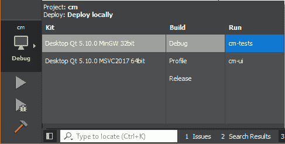

# 六、单元测试

在这一章中，我们将看看近年来真正流行起来的一个过程——单元测试。在介绍如何使用 Qt 自己的单元测试工具 Qt Test 将它集成到我们的解决方案之前，我们将简要地讨论它是什么以及我们为什么想要这样做。我们将涵盖以下主题:

*   单元测试原则
*   默认的 Qt 方法
*   另一种方法
*   数据装饰测试
*   实体测试
*   嘲弄的

# 单元测试

单元测试的本质是将一个应用分解成最小的功能块(单元)，然后在项目范围内用真实场景测试每个单元。例如，采用一个简单的方法，将两个有符号整数相加:

```cpp
int add(intx, int y);
```

一些示例场景如下所示:

*   将两个正数相加
*   将两个负数相加
*   加两个零
*   将一个正数和一个负数相加
*   将零和一个正数相加
*   将零和负数相加

我们可以为这些场景中的每一个编写一个测试，然后每当我们的代码库发生变化时(任何代码，而不仅仅是我们的`add()`方法)，就可以执行这些测试，以确保代码仍然按照预期运行。这是一个非常有价值的工具，可以让您确信您所做的任何代码更改都不会对现有功能产生不利影响。

从历史上看，这些测试应该是手动执行的，但是工具的存在可以让我们编写代码来自动测试代码，这听起来有点矛盾，但是它确实有效。Qt 为基于 Qt 的应用的单元测试提供了一个定制的框架，称为 Qt Test，这就是我们将要使用的。

You can use other C++ testing frameworks such as Google test, which arguably offer more power and flexibility, particularly when used with Google mock, but can be a bit more fiddly to set up.

**测试驱动开发** ( **TDD** )将单元测试提升到了一个新的层次，并且实际上首先改变了你编写代码的方式。本质上，你先写一个测试。测试最初会失败(事实上，它甚至可能不会构建)，因为您没有实现。然后，编写通过测试所需的最少代码，然后继续编写下一个测试。您以这种方式迭代地构建您的实现，直到您交付了所需的功能块。最后，您将代码重构为所需的标准，使用完成的单元测试来验证重构后的代码仍然按照预期运行。这有时被称为*红绿重构*。

这不是一本关于单元测试的书，也肯定不是关于 TDD 的，所以我们的方法会非常宽松，但是它是现代应用开发的关键部分，知道它如何适合您的 Qt 项目是很重要的。

我们已经演示了将一段简单的数据(欢迎消息)从业务逻辑项目传递到用户界面的机制，所以一如既往，尽可能简单地开始，本章的第一个目标是为该行为编写一个基本的单元测试。完成后，我们将继续测试我们在上一章中实现的数据类。

# 默认的 Qt 方法

当我们创建`cm-tests`项目时，Qt Creator 帮助我们创建了一个`ClientTests`类来使用一个起点，包含一个名为`testCase1`的测试。让我们直接进入并执行这个默认测试，看看会发生什么。然后我们将查看代码并讨论发生了什么。

将运行输出切换到`cm-tests`，编译运行:



这次您不会看到任何花哨的应用，但是您会在 Qt Creator 的“应用输出”窗格中看到一些文本:

```cpp
********* Start testing of ClientTests *********
Config: Using QtTest library 5.10.0, Qt 5.10.0 (i386-little_endian-ilp32 shared (dynamic) debug build; by GCC 5.3.0)
PASS : ClientTests::initTestCase()
PASS : ClientTests::testCase1()
PASS : ClientTests::cleanupTestCase()
Totals: 3 passed, 0 failed, 0 skipped, 0 blacklisted, 0ms
********* Finished testing of ClientTests *********
```

我们可以看到已经调用了三个方法，第二个是我们默认的单元测试。另外两个函数——`initTestCase()`和`cleanupTestCase()`——是在类中的一组测试之前和之后执行的特殊方法，允许您设置执行测试所需的任何先决条件，然后在之后执行任何清理。三个步骤都通过了。

现在，在`client-tests.cpp`中，添加另一个方法—`testCase2()`—与`testCase1()`相同，但是用`true`条件代替`false`。注意类声明和方法定义都在同一个`.cpp`文件中，所以需要在两个地方都添加方法。再次运行测试:

```cpp
********* Start testing of ClientTests *********
Config: Using QtTest library 5.10.0, Qt 5.10.0 (i386-little_endian-ilp32 shared (dynamic) debug build; by GCC 5.3.0)
PASS : ClientTests::initTestCase()
PASS : ClientTests::testCase1()
FAIL! : ClientTests::testCase2() 'false' returned FALSE. (Failure)
..\..\cm\cm-tests\source\models\client-tests.cpp(37) : failure location
PASS : ClientTests::cleanupTestCase()
Totals: 3 passed, 1 failed, 0 skipped, 0 blacklisted, 0ms
********* Finished testing of ClientTests *********
```

这次可以看到`testCase2()`尝试验证 false 为真，当然不是，我们的测试失败了，在这个过程中输出我们的失败消息。`initTestCase()`和`cleanupTestCase()`仍然在测试套件的开始和结束时执行。

现在我们已经看到了通过和失败测试的样子，但是实际上是怎么回事呢？

我们有一个`QObject`派生类`ClientTests`，它实现了一个空的默认构造函数。然后我们有一些方法被宣布为私有`Q_SLOTS`。很像`Q_OBJECT`，这是一个为我们注入了一堆聪明的样板代码的宏，也很像`Q_OBJECT`，使用它不需要担心理解它的内部工作方式。定义为这些私有槽之一的类中的每个方法都作为单元测试来执行。

单元测试方法然后使用`QVERIFY2`宏来验证给定的布尔条件，即真就是真。如果我们在`testCase2`中设计的失败，有用的消息失败将被输出到控制台。

如果有`QVERIFY2`，那么想必一定有`QVERIFY1`，对吧？嗯，差不多有`QVERIFY`，做同样的测试，但是没有故障信息参数。其他常用的宏有`QCOMPARE`，验证同类型的两个参数是否等价，`QVERIFY_EXCEPTION_THROWN`，验证执行给定表达式时是否抛出异常。这听起来可能很奇怪，因为我们不希望我们的代码抛出异常。然而，事情并不总是理想的，我们应该总是编写负测试来验证代码在出现问题时的行为。一个常见的例子是，我们有一个方法，它接受一个指向对象的指针作为参数。我们应该写一个阴性测试，验证如果我们通过了`nullptr`会发生什么(这总是一种可能性，不管你有多小心)。我们可能希望代码愉快地忽略它，不采取进一步的行动，或者我们可能希望抛出某种空参数异常，这就是`QVERIFY_EXCEPTION_THROWN`的作用。

在测试用例定义之后，另一个宏`QTEST_APPLESS_MAIN`抛出一个`main()`钩子来执行测试，最后的`#include`语句将。由构建过程产生的 moc 文件。从 QObject 继承的每个类都将生成一个`companion .moc`文件，包含由`Q_OBJECT`和其他相关宏创建的所有神奇的元数据代码。

现在，如果你在想“为什么你要测试真假？”，那你绝对不会，这完全是一对毫无意义的测试。本练习的目的只是看看 Qt Creator 为我们整合的默认方法是如何工作的，它确实工作了，但是它有一些关键的失败，在我们编写真正的测试之前，我们需要解决这些问题。

第一个问题是`QTEST_APPLESS_MAIN`创建了一个`main()`方法，以便在`ClientTests`运行我们的测试用例。当我们编写另一个测试类时会发生什么？我们会有两种`main()`方法，事情不会顺利。另一个问题是，我们的测试输出只是通过管道传输到应用输出窗格。在业务环境中，构建服务器通常会提取应用代码、执行构建、运行单元测试套件，并标记任何测试失败以供调查。为了做到这一点，构建工具需要能够访问测试输出，并且不能像人一样读取 IDE 中的应用输出窗格。让我们看看解决这些问题的替代方法。

# 定制方法

我们将采用的定制方法仍然适用于我们刚才讨论的相同的基本概念。在它的核心，我们仍然会有一个测试类，它包含一套要执行的单元测试方法。我们所要做的就是用一些额外的样板代码来补充这一点，以允许我们轻松地容纳多个测试类，并将输出传递到文件而不是控制台。

让我们从在源文件夹中向`cm-tests`添加一个新类`TestSuite`开始:


`test-suite.h`:

```cpp
#ifndef TESTSUITE_H
#define TESTSUITE_H

#include <QObject>
#include <QString>
#include <QtTest/QtTest>

#include <vector>

namespace cm {

class TestSuite : public QObject
{
    Q_OBJECT
public:
    explicit TestSuite(const QString& _testName = "");
    virtual ~TestSuite();

    QString testName;
    static std::vector<TestSuite*>& testList();
};

}

#endif
```

`test-suite.cpp`:

```cpp
#include "test-suite.h"

#include <QDebug>

namespace cm {

TestSuite::TestSuite(const QString& _testName)
    : QObject()
    , testName(_testName)
{
    qDebug() << "Creating test" << testName;
    testList().push_back(this);
    qDebug() << testList().size() << " tests recorded";
}

TestSuite::~TestSuite()
{
    qDebug() << "Destroying test";
}

std::vector<TestSuite*>& TestSuite::testList()
{
    static std::vector<TestSuite*> instance = std::vector<TestSuite*>();
    return instance;
}

}

```

这里，我们正在创建一个基类，它将用于我们的每个测试类。普通类和测试套件类之间一般是一对一的关系，例如`Client`类和`ClientTests`类。`TestSuite`的每个派生实例都将其自身添加到一个共享向量中。乍一看，这可能有点令人困惑，因此我们也在使用`qDebug()`将一些信息写入控制台，以便您可以了解正在发生的事情。当我们创建源自`TestSuite`的第一个类时，这将更有意义。

接下来，添加一个新的 C++ 源文件`main.cpp`，再次添加到源文件夹:

`main.cpp`:

```cpp
#include <QtTest/QtTest>
#include <QDebug>

#include "test-suite.h"

using namespace cm;

int main(int argc, char *argv[])
{
    Q_UNUSED(argc);
    Q_UNUSED(argv);

    qDebug() << "Starting test suite...";
    qDebug() << "Accessing tests from " << &TestSuite::testList();
    qDebug() << TestSuite::testList().size() << " tests detected";

    int failedTestsCount = 0;

    for(TestSuite* i : TestSuite::testList()) {
        qDebug() << "Executing test " << i->testName;
        QString filename(i->testName + ".xml");
        int result = QTest::qExec(i, QStringList() << " " << "-o" << 
                                  filename << "-xunitxml");
        qDebug() << "Test result " << result;
        if(result != 0) {
            failedTestsCount++ ;
        }
    }

    qDebug() << "Test suite complete - " << 
          QString::number(failedTestsCount) << " failures detected.";

    return failedTestsCount;
}
```

这看起来比实际更复杂，因为添加了`qDebug()`语句来获取信息。我们遍历每个注册的测试类，并使用静态`QTest::qExec()`方法来检测和运行其中发现的所有测试。然而，一个关键的补充是，我们为每个类创建一个 XML 文件，并将结果传递给它。

这个机制解决了我们的两个问题。我们现在有了一个单一的`main()`方法来检测和运行我们所有的测试，我们得到了一个单独的 XML 文件，其中包含了我们每个测试套件的输出。但是，在您可以构建项目之前，您需要重新访问`client-tests.cpp`并注释掉或删除`QTEST_APPLESS_MAIN`行，否则我们将回到多个`main()`方法的问题。暂时不要担心`client-tests.cpp`的其他部分；当我们开始测试我们的数据类时，我们将稍后重新讨论它。

立即构建并运行，您将在`Application Output`中获得一组不同的文本:

```cpp
Starting test suite...
Accessing tests from 0x40b040
0 tests detected
Test suite complete - "0" failures detected.
```

让我们开始实施我们的第一个`TestSuite`。我们有一个`MasterController`类，它向用户界面呈现一个消息字符串，所以让我们编写一个简单的测试来验证消息是否正确。我们需要在`cm-tests`项目中参考`cm-lib`的代码，因此确保相关的`INCLUDE`指令被添加到`cm-tests.pro`中:

```cpp
INCLUDEPATH += source \
    ../cm-lib/source
```

在`cm-tests/source/controllers`中创建新的名为`MasterControllerTests`的伴随测试类。

`master-controller-tests.h`:

```cpp
#ifndef MASTERCONTROLLERTESTS_H
#define MASTERCONTROLLERTESTS_H

#include <QtTest>

#include <controllers/master-controller.h>
#include <test-suite.h>

namespace cm {
namespace controllers {

class MasterControllerTests : public TestSuite
{
    Q_OBJECT

public:
    MasterControllerTests();

private slots:
    /// @brief Called before the first test function is executed
    void initTestCase();
    /// @brief Called after the last test function was executed.
    void cleanupTestCase();
    /// @brief Called before each test function is executed.
    void init();
    /// @brief Called after every test function.
    void cleanup();

private slots:
    void welcomeMessage_returnsCorrectMessage();

private:
    MasterController masterController;
};

}}

#endif
```

我们已经明确添加了`initTestCase()`和`cleanupTestCase()`脚手架方法，因此它们来自哪里并不神秘。为了完整起见，我们还增加了另外两种特殊的脚手架方法:`init()`和`cleanup()`。不同之处在于，这些方法是在每个单独测试之前和之后执行的，而不是在整个测试套件之前和之后。

None of these methods are doing anything for us and are there just for future reference. They can safely be removed if you want to streamline things.

`master-controller-tests.cpp`:

```cpp
#include "master-controller-tests.h"

namespace cm {
namespace controllers { // Instance

static MasterControllerTests instance;

MasterControllerTests::MasterControllerTests()
    : TestSuite( "MasterControllerTests" )
{
}

}

namespace controllers { // Scaffolding

void MasterControllerTests::initTestCase()
{
}

void MasterControllerTests::cleanupTestCase()
{
}

void MasterControllerTests::init()
{
}

void MasterControllerTests::cleanup()
{
}

}

namespace controllers { // Tests

void MasterControllerTests::welcomeMessage_returnsCorrectMessage()
{
    QCOMPARE( masterController.welcomeMessage(), QString("Welcome to the Client Management system!") );
}

}}
```

我们又有了一个单一的测试，但这一次，它实际上服务于一些有意义的目的。我们想测试一下，当我们实例化一个`MasterController`对象并访问它的`welcomeMessage`方法时，它会返回我们想要的消息，这个消息将会是欢迎来到客户端管理系统！。

与支架方法不同，测试的命名完全取决于偏好。我倾向于松散地遵循`methodIAmTesting_givenSomeScenario_doesTheCorrectThing`格式，例如:

```cpp
divideTwoNumbers_givenTwoValidNumbers_returnsCorrectResult()
divideTwoNumbers_givenZeroDivisor_throwsInvalidArgumentException()
```

我们构建一个`MasterController`的实例作为私有成员变量，我们将使用它进行测试。在实现中，我们通过构造函数指定测试套件的名称，并且我们还创建测试类的静态实例。这是将`MasterControllerTests`添加到我们在`TestSuite`类中看到的静态向量的触发器。

最后，为了实现我们的测试，我们使用`QCOMPARE`宏用我们想要的消息测试我们的`masterController`实例的`welcomeMessage`的值。请注意，由于`QCOMPARE`是一个宏，您不会得到隐式类型转换，因此您需要确保预期结果和实际结果的类型相同。在这里，我们通过从文字文本构建一个`QString`对象来实现这一点。

运行`qmake`，构建并运行以在应用输出窗格中查看我们的测试结果:

```cpp
Creating test "MasterControllerTests"
1 tests recorded
Starting test suite...
Accessing tests from 0x40b040
1 tests detected
Executing test "MasterControllerTests"
Test result 1
Test suite complete - "1" failures detected.
Destroying test
```

这从通过静态实例注册`MasterControllerTests`类开始。`main()`方法迭代注册的测试套件集合并找到一个，然后执行该套件中的所有单元测试。测试套件包含一个运行并立即失败的单元测试。这似乎没有以前那么有帮助，因为没有迹象表明哪个测试失败了或者为什么失败。然而，请记住，这个输出只是来自我们为了获得额外信息而添加的`qDebug()`语句；这不是测试执行的真实输出。在`master-controller-tests.cpp`中，我们用`MasterControllerTests`的`testName`参数实例化了`TestSuite`，因此输出将被传送到名为`MasterControllerTests.xml`的文件中。

导航至`cm/binaries`文件夹，并深入查看文件夹，我们将所选配置的项目输出定向到该文件夹，在该文件夹中，您将看到`MasterControllerTests.xml`:

```cpp
<testsuite name="cm::controllers::MasterControllerTests" tests="3" failures="1" errors="0">
    <properties>
       <property name="QTestVersion" value="5.10.0"/>
       <property name="QtVersion" value="5.10.0"/>
       <property name="QtBuild" value="Qt 5.10.0 (i386-little_endian- 
                 ilp32 shared (dynamic) debug build; by GCC 5.3.0)"/>
    </properties>
    <testcase name="initTestCase" result="pass"/>
    <testcase name="welcomeMessage_returnsCorrectMessage" 
                    result="fail">
    <failure result="fail" message="Compared values are not the same Actual (masterController.welcomeMessage) : "This is MasterController to Major Tom" Expected (QString("Welcome to the Client Management system!")): "Welcome to the Client Management system!""/>
    </testcase>
    <testcase name="cleanupTestCase" result="pass"/>
    <system-err/>
</testsuite>
```

在这里，我们有测试的完整输出，您可以看到失败是因为我们从`masterController`获得的欢迎消息是这是主控制器给汤姆少校，我们期望欢迎到客户管理系统！。

`MasterController`的表现不如预期，我们发现了一个 bug，所以前往`master-controller.cpp`解决问题:

```cpp
QString welcomeMessage = "Welcome to the Client Management system!";
```

重建两个项目，再次执行测试，享受 100%通过率的荣耀:

```cpp
Creating test "MasterControllerTests"
1 tests recorded
Starting test suite...
Accessing tests from 0x40b040
1 tests detected
Executing test "MasterControllerTests"
Test result 0
Test suite complete - "0" failures detected.
Destroying test
```

现在我们已经建立了测试框架，让我们测试一些比简单的字符串消息更复杂的东西，并验证我们在上一章中所做的工作。

# 数据装饰测试

在[第 5 章](5.html)、*数据*中，我们创建了从`DataDecorator`派生的各种类。让我们为其中的每一个创建配套的测试类，并测试以下功能:

*   物体结构
*   设置值
*   获取值为 JSON
*   从 JSON 更新值

在`cm-tests/source/data`中，创建`DateTimeDecoratorTests`、`EnumeratorDecoratorTests`、`IntDecoratorTests`和`StringDecoratorTests`类。

让我们从最简单的套件`IntDecoratorTests`开始。测试在各个套件中大致相似，因此一旦我们编写了一个套件，我们就可以将其中的大部分复制到其他套件中，然后根据需要进行补充。

`int-decorator-tests.h`:

```cpp
#ifndef INTDECORATORTESTS_H
#define INTDECORATORTESTS_H

#include <QtTest>

#include <data/int-decorator.h>
#include <test-suite.h>

namespace cm {
namespace data {

class IntDecoratorTests : public TestSuite
{
    Q_OBJECT

public:
    IntDecoratorTests();

private slots:
    void constructor_givenNoParameters_setsDefaultProperties();
    void constructor_givenParameters_setsProperties();
    void setValue_givenNewValue_updatesValueAndEmitsSignal();
    void setValue_givenSameValue_takesNoAction();
    void jsonValue_whenDefaultValue_returnsJson();
    void jsonValue_whenValueSet_returnsJson();
    void update_whenPresentInJson_updatesValue();
    void update_whenNotPresentInJson_updatesValueToDefault();
};

}}

#endif
```

一种常见的方法是遵循“方法作为一个单元”的方法，其中每个方法都是类中最小的可测试单元，然后以多种方式测试该单元。所以我们从测试构造函数开始，包括有参数和没有参数。`setValue()`方法应该只在我们实际改变值时做任何事情，所以我们测试设置不同的值和相同的值。接下来，我们测试可以将装饰器转换为 JSON 值，既有默认值(`int`的情况下为`0`)也有设置值。最后，我们针对`update()`方法进行了一些测试。如果我们传入一个包含该属性的 JSON，那么我们期望该值根据 JSON 值进行更新。但是，如果 JSON 中缺少该属性，我们希望该类能够很好地处理它，并重置为默认值。

请注意，我们没有明确测试`value()`方法。这只是一个没有副作用的简单访问器方法，我们将在其他单元测试中调用它，所以我们将在那里间接测试它。如果你愿意，可以为它创建额外的测试。

`int-decorator-tests.cpp`:

```cpp
#include "int-decorator-tests.h"

#include <QSignalSpy>

#include <data/entity.h>

namespace cm {
namespace data { // Instance

static IntDecoratorTests instance;

IntDecoratorTests::IntDecoratorTests()
    : TestSuite( "IntDecoratorTests" )
{
}

}

namespace data { // Tests

void IntDecoratorTests::constructor_givenNoParameters_setsDefaultProperties()
{
    IntDecorator decorator;
    QCOMPARE(decorator.parentEntity(), nullptr);
    QCOMPARE(decorator.key(), QString("SomeItemKey"));
    QCOMPARE(decorator.label(), QString(""));
    QCOMPARE(decorator.value(), 0);
}

void IntDecoratorTests::constructor_givenParameters_setsProperties()
{
    Entity parentEntity;
    IntDecorator decorator(&parentEntity, "Test Key", "Test Label", 
                                                       99);
    QCOMPARE(decorator.parentEntity(), &parentEntity);
    QCOMPARE(decorator.key(), QString("Test Key"));
    QCOMPARE(decorator.label(), QString("Test Label"));
    QCOMPARE(decorator.value(), 99);
}

void IntDecoratorTests::setValue_givenNewValue_updatesValueAndEmitsSignal()
{
    IntDecorator decorator;
    QSignalSpy valueChangedSpy(&decorator, 
                               &IntDecorator::valueChanged);
    QCOMPARE(decorator.value(), 0);
    decorator.setValue(99);
    QCOMPARE(decorator.value(), 99);
    QCOMPARE(valueChangedSpy.count(), 1);
}

void IntDecoratorTests::setValue_givenSameValue_takesNoAction()
{
    Entity parentEntity;
    IntDecorator decorator(&parentEntity, "Test Key", "Test Label", 
                                                               99);
    QSignalSpy valueChangedSpy(&decorator, 
                               &IntDecorator::valueChanged);
    QCOMPARE(decorator.value(), 99);
    decorator.setValue(99);
    QCOMPARE(decorator.value(), 99);
    QCOMPARE(valueChangedSpy.count(), 0);
}

void IntDecoratorTests::jsonValue_whenDefaultValue_returnsJson()
{
    IntDecorator decorator;
    QCOMPARE(decorator.jsonValue(), QJsonValue(0));
}
void IntDecoratorTests::jsonValue_whenValueSet_returnsJson()
{
    IntDecorator decorator;
    decorator.setValue(99);
    QCOMPARE(decorator.jsonValue(), QJsonValue(99));
}

void IntDecoratorTests::update_whenPresentInJson_updatesValue()
{
    Entity parentEntity;
    IntDecorator decorator(&parentEntity, "Test Key", "Test Label", 99);
    QSignalSpy valueChangedSpy(&decorator, 
                               &IntDecorator::valueChanged);
    QCOMPARE(decorator.value(), 99);
    QJsonObject jsonObject;
    jsonObject.insert("Key 1", "Value 1");
    jsonObject.insert("Test Key", 123);
    jsonObject.insert("Key 3", 3);
    decorator.update(jsonObject);
    QCOMPARE(decorator.value(), 123);
    QCOMPARE(valueChangedSpy.count(), 1);
}

void IntDecoratorTests::update_whenNotPresentInJson_updatesValueToDefault()
{
    Entity parentEntity;
    IntDecorator decorator(&parentEntity, "Test Key", "Test Label", 
                                                                99);
    QSignalSpy valueChangedSpy(&decorator, 
                               &IntDecorator::valueChanged);
    QCOMPARE(decorator.value(), 99);
    QJsonObject jsonObject;
    jsonObject.insert("Key 1", "Value 1");
    jsonObject.insert("Key 2", 123);
    jsonObject.insert("Key 3", 3);
    decorator.update(jsonObject);
    QCOMPARE(decorator.value(), 0);
    QCOMPARE(valueChangedSpy.count(), 1);
}

}}
```

单元测试倾向于遵循*安排>行为>断言*模式。测试的前提条件首先得到满足:变量被初始化，类被配置，等等。然后，执行一个操作，通常调用被测试的函数。最后，检查动作的结果。有时这些步骤中的一个或多个不是必需的，或者可以与另一个合并，但这是一般的模式。

我们通过初始化一个新的`IntDecorator`而不传入任何参数来开始测试构造函数，然后使用`QCOMPARE`测试对象的各种属性是否已经初始化为预期的默认值，以使实际值与预期值相匹配。然后，我们重复测试，但这一次，我们传入每个参数的值，并验证它们已经在实例中更新。

测试`setValue()`方法时，需要检查`valueChanged()`信号是否发出。我们可以通过将 lambda 连接到调用时设置标志的信号来实现这一点，如下所示:

```cpp
bool isCalled = false;
QObject::connect(&decorator, &IntDecorator::valueChanged, [&isCalled](){
    isCalled = true;
});

/*...Perform action...*/ 

QVERIFY(isCalled);
```

然而，我们在这里使用的一个简单得多的解决方案是使用 Qt 的`QSignalSpy`类来跟踪对指定信号的调用。然后，我们可以使用`count()`方法检查一个信号被调用了多少次。

第一个`setValue()`测试确保当我们提供一个不同于现有值的新值时，该值被更新并且`valueChanged()`信号被发出一次。第二个测试确保当我们设置相同的值时，不采取任何行动，也不发出信号。请注意，在这两种情况下，我们都使用额外的`QCOMPARE`调用来断言该值是我们在采取行动之前所期望的值。考虑以下伪测试:

1.  建立你的班级。
2.  执行动作。
3.  测试该值为`99`。

如果一切正常，第 1 步将值设置为`0`，第 2 步采取正确的动作，将值更新为`99`，第 3 步通过，因为值为`99`。然而，步骤 1 可能有错误，将值错误地设置为`99`，步骤 2 甚至没有执行，也没有采取任何行动，然而步骤 3(和测试)通过了，因为值是`99`。通过步骤 1 后的`QCOMPARE`前提条件，这是可以避免的。

`jsonValue()`测试是简单的相等检查，既有默认值也有设定值。

最后，通过`update()`测试，我们构建了几个 JSON 对象。在一个对象中，我们添加了一个与装饰器对象具有相同键的项目(“测试键”)，我们希望匹配该项目，并将关联值(`123`)传递给`setValue()`。在第二个对象中，键不存在。在这两种情况下，我们还添加了其他无关的项，以确保类可以正确地忽略它们。动作后检查与`setValue()`测试相同。

`StringDecoratorTests`类本质上与`IntDecoratorTests`相同，只是值数据类型和空字符串的默认值`""`不同于`0`。

`DateTimeDecorator`也遵循相同的模式，但是对字符串格式化辅助方法`toIso8601String()`进行了额外的测试，等等。

`EnumeratorDecoratorTests`执行相同的测试，但是由于需要一个枚举器和相关的映射器，需要更多的设置。在测试的主体中，每当我们测试`value()`时，我们也需要测试`valueDescription()`以确保两者保持一致。例如，每当值为`eTestEnum::Value2`时，`valueDescription()`必须为`Value 2`。请注意，我们总是将枚举值与`value()`检查和`static_cast`检查结合使用，并将它们转换为`int`。考虑以下示例:

```cpp
QCOMPARE(decorator.value(), static_cast<int>(eTestEnum::Value2));
```

仅仅使用原始的`int`值可能会很有诱惑力:

```cpp
QCOMPARE(decorator.value(), 2);
```

除了数字 2 对代码读者的意义比枚举的`Value2`小得多之外，这种方法的问题在于`eTestEnum`的值可能会改变并使测试无效。考虑这个例子:

```cpp
enum eTestEnum {
    Unknown = 0,
    MyAmazingNewTestValue,
    Value1,
    Value2,
    Value3
};
```

由于`MyAmazingNewTestValue`的插入，`Value2`的数字等价物实际上现在是 3。任何用数字 2 表示`Value2`的测试现在都是错误的，而那些用更冗长的`static_cast<int>(eTestEnum::Value2)`的测试仍然是正确的。

重新构建并运行新的测试套件，它们都应该愉快地通过，并给我们之前编写的代码带来新的信心。测试完数据装饰器后，接下来让我们继续讨论数据模型。

# 实体测试

既然我们对我们的数据装饰器是否如预期的那样工作有了一些信心，让我们更上一层楼，测试我们的数据实体。客户机类是我们模型层次结构的根，通过测试它，我们可以在过程中测试我们的其他模型。

在`cm-tests/source/models`中我们已经有了`client-tests.cpp`，这是 Qt Creator 在我们创建项目时为我们添加的，所以继续添加一个配套头文件`client-tests.h`。

`client-tests.h`:

```cpp
#ifndef CLIENTTESTS_H
#define CLIENTTESTS_H

#include <QtTest>
#include <QJsonObject>

#include <models/client.h>
#include <test-suite.h>

namespace cm {
namespace models {

class ClientTests : public TestSuite
{
    Q_OBJECT

public:
    ClientTests();

private slots:
    void constructor_givenParent_setsParentAndDefaultProperties();
    void constructor_givenParentAndJsonObject_setsParentAndProperties();
    void toJson_withDefaultProperties_constructsJson();
    void toJson_withSetProperties_constructsJson();
    void update_givenJsonObject_updatesProperties();
    void update_givenEmptyJsonObject_updatesPropertiesToDefaults();

private:
    void verifyBillingAddress(const QJsonObject& jsonObject);
    void verifyDefaultBillingAddress(const QJsonObject& jsonObject);
    void verifyBillingAddress(Address* address);
    void verifyDefaultBillingAddress(Address* address);
    void verifySupplyAddress(const QJsonObject& jsonObject);
    void verifyDefaultSupplyAddress(const QJsonObject& jsonObject);
    void verifySupplyAddress(Address* address);
    void verifyDefaultSupplyAddress(Address* address);
    void verifyAppointments(const QJsonObject& jsonObject);
    void verifyDefaultAppointments(const QJsonObject& jsonObject);
    void verifyAppointments(const QList<Appointment*>& appointments);
    void verifyDefaultAppointments(const QList<Appointment*>& appointments);
    void verifyContacts(const QJsonObject& jsonObject);
    void verifyDefaultContacts(const QJsonObject& jsonObject);
    void verifyContacts(const QList<Contact*>& contacts);
    void verifyDefaultContacts(const QList<Contact*>& contacts);

    QByteArray jsonByteArray = R"(
    {
        "reference": "CM0001",
        "name": "Mr Test Testerson",
        "billingAddress": {
            "building": "Billing Building",
            "city": "Billing City",
            "postcode": "Billing Postcode",
            "street": "Billing Street"
        },
        "appointments": [
         {"startAt": "2017-08-20T12:45:00", "endAt": "2017-08-
                      20T13:00:00", "notes": "Test appointment 1"},
         {"startAt": "2017-08-21T10:30:00", "endAt": "2017-08-
                      21T11:30:00", "notes": "Test appointment 2"}
        ],
        "contacts": [
            {"contactType": 2, "address":"email@test.com"},
            {"contactType": 1, "address":"012345678"}
        ],
        "supplyAddress": {
            "building": "Supply Building",
            "city": "Supply City",
            "postcode": "Supply Postcode",
            "street": "Supply Street"
        }
    })";
};

}}

#endif
```

我们要在这里测试三个主要方面:

*   物体结构
*   序列化到 JSON
*   从 JSON 反序列化

与以前的套件一样，我们对每个领域都有两种不同样式的测试——一种带有默认数据，另一种带有指定数据。在私有部分，您将看到许多验证方法。它们将封装测试我们数据的特定子集所需的功能。这样做的优点与常规代码相同:它们使单元测试更加简洁和可读，并且它们允许验证规则的简单重用。此外，在私有部分，我们定义了一个可以用来构建客户端实例的 JSON blob。顾名思义，一个`QByteArray`只是一个字节数组，附带了许多相关的有用功能:

```cpp
void ClientTests::constructor_givenParent_setsParentAndDefaultProperties()
{
    Client testClient(this);
    QCOMPARE(testClient.parent(), this);
    QCOMPARE(testClient.reference->value(), QString(""));
    QCOMPARE(testClient.name->value(), QString(""));

    verifyDefaultBillingAddress(testClient.billingAddress);
    verifyDefaultSupplyAddress(testClient.supplyAddress);
    verifyDefaultAppointments(testClient.appointments-
                              >derivedEntities());
    verifyDefaultContacts(testClient.contacts->derivedEntities());
}

void ClientTests::constructor_givenParentAndJsonObject_setsParentAndProperties()
{
    Client testClient(this, QJsonDocument::fromJson(jsonByteArray).object());
    QCOMPARE(testClient.parent(), this);
    QCOMPARE(testClient.reference->value(), QString("CM0001"));
    QCOMPARE(testClient.name->value(), QString("Mr Test Testerson"));

    verifyBillingAddress(testClient.billingAddress);
    verifySupplyAddress(testClient.supplyAddress);
    verifyAppointments(testClient.appointments->derivedEntities());
    verifyContacts(testClient.contacts->derivedEntities());
}
```

从构造函数测试开始，我们实例化一个新的客户机，包括和不包括 JSON 对象。请注意，为了将我们的 JSON 字节数组转换为`QJsonObject`，我们需要通过`QJsonDocument`传递它。一旦我们初始化了客户端，我们就检查 name 属性，并使用 verify 方法为我们测试子对象的状态。无论我们是否通过 JSON 对象提供任何初始数据，我们都希望自动为我们创建`supplyAddress`和`billingAddress`对象以及约会和联系人集合。默认情况下，集合应该为空:

```cpp
void ClientTests::toJson_withDefaultProperties_constructsJson()
{
    Client testClient(this);
    QJsonDocument jsonDoc(testClient.toJson());
    QVERIFY(jsonDoc.isObject());
    QJsonObject jsonObject = jsonDoc.object();
    QVERIFY(jsonObject.contains("reference"));
    QCOMPARE(jsonObject.value("reference").toString(), QString(""));
    QVERIFY(jsonObject.contains("name"));
    QCOMPARE(jsonObject.value("name").toString(), QString(""));
    verifyDefaultBillingAddress(jsonObject);
    verifyDefaultSupplyAddress(jsonObject);
    verifyDefaultAppointments(jsonObject);
    verifyDefaultContacts(jsonObject);
}

void ClientTests::toJson_withSetProperties_constructsJson()
{
    Client testClient(this, QJsonDocument::fromJson(jsonByteArray).object());
    QCOMPARE(testClient.reference->value(), QString("CM0001"));
    QCOMPARE(testClient.name->value(), QString("Mr Test Testerson"));

    verifyBillingAddress(testClient.billingAddress);
    verifySupplyAddress(testClient.supplyAddress);
    verifyAppointments(testClient.appointments->derivedEntities());
    verifyContacts(testClient.contacts->derivedEntities());
    QJsonDocument jsonDoc(testClient.toJson());
    QVERIFY(jsonDoc.isObject());
    QJsonObject jsonObject = jsonDoc.object();
    QVERIFY(jsonObject.contains("reference"));
    QCOMPARE(jsonObject.value("reference").toString(), QString("CM0001"));
    QVERIFY(jsonObject.contains("name"));
    QCOMPARE(jsonObject.value("name").toString(), QString("Mr Test 
                                                  Testerson"));
    verifyBillingAddress(jsonObject);
    verifySupplyAddress(jsonObject);
    verifyAppointments(jsonObject);
    verifyContacts(jsonObject);
}
```

`toJson()`测试遵循大致相同的模式。我们构造一个没有 JSON 对象的对象，这样我们就可以获得所有属性和子对象的默认值。然后，我们立即使用对构造函数中的`toJson()`的调用来构造一个`QJsonDocument`，从而为我们获得序列化的 JSON 对象。测试`name`特性，然后再次使用验证方法。当使用 JSON 构建**客户端**时，我们添加了前提条件检查，以确保在再次调用`toJson()`并测试结果之前，我们的属性已经被正确设置:

```cpp
void ClientTests::update_givenJsonObject_updatesProperties()
{
    Client testClient(this);
    testClient.update(QJsonDocument::fromJson(jsonByteArray).object());
    QCOMPARE(testClient.reference->value(), QString("CM0001"));
    QCOMPARE(testClient.name->value(), QString("Mr Test Testerson"));

    verifyBillingAddress(testClient.billingAddress);
    verifySupplyAddress(testClient.supplyAddress);
    verifyAppointments(testClient.appointments->derivedEntities());
    verifyContacts(testClient.contacts->derivedEntities());
}

void ClientTests::update_givenEmptyJsonObject_updatesPropertiesToDefaults()
{
    Client testClient(this, QJsonDocument::fromJson(jsonByteArray).object());
    QCOMPARE(testClient.reference->value(), QString("CM0001"));
    QCOMPARE(testClient.name->value(), QString("Mr Test Testerson"));
    verifyBillingAddress(testClient.billingAddress);
    verifySupplyAddress(testClient.supplyAddress);
    verifyAppointments(testClient.appointments->derivedEntities());
    verifyContacts(testClient.contacts->derivedEntities());
    testClient.update(QJsonObject());
    QCOMPARE(testClient.reference->value(), QString(""));
    QCOMPARE(testClient.name->value(), QString(""));

    verifyDefaultBillingAddress(testClient.billingAddress);
    verifyDefaultSupplyAddress(testClient.supplyAddress);
    verifyDefaultAppointments(testClient.appointments-
                              >derivedEntities());
    verifyDefaultContacts(testClient.contacts->derivedEntities());
}
```

`update()`测试与`toJson()`相同，但反过来。这一次，我们使用字节数组构造了一个 JSON 对象，并将其传递给`update()`，之后检查模型的状态。

各种私有验证方法都是简单的检查集，这样我们就不必一遍又一遍地重复相同的代码。考虑给定的示例:

```cpp
void ClientTests::verifyDefaultSupplyAddress(Address* address)
{
    QVERIFY(address != nullptr);
    QCOMPARE(address->building->value(), QString(""));
    QCOMPARE(address->street->value(), QString(""));
    QCOMPARE(address->city->value(), QString(""));
    QCOMPARE(address->postcode->value(), QString(""));
}
```

再次构建并运行单元测试，新的**客户端**测试应该会顺利通过。

# 嘲弄的

到目前为止，我们编写的单元测试都非常简单。虽然我们的**客户端**类不是完全独立的，但是它的依赖关系是它可以拥有和随意改变的所有其他数据模型和装饰器。但是，展望未来，我们希望将客户端数据保存在数据库中。让我们看几个例子来说明这是如何工作的，并讨论我们做出的设计决策如何影响客户端类的可测试性。

打开`scratchpad`项目，创建一个新的头文件`mocking.h`，在这里我们将实现一个虚拟的客户端类来玩。

`mocking.h`:

```cpp
#ifndef MOCKING_H
#define MOCKING_H

#include <QDebug>

class Client
{
public:
    void save()
    {
        qDebug() << "Saving Client";
    }
};

#endif
```

在`main.cpp`、`#include <mocking.h>`中，更新`engine.load()`行，加载默认的`main.qml`，如果还没有的话，添加几行，旋转并保存一个虚拟的客户端对象:

```cpp
engine.load(QUrl(QStringLiteral("qrc:/main.qml")));

Client client;
client.save();
```

构建并运行应用，忽略窗口，并查看应用输出控制台:

```cpp
Saving Client
```

我们有一种方法可以让客户端保存自己，但是它也需要一个数据库来保存自己。让我们将数据库管理功能封装到一个`DatabaseController`类中。在嘲讽. h 中，在 Client 类之前添加以下实现。请注意，您需要转发声明客户端:

```cpp
class Client;

class DatabaseController
{
public:
    DatabaseController()
    {
        qDebug() << "Creating a new database connection";
    }

    void save(Client* client)
    {
        qDebug() << "Saving a Client to the production database";
    }
};
```

现在，编辑客户端类:

```cpp
class Client
{
    DatabaseController databaseController;

public:
    void save()
    {
        qDebug() << "Saving Client";
        databaseController.save(this);
    }
};
```

回到`main.cpp`，用以下内容替换客户行:

```cpp
qDebug() << "Running the production code...";

Client client1;
client1.save();
Client client2;
client2.save();
```

现在我们创建并保存了两个客户端，而不仅仅是一个。再次构建、运行和检查控制台:

```cpp
Running the production code…
Creating a new database connection
Saving Client
Saving a Client to the production database
Creating a new database connection
Saving Client
Saving a Client to the production database
```

好了，现在我们将客户机保存到生产数据库中，但是我们正在为每个客户机创建一个新的数据库连接，这似乎有点浪费。Client 类需要一个`DatabaseController`的实例才能运行，这就是所谓的依赖。但是，我们不需要客户端负责创建该实例；相反，我们可以通过构造函数传递——或者*注入—* 实例，并在其他地方管理`DatabaseController`的生命周期。这种依赖注入技术是一种更广泛的设计模式的形式，称为**控制反转**。让我们将对共享的`DatabaseController`的引用传递到我们的客户端类中:

```cpp
class Client
{
    DatabaseController& databaseController;

public:
    Client(DatabaseController& _databaseController)
        : databaseController(_databaseController)
    {
    }

    void save()
    {
        qDebug() << "Saving Client";
        databaseController.save(this);
    }
};
```

`main.cpp`结束:

```cpp
qDebug() << "Running the production code...";

DatabaseController databaseController;

Client client1(databaseController);
client1.save();
Client client2(databaseController);
client2.save();
```

构建并运行以下内容:

```cpp
Running the production code…
Creating a new database connection
Saving Client
Saving a Client to the production database
Saving Client
Saving a Client to the production database
```

太好了，我们有一个高效的解耦系统架构；我们来测试一下。

在`mocking.h`中，在 Client 类后添加一个假装测试套件:

```cpp
class ClientTestSuite
{
public:
    void saveTests()
    {
        DatabaseController databaseController;
        Client client1(databaseController);
        client1.save();
        Client client2(databaseController);
        client2.save();

        qDebug() << "Test passed!";
    }
};
```

在`main.cpp`中，保存`client2`后，添加以下内容来运行我们的测试:

```cpp
qDebug() << "Running the test code...";

ClientTestSuite testSuite;
testSuite.saveTests();
```

构建并运行以下内容:

```cpp
Running the production code...
Creating a new database connection
Saving Client
Saving a Client to the production database
Saving Client
Saving a Client to the production database
Running the test code...
Creating a new database connection
Saving Client
Saving a Client to the production database
Saving Client
Saving a Client to the production database
Test passed!
```

我们的测试通过了，太棒了！有什么不爱的？事实上，我们刚刚将一些测试数据保存到我们的生产数据库中。

如果您还没有为您的大多数类实现接口，那么在您开始单元测试之后，您很快就会实现接口。它不仅仅用于避免像将测试数据写入生产数据库这样的讨厌的副作用；它允许你模拟各种各样的行为，使得单元测试变得更加容易。

所以，让我们把`DatabaseController`移到一个界面后面。将`mocking.h`中的普通`DatabaseController`替换为增压界面驱动版本:

```cpp
class IDatabaseController
{
public:
    virtual ~IDatabaseController(){}
    virtual void save(Client* client) = 0;
};

class DatabaseController : public IDatabaseController
{
public:
    DatabaseController()
    {
        qDebug() << "Creating a new database connection";
    }

    void save(Client* client) override
    {
        qDebug() << "Saving a Client to the production database";
    }
};
```

有了这个接口，我们现在可以创建一个假的或模拟的实现:

```cpp
class MockDatabaseController : public IDatabaseController
{
public:
    MockDatabaseController()
    {
        qDebug() << "Absolutely not creating any database connections 
                                                           at all";
    }

    void save(Client* client) override
    {
        qDebug() << "Just testing - not saving any Clients to any 
                                                   databases";
    }
};
```

接下来，调整我们的客户端以保存对接口的引用，而不是具体的实现:

```cpp
class Client
{
    IDatabaseController& databaseController;

public:
    Client(IDatabaseController& _databaseController)
        : databaseController(_databaseController)
    {
    }

    void save()
    {
        qDebug() << "Saving Client";
        databaseController.save(this);
    }
};
```

最后，更改我们的测试套件，创建一个模拟控制器传递给客户端:

```cpp
void saveTests()
{
    MockDatabaseController databaseController;
    ...
}
```

构建并运行以下内容:

```cpp
Running the production code...
Creating a new database connection
Saving Client
Saving a Client to the production database
Saving Client
Saving a Client to the production database
Running the test code...
Absolutely not creating any database connections at all
Saving Client
Just testing - not saving any Clients to any databases
Saving Client
Just testing - not saving any Clients to any databases
Test passed!
```

太好了。通过编程接口和注入依赖，我们可以安全地进行隔离测试。我们可以根据需要创建任意多的模拟实现，并使用它们来模拟我们想要的任何行为，使我们能够测试多个不同的场景。一旦你更多地参与到模仿中，使用像**谷歌模仿**这样的专用框架确实是有好处的，因为它们为你省去了编写一堆样板模仿类的麻烦。您可以使用助手宏轻松地模拟一次接口，然后动态地指定各个方法的行为。

# 摘要

在这一章中，我们已经第一次正确地研究了单元测试项目，您已经看到了如何使用 Qt Test 框架实现单元测试。我们还讨论了编程到接口以支持模仿的重要性。现在我们已经为我们的主要数据类准备好了单元测试，所以如果我们不小心改变了行为，单元测试将会失败，并为我们突出一个潜在的问题。

正如我们所讨论的，这不是一本关于测试驱动开发的书，我们有时会抄近路，违背本章中的建议来保持其他概念的解释尽可能简单，但是我确实敦促您尽可能在您的项目中实现某种类型的单元测试，因为这是一个非常有价值的实践，总是值得额外的时间投资。一些开发人员喜欢成熟的 TDD 的严谨性，而另一些开发人员更喜欢事后编写单元测试来验证他们所做的工作。找到一种适合你和你的编码样式的方法。

我们会偶尔回到测试项目来演示某些行为。但是我们肯定不会实现 100%的代码覆盖率。现在您已经有了测试项目和支架，这只是为您想要测试的每个类添加更多测试类的一个例子。只要你像我们在本章中一样从`TestSuite`继承，它们就会在你运行测试项目时被自动检测并执行。

在[第 7 章](7.html)、*持久性*中，我们将继续实现刚才讨论的功能——将数据持久化到数据库中。