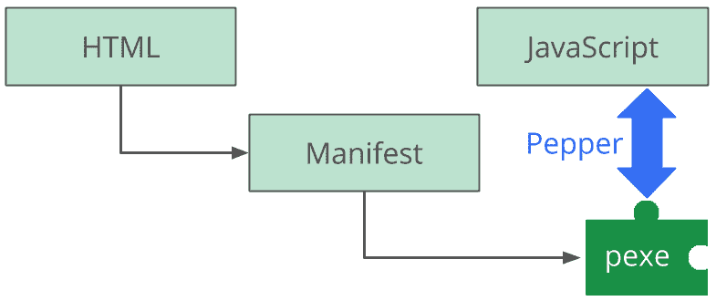
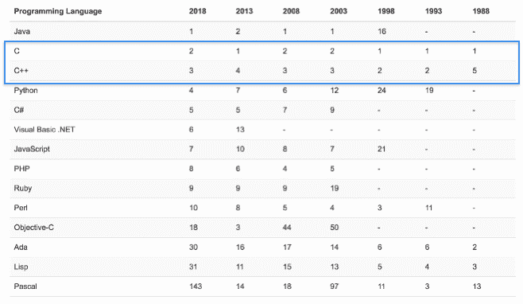

# 什么是网络组装？

**WebAssembly** ( **Wasm** )代表了 web 平台的重要垫脚石。使开发人员能够在没有插件或浏览器锁定的情况下在网络上运行编译代码带来了许多新的机会。对于什么是网络组装存在一些困惑，对于它的持久力也存在一些怀疑。

在本章中，我们将讨论 WebAssembly 是如何产生的，WebAssembly 相对于官方定义是什么，以及它包含的技术。将涵盖潜在的用例、支持的语言和限制，以及在哪里可以找到其他信息。

本章的目标是理解以下内容:

*   引领网络组装的技术
*   什么是 WebAssembly 以及它的一些潜在用例
*   WebAssembly 可以使用哪些编程语言
*   网络组装目前的局限性
*   WebAssembly 如何与 Emscripten 和 asm.js 相关联

# 网络组装之路

至少可以说，网络开发有一段有趣的历史。已经进行了几次(失败的)尝试来扩展平台以支持不同的语言。诸如插件等笨拙的解决方案经不起时间的考验，将用户限制在一个浏览器内是灾难的根源。

WebAssembly 是作为一个优雅的解决方案开发的，这个问题从浏览器第一次能够执行代码时就已经存在了:*如果你想为 web 开发，你必须使用 JavaScript* 。幸运的是，使用 JavaScript 没有 2000 年代早期的负面含义，但作为一种编程语言，它仍然有一定的局限性。在本节中，我们将讨论导致网络组装的技术，以更好地理解为什么需要这项新技术。

# JavaScript 的演变

1995 年，仅仅 10 天，Brendan Eich 就创建了 JavaScript。最初被程序员视为*玩具*语言，它主要用于让按钮闪烁或横幅出现在网页上。在过去的十年里，JavaScript 已经从一个玩具发展成为一个拥有强大功能和大量追随者的平台。

2008 年浏览器市场的激烈竞争导致了**适时** ( **JIT** )编译器的加入，使得 JavaScript 的执行速度提升了 10 倍。Node.js 于 2009 年首次亮相，代表了 web 开发的范式转变。Ryan Dahl 结合了谷歌的 V8 JavaScript 引擎、事件循环和低级 I/O API，构建了一个允许在服务器端和客户端使用 JavaScript 的平台。Node.js 导致了`npm`，一个允许开发在 Node.js 生态系统中使用的库的包管理器。截至本文撰写之时，有超过 600，000 个软件包可供使用，每天增加数百个:


Package count growth on npm since 2012, taken from Modulecounts

增长的不仅仅是 Node.js 生态系统；JavaScript 本身也在积极开发中。ECMA **技术委员会 39** ( **TC39** )规定了 JavaScript 的标准，并监督新语言特性的添加，通过社区驱动的提案流程，每年发布*JavaScript 更新。凭借其丰富的库和工具、对语言的不断改进以及拥有最大的程序员社区之一，JavaScript 已经成为一股不可忽视的力量。*

但是这种语言确实有一些缺点:

*   直到最近，JavaScript 还只包含 64 位浮点数。这可能会导致数量非常大或非常小的问题。`BigInt`，一个可以缓解其中一些问题的新数值原语，正在被添加到 ECMAScript 规范中，但是它可能需要一段时间才能在浏览器中得到完全支持。
*   JavaScript 是弱类型的，这增加了它的灵活性，但是会导致混乱和错误。它本质上给了你足够的绳子来上吊。
*   尽管浏览器厂商尽了最大努力，JavaScript 的性能还是不如编译语言。
*   如果开发人员想要创建一个 web 应用，他们需要学习 JavaScript——不管他们喜不喜欢。

为了避免不得不写几行以上的 JavaScript，一些开发人员构建了**transfilers**来将其他语言转换为 JavaScript。Transpilers(或源到源编译器)是将一种编程语言的源代码转换为另一种编程语言的等效源代码的编译器类型。TypeScript 是一种流行的前端 JavaScript 开发工具，它将 TypeScript 转换为针对浏览器或 Node.js 的有效 JavaScript。选择任何编程语言，都很有可能有人为其创建了一个 JavaScript transpiler。例如，如果您更喜欢编写 Python，那么您可以使用大约 15 种不同的工具来生成 JavaScript。然而，最终它仍然是 JavaScript，所以你仍然受制于这种语言的特性。

随着 web 发展成为构建和分发应用的有效平台，越来越多复杂和资源密集型的应用被创建出来。为了满足这些应用的需求，浏览器供应商开始研究新技术，以便在不中断 web 开发正常进程的情况下集成到他们的软件中。分别是 Chrome 和 Firefox 的创作者谷歌和 Mozilla，为了实现这个目标，走了两条不同的道路，最终创建了 WebAssembly。

# 谷歌和本地客户端

谷歌开发了**原生客户端** ( **氯化钠**)，目的是在网络浏览器中安全运行原生代码。可执行代码将在**沙箱**中运行，并提供本机代码执行的性能优势。

In the context of software development, a sandbox is an environment that prevents executable code from interacting with other parts of your system. It is intended to prevent the spread of malicious code and place restrictions on what software can do.

氯化钠与特定的体系结构相关联，而**便携式本地客户端** ( **PNaCl** )是氯化钠的独立于体系结构的版本，可以在任何平台上运行。这项技术包括两个要素:

*   可以将 C/C++代码转换成氯化钠模块的工具链
*   运行时组件，即嵌入浏览器中允许执行氯化钠模块的组件:


The Native Client toolchains and their outputs

NaCl 的特定于架构的可执行文件(`nexe`)仅限于从谷歌 Chrome Web Store 安装的应用和扩展，但 PNaCl 可执行文件(`pexe`)可以在网络上自由分发并嵌入到 Web 应用中。通过创建氯化钠模块的开源应用编程接口 Pepper 及其相应的插件应用编程接口(PPAPI)，可移植性成为可能。Pepper 支持氯化钠模块和宿主浏览器之间的通信，并允许以安全和可移植的方式访问系统级功能。通过包含一个清单文件和一个带有相应的 HTML、CSS 和 JavaScript 的编译模块(`pexe`)，可以很容易地分发应用:



Pepper's role in a Native Client application

氯化钠为克服网络的性能限制提供了有希望的机会，但它也有一些缺点。尽管 Chrome 内置了对 PNaCl 可执行文件和 Pepper 的支持，但其他主要浏览器没有。该技术的批评者对应用的黑盒性质以及潜在的安全风险和复杂性提出了质疑。

Mozilla 专注于通过`asm.js`提高 JavaScript 的性能。由于其应用编程接口规范的不完整和有限的文档，他们不会在火狐中添加对胡椒的支持。最终，氯化钠在 2017 年 5 月被否决，转而支持网络组装。

# Mozilla 和 asm.js

Mozilla 于 2013 年首次亮相`asm.js`，并为开发人员提供了一种将他们的 C 和 C++源代码翻译成 JavaScript 的方法。`asm.js`的官方规范将其定义为 JavaScript 的一个严格子集，可以作为编译器的一种低级、高效的目标语言。它仍然是有效的 JavaScript，但是语言特性仅限于那些可以提前 ( **AOT** )优化的语言。AOT 是一种技术，浏览器的 JavaScript 引擎通过将代码编译成本机代码来更有效地执行代码。`asm.js`通过 100%的类型一致性和手动内存管理实现了这些性能提升。

使用像 Emscripten 这样的工具，C/C++代码可以被编译到`asm.js`，并使用与普通 JavaScript 相同的方法轻松分发。要访问`asm.js`模块中的函数，需要**链接**，这涉及到调用其函数来获取模块导出的对象。

`asm.js`非常灵活，但是，与模块的某些交互会导致性能下降。例如，如果一个`asm.js`模块被授予访问一个未通过动态或静态验证的自定义 JavaScript 函数的权限，那么代码就不能利用 AOT，只能求助于解释器:


The asm.js AOT compilation workflow

`asm.js`不仅仅是垫脚石。它构成了网络组装的**最低可行产品** ( **最有价值产品**)的基础。官方网络组装网站在标题为*网络组装高级目标*的部分明确提到`asm.js`。

那么，当你可以使用`asm.js`的时候，为什么还要创建网络组装呢？除了潜在的性能损失之外，`asm.js`模块是一个文本文件，在进行任何编译之前必须通过网络传输。WebAssembly 模块采用二进制格式，由于它的尺寸较小，因此传输效率更高。

WebAssembly 模块使用基于承诺的实例化方法，该方法利用了现代 JavaScript 并消除了对任何*的需求。这个加载了*T2 了吗？代码。

# 网络组装诞生了

**万维网联盟** ( **W3C** )是一个旨在开发网络标准的国际社区，于 2015 年 4 月成立了网络组装工作组，以标准化网络组装并监督规范和提案流程。此后，*核心规范*以及对应的 *JavaScript API* 、 *Web API* 相继发布。浏览器中 WebAssembly 支持的最初实现是基于`asm.js`的特性集。WebAssembly 的二进制格式和相应的`.wasm`文件将`asm.js`输出的方面与 PNaCl 的分布式可执行文件的概念相结合。

那么，在氯化钠失败的地方，网络组装将如何成功？据 Axel Rauschmayer 博士介绍，有三个原因在[详细说明:](http://2ality.com/2015/06/web-assembly.html#what-is-different-this-time)

"First, this is a collaborative effort, no single company goes it alone. At the moment, the following projects are involved: Firefox, Chromium, Edge and WebKit.

Second, the interoperability with the web platform and JavaScript is excellent. Using WebAssembly code from JavaScript will be as simple as importing a module.

Third, this is not about replacing JavaScript engines, it is more about adding a new feature to them. That greatly reduces the amount of work to implement WebAssembly and should help with getting the support of the web development community."

- Dr. Axel Rauschmayer

# 什么是 WebAssembly，我可以在哪里使用它？

WebAssembly 在官方网站上有一个简洁的描述性定义，但这只是拼图的一部分。还有其他几个组件属于网络组装的范畴。了解每个组件所扮演的角色将使您更好地了解整个技术。在本节中，我们将提供 WebAssembly 定义的详细分解，并描述潜在的用例。

# 官方定义

官网([https://webassembly.org](https://webassembly.org))给出了这个定义:

Wasm is a binary instruction format for a stack-based virtual machine. Wasm is designed as a portable target for compilation of high-level languages like C/C++/Rust, enabling deployment on the web for client and server applications.

让我们把这个定义分解成几个部分来增加一些说明。

# 二进制指令格式

WebAssembly 实际上包含几个元素——二进制格式和文本格式，它们记录在*核心规范*中，对应的 API(JavaScript 和 web)和编译目标。二进制和文本格式都以**抽象语法**的形式映射到一个公共结构。为了更好地理解抽象语法，可以在**抽象语法树** ( **AST** )的上下文中进行解释。AST 是编程语言源代码结构的树形表示。ESLint 等工具使用 JavaScript 的 AST 来查找林挺错误。以下示例包含一个函数和相应的 JavaScript AST(摘自[https://astexplorer.net](https://astexplorer.net))。

一个简单的 JavaScript 函数如下:

```cpp
function doStuff(thingToDo) {
  console.log(thingToDo);
}
```

相应的 AST 如下:

```cpp
{
  "type": "Program",
  "start": 0,
  "end": 57,
  "body": [
    {
      "type": "FunctionDeclaration",
      "start": 9,
      "end": 16,
      "id": {
        "type": "Identifier",
        "start": 17,
        "end": 26,
        "name": "doStuff"
      },
      "generator": false,
      "expression": false,
      "params": [
        {
          "type": "Identifier",
          "start": 28,
          "end": 57,
          "name": "thingToDo"
        }
      ],
      "body": {
        "type": "BlockStatement",
        "start": 32,
        "end": 55,
        "body": [
          {
            "type": "ExpressionStatement",
            "start": 32,
            "end": 55,
            "expression": {
              "type": "CallExpression",
              "start": 32,
              "end": 54,
              "callee": {
                "type": "MemberExpression",
                "start": 32,
                "end": 43,
                "object": {
                  "type": "Identifier",
                  "start": 32,
                  "end": 39,
                  "name": "console"
                },
                "property": {
                  "type": "Identifier",
                  "start": 40,
                  "end": 43,
                  "name": "log"
                },
                "computed": false
              },
              "arguments": [
                {
                  "type": "Identifier",
                  "start": 44,
                  "end": 53,
                  "name": "thingToDo"
                }
              ]
            }
          }
        ]
      }
    }
  ],
  "sourceType": "module"
}
```

AST 可能很冗长，但它在描述程序组件方面做得很好。在 AST 中表示源代码使验证和编译变得简单而高效。文本格式的 WebAssembly 代码被序列化为 AST 并编译为二进制格式(作为`.wasm`文件)，由网页获取、加载和使用。当模块被加载时，浏览器的 JavaScript 引擎利用**解码栈**将`.wasm`文件解码成 AST，执行类型检查，并解释它以执行功能。WebAssembly 最初是一个 AST 的二进制指令格式。由于验证返回`void`的 Wasm 表达式的性能影响，二进制指令格式被更新为以**堆栈机器**为目标。

堆栈机器由两个元素组成:堆栈和指令。栈是一个数据结构，有两个操作:*推*和*弹出*。项目被推到堆栈上，随后从堆栈中弹出，顺序为**后进先出** ( **后进先出**)。堆栈还包括一个**指针**，它指向堆栈顶部的项目。指令表示对堆栈中的项目执行的操作。例如，`ADD`指令可能会弹出堆栈中的前两个项目(值`100`和`10`，并将带有总和的单个项目推回到堆栈中(值`110`):


A simple stack machine

WebAssembly 的堆栈机器以同样的方式运行。程序计数器(指针)保持代码中的执行位置，虚拟控制堆栈在`blocks`和`if`结构被输入(推入)和退出(弹出)时跟踪它们。这些指令的执行不涉及 AST。因此，定义的**二进制指令格式**部分指的是浏览器中解码栈可读格式的指令的二进制表示。

# 编译的可移植目标

WebAssembly 从一开始就考虑到了可移植性。在这种情况下，可移植性意味着 WebAssembly 的二进制格式可以在网络内外的各种操作系统和指令集架构上高效执行。网络组装规范定义了执行环境中的可移植性。WebAssembly 旨在满足某些特性的环境中高效运行，其中大多数特性与内存相关。WebAssembly 的可移植性也可以归因于缺乏围绕核心技术的特定 API。相反，它定义了一个`import`机制，其中可用导入集由主机环境定义。

简而言之，这意味着 WebAssembly 不依赖于特定的环境，比如 web 或桌面。网络组装工作组已经定义了一个*网络应用编程接口*，但这与*核心规范*是分开的。*网络应用编程接口*迎合网络组装，而不是相反。

定义的**编译**方面表明，从用高级语言编写的源代码开始，WebAssembly 将很容易编译成其二进制格式。MVP 侧重于两种语言，C 和 C++，但是考虑到 Rust 与 C++的相似性，也可以使用它。编译将通过使用 Clang/LLVM 后端来实现，尽管我们将在本书中使用 Emscripten 来生成我们的 Wasm 模块。计划是最终增加对其他语言和编译器的支持(比如 GCC)，但是 MVP 的重点是 LLVM。

# 核心规范

官方定义对整体技术给出了一些高层次的洞察，但为了完整性，值得深入挖掘一下。WebAssembly 的*核心规范*是官方文档，如果你想在非常细粒度的层面上理解 WebAssembly，可以参考。如果您有兴趣了解关于执行环境的运行时结构的特征，请查看第 4 部分:*执行*。我们在这里不讨论这个问题，但是理解*核心规范*的适用范围将有助于建立网络组装的完整定义。

# 语言概念

*核心规范*声明网络汇编编码了一种低级的、类似汇编的编程语言。该规范定义了这种语言的结构、执行和验证，以及二进制和文本格式的细节。语言本身是围绕以下概念构建的:

*   **值**，或者更确切地说是 WebAssembly 提供的值类型
*   **在堆叠机内执行的指令**
*   **捕捉错误条件下产生的**并中止执行
*   **代码组织成的函数**，每个函数以一系列值作为参数，并返回一系列值作为结果
*   **表**，是可由执行程序选择的特定元素类型(如函数引用)的值数组
*   **线性存储器**，它是一个原始字节数组，可以用来存储和加载值
*   **模块**，包含函数、表格和线性存储器的网络汇编二进制(`.wasm`文件)
*   **嵌入器**，一种可以在主机环境中执行 WebAssembly 的机制，例如 web 浏览器

函数、表、内存和模块与 *JavaScript API* 直接相关，需要注意。这些概念描述了语言本身的底层结构，以及如何编写或编码 WebAssembly。关于用法，理解 WebAssembly 的相应语义阶段提供了该技术的完整定义:


Language concepts and their relationship

# 语义阶段

*核心规范*描述了编码模块(`.wasm`文件)在主机环境(如网络浏览器)中使用时所经历的不同阶段。规范的这一方面表示如何处理和执行输出:

*   **解码**:二进制格式转换成模块
*   **验证**:解码后的模块经过验证检查(如类型检查)，以确保模块完好且安全
*   **执行，第 1 部分:实例化**:模块实例是模块的动态表示，通过初始化**全局**、**内存**和**表**来实例化，并调用模块的`start()`功能
*   **执行，第 2 部分:调用**:从模块实例中调用导出的函数:

下图提供了语义阶段的可视化表示:


Semantic phases of module use

# JavaScript 和网络应用接口

网络组装工作组还发布了用于与 JavaScript 和网络交互的应用编程接口规范，这使它们有资格包含在网络组装技术领域中。 *JavaScript 应用编程接口*的范围仅限于 JavaScript 语言本身，并不特别受限于环境(例如，网络浏览器或 Node.js)。它定义了类、方法和对象，用于与 WebAssembly 交互并管理编译和实例化过程。*网络应用编程接口*是 *JavaScript 应用编程接口*的扩展，定义了特定于网络浏览器的功能。 *Web API* 规范目前只定义了`compileStreaming`和`instantiateStreaming`两种方法，都是简化浏览器中 Wasm 模块使用的便捷方法。这些将在[第 2 章](02.html)、*网络组件的元素——Wat、Wasm 和 JavaScript API* 中有更详细的介绍。

# 那么它会取代 JavaScript 吗？

WebAssembly 的最终目标不是取代 JavaScript，而是对其进行补充。JavaScript 丰富的生态系统和灵活性仍然使其成为网络的理想语言。WebAssembly 的 JavaScript API 使得这两种技术之间的互操作性变得相对简单。那么，您能够仅仅使用网络组装来构建一个网络应用吗？WebAssembly 的明确目标之一是可移植性，复制 JavaScript 的所有功能可能会抑制这一目标。然而，官方网站包括一个目标，即执行并与现有的网络平台很好地集成，所以只有时间才能证明。用向下编译到 WebAssembly 的语言编写整个代码库可能不太实际，但是将一些应用逻辑转移到 Wasm 模块在性能和加载时间方面可能是有益的。

# 哪里可以用？

WebAssembly 的官方网站有一个潜在用例的广泛列表。我不打算在这里一一介绍，但是有几个是对 web 平台功能的显著增强:

*   图像/视频编辑
*   比赛
*   音乐应用(流、缓存)
*   图像识别
*   实时视频增强
*   虚拟现实和增强现实

虽然这些用例中的一些在技术上可以用 JavaScript、HTML 和 CSS 来实现，但是使用 WebAssembly 可以提供显著的性能提升。提供一个二进制文件(而不是一个单独的 JavaScript 文件)可以大大减少包的大小，并且在页面加载时实例化 Wasm 模块可以加快代码的执行。

WebAssembly 不仅仅局限于浏览器。在浏览器之外，您可以使用它在移动设备上构建混合本机应用，或者对不受信任的代码执行服务器端计算。在手机应用中使用 Wasm 模块在功耗和性能方面都非常有益。

WebAssembly 还提供了如何使用它的灵活性。您可以在 WebAssembly 中编写整个代码库，尽管这在当前形式或 web 应用的上下文中可能并不实用。考虑到 WebAssembly 强大的 JavaScript API，您可以用 JavaScript/HTML 编写 UI，并使用 Wasm 模块实现不直接访问 DOM 的功能。一旦支持了额外的语言，对象就可以很容易地在 Wasm 模块和 JavaScript 代码之间传递，这将大大简化集成并提高开发人员的采用率。

# 支持哪些语言？

WebAssembly 对其 MVP 的高级目标是提供与`asm.js`大致相同的功能。这两项技术关系非常密切。C、C++和 Rust 是非常流行的支持手动内存分配的语言，这使得它们成为初始实现的理想候选。在本节中，我们将简要概述每种编程语言。

# C 和 C++

C 和 C++是已经存在了 30 多年的低级编程语言。c 是过程化的，本质上不支持面向对象的编程概念，例如类和继承，但是它快速、可移植，并且被广泛使用。

C++是为了填补 C 语言中的空白而构建的，它增加了操作符重载和改进的类型检查等功能。这两种语言始终位列最受欢迎的 10 种编程语言，这使得它们非常适合 MVP:



TIOBE Very Long Term History of the top 10 programming languages

C 和 C++支持也被烘焙到 Emscripten 中，因此除了简化编译过程之外，它还允许您利用 WebAssembly 的全部功能。也可以使用 LLVM 将 C/C++代码编译成`.wasm`文件。LLVM 是模块化和可重用的编译器和工具链技术的集合。简而言之，它是一个框架，简化了从源代码到机器代码的编译过程的配置。如果您制作了自己的编程语言，并希望构建一个编译器，LLVM 有工具来简化这个过程。我将在[第 10 章](10.html)、*高级工具和即将推出的功能*中介绍如何使用 LLVM 将 C/C++编译成`.wasm`文件。

下面的代码片段演示了如何使用 C++将`Hello World!`打印到控制台:

```cpp
#include <iostream>

int main() {
    std::cout << "Hello, World!\n";
    return 0;
}
```

# 锈

C 和 C++本来是用于 WebAssembly 的主要语言，但是 Rust 是一个非常合适的替代品。Rust 是一种系统编程语言，在语法上类似于 C++。它在设计时考虑了内存安全，但仍然保留了 C 和 C++的性能优势。Rust 的编译器目前每夜的构建都可以从 Rust 源代码生成`.wasm`文件，所以如果你比较喜欢 Rust 并且熟悉 C++，那么对于本书的大部分例子应该都可以使用 Rust。

以下代码片段演示了如何使用 Rust 将`Hello World!`打印到控制台:

```cpp
fn main() {
    println!("Hello World!");
}
```

# 其他语言

存在各种工具来支持 WebAssembly 与其他一些流行的编程语言一起使用，尽管它们大多是实验性的:

*   C#通过 Blazor
*   把 WebIDL 带走
*   Java 通过 TeaVM 或字节码
*   Kotlin 通过 TeaVM
*   通过程序集脚本键入脚本

技术上也可以将一种语言转换成 C 语言，然后编译成 Wasm 模块，但是编译的成功取决于转换程序的输出。更有可能的是，您必须对代码进行重大更改才能让它工作。

# 有什么局限性？

诚然，WebAssembly 并非没有局限性。新特性正在积极开发，技术也在不断发展，但是 MVP 功能只代表了网络组装的一部分功能。在本节中，我们将介绍其中的一些限制，以及它们如何影响开发过程。

# 没有垃圾收集

WebAssembly 支持平面线性内存，这本身并不是一个限制，但是需要对如何显式分配内存来执行代码有所了解。C 和 C++是 MVP 的逻辑选择，因为内存管理内置于语言中。一些更受欢迎的高级语言(如 Java)最初没有被包括在内的原因是由于一种叫做**垃圾收集** ( **GC** )的东西。

垃圾收集是一种自动内存管理的形式，其中被程序不再使用的对象占用的内存被自动回收。气相色谱类似于汽车上的自动变速器。熟练的工程师对其进行了大量优化，以尽可能高效地运行，但限制了驾驶员的控制能力。手动分配内存就像开一辆手动变速箱的车。它可以更好地控制速度和扭矩，但误用或缺乏经验会让你被困在一辆严重受损的汽车上。C 和 C++出色的性能和速度部分归功于内存的手动分配。

GC 语言允许您在不担心内存可用性或分配的情况下进行编程。JavaScript 是垃圾收集语言的一个例子。浏览器引擎采用一种叫做标记-清除的算法来收集不可到达的对象并释放相应的内存。对 GC 语言的支持目前正在 WebAssembly 中进行，但是很难说它将在什么时候完成。

# 没有直接的 DOM 访问

WebAssembly 无法访问 DOM，因此任何 DOM 操作都需要通过 JavaScript 或者使用 Emscripten 之类的工具间接完成。有计划增加直接引用 DOM 和其他网络应用编程接口对象的能力，但这仍处于建议阶段。DOM 操作可能会与 GC 语言齐头并进，因为它允许对象在 WebAssembly 和 JavaScript 代码之间无缝传递。

# 旧浏览器不支持

旧的浏览器没有全局`WebAssembly`对象来实例化和加载 Wasm 模块。如果找不到对象，可以使用`asm.js`进行实验性聚合填充，但是网络组装工作组目前没有计划创建一个。由于`asm.js`和 WebAssembly 密切相关，如果`WebAssembly`对象不可用，只需提供一个`asm.js`文件，仍然可以提高性能，同时考虑到向后兼容性。你可以在[https://caniuse.com/#feat=wasm](https://caniuse.com/#feat=wasm)看到目前哪些浏览器支持 WebAssembly。

# 它与 Emscripten 有什么关系？

Emscripten 是可以从 C 和 C++源代码生成`asm.js`的源到源编译器。我们将使用它作为构建工具来生成 Wasm 模块。在本节中，我们将快速回顾 Emscripten 与 WebAssembly 的关系。

# Emscripten 的角色

Emscripten 是一个 LLVM 到 JavaScript 的编译器，这意味着它接受编译器如 Clang(对于 C 和 C++)的 LLVM 位代码输出，并将其转换为 JavaScript。它不是一种特定的技术，而是共同构建、编译和运行`asm.js`的技术组合。为了生成 Wasm 模块，我们将使用**Emscripten SDK**(**EMSDK**)管理器:


Wasm module generation with the EMSDK

# EMSDK 和 Binaryen

在[第 4 章](04.html)、*安装所需依赖项*中，我们将安装 EMSDK，并使用它来管理将 C 和 C++编译为 Wasm 模块所需的依赖项。Emscripten 使用 Binaryen 的`asm2wasm`工具将 Emscripten 输出的`asm.js`编译成`.wasm`文件。Binaryen 是一个编译器和工具链基础设施库，其中包括将各种格式编译成 WebAssembly 模块的工具，反之亦然。使用 WebAssembly 并不需要了解 Binaryen 的内部工作原理，但是了解底层技术以及它们是如何协同工作的非常重要。通过将某些标志传递到 Emscripten ( `emcc`)的编译命令中，我们可以将得到的`asm.js`代码传输到 Binaryen，以输出我们的`.wasm`文件。

# 摘要

在这一章中，我们讨论了网络组装的历史，以及导致它产生的技术。提供了 WebAssembly 定义的详细概述，以便更好地理解所涉及的底层技术。

上的*核心规范*、 *JavaScript API* 和 *Web API* 作为 WebAssembly 的重要元素进行了展示，并展示了技术将如何发展。我们还回顾了潜在的用例、当前支持的语言以及支持使用不支持的语言的工具。

WebAssembly 的局限性是缺少 GC，无法直接与 DOM 通信，以及缺乏对旧浏览器的支持。这些讨论传达了新的技术，并揭示了它的一些缺点。最后，我们讨论了 Emscripten 在开发过程中的角色，以及它在 WebAssembly 开发工作流中的位置。

在 [第 2 章](02.html)*WebAssembly 的元素- Wat、Wasm* 和*JavaScript API*中，我们将深入探讨构成 Web assembly 的元素: **WebAssembly 文本格式** ( **Wat** )、二进制格式(Wasm)、JavaScript 和 Web APIs。

# 问题

1.  哪两项技术影响了 WebAssembly 的创建？
2.  什么是栈机，它与 WebAssembly 有什么关系？
3.  WebAssembly 在哪些方面补充了 JavaScript？
4.  哪三种编程语言可以编译成 Wasm 模块？
5.  LLVM 在网络组装方面扮演什么角色？
6.  网络组装的三个潜在用例是什么？
7.  DOM 访问和 GC 是如何相关的？
8.  Emscripten 用什么工具生成 Wasm 模块？

# 进一步阅读

*   官方网络组装网站:[https://webassembly.org](https://webassembly.org)
*   本地客户端技术概述:[https://developer.chrome.com/native-client/overview](https://developer.chrome.com/native-client/overview)
*   LLVM 编译器基础设施项目:[https://llvm.org](https://llvm.org)
*   关于 Emscripten:[http://kripken . github . io/Emscripten-site/docs/introduction _ Emscripten/about _ Emscripten . html](http://kripken.github.io/emscripten-site/docs/introducing_emscripten/about_emscripten.html)
*   asm.js 规范:[http://asmjs.org/spec/latest](http://asmjs.org/spec/latest)